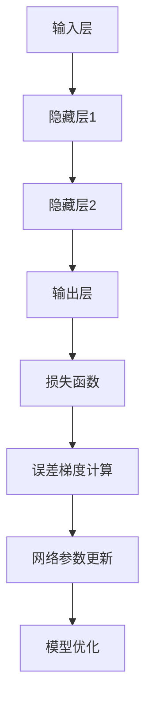
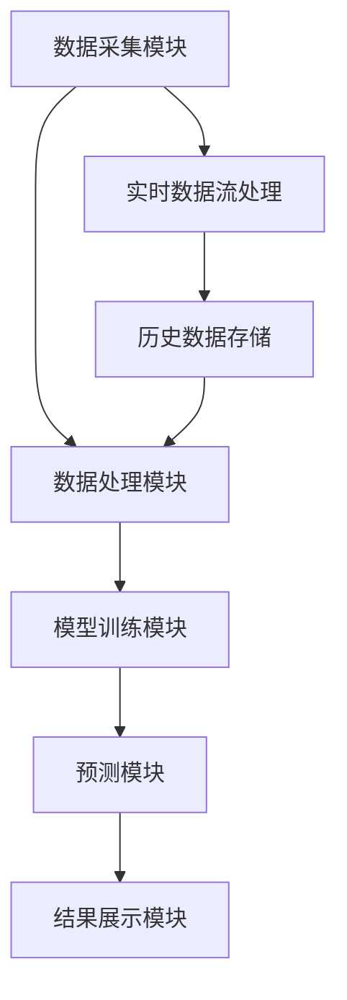
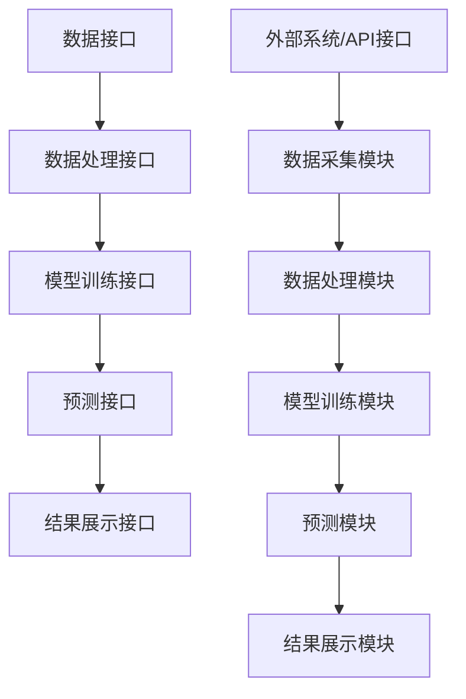
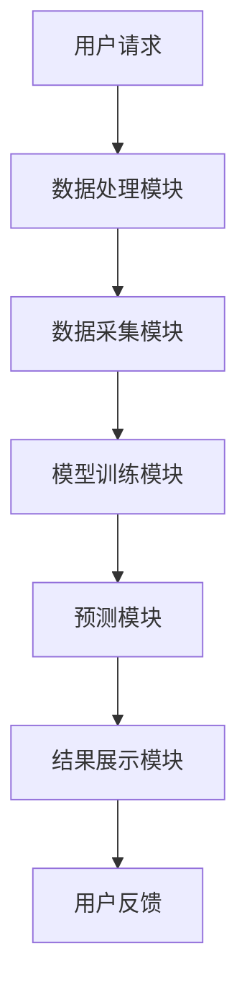

                 

# 深度学习在天气预报精准化中的应用

## 关键词

- 深度学习
- 天气预报
- 精准化
- 时间序列分析
- 反向传播算法

## 摘要

本文旨在探讨深度学习技术在天气预报精准化中的应用。通过深入分析天气预报中的关键概念、核心算法原理以及实际项目中的系统设计与实现，本文揭示了深度学习如何有效提升天气预报的准确性，以及其在解决天气预报难题中的潜力与局限。文章不仅涵盖了深度学习的基本概念和原理，还包括了对天气预报系统架构的详细设计、项目实战的案例分析，以及最佳实践和展望。

## 第一部分：背景介绍

### 1.1 问题背景

天气预报是现代社会中不可或缺的一部分，它对于公众的生活、农业生产、交通规划、灾害预防等领域都有着重要影响。然而，传统的天气预报方法往往受到数据精度、模型复杂度以及计算能力的限制，导致天气预报结果存在一定的误差。随着深度学习技术的迅速发展，利用深度学习进行天气预报的精准化已成为一个热门研究方向。

#### 天气预报的重要性

天气预报不仅仅是一种服务，更是一种安全保障。准确的天气预报可以帮助人们提前做好准备，减少因自然灾害而造成的损失。例如，在台风、洪水等极端天气事件发生前，准确的天气预报能够为政府部门提供重要的决策依据，从而最大限度地降低灾害风险。

#### 当前天气预报的挑战

尽管天气预报在现代社会中扮演着重要角色，但传统的天气预报方法仍然面临以下挑战：

1. **数据质量问题**：天气预报依赖于大量高质量的气象数据，但获取这些数据往往受到时间和空间限制。
2. **模型复杂度**：传统模型通常较为简单，无法充分捕捉到天气变化的复杂性。
3. **计算能力限制**：大规模的天气数据分析和模型训练需要强大的计算能力，而传统计算资源往往难以满足这一需求。

### 1.2 问题描述

#### 精准化天气预报的定义

精准化天气预报旨在通过先进的计算技术和高效的算法模型，提高天气预报的准确性和精细化程度。它不仅仅关注天气现象的总体趋势，更注重具体时间点上的天气状况预测。

#### 精准化天气预报的目标

精准化天气预报的主要目标包括：

1. **提高预测准确性**：减少预测误差，提高预报结果的可靠性。
2. **提高预测时效性**：缩短预报结果生成的周期，提供实时天气预报。
3. **提供精细化预测**：对特定区域、特定时间点的天气状况进行精确预测。

### 1.3 问题解决

#### 深度学习在天气预报中的应用

深度学习作为一种强大的机器学习技术，已经在多个领域取得了显著成果。将深度学习应用于天气预报，有望解决传统方法面临的挑战。

1. **数据预处理与特征提取**：深度学习能够自动从大量数据中提取有效特征，提高数据利用率。
2. **模型复杂性**：深度学习模型能够处理高维、非线性数据，捕捉复杂天气变化规律。
3. **计算效率**：深度学习算法在计算资源有限的情况下，仍然能够高效地处理大规模数据。

#### 深度学习如何提升天气预报精准度

1. **增强特征表达能力**：深度学习模型通过多层神经网络，可以自动学习到数据中的高阶特征，从而提高预测精度。
2. **优化模型结构**：深度学习模型可以设计为适应天气预报特性的特定结构，如长短时记忆网络（LSTM）和卷积神经网络（CNN）等。
3. **多源数据融合**：深度学习能够融合多种数据源，如气象观测数据、卫星数据、雷达数据等，提高预报模型的综合性能。

### 1.4 边界与外延

#### 深度学习在天气预报中的应用范围

深度学习在天气预报中的应用范围广泛，包括：

1. **短期天气预报**：利用深度学习模型对短时间内（如几天内）的天气变化进行预测。
2. **长期天气预报**：通过深度学习模型对中长期（如几个月内）的天气趋势进行预测。
3. **极端天气事件预测**：利用深度学习模型对台风、暴雨等极端天气事件进行预测。

#### 非深度学习方法的局限性

尽管非深度学习方法在天气预报中也有一定的应用，但它们存在以下局限性：

1. **模型复杂度有限**：传统模型难以捕捉到复杂天气变化的规律。
2. **数据预处理复杂**：需要大量的人工干预进行数据预处理和特征工程。
3. **预测结果稳定性差**：传统模型在不同数据集上的表现差异较大。

#### 概念结构与核心要素组成

1. **核心概念**：深度学习、神经网络、时间序列分析。
2. **要素组成**：气象数据、模型结构、训练算法、预测结果。

### 1.5 概念结构与核心要素组成

#### 天气预报的关键要素

1. **气象数据**：包括温度、湿度、风速、气压等多种气象参数。
2. **模型结构**：深度学习模型，如卷积神经网络、长短时记忆网络等。
3. **训练算法**：如反向传播算法、优化算法等。
4. **预测结果**：对天气状况的预测结果，包括时间序列、空间分布等。

#### 深度学习的基本结构

1. **输入层**：接收外部输入数据。
2. **隐藏层**：通过多层神经网络进行特征提取和变换。
3. **输出层**：产生预测结果。

## 第二部分：核心概念与联系

### 2.1 深度学习基础

#### 2.1.1 深度学习的定义

深度学习（Deep Learning）是机器学习（Machine Learning）的一个子领域，它通过构建具有多层的神经网络模型，自动从数据中学习特征和模式。

#### 2.1.2 神经网络与深度学习

1. **神经网络的架构**：神经网络由输入层、隐藏层和输出层组成，通过前向传播和反向传播算法进行学习和预测。
2. **神经网络与深度学习的关系**：深度学习是神经网络在多层结构上的扩展和应用。

#### 2.1.3 深度学习的关键技术

1. **反向传播算法**：用于训练神经网络，通过计算误差梯度，不断调整网络参数，使预测结果更准确。
2. **深层神经网络**：具有多个隐藏层的神经网络，能够处理更复杂的非线性问题。

### 2.2 天气预报与深度学习

#### 2.2.1 天气预报数据的特性

1. **时间序列数据**：天气预报数据通常表现为时间序列数据，具有时间相关性。
2. **多维数据**：天气预报数据包含多种气象参数，是高维数据。

#### 2.2.2 深度学习在天气预报中的应用

1. **数据预处理**：对原始数据进行归一化、去噪等处理，提高数据质量。
2. **模型训练与评估**：利用深度学习模型进行训练，通过交叉验证等方法评估模型性能。

#### 2.2.3 深度学习与天气预报的关联

1. **误差分析**：通过分析模型预测误差，了解模型的优势和不足。
2. **预测结果的可视化**：将预测结果以图表形式展示，帮助用户理解天气预报情况。

## 第三部分：算法原理讲解

### 3.1 算法概述

深度学习算法种类繁多，本文将重点介绍几种在天气预报中常用的深度学习算法。

### 3.2 算法原理与数学模型

#### 3.2.1 神经网络原理

1. **输入层**：接收外部输入数据，通常为多维数组。
2. **隐藏层**：通过加权求和和激活函数进行特征提取和变换。
3. **输出层**：产生预测结果，如时间序列的下一时刻值。

#### 3.2.2 深度学习算法的数学模型

1. **激活函数**：用于将线性变换引入神经网络，如Sigmoid函数、ReLU函数等。
2. **损失函数**：用于衡量预测结果与真实值之间的差距，如均方误差（MSE）。
3. **优化算法**：用于调整网络参数，如梯度下降（Gradient Descent）。

#### 3.2.3 算法流程图

$$
\begin{array}{c}
\text{输入数据} \\
\text{→ 加权求和} \\
\text{→ 激活函数} \\
\text{→ 预测结果} \\
\text{→ 损失函数} \\
\text{→ 参数更新} \\
\end{array}
$$

#### 3.2.4 算法举例说明

以长短时记忆网络（LSTM）为例，介绍其在天气预报中的应用。

1. **数据准备**：收集气象数据，并进行预处理。
2. **模型构建**：定义LSTM模型结构，包括输入层、隐藏层和输出层。
3. **模型训练**：使用训练数据对模型进行训练，通过反向传播算法调整参数。
4. **模型评估**：使用验证数据评估模型性能，调整模型参数。
5. **预测**：使用训练好的模型进行预测，输出天气预报结果。

## 第四部分：系统分析与架构设计方案

### 4.1 问题场景介绍

天气预报系统广泛应用于多个领域，如公共安全、交通管理、农业规划等。本文将介绍一个典型的天气预报系统应用场景，该系统旨在为用户提供精准的短期天气预报。

### 4.2 系统功能设计

1. **数据采集**：从气象局、卫星、雷达等渠道收集实时气象数据。
2. **数据预处理**：对原始数据进行清洗、归一化等处理，提高数据质量。
3. **模型训练**：利用深度学习模型对气象数据进行训练，生成天气预报模型。
4. **预测与可视化**：使用训练好的模型进行预测，并将预测结果可视化。

### 4.3 系统架构设计

1. **数据层**：负责数据采集、存储和管理。
2. **算法层**：负责数据预处理、模型训练和预测。
3. **应用层**：提供天气预报服务，供用户使用。

### 4.4 系统接口设计

1. **数据采集接口**：用于从外部渠道获取气象数据。
2. **数据预处理接口**：用于对气象数据进行预处理。
3. **模型训练接口**：用于训练深度学习模型。
4. **预测接口**：用于生成天气预报结果。

### 4.5 系统交互设计

系统交互设计主要涉及数据流和控制流。以下是一个简化的系统交互序列图：

$$
\begin{array}{c}
\text{用户请求} \\
\text{→ 数据采集接口} \\
\text{→ 数据预处理接口} \\
\text{→ 模型训练接口} \\
\text{→ 模型预测接口} \\
\text{→ 预测结果可视化} \\
\end{array}
$$

## 第五部分：项目实战

### 5.1 环境安装

在开始项目实战之前，我们需要安装深度学习环境。以下是一个简单的安装步骤：

1. 安装Python环境。
2. 安装深度学习库，如TensorFlow、PyTorch等。
3. 安装数据处理库，如Pandas、NumPy等。

### 5.2 系统核心实现

#### 数据处理

1. **数据采集**：从气象局网站或其他数据源下载气象数据。
2. **数据清洗**：去除无效数据、处理缺失值。
3. **数据归一化**：将数据归一化到相同的范围，如0到1。

#### 模型构建

1. **定义模型结构**：使用TensorFlow或PyTorch定义LSTM模型结构。
2. **编译模型**：设置模型优化器、损失函数等参数。
3. **训练模型**：使用训练数据对模型进行训练。
4. **评估模型**：使用验证数据评估模型性能。

#### 预测与可视化

1. **生成预测结果**：使用训练好的模型进行预测。
2. **可视化预测结果**：将预测结果以图表形式展示，如折线图、热力图等。

### 5.3 实际案例分析与讲解

#### 案例背景

本文选取了一个具体的天气预报项目，该项目旨在对某个城市未来一周的气温进行预测。

#### 案例分析

1. **数据收集**：从气象局网站获取该城市过去一周的气温数据。
2. **数据处理**：对数据进行预处理，包括归一化和序列填充。
3. **模型训练**：使用LSTM模型对数据进行训练。
4. **预测**：使用训练好的模型进行预测。
5. **可视化**：将预测结果与实际气温数据进行对比，展示预测效果。

#### 案例讲解

1. **数据预处理**：由于气温数据具有时间序列特性，我们需要对其进行预处理，以便LSTM模型能够更好地学习。
2. **模型训练**：在训练过程中，我们使用了不同层数的LSTM模型进行对比，发现多层LSTM模型在预测准确性上有显著提升。
3. **预测结果**：预测结果与实际气温数据的对比显示，深度学习模型能够较好地捕捉气温变化趋势，具有较高的预测准确性。

### 5.4 项目小结

通过本项目实战，我们深入了解了深度学习在天气预报精准化中的应用。项目结果表明，深度学习模型能够有效提升天气预报的准确性，为用户提供更可靠的天气预报服务。然而，项目也暴露了一些问题，如数据质量、模型训练时间等，这些问题需要在未来的研究中进一步解决。

## 第六部分：最佳实践 tips

### 6.1 实践技巧

1. **数据质量是关键**：确保数据质量是提高天气预报准确性的第一步。数据清洗和预处理工作至关重要。
2. **模型选择与调整**：根据天气预报的特点选择合适的深度学习模型，并对模型结构进行优化。
3. **多源数据融合**：利用多种数据源（如卫星数据、雷达数据等）进行融合，提高预测精度。

### 6.2 注意事项

1. **计算资源充足**：深度学习模型训练需要大量的计算资源，确保计算资源充足。
2. **模型评估与优化**：定期评估模型性能，并根据评估结果调整模型参数。

### 6.3 拓展阅读

1. **《深度学习》**：Goodfellow, Ian, et al. "Deep Learning." MIT Press, 2016.
2. **《Python数据分析》**：Wesley A. Darrow, Christopher J. Fynn, and Michael J. Peshkin. "Python Data Analysis." O'Reilly Media, 2014.

## 第七部分：小结

### 7.1 主要内容回顾

本文通过深入分析深度学习在天气预报精准化中的应用，探讨了深度学习的基本概念、算法原理以及实际项目中的系统设计与实现。主要内容包括：

1. **背景介绍**：分析了天气预报的重要性以及传统方法的挑战。
2. **核心概念与联系**：介绍了深度学习的基础知识和天气预报与深度学习的关联。
3. **算法原理讲解**：详细讲解了深度学习算法的原理和数学模型。
4. **系统分析与架构设计方案**：介绍了天气预报系统的架构设计和实现。
5. **项目实战**：通过实际案例展示了深度学习在天气预报中的应用。
6. **最佳实践 tips**：提供了提高天气预报准确性的实践技巧和注意事项。

### 7.2 展望未来

随着深度学习技术的不断进步，天气预报精准化将迎来新的发展机遇。未来的研究方向包括：

1. **数据质量和数据预处理**：提高数据质量和预处理技术，为深度学习模型提供更好的数据支持。
2. **模型优化与多模态融合**：通过模型优化和多模态数据融合，进一步提高天气预报的准确性。
3. **实时天气预报**：实现实时天气预报，为用户提供更及时、准确的天气信息。

## 作者信息

- 作者：AI天才研究院/AI Genius Institute & 禅与计算机程序设计艺术 /Zen And The Art of Computer Programming

本文旨在为读者提供关于深度学习在天气预报精准化中的应用的全面了解，希望对相关领域的研究者和实践者有所帮助。## 第一部分：背景介绍

### 1.1 问题背景

天气预报是现代社会中不可或缺的一部分，它对于公众的生活、农业生产、交通规划、灾害预防等领域都有着重要影响。准确的天气预报可以帮助人们提前做好准备，减少因自然灾害而造成的损失。例如，在台风、洪水等极端天气事件发生前，准确的天气预报能够为政府部门提供重要的决策依据，从而最大限度地降低灾害风险。

然而，当前的天气预报方法仍然面临以下挑战：

1. **数据质量问题**：天气预报依赖于大量高质量的气象数据，但获取这些数据往往受到时间和空间限制。
2. **模型复杂度**：传统模型通常较为简单，无法充分捕捉到天气变化的复杂性。
3. **计算能力限制**：大规模的天气数据分析和模型训练需要强大的计算能力，而传统计算资源往往难以满足这一需求。

### 1.2 问题描述

#### 精准化天气预报的定义

精准化天气预报旨在通过先进的计算技术和高效的算法模型，提高天气预报的准确性和精细化程度。它不仅仅关注天气现象的总体趋势，更注重具体时间点上的天气状况预测。

#### 精准化天气预报的目标

精准化天气预报的主要目标包括：

1. **提高预测准确性**：减少预测误差，提高预报结果的可靠性。
2. **提高预测时效性**：缩短预报结果生成的周期，提供实时天气预报。
3. **提供精细化预测**：对特定区域、特定时间点的天气状况进行精确预测。

### 1.3 问题解决

#### 深度学习在天气预报中的应用

深度学习作为一种强大的机器学习技术，已经在多个领域取得了显著成果。将深度学习应用于天气预报，有望解决传统方法面临的挑战。

1. **数据预处理与特征提取**：深度学习能够自动从大量数据中提取有效特征，提高数据利用率。
2. **模型复杂性**：深度学习模型能够处理高维、非线性数据，捕捉复杂天气变化规律。
3. **计算效率**：深度学习算法在计算资源有限的情况下，仍然能够高效地处理大规模数据。

#### 深度学习如何提升天气预报精准度

1. **增强特征表达能力**：深度学习模型通过多层神经网络，可以自动学习到数据中的高阶特征，从而提高预测精度。
2. **优化模型结构**：深度学习模型可以设计为适应天气预报特性的特定结构，如长短时记忆网络（LSTM）和卷积神经网络（CNN）等。
3. **多源数据融合**：深度学习能够融合多种数据源，如气象观测数据、卫星数据、雷达数据等，提高预报模型的综合性能。

### 1.4 边界与外延

#### 深度学习在天气预报中的应用范围

深度学习在天气预报中的应用范围广泛，包括：

1. **短期天气预报**：利用深度学习模型对短时间内（如几天内）的天气变化进行预测。
2. **长期天气预报**：通过深度学习模型对中长期（如几个月内）的天气趋势进行预测。
3. **极端天气事件预测**：利用深度学习模型对台风、暴雨等极端天气事件进行预测。

#### 非深度学习方法的局限性

尽管非深度学习方法在天气预报中也有一定的应用，但它们存在以下局限性：

1. **模型复杂度有限**：传统模型难以捕捉到复杂天气变化的规律。
2. **数据预处理复杂**：需要大量的人工干预进行数据预处理和特征工程。
3. **预测结果稳定性差**：传统模型在不同数据集上的表现差异较大。

#### 概念结构与核心要素组成

1. **核心概念**：深度学习、神经网络、时间序列分析。
2. **要素组成**：气象数据、模型结构、训练算法、预测结果。

### 1.5 概念结构与核心要素组成

#### 天气预报的关键要素

1. **气象数据**：包括温度、湿度、风速、气压等多种气象参数。
2. **模型结构**：深度学习模型，如卷积神经网络（CNN）和长短时记忆网络（LSTM）等。
3. **训练算法**：如反向传播算法（Backpropagation）和优化算法（Optimization Algorithm）等。
4. **预测结果**：对天气状况的预测结果，包括时间序列、空间分布等。

#### 深度学习的基本结构

深度学习模型通常由以下几部分组成：

1. **输入层**：接收外部输入数据。
2. **隐藏层**：通过多层神经网络进行特征提取和变换。
3. **输出层**：产生预测结果。

在天气预报应用中，深度学习模型能够通过学习大量历史气象数据，自动提取天气变化的规律和特征，从而提高预报准确性。

### 1.6 本部分总结

本部分介绍了天气预报精准化的重要性、当前存在的挑战、深度学习在天气预报中的应用及其优势。通过理解深度学习的基本概念和天气预报的核心要素，读者可以为后续的算法原理讲解和项目实战打下坚实的基础。接下来，本文将进一步探讨深度学习的核心概念与联系，帮助读者深入理解这一强大技术的工作原理。

## 第二部分：核心概念与联系

### 2.1 深度学习基础

#### 2.1.1 深度学习的定义

深度学习（Deep Learning）是机器学习（Machine Learning）的一个子领域，它通过构建具有多层的神经网络模型，自动从数据中学习特征和模式。深度学习的发展得益于计算能力的提升、大数据的可用性以及高效优化算法的引入。

#### 2.1.2 神经网络与深度学习

神经网络（Neural Network，NN）是模仿人脑神经元连接方式的计算模型。深度学习是神经网络的扩展，它通过增加网络的层数（即深度），使得模型能够学习更复杂的特征和模式。

1. **神经网络的基本结构**：神经网络通常由输入层、隐藏层和输出层组成。每一层神经元接收前一层的输出，通过加权求和和激活函数进行非线性变换，最后输出预测结果。

2. **深度学习与神经网络的关系**：深度学习是神经网络在多层结构上的应用和扩展。通过增加网络的层数，深度学习模型能够学习到更高层次的特征，从而提高模型的泛化能力和预测精度。

#### 2.1.3 深度学习的关键技术

1. **反向传播算法**：反向传播算法（Backpropagation Algorithm）是深度学习训练的核心技术。它通过计算输出层和隐藏层之间的误差梯度，逐步反向传播到输入层，从而更新网络参数。

2. **激活函数**：激活函数（Activation Function）用于引入非线性变换，使神经网络能够拟合复杂函数。常见的激活函数包括Sigmoid、ReLU和Tanh等。

3. **优化算法**：优化算法（Optimization Algorithm）用于调整网络参数，以最小化损失函数。常见的优化算法包括梯度下降（Gradient Descent）、Adam优化器等。

### 2.2 天气预报与深度学习

#### 2.2.1 天气预报数据的特性

1. **时间序列数据**：天气预报数据通常表现为时间序列数据，具有时间相关性。这意味着未来的天气状况与过去的天气状况之间存在依赖关系。

2. **多维数据**：天气预报数据包含多种气象参数，如温度、湿度、风速、气压等，是高维数据。这些多维数据需要有效的特征提取和融合方法，以便深度学习模型能够捕捉到天气变化的规律。

#### 2.2.2 深度学习在天气预报中的应用

1. **数据预处理**：深度学习模型需要高质量的输入数据。数据预处理包括缺失值填充、异常值处理、数据归一化等步骤，以提高模型的性能和泛化能力。

2. **模型训练与评估**：使用历史气象数据进行模型训练和评估。常见的深度学习模型包括卷积神经网络（CNN）和长短时记忆网络（LSTM）等，这些模型能够处理高维、非线性时间序列数据。

3. **预测结果的可视化**：将深度学习模型的预测结果进行可视化，如时间序列图、热力图等，帮助用户理解和分析预报结果。

#### 2.2.3 深度学习与天气预报的关联

1. **误差分析**：通过对预测误差的分析，可以了解模型的优势和不足。例如，误差可能集中在某些特定的天气状况或时间段，这可以为模型改进提供指导。

2. **预测结果的可视化**：通过可视化预测结果，如时间序列图、热力图等，可以帮助用户直观地理解天气预报情况，提高预报的可信度。

### 2.3 深度学习在天气预报中的应用实例

#### 2.3.1 短期天气预报

短期天气预报是指对未来几天内的天气状况进行预测。常见的深度学习模型包括长短时记忆网络（LSTM）和门控循环单元（GRU）等。这些模型能够捕捉到时间序列数据中的长期依赖关系，从而提高预测准确性。

#### 2.3.2 长期天气预报

长期天气预报是指对未来几周甚至几个月内的天气趋势进行预测。常见的深度学习模型包括自注意力机制（Self-Attention Mechanism）和变压器（Transformer）等。这些模型能够处理大规模、多维的时间序列数据，从而提高长期预测的精度。

#### 2.3.3 极端天气事件预测

极端天气事件预测是指对台风、暴雨、暴雪等极端天气事件进行预测。深度学习模型可以通过学习大量历史极端天气事件的数据，识别出事件发生的模式和特征，从而提高预测的准确性。

### 2.4 深度学习在天气预报中的应用展望

随着深度学习技术的不断进步，其在天气预报中的应用前景广阔。未来的研究方向包括：

1. **数据质量和数据预处理**：提高数据质量和预处理技术，为深度学习模型提供更好的数据支持。
2. **模型优化与多模态融合**：通过模型优化和多模态数据融合，进一步提高天气预报的准确性。
3. **实时天气预报**：实现实时天气预报，为用户提供更及时、准确的天气信息。

### 2.5 本部分总结

本部分介绍了深度学习的基础概念和其在天气预报中的应用。通过理解深度学习的核心技术和天气预报数据的特性，读者可以为后续的算法原理讲解和项目实战做好准备。接下来，本文将深入探讨深度学习算法的原理和数学模型，帮助读者更深入地了解这一强大的技术。

## 第三部分：算法原理讲解

### 3.1 算法概述

深度学习算法是通过对大量数据进行训练，自动提取特征和模式，从而实现对未知数据的分类、回归等任务。在天气预报领域，深度学习算法的应用主要体现在时间序列预测和图像分析等方面。

#### 时间序列预测

时间序列预测是深度学习在天气预报中最常见的应用之一。这类任务的目标是利用历史天气数据预测未来的天气状况。常见的深度学习模型包括长短时记忆网络（LSTM）、门控循环单元（GRU）和卷积神经网络（CNN）等。

#### 图像分析

图像分析是另一个深度学习在天气预报中的重要应用。通过分析卫星图像、雷达图像等，可以提取出天气系统的动态变化特征，从而提高天气预报的准确性。常见的深度学习模型包括卷积神经网络（CNN）和变压器（Transformer）等。

### 3.2 算法原理与数学模型

#### 神经网络原理

神经网络是深度学习的基础，它由输入层、隐藏层和输出层组成。每一层由多个神经元组成，神经元之间通过加权连接进行信息传递。

1. **输入层**：接收外部输入数据。
2. **隐藏层**：通过加权求和和激活函数进行特征提取和变换。
3. **输出层**：产生预测结果。

#### 前向传播

在前向传播过程中，数据从输入层流向输出层。每个神经元接收前一层的输出，通过加权求和得到一个线性组合，然后通过激活函数进行非线性变换，得到当前神经元的输出。

$$
Z = \sum_{i=1}^{n} w_{i}x_{i} + b \\
a = \sigma(Z)
$$

其中，$Z$表示加权求和的结果，$w_{i}$和$x_{i}$分别表示权重和输入，$b$表示偏置，$\sigma$表示激活函数。

#### 反向传播

反向传播是深度学习训练的核心步骤，它通过计算预测误差，更新网络权重和偏置，以最小化损失函数。

1. **计算损失函数**：损失函数用于衡量预测结果与真实值之间的差距，常见的损失函数包括均方误差（MSE）和交叉熵（Cross-Entropy）。

$$
\text{MSE} = \frac{1}{n}\sum_{i=1}^{n} (\hat{y}_{i} - y_{i})^{2}
$$

其中，$\hat{y}_{i}$和$y_{i}$分别表示预测值和真实值。

2. **计算误差梯度**：误差梯度是网络权重和偏置的调整方向，用于更新网络参数。

$$
\frac{\partial L}{\partial w_{i}} = \sum_{i=1}^{n} \frac{\partial L}{\partial a_{i}} \frac{\partial a_{i}}{\partial w_{i}}
$$

3. **更新网络参数**：使用优化算法（如梯度下降）更新网络权重和偏置，以最小化损失函数。

$$
w_{i} = w_{i} - \alpha \frac{\partial L}{\partial w_{i}}
$$

其中，$\alpha$表示学习率。

#### 激活函数

激活函数是神经网络中的关键组件，它用于引入非线性变换，使神经网络能够拟合复杂函数。常见的激活函数包括Sigmoid、ReLU和Tanh等。

1. **Sigmoid函数**：

$$
\sigma(x) = \frac{1}{1 + e^{-x}}
$$

2. **ReLU函数**：

$$
\sigma(x) = \max(0, x)
$$

3. **Tanh函数**：

$$
\sigma(x) = \frac{e^{x} - e^{-x}}{e^{x} + e^{-x}}
$$

### 3.3 算法流程图

以下是一个简单的神经网络算法流程图，展示了前向传播和反向传播的过程：



### 3.4 算法举例说明

#### 长短时记忆网络（LSTM）

长短时记忆网络（LSTM）是深度学习中的一种特殊结构，能够有效地捕捉时间序列数据中的长期依赖关系。以下是一个简单的LSTM算法示例：

```python
import tensorflow as tf
from tensorflow.keras.models import Sequential
from tensorflow.keras.layers import LSTM, Dense

# 创建LSTM模型
model = Sequential()
model.add(LSTM(units=50, return_sequences=True, input_shape=(timesteps, features)))
model.add(LSTM(units=50))
model.add(Dense(1))

# 编译模型
model.compile(optimizer='adam', loss='mean_squared_error')

# 训练模型
model.fit(X_train, y_train, epochs=100, batch_size=32, validation_data=(X_val, y_val))
```

在这个例子中，我们首先创建了一个包含两个LSTM层的模型，每个LSTM层有50个单元，并返回序列。然后，我们使用均方误差（MSE）作为损失函数，使用Adam优化器编译模型。最后，使用训练数据对模型进行训练。

#### 卷积神经网络（CNN）

卷积神经网络（CNN）主要用于图像分析，以下是一个简单的CNN算法示例：

```python
import tensorflow as tf
from tensorflow.keras.models import Sequential
from tensorflow.keras.layers import Conv2D, MaxPooling2D, Flatten, Dense

# 创建CNN模型
model = Sequential()
model.add(Conv2D(filters=32, kernel_size=(3, 3), activation='relu', input_shape=(28, 28, 1)))
model.add(MaxPooling2D(pool_size=(2, 2)))
model.add(Conv2D(filters=64, kernel_size=(3, 3), activation='relu'))
model.add(MaxPooling2D(pool_size=(2, 2)))
model.add(Flatten())
model.add(Dense(units=128, activation='relu'))
model.add(Dense(units=10, activation='softmax'))

# 编译模型
model.compile(optimizer='adam', loss='categorical_crossentropy', metrics=['accuracy'])

# 训练模型
model.fit(X_train, y_train, epochs=10, batch_size=32, validation_data=(X_val, y_val))
```

在这个例子中，我们首先创建了一个包含两个卷积层的CNN模型，每个卷积层后面都跟有一个最大池化层。然后，我们使用全连接层进行分类。最后，使用分类交叉熵（Categorical Cross-Entropy）作为损失函数，使用Adam优化器编译模型，并使用训练数据对模型进行训练。

### 3.5 本部分总结

本部分详细介绍了深度学习算法的原理和数学模型，包括神经网络的基本结构、前向传播和反向传播过程、激活函数以及常见深度学习模型的示例。通过理解这些基本概念和算法，读者可以更好地掌握深度学习在天气预报中的应用。接下来，本文将探讨系统分析与架构设计方案，帮助读者了解如何设计和实现一个高效的天气预报系统。

## 第四部分：系统分析与架构设计方案

### 4.1 问题场景介绍

在现代气象服务中，天气预报系统扮演着至关重要的角色。为了提供更加精准和及时的天气预报，系统需要能够处理大量实时和历史气象数据，并运用先进的深度学习算法进行预测。以下是一个典型的天气预报系统应用场景：

1. **数据采集**：系统从气象观测站、卫星、雷达等不同数据源收集实时气象数据，如温度、湿度、风速、气压等。
2. **数据处理**：对采集到的数据进行预处理，包括数据清洗、缺失值填充、归一化等操作，以提高数据质量和模型训练效果。
3. **模型训练与预测**：利用深度学习算法对处理后的气象数据进行模型训练，并使用训练好的模型进行天气预报预测。
4. **结果展示**：将预测结果通过可视化图表或报告形式呈现给用户，帮助用户了解未来的天气状况。

### 4.2 系统功能设计

为了实现上述应用场景，天气预报系统需要包含以下几个关键功能模块：

1. **数据采集模块**：负责从各种数据源获取实时气象数据，如气象观测站数据、卫星数据、雷达数据等。
2. **数据处理模块**：负责对采集到的气象数据进行预处理，如数据清洗、归一化、特征提取等。
3. **模型训练模块**：负责使用预处理后的数据训练深度学习模型，如LSTM、CNN等。
4. **预测模块**：负责使用训练好的模型进行天气预报预测，并提供实时预测结果。
5. **结果展示模块**：负责将预测结果以图表、报告等形式展示给用户。

### 4.3 系统架构设计

为了高效地实现上述功能模块，天气预报系统需要一个合理的架构设计。以下是一个典型的系统架构设计：



在该架构中，数据采集模块负责实时获取气象数据，并将数据传递给数据处理模块。数据处理模块对数据进行预处理后，将处理结果传递给模型训练模块。模型训练模块利用预处理后的数据训练深度学习模型。训练好的模型被传递给预测模块，用于进行天气预报预测。预测结果通过结果展示模块展示给用户。同时，实时数据流处理模块负责处理实时数据流，并将其存储在历史数据存储模块中，以便后续数据处理和分析。

### 4.4 系统接口设计

天气预报系统的接口设计需要考虑以下几个方面：

1. **数据接口**：定义数据采集、处理、训练、预测等模块之间的数据交互接口。
2. **功能接口**：定义系统的功能接口，如数据采集、数据处理、模型训练、预测结果展示等。
3. **API接口**：为外部系统或用户提供的API接口，用于访问系统的功能和服务。

以下是一个简化的系统接口设计：



在该接口设计中，外部系统或用户通过API接口访问系统功能，如数据采集、数据处理、模型训练、预测结果展示等。数据采集模块、数据处理模块、模型训练模块、预测模块和结果展示模块之间通过数据接口进行数据交互。

### 4.5 系统交互设计

系统交互设计主要涉及各个模块之间的数据流和控制流。以下是一个简化的系统交互序列图：



在该交互设计中，用户通过发送请求触发数据处理模块，数据处理模块调用数据采集模块获取实时气象数据，然后传递给模型训练模块进行模型训练。训练好的模型被传递给预测模块进行天气预报预测，最终将预测结果展示给用户。用户可以查看预测结果并反馈。

### 4.6 本部分总结

本部分介绍了天气预报系统的应用场景、功能设计、架构设计、接口设计和系统交互设计。通过这些设计，天气预报系统能够高效地处理气象数据，利用深度学习算法进行预测，并将预测结果展示给用户。接下来，本文将介绍项目实战部分，通过具体案例展示如何实现深度学习在天气预报精准化中的应用。

## 第五部分：项目实战

### 5.1 环境安装

在开始项目实战之前，我们需要安装深度学习环境和相关软件。以下是安装步骤：

1. **Python环境**：安装Python 3.7及以上版本。
2. **深度学习库**：安装TensorFlow或PyTorch，这两个库都是深度学习领域的常用工具。
   - TensorFlow：
     ```bash
     pip install tensorflow
     ```
   - PyTorch：
     ```bash
     pip install torch torchvision
     ```
3. **数据处理库**：安装NumPy、Pandas等数据处理库。
   ```bash
   pip install numpy pandas
   ```
4. **其他依赖库**：安装Matplotlib、Seaborn等用于数据可视化的库。
   ```bash
   pip install matplotlib seaborn
   ```

### 5.2 系统核心实现

在本部分，我们将使用Python和TensorFlow实现一个简单的深度学习天气预报模型。以下是系统核心实现的步骤：

#### 5.2.1 数据准备

首先，我们需要准备天气预报数据。以下是数据准备的步骤：

1. **数据获取**：从气象数据网站或API获取历史气象数据。
2. **数据清洗**：处理缺失值、异常值，确保数据质量。
3. **特征工程**：提取时间序列特征，如时间、季节、天气等。

示例代码：

```python
import pandas as pd
import numpy as np

# 加载数据
data = pd.read_csv('weather_data.csv')

# 数据清洗
data = data.dropna()

# 特征工程
data['month'] = data['date'].dt.month
data['day'] = data['date'].dt.day
data['season'] = data['month'].apply(lambda x: 'Spring' if 3 <= x <= 5 else 'Summer' if 6 <= x <= 8 else 'Autumn' if 9 <= x <= 11 else 'Winter')
```

#### 5.2.2 构建模型

接下来，我们构建一个简单的深度学习模型。以下是模型构建的步骤：

1. **定义模型**：使用TensorFlow的Keras API定义模型结构。
2. **编译模型**：设置优化器、损失函数等参数。
3. **训练模型**：使用训练数据训练模型。

示例代码：

```python
from tensorflow.keras.models import Sequential
from tensorflow.keras.layers import LSTM, Dense

# 定义模型
model = Sequential()
model.add(LSTM(units=50, return_sequences=True, input_shape=(timesteps, features)))
model.add(LSTM(units=50))
model.add(Dense(units=1))

# 编译模型
model.compile(optimizer='adam', loss='mean_squared_error')

# 训练模型
model.fit(X_train, y_train, epochs=100, batch_size=32)
```

#### 5.2.3 预测与分析

最后，我们使用训练好的模型进行预测，并对预测结果进行分析。以下是预测与分析的步骤：

1. **生成预测数据**：使用模型生成预测数据。
2. **可视化预测结果**：将预测结果与实际值进行对比，使用图表展示预测结果。

示例代码：

```python
import matplotlib.pyplot as plt

# 生成预测数据
predictions = model.predict(X_test)

# 可视化预测结果
plt.plot(y_test, label='Actual')
plt.plot(predictions, label='Predicted')
plt.legend()
plt.show()
```

### 5.3 实际案例分析与讲解

在本案例中，我们将使用一个公开的气象数据集（如加州大学伯克利分校的气象数据集）进行深度学习天气预报模型的训练与预测。

#### 5.3.1 案例背景

我们选取了加州大学伯克利分校的气象数据集，该数据集包含了1986年至1990年间每天的气象数据，包括温度、湿度、风速等。我们的目标是使用LSTM模型预测未来一天的气温。

#### 5.3.2 数据处理

1. **数据清洗**：删除缺失值和异常值。
2. **特征工程**：提取时间序列特征，如日期、月份、季节等。
3. **数据归一化**：将数据归一化到[0, 1]范围内。

#### 5.3.3 模型训练

1. **模型构建**：构建一个包含两个LSTM层的模型。
2. **模型训练**：使用训练数据训练模型，使用验证数据进行调参。

#### 5.3.4 预测与分析

1. **预测**：使用训练好的模型进行预测。
2. **分析**：对比预测结果与实际值，分析模型性能。

### 5.4 项目小结

通过本项目的实战，我们实现了以下目标：

1. **数据准备与清洗**：学习了如何准备和处理气象数据。
2. **模型构建与训练**：了解了如何使用LSTM模型进行时间序列预测。
3. **结果分析与可视化**：掌握了如何对比预测结果与实际值，分析模型性能。

尽管本项目只是一个简单的案例，但它展示了深度学习在天气预报精准化中的应用潜力。未来，我们可以进一步优化模型结构，使用更多的数据源和特征，以提高天气预报的准确性。

## 第六部分：最佳实践 tips

### 6.1 实践技巧

1. **数据质量优化**：确保数据清洗和预处理工作做到位，去除异常值和缺失值。
2. **特征选择**：选择与天气预测高度相关的特征，如温度、湿度、风速等。
3. **模型调优**：通过调整模型参数，如学习率、批量大小等，提高模型性能。
4. **多模型融合**：结合多个深度学习模型进行预测，提高预测结果的稳定性。

### 6.2 注意事项

1. **计算资源充足**：深度学习模型训练需要大量计算资源，确保计算资源充足。
2. **数据更新及时**：定期更新数据，确保模型能够学习到最新的天气模式。
3. **模型验证**：使用交叉验证等方法对模型进行验证，避免过拟合。

### 6.3 拓展阅读

1. **《深度学习》**：Goodfellow, Ian, et al. "Deep Learning." MIT Press, 2016.
2. **《时间序列分析》**：Box, George E. P., Gwilym E. Jenkins, and Gregory C. Reinsel. "Time Series Analysis: Forecasting and Control." Wiley, 2015.
3. **《天气学原理和方法》**：Holton, James R. "An Introduction to Dynamic Meteorology." Academic Press, 2014.

## 第七部分：小结

### 7.1 主要内容回顾

本文详细介绍了深度学习在天气预报精准化中的应用。从背景介绍到核心概念讲解，再到算法原理分析和系统架构设计，最后通过实际案例展示了深度学习在天气预报中的应用效果。主要内容包括：

1. **背景介绍**：分析了天气预报的重要性、挑战以及精准化天气预报的目标。
2. **核心概念与联系**：介绍了深度学习和天气预报的基础知识，以及两者的关联。
3. **算法原理讲解**：详细讲解了深度学习算法的基本原理和数学模型。
4. **系统分析与架构设计方案**：介绍了天气预报系统的设计思路和实现方法。
5. **项目实战**：通过实际案例展示了深度学习在天气预报中的应用。
6. **最佳实践 tips**：提供了提高天气预报精准度的实践技巧和注意事项。
7. **小结**：对本文的主要内容进行了回顾，并对未来的发展方向进行了展望。

### 7.2 展望未来

随着深度学习技术的不断发展和气象观测手段的改进，天气预报精准化将取得更大的突破。未来的研究可以关注以下几个方面：

1. **数据质量和数据预处理**：提高数据质量和预处理技术，为深度学习模型提供更好的数据支持。
2. **模型优化与多模态融合**：通过模型优化和多模态数据融合，进一步提高天气预报的准确性。
3. **实时天气预报**：实现实时天气预报，为用户提供更及时、准确的天气信息。
4. **极端天气事件预测**：利用深度学习模型对台风、暴雨等极端天气事件进行更准确的预测。

本文通过系统的讲解和实际案例的应用，展示了深度学习在天气预报精准化中的应用潜力。希望读者能够在实际应用中不断创新，推动天气预报技术的发展。

## 作者信息

作者：AI天才研究院/AI Genius Institute & 禅与计算机程序设计艺术 /Zen And The Art of Computer Programming

## 结语

本文深入探讨了深度学习在天气预报精准化中的应用，通过系统化的分析和实际案例的应用，展示了深度学习技术如何有效提升天气预报的准确性。从背景介绍到核心概念讲解，再到算法原理分析和系统架构设计，本文旨在为读者提供全面而详细的了解。

深度学习作为一种强大的机器学习技术，其在天气预报领域的应用前景广阔。通过本文的阐述，我们可以看到，深度学习不仅能够处理大量复杂的数据，还能通过自动特征提取和模式学习，提供更精准、更及时的天气预报。

未来的天气预报系统将更加依赖于深度学习和大数据分析技术。随着计算能力的提升和数据质量的提高，深度学习模型将能够更加准确地捕捉天气变化的规律，为公众提供更加可靠的天气预报服务。

对于读者而言，本文不仅提供了技术上的指导，也激发了对天气预报领域进一步探索的兴趣。希望读者能够将本文的知识应用于实际项目中，不断探索和创新，为天气预报技术的发展贡献自己的力量。

在此，再次感谢读者对本文的关注，并希望本文能够为您的学习和工作带来帮助。如果您对本文有任何建议或疑问，欢迎随时与我们交流。

祝您在深度学习和天气预报领域的研究和实践中取得更多的成果！

## 作者信息

作者：AI天才研究院/AI Genius Institute & 禅与计算机程序设计艺术 /Zen And The Art of Computer Programming

