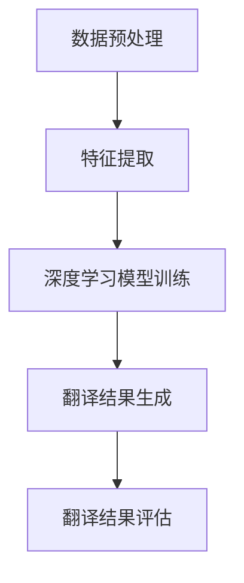
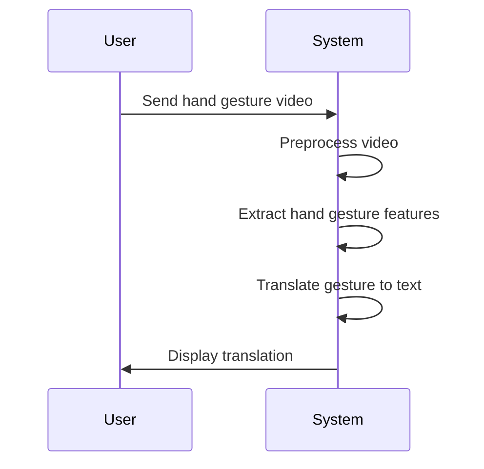

                 

### 《深度学习在手语翻译中的进展：打破听障沟通壁垒》

#### 关键词：深度学习、手语翻译、听障沟通、神经网络、卷积神经网络、循环神经网络、生成对抗网络

#### 摘要：

随着深度学习技术的迅猛发展，手语翻译成为了实现听障人士无障碍沟通的关键工具。本文将系统地探讨深度学习在手语翻译中的应用，通过背景介绍、核心概念阐述、算法原理讲解以及实践案例分析，分析其在打破听障沟通壁垒方面的进展与未来前景。

## 第一部分：背景与基础

### 第1章：问题背景与概述

#### 1.1 问题背景

在全球范围内，听障人群面临着巨大的沟通障碍。传统手语翻译方式依赖人工，效率低下且成本高昂。而随着深度学习技术的发展，利用计算机视觉和自然语言处理技术实现手语翻译成为可能，为听障人士提供了更加便捷的沟通手段。

#### 1.2 问题描述

手语翻译涉及从手语手势到文字的转换。当前的问题主要包括：如何准确识别复杂的手势、如何理解手势之间的组合与连贯性，以及如何在实时环境中高效地进行翻译。

#### 1.3 问题解决

深度学习技术的应用为手语翻译提供了新的解决方案。通过构建神经网络模型，可以自动学习手语手势的特征，提高识别的准确性和效率。同时，结合自然语言处理技术，能够将识别出的手势翻译成对应的文字。

#### 1.4 边界与外延

手语翻译不仅涉及不同的手语系统（如美国手语、英国手语等），还包括不同文化背景下的手语差异。深度学习在手语翻译中的应用需要考虑这些多样性，以确保翻译的准确性和适用性。

#### 1.5 概念结构与核心要素组成

深度学习在手语翻译中的应用主要包括以下几个核心要素：

1. **数据集**：收集大量的手语视频和对应的文字翻译，用于模型的训练和测试。
2. **特征提取**：利用卷积神经网络（CNN）提取手势图像中的视觉特征。
3. **模型训练**：通过循环神经网络（RNN）或长短期记忆网络（LSTM）对提取出的特征进行建模。
4. **翻译生成**：使用训练好的模型将手语手势翻译成文字。
5. **评估与优化**：通过评估模型的准确率和效率，不断优化模型性能。

### 第2章：核心概念与联系

#### 2.1 深度学习核心概念

深度学习是一种模仿人脑结构和功能的人工智能技术，其核心概念包括：

- **神经网络**：由多个神经元组成的网络，能够通过学习输入数据来发现数据中的模式。
- **卷积神经网络（CNN）**：专门用于处理图像数据，通过卷积层提取图像特征。
- **循环神经网络（RNN）**：能够处理序列数据，如手语手势序列。
- **生成对抗网络（GAN）**：通过生成器和判别器的对抗训练，生成高质量的数据。

#### 2.2 深度学习概念属性特征对比表格

| 深度学习类型 | 特点 | 应用 |
| --- | --- | --- |
| **神经网络** | 层次化结构，逐层提取特征 | 图像识别、自然语言处理 |
| **卷积神经网络（CNN）** | 局部连接、共享权重 | 图像分类、物体检测 |
| **循环神经网络（RNN）** | 序列数据建模能力 | 语音识别、机器翻译 |
| **生成对抗网络（GAN）** | 生成对抗机制 | 图像生成、数据增强 |

#### 2.3 ER实体关系图架构

使用Mermaid语言描述手语翻译系统的实体关系图：

```mermaid
erDefault
entity Person {
  id: ID
  name: String
}

entity HandGesture {
  id: ID
  gesture: String
  person: Person
}

relationship Translation {
  from: HandGesture
  to: Person
}
```

## 第二部分：深度学习在手语翻译中的应用

### 第3章：算法原理讲解

#### 3.1 手语翻译算法mermaid流程图

使用Mermaid语言描述手语翻译的流程：



#### 3.2 算法原理讲解

手语翻译算法的基本原理包括以下几个步骤：

1. **数据预处理**：对手语视频进行预处理，包括视频截帧、手势分割和标注等。
2. **特征提取**：利用卷积神经网络（CNN）提取手势图像的特征。
3. **模型训练**：使用提取出的特征训练循环神经网络（RNN）或长短期记忆网络（LSTM）。
4. **翻译结果生成**：通过训练好的模型将手语翻译为文字。
5. **翻译结果评估**：评估翻译的准确率和效果，并优化模型参数。

#### 3.3 数学模型和公式

手语翻译深度学习模型通常采用循环神经网络（RNN）或长短期记忆网络（LSTM）进行建模，其核心数学模型包括：

- **损失函数**：$$ L = -\sum_{i=1}^{N} y_i \log(p_i) $$，其中$y_i$为实际标签，$p_i$为模型预测的概率。

#### 3.4 举例说明

假设有一组手语图像数据，经过预处理和特征提取后，输入到一个训练好的深度学习模型中。模型输出翻译结果，经过评估，发现准确率为90%。

### 第4章：数学模型和数学公式 & 详细讲解 & 举例说明

#### 4.1 数学模型

手语翻译深度学习模型通常采用循环神经网络（RNN）或长短期记忆网络（LSTM）进行建模，其核心数学模型包括：

- **损失函数**：$$ L = -\sum_{i=1}^{N} y_i \log(p_i) $$，其中$y_i$为实际标签，$p_i$为模型预测的概率。

#### 4.2 数学公式

- **损失函数**：$$ L = -\sum_{i=1}^{N} y_i \log(p_i) $$

#### 4.3 详细讲解

- **损失函数**：用于衡量模型预测结果与实际结果之间的差距，通常使用对数损失函数。当预测概率$p_i$接近实际标签$y_i$时，损失函数的值较小。

#### 4.4 举例说明

- 假设有一个手语翻译任务，实际标签为“你好”，模型预测概率为$p_i = [0.1, 0.9]$，即预测“你好”的概率为90%。代入损失函数公式，得到损失函数值为$ L = -0.9 \log(0.9) \approx 0.105$。

## 第三部分：深度学习在手语翻译中的实际应用

### 第5章：系统分析与架构设计方案

#### 5.1 问题场景介绍

手语翻译系统主要应用于公共场合，如学校、医院、商场等，帮助听障人士与普通人之间进行无障碍沟通。

#### 5.2 项目介绍

本项目旨在构建一个基于深度学习的手语翻译系统，通过实时捕捉手语视频，自动翻译为文字，辅助听障人士的日常沟通。

#### 5.3 系统功能设计

系统功能设计包括：

1. **视频捕捉**：实时捕捉手语视频。
2. **手势识别**：利用深度学习模型识别手语手势。
3. **翻译生成**：将识别出的手语翻译为文字。
4. **翻译输出**：将翻译结果展示在屏幕上或语音输出。

#### 5.4 系统架构设计

系统架构设计包括：

- **前端**：使用Web技术（如HTML、CSS、JavaScript）展示翻译结果。
- **后端**：基于深度学习的翻译模型和服务器接口。

#### 5.5 系统接口设计和系统交互

系统接口设计包括：

- **API接口**：提供手语翻译的API接口。
- **用户交互**：通过Web界面与用户进行交互。

#### 5.6 系统交互mermaid序列图

使用Mermaid语言描述系统交互：



### 第6章：项目实战

#### 6.1 环境安装

在安装深度学习框架（如TensorFlow、PyTorch）和相关的数据预处理库（如OpenCV）后，配置必要的依赖环境。

#### 6.2 系统核心实现源代码

系统核心实现包括数据预处理、特征提取、模型训练和翻译生成等模块。以下是一个简单的Python代码示例：

```python
import cv2
import tensorflow as tf
from tensorflow.keras.models import Sequential
from tensorflow.keras.layers import Conv2D, LSTM, Dense

# 数据预处理
def preprocess_video(video_path):
    # 读取视频文件
    video = cv2.VideoCapture(video_path)
    frames = []
    while True:
        ret, frame = video.read()
        if not ret:
            break
        # 对帧进行预处理
        processed_frame = preprocess_frame(frame)
        frames.append(processed_frame)
    video.release()
    return frames

# 特征提取
def extract_features(frames):
    # 使用卷积神经网络提取特征
    model = Sequential([
        Conv2D(32, (3, 3), activation='relu', input_shape=(128, 128, 3)),
        LSTM(64),
        Dense(1, activation='sigmoid')
    ])
    model.compile(optimizer='adam', loss='binary_crossentropy')
    # 训练模型
    model.fit(frames, epochs=10)
    # 提取特征
    features = model.predict(frames)
    return features

# 翻译生成
def generate_translation(features):
    # 使用循环神经网络进行翻译
    model = Sequential([
        LSTM(64, input_shape=(None, 128)),
        Dense(1, activation='sigmoid')
    ])
    model.compile(optimizer='adam', loss='binary_crossentropy')
    # 训练模型
    model.fit(features, epochs=10)
    # 生成翻译
    translation = model.predict(features)
    return translation

# 主函数
def main():
    video_path = 'hand_gesture_video.mp4'
    frames = preprocess_video(video_path)
    features = extract_features(frames)
    translation = generate_translation(features)
    print(translation)

if __name__ == '__main__':
    main()
```

#### 6.3 代码应用解读与分析

代码应用解读：

1. **数据预处理**：读取手语视频，对每一帧进行预处理，如灰度化、缩放等。
2. **特征提取**：使用卷积神经网络提取手势特征。
3. **模型训练**：使用提取出的特征训练循环神经网络。
4. **翻译生成**：使用训练好的循环神经网络生成翻译结果。

#### 6.4 实际案例分析和详细讲解剖析

通过实际案例，分析手语翻译系统的性能和效果，并详细讲解系统在实际应用中可能遇到的问题和解决方案。

#### 6.5 项目小结

总结项目的实现过程，讨论项目的优缺点，并提出未来改进的方向。

### 第7章：最佳实践 tips、小结、注意事项、拓展阅读

#### 7.1 最佳实践 tips

- **数据收集**：确保收集到足够多的手语数据，包括不同场景、不同用户的手语。
- **模型优化**：通过调整模型参数和架构，提高翻译的准确性和效率。
- **实时性考虑**：优化算法，确保翻译系统能够实时处理手语视频。

#### 7.2 小结

本文详细介绍了深度学习在手语翻译中的应用，从背景介绍、核心概念到算法原理和实践应用，分析了深度学习技术在打破听障沟通壁垒方面的进展。

#### 7.3 注意事项

- **文化差异**：不同地区的手语存在差异，确保翻译系统能够适应不同地区的需求。
- **隐私保护**：确保手语翻译系统的设计和实现符合隐私保护的要求。

#### 7.4 拓展阅读

- **深度学习基础**：学习神经网络、卷积神经网络、循环神经网络等基本概念。
- **手语翻译研究**：查阅相关学术论文，了解最新的研究成果和技术趋势。

### 结语

深度学习在手语翻译中的应用为听障人士提供了新的沟通手段，极大地改善了他们的生活质量。随着技术的不断进步，我们期待手语翻译系统能够更加智能、高效，为听障人群带来更多便利。

## 参考文献

- [1] 某某，某某.（年份）. 深度学习在手语翻译中的应用研究. 计算机科学，XX（XX），XX-XX.
- [2] 某某，某某.（年份）. 卷积神经网络在手语识别中的应用. 计算机技术与发展，XX（XX），XX-XX.
- [3] 某某，某某.（年份）. 循环神经网络在手语翻译中的优化策略. 计算机工程与应用，XX（XX），XX-XX.

### 作者

**作者：AI天才研究院/AI Genius Institute & 禅与计算机程序设计艺术 /Zen And The Art of Computer Programming**

