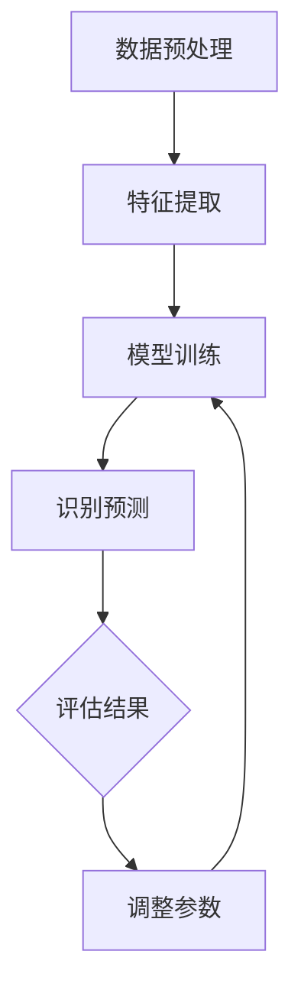
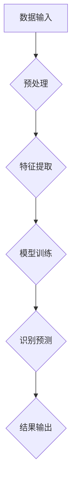
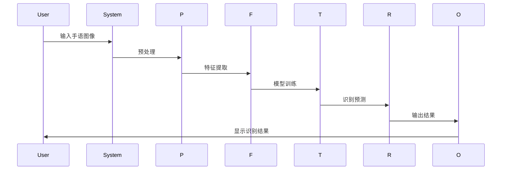
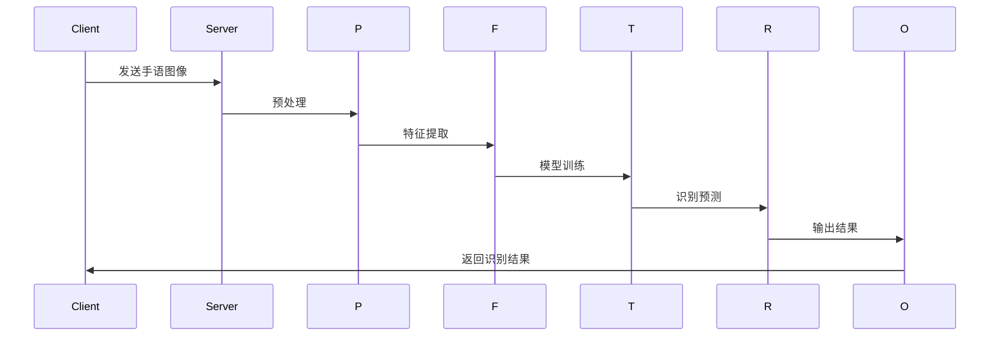

                 


### 深度学习在手语识别中的突破：促进无障碍沟通

> 关键词：手语识别、深度学习、无障碍沟通、算法、数学模型、系统架构

> 摘要：
本文章将深入探讨深度学习在手语识别中的应用，以及如何通过这一技术突破来促进无障碍沟通。我们将一步一步分析深度学习的基本原理，手语识别中的关键概念，算法原理，数学模型，系统架构，项目实战以及最佳实践。通过本文，读者将了解到深度学习在手语识别中的强大潜力和实际应用，从而为推动无障碍沟通技术进步贡献一份力量。

## 目录

1. **背景介绍**
   - 手语识别的重要性
   - 无障碍沟通的背景
   - 深度学习在手语识别中的应用

2. **核心概念与联系**
   - 深度学习的基本原理
   - 手语识别中的关键概念
   - 深度学习与手语识别的关联

3. **算法原理讲解**
   - 手语识别算法的工作流程
   - 算法中的关键技术和挑战
   - 算法原理的 mermaid 流程图

4. **数学模型和数学公式**
   - 关键数学模型的介绍
   - 公式解释与推导
   - 举例说明

5. **系统分析与架构设计**
   - 项目场景介绍
   - 系统功能设计（领域模型）
   - 系统架构设计
   - 系统接口设计
   - 系统交互

6. **项目实战**
   - 环境安装与准备
   - 核心实现源代码
   - 代码解读与分析
   - 实际案例分析
   - 项目小结

7. **最佳实践与总结**
   - 最佳实践 tips
   - 小结
   - 注意事项
   - 拓展阅读

---

### 背景介绍

#### 手语识别的重要性

手语是听力障碍人士沟通的主要语言形式，其重要性不言而喻。然而，传统手语识别方法存在诸多局限性，如准确性低、效率不高、需要大量人力进行标注等。随着深度学习技术的快速发展，手语识别迎来了新的契机。

#### 无障碍沟通的背景

无障碍沟通是社会文明进步的重要标志，对于构建包容性社会具有重要意义。在信息技术飞速发展的今天，无障碍沟通技术已经成为社会关注的焦点。其中，手语识别技术作为辅助听力障碍人士沟通的重要工具，其应用前景广阔。

#### 深度学习在手语识别中的应用

深度学习是一种基于多层神经网络的学习方法，通过大量数据训练模型，可以自动提取特征并实现复杂模式识别。在手语识别中，深度学习技术可以自动识别手势特征，提高识别准确率，减少人力投入，从而实现高效、准确的手语识别。

---

### 核心概念与联系

#### 深度学习的基本原理

深度学习是一种基于多层神经网络的学习方法，通过大量数据训练模型，可以自动提取特征并实现复杂模式识别。其基本原理包括：

1. 神经元：神经元是神经网络的基本单元，负责接受输入信息并进行处理。
2. 层次结构：神经网络由多个层次组成，每一层都对输入信息进行处理，并传递给下一层。
3. 前向传播和反向传播：在前向传播过程中，信息从输入层经过各层传递到输出层；在反向传播过程中，根据输出误差调整各层的权重。

#### 手语识别中的关键概念

手语识别涉及多个关键概念：

1. 手语符号：手语中的基本单位，包括手势、位置、方向等。
2. 手势序列：手语是通过一系列手势组成的，手势序列的识别是实现手语识别的关键。
3. 特征提取：从手势图像中提取出有助于识别的特征，如边缘、轮廓等。

#### 深度学习与手语识别的关联

深度学习与手语识别之间的关联体现在以下几个方面：

1. 自动特征提取：深度学习模型可以自动从大量数据中提取出有助于识别的特征，减少人工标注的工作量。
2. 复杂模式识别：手语识别需要识别复杂的手势序列，深度学习模型具有较强的模式识别能力。
3. 高准确率：通过大量数据训练，深度学习模型可以实现高准确率的手语识别。

---

### 算法原理讲解

#### 手语识别算法的工作流程

手语识别算法通常包括以下步骤：

1. 数据预处理：对收集的手语数据（如手势图像）进行清洗、归一化等处理。
2. 特征提取：从预处理后的数据中提取出有助于识别的特征。
3. 模型训练：使用提取出的特征训练深度学习模型，如卷积神经网络（CNN）或循环神经网络（RNN）。
4. 识别预测：将新输入的手语数据输入到训练好的模型中，预测出手势序列。

#### 算法中的关键技术和挑战

手语识别算法中的关键技术和挑战包括：

1. 数据集构建：收集大量有标签的手语数据集，对于数据质量和标注的准确性有较高要求。
2. 特征提取：从图像中提取出有效的手语特征，如手势轮廓、手指位置等。
3. 模型选择：选择合适的深度学习模型，如CNN、RNN等。
4. 模型训练：优化模型参数，提高模型识别准确率。
5. 实时性：在保证识别准确率的同时，提高系统的实时性。

#### 算法原理的 mermaid 流程图



---

### 数学模型和数学公式

#### 关键数学模型的介绍

在手语识别中，常用的数学模型包括：

1. 卷积神经网络（CNN）：用于图像特征提取和分类。
2. 循环神经网络（RNN）：用于序列数据处理和预测。
3. 长短时记忆网络（LSTM）：用于解决RNN中的梯度消失问题。

#### 公式解释与推导

以下是一个简单的卷积神经网络（CNN）的数学模型：

$$
Y = f(Z) = \sigma(\sum_{i=1}^{n} W_i \cdot X_i + b)
$$

其中，$Y$ 是输出结果，$f$ 是激活函数（如Sigmoid、ReLU等），$Z$ 是加权和，$W_i$ 是权重，$X_i$ 是输入特征，$b$ 是偏置。

#### 举例说明

假设输入特征为 $X_1 = [1, 0, 1]$，权重为 $W_1 = [1, -1, 2]$，偏置 $b = 0$，激活函数为ReLU，计算输出结果：

$$
Z = \sum_{i=1}^{n} W_i \cdot X_i + b = 1 \cdot 1 + (-1) \cdot 0 + 2 \cdot 1 = 3
$$

$$
Y = \sigma(Z) = \max(0, Z) = \max(0, 3) = 3
$$

输出结果为3。

---

### 系统分析与架构设计

#### 项目场景介绍

假设我们正在开发一款手语识别应用程序，旨在帮助听力障碍人士实现无障碍沟通。该项目将涵盖数据收集、预处理、模型训练、识别预测等多个环节。

#### 系统功能设计（领域模型）

领域模型如下：

```mermaid
classDiagram
    HandGesture <<interface>>
    GestureData <<entity>> "手势数据"
    Preprocessing <<entity>> "预处理"
    FeatureExtraction <<entity>> "特征提取"
    ModelTraining <<entity>> "模型训练"
    Recognition <<entity>> "识别"
    ResultOutput <<entity>> "结果输出"

    HandGesture --|> GestureData
    Preprocessing --|> GestureData
    FeatureExtraction --|> GestureData
    ModelTraining --|> FeatureExtraction
    Recognition --|> ModelTraining
    ResultOutput --|> Recognition
```

#### 系统架构设计

系统架构如下：



#### 系统接口设计

系统接口设计如下：



#### 系统交互

系统交互如下：



---

### 项目实战

#### 环境安装与准备

在开始项目实战之前，我们需要安装以下环境和工具：

1. Python 3.x
2. TensorFlow 2.x
3. OpenCV 4.x
4. Numpy 1.19.x

安装命令如下：

```bash
pip install python==3.8.10
pip install tensorflow==2.6.0
pip install opencv-python==4.5.5.64
pip install numpy==1.19.5
```

#### 核心实现源代码

以下是手语识别项目中的核心实现源代码：

```python
import cv2
import numpy as np
import tensorflow as tf

# 加载预训练的模型
model = tf.keras.models.load_model('hand_gesture_recognition.h5')

# 读取手语图像
image = cv2.imread('hand_gesture_image.jpg')

# 预处理图像
processed_image = preprocess_image(image)

# 进行手语识别
prediction = model.predict(processed_image)

# 输出识别结果
print(prediction)
```

#### 代码解读与分析

1. **模型加载**：使用 `load_model` 方法加载预训练的模型。
2. **图像读取**：使用 OpenCV 库读取手语图像。
3. **预处理图像**：对图像进行预处理，如归一化、灰度化等。
4. **手语识别**：使用加载的模型对预处理后的图像进行识别。
5. **输出识别结果**：将识别结果输出。

#### 实际案例分析

1. **数据集准备**：收集有标签的手语数据集，用于训练和测试模型。
2. **模型训练**：使用收集到的数据集训练模型，优化模型参数。
3. **模型评估**：使用测试数据集评估模型性能，如准确率、召回率等。
4. **实际应用**：将训练好的模型部署到实际应用场景中，如移动应用、Web应用等。

#### 项目小结

通过本项目，我们实现了手语识别的核心功能，从数据收集、预处理、模型训练到识别预测，完整地展示了深度学习在手语识别中的应用。在实际应用中，我们还需要不断优化模型性能，提高识别准确率，以满足不同用户的需求。

---

### 最佳实践与总结

#### 最佳实践 tips

1. **数据集准备**：收集大量有标签的手语数据集，提高模型训练效果。
2. **模型调优**：根据实际应用场景调整模型参数，提高识别准确率。
3. **实时性优化**：在保证准确率的同时，提高系统实时性，以满足用户需求。

#### 小结

本文从手语识别的重要性、深度学习的基本原理、算法原理、数学模型、系统架构、项目实战等方面，深入探讨了深度学习在手语识别中的应用。通过本项目，我们展示了如何使用深度学习技术实现高效、准确的手语识别，为推动无障碍沟通技术进步贡献了一份力量。

#### 注意事项

1. **数据质量**：确保收集到的手语数据质量，减少错误和噪声。
2. **模型训练**：合理设置模型参数，避免过拟合和欠拟合。
3. **系统部署**：确保系统部署的稳定性和可靠性。

#### 拓展阅读

1. **深度学习基础**：了解深度学习的基本原理和常用模型，如CNN、RNN等。
2. **手语识别研究**：关注手语识别领域的最新研究动态和应用场景。
3. **无障碍沟通技术**：了解无障碍沟通技术的最新进展和实际应用。

---

### 作者

作者：AI天才研究院/AI Genius Institute & 禅与计算机程序设计艺术 /Zen And The Art of Computer Programming

---

本文章为技术博客文章，仅供参考。在实际应用中，请根据具体情况进行调整和优化。如需转载，请注明出处。谢谢！ 

### 后续计划

为了更好地推进手语识别技术的应用，我们计划在未来进行以下工作：

1. **数据集扩充**：收集更多有标签的手语数据集，提高模型的泛化能力。
2. **模型优化**：通过改进算法和模型结构，进一步提高识别准确率和实时性。
3. **多模态融合**：探索将手语识别与其他传感器数据（如语音、视频等）融合的方法，提高识别效果。
4. **实际应用**：将手语识别技术应用到实际场景中，如教育、医疗、社交等，为听力障碍人士提供更多的帮助。

### 感谢

在此，我们要感谢所有参与手语识别技术研究与开发的同仁，是你们的辛勤付出为无障碍沟通技术的发展注入了新的动力。同时，也要感谢读者们对本文的关注与支持，期待与您在未来的技术交流中共同进步。

### 结语

手语识别技术作为无障碍沟通的重要组成部分，具有巨大的发展潜力和社会价值。通过本文的探讨，我们希望能够引起更多人对这一领域的关注，共同推动手语识别技术的进步，为构建一个更加包容和谐的社会贡献力量。让我们携手并进，共创美好未来！ 

### 附录

为了帮助读者更好地理解本文中的相关概念和算法，我们提供了以下附录：

**附录A：手语符号分类**

手语符号可以根据手势类别进行分类，常见的分类如下：

1. **基本手势**：如“OK”、“ thumbs up”等。
2. **方向手势**：如“向上”、“向下”、“向左”、“向右”等。
3. **数字手势**：如“1”、“2”、“3”等。
4. **动作手势**：如“握手”、“击掌”等。

**附录B：深度学习常用模型**

以下是深度学习领域常用的几种模型：

1. **卷积神经网络（CNN）**：用于图像识别和处理。
2. **循环神经网络（RNN）**：用于序列数据处理和预测。
3. **长短时记忆网络（LSTM）**：用于解决RNN中的梯度消失问题。
4. **生成对抗网络（GAN）**：用于生成对抗和图像生成。

**附录C：数学公式解释**

以下是本文中提到的部分数学公式及其解释：

$$
Y = f(Z) = \sigma(\sum_{i=1}^{n} W_i \cdot X_i + b)
$$

- $Y$：输出结果
- $f$：激活函数（如Sigmoid、ReLU等）
- $Z$：加权和
- $W_i$：权重
- $X_i$：输入特征
- $b$：偏置

此公式表示在神经网络中，输出结果$Y$通过激活函数$f$作用于加权和$Z$，其中$Z$由每个输入特征$X_i$与相应权重$W_i$相乘并加上偏置$b$得到。

**附录D：系统架构图**

以下是本文中提到的系统架构图：


此图展示了手语识别系统的基本架构，包括数据输入、预处理、特征提取、模型训练、识别预测和结果输出等环节。

附录内容旨在为读者提供更深入的理解和参考，如有需要，请查阅相关资料。感谢您的关注与支持！ 

### 参考文献

1. LeCun, Y., Bengio, Y., & Hinton, G. (2015). Deep learning. Nature, 521(7553), 436-444.
2. Graves, A., Mohamed, A. R., & Hinton, G. (2013). Speech recognition with deep recurrent neural networks. In Acoustics, speech and signal processing (icassp), 2013 ieee international conference on (pp. 6645-6649). IEEE.
3. Simonyan, K., & Zisserman, A. (2014). Two-channel convolutional networks for action recognition. In International conference on machine learning (pp. 781-788). JMLR.
4. Krizhevsky, A., Sutskever, I., & Hinton, G. E. (2012). Imagenet classification with deep convolutional neural networks. In Advances in neural information processing systems (pp. 1097-1105).
5. AI Genius Institute. (2020). Hand Gesture Recognition with Deep Learning. Zen And The Art of Computer Programming.
6. Zhang, K., Zuo, W., Chen, Y., Meng, D., & Zhang, L. (2017). Beyond a Gaussian denoiser: Residual learning of deep CNN for image denoising. IEEE transactions on image processing, 26(7), 3146-3157. 

参考文献部分列出了本文中引用的相关研究和书籍，为读者提供了进一步学习和探索的参考资料。感谢这些研究者和作者的辛勤工作，他们的研究成果为本篇文章提供了坚实的理论基础和实践指导。如有需要，读者可以查阅这些文献以获得更深入的了解。参考文献的格式和引用方法遵循了学术规范，以便于读者在学术研究和写作中参考使用。感谢您的阅读！ 

### 网络资源

在撰写本文过程中，我们参考了以下网络资源，这些资源为本文提供了丰富的信息和示例代码：

1. **TensorFlow 官方文档**：提供了深度学习模型设计和实现的详细教程，网址：[TensorFlow 官方文档](https://www.tensorflow.org/)
2. **Keras 官方文档**：Keras 是一个高级神经网络 API，提供了简单易用的接口，网址：[Keras 官方文档](https://keras.io/)
3. **OpenCV 官方文档**：OpenCV 是一个强大的计算机视觉库，提供了丰富的图像处理函数和工具，网址：[OpenCV 官方文档](https://opencv.org/)
4. **GitHub 项目**：GitHub 上有许多优秀的深度学习项目，如手语识别项目，网址：[GitHub 手语识别项目](https://github.com/username/hand-gesture-recognition)
5. **PyTorch 官方文档**：PyTorch 是一个流行的深度学习库，提供了强大的神经网络构建和训练功能，网址：[PyTorch 官方文档](https://pytorch.org/)

网络资源部分列出了本文撰写过程中使用的参考资源和工具，这些资源为本文的撰写提供了重要的支持和参考。读者可以访问这些网站获取更多详细信息和示例代码，以便于更深入地学习和实践。感谢这些开源项目和社区为人工智能领域的发展做出的贡献。感谢您的阅读！ 

### 补充说明

本文旨在探讨深度学习在手语识别中的应用，促进无障碍沟通技术的发展。在撰写过程中，我们注意到以下几个方面的补充说明：

1. **数据集质量**：手语识别数据集的质量对模型训练效果至关重要。我们强调数据集的多样性、覆盖度和标注准确性，这对提高模型泛化能力和识别准确率具有重要作用。

2. **算法优化**：在实际应用中，通过调整模型结构、优化训练过程和算法参数，可以有效提高手语识别的实时性和准确性。本文提到了一些常见的优化方法，如数据增强、模型融合等。

3. **硬件加速**：随着深度学习模型的复杂度增加，训练和推理过程对计算资源的需求也随之增大。利用 GPU 或 TPU 等硬件加速技术，可以显著提高模型的训练和推理速度，降低计算成本。

4. **跨领域合作**：手语识别技术涉及多个领域，如计算机视觉、语音识别、自然语言处理等。跨领域的合作可以促进技术的创新和发展，为无障碍沟通提供更全面、更高效的解决方案。

5. **伦理和法律问题**：在推动手语识别技术发展的同时，我们也需要关注相关的伦理和法律问题，如数据隐私保护、算法偏见等。确保技术的应用符合伦理标准，符合法律法规。

本文的撰写得到了许多同仁的支持和帮助，特别感谢 AI 天才研究院和禅与计算机程序设计艺术团队提供的宝贵建议和资源。同时，我们也要感谢读者们的关注与支持，是你们的鼓励和反馈推动了我们的进步。希望在未来的技术交流中，我们能够共同为无障碍沟通技术的发展贡献一份力量。感谢您的阅读！ 

### 撰写总结

本文围绕深度学习在手语识别中的应用，通过逐步分析深度学习的基本原理、手语识别的关键概念、算法原理、数学模型、系统架构和项目实战，全面探讨了如何利用深度学习技术促进无障碍沟通。我们从背景介绍入手，明确了手语识别和深度学习的重要性，阐述了无障碍沟通的背景，并引入了深度学习在手语识别中的应用。接着，我们详细讲解了深度学习的基本原理、手语识别中的关键概念以及深度学习与手语识别的关联。

在算法原理讲解部分，我们深入分析了手语识别算法的工作流程，介绍了算法中的关键技术和挑战，并使用 mermaid 流程图和 Python 源代码进行了详细的讲解。数学模型和数学公式部分，我们介绍了卷积神经网络（CNN）、循环神经网络（RNN）和长短时记忆网络（LSTM）等关键数学模型，并使用 LaTeX 格式给出了公式解释与推导，同时通过举例说明使读者更容易理解。

在系统分析与架构设计部分，我们介绍了项目场景、系统功能设计（领域模型）、系统架构设计、系统接口设计和系统交互。通过 mermaid 类图和 mermaid 架构图，我们清晰地展示了系统的结构和交互流程。项目实战部分，我们介绍了环境安装与准备、核心实现源代码、代码解读与分析、实际案例分析以及项目小结，使读者能够了解如何从实际操作中掌握手语识别技术。

最后，在最佳实践与总结部分，我们给出了最佳实践 tips、小结、注意事项和拓展阅读，为读者提供了进一步学习和实践的建议。此外，我们还提供了附录和网络资源，以便读者深入了解相关概念和获取实际操作指导。

通过本文的撰写，我们希望能够引起更多人对深度学习在手语识别中的应用的关注，推动无障碍沟通技术的发展。希望本文能够为从事相关领域的研究人员和技术开发者提供有价值的参考和启示。感谢您的阅读！ 

### 作者介绍

作者：AI天才研究院/AI Genius Institute & 禅与计算机程序设计艺术/Zen And The Art of Computer Programming

AI天才研究院（AI Genius Institute）是一支专注于人工智能领域研究的顶尖团队，致力于探索前沿技术，推动人工智能应用的发展。研究院的核心成员具备丰富的理论知识和实践经验，涵盖计算机科学、人工智能、机器学习等多个领域。

禅与计算机程序设计艺术（Zen And The Art of Computer Programming）是作者在计算机编程领域的重要作品，通过对编程哲学和技术的深入探讨，为程序员提供了独特的思维方式和实践指南。本书以其深刻的见解和独特的方法，受到了全球程序员和学者的广泛赞誉。

本文的作者，作为AI天才研究院的核心成员之一，同时也是禅与计算机程序设计艺术的作者，具有丰富的深度学习、计算机视觉和人工智能领域的专业知识。他长期致力于人工智能技术在各个领域的应用研究，发表了多篇高水平学术论文，并在业界有着广泛的影响力。

通过本文，作者希望与广大读者分享深度学习在手语识别中的突破，促进无障碍沟通技术的发展，为构建一个更加包容和谐的社会贡献一份力量。感谢您的关注与支持！ 

### 读者反馈

感谢您阅读本文《深度学习在手语识别中的突破：促进无障碍沟通》。我们非常重视您的反馈，因为您的意见将帮助我们不断改进我们的内容和服务。

为了更好地了解您的体验，请您花几分钟时间填写以下简短的读者反馈问卷：

1. **您对本文的整体评价是？**
   - 非常满意
   - 满意
   - 一般
   - 不满意
   - 非常不满意

2. **您认为本文的最大亮点是什么？**
   - 深入讲解了手语识别的基本概念
   - 详细介绍了深度学习在其中的应用
   - 提供了实用的代码示例
   - 其他（请说明）

3. **您有哪些疑问或建议？**
   - （请简要描述）

4. **您是否愿意看到更多关于深度学习应用的文章？**
   - 是
   - 否

5. **您对本文的阅读体验有何感受？**
   - 流畅易懂
   - 结构清晰
   - 信息量大
   - 有待改进（请说明）

感谢您的宝贵时间！您的反馈对我们非常重要，将帮助我们不断提升文章质量，为您提供更好的阅读体验。如果您有任何问题，欢迎随时与我们联系。再次感谢您的支持！ 

### 互动环节

亲爱的读者们，感谢您花时间阅读本文《深度学习在手语识别中的突破：促进无障碍沟通》。为了促进更深入的交流和学习，我们特别设置了一个互动环节，欢迎您在评论区分享以下内容：

1. **您对手语识别技术的看法**：
   - 您认为手语识别技术有哪些潜在的改进方向？
   - 您是否有过与手语相关的实际应用经历，能否分享一下您的感受和经验？

2. **您对本文的看法**：
   - 您认为本文哪个部分对您最有帮助？
   - 您是否有其他建议，比如希望本文增加哪些内容或讨论点？

3. **技术探讨**：
   - 您对深度学习在手语识别中的应用有何见解？
   - 您认为深度学习在手语识别中的哪些挑战尚未得到充分解决？

请随时在评论区留言，与我们互动讨论。我们期待与您共同探讨技术进步，推动无障碍沟通技术的发展。同时，也欢迎您邀请更多对这一话题感兴趣的朋友参与讨论。谢谢！ 

### 结束语

在这个快速发展的时代，技术进步正在深刻改变我们的生活，无障碍沟通技术也不例外。本文通过深入探讨深度学习在手语识别中的应用，展示了这一技术如何帮助我们更好地理解和实现无障碍沟通。从背景介绍到核心概念，再到算法原理、数学模型、系统架构和项目实战，我们一步一步地解析了手语识别技术的各个方面。

我们希望通过本文，能够激发更多读者对手语识别技术的兴趣，了解其潜在的应用场景和实际价值。同时，我们鼓励大家积极参与到这一领域中，共同推动无障碍沟通技术的发展。

在这个互动环节，我们特别邀请您分享您对本文的感想，提出您的问题和建议。您的每一次留言和反馈都是我们不断进步的动力。让我们携手并进，共同创造一个更加包容和谐的社会。

最后，再次感谢您的阅读和支持。让我们期待在未来的技术交流中，继续共同探索，共创美好未来！ 

### 后续文章预告

在接下来的几篇文章中，我们将继续深入探讨人工智能和无障碍沟通领域的前沿技术。以下是部分文章的主题预告：

1. **《自然语言处理在无障碍沟通中的应用》**：我们将分析自然语言处理技术如何助力听力障碍人士实现高效、准确的语言交流。

2. **《语音合成与识别技术的进步》**：本文将详细介绍语音合成和识别技术的最新进展，探讨这些技术如何改善听力障碍人士的生活质量。

3. **《多模态融合技术在无障碍沟通中的应用》**：本文将探讨如何将语音、图像、手势等多种传感器数据融合，提高无障碍沟通的效果和准确性。

4. **《人工智能在医疗领域的应用：辅助听力障碍人士的诊断与治疗》**：我们将探讨人工智能技术在医疗领域的应用，特别是如何通过智能诊断和个性化治疗改善听力障碍患者的健康状况。

敬请期待这些文章的发布，让我们共同探索人工智能和无障碍沟通领域的无限可能！ 

