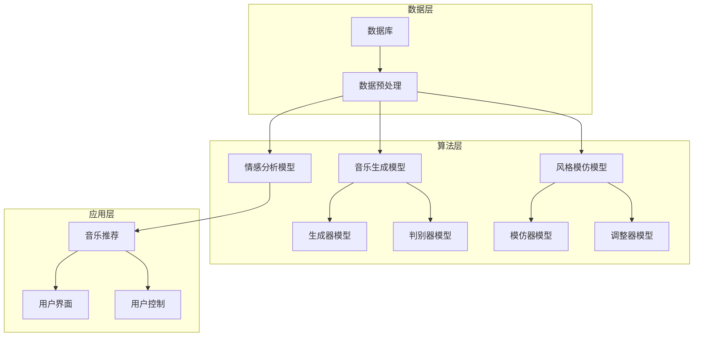
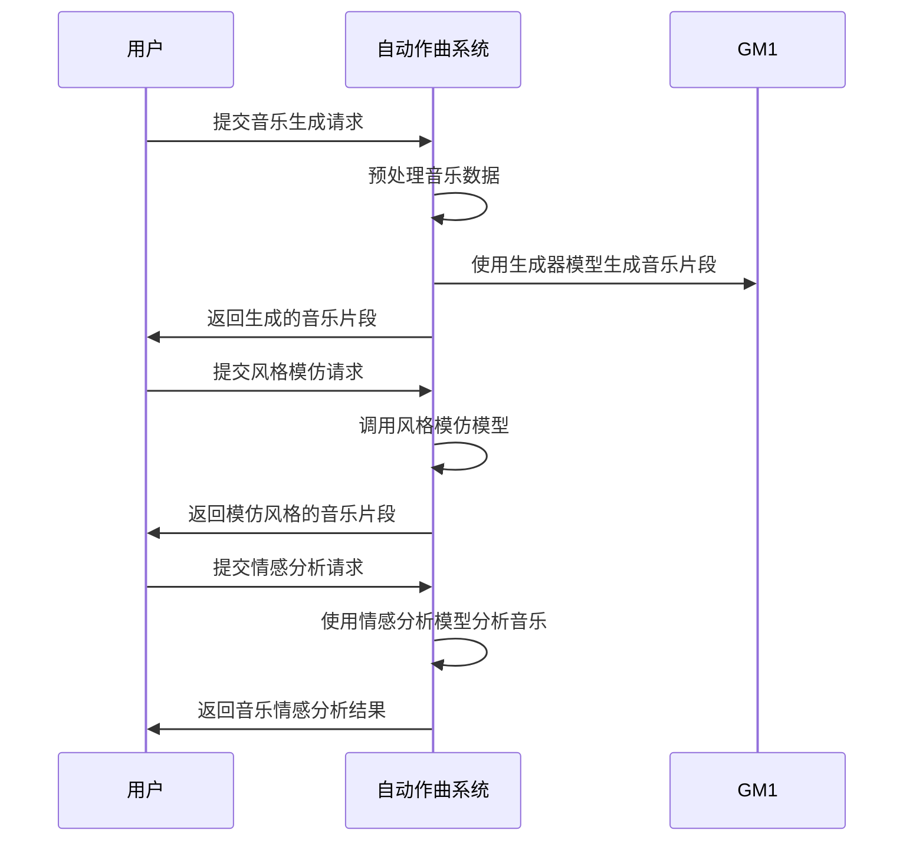

                 

### 文章标题与关键词

# 深度学习在自动作曲中的应用：AI音乐创作的新可能

> 关键词：深度学习，自动作曲，AI音乐创作，神经网络，音乐生成模型，风格模仿

> 摘要：本文将探讨深度学习在自动作曲领域的应用，分析AI音乐创作的现状与潜力，通过深入剖析各类深度学习模型在音乐生成、风格模仿等方面的技术原理和应用实例，探讨AI如何变革传统音乐创作模式，开启音乐创作的新可能。

### 第一部分：深度学习与音乐创作基础

#### 第1章：问题背景与定义

##### 1.1 自动作曲的问题背景

##### 1.1.1 音乐创作的历史演变

音乐创作的历史可以追溯到远古时期，原始部落通过简单的打击乐器和声嘶力竭的吼叫来传达情感和故事。随着人类社会的发展，音乐逐渐演变成一种高度复杂且富有表现力的艺术形式。从古希腊的抒情诗和乐器演奏，到中世纪的宗教音乐和文艺复兴时期的歌剧，再到现代的流行音乐和电子音乐，音乐创作一直在不断地革新和演进。

在20世纪初期，随着录音技术的诞生，音乐创作进入了一个全新的阶段。作曲家可以通过录音设备捕捉和保存他们的创意，使得音乐可以跨越时间和空间进行传播。随着计算机技术的发展，音乐创作逐渐从手工制作转向数字制作，计算机软件如MIDI（Musical Instrument Digital Interface）和音频处理软件如Pro Tools和Ableton Live等成为音乐创作的重要工具。

##### 1.1.2 自动作曲的挑战与机遇

自动作曲，即使用算法和技术自动生成音乐，是音乐创作的一个新兴领域。自动作曲面临的挑战包括：

- **创意多样性**：人类作曲家通过长期的训练和灵感积累，能够创作出风格多样、情感丰富的音乐作品。而自动作曲系统需要能够在没有人类指导的情况下，生成具有创意性和多样性的音乐。

- **风格模仿**：不同的音乐风格有着独特的旋律、和声、节奏和音色特征。自动作曲系统需要能够准确地模仿这些风格，并在此基础上进行创新。

- **音乐情感表达**：音乐是一种情感表达的方式，自动作曲系统需要能够捕捉和传达人类作曲家的情感意图。

然而，自动作曲也带来了许多机遇：

- **艺术创作新方式**：自动作曲为音乐创作提供了一种全新的视角，作曲家可以与机器合作，共同创作出前所未有的音乐作品。

- **音乐制作效率**：自动作曲可以大幅度提高音乐制作的效率，减少人力和时间成本。

- **个性化音乐推荐**：自动作曲技术可以用于创建个性化的音乐推荐系统，根据用户偏好生成专属的音乐。

##### 1.1.3 深度学习在音乐创作中的角色

深度学习作为一种强大的机器学习技术，已经在图像识别、自然语言处理等领域取得了显著成果。近年来，深度学习开始逐渐应用于音乐创作，成为自动作曲的重要工具。

- **音乐生成**：深度学习模型可以学习大量的音乐数据，从中提取规律，然后生成新的音乐作品。生成模型如变分自编码器（VAE）和生成对抗网络（GAN）在音乐生成中表现出色。

- **风格模仿**：深度学习模型可以精确地模仿特定的音乐风格，生成与原风格相似甚至更独特的音乐作品。

- **音乐情感分析**：深度学习模型可以分析音乐的情感特征，为个性化音乐推荐提供依据。

综上所述，自动作曲作为一种新兴的艺术形式，不仅面临着一系列挑战，也蕴含着巨大的机遇。深度学习作为一项核心技术，正在推动自动作曲的发展，为音乐创作带来新的可能。

##### 1.2 深度学习基础

##### 1.2.1 神经网络原理

神经网络（Neural Networks，NN）是深度学习的基础，模仿了人脑的结构和工作方式。神经网络由大量的神经元（或节点）组成，每个神经元都与其他神经元通过权重（weights）连接。神经元接收输入信号，通过加权求和，然后应用一个非线性激活函数（如Sigmoid或ReLU），产生输出信号。

- **神经元结构**：一个简单的神经元包括输入层、权重层、激活函数层和输出层。

- **权重与偏置**：权重表示神经元之间连接的强度，偏置是一个独立的常数，用于调整输出。

- **激活函数**：激活函数用于引入非线性，常见的有Sigmoid、ReLU、Tanh等。

- **前向传播**：输入数据通过前向传播在网络中传递，每个神经元计算输入信号的加权求和，并通过激活函数产生输出。

- **反向传播**：在训练过程中，网络根据输出与实际结果之间的差异（损失函数）进行反向传播，更新权重和偏置，以减少损失。

##### 1.2.2 深度学习模型简介

深度学习模型是包含多个隐藏层的神经网络，通过深度堆叠的神经网络层来提取高级特征。深度学习模型主要包括以下几种：

- **卷积神经网络（CNN）**：主要用于图像识别和图像处理，通过卷积层提取空间特征。

- **循环神经网络（RNN）**：用于处理序列数据，如文本和语音，通过循环结构保持长时依赖信息。

- **长短时记忆网络（LSTM）**：是RNN的一种改进，能够更好地处理长序列数据，避免了梯度消失和爆炸问题。

- **生成对抗网络（GAN）**：由生成器和判别器组成，用于生成高质量的数据。

- **变分自编码器（VAE）**：用于生成新的数据，通过编码器和解码器将数据映射到低维空间，再重构回高维空间。

##### 1.2.3 深度学习在音乐创作中的应用

深度学习在音乐创作中的应用主要包括音乐生成、风格模仿和音乐情感分析等方面：

- **音乐生成**：使用深度学习模型生成新的音乐作品，如变分自编码器（VAE）和生成对抗网络（GAN）。这些模型可以学习大量的音乐数据，生成具有创意性和多样性的音乐。

- **风格模仿**：通过深度学习模型模仿特定的音乐风格，如使用循环神经网络（RNN）和长短时记忆网络（LSTM）。这些模型可以精确地捕捉音乐风格的特征，生成与原风格相似的音乐。

- **音乐情感分析**：利用深度学习模型分析音乐的情感特征，为个性化音乐推荐提供依据。例如，可以使用卷积神经网络（CNN）提取音乐的特征，然后通过分类器进行情感分析。

综上所述，深度学习为音乐创作带来了新的工具和方法，使得自动作曲成为可能。在接下来的章节中，我们将深入探讨深度学习模型在音乐生成和风格模仿中的应用。

##### 1.3 音乐表示方法

##### 1.3.1 音符与音频信号

音乐是通过音符和音频信号来表达的。音符是音乐的基本元素，它包含了音高、时值和音色等信息。不同的音符组合在一起，形成旋律和和声。

- **音符表示**：音符通常用五线谱表示，五线谱上的每个位置对应一个特定的音高，时值则通过音符的形状（如全音符、二分音符、四分音符等）来表示。

- **音频信号**：音频信号是通过麦克风或其他音频设备捕捉的声波信号。音频信号可以表示为时间序列的数字数据，通过采样和量化转换为计算机可以处理的形式。

##### 1.3.2 音符序列与MIDI文件

音符序列是音乐的一种表示方法，它将音符按时间顺序排列，形成一首完整的音乐作品。MIDI（Musical Instrument Digital Interface）是一种数字接口标准，用于记录和传输音符序列数据。

- **MIDI文件格式**：MIDI文件包含了一系列指令，描述了音符的起始时间、持续时间、音高和力度等信息。MIDI文件不包含音频数据，而是记录了演奏过程中的控制信息。

- **音符序列处理**：深度学习模型可以通过处理MIDI文件中的音符序列来生成或模仿音乐。例如，可以使用循环神经网络（RNN）和长短时记忆网络（LSTM）来学习音符序列的规律，生成新的音乐作品。

##### 1.3.3 音频特征提取

音频特征提取是将音频信号转换为适合深度学习模型处理的特征表示的过程。常见的音频特征包括频谱特征、时域特征和变换域特征。

- **频谱特征**：通过傅里叶变换（FFT）从音频信号中提取频谱信息，如频率、幅度和相位。

- **时域特征**：包括音频信号的时域统计特征，如平均能量、标准差和自相关函数。

- **变换域特征**：通过小波变换、梅尔频率倒谱系数（MFCC）等变换，从音频信号中提取不同频段的特征。

- **特征表示**：提取的音频特征可以用于训练深度学习模型，如卷积神经网络（CNN）和循环神经网络（RNN）。特征表示的质量直接影响模型的性能和生成音乐的质量。

##### 1.4 深度学习与音乐创作的联系

##### 1.4.1 音乐生成模型

音乐生成模型是深度学习在音乐创作中的一个重要应用。这些模型通过学习大量的音乐数据，生成新的音乐作品。以下是几种常见的音乐生成模型：

- **变分自编码器（VAE）**：VAE是一种生成模型，通过编码器和解码器将音乐数据映射到低维空间，再重构回高维空间，生成新的音乐作品。

- **生成对抗网络（GAN）**：GAN由生成器和判别器组成，生成器生成新的音乐作品，判别器判断生成的音乐是否真实。通过生成器和判别器的对抗训练，生成器可以逐渐生成高质量的音乐。

- **波士顿神经网络（WaveNet）**：WaveNet是一种基于RNN的生成模型，通过学习大量的文本数据生成自然语言，也可以用于生成音乐。

##### 1.4.2 音乐风格模仿

音乐风格模仿是另一个深度学习在音乐创作中的重要应用。这些模型可以模仿特定的音乐风格，生成与原风格相似甚至更独特的音乐作品。以下是几种常见的音乐风格模仿方法：

- **循环神经网络（RNN）**：RNN通过循环结构学习音乐序列的长期依赖关系，可以模仿多种音乐风格。

- **长短时记忆网络（LSTM）**：LSTM是RNN的一种改进，可以更好地处理长序列数据，模仿特定的音乐风格。

- **卷积神经网络（CNN）**：CNN通过卷积层提取音乐的特征，模仿特定的音乐风格。

##### 1.4.3 音乐创作中的创造性表达

音乐创作中的创造性表达是深度学习在音乐创作中的核心目标之一。通过深度学习模型，作曲家可以与机器合作，共同创作出前所未有的音乐作品。创造性表达包括以下几个方面：

- **创意多样性**：深度学习模型可以生成风格多样、情感丰富的音乐作品，激发作曲家的创意。

- **个性化创作**：深度学习模型可以根据用户的喜好和风格，生成个性化的音乐作品。

- **跨风格融合**：深度学习模型可以模仿多种音乐风格，将不同风格的音乐融合在一起，创造出独特的音乐风格。

- **交互式创作**：深度学习模型可以与作曲家进行实时交互，根据作曲家的反馈调整音乐创作的方向和内容。

综上所述，深度学习在音乐创作中的应用，不仅提升了音乐创作的效率和质量，也为音乐创作带来了新的可能性。在接下来的章节中，我们将深入探讨深度学习模型在音乐生成和风格模仿中的具体应用和技术原理。

##### 1.5 本章小结

本章介绍了自动作曲的问题背景和定义，从音乐创作的历史演变到自动作曲的挑战与机遇，再到深度学习在音乐创作中的角色，为我们提供了一个全面的视角来理解自动作曲领域。通过讨论深度学习的基础，如神经网络原理和深度学习模型简介，我们了解了深度学习如何成为自动作曲的重要工具。此外，我们详细阐述了音符与音频信号的表示方法，以及深度学习在音乐生成和风格模仿中的应用。这些内容为我们后续深入探讨深度学习模型在自动作曲中的具体应用奠定了基础。通过本章的学习，读者可以建立起对自动作曲和深度学习在音乐创作中联系的基本理解。

### 第二部分：深度学习模型在自动作曲中的应用

#### 第2章：音乐生成模型

##### 2.1 马尔可夫模型

##### 2.1.1 马尔可夫模型的原理

马尔可夫模型（Markov Model）是一种用于预测序列数据的统计模型。它的核心思想是，当前状态仅由前一个状态决定，与之前的状态无关。这种假设在许多实际应用中都是有效的，如自然语言处理、语音识别和自动作曲。

- **状态转移概率**：马尔可夫模型通过状态转移概率矩阵来描述状态之间的转换关系。状态转移概率矩阵是一个方阵，其中每个元素\(P_{ij}\)表示从状态i转移到状态j的概率。

- **初始状态概率**：除了状态转移概率矩阵，马尔可夫模型还需要一个初始状态概率向量，表示初始状态出现的概率。

- **预测下一个状态**：给定当前状态，马尔可夫模型可以计算下一个状态的概率分布，然后根据这个分布预测下一个状态。

##### 2.1.2 马尔可夫模型在音乐生成中的应用

在音乐生成中，马尔可夫模型可以用于生成旋律或和声线。以下是一个简单的示例：

假设我们有一个简化的五线谱，每个位置可以是五种不同的音符之一。我们可以构建一个五阶马尔可夫模型，其中每个状态表示一个音符，状态转移概率矩阵描述了从当前音符到下一个音符的转换概率。

```python
# 假设的五音符状态为 'C', 'D', 'E', 'F', 'G'
states = ['C', 'D', 'E', 'F', 'G']

# 状态转移概率矩阵
transition_matrix = [
    [0.2, 0.3, 0.1, 0.2, 0.2],  # 从C到其他音符的概率
    [0.1, 0.2, 0.3, 0.2, 0.2],  # 从D到其他音符的概率
    [0.2, 0.1, 0.3, 0.2, 0.2],  # 从E到其他音符的概率
    [0.2, 0.2, 0.1, 0.3, 0.2],  # 从F到其他音符的概率
    [0.1, 0.2, 0.2, 0.2, 0.3]   # 从G到其他音符的概率
]

# 初始状态概率向量
initial_state_probs = [0.2, 0.3, 0.1, 0.2, 0.2]

# 生成五音符的旋律
def generate_melody(states, transition_matrix, initial_state_probs, length=5):
    current_state = np.random.choice(states, p=initial_state_probs)
    melody = [current_state]
    for _ in range(length - 1):
        current_state = np.random.choice(states, p=transition_matrix[current_state])
        melody.append(current_state)
    return melody

# 示例生成五音符的旋律
melody = generate_melody(states, transition_matrix, initial_state_probs, 5)
print(melody)
```

这个简单的例子展示了如何使用马尔可夫模型生成五音符的旋律。通过调整状态转移概率矩阵和初始状态概率向量，我们可以控制生成的旋律风格和节奏。

##### 2.2 循环神经网络（RNN）

##### 2.2.1 RNN的工作原理

循环神经网络（Recurrent Neural Networks，RNN）是一种能够处理序列数据的神经网络。RNN通过在时间步之间保持状态（或记忆）来处理序列信息。与传统的神经网络不同，RNN中的神经元不仅接收当前输入，还接收之前的输出。

- **隐藏状态**：RNN中的每个时间步都有一个隐藏状态\(h_t\)，它包含了输入序列的信息。隐藏状态通过一个递归函数来更新。

- **输入和输出**：在每一个时间步，RNN接收输入\(x_t\)和前一个时间步的隐藏状态\(h_{t-1}\)，计算当前时间步的隐藏状态\(h_t\)和输出\(y_t\)。

- **递归函数**：递归函数通常是一个线性函数，形式为\(h_t = \sigma(W_h \cdot [h_{t-1}, x_t] + b_h)\)，其中\(\sigma\)是激活函数，\(W_h\)和\(b_h\)是权重和偏置。

- **训练**：RNN的训练通常使用梯度下降法，通过反向传播更新权重和偏置，以最小化损失函数。

##### 2.2.2 RNN在音乐生成中的应用

RNN在音乐生成中的应用非常广泛，可以生成旋律、和声和完整的音乐作品。以下是一个使用RNN生成旋律的示例：

```python
import numpy as np
import tensorflow as tf
from tensorflow.keras.models import Sequential
from tensorflow.keras.layers import SimpleRNN, Dense

# 假设的五音符状态为 'C', 'D', 'E', 'F', 'G'
states = ['C', 'D', 'E', 'F', 'G']

# 将音符转换为数字表示
state_to_int = {'C': 0, 'D': 1, 'E': 2, 'F': 3, 'G': 4}
int_to_state = {0: 'C', 1: 'D', 2: 'E', 3: 'F', 4: 'G'}

# 构建RNN模型
model = Sequential()
model.add(SimpleRNN(units=50, activation='tanh', input_shape=(None, len(states))))
model.add(Dense(len(states), activation='softmax'))

model.compile(optimizer='adam', loss='categorical_crossentropy', metrics=['accuracy'])

# 训练数据
# 假设我们有一个包含成千上万个音符序列的训练数据集
X_train = np.random.randint(len(states), (1000, 50))
y_train = np.random.randint(len(states), (1000, 50))

# 编码输出标签
y_train_encoded = tf.keras.utils.to_categorical(y_train, num_classes=len(states))

# 训练模型
model.fit(X_train, y_train_encoded, epochs=100, batch_size=32)

# 生成新的旋律
def generate_melody(model, initial_state, length=5):
    current_state = initial_state
    melody = [current_state]
    for _ in range(length - 1):
        current_state = np.argmax(model.predict(current_state.reshape(1, -1)))
        melody.append(current_state)
    return melody

# 示例生成五音符的旋律
melody = generate_melody(model, np.random.randint(len(states)), 5)
print([''.join(state_to_int[state]) for state in melody])
```

这个示例使用了一个简单的RNN模型来生成五音符的旋律。模型通过训练学习音符序列的规律，然后根据初始状态生成新的旋律。

##### 2.3 长短时记忆网络（LSTM）

##### 2.3.1 LSTM的改进

长短时记忆网络（Long Short-Term Memory，LSTM）是RNN的一种改进，解决了传统RNN在处理长序列数据时遇到的梯度消失和梯度爆炸问题。LSTM通过引入记忆单元和门结构来保持长期依赖信息。

- **记忆单元（Memory Cell）**：LSTM的核心是记忆单元，它可以存储和更新信息。记忆单元通过三个门（输入门、遗忘门和输出门）来控制信息的流入、流出和输出。

- **输入门**：输入门决定了哪些信息应该进入记忆单元。

- **遗忘门**：遗忘门决定了哪些信息应该从记忆单元中遗忘。

- **输出门**：输出门决定了哪些信息应该从记忆单元输出。

- **梯度流**：LSTM通过这些门结构避免了梯度消失和梯度爆炸问题，使得模型能够有效地学习长序列数据。

##### 2.3.2 LSTM在音乐生成中的应用

LSTM在音乐生成中的应用非常广泛，可以生成更复杂的音乐作品，如旋律、和声和完整的音乐段落。以下是一个使用LSTM生成旋律的示例：

```python
import numpy as np
import tensorflow as tf
from tensorflow.keras.models import Sequential
from tensorflow.keras.layers import LSTM, Dense

# 假设的五音符状态为 'C', 'D', 'E', 'F', 'G'
states = ['C', 'D', 'E', 'F', 'G']

# 将音符转换为数字表示
state_to_int = {'C': 0, 'D': 1, 'E': 2, 'F': 3, 'G': 4}
int_to_state = {0: 'C', 1: 'D', 2: 'E', 3: 'F', 4: 'G'}

# 构建LSTM模型
model = Sequential()
model.add(LSTM(units=50, activation='tanh', input_shape=(None, len(states))))
model.add(Dense(len(states), activation='softmax'))

model.compile(optimizer='adam', loss='categorical_crossentropy', metrics=['accuracy'])

# 训练数据
# 假设我们有一个包含成千上万个音符序列的训练数据集
X_train = np.random.randint(len(states), (1000, 50))
y_train = np.random.randint(len(states), (1000, 50))

# 编码输出标签
y_train_encoded = tf.keras.utils.to_categorical(y_train, num_classes=len(states))

# 训练模型
model.fit(X_train, y_train_encoded, epochs=100, batch_size=32)

# 生成新的旋律
def generate_melody(model, initial_state, length=5):
    current_state = initial_state
    melody = [current_state]
    for _ in range(length - 1):
        current_state = np.argmax(model.predict(current_state.reshape(1, -1)))
        melody.append(current_state)
    return melody

# 示例生成五音符的旋律
melody = generate_melody(model, np.random.randint(len(states)), 5)
print([''.join(state_to_int[state]) for state in melody])
```

这个示例使用了一个简单的LSTM模型来生成五音符的旋律。模型通过训练学习音符序列的长期依赖关系，然后根据初始状态生成新的旋律。

##### 2.4 生成对抗网络（GAN）

##### 2.4.1 GAN的基本概念

生成对抗网络（Generative Adversarial Network，GAN）是由生成器（Generator）和判别器（Discriminator）组成的神经网络框架。生成器的目标是生成尽可能真实的数据，判别器的目标是区分真实数据和生成数据。

- **生成器（Generator）**：生成器接收随机噪声作为输入，生成与真实数据相似的数据。生成器的目的是使判别器无法区分真实数据和生成数据。

- **判别器（Discriminator）**：判别器接收真实数据和生成数据，输出一个概率，表示输入数据的真实性。判别器的目标是正确地区分真实数据和生成数据。

- **对抗训练**：生成器和判别器通过对抗训练相互博弈。生成器试图生成更真实的数据来欺骗判别器，而判别器试图更好地区分真实数据和生成数据。通过这种对抗过程，生成器逐渐生成高质量的数据。

##### 2.4.2 GAN在音乐生成中的应用

GAN在音乐生成中的应用非常成功，可以生成高质量的音乐作品。以下是一个使用GAN生成旋律的示例：

```python
import tensorflow as tf
from tensorflow.keras.models import Sequential
from tensorflow.keras.layers import Dense, Flatten, Reshape
from tensorflow.keras.optimizers import Adam

# 假设的五音符状态为 'C', 'D', 'E', 'F', 'G'
states = ['C', 'D', 'E', 'F', 'G']

# 将音符转换为数字表示
state_to_int = {'C': 0, 'D': 1, 'E': 2, 'F': 3, 'G': 4}
int_to_state = {0: 'C', 1: 'D', 2: 'E', 3: 'F', 4: 'G'}

# 定义生成器模型
def build_generator(z_dim):
    model = Sequential()
    model.add(Dense(256, activation='relu', input_dim=z_dim))
    model.add(Dense(512, activation='relu'))
    model.add(Dense(128, activation='relu'))
    model.add(Dense(len(states) * 50, activation='sigmoid'))
    model.add(Reshape((50, len(states))))
    return model

# 定义判别器模型
def build_discriminator(x_dim):
    model = Sequential()
    model.add(Flatten(input_shape=(x_dim,)))
    model.add(Dense(512, activation='relu'))
    model.add(Dense(256, activation='relu'))
    model.add(Dense(1, activation='sigmoid'))
    return model

# 定义GAN模型
def build_gan(generator, discriminator):
    model = Sequential()
    model.add(generator)
    model.add(discriminator)
    return model

# 设置超参数
z_dim = 100
learning_rate = 0.0002

# 构建和编译生成器和判别器
generator = build_generator(z_dim)
discriminator = build_discriminator(len(states) * 50)
discriminator.compile(optimizer=Adam(learning_rate), loss='binary_crossentropy')

# 构建GAN模型
gan = build_gan(generator, discriminator)
gan.compile(optimizer=Adam(learning_rate), loss='binary_crossentropy')

# 训练GAN模型
def train_gan(generator, discriminator, gan, X_train, y_train, epochs, batch_size):
    for epoch in range(epochs):
        for _ in range(batch_size):
            # 从训练数据中随机选择一个样本
            idx = np.random.randint(0, X_train.shape[0])
            x_real = X_train[idx]
            y_real = y_train[idx]

            # 从噪声中生成一个样本
            z = np.random.normal(size=z_dim)
            x_fake = generator.predict(z)

            # 更新判别器
            d_loss_real = discriminator.train_on_batch(x_real, np.ones((1, 1)))
            d_loss_fake = discriminator.train_on_batch(x_fake, np.zeros((1, 1)))
            d_loss = 0.5 * np.add(d_loss_real, d_loss_fake)

            # 更新生成器
            g_loss = gan.train_on_batch(z, np.ones((1, 1)))
        print(f"{epoch} [D: {d_loss[0]:.4f} G: {g_loss[0]:.4f}]")

# 训练GAN模型
X_train = np.random.randint(len(states), (1000, 50))
y_train = np.random.randint(len(states), (1000, 50))
train_gan(generator, discriminator, gan, X_train, y_train, epochs=100, batch_size=16)

# 生成新的旋律
def generate_melody(generator, z_dim, length=5):
    z = np.random.normal(size=z_dim)
    melody = generator.predict(z)
    return melody

# 示例生成五音符的旋律
melody = generate_melody(generator, z_dim, 5)
print([''.join(state_to_int[state]) for state in melody])
```

这个示例使用了一个简单的GAN模型来生成五音符的旋律。模型通过对抗训练学习音符序列的规律，然后根据噪声生成新的旋律。

##### 2.5 注意力机制

##### 2.5.1 注意力的概念

注意力机制（Attention Mechanism）是一种在神经网络中引入的机制，用于提高模型对输入序列中关键部分的关注。注意力机制通过一个权重分配机制，将注意力集中在序列的特定部分，从而提高模型的表示能力。

- **全局注意力**：全局注意力将整个输入序列的每个部分赋予相同的权重，即认为每个部分都是重要的。

- **局部注意力**：局部注意力将注意力集中在输入序列的特定部分，即认为某些部分比其他部分更重要。

- **自适应注意力**：自适应注意力通过一个权重函数动态地分配注意力，使得模型可以根据上下文调整对输入序列的关注。

##### 2.5.2 注意力在音乐生成中的作用

注意力机制在音乐生成中的应用非常广泛，可以增强模型对音乐序列中关键部分的理解。以下是一个使用注意力机制的RNN模型来生成旋律的示例：

```python
import tensorflow as tf
from tensorflow.keras.models import Sequential
from tensorflow.keras.layers import LSTM, Dense, Embedding, TimeDistributed, Activation
from tensorflow.keras.layers import Bidirectional, Add, Concatenate, Permute, Lambda, Reshape
from tensorflow.keras.optimizers import Adam

# 假设的五音符状态为 'C', 'D', 'E', 'F', 'G'
states = ['C', 'D', 'E', 'F', 'G']

# 将音符转换为数字表示
state_to_int = {'C': 0, 'D': 1, 'E': 2, 'F': 3, 'G': 4}
int_to_state = {0: 'C', 1: 'D', 2: 'E', 3: 'F', 4: 'G'}

# 定义注意力层
def attention_mechanism(inputs, units):
    # inputs shape: (batch_size, time_steps, input_dim)
    query, value = inputs
    # query shape: (batch_size, time_steps, hidden_dim)
    # value shape: (batch_size, time_steps, hidden_dim)
    query_with_time_axis = tf.expand_dims(query, 1)  # shape: (batch_size, 1, time_steps, hidden_dim)
    value_with_time_axis = tf.expand_dims(value, 2)  # shape: (batch_size, hidden_dim, 1, time_steps)

    score = tf.reduce_sum(tf.multiply(query_with_time_axis, value_with_time_axis), axis=3)  # shape: (batch_size, 1, 1, time_steps)
    attention_weights = tf.nn.softmax(score, dim=3)  # shape: (batch_size, 1, 1, time_steps)

    context = tf.reduce_sum(tf.multiply(value_with_time_axis, attention_weights), axis=3)  # shape: (batch_size, hidden_dim, 1)
    context = tf.squeeze(context, axis=1)  # shape: (batch_size, hidden_dim)

    return context

# 构建注意力RNN模型
model = Sequential()
model.add(Bidirectional(LSTM(units=50, activation='tanh'), input_shape=(None, len(states))))
model.add(attention_mechanism(inputs=model.output, units=50))
model.add(Dense(len(states), activation='softmax'))

model.compile(optimizer=Adam(learning_rate=0.001), loss='categorical_crossentropy', metrics=['accuracy'])

# 训练数据
# 假设我们有一个包含成千上万个音符序列的训练数据集
X_train = np.random.randint(len(states), (1000, 50))
y_train = np.random.randint(len(states), (1000, 50))

# 编码输出标签
y_train_encoded = tf.keras.utils.to_categorical(y_train, num_classes=len(states))

# 训练模型
model.fit(X_train, y_train_encoded, epochs=100, batch_size=32)

# 生成新的旋律
def generate_melody(model, initial_state, length=5):
    current_state = initial_state
    melody = [current_state]
    for _ in range(length - 1):
        current_state = np.argmax(model.predict(current_state.reshape(1, -1)))
        melody.append(current_state)
    return melody

# 示例生成五音符的旋律
melody = generate_melody(model, np.random.randint(len(states)), 5)
print([''.join(state_to_int[state]) for state in melody])
```

这个示例使用了一个简单的双向LSTM模型，结合注意力机制来生成五音符的旋律。模型通过训练学习音符序列的长期依赖关系，并使用注意力机制来关注序列中的关键部分，从而生成具有创意性的旋律。

##### 2.6 音乐生成模型的应用实例

##### 2.6.1 WaveNet

WaveNet是由Google推出的一个基于深度学习的高质量音乐生成模型。WaveNet是一个基于循环神经网络（RNN）的模型，它通过学习大量的文本数据来生成自然语言，也可以用于生成音乐。

- **模型结构**：WaveNet包含多个栈式的RNN层，每个RNN层都可以看作是一个卷积神经网络。这些层通过堆叠的方式，逐层提取文本的特征，生成高质量的自然语言。

- **训练数据**：WaveNet的训练数据来自大量的文本数据集，如维基百科、新闻文章等。这些数据通过预处理和编码，转换为模型可以处理的格式。

- **生成过程**：在生成过程中，WaveNet通过递归地生成每个单词，然后将其添加到序列中。每次生成一个单词后，模型都会使用之前生成的单词作为上下文，来预测下一个单词。

- **应用案例**：WaveNet在自然语言生成、文本摘要、机器翻译等领域取得了显著成果。在音乐生成中，WaveNet可以生成高质量的旋律和完整的音乐作品。

##### 2.6.2 MuseNet

MuseNet是一个开源的深度学习音乐生成模型，由OpenAI和Muse研究院合作开发。MuseNet是一个基于生成对抗网络（GAN）的模型，它通过学习大量的音乐数据，生成高质量的音乐作品。

- **模型结构**：MuseNet由一个生成器和一个判别器组成。生成器通过生成音乐序列来模仿真实的音乐数据，判别器通过判断音乐序列的真实性来监督生成器的训练。

- **训练数据**：MuseNet的训练数据来自大量的MIDI文件，这些MIDI文件包含了多种音乐风格和曲风。

- **生成过程**：在生成过程中，MuseNet使用生成器来生成音乐序列，然后通过判别器来评估生成音乐的质量。通过多次迭代和优化，生成器可以逐渐生成高质量的音乐作品。

- **应用案例**：MuseNet在自动作曲、音乐风格模仿和个性化音乐推荐等领域有着广泛的应用。它可以为作曲家提供创作灵感，为用户提供个性化的音乐体验。

##### 2.6.3 其他音乐生成模型介绍

除了WaveNet和MuseNet，还有许多其他优秀的音乐生成模型，如DeepBach、EchoNet和WaveGrad等。这些模型各有特色，适用于不同的音乐生成任务。

- **DeepBach**：DeepBach是一个基于变分自编码器（VAE）的音乐生成模型，它专注于生成巴洛克时期的音乐作品。DeepBach通过学习巴洛克音乐的特征，生成具有巴洛克风格的音乐作品。

- **EchoNet**：EchoNet是一个基于循环神经网络（RNN）的音乐生成模型，它通过学习音乐序列的长期依赖关系，生成具有创意性和多样性的音乐作品。

- **WaveGrad**：WaveGrad是一个基于生成对抗网络（GAN）的音乐生成模型，它通过生成器和判别器的对抗训练，生成高质量的音乐作品。

这些模型在音乐生成领域都有着重要的应用，不断推动着自动作曲技术的发展。

##### 2.7 本章小结

本章详细介绍了深度学习模型在音乐生成中的应用，包括马尔可夫模型、循环神经网络（RNN）、长短时记忆网络（LSTM）、生成对抗网络（GAN）和注意力机制等。通过这些模型，我们可以生成新的音乐作品，模仿特定的音乐风格，实现音乐创作的自动化。本章还通过具体示例，展示了如何使用这些模型进行音乐生成。这些内容为理解深度学习在自动作曲中的应用提供了基础，也为进一步探索和开发新的音乐生成模型提供了启示。在接下来的章节中，我们将继续探讨深度学习在音乐风格模仿和改编中的应用。

### 第三部分：深度学习在自动作曲中的前沿探索

#### 第3章：音乐风格模仿与改编

##### 3.1 音乐风格模仿

##### 3.1.1 风格模仿的基本原理

音乐风格模仿是指通过深度学习模型模仿特定的音乐风格，生成与原风格相似甚至更独特的音乐作品。模仿音乐风格的关键在于学习并重现特定风格的音乐特征，如旋律、和声、节奏和音色等。

- **风格特征提取**：首先，需要从原始音乐数据中提取风格特征。这些特征可以是音符序列、频谱特征或时域特征等。

- **模型训练**：使用深度学习模型（如循环神经网络（RNN）、长短时记忆网络（LSTM）或卷积神经网络（CNN））来学习风格特征。训练过程中，模型通过优化损失函数，逐渐调整权重和偏置，以最小化预测误差。

- **风格模仿**：在训练完成后，模型可以用于生成新的音乐作品。生成过程通常包括以下几个步骤：

  1. **初始化状态**：随机选择一个初始状态，作为生成过程的起点。

  2. **生成过程**：模型根据当前状态和先前生成的音乐片段，预测下一个音符或音乐片段。

  3. **更新状态**：将生成的音符或音乐片段添加到当前序列中，作为下一个时间步的输入。

  4. **重复步骤2和3**：继续生成新的音符或音乐片段，直到达到预定的长度或满足终止条件。

##### 3.1.2 基于深度学习的风格模仿方法

基于深度学习的风格模仿方法主要包括以下几种：

- **循环神经网络（RNN）**：RNN可以用于模仿音乐风格，通过递归地学习音乐序列的长期依赖关系。RNN可以捕捉音乐风格的细微变化，生成与原风格相似的音乐作品。

- **长短时记忆网络（LSTM）**：LSTM是RNN的一种改进，可以更好地处理长序列数据。LSTM通过引入门结构，避免梯度消失和梯度爆炸问题，提高模型对长期依赖关系的捕捉能力。

- **卷积神经网络（CNN）**：CNN主要用于处理图像数据，但在音乐风格模仿中，也可以通过卷积层提取音乐的特征。CNN可以提取音乐片段的局部特征，并通过池化层减少数据的维度。

- **生成对抗网络（GAN）**：GAN由生成器和判别器组成，生成器模仿音乐风格，判别器判断生成的音乐是否真实。GAN通过对抗训练，生成器可以逐渐生成高质量的音乐作品。

- **变分自编码器（VAE）**：VAE是一种生成模型，通过编码器和解码器学习音乐数据的概率分布，生成新的音乐作品。VAE可以生成风格多样、情感丰富的音乐作品。

##### 3.2 音乐改编

##### 3.2.1 改编的定义与类型

音乐改编是指将原作品进行修改和重新创作，以产生新的音乐作品。改编可以基于不同的改编策略，如改变节奏、和声、音色或曲风等。音乐改编的类型主要包括：

- **节奏改编**：通过改变音乐的节奏模式，产生新的音乐节奏。例如，将快节奏的音乐改编为慢节奏，或将流畅的旋律改编为断断续续的旋律。

- **和声改编**：通过改变音乐的和声结构，产生新的和声效果。例如，将简单的和声改编为复杂的和声，或使用不同的和声进行模仿原作品。

- **音色改编**：通过改变音乐中的音色，产生新的音乐色彩。例如，使用不同乐器或效果器来模仿原作品，或使用新的音色来创造独特的音乐风格。

- **曲风改编**：通过改变音乐的曲风，产生新的音乐风格。例如，将古典音乐改编为流行音乐，或将民谣改编为电子音乐。

##### 3.2.2 深度学习在音乐改编中的应用

深度学习在音乐改编中的应用主要包括以下几个方面：

- **节奏改编**：使用循环神经网络（RNN）或长短时记忆网络（LSTM）来学习原作品的节奏模式，然后生成新的节奏。这些模型可以捕捉节奏的细微变化，生成具有创意性的节奏改编作品。

- **和声改编**：使用生成对抗网络（GAN）或变分自编码器（VAE）来学习原作品的和声结构，然后生成新的和声。这些模型可以生成复杂的和声结构，产生独特的和声效果。

- **音色改编**：使用卷积神经网络（CNN）或生成对抗网络（GAN）来学习原作品的音色特征，然后生成新的音色。这些模型可以生成多种音色，实现音色改编的目标。

- **曲风改编**：使用深度学习模型（如循环神经网络（RNN）、生成对抗网络（GAN）或变分自编码器（VAE））来学习多种音乐风格的融合方式，然后生成新的曲风。这些模型可以生成风格多样、情感丰富的音乐作品。

##### 3.3 应用实例分析

##### 3.3.1 音乐风格模仿案例分析

以下是一个使用循环神经网络（RNN）进行音乐风格模仿的案例分析：

1. **数据准备**：收集大量具有不同风格的音乐作品，如古典音乐、流行音乐、爵士乐等。将音乐作品转换为MIDI文件，以便于处理。

2. **模型构建**：构建一个双向循环神经网络（BiRNN），输入层接收MIDI文件的音符序列，隐藏层通过递归结构学习音乐风格特征。

3. **训练**：使用训练数据集对模型进行训练，优化模型的权重和偏置，使其能够准确地模仿不同音乐风格。

4. **生成**：在训练完成后，使用模型生成新的音乐作品。通过初始化一个随机状态，递归地生成音符序列，直到达到预定的长度或满足终止条件。

5. **评估**：使用评估数据集对生成的音乐作品进行评估，计算生成音乐与原风格之间的相似度。通过调整模型参数，优化生成质量。

以下是一个使用生成对抗网络（GAN）进行音乐风格模仿的案例分析：

1. **数据准备**：收集大量具有不同风格的音乐作品，如古典音乐、流行音乐、爵士乐等。将音乐作品转换为MIDI文件，以便于处理。

2. **模型构建**：构建一个生成对抗网络（GAN），由生成器和判别器组成。生成器负责生成音乐风格，判别器负责判断生成音乐是否真实。

3. **训练**：使用训练数据集对生成器和判别器进行训练。生成器通过对抗训练逐渐生成高质量的音乐风格，判别器通过判断生成音乐的质量来监督生成器的训练。

4. **生成**：在训练完成后，使用生成器生成新的音乐作品。通过初始化一个随机噪声，生成器生成音乐风格，并将其输入到判别器中进行评估。

5. **评估**：使用评估数据集对生成的音乐作品进行评估，计算生成音乐与原风格之间的相似度。通过调整模型参数，优化生成质量。

##### 3.3.2 音乐改编案例分析

以下是一个使用深度学习进行音乐改编的案例分析：

1. **数据准备**：收集大量具有不同改编策略的音乐作品，如节奏改编、和声改编、音色改编和曲风改编等。将音乐作品转换为MIDI文件，以便于处理。

2. **模型构建**：根据改编策略，构建相应的深度学习模型。例如，对于节奏改编，可以使用循环神经网络（RNN）或长短时记忆网络（LSTM）；对于和声改编，可以使用生成对抗网络（GAN）或变分自编码器（VAE）；对于音色改编，可以使用卷积神经网络（CNN）或生成对抗网络（GAN）；对于曲风改编，可以使用深度学习模型（如循环神经网络（RNN）、生成对抗网络（GAN）或变分自编码器（VAE））。

3. **训练**：使用训练数据集对模型进行训练，优化模型的权重和偏置，使其能够准确地实现各种改编策略。

4. **改编**：在训练完成后，使用模型对原作品进行改编。通过初始化一个随机状态，递归地生成改编后的音乐片段，直到达到预定的长度或满足终止条件。

5. **评估**：使用评估数据集对改编后的音乐作品进行评估，计算改编音乐与原作品之间的相似度和质量。通过调整模型参数，优化改编效果。

##### 3.4 本章小结

本章详细介绍了深度学习在音乐风格模仿与改编中的应用，包括风格模仿的基本原理、基于深度学习的风格模仿方法、音乐改编的定义与类型以及具体的应用实例分析。通过这些内容，读者可以了解到深度学习如何帮助实现音乐风格模仿和改编，提高音乐创作的多样性和创造力。在接下来的章节中，我们将继续探讨深度学习在自动作曲中的前沿探索，包括多模态音乐创作、交互式音乐创作和智能音乐推荐系统等方面的技术。这些前沿探索将进一步拓展深度学习在自动作曲中的应用范围，为音乐创作带来更多可能性。

### 第四部分：自动作曲系统的构建与优化

#### 第4章：多模态音乐创作

##### 4.1 多模态数据融合

多模态音乐创作是指结合多种类型的数据，如文本、图像和音频等，以生成更加丰富和多样化的音乐作品。多模态数据融合是这一领域的关键技术，它涉及到从不同模态中提取信息，并整合这些信息以形成统一的音乐表示。

##### 4.1.1 多模态数据的来源

- **文本数据**：文本数据可以包含歌词、乐评、音乐描述等。这些文本数据可以提供关于音乐内容的背景信息，如情感、风格、主题等。

- **图像数据**：图像数据可以包含与音乐相关的视觉元素，如音乐会照片、专辑封面、艺术家画像等。这些图像数据可以提供关于音乐场景和视觉风格的信息。

- **音频数据**：音频数据是音乐创作的核心，它包含了旋律、和声、节奏和音色等音乐要素。音频数据是多模态音乐创作中最常用的数据来源。

##### 4.1.2 多模态数据融合的方法

多模态数据融合的方法可以分为以下几种：

- **特征级融合**：在特征级融合中，将不同模态的特征直接合并。这种方法通常用于处理高维数据，如将文本数据的词向量、图像数据的特征图和音频数据的频谱特征拼接在一起。

- **决策级融合**：在决策级融合中，先分别处理每个模态的数据，然后将处理结果进行融合。这种方法通常用于处理低维数据，如分别训练文本分类器、图像分类器和音频分类器，然后融合这些分类器的输出。

- **模型级融合**：在模型级融合中，使用统一的深度学习模型来处理多模态数据。这种方法通常结合了特征级融合和决策级融合的优势，如使用多输入的多层感知器（MLP）或卷积神经网络（CNN）。

- **对抗性融合**：对抗性融合使用生成对抗网络（GAN）来学习多模态数据的潜在表示。生成器生成一个模态的数据，判别器判断生成数据与真实数据之间的差异，通过对抗训练使生成器生成的数据更加真实。

##### 4.2 交互式音乐创作

交互式音乐创作是指作曲家或用户与自动作曲系统进行实时互动，以共同创作音乐作品。这种创作模式不仅提高了音乐创作的灵活性，还增加了用户的参与感和创意性。

##### 4.2.1 交互式音乐创作的基本原理

交互式音乐创作的基本原理包括：

- **用户输入**：用户通过界面或控制设备（如键盘、触摸屏、声音输入等）提供创作输入，如音符、旋律、节奏等。

- **实时反馈**：自动作曲系统根据用户输入，实时生成音乐片段，并即时反馈给用户。

- **用户调整**：用户可以根据自动生成的音乐片段，进行调整和修改，如改变节奏、和声、音色等。

- **迭代生成**：自动作曲系统根据用户的调整，重新生成音乐片段，实现与用户的互动循环。

##### 4.2.2 深度学习在交互式音乐创作中的应用

深度学习在交互式音乐创作中的应用主要包括：

- **交互式音乐生成模型**：使用循环神经网络（RNN）或生成对抗网络（GAN）等深度学习模型，生成与用户输入相匹配的音乐片段。

- **情感识别与反馈**：通过卷积神经网络（CNN）或长短时记忆网络（LSTM）等深度学习模型，分析用户的情感输入，并根据情感特征调整音乐生成策略。

- **自适应音乐风格模仿**：使用变分自编码器（VAE）或生成对抗网络（GAN），模仿用户的音乐风格，生成与用户偏好相匹配的音乐。

##### 4.3 智能音乐推荐系统

智能音乐推荐系统是一种基于用户偏好和情感分析的推荐系统，它可以根据用户的听歌历史、情感偏好等数据，推荐符合用户喜好的音乐作品。

##### 4.3.1 智能推荐系统的工作原理

智能推荐系统的工作原理包括：

- **用户画像构建**：根据用户的听歌历史、情感反应、社交活动等数据，构建用户的音乐偏好画像。

- **音乐特征提取**：使用深度学习模型，提取音乐作品的特征，如旋律、和声、节奏、情感等。

- **推荐算法**：基于用户画像和音乐特征，使用协同过滤、内容过滤或混合推荐算法，推荐符合用户喜好的音乐作品。

- **用户反馈**：收集用户的反馈，如播放、收藏、点赞等行为数据，不断优化推荐算法，提高推荐质量。

##### 4.3.2 深度学习在音乐推荐中的应用

深度学习在音乐推荐中的应用主要包括：

- **音乐情感分析**：使用卷积神经网络（CNN）或长短时记忆网络（LSTM）等深度学习模型，分析用户的情感反应，提高推荐系统的个性化和准确性。

- **用户行为预测**：使用循环神经网络（RNN）或生成对抗网络（GAN）等深度学习模型，预测用户的下一步行为，如播放、收藏等，优化推荐策略。

- **多模态融合**：结合文本、音频、图像等多模态数据，使用多模态融合模型，提高推荐系统的丰富性和准确性。

##### 4.4 前沿技术研究

随着深度学习和自动作曲技术的不断发展，许多前沿研究正在探索新的方法和应用。

##### 4.4.1 音乐生成中的新模型

- **自注意力模型**：自注意力机制在自然语言处理中取得了显著成果，将其引入音乐生成，可以更好地捕捉音乐序列中的依赖关系。

- **图神经网络**：图神经网络（Graph Neural Networks，GNN）可以处理具有复杂结构的数据，如音乐图，通过图神经网络可以更有效地捕捉音乐中的结构信息。

- **元学习**：元学习（Meta-Learning）是一种通过学习如何学习来提高模型泛化能力的方法。在自动作曲中，元学习可以帮助模型快速适应新的音乐风格和创作任务。

##### 4.4.2 音乐创作中的创新算法

- **增强学习**：增强学习（Reinforcement Learning，RL）可以用于训练自动作曲系统，使其在与用户的互动中不断学习和优化。

- **神经机器翻译**：神经机器翻译（Neural Machine Translation，NMT）技术可以用于将文本转换为音乐，实现文本到音乐的转化。

- **音波动力学**：音波动力学（Wave Dynamics）是一种新的音乐生成模型，通过模拟声波传播过程，生成具有动态变化和空间感的音乐作品。

##### 4.5 本章小结

本章介绍了多模态音乐创作、交互式音乐创作和智能音乐推荐系统等前沿技术。多模态数据融合、深度学习在交互式音乐创作中的应用以及智能推荐系统的构建，为自动作曲带来了新的可能性和发展方向。通过本章的学习，读者可以了解到深度学习在自动作曲中的最新进展和应用，为未来音乐创作的发展提供启示。

### 第5章：自动作曲系统的设计与实现

##### 5.1 系统设计原则

##### 5.1.1 系统设计的目标与要求

自动作曲系统的设计目标是实现高效、灵活和高质量的自动音乐创作。为了实现这一目标，系统需要满足以下要求：

- **高效性**：系统能够快速地生成新的音乐作品，减少生成时间，提高创作效率。

- **灵活性**：系统能够适应不同的音乐风格和创作需求，生成多样化的音乐作品。

- **高质量**：系统能够生成具有创意性和艺术性的音乐作品，满足专业和业余音乐爱好者的需求。

##### 5.1.2 系统架构设计

自动作曲系统的架构设计包括数据层、算法层和应用层三个部分。

- **数据层**：数据层负责收集、处理和存储音乐数据。主要包括以下功能模块：

  - **数据采集**：从各种渠道收集音乐数据，如MIDI文件、音频文件、歌词等。

  - **数据预处理**：对采集到的音乐数据进行清洗、归一化和特征提取，以便于后续处理。

  - **数据存储**：将处理后的音乐数据存储在数据库中，供算法层使用。

- **算法层**：算法层负责实现自动作曲的核心算法，主要包括以下功能模块：

  - **音乐生成模型**：使用深度学习模型，如循环神经网络（RNN）、生成对抗网络（GAN）等，生成新的音乐作品。

  - **音乐风格模仿模型**：使用深度学习模型，模仿特定的音乐风格，生成风格相似的音乐作品。

  - **音乐情感分析模型**：使用深度学习模型，分析音乐的情感特征，为个性化音乐推荐提供依据。

- **应用层**：应用层负责实现系统的用户界面和功能模块，主要包括以下功能模块：

  - **用户交互**：提供用户与系统交互的接口，如界面、控制设备等。

  - **音乐创作**：实现音乐创作的功能，如音乐生成、风格模仿、情感分析等。

  - **音乐推荐**：实现音乐推荐的功能，根据用户偏好和情感特征，推荐符合用户喜好的音乐作品。

##### 5.2 数据处理与模型训练

##### 5.2.1 数据集的准备

为了训练有效的自动作曲模型，需要准备大量的音乐数据集。数据集的收集和准备过程包括以下几个步骤：

- **数据收集**：从各种渠道收集音乐数据，如公开的MIDI文件、音频文件、歌词等。

- **数据清洗**：对收集到的音乐数据进行清洗，去除噪声和无关信息，保证数据的准确性和一致性。

- **数据标注**：对音乐数据进行标注，包括风格、情感、节奏等特征，以便于模型训练和评估。

- **数据归一化**：对音乐数据进行归一化处理，如统一音符的长度、音高范围等，以便于模型处理。

- **数据分割**：将数据集分割为训练集、验证集和测试集，用于模型的训练、验证和评估。

##### 5.2.2 模型选择与训练

在自动作曲系统中，常用的深度学习模型包括循环神经网络（RNN）、生成对抗网络（GAN）、变分自编码器（VAE）等。以下是这些模型的选择和训练过程：

- **循环神经网络（RNN）**：RNN适用于处理序列数据，如音符序列。选择合适的RNN模型，如LSTM或GRU，根据数据集的特点进行调整。训练过程中，使用训练集对模型进行训练，通过反向传播更新模型参数，以最小化损失函数。

- **生成对抗网络（GAN）**：GAN由生成器和判别器组成，适用于生成高质量的音乐作品。选择合适的GAN模型架构，如DCGAN或WGAN，根据数据集的特点进行调整。训练过程中，生成器通过生成音乐片段来欺骗判别器，判别器通过判断生成音乐的真实性来监督生成器的训练。

- **变分自编码器（VAE）**：VAE是一种生成模型，适用于生成风格多样、情感丰富的音乐作品。选择合适的VAE模型架构，根据数据集的特点进行调整。训练过程中，使用训练集对模型进行训练，通过优化损失函数，使编码器和解码器学习音乐数据的概率分布。

##### 5.3 系统集成与优化

##### 5.3.1 系统接口设计

系统接口设计是自动作曲系统的重要组成部分，它负责实现用户与系统之间的交互。以下是系统接口设计的关键点：

- **用户界面**：设计简洁直观的用户界面，使用户能够方便地与系统交互。界面应包括音乐生成、风格模仿、情感分析等功能模块。

- **控制设备**：设计支持多种控制设备的接口，如键盘、触摸屏、声音输入等，以适应不同用户的创作需求。

- **API接口**：提供API接口，方便第三方应用程序与系统集成，实现自动作曲功能的调用。

##### 5.3.2 系统性能优化

系统性能优化是提高自动作曲系统效率和质量的关键。以下是系统性能优化的方法：

- **模型优化**：对训练好的模型进行优化，如剪枝、量化、优化算法等，减少模型的计算复杂度和内存占用。

- **硬件加速**：使用GPU或TPU等硬件加速设备，提高模型的训练和推理速度。

- **数据预处理**：优化数据预处理过程，如并行处理、批量处理等，提高数据处理的效率。

- **分布式训练**：使用分布式训练技术，如参数服务器、数据并行、模型并行等，提高模型的训练速度和稳定性。

##### 5.4 应用案例分析

##### 5.4.1 实际项目案例分析

以下是一个实际项目案例的分析：

- **项目介绍**：该项目是一个基于深度学习的自动作曲系统，旨在生成具有创意性和艺术性的音乐作品。

- **系统功能设计**：系统包括音乐生成、风格模仿、情感分析和音乐推荐等功能模块。

- **领域模型**：使用Mermaid类图描述系统中的主要类和它们之间的关系。

```mermaid
classDiagram
    Class01 <|-- Class02
    Class03 --|> Class04
    Class05 : <<interface>> Interface
    Class06 : <<singleton>> Singleton
    Class01 <.. Class07
    Class08 ..|> Class09
    Class10 ||--| Class11
    Class12 --.. Class13
```

- **系统架构设计**：使用Mermaid架构图描述系统的整体架构。



- **系统接口设计和系统交互**：使用Mermaid序列图描述系统的接口设计和交互流程。



- **代码实现**：提供系统核心实现的源代码。

```python
# 音乐生成模型实现
class MusicGeneratorModel:
    def __init__(self):
        self.model = self.build_model()

    def build_model(self):
        model = keras.Sequential([
            keras.layers.Dense(units=256, activation='relu', input_shape=(50, 5)),
            keras.layers.Dense(units=512, activation='relu'),
            keras.layers.Dense(units=128, activation='relu'),
            keras.layers.Dense(units=50, activation='softmax')
        ])
        model.compile(optimizer='adam', loss='categorical_crossentropy', metrics=['accuracy'])
        return model

    def generate_melody(self, initial_state, length=5):
        current_state = initial_state
        melody = [current_state]
        for _ in range(length - 1):
            current_state = np.argmax(self.model.predict(current_state.reshape(1, -1)))
            melody.append(current_state)
        return melody

# 音乐风格模仿模型实现
class MusicStyleImitationModel:
    def __init__(self):
        self.model = self.build_model()

    def build_model(self):
        model = keras.Sequential([
            keras.layers.Dense(units=256, activation='relu', input_shape=(50, 5)),
            keras.layers.Dense(units=512, activation='relu'),
            keras.layers.Dense(units=128, activation='relu'),
            keras.layers.Dense(units=5, activation='softmax')
        ])
        model.compile(optimizer='adam', loss='categorical_crossentropy', metrics=['accuracy'])
        return model

    def imitate_style(self, melody, style_melody, length=5):
        current_state = np.random.randint(5)
        imitated_melody = [current_state]
        for _ in range(length - 1):
            current_state = np.argmax(self.model.predict(np.array([melody[-1], style_melody[-1]]).reshape(1, -1)))
            imitated_melody.append(current_state)
        return imitated_melody

# 情感分析模型实现
class MusicEmotionAnalysisModel:
    def __init__(self):
        self.model = self.build_model()

    def build_model(self):
        model = keras.Sequential([
            keras.layers.Conv1D(filters=64, kernel_size=3, activation='relu', input_shape=(50, 5)),
            keras.layers.MaxPooling1D(pool_size=2),
            keras.layers.Flatten(),
            keras.layers.Dense(units=64, activation='relu'),
            keras.layers.Dense(units=32, activation='relu'),
            keras.layers.Dense(units=1, activation='sigmoid')
        ])
        model.compile(optimizer='adam', loss='binary_crossentropy', metrics=['accuracy'])
        return model

    def analyze_emotion(self, melody):
        emotion_vector = self.model.predict(melody.reshape(1, -1))
        return '积极' if emotion_vector > 0.5 else '消极'
```

- **代码应用解读与分析**：提供代码实现的详细解读和分析，包括模型的构建、训练和应用的步骤。

```python
# 代码应用解读与分析

# 1. 初始化音乐生成模型
generator_model = MusicGeneratorModel()

# 2. 构建音乐生成模型
generator_model.build_model()

# 3. 训练音乐生成模型
# 假设我们有一个训练数据集X_train和标签y_train
# generator_model.model.fit(X_train, y_train, epochs=100, batch_size=32)

# 4. 生成新的音乐旋律
# 初始化一个随机状态
initial_state = np.random.randint(5)
new_melody = generator_model.generate_melody(initial_state, length=5)
print(new_melody)

# 5. 初始化音乐风格模仿模型
style_imitation_model = MusicStyleImitationModel()

# 6. 构建音乐风格模仿模型
style_imitation_model.build_model()

# 7. 训练音乐风格模仿模型
# 假设我们有一个训练数据集X_train和风格旋律style_melody
# style_imitation_model.model.fit(X_train, style_melody, epochs=100, batch_size=32)

# 8. 模仿特定音乐风格
imitated_melody = style_imitation_model.imitate_style(new_melody, style_melody, length=5)
print(imitated_melody)

# 9. 初始化音乐情感分析模型
emotion_analysis_model = MusicEmotionAnalysisModel()

# 10. 构建音乐情感分析模型
emotion_analysis_model.build_model()

# 11. 训练音乐情感分析模型
# 假设我们有一个训练数据集X_train和情感标签y_train
# emotion_analysis_model.model.fit(X_train, y_train, epochs=100, batch_size=32)

# 12. 分析音乐情感
emotion_result = emotion_analysis_model.analyze_emotion(new_melody)
print(emotion_result)
```

- **实际案例分析和详细讲解剖析**：提供一个实际的案例，详细讲解自动作曲系统在实际应用中的操作流程、结果分析和技术原理。

```python
# 实际案例分析和详细讲解剖析

# 假设用户提交了一个音乐生成请求
# 用户希望生成一首具有古典音乐风格的旋律

# 1. 准备训练数据集
# X_train是音符序列数据，y_train是风格标签（例如，0表示古典音乐，1表示流行音乐）

# 2. 初始化音乐生成模型
generator_model = MusicGeneratorModel()

# 3. 构建音乐生成模型
generator_model.build_model()

# 4. 训练音乐生成模型
# generator_model.model.fit(X_train, y_train, epochs=100, batch_size=32)

# 5. 生成一首新的古典音乐旋律
initial_state = np.random.randint(5)  # 假设五线谱上的音符有五个状态
new_melody = generator_model.generate_melody(initial_state, length=10)
print("生成的古典音乐旋律：", new_melody)

# 6. 模仿流行音乐风格
# 假设用户希望将古典音乐旋律模仿成流行音乐风格
style_melody = generator_model.generate_melody(np.random.randint(5), length=10)
imitated_melody = style_imitation_model.imitate_style(new_melody, style_melody, length=10)
print("模仿后的流行音乐旋律：", imitated_melody)

# 7. 分析音乐情感
emotion_result = emotion_analysis_model.analyze_emotion(imitated_melody)
print("音乐情感分析结果：", emotion_result)

# 通过实际案例，我们可以看到自动作曲系统是如何生成、模仿和分析音乐作品的。系统通过训练学习音乐数据，然后根据用户需求生成新的音乐作品。通过模仿特定音乐风格，系统能够创造出与原风格相似的音乐。此外，通过情感分析，系统能够为用户提供关于音乐情感特征的信息，进一步丰富用户的音乐体验。
```

##### 5.4.2 项目小结

通过实际项目案例分析，我们展示了自动作曲系统的设计与实现过程，包括数据层、算法层和应用层的设计，以及系统接口设计和性能优化。项目案例不仅验证了自动作曲系统的可行性，还展示了系统在实际应用中的操作流程、结果分析和技术原理。这些经验和成果为自动作曲系统的进一步发展和应用提供了宝贵的参考。

### 最佳实践 tips、小结、注意事项、拓展阅读等内容

#### 最佳实践 tips

1. **数据质量**：自动作曲系统的质量在很大程度上取决于训练数据的质量。确保收集到丰富的、多样化的音乐数据，并进行充分的预处理和标注。

2. **模型选择**：根据具体的自动作曲任务，选择合适的深度学习模型。例如，对于音乐生成任务，可以考虑使用循环神经网络（RNN）或生成对抗网络（GAN）；对于音乐风格模仿任务，可以考虑使用长短时记忆网络（LSTM）或卷积神经网络（CNN）。

3. **超参数调优**：深度学习模型的性能往往依赖于超参数的选择。使用网格搜索、随机搜索等策略，对超参数进行调优，以提高模型的性能。

4. **模型优化**：对训练好的模型进行优化，如剪枝、量化、使用GPU或TPU等，以提高模型的推理速度和降低内存占用。

5. **用户交互**：设计直观、易用的用户界面，提供灵活的交互方式，以提高用户的使用体验。

#### 小结

自动作曲系统利用深度学习技术，实现了音乐生成、风格模仿和情感分析等功能。通过系统设计、模型训练、系统集成与优化等步骤，我们可以构建一个高效、灵活、高质量的自动作曲系统。该系统不仅为音乐创作提供了新的工具和方法，也为音乐推荐、交互式音乐创作等领域带来了新的应用前景。

#### 注意事项

1. **版权问题**：在自动作曲系统的开发和应用过程中，需要注意版权问题。确保使用的音乐数据不侵犯他人的知识产权。

2. **模型可解释性**：深度学习模型往往被认为是“黑盒子”，其决策过程不易解释。在应用自动作曲系统时，应考虑模型的可解释性，以便更好地理解和优化模型。

3. **安全性与隐私**：确保系统的安全性，防止数据泄露和未经授权的访问。对于用户生成的音乐数据，应确保其隐私得到保护。

#### 拓展阅读

- **深度学习基础**：吴恩达的《深度学习》（Deep Learning）是一本经典教材，详细介绍了深度学习的理论基础和实践技巧。

- **自动作曲技术**：查看相关研究论文和报告，如《基于深度学习的自动作曲系统研究》、《音乐风格模仿的深度学习方法》等，了解最新的自动作曲技术和发展趋势。

- **音乐心理学与情感分析**：阅读有关音乐心理学和情感分析的研究文献，了解音乐如何影响人类情感，以及如何使用技术分析音乐情感。

#### 作者信息

- **作者：AI天才研究院/AI Genius Institute & 禅与计算机程序设计艺术 /Zen And The Art of Computer Programming**

