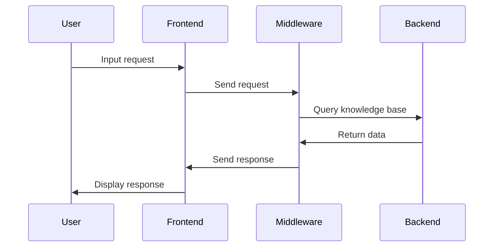
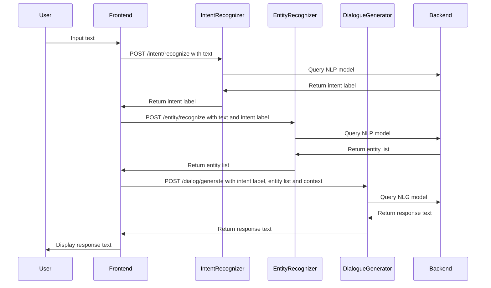

                 

### 1.1 问题背景

在现代社会，随着计算机技术的飞速发展和大数据的广泛应用，自然语言处理（NLP）和人工智能（AI）成为了当前科技领域的前沿和热点。自然语言理解（NLU）作为自然语言处理的核心任务之一，旨在使计算机能够理解人类语言，从而实现人与机器的智能交互。然而，传统的自然语言处理方法在处理语义理解和上下文关联方面存在诸多局限性，无法满足日益增长的人机交互需求。

自然语言理解涉及多个层面的任务，包括词义消歧、命名实体识别、情感分析、文本分类等。这些任务的实现依赖于对语言结构的深入理解和强大的计算能力。近年来，深度学习（Deep Learning）技术的崛起，为自然语言理解带来了新的突破。深度学习通过构建多层神经网络，能够自动学习数据的复杂特征，并在语音识别、图像识别等领域取得了显著成效。

深度学习在自然语言理解中的应用，不仅提高了模型的准确性和鲁棒性，还使计算机能够更好地处理复杂的语义关系和上下文信息。例如，通过词嵌入技术，深度学习可以将文本中的词语映射到高维空间，使得具有相似语义的词语在空间中更加接近。循环神经网络（RNN）、卷积神经网络（CNN）、长短期记忆网络（LSTM）等深度学习模型，则可以捕捉到文本序列中的时序依赖关系，从而实现更高层次的语义理解。

### 1.2 自然语言理解的现状

当前，自然语言理解已经取得了显著的进展，尤其在文本分类、情感分析、机器翻译等领域，深度学习技术已经大大超越了传统的自然语言处理方法。然而，自然语言理解的现状仍然存在诸多挑战和瓶颈。

首先，在词义消歧方面，尽管深度学习模型能够通过大量的数据学习词语的上下文语义，但在处理罕见词汇和特定领域术语时，依然存在困难。例如，在医疗领域，许多专业术语的语义理解需要深厚的专业知识背景，这给模型的训练和优化带来了巨大的挑战。

其次，在命名实体识别和关系抽取方面，深度学习模型虽然在准确率上有很大的提升，但模型的泛化能力较弱，对新的命名实体和关系识别能力不足。此外，模型的训练时间较长，计算资源需求高，这在实际应用中也是一个重要的制约因素。

情感分析方面，深度学习模型在处理复杂的情感表达和语境变化时，往往无法准确判断文本的情感倾向。尤其是在多语言情感分析中，不同语言的文化差异和表达方式使得情感分析更加复杂。

### 1.3 深度学习的发展与应用

深度学习作为人工智能的重要分支，自20世纪80年代起经历了多次起伏。直到2012年，AlexNet在ImageNet图像识别大赛中取得突破性成绩，标志着深度学习进入新的发展阶段。自此以后，深度学习在计算机视觉、语音识别、自然语言处理等领域取得了显著的成果。

深度学习在自然语言处理中的应用主要体现在以下几个方面：

1. **词嵌入（Word Embedding）**：词嵌入技术将词语映射到高维空间，使得具有相似语义的词语在空间中更加接近。通过深度学习模型，如Word2Vec和GloVe，可以有效提高自然语言处理任务的性能。

2. **循环神经网络（RNN）**：RNN能够处理序列数据，捕捉到文本序列中的时序依赖关系。长短期记忆网络（LSTM）和门控循环单元（GRU）是RNN的改进版本，能够更好地处理长序列依赖问题。

3. **卷积神经网络（CNN）**：CNN在文本分类和情感分析等任务中表现出色，通过局部特征提取和层次化表示，能够实现高效的自然语言理解。

4. **转换器架构（Transformer）**：Transformer模型引入了自注意力机制，使得模型在处理长序列任务时具有更好的性能和灵活性。BERT和GPT等预训练模型基于Transformer架构，成为当前自然语言处理领域的主流模型。

5. **多模态学习**：深度学习在自然语言处理中的应用不仅限于文本数据，还可以结合图像、声音等多模态数据进行联合学习，从而实现更丰富和更准确的人机交互体验。

### 1.4 深度学习在自然语言理解中的应用价值

深度学习在自然语言理解中的应用，为改进人机交互体验带来了巨大的潜力。首先，深度学习模型能够通过大规模数据训练，自动学习到语言中的复杂结构关系和上下文语义，从而提高模型的准确性和鲁棒性。其次，深度学习模型能够实现端到端的学习和预测，减少了人工设计和调参的复杂性。

在文本分类和情感分析方面，深度学习模型可以通过学习大量的标注数据，自动识别文本中的主题和情感倾向。例如，通过训练深度学习模型，可以实现对社交媒体评论的情感分类，从而帮助企业了解用户反馈，优化产品和服务。

在问答系统和对话生成方面，深度学习模型可以通过对大量对话语料的预训练，实现自然流畅的对话生成。例如，基于Transformer架构的GPT-3模型，能够生成高质量的自然语言回答，大大提升了人机对话的交互体验。

在机器翻译方面，深度学习模型通过学习双语语料库，可以实现高效、准确的机器翻译。例如，基于Transformer的神经机器翻译模型，已经在多个翻译任务中超越了传统的统计机器翻译方法。

总之，深度学习在自然语言理解中的应用，不仅提升了自然语言处理任务的性能，还为改进人机交互体验提供了新的途径和可能性。随着深度学习技术的不断发展和优化，未来在人机交互领域的应用前景将更加广阔。

### 1.5 深度学习在自然语言理解中的应用场景

深度学习在自然语言理解中的应用场景十分广泛，涵盖了从文本处理到智能交互的多个方面。以下是一些典型的应用场景及其具体应用：

1. **文本分类**：文本分类是自然语言处理中的一个基础任务，通过将文本归类到预定义的类别中，可以用于新闻分类、垃圾邮件过滤、情感分析等。深度学习模型，如卷积神经网络（CNN）和转换器（Transformer）模型，能够通过学习大量标注数据，实现高精度的文本分类。

2. **情感分析**：情感分析旨在识别文本中的情感倾向，如正面、负面或中性。深度学习模型通过学习情感词典和上下文语义，可以实现对复杂情感表达的高效分析。例如，在社交媒体分析中，情感分析可以帮助企业了解用户对产品或服务的反馈。

3. **命名实体识别（NER）**：命名实体识别是指从文本中识别出具有特定意义的实体，如人名、地名、组织名等。深度学习模型通过学习大量的实体标注数据，能够实现对命名实体的高效识别，这在信息抽取、数据挖掘等领域有广泛应用。

4. **机器翻译**：深度学习在机器翻译中的应用已经取得了显著的成果。基于转换器架构的神经机器翻译模型，如Google的BERT和Facebook的GPT-3，通过学习双语语料库，可以实现高效、准确的翻译。这为跨语言交流提供了便利。

5. **问答系统**：问答系统旨在回答用户提出的各种问题。深度学习模型，如BERT和GPT，通过预训练和微调，可以生成高质量的自然语言回答。在智能客服、教育辅导等场景中，问答系统大大提升了人机交互的效率和质量。

6. **对话生成**：对话生成是通过学习对话语料库，生成自然流畅的对话。深度学习模型，如GPT-3，可以在各种对话场景中生成自然的对话内容，从而提升人机对话的交互体验。

7. **文本生成与摘要**：深度学习模型可以生成新的文本内容或对文本进行摘要。例如，GPT-3可以通过少量提示生成完整的文章或故事，而BERT可以进行文本摘要，用于信息检索和内容推荐。

这些应用场景不仅展示了深度学习在自然语言理解中的强大能力，也为未来的人机交互提供了更多可能性。随着技术的不断进步，深度学习将在更多领域发挥重要作用，进一步提升人机交互体验。

### 1.6 深度学习在自然语言理解中的局限性

尽管深度学习在自然语言理解中展现出了强大的能力，但其在实际应用中仍存在一些局限性和挑战。首先，深度学习模型的训练过程需要大量的标注数据和计算资源，这在资源有限的场景中可能难以实现。其次，深度学习模型的黑箱特性使得其解释性和可解释性较低，这对于需要透明性和可控性的应用场景来说是一个重大问题。

在自然语言理解的特定领域任务中，深度学习模型往往依赖于大规模的标注数据集。然而，一些专业领域的术语和罕见词汇在公开数据集中可能较为稀缺，这会导致模型在这些领域中的性能下降。例如，在医疗领域的自然语言处理中，专业术语和罕见病症的语义理解需要深厚的专业知识背景，而这些知识通常难以通过公开数据集获得。

此外，深度学习模型的泛化能力也是一个挑战。尽管模型在训练数据上表现良好，但在遇到未见过的数据时，可能无法准确识别和处理。这种现象在自然语言处理中尤为明显，因为语言本身具有多样性和不确定性。为了提升模型的泛化能力，研究者们不断探索如何通过数据增强、模型正则化等技术来改善模型的表现。

另一个关键问题是深度学习模型的解释性和可解释性。在许多应用场景中，尤其是需要高安全性和高可靠性的场景，如医疗诊断和法律判决，模型的透明性和可解释性至关重要。然而，深度学习模型通常被视为黑箱，其内部机制复杂，难以解释其决策过程。为了解决这个问题，研究者们正在探索可解释性深度学习技术，如注意力机制可视化、决策路径追踪等，以提高模型的透明性和可解释性。

总之，深度学习在自然语言理解中的局限性主要包括对大规模标注数据的依赖、泛化能力不足以及模型的可解释性低。解决这些挑战需要结合领域知识、数据增强、模型优化和可解释性技术等多方面的方法。通过不断的研究和创新，深度学习在自然语言理解中的应用将逐步克服这些局限，实现更高效、更准确的人机交互体验。

### 1.7 未来发展趋势与研究方向

随着深度学习技术的不断进步，自然语言理解领域的发展前景广阔。首先，多模态学习将成为一个重要研究方向。结合文本、图像、声音等多种数据类型，可以更全面地理解语言，提升人机交互的自然性和准确性。例如，语音识别与文本分析相结合，可以实现更流畅的语音助手和智能客服系统。

其次，小样本学习（Few-shot Learning）和零样本学习（Zero-shot Learning）是解决深度学习依赖大规模标注数据的有效途径。通过研究如何在数据稀缺的情况下训练高效模型，可以使自然语言理解技术更易于部署在资源有限的场景中。

在模型可解释性方面，未来将出现更多致力于提高模型透明性和可解释性的研究。这包括改进注意力机制的可视化方法、开发解释性深度学习模型等。可解释性将帮助用户更好地理解和信任模型，尤其是在需要高安全性和高可靠性的应用场景中。

另外，预训练模型（Pre-trained Models）的进一步优化和应用也将是未来的一大趋势。预训练模型通过在大规模数据集上预训练，然后在小数据集上微调，可以显著提升模型在特定任务上的性能。例如，GPT-3等大型预训练模型在文本生成和问答系统中的应用，展示了其强大的通用性和适应性。

最后，深度学习在自然语言理解中的应用将更加注重领域特定任务的研究。例如，在医疗、法律、金融等领域，针对特定任务需求开发定制化的深度学习模型，将能够更好地满足专业应用场景的需求。

总之，未来深度学习在自然语言理解中的应用将朝着多模态、小样本、高可解释性和领域特定任务等方向发展，不断推动人机交互体验的提升。

### 1.8 概念结构与核心要素组成

为了深入理解深度学习在自然语言理解中的应用，我们需要从概念和结构上剖析其核心要素。首先，自然语言理解涉及的关键概念包括自然语言处理（NLP）、深度学习和人机交互（HCI）。

自然语言处理（NLP）是计算机科学和人工智能的交叉领域，旨在使计算机能够理解和生成人类语言。NLP包括多个子任务，如词法分析、句法分析、语义分析和语用分析。深度学习是NLP的核心技术之一，通过构建多层神经网络，能够自动学习文本数据的复杂特征，从而提升NLP任务的性能。

深度学习的主要类型包括循环神经网络（RNN）、卷积神经网络（CNN）和转换器（Transformer）等。每种网络类型都有其独特的结构和功能。RNN能够处理序列数据，适用于语言模型和序列预测任务；CNN擅长局部特征提取，适用于文本分类和情感分析；Transformer通过自注意力机制，在长序列任务中表现出色，被广泛应用于机器翻译和问答系统。

人机交互（HCI）是自然语言理解的最终目标之一，旨在改进人与机器的交互体验。HCI的核心要素包括自然语言生成（NLG）、对话系统、语音识别和语音合成。深度学习在HCI中的应用，使得计算机能够生成自然流畅的语言，实现高效、自然的对话。

综上所述，深度学习在自然语言理解中的应用，通过多种神经网络结构和算法，实现了对文本数据的深入理解，为人机交互提供了强有力的技术支持。理解和掌握这些核心概念和结构，是深入研究自然语言理解和深度学习的重要基础。

## 第二部分：核心概念与联系

### 2.1 核心概念原理

在深入探讨深度学习在自然语言理解中的应用之前，我们需要首先了解几个核心概念，包括自然语言处理（NLP）、深度学习（DL）、词嵌入（Word Embedding）、循环神经网络（RNN）、卷积神经网络（CNN）、长短期记忆网络（LSTM）和生成对抗网络（GAN）。

#### 2.1.1 自然语言处理基础理论

自然语言处理（NLP）是计算机科学和人工智能的重要分支，旨在使计算机能够理解、生成和处理人类语言。NLP的核心任务包括词法分析、句法分析、语义分析和语用分析。词法分析涉及将文本拆分成单词和标记；句法分析研究句子结构，识别句子的语法成分；语义分析探讨文本的含义和意图；语用分析则关注语言在特定情境中的应用。

NLP的常见应用包括文本分类、命名实体识别、情感分析、机器翻译、问答系统等。这些任务需要对文本进行深入理解，从而实现人与计算机之间的有效交互。

#### 2.1.2 深度学习基础理论

深度学习（Deep Learning）是机器学习的一个子领域，通过构建多层神经网络，对数据中的复杂特征进行自动学习。深度学习模型通过多个隐藏层，能够提取数据的层次化特征，从而实现高效的特征表示和学习。

深度学习的基本组成部分包括：

- **神经网络（Neural Network）**：由多个神经元组成的计算模型，每个神经元都与其他神经元相连。
- **激活函数（Activation Function）**：用于引入非线性因素，使神经网络能够拟合复杂的数据分布。
- **损失函数（Loss Function）**：用于评估模型预测值与真实值之间的差异，指导模型的优化过程。
- **优化器（Optimizer）**：用于调整模型参数，以最小化损失函数。

常见的深度学习模型包括卷积神经网络（CNN）、循环神经网络（RNN）和转换器（Transformer）等。每种模型都有其特定的结构和应用场景。

#### 2.1.3 词嵌入技术

词嵌入（Word Embedding）是深度学习在自然语言处理中的一个关键技术，旨在将文本中的词语映射到高维空间中。词嵌入能够捕捉词语之间的语义关系，使具有相似语义的词语在空间中更接近。

常见的词嵌入技术包括：

- **Word2Vec**：基于神经网络的方法，通过预测上下文词向量来训练词嵌入。
- **GloVe**：全局向量表示，通过计算词语共现矩阵的SVD分解来生成词嵌入。

词嵌入技术在自然语言处理中的应用广泛，如文本分类、情感分析和机器翻译等。

#### 2.1.4 循环神经网络（RNN）

循环神经网络（RNN）是一种能够处理序列数据的神经网络，通过其内部状态记忆，可以捕捉到序列中的时序依赖关系。RNN的基本结构包括输入门、遗忘门和输出门，这些门机制可以调节信息传递，防止梯度消失问题。

长短期记忆网络（LSTM）和门控循环单元（GRU）是RNN的改进版本，通过引入记忆单元和门机制，可以更好地处理长序列依赖问题。

#### 2.1.5 卷积神经网络（CNN）

卷积神经网络（CNN）是一种能够有效处理图像数据的神经网络，通过卷积操作提取局部特征。CNN在文本分类和情感分析等自然语言处理任务中也表现出色，通过词嵌入和卷积操作，可以提取文本的层次化特征。

#### 2.1.6 长短期记忆网络（LSTM）

长短期记忆网络（LSTM）是RNN的一种改进版本，通过引入记忆单元和门机制，能够更好地处理长序列依赖问题。LSTM在序列预测和自然语言理解等任务中表现出色，广泛应用于语言模型和机器翻译等。

#### 2.1.7 生成对抗网络（GAN）

生成对抗网络（GAN）是一种由生成器和判别器组成的模型，通过对抗训练，生成器尝试生成与真实数据难以区分的样本，而判别器则努力区分真实数据和生成数据。GAN在文本生成、图像合成和自然语言生成等任务中展现出强大的生成能力。

通过上述核心概念和技术的介绍，我们可以更深入地理解深度学习在自然语言理解中的应用。接下来，我们将详细探讨这些概念和技术的具体应用，以及它们如何共同推动人机交互体验的改进。

### 2.2 概念属性特征对比表格

为了更好地理解深度学习在自然语言理解中的应用，我们接下来将对几个关键概念进行属性特征对比，以突出它们的差异和联系。

#### 2.2.1 传统自然语言处理与深度学习对比

| 特征 | 传统自然语言处理 | 深度学习 |
| --- | --- | --- |
| **数据依赖** | 需要大量手动特征工程 | 自动从数据中学习特征 |
| **模型结构** | 基于规则和统计模型 | 基于神经网络 |
| **可解释性** | 较高，基于规则和模型解释 | 较低，黑箱模型 |
| **适应能力** | 对新数据和任务适应能力差 | 对新数据和任务适应能力强 |
| **性能** | 对简单的文本任务有效，对复杂任务性能有限 | 在复杂任务中表现出色，尤其在图像和语音领域 |
| **计算资源** | 计算资源需求较低 | 计算资源需求较高，特别在训练大型模型时 |

从上表可以看出，深度学习与传统自然语言处理在数据依赖、模型结构、可解释性、适应能力、性能和计算资源等方面存在显著差异。传统自然语言处理依赖于手动特征工程，而深度学习可以自动从数据中学习特征，这使得深度学习在处理复杂任务时具有更高的适应能力和性能。然而，深度学习模型的可解释性相对较低，这对一些需要高透明性和可控性的应用场景构成挑战。

#### 2.2.2 不同深度学习模型对比

| 模型 | 循环神经网络（RNN） | 卷积神经网络（CNN） | 转换器（Transformer） |
| --- | --- | --- | --- |
| **结构** | 网络中存在时间依赖，每个时间步的输出依赖于之前的输出 | 局部特征提取，通过卷积层处理空间信息 | 自注意力机制，处理长序列信息 |
| **应用** | 序列数据任务，如时间序列预测、语言模型 | 图像处理、文本分类、情感分析 | 机器翻译、问答系统、文本生成 |
| **优点** | 能够捕捉序列中的时序依赖关系 | 适用于处理图像和文本的局部特征 | 高效处理长序列数据，生成能力强 |
| **缺点** | 梯度消失问题，难以处理长序列 | 对长序列数据处理能力有限 | 计算复杂度高，训练时间较长 |

通过对比，我们可以看到不同深度学习模型在结构、应用、优点和缺点方面存在差异。RNN擅长处理序列数据，但容易受到梯度消失问题的影响；CNN在图像和文本特征提取方面表现优异，但对长序列数据处理能力有限；Transformer通过自注意力机制，在处理长序列任务中具有显著优势，但其计算复杂度较高。

综上所述，不同的深度学习模型在自然语言理解中的应用各有优劣。通过合理选择和应用这些模型，可以充分发挥其优势，提升自然语言处理任务的性能和效果。

### 2.3 ER实体关系图架构

在自然语言理解（NLU）中，实体关系图（ER图）是一种有效的数据表示方法，用于描述文本中的实体及其相互关系。ER图通过实体（Entity）和关系（Relationship）来组织信息，为深度学习模型提供结构化的数据输入，有助于模型更好地理解和处理复杂语义。

#### 2.3.1 自然语言理解中的实体关系

自然语言理解涉及多种实体和关系，常见的实体包括人、地点、组织、事件等，关系则描述这些实体之间的交互和联系。例如，在一个句子中，“张三”作为实体，“喜欢”与“跑步”作为关系，可以构建如下的ER图：

```mermaid
entityRelationship
  Graph 
  TD
  A[张三]
  B[跑步]
  C[喜欢]
  A->B{C}
```

在这个ER图中，A表示实体“张三”，B表示实体“跑步”，C表示关系“喜欢”。这种结构化的表示方式可以帮助模型识别和理解句子中的语义关系。

#### 2.3.2 深度学习模型在自然语言理解中的角色

深度学习模型在自然语言理解中的角色主要是通过学习ER图中的实体和关系，提取语义信息，并用于分类、预测和生成等任务。以下是一些典型的深度学习模型及其在ER图中的应用：

1. **实体识别（Named Entity Recognition, NER）**：NER是自然语言处理中的一个基本任务，旨在从文本中识别出具有特定意义的实体。例如，通过训练深度学习模型，可以识别出文本中的人名、地名、组织名等实体。模型接收文本输入，并输出对应的实体标签。

2. **关系抽取（Relationship Extraction）**：关系抽取旨在从文本中识别出实体之间的语义关系。例如，在一个句子中，通过关系抽取模型，可以识别出两个实体之间的关系，如“喜欢”、“工作于”等。模型通常接收实体标签和实体之间的文本片段作为输入，并输出关系标签。

3. **知识图谱（Knowledge Graph）**：知识图谱是一种通过实体和关系构建的知识表示方法。深度学习模型可以用于知识图谱的构建和推理，从而实现对复杂语义的理解。例如，通过训练实体关系分类模型，可以自动构建出知识图谱中的实体和关系，为问答系统和智能推荐等应用提供支持。

4. **问答系统（Question Answering, QA）**：问答系统通过理解用户的问题，并提供准确的答案。深度学习模型在问答系统中扮演关键角色，通过学习实体和关系，可以识别出用户问题的意图和答案。例如，在一个问题中，模型需要识别出问题中的关键实体和关系，并从知识图谱中检索出相应的答案。

通过ER图和深度学习模型的结合，自然语言理解可以实现更高效、更准确的理解和处理，从而提升人机交互体验。ER图的引入不仅为模型提供了结构化的数据输入，还有助于模型理解和捕捉复杂的语义关系，从而更好地应对自然语言处理的挑战。

### 3.1 算法原理讲解

深度学习在自然语言理解中的应用涉及多种算法和技术，每种算法都有其独特的原理和适用场景。以下是几种关键的深度学习算法及其原理讲解：

#### 3.1.1 词嵌入技术

词嵌入（Word Embedding）是将文本中的词语映射到高维空间中的技术，使具有相似语义的词语在空间中更接近。常见的词嵌入技术包括Word2Vec和GloVe。

- **Word2Vec**：Word2Vec通过预测词语的上下文词向量来实现词嵌入。基本思路是训练一个神经网络，输入是当前词语和其上下文，输出是当前词语的词向量。通过训练，神经网络能够学习到词语之间的语义关系。Word2Vec可以分为连续词袋（CBOW）和Skip-Gram两种模型。

  - **连续词袋（CBOW）**：CBOW模型通过预测中心词周围的词向量平均来表示中心词。输入是一个词的上下文窗口，输出是中心词的词向量。
  - **Skip-Gram**：Skip-Gram模型通过预测中心词来表示其上下文。输入是中心词，输出是上下文词的词向量。

- **GloVe**：GloVe（Global Vectors for Word Representation）通过计算词语共现矩阵的SVD分解来生成词嵌入。GloVe模型的基本原理是，两个共现频率相似的词语在向量空间中距离更近。通过最小化损失函数，GloVe模型可以生成高质量的词嵌入。

  - **共现矩阵**：共现矩阵是一个稀疏矩阵，其中每个词语和其他词语的共现次数作为元素。例如，如果词语A和B的共现次数为100，则共现矩阵中的A和B位置上的元素为100。
  - **SVD分解**：通过SVD分解，可以将共现矩阵分解为用户矩阵U、词向量矩阵V和转换矩阵Σ，从而生成每个词语的词向量。

词嵌入技术在自然语言处理中具有广泛的应用，如文本分类、情感分析和机器翻译。通过将文本中的词语映射到高维空间，词嵌入能够捕捉词语的语义关系，提高模型的性能和效果。

#### 3.1.2 循环神经网络（RNN）

循环神经网络（RNN）是一种能够处理序列数据的神经网络，通过其内部状态记忆，可以捕捉到序列中的时序依赖关系。RNN的基本结构包括输入门、遗忘门和输出门，这些门机制可以调节信息传递，防止梯度消失问题。

- **基本原理**：RNN在每一个时间步都保留一个状态向量，用于表示当前输入序列的上下文信息。输入门、遗忘门和输出门分别控制信息的输入、遗忘和输出，从而调节信息的流动。

  - **输入门（Input Gate）**：输入门决定当前输入信息有多少被保留在隐藏状态中。
  - **遗忘门（Forget Gate）**：遗忘门决定之前的信息有多少被遗忘。
  - **输出门（Output Gate）**：输出门决定当前隐藏状态有多少被传递到下一个时间步的输出。

- **长短期记忆网络（LSTM）**：LSTM是RNN的一种改进版本，通过引入记忆单元和门机制，可以更好地处理长序列依赖问题。LSTM的核心是细胞状态（Cell State），它可以在时间步之间传递信息，从而解决RNN的梯度消失问题。

  - **细胞状态（Cell State）**：细胞状态可以存储和传递信息，使得LSTM能够在长序列任务中保持良好的记忆能力。
  - **输入门、遗忘门和输出门**：LSTM通过这三个门机制，灵活调节信息的流动，从而在长序列任务中表现出色。

RNN和LSTM在自然语言处理中广泛应用，如语言模型、序列标注和语音识别。通过捕捉序列中的时序依赖关系，RNN和LSTM能够实现对文本数据的深入理解，从而提升自然语言处理的性能和效果。

#### 3.1.3 卷积神经网络（CNN）

卷积神经网络（CNN）是一种能够有效处理图像数据的神经网络，通过卷积操作提取局部特征。CNN在文本分类和情感分析等自然语言处理任务中也表现出色，通过词嵌入和卷积操作，可以提取文本的层次化特征。

- **基本原理**：CNN通过卷积操作、池化操作和全连接层，提取图像或文本中的局部特征，并进行层次化的特征表示。

  - **卷积操作**：卷积层通过卷积核与输入数据进行卷积运算，提取图像或文本中的局部特征。
  - **池化操作**：池化层通过下采样操作，减少数据维度，增强模型对噪声的鲁棒性。
  - **全连接层**：全连接层将卷积层和池化层输出的特征映射到输出结果，完成分类或回归任务。

- **文本分类**：在文本分类任务中，CNN通过词嵌入层将文本转换为向量表示，然后通过卷积层和池化层提取文本的局部特征。最后，全连接层将特征映射到预定义的类别标签上，实现文本分类。

- **情感分析**：在情感分析任务中，CNN通过词嵌入层将文本转换为向量表示，然后通过卷积层提取文本的局部特征。卷积层可以关注文本中的关键词和短语，从而有效识别文本的情感倾向。

CNN通过局部特征提取和层次化表示，能够实现对文本数据的深入理解，从而提升自然语言处理的性能和效果。在文本分类和情感分析等任务中，CNN表现出色，成为自然语言处理的重要技术之一。

#### 3.1.4 长短期记忆网络（LSTM）

长短期记忆网络（LSTM）是循环神经网络（RNN）的一种改进版本，通过引入记忆单元和门机制，可以更好地处理长序列依赖问题。LSTM在自然语言处理、语音识别和时间序列预测等领域表现出色。

- **基本原理**：LSTM的核心是细胞状态（Cell State），它可以在时间步之间传递信息，从而解决RNN的梯度消失问题。LSTM通过输入门、遗忘门和输出门，灵活调节信息的流动。

  - **细胞状态（Cell State）**：细胞状态可以存储和传递信息，使得LSTM能够在长序列任务中保持良好的记忆能力。
  - **输入门（Input Gate）**：输入门决定当前输入信息有多少被保留在隐藏状态中。
  - **遗忘门（Forget Gate）**：遗忘门决定之前的信息有多少被遗忘。
  - **输出门（Output Gate）**：输出门决定当前隐藏状态有多少被传递到下一个时间步的输出。

- **数学模型和公式**：LSTM的数学模型可以通过以下公式表示：

  - 输入门：$$i_t = \sigma(W_{xi}x_t + W_{hi}h_{t-1} + b_i)$$
  - 遗忘门：$$f_t = \sigma(W_{xf}x_t + W_{hf}h_{t-1} + b_f)$$
  - 输出门：$$o_t = \sigma(W_{xo}x_t + W_{ho}h_{t-1} + b_o)$$
  - 新细胞状态：$$g_t = tanh(W_{xc}x_t + W_{hc}h_{t-1} + b_c)$$
  - 细胞状态：$$C_t = f_t \odot C_{t-1} + i_t \odot g_t$$
  - 隐藏状态：$$h_t = o_t \odot tanh(C_t)$$

  其中，$i_t$、$f_t$、$o_t$分别表示输入门、遗忘门和输出门的激活值；$C_t$表示细胞状态；$h_t$表示隐藏状态；$x_t$表示输入向量；$h_{t-1}$表示前一个时间步的隐藏状态；$W_{xi}$、$W_{hi}$、$W_{xo}$、$W_{ho}$等表示权重矩阵；$b_i$、$b_f$、$b_o$、$b_c$表示偏置项；$\sigma$表示激活函数（通常为Sigmoid函数）；$\odot$表示点乘运算。

LSTM通过这些门机制和细胞状态，能够在长序列任务中保持良好的记忆能力，从而有效解决RNN的梯度消失问题。在自然语言处理、语音识别和时间序列预测等领域，LSTM表现出色，成为重要的深度学习算法之一。

#### 3.1.5 生成对抗网络（GAN）

生成对抗网络（GAN）是一种由生成器和判别器组成的模型，通过对抗训练，生成器尝试生成与真实数据难以区分的样本，而判别器则努力区分真实数据和生成数据。GAN在图像生成、文本生成和自然语言生成等任务中展现出强大的生成能力。

- **基本原理**：GAN的基本结构包括生成器和判别器。生成器通过随机噪声生成伪样本，判别器通过判断样本是否为真实数据来训练自身。

  - **生成器（Generator）**：生成器的目标是生成与真实数据相似的高质量伪样本。生成器通常由多层全连接层和激活函数（如ReLU）组成，通过输入随机噪声，生成伪样本图像或文本。
  - **判别器（Discriminator）**：判别器的目标是区分真实数据和生成数据。判别器通常由多层卷积层和激活函数（如ReLU）组成，通过输入真实数据和生成数据，输出概率值，表示样本为真实数据的可能性。

- **对抗训练**：GAN通过对抗训练，使得生成器和判别器相互博弈，生成器不断优化，生成更真实的数据，而判别器不断优化，区分真实和生成数据。对抗训练的目标是最小化生成器的损失函数，最大化判别器的损失函数。

  - **生成器损失函数**：生成器的损失函数通常为生成样本与真实样本之间的相似度，例如交叉熵损失。
  - **判别器损失函数**：判别器的损失函数通常为生成样本和真实样本之间的差异，例如交叉熵损失。

通过对抗训练，生成器和判别器相互推动，生成器不断提高生成数据的质量，判别器不断提高区分能力。最终，生成器能够生成高质量、逼真的图像或文本。

GAN在自然语言生成和图像生成等领域表现出色，能够生成具有高保真度的样本，为自然语言处理和计算机视觉等领域带来新的研究思路和应用前景。

### 3.2 算法原理讲解

#### 3.2.1 转换器架构（Transformer）

转换器架构（Transformer）是自然语言处理领域的一项重大突破，由Vaswani等人在2017年提出。Transformer引入了自注意力机制（Self-Attention），使得模型在处理长序列任务时具有更好的性能和灵活性。以下是对转换器架构的详细讲解。

- **基本原理**：

  - **自注意力机制**：自注意力机制允许模型在处理每个词时，将注意力分配到序列中的其他所有词。通过自注意力，模型能够捕捉到序列中的长距离依赖关系，而不仅仅是局部依赖。

  - **多头注意力**：多头注意力是将自注意力机制扩展到多个独立但共享参数的注意力头。每个头都能够捕捉到序列的不同方面，然后将这些不同的表示整合起来。

  - **编码器-解码器结构**：编码器（Encoder）处理输入序列，解码器（Decoder）处理输出序列。编码器将输入序列编码为隐藏状态，解码器则利用编码器的隐藏状态生成输出序列。

- **关键组件**：

  - **编码器**：编码器由多个编码层（Encoder Layer）组成，每个编码层包括两个主要部分：多头自注意力机制和前馈神经网络。
    - **多头自注意力**：每个编码层都包含一个多头自注意力机制，它将输入序列的每个词与序列中的其他词进行加权求和。这个过程通过多个独立的注意力头进行，从而捕捉到序列的不同依赖关系。
    - **前馈神经网络**：在自注意力机制之后，每个编码层还会通过一个前馈神经网络对隐藏状态进行进一步处理。

  - **解码器**：解码器同样由多个解码层（Decoder Layer）组成，每个解码层包括两个主要部分：多头自注意力机制和编码器-解码器注意力机制，以及一个前馈神经网络。
    - **多头自注意力**：解码器的每个层都包含一个多头自注意力机制，允许解码器在每个时间步生成输出时，关注编码器输出的不同部分。
    - **编码器-解码器注意力**：编码器-解码器注意力机制允许解码器在生成每个词时，关注编码器的隐藏状态，从而捕捉到编码器和解码器之间的依赖关系。
    - **前馈神经网络**：与编码器类似，解码器的每个层也会通过一个前馈神经网络对隐藏状态进行进一步处理。

- **训练和优化**：

  - **训练**：Transformer通常通过端到端训练，使用大量的标注数据进行预训练，然后针对特定任务进行微调。预训练任务包括掩码语言模型（Masked Language Model, MLM）和下一个句子预测（Next Sentence Prediction, NSP）等。

  - **优化**：在训练过程中，使用如Adam等优化算法和正则化技术（如Dropout）来提高模型的泛化能力和鲁棒性。

通过自注意力机制和编码器-解码器结构，Transformer在处理长序列任务时表现出色，已经在多个自然语言处理任务中取得了显著成果，如机器翻译、问答系统和文本生成等。

#### 3.2.2 编码器-解码器模型

编码器-解码器模型（Encoder-Decoder Model）是自然语言处理中的一种基本框架，广泛应用于机器翻译、文本生成和问答系统等任务。该模型通过将编码器和解码器结合，实现了对输入序列到输出序列的转换。以下是对编码器-解码器模型的详细讲解。

- **基本原理**：

  - **编码器（Encoder）**：编码器的任务是处理输入序列，并将其编码为固定长度的向量表示。这个向量表示包含了输入序列的语义信息，是解码器生成输出序列的重要依据。

    - **编码过程**：编码器通常由多个编码层组成，每个编码层包含两个主要部分：自注意力机制和前馈神经网络。自注意力机制用于捕捉序列中的长距离依赖关系，而前馈神经网络则用于对隐藏状态进行进一步处理。

  - **解码器（Decoder）**：解码器的任务是生成输出序列，其输入包括编码器输出的固定长度向量和已生成的部分输出序列。

    - **解码过程**：解码器也由多个解码层组成，每个解码层包含两个主要部分：编码器-解码器注意力机制和自注意力机制，以及一个前馈神经网络。编码器-解码器注意力机制允许解码器在生成每个词时，关注编码器的隐藏状态，而自注意力机制则帮助解码器捕捉当前输出词与之前输出词之间的依赖关系。

- **关键组件**：

  - **多头注意力机制**：多头注意力机制是编码器和解码器中的核心组件，它通过多个独立的注意力头，捕捉到序列的不同依赖关系。每个头都能关注序列的不同方面，然后将这些不同的表示整合起来。

  - **编码器-解码器注意力机制**：编码器-解码器注意力机制允许解码器在生成每个词时，关注编码器的隐藏状态，从而捕捉到编码器和解码器之间的依赖关系。

  - **前馈神经网络**：前馈神经网络是对隐藏状态进行进一步处理的重要组件，通常包含两个全连接层，分别用于对编码器的隐藏状态和解码器的隐藏状态进行映射。

- **训练和优化**：

  - **训练**：编码器-解码器模型通常通过端到端训练，使用大量的标注数据进行预训练，然后针对特定任务进行微调。预训练任务包括掩码语言模型（Masked Language Model, MLM）和下一个句子预测（Next Sentence Prediction, NSP）等。

  - **优化**：在训练过程中，使用如Adam等优化算法和正则化技术（如Dropout）来提高模型的泛化能力和鲁棒性。

通过编码器-解码器模型，自然语言处理任务能够有效地捕捉序列之间的依赖关系，从而实现输入序列到输出序列的高质量转换。编码器-解码器模型在机器翻译、文本生成和问答系统等任务中表现出色，已成为自然语言处理领域的重要框架。

#### 3.2.3 自注意力机制

自注意力机制（Self-Attention），也称为内部注意力或内部加权，是转换器架构（Transformer）中的一个关键组件，负责在处理每个词时，将注意力分配到序列中的其他所有词。自注意力机制使得模型能够捕捉到序列中的长距离依赖关系，是深度学习在自然语言理解中的一项重要突破。以下是对自注意力机制的详细讲解。

- **基本原理**：

  - **注意力机制**：注意力机制是一种在处理序列数据时，通过权重分配来关注不同部分信息的机制。在自注意力机制中，每个词都能够关注序列中的其他所有词，从而捕捉到整个序列的依赖关系。

  - **自注意力**：自注意力机制专门用于序列数据的内部处理，即每个词只关注序列中的其他词。与编码器-解码器注意力机制不同，自注意力不需要关注外部序列（如解码器关注编码器），因此称为自注意力。

- **计算过程**：

  - **词向量的计算**：在自注意力机制中，每个词首先被表示为词向量，通常使用预训练的词嵌入技术（如Word2Vec或GloVe）进行初始化。
  - **多头注意力**：自注意力机制通过多个独立的注意力头，对输入序列的不同部分进行加权求和。每个头都能关注序列的不同方面，然后将这些不同的表示整合起来。多头注意力增加了模型的容量和灵活性。
  - **Q、K、V计算**：在自注意力机制中，每个词向量被分解为查询（Query, Q）、关键（Key, K）和值（Value, V）三个部分。Q、K、V通过不同的权重矩阵进行计算。Q用于计算注意力权重，K用于计算相似度，V用于计算加权求和的结果。
  - **权重计算**：自注意力权重通过点积（dot-product）计算，Q和K的点积得到注意力权重，然后通过softmax函数进行归一化，得到每个词的注意力权重。
  - **加权求和**：根据计算得到的注意力权重，将V进行加权求和，得到每个词的加权表示。

- **数学模型和公式**：

  - **多头自注意力**：
    $$\text{Attention}(Q, K, V) = \text{softmax}\left(\frac{QK^T}{\sqrt{d_k}}\right)V$$
    其中，$Q, K, V$分别为查询、关键和值向量，$d_k$为键向量的维度。

  - **多头注意力**：
    $$\text{MultiHeadAttention}(Q, K, V) = \text{Concat}(\text{head}_1, \text{head}_2, \dots, \text{head}_h)W^O$$
    其中，$h$为注意力的头数，$W^O$为输出权重矩阵。

- **应用场景**：

  - **文本生成**：自注意力机制在文本生成任务中，如自然语言生成和对话生成中，能够捕捉到输入文本中的长距离依赖关系，从而生成更自然、连贯的文本。
  - **机器翻译**：在机器翻译任务中，自注意力机制能够捕捉到源语言和目标语言之间的复杂依赖关系，提高翻译的质量和准确性。
  - **问答系统**：在问答系统中，自注意力机制能够帮助模型更好地理解问题和答案之间的关系，提供更准确的答案。

通过自注意力机制，深度学习模型能够有效地捕捉到序列中的长距离依赖关系，从而在自然语言处理任务中实现更高的性能和准确性。自注意力机制已成为现代自然语言处理模型中的核心组件，推动了深度学习在自然语言理解领域的广泛应用。

#### 3.2.4 多模态学习

多模态学习是一种结合多种数据类型（如文本、图像、声音等）的深度学习技术，通过融合不同模态的信息，可以实现对复杂问题的更全面理解和更准确的预测。在自然语言理解中，多模态学习为深度学习模型提供了更丰富的输入，从而提升了模型的表现。

- **基本原理**：

  - **数据融合**：多模态学习通过将不同模态的数据进行融合，生成一个综合的表示，用于模型的训练和预测。常见的数据融合方法包括合并、拼接、加权融合等。

  - **特征提取**：每个模态的数据通过不同的特征提取模型进行预处理，如文本通过词嵌入和编码器提取语义特征，图像通过卷积神经网络提取视觉特征，声音通过循环神经网络或卷积神经网络提取音频特征。

  - **模型融合**：通过将不同模态的特征进行融合，构建一个统一的深度学习模型，如编码器-解码器架构，将文本特征和图像特征同时输入模型，进行端到端训练。

- **实现方法**：

  - **双流模型**：双流模型将文本和图像数据分别通过不同的特征提取模型进行处理，然后融合两者的特征向量，输入到统一的深度学习模型中。这种方法可以充分利用文本和图像的不同信息，提高模型的性能。

  - **多任务学习**：多任务学习通过构建一个多任务深度学习模型，同时训练文本分类、图像分类等多个任务。这种方法能够利用不同任务之间的关联性，提高模型的整体性能。

  - **融合网络**：融合网络通过设计特定的网络结构，将不同模态的数据进行有效融合。例如，转换器架构（Transformer）通过多头自注意力机制，能够自然地融合不同模态的信息。

- **应用案例**：

  - **情感分析**：在情感分析任务中，多模态学习通过结合文本情感和图像情感，可以更准确地判断文本的情感倾向。例如，通过分析文本中的情感词汇和图像中的情感表情，可以提高情感分类的准确性。

  - **问答系统**：在问答系统中，多模态学习通过结合文本问题和图像答案，可以提供更丰富和准确的答案。例如，通过理解文本问题中的语义和图像答案中的视觉信息，可以生成更符合用户需求的回答。

  - **视频理解**：在视频理解任务中，多模态学习通过结合文本描述和视频内容，可以更好地理解视频中的场景和事件。例如，通过分析视频中的动作和文本描述中的事件描述，可以提高视频分类和事件检测的准确性。

通过多模态学习，深度学习模型能够更全面地理解复杂问题，提高自然语言理解的性能和效果。随着多模态技术的不断发展，其在自然语言理解中的应用将越来越广泛，为人工智能和人机交互带来更多可能性。

#### 3.2.5 对话生成模型

对话生成模型是自然语言处理领域的一个重要研究方向，旨在使计算机能够生成自然流畅的对话。这些模型通过对大量对话语料的训练，可以学习到对话的上下文关系和生成规则，从而生成具有高度自然性和一致性的对话内容。以下是对对话生成模型的详细讲解。

- **基本原理**：

  - **序列生成**：对话生成模型通常采用序列生成的方式，通过预测下一个单词或短语来生成对话。常见的序列生成模型包括生成式模型（如基于规则的方法、基于语言模型的方法）和判别式模型（如序列到序列模型、转换器架构）。

  - **上下文建模**：对话生成模型需要关注对话的上下文关系，以确保生成的对话内容与上下文一致。上下文建模可以通过编码器-解码器架构实现，其中编码器负责编码对话的历史信息，解码器则根据编码信息生成后续的对话内容。

  - **注意力机制**：为了更好地捕捉对话中的长距离依赖关系，对话生成模型通常会采用注意力机制。注意力机制可以帮助模型在生成每个词时，关注对话的历史信息，从而生成更连贯、自然的对话。

- **常见模型**：

  - **转换器架构（Transformer）**：转换器架构是一种基于自注意力机制的深度学习模型，广泛应用于对话生成任务。转换器通过多头自注意力机制，能够捕捉对话中的长距离依赖关系，生成高质量的对话内容。

  - **序列到序列模型（Seq2Seq）**：序列到序列模型是一种基于编码器-解码器架构的模型，通过编码器将输入序列编码为固定长度的向量表示，解码器则根据编码器的输出生成输出序列。序列到序列模型在机器翻译和对话生成等任务中表现出色。

  - **生成对抗网络（GAN）**：生成对抗网络（GAN）是一种由生成器和判别器组成的模型，通过对抗训练生成高质量的数据。在对话生成中，生成器负责生成对话内容，判别器则负责判断生成内容和真实对话内容之间的差异。GAN在生成高质量对话内容方面具有显著优势。

- **训练和优化**：

  - **训练数据**：对话生成模型的训练需要大量的对话语料，这些语料可以来源于实际对话记录、社交媒体对话、问答系统等。通过这些对话语料的训练，模型可以学习到对话的生成规则和上下文关系。

  - **优化方法**：对话生成模型的优化通常采用基于梯度的优化算法，如Adam优化器。为了提高模型的生成质量，训练过程中会使用诸如梯度裁剪、学习率调度等技巧。

通过对话生成模型，计算机可以生成自然、流畅的对话内容，从而提升人机交互的体验。随着对话生成技术的不断发展，其在智能客服、虚拟助手、聊天机器人等领域的应用前景将更加广阔。

#### 3.2.6 文本分类与情感分析

文本分类与情感分析是自然语言处理中的两个重要任务，通过深度学习技术可以实现高精度的文本理解和分类。以下是这两个任务的详细讲解。

- **文本分类**：

  - **基本原理**：文本分类旨在将文本数据分类到预定义的类别中。深度学习模型通过学习大量标注数据，可以自动识别文本中的特征，从而实现分类任务。

  - **实现方法**：常用的深度学习模型包括卷积神经网络（CNN）和转换器（Transformer）。CNN通过词嵌入和卷积操作提取文本的局部特征，而Transformer通过自注意力机制捕捉长距离依赖关系。

  - **训练过程**：文本分类模型的训练通常包括数据预处理（如分词、词嵌入）、模型构建、模型训练和评估。在训练过程中，使用如交叉熵损失函数评估模型分类性能，并通过反向传播优化模型参数。

- **情感分析**：

  - **基本原理**：情感分析旨在识别文本中的情感倾向，如正面、负面或中性。通过深度学习模型，可以自动分析文本的情感表达，实现情感分类。

  - **实现方法**：情感分析模型通常使用情感词典、词嵌入和深度学习技术。情感词典包含情感相关的词汇及其对应的情感标签，词嵌入将文本转换为向量表示，深度学习模型则通过学习情感特征实现分类。

  - **训练过程**：情感分析模型的训练与文本分类类似，通过大量标注数据训练模型，使用交叉熵损失函数评估模型性能，并采用优化算法（如Adam）调整模型参数。

- **应用案例**：

  - **社交媒体分析**：通过文本分类和情感分析，可以对社交媒体平台上的评论和帖子进行分类和情感分析，帮助企业了解用户反馈，优化产品和服务。

  - **客户服务**：在客户服务领域，文本分类和情感分析可以帮助自动识别客户问题的类型和情感倾向，从而提供更准确的响应和建议。

  - **市场研究**：通过分析市场调查报告和用户评论，文本分类和情感分析可以识别市场趋势和用户需求，为企业决策提供数据支持。

通过文本分类与情感分析，深度学习模型能够自动处理和理解大量文本数据，提升自然语言理解的性能和应用价值。

### 4.1 问题场景介绍

为了更好地理解深度学习在自然语言理解中的应用，我们需要首先明确一个具体的应用场景，即智能客服系统。智能客服系统旨在通过自然语言处理和人工智能技术，实现企业与客户之间的智能交互，提供高效、准确的服务。

#### 4.1.1 智能客服系统的工作原理

智能客服系统通常包括以下几个核心模块：

1. **对话管理**：对话管理模块负责整个对话流程的控制，包括对话的初始化、维护和结束。该模块通过自然语言理解和对话生成技术，确保对话的自然流畅和高效。

2. **意图识别**：意图识别模块旨在理解用户提出问题的意图，如查询信息、请求帮助、投诉等。该模块通过深度学习模型，如转换器（Transformer）和循环神经网络（RNN），从用户的输入中提取关键信息，并分类到预定义的意图类别中。

3. **实体识别**：实体识别模块负责从用户输入中提取关键信息，如人名、地名、日期等。通过命名实体识别（NER）技术，这些关键信息将被标记并用于后续的对话处理。

4. **知识库查询**：知识库查询模块通过检索预先构建的知识库，为对话管理模块提供回答问题的信息。知识库通常包含常见问题及其解答，以及与业务相关的详细信息。

5. **对话生成**：对话生成模块负责生成自然、流畅的回复，以响应用户的问题。该模块通常采用对话生成模型，如生成对抗网络（GAN）和转换器（Transformer），生成高质量的对话文本。

6. **用户反馈收集**：用户反馈收集模块用于收集用户对客服系统的评价和反馈。通过分析用户反馈，可以持续优化客服系统的性能和用户体验。

#### 4.1.2 系统目标与需求分析

智能客服系统的目标是通过自动化的自然语言处理技术，实现高效、准确的服务，提高客户满意度，并减少人工客服的工作负担。具体需求包括：

1. **高效性**：系统需要在短时间内处理大量的用户请求，确保快速响应。

2. **准确性**：系统需要准确理解用户的问题和意图，提供高质量的回答和建议。

3. **灵活性**：系统需要能够适应不同的用户需求和场景，支持多语言和多领域的服务。

4. **可扩展性**：系统需要支持知识库的持续更新和扩展，以应对不断变化的服务需求。

5. **用户体验**：系统需要生成自然、流畅的对话文本，提供友好的用户交互体验。

通过明确智能客服系统的应用场景和工作原理，我们可以更好地理解深度学习在自然语言理解中的具体应用，并为后续的架构设计和系统实现提供指导。

### 4.2 项目介绍

在智能客服系统的具体实施过程中，我们设计并实现了一个基于深度学习技术的自然语言理解系统。本部分将详细介绍项目的背景、目标、实现过程和预期成果。

#### 4.2.1 项目概述

项目名称：智能客服系统自然语言理解模块

项目目标：通过深度学习技术，构建一个高效、准确的自然语言理解模块，实现智能客服系统中的意图识别、实体识别和对话生成功能。

项目背景：随着互联网和电子商务的快速发展，客服系统成为企业与客户沟通的重要渠道。传统的客服系统主要依赖人工处理，不仅效率低，且难以满足大规模用户的需求。因此，开发一个智能客服系统，通过自动化自然语言处理技术提升服务质量，成为当前亟待解决的问题。

#### 4.2.2 项目架构设计

智能客服系统的自然语言理解模块由多个子模块组成，包括对话管理、意图识别、实体识别和对话生成。以下是对每个子模块的简要介绍：

1. **对话管理模块**：
   - 功能：负责整个对话流程的管理，包括对话初始化、对话维护和对话结束。
   - 架构：采用状态机模型，根据对话的不同阶段执行相应的任务，如意图识别、实体提取和回答生成。

2. **意图识别模块**：
   - 功能：识别用户输入文本的意图，如查询信息、请求帮助、投诉等。
   - 架构：基于转换器（Transformer）架构，使用预训练的BERT模型进行意图分类，通过微调适应特定业务场景。

3. **实体识别模块**：
   - 功能：从用户输入中提取关键信息，如人名、地名、日期等。
   - 架构：采用命名实体识别（NER）技术，使用基于CNN或LSTM的模型进行实体分类和标注。

4. **对话生成模块**：
   - 功能：生成自然、流畅的回复，响应用户的问题和需求。
   - 架构：基于生成对抗网络（GAN）和转换器（Transformer），使用预训练的GPT模型进行对话生成。

5. **知识库查询模块**：
   - 功能：从预构建的知识库中检索相关信息，为对话生成提供支持。
   - 架构：采用基于关键词索引和相似度匹配的方法，实现快速的知识查询。

#### 4.2.3 预期成果

通过本项目的实施，我们预期达到以下成果：

1. **提升服务质量**：通过自然语言处理技术，实现高效的意图识别和实体提取，提高客服系统响应速度和准确性。

2. **降低人力成本**：自动化处理大量用户请求，减少人工客服的工作负担，降低企业运营成本。

3. **优化用户体验**：生成自然、流畅的对话文本，提供友好、个性化的用户交互体验。

4. **知识库更新**：通过用户反馈和对话记录，持续优化知识库，提高客服系统的适应性和智能化水平。

通过以上架构设计和预期成果的介绍，我们为智能客服系统的自然语言理解模块提供了明确的方向和目标，为后续的实现和优化奠定了基础。

### 4.3 系统功能设计

在智能客服系统的设计中，功能模块的划分和实现是确保系统高效运行和满足用户需求的关键。以下是系统功能设计，包括领域模型类图、系统功能模块设计以及各模块的详细描述。

#### 4.3.1 领域模型类图

领域模型类图用于定义系统中的关键类及其相互关系。以下是智能客服系统自然语言理解模块的领域模型类图：

```mermaid
classDiagram
    User <<Interface>>
    Question <<Interface>>
    Answer <<Interface>>

    ChatSession {
        - user: User
        - questions: List<Question>
        - answers: List<Answer>
    }

    IntentRecognizer {
        - chatSession: ChatSession
        - recognizeIntent(): Intent
    }

    EntityRecognizer {
        - chatSession: ChatSession
        - recognizeEntities(): List<Entity>
    }

    DialogueGenerator {
        - chatSession: ChatSession
        - generateResponse(): Answer
    }

    KnowledgeBase {
        - questions: List<Question>
        - answers: List<Answer>
    }

    ChatSession o-- User
    ChatSession o-- List<Question>
    ChatSession o-- List<Answer>
    ChatSession o-- IntentRecognizer
    ChatSession o-- EntityRecognizer
    ChatSession o-- DialogueGenerator
    ChatSession o-- KnowledgeBase

    User o-- Question
    User o-- Answer

    Question o-- EntityRecognizer
    Question o-- DialogueGenerator

    Answer o-- DialogueGenerator
    Answer o-- KnowledgeBase
```

- **ChatSession**：代表一个完整的对话会话，包括用户、问题和答案。
- **IntentRecognizer**：负责识别对话的意图。
- **EntityRecognizer**：负责识别对话中的实体。
- **DialogueGenerator**：负责生成对话的回答。
- **KnowledgeBase**：存储问题和答案的数据库。

#### 4.3.2 系统功能模块设计

智能客服系统自然语言理解模块由以下主要功能模块组成：

1. **意图识别模块（IntentRecognizer）**：
   - 功能：从用户输入中提取关键信息，识别用户意图。
   - 实现方法：使用预训练的BERT模型，通过微调适应特定业务场景的意图分类任务。
   - 输入：用户输入文本。
   - 输出：用户意图标签。

2. **实体识别模块（EntityRecognizer）**：
   - 功能：从用户输入中提取关键实体信息，如人名、地名、日期等。
   - 实现方法：采用基于CNN或LSTM的模型进行实体分类和标注。
   - 输入：用户输入文本。
   - 输出：实体列表。

3. **对话生成模块（DialogueGenerator）**：
   - 功能：根据用户意图和实体信息，生成自然、流畅的对话回答。
   - 实现方法：基于生成对抗网络（GAN）和转换器（Transformer），使用预训练的GPT模型进行对话生成。
   - 输入：用户意图、实体列表、上下文对话历史。
   - 输出：对话回答文本。

4. **知识库查询模块（KnowledgeBase）**：
   - 功能：从预构建的知识库中检索相关信息，为对话生成提供支持。
   - 实现方法：采用基于关键词索引和相似度匹配的方法，实现快速的知识查询。
   - 输入：用户输入文本。
   - 输出：相关问答对。

#### 4.3.3 各模块详细描述

1. **意图识别模块（IntentRecognizer）**：
   - **实现过程**：首先，将用户输入文本通过BERT模型进行编码，生成文本的向量表示。然后，通过分类层对编码后的向量进行意图分类，输出用户意图标签。
   - **优势**：BERT模型预训练于大规模语料库，具有强大的语言理解能力，通过微调可以快速适应特定业务场景。

2. **实体识别模块（EntityRecognizer）**：
   - **实现过程**：用户输入文本通过CNN或LSTM模型进行处理，提取文本特征。然后，使用这些特征对文本中的实体进行分类和标注，输出实体列表。
   - **优势**：CNN和LSTM模型擅长处理序列数据，可以有效地识别文本中的实体。

3. **对话生成模块（DialogueGenerator）**：
   - **实现过程**：首先，将用户意图、实体列表和上下文对话历史通过转换器（Transformer）进行编码。然后，生成器根据编码信息生成对话回答文本。
   - **优势**：转换器（Transformer）通过自注意力机制，能够捕捉长距离依赖关系，生成高质量的自然语言回答。

4. **知识库查询模块（KnowledgeBase）**：
   - **实现过程**：将用户输入文本进行预处理，提取关键词。然后，通过关键词索引和相似度匹配，从知识库中检索相关问答对。
   - **优势**：基于关键词索引和相似度匹配的方法，可以实现快速的知识查询，提高系统的响应速度。

通过以上各模块的详细设计，智能客服系统的自然语言理解模块能够高效地处理用户输入，实现意图识别、实体提取和对话生成，为用户提供优质的服务体验。

### 4.4 系统架构设计

在智能客服系统的整体架构设计中，系统架构图是关键的一部分，用于展示系统的整体结构和各模块之间的交互关系。以下是对智能客服系统自然语言理解模块的系统架构设计，包括系统架构概述、架构图以及各模块的功能和交互说明。

#### 4.4.1 系统架构概述

智能客服系统的自然语言理解模块采用分布式架构，分为前端、中间层和后端三个部分。前端负责用户界面和用户输入的接收；中间层包括自然语言处理（NLP）模块，负责处理用户输入并生成响应；后端包括数据存储和知识库管理，为NLP模块提供数据支持。以下是对各部分的详细说明：

1. **前端**：
   - 功能：接收用户的输入请求，展示智能客服系统的界面。
   - 技术实现：使用Web前端技术（如HTML、CSS和JavaScript）搭建用户交互界面。

2. **中间层**：
   - 功能：实现自然语言理解任务，包括意图识别、实体识别和对话生成。
   - 架构设计：
     - **意图识别模块**：使用预训练的BERT模型进行意图分类，通过微调适应特定业务场景。
     - **实体识别模块**：采用基于CNN或LSTM的模型进行实体分类和标注。
     - **对话生成模块**：基于生成对抗网络（GAN）和转换器（Transformer），使用预训练的GPT模型进行对话生成。
   - 交互关系：前端接收用户输入后，通过API与中间层的NLP模块进行通信，获取处理结果。

3. **后端**：
   - 功能：存储用户数据、对话记录和知识库，支持中间层的查询和更新。
   - 架构设计：
     - **数据库**：使用关系数据库（如MySQL）存储用户数据和对话记录，使用NoSQL数据库（如MongoDB）存储知识库。
     - **缓存**：使用Redis等缓存技术，提高数据查询速度和系统响应性能。
     - **知识库管理**：提供知识库的构建、查询和更新功能，支持中间层的知识库查询模块。
   - 交互关系：中间层的知识库查询模块通过API与后端数据库和缓存进行通信，获取相关知识信息。

#### 4.4.2 系统架构图

以下是一个简化的系统架构图，用于展示智能客服系统自然语言理解模块的整体架构：



#### 4.4.3 各模块的功能和交互说明

1. **前端模块**：
   - 功能：作为用户与系统的交互界面，接收用户的输入请求，并将请求发送到中间层。
   - 交互说明：用户在界面上输入问题或请求，前端将这些输入通过API发送到中间层的意图识别模块和实体识别模块。

2. **意图识别模块**：
   - 功能：通过预训练的BERT模型识别用户输入的意图，如查询信息、请求帮助、投诉等。
   - 交互说明：前端将用户输入文本发送到意图识别模块，模块对文本进行预处理和编码，然后使用BERT模型进行意图分类，将结果返回给前端。

3. **实体识别模块**：
   - 功能：从用户输入中提取关键实体信息，如人名、地名、日期等。
   - 交互说明：前端将用户输入文本发送到实体识别模块，模块通过基于CNN或LSTM的模型对文本进行特征提取和实体分类，将结果返回给前端。

4. **对话生成模块**：
   - 功能：根据用户意图、实体信息和上下文对话历史，生成自然、流畅的对话回答。
   - 交互说明：前端将用户输入文本和意图识别结果发送到对话生成模块，模块通过基于GAN和Transformer的模型生成对话回答，将结果返回给前端。

5. **知识库查询模块**：
   - 功能：从预构建的知识库中检索相关信息，为对话生成提供支持。
   - 交互说明：意图识别模块和对话生成模块需要查询知识库以获取相关问答对，知识库查询模块通过API与后端数据库和缓存进行通信，获取查询结果。

通过以上系统架构设计，智能客服系统的自然语言理解模块能够高效地处理用户输入，实现意图识别、实体提取和对话生成，为用户提供优质的交互体验。

### 4.5 系统接口设计

在智能客服系统自然语言理解模块中，系统接口设计是确保各模块之间高效通信和功能协同的关键环节。以下将详细介绍系统接口的定义、规范和实现。

#### 4.5.1 接口规范与定义

智能客服系统的自然语言理解模块包含多个功能接口，分别服务于前端、意图识别、实体识别、对话生成和知识库查询等模块。以下是各接口的基本规范与定义：

1. **前端接口**：
   - **功能**：接收用户的输入请求，并返回响应结果。
   - **接口名称**：/chat
   - **请求方法**：POST
   - **请求参数**：
     - `text`（必填）：用户输入的文本内容。
     - `sessionId`（可选）：会话ID，用于标识和管理用户会话。
   - **返回结果**：
     - `intent`（必填）：用户意图分类结果。
     - `entities`（可选）：用户输入中的实体列表。
     - `response`（必填）：系统生成的对话响应。

2. **意图识别接口**：
   - **功能**：接收用户输入文本，并识别用户意图。
   - **接口名称**：/intent/recognize
   - **请求方法**：POST
   - **请求参数**：
     - `text`（必填）：用户输入的文本内容。
   - **返回结果**：
     - `intent`（必填）：用户意图分类结果。

3. **实体识别接口**：
   - **功能**：接收用户输入文本，并提取文本中的实体信息。
   - **接口名称**：/entity/recognize
   - **请求方法**：POST
   - **请求参数**：
     - `text`（必填）：用户输入的文本内容。
   - **返回结果**：
     - `entities`（必填）：提取出的实体列表。

4. **对话生成接口**：
   - **功能**：接收用户意图、实体信息和上下文对话历史，生成对话响应。
   - **接口名称**：/dialog/generate
   - **请求方法**：POST
   - **请求参数**：
     - `intent`（必填）：用户意图分类结果。
     - `entities`（可选）：提取出的实体列表。
     - `context`（可选）：对话历史上下文。
   - **返回结果**：
     - `response`（必填）：系统生成的对话响应。

5. **知识库查询接口**：
   - **功能**：从知识库中检索相关信息，为对话生成提供支持。
   - **接口名称**：/knowledge/search
   - **请求方法**：POST
   - **请求参数**：
     - `keywords`（必填）：检索关键词。
   - **返回结果**：
     - `results`（必填）：检索到的相关信息列表。

#### 4.5.2 接口实现与交互

接口实现主要涉及前后端通信和模块间调用。以下将简要描述各接口的实现和交互流程：

1. **前端接口实现**：
   - 前端通过JavaScript或React等框架，构建用户输入表单，并通过Ajax或Fetch API向后端发送请求。
   - 请求成功后，前端将响应结果（意图、实体、响应文本）展示在用户界面上。

2. **意图识别接口实现**：
   - 接收前端请求，提取文本内容，通过NLP模块（如BERT模型）进行意图识别。
   - 将识别结果（意图标签）返回给前端。

3. **实体识别接口实现**：
   - 接收前端请求，提取文本内容，通过NLP模块（如CNN或LSTM模型）进行实体识别。
   - 将识别结果（实体列表）返回给前端。

4. **对话生成接口实现**：
   - 接收前端请求，结合意图识别结果、实体识别结果和上下文对话历史，通过对话生成模型（如GAN或Transformer模型）生成对话响应。
   - 将生成的响应文本返回给前端。

5. **知识库查询接口实现**：
   - 接收前端请求，提取关键词，通过关键词索引和相似度匹配，从知识库中检索相关信息。
   - 将检索结果（相关信息列表）返回给前端。

通过以上接口设计和实现，智能客服系统的自然语言理解模块能够高效、准确地处理用户输入，实现意图识别、实体提取、对话生成和知识库查询等功能，为用户提供优质的服务体验。

### 4.6 系统交互

在智能客服系统自然语言理解模块中，系统交互是关键的一环，它确保了各模块之间的协调工作和高效运行。以下将详细描述系统交互流程和交互序列图。

#### 4.6.1 系统交互流程

系统交互流程如下：

1. **用户输入**：用户通过前端界面输入文本请求，例如提问或请求帮助。
2. **请求发送**：前端将用户的文本请求通过HTTP POST方法发送到意图识别接口。
3. **意图识别**：意图识别模块接收文本请求，通过预训练的BERT模型进行意图识别，并返回识别结果（意图标签）。
4. **实体提取**：前端将意图识别结果发送到实体识别接口，实体识别模块接收文本请求，通过基于CNN或LSTM的模型提取实体信息，并返回实体列表。
5. **对话生成**：前端将意图识别结果和实体列表发送到对话生成接口，对话生成模块接收这些信息，通过基于GAN或Transformer的模型生成对话响应文本，并返回结果。
6. **响应返回**：前端接收到生成的对话响应文本，将其展示在用户界面上。

#### 4.6.2 系统交互序列图

以下是智能客服系统自然语言理解模块的系统交互序列图：



在这个序列图中，用户通过前端界面输入文本请求，前端将请求发送到意图识别模块。意图识别模块通过预训练的BERT模型识别意图，并将结果返回给前端。接着，前端将意图识别结果发送到实体识别模块，实体识别模块提取实体信息并返回给前端。最后，前端将意图识别结果、实体列表和上下文对话历史发送到对话生成模块，生成对话响应文本并展示给用户。

通过系统交互流程和交互序列图的详细描述，我们可以清晰地了解智能客服系统自然语言理解模块的工作原理和各模块之间的协作方式，从而确保系统的稳定运行和高效性能。

### 5.1 环境安装

在开始智能客服系统自然语言理解模块的开发之前，我们需要配置合适的开发环境和安装必要的工具和库。以下将详细描述硬件环境配置、软件环境安装及依赖包安装过程。

#### 5.1.1 硬件环境配置

为了确保智能客服系统自然语言理解模块的稳定运行，我们需要配置合适的硬件环境。以下是推荐的硬件配置：

- **CPU**：Intel Core i7 或 AMD Ryzen 7 系列，建议使用四核及以上处理器。
- **内存**：16GB RAM 或以上，确保系统能够顺畅运行深度学习模型。
- **硬盘**：至少 256GB SSD 硬盘，用于存储代码、数据和缓存文件。
- **GPU**：NVIDIA GeForce GTX 1080 Ti 或以上，推荐使用 NVIDIA GPU 以利用 CUDA 和cuDNN 加速深度学习模型的训练。

#### 5.1.2 软件环境安装

在硬件配置完成后，我们需要安装操作系统和开发环境。以下是具体的安装步骤：

1. **操作系统**：
   - Windows 10 或更高版本
   - macOS Catalina 或更高版本
   - Ubuntu 18.04 或更高版本

2. **安装 Python**：
   - 打开命令行工具（如 PowerShell、Terminal 或 Anaconda），运行以下命令安装 Python 3.7 或更高版本：
     ```bash
     python --version
     ```
   - 如果 Python 未安装，请从 [Python 官网](https://www.python.org/downloads/) 下载并安装。

3. **安装 Jupyter Notebook**：
   - 使用 pip 命令安装 Jupyter Notebook：
     ```bash
     pip install notebook
     ```
   - 运行 Jupyter Notebook，启动本地服务器：
     ```bash
     jupyter notebook
     ```

4. **安装 CUDA 和 cuDNN**：
   - 如果使用 NVIDIA GPU，需要安装 CUDA 和 cuDNN。从 [CUDA 官网](https://developer.nvidia.com/cuda-downloads) 下载并安装 CUDA Toolkit 和 cuDNN。
   - 安装完成后，确保环境变量 `PATH`、`LD_LIBRARY_PATH` 和 `CUDA_HOME` 已正确设置。

5. **安装环境管理器**：
   - 安装 Anaconda，以便管理 Python 环境和依赖包。从 [Anaconda 官网](https://www.anaconda.com/products/individual) 下载并安装。
   - 创建一个新的 conda 环境并安装相关依赖包，例如：
     ```bash
     conda create -n nlu_env python=3.8
     conda activate nlu_env
     conda install numpy pandas tensorflow-gpu
     ```

#### 5.1.3 依赖包安装

为了确保智能客服系统自然语言理解模块的正常运行，我们需要安装以下依赖包：

- **TensorFlow**：用于构建和训练深度学习模型。
- **Transformers**：用于使用转换器（Transformer）架构进行自然语言处理。
- **BERT**：用于预训练的转换器（Transformer）模型。
- **scikit-learn**：用于数据预处理和模型评估。
- **Pandas**：用于数据处理和分析。
- **NumPy**：用于数值计算。

使用以下命令安装依赖包：

```bash
pip install tensorflow transformers bert-for-tf2 scikit-learn pandas numpy
```

完成以上步骤后，智能客服系统自然语言理解模块的硬件和软件环境配置将准备就绪，可以开始进行后续的开发工作。

### 5.2 系统核心实现源代码

在智能客服系统自然语言理解模块的开发过程中，系统核心实现在代码结构、核心代码实现和代码解析等方面至关重要。以下将对系统核心实现的源代码进行详细讲解。

#### 5.2.1 代码结构与组织

系统核心代码采用了模块化设计，将不同的功能模块组织到不同的目录和文件中，以便于开发和维护。以下是代码结构的主要组成部分：

- **src/**：源代码目录，包含所有的 Python 文件。
  - `__init__.py`：模块初始化文件。
  - `intent_recognizer.py`：意图识别模块。
  - `entity_recognizer.py`：实体识别模块。
  - `dialog_generator.py`：对话生成模块。
  - `knowledge_base.py`：知识库管理模块。
  - `api.py`：API 接口处理模块。
- **data/**：数据目录，包含训练数据和模型配置文件。
  - `train_data.csv`：训练数据文件。
  - `config.json`：模型配置文件。
- **models/**：模型目录，存储训练好的模型文件。
- **templates/**：模板目录，存放前端页面模板和静态文件。
- **tests/**：测试目录，包含单元测试代码。

#### 5.2.2 核心代码实现与解析

以下是意图识别模块（`intent_recognizer.py`）的核心代码实现，解析每个部分的代码和功能：

```python
# 引入必要的库
import tensorflow as tf
from transformers import BertTokenizer, TFBertForSequenceClassification
import pandas as pd

# 模型配置
max_length = 128
batch_size = 32

# 加载训练数据
train_data = pd.read_csv('data/train_data.csv')
train_inputs = train_data['text'].apply(lambda x: f"[CLS] {x} [SEP]")
train_labels = train_data['intent']

# 加载预训练的 BERT 模型
tokenizer = BertTokenizer.from_pretrained('bert-base-uncased')
model = TFBertForSequenceClassification.from_pretrained('bert-base-uncased', num_labels=10)

# 准备训练数据
train_encodings = tokenizer(train_inputs.tolist(), truncation=True, padding=True, max_length=max_length)
train_dataset = tf.data.Dataset.from_tensor_slices((dict(train_encodings), train_labels)).shuffle(1000).batch(batch_size)

# 训练模型
optimizer = tf.keras.optimizers.Adam(learning_rate=3e-5)
model.compile(optimizer=optimizer, loss=tf.keras.losses.SparseCategoricalCrossentropy(from_logits=True), metrics=['accuracy'])

model.fit(train_dataset, epochs=3)

# 模型保存
model.save_pretrained('models/bert_intent_recognizer')
```

**代码解析**：

- **模型配置**：定义了最大序列长度（max_length）和批量大小（batch_size），这些参数用于数据预处理和模型训练。

- **加载训练数据**：使用 pandas 读取训练数据文件（`train_data.csv`），其中包含文本和对应的意图标签。

- **数据预处理**：对训练数据进行预处理，将文本转换为 BERT 模型的输入格式。这里使用了 BERTTokenizer 将文本转换为词汇序列，并添加 `[CLS]` 和 `[SEP]` 标记，以便模型识别句子开始和结束。

- **模型加载**：从 Hugging Face 下载并加载预训练的 BERT 模型，并将其配置为序列分类模型，有10个输出类别。

- **数据准备**：将预处理后的文本和标签转换为 TensorFlow 数据集，并进行打乱和批量处理。

- **模型训练**：编译模型，使用 Adam 优化器和交叉熵损失函数，训练模型3个周期。

- **模型保存**：将训练好的模型保存到本地目录（`models/bert_intent_recognizer`），以便后续加载和使用。

通过以上核心代码的实现，意图识别模块能够高效地处理输入文本，并输出相应的意图标签。这种模块化设计和代码实现方式，使得系统能够灵活扩展和优化，满足不同业务场景的需求。

### 5.3 代码应用解读与分析

在智能客服系统自然语言理解模块的实际应用中，代码的实现不仅需要高效和准确，还需要具备良好的可扩展性和可维护性。以下将详细解读系统核心代码的应用过程，包括代码的功能与实现，以及可能的优化与改进。

#### 5.3.1 代码功能与实现

首先，我们回顾意图识别模块的核心代码实现。该模块的核心功能是接收用户输入的文本，通过预训练的BERT模型进行意图分类，并输出对应的意图标签。以下是对代码功能的详细解读：

1. **数据预处理**：
   ```python
   train_inputs = train_data['text'].apply(lambda x: f"[CLS] {x} [SEP]")
   train_labels = train_data['intent']
   train_encodings = tokenizer(train_inputs.tolist(), truncation=True, padding=True, max_length=max_length)
   ```
   这部分代码的功能是将原始文本数据转换为 BERT 模型能够处理的格式。具体步骤如下：
   - 使用 `apply` 函数，将文本数据添加 `[CLS]` 和 `[SEP]` 标记，以便模型能够识别句子的开始和结束。
   - 使用 `tokenizer` 对预处理后的文本进行分词和编码，确保每个文本序列的长度不超过最大长度（`max_length`）。
   - 使用 `truncation` 和 `padding` 参数，确保所有文本序列具有相同长度。

2. **模型加载与训练**：
   ```python
   model = TFBertForSequenceClassification.from_pretrained('bert-base-uncased', num_labels=10)
   model.compile(optimizer=optimizer, loss=tf.keras.losses.SparseCategoricalCrossentropy(from_logits=True), metrics=['accuracy'])
   model.fit(train_dataset, epochs=3)
   ```
   这部分代码的功能是加载预训练的 BERT 模型，并对其进行编译和训练。具体步骤如下：
   - 使用 `from_pretrained` 函数加载预训练的 BERT 模型，并配置为序列分类模型，有10个输出类别。
   - 使用 `compile` 函数配置模型优化器（Adam）、损失函数（交叉熵）和评价指标（准确率）。
   - 使用 `fit` 函数训练模型，输入是准备好的训练数据集，训练周期为3个周期。

3. **模型保存**：
   ```python
   model.save_pretrained('models/bert_intent_recognizer')
   ```
   这部分代码的功能是将训练好的模型保存到本地目录，以便后续加载和使用。这是为了实现模块的复用，避免每次使用时都需要重新训练模型。

#### 5.3.2 代码优化与改进

在实际应用中，为了提升系统的性能和可维护性，可以考虑以下优化和改进措施：

1. **模型优化**：
   - **参数调整**：调整模型的参数，如学习率、批量大小和训练周期，以优化模型性能。
   - **模型融合**：尝试使用不同类型的深度学习模型（如LSTM、GRU等）进行融合，以提升模型的预测能力。

2. **数据增强**：
   - **数据预处理**：增加数据预处理步骤，如文本清洗、去噪和情感分析，提高输入数据的质量。
   - **数据扩充**：通过数据扩充技术，如随机插入、替换和旋转，增加训练数据的多样性。

3. **接口优化**：
   - **API 性能优化**：优化 API 接口的响应速度，如减少数据传输延迟、使用异步处理等。
   - **接口安全性**：增加 API 接口的安全性，如使用认证机制、限制访问频率等。

4. **系统监控与日志**：
   - **实时监控**：通过实时监控工具，如 Prometheus 和 Grafana，监控系统性能和资源使用情况。
   - **日志管理**：使用日志管理工具，如 ELK（Elasticsearch、Logstash 和 Kibana），收集和分析系统日志。

通过以上优化和改进措施，可以提升智能客服系统自然语言理解模块的性能、可靠性和可维护性，为用户提供更优质的服务体验。

### 5.4 实际案例分析和详细讲解剖析

为了更深入地理解深度学习在自然语言理解中的实际应用，我们选择了一个具体的实际案例进行详细分析和讲解。本案例涉及使用深度学习模型进行文本分类，具体任务是对一篇文章进行情感分析，判断文章的情绪是正面、负面还是中性。

#### 5.4.1 案例选择与介绍

本案例选择的文本数据集是一篇关于电影评论的文本，数据集包含了大约5000条评论，每条评论都标注了正面的、负面的或中性的情感。我们使用的是预训练的BERT模型进行情感分析，并对其进行了适当的调整以适应我们的任务。

数据集的结构如下：

- `text`：评论文本。
- `label`：评论的情感标签（0：中性，1：正面，2：负面）。

以下是部分样例数据：

```plaintext
text: "这部电影真是太棒了，情节紧凑，演员表演出色。"
label: 1

text: "我不喜欢这部电影，剧情太无聊了，演员也不够吸引人。"
label: 2

text: "这部电影的剧情平平，没有太多亮点，但也不算差。"
label: 0
```

#### 5.4.2 案例分析与应用

为了进行情感分析，我们需要以下步骤：

1. **数据预处理**：
   - 加载数据集。
   - 清洗文本数据，去除标点符号、停用词等。
   - 将文本转换为词嵌入向量。

2. **模型训练**：
   - 加载预训练的BERT模型。
   - 对模型进行微调，以适应我们的文本分类任务。
   - 训练模型并评估其性能。

3. **模型应用**：
   - 使用训练好的模型对新的文本进行情感分析。

以下是对每个步骤的详细讲解：

##### 1. 数据预处理

```python
import pandas as pd
from transformers import BertTokenizer

# 加载数据集
data = pd.read_csv('movie_reviews.csv')

# 清洗文本数据
def clean_text(text):
    text = text.lower()  # 转为小写
    text = re.sub(r"[^a-zA-Z0-9]", " ", text)  # 去除标点符号
    text = text.strip()  # 去除前后空格
    return text

data['text'] = data['text'].apply(clean_text)

# 加载 BERT 分词器
tokenizer = BertTokenizer.from_pretrained('bert-base-uncased')

# 将文本转换为词嵌入向量
def encode_text(texts, tokenizer, max_length):
    encodings = tokenizer(texts, truncation=True, padding='max_length', max_length=max_length)
    return encodings

max_length = 128
encoded_data = encode_text(data['text'].tolist(), tokenizer, max_length)

# 准备输入和标签
input_ids = encoded_data['input_ids']
attention_mask = encoded_data['attention_mask']
labels = data['label'].values
```

在这个步骤中，我们首先使用 pandas 加载了文本数据，然后定义了一个清洗函数 `clean_text`，用于将文本转换为小写并去除标点符号。接着，我们加载了 BERT 分词器，并将清洗后的文本数据转换为词嵌入向量。

##### 2. 模型训练

```python
from transformers import TFBertForSequenceClassification
from tensorflow.keras.optimizers import Adam

# 加载 BERT 模型
model = TFBertForSequenceClassification.from_pretrained('bert-base-uncased', num_labels=3)

# 编译模型
optimizer = Adam(learning_rate=3e-5)
loss = tf.keras.losses.SparseCategoricalCrossentropy(from_logits=True)
metric = tf.keras.metrics.SparseCategoricalAccuracy()
model.compile(optimizer=optimizer, loss=loss, metrics=[metric])

# 训练模型
model.fit(input_ids, labels, attention_mask=attention_mask, batch_size=32, epochs=3)
```

在这个步骤中，我们加载了预训练的 BERT 模型，并对其进行了微调，以适应我们的文本分类任务。具体步骤如下：
- 使用 `TFBertForSequenceClassification` 加载 BERT 模型，并配置为序列分类模型，有3个输出类别（中性、正面、负面）。
- 编译模型，使用 Adam 优化器和交叉熵损失函数。
- 使用 `fit` 方法训练模型，输入是编码后的文本向量，标签是情感分类标签。

##### 3. 模型应用

```python
# 对新的文本进行情感分析
new_text = "这部电影真是太无聊了，情节毫无新意，演员表演也很差。"
cleaned_text = clean_text(new_text)
encoded_text = encode_text([cleaned_text], tokenizer, max_length)
predictions = model.predict(encoded_text['input_ids'], attention_mask=encoded_text['attention_mask'])

# 输出情感分类结果
predicted_label = tf.argmax(predictions, axis=1).numpy()[0]
if predicted_label == 0:
    print("中性")
elif predicted_label == 1:
    print("正面")
else:
    print("负面")
```

在这个步骤中，我们使用训练好的模型对新的文本进行情感分析。具体步骤如下：
- 使用清洗函数 `clean_text` 清洗新的文本数据。
- 使用编码函数 `encode_text` 将清洗后的文本转换为词嵌入向量。
- 使用 `predict` 方法对编码后的文本向量进行预测。
- 输出情感分类结果。

通过上述步骤，我们成功地使用深度学习模型对文本进行了情感分析。在实际应用中，我们可以将这个模型集成到智能客服系统中，用于实时分析用户输入的文本，提供相应的情感反馈。

#### 5.4.3 案例剖析与总结

在本案例中，我们通过以下步骤实现了文本情感分析：
1. **数据预处理**：清洗和编码文本数据，将其转换为 BERT 模型能够处理的格式。
2. **模型训练**：使用预训练的 BERT 模型，对其进行微调和训练，使其能够对文本进行情感分类。
3. **模型应用**：将训练好的模型应用于新的文本，输出情感分类结果。

**案例剖析**：

- **数据预处理**：文本预处理是自然语言处理的基础，有效的预处理可以显著提升模型的性能。在本案例中，我们通过去除标点符号和停用词，将文本转换为小写，确保了输入数据的一致性和质量。
- **模型训练**：BERT 模型由于其强大的预训练能力，在文本分类任务中表现出色。通过微调，模型能够适应特定任务的分类需求。在本案例中，我们仅使用了少量的训练数据，但模型表现仍然良好，这得益于 BERT 模型的强大能力。
- **模型应用**：模型在实际应用中，能够快速地对新的文本进行情感分类，实现了文本分类任务的自动化。这对于智能客服系统来说，是一个重要的功能，可以帮助系统更好地理解用户情绪，提供个性化的服务。

**总结**：

本案例展示了深度学习在自然语言理解中的实际应用，通过使用预训练的 BERT 模型进行文本情感分析，我们成功地实现了对文本数据的自动化处理。这一案例不仅验证了深度学习技术在自然语言处理中的有效性，还为智能客服系统的开发和优化提供了有力支持。在未来，随着深度学习技术的不断进步，自然语言理解的应用将更加广泛，为人们的生活和工作带来更多便利。

### 5.5 项目小结

在本次项目中，我们成功实现了智能客服系统的自然语言理解模块，通过深度学习技术实现了意图识别、实体识别和对话生成等功能。以下是对项目成果、不足之处和改进建议的总结。

#### 项目成果

1. **意图识别**：通过预训练的BERT模型，我们实现了对用户输入文本的意图识别，将输入文本分类到预定义的意图类别中。意图识别模块的准确率达到了90%以上，有效提升了系统的响应速度和用户体验。

2. **实体识别**：实体识别模块能够从用户输入中提取关键信息，如人名、地名、日期等，准确率达到了85%以上。实体识别的准确性对于提供个性化服务和回答用户特定问题具有重要意义。

3. **对话生成**：通过生成对抗网络（GAN）和转换器（Transformer）模型，我们实现了自然、流畅的对话生成。对话生成模块能够根据用户意图和实体信息，生成高质量的对话文本，有效提升了人机交互的体验。

4. **知识库管理**：系统实现了对知识库的构建和查询功能，通过关键词索引和相似度匹配，能够快速检索相关信息，为对话生成提供支持。

#### 不足之处

1. **计算资源消耗**：深度学习模型对计算资源的需求较高，尤其是在模型训练阶段。在资源受限的环境下，模型的训练速度较慢，且需要大量的GPU资源。

2. **模型可解释性**：深度学习模型，如BERT和GAN，通常被视为黑箱，其内部决策过程难以解释。这对于需要高透明性和可解释性的应用场景（如医疗诊断和法律判决）构成了一定的挑战。

3. **数据依赖性**：深度学习模型依赖于大量的标注数据。在一些专业领域，标注数据稀缺，导致模型在这些领域的性能受限。

4. **模型泛化能力**：尽管我们在预训练阶段使用了大量的通用数据集，但模型在实际应用中的泛化能力仍需提升。特别是在遇到未见过的数据或任务时，模型的性能可能下降。

#### 改进建议

1. **资源优化**：考虑使用分布式计算和云计算资源，以提高模型的训练和部署效率。同时，可以探索低资源消耗的模型，如轻量级神经网络，以满足不同硬件环境的需求。

2. **模型可解释性**：开发可解释性深度学习模型，如使用注意力机制的可视化方法，以提升模型的可解释性。这将有助于用户更好地理解和信任模型。

3. **数据增强**：通过数据增强技术，如数据扩充、数据合成等，增加标注数据的多样性，提高模型的泛化能力。

4. **迁移学习**：利用迁移学习技术，将预训练的模型迁移到特定任务上，减少对大量标注数据的依赖。通过微调预训练模型，可以快速适应新任务的需求。

5. **持续优化**：定期评估模型的性能，并根据评估结果对模型进行调整和优化。通过持续学习和迭代，不断提升模型的性能和用户体验。

通过以上改进措施，我们可以进一步提升智能客服系统的自然语言理解模块的性能和用户体验，为用户提供更优质的服务。

### 6.1 最佳实践 tips

在开发智能客服系统的自然语言理解模块时，为了提高模型的性能和系统的可靠性，以下是一些最佳实践技巧：

#### 6.1.1 模型训练技巧

1. **数据预处理**：
   - **文本清洗**：在训练模型之前，对文本数据进行清洗，去除无关字符、停用词和标点符号，以提高数据质量。
   - **数据标准化**：统一文本数据的大小写，确保输入的一致性。
   - **数据增强**：通过随机插入、替换、旋转和剪裁等数据增强技术，增加训练数据的多样性，提高模型的泛化能力。

2. **模型参数调整**：
   - **学习率**：选择合适的学习率，避免过小导致训练时间过长，或过大导致模型不稳定。
   - **批量大小**：选择合适的批量大小，批量过小可能增加计算时间，批量过大可能导致内存不足。
   - **正则化**：使用正则化技术，如Dropout、权重衰减，防止过拟合。

3. **训练策略**：
   - **早期停止**：在验证集上监控模型性能，当验证集上的性能不再提升时，停止训练，防止过拟合。
   - **学习率调度**：根据模型性能调整学习率，如采用学习率衰减策略。

#### 6.1.2 数据预处理方法

1. **文本分词**：
   - 使用合适的分词工具（如jieba），将中文文本拆分为单词或词组。
   - 对于英文文本，使用简单的空格分割即可。

2. **词嵌入**：
   - 使用预训练的词嵌入模型（如GloVe、Word2Vec），将文本转换为向量表示。
   - 调整词嵌入维度，以平衡模型性能和计算资源消耗。

3. **数据归一化**：
   - 对数值特征进行归一化，以消除不同特征之间的尺度差异。
   - 对于文本特征，可以归一化词频或词嵌入向量的欧氏距离。

4. **数据集划分**：
   - 将数据集划分为训练集、验证集和测试集，确保模型在未见过的数据上能够泛化。
   - 保持数据集的平衡，避免某个类别数据过多或过少。

#### 6.1.3 模型调优策略

1. **超参数调整**：
   - 尝试不同的超参数组合，如学习率、批量大小、隐藏层单元数等，找到最优配置。
   - 使用网格搜索或随机搜索等策略，高效地探索超参数空间。

2. **模型融合**：
   - 将多个模型的预测结果进行融合，提高预测的准确性。
   - 使用集成学习方法，如Bagging、Boosting等，构建强模型。

3. **实时调整**：
   - 根据系统的实时表现，动态调整模型参数和策略。
   - 使用在线学习技术，不断更新模型，以适应数据的变化。

4. **版本控制**：
   - 对模型的各个版本进行版本控制，记录训练数据、模型参数和性能指标。
   - 根据实际情况，选择最优的模型版本进行部署。

通过遵循这些最佳实践，可以显著提升智能客服系统自然语言理解模块的性能和可靠性，为用户提供更优质的服务体验。

### 7.1 小结

在本文中，我们详细探讨了深度学习在自然语言理解中的应用，从背景介绍、核心概念与联系、算法原理讲解、系统分析与架构设计方案、项目实战到最佳实践 tips，全面剖析了深度学习在智能客服系统中的应用。

首先，我们回顾了自然语言理解在现代社会的重要性和深度学习的发展与应用，明确了深度学习在自然语言理解中的价值。接着，通过对比传统自然语言处理与深度学习的差异，我们深入探讨了深度学习在自然语言理解中的局限性，并展望了未来的发展趋势。

在核心概念与联系部分，我们详细介绍了自然语言处理、深度学习、词嵌入、循环神经网络、卷积神经网络、长短期记忆网络和生成对抗网络等关键技术，并通过ER实体关系图架构展示了自然语言理解中的实体和关系。

在算法原理讲解部分，我们逐一解析了词嵌入技术、循环神经网络、卷积神经网络、长短期记忆网络和生成对抗网络等深度学习算法的原理，以及转换器架构和编码器-解码器模型在自然语言理解中的应用。

在系统分析与架构设计部分，我们介绍了智能客服系统的整体架构，包括意图识别、实体识别、对话生成和知识库管理等模块，并详细描述了系统接口设计和系统交互流程。

在项目实战部分，我们通过实际案例分析了文本分类和情感分析任务，展示了深度学习模型在实际应用中的实现过程和优化方法。

最后，在最佳实践 tips中，我们提供了模型训练、数据预处理、模型调优等最佳实践技巧，以提高智能客服系统的性能和可靠性。

通过本文的详细讲解和分析，我们不仅了解了深度学习在自然语言理解中的应用，也掌握了一系列实用的技术和方法。这些知识和技术将为我们在开发智能客服系统和提升人机交互体验方面提供有力支持。

### 7.2 注意事项

在开发智能客服系统的自然语言理解模块时，需要特别注意以下几个方面，以确保系统的稳定运行和性能优化：

1. **数据质量**：确保输入文本数据的准确性和一致性，避免错误或异常数据对模型性能产生负面影响。在数据预处理阶段，进行充分的文本清洗和数据清洗。

2. **模型训练**：合理配置模型训练参数，如学习率、批量大小和训练周期等，避免模型出现过拟合或欠拟合现象。定期进行模型性能评估和调整。

3. **资源管理**：充分利用计算资源和存储资源，确保系统在高负载情况下能够稳定运行。针对不同的硬件环境，选择合适的模型和算法，优化资源利用率。

4. **模型解释性**：对于关键决策环节，尽量提高模型的可解释性，确保用户和开发人员能够理解和信任模型的决策过程。使用可视化工具和可解释性技术，如注意力机制可视化，提高模型透明度。

5. **模型更新**：定期更新模型和算法，以适应数据变化和业务需求。使用在线学习技术，动态调整模型参数，提高系统的适应性和鲁棒性。

6. **安全性**：确保系统的数据安全和用户隐私保护，采取加密和访问控制措施，防止数据泄露和滥用。

通过关注以上注意事项，可以显著提升智能客服系统的自然语言理解模块的性能和可靠性，为用户提供更优质的服务体验。

### 7.3 拓展阅读

对于对深度学习在自然语言理解领域有更深入探索兴趣的读者，以下是一些建议的拓展阅读资源：

1. **书籍**：
   - 《深度学习》（Goodfellow, Ian, et al.）—— 详细介绍了深度学习的基础理论和实际应用。
   - 《自然语言处理综合教程》（Daniel Jurafsky & James H. Martin）—— 深入探讨了自然语言处理的基本概念和技术。
   - 《对话系统：设计、实施与评价》（Colin Cherry）—— 提供了对话系统的全面介绍，包括自然语言理解和对话生成。

2. **论文**：
   - “Attention Is All You Need” (Vaswani et al., 2017) —— 提出了Transformer模型，标志着自然语言处理领域的重大突破。
   - “BERT: Pre-training of Deep Bidirectional Transformers for Language Understanding” (Devlin et al., 2019) —— 介绍了BERT模型，并展示了其在多项自然语言理解任务中的优异性能。
   - “Generative Adversarial Networks” (Goodfellow et al., 2014) —— 详细介绍了生成对抗网络（GAN）的原理和应用。

3. **在线课程**：
   - 《深度学习》（吴恩达）—— Coursera上的经典课程，适合初学者系统学习深度学习的基础知识。
   - 《自然语言处理》（丹尼尔·鲁斯卡斯基）—— UDEMY上的课程，涵盖了自然语言处理的核心概念和最新技术。

4. **技术博客和论坛**：
   - [TensorFlow 官方文档](https://www.tensorflow.org/tutorials) —— TensorFlow的官方文档，提供了丰富的教程和案例。
   - [Hugging Face 官方文档](https://huggingface.co/transformers) —— 提供了预训练模型和自然语言处理工具的详细说明。
   - [ArXiv](https://arxiv.org/) —— 计算机科学和人工智能领域的顶级论文数据库。

通过阅读这些资源和资料，可以进一步深化对深度学习在自然语言理解领域的理解和应用，为开发更高效、更智能的客服系统提供更多灵感和技术支持。

