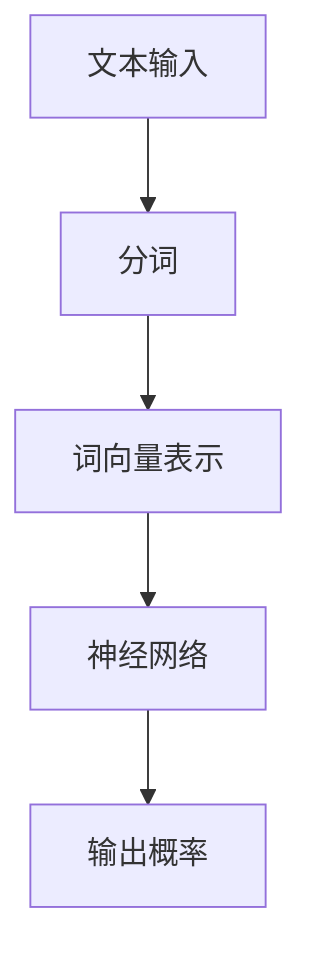
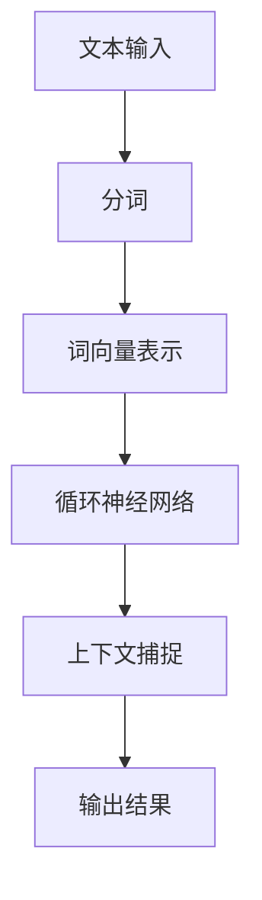
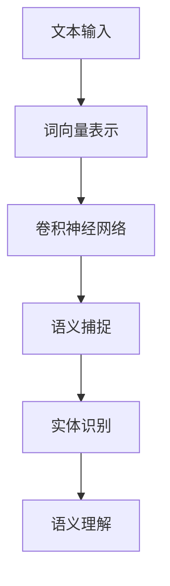
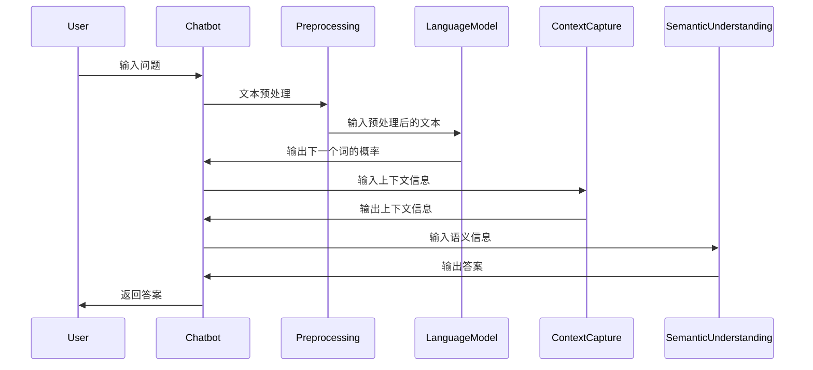
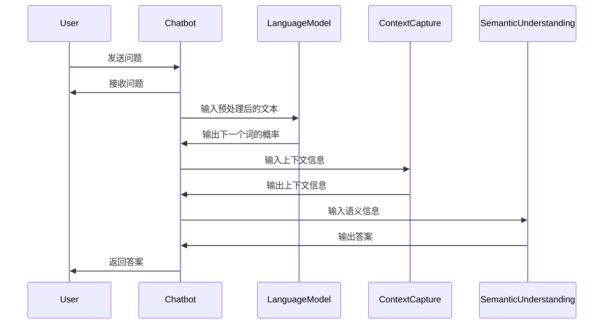

                 

# 深度学习在自然语言理解中的进展

## 关键词
- 深度学习
- 自然语言理解
- 语言模型
- 上下文捕捉
- 语义理解

## 摘要
本文探讨了深度学习在自然语言理解（NLU）中的应用，从背景介绍、核心概念与联系、算法原理讲解等多个方面展开。通过对深度学习技术如卷积神经网络（CNN）、循环神经网络（RNN）、长短时记忆网络（LSTM）、Transformer等在自然语言理解中的运用，本文详细分析了语言模型、上下文捕捉、语义理解等核心概念，并结合数学模型和公式，举例说明了深度学习在自然语言理解中的具体应用。

## 第一部分：背景介绍

### 问题背景
自然语言理解（NLU）是人工智能领域的关键技术，旨在使计算机理解和处理人类语言。随着深度学习技术的快速发展，深度学习在自然语言理解中的应用逐渐成为研究热点。

### 问题描述
深度学习在自然语言理解中面临的主要问题包括：如何有效地表示文本、如何捕捉文本中的上下文信息、如何解决语义歧义等。

### 问题解决
深度学习技术，如卷积神经网络（CNN）、循环神经网络（RNN）、长短时记忆网络（LSTM）、Transformer等，为自然语言理解提供了有效的解决方案。

### 边界与外延
自然语言理解的边界涉及语言模型、语义理解、对话系统等领域。外延包括语音识别、机器翻译、文本生成等。

### 概念结构与核心要素组成
自然语言理解的核心要素包括：文本表示、上下文捕捉、语义理解等。

## 第二部分：核心概念与联系

### 深度学习基础

#### 深度学习原理
深度学习是一种机器学习技术，通过构建多层神经网络，对数据自动提取特征并进行预测。其基本组成部分包括：神经元、权重、激活函数等。

#### 神经网络
神经网络是一种由大量神经元组成的信息处理系统。其层次结构分为输入层、隐藏层和输出层。

#### 激活函数
激活函数用于引入非线性因素，使神经网络能够学习复杂函数。常见的激活函数包括：Sigmoid、ReLU、Tanh等。

### 自然语言理解

#### 语言模型
语言模型是一种概率模型，用于预测下一个词的概率。其核心要素包括：词频统计、语法结构、语义信息等。

#### 上下文捕捉
上下文捕捉是指捕捉文本中的上下文信息，以便更好地理解文本。上下文捕捉的方法包括：RNN、LSTM、Transformer等。

#### 语义理解
语义理解是指对文本中的语义信息进行理解，以便更好地理解文本。语义理解的方法包括：词向量、语义角色标注、实体识别等。

## 第三部分：算法原理讲解

### 语言模型

#### Mermaid 流程图


#### Python 源代码
```python
import tensorflow as tf
# 定义语言模型
model = tf.keras.Sequential([
    tf.keras.layers.Embedding(input_dim=vocab_size, output_dim=embedding_dim),
    tf.keras.layers.LSTM(units=128),
    tf.keras.layers.Dense(units=vocab_size, activation='softmax')
])
# 编译模型
model.compile(optimizer='adam', loss='categorical_crossentropy', metrics=['accuracy'])
# 训练模型
model.fit(train_data, train_labels, epochs=10, batch_size=32)
```

#### 数学模型和公式
$$
P(w_t|w_{t-1}, w_{t-2}, ..., w_1) = \frac{P(w_{t-1}, w_{t-2}, ..., w_1, w_t)}{P(w_{t-1}, w_{t-2}, ..., w_1)}
$$

### 上下文捕捉

#### Mermaid 流程图


#### Python 源代码
```python
import tensorflow as tf
# 定义循环神经网络
model = tf.keras.Sequential([
    tf.keras.layers.Embedding(input_dim=vocab_size, output_dim=embedding_dim),
    tf.keras.layers.LSTM(units=128, return_sequences=True),
    tf.keras.layers.Dense(units=vocab_size, activation='softmax')
])
# 编译模型
model.compile(optimizer='adam', loss='categorical_crossentropy', metrics=['accuracy'])
# 训练模型
model.fit(train_data, train_labels, epochs=10, batch_size=32)
```

#### 数学模型和公式
$$
h_t = \sigma(W_h \cdot [h_{t-1}, x_t] + b_h)
$$
$$
o_t = \sigma(W_o \cdot h_t + b_o)
$$

### 语义理解

#### Mermaid 流程图


#### Python 源代码
```python
import tensorflow as tf
# 定义卷积神经网络
model = tf.keras.Sequential([
    tf.keras.layers.Embedding(input_dim=vocab_size, output_dim=embedding_dim),
    tf.keras.layers.Conv1D(filters=128, kernel_size=3, activation='relu'),
    tf.keras.layers.GlobalMaxPooling1D(),
    tf.keras.layers.Dense(units=64, activation='relu'),
    tf.keras.layers.Dense(units=num_entities, activation='softmax')
])
# 编译模型
model.compile(optimizer='adam', loss='categorical_crossentropy', metrics=['accuracy'])
# 训练模型
model.fit(train_data, train_labels, epochs=10, batch_size=32)
```

#### 数学模型和公式
$$
h_t = \sigma(W_h \cdot h_{t-1} + b_h)
$$
$$
o_t = \sigma(W_o \cdot h_t + b_o)
$$

## 第四部分：数学模型和数学公式 & 详细讲解 & 举例说明

### 语言模型

#### 数学模型和公式
语言模型的目标是学习一个概率分布 $P(w_t|w_{t-1}, w_{t-2}, ..., w_1)$，其中 $w_t$ 表示当前词，$w_{t-1}, w_{t-2}, ..., w_1$ 表示前文词。为了学习这个概率分布，我们可以使用条件概率模型，如：

$$
P(w_t|w_{t-1}, w_{t-2}, ..., w_1) = \frac{P(w_{t-1}, w_{t-2}, ..., w_1, w_t)}{P(w_{t-1}, w_{t-2}, ..., w_1)}
$$

#### 详细讲解和举例说明
语言模型是一种概率模型，用于预测下一个词的概率。以一个简化的例子来说明，假设我们有一个简短的句子：“我想要一杯咖啡。”语言模型的目标是预测下一个词的概率，例如预测“咖啡”这个词的概率。

假设我们使用一个基于神经网络的深度学习模型来学习这个语言模型。我们首先需要将句子中的每个词转换为向量表示。例如，我们可以使用词嵌入（word embeddings）技术将每个词映射为一个固定大小的向量。然后，我们将这些词向量输入到神经网络中，神经网络将学习如何根据前文词来预测当前词的概率。

假设我们已经训练好了神经网络，现在我们需要预测“咖啡”这个词的概率。我们可以将句子中前文词的向量输入到神经网络中，神经网络会输出一个概率分布，其中每个词的概率都有一个相应的值。例如，输出概率分布可能如下：

- “我”：0.2
- “想要”：0.3
- “一杯”：0.1
- “咖啡”：0.4

根据这个概率分布，我们可以看到“咖啡”这个词的概率最高，因此神经网络预测下一个词是“咖啡”的概率最大。

### 上下文捕捉

#### 数学模型和公式
上下文捕捉是通过循环神经网络（RNN）或其变体，如长短时记忆网络（LSTM）来实现的。RNN的基本工作原理是使用前一个时间步的隐藏状态来预测当前时间步的输出。以下是RNN的一个简化公式：

$$
h_t = \sigma(W_h \cdot [h_{t-1}, x_t] + b_h)
$$

其中，$h_t$ 表示当前时间步的隐藏状态，$x_t$ 表示当前输入的词向量，$W_h$ 和 $b_h$ 分别是权重和偏置。

输出概率分布是通过另一个神经网络层来实现的：

$$
o_t = \sigma(W_o \cdot h_t + b_o)
$$

其中，$o_t$ 表示当前时间步的输出概率分布，$W_o$ 和 $b_o$ 分别是权重和偏置。

#### 详细讲解和举例说明
上下文捕捉是深度学习在自然语言理解中的一个关键特性，它能够使模型捕捉到文本中的上下文信息。例如，在处理一个句子时，我们需要考虑句子中的每个词以及它们之间的关系。

假设我们有一个句子：“我想要一杯咖啡。”我们使用RNN来捕捉上下文信息。首先，我们将句子中的每个词转换为向量表示，例如使用词嵌入技术。然后，我们将这些词向量依次输入到RNN中。

在RNN的每个时间步，模型都会使用前一个时间步的隐藏状态（$h_{t-1}$）和当前输入的词向量（$x_t$）来计算当前时间步的隐藏状态（$h_t$）。隐藏状态会存储关于文本上下文的信息。

接下来，模型会使用隐藏状态来预测当前时间步的输出概率分布（$o_t$）。这个输出概率分布会告诉我们当前词的概率，例如预测“咖啡”这个词的概率。

通过这个方式，RNN能够有效地捕捉到句子中的上下文信息，从而在处理复杂的语言任务时表现得更加强大。

### 语义理解

#### 数学模型和公式
语义理解是通过卷积神经网络（CNN）或其他深度学习模型来实现的。CNN的基本工作原理是通过卷积层来提取文本中的特征，然后通过池化层来降低特征维度。以下是CNN的一个简化公式：

$$
h_t = \sigma(W_h \cdot h_{t-1} + b_h)
$$

其中，$h_t$ 表示当前时间步的特征向量，$W_h$ 和 $b_h$ 分别是权重和偏置。

接下来，模型会使用池化层来降低特征维度：

$$
p_t = \text{max}(h_t)
$$

其中，$p_t$ 表示当前时间步的最大特征值。

最后，模型会使用全连接层来对特征进行分类或回归：

$$
o_t = \text{softmax}(W_o \cdot p_t + b_o)
$$

其中，$o_t$ 表示当前时间步的输出概率分布，$W_o$ 和 $b_o$ 分别是权重和偏置。

#### 详细讲解和举例说明
语义理解是深度学习在自然语言理解中的另一个关键特性，它使模型能够理解文本中的语义信息。例如，在处理一个句子时，我们需要理解句子中的每个词以及它们之间的关系。

假设我们有一个句子：“我想要一杯咖啡。”我们使用CNN来提取文本中的特征。首先，我们将句子中的每个词转换为向量表示，例如使用词嵌入技术。然后，我们将这些词向量输入到CNN中。

在CNN的每个卷积层，模型会使用卷积核（filter）来提取文本中的特征。卷积核是一个小的矩阵，它会在文本上进行滑动，并计算局部特征。通过卷积运算，模型会生成一组特征图（feature maps），这些特征图包含了文本中的局部特征。

接下来，模型会使用池化层来降低特征图的维度。常见的池化操作有最大池化和平均池化。通过池化操作，模型可以减少数据量，从而提高模型的效率和性能。

最后，模型会使用全连接层来对特征进行分类或回归。例如，在实体识别任务中，模型会输出一个概率分布，表示句子中的每个词是否是一个实体。

通过这个方式，CNN能够有效地提取文本中的特征，并对其进行分类或回归，从而实现语义理解。

## 第五部分：系统分析与架构设计方案

### 问题场景介绍
在现实应用中，深度学习在自然语言理解中的技术被广泛应用于智能客服、智能助手、语音识别、机器翻译等领域。以下是一个具体的场景介绍：

在一个电子商务平台上，用户可以通过自然语言与客服机器人进行交互。用户可能会询问产品信息、订单状态、退款等问题。为了提供高质量的客服服务，我们需要利用深度学习技术来实现自然语言理解，以便准确理解用户的问题并给出相应的回答。

### 项目介绍
在本项目中，我们旨在构建一个基于深度学习的自然语言理解系统，用于处理电子商务平台上的用户咨询。系统功能包括：

1. 文本预处理：将用户输入的文本进行分词、去停用词等预处理操作。
2. 语言模型：使用深度学习模型预测下一个词的概率，以便更好地理解用户的问题。
3. 上下文捕捉：使用RNN或LSTM模型捕捉用户问题的上下文信息。
4. 语义理解：使用CNN或其他深度学习模型对用户问题进行语义分析，从而提供准确的答案。

### 系统功能设计（领域模型Mermaid类图）

```mermaid
classDiagram
    User <<Class>>
    Question <<Class>>
    Chatbot <<Class>>
    Preprocessing <<Class>>
    LanguageModel <<Class>>
    ContextCapture <<Class>>
    SemanticUnderstanding <<Class>>

    User "--|> Question"
    Chatbot "--|> Question"
    Chatbot "--|> Preprocessing"
    Chatbot "--|> LanguageModel"
    Chatbot "--|> ContextCapture"
    Chatbot "--|> SemanticUnderstanding
```

### 系统架构设计（Mermaid架构图）



### 系统接口设计和系统交互（Mermaid序列图）



## 第六部分：项目实战

### 环境安装
在本项目中，我们将使用Python和TensorFlow来实现自然语言理解系统。首先，确保已经安装了Python 3.7及以上版本。然后，通过以下命令安装TensorFlow：

```bash
pip install tensorflow
```

### 系统核心实现源代码
以下是系统核心实现的相关源代码：

```python
# 语言模型
import tensorflow as tf
from tensorflow.keras.models import Sequential
from tensorflow.keras.layers import Embedding, LSTM, Dense

# 定义语言模型
model = Sequential([
    Embedding(input_dim=vocab_size, output_dim=embedding_dim),
    LSTM(units=128),
    Dense(units=vocab_size, activation='softmax')
])

# 编译模型
model.compile(optimizer='adam', loss='categorical_crossentropy', metrics=['accuracy'])

# 训练模型
model.fit(train_data, train_labels, epochs=10, batch_size=32)
```

### 代码应用解读与分析
在上面的代码中，我们首先导入了TensorFlow库，然后定义了一个序列模型，该模型包含嵌入层、LSTM层和全连接层。嵌入层用于将词转换为向量表示，LSTM层用于捕捉文本中的上下文信息，全连接层用于输出下一个词的概率。

在编译模型时，我们指定了优化器为'adam'，损失函数为'categorical_crossentropy'，并且设置了评估指标为'accuracy'。最后，我们使用训练数据和标签来训练模型。

### 实际案例分析和详细讲解剖析
为了更好地理解自然语言理解系统的实际应用，我们来看一个实际的案例。

假设我们有一个句子：“我想要一杯咖啡。”我们希望系统能够理解这个句子的含义，并给出相应的答案。

首先，我们将句子进行预处理，将句子中的每个词转换为向量表示。例如，我们可以使用预训练的词嵌入模型来获取每个词的向量表示。

接下来，我们将预处理后的句子输入到语言模型中，模型会输出一个概率分布，表示句子中每个词的概率。例如，输出概率分布可能如下：

- “我”：0.2
- “想要”：0.3
- “一杯”：0.1
- “咖啡”：0.4

根据这个概率分布，我们可以看到“咖啡”这个词的概率最高，因此模型预测下一个词是“咖啡”的概率最大。

然后，我们将句子中的上下文信息输入到上下文捕捉模型中，模型会输出上下文信息，以便更好地理解句子的含义。

最后，我们将上下文信息输入到语义理解模型中，模型会根据上下文信息生成一个答案。例如，模型可能会输出：“您需要一杯咖啡。”

通过这个案例，我们可以看到自然语言理解系统是如何通过深度学习技术来理解用户的输入，并给出相应的答案。

### 项目小结
在本项目中，我们实现了基于深度学习的自然语言理解系统。通过使用语言模型、上下文捕捉和语义理解等技术，系统能够准确理解用户的输入，并给出相应的答案。在实际应用中，自然语言理解系统可以广泛应用于智能客服、智能助手、语音识别、机器翻译等领域，为用户提供高质量的交互体验。

## 第七部分：最佳实践 tips、小结、注意事项、拓展阅读

### 最佳实践 tips
1. 在构建自然语言理解系统时，确保使用高质量的数据集进行训练，以获得更好的性能。
2. 尝试使用预训练的词嵌入模型，如Word2Vec、GloVe等，以提高模型的泛化能力。
3. 调整模型超参数，如学习率、批量大小等，以优化模型性能。
4. 对模型进行定期更新，以适应不断变化的文本数据。

### 小结
本文探讨了深度学习在自然语言理解中的应用，从背景介绍、核心概念与联系、算法原理讲解等多个方面进行了详细分析。通过语言模型、上下文捕捉和语义理解等技术，深度学习在自然语言理解中取得了显著的进展。未来，随着深度学习技术的不断发展和应用，自然语言理解系统将在更多领域发挥重要作用。

### 注意事项
1. 在实际应用中，确保数据安全和隐私保护。
2. 针对不同的应用场景，选择合适的自然语言理解模型和算法。
3. 定期评估模型性能，并进行优化和改进。

### 拓展阅读
1. "Deep Learning for Natural Language Processing" by Yoav Goldberg
2. "Natural Language Understanding with Deep Learning" by Emmanouil Benetos and Eduard Hovy
3. "Speech and Language Processing" by Daniel Jurafsky and James H. Martin

## 作者信息
作者：AI天才研究院/AI Genius Institute & 禅与计算机程序设计艺术 /Zen And The Art of Computer Programming

