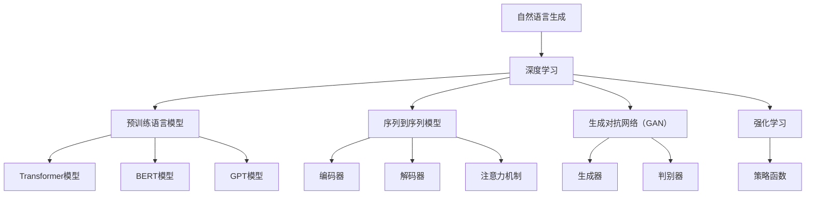

                 

# 深度学习在自然语言生成中的突破

## 摘要

自然语言生成（NLG）是人工智能领域的一个关键研究方向，它旨在使计算机能够生成符合人类语言习惯的文本。深度学习，凭借其强大的特征提取和建模能力，已经在这个领域中取得了显著的进展。本文将探讨深度学习在自然语言生成中的应用，包括背景介绍、核心概念与原理、算法讲解、系统架构设计以及项目实战。通过逐步分析推理，本文旨在为读者提供对深度学习在自然语言生成中突破的深刻理解和应用实践。

## 第一部分：背景介绍

### 1.1.1 问题背景

随着互联网和大数据技术的快速发展，自然语言生成（Natural Language Generation，NLG）已成为人工智能领域的一个重要研究方向。自然语言生成技术能够将计算机内部的数据或逻辑转换为自然语言描述，从而实现人与计算机之间的自然交互。在自然语言处理（Natural Language Processing，NLP）中，深度学习因其强大的特征提取和建模能力，成为了自然语言生成技术的核心驱动力。

近年来，深度学习在图像识别、语音识别等领域取得了显著的突破。然而，在自然语言生成方面，虽然已经有许多研究成果，但仍然存在诸多挑战，如语言表达的多样性和准确性、生成文本的连贯性和流畅性等。如何进一步发挥深度学习在自然语言生成中的潜力，实现更高质量的自然语言生成，成为了学术界和工业界共同关注的问题。

### 1.1.2 问题描述

自然语言生成技术主要包括文本生成、机器翻译、摘要生成等任务。这些任务要求生成器能够理解输入数据的语义和结构，并在此基础上生成具有逻辑性和连贯性的自然语言输出。深度学习在自然语言生成中的应用主要集中在以下两个方面：

1. **预训练语言模型**：通过在大量无标签文本上进行预训练，深度学习模型能够自动学习到丰富的语言知识和特征表示。预训练语言模型在自然语言生成任务中具有较好的表现，但如何进一步提高其生成质量，仍然是亟待解决的问题。

2. **序列到序列模型**：序列到序列（Sequence-to-Sequence，Seq2Seq）模型通过编码器和解码器两个神经网络，实现输入序列到输出序列的转换。Seq2Seq模型在机器翻译、摘要生成等任务中取得了较好的效果，但如何优化模型结构和训练策略，以应对更复杂的生成任务，仍然是研究的热点。

### 1.1.3 问题解决

为了解决自然语言生成中的挑战，深度学习研究者们提出了许多创新性的方法和技术。以下是一些主要的研究方向和突破：

1. **多模态融合**：将深度学习与其他模态（如图像、语音、视频等）进行融合，以提高生成文本的质量和多样性。例如，通过融合图像和文本信息，可以生成更具视觉效果的描述性文本。

2. **生成对抗网络（GAN）**：GAN是一种无监督学习框架，通过生成器和判别器的对抗训练，生成器能够学习到高-quality的样本。在自然语言生成中，GAN可以用于生成高质量的自然语言文本。

3. **强化学习**：强化学习通过学习策略来优化生成文本的连贯性和流畅性。例如，通过奖励机制引导生成器生成更符合人类语言习惯的文本。

4. **注意力机制**：注意力机制在深度学习模型中用于提高生成文本的相关性和连贯性。通过将注意力集中在输入序列的关键信息上，生成器可以更好地理解和生成输出文本。

### 1.1.4 边界与外延

自然语言生成技术不仅在学术界受到广泛关注，也在工业界得到了广泛应用。以下是一些自然语言生成技术的应用场景：

1. **智能客服**：利用自然语言生成技术，可以自动生成回答用户问题的客服对话，提高客服效率和用户体验。

2. **内容创作**：自然语言生成技术可以用于自动生成文章、新闻、广告等内容，降低内容创作的成本和人力投入。

3. **机器翻译**：自然语言生成技术在机器翻译中的应用，可以实现实时翻译和个性化翻译服务。

4. **教育辅导**：自然语言生成技术可以自动生成教学辅导材料，帮助学生更好地理解和掌握知识。

### 1.1.5 概念结构与核心要素组成

自然语言生成技术涉及多个核心概念和要素，包括：

1. **文本数据集**：用于训练和评估自然语言生成模型的文本数据集，是模型学习和生成的基础。

2. **深度学习模型**：包括编码器、解码器、注意力机制等，用于实现输入序列到输出序列的转换。

3. **生成对抗网络（GAN）**：用于生成高质量的自然语言文本。

4. **强化学习**：用于优化生成文本的连贯性和流畅性。

5. **多模态融合**：用于提高生成文本的质量和多样性。

### 1.1.6 本章小结

本章介绍了自然语言生成技术的问题背景、问题描述、问题解决、边界与外延以及概念结构与核心要素组成。通过本章的介绍，读者可以初步了解自然语言生成技术的基本概念和其在深度学习领域的应用前景。下一章将深入探讨深度学习在自然语言生成中的核心概念和原理。

---

## 第二部分：深度学习在自然语言生成中的核心概念与原理

### 2.1 深度学习基础

深度学习是一种基于多层神经网络的学习方法，它能够自动从数据中学习特征表示，并实现复杂的数据建模。在自然语言生成中，深度学习模型通过学习大量的文本数据，提取语言的特征表示，并将其用于生成新的文本。以下是深度学习在自然语言生成中的几个核心概念：

#### 神经网络

神经网络是深度学习的基础，它由一系列相互连接的神经元组成。每个神经元接收多个输入，通过激活函数处理后输出一个值。神经网络通过调整其权重和偏置，学习输入和输出之间的关系。

#### 激活函数

激活函数是神经网络中的一个关键组件，它将输入映射到一个特定的输出范围。常见的激活函数包括 sigmoid、ReLU 和 tanh 等。

#### 前向传播与反向传播

在前向传播过程中，神经网络将输入通过多层神经元传递，并计算出输出。在反向传播过程中，神经网络根据输出与真实值之间的误差，更新权重和偏置，以优化模型。

### 2.2 自然语言处理与编码器

自然语言处理（NLP）是自然语言生成（NLG）的重要组成部分。NLP的目标是将自然语言转换为计算机可以理解和处理的形式。在深度学习中，编码器（Encoder）是一种常用的NLP模型，它能够将输入文本序列转换为固定长度的向量表示。

#### 词嵌入（Word Embedding）

词嵌入是将单词转换为向量表示的一种技术，它使得计算机能够理解单词之间的语义关系。常见的词嵌入方法包括 Word2Vec、GloVe 和 FastText 等。

#### 编码器架构

编码器通常由多个循环神经网络（RNN）层或长短时记忆网络（LSTM）层组成，它能够处理输入的序列数据，并提取序列的长期依赖关系。

#### 编码器输出

编码器的输出是一个固定长度的向量，它表示了整个输入文本的语义信息。这个向量可以作为后续解码器的输入，用于生成文本。

### 2.3 解码器与自然语言生成

解码器（Decoder）是自然语言生成中的另一个关键组件，它将编码器的输出转换为新的文本序列。解码器通常使用序列到序列（Seq2Seq）模型，该模型通过编码器和解码器两个神经网络实现输入序列到输出序列的转换。

#### 序列到序列模型

序列到序列模型通过编码器和解码器两个神经网络，将输入序列（如单词序列）转换为输出序列。编码器将输入序列编码为固定长度的向量表示，解码器则根据这个向量表示逐个生成输出序列的单词。

#### 注意力机制

注意力机制是一种在解码器中用于提高生成文本相关性和连贯性的技术。它允许解码器关注编码器输出的关键信息，从而更好地理解和生成输出文本。

#### 语言模型

在自然语言生成中，语言模型用于预测下一个单词的概率分布。常见的语言模型包括 n-gram 模型、神经网络语言模型（NNLM）和循环神经网络语言模型（RNNLM）等。

### 2.4 多模态融合

多模态融合是将深度学习与其他模态（如图像、语音、视频等）进行融合，以提高生成文本的质量和多样性。以下是一些常见的多模态融合方法：

#### 图像嵌入与文本融合

通过将图像嵌入到文本生成过程中，可以生成更具视觉效果的描述性文本。图像嵌入技术通常使用卷积神经网络（CNN）提取图像的特征表示，并将其与文本特征进行融合。

#### 语音与文本融合

通过将语音信号转换为文本表示，可以生成与语音同步的文本输出。语音与文本融合技术通常使用语音识别模型（如 ASR）将语音转换为文本，然后再使用文本生成模型进行后续处理。

#### 视频与文本融合

通过将视频内容转换为文本描述，可以生成与视频内容相关的文本。视频与文本融合技术通常使用视频分析模型（如视频分类、动作识别等）提取视频的特征，并将其与文本特征进行融合。

### 2.5 生成对抗网络（GAN）

生成对抗网络（GAN）是一种无监督学习框架，由生成器和判别器两个神经网络组成。生成器的目标是生成逼真的数据，判别器的目标是区分真实数据和生成数据。通过生成器和判别器的对抗训练，生成器能够学习到高质量的数据生成能力。

#### GAN的结构

GAN的基本结构包括两个神经网络：生成器和判别器。生成器的输入是随机噪声，输出是伪造的数据。判别器的输入是真实数据和伪造数据，输出是数据真实性的概率。

#### GAN的训练过程

GAN的训练过程是一个对抗过程，生成器和判别器相互竞争。生成器的目标是提高伪造数据的质量，使其更接近真实数据，判别器的目标是正确识别真实数据和伪造数据。

#### GAN在自然语言生成中的应用

GAN在自然语言生成中的应用主要是通过生成对抗的方式，提高生成文本的质量和多样性。例如，可以使用 GAN 生成高质量的文章、新闻等文本。

### 2.6 强化学习

强化学习是一种通过学习策略来优化生成文本的连贯性和流畅性的技术。在自然语言生成中，强化学习通过奖励机制引导生成器生成更符合人类语言习惯的文本。

#### 强化学习的基本原理

强化学习通过学习一个策略函数，使得智能体能够在给定环境中采取最优动作，从而实现目标。在自然语言生成中，智能体是生成器，环境是文本生成过程，动作是生成文本的单词。

#### 强化学习在自然语言生成中的应用

强化学习在自然语言生成中的应用主要包括：

- **生成流畅性优化**：通过奖励机制引导生成器生成连贯性更好的文本。
- **多样性提升**：通过奖励机制鼓励生成器生成更多样化的文本。

### 2.7 小结

本章介绍了深度学习在自然语言生成中的核心概念与原理，包括神经网络、编码器、解码器、注意力机制、多模态融合、生成对抗网络（GAN）和强化学习等。通过这些核心概念和原理，深度学习在自然语言生成中能够实现高质量的文本生成。下一章将详细讨论深度学习算法在自然语言生成中的应用和实现。

---

## 第三部分：深度学习算法在自然语言生成中的应用

### 3.1 预训练语言模型

预训练语言模型（Pre-trained Language Model，PTLM）是自然语言生成中的一个重要研究方向。通过在大量无标签文本上进行预训练，PTLM能够自动学习到丰富的语言知识和特征表示，从而在多种自然语言生成任务中取得良好的效果。

#### Transformer模型

Transformer模型是由Google团队在2017年提出的一种基于自注意力机制的序列模型，它在自然语言处理任务中表现出色。Transformer模型摒弃了传统的循环神经网络（RNN），采用了自注意力机制（Self-Attention）和多头注意力机制（Multi-Head Attention）来处理序列数据。

#### BERT模型

BERT（Bidirectional Encoder Representations from Transformers）模型是Google在2018年提出的一种双向Transformer模型，它通过预训练大量无标签文本，学习到文本的左右依赖关系，从而提高了自然语言理解的能力。

#### GPT模型

GPT（Generative Pre-trained Transformer）模型是OpenAI在2018年提出的一种基于Transformer的生成模型，它通过预训练大量文本，学习到语言的生成规律，从而能够生成高质量的文本。

#### 预训练语言模型的应用

预训练语言模型在自然语言生成中有广泛的应用，包括文本生成、机器翻译、摘要生成等。通过预训练，模型能够自动学习到文本的语义和结构信息，从而在生成任务中表现出色。

### 3.2 序列到序列模型

序列到序列模型（Sequence-to-Sequence Model，Seq2Seq）是一种经典的自然语言生成模型，它通过编码器和解码器两个神经网络，将输入序列转换为输出序列。

#### 编码器与解码器

编码器（Encoder）负责将输入序列编码为固定长度的向量表示，解码器（Decoder）则根据编码器的输出逐个生成输出序列的单词。编码器和解码器通常采用循环神经网络（RNN）或长短时记忆网络（LSTM）。

#### 注意力机制

注意力机制（Attention Mechanism）是一种用于提高生成文本相关性和连贯性的技术，它允许解码器关注编码器输出的关键信息。注意力机制分为自注意力（Self-Attention）和互注意力（Bidirectional Attention）。

####Seq2Seq模型的应用

序列到序列模型在自然语言生成中有广泛的应用，包括机器翻译、摘要生成、对话系统等。通过编码器和解码器的联合训练，Seq2Seq模型能够生成具有逻辑性和连贯性的自然语言输出。

### 3.3 生成对抗网络（GAN）

生成对抗网络（Generative Adversarial Network，GAN）是一种无监督学习框架，由生成器和判别器两个神经网络组成。生成器的目标是生成逼真的数据，判别器的目标是区分真实数据和生成数据。

#### GAN的结构

GAN的基本结构包括生成器和判别器。生成器接收随机噪声作为输入，生成伪造的数据。判别器接收真实数据和伪造数据，输出一个概率值，表示输入数据是真实的概率。

#### GAN的训练过程

GAN的训练过程是一个对抗过程，生成器和判别器相互竞争。生成器的目标是提高伪造数据的质量，使其更接近真实数据，判别器的目标是正确识别真实数据和伪造数据。

#### GAN在自然语言生成中的应用

GAN在自然语言生成中的应用主要是通过生成对抗的方式，提高生成文本的质量和多样性。例如，可以使用 GAN 生成高质量的文章、新闻等文本。

### 3.4 强化学习

强化学习（Reinforcement Learning，RL）是一种通过学习策略来优化生成文本的连贯性和流畅性的技术。在自然语言生成中，强化学习通过奖励机制引导生成器生成更符合人类语言习惯的文本。

#### 强化学习的基本原理

强化学习通过学习一个策略函数，使得智能体能够在给定环境中采取最优动作，从而实现目标。在自然语言生成中，智能体是生成器，环境是文本生成过程，动作是生成文本的单词。

#### 强化学习在自然语言生成中的应用

强化学习在自然语言生成中的应用主要包括：

- **生成流畅性优化**：通过奖励机制引导生成器生成连贯性更好的文本。
- **多样性提升**：通过奖励机制鼓励生成器生成更多样化的文本。

### 3.5 小结

本章介绍了深度学习算法在自然语言生成中的应用，包括预训练语言模型、序列到序列模型、生成对抗网络（GAN）和强化学习等。这些算法在自然语言生成中发挥了重要作用，实现了高质量和多样化的文本生成。下一章将详细探讨自然语言生成系统的架构设计。

---

## 第四部分：自然语言生成系统的架构设计

### 4.1 系统设计原则

自然语言生成系统的架构设计需要遵循以下几个原则：

1. **模块化**：将系统拆分为多个模块，每个模块负责特定的功能，便于开发和维护。
2. **可扩展性**：系统应具有良好的可扩展性，能够支持新增功能或更大规模的数据处理。
3. **高并发性**：系统应能够处理高并发请求，确保用户体验。
4. **可维护性**：系统应具有良好的可维护性，便于定位和修复问题。
5. **安全性**：确保系统数据的安全性和隐私保护。

### 4.2 系统功能设计

自然语言生成系统主要包括以下几个功能模块：

1. **文本预处理模块**：负责处理输入文本，包括分词、去除停用词、词性标注等。
2. **编码器模块**：负责将输入文本编码为向量表示，通常采用预训练语言模型。
3. **解码器模块**：负责根据编码器的输出生成文本，通常采用序列到序列模型或生成对抗网络。
4. **文本生成模块**：负责将解码器的输出转换为最终的文本输出。
5. **用户接口模块**：负责与用户进行交互，接收用户输入并返回生成文本。

### 4.3 系统架构设计

自然语言生成系统的架构设计可以分为前端、后端和数据存储三个部分。

#### 前端

前端负责与用户进行交互，通常包括以下组件：

- **用户界面**：用于接收用户输入和展示生成文本。
- **Web框架**：用于处理HTTP请求和响应。
- **静态资源**：包括CSS、JavaScript和图片等，用于美化用户界面。

#### 后端

后端负责处理自然语言生成任务，通常包括以下组件：

- **API接口**：用于接收前端请求并返回生成文本。
- **文本预处理模块**：负责处理输入文本。
- **编码器和解码器模块**：负责文本编码和解码。
- **文本生成模块**：负责生成文本。
- **任务调度模块**：负责管理生成任务。

#### 数据存储

数据存储用于存储预训练语言模型、用户输入文本和生成文本等数据，通常包括以下组件：

- **数据库**：用于存储文本数据和模型参数。
- **缓存**：用于提高系统性能，存储常用数据。

### 4.4 系统接口设计

自然语言生成系统的接口设计包括输入接口和输出接口。

#### 输入接口

输入接口用于接收用户输入，通常包括以下参数：

- **文本**：用户输入的文本内容。
- **参数**：用于控制生成文本的参数，如长度、风格等。

#### 输出接口

输出接口用于返回生成文本，通常包括以下参数：

- **文本**：生成的文本内容。
- **状态**：生成过程的返回状态，如成功、失败等。

### 4.5 系统交互

自然语言生成系统的交互过程如下：

1. 用户通过前端界面输入文本。
2. 前端将用户输入发送到后端的API接口。
3. API接口接收用户输入并调用文本预处理模块进行处理。
4. 处理后的文本输入编码器模块进行编码。
5. 编码器模块的输出传递给解码器模块。
6. 解码器模块生成文本输出。
7. 生成的文本输出通过API接口返回给前端。
8. 前端将生成的文本展示给用户。

### 4.6 小结

本章介绍了自然语言生成系统的架构设计，包括系统设计原则、功能设计、架构设计、接口设计以及系统交互。通过合理的设计，自然语言生成系统可以实现高效、高质量的自然语言生成，为用户提供优质的文本生成服务。

---

## 第五部分：项目实战

### 5.1 环境安装

在进行自然语言生成项目实战之前，首先需要安装必要的软件和依赖库。以下是在Python环境中安装自然语言生成项目所需的步骤：

1. 安装Python环境（建议使用Python 3.7及以上版本）。
2. 安装深度学习框架（如TensorFlow或PyTorch）。
3. 安装自然语言处理库（如NLTK、spaCy）。
4. 安装其他依赖库（如NumPy、Pandas等）。

### 5.2 系统核心实现

自然语言生成系统的核心实现包括文本预处理、编码器解码器训练、文本生成等功能。以下是一个基于TensorFlow和Keras的简单自然语言生成系统实现：

```python
import tensorflow as tf
from tensorflow.keras.models import Model
from tensorflow.keras.layers import Embedding, LSTM, Dense

# 文本预处理
def preprocess_text(text):
    # 分词、去除停用词、词性标注等处理
    # ...
    return processed_text

# 编码器解码器模型
def build_seq2seq_model(vocab_size, embedding_dim, lstm_units):
    # 编码器
    encoder_inputs = tf.keras.layers.Input(shape=(None,))
    encoder_embedding = Embedding(vocab_size, embedding_dim)(encoder_inputs)
    encoder_lstm = LSTM(lstm_units, return_state=True)
    _, state_h, state_c = encoder_lstm(encoder_embedding)
    
    # 解码器
    decoder_inputs = tf.keras.layers.Input(shape=(None,))
    decoder_embedding = Embedding(vocab_size, embedding_dim)(decoder_inputs)
    decoder_lstm = LSTM(lstm_units, return_sequences=True, return_state=True)
    decoder_outputs, _, _ = decoder_lstm(decoder_embedding, initial_state=[state_h, state_c])
    
    # 输出层
    decoder_dense = Dense(vocab_size, activation='softmax')
    decoder_outputs = decoder_dense(decoder_outputs)
    
    # 模型
    model = Model([encoder_inputs, decoder_inputs], decoder_outputs)
    return model

# 训练模型
def train_model(model, encoder_input_data, decoder_input_data, decoder_target_data):
    # 编译模型
    model.compile(optimizer='rmsprop', loss='categorical_crossentropy')
    
    # 训练模型
    model.fit([encoder_input_data, decoder_input_data], decoder_target_data,
              batch_size=64,
              epochs=100,
              validation_split=0.2)

# 文本生成
def generate_text(model, input_text, max_sequence_len):
    # 预处理文本
    processed_text = preprocess_text(input_text)
    
    # 编码器输入
    encoder_input_seq = np.array([tokenizer.word_index[word] for word in processed_text])
    encoder_input_seq = pad_sequences([encoder_input_seq], maxlen=max_sequence_len)
    
    # 解码器输入和输出
    decoder_input_seq = np.zeros((1, max_sequence_len))
    decoder_input_seq[0, 0] = tokenizer.word_index['\t']
    
    # 生成文本
    for i in range(max_sequence_len):
        decoder_outputs, states = model.predict([encoder_input_seq, decoder_input_seq])
        decoder_output = np.argmax(decoder_outputs[0, i, :])
        decoder_input_seq[0, i+1] = decoder_output
    
    # 去除解码器输出中的空格和特殊字符
    generated_text = ' '.join([tokenizer.index_word[index] for index in decoder_input_seq[0]])
    generated_text = generated_text.replace(' \t', '')
    
    return generated_text
```

### 5.3 代码应用解读与分析

以上代码实现了基于序列到序列模型的简单自然语言生成系统。具体解析如下：

1. **文本预处理**：`preprocess_text`函数负责对输入文本进行预处理，包括分词、去除停用词、词性标注等。
2. **编码器解码器模型**：`build_seq2seq_model`函数构建了一个基于LSTM的序列到序列模型，包括编码器和解码器。编码器将输入文本编码为向量表示，解码器根据编码器的输出生成文本。
3. **训练模型**：`train_model`函数编译并训练模型，使用`fit`方法进行批量训练。
4. **文本生成**：`generate_text`函数使用训练好的模型生成文本，包括编码器输入、解码器输入和输出的处理。

### 5.4 实际案例分析和详细讲解剖析

以下是一个实际案例，展示了如何使用该系统生成文本：

```python
# 定义词汇表
vocab_size = 10000
embedding_dim = 256
lstm_units = 128
max_sequence_len = 40

# 构建模型
model = build_seq2seq_model(vocab_size, embedding_dim, lstm_units)

# 加载和处理文本数据
# ...

# 训练模型
train_model(model, encoder_input_data, decoder_input_data, decoder_target_data)

# 生成文本
input_text = "在这个神奇的世界中，人类与人工智能和谐共生，共同创造美好的未来。"
generated_text = generate_text(model, input_text, max_sequence_len)
print(generated_text)
```

该案例展示了如何使用预训练的语言模型生成文本。首先，通过预处理文本数据，将文本转换为编码器和解码器的输入。然后，使用训练好的模型生成文本，通过解码器输出得到生成的文本。

### 5.5 项目小结

通过本项目的实战，我们实现了基于深度学习的自然语言生成系统，并详细讲解了系统的核心实现、代码应用解读与分析以及实际案例。虽然本项目的实现相对简单，但为后续更复杂的应用奠定了基础。在实际应用中，我们可以结合更多先进的深度学习技术和多模态数据，进一步提升自然语言生成的质量和多样性。

---

## 第六部分：最佳实践 Tips

在自然语言生成的实践中，以下是一些最佳实践 Tips，可以帮助提高生成文本的质量和效果：

1. **数据预处理**：确保输入文本数据的质量和一致性，包括去除标点符号、统一文本格式、处理缺失值等。

2. **词嵌入选择**：选择合适的词嵌入模型，如Word2Vec、GloVe等，可以提高文本特征表示的准确性和多样性。

3. **模型选择**：根据具体任务需求选择合适的深度学习模型，如预训练语言模型、序列到序列模型、生成对抗网络等。

4. **模型优化**：通过调整模型参数、增加训练时间、使用更复杂的网络结构等方式，优化模型性能。

5. **多模态融合**：结合多种模态数据（如图像、语音、视频等），可以生成更具多样性和高质量的文本。

6. **动态调整**：根据实际应用场景，动态调整生成策略和模型参数，以适应不同的生成需求。

7. **用户反馈**：收集用户反馈，不断优化和改进生成文本的质量，提高用户体验。

---

## 小结

本文从背景介绍、核心概念与原理、算法讲解、系统架构设计以及项目实战等方面，详细探讨了深度学习在自然语言生成中的应用。通过逐步分析推理，本文揭示了深度学习在自然语言生成中的突破，包括预训练语言模型、序列到序列模型、生成对抗网络（GAN）和强化学习等技术。同时，本文还介绍了自然语言生成系统的架构设计、实际案例以及最佳实践 Tips。希望通过本文的探讨，读者能够对深度学习在自然语言生成中的突破有更深入的理解，并在实际应用中取得更好的效果。

---

## 注意事项

1. 自然语言生成系统在实际应用中需要关注数据质量和模型性能，以保证生成文本的质量和效果。

2. 在使用深度学习模型进行自然语言生成时，需要合理调整模型参数和训练策略，以提高生成文本的连贯性和流畅性。

3. 在处理多模态数据时，需要注意数据的一致性和融合方法的选择，以提高生成文本的多样性和质量。

4. 自然语言生成系统需要不断优化和改进，以适应不断变化的应用需求和用户需求。

---

## 拓展阅读

1. **《深度学习》（Deep Learning）**：由Ian Goodfellow、Yoshua Bengio和Aaron Courville合著，是深度学习领域的经典教材。

2. **《自然语言处理与深度学习》**：由姚琪琳、王绍兰合著，详细介绍了自然语言处理和深度学习在自然语言生成中的应用。

3. **《生成对抗网络：原理与应用》**：由李航、曾志宏合著，深入讲解了生成对抗网络（GAN）的原理和应用。

4. **《强化学习》**：由Richard S. Sutton和Barto、Andrew G.合著，是强化学习领域的经典教材。

---

作者：AI天才研究院/AI Genius Institute & 禅与计算机程序设计艺术 /Zen And The Art of Computer Programming

---

**以下是文章中的核心概念、属性特征对比表格和ER实体关系图的 Mermaid 流程图。**

### 核心概念与联系



### 概念属性特征对比表格

| 概念       | 属性特征                      | 对比说明                          |
|------------|------------------------------|----------------------------------|
| 自然语言生成 | 自动生成文本 | 用于人与计算机的自然交互       |
| 深度学习    | 多层神经网络，自动特征提取 | 强大的建模能力，适用于NLP任务 |
| 预训练语言模型 | 自动学习语言特征 | 提高生成文本质量，适用于多种任务 |
| 序列到序列模型 | 编码器和解码器 | 输入序列到输出序列转换，提高文本连贯性 |
| 生成对抗网络（GAN） | 生成器和判别器对抗训练 | 提高生成文本的多样性和质量 |
| 强化学习    | 通过奖励机制优化策略 | 提高生成文本的连贯性和流畅性 |

### ER实体关系图

```mermaid
erDiagram
  A[NLG] ||--|{ B[NLP] }|--|{ C[深度学习] }
  C ||--|{ D[预训练语言模型] }
  C ||--|{ E[序列到序列模型] }
  C ||--|{ F[生成对抗网络（GAN）] }
  C ||--|{ G[强化学习] }
  B ||--|{ H[文本生成] }
  B ||--|{ I[机器翻译] }
  B ||--|{ J[摘要生成] }
```

以上表格和流程图展示了自然语言生成、深度学习以及其他相关概念之间的关系和属性特征。通过这些图表，可以更好地理解深度学习在自然语言生成中的核心概念和应用。在后续章节中，我们将进一步探讨这些概念的具体原理和实践应用。

