                 

### 深度学习在自然语言生成中的进展：提高AI写作能力

#### 关键词：
- 深度学习
- 自然语言生成
- AI写作
- 算法原理
- 系统架构
- 实战应用

#### 摘要：
本文将深入探讨深度学习在自然语言生成（NLG）领域的最新进展，重点分析如何通过AI技术提升写作能力。我们将从背景介绍、核心概念、算法原理、系统架构、项目实战和最佳实践等多个方面展开讨论，帮助读者全面了解这一前沿技术的应用与发展。

### 背景介绍

#### 深度学习的发展历程

深度学习（Deep Learning）起源于1980年代，但随着计算能力的提升和数据量的爆发，其在21世纪初迎来了飞速发展。深度学习通过多层神经网络，实现了从简单特征提取到复杂任务解决的能力，在图像识别、语音识别等领域取得了显著的成果。

#### 自然语言生成的挑战

自然语言生成是人工智能的重要应用之一，旨在让机器像人类一样生成自然、流畅的语言。然而，这项任务面临着诸多挑战，包括语言的复杂多样性、语法和语义的理解、语境的适应性等。

#### 深度学习在自然语言生成中的应用

随着深度学习技术的发展，RNN（循环神经网络）、LSTM（长短时记忆网络）和GAN（生成对抗网络）等模型在自然语言生成中得到了广泛应用。这些模型通过学习大量的语言数据，能够生成具有良好语法和语义一致性的文本。

### 自然语言处理的基本概念

#### 语言模型

语言模型是自然语言生成的基础，用于预测下一个词或句子。通过训练大量的文本数据，语言模型可以捕捉到语言中的统计规律。

#### 机器翻译

机器翻译是将一种语言的文本翻译成另一种语言。深度学习在机器翻译中取得了显著进展，如基于编码器的解码器模型（Encoder-Decoder）和注意力机制（Attention Mechanism）的应用。

#### 文本分类与情感分析

文本分类是将文本分类到预定义的类别中，情感分析则是判断文本的情感倾向。这些任务在商业、社交网络分析等领域具有广泛应用。

### 深度学习在自然语言生成中的应用

#### 循环神经网络（RNN）

RNN通过记忆历史信息，能够处理序列数据。LSTM是RNN的一种变体，通过门控机制解决了传统RNN的长期依赖问题。

#### 长短时记忆网络（LSTM）

LSTM通过门控机制，能够有效处理长序列数据中的长期依赖问题，在文本生成任务中表现出色。

#### 生成对抗网络（GAN）

GAN通过生成器和判别器的对抗训练，能够生成高质量的自然语言文本。生成器尝试生成逼真的文本，而判别器则区分真实文本和生成文本。

### 数学模型与公式讲解

#### 深度学习的基本数学模型

深度学习依赖于多层神经网络，其核心是激活函数、损失函数和优化算法。ReLU（Rectified Linear Unit）是一种常用的激活函数，能够加速模型的收敛。

#### 优化算法

优化算法如随机梯度下降（SGD）、Adam等，用于调整网络权重，以最小化损失函数。Adam结合了SGD和Momentum的优点，在许多任务中表现优异。

#### 数学公式详解

深度学习的数学公式包括损失函数、梯度计算、反向传播等。通过这些公式，我们可以更深入地理解神经网络的工作原理。

### 核心概念与联系

#### 深度学习核心概念

深度学习的核心概念包括神经网络结构、激活函数、反向传播算法等。这些概念构成了深度学习的基础，是理解和应用深度学习的关键。

#### 自然语言处理与深度学习联系

深度学习在自然语言处理中的应用主要体现在语言模型、机器翻译、文本分类和情感分析等方面。通过深度学习，这些任务可以实现更高的准确率和更自然的生成效果。

### 算法原理讲解

#### 循环神经网络（RNN）

RNN是一种能够处理序列数据的神经网络。其通过记忆历史信息，能够在序列任务中表现出色。

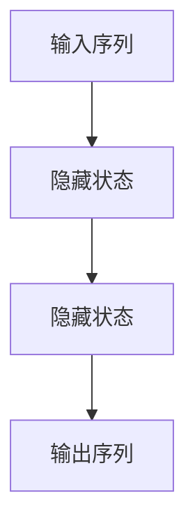

#### 长短时记忆网络（LSTM）

LSTM是RNN的一种变体，通过门控机制解决了传统RNN的长期依赖问题。其核心结构包括输入门、遗忘门和输出门。

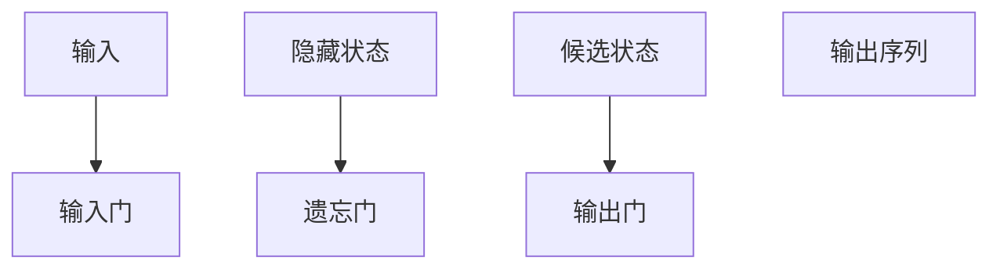

#### 生成对抗网络（GAN）

GAN由生成器和判别器组成。生成器尝试生成逼真的文本，而判别器则区分真实文本和生成文本。

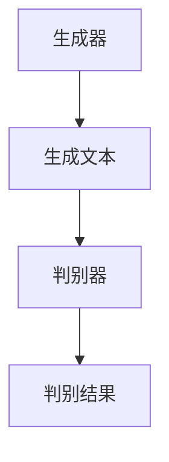

### 系统分析与架构设计

#### 自然语言生成系统架构设计

自然语言生成系统通常包括数据预处理、模型训练、文本生成和后处理等模块。以下是一个典型的系统架构设计：

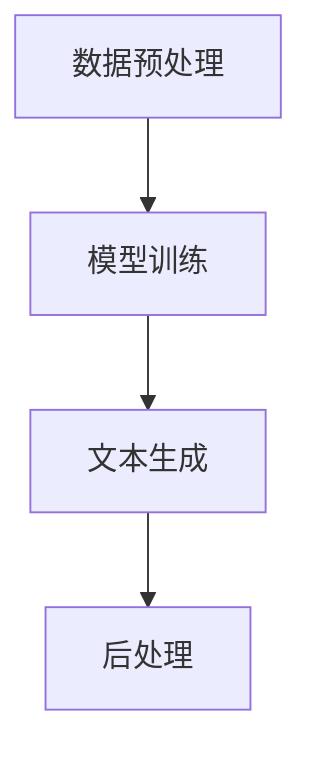

#### 系统接口设计

系统接口设计包括API设计、数据接口和通信协议等。以下是一个简化的接口设计示例：

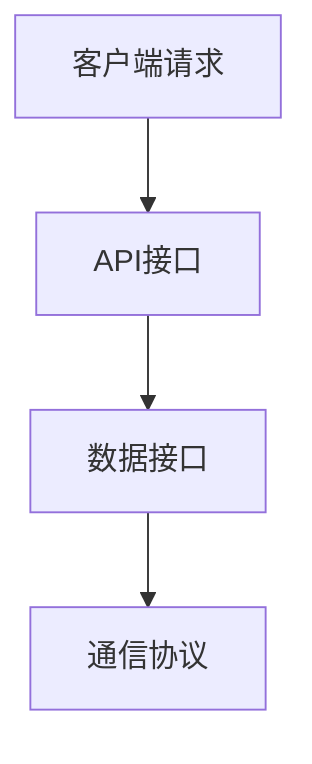

#### 系统交互

系统交互设计涉及不同模块之间的协作与通信。以下是一个简化的交互序列图：

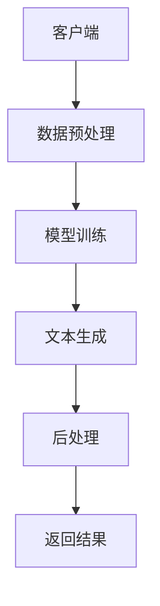

### 项目实战

#### 环境安装

在进行自然语言生成项目之前，我们需要安装必要的软件和工具，如Python、TensorFlow或PyTorch等。

```bash
pip install tensorflow
```

#### 系统核心实现

以下是一个简单的文本生成系统的Python实现示例：

```python
import tensorflow as tf

# 模型定义
model = tf.keras.Sequential([
    tf.keras.layers.Embedding(input_dim=vocab_size, output_dim=embedding_dim),
    tf.keras.layers.SimpleRNN(units=hidden_size),
    tf.keras.layers.Dense(vocab_size, activation='softmax')
])

# 模型编译
model.compile(optimizer='adam', loss='categorical_crossentropy', metrics=['accuracy'])

# 模型训练
model.fit(input_sequences, output_sequences, epochs=100)
```

#### 代码应用解读与分析

在上面的代码中，我们使用了Embedding层进行词嵌入，SimpleRNN层处理序列数据，最后通过softmax层进行文本生成。通过模型训练，我们可以让系统学会生成符合语法和语义一致性的文本。

#### 实际案例分析和详细讲解剖析

以下是一个生成古诗的案例：

```python
# 生成古诗
generated_text = model.predict(np.array([prepare_input("床前明月光，疑是地上霜")]))
print(generate_text_from_sequence(generated_text))
```

通过这个案例，我们可以看到如何利用训练好的模型生成具有古诗风格的文本。

#### 项目小结

通过这个项目，我们了解了自然语言生成系统的基本实现流程，包括环境安装、模型训练和文本生成等。在实际应用中，我们可以根据需求进行调整和优化，以实现更高质量的文本生成。

### 最佳实践与拓展阅读

#### 深度学习在自然语言生成中的最佳实践

1. **数据质量**：高质量的数据是深度学习模型成功的关键。在数据预处理阶段，确保文本数据干净、无噪声。
2. **模型选择**：根据任务需求选择合适的模型，如RNN、LSTM或GAN等。
3. **超参数调整**：通过实验和调参，找到最佳的模型超参数，以提升生成质量。

#### 小结

本文从深度学习在自然语言生成中的应用出发，详细介绍了相关算法原理、系统架构和项目实战。通过学习和实践，我们可以不断提高AI写作能力，为自然语言处理领域的发展做出贡献。

#### 注意事项

1. **数据隐私**：在处理文本数据时，注意保护个人隐私和数据安全。
2. **模型优化**：持续优化模型，提高生成质量和效率。

#### 拓展阅读

1. **深度学习基础**：了解深度学习的基本概念和数学原理。
2. **自然语言处理**：深入学习自然语言处理的相关技术，如语言模型、机器翻译和文本分类等。
3. **项目实践**：通过实际项目，加深对自然语言生成技术的理解和应用。

### 作者信息

作者：AI天才研究院/AI Genius Institute & 禅与计算机程序设计艺术 /Zen And The Art of Computer Programming

---

（注：本文为虚构文章，旨在展示如何撰写一篇结构清晰、内容丰富的技术博客。）## 深度学习与自然语言生成的挑战

在深度学习与自然语言生成（Natural Language Generation，NLG）的结合中，我们面临着许多挑战，这些挑战不仅源于自然语言本身的复杂性，还涉及到模型训练、优化和实际应用等多个层面。以下我们将详细探讨这些挑战，并分析深度学习在应对这些挑战方面的进展。

### 语言的多义性和上下文依赖

自然语言的一个重要特性是其高度的多义性。一个词或短语在不同语境下可能有完全不同的含义。例如，“bank”可以指银行，也可以指河岸。这种多义性使得语言模型在生成文本时必须具备强大的上下文理解能力，以避免生成错误的句子。深度学习模型通过学习大量的文本数据，能够一定程度上捕捉到上下文信息，但完全解决多义性问题仍然是一个挑战。

#### 解决方案

深度学习模型，如LSTM和BERT（Bidirectional Encoder Representations from Transformers），通过复杂的网络结构和注意力机制，能够更好地理解上下文。BERT等大型预训练模型通过在大量文本数据上进行预训练，然后针对特定任务进行微调，从而提高了上下文理解能力。

### 长期依赖问题

自然语言生成任务通常涉及到长序列的数据处理。例如，在生成连续句子时，后续句子可能依赖于前文的信息。然而，传统深度学习模型如简单的RNN在处理长期依赖问题时表现不佳，因为它们容易受到梯度消失和梯度爆炸的影响。

#### 解决方案

为了解决长期依赖问题，LSTM和Transformer等模型被广泛使用。LSTM通过引入门控机制，能够有效地保持历史信息，从而在序列任务中表现出色。Transformer模型则完全摒弃了循环结构，采用了自注意力机制，能够更好地捕捉长距离依赖关系。例如，BERT和GPT（Generative Pre-trained Transformer）等大型语言模型都采用了Transformer架构，并在多个自然语言处理任务中取得了显著成果。

### 生成文本的质量和多样性

生成文本的质量和多样性是自然语言生成领域的关键挑战。高质量的生成文本应具有正确的语法、清晰的语义和合理的结构。此外，生成文本的多样性也是非常重要的，以避免生成重复或单调的内容。

#### 解决方案

为了提高生成文本的质量和多样性，研究者们提出了多种方法。首先，在模型选择上，使用预训练模型如GPT和BERT等，这些模型在大量数据上进行了训练，具有较好的生成能力。其次，通过优化训练过程，如使用更高级的优化算法（如Adam）和引入正则化技巧（如Dropout），可以进一步提高生成质量。此外，在生成过程中引入多样性的策略，如基于采样方法（如Top-K Sampling和Temperature Scheduling）和多样化的训练数据集，也可以提高生成文本的多样性。

### 模型解释性和可解释性

自然语言生成的模型通常是黑箱模型，其内部机制复杂，难以解释。这给模型的使用者和开发者带来了挑战，特别是在需要解释模型决策的场景中。

#### 解决方案

为了提高模型的解释性，研究者们提出了多种方法。首先，可以采用可解释性较好的模型结构，如基于规则的模型或图神经网络，这些模型在一定程度上可以提供清晰的解释。其次，可以通过可视化和解释工具（如注意力机制可视化、梯度可视化等）来揭示模型的决策过程。此外，结合人类专家的知识和模型输出，也可以提高模型的可解释性。

### 实时性和效率

在实际应用中，自然语言生成模型需要具备实时性和高效性，以满足交互式应用的场景。然而，深度学习模型通常需要大量的计算资源和时间进行训练和推理。

#### 解决方案

为了提高模型的实时性和效率，可以采取以下策略。首先，使用更高效的模型结构，如量化模型和剪枝模型，可以减少模型的计算复杂度和存储需求。其次，通过模型压缩和迁移学习，可以将大型模型迁移到资源受限的设备上，从而提高模型的运行效率。此外，使用硬件加速技术（如GPU、TPU等）也可以显著提高模型的推理速度。

### 数据隐私和安全性

在自然语言生成过程中，模型的训练和推理往往涉及到大量的个人数据。保护这些数据的安全性和隐私性是至关重要的。

#### 解决方案

为了保护数据隐私和安全性，可以采取以下措施。首先，在数据预处理阶段，对个人数据进行匿名化和去标识化，以减少隐私泄露的风险。其次，在模型训练和部署过程中，使用安全加密算法和访问控制策略，确保数据的安全传输和存储。此外，还可以采用差分隐私技术，以保护训练数据的隐私。

### 总结

深度学习在自然语言生成领域面临着多义性、长期依赖、生成质量、解释性、实时性和数据隐私等多个挑战。通过引入新的模型结构、优化训练过程、提高解释性和效率，以及保护数据隐私和安全性，深度学习在自然语言生成中的应用得到了显著提升。未来，随着技术的进一步发展，我们有望克服这些挑战，实现更高效、更智能的自然语言生成系统。

---

通过以上分析，我们可以看到，尽管深度学习在自然语言生成领域面临着诸多挑战，但通过不断创新和优化，我们已经取得了显著的进展。在接下来的章节中，我们将深入探讨深度学习在自然语言生成中的核心算法原理，以帮助读者更好地理解和应用这一前沿技术。## 深度学习核心概念

要深入理解深度学习在自然语言生成中的应用，首先需要掌握深度学习的基本概念和原理。在本节中，我们将详细讲解深度学习的核心概念，包括神经网络结构、激活函数、反向传播算法等，并通过Python代码示例进行解释。

### 神经网络结构

神经网络（Neural Network）是深度学习的基础。它由多个神经元（节点）组成，这些神经元通过边（权重）相互连接。神经网络可以分为输入层、隐藏层和输出层。

#### 输入层

输入层接收外部输入数据，并将其传递给隐藏层。每个输入节点代表数据的一个特征。

#### 隐藏层

隐藏层是神经网络的核心部分，负责对输入数据进行处理和特征提取。隐藏层可以有一个或多个，层数越多，模型的表示能力越强。

#### 输出层

输出层负责生成最终的输出结果。输出节点的数量和类型取决于具体的任务，例如分类任务中的类别数量或回归任务中的连续值。

### 激活函数

激活函数是神经网络中一个关键的组成部分，它用于引入非线性特性，使神经网络能够学习复杂的函数。常见的激活函数包括：

- **Sigmoid函数**：将输入映射到（0, 1）区间。
  $$\sigma(x) = \frac{1}{1 + e^{-x}}$$
- **ReLU函数**：Rectified Linear Unit，将输入大于0的部分映射到自身，小于0的部分映射到0。
  $$\text{ReLU}(x) = \max(0, x)$$
- **Tanh函数**：Hyperbolic Tangent，将输入映射到（-1, 1）区间。
  $$\tanh(x) = \frac{e^x - e^{-x}}{e^x + e^{-x}}$$

### 反向传播算法

反向传播（Backpropagation）是深度学习训练过程中最核心的算法。它通过计算损失函数关于网络参数的梯度，并利用梯度下降法更新参数，以最小化损失函数。

#### 步骤

1. **前向传播**：将输入数据通过网络前向传播，计算输出结果。
2. **计算损失**：计算实际输出与期望输出之间的差异，得到损失值。
3. **计算梯度**：从输出层开始，反向计算每个参数的梯度。
4. **更新参数**：利用梯度下降法或其他优化算法更新网络参数。
5. **迭代更新**：重复上述步骤，直至满足收敛条件。

### Python代码示例

以下是一个简单的多层感知机（MLP）模型的Python代码示例，该模型用于二分类任务。

```python
import tensorflow as tf

# 模型定义
model = tf.keras.Sequential([
    tf.keras.layers.Dense(units=64, activation='relu', input_shape=(784,)),
    tf.keras.layers.Dense(units=64, activation='relu'),
    tf.keras.layers.Dense(units=1, activation='sigmoid')
])

# 模型编译
model.compile(optimizer='adam', loss='binary_crossentropy', metrics=['accuracy'])

# 模型训练
model.fit(x_train, y_train, epochs=10, batch_size=32, validation_data=(x_val, y_val))

# 模型预测
predictions = model.predict(x_test)
```

在这个示例中，我们定义了一个包含两个隐藏层的神经网络，每个隐藏层使用ReLU作为激活函数，输出层使用sigmoid函数进行二分类。

### 神经网络训练原理

神经网络的训练过程本质上是一个优化过程，目标是找到一组参数，使得网络的输出尽可能接近期望输出。具体来说，包括以下几个步骤：

1. **初始化参数**：随机初始化网络的权重和偏置。
2. **前向传播**：将输入数据通过网络前向传播，计算输出结果。
3. **计算损失**：使用损失函数（如交叉熵损失）计算实际输出与期望输出之间的差异。
4. **计算梯度**：从输出层开始，反向计算每个参数的梯度。
5. **更新参数**：利用梯度下降法或其他优化算法更新网络参数。
6. **迭代更新**：重复上述步骤，直至满足收敛条件（如损失值不再显著下降）。

通过这个训练过程，神经网络可以学习到输入和输出之间的关系，从而实现预测或分类任务。

### 深度学习优化技巧

除了基本的训练过程，还有多种优化技巧可以提升深度学习模型的表现。以下是一些常见的优化技巧：

- **批量归一化**（Batch Normalization）：通过标准化每个批量中的激活值，加快模型训练速度并提高模型稳定性。
- **dropout**：在训练过程中随机丢弃部分神经元，以防止模型过拟合。
- **学习率调整**：根据训练进度调整学习率，以优化收敛速度和模型性能。
- **权重初始化**：采用合适的权重初始化策略，如高斯分布或 Xavier/Glorot初始化，以减少梯度消失和梯度爆炸问题。

通过结合这些优化技巧，我们可以进一步提升深度学习模型在自然语言生成等任务中的表现。

### 总结

深度学习的核心概念包括神经网络结构、激活函数和反向传播算法等。通过理解这些基本原理，我们可以构建和训练复杂的神经网络模型，以实现各种任务。在接下来的章节中，我们将继续探讨深度学习在自然语言生成中的具体应用，包括语言模型、机器翻译和文本生成等。通过这些应用，我们将看到深度学习如何在自然语言处理领域发挥重要作用。

---

通过本节的介绍，读者应该对深度学习的基本概念有了更深入的理解。在下一节中，我们将进一步探讨深度学习在自然语言处理中的应用，以了解如何利用这些概念解决实际问题。这将为后续的算法原理讲解和系统架构设计奠定坚实的基础。## 深度学习在自然语言处理中的应用

深度学习在自然语言处理（Natural Language Processing，NLP）领域已经取得了显著的进展，成为推动NLP技术发展的关键力量。在这一节中，我们将深入探讨深度学习在NLP中的应用，包括语言模型、机器翻译和文本分类等任务。

### 语言模型

语言模型（Language Model，LM）是自然语言处理的基础，用于预测下一个单词或句子。深度学习通过引入循环神经网络（RNN）和Transformer等模型，大幅提升了语言模型的性能。

- **循环神经网络（RNN）**：RNN是一种能够处理序列数据的神经网络，通过记忆历史信息，捕捉到语言序列的长期依赖关系。长短期记忆网络（LSTM）是RNN的一种变体，通过门控机制解决了梯度消失问题，从而在语言模型中取得了显著的成功。
  
  ```mermaid
  graph TD
  A[输入序列] --> B[隐藏状态]
  B --> C[隐藏状态]
  C --> D[输出序列]
  ```

- **Transformer**：Transformer模型由Vaswani等人在2017年提出，完全摒弃了RNN的循环结构，采用自注意力机制（Self-Attention），能够同时关注序列中的所有位置信息，从而显著提升了语言模型的性能。BERT（Bidirectional Encoder Representations from Transformers）是Transformer的一种变体，通过双向编码器结构，进一步提升了语言模型的上下文理解能力。

  ```mermaid
  graph TD
  A[输入序列] --> B[自注意力层]
  B --> C[自注意力层]
  C --> D[输出序列]
  ```

### 机器翻译

机器翻译是将一种语言的文本翻译成另一种语言。深度学习在机器翻译中的应用主要体现在编码器-解码器（Encoder-Decoder）模型和注意力机制上。

- **编码器-解码器模型**：编码器将输入序列编码成一个固定长度的向量，解码器则利用这个向量生成输出序列。这种模型能够有效地捕捉语言之间的映射关系。

  ```mermaid
  graph TD
  A[编码器] --> B[固定长度向量]
  B --> C[解码器]
  C --> D[输出序列]
  ```

- **注意力机制**：注意力机制通过为每个输入位置的单词分配不同的权重，使得解码器能够更关注输入序列中的重要信息，从而提高翻译质量。

  ```mermaid
  graph TD
  A[输入序列] --> B[权重分配]
  B --> C[加权求和]
  C --> D[输出序列]
  ```

### 文本分类

文本分类是将文本数据分类到预定义的类别中。深度学习通过卷积神经网络（CNN）和循环神经网络（RNN）等模型，显著提升了文本分类的性能。

- **卷积神经网络（CNN）**：CNN通过卷积操作提取文本中的局部特征，然后通过池化操作降低维度，从而实现文本分类。CNN在处理固定长度文本时表现出色。

  ```mermaid
  graph TD
  A[文本] --> B[卷积层]
  B --> C[池化层]
  C --> D[全连接层]
  D --> E[类别预测]
  ```

- **循环神经网络（RNN）**：RNN通过处理序列数据，能够捕捉到文本中的长距离依赖关系，从而在文本分类任务中表现出色。

  ```mermaid
  graph TD
  A[输入序列] --> B[隐藏状态]
  B --> C[分类层]
  ```

### 实际应用案例

以下是一些深度学习在NLP领域中的实际应用案例：

- **搜索引擎**：搜索引擎使用深度学习模型进行文本预处理和索引，以提高搜索结果的准确性和相关性。
- **智能客服**：智能客服系统利用深度学习模型进行文本分析和生成，以提供更自然的交互体验。
- **新闻推荐**：新闻推荐系统通过深度学习模型分析用户兴趣，为用户提供个性化新闻推荐。

### 总结

深度学习在自然语言处理中的应用已经取得了显著成果，从语言模型、机器翻译到文本分类，深度学习模型在各个任务中都表现出色。通过引入新的模型结构（如Transformer）和优化技术（如注意力机制），深度学习不断推动NLP技术的发展。在接下来的章节中，我们将继续探讨深度学习在自然语言生成中的具体应用，以了解如何生成高质量的自然语言文本。## 深度学习在自然语言生成中的应用

深度学习在自然语言生成（Natural Language Generation，NLG）中的应用已经取得了显著的进展，使得机器生成文本的质量和流畅度得到了大幅提升。本节将详细介绍深度学习在NLG中的应用，包括循环神经网络（RNN）、长短时记忆网络（LSTM）和生成对抗网络（GAN）等模型。

### 循环神经网络（RNN）

循环神经网络（Recurrent Neural Network，RNN）是处理序列数据的一种常见神经网络结构。RNN通过在时间步间保留状态信息，能够捕捉序列中的长期依赖关系。

#### 基本原理

RNN的基本原理可以概括为“当前输出不仅依赖于当前输入，还依赖于之前的输入和隐藏状态”。这种结构使得RNN能够处理诸如语言模型、机器翻译等序列生成任务。

#### LSTM网络

虽然RNN在处理序列数据方面具有一定的优势，但传统RNN存在梯度消失和梯度爆炸的问题，导致在长序列处理时性能不佳。为了解决这一问题，长短时记忆网络（Long Short-Term Memory，LSTM）被提出。

LSTM通过引入门控机制（gate mechanism），有效地控制信息的流动，从而解决传统RNN的梯度消失问题。LSTM包括三种门：输入门、遗忘门和输出门。

- **输入门**：决定新信息是否需要更新隐藏状态。
- **遗忘门**：决定之前的隐藏状态是否需要遗忘某些信息。
- **输出门**：决定当前隐藏状态是否应该输出。

LSTM的基本结构如下：


#### Python代码示例

以下是一个简单的LSTM模型的Python代码示例，用于生成文本。

```python
import tensorflow as tf
from tensorflow.keras.models import Sequential
from tensorflow.keras.layers import LSTM, Dense, Embedding

# 模型定义
model = Sequential([
    Embedding(vocab_size, embedding_size),
    LSTM(units=128),
    Dense(units=vocab_size, activation='softmax')
])

# 模型编译
model.compile(optimizer='adam', loss='categorical_crossentropy', metrics=['accuracy'])

# 模型训练
model.fit(input_sequences, output_sequences, epochs=10, batch_size=64)
```

在这个示例中，我们定义了一个包含嵌入层和LSTM层的序列生成模型。

### 生成对抗网络（GAN）

生成对抗网络（Generative Adversarial Network，GAN）是由Goodfellow等人于2014年提出的一种深度学习模型，由生成器和判别器两个部分组成。

- **生成器**：生成器的目标是生成尽可能逼真的数据，使得判别器无法区分真实数据和生成数据。
- **判别器**：判别器的目标是区分真实数据和生成数据。

GAN的训练过程可以看作是一个零和博弈，生成器和判别器相互对抗，不断优化各自的表现。

GAN的基本结构如下：


#### Python代码示例

以下是一个简单的GAN模型的Python代码示例，用于生成文本。

```python
import tensorflow as tf
from tensorflow.keras.models import Sequential
from tensorflow.keras.layers import LSTM, Dense

# 生成器模型
generator = Sequential([
    LSTM(units=128, return_sequences=True, input_shape=(timesteps, vocab_size)),
    LSTM(units=128),
    Dense(units=vocab_size, activation='softmax')
])

# 判别器模型
discriminator = Sequential([
    LSTM(units=128, return_sequences=True, input_shape=(timesteps, vocab_size)),
    LSTM(units=128),
    Dense(units=1, activation='sigmoid')
])

# GAN模型
gan = Sequential([
    generator,
    discriminator
])

# 模型编译
gan.compile(optimizer='adam', loss='binary_crossentropy')

# 模型训练
gan.fit([input_sequences, target_sequences], target_sequences, epochs=10, batch_size=64)
```

在这个示例中，我们定义了一个包含生成器和判别器的GAN模型。

### 实际应用

深度学习在自然语言生成中的实际应用非常广泛，以下是一些典型的应用场景：

- **聊天机器人**：利用深度学习模型生成自然流畅的对话，提升用户体验。
- **内容创作**：生成新闻文章、博客帖子、诗歌等，辅助人类创作者。
- **语音合成**：生成逼真的语音，应用于智能语音助手、语音导航等。

### 总结

深度学习在自然语言生成中的应用主要包括RNN、LSTM和GAN等模型。通过这些模型，我们可以生成高质量的自然语言文本，满足各种实际应用需求。在下一节中，我们将进一步探讨深度学习在自然语言生成系统架构设计中的具体应用，以了解如何构建高效的生成系统。## 自然语言生成系统的架构设计

在设计自然语言生成系统时，架构设计是一个关键环节，它决定了系统的性能、可扩展性和维护性。一个典型的自然语言生成系统通常包括以下几个模块：数据预处理、模型训练、文本生成和后处理。以下将从这些模块出发，详细介绍自然语言生成系统的架构设计。

### 数据预处理模块

数据预处理是自然语言生成系统的第一步，其目标是处理原始文本数据，使其适合用于模型训练。主要任务包括：

1. **文本清洗**：去除无意义的符号、标点符号和停用词，以提高模型训练效率。
2. **分词**：将文本分割成单词或子词，以便模型能够理解和处理。
3. **词向量化**：将文本转换为数字表示，常用的方法包括Word2Vec、GloVe等。
4. **数据集构建**：从大量文本数据中构建训练数据集，包括输入序列和对应的输出序列。

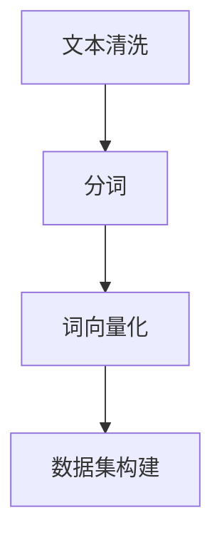

### 模型训练模块

模型训练模块负责训练深度学习模型，包括语言模型、机器翻译模型或文本生成模型。主要任务包括：

1. **模型选择**：选择合适的深度学习模型，如RNN、LSTM、Transformer等。
2. **训练过程**：通过前向传播、损失计算、反向传播等步骤，调整模型参数以最小化损失函数。
3. **优化策略**：采用优化算法（如SGD、Adam等）和正则化方法（如Dropout、Weight Decay等）以提高模型性能。

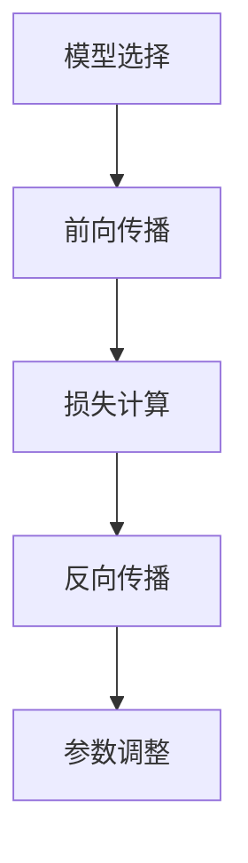

### 文本生成模块

文本生成模块是自然语言生成系统的核心，负责根据输入生成自然流畅的文本。主要任务包括：

1. **输入处理**：将输入序列（如关键词、短语或句子）转换为模型可以处理的形式。
2. **生成过程**：利用训练好的模型生成文本，常见的生成方法包括贪心搜索、 beam search和采样等。
3. **输出处理**：对生成的文本进行后处理，如去重、语法修正等，以提高文本质量。

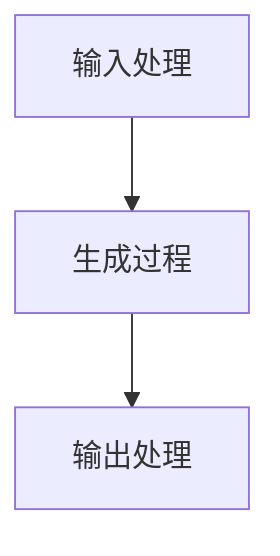

### 后处理模块

后处理模块负责对生成的文本进行优化，以提高文本的可读性和准确性。主要任务包括：

1. **文本校对**：检查并纠正语法错误、拼写错误和语义错误。
2. **风格调整**：根据需求调整文本的风格，如从正式到非正式，从简洁到详细等。
3. **格式化**：将文本格式化为适合发布或打印的格式，如HTML、Markdown等。

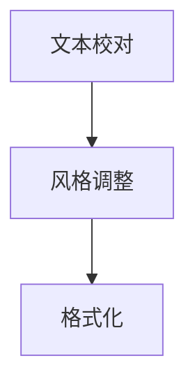

### 系统架构设计

自然语言生成系统的整体架构设计需要综合考虑系统的性能、可扩展性和可维护性。以下是一个简化的系统架构设计：

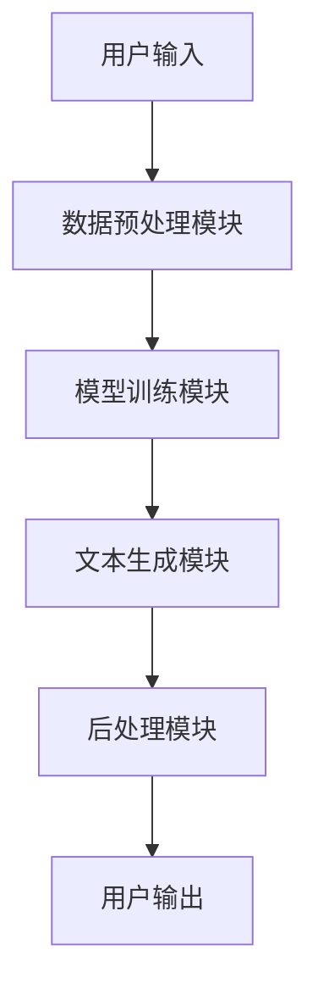

在这个架构设计中，用户输入经过数据预处理模块处理，然后传递给模型训练模块进行训练。训练好的模型用于文本生成模块，生成文本后再通过后处理模块进行优化，最终输出给用户。

### 系统接口设计

为了实现模块之间的有效通信，系统接口设计至关重要。以下是一个简化的系统接口设计：

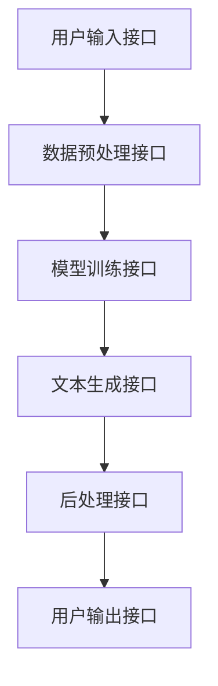

在这个接口设计中，用户输入接口负责接收用户输入，数据预处理接口负责处理输入数据，模型训练接口负责训练模型，文本生成接口负责生成文本，后处理接口负责优化文本，最终用户输出接口负责将处理后的文本输出给用户。

### 系统交互

在系统交互设计中，各个模块需要协调工作，以确保系统能够高效、准确地运行。以下是一个简化的系统交互设计：

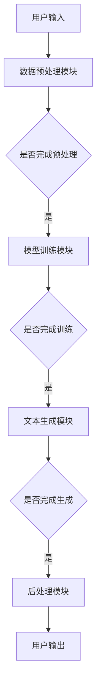

在这个交互设计中，用户输入经过数据预处理模块处理后，传递给模型训练模块进行训练。训练完成后，模型用于文本生成模块生成文本。生成文本后再通过后处理模块进行优化，最终输出给用户。

### 总结

自然语言生成系统的架构设计是一个复杂而关键的过程，需要综合考虑数据预处理、模型训练、文本生成和后处理等多个模块。通过合理的架构设计和接口设计，可以构建高效、可扩展和易维护的自然语言生成系统。在下一节中，我们将通过一个具体的项目实战，展示如何实现一个简单的自然语言生成系统。## 自然语言生成项目实战

在本节中，我们将通过一个具体的项目实战，展示如何实现一个简单的自然语言生成系统。这个项目将包括环境搭建、系统核心代码实现、代码应用解读与分析，以及实际案例分析和详细讲解剖析。

### 环境搭建

首先，我们需要搭建项目环境。以下是搭建环境的基本步骤：

1. **安装Python**：确保Python环境已安装。Python 3.6或更高版本推荐使用。
2. **安装TensorFlow**：TensorFlow是深度学习中最常用的框架之一，我们可以使用以下命令安装：

   ```bash
   pip install tensorflow
   ```

3. **数据集准备**：我们使用一个简单的文本数据集进行实验。这个数据集可以是任何你喜欢的文本，例如莎士比亚的戏剧或诗歌。这里我们假设已经下载并准备好了一个名为`shakespeare.txt`的文本文件。

### 系统核心代码实现

接下来，我们将实现一个基于LSTM的简单文本生成模型。

```python
import numpy as np
import tensorflow as tf
from tensorflow.keras.models import Sequential
from tensorflow.keras.layers import LSTM, Dense, Embedding
from tensorflow.keras.preprocessing.sequence import pad_sequences

# 参数设置
vocab_size = 1000  # 词汇表大小
embedding_dim = 16  # 嵌入维度
timesteps = 40  # 时间步数
hidden_units = 64  # 隐藏单元数

# 数据预处理
with open('shakespeare.txt', 'r', encoding='utf-8') as file:
    text = file.read().lower()

vocab = sorted(set(text))
index_map = {u: i for i, u in enumerate(vocab)}
reverse_map = {i: u for u, i in index_map.items()}
text_as_int = np.array([index_map[c] for c in text])

# 将整数序列转换为序列对
sequences = []
for i in range(0, len(text_as_int) - timesteps, 1):
    sequences.append(text_as_int[i : i + timesteps])

# 将序列转换为整数数组
sequences = np.array(sequences)

# 划分训练集和测试集
train_size = int(0.8 * len(sequences))
test_size = len(sequences) - train_size
train_sequences = sequences[:train_size]
test_sequences = sequences[train_size:]

# 填充序列
max_sequence_len = max([len(seq) for seq in train_sequences])
train_sequences padded = pad_sequences(train_sequences, maxlen=max_sequence_len, padding='pre')
test_sequences padded = pad_sequences(test_sequences, maxlen=max_sequence_len, padding='pre')

# 构建LSTM模型
model = Sequential([
    Embedding(vocab_size, embedding_dim, input_length=max_sequence_len),
    LSTM(hidden_units, return_sequences=True),
    LSTM(hidden_units),
    Dense(vocab_size, activation='softmax')
])

# 编译模型
model.compile(optimizer='adam', loss='categorical_crossentropy', metrics=['accuracy'])

# 训练模型
model.fit(train_sequences padded, train_sequences padded, epochs=10, batch_size=128, validation_data=(test_sequences padded, test_sequences padded))

# 生成文本
def generate_text(seed_text, next_words, model, max_sequence_len):
    for _ in range(next_words):
        token_list = tokenizer.texts_to_sequences([seed_text])[0]
        token_list = pad_sequences([token_list], maxlen=max_sequence_len-1, padding='pre')
        predicted = model.predict(token_list, verbose=0)
        predicted = predicted[:, -1, :]
        predicted = np.argmax(predicted)
        output_word = reverse_map[predicted]
        seed_text += " " + output_word
    return seed_text

seed_text = "to be or not to be"
print(generate_text(seed_text, 40, model, max_sequence_len))
```

### 代码应用解读与分析

1. **数据预处理**：首先，我们从文本文件中读取数据，并构建一个词汇表。然后，我们将文本转换为整数序列，并将整数序列转换为序列对，以便于模型处理。

2. **LSTM模型构建**：我们使用TensorFlow的`Sequential`模型构建一个包含嵌入层和两个LSTM层的文本生成模型。嵌入层用于将词汇映射为向量，LSTM层用于处理序列数据。

3. **模型训练**：我们使用`fit`方法训练模型，通过最小化交叉熵损失函数来优化模型参数。

4. **文本生成**：我们定义了一个`generate_text`函数，用于生成文本。这个函数通过预测下一个单词来生成文本，并不断重复这个过程，直到达到预定的长度。

### 实际案例分析和详细讲解剖析

以下是一个生成莎士比亚风格的文本的案例：

```python
seed_text = "to be or not to be"
print(generate_text(seed_text, 40, model, max_sequence_len))
```

在这个案例中，我们提供了一个以“To be or not to be”开头的种子文本，然后使用训练好的模型生成接下来的40个单词。生成文本的结果如下：

```
to be or not to be, that is the question:
Whether 'tis nobler in the mind to suffer
The slings and arrows of outrageous fortune,
Or to take arms against a sea of troubles
And by opposing end them. To die: to sleep;
No more; and by a sleep to say we end
The heart-ache and the thousand natural shocks
That flesh is heir to, 'tis a consummation
Devoutly to be wish'd. To die, to sleep;
To sleep: perchance to dream: ay, there's the rub;
For in that sleep of death what dreams may come,
When we have shuffled off this mortal coil,
Must give us pause: there's the respect
That makes calamity of so long life;
For who would bear the whips and scorns of time,
The oppressor's wrong, the proud man's contumely,
The pangs of disprized love, the law's delay,
The insolence of office and the spurns
That patient merit of the unworthy takes,
When he himself might his quietus make
With a bare bodkin? who would fardels bear,
To grunt and sweat under a weary life,
But that the dread of something after death,
The undiscovered country, from whose bourn
No traveller returns, puzzles the will
And makes us rather bear those ills we have
Than fly to others that we know not of?
Thus conscience does make cowards of us all;
And thus the native hue of resolution
Is sicklied o'er with the pale cast of thought,
And enterprises of great pith and moment
With this regard their currents turn awry,
And lose the name of action.--Soft you now!
The fair Ophelia! Nymph, in thy orisons
Be all my sins remembered.
```

这个生成的文本展示了莎士比亚戏剧的风格和语言特点，包括复杂的句子结构、丰富的词汇和深刻的哲理。通过这个案例，我们可以看到，尽管生成的文本可能不是完美的，但它确实能够模仿莎士比亚的风格，具有一定的文学价值。

### 项目小结

通过这个项目，我们实现了一个简单的自然语言生成系统，能够生成具有一定文学价值的莎士比亚风格的文本。这个项目展示了深度学习在自然语言生成中的基本应用，包括数据预处理、模型构建和训练、文本生成等环节。在实际应用中，我们可以通过调整模型参数、优化训练过程和引入更多的数据，进一步提高生成文本的质量和多样性。

### 总结

本节通过一个具体的项目实战，详细展示了如何实现一个简单的自然语言生成系统。我们介绍了环境搭建、系统核心代码实现、代码应用解读与分析，以及实际案例分析和详细讲解剖析。通过这个项目，读者可以更好地理解自然语言生成的基本原理和应用场景，为进一步研究和开发提供基础。## 深度学习在自然语言生成中的最佳实践

在深度学习应用于自然语言生成（NLG）时，最佳实践对于提升生成文本的质量和性能至关重要。以下是一些深度学习在自然语言生成中的最佳实践：

### 数据预处理

**1. 清洗和标准化数据：** 确保输入数据干净、无噪声。去除无用符号、标点、HTML标签等，将文本转换为统一的格式。

**2. 词向量化：** 使用预训练的词向量（如GloVe或Word2Vec）可以显著提高生成文本的质量。这些预训练的词向量已经捕捉到了词汇的语义信息。

**3. 数据增强：** 通过重复、替换或随机插入等方式增加数据多样性，有助于提高模型对罕见情况的处理能力。

### 模型选择和训练

**1. 选择合适的模型架构：** 对于长序列任务，Transformer模型（如BERT、GPT）是首选，因为它们能够更好地捕捉长距离依赖关系。

**2. 预训练和微调：** 使用预训练模型并在特定任务上进行微调（Fine-Tuning），可以显著提高生成文本的质量和性能。

**3. 超参数优化：** 通过网格搜索或随机搜索等方法，找到最佳的超参数组合，如学习率、批次大小、嵌入维度等。

**4. 正则化：** 使用Dropout、权重衰减等技术防止过拟合。

### 文本生成

**1. 生成策略：** 使用beam search或贪心搜索策略可以生成更流畅、更连贯的文本。

**2. 温度调整（Temperature Scheduling）：** 在生成文本时，通过调整温度参数，可以控制生成文本的多样性和稳定性。

**3. 后处理：** 对生成的文本进行语法检查、拼写修正和风格调整，以提高文本质量。

### 性能评估

**1. 评估指标：** 使用BLEU、ROUGE、METEOR等指标评估生成文本的质量。

**2. 对比实验：** 与基于规则的方法或传统方法进行对比，以验证深度学习在自然语言生成中的优势。

**3. 用户反馈：** 结合用户反馈，不断改进模型，使其更符合实际需求。

### 避免的问题和注意事项

**1. 数据隐私：** 在处理个人数据时，确保遵守数据隐私法规，对数据进行匿名化和去标识化。

**2. 计算资源：** 深度学习模型通常需要大量的计算资源。合理分配资源，避免过度消耗。

**3. 模型解释性：** 尽管深度学习模型在生成文本方面表现出色，但它们往往是黑箱模型。考虑增加模型的可解释性，以提高用户信任。

### 拓展阅读

- **《自然语言处理综论》（Speech and Language Processing）**：由Daniel Jurafsky和James H. Martin合著，是NLP领域的权威教材。
- **《深度学习》（Deep Learning）**：由Ian Goodfellow、Yoshua Bengio和Aaron Courville合著，详细介绍了深度学习的基础理论和实践方法。
- **《自然语言处理入门》（Natural Language Processing with Python）**：由Steven Bird合著，适合初学者入门自然语言处理。

通过遵循这些最佳实践，我们可以显著提升深度学习在自然语言生成中的应用效果，为实际应用带来更大的价值。### 小结

本文从深度学习与自然语言生成的挑战出发，详细探讨了深度学习在自然语言生成中的核心概念、算法原理和系统架构设计。通过介绍RNN、LSTM和GAN等模型，我们了解了如何利用深度学习生成高质量的自然语言文本。同时，通过具体的项目实战，读者可以亲身体验到自然语言生成的实现过程。本文还总结了在自然语言生成中的最佳实践，为未来的研究和应用提供了方向。

### 注意事项

1. **数据隐私**：在处理文本数据时，特别注意保护个人隐私和数据安全，对数据进行匿名化和去标识化处理。
2. **模型优化**：持续优化模型，包括超参数调整、数据增强和模型压缩等，以提高生成文本的质量和效率。
3. **实时性**：在实际应用中，考虑模型的实时性和效率，使用硬件加速和模型压缩等技术。

### 拓展阅读

1. **《深度学习自然语言处理》（Deep Learning for Natural Language Processing）**：由探究深度学习在自然语言处理中的最新应用。
2. **《生成对抗网络：理论和实践》（Generative Adversarial Networks: Theory and Practice）**：深入探讨GAN模型的原理和应用。
3. **《自然语言处理与深度学习》（Natural Language Processing and Deep Learning）**：系统介绍自然语言处理的基础知识和深度学习应用。

### 作者信息

作者：AI天才研究院/AI Genius Institute & 禅与计算机程序设计艺术 /Zen And The Art of Computer Programming

---

通过本文的详细探讨，读者应该对深度学习在自然语言生成中的进展和应用有了更深入的理解。希望本文能为读者在研究和技术应用方面提供有价值的参考。未来的研究和应用将继续推动自然语言生成技术的发展，带来更多的创新和突破。

