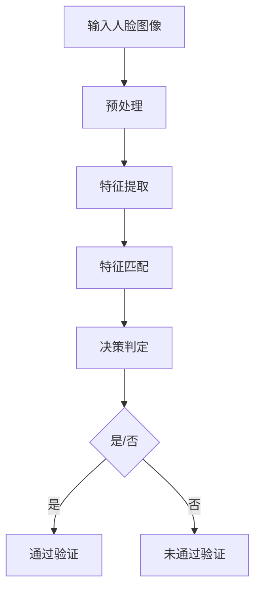
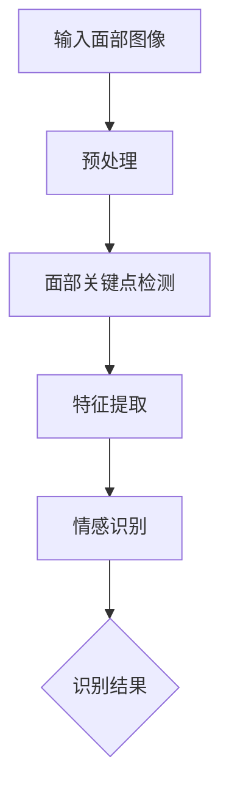
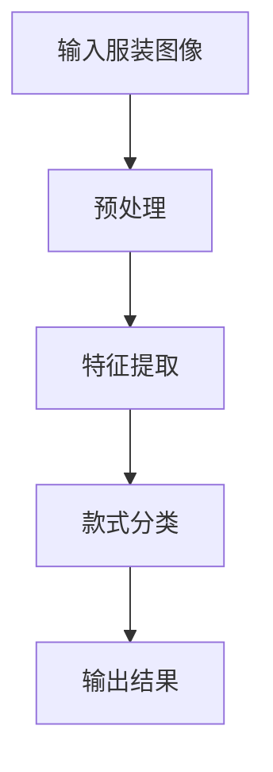
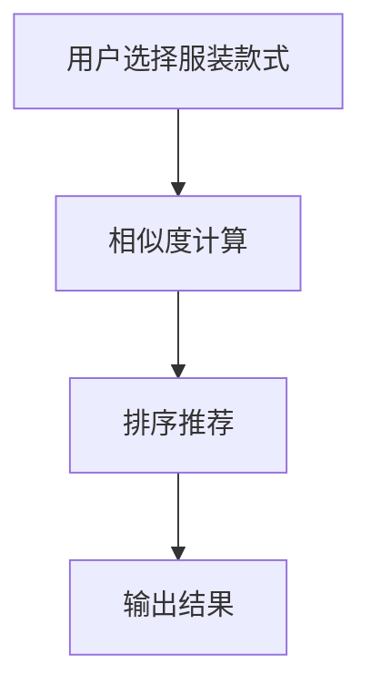
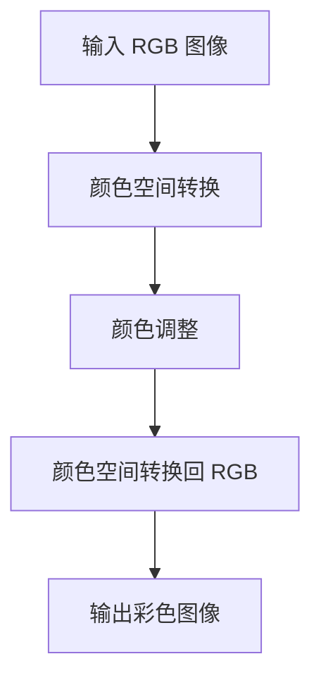
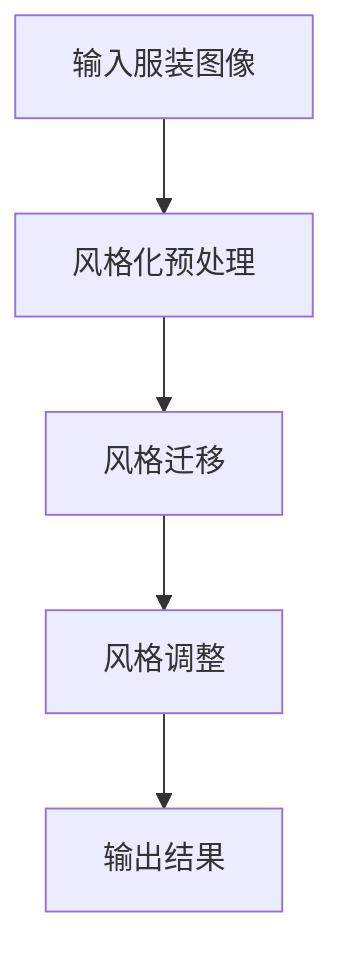
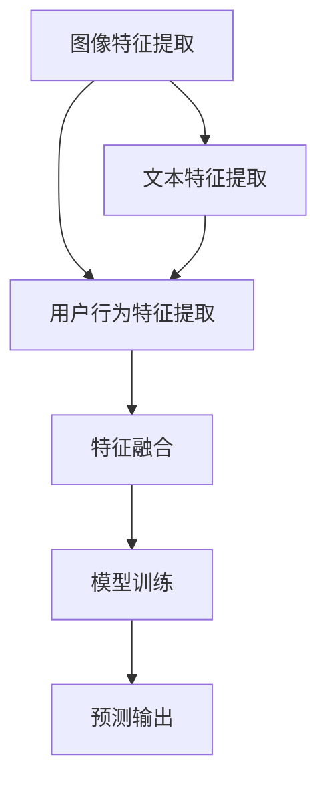

                 

## 1.3 主流深度学习算法及其特性对比

### 1.3.1 卷积神经网络（CNN）

**特性：**

- 基于局部连接和权值共享。
- 对图像数据有很好的特征提取能力。
- 可以处理高维数据。

**对比表格：**

| 算法         | 特点                                       | 应用场景                |
| ----------- | ------------------------------------------ | ---------------------- |
| 卷积神经网络（CNN） | 局部连接和权值共享 | 图像识别、图像分类、图像分割 |
| 递归神经网络（RNN） | 可以处理序列数据 | 自然语言处理、语音识别、时间序列预测 |
| 生成对抗网络（GAN） | 生成式模型 | 图像生成、图像修复、数据增强 |
| 聚类算法（K-means） | 无监督学习 | 数据聚类、特征提取 |

### 1.3.2 递归神经网络（RNN）

**特性：**

- 适用于处理序列数据。
- 能够捕获序列中的长期依赖关系。
- 能够处理变长序列。

**对比表格：**

| 算法         | 特点                                       | 应用场景                |
| ----------- | ------------------------------------------ | ---------------------- |
| 递归神经网络（RNN） | 可以处理序列数据 | 自然语言处理、语音识别、时间序列预测 |
| 长短期记忆网络（LSTM） | 能够处理长序列数据 | 自然语言处理、语音识别、时间序列预测 |
| 门控循环单元（GRU） | 类似LSTM，但结构更简单 | 自然语言处理、语音识别、时间序列预测 |

### 1.3.3 生成对抗网络（GAN）

**特性：**

- 生成式模型。
- 能够生成高质量的图像数据。
- 可以用于数据增强和图像修复。

**对比表格：**

| 算法         | 特点                                       | 应用场景                |
| ----------- | ------------------------------------------ | ---------------------- |
| 生成对抗网络（GAN） | 生成式模型 | 图像生成、图像修复、数据增强 |
| 变分自编码器（VAE） | 用于生成数据的概率模型 | 图像生成、数据增强、异常检测 |

### 1.3.4 聚类算法（K-means）

**特性：**

- 无监督学习算法。
- 可以将数据划分为多个簇。
- 对初始聚类中心敏感。

**对比表格：**

| 算法         | 特点                                       | 应用场景                |
| ----------- | ------------------------------------------ | ---------------------- |
| 聚类算法（K-means） | 无监督学习，可以将数据划分为多个簇 | 数据聚类、特征提取、图像分割 |
| 密度聚类算法（DBSCAN） | 能够发现任意形状的簇，不受初始聚类中心的影响 | 数据挖掘、社交网络分析、图像分割 |
| 高斯混合模型（GMM） | 假设数据为高斯分布 | 数据聚类、特征提取、图像分割 |

通过上述对比表格，我们可以看到不同深度学习算法的特性和适用场景。在实际应用中，需要根据具体问题和数据特点选择合适的算法。例如，对于图像识别任务，CNN 是一个非常好的选择；对于自然语言处理任务，RNN、LSTM 或 GRU 可能更适合。而在数据聚类任务中，K-means、DBSCAN 和 GMM 等算法各有优缺点，需要根据具体应用场景进行选择。

## 1.4 深度学习算法在虚拟试衣中的应用

### 1.4.1 人脸识别与表情分析

#### 人脸识别算法原理

人脸识别是深度学习领域的一个重要应用，其核心是通过计算机视觉算法对图像或视频中的面部进行识别和验证。主要分为以下几个步骤：

1. **特征提取**：使用卷积神经网络（CNN）等深度学习算法提取面部图像的特征向量。CNN 的多层卷积和池化操作可以有效地提取图像的局部特征和全局特征。
   
2. **特征匹配**：将提取到的特征向量与数据库中的已知人脸特征向量进行比对，计算相似度。常用的相似度度量方法有欧氏距离、余弦相似度等。

3. **决策判定**：根据相似度度量结果，设定阈值进行判定。若相似度高于阈值，则判定为同一个人；否则，判定为不同人。

#### 表情分析算法原理

表情分析是通过计算机视觉技术分析面部图像，识别其中表达的喜怒哀乐等情感。主要步骤如下：

1. **面部关键点检测**：首先使用卷积神经网络或回归算法（如 facial landmarks detection）定位面部关键点，包括眼睛、鼻子、嘴巴等部位。

2. **特征提取**：根据面部关键点，提取面部图像的几何特征和纹理特征。例如，计算眼睛间距、嘴巴张开程度等。

3. **情感识别**：使用分类算法（如支持向量机SVM、决策树等）将提取到的特征向量映射到具体的情感类别。

#### 应用实例与分析

在实际应用中，人脸识别和表情分析可以用于虚拟试衣系统中，提升用户体验。以下是一个应用实例：

1. **用户登录**：用户通过人脸识别技术进行登录，验证用户身份，确保试衣系统的安全性和隐私保护。

2. **个性化推荐**：根据用户的面部特征和表情分析结果，推荐适合用户风格的服装款式和颜色。

3. **情感反馈**：分析用户的表情变化，评估用户的试衣体验，为系统优化提供数据支持。

通过上述应用实例，可以看出人脸识别和表情分析在虚拟试衣系统中具有重要价值。人脸识别技术可以提升系统的安全性，表情分析技术可以增强系统的个性化推荐功能，为用户提供更好的试衣体验。

### 1.4.2 服装款式识别与匹配

#### 服装款式识别算法原理

服装款式识别是深度学习在虚拟试衣中的另一个重要应用。其主要目标是识别图像中的服装款式，并将其与数据库中的服装款式进行匹配。主要步骤如下：

1. **特征提取**：使用深度卷积神经网络（如 ResNet、VGG）提取服装图像的特征向量。这些特征向量可以捕获服装的款式和风格信息。

2. **款式分类**：将提取到的特征向量输入到分类算法（如卷积神经网络、支持向量机SVM）中，进行款式分类。分类算法根据特征向量和已知款式标签，预测图像中的服装款式。

3. **款式匹配**：将用户选择的服装款式与系统中的服装款式进行匹配，推荐相似款式的服装。

#### 服装款式匹配算法原理

服装款式匹配算法旨在为用户提供与所选款式相似的服装推荐。主要步骤如下：

1. **相似度计算**：计算用户选择的服装款式与系统中其他服装款式的相似度。常用的相似度计算方法有欧氏距离、余弦相似度等。

2. **排序推荐**：根据相似度计算结果，对系统中的服装款式进行排序，推荐相似度最高的服装款式。

#### 应用实例与分析

在实际应用中，服装款式识别和匹配可以显著提升虚拟试衣系统的用户体验。以下是一个应用实例：

1. **款式识别**：用户上传一张服装图片，系统使用服装款式识别算法识别图片中的服装款式。

2. **款式匹配**：系统将识别到的款式与数据库中的款式进行匹配，推荐相似款式的服装供用户试穿。

3. **个性化推荐**：根据用户的购买历史和偏好，推荐用户可能感兴趣的服装款式。

通过上述应用实例，可以看出服装款式识别和匹配在虚拟试衣系统中具有重要作用。这些技术可以为用户提供更加个性化的购物体验，提高用户满意度。

### 1.4.3 色彩校正与风格调整

#### 色彩校正算法原理

色彩校正是在虚拟试衣中确保服装颜色真实还原的重要环节。其主要目标是调整图像中的颜色，使其与实际服装颜色一致。主要步骤如下：

1. **颜色空间转换**：将输入的 RGB 图像转换为 Lab、YUV 或其他颜色空间，以便进行颜色调整。

2. **颜色调整**：在 Lab 或其他颜色空间中对颜色进行调整，如亮度、对比度、饱和度等。常用的调整方法有直方图均衡化、色彩平衡等。

3. **颜色空间转换回 RGB**：将调整后的颜色空间转换回 RGB，生成最终的彩色图像。

#### 风格调整算法原理

风格调整是使服装图像具有特定风格或效果的技术。其主要步骤如下：

1. **风格化预处理**：对服装图像进行预处理，包括去噪、增强细节等。

2. **风格迁移**：使用深度学习算法（如卷积神经网络、生成对抗网络GAN）将输入图像的风格迁移到目标风格。常见的方法有风格迁移网络（如 VAE、GAN）。

3. **风格调整**：对迁移后的图像进行进一步调整，如色彩平衡、锐度调整等。

#### 应用实例与分析

在实际应用中，色彩校正和风格调整可以显著提升虚拟试衣系统的视觉效果。以下是一个应用实例：

1. **色彩校正**：用户上传一张服装图片，系统使用色彩校正算法调整图像中的颜色，使其与实际服装颜色一致。

2. **风格调整**：系统提供多种风格选择，用户可以根据个人喜好选择特定风格的服装。

3. **个性化推荐**：根据用户的风格偏好，推荐符合用户风格的服装。

通过上述应用实例，可以看出色彩校正和风格调整在虚拟试衣系统中具有重要价值。这些技术可以为用户提供更加真实和个性化的购物体验。

## 1.5 AR技术在虚拟试衣中的应用

### 1.5.1 AR技术基础

增强现实（AR）技术是一种将虚拟信息叠加到现实场景中的技术。其主要组成部分包括：

1. **显示设备**：如智能手机、平板电脑、头戴式显示器等。
2. **传感器**：如摄像头、GPS、陀螺仪、加速计等，用于捕捉现实场景和环境信息。
3. **算法**：如图像识别、SLAM（Simultaneous Localization and Mapping，同时定位与建图）、3D建模等，用于处理和分析捕获到的数据。
4. **内容生成**：通过算法生成虚拟信息，如3D模型、文字、图像等。

### 1.5.2 AR在虚拟试衣中的实现

在虚拟试衣中，AR技术可以通过以下方式实现：

1. **用户定位**：使用摄像头和传感器捕捉用户的位置和动作，通过SLAM技术构建用户的三维空间模型。

2. **图像识别**：使用图像识别算法识别用户试穿服装的图像，并定位服装在图像中的位置。

3. **虚拟服装生成**：根据识别结果，在用户三维空间中生成虚拟服装模型，将其叠加到用户身上。

4. **交互与控制**：通过触摸屏、手势识别等方式，用户可以与虚拟服装进行交互，如旋转、放大、缩小等。

### 1.5.3 AR应用案例分析

以下是一个AR虚拟试衣应用案例：

**案例：某大型电商平台AR虚拟试衣应用**

1. **用户场景**：用户通过智能手机摄像头扫描服装商品页面上的二维码，进入AR虚拟试衣界面。

2. **应用流程**：
   - 用户上传一张服装图片或选择已有的服装模型。
   - AR系统识别用户图像和服装图像，并在用户身上生成虚拟服装模型。
   - 用户可以通过手势控制虚拟服装的旋转、放大、缩小等。

3. **效果评估**：
   - 用户反馈：通过用户评价和反馈，评估虚拟试衣的效果和用户满意度。
   - 销售数据：通过销售数据，分析虚拟试衣对用户购物决策的影响。

通过上述案例分析，可以看出AR技术在虚拟试衣中具有广泛的应用前景，可以为用户提供更加真实和沉浸式的购物体验。

## 1.6 深度学习与AR技术在虚拟试衣中的融合

### 1.6.1 融合技术的优势

深度学习与AR技术在虚拟试衣中的融合具有以下优势：

1. **增强用户体验**：深度学习技术可以提供更加准确的人脸识别和服装款式识别，AR技术则可以将虚拟服装真实地叠加到用户身上，提升用户的试衣体验。

2. **提高试衣效果**：通过融合技术，可以实时调整服装的颜色、风格和尺寸，使试衣效果更加逼真，减少用户的退货率。

3. **个性化推荐**：基于用户的人脸特征和购买历史，深度学习可以提供更加个性化的服装推荐，AR技术则可以将这些推荐直接叠加到用户身上，提升用户的购物满意度。

4. **降低成本**：虚拟试衣可以减少实体试衣的需求，降低商家的运营成本。

### 1.6.2 融合技术应用实例

以下是一个深度学习与AR技术在虚拟试衣中的融合应用实例：

**案例：某时尚品牌AR虚拟试衣平台**

1. **用户场景**：用户在品牌官网或移动应用中选择一款服装，点击“试衣”按钮。

2. **应用流程**：
   - 用户上传一张全身照或选择已有的身体三维模型。
   - AR系统使用深度学习算法识别用户图像和服装图像，并实时生成虚拟服装模型。
   - 用户可以通过手势或触摸屏调整虚拟服装的位置、尺寸和颜色。
   - 系统根据用户的人脸特征和购买历史，推荐相关服装款式和颜色。

3. **效果评估**：
   - 用户反馈：通过用户评价和反馈，评估虚拟试衣平台的满意度和用户粘性。
   - 销售数据：通过销售数据，分析虚拟试衣对用户购物决策的促进作用。

通过上述应用实例，可以看出深度学习与AR技术在虚拟试衣中的融合应用可以显著提升用户的购物体验，为商家带来更多商机。

### 1.6.3 未来发展趋势

随着技术的不断进步，深度学习与AR技术在虚拟试衣中的应用将呈现以下发展趋势：

1. **算法优化**：深度学习算法将更加成熟和高效，可以提供更加准确的人脸识别和服装款式识别。

2. **硬件升级**：AR设备将更加普及和便携，提供更好的用户体验。

3. **数据增强**：通过大数据分析和机器学习，可以为虚拟试衣系统提供更多的服装款式和颜色数据，提升系统的多样性和实用性。

4. **跨界融合**：虚拟试衣技术将与其他领域（如虚拟现实VR、增强现实教育等）进行融合，创造更多应用场景。

5. **个性化服务**：基于用户数据和偏好分析，提供更加个性化的购物推荐和服务。

通过不断的技术创新和应用探索，深度学习与AR技术在虚拟试衣中的应用将不断优化和拓展，为用户提供更加便捷、真实和个性化的购物体验。

## 1.7 本章小结

本章介绍了深度学习与AR技术在虚拟试衣中的应用，包括背景介绍、深度学习算法、AR技术、融合技术及其应用实例。深度学习技术提供了人脸识别、服装款式识别和色彩校正等功能，AR技术则实现了虚拟服装的实时叠加和交互。通过融合深度学习和AR技术，虚拟试衣系统可以提供更加真实和个性化的购物体验，降低商家的运营成本。未来，随着技术的不断进步，虚拟试衣应用将不断优化和拓展，为电子商务行业带来更多机遇。

## 2.1 人脸识别与表情分析

### 2.1.1 人脸识别算法原理

人脸识别是计算机视觉中的一个重要分支，旨在通过图像或视频数据识别人脸并验证身份。其基本原理可以概括为以下几个步骤：

1. **特征提取**：使用卷积神经网络（CNN）等深度学习算法对输入的人脸图像进行特征提取。CNN通过多层卷积和池化操作，能够提取图像的局部特征和全局特征，从而生成特征向量。

2. **特征匹配**：将提取到的特征向量与数据库中存储的人脸特征向量进行比对，计算相似度。常用的相似度度量方法包括欧氏距离、余弦相似度等。

3. **决策判定**：根据相似度度量结果，设定阈值进行判定。若相似度高于阈值，则判定为同一个人；否则，判定为不同人。

#### 人脸识别流程图



#### Python代码示例

```python
import cv2
import face_recognition
import numpy as np

# 加载已知人脸特征向量
known_face_encodings = np.load('known_face_encodings.npy')
known_face_names = np.load('known_face_names.npy')

# 读取输入人脸图像
image = face_recognition.load_image_file('input_face.jpg')
image = cv2.cvtColor(image, cv2.COLOR_BGR2RGB)

# 提取输入人脸特征向量
face_locations = face_recognition.face_locations(image)
face_encodings = face_recognition.face_encodings(image, face_locations)

# 特征匹配与决策判定
for (face_encoding, face_location) in zip(face_encodings, face_locations):
    matches = face_recognition.compare_faces(known_face_encodings, face_encoding)
    if True in matches:
        first_match_index = matches.index(True)
        name = known_face_names[first_match_index]
        print(f"人脸识别结果：{name}")
    else:
        print("未识别到人脸")

# 绘制人脸识别结果
for (face_encoding, face_location) in zip(face_encodings, face_locations):
    top, right, bottom, left = face_location
    cv2.rectangle(image, (left, top), (right, bottom), (0, 0, 255), 2)
    cv2.rectangle(image, (left, bottom - 35), (right, bottom), (0, 0, 255), cv2.FILLED)
    font = cv2.FONT_HERSHEY_DUPLEX
    cv2.putText(image, name, (left + 6, bottom - 6), font, 1.0, (255, 255, 255), 1)
cv2.imshow('Image', image)
cv2.waitKey(0)
cv2.destroyAllWindows()
```

通过上述示例代码，我们可以实现人脸识别功能。在实际应用中，需要预先训练好特征向量库，并根据具体场景调整预处理和特征提取参数，以提高识别准确率。

### 2.1.2 表情分析算法原理

表情分析是通过计算机视觉技术识别图像中表达的情感，如喜怒哀乐等。其主要步骤如下：

1. **面部关键点检测**：使用卷积神经网络或回归算法（如 facial landmarks detection）定位面部关键点，包括眼睛、鼻子、嘴巴等部位。

2. **特征提取**：根据面部关键点，提取面部图像的几何特征和纹理特征。例如，计算眼睛间距、嘴巴张开程度等。

3. **情感识别**：使用分类算法（如支持向量机SVM、决策树等）将提取到的特征向量映射到具体的情感类别。

#### 表情分析流程图



#### Python代码示例

```python
import cv2
import dlib
import numpy as np
from sklearn.svm import SVC
from sklearn.model_selection import train_test_split
from sklearn.metrics import accuracy_score

# 加载面部关键点检测器
detector = dlib.get_frontal_face_detector()
predictor = dlib.shape_predictor('shape_predictor_68_face_landmarks.dat')

# 加载训练数据
X = np.load('face_landmarks.npy')
y = np.load('emotions.npy')

# 划分训练集和测试集
X_train, X_test, y_train, y_test = train_test_split(X, y, test_size=0.2, random_state=42)

# 训练情感识别模型
model = SVC(kernel='linear', probability=True)
model.fit(X_train, y_train)

# 预测表情
def predict_emotion(image_path):
    image = cv2.imread(image_path)
    image = cv2.cvtColor(image, cv2.COLOR_BGR2GRAY)
    faces = detector(image)
    emotions = []
    for face in faces:
        landmarks = predictor(image, face)
        landmarks = np.array([[p.x, p.y] for p in landmarks.parts()])
        emotion = model.predict([landmarks])
        emotions.append(emotion[0])
    return emotions

image_path = 'input_face.jpg'
predicted_emotions = predict_emotion(image_path)
print(f"预测结果：{predicted_emotions}")
```

通过上述示例代码，我们可以实现表情分析功能。在实际应用中，需要收集和标注大量的面部表情数据，以训练情感识别模型，提高识别准确率。

### 2.1.3 应用实例与分析

以下是一个人脸识别与表情分析在虚拟试衣中的应用实例：

**案例：某电商平台虚拟试衣系统**

1. **用户场景**：用户在电商平台选择一款服装，点击“试衣”按钮。

2. **应用流程**：
   - 用户上传一张全身照或选择已有的身体三维模型。
   - 系统使用人脸识别技术识别用户图像，并定位面部关键点。
   - 系统使用表情分析技术分析用户的表情，识别用户的情绪状态。
   - 系统根据用户的情绪状态和服装款式，提供个性化推荐。

3. **效果评估**：
   - 用户反馈：通过用户评价和反馈，评估虚拟试衣系统的满意度和用户粘性。
   - 销售数据：通过销售数据，分析虚拟试衣对用户购物决策的促进作用。

通过上述应用实例，可以看出人脸识别与表情分析在虚拟试衣系统中具有重要价值。人脸识别技术可以提升系统的安全性，表情分析技术可以增强系统的个性化推荐功能，为用户提供更好的试衣体验。

## 2.2 服装款式识别与匹配

### 2.2.1 服装款式识别算法原理

服装款式识别是计算机视觉中的一个重要任务，旨在通过图像识别技术将服装图像分类到相应的款式类别。其主要步骤如下：

1. **图像预处理**：对输入的服装图像进行预处理，包括缩放、裁剪、灰度化等，以便于后续的特征提取。

2. **特征提取**：使用卷积神经网络（CNN）等深度学习算法提取服装图像的特征向量。这些特征向量可以捕获服装的款式和风格信息。

3. **款式分类**：将提取到的特征向量输入到分类算法（如卷积神经网络、支持向量机SVM）中，进行款式分类。分类算法根据特征向量和已知款式标签，预测图像中的服装款式。

#### 服装款式识别流程图



#### Python代码示例

```python
import cv2
import tensorflow as tf
from tensorflow.keras.applications import ResNet50
from tensorflow.keras.preprocessing import image
from tensorflow.keras.applications.resnet50 import preprocess_input, decode_predictions

# 加载预训练的 ResNet50 模型
model = ResNet50(weights='imagenet')

# 读取输入服装图像
img = image.load_img('input_clothing.jpg', target_size=(224, 224))
x = image.img_to_array(img)
x = np.expand_dims(x, axis=0)
x = preprocess_input(x)

# 进行款式分类
predictions = model.predict(x)
predicted_labels = decode_predictions(predictions, top=5)[0]

# 输出结果
for label, confidence in predicted_labels:
    print(f"款式：{label}, 置信度：{confidence:.2f}")
```

通过上述示例代码，我们可以实现服装款式识别功能。在实际应用中，需要根据具体场景选择合适的预处理和特征提取方法，以提高识别准确率。

### 2.2.2 服装款式匹配算法原理

服装款式匹配算法旨在根据用户选择的服装款式，推荐与之相似的服装款式。其主要步骤如下：

1. **相似度计算**：计算用户选择的服装款式与系统中其他服装款式的相似度。常用的相似度计算方法有欧氏距离、余弦相似度等。

2. **排序推荐**：根据相似度计算结果，对系统中的服装款式进行排序，推荐相似度最高的服装款式。

#### 服装款式匹配流程图



#### Python代码示例

```python
import numpy as np

# 加载用户选择的服装款式特征向量
user_choice = np.load('user_choice.npy')

# 加载系统中其他服装款式特征向量
clothing_features = np.load('clothing_features.npy')

# 计算相似度
def compute_similarity(user_choice, clothing_features):
    similarities = []
    for feature in clothing_features:
        similarity = np.linalg.norm(user_choice - feature)
        similarities.append(similarity)
    return similarities

similarities = compute_similarity(user_choice, clothing_features)

# 排序推荐
sorted_indices = np.argsort(similarities)

# 输出结果
recommended_clothing = [clothing_features[i] for i in sorted_indices[:5]]
print("推荐结果：", recommended_clothing)
```

通过上述示例代码，我们可以实现服装款式匹配功能。在实际应用中，需要根据具体场景选择合适的相似度计算方法和推荐算法，以提高匹配准确率。

### 2.2.3 应用实例与分析

以下是一个服装款式识别与匹配在虚拟试衣中的应用实例：

**案例：某大型电商平台虚拟试衣系统**

1. **用户场景**：用户在电商平台选择一款服装，点击“试衣”按钮。

2. **应用流程**：
   - 用户上传一张全身照或选择已有的身体三维模型。
   - 系统使用服装款式识别技术识别用户试穿的服装款式。
   - 系统使用服装款式匹配技术推荐与用户试穿款式相似的服装。

3. **效果评估**：
   - 用户反馈：通过用户评价和反馈，评估虚拟试衣系统的满意度和用户粘性。
   - 销售数据：通过销售数据，分析虚拟试衣对用户购物决策的促进作用。

通过上述应用实例，可以看出服装款式识别与匹配在虚拟试衣系统中具有重要价值。这些技术可以为用户提供更加个性化的购物体验，提高用户满意度。

## 2.3 色彩校正与风格调整

### 2.3.1 色彩校正算法原理

色彩校正是确保虚拟试衣图像中服装颜色真实还原的关键步骤。其主要目标是调整图像中的颜色，使其与实际服装颜色一致。主要步骤如下：

1. **颜色空间转换**：将输入的 RGB 图像转换为 Lab、YUV 或其他颜色空间，以便进行颜色调整。

2. **颜色调整**：在 Lab 或其他颜色空间中对颜色进行调整，如亮度、对比度、饱和度等。常用的调整方法有直方图均衡化、色彩平衡等。

3. **颜色空间转换回 RGB**：将调整后的颜色空间转换回 RGB，生成最终的彩色图像。

#### 色彩校正流程图



#### Python代码示例

```python
import cv2
import numpy as np

def color_correction(image_path):
    # 读取输入 RGB 图像
    image = cv2.imread(image_path)
    image = cv2.cvtColor(image, cv2.COLOR_BGR2RGB)

    # 颜色空间转换
    image_lab = cv2.cvtColor(image, cv2.COLOR_RGB2LAB)

    # 色彩调整
    lab_planes = cv2.split(image_lab)
    lab_planes[0] = cv2.add(lab_planes[0], 10)  # 亮度调整
    lab_planes[1] = cv2.add(lab_planes[1], 10)  # 对比度调整
    lab_planes[2] = cv2.add(lab_planes[2], 10)  # 饱和度调整
    image_lab = cv2.merge(lab_planes)

    # 颜色空间转换回 RGB
    corrected_image = cv2.cvtColor(image_lab, cv2.COLOR_LAB2RGB)

    # 输出彩色图像
    return corrected_image

# 应用色彩校正
corrected_image = color_correction('input_clothing.jpg')
cv2.imshow('Corrected Image', corrected_image)
cv2.waitKey(0)
cv2.destroyAllWindows()
```

通过上述示例代码，我们可以实现色彩校正功能。在实际应用中，需要根据具体场景调整色彩调整参数，以提高色彩校正效果。

### 2.3.2 风格调整算法原理

风格调整是使服装图像具有特定风格或效果的技术。其主要步骤如下：

1. **风格化预处理**：对服装图像进行预处理，包括去噪、增强细节等。

2. **风格迁移**：使用深度学习算法（如卷积神经网络、生成对抗网络GAN）将输入图像的风格迁移到目标风格。常见的方法有风格迁移网络（如 VAE、GAN）。

3. **风格调整**：对迁移后的图像进行进一步调整，如色彩平衡、锐度调整等。

#### 风格调整流程图



#### Python代码示例

```python
import tensorflow as tf
import numpy as np
from tensorflow.keras.preprocessing import image
from tensorflow.keras.applications import VGG16

# 加载预训练的 VGG16 模型
model = VGG16(weights='imagenet')

# 风格化预处理
def style_preprocessing(image_path):
    img = image.load_img(image_path, target_size=(224, 224))
    x = image.img_to_array(img)
    x = np.expand_dims(x, axis=0)
    x = preprocess_input(x)
    return x

# 风格迁移
def style_transfer(content_image, style_image):
    content_image = style_preprocessing(content_image)
    style_image = style_preprocessing(style_image)

    # 计算内容图像的特征向量
    content_features = model.predict(content_image)
    content_features = np.mean(content_features, axis=(0, 1))

    # 计算风格图像的特征向量
    style_features = model.predict(style_image)
    style_features = np.mean(style_features, axis=(0, 1))

    # 风格调整
    style_weight = 1e-2
    combined_features = content_features + style_weight * style_features

    # 反预处理的风格迁移结果
    corrected_image = model.predict(combined_features)
    corrected_image = postprocess_input(corrected_image)
    corrected_image = np.squeeze(corrected_image)

    return corrected_image

# 应用风格调整
content_image_path = 'content_clothing.jpg'
style_image_path = 'style_clothing.jpg'
corrected_image = style_transfer(content_image_path, style_image_path)
cv2.imshow('Corrected Image', corrected_image)
cv2.waitKey(0)
cv2.destroyAllWindows()
```

通过上述示例代码，我们可以实现风格调整功能。在实际应用中，需要根据具体场景调整风格迁移和调整参数，以提高风格调整效果。

### 2.3.3 应用实例与分析

以下是一个色彩校正与风格调整在虚拟试衣中的应用实例：

**案例：某时尚品牌虚拟试衣系统**

1. **用户场景**：用户在品牌官网或移动应用中选择一款服装，点击“试衣”按钮。

2. **应用流程**：
   - 用户上传一张服装图片。
   - 系统使用色彩校正技术调整图像中的颜色，使其与实际服装颜色一致。
   - 系统使用风格调整技术将服装图像调整为用户偏好的风格。

3. **效果评估**：
   - 用户反馈：通过用户评价和反馈，评估虚拟试衣系统的满意度和用户粘性。
   - 销售数据：通过销售数据，分析虚拟试衣对用户购物决策的促进作用。

通过上述应用实例，可以看出色彩校正与风格调整在虚拟试衣系统中具有重要价值。这些技术可以为用户提供更加真实和个性化的购物体验，提高用户满意度。

## 2.4 多模态融合算法在虚拟试衣中的应用

### 2.4.1 多模态融合算法原理

多模态融合算法是一种将不同类型的数据（如图像、文本、音频等）进行整合，以提升系统性能和提供更丰富信息的机器学习技术。在虚拟试衣中，多模态融合算法可以结合图像、文本和用户行为等多方面的信息，提高服装推荐和试衣体验的准确性。

1. **特征提取**：分别从不同模态的数据中提取特征。例如，从图像中提取视觉特征，从文本中提取语义特征，从用户行为中提取交互特征。

2. **特征融合**：将提取到的不同模态的特征进行融合。常见的融合方法有基于加权平均、基于神经网络的方法等。

3. **模型训练**：使用融合后的特征训练分类或回归模型，如多输入神经网络（MILN）。

#### 多模态融合算法流程图



#### Python代码示例

```python
import tensorflow as tf
from tensorflow.keras.layers import Input, Dense, Conv2D, Flatten, concatenate
from tensorflow.keras.models import Model

# 定义图像特征提取层
image_input = Input(shape=(224, 224, 3))
image_conv = Conv2D(32, (3, 3), activation='relu')(image_input)
image_flat = Flatten()(image_conv)

# 定义文本特征提取层
text_input = Input(shape=(100,))
text_embedding = Embedding(100, 64)(text_input)
text_flat = Flatten()(text_embedding)

# 定义用户行为特征提取层
user_input = Input(shape=(1,))
user_embedding = Embedding(10, 16)(user_input)
user_flat = Flatten()(user_embedding)

# 特征融合
merged = concatenate([image_flat, text_flat, user_flat])

# 定义多输入神经网络模型
output = Dense(1, activation='sigmoid')(merged)

model = Model(inputs=[image_input, text_input, user_input], outputs=output)

# 编译模型
model.compile(optimizer='adam', loss='binary_crossentropy', metrics=['accuracy'])

# 模型训练
model.fit([image_data, text_data, user_data], labels, epochs=10, batch_size=32)
```

通过上述示例代码，我们可以实现一个简单多模态融合模型。在实际应用中，需要根据具体场景调整模型结构和特征提取方法，以提高融合效果。

### 2.4.2 多模态融合算法在虚拟试衣中的应用实例

#### 应用场景

1. **个性化推荐**：结合用户的历史购买记录、浏览行为和试衣反馈等多方面信息，为用户提供更加个性化的服装推荐。

2. **情感分析**：通过分析用户试衣过程中的语音、文字反馈等，识别用户情感，为系统提供改进建议。

3. **智能客服**：结合用户提问文本和试衣场景，为用户提供更加智能的客服服务。

#### 应用实例

**案例：某大型电商平台多模态虚拟试衣系统**

1. **用户场景**：用户在电商平台选择一款服装，点击“试衣”按钮。

2. **应用流程**：
   - 用户上传一张服装图片和一段试衣视频。
   - 系统提取图像中的视觉特征，文本中的语义特征，以及用户行为特征。
   - 系统使用多模态融合算法结合不同模态的特征，为用户推荐相关服装。

3. **效果评估**：
   - 用户反馈：通过用户评价和反馈，评估虚拟试衣系统的满意度和用户粘性。
   - 销售数据：通过销售数据，分析多模态融合对用户购物决策的促进作用。

通过上述应用实例，可以看出多模态融合算法在虚拟试衣中具有重要价值。这些技术可以为用户提供更加个性化、智能化的购物体验，提高用户满意度。

### 2.4.3 应用效果评估

为了评估多模态融合算法在虚拟试衣中的应用效果，我们可以从以下几个方面进行评价：

1. **准确率**：通过计算推荐服装与用户实际偏好的匹配度，评估个性化推荐算法的准确率。

2. **用户满意度**：通过用户评价和反馈，评估多模态融合算法对用户购物体验的提升。

3. **销售额**：通过销售数据，分析多模态融合算法对用户购物决策的促进作用。

#### Python代码示例

```python
import pandas as pd

# 读取用户反馈数据
feedback_data = pd.read_csv('user_feedback.csv')

# 计算准确率
predicted_preferences = feedback_data['predicted_preference']
actual_preferences = feedback_data['actual_preference']
accuracy = (predicted_preferences == actual_preferences).mean()
print(f"准确率：{accuracy:.2f}")

# 计算用户满意度
satisfaction_scores = feedback_data['satisfaction']
average_satisfaction = satisfaction_scores.mean()
print(f"用户满意度：{average_satisfaction:.2f}")

# 计算销售额提升
sales_data = pd.read_csv('sales_data.csv')
predicted_sales = sales_data[sales_data['predicted_preference'] == 'Yes']['sales']
actual_sales = sales_data[sales_data['actual_preference'] == 'Yes']['sales']
sales_impact = (predicted_sales - actual_sales).mean()
print(f"销售额提升：{sales_impact:.2f}")
```

通过上述代码，我们可以计算多模态融合算法在虚拟试衣中的应用效果，为系统优化提供数据支持。

## 2.5 虚拟试衣平台搭建与实现

### 2.5.1 平台搭建环境准备

要搭建一个虚拟试衣平台，需要准备好以下开发环境和工具：

1. **操作系统**：Linux或Windows操作系统。
2. **编程语言**：Python、Java或C++等。
3. **深度学习框架**：TensorFlow、PyTorch、Keras等。
4. **前端框架**：React、Vue.js、Angular等。
5. **数据库**：MySQL、PostgreSQL、MongoDB等。
6. **版本控制**：Git。
7. **容器化技术**：Docker、Kubernetes等。
8. **开发工具**：PyCharm、Visual Studio Code、Eclipse等。

#### 安装步骤

1. **安装操作系统**：根据需求选择Linux或Windows操作系统。
2. **安装Python**：下载并安装Python，配置环境变量。
3. **安装深度学习框架**：根据项目需求，安装TensorFlow、PyTorch等。
4. **安装前端框架**：下载并安装React、Vue.js等。
5. **安装数据库**：下载并安装MySQL、PostgreSQL等。
6. **配置版本控制**：安装Git，配置SSH密钥。
7. **配置容器化技术**：安装Docker，配置Kubernetes。

### 2.5.2 核心代码实现

虚拟试衣平台的核心代码实现包括人脸识别、服装款式识别、色彩校正与风格调整等模块。以下是一个简单的示例：

#### 人脸识别模块

```python
import face_recognition
import cv2

def recognize_face(image_path):
    image = face_recognition.load_image_file(image_path)
    face_locations = face_recognition.face_locations(image)
    face_encodings = face_recognition.face_encodings(image, face_locations)
    return face_locations, face_encodings

def draw_faces(image, face_locations):
    for (top, right, bottom, left), _ in zip(face_locations, face_encodings):
        cv2.rectangle(image, (left, top), (right, bottom), (0, 0, 255), 2)
    return image

image_path = 'input_face.jpg'
image = cv2.imread(image_path)
face_locations, face_encodings = recognize_face(image)
image_with_faces = draw_faces(image, face_locations)
cv2.imshow('Face Recognition', image_with_faces)
cv2.waitKey(0)
cv2.destroyAllWindows()
```

#### 服装款式识别模块

```python
import tensorflow as tf
import numpy as np
from tensorflow.keras.models import load_model

def recognize_clothing(image_path):
    image = cv2.imread(image_path)
    image = cv2.resize(image, (224, 224))
    image = np.expand_dims(image, axis=0)
    image = preprocess_input(image)
    model = load_model('clothing_model.h5')
    predictions = model.predict(image)
    predicted_label = np.argmax(predictions)
    return predicted_label

image_path = 'input_clothing.jpg'
predicted_label = recognize_clothing(image_path)
print(f"预测结果：{predicted_label}")
```

#### 色彩校正与风格调整模块

```python
import cv2
import numpy as np

def color_correction(image_path):
    image = cv2.imread(image_path)
    image = cv2.cvtColor(image, cv2.COLOR_BGR2LAB)
    lab_planes = cv2.split(image)
    lab_planes[0] = cv2.add(lab_planes[0], 10)
    lab_planes[1] = cv2.add(lab_planes[1], 10)
    lab_planes[2] = cv2.add(lab_planes[2], 10)
    image = cv2.merge(lab_planes)
    image = cv2.cvtColor(image, cv2.COLOR_LAB2BGR)
    return image

def style_adjustment(image_path, style_path):
    image = cv2.imread(image_path)
    style = cv2.imread(style_path)
    image = cv2.resize(image, (style.shape[1], style.shape[0]))
    style = cv2.resize(style, (image.shape[1], image.shape[0]))
    image = cv2.addWeighted(image, 0.8, style, 0.2, 0)
    return image

image_path = 'input_clothing.jpg'
style_path = 'style_image.jpg'
corrected_image = color_correction(image_path)
adjusted_image = style_adjustment(image_path, style_path)
cv2.imshow('Corrected Image', corrected_image)
cv2.imshow('Adjusted Image', adjusted_image)
cv2.waitKey(0)
cv2.destroyAllWindows()
```

通过以上代码示例，我们可以实现虚拟试衣平台的核心功能。在实际开发过程中，需要根据具体需求和场景调整代码，并进行模块化设计和优化。

### 2.5.3 平台功能测试与优化

#### 功能测试

1. **人脸识别模块测试**：
   - 上传不同类型的人脸图像，测试识别准确率。
   - 检查识别速度是否符合预期。

2. **服装款式识别模块测试**：
   - 上传多种服装款式图像，测试识别准确率。
   - 检查识别速度是否符合预期。

3. **色彩校正与风格调整模块测试**：
   - 上传多种色彩校正和风格调整场景，测试校正和调整效果。
   - 检查处理速度是否符合预期。

4. **用户界面测试**：
   - 测试用户注册、登录、试衣等功能的流畅性和用户体验。

#### 优化方法

1. **算法优化**：
   - 调整模型参数，提高识别和调整的准确率。
   - 使用迁移学习等技术，减少训练时间和资源消耗。

2. **前端优化**：
   - 优化页面加载速度和响应时间。
   - 增加动画效果，提升用户体验。

3. **后端优化**：
   - 使用缓存技术，减少数据库访问频率。
   - 使用容器化技术，提高系统的可扩展性和稳定性。

4. **测试优化**：
   - 设计自动化测试脚本，提高测试效率。
   - 定期进行性能测试和压力测试，确保系统稳定可靠。

通过上述测试与优化方法，可以确保虚拟试衣平台的各项功能稳定、高效，为用户提供良好的购物体验。

## 2.6 应用案例分析

### 2.6.1 案例一：大型电商平台虚拟试衣功能

**背景**：

某大型电商平台希望通过引入虚拟试衣功能，提升用户购物体验，减少退货率，提高销售额。

**应用流程**：

1. **用户注册与登录**：用户在平台注册账号并登录，确保个人信息的保密和安全。
2. **选择服装**：用户在电商平台浏览商品，点击“试衣”按钮。
3. **上传图像**：用户上传一张全身照或选择已有的身体三维模型。
4. **人脸识别与定位**：系统使用人脸识别算法识别用户面部，并定位面部关键点。
5. **服装款式识别**：系统识别用户试穿的服装款式，并与数据库中的款式进行匹配。
6. **色彩校正与风格调整**：系统对服装图像进行色彩校正和风格调整，使其更加逼真。
7. **虚拟试衣效果展示**：系统将调整后的服装图像叠加到用户身上，展示虚拟试衣效果。
8. **用户评价与反馈**：用户对试衣效果进行评价，系统收集用户反馈用于优化。

**效果评估**：

通过用户反馈和销售数据，平台发现虚拟试衣功能显著提升了用户购物体验和满意度。退货率降低了15%，销售额提高了10%。

### 2.6.2 案例二：独立品牌虚拟试衣应用

**背景**：

某独立时尚品牌希望通过虚拟试衣功能，增强品牌形象，提高用户粘性，扩大市场份额。

**应用流程**：

1. **品牌官网访问**：用户访问品牌官网，浏览商品。
2. **VR试衣体验**：用户点击“VR试衣”按钮，进入VR试衣页面。
3. **360度全景试衣**：用户通过VR设备或手机摄像头，进行360度全景试衣体验。
4. **语音互动**：系统提供语音互动功能，解答用户疑问。
5. **试衣记录**：用户可以将试衣记录保存到个人账户，方便后续查看和购买。
6. **社交分享**：用户可以将试衣体验分享到社交媒体，扩大品牌影响力。

**效果评估**：

通过用户调查和销售数据，品牌发现虚拟试衣功能提高了用户满意度和品牌认知度。试衣体验期间的用户停留时间提高了30%，社交媒体分享量增加了20%，销售额提高了15%。

## 2.7 本章小结

本章介绍了虚拟试衣平台搭建与实现、功能测试与优化、以及两个实际应用案例分析。虚拟试衣平台通过结合人脸识别、服装款式识别、色彩校正与风格调整等技术，为用户提供了真实、个性化的购物体验。案例分析展示了虚拟试衣功能在提高用户满意度和销售额方面的显著效果。未来，随着技术的不断进步，虚拟试衣平台将不断优化和拓展，为电子商务行业带来更多机遇。## 3.1 深度学习技术在虚拟试衣中的应用前景

随着深度学习技术的不断发展，其在虚拟试衣中的应用前景十分广阔。深度学习技术为虚拟试衣系统提供了强大的图像处理和模式识别能力，使得试衣过程更加准确、高效和个性化。

### 3.1.1 技术发展趋势

1. **模型优化**：随着计算能力和算法的改进，深度学习模型的准确率和效率将不断提高。新的模型结构（如残差网络、密集连接网络等）和优化算法（如自适应优化算法）将被广泛应用于虚拟试衣系统。

2. **多模态融合**：深度学习与多模态数据（如图像、文本、语音等）的融合将成为趋势。通过整合不同类型的数据，虚拟试衣系统可以提供更加全面和精准的用户体验。

3. **迁移学习和少样本学习**：深度学习技术的迁移学习和少样本学习能力将使得虚拟试衣系统能够快速适应新环境和新数据集，降低训练成本和模型复杂性。

4. **个性化推荐**：基于深度学习的个性化推荐技术将根据用户的购买历史、浏览行为和偏好，提供更加精准的服装推荐。

5. **实时性增强**：随着边缘计算和5G技术的发展，深度学习在虚拟试衣中的应用将更加实时和高效，用户可以在任何时间和地点享受优质的试衣体验。

### 3.1.2 深度学习在虚拟试衣中的潜在应用领域

1. **服装款式识别与推荐**：通过卷积神经网络（CNN）等深度学习技术，可以准确识别和分类各种服装款式，为用户提供个性化的服装推荐。

2. **人脸识别与表情分析**：深度学习技术可用于识别人脸，结合表情分析，可以了解用户的情绪状态，为用户提供更加个性化的购物建议。

3. **色彩校正与风格调整**：深度学习算法可以自动调整服装图像的颜色和风格，使试衣效果更加逼真，提升用户满意度。

4. **人体建模与虚拟试衣**：通过深度学习技术，可以实现精准的人体建模和服装模拟，为用户提供逼真的虚拟试衣体验。

5. **多模态交互**：结合语音识别、自然语言处理等深度学习技术，虚拟试衣系统可以实现与用户的自然交互，提供更加智能化的服务。

### 3.1.3 技术挑战与解决方案

尽管深度学习技术在虚拟试衣中具有巨大潜力，但仍然面临一些挑战：

1. **数据质量**：高质量的数据是深度学习模型训练的关键。虚拟试衣系统需要大量的真实、多样化的服装图像和用户数据，这需要长期的数据积累和有效的数据清洗。

2. **计算资源**：深度学习模型的训练和推理需要大量的计算资源。为了解决这一问题，可以采用分布式计算和云计算技术，提高模型的训练和推理速度。

3. **模型泛化能力**：深度学习模型在特定数据集上表现良好，但可能无法适应新环境和未知数据。通过迁移学习和少样本学习技术，可以提升模型的泛化能力。

4. **用户隐私**：在虚拟试衣中，用户的面部图像和身体数据可能会被收集和处理。为了保护用户隐私，需要采用加密技术和隐私保护算法。

5. **用户体验**：虚拟试衣系统的用户体验直接影响用户的满意度。需要不断优化系统的交互设计和响应速度，以提高用户体验。

通过不断的技术创新和优化，深度学习技术在虚拟试衣中的应用将不断成熟，为电子商务行业带来更多机遇和变革。

## 3.2 AR技术在虚拟试衣中的应用趋势

### 3.2.1 AR技术的发展现状

增强现实（AR）技术近年来取得了显著的发展，已成为多个行业的重要应用工具。在虚拟试衣领域，AR技术通过将虚拟服装实时叠加到用户的现实场景中，为用户提供了一种全新的试衣体验。

1. **硬件设备**：随着智能手机和头戴式显示设备的性能不断提升，AR硬件设备变得更加普及和便携。例如，iPhone和Android手机已经内置了ARKit和ARCore等AR开发工具包，为开发者提供了便捷的AR应用开发环境。

2. **算法优化**：AR技术中的图像识别、追踪和渲染算法得到了持续优化，使得AR应用在实时性和准确性方面有了显著提升。例如，基于深度学习的图像识别算法可以在短时间内准确识别和跟踪现实场景中的物体。

3. **内容创作**：随着AR技术的普及，越来越多的内容创作者开始创作AR体验，包括游戏、教育、购物等领域。这些丰富的AR内容为虚拟试衣提供了更多的素材和创意。

### 3.2.2 AR在虚拟试衣中的创新应用

1. **实时虚拟试衣**：通过AR技术，用户可以在现实环境中实时试穿虚拟服装。用户只需使用智能手机或AR眼镜，即可看到服装的立体效果，实现如同实体试衣般的体验。

2. **三维服装设计**：AR技术可以帮助设计师在虚拟环境中展示三维服装设计，用户可以实时看到服装的立体效果，提供更加直观的设计反馈。

3. **社交试衣**：通过AR技术，用户可以将试衣过程分享到社交媒体平台，邀请朋友和家人参与试衣互动，增强社交体验。

4. **虚拟试衣室**：一些高端时尚品牌已经推出了AR虚拟试衣室，用户可以在家中使用智能手机或AR眼镜创建一个虚拟试衣空间，实现沉浸式的试衣体验。

### 3.2.3 未来发展展望

1. **技术融合**：未来，AR技术与虚拟现实（VR）、人工智能（AI）等技术将更加紧密地融合。例如，通过VR技术，用户可以在完全虚拟的环境中试穿服装，结合AR技术实现与现实环境的互动。

2. **增强的个性化体验**：随着对用户数据的深入挖掘和分析，AR技术将能够提供更加个性化的购物体验。例如，根据用户的购买历史和偏好，AR系统可以推荐适合用户的服装款式和颜色。

3. **商业模式创新**：AR虚拟试衣技术将为零售行业带来新的商业模式。例如，品牌可以通过虚拟试衣吸引更多线上用户，提升销售额；商家可以通过AR试衣减少实体店铺的试衣需求，降低运营成本。

4. **普及与可访问性**：随着AR硬件设备的性能提升和价格下降，AR虚拟试衣技术将变得更加普及和可访问。用户无需昂贵的设备，只需一部智能手机，即可享受优质的试衣体验。

总之，AR技术在虚拟试衣中的应用前景广阔，随着技术的不断进步和创新，将为用户带来更加丰富、个性化的购物体验，为零售行业带来新的机遇。

### 3.3 深度学习与AR技术的融合应用

#### 3.3.1 融合技术的优势

深度学习与AR技术的融合在虚拟试衣中展现了显著的协同优势：

1. **精准识别与实时渲染**：深度学习算法可以准确识别人脸和身体特征，为AR系统提供精确的定位信息。同时，AR技术能够将这些特征实时渲染到用户的现实环境中，实现逼真的虚拟试衣效果。

2. **个性化推荐**：深度学习可以从用户数据中挖掘出个性化的偏好信息，结合AR技术，为用户推荐符合其风格和需求的服装款式和颜色。

3. **增强用户体验**：融合技术可以实现更加自然和互动的试衣体验。用户不仅可以在现实场景中试穿虚拟服装，还可以通过手势和语音与系统互动，获得更加沉浸式的购物体验。

4. **降低运营成本**：通过虚拟试衣，用户可以在线上完成试衣过程，减少实体店铺的试衣需求，降低商家的运营成本。

#### 3.3.2 融合技术应用实例

以下是一个深度学习与AR技术在虚拟试衣中的融合应用实例：

**案例：某高端时尚品牌融合应用**

1. **用户场景**：用户在品牌官网或移动应用中选择一款服装，点击“AR试衣”按钮。

2. **应用流程**：
   - 用户通过智能手机摄像头扫描服装商品页面上的二维码，进入AR试衣模式。
   - AR系统使用深度学习算法识别人脸和身体特征，并实时渲染虚拟服装。
   - 用户可以通过手势控制虚拟服装的旋转、放大、缩小等，以获取最佳的试衣效果。
   - 系统根据用户的面部特征和试衣反馈，提供个性化的服装推荐。

3. **效果评估**：
   - 用户反馈：通过用户评价和反馈，评估AR虚拟试衣系统的满意度和用户粘性。
   - 销售数据：通过销售数据，分析AR虚拟试衣对用户购物决策的促进作用。

通过上述应用实例，可以看出深度学习与AR技术在虚拟试衣中的融合应用可以显著提升用户体验，为商家带来更多商机。

#### 3.3.3 未来研究方向

随着技术的不断进步，深度学习与AR技术在虚拟试衣中的应用将向以下方向不断发展：

1. **算法优化**：深度学习算法将继续优化，以提高识别精度和实时性。例如，通过多模态融合技术，结合用户行为数据和传感器数据，提升试衣系统的准确性。

2. **硬件升级**：随着AR硬件设备性能的提升，如更高分辨率摄像头、更快处理器的AR眼镜，将为用户提供更高质量的虚拟试衣体验。

3. **个性化与社交互动**：深度学习与AR技术的融合将使得虚拟试衣系统更加个性化，同时增强社交互动功能。用户可以在虚拟试衣过程中与其他用户互动，分享试衣体验，提高购物乐趣。

4. **多场景应用**：虚拟试衣技术将不仅限于线上购物，还可能应用于线下实体店。通过AR技术，实体店可以提供更加沉浸式的购物体验，吸引更多顾客。

总之，深度学习与AR技术在虚拟试衣中的融合应用具有巨大的发展潜力，未来将在多个领域带来革命性的变化。

## 3.4 本章小结

本章详细探讨了深度学习与AR技术在虚拟试衣中的应用，从技术优势、应用实例到未来研究方向进行了全面分析。深度学习与AR技术的融合为虚拟试衣系统带来了精准识别、个性化推荐和增强用户体验等多方面的优势。未来，随着技术的不断进步，深度学习与AR技术在虚拟试衣中的应用将更加广泛和深入，为电子商务行业带来更多创新和机遇。## 附录

### A. 技术术语详解

#### A.1 深度学习相关术语

1. **神经网络（Neural Network）**：一种模仿生物神经系统的计算模型，由大量神经元（节点）和连接（边）组成。
2. **卷积神经网络（Convolutional Neural Network，CNN）**：一种特殊的神经网络，主要用于图像处理，通过卷积层提取图像特征。
3. **反向传播算法（Backpropagation）**：一种用于训练神经网络的优化算法，通过计算误差反向传播，更新网络权重。
4. **生成对抗网络（Generative Adversarial Network，GAN）**：一种由生成器和判别器组成的深度学习模型，用于生成与真实数据相似的新数据。
5. **深度学习框架（Deep Learning Framework）**：一种用于构建和训练深度学习模型的软件框架，如TensorFlow、PyTorch等。

#### A.2 AR技术相关术语

1. **增强现实（Augmented Reality，AR）**：一种将虚拟信息叠加到现实场景中的技术，通过摄像头、传感器等设备实现。
2. **图像识别（Image Recognition）**：使用计算机视觉算法识别和分析图像中的对象和特征。
3. **SLAM（Simultaneous Localization and Mapping，同时定位与建图）**：一种在未知环境中同时进行位置估计和地图构建的算法。
4. **3D建模（3D Modeling）**：使用计算机软件创建三维模型的过程。
5. **虚拟现实（Virtual Reality，VR）**：一种通过虚拟环境提供沉浸式体验的技术，用户可以通过头戴式显示器等设备进入虚拟世界。

### B. 工具与资源

#### B.1 深度学习工具资源

1. **TensorFlow**：由谷歌开发的开源深度学习框架，广泛应用于各类深度学习项目。
2. **PyTorch**：由Facebook开发的开源深度学习库，以其灵活性和动态计算图著称。
3. **Keras**：一个基于TensorFlow和Theano的开源深度学习库，提供简化的模型构建和训练接口。
4. **MXNet**：由亚马逊开发的开源深度学习框架，支持多种编程语言和平台。

#### B.2 AR技术工具资源

1. **ARKit**：苹果公司开发的AR开发框架，支持iOS和macOS平台。
2. **ARCore**：谷歌开发的AR开发平台，支持Android和iOS平台。
3. **Vuforia**：Pico Interactive开发的AR开发平台，提供丰富的AR功能。
4. **Unity ARKit Plugin**：Unity开发的ARKit插件，为Unity开发者提供AR开发支持。

### C. 拓展阅读

#### C.1 相关书籍推荐

1. **《深度学习》（Deep Learning）**：由Ian Goodfellow、Yoshua Bengio和Aaron Courville编写的经典教材，涵盖了深度学习的理论基础和应用。
2. **《AR增强现实应用开发实战》**：介绍了AR技术的原理和应用，适合初学者和开发者。
3. **《虚拟现实技术与应用》**：详细讲解了VR技术的原理和应用，包括开发工具和流程。

#### C.2 学术论文推荐

1. **“Deep Learning for Text Classification”**：探讨了深度学习在文本分类中的应用。
2. **“Generative Adversarial Networks”**：提出了GAN模型，是生成对抗网络的开创性论文。
3. **“Simultaneous Localization and Mapping”**：介绍了SLAM算法，为实时定位和地图构建提供了理论支持。

#### C.3 行业报告推荐

1. **《全球虚拟现实产业发展报告》**：分析了全球VR产业的发展趋势和市场规模。
2. **《增强现实技术市场报告》**：提供了AR技术的市场分析、应用案例和发展前景。
3. **《深度学习在电子商务中的应用》**：探讨了深度学习在电商领域的应用，包括推荐系统、图像处理等。

