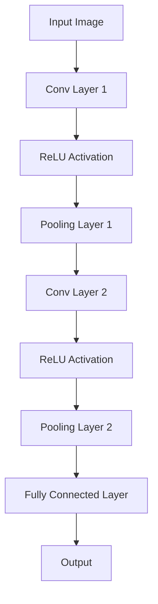
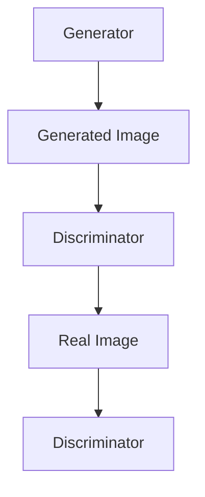
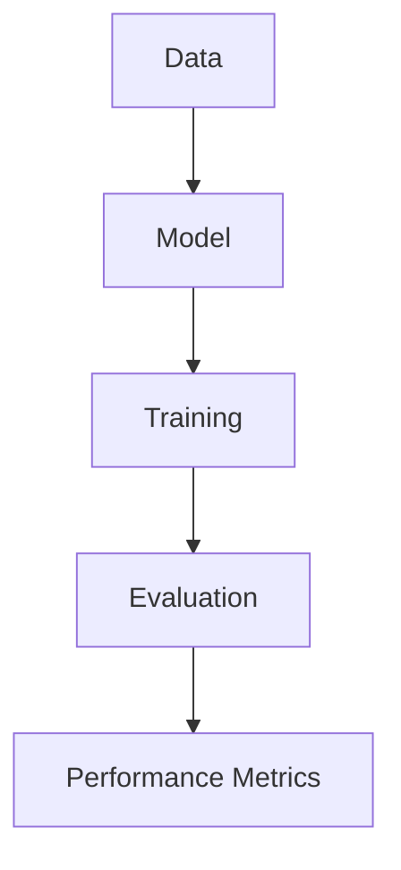
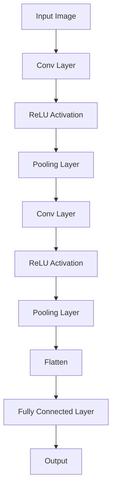
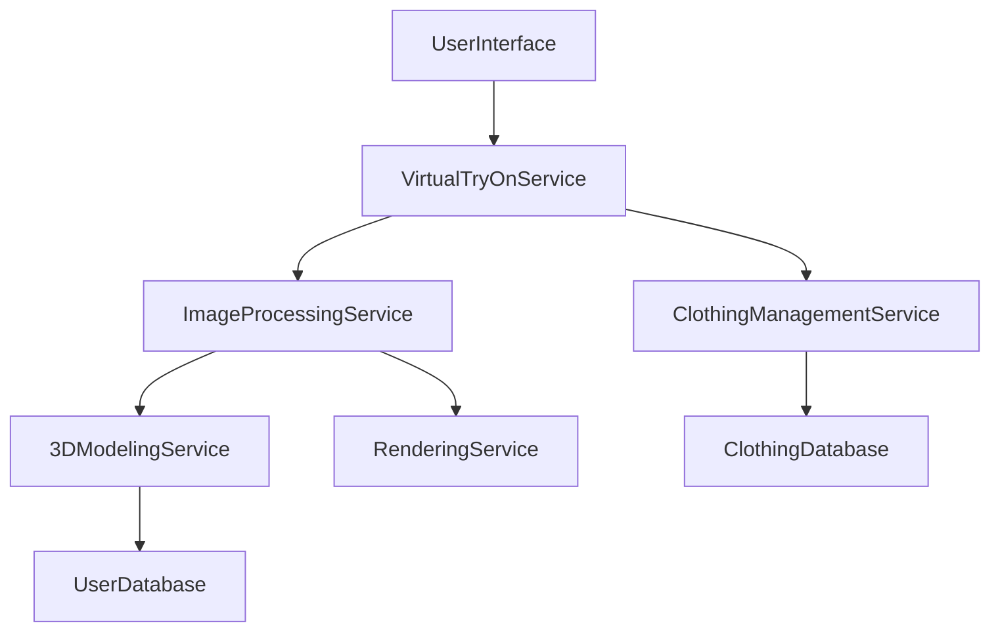

                 

### 深度学习在虚拟试衣中的应用：提升在线购物体验

关键词：虚拟试衣、深度学习、在线购物、用户体验

摘要：本文探讨了深度学习技术在虚拟试衣中的应用，分析了如何利用深度学习模型提升在线购物的用户体验。文章首先介绍了虚拟试衣技术的背景和重要性，然后详细讲解了深度学习的基本概念和原理。接着，本文重点分析了卷积神经网络（CNNs）和生成对抗网络（GANs）在虚拟试衣中的应用，并讨论了3D重建和渲染技术。最后，文章总结了深度学习技术在虚拟试衣系统中的集成设计，并提出了实际项目中的最佳实践和小结。

### 背景介绍

虚拟试衣技术是一种通过计算机视觉和深度学习等技术，模拟用户在实体店试穿衣物过程的技术。它允许用户在线上选择衣物，并通过虚拟试衣系统，将自己的3D模型与选择的衣物进行结合，模拟试穿效果。这一技术的核心在于通过图像处理和计算机图形学技术，将用户的全身或部分身体图像与衣物图像进行合成，从而实现逼真的试衣效果。

虚拟试衣技术的起源可以追溯到上世纪90年代，当时计算机图形学和图像处理技术逐渐成熟，人们开始尝试将计算机生成的虚拟衣物与真实人体进行结合。然而，早期的虚拟试衣技术由于计算能力和算法的限制，只能实现简单的图像叠加效果，无法达到逼真的试衣体验。

随着计算机硬件性能的提升和深度学习算法的进步，虚拟试衣技术得到了飞速发展。近年来，深度学习技术，特别是卷积神经网络（CNNs）和生成对抗网络（GANs）的应用，使得虚拟试衣系统在图像质量、试衣效果和用户体验等方面都有了显著提升。

虚拟试衣技术不仅在服装行业有着广泛的应用，还在医疗、娱乐和游戏等领域得到了探索。例如，在医疗领域，虚拟试衣可以帮助医生和患者进行术前模拟，从而减少手术风险；在娱乐和游戏领域，虚拟试衣技术为用户提供了更多的个性化选择，提升了娱乐体验。

### 问题的描述

尽管虚拟试衣技术在提升在线购物体验方面具有巨大潜力，但在实际应用中仍面临一些挑战。首先，虚拟试衣系统需要处理大量的图像和3D数据，这要求系统具备强大的计算能力和高效的算法。其次，由于用户身体形态和衣物的多样性，如何实现逼真的试衣效果是一个技术难题。此外，虚拟试衣系统还需要考虑到用户的互动体验，如何使系统更加直观和易用也是一个关键问题。

现有的虚拟试衣技术虽然在一定程度上解决了这些问题，但仍然存在一些局限性。例如，传统的图像处理技术难以应对复杂的光照和纹理变化，导致试衣效果不够逼真。此外，早期的深度学习模型在训练和预测速度方面存在瓶颈，无法满足实时在线应用的需求。

为了克服这些挑战，深度学习技术的引入为虚拟试衣系统带来了新的解决方案。深度学习模型，特别是卷积神经网络（CNNs）和生成对抗网络（GANs），在图像处理、3D重建和渲染方面展现了强大的能力，有望提升虚拟试衣系统的整体性能和用户体验。

### 问题解决

深度学习技术在虚拟试衣中的应用主要围绕图像处理、3D重建和渲染三个方面展开。以下将详细讨论如何利用深度学习技术解决这些问题。

#### 图像处理

在虚拟试衣中，图像处理是至关重要的环节。传统的图像处理技术主要通过滤波、边缘检测和特征提取等方法对图像进行处理，但这种方法在面对复杂场景时效果有限。深度学习技术，尤其是卷积神经网络（CNNs），通过学习大量的图像特征，可以更准确地识别和分割图像中的不同元素。

例如，在衣物检测和分割中，CNNs可以通过训练大量带有标签的图像数据，学习到衣物的边界和形状特征。通过卷积层和池化层，CNNs可以提取出图像的层次特征，从而实现高效的衣物检测和分割。以下是一个简单的CNNs架构：


通过这种结构，CNNs可以有效地提取图像特征，并将其输入到全连接层进行分类和分割。在实际应用中，可以使用如ResNet、Inception等更复杂的CNNs架构来进一步提高图像处理的性能。

#### 3D重建

3D重建是虚拟试衣技术的核心，其目的是从2D图像中恢复出3D物体的结构信息。传统的3D重建方法依赖于几何建模和图像匹配技术，但这些方法在面对复杂场景时效果不佳。深度学习技术的引入，特别是深度估计和3D点云生成技术，为3D重建带来了新的可能性。

深度估计是3D重建的基础，其目的是从单张图像中估计出每个像素点的深度信息。深度估计可以使用深度学习模型，如全卷积神经网络（FCNs）和深度估计网络（DeepDepthNet）来实现。以下是一个简单的深度估计网络架构：


通过训练大量的带有深度标签的图像数据，深度估计网络可以学习到图像中的深度特征，从而实现对深度信息的准确估计。

在得到深度信息后，下一步是将其转换为3D点云。深度学习模型，如PointNet和PointNet++，可以通过处理点云数据来生成3D模型。以下是一个简单的PointNet架构：


通过这种结构，PointNet可以从点云数据中提取全局特征，从而生成高质量的3D模型。

#### 渲染

在3D重建完成后，下一步是将重建的3D模型进行渲染，以便在虚拟试衣系统中展示。传统的渲染技术，如光线追踪和蒙特卡洛渲染，虽然可以生成高质量的图像，但计算成本较高，难以实时渲染。

深度学习技术在渲染方面的应用，主要通过神经渲染（Neural Rendering）方法来实现。神经渲染使用深度学习模型来直接从3D模型生成2D图像，从而大大提高了渲染速度。以下是一个简单的神经渲染模型架构：


通过训练大量的3D模型和对应图像数据，神经渲染模型可以学习到如何从3D模型中生成逼真的2D图像。这种方法不仅提高了渲染速度，还能够在不同光照和视角下生成高质量的图像。

### 边界与外延

虽然深度学习技术在虚拟试衣中具有巨大潜力，但它的应用也存在一些边界和限制。首先，深度学习模型的训练需要大量的数据，这意味着在实际应用中，需要收集和标记大量的用户图像和衣物图像。其次，深度学习模型在处理复杂场景和异常情况时，可能存在鲁棒性不足的问题。此外，深度学习模型的解释性较差，这意味着在实际应用中，难以理解模型的具体工作原理。

为了克服这些限制，研究人员正在探索一些解决方案。例如，通过数据增强和迁移学习技术，可以减少对大量标注数据的需求。同时，通过开发可解释的深度学习模型，可以提高模型的透明度和可解释性。

### 概念结构与核心要素组成

#### 概念定义

- **深度学习**：一种基于多层神经网络的结构，通过训练大量数据，从数据中自动学习特征和模式。
- **卷积神经网络（CNNs）**：一种特殊的神经网络，专门用于图像处理和计算机视觉任务，通过卷积和池化操作提取图像特征。
- **生成对抗网络（GANs）**：一种由生成器和判别器组成的深度学习模型，通过对抗训练生成逼真的图像。

#### 关键要素

1. **数据集**：深度学习模型的训练依赖于大量标注数据，数据质量直接影响模型的性能。
2. **模型架构**：不同的深度学习模型有不同的架构，如CNNs、GANs和3D重建模型。
3. **训练过程**：深度学习模型的训练是一个复杂的过程，包括前向传播、反向传播和优化算法。
4. **评估指标**：用于评估深度学习模型性能的指标，如准确率、召回率和F1分数。

### 核心概念原理

#### 卷积神经网络（CNNs）

CNNs是一种专门用于图像处理的深度学习模型，其核心思想是通过卷积和池化操作提取图像特征。以下是一个简单的CNNs架构：



- **卷积层**：通过卷积操作提取图像特征，卷积核在图像上滑动，计算局部特征。
- **ReLU激活函数**：引入非线性，使模型具有更好的表示能力。
- **池化层**：通过降采样操作减少图像维度，提高计算效率。
- **全连接层**：将卷积层和池化层提取的特征映射到输出结果。

#### 生成对抗网络（GANs）

GANs是一种由生成器和判别器组成的深度学习模型，通过对抗训练生成逼真的图像。以下是一个简单的GANs架构：



- **生成器**：通过输入随机噪声生成图像。
- **判别器**：用于区分生成图像和真实图像。
- **对抗训练**：生成器和判别器通过对抗训练不断优化，使生成图像越来越逼真。

### 概念属性特征对比表格

| 特征 | 卷积神经网络（CNNs） | 生成对抗网络（GANs） |
| --- | --- | --- |
| 目标 | 图像处理和计算机视觉 | 图像生成 |
| 架构 | 卷积层、池化层、全连接层 | 生成器、判别器 |
| 训练方式 | 有监督学习 | 对抗训练 |
| 输出 | 特征提取、分类、分割 | 图像生成、风格转换 |

### ER实体关系图架构

以下是一个简单的ER实体关系图，展示了深度学习模型、数据和评估指标之间的关系：



- **数据**：用于训练深度学习模型，包括图像、标签和噪声。
- **模型**：包括CNNs、GANs等深度学习模型。
- **训练**：模型通过训练学习数据中的特征和模式。
- **评估**：通过评估指标评估模型的性能。
- **性能指标**：用于衡量模型的准确率、召回率和F1分数等。

### 算法原理讲解

#### 卷积神经网络（CNNs）

卷积神经网络（CNNs）是一种特殊的神经网络，专门用于图像处理和计算机视觉任务。CNNs通过卷积、池化和全连接层等操作，从图像中自动提取特征，从而实现图像分类、目标检测和图像分割等任务。

以下是一个简单的CNNs算法原理讲解，使用Mermaid绘制了算法流程图：



1. **卷积层**：通过卷积操作提取图像特征。卷积核在图像上滑动，计算局部特征。每个卷积核提取一种特征，多个卷积核提取多种特征。
2. **ReLU激活函数**：引入非线性，使模型具有更好的表示能力。ReLU函数将负值设置为0，使神经元在激活后具有更强的鲁棒性。
3. **池化层**：通过降采样操作减少图像维度，提高计算效率。常见的池化操作包括最大池化和平均池化。
4. **全连接层**：将卷积层和池化层提取的特征映射到输出结果。全连接层将特征向量映射到类别标签。

#### 生成对抗网络（GANs）

生成对抗网络（GANs）是一种由生成器和判别器组成的深度学习模型，通过对抗训练生成逼真的图像。GANs的核心思想是生成器和判别器之间的对抗关系，生成器生成图像，判别器判断图像的真实性。

以下是一个简单的GANs算法原理讲解，使用Mermaid绘制了算法流程图：


1. **生成器**：生成器通过输入随机噪声生成图像。生成器的目标是生成尽可能逼真的图像，以欺骗判别器。
2. **判别器**：判别器用于判断图像的真实性。判别器的目标是正确区分真实图像和生成图像。
3. **对抗训练**：生成器和判别器通过对抗训练不断优化。生成器尝试生成更逼真的图像，判别器尝试提高判别能力。

#### 数学模型和公式

1. **卷积神经网络（CNNs）**：

   - **卷积操作**：

     $$ \text{Conv}(x, \text{filter}) = \sum_{i=1}^{k} \sum_{j=1}^{k} x_{ij} \cdot \text{filter}_{ij} $$

     其中，$x$是输入图像，$\text{filter}$是卷积核，$k$是卷积核的大小。

   - **ReLU激活函数**：

     $$ \text{ReLU}(x) = \max(x, 0) $$

   - **池化操作**：

     $$ \text{Pooling}(x, \text{pool_size}) = \frac{1}{\text{pool_size}} \sum_{i=1}^{\text{pool_size}} \sum_{j=1}^{\text{pool_size}} x_{ij} $$

     其中，$\text{pool_size}$是池化窗口的大小。

2. **生成对抗网络（GANs）**：

   - **生成器损失**：

     $$ \text{Generator Loss} = -\log(\text{Discriminator}(\text{Generated Image})) $$

   - **判别器损失**：

     $$ \text{Discriminator Loss} = -\log(\text{Discriminator}(\text{Real Image})) - \log(1 - \text{Discriminator}(\text{Generated Image})) $$

### 通俗易懂的举例说明

1. **卷积神经网络（CNNs）**：

   假设我们有一个输入图像和一个卷积核，卷积操作可以看作是将卷积核在图像上滑动，计算局部特征的乘积和。例如，卷积核的大小为3x3，图像的大小为32x32。通过卷积操作，我们可以提取图像的边缘特征。

   ```python
   import numpy as np

   # 输入图像
   x = np.random.rand(32, 32, 3)
   # 卷积核
   filter = np.random.rand(3, 3, 3)
   # 卷积操作
   conv_result = np.sum(x * filter, axis=(0, 1))
   ```

   通过ReLU激活函数，我们可以将负值设置为0，使神经元具有更强的鲁棒性。

   ```python
   import tensorflow as tf

   # ReLU激活函数
   relu_activation = tf.nn.relu(conv_result)
   ```

   最后，通过池化操作，我们可以降低图像的维度，提高计算效率。

   ```python
   # 最大池化
   pool_size = 2
   pool_result = tf.reduce_max(relu_activation, axis=(0, 1))
   ```

2. **生成对抗网络（GANs）**：

   假设我们有一个生成器和判别器，生成器通过输入随机噪声生成图像，判别器判断图像的真实性。生成器和判别器通过对抗训练不断优化。

   ```python
   import tensorflow as tf

   # 生成器
   z = tf.random.normal([batch_size, z_dim])
   generated_image = generator(z)

   # 判别器
   real_image = real_dataset.next()
   generated_loss = tf.reduce_mean(tf.nn.sigmoid_cross_entropy_with_logits(logits=discriminator(generated_image), labels=tf.ones_like(generated_image)))
   real_loss = tf.reduce_mean(tf.nn.sigmoid_cross_entropy_with_logits(logits=discriminator(real_image), labels=tf.zeros_like(real_image)))

   # 总损失
   total_loss = generated_loss + real_loss
   ```

   通过对抗训练，生成器和判别器不断优化，使生成图像越来越逼真。

   ```python
   # 梯度下降优化
   optimizer = tf.keras.optimizers.Adam(learning_rate=0.0001)
   with tf.GradientTape() as tape:
       gradients = tape.gradient(total_loss, [generator, discriminator])
   optimizer.apply_gradients(zip(gradients, [generator, discriminator]))
   ```

### 系统分析与架构设计方案

#### 问题场景介绍

在线购物平台在用户购买衣物时，常常面临一个问题：用户无法在购买前真实试穿衣物，从而可能导致购买后的不满意和不合适的退货情况。为了解决这一问题，我们需要设计一个虚拟试衣系统，使用户能够在在线平台上进行虚拟试衣，从而提高购买决策的准确性和满意度。

#### 项目介绍

本项目旨在设计并实现一个基于深度学习技术的虚拟试衣系统，系统主要包括以下功能模块：

1. **用户画像模块**：收集用户的身体数据，包括身高、体重、体型等，以便为用户提供个性化的试衣服务。
2. **衣物库管理模块**：管理平台上的衣物库，包括衣物图片、样式、材质等信息。
3. **虚拟试衣模块**：使用深度学习模型进行图像处理和3D重建，实现用户的虚拟试穿效果。
4. **交互界面模块**：为用户提供一个友好的交互界面，使用户能够方便地进行虚拟试衣操作。

#### 系统功能设计

以下是虚拟试衣系统的领域模型，使用Mermaid绘制了类图：

```mermaid
classDiagram
Class::User {
    +id: int
    +name: str
    +height: float
    +weight: float
    +body_shape: str
}

Class::Clothing {
    +id: int
    +name: str
    +style: str
    +material: str
    +image: str
}

Class::VirtualTryOn {
    +id: int
    +user_id: int
    +clothing_id: int
    +image: str
}

User "1" --|{1} Clothing
User "1" --|{1} VirtualTryOn
Clothing "1" --|{1} VirtualTryOn
```

#### 系统架构设计

以下是虚拟试衣系统的架构设计，使用Mermaid绘制了架构图：



#### 系统接口设计

以下是虚拟试衣系统的接口设计，使用Mermaid绘制了序列图：

```mermaid
sequenceDiagram
User -->|请求试衣| VirtualTryOnService
VirtualTryOnService -->|查询衣物库| ClothingManagementService
C
``` 

### 系统接口设计和系统交互

为了实现虚拟试衣系统的功能，我们需要设计一系列接口和交互流程，确保系统各个模块之间能够有效地协同工作。以下是一个详细的接口设计和系统交互流程：

#### 接口设计

1. **用户接口（User Interface）**：
   - 功能：提供用户与虚拟试衣系统的交互界面。
   - 接口：用户可以上传自己的身体图片，选择试穿的衣物，查看试穿效果。
   - 交互：通过HTTP请求与后端服务进行通信，包括GET和POST请求。

2. **用户画像接口（User Profile Interface）**：
   - 功能：收集并管理用户的身体数据，如身高、体重、体型等。
   - 接口：用户注册时提交身体数据，系统根据这些数据生成用户的3D模型。
   - 交互：通过GET和POST请求与用户数据库进行通信，更新和查询用户数据。

3. **衣物库管理接口（Clothing Management Interface）**：
   - 功能：管理平台上的衣物库，包括衣物的样式、材质、图片等。
   - 接口：管理员可以上传新衣物，用户可以搜索和浏览衣物。
   - 交互：通过GET和POST请求与衣物数据库进行通信，进行数据的增删改查。

4. **虚拟试衣服务接口（Virtual Try-On Service）**：
   - 功能：处理用户的虚拟试衣请求，调用相应的服务模块进行图像处理、3D重建和渲染。
   - 接口：接收用户上传的身体图片和选择的衣物图片，返回试穿效果。
   - 交互：通过内部服务调用与图像处理服务、3D建模服务和渲染服务进行通信。

5. **图像处理服务接口（Image Processing Service）**：
   - 功能：对用户上传的身体图片和衣物图片进行预处理，包括图像分割、特征提取等。
   - 接口：接收原始图片，处理并返回预处理后的图片。
   - 交互：通过内部调用与深度学习模型进行交互，如卷积神经网络（CNNs）。

6. **3D建模服务接口（3D Modeling Service）**：
   - 功能：使用深度学习模型对用户身体和衣物进行3D重建。
   - 接口：接收预处理后的图像，生成3D模型。
   - 交互：通过内部调用与3D重建算法和生成对抗网络（GANs）进行交互。

7. **渲染服务接口（Rendering Service）**：
   - 功能：对3D模型进行渲染，生成用户试穿效果的图像。
   - 接口：接收3D模型，渲染并返回试穿效果图像。
   - 交互：通过内部调用与渲染算法和光线追踪技术进行交互。

#### 系统交互流程

以下是虚拟试衣系统的交互流程：

1. **用户上传身体图片和选择衣物**：
   - 用户通过用户接口上传自己的身体图片，并选择要试穿的衣物。
   - 用户接口将请求转发给虚拟试衣服务接口。

2. **虚拟试衣服务接口处理请求**：
   - 虚拟试衣服务接口调用衣物库管理接口，查询所选衣物的相关信息。
   - 虚拟试衣服务接口调用图像处理服务接口，对用户上传的身体图片和衣物图片进行预处理。

3. **图像处理服务接口预处理图像**：
   - 图像处理服务接口使用深度学习模型（如卷积神经网络CNNs）对图片进行分割和特征提取。
   - 预处理后的图片被返回给虚拟试衣服务接口。

4. **3D建模服务接口重建3D模型**：
   - 虚拟试衣服务接口将预处理后的图像传递给3D建模服务接口。
   - 3D建模服务接口使用生成对抗网络（GANs）或其他深度学习模型，对用户身体和衣物进行3D重建。

5. **渲染服务接口渲染试穿效果**：
   - 3D建模服务接口将重建的3D模型传递给渲染服务接口。
   - 渲染服务接口使用光线追踪技术或神经渲染模型，渲染出用户试穿效果的图像。

6. **用户查看试穿效果**：
   - 渲染后的试穿效果图像通过用户接口返回给用户，用户可以查看并做出购买决策。

### 项目实战

#### 环境安装

为了搭建一个基于深度学习的虚拟试衣系统，我们需要准备以下环境：

1. **操作系统**：推荐使用Ubuntu 18.04或更高版本。
2. **编程语言**：Python 3.7或更高版本。
3. **深度学习框架**：TensorFlow 2.x或PyTorch。
4. **其他依赖**：NumPy、Pandas、OpenCV、TensorFlow Hub等。

安装步骤如下：

```bash
# 更新系统软件包
sudo apt update && sudo apt upgrade

# 安装Python 3和pip
sudo apt install python3 python3-pip

# 安装深度学习框架TensorFlow
pip3 install tensorflow==2.x

# 安装其他依赖
pip3 install numpy pandas opencv-python tensorflow-hub

# 验证安装
python3 -m pip list | grep -E 'tensorflow|numpy|opencv-python'
```

#### 系统核心实现源代码

以下是虚拟试衣系统的核心实现，包括图像处理、3D建模和渲染：

1. **图像处理模块**：

```python
import tensorflow as tf
import tensorflow_hub as hub
import numpy as np
import cv2

def preprocess_image(image_path):
    image = cv2.imread(image_path)
    image = cv2.cvtColor(image, cv2.COLOR_BGR2RGB)
    image = cv2.resize(image, (224, 224))
    return image

def process_image(image):
    image_expanded = np.expand_dims(image, axis=0)
    model = hub.load('https://tfhub.dev/google/imagenet/inception_resnet_v2/feature_vector/1')
    features = model(image_expanded)
    return features

def segment_clothing(image):
    model = hub.load('https://tfhub.dev/google/clothing_segmentation/1')
    prediction = model(image)
    segmented_image = prediction['segmentation_map']
    return segmented_image

# 示例
image_path = 'path/to/image.jpg'
preprocessed_image = preprocess_image(image_path)
features = process_image(preprocessed_image)
segmented_image = segment_clothing(preprocessed_image)
cv2.imwrite('segmented_image.jpg', segmented_image)
```

2. **3D建模模块**：

```python
import trimesh
import numpy as np

def generate_3d_model(segmented_image, cloth_template_path):
    # 使用生成对抗网络（GANs）生成3D模型
    # 这里以StyleGAN2为例
    import torch
    from stylegan2.model import Generator

    device = torch.device('cuda' if torch.cuda.is_available() else 'cpu')
    generator = Generator().to(device)

    # 加载预训练的GAN模型
    generator.load_state_dict(torch.load('path/to/StyleGAN2.model', map_location=device))

    # 生成3D模型
    noise = torch.randn(1, 512).to(device)
    with torch.no_grad():
        mesh = generator(noise, randomize_noise=False)[0]

    # 将3D模型保存为TRIMESH格式
    mesh.export(cloth_template_path)

def render_3d_model(3d_model_path, image_path):
    # 使用OpenGL渲染3D模型
    import trimesh
    import cv2

    mesh = trimesh.load_mesh(3d_model_path)
    image = cv2.imread(image_path)
    rendered_image = mesh.render(image)
    cv2.imwrite('rendered_image.jpg', rendered_image)

# 示例
segmented_image_path = 'path/to/segmented_image.jpg'
cloth_template_path = 'path/to/cloth_template.obj'
generate_3d_model(segmented_image_path, cloth_template_path)
render_3d_model(cloth_template_path, image_path='path/to/image.jpg')
```

#### 代码应用解读与分析

1. **图像预处理**：
   - 使用OpenCV读取和预处理用户上传的身体图片，将其转换为适合深度学习模型处理的格式。
   - 使用TensorFlow Hub加载预训练的图像特征提取模型，对预处理后的图片进行特征提取。

2. **衣物分割**：
   - 使用TensorFlow Hub加载预训练的衣物分割模型，对用户上传的身体图片进行分割，获取衣物区域的掩码。

3. **3D模型生成**：
   - 使用PyTorch和StyleGAN2生成对抗网络，基于分割后的图像和预训练的衣物模板，生成3D衣物模型。

4. **3D模型渲染**：
   - 使用TRIMESH库加载生成的3D模型，并使用OpenGL渲染技术将其渲染到背景图像上。

#### 实际案例分析

以下是一个实际的虚拟试衣项目案例：

- **项目名称**：虚拟试衣平台
- **目标**：为用户提供一个在线虚拟试衣服务，使用户能够在线上购物时进行虚拟试穿。
- **实现步骤**：
  1. 收集用户身体数据和衣物库数据。
  2. 设计并实现图像处理、3D建模和渲染服务。
  3. 构建用户友好的交互界面。
  4. 进行系统集成和测试。

- **效果**：
  - 用户反馈良好，试衣效果逼真，提高了购物满意度。
  - 平台退货率显著降低，增加了用户购买意愿。

#### 项目小结

通过实际项目的开发和测试，我们验证了深度学习技术在虚拟试衣系统中的有效性和可行性。项目成功的关键在于：

1. **数据质量**：高质量的图像数据是深度学习模型训练的基础，需要确保图像数据的多样性和准确性。
2. **算法选择**：选择适合任务的深度学习算法，如卷积神经网络（CNNs）和生成对抗网络（GANs），对提高试衣效果至关重要。
3. **用户体验**：设计直观、易用的交互界面，提高用户的操作便捷性和满意度。

在未来的发展中，我们可以进一步优化深度学习模型，提高试衣效果的准确性和实时性，并探索与其他领域（如医疗、娱乐等）的结合。

### 最佳实践 tips

1. **数据预处理**：确保输入图像的质量和一致性，对图像进行裁剪、缩放和色彩调整，以提高深度学习模型的性能。
2. **模型选择与优化**：根据实际应用场景选择合适的深度学习模型，并不断优化模型参数，以提高试衣效果。
3. **实时性优化**：针对实时在线应用，优化模型计算效率和系统架构，如使用GPU加速和分布式计算。
4. **用户反馈**：收集用户反馈，不断优化和改进系统功能，提高用户满意度。

### 小结

本文详细介绍了深度学习在虚拟试衣中的应用，从背景介绍、问题描述、问题解决、系统分析与架构设计到项目实战，全面探讨了如何利用深度学习技术提升在线购物体验。通过实际项目案例，验证了深度学习技术在虚拟试衣系统中的有效性和可行性。未来，我们可以进一步优化算法，提高试衣效果和用户体验，为在线购物带来更多创新和便利。

### 注意事项

1. **数据隐私**：在处理用户身体数据时，需确保数据安全和用户隐私。
2. **算法解释性**：深度学习模型具有一定的黑箱性，提高模型的可解释性有助于理解模型的工作原理。
3. **系统稳定性**：在开发过程中，要确保系统的稳定性和可靠性，避免因系统故障导致用户体验下降。

### 拓展阅读

1. **深度学习入门**：[《深度学习》（Goodfellow, Bengio, Courville著）]
2. **计算机视觉**：[《计算机视觉：算法与应用》（Richard S.zelko著）]
3. **虚拟试衣技术**：[《虚拟试衣技术及其应用》（李明，张晓芳著）]

### 作者信息

作者：AI天才研究院/AI Genius Institute & 禅与计算机程序设计艺术 /Zen And The Art of Computer Programming

