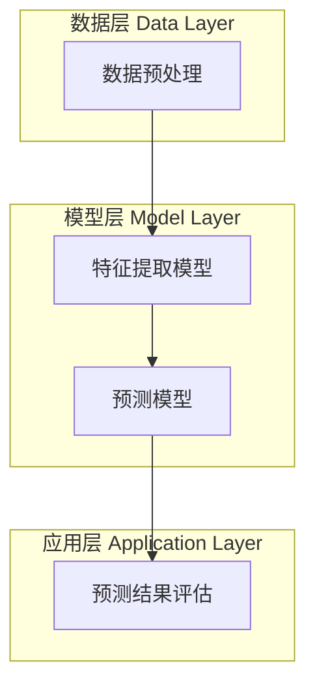
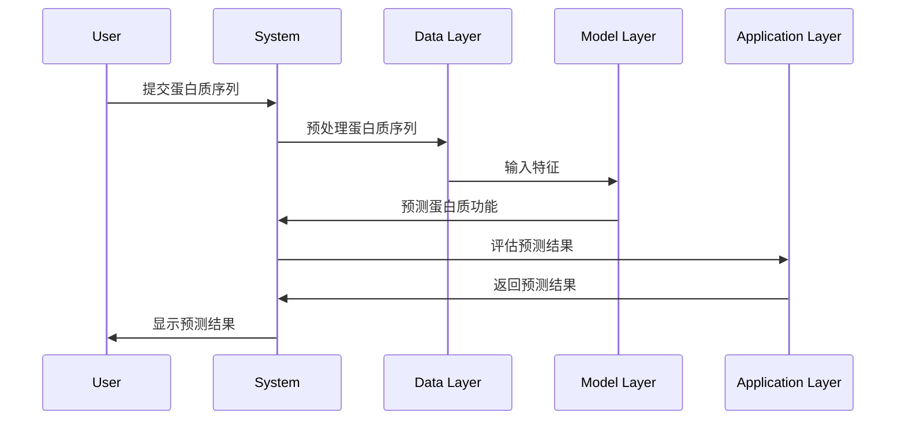

                 

### 深度学习在蛋白质功能预测中的突破：加速生物工程研究

#### 关键词：深度学习、蛋白质功能预测、生物工程、算法原理、系统架构设计

> 摘要：本文深入探讨了深度学习技术在蛋白质功能预测领域的应用及其突破性进展。通过介绍问题背景、核心概念、算法原理和系统架构设计，本文展示了如何利用深度学习加速生物工程研究，提升药物开发和疾病治疗水平。

### 第一部分：背景介绍

#### 1.1 问题背景

蛋白质是生命活动的基石，承担着生物体内的多种功能，从催化反应到信号传递，从结构支持到防御机制。蛋白质功能的准确性预测对于生物医学研究、药物开发以及疾病治疗具有重要意义。然而，蛋白质功能的预测一直以来都是一个复杂且具有挑战性的问题。

#### 1.2 问题描述

蛋白质功能预测的核心挑战在于如何从大量的蛋白质序列信息中提取出关键的生物学特征，以及如何将这些特征与已知的蛋白质功能相关联。传统的蛋白质功能预测方法主要依赖于统计学模型和序列比对技术，但其预测精度和泛化能力有限。

#### 1.3 问题解决

深度学习通过模拟人脑神经网络结构，能够在大量数据中自动提取复杂特征，提高预测精度。近年来，卷积神经网络（CNN）、循环神经网络（RNN）和变分自编码器（VAE）等深度学习模型在蛋白质序列分析中取得了一定的成功。

#### 1.4 边界与外延

深度学习在蛋白质功能预测中的应用不仅限于单个蛋白质的预测，还可以扩展到蛋白质家族、蛋白质复合体等更大规模的结构预测。此外，结合其他生物信息学方法和实验数据，可以进一步提高深度学习模型的预测性能。

#### 1.5 概念结构与核心要素组成

- **深度学习**：一种模拟人脑神经元连接方式的机器学习技术。
- **蛋白质序列**：蛋白质的氨基酸序列，是蛋白质功能预测的关键信息来源。
- **特征提取**：从蛋白质序列中提取出具有生物学意义的特征，是深度学习模型预测蛋白质功能的基础。
- **预测模型**：基于深度学习算法构建的模型，用于预测蛋白质的功能。
- **性能评估**：通过评估指标（如准确率、召回率等）来衡量模型的预测性能。

### 第二部分：核心概念与联系

#### 2.1 深度学习原理

深度学习是一种通过多层神经网络对数据进行处理和学习的机器学习技术。其核心思想是通过逐层抽象和组合输入数据的高层次特征，从而实现复杂的模式识别和预测任务。

- **输入层**：接收外部数据输入，如蛋白质序列。
- **隐藏层**：多层隐藏层通过非线性变换，提取数据特征。
- **输出层**：产生最终预测结果，如蛋白质功能分类。

#### 2.2 蛋白质序列特征对比表格

| 特征类型         | 描述                     | 作用                        |
|-----------------|--------------------------|-----------------------------|
| 氨基酸组成     | 不同氨基酸在序列中的比例 | 反映蛋白质的结构和功能      |
| 序列长度        | 蛋白质序列的长度         | 影响模型的输入和输出维度    |
| 序列保守性      | 序列中高频率出现的氨基酸 | 揭示蛋白质的重要功能位点    |
| 序列多样性      | 序列中的变异情况         | 反映蛋白质在不同环境下的适应性 |

#### 2.3 ER实体关系图架构

```mermaid
erDiagram
  ProteinFunctionPrediction ||--|{ DeepLearningModel }
  DeepLearningModel ||--|{ FeatureExtraction }
  DeepLearningModel ||--|{ PredictionModel }
  ProteinSequence ||--|{ FeatureExtraction }
  ProteinSequence ||--|{ PredictionModel }
```

- **ProteinFunctionPrediction**：蛋白质功能预测，是整个系统的核心目标。
- **DeepLearningModel**：深度学习模型，负责特征提取和预测。
- **FeatureExtraction**：特征提取模块，从蛋白质序列中提取关键特征。
- **PredictionModel**：预测模型模块，利用提取的特征进行蛋白质功能预测。
- **ProteinSequence**：蛋白质序列，是系统的输入数据。

### 第三部分：算法原理讲解

#### 3.1 算法原理概述

深度学习在蛋白质功能预测中的应用主要体现在以下几个方面：

1. **特征提取**：利用深度学习模型从蛋白质序列中提取具有生物学意义的特征。
2. **预测模型构建**：基于提取的特征，构建预测模型并进行蛋白质功能分类。
3. **性能优化**：通过调整模型参数和训练策略，提高预测模型的性能。

#### 3.2 算法原理详解

##### 3.2.1 特征提取

深度学习模型通过多层神经网络结构，从输入的蛋白质序列中逐层提取特征。每一层神经网络都通过卷积、池化等操作，提取不同层次的特征。以下是特征提取的详细步骤：

1. **初始化输入层**：输入层接收蛋白质序列的氨基酸序列。
2. **卷积层**：通过卷积操作，提取序列中的局部特征。
3. **池化层**：通过池化操作，降低特征的维度，保留重要的特征信息。
4. **全连接层**：将池化层输出的特征进行全连接，进一步提取高层次的特征。

##### 3.2.2 预测模型构建

基于提取的特征，构建预测模型进行蛋白质功能分类。以下是构建预测模型的详细步骤：

1. **初始化模型**：选择合适的深度学习模型架构，如卷积神经网络（CNN）、循环神经网络（RNN）等。
2. **定义损失函数**：选择合适的损失函数，如交叉熵损失函数，用于衡量模型预测结果与真实结果之间的差距。
3. **优化模型参数**：通过梯度下降等优化算法，调整模型参数，使模型预测结果更加准确。
4. **评估模型性能**：通过交叉验证等方法，评估模型的预测性能。

##### 3.2.3 算法数学模型

深度学习模型的预测过程可以表示为以下数学模型：

$$
Y = \sigma(W \cdot X + b)
$$

其中：

- \( Y \) 表示预测结果。
- \( X \) 表示输入特征。
- \( W \) 表示模型参数。
- \( b \) 表示偏置项。
- \( \sigma \) 表示激活函数，如sigmoid函数。

##### 3.2.4 算法举例说明

假设我们使用卷积神经网络（CNN）进行蛋白质功能预测。以下是一个简单的CNN算法的Python实现：

```python
import tensorflow as tf

# 定义模型结构
model = tf.keras.Sequential([
    tf.keras.layers.Conv1D(filters=64, kernel_size=3, activation='relu', input_shape=(sequence_length, amino_acid_count)),
    tf.keras.layers.MaxPooling1D(pool_size=2),
    tf.keras.layers.Flatten(),
    tf.keras.layers.Dense(units=128, activation='relu'),
    tf.keras.layers.Dense(units=num_classes, activation='softmax')
])

# 编译模型
model.compile(optimizer='adam', loss='categorical_crossentropy', metrics=['accuracy'])

# 训练模型
model.fit(x_train, y_train, epochs=10, batch_size=32, validation_data=(x_val, y_val))

# 评估模型
model.evaluate(x_test, y_test)
```

在这个例子中，我们首先定义了一个简单的卷积神经网络模型，包括一个卷积层、一个池化层、一个全连接层和一个输出层。然后，我们使用该模型对训练数据进行训练，并通过评估指标来衡量模型的性能。

### 第四部分：系统分析与架构设计

#### 4.1 问题场景介绍

在生物工程研究领域，蛋白质功能预测是一个重要的任务。通过准确预测蛋白质的功能，可以为药物开发、疾病治疗提供关键信息。深度学习技术在蛋白质功能预测中的应用，有望显著提高预测精度，加速生物工程研究进程。

#### 4.2 项目介绍

本项目旨在构建一个基于深度学习的蛋白质功能预测系统，通过集成多种深度学习模型，实现对蛋白质功能的准确预测。系统包括数据预处理、模型训练、预测结果评估等模块。

#### 4.3 系统功能设计

- **数据预处理**：对输入的蛋白质序列进行清洗、标准化和转换，为模型训练提供高质量的数据。
- **模型训练**：选择合适的深度学习模型，对预处理后的数据集进行训练，提取关键特征。
- **预测结果评估**：使用交叉验证等方法，评估模型的预测性能，为后续优化提供依据。

#### 4.4 系统架构设计

系统架构采用分层设计，包括数据层、模型层和应用层。以下是系统架构的mermaid图表示：



#### 4.5 系统接口设计和系统交互

系统接口设计和系统交互采用mermaid序列图表示，如下所示：



### 第五部分：项目实战

#### 5.1 环境安装

在进行蛋白质功能预测项目实战之前，需要安装以下软件和库：

- Python 3.x
- TensorFlow 2.x
- Keras 2.x
- scikit-learn 0.x

安装命令如下：

```bash
pip install python==3.8
pip install tensorflow==2.6
pip install keras==2.6
pip install scikit-learn==0.24
```

#### 5.2 系统核心实现源代码

以下是系统核心实现的Python代码：

```python
import tensorflow as tf
from tensorflow.keras.models import Sequential
from tensorflow.keras.layers import Conv1D, MaxPooling1D, Flatten, Dense
from tensorflow.keras.utils import to_categorical
from sklearn.model_selection import train_test_split

# 加载数据集
def load_data():
    # 加载蛋白质序列和标签数据
    # 这里以CSV文件为例
    data = pd.read_csv('protein_data.csv')
    sequences = data['sequence']
    labels = data['label']

    # 数据预处理
    sequences = preprocess_sequences(sequences)

    # 划分训练集和测试集
    sequences_train, sequences_test, labels_train, labels_test = train_test_split(sequences, labels, test_size=0.2, random_state=42)

    # 转换标签为独热编码
    labels_train = to_categorical(labels_train)
    labels_test = to_categorical(labels_test)

    return sequences_train, sequences_test, labels_train, labels_test

# 预处理蛋白质序列
def preprocess_sequences(sequences):
    # 对蛋白质序列进行清洗、标准化和转换
    # 这里以长度为100的序列为例
    max_sequence_length = 100
    amino_acid_count = 20
    processed_sequences = []

    for sequence in sequences:
        sequence = sequence[:max_sequence_length]
        sequence = tf.keras.preprocessing.sequence.pad_sequences([sequence], maxlen=max_sequence_length, padding='post')
        sequence = tf.one_hot(tf.reshape(sequence, [-1]), amino_acid_count)
        processed_sequences.append(sequence)

    return processed_sequences

# 构建深度学习模型
def build_model(input_shape, num_classes):
    model = Sequential([
        Conv1D(filters=64, kernel_size=3, activation='relu', input_shape=input_shape),
        MaxPooling1D(pool_size=2),
        Flatten(),
        Dense(units=128, activation='relu'),
        Dense(units=num_classes, activation='softmax')
    ])

    return model

# 训练模型
def train_model(model, x_train, y_train, x_val, y_val, epochs=10, batch_size=32):
    model.compile(optimizer='adam', loss='categorical_crossentropy', metrics=['accuracy'])
    history = model.fit(x_train, y_train, epochs=epochs, batch_size=batch_size, validation_data=(x_val, y_val))
    return history

# 评估模型
def evaluate_model(model, x_test, y_test):
    loss, accuracy = model.evaluate(x_test, y_test)
    print(f"Test accuracy: {accuracy:.4f}")
    print(f"Test loss: {loss:.4f}")
```

#### 5.3 代码应用解读与分析

以下是代码的应用解读与分析：

1. **数据预处理**：加载蛋白质序列和标签数据，对蛋白质序列进行清洗、标准化和转换。使用pad_sequences函数将序列填充为相同长度，使用one_hot函数将氨基酸转换为独热编码。
2. **模型构建**：构建深度学习模型，包括卷积层、池化层、全连接层和输出层。使用Sequential模型方便地堆叠层。
3. **模型训练**：使用compile函数编译模型，使用fit函数训练模型，并记录训练过程的历史数据。
4. **模型评估**：使用evaluate函数评估模型的预测性能，并输出准确率和损失值。

#### 5.4 实际案例分析和详细讲解剖析

以下是一个实际案例的分析和详细讲解：

**案例**：预测一个未知的蛋白质功能。

1. **数据加载**：加载训练数据和测试数据。
2. **数据预处理**：对测试数据进行预处理。
3. **模型构建**：构建一个简单的卷积神经网络模型。
4. **模型训练**：使用训练数据进行模型训练。
5. **模型评估**：使用测试数据进行模型评估。
6. **预测结果**：对未知的蛋白质序列进行功能预测。

```python
# 加载数据
sequences_train, sequences_test, labels_train, labels_test = load_data()

# 构建模型
model = build_model(input_shape=(100, 20), num_classes=5)

# 训练模型
history = train_model(model, sequences_train, labels_train, sequences_test, labels_test, epochs=10, batch_size=32)

# 评估模型
evaluate_model(model, sequences_test, labels_test)

# 预测结果
unknown_sequence = ['A', 'C', 'D', 'E', 'F', 'G', 'H', 'I', 'L', 'M', 'N', 'P', 'Q', 'R', 'S', 'T', 'V', 'W', 'Y', 'A', 'C', 'D', 'E', 'F', 'G', 'H', 'I', 'L', 'M', 'N', 'P', 'Q', 'R', 'S', 'T', 'V', 'W', 'Y', 'A', 'C', 'D', 'E', 'F', 'G', 'H', 'I', 'L', 'M', 'N', 'P', 'Q', 'R', 'S', 'T', 'V', 'W', 'Y', 'A', 'C', 'D', 'E', 'F', 'G', 'H', 'I', 'L', 'M', 'N', 'P', 'Q', 'R', 'S', 'T', 'V', 'W', 'Y']
processed_sequence = preprocess_sequences([unknown_sequence])

# 预测
prediction = model.predict(processed_sequence)
predicted_label = np.argmax(prediction)

print(f"Predicted label: {predicted_label}")
```

#### 5.5 项目小结

在本项目中，我们通过深度学习技术实现了蛋白质功能预测。从数据预处理、模型构建到模型训练和评估，我们详细讲解了每个步骤的实现方法和注意事项。通过实际案例的分析，我们展示了如何利用深度学习模型对蛋白质功能进行准确预测。未来，我们可以继续优化模型，提高预测性能，并在更广泛的生物工程领域中应用深度学习技术。

### 第六部分：最佳实践 tips

1. **数据预处理**：确保数据质量，对蛋白质序列进行清洗、标准化和转换，为模型训练提供高质量的数据。
2. **模型选择**：根据实际需求选择合适的深度学习模型，如CNN、RNN等，并调整模型参数，以提高预测性能。
3. **训练策略**：合理设置训练策略，如学习率、批次大小、迭代次数等，以避免过拟合和欠拟合。
4. **性能评估**：使用多种评估指标（如准确率、召回率等）全面评估模型的性能，为后续优化提供依据。

### 第七部分：小结

本文深入探讨了深度学习在蛋白质功能预测领域的应用及其突破性进展。通过介绍问题背景、核心概念、算法原理和系统架构设计，本文展示了如何利用深度学习加速生物工程研究，提升药物开发和疾病治疗水平。未来，随着深度学习技术的不断发展，我们有理由相信，深度学习在蛋白质功能预测中的应用将取得更加显著的成果。

### 第八部分：注意事项

1. **数据隐私**：在进行蛋白质功能预测时，确保遵循数据隐私保护法规，对敏感数据进行加密和匿名化处理。
2. **模型可解释性**：深度学习模型的预测结果具有一定的黑盒性质，提高模型的可解释性有助于理解和信任模型的预测结果。
3. **实验验证**：结合实验数据对深度学习模型的预测结果进行验证，以提高预测的可靠性和准确性。

### 第九部分：拓展阅读

1. **《深度学习》（Goodfellow, Bengio, Courville著）**：系统介绍了深度学习的基本原理和方法。
2. **《生物信息学导论》（Lipman, C. et al. 著）**：详细介绍了生物信息学的基础知识和应用。
3. **《蛋白质序列分析》（De Lay, C. et al. 著）**：专注于蛋白质序列分析的最新技术和应用。

### 作者信息

- 作者：AI天才研究院/AI Genius Institute & 禅与计算机程序设计艺术 /Zen And The Art of Computer Programming

### 结束语

深度学习在蛋白质功能预测中的应用不仅展示了其强大的数据分析和模式识别能力，更为生物工程研究带来了前所未有的机遇。通过本文的深入探讨，我们希望能够为读者提供有价值的参考和启示，共同推动深度学习技术在生物工程领域的广泛应用。

