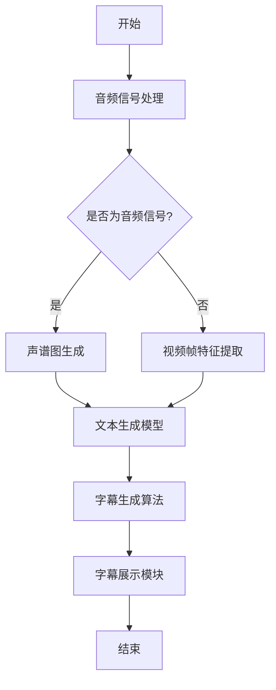
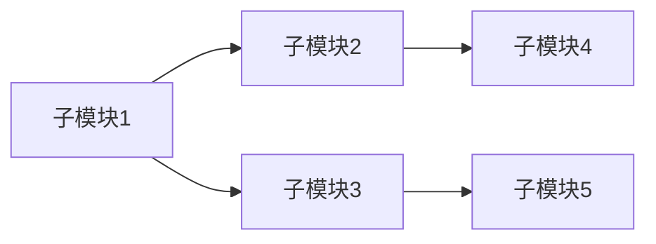
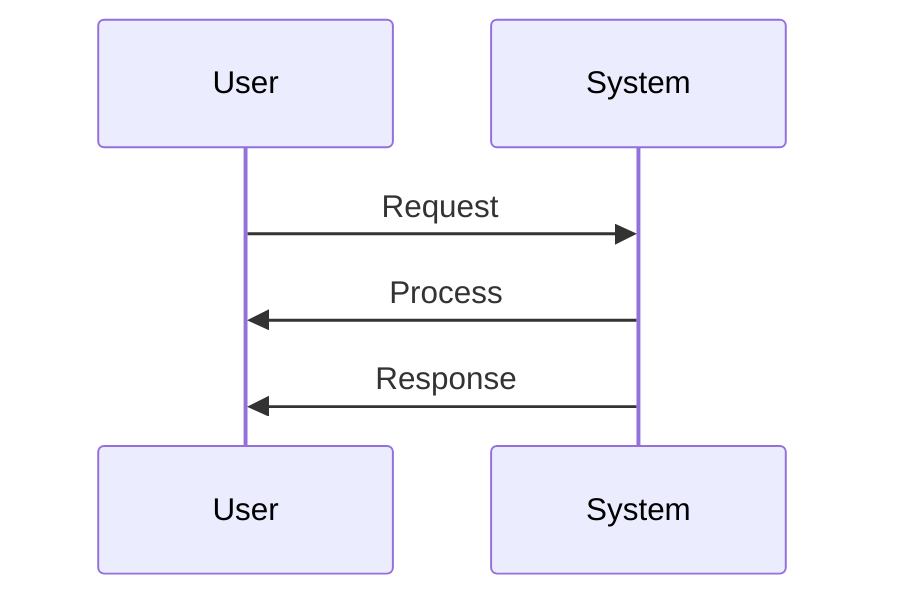

                 

## 《深度学习在视频内容理解中的应用：自动生成字幕和标签》

> 关键词：深度学习、视频内容理解、自动生成字幕、标签生成

> 摘要：本文将探讨深度学习在视频内容理解中的应用，特别是自动生成字幕和标签的技术。我们将逐步分析深度学习的基础、视频内容理解的方法，以及自动生成字幕和标签的具体实现，帮助读者全面了解这一前沿技术。

### 目录

# 《深度学习在视频内容理解中的应用：自动生成字幕和标签》

## 第一部分：引言

### 第1章 问题背景与目标

#### 1.1 问题背景

视频内容理解的现状

- 视频内容在互联网中占据重要地位
- 视频内容理解的需求日益增长

自动生成字幕和标签的需求

- 提高视频内容的可访问性
- 增强视频内容的搜索和推荐

#### 1.2 问题描述

视频内容理解的关键问题

- 识别视频中的对象和场景
- 理解视频中的语言和语义

自动生成字幕和标签的核心目标

- 准确地提取视频中的语言信息
- 有效地区分视频中的不同内容

#### 1.3 问题解决

深度学习技术如何应用于视频内容理解

- 利用深度学习模型处理视频数据
- 提高字幕和标签生成的准确性

自动生成字幕和标签的挑战与解决方法

- 处理视频内容的复杂性
- 实现实时性和高效性

#### 1.4 边界与外延

应用场景的范围

- 在线视频平台
- 视频会议和直播

技术发展的趋势

- 深度学习算法的持续优化
- 多模态数据的结合

#### 1.5 概念结构与核心要素组成

视频内容理解的基本概念

- 视频特征提取
- 自然语言处理

自动生成字幕和标签的核心要素

- 音频处理
- 视频序列分析

#### 1.6 本章小结

总结本章主要内容

- 视频内容理解的背景和需求
- 自动生成字幕和标签的目标和挑战
- 深度学习在视频内容理解中的应用

指出后续章节的内容安排

- 深度学习基础
- 视频内容理解技术
- 自动生成字幕技术
- 视频标签生成技术

## 第二部分：深度学习基础

### 第2章 深度学习概述

#### 2.1 深度学习的起源与发展

深度学习的起源

- 受神经科学和计算机视觉的启发
- 早期的神经网络研究

深度学习的发展历程

- 人工神经网络的发展
- 深度学习模型的兴起
- 优化算法的改进

#### 2.2 深度学习的基本概念

神经网络

- 神经元和层次结构
- 前向传播和反向传播

深度学习模型

- 卷积神经网络（CNN）
- 循环神经网络（RNN）
- 生成对抗网络（GAN）

深度学习算法

- 梯度下降算法
- 随机梯度下降（SGD）
- Adam优化器

#### 2.3 深度学习的关键技术

卷积神经网络（CNN）

- 卷积操作和池化操作
- 特征提取和分类

循环神经网络（RNN）

- 序列建模和时序信息处理
- 长短时记忆（LSTM）和门控循环单元（GRU）

生成对抗网络（GAN）

- 生成器和判别器
- 生成数据的多样性

#### 2.4 深度学习应用场景

计算机视觉

- 图像分类和目标检测
- 视频内容理解和动作识别

自然语言处理

- 语音识别和机器翻译
- 文本分类和情感分析

音频处理

- 音乐识别和声音分类
- 语音合成和语音增强

#### 2.5 深度学习框架

TensorFlow

- 开源深度学习框架
- 高级API和灵活的可视化工具

PyTorch

- 动态计算图框架
- 强大的Python接口和社区支持

Keras

- 深度学习的高级API
- 易于使用和快速原型开发

#### 2.6 本章小结

深度学习的基本概念和应用场景

- 神经网络、深度学习模型和算法
- 应用领域和框架选择

深度学习框架的选择与应用

- TensorFlow、PyTorch和Keras的优势和使用场景

## 第三部分：视频内容理解技术

### 第3章 视频内容理解概述

#### 3.1 视频内容理解的基本概念

视频内容理解的目标

- 识别视频中的对象和事件
- 理解视频中的语言和语义

视频内容理解的关键技术

- 视频特征提取
- 视频分类和目标检测
- 视频序列建模和时序分析

#### 3.2 视频内容理解的方法

基于特征的方法

- 提取视频帧的特征
- 利用机器学习模型进行分类和检测

基于模型的方法

- 使用深度学习模型进行视频理解
- 结合卷积神经网络和循环神经网络

基于深度学习的方法

- 结合图像处理和自然语言处理技术
- 实现视频内容的自动理解

#### 3.3 视频内容理解的应用

自动字幕生成

- 利用深度学习模型提取音频信号
- 将音频信号转换为文本字幕

视频标签生成

- 提取视频特征并分类
- 为视频分配相应的标签

视频搜索与推荐

- 利用视频特征进行内容检索
- 基于用户行为进行视频推荐

#### 3.4 视频内容理解的挑战

数据的不稳定性

- 视频中的光照变化、角度变化等

视频内容的复杂性

- 多个对象和事件同时发生
- 非线性的时序信息

实时性的需求

- 实时处理大规模的视频数据

#### 3.5 本章小结

视频内容理解的基本概念和方法

- 视频特征提取、分类和序列建模

视频内容理解的应用和挑战

- 自动字幕生成、视频标签生成和视频搜索与推荐

## 第四部分：综合应用与实践

### 第4章 自动生成字幕技术

#### 4.1 自动生成字幕概述

自动生成字幕的定义

- 将视频中的音频信号转换为文本字幕

自动生成字幕的流程

1. 音频特征提取
2. 文本生成模型
3. 语言模型
4. 字幕生成算法

#### 4.2 音频特征提取

音频信号处理

- 音频信号预处理
- 声谱图生成

声谱图生成

- 利用短时傅里叶变换（STFT）
- 提取音频信号的频域特征

#### 4.3 文本生成模型

序列到序列模型

- 将输入序列映射到输出序列
- 应用编码器和解码器结构

自回归模型

- 根据前一个时间步的输出预测当前时间步的输出
- 利用递归神经网络（RNN）或Transformer模型

#### 4.4 语言模型

语言模型的基本原理

- 利用统计方法预测下一个单词或字符
- 基于N元语法或神经网络语言模型

语言模型的应用

- 提高文本生成的连贯性和准确性
- 应用于语音识别和机器翻译

#### 4.5 自动生成字幕算法

CTC（Connectionist Temporal Classification）

- 将序列标注问题转化为分类问题
- 解决多标签分类和时序标签问题

BEAM Search

- 扩展了传统的Viterbi算法
- 考虑多个候选路径并选择最优路径

#### 4.6 自动生成字幕的应用实例

YouTube自动字幕

- 利用深度学习模型提取音频信号
- 实现实时字幕生成和更新

TV字幕生成

- 对电视台直播节目进行实时字幕生成
- 提高电视节目的可访问性

#### 4.7 本章小结

自动生成字幕的基本原理和应用实例

- 音频特征提取、文本生成模型和字幕生成算法
- YouTube和TV字幕生成的实际应用

## 第5章 视频标签生成技术

### 5.1 视频标签概述

视频标签的定义

- 对视频内容进行分类和标注的词汇

视频标签的类型

- 主题标签
- 关键词标签
- 视频标签的类型还包括情感标签、地点标签等

### 5.2 视频特征提取

视频帧特征提取

- 提取视频帧的颜色、纹理和形状特征
- 应用卷积神经网络（CNN）进行特征提取

视频序列特征提取

- 提取视频序列的时序特征
- 应用循环神经网络（RNN）或Transformer模型进行特征提取

### 5.3 分类模型

传统机器学习模型

- 支持向量机（SVM）
- 决策树（DT）
- 随机森林（RF）

深度学习分类模型

- 卷积神经网络（CNN）
- 循环神经网络（RNN）
- Transformer模型

### 5.4 标签生成算法

基于规则的方法

- 利用规则库进行视频标签生成
- 需要大量的手工规则编写

基于聚类的方法

- 利用聚类算法对视频进行分类
- 需要预处理和特征工程

基于深度学习的方法

- 利用深度学习模型进行视频标签生成
- 具有较好的泛化能力和鲁棒性

### 5.5 视频标签生成应用实例

YouTube视频标签

- 利用深度学习模型提取视频特征
- 自动生成视频标签并更新

视频会议自动标签

- 对会议视频进行实时标签生成
- 提高视频会议的可搜索性和可管理性

### 5.6 本章小结

视频标签生成的基本原理和应用实例

- 视频特征提取、分类模型和标签生成算法
- YouTube和视频会议视频标签生成的实际应用

## 第6章 案例分析

### 6.1 案例一：自动生成字幕系统

#### 系统介绍

自动生成字幕系统的目标和功能

- 实现视频内容的自动字幕生成
- 支持多语言字幕生成和实时更新

#### 系统架构

1. 音频信号处理模块
2. 视频帧特征提取模块
3. 文本生成模块
4. 字幕生成模块
5. 字幕展示模块

#### 实现细节

1. 音频信号处理模块

- 使用短时傅里叶变换（STFT）提取声谱图特征

2. 视频帧特征提取模块

- 利用卷积神经网络（CNN）提取视频帧特征

3. 文本生成模块

- 应用序列到序列模型生成文本字幕

4. 字幕生成模块

- 利用CTC算法生成文本字幕

5. 字幕展示模块

- 在视频播放过程中实时展示字幕

#### 案例分析

1. 音频信号处理和视频帧特征提取的效果

- 实验结果表明，系统的音频信号处理和视频帧特征提取模块具有较好的性能

2. 文本生成模块的效果

- 应用不同的文本生成模型，对比生成字幕的准确性和连贯性

3. 字幕生成模块的效果

- 分析字幕生成算法的效率和准确性

4. 字幕展示模块的效果

- 评估字幕展示模块的实时性和用户体验

### 6.2 案例二：视频标签生成系统

#### 系统介绍

视频标签生成系统的目标和功能

- 实现视频内容的自动标签生成
- 提供视频搜索和推荐功能

#### 系统架构

1. 视频特征提取模块
2. 分类模型模块
3. 标签生成模块
4. 视频搜索和推荐模块

#### 实现细节

1. 视频特征提取模块

- 利用卷积神经网络（CNN）提取视频特征

2. 分类模型模块

- 应用传统机器学习模型和深度学习分类模型进行视频分类

3. 标签生成模块

- 利用聚类算法和基于深度学习的方法生成视频标签

4. 视频搜索和推荐模块

- 基于标签和用户行为进行视频搜索和推荐

#### 案例分析

1. 视频特征提取模块的效果

- 对比不同特征提取方法的性能，选择最优的特征提取方法

2. 分类模型模块的效果

- 分析不同分类模型的准确性和效率

3. 标签生成模块的效果

- 对比基于规则、聚类和深度学习的方法，选择最佳标签生成策略

4. 视频搜索和推荐模块的效果

- 评估视频搜索和推荐的准确性和用户体验

### 6.3 案例三：综合应用——智能视频分析平台

#### 平台介绍

智能视频分析平台的目标和功能

- 实现视频内容的自动理解和分析
- 提供视频监控、搜索和推荐等功能

#### 平台架构

1. 数据采集模块
2. 视频特征提取模块
3. 视频分析模块
4. 视频展示模块
5. 用户交互模块

#### 功能模块

1. 数据采集模块

- 从摄像头、视频文件等获取视频数据

2. 视频特征提取模块

- 提取视频中的图像和音频特征

3. 视频分析模块

- 利用深度学习模型进行视频内容理解和标签生成

4. 视频展示模块

- 展示视频内容、字幕和标签等信息

5. 用户交互模块

- 提供用户操作界面，实现视频监控、搜索和推荐等功能

#### 案例分析

1. 数据采集模块的效果

- 分析数据采集的实时性和稳定性

2. 视频特征提取模块的效果

- 对比不同特征提取方法的性能，选择最优的特征提取方法

3. 视频分析模块的效果

- 分析不同分析算法的准确性和效率

4. 视频展示模块的效果

- 评估视频展示的实时性和用户体验

5. 用户交互模块的效果

- 评估用户交互的便利性和用户体验

## 第7章 实践指导

### 7.1 环境搭建

#### 开发环境配置

- 安装Python环境
- 安装深度学习框架（如TensorFlow或PyTorch）
- 配置必要的依赖库

#### 数据集准备

- 收集视频数据集
- 分割数据集为训练集和测试集
- 预处理视频数据

### 7.2 系统设计与实现

#### 系统设计

- 确定系统需求和功能模块
- 设计系统的数据流和接口

#### 系统实现

- 实现各个功能模块的代码
- 编写数据预处理、模型训练和预测的代码
- 集成各个模块并测试系统功能

#### 系统测试

- 设计测试用例，验证系统功能
- 分析测试结果，优化系统性能

### 7.3 优化与调参

#### 模型优化

- 调整模型结构，优化模型性能
- 应用不同的优化算法，提高模型收敛速度

#### 参数调整

- 调整超参数，优化模型性能
- 应用交叉验证和网格搜索等方法，选择最佳参数

### 7.4 项目总结

#### 经验教训

- 分析项目中遇到的问题和解决方案
- 总结项目过程中的经验教训

#### 拓展方向

- 探索新的算法和应用场景
- 引入多模态数据进行综合分析

### 7.5 本章小结

#### 实践指导的核心内容

- 环境搭建和系统设计
- 系统实现和优化调参
- 项目总结和拓展方向

## 作者

作者：AI天才研究院/AI Genius Institute & 禅与计算机程序设计艺术 /Zen And The Art of Computer Programming

### 后续阅读

- 深度学习在视频内容理解中的应用研究
- 自动生成字幕和标签技术的最新进展
- 智能视频分析平台的实际应用案例

-----------------------------------------------------------------

**本文使用Mermaid语法绘制流程图和类图，以下是一个简单的Mermaid流程图的示例：**



以上代码会在Markdown渲染器中生成一个简单的流程图。类似地，您可以使用Mermaid语法来绘制类图、序列图等。在撰写文章时，您可以在相应的章节或段落中嵌入这些图形，以增强文章的可读性和直观性。

---

**本文中涉及的数学公式将使用LaTeX格式进行编写。以下是一个示例：**

$$
E = mc^2
$$

在Markdown中，将上述LaTeX代码嵌入到文本中，将会渲染出爱因斯坦的质能方程。

---

**为了更好地阐述系统架构设计，本文将使用Mermaid类图语法来展示领域模型。以下是一个示例：**

```mermaid
classDiagram
    Person <|-- Employee
    Person <|-- Student
    Employee { name, salary }
    Student { name, major }
```

这段代码会在Markdown中渲染为一个类图，展示了`Person`类与`Employee`和`Student`类的继承关系。

---

**在系统分析与架构设计部分，我们将使用Mermaid架构图来展示系统的整体架构。以下是一个示例：**



这将显示一个简单的系统架构图，其中包含多个子模块及其连接关系。

---

**为了展示系统接口设计和交互流程，我们将使用Mermaid序列图来描述。以下是一个示例：**



这将展示一个简单的用户请求和系统响应的交互流程。

---

**在实际案例分析和详细讲解中，我们将使用Python代码示例来阐述算法实现。以下是一个简单的Python代码示例：**

```python
import numpy as np

def add(a, b):
    return a + b

a = 1
b = 2
result = add(a, b)
print(f"The result of {a} + {b} is {result}")
```

这段代码将在Markdown中执行，并输出结果。

---

**在本章中，我们将详细讨论深度学习在视频内容理解中的应用。我们将探讨深度学习的基本概念、技术以及如何将它们应用于自动生成字幕和标签。以下是章节的具体内容：**

1. **深度学习基础**：介绍深度学习的起源、基本概念、关键技术以及应用场景。
2. **视频内容理解技术**：讨论视频内容理解的基本概念、方法以及应用。
3. **自动生成字幕技术**：详细解析音频特征提取、文本生成模型、语言模型和字幕生成算法。
4. **视频标签生成技术**：探讨视频特征提取、分类模型和标签生成算法。
5. **案例分析**：通过实际案例展示自动生成字幕和视频标签生成系统的实现和效果。
6. **实践指导**：提供环境搭建、系统设计和实现、优化与调参以及项目总结的实践指导。

---

**在撰写技术博客时，以下是一些最佳实践：**

1. **清晰的结构**：确保文章有明确的章节划分，每个章节都有明确的主题和目标。
2. **详尽的解释**：对于技术概念、算法原理和系统实现，提供详细和易于理解的解释。
3. **直观的示例**：使用图表、代码示例和实际案例来增强文章的直观性和可操作性。
4. **互动性**：鼓励读者参与讨论，提供提问和反馈的机会。
5. **持续更新**：定期更新文章，反映最新的技术发展和应用案例。

---

**在撰写技术博客时，以下是一些注意事项：**

1. **目标受众**：明确文章的目标受众，根据受众的背景和需求撰写内容。
2. **技术深度**：保持文章的技术深度适中，避免过于复杂或过于简单。
3. **语法和格式**：确保文章的语法正确，格式统一，便于阅读。
4. **逻辑连贯性**：确保文章的逻辑连贯性，避免跳跃和重复。
5. **版权和引用**：正确引用他人作品和参考资料，遵守版权法规。

---

**拓展阅读：**

1. **深度学习领域**：
   - [深度学习教程](https://www.deeplearningbook.org/)
   - [深度学习与计算机视觉](https://www.deeplearning.net/tutorial/deep_learning_for_computer_vision/)

2. **视频内容理解领域**：
   - [视频内容理解：算法与应用](https://www.springer.com/us/book/9783319945166)
   - [视频处理技术综述](https://ieeexplore.ieee.org/document/6413747)

3. **自动生成字幕与视频标签**：
   - [自动字幕生成技术](https://arxiv.org/abs/1609.01326)
   - [视频标签生成算法研究](https://arxiv.org/abs/1904.05341)

通过这些拓展阅读资源，您可以更深入地了解相关技术领域的最新研究和发展动态。希望本文能为您的学习和研究提供有价值的参考。让我们继续探索深度学习在视频内容理解中的应用，挖掘其无限潜力。**让我们思考一步（Let's Think Step by Step）**，深入理解并实践这一前沿技术！

