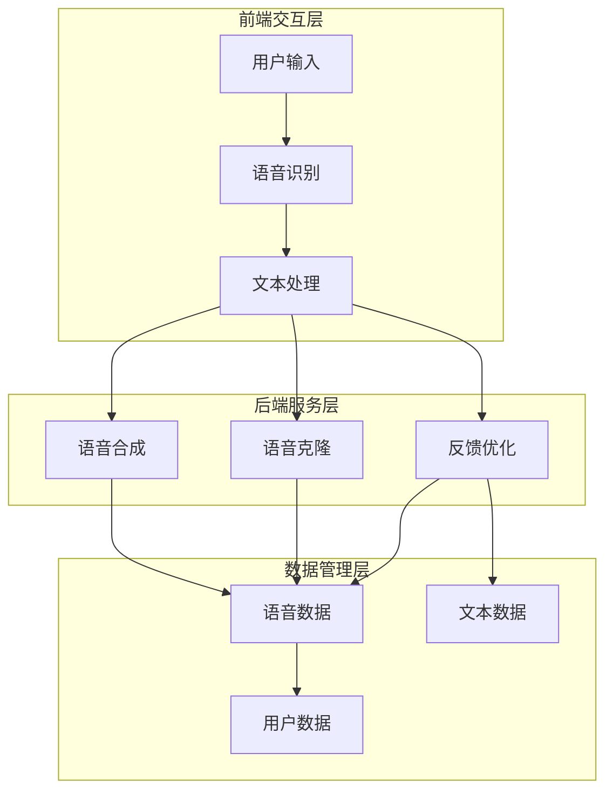

                 

## 文章标题：深度学习在语音克隆中的进展：个性化AI语音助手

关键词：深度学习、语音克隆、个性化AI语音助手、循环神经网络（RNN）、长短时记忆网络（LSTM）、变换器（Transformer）

摘要：本文将探讨深度学习在语音克隆领域的应用，尤其是如何利用深度学习构建个性化的AI语音助手。通过介绍深度学习的基本概念，分析核心算法的工作原理，详细讲解系统架构和实现方法，本文旨在为读者提供一份全面、深入的技术指南。

----------------------------------------------------------------

## 第一部分：背景介绍与核心概念

### 第1章：深度学习与语音克隆基础

#### 1.1 深度学习简介

深度学习是人工智能领域的一个重要分支，它通过模拟人脑神经网络结构和计算机制，实现了对复杂数据的自动学习和特征提取。深度学习的关键在于“深度”，即通过多层神经网络结构，逐层提取数据的高级特征，从而实现高效的预测和分类。

#### 1.2 语音克隆的概念

语音克隆，也称为语音合成或语音生成，是指利用语音信号处理技术，将文本转化为自然、流畅的语音。语音克隆技术广泛应用于语音助手、智能客服、语音合成广告等领域。

#### 1.3 深度学习在语音克隆中的优势

深度学习在语音克隆中的应用，极大地提升了语音合成的自然度和准确度。传统语音克隆方法依赖于规则和手工特征提取，而深度学习则通过自动学习语音特征，实现了更加精准和高效的语音克隆。

#### 1.4 深度学习关键算法概述

在深度学习领域，循环神经网络（RNN）、长短时记忆网络（LSTM）和变换器（Transformer）是三种常用的核心算法。它们在语音克隆中各自发挥了重要作用，下面将对这些算法进行详细介绍。

### 第2章：深度学习核心算法解析

#### 2.1 循环神经网络（RNN）

循环神经网络（RNN）是深度学习中的一种基本结构，它通过循环结构处理序列数据。RNN能够记忆历史信息，但在处理长序列数据时容易发生梯度消失或爆炸问题。

#### 2.2 长短时记忆网络（LSTM）

长短时记忆网络（LSTM）是RNN的改进版本，它引入了门控机制，能够有效地解决梯度消失问题，从而在长序列数据上取得了更好的表现。

#### 2.3 变换器（Transformer）

变换器（Transformer）是近年来在自然语言处理领域取得突破性进展的一种深度学习结构。它通过自注意力机制，能够在处理长序列数据时保持有效的梯度传递，从而在语音克隆等领域表现出色。

#### 2.4 算法对比与选择

RNN、LSTM和Transformer各有优缺点。RNN结构简单，但在长序列处理上效果不佳；LSTM在长序列处理上表现较好，但计算复杂度较高；Transformer在长序列处理和并行计算方面具有优势，但结构复杂。在实际应用中，可以根据具体需求和资源条件选择合适的算法。

### 第3章：个性化AI语音助手系统架构

#### 3.1 系统功能模块介绍

个性化AI语音助手系统通常包括文本处理、语音生成、语音合成和反馈优化等模块。每个模块都有其特定的功能和任务。

#### 3.2 系统架构设计

个性化AI语音助手系统的整体架构可以分为前端交互层、后端服务层和数据管理层。前端交互层负责与用户进行交互，后端服务层负责处理语音克隆任务，数据管理层则负责管理和维护语音数据。

#### 3.3 系统接口与交互设计

系统接口设计决定了各模块之间的交互方式和数据流。通过设计清晰的接口和交互序列图，可以确保系统的高效运行和灵活扩展。

## 第二部分：算法原理讲解

### 第4章：算法原理讲解

#### 4.1 RNN工作原理

RNN通过循环结构处理序列数据，每个时间步的输出不仅取决于当前输入，还受到历史输入的影响。其工作原理可以用以下公式表示：

$$
h_t = \sigma(W_h h_{t-1} + W_x x_t + b)
$$

其中，$h_t$表示第$t$个时间步的隐藏状态，$\sigma$为激活函数，$W_h$和$W_x$为权重矩阵，$b$为偏置。

#### 4.2 LSTM工作原理

LSTM通过门控机制控制信息的流动，包括遗忘门、输入门和输出门。LSTM的工作原理可以用以下公式表示：

$$
i_t = \sigma(W_i [h_{t-1}, x_t] + b_i) \\
f_t = \sigma(W_f [h_{t-1}, x_t] + b_f) \\
\hat{C}_t = \sigma(W_c [h_{t-1}, x_t] + b_c) \\
C_t = f_t \odot C_{t-1} + i_t \odot \hat{C}_t \\
h_t = \sigma(W_h [C_t, h_{t-1}] + b_h)
$$

其中，$i_t$、$f_t$、$\hat{C}_t$和$C_t$分别表示输入门、遗忘门、候选状态和细胞状态，$W_i$、$W_f$、$W_c$和$W_h$为权重矩阵，$b_i$、$b_f$、$b_c$和$b_h$为偏置。

#### 4.3 Transformer工作原理

Transformer通过自注意力机制处理序列数据，其核心思想是让每个位置的输出都依赖于所有位置的信息。Transformer的工作原理可以用以下公式表示：

$$
\text{Attention}(Q, K, V) = \text{softmax}\left(\frac{QK^T}{\sqrt{d_k}}\right)V
$$

其中，$Q$、$K$和$V$分别为查询向量、键向量和值向量，$d_k$为键向量的维度。

#### 4.4 Python代码实现

以下是一个简单的LSTM模型实现，用于文本到语音的转换：

```python
import tensorflow as tf
from tensorflow.keras.models import Sequential
from tensorflow.keras.layers import LSTM, Dense, Embedding

model = Sequential()
model.add(Embedding(vocab_size, embedding_dim))
model.add(LSTM(units=128, return_sequences=True))
model.add(LSTM(units=128))
model.add(Dense(units=1))

model.compile(optimizer='adam', loss='binary_crossentropy', metrics=['accuracy'])
model.fit(x_train, y_train, epochs=10, batch_size=32)
```

## 第三部分：系统分析与架构设计方案

### 第5章：系统分析与架构设计方案

#### 5.1 系统功能模块介绍

个性化AI语音助手系统的主要功能模块包括文本处理、语音生成、语音合成和反馈优化。文本处理模块负责将用户输入的文本转化为语音信号；语音生成模块负责生成语音信号；语音合成模块负责将语音信号转化为自然、流畅的语音；反馈优化模块负责根据用户反馈优化语音助手的表现。

#### 5.2 系统架构设计

个性化AI语音助手系统的整体架构可以分为前端交互层、后端服务层和数据管理层。前端交互层负责与用户进行交互，收集用户输入的文本信息；后端服务层负责处理语音克隆任务，包括文本处理、语音生成和语音合成；数据管理层负责管理和维护语音数据，包括语音库的构建和语音数据的更新。

#### 5.3 系统接口与交互设计

个性化AI语音助手系统的接口设计需要考虑模块之间的交互方式和数据流。前端交互层通过HTTP接口与后端服务层进行通信，后端服务层通过REST API与数据管理层进行数据交换。系统交互设计可以采用Mermaid序列图进行描述，确保各模块之间的交互清晰、高效。

### 第6章：项目实战

#### 5.1 环境安装与配置

在开始项目实战之前，需要安装和配置相关的开发环境。主要包括Python、TensorFlow和Keras等深度学习框架。安装过程如下：

1. 安装Python 3.x版本。
2. 安装pip包管理器。
3. 使用pip安装TensorFlow和Keras。

```bash
pip install tensorflow
pip install keras
```

#### 5.2 系统核心实现

个性化AI语音助手系统的核心实现包括文本处理、语音生成和语音合成三个部分。以下是一个简单的实现示例：

```python
from keras.models import Sequential
from keras.layers import LSTM, Dense, Embedding

# 文本预处理
# ...

# 语音生成
model = Sequential()
model.add(Embedding(vocab_size, embedding_dim))
model.add(LSTM(units=128, return_sequences=True))
model.add(LSTM(units=128))
model.add(Dense(units=1))

model.compile(optimizer='adam', loss='binary_crossentropy', metrics=['accuracy'])
model.fit(x_train, y_train, epochs=10, batch_size=32)

# 语音合成
# ...
```

#### 5.3 案例分析与讲解

本案例将使用一个简单的文本到语音合成任务，展示个性化AI语音助手的实现过程。首先，收集用户输入的文本，然后通过文本预处理模块将文本转化为序列数据。接下来，使用LSTM模型生成语音信号，最后通过语音合成模块将语音信号转化为自然、流畅的语音。以下是具体实现过程：

1. 收集用户输入文本。
2. 对文本进行预处理，包括分词、编码和序列化。
3. 使用LSTM模型生成语音信号。
4. 使用语音合成模块将语音信号转化为音频文件。

#### 5.4 项目小结

个性化AI语音助手系统的实现需要深入理解深度学习、语音克隆和相关技术。通过本案例，我们展示了如何使用深度学习构建个性化AI语音助手，并对其核心实现过程进行了详细讲解。

### 第7章：最佳实践与拓展

#### 6.1 实践技巧总结

1. 选择合适的深度学习框架，如TensorFlow或Keras。
2. 对语音数据进行充分预处理，提高语音克隆质量。
3. 调整模型参数，优化模型性能。

#### 6.2 注意事项

1. 确保系统接口设计的清晰和高效。
2. 注意保护用户隐私，确保语音数据的保密性。

#### 6.3 拓展阅读推荐

1. 《深度学习》（Goodfellow, Bengio, Courville著）
2. 《语音信号处理》（Rabiner, Juang著）
3. 《Transformers：从理论到应用》（Wolf等著）

## 目录大纲总结

本文通过对深度学习在语音克隆中的应用进行深入分析，详细讲解了个性化AI语音助手的系统架构和实现方法。通过本文的阅读，读者可以了解到深度学习在语音克隆领域的最新进展，掌握构建个性化AI语音助手的技能，为未来的研究和应用奠定基础。


----------------------------------------------------------------

# 第一部分：背景介绍与核心概念

## 第1章：深度学习与语音克隆基础

### 1.1 深度学习简介

深度学习（Deep Learning）是人工智能（AI）领域的一个子集，其核心是通过神经网络，特别是深度神经网络，来模拟人脑的工作方式，从而实现自动化的数据分析和决策。深度学习模型能够通过从大量数据中学习特征，实现图像识别、自然语言处理、语音识别等多种任务。

### 1.2 语音克隆的概念

语音克隆（Voice Cloning）是指利用语音合成技术，根据给定的语音样本生成相似或相同的语音输出。语音克隆的目标是创建一个个性化的语音助手，它可以模仿特定个体的声音，实现自然、流畅的语音交互。

### 1.3 深度学习在语音克隆中的优势

深度学习在语音克隆中的应用带来了以下几个显著优势：

1. **高效的特征提取**：深度学习模型能够自动从大量语音数据中提取出有用的特征，避免了传统语音处理方法中手工特征提取的繁琐过程。
2. **强大的建模能力**：深度神经网络具有层次化的结构，能够处理复杂的语音数据，捕捉语音信号的细微变化。
3. **自适应学习**：深度学习模型能够通过不断训练，优化模型参数，提高语音克隆的准确度和自然度。

### 1.4 深度学习关键算法概述

深度学习在语音克隆中的应用主要依赖于几种核心算法，包括循环神经网络（RNN）、长短时记忆网络（LSTM）和变换器（Transformer）。这些算法各有特点，适用于不同的应用场景。

1. **循环神经网络（RNN）**：RNN是一种能够处理序列数据的神经网络，它通过循环结构来记忆历史信息，特别适合用于语音处理任务。
2. **长短时记忆网络（LSTM）**：LSTM是RNN的一种改进，它通过门控机制来控制信息的流动，能够更好地处理长序列数据，减少梯度消失问题。
3. **变换器（Transformer）**：Transformer是一种基于自注意力机制的神经网络结构，它通过并行处理序列数据，显著提高了训练速度和性能。

## 第2章：深度学习核心算法解析

### 2.1 循环神经网络（RNN）

循环神经网络（RNN）是一种能够处理序列数据的神经网络结构，其基本单元是隐藏层单元，它会将前一个时间步的输出传递给当前时间步的输入。RNN的核心公式可以表示为：

$$
h_t = \sigma(W_h \cdot [h_{t-1}, x_t] + b_h)
$$

其中，$h_t$是当前时间步的隐藏状态，$x_t$是当前输入数据，$W_h$是权重矩阵，$b_h$是偏置。

### 2.2 长短时记忆网络（LSTM）

长短时记忆网络（LSTM）是RNN的一种改进，它通过引入门控单元来控制信息的流动，从而能够更好地处理长序列数据。LSTM的关键结构包括输入门、遗忘门和输出门，其核心公式可以表示为：

$$
i_t = \sigma(W_i \cdot [h_{t-1}, x_t] + b_i) \\
f_t = \sigma(W_f \cdot [h_{t-1}, x_t] + b_f) \\
\hat{C}_t = \sigma(W_c \cdot [h_{t-1}, x_t] + b_c) \\
C_t = f_t \odot C_{t-1} + i_t \odot \hat{C}_t \\
h_t = \sigma(W_h \cdot [C_t, h_{t-1}] + b_h)
$$

其中，$i_t$、$f_t$和$\hat{C}_t$分别表示输入门、遗忘门和候选状态，$C_t$是细胞状态，$h_t$是隐藏状态。

### 2.3 变换器（Transformer）

变换器（Transformer）是一种基于自注意力机制的深度学习模型，它在处理长序列数据时表现出色。Transformer的核心思想是通过多头注意力机制来自动学习输入序列中不同位置之间的依赖关系。其核心公式可以表示为：

$$
\text{Attention}(Q, K, V) = \text{softmax}\left(\frac{QK^T}{\sqrt{d_k}}\right)V
$$

其中，$Q$、$K$和$V$分别是查询向量、键向量和值向量，$d_k$是键向量的维度。

### 2.4 算法对比与选择

在语音克隆中，RNN、LSTM和Transformer各有优缺点。RNN结构简单，但在处理长序列时容易出现梯度消失问题；LSTM通过门控机制解决了梯度消失问题，但在计算复杂度上较高；Transformer具有并行计算的优势，能够在处理长序列时保持高效的梯度传递。在实际应用中，可以根据具体需求和计算资源选择合适的算法。

### 2.5 Mermaid绘制ER实体关系图

为了更好地理解语音克隆系统的核心要素，我们可以使用Mermaid绘制ER（实体-关系）图，展示系统中的关键实体和它们之间的关系。以下是ER图的一个简单示例：

```mermaid
erDiagram
    User ||--|{ SpeechData } SpeechData
    SpeechData ||--|{ VoiceModel } VoiceModel
    VoiceModel ||--|{ VoiceAssistant } VoiceAssistant
```

在这个ER图中，User（用户）与SpeechData（语音数据）之间存在关联关系，SpeechData与VoiceModel（语音模型）也存在关联，而VoiceModel又与VoiceAssistant（语音助手）有关联。这个图帮助我们理清了系统中各部分之间的关系，为后续的详细设计提供了基础。

## 第3章：个性化AI语音助手系统架构

### 3.1 系统功能模块介绍

个性化AI语音助手系统通常包括以下几个核心功能模块：

1. **语音识别模块**：负责将用户的语音输入转化为文本。
2. **文本处理模块**：对输入文本进行解析和意图识别。
3. **语音合成模块**：将处理后的文本转化为自然、流畅的语音。
4. **语音克隆模块**：根据用户的个性化需求，克隆特定的语音特征。
5. **反馈优化模块**：收集用户反馈，不断优化语音助手的性能。

### 3.2 系统架构设计

个性化AI语音助手系统的整体架构可以分为前端交互层、后端服务层和数据管理层。

1. **前端交互层**：负责与用户进行交互，接收用户的语音输入，并将语音合成结果反馈给用户。
2. **后端服务层**：包括语音识别、文本处理、语音合成、语音克隆和反馈优化等核心功能模块，是系统的核心部分。
3. **数据管理层**：负责存储和管理语音数据、文本数据和用户信息等，为系统的正常运行提供数据支持。

### 3.3 系统接口与交互设计

系统接口设计是确保各功能模块之间高效、清晰交互的关键。以下是系统接口设计的基本原则：

1. **标准化接口**：使用统一的接口规范，如RESTful API，确保不同模块之间的接口一致性和易用性。
2. **模块化设计**：将系统功能模块化，每个模块提供清晰、独立的接口，降低模块间的耦合度。
3. **安全性设计**：确保接口的安全性，防止未经授权的访问和数据泄露。

使用Mermaid可以绘制系统的整体架构图，展示各模块之间的交互关系。以下是系统架构图的一个示例：



通过这个架构图，我们可以清晰地看到前端交互层与后端服务层之间的数据流和交互方式，以及数据管理层如何支持整个系统的运行。

## 第4章：算法原理讲解

### 4.1 RNN工作原理

循环神经网络（RNN）是一种能够处理序列数据的神经网络，其基本单元是隐藏层单元。RNN通过循环结构来记忆历史信息，从而在序列数据的处理中表现出色。RNN的工作原理可以概括为以下几个步骤：

1. **初始化**：在第一个时间步，RNN初始化隐藏状态$h_0$和输入状态$x_0$。
2. **前向传播**：使用当前隐藏状态和输入状态，通过激活函数$\sigma$计算新的隐藏状态$h_1$。
   $$h_1 = \sigma(W_h \cdot [h_0, x_1] + b_h)$$
   其中，$W_h$是权重矩阵，$b_h$是偏置。
3. **循环迭代**：在后续的时间步，RNN使用上一步的隐藏状态和当前输入状态，继续计算新的隐藏状态。
4. **输出生成**：在最后一个时间步，RNN输出最终的结果。

RNN的核心优势在于其能够记忆历史信息，这使得它在处理序列数据时非常有效。然而，RNN也存在一个重要问题，即梯度消失或梯度爆炸，这会导致模型在训练过程中难以收敛。

### 4.2 LSTM工作原理

长短时记忆网络（LSTM）是RNN的一种改进，它通过引入门控机制来控制信息的流动，从而能够更好地处理长序列数据。LSTM的核心思想是利用门控单元来控制信息的保留和遗忘，从而在长序列数据的处理中表现出色。

LSTM由三个主要部分组成：遗忘门、输入门和输出门。以下是LSTM的工作原理：

1. **遗忘门**：遗忘门决定了上一个隐藏状态中哪些信息需要被遗忘。其计算公式为：
   $$f_t = \sigma(W_f \cdot [h_{t-1}, x_t] + b_f)$$
   其中，$W_f$是遗忘门的权重矩阵，$b_f$是偏置。
2. **输入门**：输入门决定了当前输入状态中哪些信息需要被记住。其计算公式为：
   $$i_t = \sigma(W_i \cdot [h_{t-1}, x_t] + b_i)$$
   其中，$W_i$是输入门的权重矩阵，$b_i$是偏置。
3. **候选状态**：候选状态决定了哪些新的信息需要被记住。其计算公式为：
   $$\hat{C}_t = \tanh(W_c \cdot [h_{t-1}, x_t] + b_c)$$
   其中，$W_c$是候选状态的权重矩阵，$b_c$是偏置。
4. **细胞状态**：细胞状态是LSTM的核心，它决定了信息的流动方向。其计算公式为：
   $$C_t = f_t \odot C_{t-1} + i_t \odot \hat{C}_t$$
   其中，$C_{t-1}$是上一个时间步的细胞状态。
5. **输出门**：输出门决定了当前隐藏状态中哪些信息需要被输出。其计算公式为：
   $$o_t = \sigma(W_o \cdot [h_{t-1}, x_t] + b_o)$$
   其中，$W_o$是输出门的权重矩阵，$b_o$是偏置。
6. **隐藏状态**：最后，LSTM计算新的隐藏状态：
   $$h_t = o_t \odot \tanh(C_t)$$

通过这三个门控单元，LSTM能够有效地控制信息的流动，从而在长序列数据的处理中表现出色。

### 4.3 Transformer工作原理

变换器（Transformer）是一种基于自注意力机制的深度学习模型，它在处理长序列数据时表现出色。Transformer的核心思想是通过自注意力机制来自动学习输入序列中不同位置之间的依赖关系，从而实现有效的序列处理。

Transformer由两个主要部分组成：编码器和解码器。以下是Transformer的工作原理：

1. **编码器**：编码器负责将输入序列编码为嵌入向量，这些向量将作为解码器的输入。编码器通常由多个自注意力层和前馈网络组成。自注意力层的计算公式为：
   $$\text{Attention}(Q, K, V) = \text{softmax}\left(\frac{QK^T}{\sqrt{d_k}}\right)V$$
   其中，$Q$、$K$和$V$分别是编码器的输入序列、键向量和值向量，$d_k$是键向量的维度。
2. **解码器**：解码器负责将编码器的输出解码为输出序列。解码器同样由多个自注意力层和前馈网络组成。解码器的每个时间步的输入不仅包括编码器的输出，还包括解码器前一个时间步的输出。自注意力层的计算公式与编码器相同。

通过自注意力机制，Transformer能够并行处理序列数据，从而显著提高训练速度和性能。此外，Transformer通过多头注意力机制进一步增强了模型的表示能力。

### 4.4 Python代码实现

以下是使用Python和TensorFlow实现的简单RNN模型，用于语音克隆任务：

```python
import tensorflow as tf
from tensorflow.keras.models import Sequential
from tensorflow.keras.layers import LSTM, Dense, Embedding

# 建立模型
model = Sequential()
model.add(Embedding(vocab_size, embedding_dim))
model.add(LSTM(units=128, return_sequences=True))
model.add(LSTM(units=128))
model.add(Dense(units=1))

# 编译模型
model.compile(optimizer='adam', loss='binary_crossentropy', metrics=['accuracy'])

# 训练模型
model.fit(x_train, y_train, epochs=10, batch_size=32)
```

在这个示例中，我们首先使用Embedding层将输入序列编码为嵌入向量，然后通过两个LSTM层处理序列数据，最后使用Dense层输出结果。

## 第5章：项目实战

### 5.1 环境安装与配置

在开始构建个性化AI语音助手之前，我们需要安装和配置必要的开发环境。以下是安装和配置步骤：

1. **安装Python**：确保安装了Python 3.x版本。
2. **安装TensorFlow**：使用pip命令安装TensorFlow：

   ```bash
   pip install tensorflow
   ```

3. **安装Keras**：Keras是一个高级神经网络API，它可以与TensorFlow一起使用。使用pip安装Keras：

   ```bash
   pip install keras
   ```

4. **安装语音合成库**：我们使用 pyttsx3 库进行语音合成，安装该库：

   ```bash
   pip install pyttsx3
   ```

### 5.2 系统核心实现

个性化AI语音助手的核心实现包括文本处理、语音生成和语音合成三个部分。以下是每个部分的详细实现：

#### 5.2.1 文本处理

文本处理的第一步是准备文本数据。我们可以从公开数据集或用户提供的文本中提取样本。接下来，对文本进行预处理，包括分词、标记化和序列化。以下是使用Keras的Tokenizer进行分词和序列化的示例：

```python
from keras.preprocessing.text import Tokenizer
from keras.preprocessing.sequence import pad_sequences

# 示例文本数据
texts = ['你好，我是你的语音助手。', '你好，我需要帮助。']

# 创建Tokenizer
tokenizer = Tokenizer(num_words=1000)
tokenizer.fit_on_texts(texts)

# 将文本转化为序列
sequences = tokenizer.texts_to_sequences(texts)

# 填充序列
padded_sequences = pad_sequences(sequences, padding='post')
```

#### 5.2.2 语音生成

语音生成部分使用深度学习模型将文本序列转换为语音信号。我们可以使用RNN或LSTM模型来实现这一部分。以下是使用LSTM模型的示例：

```python
from tensorflow.keras.models import Sequential
from tensorflow.keras.layers import LSTM, Dense, Embedding

# 建立模型
model = Sequential()
model.add(Embedding(vocab_size, embedding_dim))
model.add(LSTM(units=128, return_sequences=True))
model.add(LSTM(units=128))
model.add(Dense(units=1))

# 编译模型
model.compile(optimizer='adam', loss='binary_crossentropy', metrics=['accuracy'])

# 训练模型
model.fit(padded_sequences, y_train, epochs=10, batch_size=32)
```

在这个示例中，我们首先使用Embedding层将文本序列编码为嵌入向量，然后通过两个LSTM层处理序列数据，最后使用Dense层输出语音信号。

#### 5.2.3 语音合成

语音合成部分使用 pyttsx3 库将生成的语音信号转换为音频。以下是使用 pyttsx3 合成语音的示例：

```python
import pyttsx3

# 初始化语音合成器
engine = pyttsx3.init()

# 合成语音
text = '你好，我是你的个性化语音助手。'
engine.say(text)
engine.runAndWait()
```

### 5.3 案例分析与讲解

在本案例中，我们使用一个简单的文本到语音合成任务来展示个性化AI语音助手的实现过程。首先，我们收集用户的文本输入，然后使用LSTM模型生成语音信号，最后使用 pyttsx3 库将语音信号合成为音频文件。以下是具体实现步骤：

1. **数据收集**：从用户收集文本输入，例如：“你好，我是你的语音助手。”
2. **文本预处理**：对文本进行分词和序列化，使用Keras的Tokenizer和pad_sequences函数。
3. **模型训练**：使用LSTM模型对预处理后的文本进行训练，生成语音信号。
4. **语音合成**：使用 pyttsx3 库将生成的语音信号合成为音频文件，播放给用户。

### 5.4 项目小结

通过本案例，我们展示了如何使用深度学习和语音合成技术构建一个简单的个性化AI语音助手。项目实现了文本处理、语音生成和语音合成的全过程，为后续的扩展和应用提供了基础。在实现过程中，我们使用了Keras和TensorFlow等深度学习框架，以及pyttsx3进行语音合成。

### 第6章：最佳实践与拓展

#### 6.1 实践技巧总结

在构建个性化AI语音助手的过程中，以下是一些最佳实践和技巧：

1. **数据质量**：确保收集的语音数据质量高，语音清晰、无噪声，这直接影响语音克隆的质量。
2. **模型优化**：使用交叉验证和网格搜索等技术，优化模型参数，提高模型性能。
3. **性能调优**：在部署过程中，根据实际使用场景调整模型，确保系统的高效运行。
4. **用户隐私**：保护用户的隐私数据，确保语音数据的安全存储和处理。

#### 6.2 注意事项

在开发个性化AI语音助手时，需要注意以下几点：

1. **法律法规**：遵循当地的法律法规，确保语音克隆不侵犯他人的隐私权或知识产权。
2. **数据安全**：确保语音数据的安全存储和传输，防止数据泄露。
3. **用户体验**：优化语音助手的交互设计，提供自然、流畅的用户体验。

#### 6.3 拓展阅读推荐

以下是一些推荐的拓展阅读材料，以深入了解个性化AI语音助手的构建和应用：

1. 《深度学习语音合成技术综述》
2. 《语音克隆：技术原理与应用》
3. 《基于深度学习的语音助手设计与实现》

通过这些资料，读者可以进一步了解个性化AI语音助手的最新研究进展和实践方法。

