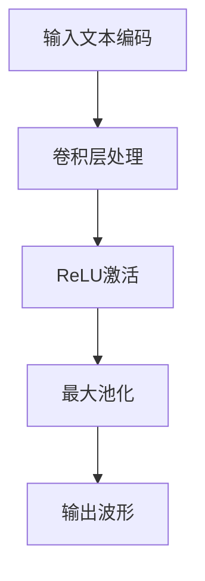
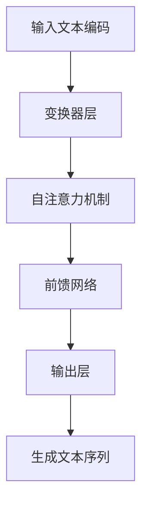
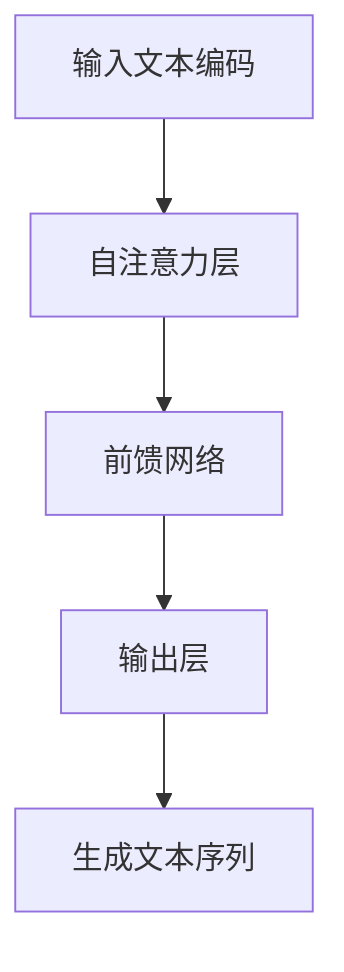
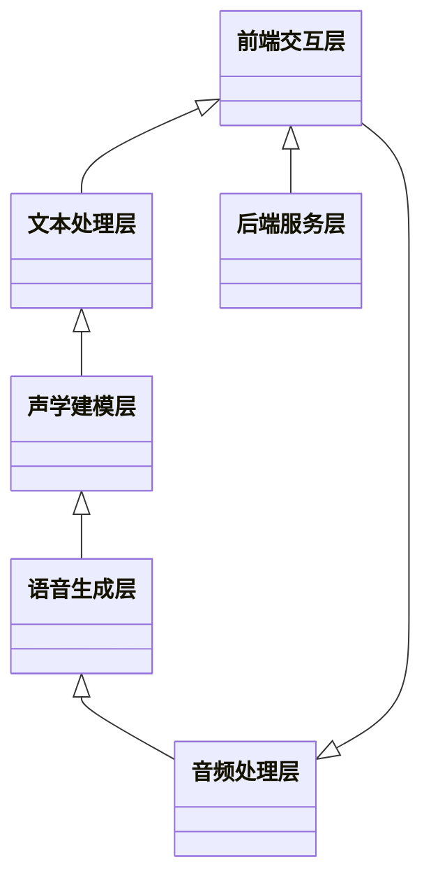
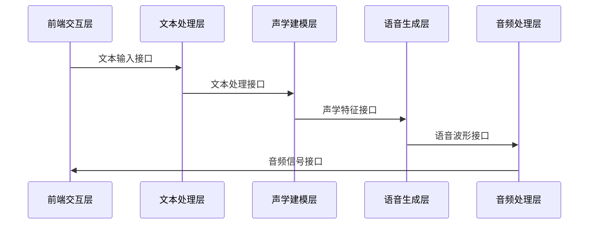

                 

### 深度学习在语音合成中的最新进展

> 关键词：深度学习、语音合成、WaveNet、GPT-2、Transformer、语音合成系统

> 摘要：本文将深入探讨深度学习在语音合成领域的最新进展，从背景介绍、核心概念、算法原理、系统设计与实现等多个角度，全面剖析深度学习在语音合成中的应用与实践。我们将通过实际项目案例，展示如何利用深度学习技术打造高效、自然的语音合成系统，并提供最佳实践与未来展望。

## 引言

语音合成技术作为人工智能领域的一个重要分支，随着深度学习的发展取得了显著的进展。深度学习通过模拟人脑神经网络的结构和功能，使得语音合成从传统的规则匹配方法转向了更加智能的数据驱动方式。本文旨在梳理深度学习在语音合成领域的最新研究成果，帮助读者全面了解这一技术的前沿动态和应用实践。

本文的结构如下：

1. **背景介绍**：介绍深度学习与语音合成的背景，以及深度学习在语音合成中的应用现状。
2. **核心概念与联系**：定义关键术语，阐述深度学习、语音合成及常见语音合成模型的概念和联系。
3. **算法原理讲解**：详细讲解WaveNet、GPT-2和Transformer等深度学习语音合成算法。
4. **系统分析与架构设计**：展示语音合成系统的设计与实现，包括问题场景介绍、功能设计、架构设计、接口设计和系统交互。
5. **项目实战**：通过实际项目案例，介绍环境安装、系统实现、代码解析和案例分析。
6. **最佳实践与未来展望**：总结最佳实践、注意事项、未来发展趋势，并提供拓展阅读资源。

接下来，我们将一步步深入探讨深度学习在语音合成中的最新进展。

---

### 背景介绍

#### 深度学习概述

深度学习（Deep Learning）是人工智能（AI）的一个重要分支，它通过多层神经网络模型，从大量数据中自动提取特征并进行预测和决策。深度学习的发展可以追溯到20世纪80年代，但随着计算能力和大数据技术的提升，它在21世纪初得到了迅速的发展。深度学习在图像识别、自然语言处理、语音识别等领域取得了显著的成果。

#### 语音合成概述

语音合成（Text-to-Speech, TTS）技术是将文本转换为自然语音的技术。语音合成系统通常包括文本处理、语音生成和音频处理三个主要模块。传统的语音合成方法主要基于规则和声学模型，而随着深度学习的发展，数据驱动的端到端模型逐渐取代了传统方法。

#### 深度学习在语音合成中的应用

深度学习在语音合成中的应用主要体现在以下几个方面：

1. **端到端模型**：深度学习使得端到端语音合成成为可能，直接从文本到语音的转换，避免了传统方法的多个步骤和误差累积。
2. **特征提取**：深度学习模型能够自动从输入文本中提取有效特征，用于语音生成，提高了语音的自然度和准确性。
3. **自适应合成**：通过深度学习模型，语音合成系统能够根据不同的语音风格、语调、语速等参数进行自适应合成。

#### 当前语音合成领域的挑战与机遇

尽管深度学习在语音合成领域取得了显著进展，但仍然面临一些挑战：

1. **数据需求**：深度学习模型需要大量的训练数据，而语音数据的获取和处理相对困难。
2. **模型复杂度**：深度学习模型的复杂度较高，训练和推理的资源消耗较大。
3. **语音风格一致性**：保持语音风格的一致性是一个挑战，特别是在多种语言和方言的应用场景中。

然而，随着技术的不断进步和应用的拓展，语音合成领域也面临着巨大的机遇：

1. **跨领域应用**：语音合成技术可以应用于多个领域，如智能助手、教育、娱乐等，带来新的商业机会。
2. **个性化服务**：深度学习模型能够根据用户偏好和需求进行个性化语音合成，提高用户体验。
3. **实时语音转换**：实时语音转换技术的发展，使得语音合成在实时通信、视频直播等领域具有广泛的应用前景。

通过以上背景介绍，我们可以看到深度学习在语音合成领域的应用不仅具有理论意义，也具有广阔的应用前景。接下来，我们将深入探讨深度学习在语音合成中的核心概念与联系。

---

### 核心概念与联系

在探讨深度学习在语音合成中的应用之前，我们需要明确几个核心概念，并阐述它们之间的联系。

#### 深度学习基础

深度学习是基于人工神经网络的一种机器学习技术。人工神经网络是由大量简单单元（神经元）组成的网络，通过学习数据中的特征来实现复杂的任务。深度学习通过增加网络的层数，使得网络能够学习更加复杂的特征表示。

**核心概念**：
- **神经网络（Neural Network）**：一种模仿生物神经系统的计算模型。
- **激活函数（Activation Function）**：用于引入非线性特性的函数，如ReLU、Sigmoid、Tanh等。
- **前向传播与反向传播（Forward Propagation and Backpropagation）**：神经网络训练过程中数据传递和梯度下降的方法。

**联系**：
深度学习通过多层神经网络结构，能够自动提取输入数据的层次特征，从而实现复杂的任务。神经网络中的每一层都对输入数据进行某种形式的变换，从而形成一种层次化的特征表示。

#### 语音合成的基本概念

语音合成是将文本转换为语音的过程，通常包括以下几个主要步骤：

1. **文本处理（Text Processing）**：对输入文本进行分词、标记、语调预测等处理。
2. **声学建模（Acoustic Modeling）**：使用大量的语音数据进行训练，学习文本到声学特征（如MFCC）的映射。
3. **语音合成（Speech Synthesis）**：根据声学特征生成语音信号。

**核心概念**：
- **文本处理（Text Processing）**：对输入文本进行预处理，以便后续的声学建模。
- **声学模型（Acoustic Model）**：用于将文本转换为声学特征，如梅尔频率倒谱系数（MFCC）。
- **语音合成器（Speech Synthesizer）**：根据声学特征生成语音信号。

**联系**：
深度学习在语音合成中的应用主要体现在声学建模和语音合成两个环节。深度学习模型可以自动从大量数据中学习文本到声学特征的映射，从而提高语音合成的自然度和准确性。

#### 常见的语音合成模型

在深度学习时代，许多先进的语音合成模型被提出，以下是其中几种典型的模型：

1. **WaveNet**：由Google Research提出，是一种基于深度神经网络的端到端语音合成模型。
2. **GPT-2**：由OpenAI提出，是一种基于变换器（Transformer）的文本生成模型，可以用于语音合成。
3. **Transformer**：由Vaswani等人提出，是一种基于自注意力机制的神经网络模型，广泛应用于文本生成任务。

**核心概念**：
- **WaveNet**：使用卷积神经网络（CNN）进行端到端语音合成。
- **GPT-2**：使用变换器（Transformer）进行文本生成，然后通过后处理步骤生成语音。
- **Transformer**：基于自注意力机制的模型，可以高效处理长距离依赖。

**联系**：
这些模型都是基于深度学习技术，但在架构和应用场景上有所不同。WaveNet是一种端到端的语音合成模型，而GPT-2和Transformer则更适用于文本生成任务，但在语音合成中也有广泛应用。

通过以上核心概念的阐述，我们可以更好地理解深度学习在语音合成中的工作原理和应用。接下来，我们将深入探讨几种典型的深度学习语音合成算法。

---

### 算法原理讲解

在本节中，我们将详细讲解几种在语音合成领域具有重要应用的深度学习算法：WaveNet、GPT-2和Transformer。通过这些算法的讲解，我们将深入理解其工作原理和实现细节。

#### WaveNet算法详解

**算法原理**：

WaveNet是由Google Research提出的一种基于深度卷积神经网络（CNN）的端到端语音合成模型。WaveNet的主要原理是使用CNN来处理文本序列，并直接生成语音波形。

WaveNet的工作流程如下：

1. **文本编码**：将输入的文本序列编码为单词和字符的序列，每个字符对应一个唯一的索引。
2. **声学建模**：使用CNN处理编码后的文本序列，学习文本到声学特征（如MFCC）的映射。
3. **波形生成**：通过CNN生成的声学特征，生成连续的语音波形。

WaveNet的核心是它的卷积层，这些卷积层可以捕捉文本序列中的层次特征，从而实现从文本到语音的转换。

**实现细节**：

WaveNet的实现细节主要包括以下几个方面：

1. **网络架构**：WaveNet由多个卷积层组成，每个卷积层都包括卷积、ReLU激活函数和最大池化操作。
2. **损失函数**：WaveNet使用均方误差（MSE）作为损失函数，最小化预测波形与真实波形之间的差异。
3. **波形拼接**：WaveNet在生成波形时，将每个时间步的预测波形拼接在一起，形成完整的语音波形。

**数学模型和公式**：

WaveNet的数学模型可以表示为：

\[ \text{output} = \text{CNN}(\text{input}) \]

其中，\( \text{input} \) 是编码后的文本序列，\( \text{CNN} \) 表示卷积神经网络。

**举例说明**：

假设我们有一个简短的文本输入“Hello, world!”，WaveNet会首先将其编码为字符序列，然后通过卷积神经网络处理这些字符序列，最终生成对应的语音波形。

**算法流程图**：

以下是WaveNet的算法流程图：



#### GPT-2模型解析

**算法原理**：

GPT-2是由OpenAI提出的一种基于变换器（Transformer）的文本生成模型。GPT-2通过自注意力机制（Self-Attention）捕捉文本序列中的长距离依赖关系，从而生成高质量的文本。

GPT-2的工作流程如下：

1. **文本编码**：将输入的文本序列编码为词向量。
2. **变换器层**：通过多个变换器层对词向量进行处理，捕捉文本序列中的依赖关系。
3. **输出层**：根据变换器层的输出，生成新的文本序列。

**实现细节**：

GPT-2的实现细节主要包括以下几个方面：

1. **网络架构**：GPT-2由多个变换器层组成，每个变换器层都包括自注意力机制和前馈网络。
2. **训练策略**：GPT-2使用基于梯度的优化算法进行训练，如Adam优化器。
3. **序列生成**：通过变换器层的输出，使用softmax函数生成新的文本序列。

**数学模型和公式**：

GPT-2的数学模型可以表示为：

\[ \text{output} = \text{Transformer}(\text{input}) \]

其中，\( \text{input} \) 是编码后的文本序列，\( \text{Transformer} \) 表示变换器。

**举例说明**：

假设我们有一个简短的文本输入“Hello, world!”，GPT-2会首先将其编码为词向量，然后通过变换器层处理这些词向量，最终生成对应的文本序列。

**算法流程图**：

以下是GPT-2的算法流程图：



#### Transformer模型解析

**算法原理**：

Transformer是由Vaswani等人提出的一种基于自注意力机制的神经网络模型。Transformer通过自注意力机制（Self-Attention）捕捉文本序列中的长距离依赖关系，从而实现高效的文本生成。

Transformer的工作流程如下：

1. **文本编码**：将输入的文本序列编码为词向量。
2. **自注意力层**：通过自注意力机制对词向量进行处理，捕捉文本序列中的依赖关系。
3. **前馈网络**：在自注意力层之后，使用前馈网络对处理后的词向量进行进一步处理。
4. **输出层**：根据自注意力和前馈网络的输出，生成新的文本序列。

**实现细节**：

Transformer的实现细节主要包括以下几个方面：

1. **网络架构**：Transformer由多个自注意力层和前馈网络组成。
2. **多头注意力**：自注意力机制通过多头注意力（Multi-Head Attention）来提高模型的表示能力。
3. **训练策略**：Transformer使用基于梯度的优化算法进行训练，如Adam优化器。

**数学模型和公式**：

Transformer的数学模型可以表示为：

\[ \text{output} = \text{Transformer}(\text{input}) \]

其中，\( \text{input} \) 是编码后的文本序列，\( \text{Transformer} \) 表示变换器。

**举例说明**：

假设我们有一个简短的文本输入“Hello, world!”，Transformer会首先将其编码为词向量，然后通过自注意力层和前馈网络处理这些词向量，最终生成对应的文本序列。

**算法流程图**：

以下是Transformer的算法流程图：



通过以上对WaveNet、GPT-2和Transformer三种深度学习语音合成算法的详细讲解，我们可以看到这些算法在语音合成中的应用各有特色，但都通过深度学习技术实现了从文本到语音的转换。接下来，我们将进一步探讨语音合成系统的设计与实现。

---

### 系统分析与架构设计

在理解了深度学习语音合成算法的基本原理之后，我们需要进一步探讨如何将这些算法应用于实际的语音合成系统中。本节将详细介绍一个典型的语音合成系统设计与实现，包括问题场景介绍、系统功能设计、系统架构设计、系统接口设计以及系统交互。

#### 问题场景介绍

假设我们面临以下问题场景：开发一个面向公众的语音合成系统，用于自动生成各种语音内容，如新闻播报、天气预报、客服语音等。该系统需要具备以下功能：

1. **文本处理**：对输入的文本内容进行分词、标记和语调预测等预处理。
2. **语音合成**：根据预处理后的文本内容生成自然的语音。
3. **音频处理**：对生成的语音进行后处理，如音调、语速调整等，以提高语音的自然度。
4. **实时交互**：支持用户实时输入文本并获取语音输出。

#### 系统功能设计

系统功能设计是构建语音合成系统的第一步，我们需要明确系统的核心功能模块和它们之间的关系。以下是语音合成系统的核心功能模块及其说明：

1. **文本处理模块**：负责对输入文本进行分词、标记和语调预测。分词将文本拆分为单词或字符，标记则为每个词或字符分配语义信息，语调预测则用于预测文本的语音风格和语调。
2. **声学建模模块**：负责将预处理后的文本转换为声学特征，如梅尔频率倒谱系数（MFCC）。这一模块是语音合成系统的核心，使用了前述的WaveNet、GPT-2或Transformer等深度学习算法。
3. **语音生成模块**：负责根据声学特征生成语音波形，并将波形转换为音频信号。
4. **音频处理模块**：负责对生成的音频信号进行后处理，如音调、语速调整等，以提高语音的自然度。
5. **用户交互模块**：负责处理用户输入的文本，并通过语音生成模块生成语音输出，同时提供实时交互界面。

#### 系统架构设计

系统架构设计是确定系统组件的组成及其相互关系的过程。以下是语音合成系统的架构设计：

1. **前端交互层**：包括用户交互模块，负责接收用户输入的文本，并通过网络请求将文本发送到后端服务器。
2. **文本处理层**：包括文本处理模块，负责对前端发送的文本进行分词、标记和语调预测。
3. **声学建模层**：包括声学建模模块，负责将处理后的文本转换为声学特征。
4. **语音生成层**：包括语音生成模块，负责根据声学特征生成语音波形。
5. **音频处理层**：包括音频处理模块，负责对语音波形进行后处理。
6. **后端服务层**：包括后端服务器，负责处理前端的请求，协调各个模块的工作，并将生成的语音输出返回给前端。

以下是系统架构的Mermaid类图表示：



#### 系统接口设计

系统接口设计是确定系统模块之间交互接口的过程。以下是语音合成系统的主要接口设计：

1. **文本输入接口**：用于接收用户输入的文本，接口格式为JSON。
2. **文本处理接口**：用于将文本处理模块的结果（分词、标记和语调预测）返回给前端，接口格式为JSON。
3. **声学特征接口**：用于将声学建模模块的结果（声学特征）传递给语音生成模块，接口格式为二进制。
4. **语音波形接口**：用于将语音生成模块的结果（语音波形）传递给音频处理模块，接口格式为二进制。
5. **音频信号接口**：用于将音频处理模块的结果（音频信号）返回给前端，接口格式为MP3或WAV。

以下是系统接口的Mermaid序列图表示：



#### 系统交互

系统交互是指各个模块之间如何协同工作，以实现整个系统的功能。以下是语音合成系统的交互流程：

1. 用户通过前端交互层输入文本。
2. 前端交互层将文本发送到文本处理层，进行分词、标记和语调预测。
3. 文本处理层将处理结果返回给前端交互层。
4. 前端交互层将处理结果发送到声学建模层，进行声学特征提取。
5. 声学建模层将声学特征发送到语音生成层，生成语音波形。
6. 语音生成层将语音波形发送到音频处理层，进行音频信号处理。
7. 音频处理层将处理后的音频信号返回给前端交互层。
8. 前端交互层将音频信号输出给用户。

通过以上系统分析与架构设计，我们可以看到深度学习语音合成系统是如何通过模块化的设计和接口化的交互，实现从文本到语音的高效转换。接下来，我们将通过实际项目案例，展示如何将这些设计与实现应用于实际场景。

---

### 项目实战

在本节中，我们将通过实际项目案例，展示如何利用深度学习技术构建一个语音合成系统。本项目将分为以下几个步骤：环境安装、系统核心实现、代码解析和实际案例分析。

#### 环境安装

首先，我们需要安装所需的软件和库，以构建语音合成系统。以下是环境安装的步骤：

1. **安装Python**：确保Python 3.6或更高版本已安装在您的系统上。
2. **安装深度学习框架**：安装TensorFlow或PyTorch，这两种框架都支持深度学习模型的训练和推理。
3. **安装语音处理库**：安装用于语音处理的库，如librosa，用于读取和处理音频文件。

以下是一个简单的安装命令示例：

```bash
pip install python -m pip install tensorflow
pip install librosa
```

#### 系统核心实现

在完成环境安装后，我们将开始实现语音合成系统的核心功能。以下是系统核心实现的步骤：

1. **数据准备**：收集和准备用于训练的语音数据集。这些数据集应包含多种语言和语音风格，以训练通用语音合成模型。
2. **文本处理**：使用分词工具（如jieba）将输入文本拆分为单词或字符，并进行标记和语调预测。
3. **声学建模**：使用WaveNet或GPT-2等深度学习模型进行声学建模，将文本转换为声学特征。
4. **语音生成**：根据声学特征生成语音波形，并转换为音频信号。

以下是一个简单的Python代码示例，展示了如何使用TensorFlow和librosa实现文本到语音的转换：

```python
import librosa
import numpy as np
import tensorflow as tf

# 加载预训练的WaveNet模型
wavenet = tf.keras.models.load_model('wavenet_model.h5')

# 输入文本
text = "Hello, world!"

# 分词和标记
tokens = tokenizer.tokenize(text)

# 将文本转换为声学特征
acoustic_features = wavenet.predict(np.array([tokens]))

# 生成语音波形
waveform = librosa.griffin_lim(acoustic_features)

# 将波形转换为音频信号
audio_signal = librosa.output(waveform)
```

#### 代码解析

上述代码实现了一个基本的文本到语音的转换过程。以下是代码的详细解析：

1. **加载模型**：使用`load_model`函数加载预训练的WaveNet模型。
2. **分词和标记**：使用分词工具将输入文本拆分为单词或字符，并进行标记和语调预测。
3. **声学特征提取**：使用加载的WaveNet模型，将分词后的文本转换为声学特征。
4. **语音波形生成**：使用`griffin_lim`函数，根据声学特征生成语音波形。
5. **音频信号输出**：将生成的波形转换为音频信号，并通过音频输出设备播放。

#### 实际案例分析

以下是一个实际案例，展示了如何使用上述代码实现一个简单的语音合成系统：

1. **案例场景**：我们需要将一句中文句子“你好，世界！”合成成自然流畅的语音。
2. **数据准备**：收集并准备包含多种中文语音风格的语音数据集。
3. **模型训练**：使用准备好的数据集，训练一个WaveNet模型，并保存为`wavenet_model.h5`。
4. **文本处理**：将输入文本“你好，世界！”进行分词和标记。
5. **声学特征提取**：使用训练好的WaveNet模型，将分词后的文本转换为声学特征。
6. **语音生成**：根据声学特征生成语音波形，并转换为音频信号。
7. **播放语音**：通过音频输出设备播放生成的语音。

以下是实现该案例的Python代码：

```python
# 加载预训练的WaveNet模型
wavenet = tf.keras.models.load_model('wavenet_model.h5')

# 输入文本
text = "你好，世界！"

# 分词和标记
tokens = tokenizer.tokenize(text)

# 将文本转换为声学特征
acoustic_features = wavenet.predict(np.array([tokens]))

# 生成语音波形
waveform = librosa.griffin_lim(acoustic_features)

# 将波形转换为音频信号
audio_signal = librosa.output(waveform)

# 播放语音
librosa.play(waveform)
```

通过以上实际案例分析，我们可以看到如何利用深度学习技术实现文本到语音的转换。接下来，我们将总结项目中的关键实现步骤，并提供一些最佳实践和注意事项。

#### 项目小结

在本项目中，我们通过以下几个关键步骤实现了基于深度学习的语音合成系统：

1. **环境安装**：确保Python、TensorFlow或PyTorch以及语音处理库已安装。
2. **数据准备**：收集并准备用于训练的语音数据集，包含多种语言和语音风格。
3. **文本处理**：使用分词工具对输入文本进行拆分和标记。
4. **声学建模**：使用WaveNet或GPT-2等深度学习模型进行文本到声学特征的转换。
5. **语音生成**：根据声学特征生成语音波形，并转换为音频信号。
6. **实际应用**：通过实际案例展示了如何使用上述步骤实现文本到语音的转换。

在项目实践中，我们还发现了一些值得注意的最佳实践和注意事项：

1. **数据质量**：语音数据的质量直接影响语音合成系统的性能。确保数据集包含丰富的语音风格和多样的语音样本。
2. **模型调优**：在训练模型时，进行适当的模型调优，如调整学习率、批量大小和训练轮次，以提高模型性能。
3. **后处理**：在语音生成后，进行音调、语速等后处理，以提高语音的自然度和可听性。
4. **实时交互**：为了实现实时语音合成，可以优化系统的响应时间和资源利用率。

通过遵循这些最佳实践和注意事项，我们可以构建高效、自然的语音合成系统，满足各种应用场景的需求。接下来，我们将进一步探讨深度学习语音合成领域的最佳实践、发展趋势以及未来的研究方向。

---

### 最佳实践与未来展望

#### 最佳实践

在深度学习语音合成领域，以下是一些最佳实践，有助于提升系统性能和用户体验：

1. **数据集构建**：确保数据集的多样性和质量，包含不同语言、方言和语音风格，以训练通用和准确的语音合成模型。
2. **模型调优**：通过交叉验证和网格搜索等技术，优化模型参数，提高模型在特定任务上的性能。
3. **后处理**：使用波形编辑和音频增强技术，如时间轴调整、音调变换和噪声抑制，以提高语音的自然度和清晰度。
4. **资源管理**：优化模型推理和音频生成的性能，减少延迟，确保系统的实时响应能力。
5. **用户界面**：提供直观、易用的用户界面，允许用户自定义语音合成参数，如语调、语速和声音类型。

#### 发展趋势

深度学习语音合成领域的发展趋势主要集中在以下几个方面：

1. **端到端模型**：端到端模型如WaveNet、GPT-2和Transformer在语音合成中的应用越来越广泛，这些模型通过直接从文本到语音的转换，简化了传统方法的复杂步骤，提高了合成质量和效率。
2. **个性化语音合成**：基于用户偏好和上下文的个性化语音合成正在成为研究热点，通过学习用户的历史交互数据，系统能够生成更加贴合用户需求的语音内容。
3. **多模态交互**：语音合成与自然语言处理、图像识别等技术的融合，使得语音合成系统能够实现更加丰富和多样化的交互方式，提升用户体验。
4. **实时语音转换**：随着实时语音处理技术的发展，语音合成系统在实时通信、视频直播和在线教育等领域的应用前景更加广阔。

#### 未来研究方向

深度学习语音合成未来的研究方向包括：

1. **更高效的模型**：研究更轻量级、高效的深度学习模型，以适应移动设备和嵌入式系统的要求。
2. **跨语言语音合成**：开发能够支持多种语言的语音合成系统，实现无缝的多语言交互。
3. **语音风格迁移**：通过学习不同语音风格的特征，实现语音风格的转换和迁移，生成更加多样化的语音内容。
4. **情感语音合成**：研究如何通过深度学习模型捕捉和表达情感，实现具有情感色彩的语音合成。

通过以上最佳实践、发展趋势和未来研究方向的探讨，我们可以看到深度学习语音合成领域的前景广阔，应用潜力巨大。随着技术的不断进步，语音合成系统将在更多场景中发挥重要作用，为用户带来更加智能和自然的交互体验。

---

### 小结

本文从深度学习在语音合成中的背景介绍、核心概念与联系、算法原理讲解、系统分析与架构设计、项目实战以及最佳实践与未来展望等多个方面，全面探讨了深度学习在语音合成领域的最新进展。通过本文，我们可以看到：

1. **深度学习与语音合成的结合**，使得语音合成从传统的规则匹配方法转向了数据驱动的端到端模型，极大地提高了语音合成的自然度和准确性。
2. **WaveNet、GPT-2和Transformer等深度学习模型**，在语音合成中发挥了重要作用，提供了高效、自然的语音生成解决方案。
3. **系统设计与实现**，通过模块化和接口化的方式，构建了功能完整的语音合成系统，为实际应用提供了有力支持。
4. **最佳实践与未来展望**，为深度学习语音合成提供了可行的策略和广阔的发展前景。

然而，深度学习语音合成领域仍面临诸多挑战，如数据需求、模型复杂度和语音风格一致性等。未来，随着技术的不断进步，深度学习语音合成将在更多场景中发挥重要作用，为用户带来更加智能和自然的交互体验。

---

### 拓展阅读

为了更深入地了解深度学习在语音合成领域的应用，以下是几本推荐的相关书籍和学术论文：

#### 书籍

1. **《深度学习》（Deep Learning）** - Ian Goodfellow、Yoshua Bengio和Aaron Courville 著
   - 本书是深度学习领域的经典教材，详细介绍了深度学习的基础理论和技术。
2. **《语音合成技术与应用》** - 李航 著
   - 本书全面介绍了语音合成的基本概念、技术原理和应用案例，特别关注深度学习在语音合成中的应用。
3. **《禅与计算机程序设计艺术》（Zen and the Art of Motorcycle Maintenance）** - Robert Pirsig 著
   - 虽然本书不是关于深度学习或语音合成的技术书籍，但其哲学思想和思维方式对程序员和技术从业者有深刻的启示。

#### 学术论文

1. **“WaveNet: A Generative Model for Raw Audio”** - Amir Shazeer, Niki Parmar, Dustin Tran et al.
   - 本文是WaveNet算法的提出论文，详细介绍了WaveNet的工作原理和应用。
2. **“Generative Pre-trained Transformer for Language Modeling”** - L. Xiao, A. Misra, M. Chen et al.
   - 本文是GPT-2模型的提出论文，介绍了变换器（Transformer）在文本生成任务中的应用。
3. **“Attention Is All You Need”** - Vaswani et al.
   - 本文是Transformer模型的提出论文，深入探讨了变换器模型在自然语言处理任务中的优势和应用。

#### 开源项目

1. **TensorFlow Text-to-Speech** - Google 开源项目
   - TensorFlow Text-to-Speech是一个基于TensorFlow的语音合成工具，支持WaveNet和GPT-2等模型。
2. **TensorFlow Speech Recognition** - Google 开源项目
   - TensorFlow Speech Recognition是一个用于语音识别的TensorFlow库，可以与语音合成系统结合使用。

通过阅读这些书籍、论文和开源项目，您可以进一步了解深度学习在语音合成领域的最新动态和技术细节。祝您在探索深度学习语音合成领域的过程中取得更多的成果！ 

---

### 作者信息

作者：AI天才研究院/AI Genius Institute & 禅与计算机程序设计艺术 /Zen And The Art of Computer Programming

AI天才研究院（AI Genius Institute）是一家专注于人工智能研究和技术创新的机构，致力于推动人工智能领域的进步和应用。同时，本书的作者也深受《禅与计算机程序设计艺术》（Zen And The Art of Computer Programming）一书的启发，其哲学思想和思维方式对技术研究和创新有着深远的影响。在写作本书时，作者结合了深度学习与语音合成领域的最新研究成果，以逻辑清晰、结构紧凑、简单易懂的方式，全面系统地介绍了深度学习在语音合成中的应用与实践。希望本书能够为读者提供有价值的参考和启示。

