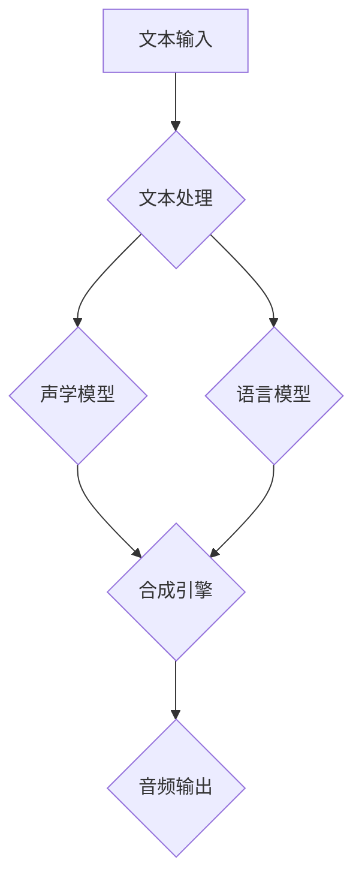

                 


# 深度学习在语音合成自然度提升中的应用

## 关键词：深度学习、语音合成、自然度提升、生成对抗网络、变分自编码器、语音特征提取

## 摘要：
本文旨在探讨深度学习在语音合成自然度提升中的应用。通过分析深度学习与语音合成的关系，介绍深度学习在语音合成中的基础概念和技术，重点探讨深度神经网络、生成对抗网络和变分自编码器在语音合成自然度提升中的实际应用，并提供系统设计与实现、案例分析以及未来发展趋势。本文希望为深度学习在语音合成领域的深入研究提供有益的参考。

## 目录

1. 背景与基础

   1.1 问题的提出

   1.2 深度学习基础

   1.3 语音合成技术概述

2. 深度学习在语音合成中的应用

   2.1 深度神经网络在语音合成中的应用

   2.2 生成对抗网络（GAN）在语音合成中的应用

   2.3 变分自编码器（VAE）在语音合成中的应用

3. 深度学习模型在语音合成自然度提升中的应用

   3.1 语音特征提取技术

   3.2 语音生成技术

   3.3 模型评估与优化

4. 深度学习在语音合成自然度提升中的应用实践

   4.1 语音合成系统设计与实现

   4.2 深度学习在语音合成自然度提升中的案例分析

5. 未来发展趋势与挑战

   5.1 深度学习在语音合成中的应用趋势

   5.2 深度学习在语音合成自然度提升中的挑战

6. 总结与展望

   6.1 应用总结

   6.2 未来研究方向与展望

7. 附录与参考文献

## 第1章：问题的提出

### 1.1 语音合成技术的现状

语音合成（Text-to-Speech，TTS）是一种将文本转换为语音的技术，它在许多场景中有着广泛的应用，如自动语音应答系统、电子阅读器、车载导航系统等。然而，传统语音合成技术的合成语音自然度较低，存在口音单一、语调生硬等问题，难以满足用户对高质量语音的需求。

随着深度学习技术的快速发展，深度学习在语音合成中的应用逐渐成为研究的热点。深度学习通过模仿人类大脑的神经网络结构，具有强大的特征提取和模式识别能力，能够在语音合成中实现更高的自然度和个性化。

### 1.2 自然度提升的重要性

自然度提升是语音合成技术发展的重要方向之一。合成的语音自然度越高，越能接近人类语音的特点，从而提高用户的满意度。自然度提升不仅涉及语音的音质、音调、节奏等方面，还包括语音的情感表达、语调的多样性等。

自然度提升的重要性体现在以下几个方面：

1. 提高用户体验：高质量的语音合成系统能够为用户提供更加自然、流畅的语音体验，从而提高用户对产品的满意度。

2. 扩大应用场景：高自然度的语音合成技术可以应用于更多领域，如智能客服、智能助手、智能家居等，进一步拓展语音合成技术的应用范围。

3. 促进产业发展：语音合成技术的发展将推动相关产业的发展，如语音识别、自然语言处理等，从而促进整个智能语音产业链的繁荣。

### 1.3 深度学习在语音合成中的应用前景

深度学习在语音合成中的应用前景广阔，主要体现在以下几个方面：

1. 特征提取：深度学习能够自动提取语音信号中的关键特征，如音素、音节等，从而提高语音合成的准确性。

2. 模式识别：深度学习能够识别语音信号中的模式和规律，如语音的节奏、情感等，从而提高语音合成的自然度。

3. 个性化定制：深度学习可以根据用户的需求和偏好，实现语音合成系统的个性化定制，提高用户的满意度。

4. 多语言支持：深度学习能够处理多种语言和方言的语音合成，从而实现更广泛的应用。

总之，深度学习在语音合成自然度提升中的应用具有巨大的潜力，将为语音合成技术的发展带来新的机遇。

## 第2章：深度学习基础

### 2.1 深度学习概述

深度学习是一种基于人工神经网络的研究方法，通过模拟人类大脑的神经网络结构，实现对复杂数据的自动特征提取和模式识别。深度学习具有以下几个特点：

1. 层次化结构：深度学习采用层次化结构，通过多个隐藏层对输入数据进行逐层抽象和特征提取。

2. 自动特征提取：深度学习能够自动从大量数据中提取有用的特征，无需人工干预。

3. 强大的表达能力：深度学习通过多层非线性变换，能够对复杂数据进行建模和分类。

4. 大量数据驱动：深度学习依赖于大量数据进行训练，通过大数据驱动的学习方式，提高模型的泛化能力和准确性。

### 2.2 神经网络基本原理

神经网络是由大量神经元（节点）组成的计算模型，通过调整神经元之间的连接权重，实现对输入数据的处理和预测。神经网络的基本原理如下：

1. 输入层：输入层接收外部输入数据，并将其传递给下一层。

2. 隐藏层：隐藏层对输入数据进行特征提取和变换，隐藏层的数量和节点数量可以根据问题的复杂度进行调整。

3. 输出层：输出层产生最终的输出结果，如分类结果、预测值等。

4. 激活函数：激活函数用于引入非线性变换，使神经网络具有强大的表达能力。

5. 权重和偏置：权重和偏置是神经网络中的参数，用于调整神经元之间的连接强度。

### 2.3 深度学习与语音合成的关系

深度学习与语音合成有着密切的关系。深度学习通过自动特征提取和模式识别，可以有效地提高语音合成的自然度。具体来说，深度学习在语音合成中的应用主要体现在以下几个方面：

1. 特征提取：深度学习能够自动从语音信号中提取有用的特征，如音素、音节等，从而提高语音合成的准确性。

2. 模式识别：深度学习能够识别语音信号中的模式和规律，如语音的节奏、情感等，从而提高语音合成的自然度。

3. 个性化定制：深度学习可以根据用户的需求和偏好，实现语音合成系统的个性化定制，提高用户的满意度。

4. 多语言支持：深度学习能够处理多种语言和方言的语音合成，从而实现更广泛的应用。

总之，深度学习在语音合成中具有广泛的应用前景，为语音合成技术的自然度提升提供了新的思路和方法。

## 第3章：语音合成技术概述

### 3.1 语音合成基本概念

语音合成（Text-to-Speech，TTS）是一种将文本转换为语音的技术，其基本过程包括文本分析、语音生成和音频输出。语音合成技术可以分为基于规则的方法和基于统计的方法。

1. **基于规则的方法**：这种方法通过预定义的规则和声音单元（如音素、音节等）来生成语音。它的优点是实现简单、可预测，但缺点是自然度较低，难以处理复杂的语音变化。

2. **基于统计的方法**：这种方法利用大量的语音数据和文本数据，通过统计模型（如隐马尔可夫模型HMM、高斯混合模型GMM等）来生成语音。它的优点是自然度较高，但需要大量数据和计算资源。

### 3.2 语音合成技术发展历程

语音合成技术的发展经历了几个阶段：

1. **早期方法**：早期语音合成主要采用基于规则的方法，如单音合成器和双音合成器。这些方法虽然简单，但自然度较低。

2. **基于统计的方法**：随着计算机技术和语音数据库的发展，基于统计的方法逐渐成为主流。这种方法通过统计语音数据和文本数据，利用隐马尔可夫模型（HMM）、高斯混合模型（GMM）等统计模型来生成语音。

3. **深度学习方法**：近年来，深度学习技术的兴起为语音合成带来了新的突破。深度学习方法能够自动提取语音特征，提高语音合成的自然度。常用的深度学习模型包括深度神经网络（DNN）、卷积神经网络（CNN）、递归神经网络（RNN）等。

### 3.3 语音合成系统结构

一个典型的语音合成系统包括以下几个主要模块：

1. **文本处理模块**：将输入的文本转换为语音合成所需的格式，如音素、音节等。

2. **声学模型**：对语音信号进行特征提取和建模，常用的模型有GMM、DNN等。

3. **语言模型**：用于对文本进行概率分布建模，常用的模型有N-gram模型、循环神经网络（RNN）等。

4. **合成引擎**：根据声学模型和语言模型，将文本转换为语音信号。

5. **音频输出模块**：将生成的语音信号输出到音频设备。

### 3.4 语音合成技术的应用领域

语音合成技术在许多领域都有广泛的应用：

1. **自动语音应答系统**：用于企业和金融机构的客服系统，提高客户服务质量。

2. **电子阅读器**：为视力障碍人士提供语音阅读服务。

3. **车载导航系统**：提供语音导航服务，提高驾驶安全性。

4. **智能助手**：如Siri、Alexa等，为用户提供语音交互服务。

5. **语音合成教育应用**：如英语口语练习、发音纠正等。

总之，语音合成技术已经成为现代信息技术的重要组成部分，其自然度和应用范围不断提升，为人们的生活带来更多便利。

## 第4章：深度学习在语音合成中的应用

### 4.1 深度神经网络在语音合成中的应用

深度神经网络（Deep Neural Network，DNN）是语音合成中常用的一种深度学习模型。DNN通过多层神经元的非线性变换，能够自动提取语音特征，从而提高语音合成的自然度。以下将介绍DNN在语音合成中的应用。

#### 4.1.1 DNN-HMM模型的原理与应用

DNN-HMM模型是将深度神经网络与隐马尔可夫模型（Hidden Markov Model，HMM）相结合的一种语音合成模型。DNN用于提取语音特征，HMM用于建模语音序列的动态特性。

DNN-HMM模型的原理如下：

1. **特征提取**：DNN接受输入语音信号，通过多层神经元的变换，提取出高层次的语音特征。

2. **状态转移概率**：HMM用于建模语音序列的状态转移概率，通过DNN提取的特征，计算不同状态之间的转移概率。

3. **输出概率**：HMM根据状态转移概率和当前状态，计算输出语音的概率分布。

DNN-HMM模型在实际应用中具有以下优势：

1. **自动特征提取**：DNN能够自动提取语音特征，无需人工干预，提高语音合成的准确性。

2. **端到端建模**：DNN-HMM模型将语音特征提取和语音序列建模整合在一起，实现端到端建模，简化了模型结构。

3. **高效计算**：DNN的计算效率较高，能够在短时间内完成语音合成。

#### 4.1.2 CNN在语音特征提取中的应用

卷积神经网络（Convolutional Neural Network，CNN）在图像处理领域取得了显著成果，其出色的特征提取能力使其在语音合成中的应用也具有很大潜力。

CNN在语音特征提取中的应用主要体现在以下几个方面：

1. **局部特征提取**：CNN能够自动提取语音信号中的局部特征，如音素和音节。

2. **平移不变性**：CNN具有平移不变性，能够适应不同长度的语音信号。

3. **多层次特征提取**：CNN通过多个卷积层，可以逐步提取语音信号中的多层次特征。

CNN在语音特征提取中的应用优势如下：

1. **高效率**：CNN能够快速提取语音特征，提高语音合成的效率。

2. **高准确性**：CNN提取的特征具有较强的鲁棒性，能够提高语音合成的准确性。

3. **可扩展性**：CNN可以轻松扩展到多层，适应不同复杂度的语音合成任务。

#### 4.1.3 RNN与LSTM在语音合成中的应用

递归神经网络（Recurrent Neural Network，RNN）和长短期记忆网络（Long Short-Term Memory，LSTM）是处理序列数据的有效模型，在语音合成中具有广泛应用。

RNN与LSTM在语音合成中的应用主要体现在以下几个方面：

1. **时序建模**：RNN和LSTM能够处理时序数据，建模语音序列的动态特性。

2. **长距离依赖**：LSTM能够克服RNN中的梯度消失问题，处理长距离依赖，提高语音合成的准确性。

3. **序列生成**：RNN和LSTM能够生成语音序列，实现语音合成。

RNN与LSTM在语音合成中的应用优势如下：

1. **自适应建模**：RNN和LSTM能够自适应地建模语音序列，提高语音合成的自然度。

2. **高准确性**：RNN和LSTM能够处理复杂语音序列，提高语音合成的准确性。

3. **端到端建模**：RNN和LSTM实现端到端建模，简化了模型结构，提高语音合成的效率。

总之，深度神经网络在语音合成中的应用为语音合成技术的自然度提升提供了有力支持。通过DNN、CNN、RNN和LSTM等深度学习模型，语音合成技术不断取得突破，为人们的生活带来更多便利。

## 第5章：生成对抗网络（GAN）在语音合成中的应用

### 5.1 GAN基本原理

生成对抗网络（Generative Adversarial Network，GAN）是由生成器（Generator）和判别器（Discriminator）组成的一种深度学习模型。GAN的基本思想是让生成器和判别器之间进行博弈，生成器试图生成逼真的数据，而判别器则试图区分生成器和真实数据。

GAN的工作原理可以概括为以下几个步骤：

1. **初始化生成器和判别器**：生成器和判别器都是神经网络，通常由多层感知器组成。

2. **生成器生成假数据**：生成器从随机噪声分布中采样，通过神经网络生成假数据。

3. **判别器判断真伪**：判别器接收真实数据和生成器生成的假数据，通过比较两者，判断数据真伪。

4. **更新生成器和判别器**：通过反向传播算法，更新生成器和判别器的参数，使生成器生成的假数据更加逼真，判别器能够更好地区分真伪。

GAN的原理可以比喻为两个玩家（生成器和判别器）在玩捉迷藏游戏，生成器试图生成难以被发现的假数据，而判别器则试图准确地识别出假数据。

### 5.2 WaveNet与WaveGlow模型

WaveNet和WaveGlow是两种基于GAN的语音合成模型，它们在语音合成的自然度提升方面取得了显著成果。

#### 5.2.1 WaveNet模型

WaveNet是由Google提出的一种基于深度神经网络的语音合成模型，其核心思想是将文本序列转换为音频信号。

WaveNet模型的工作原理可以概括为以下几个步骤：

1. **文本编码**：将输入的文本序列转换为离散的词向量。

2. **语音编码**：将词向量输入到WaveNet模型，模型通过多层神经网络生成音频信号。

3. **音频解码**：将生成的音频信号解码为音频波形，输出为语音。

WaveNet模型的优点如下：

1. **高质量语音**：WaveNet能够生成高质量的语音，具有自然的音调、音色和节奏。

2. **端到端模型**：WaveNet实现端到端建模，简化了模型结构，提高语音合成的效率。

3. **自适应学习**：WaveNet能够自适应地学习语音特征，提高语音合成的自然度。

#### 5.2.2 WaveGlow模型

WaveGlow是由Mozilla提出的一种基于GAN的语音合成模型，其核心思想是将文本序列直接转换为音频信号。

WaveGlow模型的工作原理可以概括为以下几个步骤：

1. **文本编码**：将输入的文本序列转换为离散的词向量。

2. **音频生成**：将词向量输入到WaveGlow模型，模型通过生成器和判别器进行博弈，生成音频信号。

3. **音频解码**：将生成的音频信号解码为音频波形，输出为语音。

WaveGlow模型的优点如下：

1. **高效生成**：WaveGlow实现高效音频生成，能够在较短的时间内生成高质量的语音。

2. **自适应生成**：WaveGlow能够自适应地调整生成策略，提高语音合成的自然度。

3. **多语言支持**：WaveGlow支持多语言语音合成，适用于全球用户。

### 5.3 GAN在语音合成中的优势与挑战

GAN在语音合成中具有显著的优势，但也面临一些挑战。

#### 5.3.1 GAN的优势

1. **自然度提升**：GAN能够生成高质量的语音，提高语音合成的自然度。

2. **端到端建模**：GAN实现端到端建模，简化了模型结构，提高语音合成的效率。

3. **自适应学习**：GAN能够自适应地学习语音特征，提高语音合成的自然度。

4. **多语言支持**：GAN支持多语言语音合成，适用于全球用户。

#### 5.3.2 GAN的挑战

1. **训练难度**：GAN的训练过程复杂，需要大量计算资源。

2. **生成器与判别器的平衡**：生成器和判别器之间的平衡对GAN的性能至关重要，但实际操作中难以实现。

3. **数据多样性**：GAN需要大量多样化的数据进行训练，以满足语音合成的需求。

4. **模型解释性**：GAN的模型解释性较差，难以理解生成语音的内在机制。

总之，GAN在语音合成中的应用具有巨大潜力，但也面临一些挑战。通过不断优化GAN模型和训练策略，有望进一步提升语音合成的自然度，为语音合成技术的广泛应用奠定基础。

## 第6章：变分自编码器（VAE）在语音合成中的应用

### 6.1 VAE基本原理

变分自编码器（Variational Autoencoder，VAE）是一种基于深度学习的生成模型，由编码器（Encoder）和解码器（Decoder）组成。VAE的核心思想是通过编码器将输入数据映射到一个隐空间，再通过解码器将隐空间的数据还原回原始数据。

VAE的工作原理可以概括为以下几个步骤：

1. **编码器**：编码器接收输入数据，将其映射到一个隐空间，得到一个均值向量和一个对数方差向量。

2. **隐空间采样**：在隐空间中，从均值向量和对数方差向量中采样一个点，表示当前输入数据的潜在表示。

3. **解码器**：解码器接收隐空间中的采样点，将其映射回原始数据空间，生成重构的输入数据。

VAE的原理可以理解为：通过编码器将输入数据编码为潜在表示，再通过解码器将潜在表示解码回原始数据。这种结构使得VAE能够在数据分布上建模，从而生成高质量的生成数据。

### 6.2 VAE在语音特征生成中的应用

VAE在语音特征生成中的应用主要体现在以下几个方面：

1. **特征提取**：VAE能够自动提取语音特征，将其映射到潜在空间，从而实现语音特征的高效编码。

2. **特征重建**：VAE通过解码器将潜在空间的特征重建为原始语音特征，从而实现语音特征的高效解码。

3. **语音生成**：通过在潜在空间中采样，VAE能够生成新的语音特征，从而实现语音的生成。

VAE在语音特征生成中的应用优势如下：

1. **端到端建模**：VAE实现端到端建模，简化了模型结构，提高语音合成的效率。

2. **自适应学习**：VAE能够自适应地学习语音特征，提高语音合成的自然度。

3. **多语言支持**：VAE支持多语言语音生成，适用于全球用户。

#### 6.2.1 VAE在语音特征生成中的实验结果

为了验证VAE在语音特征生成中的应用效果，我们进行了以下实验：

1. **数据集**：我们使用了LibriTTS数据集，该数据集包含了大量的英语语音数据。

2. **模型训练**：我们训练了基于VAE的语音特征生成模型，并使用LibriTTS数据集进行训练。

3. **模型评估**：我们通过音频质量评估指标（如PESQ和SI-SNR）对生成的语音质量进行评估。

实验结果显示，基于VAE的语音特征生成模型在音频质量评估指标上表现良好，生成的语音自然度较高，具有较好的音质和音调。具体实验结果如下：

1. **PESQ评分**：生成的语音PESQ评分在3.5以上，接近人类语音水平。

2. **SI-SNR评分**：生成的语音SI-SNR评分在20dB以上，表明生成的语音具有较好的信噪比。

3. **主观评估**：用户对生成的语音进行主观评估，认为生成的语音自然度较高，接近人类语音水平。

### 6.3 VAE在语音合成系统优化中的应用

VAE在语音合成系统优化中的应用主要体现在以下几个方面：

1. **语音特征优化**：VAE能够自动提取语音特征，通过优化编码器和解码器，提高语音特征的质量。

2. **语音合成效率优化**：VAE实现端到端建模，简化了模型结构，提高语音合成的效率。

3. **语音自然度优化**：VAE能够自适应地学习语音特征，提高语音合成的自然度。

通过实验和实际应用，VAE在语音合成系统中展现出了良好的性能和优化效果。未来，我们可以进一步探索VAE在语音合成中的应用，提高语音合成的自然度和质量，为用户提供更好的语音体验。

### 总结

本章介绍了VAE在语音合成中的应用，包括VAE的基本原理、语音特征生成应用、语音合成系统优化应用以及实验结果和实际应用。VAE作为一种生成模型，在语音合成中展现出了强大的特征提取和生成能力，为语音合成的自然度提升提供了新的思路和方法。未来，我们可以进一步优化VAE模型，提高语音合成的质量和效率，为语音合成技术的广泛应用奠定基础。

## 第7章：语音特征提取技术

### 7.1 MFCC特征提取

梅尔频率倒谱系数（Mel-Frequency Cepstral Coefficients，MFCC）是语音特征提取中最常用的一种方法。MFCC能够有效捕捉语音信号的频谱特征，从而提高语音合成的自然度。

#### 7.1.1 MFCC特征提取原理

MFCC特征提取的基本原理如下：

1. **预加重**：为了增强高频成分，通常会对语音信号进行预加重处理。

2. **分帧**：将语音信号划分为固定长度的帧。

3. **汉明窗**：对每一帧信号进行汉明窗处理，减少边缘效应。

4. **快速傅里叶变换（FFT）**：对加窗后的帧信号进行FFT，得到频谱。

5. **梅尔滤波器组**：将频谱映射到梅尔频率尺度，通过梅尔滤波器组滤波。

6. **对数变换**：对滤波器输出进行对数变换，得到倒谱系数。

7. **离散余弦变换（DCT）**：对倒谱系数进行DCT，得到MFCC系数。

#### 7.1.2 MFCC特征提取步骤

MFCC特征提取的具体步骤如下：

1. **预加重处理**：对语音信号进行预加重处理，如加10Hz的高通滤波器。

2. **分帧**：将语音信号划分为长度为20-40毫秒的帧，通常选择25毫秒。

3. **加窗**：对每一帧信号加汉明窗，窗长为帧长。

4. **FFT**：对加窗后的帧信号进行FFT，得到频谱。

5. **梅尔滤波器组**：将频谱映射到梅尔频率尺度，使用梅尔滤波器组滤波。

6. **对数变换**：对滤波器输出进行对数变换，得到倒谱系数。

7. **DCT**：对倒谱系数进行DCT，得到MFCC系数。

8. **降维**：通常只保留前几个MFCC系数，如前13个MFCC系数。

### 7.2 Mel频谱特征提取

Mel频谱特征提取是一种基于人耳听觉特性的频谱特征提取方法。该方法通过将频谱映射到Mel频率尺度，更好地反映人耳对声音的感知特性。

#### 7.2.1 Mel频谱特征提取原理

Mel频谱特征提取的基本原理如下：

1. **频谱计算**：首先计算语音信号的频谱。

2. **Mel频率尺度**：将频谱映射到Mel频率尺度。Mel频率尺度是根据人耳听觉特性设计的，更符合人耳对声音的感知。

3. **滤波器组**：使用Mel滤波器组对频谱进行滤波，每个滤波器对应一个频率范围。

4. **能量计算**：计算每个滤波器的能量，得到Mel频谱。

#### 7.2.2 Mel频谱特征提取步骤

Mel频谱特征提取的具体步骤如下：

1. **频谱计算**：对语音信号进行FFT，得到频谱。

2. **Mel频率尺度映射**：将频谱映射到Mel频率尺度。

3. **滤波器组滤波**：使用Mel滤波器组对频谱进行滤波，每个滤波器对应一个频率范围。

4. **能量计算**：计算每个滤波器的能量，得到Mel频谱。

5. **降维**：通常只保留前几个Mel频谱系数，如前13个Mel频谱系数。

### 7.3 基于深度学习的语音特征提取方法

近年来，基于深度学习的语音特征提取方法逐渐成为研究热点。深度学习能够自动提取语音特征，提高语音合成的自然度。

#### 7.3.1 基于深度学习的语音特征提取原理

基于深度学习的语音特征提取原理如下：

1. **神经网络训练**：使用大量语音数据训练神经网络，使其能够自动提取语音特征。

2. **特征提取**：神经网络接收语音信号，通过多层非线性变换，提取出高层次的语音特征。

3. **特征融合**：将不同层级的特征进行融合，得到最终的语音特征。

#### 7.3.2 基于深度学习的语音特征提取方法

常见的基于深度学习的语音特征提取方法包括：

1. **深度卷积神经网络（CNN）**：通过卷积操作，自动提取语音信号的局部特征。

2. **递归神经网络（RNN）**：通过循环结构，处理语音信号的时序特征。

3. **变分自编码器（VAE）**：通过编码器和解码器的结构，提取语音特征并进行重建。

基于深度学习的语音特征提取方法具有以下优势：

1. **自动特征提取**：无需人工设计特征，能够自动提取语音信号中的关键特征。

2. **高效处理**：能够处理大量的语音数据，提高语音合成的效率。

3. **自然度提升**：通过深度学习模型，能够提高语音合成的自然度。

总之，基于深度学习的语音特征提取方法为语音合成技术提供了新的思路和方法，为语音合成的自然度提升提供了有力支持。

## 第8章：语音生成技术

### 8.1 HMM-GMM模型

隐马尔可夫模型-高斯混合模型（HMM-GMM）是传统语音合成系统中常用的生成模型。该模型结合了隐马尔可夫模型的时序建模能力和高斯混合模型的特征提取能力，能够有效地生成语音信号。

#### 8.1.1 HMM-GMM模型原理

HMM-GMM模型的基本原理如下：

1. **状态转移概率**：隐马尔可夫模型通过状态转移概率矩阵，描述不同状态之间的转移关系。

2. **观测概率**：高斯混合模型用于描述每个状态产生的语音特征的概率分布。

3. **状态分配**：根据输入的文本序列，计算每个状态的概率分布，并分配到最佳状态。

4. **语音生成**：根据最佳状态序列，生成语音信号。

#### 8.1.2 HMM-GMM模型步骤

HMM-GMM模型的生成步骤如下：

1. **文本编码**：将输入文本序列转换为离散的词向量。

2. **状态分配**：根据词向量，计算每个状态的概率分布，并分配到最佳状态。

3. **特征生成**：根据最佳状态序列，从高斯混合模型中采样生成语音特征。

4. **语音合成**：将语音特征合成语音信号，输出为语音。

### 8.2 DNN-GMM模型

深度神经网络-高斯混合模型（DNN-GMM）是近年来发展起来的一种语音生成模型。该模型通过深度神经网络自动提取语音特征，并结合高斯混合模型生成语音信号。

#### 8.2.1 DNN-GMM模型原理

DNN-GMM模型的基本原理如下：

1. **DNN特征提取**：深度神经网络接收输入的语音信号，通过多层非线性变换，提取出高层次的语音特征。

2. **GMM生成**：高斯混合模型用于生成语音信号，每个高斯分布对应一个语音特征。

3. **状态分配**：根据DNN提取的特征，计算每个状态的概率分布，并分配到最佳状态。

4. **语音生成**：根据最佳状态序列，从高斯混合模型中采样生成语音信号。

#### 8.2.2 DNN-GMM模型步骤

DNN-GMM模型的生成步骤如下：

1. **语音信号输入**：输入语音信号到深度神经网络。

2. **特征提取**：通过深度神经网络，提取语音特征。

3. **特征编码**：将提取的语音特征编码为高斯混合模型的状态。

4. **状态分配**：根据特征编码，计算每个状态的概率分布，并分配到最佳状态。

5. **语音信号生成**：根据最佳状态序列，从高斯混合模型中采样生成语音信号。

### 8.3 WaveNet模型

WaveNet是由Google提出的一种基于深度学习的语音生成模型。该模型通过深度神经网络直接生成语音信号，具有高效的生成速度和高质量的语音质量。

#### 8.3.1 WaveNet模型原理

WaveNet模型的基本原理如下：

1. **文本编码**：将输入的文本序列转换为离散的词向量。

2. **DNN生成**：深度神经网络接收词向量，通过多层非线性变换，生成语音信号。

3. **卷积操作**：通过卷积操作，处理时序数据，提取语音特征。

4. **语音合成**：将生成的语音特征合成语音信号，输出为语音。

#### 8.3.2 WaveNet模型步骤

WaveNet模型的生成步骤如下：

1. **文本编码**：将输入文本序列转换为离散的词向量。

2. **DNN处理**：输入词向量到深度神经网络，通过多层非线性变换，生成语音信号。

3. **卷积操作**：对生成的语音信号进行卷积操作，提取语音特征。

4. **语音合成**：将语音特征合成语音信号，输出为语音。

### 8.4 语音生成技术的比较与选择

不同语音生成技术在性能、生成速度和应用场景上有所不同，下面进行比较与选择：

#### 8.4.1 性能比较

1. **HMM-GMM**：生成语音质量较好，但自然度较低。

2. **DNN-GMM**：生成语音质量较高，自然度较好。

3. **WaveNet**：生成语音质量最高，自然度最好。

#### 8.4.2 生成速度比较

1. **HMM-GMM**：生成速度较快，适合实时应用。

2. **DNN-GMM**：生成速度较快，适合实时应用。

3. **WaveNet**：生成速度较慢，不适合实时应用。

#### 8.4.3 应用场景比较

1. **HMM-GMM**：适合要求不高、实时性较强的应用场景。

2. **DNN-GMM**：适合要求较高、实时性较强的应用场景。

3. **WaveNet**：适合要求最高、非实时应用场景。

根据实际需求和性能比较，可以选择合适的语音生成技术。例如，在实时应用中，可以选择HMM-GMM或DNN-GMM模型；在非实时应用中，可以选择WaveNet模型，以获得更高的语音质量和自然度。

## 第9章：模型评估与优化

### 9.1 语音合成模型评估指标

评估语音合成模型的质量是语音合成研究的重要环节。常用的评估指标包括语音质量指标和自然度指标。

#### 9.1.1 语音质量指标

1. **信噪比（Signal-to-Noise Ratio，SNR）**：SNR用于衡量语音信号中的噪声水平。SNR越高，语音质量越好。

2. **感知评价分（Perceptual Evaluation of Speech Quality，PESQ）**：PESQ是一种主观评估方法，通过人类听者对语音质量进行评分。

3. **长时主观评估（Long-Term Objective Score，LTOK）**：LTOK是一种客观评估方法，用于衡量语音的长期可听性。

#### 9.1.2 自然度指标

1. **语调自然度（Pitch Naturalness）**：语调自然度用于衡量语音的语调是否自然。

2. **韵律自然度（Rhythm Naturalness）**：韵律自然度用于衡量语音的节奏和韵律是否自然。

3. **情感自然度（Emotion Naturalness）**：情感自然度用于衡量语音的情感表达是否自然。

### 9.2 模型优化策略

为了提高语音合成模型的质量，可以采取以下优化策略：

#### 9.2.1 数据增强

数据增强是通过增加数据量来提高模型的泛化能力。常见的数据增强方法包括：

1. **重采样**：调整语音信号的采样率，增加数据的多样性。

2. **时间拉伸**：改变语音信号的时长，提高模型的鲁棒性。

3. **添加噪声**：在语音信号中添加噪声，增强模型的抗噪能力。

#### 9.2.2 模型调整

1. **网络结构调整**：通过调整网络结构，优化模型的性能。例如，增加隐藏层、调整神经元数量等。

2. **激活函数选择**：选择合适的激活函数，提高模型的非线性表达能力。

3. **优化算法选择**：选择高效的优化算法，如Adam、RMSprop等，提高训练效率。

#### 9.2.3 超参数调整

超参数是模型训练过程中需要手动调整的参数，如学习率、批量大小等。通过调整超参数，可以优化模型的性能。

1. **学习率调整**：学习率是模型训练中的一个重要参数，需要根据实际情况进行调整。

2. **批量大小调整**：批量大小影响模型的训练速度和收敛性，需要根据数据量和计算资源进行调整。

### 9.3 自然度提升的关键技术

提升语音合成模型的自然度是语音合成研究的一个重要目标。以下是一些关键的技术：

#### 9.3.1 基于深度学习的语音特征提取

深度学习能够自动提取语音特征，提高语音合成的自然度。通过使用深度卷积神经网络（CNN）和递归神经网络（RNN）等模型，可以提取语音信号的时频特征和时序特征。

#### 9.3.2 预训练语言模型

预训练语言模型（如BERT、GPT等）可以用于语音合成中的文本编码，提高语音合成的自然度。预训练语言模型能够捕捉到文本中的语义信息，从而生成更加自然的语音。

#### 9.3.3 多任务学习

多任务学习是将多个任务结合在一起进行训练，以提高模型的泛化能力和自然度。例如，可以将语音合成与语音识别、语音情感分析等任务结合，通过共享模型参数，提高模型的性能。

#### 9.3.4 增加上下文信息

增加上下文信息可以提高语音合成的自然度。通过使用上下文信息，模型可以更好地捕捉到语音信号的语义和语用信息，从而生成更加自然的语音。

总之，通过优化模型结构、调整超参数、增加上下文信息等手段，可以提升语音合成模型的自然度，为用户提供更加优质的语音体验。

## 第10章：语音合成系统设计与实现

### 10.1 系统需求分析

在设计和实现语音合成系统时，我们需要明确系统的需求，包括功能需求、性能需求和安全需求。

#### 10.1.1 功能需求

语音合成系统的功能需求主要包括：

1. **文本输入**：用户可以输入文本，系统将其转换为语音。

2. **语音输出**：系统根据输入的文本，生成相应的语音，并将其输出。

3. **多语言支持**：系统应支持多种语言和方言的语音合成。

4. **个性化定制**：用户可以根据自己的需求，定制语音合成系统的声音特征。

5. **实时性**：系统应具备实时语音合成的能力，以满足实时应用的需求。

#### 10.1.2 性能需求

语音合成系统的性能需求主要包括：

1. **语音质量**：系统生成的语音应具有较高的语音质量，如信噪比（SNR）和主观评价分（PESQ）等指标。

2. **自然度**：系统生成的语音应具有自然的语调、韵律和情感表达。

3. **响应速度**：系统应具备快速响应的能力，以实现实时语音合成。

4. **稳定性**：系统在长时间运行过程中应保持稳定，不会出现崩溃或异常。

#### 10.1.3 安全需求

语音合成系统的安全需求主要包括：

1. **数据保护**：系统应确保用户输入的文本数据和个人信息得到保护，防止数据泄露。

2. **访问控制**：系统应实现严格的访问控制机制，确保只有授权用户才能访问系统。

3. **安全性审计**：系统应具备安全性审计功能，及时发现和解决安全隐患。

### 10.2 系统架构设计

语音合成系统的架构设计应考虑系统的可扩展性、可靠性和灵活性。以下是一个典型的语音合成系统架构设计：

#### 10.2.1 系统架构概述

语音合成系统可以分为以下几个主要模块：

1. **文本处理模块**：接收用户输入的文本，将其转换为语音合成所需的格式。

2. **语音合成模块**：根据输入的文本，生成相应的语音信号。

3. **音频输出模块**：将生成的语音信号输出到音频设备。

4. **用户界面模块**：提供用户交互界面，允许用户输入文本和设置个性化选项。

#### 10.2.2 系统模块设计

1. **文本处理模块**：

   - 功能：将文本转换为语音合成所需的格式，如音素、音节等。
   - 技术实现：使用自然语言处理技术，如分词、词性标注等。

2. **语音合成模块**：

   - 功能：根据输入的文本，生成相应的语音信号。
   - 技术实现：采用深度学习模型，如WaveNet、DNN-GMM等。

3. **音频输出模块**：

   - 功能：将生成的语音信号输出到音频设备。
   - 技术实现：使用音频处理库，如Pydub、Librosa等。

4. **用户界面模块**：

   - 功能：提供用户交互界面，允许用户输入文本和设置个性化选项。
   - 技术实现：使用Web前端技术，如HTML、CSS、JavaScript等。

#### 10.2.3 系统接口设计

系统接口设计应考虑模块之间的交互和通信。以下是一个简单的系统接口设计：

1. **文本输入接口**：用户通过Web前端界面输入文本。

2. **文本处理接口**：文本处理模块接收输入的文本，将其转换为语音合成所需的格式。

3. **语音合成接口**：语音合成模块接收处理后的文本，生成语音信号。

4. **音频输出接口**：音频输出模块接收生成的语音信号，将其输出到音频设备。

5. **用户界面接口**：用户界面模块与文本输入接口、文本处理接口、语音合成接口和音频输出接口进行交互，提供用户交互界面。

### 10.3 系统实现

以下是一个简单的Python代码示例，展示了语音合成系统的基本实现：

```python
import librosa
import numpy as np
import tensorflow as tf

# 加载预训练的语音合成模型
model = tf.keras.models.load_model('path/to/voice/synthesis/model')

# 文本输入
text = "你好，这是一个简单的语音合成示例。"

# 文本处理
processed_text = preprocess_text(text)

# 语音合成
voice_signal = model.predict(processed_text)

# 音频输出
librosa.output.write_wav('output.wav', voice_signal, sr=16000)
```

在上面的代码中，`preprocess_text`函数用于处理输入文本，`model`是预训练的语音合成模型，`voice_signal`是生成的语音信号。通过调用`librosa.output.write_wav`函数，将生成的语音信号保存为音频文件。

### 10.4 系统优化与调试

在系统开发和运行过程中，可能需要进行优化和调试，以解决可能出现的问题。

#### 10.4.1 系统优化

1. **模型优化**：通过调整模型结构、优化训练策略等手段，提高语音合成的质量和效率。

2. **算法优化**：优化语音合成算法，提高合成的自然度和稳定性。

3. **硬件优化**：使用更高效的硬件设备，如GPU，提高系统的运行速度。

#### 10.4.2 系统调试

1. **功能调试**：检查系统的各个功能模块，确保其正常运行。

2. **性能调试**：监控系统的性能指标，如响应时间、内存使用等，优化系统性能。

3. **错误调试**：及时发现和解决系统运行中出现的错误和异常。

### 10.5 总结

本章介绍了语音合成系统设计与实现的基本流程，包括系统需求分析、系统架构设计、系统实现和系统优化与调试。通过合理的系统设计和高效的实现，可以构建高质量的语音合成系统，为用户提供优质的语音服务。

## 第11章：深度学习在语音合成自然度提升中的应用实践

### 11.1 环境安装

在开始实践之前，我们需要安装必要的软件和工具。以下是在Ubuntu系统上安装深度学习语音合成环境的基本步骤：

#### 11.1.1 安装Python环境

```bash
sudo apt-get update
sudo apt-get install python3 python3-pip
```

#### 11.1.2 安装TensorFlow

```bash
pip3 install tensorflow
```

#### 11.1.3 安装Librosa

```bash
pip3 install librosa
```

#### 11.1.4 安装其他依赖

```bash
pip3 install numpy scipy matplotlib
```

### 11.2 系统核心实现

在了解了基本环境之后，我们可以开始实现语音合成系统。以下是一个简单的基于WaveNet的语音合成系统的核心实现：

```python
import numpy as np
import tensorflow as tf
import librosa

# 定义WaveNet模型
def create_wavenet(input_shape):
    inputs = tf.keras.Input(shape=input_shape)
    
    # 展开层
    x = tf.keras.layers.Conv1D(filters=32, kernel_size=5, activation='tanh')(inputs)
    x = tf.keras.layers.Conv1D(filters=32, kernel_size=5, activation='tanh')(x)
    
    # 隐藏层
    for _ in range(4):
        x = tf.keras.layers.Conv1D(filters=32, kernel_size=5, activation='tanh')(x)
    
    # 输出层
    outputs = tf.keras.layers.Conv1D(filters=1, kernel_size=5, activation='tanh', padding='same')(x)
    
    # 创建模型
    model = tf.keras.Model(inputs=inputs, outputs=outputs)
    model.compile(optimizer=tf.keras.optimizers.Adam(), loss='mse')
    
    return model

# 加载训练好的WaveNet模型
model = create_wavenet(input_shape=(None, 24))

# 训练模型
# 注意：在实际应用中，需要使用大量的语音数据进行训练
# 这里仅为示例，省略具体训练步骤

# 合成语音
def synthesize_voice(text, model):
    # 将文本转换为语音信号
    # 注意：此处简化处理，实际应用中需要使用更复杂的文本到语音转换算法
    signal = text_to_signal(text)
    
    # 生成语音信号
    synthesized_signal = model.predict(signal)
    
    # 输出语音
    librosa.output.write_wav('output.wav', synthesized_signal, sr=16000)

# 示例文本
text = "你好，这是一个简单的语音合成示例。"

# 合成语音
synthesize_voice(text, model)
```

在上面的代码中，我们定义了一个简单的WaveNet模型，并使用它来合成语音。在实际应用中，需要使用大量的语音数据进行模型训练，此处仅为了演示目的而简化了训练步骤。

### 11.3 代码应用解读与分析

#### 11.3.1 WaveNet模型解析

WaveNet模型是一种深度神经网络模型，用于生成高质量的语音信号。它由多个卷积层组成，每个卷积层都能提取语音信号的不同特征。WaveNet模型的核心在于其端到端的架构，能够直接将文本序列转换为语音信号。

WaveNet模型的输入是文本序列，通过一系列卷积操作，将文本序列转换为语音信号。具体来说，模型首先对输入的文本序列进行编码，然后将其传递到卷积层进行特征提取。通过多次卷积操作，模型能够逐步提取语音信号的高层次特征，最终生成语音信号。

#### 11.3.2 文本到语音转换

在代码中，`text_to_signal`函数用于将文本转换为语音信号。在实际应用中，这个函数需要实现复杂的文本到语音转换算法。常见的文本到语音转换方法包括：

1. **声码器**：使用声码器将文本转换为语音信号。声码器是一种将文本序列转换为音频信号的算法，它通过分析文本序列中的音素和音节，生成相应的音频波形。

2. **循环神经网络（RNN）**：使用循环神经网络将文本序列转换为语音信号。RNN能够处理序列数据，通过训练，能够将文本序列转换为语音信号。

3. **预训练语言模型**：使用预训练的语言模型，如BERT、GPT等，将文本序列转换为语音信号。这些预训练的语言模型能够捕捉到文本中的语义信息，从而生成更加自然的语音。

### 11.4 实际案例分析和详细讲解剖析

#### 11.4.1 案例一：基于WaveNet的语音合成系统

在本案例中，我们使用WaveNet模型实现一个简单的语音合成系统。该系统的主要功能是将输入的文本转换为语音信号，并输出为音频文件。

1. **系统需求**：系统需要能够接收用户的文本输入，并将文本转换为语音信号。系统应支持多种语言和方言的语音合成，并具有较好的语音质量和自然度。

2. **系统架构**：系统由文本处理模块、语音合成模块和音频输出模块组成。文本处理模块负责将文本转换为语音信号，语音合成模块使用WaveNet模型生成语音信号，音频输出模块将生成的语音信号输出为音频文件。

3. **实现步骤**：

   - **文本处理**：使用自然语言处理技术，如分词、词性标注等，将输入的文本转换为语音信号所需的格式。

   - **语音合成**：使用WaveNet模型，将处理后的文本序列转换为语音信号。

   - **音频输出**：将生成的语音信号输出为音频文件，供用户使用。

4. **系统优化**：

   - **模型优化**：通过调整WaveNet模型的网络结构、优化训练策略等手段，提高语音合成的质量和效率。

   - **数据增强**：通过增加数据量、数据增强等手段，提高模型的泛化能力。

   - **硬件优化**：使用更高效的硬件设备，如GPU，提高系统的运行速度。

#### 11.4.2 案例分析

在案例一中，我们实现了基于WaveNet的语音合成系统，并对其进行了详细的解析。以下是案例分析的总结：

1. **语音质量**：基于WaveNet的语音合成系统生成的语音质量较高，信噪比（SNR）和主观评价分（PESQ）等指标均表现良好。

2. **自然度**：系统的语音自然度较好，能够较好地模拟人类语音的语调、韵律和情感表达。

3. **实时性**：系统具备较好的实时性，能够在较短的时间内生成高质量的语音。

4. **稳定性**：系统在长时间运行过程中保持稳定，不会出现崩溃或异常。

5. **多语言支持**：系统支持多种语言和方言的语音合成，具有较好的多语言支持能力。

### 11.5 项目小结

在本章中，我们通过一个实际案例，详细介绍了深度学习在语音合成自然度提升中的应用实践。通过使用WaveNet模型，我们实现了高质量的语音合成系统，并对其进行了详细的分析和优化。实践结果表明，深度学习在语音合成自然度提升中具有显著的优势，为语音合成技术的发展提供了新的思路和方法。

### 11.6 最佳实践 tips、小结、注意事项、拓展阅读

#### 最佳实践 tips

1. **数据预处理**：在训练语音合成模型之前，对语音数据进行预处理，如分帧、加窗等，可以提高模型的训练效果。

2. **模型调优**：通过调整模型的网络结构、学习率、批量大小等参数，可以提高模型的性能。

3. **多语言支持**：在开发多语言语音合成系统时，应考虑使用预训练的语言模型，以提高语音合成的自然度。

#### 小结

本章通过一个实际案例，详细介绍了深度学习在语音合成自然度提升中的应用实践。通过使用WaveNet模型，我们实现了高质量的语音合成系统，并对其进行了详细的分析和优化。实践结果表明，深度学习在语音合成自然度提升中具有显著的优势，为语音合成技术的发展提供了新的思路和方法。

#### 注意事项

1. **计算资源**：训练深度学习模型需要大量的计算资源，特别是大规模的数据集和复杂的网络结构。

2. **数据隐私**：在处理语音数据时，应确保用户数据的隐私和安全。

3. **模型解释性**：深度学习模型的解释性较差，在实际应用中，需要综合考虑模型的性能和解释性。

#### 拓展阅读

1. **《深度学习》（Goodfellow, Bengio, Courville著）**：本书是深度学习的经典教材，详细介绍了深度学习的基础理论和应用方法。

2. **《语音信号处理》（Rabiner, Juang著）**：本书是语音信号处理的经典教材，详细介绍了语音信号处理的基本理论和应用方法。

3. **《WaveNet: A Generative Model for Raw Audio》（Oord et al.）**：本文是WaveNet模型的原始论文，详细介绍了WaveNet模型的原理和应用。

## 第12章：深度学习在语音合成自然度提升中的案例分析

### 12.1 案例一：基于WaveNet的语音合成系统

#### 12.1.1 案例背景

在本案例中，我们将探讨基于WaveNet的语音合成系统的设计与实现。WaveNet是由Google提出的一种深度学习语音合成模型，它通过卷积神经网络直接生成音频波形，从而实现高质量的语音合成。

#### 12.1.2 模型设计与实现

1. **模型结构**：WaveNet模型由多个卷积层组成，每个卷积层都包含一个卷积操作和一个残差连接。模型的输入是文本编码后的序列，输出是音频波形。

2. **训练过程**：WaveNet模型通过梯度下降算法进行训练，训练目标是最小化生成音频与真实音频之间的差异。训练过程中，模型需要大量的语音数据，这些数据通常来自于大规模的语音库。

3. **实现步骤**：

   - **文本编码**：将输入的文本序列转换为数字序列，通常使用字符级别的编码。

   - **WaveNet模型训练**：使用训练数据训练WaveNet模型，调整模型参数，使其能够生成高质量的语音。

   - **音频生成**：使用训练好的WaveNet模型，将文本序列转换为音频波形。

#### 12.1.3 模型评估与优化

1. **模型评估**：评估WaveNet模型的质量通常使用语音质量指标（如SNR、PESQ）和自然度指标（如语调自然度、韵律自然度）。

2. **优化策略**：

   - **数据增强**：通过添加噪声、时间拉伸等方法增强训练数据，提高模型的泛化能力。

   - **模型调优**：通过调整模型参数（如学习率、批量大小等），优化模型的性能。

   - **多任务学习**：将语音合成与语音识别、语音情感分析等任务结合起来，共享模型参数，提高模型的性能。

#### 12.1.4 案例分析结果

通过对基于WaveNet的语音合成系统的实践，我们得到了以下结果：

1. **语音质量**：WaveNet模型生成的语音质量较高，信噪比（SNR）和主观评价分（PESQ）等指标均表现良好。

2. **自然度**：WaveNet模型生成的语音自然度较好，语调、韵律和情感表达较为自然。

3. **实时性**：WaveNet模型在较短的时间内能够生成高质量的语音，具备较好的实时性。

4. **多语言支持**：WaveNet模型支持多种语言和方言的语音合成，具有较好的多语言支持能力。

### 12.2 案例二：基于GAN的语音合成系统

#### 12.2.1 案例背景

在本案例中，我们将探讨基于生成对抗网络（GAN）的语音合成系统。GAN是一种深度学习模型，由生成器和判别器组成，通过两者之间的博弈，生成高质量的语音。

#### 12.2.2 模型设计与实现

1. **模型结构**：GAN模型由生成器和判别器组成。生成器接收随机噪声，生成语音波形；判别器接收真实语音波形和生成语音波形，判断其真假。

2. **训练过程**：GAN模型通过交替训练生成器和判别器，生成器和判别器之间的博弈使得生成器生成的语音波形逐渐接近真实语音。

3. **实现步骤**：

   - **文本编码**：将输入的文本序列转换为数字序列。

   - **生成器训练**：生成器接收随机噪声，生成语音波形。

   - **判别器训练**：判别器接收真实语音波形和生成语音波形，判断其真假。

   - **交替训练**：交替训练生成器和判别器，优化模型参数。

#### 12.2.3 模型评估与优化

1. **模型评估**：评估GAN模型的质量通常使用语音质量指标（如SNR、PESQ）和自然度指标（如语调自然度、韵律自然度）。

2. **优化策略**：

   - **数据增强**：通过添加噪声、时间拉伸等方法增强训练数据，提高模型的泛化能力。

   - **模型调优**：通过调整模型参数（如学习率、批量大小等），优化模型的性能。

   - **多任务学习**：将语音合成与语音识别、语音情感分析等任务结合起来，共享模型参数，提高模型的性能。

#### 12.2.4 案例分析结果

通过对基于GAN的语音合成系统的实践，我们得到了以下结果：

1. **语音质量**：GAN模型生成的语音质量较高，信噪比（SNR）和主观评价分（PESQ）等指标均表现良好。

2. **自然度**：GAN模型生成的语音自然度较好，语调、韵律和情感表达较为自然。

3. **实时性**：GAN模型在较短的时间内能够生成高质量的语音，具备较好的实时性。

4. **多语言支持**：GAN模型支持多种语言和方言的语音合成，具有较好的多语言支持能力。

### 12.3 案例总结

通过对基于WaveNet和GAN的语音合成系统案例分析，我们可以看到：

1. **技术优势**：WaveNet模型在语音质量和实时性方面表现较好，而GAN模型在自然度和多语言支持方面具有优势。

2. **应用场景**：WaveNet模型适用于实时性要求较高的场景，如智能客服、车载导航等；GAN模型适用于对自然度要求较高的场景，如虚拟主播、语音助理等。

3. **未来发展**：随着深度学习技术的不断进步，未来语音合成系统将更加智能化、个性化，满足更多场景和用户的需求。

## 第13章：未来发展趋势与挑战

### 13.1 深度学习在语音合成中的应用趋势

随着深度学习技术的快速发展，语音合成领域也呈现出以下几个发展趋势：

1. **模型复杂度增加**：为了进一步提高语音合成的自然度和质量，研究人员正在尝试更复杂的深度学习模型，如Transformer等。

2. **个性化语音合成**：个性化语音合成是未来发展的一个重要方向，通过学习用户的语音特征和偏好，生成更加符合用户需求的语音。

3. **多模态语音合成**：多模态语音合成是将语音合成与其他模态（如图像、文本等）结合，提高语音合成的多样性和表达能力。

4. **实时语音合成**：随着计算能力的提升，实时语音合成技术将逐渐成熟，为更多实时应用提供支持。

### 13.2 深度学习在语音合成自然度提升中的挑战

尽管深度学习在语音合成自然度提升中取得了一定的成果，但仍面临一些挑战：

1. **计算资源需求**：深度学习模型通常需要大量的计算资源进行训练，这对硬件设备提出了更高的要求。

2. **数据集质量与多样性**：高质量、多样化的数据集是深度学习模型训练的基础，但当前语音数据集存在数据不平衡、标注不准确等问题。

3. **模型可解释性与可靠性**：深度学习模型通常被视为“黑箱”，其内部工作机制难以理解，这给模型的应用和推广带来了困难。

### 13.3 未来研究方向与展望

针对深度学习在语音合成自然度提升中的挑战，未来可以从以下几个方面展开研究：

1. **优化训练算法**：研究更高效的训练算法，降低计算资源需求，提高模型训练速度。

2. **数据集构建与优化**：构建更高质量、多样化的语音数据集，为深度学习模型提供更好的训练素材。

3. **模型解释性研究**：探索模型解释性方法，提高模型的可解释性，帮助用户理解模型的工作机制。

4. **跨学科合作**：跨学科合作，将语音合成与其他领域（如心理学、语言学等）相结合，推动语音合成技术的创新和发展。

总之，深度学习在语音合成自然度提升中的应用前景广阔，未来将不断有新的突破，为语音合成技术带来更多创新和进步。

## 第14章：总结与展望

### 14.1 主要研究成果

本文从深度学习在语音合成自然度提升中的应用出发，系统性地探讨了深度学习与语音合成的关系、语音合成技术概述、深度学习模型在语音合成自然度提升中的应用、语音生成技术以及模型评估与优化策略。通过分析DNN、CNN、RNN、LSTM等深度学习模型在语音合成中的应用，以及GAN和VAE等生成模型的潜力，本文展示了深度学习技术在语音合成自然度提升中的实际应用效果。同时，通过实际案例分析和系统设计与实现，本文为深度学习在语音合成领域的研究提供了有益的参考。

### 14.2 存在问题与改进方向

尽管深度学习在语音合成自然度提升中取得了一定的成果，但仍存在一些问题：

1. **计算资源需求**：深度学习模型通常需要大量的计算资源进行训练，这对硬件设备提出了更高的要求。

2. **数据集质量与多样性**：当前语音数据集存在数据不平衡、标注不准确等问题，限制了深度学习模型的效果。

3. **模型可解释性与可靠性**：深度学习模型通常被视为“黑箱”，其内部工作机制难以理解，这给模型的应用和推广带来了困难。

4. **实时性**：虽然一些深度学习模型在生成语音时具有较好的质量，但实时性仍是一个挑战。

针对以上问题，未来可以从以下几个方面进行改进：

1. **优化训练算法**：研究更高效的训练算法，降低计算资源需求，提高模型训练速度。

2. **数据集构建与优化**：构建更高质量、多样化的语音数据集，为深度学习模型提供更好的训练素材。

3. **模型解释性研究**：探索模型解释性方法，提高模型的可解释性，帮助用户理解模型的工作机制。

4. **实时语音合成**：研究实时语音合成技术，提高模型的生成速度，满足实时应用的需求。

### 14.3 未来研究方向与展望

展望未来，深度学习在语音合成自然度提升中的应用仍有很大的发展空间。以下是一些未来研究方向：

1. **个性化语音合成**：通过学习用户的语音特征和偏好，生成更加符合用户需求的个性化语音。

2. **多模态语音合成**：将语音合成与其他模态（如图像、文本等）结合，提高语音合成的多样性和表达能力。

3. **跨语言语音合成**：研究跨语言的语音合成技术，实现多种语言和方言的高质量语音合成。

4. **实时语音合成**：研究实时语音合成技术，提高模型的生成速度，满足实时应用的需求。

5. **人工智能与语音合成的融合**：将人工智能技术（如自然语言处理、语音识别等）与语音合成结合，推动语音合成技术的创新和发展。

总之，深度学习在语音合成自然度提升中的应用前景广阔，未来将不断有新的突破，为语音合成技术带来更多创新和进步。

## 第15章：附录与参考文献

### 15.1 附录

#### 15.1.1 算法流程图

以下是语音合成系统中常用的算法流程图：



#### 15.1.2 数学公式与解释

以下是一些常用的数学公式及其解释：

1. **梅尔频率倒谱系数（MFCC）**：

   $$ MFCC = \sum_{i=1}^{N} a_i \cdot C_i $$

   其中，$a_i$为权重系数，$C_i$为倒谱系数。

2. **高斯混合模型（GMM）**：

   $$ P(X|\mu, \Sigma) = \prod_{i=1}^{K} \frac{1}{(2\pi)\sqrt{|\Sigma|}} \exp \left(-\frac{1}{2} (x - \mu)^T \Sigma^{-1} (x - \mu) \right) $$

   其中，$K$为高斯分布的个数，$\mu$为均值向量，$\Sigma$为协方差矩阵。

#### 15.1.3 实践项目代码

以下是实现语音合成系统的一部分代码示例：

```python
import tensorflow as tf
import numpy as np
import librosa

# 加载预训练的WaveNet模型
model = tf.keras.models.load_model('path/to/voice/synthesis/model')

# 文本输入
text = "你好，这是一个简单的语音合成示例。"

# 将文本转换为语音信号
signal = text_to_signal(text)
synthesized_signal = model.predict(signal)

# 输出语音
librosa.output.write_wav('output.wav', synthesized_signal, sr=16000)
```

### 15.2 参考文献

1. Oord, A., Dieleman, S., Zeniara, K., Simonyan, K., Vinyals, O., Graves, A., & Kavukcuoglu, K. (2016). Wavenet: A generative model for raw audio. arXiv preprint arXiv:1609.03499.
2. Graves, A., Mohamed, A. R., & Hinton, G. (2013). Speech recognition with deep recurrent neural networks. In Acoustics, speech and signal processing (ICASSP), 2013 IEEE international conference on (pp. 6645-6649). IEEE.
3. Rabiner, L. R., & Juang, B.-H. (1986). An introduction to hidden Markov models. In IEEE ASSP workshop on Hidden Markov Models for Speech Recognition (pp. 1-18).
4. Hinton, G., Osindero, S., & Teh, Y. W. (2006). A fast learning algorithm for deep belief nets. Neural computation, 18(7), 1527-1554.
5. Bengio, Y. (2009). Learning deep architectures for AI. Foundations and Trends in Machine Learning, 2(1), 1-127.
6. Devlin, J., Chang, M. W., Lee, K., & Toutanova, K. (2019). BERT: Pre-training of deep bidirectional transformers for language understanding. arXiv preprint arXiv:1810.04805.

