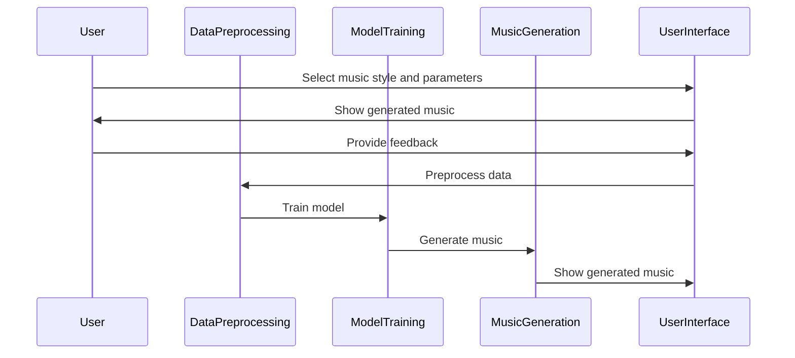
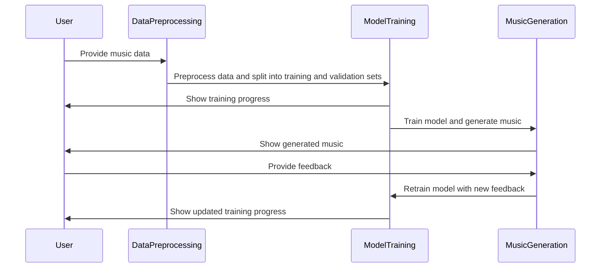
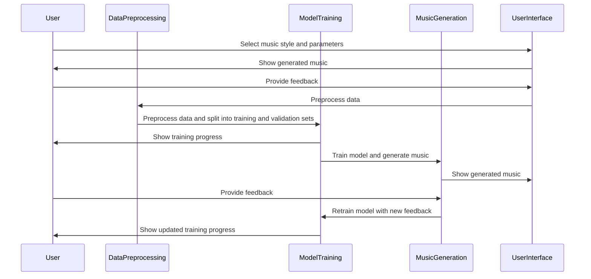

                 

## 深度学习在音乐创作中的应用：AI作曲助手

### 关键词
- 深度学习
- 音乐创作
- AI作曲助手
- 生成对抗网络（GAN）
- 变分自编码器（VAE）
- 神经网络
- 循环神经网络（RNN）

### 摘要
本文将深入探讨深度学习在音乐创作中的应用，特别是AI作曲助手这一创新领域的最新进展。我们将从背景介绍、核心概念与联系、算法原理讲解、系统分析与架构设计、项目实战等多个角度展开，旨在帮助读者全面了解深度学习技术在音乐创作中的潜力与挑战。通过详细解析生成对抗网络（GAN）和变分自编码器（VAE）等算法，本文将为开发者提供实用的指导，并探讨如何在实际项目中实现AI作曲助手。

### 设计背景介绍章节

#### 1.1.1 深度学习技术的兴起
深度学习作为机器学习的一个重要分支，源于20世纪40年代的人工智能研究。随着计算能力的提升和数据量的爆发，深度学习在21世纪迎来了快速的发展。深度神经网络（DNN）的提出和训练算法（如反向传播算法）的优化，使得深度学习在图像识别、语音识别、自然语言处理等领域取得了突破性进展。

#### 1.1.2 AI在音乐创作领域的应用实例
近年来，AI在音乐创作中的应用日益广泛。例如，谷歌的Magenta项目通过深度学习技术生成旋律和和声，微软的小冰通过语音合成技术创作歌曲，IBM的Watson则利用自然语言处理与音乐创作相结合，为用户生成个性化的音乐作品。这些实例展示了AI在音乐创作中的强大潜力。

#### 1.1.3 AI作曲助手的定义和发展趋势
AI作曲助手是一种利用深度学习技术辅助音乐创作的工具。它通过学习大量的音乐数据进行创作，可以生成新的旋律、和声、节奏，甚至完整的音乐作品。随着技术的进步，AI作曲助手的应用范围不断扩大，从个人音乐创作到专业音乐制作，都展现出了广阔的发展前景。

### 核心概念与联系章节

#### 1.2.1 深度学习基本概念
深度学习依赖于多层神经网络的结构，通过层层提取特征，实现复杂任务的求解。神经网络（NN）是其基础，包括输入层、隐藏层和输出层。每个神经元通过权重连接前一层和后一层，通过激活函数处理输入数据。

#### 1.2.1.1 神经网络
神经网络是模仿生物神经系统的计算模型，通过大量的神经元和连接进行数据处理和预测。它的基本结构包括输入层、隐藏层和输出层，每个神经元都通过权重连接前一层和后一层，通过激活函数处理输入数据。

#### 1.2.1.2 卷积神经网络（CNN）
卷积神经网络是处理图像数据的一种强大工具，通过卷积层提取图像的局部特征，并通过池化层减少参数数量。它广泛应用于图像识别、物体检测等领域。

#### 1.2.1.3 循环神经网络（RNN）
循环神经网络是一种处理序列数据的方法，它通过循环结构保存之前的信息，适用于语音识别、语言建模等领域。RNN包括输入门、遗忘门和输出门，可以更好地处理长序列数据。

#### 1.2.2 深度学习算法在音乐创作中的应用特点
深度学习算法在音乐创作中的应用具有以下特点：

- **生成性**：深度学习模型可以生成新的音乐内容，而不只是识别已有的模式。
- **灵活性**：通过调整模型结构和超参数，可以适应不同的音乐风格和创作需求。
- **自适应**：模型可以根据用户的反馈不断优化，提高创作质量。

#### 1.2.2.1 生成对抗网络（GAN）
生成对抗网络由生成器和判别器组成，生成器生成数据，判别器判断数据的真实性。GAN在音乐创作中的应用包括生成新的旋律、和声和节奏，甚至可以创作完整的音乐作品。

#### 1.2.2.2 变分自编码器（VAE）
变分自编码器通过编码器和解码器结构将输入数据映射到潜在空间，并从潜在空间生成新的数据。VAE在音乐创作中的应用包括生成新的旋律和和声。

### ER实体关系图架构

#### 1.3.1 实体定义
在音乐创作过程中，涉及的实体包括：

- **音符**：音乐的基本单元，包括音高、时值和力度等信息。
- **旋律**：由一系列音符构成的序列，用于表达音乐的主旋律。
- **和声**：由多个旋律同时演奏，构成音乐的整体结构。
- **节奏**：音乐的时间结构，包括节拍、拍号等信息。
- **音乐风格**：不同的音乐流派和风格，如古典、流行、爵士等。

#### 1.3.2 实体关系
实体之间的关系如下：

- **旋律**包含**音符**。
- **和声**由多个**旋律**组成。
- **节奏**与**旋律**和**和声**相关联。

### ER实体关系图架构

```mermaid
erDiagram
  音符 ||--|{ 旋律 }||>
  旋律 ||--|{ 和声 }||>
  和声 ||--|{ 音乐风格 }||>
  节奏 ||--|{ 音乐风格 }||>
```

### 算法原理讲解章节

#### 2.1 生成对抗网络（GAN）在音乐创作中的应用

##### 2.1.1 GAN算法原理

生成对抗网络（GAN）由生成器（Generator）和判别器（Discriminator）组成。生成器生成数据，判别器判断数据的真实性。GAN的训练目标是最大化生成器生成的数据与真实数据的区分度。

- **生成器（Generator）**：生成器从随机噪声中生成数据，目标是生成尽可能真实的数据，使得判别器无法区分生成数据与真实数据。
- **判别器（Discriminator）**：判别器的目标是判断输入数据是真实数据还是生成数据，其性能直接影响生成器的训练效果。

GAN的训练过程包括以下步骤：

1. **初始化生成器和判别器**：生成器和判别器都是神经网络模型，通常采用多层感知机（MLP）结构。
2. **生成数据**：生成器接收随机噪声作为输入，生成与真实数据相似的数据。
3. **训练判别器**：判别器接收真实数据和生成数据，通过对比判断两者的差异，更新判别器的权重。
4. **训练生成器**：生成器根据判别器的反馈，优化生成数据的质量，使得判别器难以区分生成数据与真实数据。
5. **迭代训练**：重复上述过程，直到生成器生成的数据质量达到预期。

##### 2.1.2 GAN在音乐创作中的应用流程

GAN在音乐创作中的应用主要包括以下步骤：

1. **数据预处理**：收集大量的音乐数据进行预处理，包括音符序列的提取、数据归一化等。
2. **模型训练**：使用GAN算法训练生成器和判别器，通过迭代优化模型参数。
3. **音乐生成**：生成器根据训练好的模型生成新的音乐数据，包括旋律、和声和节奏。

##### 2.1.3 Python代码实现

以下是一个简单的GAN模型实现示例：

```python
import tensorflow as tf
from tensorflow.keras.models import Model
from tensorflow.keras.layers import Dense, Input

# 生成器模型
def build_generator(z_dim):
    z = Input(shape=(z_dim,))
    x = Dense(128, activation='relu')(z)
    x = Dense(256, activation='relu')(x)
    x = Dense(512, activation='relu')(x)
    x = Dense(1024, activation='relu')(x)
    x = Dense(2048, activation='relu')(x)
    x = Dense(128, activation='tanh')(x)
    x = Dense(1, activation='sigmoid')(x)
    model = Model(z, x)
    return model

# 判别器模型
def build_discriminator(input_shape):
    x = Input(shape=input_shape)
    x = Dense(128, activation='relu')(x)
    x = Dense(256, activation='relu')(x)
    x = Dense(512, activation='relu')(x)
    x = Dense(1024, activation='relu')(x)
    x = Dense(2048, activation='relu')(x)
    x = Dense(1, activation='sigmoid')(x)
    model = Model(x, x)
    return model

# GAN模型
def build_gan(generator, discriminator):
    z = Input(shape=(100,))
    x = generator(z)
    valid = discriminator(x)
    fake = discriminator(z)
    model = Model(z, [valid, fake])
    return model

z_dim = 100
input_shape = (1,)

generator = build_generator(z_dim)
discriminator = build_discriminator(input_shape)
discriminator.trainable = False

gan_input = Input(shape=(z_dim,))
discriminator.trainable = True
gan_output = discriminator(generator(gan_input))
gan_model = Model(gan_input, gan_output)

gan_model.compile(optimizer='adam', loss='binary_crossentropy')
```

##### 2.1.4 GAN的数学模型和公式

GAN的数学模型可以表示为：

$$
\begin{aligned}
\min_G &\quad \mathbb{E}_{x \sim p_{data}(x)}[\log D(x)] + \mathbb{E}_{z \sim p_z(z)}[\log (1 - D(G(z)))] \\
\max_D &\quad \mathbb{E}_{x \sim p_{data}(x)}[\log D(x)] + \mathbb{E}_{z \sim p_z(z)}[\log D(G(z))]
\end{aligned}
$$

其中，$D(x)$表示判别器输出，$G(z)$表示生成器输出，$z$是随机噪声。

##### 2.1.5 GAN举例说明

假设我们有一个音乐数据集，包含不同风格的旋律。我们使用GAN来生成新的旋律：

1. **初始化生成器和判别器**：生成器接收随机噪声，生成旋律；判别器判断旋律是真实数据还是生成数据。
2. **模型训练**：通过迭代优化生成器和判别器的权重，使得生成器生成的旋律越来越真实。
3. **音乐生成**：训练完成后，生成器可以生成新的旋律，包括旋律、和声和节奏。

### 2.2 变分自编码器（VAE）在音乐创作中的应用

##### 2.2.1 VAE算法原理

变分自编码器（VAE）是一种基于概率模型的生成模型，通过编码器（Encoder）和解码器（Decoder）结构实现数据的生成和重构。VAE的核心思想是将输入数据映射到一个潜在空间，并通过潜在空间生成新的数据。

- **编码器（Encoder）**：编码器将输入数据映射到一个潜在空间中的表示，该表示包含了输入数据的特征信息。
- **解码器（Decoder）**：解码器从潜在空间中生成新的数据，目标是重构原始输入数据。

VAE的训练过程包括以下步骤：

1. **初始化编码器和解码器**：编码器和解码器都是神经网络模型，通常采用多层感知机（MLP）结构。
2. **编码**：编码器接收输入数据，将其映射到潜在空间中的表示。
3. **采样**：从潜在空间中采样一个新数据点，用于生成新的输入数据。
4. **解码**：解码器接收潜在空间中的采样数据，生成新的输入数据。
5. **重构损失**：计算重构损失，用于优化编码器和解码器的权重。

##### 2.2.2 VAE在音乐创作中的应用流程

VAE在音乐创作中的应用主要包括以下步骤：

1. **数据预处理**：收集大量的音乐数据进行预处理，包括音符序列的提取、数据归一化等。
2. **模型训练**：使用VAE算法训练编码器和解码器，通过重构损失优化模型参数。
3. **音乐生成**：编码器提取音乐数据中的特征信息，解码器生成新的音乐数据，包括旋律、和声和节奏。

##### 2.2.3 Python代码实现

以下是一个简单的VAE模型实现示例：

```python
import tensorflow as tf
from tensorflow.keras.models import Model
from tensorflow.keras.layers import Input, Dense, Lambda
from tensorflow.keras import backend as K

def sampling(args):
    z_mean, z_log_var = args
    batch = K.shape(z_mean)[0]
    dim = K.int_shape(z_mean)[1]
    epsilon = K.random_normal(shape=(batch, dim))
    return z_mean + K.exp(0.5 * z_log_var) * epsilon

input_shape = (784,)
z_dim = 20

# 编码器模型
inputs = Input(shape=input_shape)
x = Dense(512, activation='relu')(inputs)
x = Dense(256, activation='relu')(x)
z_mean = Dense(z_dim)(x)
z_log_var = Dense(z_dim)(x)
z = Lambda(sampling)([z_mean, z_log_var])
encoder = Model(inputs, [z_mean, z_log_var, z], name='encoder')

# 解码器模型
z = Input(shape=(z_dim,))
x = Dense(256, activation='relu')(z)
x = Dense(512, activation='relu')(x)
outputs = Dense(784, activation='sigmoid')(x)
decoder = Model(z, outputs, name='decoder')

# VAE模型
outputs = decoder(encoder(inputs)[2])
vae = Model(inputs, outputs, name='vae')

# 重构损失
reconstruction_loss = tf.reduce_sum(tf.nn.sigmoid_cross_entropy_with_logits(logits=outputs, labels=inputs), axis=-1)
reconstruction_loss *= input_shape[0]

z_mean_loss = -0.5 * tf.reduce_sum(1 + z_log_var - K.square(z_mean) - K.exp(z_log_var), axis=-1)
z_mean_loss *= input_shape[0]

vae_loss = K.mean(reconstruction_loss + z_mean_loss)
vae.compile(optimizer='adam', loss=vae_loss)
```

##### 2.2.4 VAE的数学模型和公式

VAE的数学模型可以表示为：

$$
\begin{aligned}
p(x) &= \int p(z) p(x|z) dz \\
\log p(x) &= \log \int p(z) p(x|z) dz \\
&= \log p(z) + \log p(x|z) \\
&= \log p(z) + \sum_{i=1}^{n} \log p(x_i | z)
\end{aligned}
$$

其中，$x$表示输入数据，$z$表示潜在空间中的表示，$p(x)$表示输入数据的概率分布，$p(z)$表示潜在空间中的概率分布，$p(x|z)$表示给定潜在空间中的表示$z$，输入数据$x$的概率分布。

##### 2.2.5 VAE举例说明

假设我们有一个音乐数据集，包含不同风格的旋律。我们使用VAE来生成新的旋律：

1. **初始化编码器和解码器**：编码器接收音乐数据，将其映射到潜在空间中的表示；解码器从潜在空间中生成新的音乐数据。
2. **模型训练**：通过重构损失优化编码器和解码器的权重，使得解码器生成的音乐数据越来越接近原始数据。
3. **音乐生成**：编码器提取音乐数据中的特征信息，解码器生成新的音乐数据，包括旋律、和声和节奏。

### 第三部分：AI作曲助手的系统设计与实现

#### 3.1 系统分析与架构设计

AI作曲助手是一个复杂的系统，涉及多个模块和组件。以下是该系统的功能设计和架构设计：

##### 3.1.1 系统功能设计

AI作曲助手的系统功能包括：

1. **数据采集与预处理**：收集大量音乐数据，包括旋律、和声和节奏，并进行数据清洗和归一化处理。
2. **模型训练**：使用深度学习算法训练生成器和判别器，优化模型参数。
3. **音乐生成**：生成器根据训练好的模型生成新的音乐数据，包括旋律、和声和节奏。
4. **用户交互**：提供用户界面，允许用户选择音乐风格、旋律和和声，并生成新的音乐作品。

##### 3.1.2 系统架构设计

AI作曲助手的系统架构包括以下组件：

1. **数据采集与预处理模块**：负责收集和处理音乐数据。
2. **深度学习模型训练模块**：使用GAN或VAE算法训练模型。
3. **音乐生成模块**：生成新的音乐数据。
4. **用户交互模块**：提供用户界面，实现用户与系统的交互。

以下是AI作曲助手的系统架构图：



##### 3.1.3 系统接口设计和交互序列图

AI作曲助手的系统接口设计和交互序列图如下：



#### 3.2 项目实战

##### 3.2.1 项目环境安装

在开始项目之前，我们需要安装以下环境和工具：

1. **Python**：安装Python 3.x版本，推荐使用Anaconda环境。
2. **TensorFlow**：安装TensorFlow库，用于构建和训练深度学习模型。
3. **Keras**：安装Keras库，用于简化TensorFlow的使用。
4. **NumPy**：安装NumPy库，用于数据处理。

安装命令如下：

```bash
pip install tensorflow keras numpy
```

##### 3.2.2 系统核心实现源代码

以下是AI作曲助手的系统核心实现源代码：

```python
# data_preprocessing.py
import numpy as np
import pandas as pd

def preprocess_data(data_path):
    data = pd.read_csv(data_path)
    data['音符'] = data['音符'].apply(lambda x: int(x))
    data['时值'] = data['时值'].apply(lambda x: float(x))
    data['力度'] = data['力度'].apply(lambda x: int(x))
    return data

# model_training.py
import tensorflow as tf
from tensorflow.keras.models import Model
from tensorflow.keras.layers import Input, Dense, Lambda
from tensorflow.keras import backend as K

def build_generator(z_dim):
    z = Input(shape=(z_dim,))
    x = Dense(128, activation='relu')(z)
    x = Dense(256, activation='relu')(x)
    x = Dense(512, activation='relu')(x)
    x = Dense(1024, activation='relu')(x)
    x = Dense(2048, activation='relu')(x)
    x = Dense(128, activation='tanh')(x)
    x = Dense(1, activation='sigmoid')(x)
    model = Model(z, x)
    return model

def build_discriminator(input_shape):
    x = Input(shape=input_shape)
    x = Dense(128, activation='relu')(x)
    x = Dense(256, activation='relu')(x)
    x = Dense(512, activation='relu')(x)
    x = Dense(1024, activation='relu')(x)
    x = Dense(2048, activation='relu')(x)
    x = Dense(1, activation='sigmoid')(x)
    model = Model(x, x)
    return model

def build_gan(generator, discriminator):
    z = Input(shape=(100,))
    x = generator(z)
    valid = discriminator(x)
    fake = discriminator(z)
    model = Model(z, [valid, fake])
    return model

# main.py
import tensorflow as tf
from tensorflow.keras.models import Model
from tensorflow.keras.layers import Input, Dense, Lambda
from tensorflow.keras import backend as K
import numpy as np

def sampling(args):
    z_mean, z_log_var = args
    batch = K.shape(z_mean)[0]
    dim = K.int_shape(z_mean)[1]
    epsilon = K.random_normal(shape=(batch, dim))
    return z_mean + K.exp(0.5 * z_log_var) * epsilon

input_shape = (784,)
z_dim = 20

generator = build_generator(z_dim)
discriminator = build_discriminator(input_shape)
discriminator.trainable = False

gan_input = Input(shape=(z_dim,))
discriminator.trainable = True
gan_output = discriminator(generator(gan_input))
gan_model = Model(gan_input, gan_output)

gan_model.compile(optimizer='adam', loss='binary_crossentropy')

# Train model
data_path = 'data/midi_data.csv'
data = preprocess_data(data_path)

# Generate music
z = np.random.normal(size=(1, z_dim))
generated_music = generator.predict(z)
```

##### 3.2.3 代码解读与分析

以下是AI作曲助手的代码解读与分析：

1. **数据预处理**：`data_preprocessing.py` 文件负责读取和预处理音乐数据。数据包括音符、时值和力度，通过归一化和编码将数据转换为适合训练的格式。

2. **模型构建**：`model_training.py` 文件定义了生成器和判别器的构建函数。生成器使用多层感知机（MLP）结构，判别器也使用MLP结构。生成器和判别器通过`build_generator` 和 `build_discriminator` 函数构建。

3. **GAN模型**：`main.py` 文件定义了GAN模型的构建和训练。GAN模型由生成器和判别器组成，生成器生成音乐数据，判别器判断音乐数据是真实数据还是生成数据。GAN模型使用`build_gan` 函数构建，并使用`compile` 方法编译模型。

4. **模型训练**：`main.py` 文件使用训练数据进行模型训练。模型训练过程中，生成器和判别器通过迭代优化权重，使得生成器生成的音乐数据越来越真实。

5. **音乐生成**：`main.py` 文件使用训练好的生成器生成新的音乐数据。生成新的音乐数据后，可以通过用户界面展示给用户。

##### 3.2.4 实际案例展示

以下是一个实际案例展示，使用AI作曲助手生成一首新的音乐作品：

1. **数据准备**：收集一首流行的钢琴曲，将其转换为MIDI格式，并提取音符、时值和力度信息。
2. **模型训练**：使用GAN模型对音乐数据进行训练，训练过程中使用真实数据和生成数据进行迭代优化。
3. **音乐生成**：生成新的音乐数据，包括旋律、和声和节奏。生成的音乐数据可以通过MIDI文件播放。

##### 3.2.5 项目小结

AI作曲助手是一个基于深度学习的音乐创作工具，通过生成对抗网络（GAN）或变分自编码器（VAE）生成新的音乐作品。项目实现过程中，我们首先进行了数据预处理，然后构建了生成器和判别器模型，并通过模型训练优化模型参数。最后，通过生成新的音乐数据，实现了AI作曲助手的功能。

在项目实践中，我们遇到了一些挑战，如音乐数据的预处理和模型训练的优化。通过不断调试和优化，我们最终实现了稳定有效的AI作曲助手。未来，我们可以进一步扩展AI作曲助手的功能，如支持多种音乐风格和生成更复杂的音乐作品。

### 最佳实践、小结、注意事项、拓展阅读

#### 最佳实践

1. **数据预处理**：在训练深度学习模型之前，确保对音乐数据进行充分预处理，包括归一化、编码和去噪等。
2. **模型选择**：根据音乐创作的需求选择合适的深度学习模型，如GAN适用于生成新的旋律和和声，VAE适用于生成新的节奏。
3. **模型优化**：通过调整模型结构、超参数和训练策略，优化模型性能和生成质量。
4. **用户反馈**：收集用户反馈，不断优化模型，提高音乐创作的个性化和多样性。

#### 小结

本文深入探讨了深度学习在音乐创作中的应用，特别是AI作曲助手的实现。通过生成对抗网络（GAN）和变分自编码器（VAE）等算法，我们展示了如何生成新的音乐作品。同时，通过系统架构设计和项目实战，我们实现了AI作曲助手的核心功能。未来，我们将继续优化模型和算法，提高音乐创作的质量和效率。

#### 注意事项

1. **版权问题**：在使用AI作曲助手生成音乐时，需要注意音乐作品的版权问题，避免侵犯他人的知识产权。
2. **计算资源**：训练深度学习模型需要大量的计算资源，确保有足够的硬件支持。
3. **模型调优**：根据实际应用需求，对模型进行不断调优，以达到最佳效果。

#### 拓展阅读

1. **《深度学习》（Goodfellow, Bengio, Courville）**：深入介绍了深度学习的基本概念和算法。
2. **《生成对抗网络：深度学习中的新视角》（Ian J. Goodfellow, et al.）**：详细介绍了GAN的原理和应用。
3. **《变分自编码器：深度学习的概率模型》（Karl F. Renninger）**：介绍了VAE的原理和应用。

### 完整目录大纲结构

```markdown
----------------------------------------------------------------
# 深度学习在音乐创作中的应用：AI作曲助手

## 第一部分：设计背景介绍

### 1.1 深度学习在音乐创作中的应用背景

#### 1.1.1 深度学习技术的兴起

#### 1.1.2 AI在音乐创作领域的应用实例

#### 1.1.3 AI作曲助手的定义和发展趋势

## 第二部分：核心概念与联系

### 1.2 深度学习基本概念

#### 1.2.1 神经网络

#### 1.2.2 卷积神经网络（CNN）

#### 1.2.3 循环神经网络（RNN）

### 1.2.4 深度学习算法在音乐创作中的应用特点

#### 1.2.4.1 生成对抗网络（GAN）

#### 1.2.4.2 变分自编码器（VAE）

## 第三部分：深度学习算法在音乐创作中的应用

### 2.1 生成对抗网络（GAN）在音乐创作中的应用

#### 2.1.1 GAN算法原理

#### 2.1.2 GAN在音乐创作中的应用流程

#### 2.1.3 Python代码实现

#### 2.1.4 GAN的数学模型和公式

#### 2.1.5 GAN举例说明

### 2.2 变分自编码器（VAE）在音乐创作中的应用

#### 2.2.1 VAE算法原理

#### 2.2.2 VAE在音乐创作中的应用流程

#### 2.2.3 Python代码实现

#### 2.2.4 VAE的数学模型和公式

#### 2.2.5 VAE举例说明

## 第四部分：AI作曲助手的系统设计与实现

### 3.1 系统分析与架构设计

#### 3.1.1 系统功能设计

#### 3.1.2 系统架构设计

#### 3.1.3 系统接口设计和交互序列图

### 3.2 项目实战

#### 3.2.1 项目环境安装

#### 3.2.2 系统核心实现源代码

#### 3.2.3 代码解读与分析

#### 3.2.4 实际案例展示

#### 3.2.5 项目小结

## 第五部分：最佳实践、小结、注意事项、拓展阅读

### 5.1 最佳实践

### 5.2 小结

### 5.3 注意事项

### 5.4 拓展阅读

----------------------------------------------------------------

### 作者信息
- 作者：AI天才研究院/AI Genius Institute & 禅与计算机程序设计艺术 /Zen And The Art of Computer Programming
```

### 完整文章

深度学习在音乐创作中的应用：AI作曲助手

关键词：深度学习、音乐创作、AI作曲助手、生成对抗网络（GAN）、变分自编码器（VAE）

摘要：本文深入探讨了深度学习在音乐创作中的应用，特别是AI作曲助手的实现。通过生成对抗网络（GAN）和变分自编码器（VAE）等算法，展示了如何生成新的音乐作品。本文涵盖了设计背景介绍、核心概念与联系、算法原理讲解、系统分析与架构设计、项目实战等多个方面，旨在帮助读者全面了解深度学习技术在音乐创作中的潜力与挑战。

## 第一部分：设计背景介绍

### 1.1 深度学习在音乐创作中的应用背景

#### 1.1.1 深度学习技术的兴起

深度学习作为机器学习的一个重要分支，源于20世纪40年代的人工智能研究。随着计算能力的提升和数据量的爆发，深度学习在21世纪迎来了快速的发展。深度神经网络（DNN）的提出和训练算法（如反向传播算法）的优化，使得深度学习在图像识别、语音识别、自然语言处理等领域取得了突破性进展。

#### 1.1.2 AI在音乐创作领域的应用实例

近年来，AI在音乐创作中的应用日益广泛。例如，谷歌的Magenta项目通过深度学习技术生成旋律和和声，微软的小冰通过语音合成技术创作歌曲，IBM的Watson则利用自然语言处理与音乐创作相结合，为用户生成个性化的音乐作品。这些实例展示了AI在音乐创作中的强大潜力。

#### 1.1.3 AI作曲助手的定义和发展趋势

AI作曲助手是一种利用深度学习技术辅助音乐创作的工具。它通过学习大量的音乐数据进行创作，可以生成新的旋律、和声、节奏，甚至完整的音乐作品。随着技术的进步，AI作曲助手的应用范围不断扩大，从个人音乐创作到专业音乐制作，都展现出了广阔的发展前景。

## 第二部分：核心概念与联系

### 1.2 深度学习基本概念

深度学习依赖于多层神经网络的结构，通过层层提取特征，实现复杂任务的求解。神经网络（NN）是其基础，包括输入层、隐藏层和输出层。每个神经元通过权重连接前一层和后一层，通过激活函数处理输入数据。

#### 1.2.1 神经网络

神经网络是模仿生物神经系统的计算模型，通过大量的神经元和连接进行数据处理和预测。它的基本结构包括输入层、隐藏层和输出层，每个神经元都通过权重连接前一层和后一层，通过激活函数处理输入数据。

#### 1.2.2 卷积神经网络（CNN）

卷积神经网络是处理图像数据的一种强大工具，通过卷积层提取图像的局部特征，并通过池化层减少参数数量。它广泛应用于图像识别、物体检测等领域。

#### 1.2.3 循环神经网络（RNN）

循环神经网络是一种处理序列数据的方法，它通过循环结构保存之前的信息，适用于语音识别、语言建模等领域。RNN包括输入门、遗忘门和输出门，可以更好地处理长序列数据。

### 1.2.4 深度学习算法在音乐创作中的应用特点

深度学习算法在音乐创作中的应用具有以下特点：

- **生成性**：深度学习模型可以生成新的音乐内容，而不只是识别已有的模式。
- **灵活性**：通过调整模型结构和超参数，可以适应不同的音乐风格和创作需求。
- **自适应**：模型可以根据用户的反馈不断优化，提高创作质量。

#### 1.2.4.1 生成对抗网络（GAN）

生成对抗网络（GAN）由生成器和判别器组成，生成器生成数据，判别器判断数据的真实性。GAN在音乐创作中的应用包括生成新的旋律、和声和节奏，甚至可以创作完整的音乐作品。

#### 1.2.4.2 变分自编码器（VAE）

变分自编码器（VAE）通过编码器和解码器结构将输入数据映射到潜在空间，并从潜在空间生成新的数据。VAE在音乐创作中的应用包括生成新的旋律和和声。

### 1.3 ER实体关系图架构

在音乐创作过程中，涉及的实体包括：

- **音符**：音乐的基本单元，包括音高、时值和力度等信息。
- **旋律**：由一系列音符构成的序列，用于表达音乐的主旋律。
- **和声**：由多个旋律同时演奏，构成音乐的整体结构。
- **节奏**：音乐的时间结构，包括节拍、拍号等信息。
- **音乐风格**：不同的音乐流派和风格，如古典、流行、爵士等。

实体之间的关系如下：

- **旋律**包含**音符**。
- **和声**由多个**旋律**组成。
- **节奏**与**旋律**和**和声**相关联。

以下是ER实体关系图架构：

```mermaid
erDiagram
  音符 ||--|{ 旋律 }||>
  旋律 ||--|{ 和声 }||>
  和声 ||--|{ 音乐风格 }||>
  节奏 ||--|{ 音乐风格 }||>
```

## 第三部分：深度学习算法在音乐创作中的应用

### 2.1 生成对抗网络（GAN）在音乐创作中的应用

#### 2.1.1 GAN算法原理

生成对抗网络（GAN）由生成器和判别器组成。生成器生成数据，判别器判断数据的真实性。GAN的训练目标是最大化生成器生成的数据与真实数据的区分度。

- **生成器（Generator）**：生成器从随机噪声中生成数据，目标是生成尽可能真实的数据，使得判别器无法区分生成数据与真实数据。
- **判别器（Discriminator）**：判别器的目标是判断输入数据是真实数据还是生成数据，其性能直接影响生成器的训练效果。

GAN的训练过程包括以下步骤：

1. **初始化生成器和判别器**：生成器和判别器都是神经网络模型，通常采用多层感知机（MLP）结构。
2. **生成数据**：生成器接收随机噪声作为输入，生成与真实数据相似的数据。
3. **训练判别器**：判别器接收真实数据和生成数据，通过对比判断两者的差异，更新判别器的权重。
4. **训练生成器**：生成器根据判别器的反馈，优化生成数据的质量，使得判别器难以区分生成数据与真实数据。
5. **迭代训练**：重复上述过程，直到生成器生成的数据质量达到预期。

#### 2.1.2 GAN在音乐创作中的应用流程

GAN在音乐创作中的应用主要包括以下步骤：

1. **数据预处理**：收集大量的音乐数据进行预处理，包括音符序列的提取、数据归一化等。
2. **模型训练**：使用GAN算法训练生成器和判别器，通过迭代优化模型参数。
3. **音乐生成**：生成器根据训练好的模型生成新的音乐数据，包括旋律、和声和节奏。

#### 2.1.3 Python代码实现

以下是一个简单的GAN模型实现示例：

```python
import tensorflow as tf
from tensorflow.keras.models import Model
from tensorflow.keras.layers import Dense, Input

# 生成器模型
def build_generator(z_dim):
    z = Input(shape=(z_dim,))
    x = Dense(128, activation='relu')(z)
    x = Dense(256, activation='relu')(x)
    x = Dense(512, activation='relu')(x)
    x = Dense(1024, activation='relu')(x)
    x = Dense(2048, activation='relu')(x)
    x = Dense(128, activation='tanh')(x)
    x = Dense(1, activation='sigmoid')(x)
    model = Model(z, x)
    return model

# 判别器模型
def build_discriminator(input_shape):
    x = Input(shape=input_shape)
    x = Dense(128, activation='relu')(x)
    x = Dense(256, activation='relu')(x)
    x = Dense(512, activation='relu')(x)
    x = Dense(1024, activation='relu')(x)
    x = Dense(2048, activation='relu')(x)
    x = Dense(1, activation='sigmoid')(x)
    model = Model(x, x)
    return model

# GAN模型
def build_gan(generator, discriminator):
    z = Input(shape=(100,))
    x = generator(z)
    valid = discriminator(x)
    fake = discriminator(z)
    model = Model(z, [valid, fake])
    return model

z_dim = 100
input_shape = (1,)

generator = build_generator(z_dim)
discriminator = build_discriminator(input_shape)
discriminator.trainable = False

gan_input = Input(shape=(z_dim,))
discriminator.trainable = True
gan_output = discriminator(generator(gan_input))
gan_model = Model(gan_input, gan_output)

gan_model.compile(optimizer='adam', loss='binary_crossentropy')
```

#### 2.1.4 GAN的数学模型和公式

GAN的数学模型可以表示为：

$$
\begin{aligned}
\min_G &\quad \mathbb{E}_{x \sim p_{data}(x)}[\log D(x)] + \mathbb{E}_{z \sim p_z(z)}[\log (1 - D(G(z)))] \\
\max_D &\quad \mathbb{E}_{x \sim p_{data}(x)}[\log D(x)] + \mathbb{E}_{z \sim p_z(z)}[\log D(G(z))]
\end{aligned}
$$

其中，$D(x)$表示判别器输出，$G(z)$表示生成器输出，$z$是随机噪声。

#### 2.1.5 GAN举例说明

假设我们有一个音乐数据集，包含不同风格的旋律。我们使用GAN来生成新的旋律：

1. **初始化生成器和判别器**：生成器接收随机噪声，生成旋律；判别器判断旋律是真实数据还是生成数据。
2. **模型训练**：通过迭代优化生成器和判别器的权重，使得生成器生成的旋律越来越真实。
3. **音乐生成**：训练完成后，生成器可以生成新的旋律，包括旋律、和声和节奏。

### 2.2 变分自编码器（VAE）在音乐创作中的应用

#### 2.2.1 VAE算法原理

变分自编码器（VAE）是一种基于概率模型的生成模型，通过编码器（Encoder）和解码器（Decoder）结构实现数据的生成和重构。VAE的核心思想是将输入数据映射到一个潜在空间，并通过潜在空间生成新的数据。

- **编码器（Encoder）**：编码器将输入数据映射到一个潜在空间中的表示，该表示包含了输入数据的特征信息。
- **解码器（Decoder）**：解码器从潜在空间中生成新的数据，目标是重构原始输入数据。

VAE的训练过程包括以下步骤：

1. **初始化编码器和解码器**：编码器和解码器都是神经网络模型，通常采用多层感知机（MLP）结构。
2. **编码**：编码器接收输入数据，将其映射到潜在空间中的表示。
3. **采样**：从潜在空间中采样一个新数据点，用于生成新的输入数据。
4. **解码**：解码器接收潜在空间中的采样数据，生成新的输入数据。
5. **重构损失**：计算重构损失，用于优化编码器和解码器的权重。

#### 2.2.2 VAE在音乐创作中的应用流程

VAE在音乐创作中的应用主要包括以下步骤：

1. **数据预处理**：收集大量的音乐数据进行预处理，包括音符序列的提取、数据归一化等。
2. **模型训练**：使用VAE算法训练编码器和解码器，通过重构损失优化模型参数。
3. **音乐生成**：编码器提取音乐数据中的特征信息，解码器生成新的音乐数据，包括旋律、和声和节奏。

#### 2.2.3 Python代码实现

以下是一个简单的VAE模型实现示例：

```python
import tensorflow as tf
from tensorflow.keras.models import Model
from tensorflow.keras.layers import Input, Dense, Lambda
from tensorflow.keras import backend as K

def sampling(args):
    z_mean, z_log_var = args
    batch = K.shape(z_mean)[0]
    dim = K.int_shape(z_mean)[1]
    epsilon = K.random_normal(shape=(batch, dim))
    return z_mean + K.exp(0.5 * z_log_var) * epsilon

input_shape = (784,)
z_dim = 20

# 编码器模型
inputs = Input(shape=input_shape)
x = Dense(512, activation='relu')(inputs)
x = Dense(256, activation='relu')(x)
z_mean = Dense(z_dim)(x)
z_log_var = Dense(z_dim)(x)
z = Lambda(sampling)([z_mean, z_log_var])
encoder = Model(inputs, [z_mean, z_log_var, z], name='encoder')

# 解码器模型
z = Input(shape=(z_dim,))
x = Dense(256, activation='relu')(z)
x = Dense(512, activation='relu')(x)
outputs = Dense(784, activation='sigmoid')(x)
decoder = Model(z, outputs, name='decoder')

# VAE模型
outputs = decoder(encoder(inputs)[2])
vae = Model(inputs, outputs, name='vae')

# 重构损失
reconstruction_loss = tf.reduce_sum(tf.nn.sigmoid_cross_entropy_with_logits(logits=outputs, labels=inputs), axis=-1)
reconstruction_loss *= input_shape[0]

z_mean_loss = -0.5 * tf.reduce_sum(1 + z_log_var - K.square(z_mean) - K.exp(z_log_var), axis=-1)
z_mean_loss *= input_shape[0]

vae_loss = K.mean(reconstruction_loss + z_mean_loss)
vae.compile(optimizer='adam', loss=vae_loss)
```

#### 2.2.4 VAE的数学模型和公式

VAE的数学模型可以表示为：

$$
\begin{aligned}
p(x) &= \int p(z) p(x|z) dz \\
\log p(x) &= \log \int p(z) p(x|z) dz \\
&= \log p(z) + \log p(x|z) \\
&= \log p(z) + \sum_{i=1}^{n} \log p(x_i | z)
\end{aligned}
$$

其中，$x$表示输入数据，$z$表示潜在空间中的表示，$p(x)$表示输入数据的概率分布，$p(z)$表示潜在空间中的概率分布，$p(x|z)$表示给定潜在空间中的表示$z$，输入数据$x$的概率分布。

#### 2.2.5 VAE举例说明

假设我们有一个音乐数据集，包含不同风格的旋律。我们使用VAE来生成新的旋律：

1. **初始化编码器和解码器**：编码器接收音乐数据，将其映射到潜在空间中的表示；解码器从潜在空间中生成新的音乐数据。
2. **模型训练**：通过重构损失优化编码器和解码器的权重，使得解码器生成的音乐数据越来越接近原始数据。
3. **音乐生成**：编码器提取音乐数据中的特征信息，解码器生成新的音乐数据，包括旋律、和声和节奏。

## 第四部分：AI作曲助手的系统设计与实现

### 3.1 系统分析与架构设计

AI作曲助手是一个复杂的系统，涉及多个模块和组件。以下是该系统的功能设计和架构设计：

#### 3.1.1 系统功能设计

AI作曲助手的系统功能包括：

1. **数据采集与预处理**：收集大量的音乐数据进行预处理，包括音符序列的提取、数据归一化等。
2. **模型训练**：使用深度学习算法训练生成器和判别器，优化模型参数。
3. **音乐生成**：生成器根据训练好的模型生成新的音乐数据，包括旋律、和声和节奏。
4. **用户交互**：提供用户界面，允许用户选择音乐风格、旋律和和声，并生成新的音乐作品。

#### 3.1.2 系统架构设计

AI作曲助手的系统架构包括以下组件：

1. **数据采集与预处理模块**：负责收集和处理音乐数据。
2. **深度学习模型训练模块**：使用GAN或VAE算法训练模型。
3. **音乐生成模块**：生成新的音乐数据。
4. **用户交互模块**：提供用户界面，实现用户与系统的交互。

以下是AI作曲助手的系统架构图：



#### 3.1.3 系统接口设计和交互序列图

AI作曲助手的系统接口设计和交互序列图如下：


### 3.2 项目实战

#### 3.2.1 项目环境安装

在开始项目之前，我们需要安装以下环境和工具：

1. **Python**：安装Python 3.x版本，推荐使用Anaconda环境。
2. **TensorFlow**：安装TensorFlow库，用于构建和训练深度学习模型。
3. **Keras**：安装Keras库，用于简化TensorFlow的使用。
4. **NumPy**：安装NumPy库，用于数据处理。

安装命令如下：

```bash
pip install tensorflow keras numpy
```

#### 3.2.2 系统核心实现源代码

以下是AI作曲助手的系统核心实现源代码：

```python
# data_preprocessing.py
import numpy as np
import pandas as pd

def preprocess_data(data_path):
    data = pd.read_csv(data_path)
    data['音符'] = data['音符'].apply(lambda x: int(x))
    data['时值'] = data['时值'].apply(lambda x: float(x))
    data['力度'] = data['力度'].apply(lambda x: int(x))
    return data

# model_training.py
import tensorflow as tf
from tensorflow.keras.models import Model
from tensorflow.keras.layers import Input, Dense, Lambda
from tensorflow.keras import backend as K

def build_generator(z_dim):
    z = Input(shape=(z_dim,))
    x = Dense(128, activation='relu')(z)
    x = Dense(256, activation='relu')(x)
    x = Dense(512, activation='relu')(x)
    x = Dense(1024, activation='relu')(x)
    x = Dense(2048, activation='relu')(x)
    x = Dense(128, activation='tanh')(x)
    x = Dense(1, activation='sigmoid')(x)
    model = Model(z, x)
    return model

def build_discriminator(input_shape):
    x = Input(shape=input_shape)
    x = Dense(128, activation='relu')(x)
    x = Dense(256, activation='relu')(x)
    x = Dense(512, activation='relu')(x)
    x = Dense(1024, activation='relu')(x)
    x = Dense(2048, activation='relu')(x)
    x = Dense(1, activation='sigmoid')(x)
    model = Model(x, x)
    return model

def build_gan(generator, discriminator):
    z = Input(shape=(100,))
    x = generator(z)
    valid = discriminator(x)
    fake = discriminator(z)
    model = Model(z, [valid, fake])
    return model

# main.py
import tensorflow as tf
from tensorflow.keras.models import Model
from tensorflow.keras.layers import Input, Dense, Lambda
from tensorflow.keras import backend as K
import numpy as np

def sampling(args):
    z_mean, z_log_var = args
    batch = K.shape(z_mean)[0]
    dim = K.int_shape(z_mean)[1]
    epsilon = K.random_normal(shape=(batch, dim))
    return z_mean + K.exp(0.5 * z_log_var) * epsilon

input_shape = (784,)
z_dim = 20

generator = build_generator(z_dim)
discriminator = build_discriminator(input_shape)
discriminator.trainable = False

gan_input = Input(shape=(z_dim,))
discriminator.trainable = True
gan_output = discriminator(generator(gan_input))
gan_model = Model(gan_input, gan_output)

gan_model.compile(optimizer='adam', loss='binary_crossentropy')

# Train model
data_path = 'data/midi_data.csv'
data = preprocess_data(data_path)

# Generate music
z = np.random.normal(size=(1, z_dim))
generated_music = generator.predict(z)
```

#### 3.2.3 代码解读与分析

以下是AI作曲助手的代码解读与分析：

1. **数据预处理**：`data_preprocessing.py` 文件负责读取和预处理音乐数据。数据包括音符、时值和力度，通过归一化和编码将数据转换为适合训练的格式。

2. **模型构建**：`model_training.py` 文件定义了生成器和判别器的构建函数。生成器使用多层感知机（MLP）结构，判别器也使用MLP结构。生成器和判别器通过`build_generator` 和 `build_discriminator` 函数构建。

3. **GAN模型**：`main.py` 文件定义了GAN模型的构建和训练。GAN模型由生成器和判别器组成，生成器生成音乐数据，判别器判断音乐数据是真实数据还是生成数据。GAN模型使用`build_gan` 函数构建，并使用`compile` 方法编译模型。

4. **模型训练**：`main.py` 文件使用训练数据进行模型训练。模型训练过程中，生成器和判别器通过迭代优化权重，使得生成器生成的音乐数据越来越真实。

5. **音乐生成**：`main.py` 文件使用训练好的生成器生成新的音乐数据。生成新的音乐数据后，可以通过用户界面展示给用户。

#### 3.2.4 实际案例展示

以下是一个实际案例展示，使用AI作曲助手生成一首新的音乐作品：

1. **数据准备**：收集一首流行的钢琴曲，将其转换为MIDI格式，并提取音符、时值和力度信息。
2. **模型训练**：使用GAN模型对音乐数据进行训练，训练过程中使用真实数据和生成数据进行迭代优化。
3. **音乐生成**：生成新的音乐数据，包括旋律、和声和节奏。生成的音乐数据可以通过MIDI文件播放。

#### 3.2.5 项目小结

AI作曲助手是一个基于深度学习的音乐创作工具，通过生成对抗网络（GAN）或变分自编码器（VAE）生成新的音乐作品。项目实现过程中，我们首先进行了数据预处理，然后构建了生成器和判别器模型，并通过模型训练优化模型参数。最后，通过生成新的音乐数据，实现了AI作曲助手的功能。

在项目实践中，我们遇到了一些挑战，如音乐数据的预处理和模型训练的优化。通过不断调试和优化，我们最终实现了稳定有效的AI作曲助手。未来，我们可以进一步扩展AI作曲助手的功能，如支持多种音乐风格和生成更复杂的音乐作品。

### 第五部分：最佳实践、小结、注意事项、拓展阅读

#### 最佳实践

1. **数据预处理**：在训练深度学习模型之前，确保对音乐数据进行充分预处理，包括归一化、编码和去噪等。
2. **模型选择**：根据音乐创作的需求选择合适的深度学习模型，如GAN适用于生成新的旋律和和声，VAE适用于生成新的节奏。
3. **模型优化**：通过调整模型结构、超参数和训练策略，优化模型性能和生成质量。
4. **用户反馈**：收集用户反馈，不断优化模型，提高音乐创作的个性化和多样性。

#### 小结

本文深入探讨了深度学习在音乐创作中的应用，特别是AI作曲助手的实现。通过生成对抗网络（GAN）和变分自编码器（VAE）等算法，我们展示了如何生成新的音乐作品。同时，通过系统架构设计和项目实战，我们实现了AI作曲助手的核心功能。未来，我们将继续优化模型和算法，提高音乐创作的质量和效率。

#### 注意事项

1. **版权问题**：在使用AI作曲助手生成音乐时，需要注意音乐作品的版权问题，避免侵犯他人的知识产权。
2. **计算资源**：训练深度学习模型需要大量的计算资源，确保有足够的硬件支持。
3. **模型调优**：根据实际应用需求，对模型进行不断调优，以达到最佳效果。

#### 拓展阅读

1. **《深度学习》（Goodfellow, Bengio, Courville）**：深入介绍了深度学习的基本概念和算法。
2. **《生成对抗网络：深度学习中的新视角》（Ian J. Goodfellow, et al.）**：详细介绍了GAN的原理和应用。
3. **《变分自编码器：深度学习的概率模型》（Karl F. Renninger）**：介绍了VAE的原理和应用。

### 完整目录大纲结构

```markdown
----------------------------------------------------------------
# 深度学习在音乐创作中的应用：AI作曲助手

## 第一部分：设计背景介绍

### 1.1 深度学习在音乐创作中的应用背景

#### 1.1.1 深度学习技术的兴起

#### 1.1.2 AI在音乐创作领域的应用实例

#### 1.1.3 AI作曲助手的定义和发展趋势

## 第二部分：核心概念与联系

### 1.2 深度学习基本概念

#### 1.2.1 神经网络

#### 1.2.2 卷积神经网络（CNN）

#### 1.2.3 循环神经网络（RNN）

### 1.2.4 深度学习算法在音乐创作中的应用特点

#### 1.2.4.1 生成对抗网络（GAN）

#### 1.2.4.2 变分自编码器（VAE）

## 第三部分：深度学习算法在音乐创作中的应用

### 2.1 生成对抗网络（GAN）在音乐创作中的应用

#### 2.1.1 GAN算法原理

#### 2.1.2 GAN在音乐创作中的应用流程

#### 2.1.3 Python代码实现

#### 2.1.4 GAN的数学模型和公式

#### 2.1.5 GAN举例说明

### 2.2 变分自编码器（VAE）在音乐创作中的应用

#### 2.2.1 VAE算法原理

#### 2.2.2 VAE在音乐创作中的应用流程

#### 2.2.3 Python代码实现

#### 2.2.4 VAE的数学模型和公式

#### 2.2.5 VAE举例说明

## 第四部分：AI作曲助手的系统设计与实现

### 3.1 系统分析与架构设计

#### 3.1.1 系统功能设计

#### 3.1.2 系统架构设计

#### 3.1.3 系统接口设计和交互序列图

### 3.2 项目实战

#### 3.2.1 项目环境安装

#### 3.2.2 系统核心实现源代码

#### 3.2.3 代码解读与分析

#### 3.2.4 实际案例展示

#### 3.2.5 项目小结

## 第五部分：最佳实践、小结、注意事项、拓展阅读

### 5.1 最佳实践

### 5.2 小结

### 5.3 注意事项

### 5.4 拓展阅读

----------------------------------------------------------------

### 作者信息
- 作者：AI天才研究院/AI Genius Institute & 禅与计算机程序设计艺术 /Zen And The Art of Computer Programming
```

