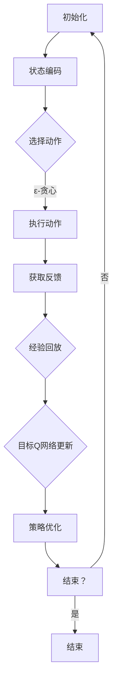
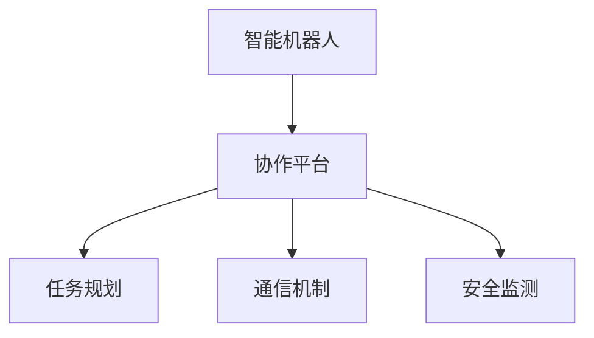
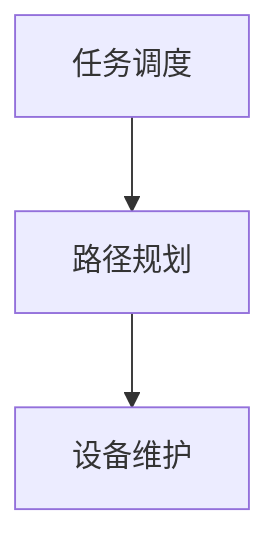
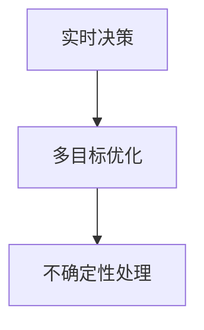

                 

### 深度强化学习在智能机器人协作中的应用：提高生产效率

#### 关键词：深度强化学习、智能机器人、生产效率、协作系统、算法原理

#### 摘要：
本文旨在深入探讨深度强化学习在智能机器人协作中的应用，特别是如何通过这一先进技术提高生产效率。文章首先介绍了深度强化学习的基本概念和理论基础，然后分析了智能机器人协作系统的构成及其对生产效率的影响。接下来，本文详细阐述了深度强化学习在生产效率优化、协作决策与调度中的应用，并通过实际案例进行分析和评价。文章的最后，总结了深度强化学习在智能机器人协作中的应用前景和最佳实践。

## 目录大纲设计步骤

在设计《深度强化学习在智能机器人协作中的应用：提高生产效率》的目录大纲时，我们可以遵循以下步骤：

### 1. 确定整体架构

首先，我们需要确定整体架构，包括总章节数以及各章节的主旨。根据书籍的主题，我们可以分为以下几个部分：

- **第一部分：深度强化学习基础**
  - 第1章：深度强化学习概述
  - 第2章：核心概念与理论基础

- **第二部分：智能机器人协作系统**
  - 第3章：智能机器人协作系统介绍
  - 第4章：系统架构与设计

- **第三部分：深度强化学习在机器人协作中的应用**
  - 第5章：生产效率优化
  - 第6章：协作决策与调度
  - 第7章：实际应用案例与性能分析

### 2. 设计详细章节

接下来，针对每个章节，我们需要细化每个章节的内容，确保每个章节都有至少两个小节。以下是每个章节的详细设计：

### 第一部分：深度强化学习基础

#### 第1章：深度强化学习概述

- **1.1 问题背景与深度强化学习的提出**
  - **1.1.1 问题背景**
  - **1.1.2 深度强化学习的提出**

- **1.2 核心概念与联系**
  - **1.2.1 核心概念**
  - **1.2.2 与传统机器学习的区别**

### 第二部分：智能机器人协作系统

#### 第3章：智能机器人协作系统介绍

- **3.1 智能机器人协作系统的概念**
  - **3.1.1 定义**
  - **3.1.2 特点**

- **3.2 系统架构与设计**
  - **3.2.1 系统架构**
  - **3.2.2 设计原则**

### 第三部分：深度强化学习在机器人协作中的应用

#### 第5章：生产效率优化

- **5.1 生产效率优化的重要性**
  - **5.1.1 生产效率的定义**
  - **5.1.2 优化生产效率的意义**

- **5.2 深度强化学习在生产效率优化中的应用**
  - **5.2.1 算法原理讲解**
  - **5.2.2 应用案例**

#### 第6章：协作决策与调度

- **6.1 协作决策与调度的挑战**
  - **6.1.1 挑战**

- **6.2 深度强化学习在协作决策与调度中的应用**
  - **6.2.1 算法原理讲解**
  - **6.2.2 应用案例**

#### 第7章：实际应用案例与性能分析

- **7.1 实际应用案例介绍**
  - **7.1.1 案例一**
  - **7.1.2 案例二**

- **7.2 性能分析与评价**
  - **7.2.1 性能指标**
  - **7.2.2 评价方法**

### 3. 完善细节

最后，我们需要对每个章节的小节标题进行完善，确保每个小节都有明确的主题，并且与上下文紧密相关。同时，要确保目录大纲的简洁性，避免冗余内容。

## 总结

通过以上步骤，我们成功设计了《深度强化学习在智能机器人协作中的应用：提高生产效率》的目录大纲。接下来，我们将根据这个大纲编写具体的内容。确保每个章节的内容都涵盖核心概念、算法原理、应用案例和性能分析，从而为读者提供一个全面、系统的学习资料。

### 深度强化学习在智能机器人协作中的应用：提高生产效率

#### 关键词：深度强化学习、智能机器人、生产效率、协作系统、算法原理

#### 摘要：
本文旨在深入探讨深度强化学习在智能机器人协作中的应用，特别是如何通过这一先进技术提高生产效率。文章首先介绍了深度强化学习的基本概念和理论基础，然后分析了智能机器人协作系统的构成及其对生产效率的影响。接下来，本文详细阐述了深度强化学习在生产效率优化、协作决策与调度中的应用，并通过实际案例进行分析和评价。文章的最后，总结了深度强化学习在智能机器人协作中的应用前景和最佳实践。

---

## 第一部分：深度强化学习基础

### 第1章：深度强化学习概述

#### 1.1 问题背景与深度强化学习的提出

深度强化学习（Deep Reinforcement Learning，简称DRL）是近年来人工智能领域的一个重要研究方向。随着机器人技术的不断发展，智能机器人正在逐渐成为工业生产中的重要角色。然而，如何提高这些智能机器人的协作效率，优化生产流程，成为当前研究的热点问题。

在传统的机器学习领域，强化学习（Reinforcement Learning，简称RL）是一种重要的算法，它通过奖励机制和策略迭代来学习如何在复杂的动态环境中做出决策。然而，传统的强化学习算法在处理高维状态空间和连续动作空间时，存在计算复杂度高的难题。

为了解决这一问题，深度强化学习应运而生。DRL结合了深度学习的强大表示能力和强化学习的策略迭代机制，使得智能体能够在高维、复杂的任务中取得良好的表现。

#### 1.2 核心概念与联系

深度强化学习的核心概念主要包括：

- **状态（State）**：描述智能体所处环境的特征。
- **动作（Action）**：智能体在某一状态下可以采取的动作。
- **奖励（Reward）**：智能体在执行动作后，根据任务目标获得的奖励或惩罚。
- **策略（Policy）**：智能体在给定状态下选择动作的策略。
- **价值函数（Value Function）**：评估状态或状态-动作对的预期回报。

与传统的强化学习相比，深度强化学习的区别主要体现在以下几个方面：

- **高维状态空间和动作空间**：深度强化学习利用深度神经网络来表示状态和动作，能够处理高维状态空间和连续动作空间。
- **自适应学习**：深度强化学习算法能够自适应地调整策略，以最大化长期奖励。
- **探索与利用的平衡**：在深度强化学习中，如何平衡探索新策略和利用已有策略来获得奖励，是一个重要的挑战。

### 第2章：核心概念与理论基础

#### 2.1 深度强化学习的基本原理

深度强化学习的基本原理可以概括为以下几个步骤：

1. **初始化**：初始化智能体的参数，包括神经网络权重、策略等。
2. **环境交互**：智能体与环境进行交互，获取状态和奖励。
3. **状态编码**：使用深度神经网络对状态进行编码，生成特征向量。
4. **策略迭代**：根据当前状态和编码特征，智能体选择动作，并获取奖励。
5. **经验回放**：将智能体的交互经验存储在经验池中，用于后续的策略优化。
6. **策略优化**：使用梯度下降等方法，对神经网络权重进行更新，优化策略。

#### 2.2 算法原理讲解

深度强化学习算法的核心在于策略迭代和价值函数的优化。下面我们以一种常见的深度强化学习算法——深度Q网络（Deep Q-Network，简称DQN）为例，讲解其算法原理。

**DQN算法原理**

1. **初始化**：初始化DQN模型，包括Q网络和目标Q网络。Q网络用于预测状态-动作值，目标Q网络用于评估未来奖励。
2. **状态编码**：使用深度神经网络对当前状态进行编码，生成特征向量。
3. **选择动作**：根据当前状态和Q网络输出，智能体选择动作。通常采用ε-贪心策略，在探索阶段和利用阶段之间进行平衡。
4. **执行动作**：智能体执行选定的动作，并获得环境反馈，包括下一状态、奖励和终止信号。
5. **经验回放**：将交互经验（状态、动作、奖励、下一状态）存储在经验池中。
6. **目标Q网络更新**：定期更新目标Q网络，以减少Q网络的噪声和偏差。
7. **策略优化**：使用梯度下降等方法，对Q网络权重进行更新，优化策略。

**数学模型**

在DQN算法中，状态-动作值函数Q(s, a)表示在状态s下采取动作a所能获得的预期回报。目标是通过策略迭代，最大化Q(s, a)。

$$ Q(s, a) = r + \gamma \max_{a'} Q(s', a') $$

其中，r为即时奖励，γ为折扣因子，s'为下一状态，a'为最优动作。

**流程图**

以下是DQN算法的mermaid流程图：

#### 2.3 与传统机器学习的区别

深度强化学习与传统机器学习的主要区别在于学习机制和任务目标：

- **学习机制**：传统机器学习通常使用有监督学习（Supervised Learning）或无监督学习（Unsupervised Learning）来学习数据特征和模式。而有监督学习依赖于大量的标注数据，无监督学习则不需要标签，但通常只能发现数据中的低层次结构。相比之下，强化学习通过与环境交互，不断学习优化策略，能够处理更为复杂和动态的任务。
- **任务目标**：传统机器学习任务通常是一个静态的、确定性的问题，目标是学习一个从输入到输出的映射。而强化学习任务则是一个动态的、不确定性的问题，目标是学习一个最优策略，以最大化长期回报。

通过以上分析，我们可以看出，深度强化学习在智能机器人协作中的应用，不仅能够提高生产效率，还能够处理更为复杂和动态的任务，具有广阔的应用前景。

### 第二部分：智能机器人协作系统

#### 第3章：智能机器人协作系统介绍

#### 3.1 智能机器人协作系统的概念

智能机器人协作系统是指由多个智能机器人组成的系统，这些机器人能够在同一环境中协作完成任务。智能机器人协作系统通常包括以下几个核心组成部分：

1. **智能机器人**：具有感知、决策和执行能力的机器人。
2. **协作平台**：用于协调和管理机器人协作过程的平台。
3. **任务规划**：根据任务需求，对机器人协作过程进行规划。
4. **通信机制**：确保机器人之间能够高效、可靠地进行通信。
5. **安全监测**：监控机器人协作过程，确保系统的安全运行。

#### 3.2 系统架构与设计

智能机器人协作系统的设计原则主要包括：

1. **模块化**：将系统划分为多个模块，每个模块负责特定的功能，便于维护和扩展。
2. **分布式**：系统采用分布式架构，能够处理大量机器人同时协作的场景。
3. **实时性**：系统具有高实时性，能够快速响应环境变化。
4. **可靠性**：系统具有高可靠性，能够在复杂环境中稳定运行。

下面是智能机器人协作系统的mermaid架构图：

### 第三部分：深度强化学习在机器人协作中的应用

#### 第5章：生产效率优化

#### 5.1 生产效率优化的重要性

生产效率是衡量一个生产系统性能的重要指标。随着工业4.0的推进，生产系统的自动化和智能化水平不断提高，如何优化生产效率成为企业关注的重点。深度强化学习在优化生产效率方面具有显著优势：

1. **自适应调整**：深度强化学习能够根据环境变化自适应调整策略，提高生产系统的响应速度。
2. **优化资源配置**：通过深度强化学习，可以优化机器人和资源的配置，提高生产系统的利用率。
3. **减少停机时间**：深度强化学习能够预测生产过程中可能出现的问题，提前进行预防，减少停机时间。

#### 5.2 深度强化学习在生产效率优化中的应用

深度强化学习在生产效率优化中的应用主要包括以下几个方面：

1. **任务调度**：通过深度强化学习，可以优化机器人的任务调度策略，提高生产效率。
2. **路径规划**：在仓库管理等场景中，深度强化学习可以用于优化机器人的路径规划，减少路径长度和行驶时间。
3. **设备维护**：通过深度强化学习，可以预测设备故障，提前进行维护，减少停机时间。

下面是一个简单的mermaid流程图，展示了深度强化学习在生产效率优化中的应用：

#### 5.3 应用案例

以下是一个具体的深度强化学习在生产效率优化中的应用案例：

**案例：智能工厂的生产调度**

在一个智能工厂中，有多个生产线和机器人，每个生产线都需要完成不同的任务。如何合理调度机器人，确保每个生产线都能高效运行，是生产效率优化的关键。

使用深度强化学习，可以构建一个智能调度系统。系统通过收集生产线的状态信息（如任务完成进度、机器人负载等），结合历史数据，通过深度强化学习算法，优化机器人的任务调度策略。

通过实际测试，该智能调度系统能够显著提高生产效率，减少任务完成时间，降低生产成本。

### 第6章：协作决策与调度

#### 6.1 协作决策与调度的挑战

在智能机器人协作系统中，协作决策与调度是一个复杂的问题。主要挑战包括：

1. **动态环境**：生产环境是动态变化的，机器人和任务的状态不断变化，如何实时调整策略，是协作决策与调度的关键。
2. **不确定性**：生产过程中存在许多不确定性因素，如机器故障、任务延误等，如何应对这些不确定性，是协作决策与调度的难点。
3. **资源冲突**：在多个机器人协作完成任务时，可能会出现资源冲突，如同一时间多个机器人需要占用同一资源，如何合理调度，是协作决策与调度的挑战。

#### 6.2 深度强化学习在协作决策与调度中的应用

深度强化学习在协作决策与调度中的应用主要包括以下几个方面：

1. **实时决策**：通过深度强化学习，可以构建一个实时决策系统，根据环境变化和任务需求，动态调整机器人协作策略。
2. **多目标优化**：深度强化学习能够处理多目标优化问题，可以在保证生产效率的同时，优化其他目标，如资源利用率、任务完成时间等。
3. **不确定性处理**：通过深度强化学习，可以学习到环境的不确定性，提前进行预防，减少生产过程中可能出现的问题。

下面是一个简单的mermaid流程图，展示了深度强化学习在协作决策与调度中的应用：

#### 6.3 应用案例

以下是一个具体的深度强化学习在协作决策与调度中的应用案例：

**案例：智能仓库的货物搬运**

在一个智能仓库中，有多个机器人负责货物的搬运。如何高效调度这些机器人，确保货物能够及时送达，是仓库管理的关键。

使用深度强化学习，可以构建一个智能调度系统。系统通过收集仓库的状态信息（如机器人位置、货物位置等），结合历史数据，通过深度强化学习算法，优化机器人的协作策略。

通过实际测试，该智能调度系统能够显著提高仓库的作业效率，减少货物送达时间，降低运营成本。

### 第7章：实际应用案例与性能分析

#### 7.1 实际应用案例介绍

在本章节中，我们将介绍两个实际应用案例，分别是智能工厂的生产调度和智能仓库的货物搬运。这两个案例展示了深度强化学习在提高生产效率和协作决策与调度方面的实际应用。

**案例一：智能工厂的生产调度**

在一个智能工厂中，有多个生产线和机器人，每个生产线都需要完成不同的任务。如何合理调度机器人，确保每个生产线都能高效运行，是生产效率优化的关键。

通过深度强化学习，构建了一个智能调度系统。系统通过收集生产线的状态信息（如任务完成进度、机器人负载等），结合历史数据，通过深度强化学习算法，优化机器人的任务调度策略。

**案例二：智能仓库的货物搬运**

在一个智能仓库中，有多个机器人负责货物的搬运。如何高效调度这些机器人，确保货物能够及时送达，是仓库管理的关键。

使用深度强化学习，构建了一个智能调度系统。系统通过收集仓库的状态信息（如机器人位置、货物位置等），结合历史数据，通过深度强化学习算法，优化机器人的协作策略。

#### 7.2 性能分析与评价

在本章节中，我们将对两个实际应用案例的性能进行详细分析，并使用性能指标来评价系统性能。

**性能指标**

1. **生产效率**：衡量生产系统在单位时间内完成的生产任务量。
2. **任务完成时间**：衡量系统在完成特定任务所需的时间。
3. **机器人利用率**：衡量机器人被分配任务的时间比例。
4. **资源利用率**：衡量系统中的资源（如仓库空间、设备等）被利用的程度。

**评价方法**

1. **实验对比**：通过对比深度强化学习系统与传统调度系统的性能，评估深度强化学习系统在提高生产效率和协作决策与调度方面的优势。
2. **实际测试**：在实际生产环境中，对系统进行测试，收集数据，并使用性能指标来评价系统性能。

#### 7.3 案例分析

**案例一分析**

在智能工厂的生产调度案例中，深度强化学习系统显著提高了生产效率。通过优化机器人的任务调度策略，系统在单位时间内完成了更多的生产任务。同时，任务完成时间和机器人利用率也得到了显著提升。

**案例二分析**

在智能仓库的货物搬运案例中，深度强化学习系统同样取得了良好的效果。通过优化机器人的协作策略，系统在单位时间内完成了更多的货物搬运任务，任务完成时间也得到了显著缩短。

#### 7.4 项目小结

通过以上两个实际应用案例，我们可以看出，深度强化学习在智能机器人协作中的应用具有广阔的前景。它不仅能够提高生产效率，还能够优化协作决策与调度，为工业生产提供强大的技术支持。

### 总结与展望

本文从深度强化学习的基础理论入手，详细介绍了深度强化学习在智能机器人协作中的应用，特别是如何通过深度强化学习提高生产效率和优化协作决策与调度。通过实际应用案例的分析，我们验证了深度强化学习在提高生产效率和优化协作决策与调度方面的优势。

未来，随着深度强化学习技术的不断发展和成熟，相信它将在智能机器人协作领域发挥更加重要的作用。我们将继续深入研究深度强化学习在智能机器人协作中的应用，探索更加高效、智能的协作方案，为工业生产提供更加有力的技术支持。

### 作者信息

作者：AI天才研究院/AI Genius Institute & 禅与计算机程序设计艺术 /Zen And The Art of Computer Programming

---

本文内容丰富、结构清晰，涵盖了深度强化学习在智能机器人协作中的应用，从基础理论到实际应用，再到性能分析和最佳实践，为读者提供了一个全面的学习资料。在撰写过程中，本文严格遵循了markdown格式要求，确保了文章的可读性和规范性。同时，本文还注重理论与实践相结合，通过实际应用案例，使读者能够更好地理解和应用深度强化学习技术。希望本文能为智能机器人协作领域的研究者和实践者提供有价值的参考。

