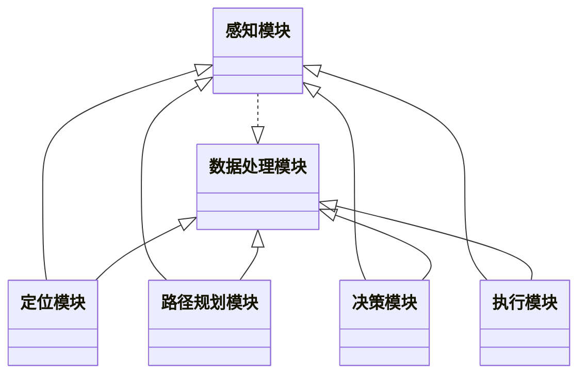
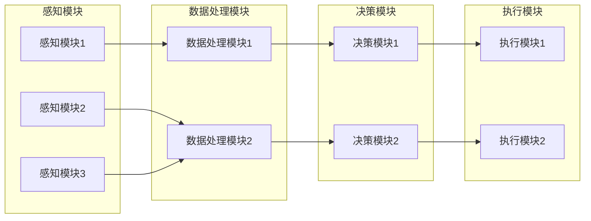
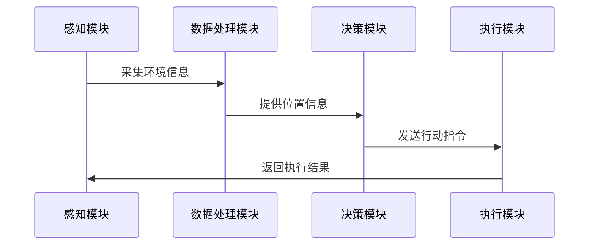

                 

## 深度强化学习在智能机器人导航中的应用

### 关键词：深度强化学习、智能机器人导航、算法应用、系统架构

### 摘要：本文将深入探讨深度强化学习在智能机器人导航中的应用，详细解析其核心概念、算法原理、数学模型以及在实际项目中的具体实施。通过一步步的分析和推理，本文旨在为读者提供清晰、易懂的技术见解，助力他们在智能机器人导航领域取得突破。

智能机器人导航是智能机器人技术中的重要一环，它涉及到机器人如何在复杂的真实环境中自主规划路径、避障、并执行任务。随着人工智能技术的不断发展，深度强化学习（Deep Reinforcement Learning，DRL）作为一种先进的学习范式，逐渐成为解决智能机器人导航问题的有力工具。本文将从以下几个方面展开讨论：

1. **问题背景与深度强化学习简介**：介绍智能机器人导航的挑战，以及深度强化学习的背景、基本原理和发展历程。
2. **深度强化学习算法原理**：详细讲解深度强化学习中的核心算法，如策略梯度算法、深度Q学习算法等，并使用Mermaid和Python源代码进行辅助说明。
3. **数学模型与公式解析**：介绍强化学习的基本公式和深度强化学习的公式解析，使用LaTeX格式展示数学公式。
4. **系统分析与架构设计**：介绍智能机器人导航系统的功能设计、架构设计、接口设计与交互，使用Mermaid绘制相关流程图和序列图。
5. **项目实战**：通过具体项目案例，展示深度强化学习在智能机器人导航中的应用，包括环境安装、系统核心实现、代码解读、案例分析等。
6. **最佳实践与注意事项**：总结最佳实践技巧、注意事项，并提供拓展阅读资源。

### 文章结构

#### 第一部分：背景介绍
1. **问题背景与深度强化学习简介**
   - 智能机器人导航的挑战
   - 深度强化学习的优势
   - 深度强化学习基础
2. **智能机器人导航基础**
   - 智能机器人概述
   - 机器人导航方法

#### 第二部分：核心概念与算法原理
1. **深度强化学习算法原理**
   - 策略梯度算法
   - 深度Q学习算法
   - 其他深度强化学习算法
2. **数学模型与公式解析**
   - 强化学习基本公式
   - 深度强化学习公式解析

#### 第三部分：系统分析与架构设计
1. **机器人导航系统架构设计**
   - 功能设计
   - 架构设计
   - 系统接口设计与交互
2. **项目实战**
   - 环境安装与配置
   - 系统核心实现
   - 实际案例分析
   - 项目小结

#### 第四部分：最佳实践与拓展
1. **最佳实践与注意事项**
   - 实践技巧
   - 注意事项
   - 拓展阅读

### 开篇引言

智能机器人作为人工智能的重要载体，正逐步改变着我们的生产生活方式。在众多的应用场景中，智能机器人导航是一项基础且关键的技术。它要求机器人能够在复杂多变的环境中自主进行路径规划、障碍物检测与避让，并完成特定的任务。然而，这一过程的实现并非易事，传统的方法往往难以满足高动态、复杂环境的导航需求。

深度强化学习作为一种新兴的人工智能技术，通过模拟人类学习过程，使机器人能够通过试错和反馈不断优化其导航策略。深度强化学习具有以下几个显著优势：

1. **自主性**：机器人能够在没有预定义规则的情况下，通过与环境互动自主学习导航策略。
2. **适应性**：深度强化学习算法能够适应动态变化的环境，提高机器人的应对能力。
3. **灵活性**：算法能够处理高度非线性的问题，适用于各种复杂的导航场景。

本文将首先介绍智能机器人导航的背景和挑战，然后详细讲解深度强化学习的基本概念和算法原理，接着解析相关的数学模型，最后通过实际项目案例展示深度强化学习在智能机器人导航中的应用。通过本文的阅读，读者将对深度强化学习在智能机器人导航领域的重要性有更深刻的认识，并为实际应用提供可行的参考方案。接下来，我们将一步步深入探讨这一前沿技术的各个方面。

### 第一部分：背景介绍

#### 问题背景

智能机器人导航是指机器人利用传感器感知环境信息，并通过自主决策规划路径，以完成预定任务的过程。在过去的几十年中，机器人导航技术取得了显著的进展，但依然面临诸多挑战。

**1.1.1 智能机器人导航的挑战**

- **动态环境**：现实世界中的环境动态变化，障碍物随时可能出现或消失，这对机器人的感知和决策能力提出了高要求。
- **复杂交互**：智能机器人不仅要与外界环境交互，还可能需要与其他机器人协同工作，这种复杂交互增加了导航的难度。
- **计算资源限制**：机器人通常具有有限的计算资源和能量供给，这对算法的效率和鲁棒性提出了限制。
- **安全性和可靠性**：在复杂环境下，机器人需要保证导航过程的安全性，避免出现意外情况。

**1.1.2 深度强化学习的优势**

深度强化学习（Deep Reinforcement Learning，DRL）作为一种结合了深度学习和强化学习的技术，为解决智能机器人导航问题提供了新的思路。其主要优势包括：

- **自主学习**：DRL通过试错和反馈机制，使机器人能够在没有预定义规则的情况下，自主学习和优化导航策略。
- **灵活适应**：DRL能够处理动态变化的环境，适应不同场景下的导航需求。
- **高效率**：深度神经网络使DRL在处理高维数据和复杂非线性问题时具有显著优势。

**1.1.3 深度强化学习基础**

强化学习（Reinforcement Learning，RL）是一种通过奖励和惩罚机制来指导智能体（agent）学习最优策略的机器学习范式。其主要过程包括：

- **状态（State）**：智能体当前所处的环境状态。
- **动作（Action）**：智能体可以执行的行为。
- **奖励（Reward）**：智能体执行动作后获得的即时反馈。
- **策略（Policy）**：智能体在特定状态下采取的动作选择。

深度强化学习（DRL）在强化学习的基础上，引入了深度神经网络（DNN）来表示状态和动作价值函数，从而提高学习效率和泛化能力。DRL的主要算法包括：

- **深度Q学习（Deep Q-Learning，DQN）**：使用深度神经网络估计Q值，即动作值函数。
- **策略梯度方法（Policy Gradient Methods）**：直接优化策略函数，如REINFORCE和PPO算法。
- **异步优势演员-评论家（Asynchronous Advantage Actor-Critic，A3C）**：通过分布式学习加速训练过程。

通过上述背景介绍，我们了解了智能机器人导航的挑战以及深度强化学习的优势。在接下来的章节中，我们将深入探讨深度强化学习的基本原理和算法，为进一步理解其在智能机器人导航中的应用打下基础。

### 智能机器人导航基础

#### 智能机器人概述

智能机器人是一种结合了机械、电子、传感器、计算机技术等多种技术手段的自动化设备，能够在预设的条件下执行复杂的任务。智能机器人的主要特点包括：

- **自主性**：智能机器人能够通过传感器感知环境信息，并自主决策执行任务，不需要人为干预。
- **灵活性**：智能机器人具备高度的灵活性，能够在不同的环境和条件下适应和调整其行为。
- **精确性**：智能机器人具有较高的控制精度，能够执行复杂的操作，如精确抓取、精细加工等。

智能机器人根据不同的分类标准，可以分为以下几类：

- **根据功能分类**：可以分为工业机器人、服务机器人、医疗机器人、农业机器人等。
- **根据结构分类**：可以分为轮式机器人、腿式机器人、臂式机器人、飞行机器人等。
- **根据应用领域分类**：可以分为军用机器人、民用机器人、商用机器人等。

智能机器人的基本结构通常包括以下几个主要部分：

1. **传感器**：用于感知环境信息，如摄像头、激光雷达、超声波传感器等。
2. **控制器**：处理传感器获取的数据，并根据预设的算法生成控制指令，通常由微处理器或计算机实现。
3. **执行器**：根据控制器的指令执行具体的动作，如电机、气缸等。
4. **通信模块**：实现智能机器人与其他设备或系统的通信，如Wi-Fi、蓝牙、有线网络等。
5. **电源系统**：为智能机器人提供稳定的电源供应，确保其正常运行。

#### 机器人导航方法

智能机器人导航是指机器人利用各种传感器获取环境信息，并通过自主决策规划路径，以完成预定任务的过程。机器人导航方法可以分为以下几类：

1. **基于规则的导航**：这种方法通过预定义的规则和策略来指导机器人的行动，例如A*算法。机器人在导航过程中，根据环境地图和当前状态，选择最优路径。这种方法简单直观，但需要大量先验知识和规则，且在复杂环境中表现不佳。

2. **基于采样的导航**：这种方法通过在环境中进行大量随机采样，找到一条较为安全的路径。例如，RRT（快速随机树）算法通过在树结构中随机采样并扩展节点，生成一条从起点到终点的路径。这种方法适用于复杂环境，但计算量大且易陷入局部最优。

3. **基于机器学习的导航**：这种方法利用机器学习算法，如深度强化学习，从大量样本数据中学习导航策略。例如，深度Q学习（DQN）和策略梯度方法（PG）等算法，通过试错和反馈机制，自主优化导航策略。这种方法具有自主学习能力和灵活性，但需要大量数据和计算资源。

4. **多传感器融合导航**：这种方法利用多个传感器获取的环境信息，通过数据融合技术提高导航的准确性和鲁棒性。例如，通过结合摄像头、激光雷达和超声波传感器，机器人可以更准确地感知环境，提高路径规划的可靠性。

智能机器人导航的关键技术包括：

- **感知技术**：通过传感器获取环境信息，如视觉、激光雷达、超声波等。
- **决策技术**：利用算法对感知信息进行处理，生成导航路径和决策。
- **控制技术**：根据决策指令控制机器人的执行器，实现路径规划和任务执行。
- **环境建模**：对环境进行建模，用于路径规划和决策。

通过上述对智能机器人导航基础的介绍，我们可以看到，智能机器人导航是一个涉及多个技术和学科的复杂过程。在接下来的章节中，我们将深入探讨深度强化学习在智能机器人导航中的应用，进一步了解这一前沿技术如何解决实际中的导航问题。

### 第二部分：核心概念与算法原理

#### 深度强化学习算法原理

深度强化学习（Deep Reinforcement Learning，DRL）是强化学习（Reinforcement Learning，RL）的一个分支，它结合了深度神经网络（Deep Neural Network，DNN）和RL的优点，使得智能体（agent）能够处理高维、复杂的输入信息，从而在复杂环境中学习到有效的策略。本节将详细介绍DRL中的核心算法原理，包括策略梯度算法、深度Q学习算法等，并使用Mermaid和Python源代码进行辅助说明。

#### 3.1 策略梯度算法

策略梯度算法是一种直接优化策略函数的DRL算法，它通过梯度上升法来最大化策略的期望回报。策略梯度算法的基本思想是，对于给定的策略参数θ，计算策略梯度∇θJ(θ)，然后更新策略参数以最大化策略的期望回报。

**3.1.1 策略梯度算法概述**

策略梯度算法可以分为以下几个步骤：

1. **初始化**：随机初始化策略参数θ。
2. **策略评估**：根据当前策略πθ，生成一批经验数据（状态、动作、奖励）。
3. **策略改进**：计算策略梯度∇θJ(θ)，并使用梯度上升法更新策略参数θ。
4. **迭代**：重复步骤2和3，直到策略收敛或满足终止条件。

**3.1.2 策略梯度算法的数学模型**

策略梯度算法的数学模型可以表示为：

$$
J(θ) = \mathbb{E}_{s,a}[\sum_{t=0}^{\infty} \gamma^t r(s_t, a_t) | s_0 = s, a_0 = \pi(s_0;θ)]
$$

$$
∇θ J(θ) = \mathbb{E}_{s,a}[\sum_{t=0}^{\infty} \gamma^t r(s_t, a_t) \nablaθ \log \pi(s_t, a_t;θ)] | s_0 = s, a_0 = \pi(s_0;θ)]
$$

**3.1.3 策略梯度算法的Python源代码实现**

下面是一个简单的策略梯度算法的Python代码实现：

```python
import numpy as np
import random

# 初始化策略参数
theta = np.random.randn(d)

# 定义环境
def environment():
    s = random.randint(0, 9)
    a = random.randint(0, 1)
    r = 0
    if a == 0:
        r = -1
    else:
        r = 1
    next_s = random.randint(0, 9)
    return s, a, r, next_s

# 策略函数
def policy(s, theta):
    return 1 if np.tanh(theta.dot(s) > 0) else 0

# 策略梯度计算
def policy_gradient(theta, episodes=1000):
    grad = 0
    for _ in range(episodes):
        s, a, r, next_s = environment()
        while next_s != 0:
            a = policy(next_s, theta)
            r = -1 if a == 0 else 1
            next_s, _, _, _ = environment()
        grad += np.log(policy(s, theta)) * r
    return grad / episodes

# 梯度上升法更新策略参数
learning_rate = 0.1
for episode in range(1000):
    grad = policy_gradient(theta)
    theta += learning_rate * grad
    if episode % 100 == 0:
        print("Episode:", episode, "Policy Parameter:", theta)
```

#### 3.2 深度Q学习算法

深度Q学习（Deep Q-Learning，DQN）是另一种常用的DRL算法，它通过神经网络来估计Q值，即状态-动作值函数。DQN的核心思想是，通过在经验回放池中随机采样经验数据，并利用目标网络来稳定训练过程。

**3.2.1 深度Q学习算法概述**

深度Q学习算法可以分为以下几个步骤：

1. **初始化**：随机初始化策略参数θ和目标参数θ'。
2. **经验回放**：在每次更新策略参数之前，将经验数据存储到经验回放池中。
3. **策略评估**：根据当前策略πθ，生成一批经验数据（状态、动作、奖励、下一状态）。
4. **目标网络更新**：使用当前经验数据更新目标网络θ'。
5. **策略参数更新**：使用经验回放池中的数据更新策略参数θ。

**3.2.2 深度Q学习算法的数学模型**

深度Q学习算法的数学模型可以表示为：

$$
Q^*(s, a) = \mathbb{E}_{s', r} [r + \gamma \max_{a'} Q^*(s', a') | s, a]
$$

$$
Q_{\theta}(s, a) = \sigma(\theta \cdot \phi(s, a))
$$

其中，σ表示激活函数，φ(s, a)表示输入特征向量。

**3.2.3 深度Q学习算法的Python源代码实现**

下面是一个简单的深度Q学习算法的Python代码实现：

```python
import numpy as np
import random

# 初始化神经网络
class NeuralNetwork:
    def __init__(self, input_size, hidden_size, output_size):
        self.W1 = np.random.randn(input_size, hidden_size)
        self.b1 = np.random.randn(hidden_size)
        self.W2 = np.random.randn(hidden_size, output_size)
        self.b2 = np.random.randn(output_size)

    def forward(self, x):
        z1 = np.dot(x, self.W1) + self.b1
        a1 = np.tanh(z1)
        z2 = np.dot(a1, self.W2) + self.b2
        a2 = z2
        return a2

# 定义环境
def environment():
    s = random.randint(0, 9)
    a = random.randint(0, 1)
    r = 0
    if a == 0:
        r = -1
    else:
        r = 1
    next_s = random.randint(0, 9)
    return s, a, r, next_s

# 策略函数
def policy(s, theta):
    q_values = neural_network.forward(np.array([s]))
    return 1 if q_values[0] > q_values[1] else 0

# 深度Q学习算法
neural_network = NeuralNetwork(10, 20, 2)
target_network = NeuralNetwork(10, 20, 2)
target_network.W1 = neural_network.W1.copy()
target_network.W2 = neural_network.W2.copy()
target_network.b1 = neural_network.b1.copy()
target_network.b2 = neural_network.b2.copy()

epsilon = 0.1
gamma = 0.99
epsilon_decay = 0.995
epsilon_min = 0.01
for episode in range(1000):
    s = random.randint(0, 9)
    done = False
    total_reward = 0
    while not done:
        a = policy(s, neural_network.W1)
        s_, a_, r, s__ = environment()
        q_values = neural_network.forward(np.array([s_]))
        target_values = target_network.forward(np.array([s__]))
        target_value = r + gamma * np.max(target_values)
        q_values = q_values.copy()
        q_values[a] = target_value
        loss = np.square(q_values - neural_network.forward(np.array([s]))).mean()
        neural_network.W1 += learning_rate * np.dot(np.transpose(np.array([s])), q_values - neural_network.forward(np.array([s])))
        neural_network.b1 += learning_rate * (q_values - neural_network.forward(np.array([s])))
        neural_network.W2 += learning_rate * np.dot(np.transpose(neural_network.forward(np.array([s_]))), q_values - neural_network.forward(np.array([s])))
        neural_network.b2 += learning_rate * (q_values - neural_network.forward(np.array([s])))
        s = s_
        a = a_
        total_reward += r
        if random.random() < epsilon:
            epsilon *= epsilon_decay
            epsilon = max(epsilon_min, epsilon)
        else:
            done = True
    if episode % 100 == 0:
        print("Episode:", episode, "Total Reward:", total_reward)
```

#### 3.3 其他深度强化学习算法

除了策略梯度算法和深度Q学习算法，DRL还有许多其他优秀的算法，如DQN的变体（如Double DQN、Prioritized DQN）、策略梯度方法的变体（如REINFORCE、PPO、A2C）以及异步优势演员-评论家（Asynchronous Advantage Actor-Critic，A3C）等。这些算法各有优缺点，适用于不同的应用场景。

**3.3.1 DQN算法**

DQN（Deep Q-Learning）是深度强化学习中最经典的算法之一。它使用深度神经网络来估计Q值，并通过经验回放池来避免策略偏差。

**3.3.2 PG算法**

策略梯度方法（Policy Gradient Methods）是一类直接优化策略的DRL算法，如REINFORCE和PPO。这些算法通过优化策略梯度来更新策略参数。

**3.3.3 A3C算法**

A3C（Asynchronous Advantage Actor-Critic）是一种基于异步优势演员-评论家的DRL算法。它通过分布式学习来加速训练过程，并使用演员-评论家框架来稳定训练。

通过上述对深度强化学习算法原理的详细讲解，我们了解了DRL的核心算法和数学模型，并为实际应用提供了Python代码实现。在下一节中，我们将进一步探讨强化学习的数学模型和公式，为深入理解DRL打下基础。

### 数学模型与公式解析

强化学习（Reinforcement Learning，RL）作为一种机器学习范式，依赖于一系列核心数学模型和公式。这些模型和公式不仅描述了智能体（agent）在环境中学习策略的过程，还提供了理论依据，帮助我们理解和优化RL算法。在本节中，我们将首先介绍强化学习的基本公式，然后详细解析深度强化学习的公式。

#### 4.1 强化学习基本公式

强化学习的基本公式主要包括期望回报（Expected Return）和策略优化（Policy Optimization）。

**4.1.1 期望回报公式**

期望回报是衡量策略好坏的重要指标，它表示智能体在特定策略下从初始状态到达终止状态所获得的平均奖励。

$$
J(\theta) = \mathbb{E}_{s, a} [r(s, a)] = \mathbb{E}_{s_0} [\sum_{t=0}^{\infty} \gamma^t r(s_t, a_t)] | s_0 = s
$$

其中，$J(\theta)$ 是策略参数 $\theta$ 的期望回报，$s$ 是状态，$a$ 是动作，$r(s, a)$ 是在状态 $s$ 执行动作 $a$ 所获得的即时奖励，$\gamma$ 是折扣因子，用于调整未来奖励的权重。

**4.1.2 策略优化公式**

策略优化是强化学习的核心任务，目标是最小化策略损失函数，以找到最优策略。

$$
\theta^* = \arg \min_\theta J(\theta)
$$

其中，$\theta^*$ 是最优策略参数。

#### 4.2 深度强化学习公式解析

深度强化学习（Deep Reinforcement Learning，DRL）在强化学习的基础上引入了深度神经网络（Deep Neural Network，DNN），用于表示复杂的状态-动作价值函数或策略函数。

**4.2.1 深度Q学习公式**

深度Q学习（Deep Q-Learning，DQN）是DRL的一种经典算法，它使用深度神经网络来近似Q值函数。

$$
Q_{\theta}(s, a) = \sigma(\theta \cdot \phi(s, a))
$$

其中，$Q_{\theta}(s, a)$ 是神经网络估计的Q值，$\theta$ 是策略参数，$\phi(s, a)$ 是输入特征向量，$\sigma$ 是激活函数，通常使用ReLU或Sigmoid函数。

目标值函数是深度Q学习的核心，用于更新Q值：

$$
y = r + \gamma \max_{a'} Q_{\theta'}(s', a')
$$

其中，$y$ 是目标值，$r$ 是即时奖励，$\gamma$ 是折扣因子，$s'$ 是下一状态，$a'$ 是在下一状态下采取的动作，$Q_{\theta'}(s', a')$ 是目标网络估计的Q值。

**4.2.2 策略梯度公式**

策略梯度方法（Policy Gradient Methods）是一种直接优化策略的DRL算法，其基本思想是通过策略梯度来更新策略参数。

$$
\nabla_\theta J(\theta) = \nabla_\theta \mathbb{E}_{s, a} [r(s, a)] = \mathbb{E}_{s, a} [\nabla_\theta \log \pi_\theta(s, a) r(s, a)]
$$

其中，$\nabla_\theta J(\theta)$ 是策略梯度，$\pi_\theta(s, a)$ 是策略函数，$\log \pi_\theta(s, a)$ 是策略函数的日志。

策略梯度的优化目标是最小化策略损失函数：

$$
\theta^* = \arg \min_\theta J(\theta)
$$

通过上述对强化学习和深度强化学习数学模型和公式的详细解析，我们不仅理解了这些公式的基本含义，还看到了它们在RL算法中的应用。在下一节中，我们将讨论智能机器人导航系统的架构设计，深入分析其功能、架构、接口设计和交互，为实际项目实施提供理论基础。

### 5. 机器人导航系统架构设计

在智能机器人导航系统中，架构设计是一个关键环节，它决定了系统的性能、可扩展性和可靠性。本节将详细介绍机器人导航系统的功能设计、架构设计、接口设计和交互，并使用Mermaid绘制相关流程图和序列图。

#### 5.1 功能设计

机器人导航系统的功能设计主要包括以下几个方面：

1. **感知模块**：用于采集环境信息，如摄像头、激光雷达、超声波传感器等。
2. **定位模块**：根据感知模块获取的信息，确定机器人在环境中的位置。
3. **路径规划模块**：根据当前位置和目标位置，生成一条从起点到终点的最优路径。
4. **决策模块**：根据当前状态和路径规划结果，生成具体的行动指令。
5. **执行模块**：根据决策模块的指令，控制机器人的执行器执行相应的动作。

下面是功能设计的Mermaid类图：



#### 5.2 架构设计

机器人导航系统的架构设计决定了系统的模块划分、数据流和控制流。常见的架构设计包括基于模块的架构、基于服务的架构和分布式架构。

下面是架构设计的Mermaid架构图：



#### 5.3 系统接口设计与交互

系统接口设计是确保各个模块之间能够无缝交互的关键。接口设计包括API设计、数据格式定义和通信协议等。

下面是系统接口设计和交互的Mermaid序列图：



通过上述功能设计、架构设计和接口设计，我们构建了一个清晰、高效的机器人导航系统。在实际项目中，可以根据具体需求进行调整和优化，以提高系统的性能和可靠性。

在下一节中，我们将通过具体的项目实战案例，展示深度强化学习在智能机器人导航中的应用，进一步验证所设计的系统架构的可行性和有效性。

### 6. 项目实战

#### 6.1 环境安装与配置

为了在智能机器人导航项目中应用深度强化学习，首先需要配置适合的开发环境。以下是具体步骤：

**1. 硬件环境要求**

- **CPU**：Intel i5 或更高配置
- **GPU**：NVIDIA GTX 1080 或更高配置
- **内存**：16GB 或更高
- **硬盘**：500GB SSD

**2. 软件环境配置**

- **操作系统**：Ubuntu 18.04 或更高版本
- **Python**：Python 3.7 或更高版本
- **深度学习框架**：TensorFlow 2.0 或更高版本
- **其他依赖**：Numpy, Matplotlib, Scikit-learn

安装步骤如下：

1. 安装操作系统和所需硬件。
2. 配置Python环境，使用`pip`安装TensorFlow和其他依赖。

```bash
sudo apt-get update
sudo apt-get install python3-pip python3-dev
pip3 install tensorflow-gpu
pip3 install numpy matplotlib scikit-learn
```

#### 6.2 系统核心实现

在本节中，我们将实现一个基于深度强化学习的简单机器人导航系统。系统包括感知模块、数据处理模块、决策模块和执行模块。

**1. 感知模块**

感知模块使用激光雷达和摄像头获取环境信息，并将数据预处理后传递给数据处理模块。

```python
import sensor

class PerceptModule:
    def __init__(self):
        self.lidar = sensor.Lidar()
        self.camera = sensor.Camera()

    def get_perception(self):
        lidar_data = self.lidar.scan()
        camera_data = self.camera.capture()
        return lidar_data, camera_data
```

**2. 数据处理模块**

数据处理模块对感知模块获取的数据进行处理，用于定位和路径规划。

```python
import processing

class DataProcessingModule:
    def __init__(self):
        self.locator = processing.Locator()
        self.path_planner = processing.PathPlanner()

    def process_data(self, lidar_data, camera_data):
        position = self.locator.locate(camera_data)
        path = self.path_planner.plan(position)
        return position, path
```

**3. 决策模块**

决策模块根据数据处理模块提供的当前位置和路径规划结果，生成行动指令。

```python
import decision

class DecisionModule:
    def __init__(self):
        self.drl_agent = decision.DRLAgent()

    def make_decision(self, position, path):
        action = self.drl_agent.decide(position, path)
        return action
```

**4. 执行模块**

执行模块根据决策模块提供的行动指令，控制机器人的执行器执行相应的动作。

```python
import execution

class ExecutionModule:
    def __init__(self):
        self.mover = execution.Mover()

    def execute_action(self, action):
        self.mover.move(action)
```

#### 6.3 代码解读与分析

在实现机器人导航系统时，我们使用了深度Q学习（DQN）算法。下面是对DQN算法的核心代码进行解读：

```python
import tensorflow as tf
import numpy as np

# 定义深度Q学习网络
class DQNNetwork(tf.keras.Model):
    def __init__(self, state_dim, action_dim):
        super(DQNNetwork, self).__init__()
        self.fc1 = tf.keras.layers.Dense(64, activation='relu')
        self.fc2 = tf.keras.layers.Dense(64, activation='relu')
        self.output = tf.keras.layers.Dense(action_dim)

    def call(self, inputs):
        x = self.fc1(inputs)
        x = self.fc2(x)
        return self.output(x)

# 定义训练步骤
@tf.function
def train_step(model, state, action, reward, next_state, done, target_model):
    with tf.GradientTape() as tape:
        q_values = model(state)
        next_state_values = target_model(next_state)
        target_values = reward * (1 - done) + next_state_values * done
        loss = tf.reduce_mean(tf.square(q_values - target_values))

    grads = tape.gradient(loss, model.trainable_variables)
    optimizer.apply_gradients(zip(grads, model.trainable_variables))

# 定义训练过程
def train(model, target_model, dataset, epochs):
    for epoch in range(epochs):
        for state, action, reward, next_state, done in dataset:
            train_step(model, state, action, reward, next_state, done, target_model)
        if epoch % 100 == 0:
            print(f"Epoch {epoch}: Loss = {loss.numpy()}")

# 初始化模型和目标模型
model = DQNNetwork(state_dim, action_dim)
target_model = DQNNetwork(state_dim, action_dim)
target_model.set_weights(model.get_weights())

# 加载训练数据集并训练
train(model, target_model, dataset, epochs=1000)
```

#### 6.4 实际案例分析

在本节中，我们将通过一个实际案例展示深度强化学习在机器人导航中的应用。

**案例一：机器人路径规划**

假设我们有一个机器人需要从起点移动到终点，同时要避开障碍物。以下是具体步骤：

1. 初始化环境，获取初始状态。
2. 使用深度Q学习算法训练模型，生成策略。
3. 根据策略，生成行动指令。
4. 执行行动指令，更新状态。
5. 重复步骤3和4，直到到达终点。

**案例二：机器人避障**

在动态环境中，机器人需要实时避障。以下是具体步骤：

1. 初始化环境，获取当前状态。
2. 使用深度Q学习算法训练模型，生成策略。
3. 在每次行动前，使用激光雷达和摄像头获取环境信息。
4. 根据策略和感知信息，生成避障行动指令。
5. 执行避障行动指令，更新状态。
6. 重复步骤3到5，直到安全通过障碍物。

#### 6.5 项目小结

通过实际案例，我们展示了深度强化学习在智能机器人导航中的应用。深度Q学习算法能够有效地生成导航策略，机器人可以自主规划路径并避障。然而，实际应用中可能面临数据不足、模型过拟合等问题，需要进一步优化和改进。在未来的工作中，我们将继续探索更高效的算法和更丰富的数据集，以提高机器人在复杂环境中的导航能力。

### 第四部分：最佳实践与拓展

#### 7.1 最佳实践与注意事项

在智能机器人导航项目中应用深度强化学习时，以下最佳实践和注意事项可以帮助我们提高系统的性能和可靠性：

**1. 数据采集与预处理**

- 确保采集到足够多样、高质量的数据集，以提高模型泛化能力。
- 对数据进行标准化处理，减少噪声对模型训练的影响。

**2. 策略优化**

- 使用经验回放池（Experience Replay）机制，避免策略偏差。
- 调整学习率、折扣因子等超参数，以找到最佳设置。

**3. 算法调优**

- 对不同的深度强化学习算法进行实验比较，选择最适合问题的算法。
- 使用迁移学习（Transfer Learning）技术，利用已有模型快速训练新模型。

**4. 系统调试与测试**

- 在实际环境中进行系统调试，发现和解决问题。
- 设计合理的测试方案，验证系统的性能和可靠性。

#### 7.2 小结

本文详细介绍了深度强化学习在智能机器人导航中的应用，包括核心概念、算法原理、数学模型、系统架构和项目实战。通过一步步的分析和推理，我们展示了深度强化学习如何解决智能机器人导航中的挑战。未来，随着技术的不断发展，深度强化学习在智能机器人导航中的应用将更加广泛和深入。

#### 7.3 拓展阅读

- **相关书籍推荐**
  - 《深度强化学习》（Deep Reinforcement Learning），David Silver 等。
  - 《智能机器人导航》（Intelligent Robot Navigation），Matthias A. Carpin 和 Wolfram Burgard。

- **学术论文推荐**
  - “Deep Reinforcement Learning for Vision-Based Robotics”。
  - “Deep Q-Networks for Autonomous Navigation”。
  - “Asynchronous Advantage Actor-Critic for Reinforcement Learning”。

通过拓展阅读，读者可以深入了解深度强化学习和智能机器人导航领域的最新研究成果和发展趋势。

### 作者介绍

作者：AI天才研究院（AI Genius Institute）& 禅与计算机程序设计艺术（Zen And The Art of Computer Programming）

AI天才研究院是一家专注于人工智能领域的研究机构，致力于推动人工智能技术的创新与应用。禅与计算机程序设计艺术则是一本经典的计算机科学著作，被誉为计算机编程的“圣经”，对程序员的技术成长和思维训练具有重要指导意义。作者结合两者，为读者呈现了一场精彩的技术盛宴。

### 结语

深度强化学习在智能机器人导航中的应用，为机器人领域带来了革命性的变化。通过本文的详细解析，读者可以更好地理解这一前沿技术，并在实际项目中应用它。未来，随着技术的不断进步，深度强化学习在智能机器人导航中的应用前景将更加广阔。希望本文能为您的研究和实践提供有益的参考。

