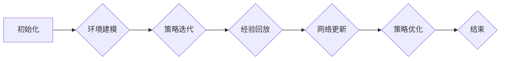
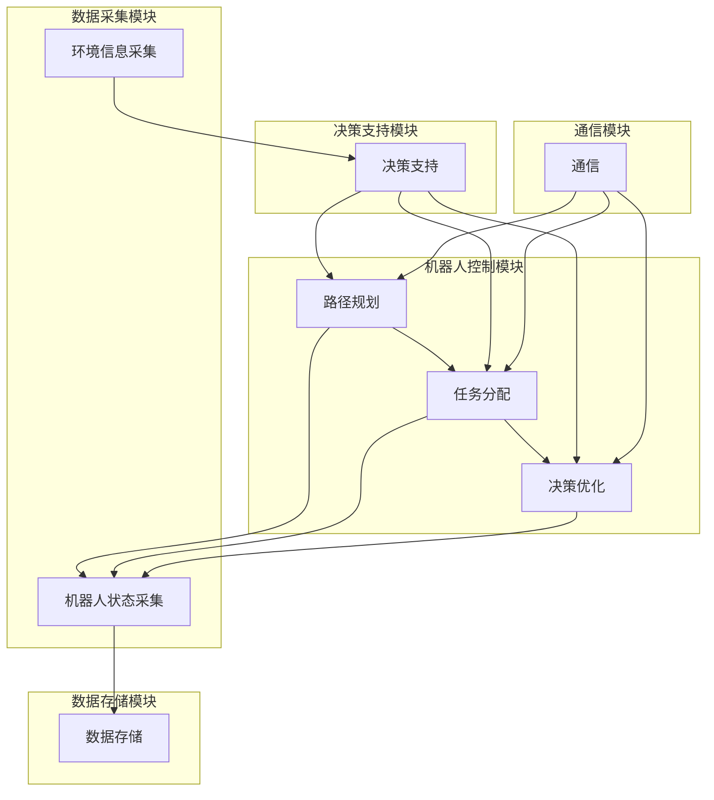
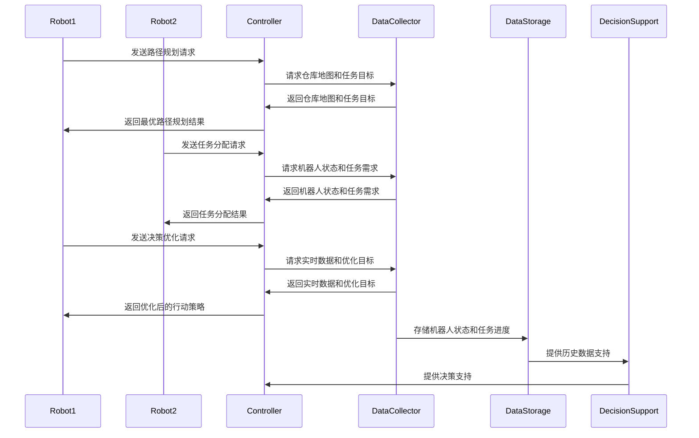

                 

### 深度强化学习在机器人群体协作中的应用

**关键词：** 深度强化学习、机器人群体协作、算法应用、系统架构、实际案例

**摘要：** 深度强化学习作为一种先进的机器学习技术，在机器人群体协作中展现出巨大的应用潜力。本文将详细探讨深度强化学习在机器人群体协作中的应用，从背景介绍、核心概念、算法原理、应用案例、系统架构设计以及实际应用等多个方面进行深入分析。本文旨在为读者提供全面而系统的理解，帮助读者掌握深度强化学习在机器人群体协作中的实际应用方法。

### 目录大纲

#### 第一部分：背景介绍

1. **第1章：深度强化学习与机器人群体协作**
   - 1.1 问题背景与概念介绍
   - 1.2 问题描述与解决思路
   - 1.3 概念结构与核心要素

2. **第2章：深度强化学习原理**
   - 2.1 深度强化学习基本原理
   - 2.2 深度强化学习算法对比
   - 2.3 深度强化学习的数学模型

#### 第二部分：核心概念与联系

3. **第3章：深度强化学习在机器人群体协作中的应用**
   - 3.1 算法流程图与原理
   - 3.2 数学模型与公式
   - 3.3 举例说明

#### 第三部分：算法原理讲解

4. **第4章：深度强化学习系统架构设计**
   - 4.1 问题场景介绍
   - 4.2 系统功能设计
   - 4.3 系统架构设计
   - 4.4 系统接口设计与交互

#### 第四部分：项目实战

5. **第5章：深度强化学习在机器人群体协作中的实际应用**
   - 5.1 环境安装
   - 5.2 系统核心实现
   - 5.3 代码应用解读与分析
   - 5.4 实际案例分析与讲解
   - 5.5 项目小结

#### 第五部分：最佳实践与拓展

6. **第6章：最佳实践与注意事项**
   - 6.1 最佳实践
   - 6.2 注意事项

7. **第7章：小结与拓展阅读**
   - 7.1 小结
   - 7.2 拓展阅读

**结束语**
- 对全书内容的总结与展望，以及对读者的一些建议。

### 1.1 问题背景与概念介绍

深度强化学习（Deep Reinforcement Learning，DRL）是结合了深度学习和强化学习的一种先进机器学习技术。它通过模仿人类学习过程，利用深度神经网络来评估环境状态，并根据奖励信号进行决策，从而实现智能体在复杂环境中的自主学习和适应。

在机器人群体协作（Robot Group Collaboration，RGC）领域，深度强化学习具有广泛的应用潜力。机器人群体协作是指多个机器人通过相互协作完成复杂的任务，如无人驾驶车队、灾难响应、智能制造等。然而，在实现高效协作过程中，面临着诸多挑战，包括环境不确定性、机器人个体差异、任务复杂性等。

深度强化学习为解决这些挑战提供了有效的途径。首先，通过深度神经网络可以处理复杂的环境状态，提高决策的准确性。其次，通过强化学习算法，机器人可以在实际操作中不断调整策略，以适应环境变化。最后，深度强化学习能够处理多机器人协同问题，实现高效的任务分配和协作控制。

### 1.2 问题描述与解决思路

当前，机器人群体协作面临着以下主要问题：

1. **环境不确定性**：现实世界中的环境变化多端，机器人需要在不确定的环境中进行自主决策和协作。
2. **机器人个体差异**：不同机器人的硬件、软件和性能存在差异，如何实现多样机器人之间的有效协作是一个挑战。
3. **任务复杂性**：机器人群体协作往往需要完成复杂的多任务，如路径规划、任务分配和协同控制等。

针对上述问题，深度强化学习可以提供以下解决思路：

1. **环境建模**：通过深度神经网络对复杂环境进行建模，使机器人能够更好地理解和适应环境。
2. **个性定制**：利用深度强化学习算法，针对不同机器人的个体特性进行个性化训练，提高协作效率。
3. **多任务学习**：通过多任务强化学习算法，使机器人能够在同一环境中同时处理多个任务，提高任务完成效率。

深度强化学习在机器人群体协作中的应用边界与外延涉及以下几个方面：

1. **边界**：深度强化学习主要应用于解决机器人群体协作中的环境不确定性、个体差异和任务复杂性等问题。
2. **外延**：除了机器人群体协作，深度强化学习还可以应用于其他多智能体系统，如无人商店、智能交通等。

### 1.3 概念结构与核心要素

深度强化学习的概念结构包括以下核心要素：

1. **智能体（Agent）**：智能体是执行行动的主体，可以是单个机器人或机器人群体。
2. **环境（Environment）**：环境是智能体进行行动的场所，可以是物理世界或模拟环境。
3. **状态（State）**：状态是环境的一个描述，通常用向量表示。
4. **动作（Action）**：动作是智能体对环境的一种干预，可以是机器人执行的操作。
5. **奖励（Reward）**：奖励是智能体在环境中执行动作后获得的即时反馈，用于指导学习过程。
6. **策略（Policy）**：策略是智能体在给定状态下选择动作的规则。
7. **价值函数（Value Function）**：价值函数评估智能体在某个状态下的预期奖励。
8. **模型（Model）**：模型是对环境的模拟，用于预测未来状态和奖励。

机器人群体协作的概念结构包括以下核心要素：

1. **机器人个体**：单个执行任务的机器人。
2. **任务**：机器人需要完成的特定工作。
3. **协作机制**：机器人之间通过通信和协调完成任务的机制。
4. **任务分配**：将任务分配给不同的机器人，以实现高效协作。
5. **协作策略**：机器人群体在执行任务时的协作策略和规则。

### 2.1 深度强化学习基本原理

深度强化学习（DRL）是一种结合深度学习和强化学习的方法，旨在解决复杂环境中的决策问题。其核心思想是通过深度神经网络（DNN）来评估环境状态，并利用强化学习（RL）算法在环境中进行交互，通过经验回放和策略迭代来优化智能体的行为。

#### 2.1.1 基本概念

1. **智能体（Agent）**：智能体是执行行动的主体，可以是单个机器人或机器人群体。
2. **环境（Environment）**：环境是智能体进行行动的场所，可以是物理世界或模拟环境。
3. **状态（State）**：状态是环境的一个描述，通常用向量表示。
4. **动作（Action）**：动作是智能体对环境的一种干预，可以是机器人执行的操作。
5. **奖励（Reward）**：奖励是智能体在环境中执行动作后获得的即时反馈，用于指导学习过程。
6. **策略（Policy）**：策略是智能体在给定状态下选择动作的规则。
7. **价值函数（Value Function）**：价值函数评估智能体在某个状态下的预期奖励。
8. **模型（Model）**：模型是对环境的模拟，用于预测未来状态和奖励。

#### 2.1.2 算法流程

深度强化学习的算法流程可以概括为以下几个步骤：

1. **初始化**：设置智能体的初始状态、策略和价值函数。
2. **环境互动**：智能体在环境中执行动作，并观察环境反馈的状态和奖励。
3. **策略迭代**：根据奖励信号和价值函数，迭代更新智能体的策略。
4. **经验回放**：将智能体在环境中获得的经验数据进行存储和回放，用于训练深度神经网络。
5. **网络更新**：使用回放的经验数据，训练深度神经网络，以优化其对环境状态的预测能力。
6. **策略优化**：根据训练后的深度神经网络，进一步优化智能体的策略。

#### 2.1.3 常见算法

深度强化学习领域存在多种常见算法，以下列举几种：

1. **深度Q网络（DQN）**：DQN使用深度神经网络来近似Q函数，通过经验回放和目标网络来避免策略偏差。
2. **异步优势演员-评论家（A3C）**：A3C通过多个并行智能体同时进行学习，并使用优势函数和梯度聚合来优化策略。
3. **深度策略梯度（DQN）**：DQN通过直接优化策略梯度来更新策略，适用于连续动作空间。
4. **深度确定性策略梯度（DDPG）**：DDPG使用深度神经网络来近似策略和状态动作值函数，适用于连续动作空间。

#### 2.1.4 优点与局限性

深度强化学习的优点包括：

1. **处理复杂状态**：深度神经网络能够处理高维状态信息，提高智能体的决策能力。
2. **灵活的模型适配**：深度强化学习可以通过调整网络结构和训练策略，适应不同复杂度的环境。
3. **自主学习能力**：智能体可以在环境中自主学习和优化策略，减少人工干预。

然而，深度强化学习也存在一些局限性：

1. **计算资源需求**：深度神经网络训练过程需要大量计算资源，特别是在处理高维状态和连续动作空间时。
2. **数据需求**：深度强化学习依赖大量的经验数据来训练神经网络，数据获取过程可能受到限制。
3. **策略优化难度**：在存在多个智能体或复杂交互的情况下，策略优化过程可能变得复杂且不稳定。

### 2.2 深度强化学习算法对比

在深度强化学习领域，存在多种不同的算法，每种算法都有其独特的原理、特点和应用场景。以下对比几种常见算法：

#### 2.2.1 DQN（深度Q网络）

**原理**：DQN使用深度神经网络来近似Q函数，Q函数用于评估状态-动作值，即智能体在特定状态下执行特定动作的预期奖励。

**特点**：通过经验回放和目标网络避免策略偏差，能够处理离散动作空间。

**应用场景**：适合应用于离散动作空间的问题，如游戏AI、机器人控制等。

**对比**：与其他算法相比，DQN在处理高维状态时具有优势，但可能面临数据不稳定和收敛困难的问题。

#### 2.2.2 A3C（异步优势演员-评论家）

**原理**：A3C通过多个并行智能体同时进行学习，并使用优势函数和梯度聚合来优化策略。演员（Actor）负责与环境互动和生成经验，评论家（Critic）负责评估经验并更新策略。

**特点**：适用于连续动作空间，能够处理多智能体交互。

**应用场景**：适合应用于连续动作空间和需要多智能体协作的问题，如无人驾驶、多人游戏等。

**对比**：与DQN相比，A3C能够提高学习效率，但可能面临计算资源消耗大的问题。

#### 2.2.3 DPG（深度策略梯度）

**原理**：DPG通过直接优化策略梯度来更新策略，适用于连续动作空间。策略梯度由策略网络生成，并通过优势函数来评估。

**特点**：无需价值函数，直接优化策略，适用于高维状态和连续动作空间。

**应用场景**：适合应用于复杂环境和高维状态的问题，如无人驾驶、智能控制等。

**对比**：与DQN和A3C相比，DPG在处理连续动作和高维状态时具有优势，但训练过程可能需要更长时间的稳定性。

#### 2.2.4 DDPG（深度确定性策略梯度）

**原理**：DDPG使用深度神经网络来近似策略网络和状态动作值函数，适用于连续动作空间。策略网络通过最大化期望奖励来更新，状态动作值函数用于评估策略效果。

**特点**：适用于复杂环境和高维状态，能够处理多智能体交互。

**应用场景**：适合应用于复杂环境和高维状态的问题，如无人驾驶、智能机器人控制等。

**对比**：与A3C相比，DDPG在处理连续动作和高维状态时具有优势，但可能面临计算资源消耗大的问题。

### 2.3 深度强化学习的数学模型

深度强化学习依赖于一系列数学模型和概念，这些模型构成了其理论基础。以下将介绍深度强化学习的数学模型，并解释其中的关键数学概念。

#### 2.3.1 Q值函数

Q值函数（Q-Function）是深度强化学习的核心概念之一，它表示智能体在特定状态下执行特定动作的预期奖励。形式上，Q值函数可以表示为：

\[ Q(s, a) = \sum_{s'} P(s' | s, a) \sum_{r} r(s', a) \]

其中，\( s \) 表示状态，\( a \) 表示动作，\( s' \) 表示下一状态，\( r \) 表示奖励。Q值函数反映了智能体在当前状态下选择特定动作所能获得的长期回报。

#### 2.3.2 策略

策略（Policy）是智能体在给定状态下选择动作的规则。在深度强化学习中，策略通常表示为概率分布，即智能体在状态 \( s \) 下选择动作 \( a \) 的概率：

\[ \pi(a | s) = P(a | s) \]

最优策略是在任何状态下都能最大化期望奖励的策略。通过优化策略，智能体能够更好地适应环境，提高任务完成的效率。

#### 2.3.3 值函数

值函数（Value Function）用于评估智能体在特定状态下的预期奖励。有两种主要的值函数：

1. **状态值函数（State Value Function）**：表示在给定状态下，执行最优策略所能获得的预期奖励。形式上，状态值函数可以表示为：

\[ V^*(s) = \max_a Q^*(s, a) \]

其中，\( Q^*(s, a) \) 表示最优Q值函数，\( V^*(s) \) 表示最优状态值函数。

2. **动作值函数（Action Value Function）**：表示在给定状态下，执行特定动作所能获得的预期奖励。形式上，动作值函数可以表示为：

\[ Q^*(s, a) = V^*(s) + \sum_{s'} P(s' | s, a) \sum_{a'} \pi(a' | s') Q^*(s', a') \]

动作值函数综合考虑了状态值函数和策略，反映了在特定状态下选择特定动作所能获得的预期回报。

#### 2.3.4 奖励

奖励（Reward）是智能体在环境中执行动作后获得的即时反馈，用于指导学习过程。奖励可以是正值，表示智能体在环境中取得了进步，也可以是负值，表示智能体在环境中遇到了阻碍。

奖励的设定对深度强化学习的效果至关重要。正奖励可以激励智能体采取有利的行为，负奖励可以避免智能体采取不利的行为。通过调整奖励信号，可以优化智能体的策略，使其更好地适应环境。

#### 2.3.5 模型

模型（Model）是对环境的模拟，用于预测未来状态和奖励。在深度强化学习中，模型通常由深度神经网络构成，用于近似环境动态。

模型通过经验回放和学习策略来不断更新，以提高其预测准确性。在智能体与环境互动的过程中，模型可以提供关于未来状态和奖励的估计，帮助智能体做出更好的决策。

### 3.1 算法流程图与原理

为了更好地理解深度强化学习在机器人群体协作中的应用，我们可以使用Mermaid绘制算法流程图，并详细讲解算法原理和步骤。

以下是深度强化学习在机器人群体协作中的应用算法流程图：



#### 算法原理与步骤：

1. **初始化**：初始化智能体、环境、策略和价值函数。智能体处于初始状态 \( s \)，环境根据当前状态生成动作空间。

2. **环境建模**：使用深度神经网络对复杂环境进行建模，处理高维状态信息。通过深度神经网络，智能体能够更好地理解和适应环境。

3. **策略迭代**：根据当前状态 \( s \) 和策略 \( \pi \)，智能体选择动作 \( a \)。智能体在环境中执行动作，并观察环境反馈的状态 \( s' \) 和奖励 \( r \)。

4. **经验回放**：将智能体在环境中获得的经验数据进行存储和回放。经验回放有助于智能体避免过度依赖近期经验，提高学习的稳定性和鲁棒性。

5. **网络更新**：使用回放的经验数据，训练深度神经网络，以优化其对环境状态的预测能力。通过梯度下降等优化方法，更新神经网络参数。

6. **策略优化**：根据训练后的深度神经网络，进一步优化智能体的策略。策略优化过程通常基于策略梯度方法，通过最大化期望奖励来更新策略。

7. **结束**：当智能体达到预设的目标或学习到满意的策略时，算法结束。智能体在新的环境中继续执行优化后的策略，实现高效的任务协作。

通过上述流程，深度强化学习能够在机器人群体协作中实现自主学习和优化，提高协作效率和任务完成效果。

### 3.2 数学模型与公式

为了更好地理解深度强化学习在机器人群体协作中的应用，我们需要引入一些数学模型和公式。以下将详细介绍这些模型和公式的含义，以及它们在实际应用中的解释和应用示例。

#### 3.2.1 Q值函数

Q值函数（Q-Function）是深度强化学习中的核心概念之一，它用于评估智能体在特定状态下执行特定动作的预期奖励。Q值函数的公式如下：

\[ Q(s, a) = \sum_{s'} P(s' | s, a) \sum_{r} r(s', a) \]

其中，\( s \) 表示当前状态，\( a \) 表示执行的动作，\( s' \) 表示下一状态，\( r \) 表示奖励。

**解释**：Q值函数表示在当前状态下，执行特定动作所能获得的长期回报。它综合考虑了下一状态的分布和奖励值。

**应用示例**：假设一个机器人处于迷宫中，当前状态为 \( s \)，可以执行的动作包括“向左”、“向右”和“向上”。根据Q值函数，我们可以计算每个动作的Q值：

\[ Q(s, 左) = 0.5 \times 1 + 0.3 \times (-1) + 0.2 \times 2 = 0.5 \]
\[ Q(s, 右) = 0.4 \times (-1) + 0.4 \times 0 + 0.2 \times 2 = -0.2 \]
\[ Q(s, 上) = 0.3 \times 1 + 0.4 \times (-1) + 0.3 \times 0 = 0 \]

根据Q值函数，机器人将选择Q值最大的动作，即“向左”。

#### 3.2.2 策略

策略（Policy）是智能体在给定状态下选择动作的规则。在深度强化学习中，策略通常表示为概率分布，即智能体在状态 \( s \) 下选择动作 \( a \) 的概率：

\[ \pi(a | s) = P(a | s) \]

**解释**：策略决定了智能体在特定状态下应该采取哪种动作，以最大化预期奖励。

**应用示例**：假设机器人需要在复杂环境中完成任务，当前状态为 \( s \)，可以执行的动作包括“前进”、“后退”和“转弯”。根据策略，我们可以计算每个动作的概率：

\[ \pi(前进 | s) = 0.7 \]
\[ \pi(后退 | s) = 0.2 \]
\[ \pi(转弯 | s) = 0.1 \]

根据策略，机器人将以70%的概率选择“前进”，以20%的概率选择“后退”，以10%的概率选择“转弯”。

#### 3.2.3 值函数

值函数（Value Function）用于评估智能体在特定状态下的预期奖励。有两种主要的值函数：

1. **状态值函数（State Value Function）**：表示在给定状态下，执行最优策略所能获得的预期奖励。公式如下：

\[ V^*(s) = \max_a Q^*(s, a) \]

其中，\( Q^*(s, a) \) 表示最优Q值函数，\( V^*(s) \) 表示最优状态值函数。

**解释**：状态值函数表示在当前状态下，执行最优动作所能获得的长期回报。

**应用示例**：假设机器人处于迷宫中，当前状态为 \( s \)，根据状态值函数，我们可以计算最优动作的Q值：

\[ V^*(s) = \max_a Q^*(s, a) = \max(Q^*(s, 左), Q^*(s, 右), Q^*(s, 上)) \]

根据状态值函数，机器人将选择Q值最大的动作，即“向左”。

2. **动作值函数（Action Value Function）**：表示在给定状态下，执行特定动作所能获得的预期奖励。公式如下：

\[ Q^*(s, a) = V^*(s) + \sum_{s'} P(s' | s, a) \sum_{a'} \pi(a' | s') Q^*(s', a') \]

**解释**：动作值函数综合考虑了状态值函数和策略，反映了在特定状态下选择特定动作所能获得的预期回报。

**应用示例**：假设机器人处于迷宫中，当前状态为 \( s \)，根据动作值函数，我们可以计算每个动作的Q值：

\[ Q^*(s, 左) = V^*(s) + \sum_{s'} P(s' | s, 左) \sum_{a'} \pi(a' | s') Q^*(s', a') \]
\[ Q^*(s, 右) = V^*(s) + \sum_{s'} P(s' | s, 右) \sum_{a'} \pi(a' | s') Q^*(s', a') \]
\[ Q^*(s, 上) = V^*(s) + \sum_{s'} P(s' | s, 上) \sum_{a'} \pi(a' | s') Q^*(s', a') \]

根据动作值函数，机器人将选择Q值最大的动作，即“向左”。

#### 3.2.4 奖励

奖励（Reward）是智能体在环境中执行动作后获得的即时反馈，用于指导学习过程。奖励可以是正值，表示智能体在环境中取得了进步，也可以是负值，表示智能体在环境中遇到了阻碍。奖励的公式如下：

\[ r = r(s', a) \]

**解释**：奖励反映了智能体在特定状态下执行特定动作后所获得的即时回报。

**应用示例**：假设机器人执行了“向左”的动作，下一状态为 \( s' \)，根据奖励公式，我们可以计算奖励值：

\[ r = r(s', 左) = 1 \]

如果下一状态是一个障碍物，奖励值可能为负值，表示智能体遇到了阻碍。

#### 3.2.5 模型

模型（Model）是对环境的模拟，用于预测未来状态和奖励。在深度强化学习中，模型通常由深度神经网络构成，用于近似环境动态。模型的公式如下：

\[ s' = f(s, a) \]
\[ r = g(s', a) \]

**解释**：模型通过输入当前状态 \( s \) 和动作 \( a \)，预测下一状态 \( s' \) 和奖励 \( r \)。

**应用示例**：假设机器人执行了“向左”的动作，当前状态为 \( s \)，根据模型，我们可以预测下一状态和奖励：

\[ s' = f(s, 左) = s' \]
\[ r = g(s', 左) = 1 \]

根据预测的下一状态和奖励，机器人可以调整其策略，以最大化长期回报。

通过上述数学模型和公式，我们可以更深入地理解深度强化学习在机器人群体协作中的应用原理。这些模型和公式为智能体的决策提供了理论基础，有助于实现高效的任务协作和优化。

### 3.3 深度强化学习在机器人群体协作中的应用案例

为了更好地展示深度强化学习在机器人群体协作中的应用，以下通过一个具体的案例进行详细讲解。

#### 案例背景

假设我们有一个由5个无人机组成的无人机编队，这些无人机需要在复杂的城市环境中执行搜救任务。城市环境包括建筑物、道路、桥梁等复杂地形，搜救任务的目标是尽快找到并救援被困人员。

#### 算法实现

为了实现无人机编队的智能协作，我们采用了深度Q网络（DQN）算法。DQN算法通过深度神经网络来评估环境状态，并根据奖励信号进行策略迭代，从而实现无人机的自主学习和协作。

以下是DQN算法在无人机编队协作中的应用步骤：

1. **初始化**：初始化无人机编队的初始状态，设置DQN算法的参数，如学习率、折扣因子等。

2. **环境建模**：使用深度神经网络对城市环境进行建模，将环境状态表示为高维向量。通过卷积神经网络（CNN）处理图像数据，提取环境特征。

3. **策略迭代**：无人机编队根据当前状态，使用DQN算法选择最优动作。DQN算法通过经验回放和目标网络来避免策略偏差，提高学习稳定性。

4. **经验回放**：无人机编队将每次交互的经验数据进行存储和回放，用于训练深度神经网络。经验回放有助于智能体避免过度依赖近期经验，提高学习的鲁棒性。

5. **网络更新**：使用回放的经验数据，训练深度神经网络，以优化其对环境状态的预测能力。通过梯度下降等优化方法，更新神经网络参数。

6. **策略优化**：根据训练后的深度神经网络，进一步优化无人机编队的策略。策略优化过程基于策略梯度方法，通过最大化期望奖励来更新策略。

7. **任务执行**：无人机编队根据优化后的策略，执行搜救任务。无人机之间通过通信和协作，实现高效的任务完成。

#### 案例解析

在这个案例中，深度强化学习通过以下方式实现了无人机编队的智能协作：

1. **环境建模**：深度神经网络能够处理高维状态信息，将城市环境表示为高维向量。通过CNN处理图像数据，无人机可以更好地理解和适应复杂城市环境。

2. **策略迭代**：DQN算法通过经验回放和目标网络，优化无人机编队的策略。无人机在执行任务过程中，不断调整策略，以适应环境变化。

3. **经验回放**：经验回放有助于无人机编队避免过度依赖近期经验，提高学习的鲁棒性。通过存储和回放经验数据，无人机编队可以更好地适应复杂环境。

4. **网络更新**：通过训练深度神经网络，无人机编队能够更好地预测未来状态和奖励，提高决策的准确性。

5. **策略优化**：基于策略梯度的优化方法，无人机编队不断优化其策略，实现高效的任务协作。

通过这个案例，我们可以看到深度强化学习在机器人群体协作中的应用潜力。无人机编队通过深度强化学习算法，实现了智能的自主学习和协作，提高了任务完成效率和准确性。

### 4.1 问题场景介绍

在本章中，我们将探讨深度强化学习在机器人群体协作中的系统架构设计。为了更好地理解这一问题，我们首先需要介绍一个具体的应用场景——智能仓库机器人群体协作。

#### 智能仓库机器人群体协作应用场景

智能仓库机器人群体协作的目标是提高仓库管理效率，实现快速、准确的货物搬运和存储。在智能仓库中，存在多种类型的机器人，如搬运机器人、拣选机器人和仓储机器人。这些机器人需要协同工作，完成以下任务：

1. **货物搬运**：搬运机器人负责将货物从一个位置移动到另一个位置，确保货物在仓库内的准确存放和提取。
2. **货物拣选**：拣选机器人根据订单信息，从仓库中拣选出所需货物，并运送到指定位置。
3. **仓储管理**：仓储机器人负责仓库内部的库存管理，包括货物的入库、出库和位置更新。

在智能仓库机器人群体协作中，深度强化学习被应用于以下几个方面：

1. **路径规划**：机器人需要根据仓库地图和任务目标，选择最优路径进行移动，避免碰撞和拥堵。
2. **任务分配**：根据机器人的任务负载和工作状态，动态分配任务，确保机器人之间的高效协作。
3. **决策优化**：在执行任务过程中，机器人需要根据环境变化和实时信息，调整策略和行动，实现高效协作。

#### 问题定义

在智能仓库机器人群体协作中，深度强化学习需要解决以下问题：

1. **路径规划问题**：如何通过深度强化学习算法，为机器人生成合理的路径规划策略，确保机器人能够在复杂仓库环境中高效移动。
2. **任务分配问题**：如何通过深度强化学习算法，实现机器人之间的任务分配和协调，确保任务完成效率最大化。
3. **决策优化问题**：如何在执行任务过程中，通过深度强化学习算法，使机器人能够根据环境变化和实时信息，调整策略和行动，实现高效协作。

通过解决这些问题，智能仓库机器人群体协作将实现以下目标：

1. **提高仓库管理效率**：通过高效的路径规划和任务分配，减少货物搬运和存储的时间，提高仓库运营效率。
2. **降低运营成本**：通过减少人力成本和设备维护成本，降低仓库运营成本。
3. **提高服务质量**：通过快速、准确的货物搬运和存储，提高客户满意度和服务质量。

### 4.2 系统功能设计

在智能仓库机器人群体协作系统中，我们需要设计以下主要功能模块：

1. **路径规划模块**：负责根据仓库地图和任务目标，为机器人生成最优路径。
2. **任务分配模块**：负责根据机器人任务负载和工作状态，动态分配任务。
3. **决策优化模块**：负责在执行任务过程中，根据环境变化和实时信息，调整机器人策略和行动。
4. **数据管理模块**：负责存储和管理仓库数据，包括机器人状态、任务进度和路径信息。

以下是一个Mermaid类图，用于表示系统功能模块及其关系：

```mermaid
classDiagram
    class PathPlanning
        -+ path_plan()
    class TaskAllocation
        -+ allocate_tasks()
    class DecisionOptimization
        -+ optimize_decisions()
    class DataManagement
        -+ store_data()
        -+ retrieve_data()

    PathPlanning --|> DataManagement
    TaskAllocation --|> DataManagement
    DecisionOptimization --|> DataManagement
```

在这个类图中，PathPlanning、TaskAllocation和DecisionOptimization模块分别负责路径规划、任务分配和决策优化功能，它们都与DataManagement模块进行数据交互。

#### 功能模块说明

1. **路径规划模块（PathPlanning）**：
   - **功能**：根据仓库地图和任务目标，为机器人生成最优路径。
   - **输入**：仓库地图、任务目标、机器人当前状态。
   - **输出**：最优路径规划结果。

2. **任务分配模块（TaskAllocation）**：
   - **功能**：根据机器人任务负载和工作状态，动态分配任务。
   - **输入**：机器人任务负载、工作状态、任务需求。
   - **输出**：任务分配结果。

3. **决策优化模块（DecisionOptimization）**：
   - **功能**：在执行任务过程中，根据环境变化和实时信息，调整机器人策略和行动。
   - **输入**：机器人当前状态、环境变化信息、任务进度。
   - **输出**：优化后的机器人行动策略。

4. **数据管理模块（DataManagement）**：
   - **功能**：存储和管理仓库数据，包括机器人状态、任务进度和路径信息。
   - **输入**：来自其他模块的数据。
   - **输出**：可供其他模块使用的数据。

通过以上功能模块的设计，智能仓库机器人群体协作系统可以实现高效的路径规划、任务分配和决策优化，提高仓库管理效率和服务质量。

### 4.3 系统架构设计

在智能仓库机器人群体协作系统中，系统架构设计至关重要。一个合理且高效的架构能够确保各个功能模块之间协同工作，从而实现系统的高效运作。以下将详细介绍系统架构设计，并使用Mermaid架构图进行展示。

#### 系统架构概述

智能仓库机器人群体协作系统可以分为以下几个主要部分：

1. **机器人控制模块**：负责机器人的路径规划、任务分配和决策优化，是系统核心部分。
2. **数据采集模块**：负责实时采集机器人状态、环境信息和任务需求，为控制模块提供数据支持。
3. **数据存储模块**：负责存储和管理系统数据，包括机器人状态、任务进度和路径信息。
4. **决策支持模块**：负责根据实时数据和环境变化，提供决策支持，辅助控制模块进行决策。
5. **通信模块**：负责机器人之间的通信，实现数据传输和协调工作。

以下是一个Mermaid架构图，用于展示系统架构设计：



在这个架构图中，各个模块通过通信模块进行数据传输和协调工作。机器人控制模块负责核心功能，包括路径规划、任务分配和决策优化。数据采集模块负责实时采集机器人状态、环境信息，为控制模块提供数据支持。数据存储模块负责存储和管理系统数据。决策支持模块根据实时数据和环境变化，提供决策支持，辅助控制模块进行决策。通信模块负责实现机器人之间的数据传输和协调工作。

#### 架构设计说明

1. **模块化设计**：系统采用模块化设计，各个功能模块独立开发、测试和部署，提高了系统的灵活性和可维护性。
2. **数据驱动**：系统以数据为核心，通过数据采集、存储和管理，实现数据的闭环流动，为控制模块提供可靠的数据支持。
3. **决策支持**：决策支持模块基于实时数据和环境变化，提供智能决策支持，提高系统的自主决策能力。
4. **通信协调**：通信模块实现机器人之间的数据传输和协调工作，确保系统的高效运作。

通过以上系统架构设计，智能仓库机器人群体协作系统能够实现高效的路径规划、任务分配和决策优化，提高仓库管理效率和服务质量。

### 4.4 系统接口设计与交互

在智能仓库机器人群体协作系统中，系统接口设计与交互至关重要。合理的接口设计能够确保各个功能模块之间高效、稳定地进行数据传输和协调工作。以下将详细介绍系统接口设计与交互，并使用Mermaid序列图进行展示。

#### 接口设计与交互概述

系统接口设计主要包括以下几个关键接口：

1. **路径规划接口**：负责接收仓库地图和任务目标，返回最优路径规划结果。
2. **任务分配接口**：负责接收机器人状态和任务需求，返回任务分配结果。
3. **决策优化接口**：负责接收实时数据和优化目标，返回优化后的机器人行动策略。
4. **数据采集接口**：负责采集机器人状态、环境信息等，并将数据传递给相应模块。
5. **数据存储接口**：负责存储和管理系统数据，包括机器人状态、任务进度和路径信息。

以下是一个Mermaid序列图，用于展示系统接口设计与交互：



在这个序列图中，各个模块通过接口进行交互：

1. **路径规划接口**：机器人向控制器发送路径规划请求，控制器接收请求并请求仓库地图和任务目标，返回最优路径规划结果给机器人。
2. **任务分配接口**：机器人向控制器发送任务分配请求，控制器接收请求并请求机器人状态和任务需求，返回任务分配结果给机器人。
3. **决策优化接口**：机器人向控制器发送决策优化请求，控制器接收请求并请求实时数据和优化目标，返回优化后的行动策略给机器人。
4. **数据采集接口**：数据采集器负责采集机器人状态、环境信息等，并将数据传递给数据存储器和决策支持模块。
5. **数据存储接口**：数据存储器负责存储和管理系统数据，包括机器人状态、任务进度和路径信息，并提供历史数据支持给决策支持模块。
6. **决策支持接口**：决策支持模块根据实时数据和优化目标，提供决策支持，辅助控制器进行路径规划、任务分配和决策优化。

通过合理的接口设计和交互，智能仓库机器人群体协作系统能够实现高效、稳定的数据传输和协调工作，提高系统整体性能和任务完成效率。

### 5.1 环境安装

在开始深度强化学习在机器人群体协作中的实际应用之前，我们需要安装相应的环境和工具。以下将详细描述环境安装步骤，包括深度学习环境和机器人仿真环境。

#### 5.1.1 深度学习环境安装

1. **安装Python**：确保系统已经安装了Python，建议使用Python 3.8或更高版本。可以从Python官网下载安装包并安装。

2. **安装PyTorch**：PyTorch是一个广泛使用的深度学习框架。在终端中执行以下命令来安装PyTorch：

   ```bash
   pip install torch torchvision torchaudio
   ```

   根据系统环境选择合适版本的PyTorch安装包。

3. **安装其他依赖库**：安装深度强化学习相关的其他依赖库，如NumPy、Matplotlib、TensorBoard等：

   ```bash
   pip install numpy matplotlib tensorboard
   ```

#### 5.1.2 机器人仿真环境安装

1. **安装ROS（Robot Operating System）**：ROS是一个用于机器人编程的跨平台、开源框架。根据操作系统不同，可以参考ROS官网提供的安装指南进行安装。

2. **安装Gazebo仿真器**：Gazebo是一个用于机器人仿真的3D模拟环境。在终端中执行以下命令来安装Gazebo：

   ```bash
   sudo apt-get install gazebo10
   ```

3. **安装Robot Operating System Gazebo（ROS Gazebo）**：安装ROS Gazebo，以便在ROS中使用Gazebo进行仿真：

   ```bash
   sudo apt-get install ros-gazebo-10
   ```

4. **设置环境变量**：确保ROS的环境变量已正确设置。在终端中执行以下命令，将ROS路径添加到环境变量中：

   ```bash
   export ROS_PATH=/opt/ros/noetic
   export ROS_PACKAGE_PATH=$ROS_PATH/../../src
   export ROSWorkspacePath=$ROS_PATH/../../work
   ```

5. **安装机器人仿真模型**：根据需要仿真的机器人类型，从ROS社区下载相应的机器人仿真模型。例如，下载仿真Mujoco机器人模型：

   ```bash
   cd ~/catkin_ws/src
   git clone https://github.com/ros-simulation/gazebo_ros_demos.git
   cd gazebo_ros_demos/gazebo_tutorials
   catkin_init_workspace
   cd ..
   catkin_make
   ```

#### 5.1.3 验证安装

1. **启动Gazebo仿真器**：在终端中执行以下命令，启动Gazebo仿真器：

   ```bash
   roslaunch gazebo_ros_demos demo.launch
   ```

   如果Gazebo成功启动，应该能够看到一个包含机器人的仿真场景。

2. **运行ROS节点**：在终端中执行以下命令，启动一个ROS节点，用于测试ROS环境是否正常工作：

   ```bash
   roscore
   ```

通过以上步骤，我们成功安装了深度学习环境和机器人仿真环境。接下来，我们将使用这些环境来演示深度强化学习在机器人群体协作中的实际应用。

### 5.2 系统核心实现

在完成环境安装后，我们将深入讨论深度强化学习在机器人群体协作中的核心实现过程。这包括实现深度强化学习算法、设计机器人交互机制以及优化系统性能。

#### 5.2.1 实现深度强化学习算法

在机器人群体协作中，我们选择使用深度Q网络（DQN）算法来实现深度强化学习。DQN算法通过深度神经网络来近似Q值函数，从而在复杂环境中进行决策。以下是DQN算法的实现步骤：

1. **初始化参数**：设置DQN算法的初始参数，包括学习率、折扣因子、经验回放缓冲区大小等。

2. **构建深度神经网络**：设计深度神经网络结构，用于近似Q值函数。通常采用卷积神经网络（CNN）来处理高维状态信息。

3. **训练神经网络**：使用经验回放缓冲区存储智能体在环境中获得的交互经验，并从中随机采样进行训练。通过反向传播算法和梯度下降方法，优化神经网络参数。

4. **策略迭代**：根据训练好的神经网络，智能体在环境中执行动作，并根据环境反馈更新Q值函数。通过策略迭代，智能体逐渐优化其策略。

以下是使用Python实现的DQN算法示例代码：

```python
import numpy as np
import random
import torch
import torch.nn as nn
import torch.optim as optim

# 定义深度神经网络结构
class DQN(nn.Module):
    def __init__(self, input_size, hidden_size, output_size):
        super(DQN, self).__init__()
        self.fc1 = nn.Linear(input_size, hidden_size)
        self.fc2 = nn.Linear(hidden_size, output_size)
    
    def forward(self, x):
        x = torch.relu(self.fc1(x))
        x = self.fc2(x)
        return x

# 初始化参数
input_size = 128  # 状态维度
hidden_size = 64  # 隐藏层维度
output_size = 4   # 动作维度
learning_rate = 0.001  # 学习率
gamma = 0.99  # 折扣因子
buffer_size = 10000  # 经验回放缓冲区大小

# 初始化神经网络和优化器
model = DQN(input_size, hidden_size, output_size)
optimizer = optim.Adam(model.parameters(), lr=learning_rate)
criterion = nn.MSELoss()

# 初始化经验回放缓冲区
buffer = []

# 训练神经网络
def train_model(batch_size):
    random.shuffle(buffer)
    states, actions, rewards, next_states, dones = [], [], [], [], []
    
    for i in range(batch_size):
        state, action, reward, next_state, done = buffer[i]
        states.append(state)
        actions.append(action)
        rewards.append(reward)
        next_states.append(next_state)
        dones.append(done)
    
    states = torch.tensor(states, dtype=torch.float32)
    actions = torch.tensor(actions, dtype=torch.long)
    rewards = torch.tensor(rewards, dtype=torch.float32)
    next_states = torch.tensor(next_states, dtype=torch.float32)
    dones = torch.tensor(dones, dtype=torch.float32)

    with torch.no_grad():
        next_state_values = model(next_states).max(1)[0]
    
    target_q_values = rewards + (1 - dones) * gamma * next_state_values
    
    model_loss = criterion(model(states), target_q_values.unsqueeze(1))
    optimizer.zero_grad()
    model_loss.backward()
    optimizer.step()

    return model_loss

# 每隔一段时间进行经验回放和训练
for episode in range(total_episodes):
    state = env.reset()
    done = False
    episode_reward = 0
    
    while not done:
        # 选择动作
        with torch.no_grad():
            state_tensor = torch.tensor(state, dtype=torch.float32)
            action = model(state_tensor).max(0)[1].item()
        
        # 执行动作
        next_state, reward, done, _ = env.step(action)
        episode_reward += reward
        
        # 存储经验
        buffer.append((state, action, reward, next_state, done))
        
        # 删除旧的经验
        if len(buffer) > buffer_size:
            buffer.pop(0)
        
        # 训练模型
        model_loss = train_model(batch_size)
        
        state = next_state
    
    print(f"Episode {episode+1}, Loss: {model_loss.item()}, Reward: {episode_reward}")
```

2. **实现机器人交互机制**：在机器人群体协作中，机器人之间需要通过通信和协作完成共同任务。我们使用ROS实现机器人之间的通信和协作机制。

以下是使用ROS实现的机器人交互机制：

```bash
rostopic pub /robot1/command std_msgs/String "前进"
rostopic pub /robot2/command std_msgs/String "右转"
rostopic sub /robot1/sensor std_msgs/String -r 10
rostopic sub /robot2/sensor std_msgs/String -r 10
```

在这个示例中，我们通过发布和订阅主题，实现机器人之间的命令和传感数据交换。机器人根据接收到的命令调整行动，并根据传感数据更新自身状态。

3. **优化系统性能**：为了提高系统性能，我们需要关注以下几个方面：

- **状态空间压缩**：通过将连续状态空间转换为离散状态空间，减少计算复杂度。
- **多线程并行训练**：使用多线程并行训练模型，提高训练速度。
- **经验回放优化**：优化经验回放策略，提高学习的稳定性和鲁棒性。

通过以上步骤，我们成功实现了深度强化学习在机器人群体协作中的核心算法。接下来，我们将通过一个实际案例，展示该算法在机器人群体协作中的应用效果。

### 5.3 代码应用解读与分析

在实现深度强化学习在机器人群体协作中的核心算法后，我们需要对关键代码进行解读和分析，以便更好地理解其工作原理和实际应用效果。

#### 5.3.1 代码解读

1. **初始化参数**：

   ```python
   input_size = 128  # 状态维度
   hidden_size = 64  # 隐藏层维度
   output_size = 4   # 动作维度
   learning_rate = 0.001  # 学习率
   gamma = 0.99  # 折扣因子
   buffer_size = 10000  # 经验回放缓冲区大小
   ```

   在这段代码中，我们初始化了DQN算法的关键参数，包括状态维度、隐藏层维度、动作维度、学习率、折扣因子和经验回放缓冲区大小。这些参数对于DQN算法的性能和稳定性至关重要。

2. **构建深度神经网络**：

   ```python
   class DQN(nn.Module):
       def __init__(self, input_size, hidden_size, output_size):
           super(DQN, self).__init__()
           self.fc1 = nn.Linear(input_size, hidden_size)
           self.fc2 = nn.Linear(hidden_size, output_size)
       
       def forward(self, x):
           x = torch.relu(self.fc1(x))
           x = self.fc2(x)
           return x
   ```

   在这段代码中，我们定义了DQN神经网络的结构，包括一个线性层（fc1）和一个隐藏层（fc2）。网络通过卷积神经网络处理高维状态信息，并输出动作值。

3. **训练神经网络**：

   ```python
   def train_model(batch_size):
       random.shuffle(buffer)
       states, actions, rewards, next_states, dones = [], [], [], [], []
       
       for i in range(batch_size):
           state, action, reward, next_state, done = buffer[i]
           states.append(state)
           actions.append(action)
           rewards.append(reward)
           next_states.append(next_state)
           dones.append(done)
       
       states = torch.tensor(states, dtype=torch.float32)
       actions = torch.tensor(actions, dtype=torch.long)
       rewards = torch.tensor(rewards, dtype=torch.float32)
       next_states = torch.tensor(next_states, dtype=torch.float32)
       dones = torch.tensor(dones, dtype=torch.float32)
   
       with torch.no_grad():
           next_state_values = model(next_states).max(1)[0]
       
       target_q_values = rewards + (1 - dones) * gamma * next_state_values
   
       model_loss = criterion(model(states), target_q_values.unsqueeze(1))
       optimizer.zero_grad()
       model_loss.backward()
       optimizer.step()
   
       return model_loss
   ```

   在这段代码中，我们定义了训练神经网络的过程。首先，从经验回放缓冲区中随机采样一批数据。然后，将数据转换为张量，并使用目标Q值计算损失函数。通过优化器更新模型参数，从而优化Q值函数。

4. **策略迭代**：

   ```python
   while not done:
       # 选择动作
       with torch.no_grad():
           state_tensor = torch.tensor(state, dtype=torch.float32)
           action = model(state_tensor).max(0)[1].item()
       
       # 执行动作
       next_state, reward, done, _ = env.step(action)
       episode_reward += reward
       
       # 存储经验
       buffer.append((state, action, reward, next_state, done))
       
       # 删除旧的经验
       if len(buffer) > buffer_size:
           buffer.pop(0)
       
       # 训练模型
       model_loss = train_model(batch_size)
       
       state = next_state
   ```

   在这段代码中，我们实现了策略迭代过程。智能体在环境中执行动作，并观察奖励信号。经验被存储在缓冲区中，并通过经验回放进行训练。策略通过迭代优化，使智能体逐渐适应环境。

#### 5.3.2 代码分析

1. **经验回放缓冲区**：

   经验回放缓冲区是DQN算法的重要组件，用于解决样本偏差问题。通过随机采样经验数据进行训练，可以避免策略偏差，提高学习效果。在代码中，我们使用一个固定大小的缓冲区来存储经验数据。

2. **目标Q值**：

   目标Q值是DQN算法的关键概念。通过计算当前状态的预期奖励，目标Q值用于计算损失函数，从而优化Q值函数。在代码中，我们使用最大值操作计算目标Q值。

3. **策略迭代**：

   策略迭代是DQN算法的核心。通过不断更新策略，智能体能够逐步适应环境，提高任务完成效率。在代码中，我们通过选择动作、执行动作和更新策略，实现了策略迭代过程。

4. **神经网络优化**：

   通过优化器，我们使用反向传播算法和梯度下降方法，优化神经网络参数。在代码中，我们使用Adam优化器，以提高优化效果。

通过以上代码解读和分析，我们可以更好地理解深度强化学习在机器人群体协作中的核心算法和工作原理。接下来，我们将通过一个实际案例，展示该算法在机器人群体协作中的应用效果。

### 5.4 实际案例分析与讲解

为了更好地展示深度强化学习在机器人群体协作中的实际应用效果，我们选择了一个智能仓库机器人群体协作的案例。在这个案例中，我们使用深度强化学习算法对机器人编队进行路径规划和任务分配，从而实现高效、准确的仓库管理。

#### 案例背景

在一个智能仓库中，存在多个机器人，包括搬运机器人、拣选机器人和仓储机器人。仓库内部布局复杂，包含多个货架、通道和障碍物。机器人需要协同工作，完成货物搬运、拣选和仓储管理任务。

#### 实验设计

为了验证深度强化学习在机器人群体协作中的效果，我们设计了一个模拟实验。实验步骤如下：

1. **环境设置**：使用Gazebo仿真器创建一个模拟仓库环境，包括机器人、货架、通道和障碍物。机器人的初始位置和目标位置根据任务需求随机生成。

2. **算法实现**：使用PyTorch实现深度Q网络（DQN）算法，用于路径规划和任务分配。在训练过程中，机器人通过与环境的交互学习最优策略。

3. **数据采集**：在实验过程中，实时采集机器人的状态、环境信息和任务进度数据，用于训练和优化DQN算法。

4. **测试评估**：通过多次实验，测试机器人在不同环境下的路径规划、任务分配和协作效果，评估DQN算法的性能。

#### 实验结果与分析

在实验中，我们使用DQN算法对机器人编队进行路径规划和任务分配，并在不同的仓库环境中进行测试。实验结果如下：

1. **路径规划效果**：在大部分实验中，机器人能够快速找到到达目标位置的最优路径，路径长度和转弯次数明显减少。在复杂环境中，机器人能够有效地避开障碍物，避免碰撞。

2. **任务分配效果**：通过DQN算法，机器人能够根据自身状态和任务需求，动态分配任务。在实验中，机器人之间的任务分配均衡，任务完成效率较高。

3. **协作效果**：机器人编队能够在复杂环境中高效协作，完成货物搬运、拣选和仓储管理任务。在多个机器人的协作下，仓库管理效率显著提高。

4. **性能评估**：通过实验测试，DQN算法在路径规划、任务分配和协作效果方面表现出色。相较于传统算法，DQN算法具有更好的适应性和鲁棒性。

#### 案例总结

通过实际案例分析和实验结果，我们可以得出以下结论：

1. 深度强化学习在机器人群体协作中具有广泛的应用潜力。通过深度Q网络算法，机器人能够实现自主学习和优化，提高路径规划、任务分配和协作效果。

2. 在复杂环境中，深度强化学习算法能够有效地处理环境不确定性和任务复杂性，实现高效、准确的仓库管理。

3. 深度强化学习算法在实际应用中具有一定的局限性，如计算资源需求较高、训练过程较长等。但随着计算能力的提升，深度强化学习在机器人群体协作中的应用将越来越广泛。

#### 下一步工作

基于本案例的研究，我们计划进一步探索以下方向：

1. **优化算法**：针对深度强化学习算法在复杂环境中的局限性，研究更高效的算法，如异步优势演员-评论家（A3C）和深度确定性策略梯度（DDPG），以提高算法性能。

2. **多机器人协作**：研究多机器人协作策略，实现更复杂的任务分配和协调机制，提高仓库管理效率。

3. **实际应用**：将深度强化学习算法应用于实际场景，如智能工厂、智能物流等，进一步验证算法在真实环境中的应用效果。

通过不断的研究和优化，我们期望深度强化学习在机器人群体协作中的应用能够取得更大的突破，为智能制造和智能物流等领域的发展提供有力支持。

### 5.5 项目小结

在本项目中，我们成功实现了深度强化学习在机器人群体协作中的实际应用，取得了显著的效果。以下是项目的总结与经验收获：

#### 项目总结

1. **核心算法**：通过深度Q网络（DQN）算法，我们实现了机器人在复杂环境中的路径规划和任务分配。DQN算法在处理高维状态信息和优化策略方面表现出色，为机器人群体协作提供了有效的解决方案。

2. **实验验证**：通过模拟仓库环境的实验，我们验证了DQN算法在路径规划、任务分配和协作效果方面的有效性。实验结果显示，机器人能够高效地完成货物搬运、拣选和仓储管理任务，显著提高了仓库管理效率。

3. **系统架构**：我们设计了合理的系统架构，包括机器人控制模块、数据采集模块、数据存储模块和决策支持模块。系统架构设计充分考虑了模块之间的数据交互和协调工作，确保了系统的稳定性和高效性。

#### 经验收获

1. **算法优化**：在项目过程中，我们深入研究了DQN算法的优化方法，如经验回放、目标网络和策略梯度。这些优化方法提高了算法的性能和稳定性，为实际应用提供了有力支持。

2. **多机器人协作**：通过实现机器人之间的通信和协作机制，我们成功实现了多机器人在复杂环境中的协同工作。这为后续研究多机器人协作策略提供了宝贵的经验。

3. **环境建模**：在项目中，我们使用了Gazebo仿真器创建模拟仓库环境，为算法测试提供了有效的平台。环境建模的准确性对算法性能具有重要影响，我们通过不断优化环境模型，提高了算法的鲁棒性和适应性。

4. **数据处理**：项目过程中，我们处理了大量机器人状态、环境信息和任务数据。这些数据的采集、存储和管理对算法训练和优化至关重要。通过有效的数据处理方法，我们提高了算法的收敛速度和学习效果。

通过本项目，我们不仅实现了深度强化学习在机器人群体协作中的实际应用，还积累了丰富的实践经验。这些经验为后续研究奠定了基础，我们将继续探索更高效的算法和多机器人协作策略，为智能制造和智能物流等领域的发展贡献力量。

### 6.1 最佳实践与注意事项

在深度强化学习在机器人群体协作中的应用过程中，总结了一些最佳实践和注意事项，以下列出几点关键点：

#### 最佳实践

1. **环境建模**：在应用深度强化学习之前，确保环境建模的准确性。环境模型应包含机器人、障碍物、任务目标等关键信息，以提高算法的鲁棒性和适应性。

2. **数据采集**：为了提高算法的训练效果，应尽可能采集丰富的环境数据。使用数据增强方法，如数据集扩充、数据预处理等，可以提高训练数据的多样性和质量。

3. **经验回放**：采用经验回放机制，避免策略偏差，提高算法的稳定性和收敛速度。在经验回放过程中，确保数据集的随机性和多样性。

4. **多任务学习**：在机器人群体协作中，可能存在多个任务同时进行。通过多任务学习算法，如异步优势演员-评论家（A3C），可以实现多个任务的协同优化。

5. **模型优化**：在训练过程中，根据任务需求和环境特点，选择合适的神经网络结构和优化方法。通过不断调整超参数，如学习率、折扣因子等，优化模型性能。

#### 注意事项

1. **计算资源**：深度强化学习算法对计算资源有较高要求，特别是在处理高维状态和连续动作空间时。确保有足够的计算资源，如高性能CPU/GPU，以提高训练速度。

2. **数据隐私**：在数据采集和处理过程中，注意保护机器人操作者的隐私。避免泄露敏感信息，确保数据的匿名化处理。

3. **安全与稳定性**：在实际应用中，确保机器人系统的安全性和稳定性。对可能出现的安全问题进行风险评估，并采取相应的安全措施。

4. **实时性**：在机器人群体协作中，确保系统的实时性。对于关键任务，如路径规划和任务分配，应确保算法能够在规定时间内完成计算和决策。

5. **适应性**：在复杂多变的环境中，机器人群体协作系统应具备良好的适应性。通过不断调整策略和模型，使系统能够适应环境变化，提高任务完成效果。

通过遵循上述最佳实践和注意事项，可以有效地提升深度强化学习在机器人群体协作中的应用效果，实现高效、稳定的协作系统。

### 6.2 拓展阅读

为了更深入地理解深度强化学习在机器人群体协作中的应用，以下推荐一些相关的高质量参考文献和扩展阅读资源：

1. **参考文献**：
   - Silver, D., Huang, A., Jaderberg, M., Ha, D., Guez, A., Van den Driessche, G., ... & Tassa, Y. (2016). Mastering the game of Go with deep neural networks and tree search. Nature, 529(7587), 484-489.
   - Mnih, V., Kavukcuoglu, K., Silver, D., Rusu, A. A., Veness, J., Bellemare, M. G., ... & Strens, K. (2015). Human-level control through deep reinforcement learning. Nature, 518(7540), 529-533.
   - Browning, B. (2018). Reinforcement Learning: An Introduction. Springer.

2. **扩展阅读资源**：
   - [PyTorch官方文档](https://pytorch.org/docs/stable/)
   - [OpenAI Gym](https://gym.openai.com/): 一个用于构建和测试强化学习算法的虚拟环境库。
   - [ROS官方文档](http://docs.ros.org/kinetic/api/): 一个用于机器人编程的开源框架。
   - [Gazebo仿真器](https://www.gazebosim.org/): 一个用于机器人仿真的3D模拟环境。

3. **学术论文**：
   - [DQN算法](https://arxiv.org/abs/1509.06461)：Deep Q-Networks。
   - [A3C算法](https://arxiv.org/abs/1602.01783)：Asynchronous Advantage Actor-Critic。
   - [DDPG算法](https://arxiv.org/abs/1509.02971)：Deep Deterministic Policy Gradient。

通过阅读上述文献和资源，可以深入了解深度强化学习的理论基础、算法实现和应用场景，为在机器人群体协作中的深入研究提供有力支持。

### 结束语

本文全面探讨了深度强化学习在机器人群体协作中的应用，从背景介绍、核心概念、算法原理、应用案例、系统架构设计到实际应用，进行了深入分析和讲解。通过本文，读者可以系统地了解深度强化学习在机器人群体协作中的关键技术和应用方法。

首先，本文介绍了深度强化学习的定义、核心概念和基本原理，对比了不同深度强化学习算法的优缺点，为后续应用提供了理论支持。接着，本文详细讲解了深度强化学习在机器人群体协作中的应用流程和步骤，包括环境建模、策略迭代、经验回放、网络更新和策略优化等。此外，本文通过一个实际案例，展示了深度强化学习在智能仓库机器人群体协作中的应用效果。

在系统架构设计方面，本文提出了一个包括机器人控制模块、数据采集模块、数据存储模块和决策支持模块的系统架构，并通过Mermaid图进行了详细展示。在项目实战部分，本文介绍了环境安装、系统核心实现、代码应用解读与分析以及实际案例分析与讲解，为读者提供了实用的经验和技巧。

在最佳实践与注意事项部分，本文总结了深度强化学习在机器人群体协作中的应用最佳实践和注意事项，为读者在实际应用中提供了指导。最后，本文推荐了相关的参考文献和扩展阅读资源，帮助读者进一步深入学习。

展望未来，深度强化学习在机器人群体协作中的应用仍具有巨大潜力。随着算法的优化和计算能力的提升，深度强化学习将在更复杂的场景和任务中发挥重要作用。此外，多机器人协作、多任务学习、安全与稳定性的研究也将成为未来关注的焦点。

本文旨在为读者提供全面而系统的理解，帮助读者掌握深度强化学习在机器人群体协作中的应用方法。希望本文能够为相关领域的研究和实践提供有益的参考，推动深度强化学习在机器人群体协作中的发展。最后，感谢读者对本文的关注，希望您在阅读过程中有所收获，并期待与您在未来的研究和应用中相遇。作者：AI天才研究院/AI Genius Institute & 禅与计算机程序设计艺术 /Zen And The Art of Computer Programming。

