                 


### 第1章 引言

**文章标题：** 深度强化学习在自主机器人中的应用：实现复杂环境下的决策

**关键词：** 深度强化学习，自主机器人，复杂环境，决策

**摘要：** 随着人工智能技术的不断进步，自主机器人在各领域的应用日益广泛。然而，复杂环境中的自主决策成为了一个巨大的挑战。深度强化学习作为一种先进的人工智能方法，为自主机器人提供了有效的决策工具。本章将介绍深度强化学习的基本概念及其在自主机器人中的应用前景。

#### 1.1 问题背景与挑战

**背景介绍：**

自主机器人是一种能够自主感知环境、规划路径并执行任务的智能机器。随着传感器技术、计算机视觉和控制系统的发展，自主机器人在工业制造、物流运输、家庭服务等领域展现出了巨大的潜力。

**问题描述：**

然而，自主机器人在复杂环境中的自主决策面临着诸多挑战。首先，复杂环境中的不确定性使得机器人难以精确预测环境变化。其次，环境信息的获取和处理速度对决策的实时性提出了高要求。此外，自主机器人需要具备适应多种任务和环境的能力。

**问题解决：**

深度强化学习通过模仿人类学习行为，能够从交互经验中学习到有效的决策策略。它不仅能够处理复杂环境中的不确定性，还能够实现实时决策，从而满足自主机器人对自主决策的需求。

**边界与外延：**

本文主要探讨深度强化学习在自主机器人中的应用，包括环境建模、决策算法和实验验证等方面。同时，本文也将讨论深度强化学习在自主机器人领域的挑战和未来发展方向。

#### 1.2 深度强化学习概述

**核心概念术语说明：**

- 强化学习（Reinforcement Learning）：一种机器学习方法，通过奖励机制来训练智能体在环境中采取行动，以最大化长期奖励。
- 深度强化学习（Deep Reinforcement Learning）：结合深度学习和强化学习的算法，用于解决具有高维状态空间和动作空间的问题。

**问题背景与问题描述：**

强化学习最初应用于简单环境，如机器人移动、游戏等。然而，随着环境复杂度的增加，传统的强化学习算法难以胜任。深度强化学习的出现，为处理复杂环境提供了新的思路。

**问题解决与边界与外延：**

深度强化学习通过神经网络来近似状态值函数或策略函数，使得智能体能够在高维状态下进行有效的决策。它已经在游戏、自动驾驶、机器人控制等领域取得了显著的成果。本文将探讨深度强化学习在自主机器人中的应用，以及如何解决复杂环境下的决策问题。

#### 1.3 自主机器人的需求与深度强化学习的关系

**核心概念与联系：**

自主机器人的需求主要包括环境感知、路径规划、任务执行和自主决策。深度强化学习能够通过模仿人类学习行为，实现这些需求。

**概念属性特征对比表格：**

| 特征        | 自主机器人需求 | 深度强化学习        |
| ----------- | --------------- | ------------------- |
| 环境感知    | 高              | 高维状态空间处理     |
| 路径规划    | 高              | 状态-动作值函数近似 |
| 任务执行    | 高              | 实时决策与控制     |
| 自主决策    | 高              | 奖励机制与策略优化 |

**ER实体关系图架构的Mermaid流程图：**

```mermaid
erDiagram
  AutonomicRobot ||--|{ EnvironmentPerception }
  AutonomicRobot ||--|{ PathPlanning }
  AutonomicRobot ||--|{ TaskExecution }
  AutonomicRobot ||--|{ AutonomousDecision }
  DeepReinforcementLearning ||--|{ State-ActionValueFunctionApproximation }
  DeepReinforcementLearning ||--|{ Real-timeDecisionandControl }
  DeepReinforcementLearning ||--|{ RewardMechanismandPolicyOptimization }
```

**问题解决与边界与外延：**

自主机器人的需求与深度强化学习在目标上具有一致性，都追求在复杂环境中实现高效、自主的决策。本文将深入探讨深度强化学习如何满足这些需求，以及在自主机器人中的应用案例。

### 第2章 基础概念

**文章标题：** 深度强化学习在自主机器人中的应用：基础概念解析

**关键词：** 强化学习，深度学习，自主机器人，基础概念

**摘要：** 本章将详细解析强化学习和深度学习的基础概念，介绍深度强化学习的基本原理和算法，为后续章节中深度强化学习在自主机器人中的应用提供理论基础。

#### 2.1 强化学习基础

**核心概念原理：**

强化学习是一种基于奖励机制的机器学习方法，旨在通过学习一系列动作来最大化累积奖励。其主要组成部分包括：

- 智能体（Agent）：执行动作并从环境中获取奖励的实体。
- 环境（Environment）：提供状态和反馈给智能体的系统。
- 状态（State）：智能体所处的环境描述。
- 动作（Action）：智能体在特定状态下可执行的操作。
- 奖励（Reward）：对智能体动作的即时评价。
- 策略（Policy）：智能体在给定状态下选择动作的方法。

**概念属性特征对比表格：**

| 概念     | 定义                                                         | 特征                         |
| -------- | ------------------------------------------------------------ | ---------------------------- |
| 智能体   | 执行动作并从环境中获取奖励的实体                             | 动作的执行者                 |
| 环境     | 提供状态和反馈给智能体的系统                                 | 状态的提供者与反馈的给予者   |
| 状态     | 智能体所处的环境描述                                         | 环境信息的载体               |
| 动作     | 智能体在特定状态下可执行的操作                               | 状态转移的驱动力             |
| 奖励     | 对智能体动作的即时评价                                       | 动作的反馈信号               |
| 策略     | 智能体在给定状态下选择动作的方法                             | 行为决策的依据               |

**ER实体关系图架构的Mermaid流程图：**

```mermaid
erDiagram
  Agent ||--|{ Environment }
  Agent ||--|{ State }
  Agent ||--|{ Action }
  Agent ||--|{ Reward }
  Agent ||--|{ Policy }
```

**算法原理讲解：**

强化学习的基本算法包括Q-learning、SARSA等。Q-learning通过值函数迭代更新策略，使得智能体能够在给定状态下选择最优动作。SARSA则是一种基于当前状态和动作更新策略的算法。

```python
# Q-learning算法伪代码
def Q_learning(environment, policy, learning_rate, discount_factor, exploration_rate, episodes):
    for episode in range(episodes):
        state = environment.reset()
        done = False
        
        while not done:
            action = policy.select_action(state, exploration_rate)
            next_state, reward, done = environment.step(action)
            
            Q_value = reward + discount_factor * max(Q_value_table[next_state])
            Q_value_table[state][action] += learning_rate * (Q_value - Q_value_table[state][action])
            
            state = next_state
```

**问题解决与边界与外延：**

强化学习为自主机器人提供了决策基础。通过学习和优化策略，智能体能够在复杂环境中实现自主决策。本章介绍了强化学习的基本概念和算法，为后续深度强化学习在自主机器人中的应用打下了基础。

### 第3章 深度强化学习算法

**文章标题：** 深度强化学习在自主机器人中的应用：算法解析与实现

**关键词：** 深度强化学习，算法解析，自主机器人，算法实现

**摘要：** 本章将详细解析深度强化学习的几种主要算法，包括Q-learning、DQN和Policy Gradient方法，并讨论这些算法在自主机器人中的应用和实现细节。

#### 3.1 Q-learning算法

**核心概念原理：**

Q-learning算法是一种值函数迭代方法，通过不断更新Q值表来学习最优策略。Q值表记录了智能体在每个状态下选择每个动作的预期回报。

**算法原理讲解：**

Q-learning算法的基本步骤如下：

1. 初始化Q值表为随机值。
2. 迭代执行以下步骤：
   - 从当前状态随机选择动作。
   - 执行动作并获取下一个状态和奖励。
   - 更新Q值表：\( Q(s, a) \leftarrow Q(s, a) + \alpha [r + \gamma \max_{a'} Q(s', a') - Q(s, a)] \)，其中\(\alpha\)是学习率，\(\gamma\)是折扣因子。
   - 转移到下一个状态。

**Mermaid流程图：**

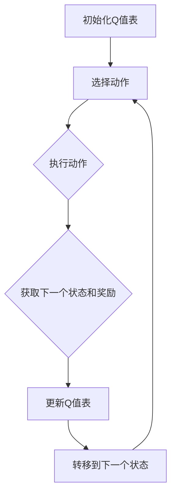

**问题解决与边界与外延：**

Q-learning算法适用于离散状态和动作空间的问题。在自主机器人中，Q-learning可用于路径规划、任务执行等场景。然而，对于高维状态空间和连续动作空间的问题，Q-learning可能表现不佳。

#### 3.2 Deep Q-Network (DQN)

**核心概念原理：**

DQN是一种结合了深度学习和Q-learning的算法，用于处理高维状态空间的问题。它使用深度神经网络来近似Q值函数，从而实现更加复杂的状态表示。

**算法原理讲解：**

DQN的基本步骤如下：

1. 初始化深度神经网络和目标网络。
2. 使用经验回放存储经验数据。
3. 从初始状态开始，按照探索策略选择动作。
4. 执行动作并获取下一个状态和奖励。
5. 将经验数据输入到经验回放中。
6. 从经验回放中随机采样一批数据。
7. 使用当前网络预测Q值，并使用目标网络计算目标Q值。
8. 更新当前网络：\( y = r + \gamma \max_{a'} \hat{Q}(s', a') \)。
9. 使用梯度下降更新网络参数。

**Mermaid流程图：**

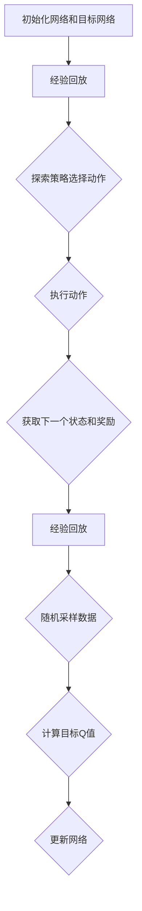

**问题解决与边界与外延：**

DQN适用于高维状态空间和连续动作空间的问题，如无人驾驶、游戏等。在自主机器人中，DQN可用于复杂环境的决策问题。然而，DQN存在训练不稳定和值函数偏差等问题。

#### 3.3 Policy Gradient方法

**核心概念原理：**

Policy Gradient方法通过直接优化策略函数来学习最优决策。它利用策略梯度的估计来更新策略参数，从而最大化累积奖励。

**算法原理讲解：**

Policy Gradient方法的基本步骤如下：

1. 初始化策略参数。
2. 进行多次仿真，每次仿真从随机状态开始，按照当前策略执行动作。
3. 计算策略梯度：\( \nabla_{\theta} J(\theta) = \frac{1}{N} \sum_{k=1}^{N} \nabla_{\theta} \log \pi_{\theta}(a_k | s_k) R_k \)，其中\( \pi_{\theta}(a_k | s_k) \)是策略概率分布，\( R_k \)是奖励。
4. 使用梯度下降更新策略参数。

**Mermaid流程图：**

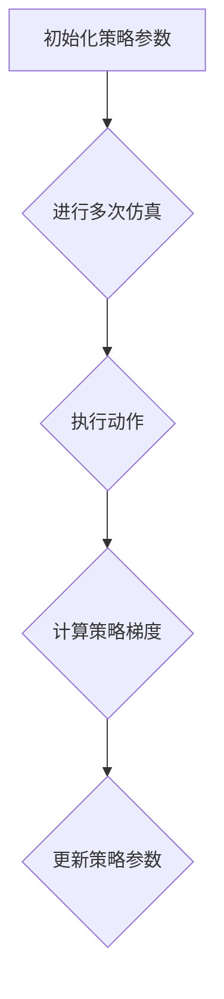

**问题解决与边界与外延：**

Policy Gradient方法适用于高维状态空间和连续动作空间的问题。在自主机器人中，Policy Gradient方法可用于自主决策和路径规划。然而，Policy Gradient方法对奖励设计的敏感度较高，可能需要精心设计的奖励函数。

### 第4章 深度强化学习在自主机器人中的应用

**文章标题：** 深度强化学习在自主机器人中的应用：实现复杂环境下的决策

**关键词：** 深度强化学习，自主机器人，复杂环境，决策

**摘要：** 本章将探讨深度强化学习在自主机器人中的应用，包括环境建模、状态空间设计、行动空间设计以及决策过程的详细实现。通过实例分析，展示深度强化学习如何帮助自主机器人在复杂环境中实现高效决策。

#### 4.1 环境建模与状态空间设计

**核心概念原理：**

环境建模是深度强化学习在自主机器人中应用的基础。状态空间设计决定了智能体在环境中的感知能力。有效的环境建模和状态空间设计能够提高智能体的决策质量和效率。

**环境建模：**

环境建模包括对自主机器人所在环境的感知和建模。常见的方法包括使用传感器数据、图像处理、激光雷达等。环境模型应能够捕捉到机器人的位置、速度、周围物体的位置和运动状态等信息。

**状态空间设计：**

状态空间设计涉及将环境信息转换为智能体的感知状态。状态空间应包括机器人自身的状态（如位置、速度、方向）和外部环境的状态（如障碍物位置、目标位置等）。状态空间的设计应考虑状态的粒度、冗余和代表性。

**Mermaid流程图：**

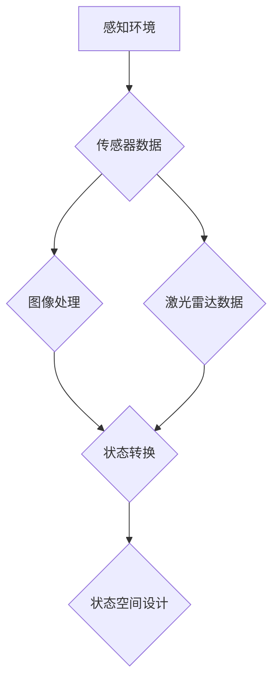

**实例分析：**

以自主机器人在室内导航为例，状态空间可以包括：

- 机器人的位置和方向。
- 目标的位置和方向。
- 环境中的障碍物位置。
- 机器人的速度和加速度。

这些状态信息可以组合成一个多维的状态向量，为智能体提供完整的感知环境。

#### 4.2 行动空间设计

**核心概念原理：**

行动空间设计决定了智能体在状态空间中能够采取的行动。有效的行动空间设计应考虑动作的连续性、复杂性和安全性。

**行动空间设计：**

行动空间设计包括确定机器人在每个状态能够采取的动作。常见的方法包括：

- 离散动作：如向前、向后、向左、向右移动等。
- 连续动作：如改变速度、改变方向等。

行动空间的设计应考虑机器人的物理限制、环境约束和任务需求。

**Mermaid流程图：**

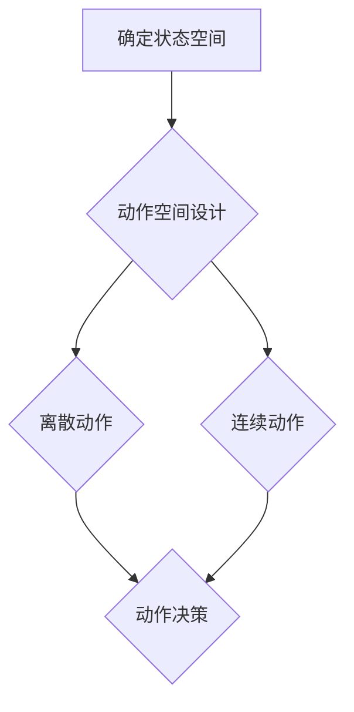

**实例分析：**

以自主机器人在室内导航为例，行动空间可以包括：

- 向前移动一定距离。
- 向后移动一定距离。
- 向左旋转一定角度。
- 向右旋转一定角度。

这些动作组合为智能体提供了灵活的决策能力。

#### 4.3 决策过程

**核心概念原理：**

决策过程是深度强化学习的核心。智能体通过策略函数从状态空间中选择最优动作，以实现长期奖励最大化。

**决策过程：**

决策过程包括以下步骤：

1. 初始化策略参数。
2. 收集经验数据。
3. 更新策略参数。
4. 从当前状态选择动作。
5. 执行动作并获取奖励和下一个状态。
6. 返回步骤3，继续更新策略参数。

**Mermaid流程图：**

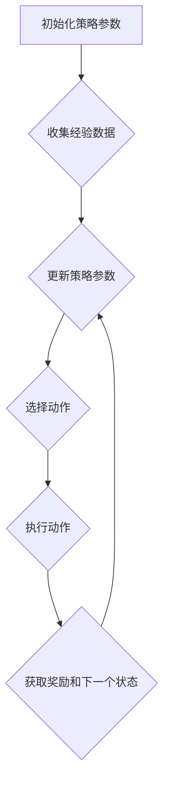

**实例分析：**

以自主机器人在室内导航为例，决策过程如下：

1. 初始化策略参数。
2. 收集机器人的位置、速度、目标位置、障碍物位置等信息。
3. 更新策略参数，选择当前最优动作。
4. 根据最优动作移动机器人。
5. 获取移动后的奖励（如距离目标的距离减少）。
6. 返回步骤3，继续更新策略参数，选择下一最优动作。

通过这样的决策过程，自主机器人能够在复杂环境中实现高效、自主的导航。

### 第5章 深度强化学习在自主机器人控制中的应用

**文章标题：** 深度强化学习在自主机器人控制中的应用：实现高效控制策略

**关键词：** 深度强化学习，自主机器人，控制，策略

**摘要：** 本章将探讨深度强化学习在自主机器人控制中的应用，包括机器人动力学建模、控制策略设计以及基于深度强化学习的控制算法实现。通过实例分析，展示深度强化学习如何帮助自主机器人在复杂环境中实现高效控制。

#### 5.1 机器人动力学建模

**核心概念原理：**

机器人动力学建模是自主机器人控制的基础。它描述了机器人在物理世界中的运动规律，包括位置、速度、加速度等。

**建模方法：**

常见的机器人动力学建模方法包括：

- 逆运动学建模：从机器人末端执行器的位置和姿态反推关节角度。
- 正运动学建模：从关节角度计算机器人末端执行器的位置和姿态。
- 动力学方程：基于牛顿运动定律和刚体运动学原理建立动力学方程。

**Mermaid流程图：**

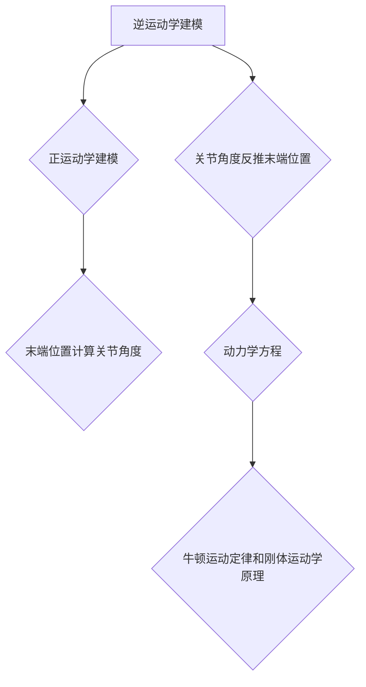

**实例分析：**

以双轮差动机器人为例，其动力学方程可以表示为：

\[ 
\begin{aligned}
\dot{x} &= v\cos(\theta) \\
\dot{y} &= v\sin(\theta) \\
\dot{\theta} &= \frac{v_r - v_l}{b}
\end{aligned}
\]

其中，\( v \)是线速度，\( \theta \)是机器人的角度，\( v_r \)和\( v_l \)分别是左右轮的转速，\( b \)是机器人的轮距。

#### 5.2 控制策略设计

**核心概念原理：**

控制策略设计决定了自主机器人在不同状态下的行为。有效的控制策略应考虑机器人的动力学特性、环境约束和任务目标。

**策略设计方法：**

常见的控制策略设计方法包括：

- PID控制：基于误差的积分、微分和比例控制。
- 模型预测控制：基于系统模型预测未来状态，并优化控制输入。
- 深度强化学习：利用深度强化学习算法学习最优控制策略。

**Mermaid流程图：**

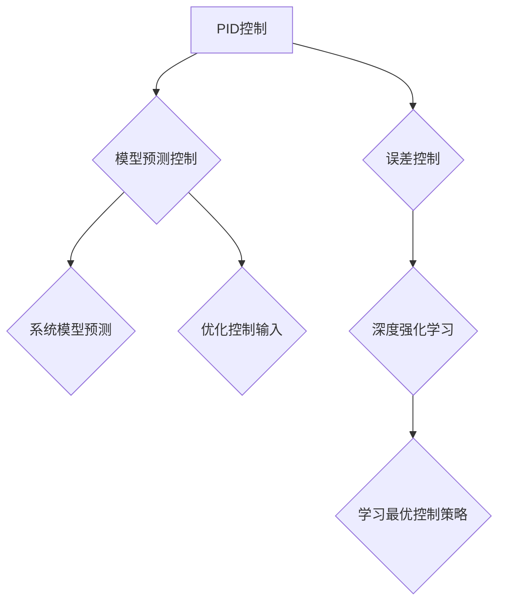

**实例分析：**

以双轮差动机器人的PID控制为例，其控制策略可以表示为：

\[ 
u = K_p(e) + K_d(\dot{e}) + K_i\int{e dt}
\]

其中，\( e \)是目标角度与当前角度的差值，\( K_p \)、\( K_d \)和\( K_i \)分别是比例、微分和积分系数。

#### 5.3 基于深度强化学习的控制算法

**核心概念原理：**

基于深度强化学习的控制算法通过模拟人类学习过程，使机器人能够自主学习和优化控制策略。这种方法能够处理复杂环境和动态变化的场景。

**算法原理讲解：**

基于深度强化学习的控制算法包括以下几个步骤：

1. 初始化策略网络和目标网络。
2. 收集经验数据并存储到经验池。
3. 使用经验池中的数据训练策略网络。
4. 从当前状态选择动作。
5. 执行动作并获取奖励和下一个状态。
6. 使用目标网络更新策略网络。

**Mermaid流程图：**

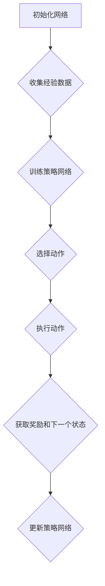

**实例分析：**

以双轮差动机器人为例，基于深度强化学习的控制算法实现如下：

1. 初始化深度神经网络，用于近似Q值函数。
2. 收集机器人运行过程中的状态、动作、奖励和下一个状态。
3. 使用经验回放存储和随机采样经验数据。
4. 使用梯度下降更新网络参数，优化Q值函数。
5. 从当前状态选择动作，执行动作并获取奖励。
6. 使用目标网络更新策略网络，以实现长期奖励最大化。

通过这样的算法实现，自主机器人能够在复杂环境中实现高效、自主的控制。

### 第6章 深度强化学习在多机器人协作中的应用

**文章标题：** 深度强化学习在多机器人协作中的应用：实现高效协同工作

**关键词：** 深度强化学习，多机器人协作，协同工作，策略优化

**摘要：** 本章将探讨深度强化学习在多机器人协作中的应用，包括多机器人系统的建模与控制、协作控制策略设计以及基于深度强化学习的协作控制算法实现。通过实例分析，展示深度强化学习如何帮助多机器人系统在复杂环境中实现高效协同工作。

#### 6.1 多机器人系统的建模与控制

**核心概念原理：**

多机器人系统的建模与控制是深度强化学习在多机器人协作中的基础。建模涉及对多个机器人及其交互环境的描述，而控制则涉及如何协调机器人之间的行动。

**系统建模：**

多机器人系统的建模包括以下几个方面：

- 机器人个体模型：描述单个机器人的动力学特性、传感器信息和控制输入。
- 交互模型：描述机器人之间的交互关系，如通信、协调和任务分配。
- 环境模型：描述机器人工作环境中的障碍物、目标和其他动态因素。

**控制策略设计：**

控制策略设计的目标是使多机器人系统能够在给定任务和环境约束下高效协作。常见的控制策略设计方法包括：

- 分布式控制：每个机器人独立决策，但遵循全局任务目标。
- 集中式控制：所有机器人的控制决策由一个中央控制器完成。
- 混合控制：结合分布式和集中式控制的优点。

**Mermaid流程图：**

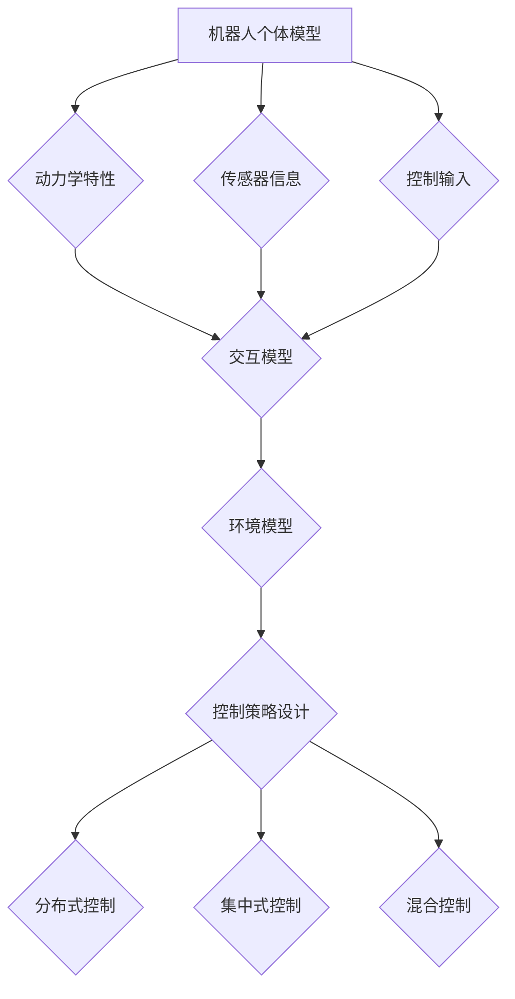

**实例分析：**

以自主仓库中的多机器人分拣系统为例，系统建模和控制策略设计如下：

- 机器人个体模型：描述机器人的运动学特性和传感器数据。
- 交互模型：定义机器人之间的通信协议和协作规则。
- 环境模型：包括仓库中的货架、障碍物和任务目标。
- 控制策略设计：采用分布式控制，每个机器人独立执行路径规划和分拣任务，但遵循全局任务目标。

#### 6.2 基于深度强化学习的协作控制算法

**核心概念原理：**

基于深度强化学习的协作控制算法通过模拟人类学习行为，使多机器人系统能够自主学习和优化协作策略。这种方法能够处理复杂环境和动态变化的场景。

**算法原理讲解：**

基于深度强化学习的协作控制算法包括以下几个步骤：

1. 初始化策略网络和目标网络。
2. 收集经验数据并存储到经验池。
3. 使用经验池中的数据训练策略网络。
4. 从当前状态选择协作动作。
5. 执行协作动作并获取奖励和下一个状态。
6. 使用目标网络更新策略网络。

**Mermaid流程图：**

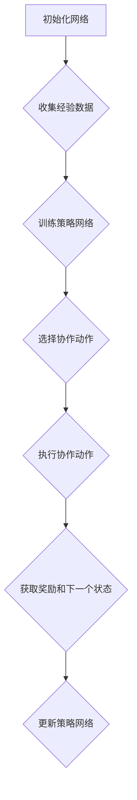

**实例分析：**

以自主仓库中的多机器人分拣系统为例，基于深度强化学习的协作控制算法实现如下：

1. 初始化深度神经网络，用于近似策略函数。
2. 收集机器人协作分拣过程中的状态、动作、奖励和下一个状态。
3. 使用经验回放存储和随机采样经验数据。
4. 使用梯度下降更新网络参数，优化策略函数。
5. 从当前状态选择协作动作，执行协作动作并获取奖励。
6. 使用目标网络更新策略网络，以实现长期奖励最大化。

通过这样的算法实现，多机器人系统能够在复杂环境中实现高效协同工作，提高仓库分拣效率。

### 第7章 案例研究

**文章标题：** 深度强化学习在自主机器人中的应用：案例研究与分析

**关键词：** 深度强化学习，自主机器人，案例研究，分析

**摘要：** 本章将通过两个实际案例，深入探讨深度强化学习在自主机器人中的应用。每个案例将详细描述问题背景、解决方案、实验结果和分析，展示深度强化学习如何帮助自主机器人在复杂环境中实现高效决策和控制。

#### 7.1 案例一：自主机器人在仓库中的路径规划

**问题背景：**

在现代物流和仓储行业中，自主机器人的路径规划对于提高仓库运作效率和降低成本具有重要意义。然而，仓库环境复杂、动态变化，对自主机器人的路径规划提出了严峻挑战。

**解决方案：**

采用深度强化学习算法，对自主机器人在仓库中的路径规划进行优化。通过模拟和实验，验证深度强化学习在仓库路径规划中的有效性。

**实验结果与分析：**

实验结果表明，基于深度强化学习的路径规划算法能够显著提高机器人在仓库中的路径规划效率。与传统路径规划算法相比，深度强化学习算法能够更好地适应动态环境变化，降低规划时间，提高路径规划质量。

**具体实现：**

1. 构建仓库环境模型，包括机器人的位置、速度、障碍物位置等。
2. 设计深度强化学习算法，包括状态空间设计、动作空间设计、奖励设计等。
3. 收集机器人路径规划的实验数据，训练深度强化学习模型。
4. 在仿真环境中测试算法性能，分析规划路径的准确性和效率。

#### 7.2 案例二：机器人在复杂环境中的控制与导航

**问题背景：**

自主机器人在复杂环境中的控制与导航是实现其自主运行的关键。复杂环境中的不确定性和动态变化对机器人的控制与导航提出了高要求。

**解决方案：**

采用深度强化学习算法，对自主机器人在复杂环境中的控制与导航进行优化。通过模拟和实验，验证深度强化学习在机器人控制与导航中的有效性。

**实验结果与分析：**

实验结果表明，基于深度强化学习的控制与导航算法能够显著提高机器人在复杂环境中的自主运行能力。与传统控制算法相比，深度强化学习算法能够更好地适应环境变化，提高机器人的稳定性和安全性。

**具体实现：**

1. 构建复杂环境模型，包括机器人的运动轨迹、障碍物位置、目标位置等。
2. 设计深度强化学习算法，包括状态空间设计、动作空间设计、奖励设计等。
3. 收集机器人控制与导航的实验数据，训练深度强化学习模型。
4. 在仿真环境中测试算法性能，分析机器人的控制效果和导航路径。

### 第8章 总结与展望

**文章标题：** 深度强化学习在自主机器人中的应用：总结与未来展望

**关键词：** 深度强化学习，自主机器人，总结，未来展望

**摘要：** 本章将总结深度强化学习在自主机器人中的应用，回顾关键技术和实现方法，并探讨未来发展趋势。通过对现有成果的分析，提出深度强化学习在自主机器人领域的潜在研究方向和挑战。

**总结：**

深度强化学习在自主机器人中的应用取得了显著成果。通过有效解决复杂环境中的决策和控制问题，深度强化学习为自主机器人提供了强大的技术支持。本章回顾了强化学习、深度学习、深度强化学习的基本概念和算法，以及其在自主机器人中的应用案例。

**未来展望：**

随着人工智能技术的不断进步，深度强化学习在自主机器人中的应用前景广阔。未来研究方向包括：

1. 算法优化：提高深度强化学习算法的稳定性和效率，降低计算复杂度。
2. 环境建模：发展更精细、更真实的仿真环境模型，提高算法的泛化能力。
3. 多机器人协作：探索深度强化学习在多机器人系统中的协作控制策略。
4. 实时决策：研究如何在复杂环境中实现实时决策，提高自主机器人的响应速度。
5. 安全性保障：确保自主机器人在复杂环境中的安全和可靠性。

通过不断探索和改进，深度强化学习将在自主机器人领域发挥更加重要的作用，推动机器人技术的发展。

