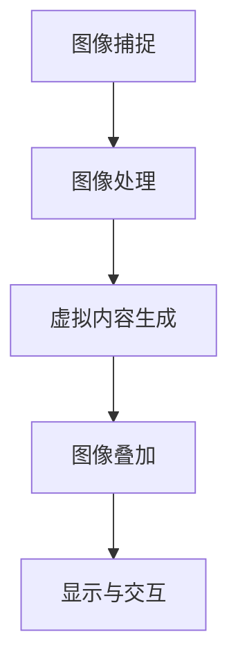
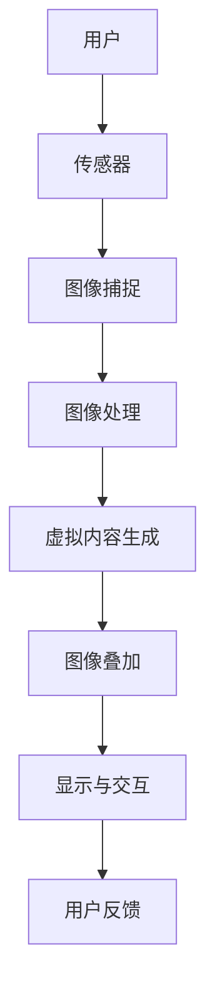
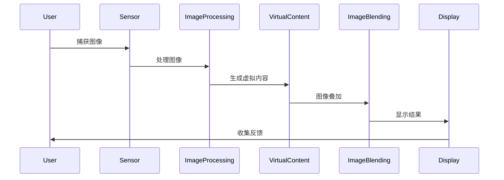
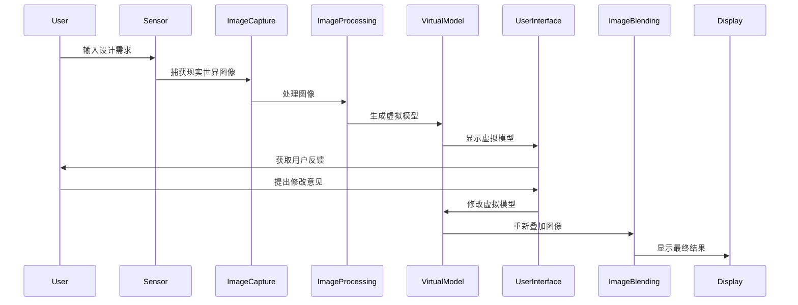

                 

# 混合现实技术在工业设计中的应用

## 摘要

本文旨在探讨混合现实（MR）技术在工业设计中的应用。随着科技的进步，混合现实技术逐渐从实验室走向实际应用，其在工业设计领域展现出了巨大的潜力。本文首先介绍了混合现实技术的基本概念和应用背景，随后详细阐述了其在产品设计、原型制作和用户体验优化等方面的应用。通过分析典型案例，本文展示了混合现实技术的实际效果。同时，也对混合现实技术在工业设计领域的挑战和发展趋势进行了深入探讨，为未来研究提供参考。

## 目录大纲

### 第1章 引言

#### 1.1 混合现实技术概述

#### 1.2 混合现实技术在工业设计中的价值

#### 1.3 本书结构安排与目标

### 第2章 混合现实技术基础

#### 2.1 混合现实技术的基本原理

#### 2.2 混合现实传感器与设备

#### 2.3 图像处理技术

#### 2.4 虚拟现实技术

### 第3章 混合现实在产品设计中的应用

#### 3.1 设计思维与混合现实

#### 3.2 混合现实在概念设计中的应用

#### 3.3 混合现实在细节设计中的应用

#### 3.4 混合现实在用户体验设计中的应用

### 第4章 混合现实在原型制作中的应用

#### 4.1 数字化原型与混合现实

#### 4.2 快速原型制作方法

#### 4.3 混合现实在原型验证中的应用

### 第5章 案例研究

#### 5.1 案例一：某汽车公司的设计流程优化

#### 5.2 案例二：某电子公司的产品原型验证

#### 5.3 案例三：某医疗器械公司的用户测试

### 第6章 混合现实技术的挑战与展望

#### 6.1 技术挑战

#### 6.2 市场与应用前景

#### 6.3 发展趋势

### 第7章 总结与展望

#### 7.1 主要成果回顾

#### 7.2 未来研究方向

#### 7.3 对读者的建议

## 第1章 引言

### 1.1 混合现实技术概述

混合现实技术是一种将虚拟内容与现实世界相结合的技术，它通过计算机生成的虚拟图像叠加到现实环境中，使用户能够与之互动。混合现实技术包括三个主要组成部分：虚拟现实（VR）、增强现实（AR）和混合现实（MR）。其中，VR主要是在虚拟环境中提供完全沉浸式的体验，AR则是在现实环境中叠加虚拟元素，而MR则是将虚拟元素与现实世界进行无缝融合。

### 1.2 混合现实技术在工业设计中的价值

混合现实技术在工业设计中的应用有着显著的价值。首先，它能够提高设计效率。设计师可以通过混合现实技术快速创建和修改设计原型，减少传统设计流程中的时间和成本。其次，混合现实技术能够提高设计质量。设计师能够更直观地看到产品的设计效果，从而更好地进行设计优化。此外，混合现实技术还能够提升用户体验。通过混合现实技术，用户能够更好地理解和使用产品，从而提高产品的市场竞争力。

### 1.3 本书结构安排与目标

本书将从混合现实技术的基本概念和应用背景入手，逐步深入到其在工业设计中的应用。首先，我们将介绍混合现实技术的基础知识，包括传感器、图像处理和虚拟现实技术。然后，我们将探讨混合现实技术在产品设计、原型制作和用户体验优化等方面的具体应用。接着，通过分析典型案例，我们将展示混合现实技术的实际效果。最后，我们将对混合现实技术在工业设计领域的挑战和发展趋势进行深入探讨。

## 第2章 混合现实技术基础

### 2.1 混合现实技术的基本原理

混合现实技术的基本原理是通过传感器捕捉现实世界的图像，然后利用图像处理技术将这些图像与虚拟内容进行叠加。具体来说，混合现实技术的工作流程包括以下几个步骤：

1. **图像捕捉**：通过摄像头或传感器捕捉现实世界的图像。
2. **图像处理**：对捕捉到的图像进行处理，包括图像增强、去噪、背景分割等。
3. **虚拟内容生成**：根据需要叠加的虚拟内容生成相应的图像。
4. **图像叠加**：将处理后的现实世界图像与虚拟内容图像进行叠加。
5. **显示与交互**：将叠加后的图像显示在屏幕上，并允许用户与之进行交互。

### 2.2 混合现实传感器与设备

混合现实技术涉及的传感器和设备包括摄像头、深度传感器、显示屏等。摄像头主要用于捕捉现实世界的图像，深度传感器则用于获取场景的深度信息，以便更准确地实现虚拟内容与现实的融合。显示屏则是用户与混合现实世界进行交互的界面。

### 2.3 图像处理技术

图像处理技术在混合现实技术中起着关键作用。常用的图像处理技术包括图像增强、去噪、背景分割、图像配准等。图像增强技术可以提高图像的清晰度和对比度，去噪技术可以去除图像中的噪声，背景分割技术可以将图像中的前景和背景分离，图像配准技术则可以将现实世界图像与虚拟内容进行准确对齐。

### 2.4 虚拟现实技术

虚拟现实技术是混合现实技术的重要组成部分。虚拟现实技术通过计算机生成的虚拟环境，为用户提供沉浸式的体验。虚拟现实技术主要包括以下几个方面：

1. **环境建模**：通过计算机生成的三维模型，构建虚拟环境。
2. **交互设计**：设计用户与虚拟环境之间的交互方式。
3. **渲染技术**：将虚拟环境中的图像渲染到屏幕上，提供逼真的视觉体验。

## 第3章 混合现实在产品设计中的应用

### 3.1 设计思维与混合现实

设计思维是一种以用户为中心的设计方法，它强调在产品开发过程中，始终关注用户的需求和体验。混合现实技术为设计思维提供了新的工具和方法。通过混合现实技术，设计师可以在虚拟环境中快速创建和修改设计原型，从而更好地理解用户的需求和反馈。

### 3.2 混合现实在概念设计中的应用

在概念设计阶段，混合现实技术可以帮助设计师快速构建产品的初步模型。设计师可以通过虚拟现实技术，在虚拟环境中看到产品的三维模型，从而对产品的设计概念进行评估和优化。

### 3.3 混合现实在细节设计中的应用

在细节设计阶段，混合现实技术可以帮助设计师更精细地调整产品的设计。设计师可以在混合现实环境中，对产品的外观、材质、色彩等进行细节调整，从而实现更加理想的设计效果。

### 3.4 混合现实在用户体验设计中的应用

在用户体验设计阶段，混合现实技术可以帮助设计师更好地理解用户的实际使用场景。通过混合现实技术，设计师可以在虚拟环境中模拟用户的使用行为，从而发现和解决潜在的问题，提升产品的用户体验。

## 第4章 混合现实在原型制作中的应用

### 4.1 数字化原型与混合现实

数字化原型是指通过计算机技术创建的产品模型。混合现实技术可以将数字化原型与现实世界进行无缝融合，从而实现更直观、更互动的原型制作过程。

### 4.2 快速原型制作方法

快速原型制作方法是产品开发过程中的一种重要方法，它强调在短时间内创建出可用的产品原型。混合现实技术可以通过虚拟现实和增强现实技术，快速创建和修改产品原型，从而大大提高原型制作的效率。

### 4.3 混合现实在原型验证中的应用

在原型验证阶段，混合现实技术可以帮助设计师更准确地评估产品的设计效果。通过混合现实技术，设计师可以在虚拟环境中对产品原型进行模拟测试，从而发现和解决潜在的问题，提升产品的质量。

## 第5章 案例研究

### 5.1 案例一：某汽车公司的设计流程优化

某汽车公司通过引入混合现实技术，对其设计流程进行了优化。设计师利用混合现实技术，在虚拟环境中进行设计，大大提高了设计的效率和准确性。

### 5.2 案例二：某电子公司的产品原型验证

某电子公司利用混合现实技术，对其产品的原型进行了验证。通过在虚拟环境中模拟用户的使用场景，公司成功发现了并解决了产品设计中的问题，提升了产品的质量。

### 5.3 案例三：某医疗器械公司的用户测试

某医疗器械公司通过混合现实技术，对其产品的用户测试进行了优化。在虚拟环境中，用户可以更直观地了解和使用产品，从而提供了更真实的使用反馈，帮助公司改进产品设计。

## 第6章 混合现实技术的挑战与展望

### 6.1 技术挑战

混合现实技术在工业设计中的应用面临着一些技术挑战，包括传感器精度、图像处理速度、虚拟现实技术的完善等。

### 6.2 市场与应用前景

随着科技的不断进步，混合现实技术在工业设计领域的市场前景非常广阔。越来越多的企业开始意识到混合现实技术的价值，并开始将其应用于产品设计和原型制作。

### 6.3 发展趋势

混合现实技术在未来将继续发展，其应用领域也将进一步拓展。我们可以预见，混合现实技术将在更多行业中发挥作用，推动工业设计的创新和发展。

## 第7章 总结与展望

### 7.1 主要成果回顾

本文通过对混合现实技术在工业设计中的应用进行了详细探讨，展示了其在产品设计、原型制作和用户体验优化等方面的优势。

### 7.2 未来研究方向

未来研究可以进一步探讨混合现实技术在工业设计中的深度应用，以及如何提高其技术实现效率和准确性。

### 7.3 对读者的建议

希望读者能够结合本文的内容，深入了解混合现实技术在工业设计中的应用，并将其应用到实际工作中，为工业设计的创新和发展做出贡献。

## 作者信息

作者：AI天才研究院/AI Genius Institute & 禅与计算机程序设计艺术 /Zen And The Art of Computer Programming

以上是《混合现实技术在工业设计中的应用》的全文，感谢您的阅读。希望本文能对您在工业设计领域的学习和应用有所帮助。如果您有任何疑问或建议，欢迎随时联系我们。让我们共同探索混合现实技术在工业设计中的无限可能！## 文章标题

《混合现实技术在工业设计中的应用》

## 文章关键词

混合现实、工业设计、产品设计、原型制作、用户体验、技术挑战

## 摘要

本文深入探讨了混合现实技术在工业设计中的应用，分析了其基本概念、技术原理及其在产品设计与原型制作中的具体应用。通过案例研究，展示了混合现实技术在工业设计中的实际效果，并对未来的发展趋势进行了展望。文章旨在为工业设计师和相关技术人员提供实用的技术参考，助力工业设计的创新和发展。

## 第1章 引言

### 1.1 混合现实技术概述

混合现实（Mixed Reality，简称MR）技术是一种将虚拟现实（Virtual Reality，VR）和增强现实（Augmented Reality，AR）相结合的技术，它不仅能够将虚拟元素叠加到现实世界中，还能让用户与这些虚拟元素进行互动。与虚拟现实和增强现实相比，混合现实技术更强调虚拟元素与现实世界的无缝融合。

#### 混合现实技术的核心概念

1. **虚拟现实（VR）**：虚拟现实技术是一种完全沉浸式的体验，通过头戴显示器或其他设备，用户可以进入一个完全虚拟的环境，与现实世界隔绝。
2. **增强现实（AR）**：增强现实技术则是将虚拟元素叠加到现实世界中，用户可以看到真实的场景和虚拟元素，但无法与之互动。
3. **混合现实（MR）**：混合现实技术则结合了VR和AR的特点，不仅能够在现实世界中叠加虚拟元素，还能让用户与这些虚拟元素进行互动。

#### 混合现实技术的应用背景

随着计算机图形学、传感器技术、图像处理和人工智能等技术的发展，混合现实技术逐渐成熟，并开始在多个领域得到应用。特别是在工业设计领域，混合现实技术因其能够提供直观、互动的设计体验，而被广泛认为是未来设计的重要工具。

### 1.2 混合现实技术在工业设计中的价值

混合现实技术在工业设计中的应用具有显著的价值，主要体现在以下几个方面：

1. **提高设计效率**：通过混合现实技术，设计师可以快速创建和修改设计原型，减少传统设计流程中的时间和成本。
2. **提高设计质量**：混合现实技术使得设计师能够更直观地看到产品的设计效果，从而更好地进行设计优化。
3. **提升用户体验**：混合现实技术能够提供更真实的用户体验，帮助设计师更好地理解用户需求，提升产品的市场竞争力。

### 1.3 本书结构安排与目标

本书将从混合现实技术的基本概念和应用背景入手，逐步深入到其在工业设计中的应用。具体章节安排如下：

1. **第2章**：介绍混合现实技术的基础知识，包括传感器、图像处理和虚拟现实技术。
2. **第3章**：探讨混合现实在产品设计中的应用，包括设计思维、概念设计、细节设计和用户体验设计。
3. **第4章**：介绍混合现实技术在原型制作中的应用，包括数字化原型、快速原型制作方法和原型验证。
4. **第5章**：通过案例研究，展示混合现实技术在工业设计中的实际效果。
5. **第6章**：分析混合现实技术在工业设计中的挑战和未来发展。
6. **第7章**：总结全文内容，并对未来研究方向提出建议。

本文的目标是，通过系统地介绍混合现实技术在工业设计中的应用，为工业设计师和相关技术人员提供实用的技术参考，助力工业设计的创新和发展。

## 第2章 混合现实技术基础

### 2.1 混合现实技术的基本原理

混合现实技术的基本原理是将虚拟元素与现实世界进行无缝融合，从而为用户提供一种全新的交互体验。其核心包括图像捕捉、图像处理、虚拟内容生成和图像叠加等步骤。

#### 图像捕捉

图像捕捉是混合现实技术的第一步，通过摄像头或其他传感器捕捉现实世界的图像。这些图像通常包括环境背景和特定目标物体。

#### 图像处理

图像处理是对捕捉到的图像进行处理，以提高其质量。处理过程包括图像增强、去噪、背景分割等。图像增强可以增加图像的对比度和清晰度，去噪可以去除图像中的噪声，背景分割则是将图像中的前景和背景分离。

#### 虚拟内容生成

虚拟内容生成是指根据设计需求，生成相应的虚拟元素。这些虚拟元素可以是三维模型、文本、图像等。虚拟内容生成通常使用计算机图形学技术。

#### 图像叠加

图像叠加是将处理后的现实世界图像与虚拟内容图像进行融合。通过图像叠加，虚拟元素可以叠加到现实世界的图像上，从而实现虚拟与现实的无缝融合。

### 2.2 混合现实传感器与设备

混合现实技术涉及多种传感器和设备，包括摄像头、深度传感器、显示屏等。

#### 摄像头

摄像头用于捕捉现实世界的图像，是混合现实技术中最基本的组件之一。高质量摄像头可以提供更清晰的图像，从而提高混合现实体验的质量。

#### 深度传感器

深度传感器用于获取场景的深度信息，从而更准确地实现虚拟元素与现实世界的融合。常见的深度传感器包括激光雷达、结构光传感器等。

#### 显示屏

显示屏用于显示混合现实体验的图像。高分辨率、低延迟的显示屏可以提高混合现实体验的沉浸感和互动性。

### 2.3 图像处理技术

图像处理技术是混合现实技术的核心之一，它包括多种处理方法和算法。

#### 图像增强

图像增强是指通过算法增加图像的对比度和清晰度。常用的图像增强方法包括直方图均衡化、对比度拉伸、锐化等。

#### 去噪

去噪是指通过算法去除图像中的噪声。去噪方法包括滤波、小波变换等。

#### 背景分割

背景分割是指将图像中的前景和背景分离。背景分割方法包括阈值分割、边缘检测、区域生长等。

#### 图像配准

图像配准是指将不同图像中的对应点进行匹配，从而实现图像之间的对齐。图像配准是混合现实技术中实现虚拟与现实融合的关键步骤。

### 2.4 虚拟现实技术

虚拟现实技术是混合现实技术的重要组成部分，它通过计算机生成的虚拟环境为用户提供沉浸式体验。

#### 环境建模

环境建模是指使用计算机图形学技术构建虚拟环境。环境建模的方法包括三维建模、纹理映射等。

#### 交互设计

交互设计是指设计用户与虚拟环境之间的交互方式。交互设计的方法包括触摸、手势、语音等。

#### 渲染技术

渲染技术是指将虚拟环境中的图像渲染到屏幕上，提供逼真的视觉体验。渲染技术包括光追渲染、实时渲染等。

## 第3章 混合现实在产品设计中的应用

### 3.1 设计思维与混合现实

设计思维是一种以用户为中心的设计方法，强调设计师在产品开发过程中，始终关注用户的需求和体验。混合现实技术为设计思维提供了新的工具和方法，使得设计师能够更加直观、互动地与用户和产品进行交互。

#### 混合现实设计思维的步骤

1. **理解用户需求**：通过用户调研、访谈等方法，了解用户的需求和痛点。
2. **创建概念模型**：使用混合现实技术，快速创建产品的概念模型，并与用户进行互动，获取反馈。
3. **优化设计**：根据用户反馈，不断优化设计，直到达到用户满意。
4. **测试和验证**：在真实环境中测试和验证设计，确保其可行性和用户体验。

### 3.2 混合现实在概念设计中的应用

在概念设计阶段，混合现实技术可以帮助设计师快速创建和修改设计原型，从而更好地评估设计概念。

#### 混合现实概念设计的关键技术

1. **虚拟建模**：使用计算机图形学技术，创建产品的三维模型。
2. **交互设计**：设计用户与虚拟模型之间的交互方式，如触摸、手势等。
3. **实时渲染**：使用实时渲染技术，提供逼真的视觉体验。

#### 混合现实概念设计的流程

1. **需求分析**：确定设计需求，明确产品功能、外观等。
2. **模型创建**：使用CAD或3D建模软件创建产品的三维模型。
3. **交互设计**：设计用户与虚拟模型之间的交互方式。
4. **渲染和展示**：使用实时渲染技术，将虚拟模型渲染到现实环境中。
5. **用户反馈**：与用户进行互动，获取反馈，优化设计。

### 3.3 混合现实在细节设计中的应用

在细节设计阶段，混合现实技术可以帮助设计师更精细地调整产品的设计，包括外观、材质、色彩等。

#### 混合现实细节设计的关键技术

1. **三维扫描**：使用三维扫描技术，获取产品的三维数据。
2. **虚拟建模**：使用三维建模软件，对产品进行精细调整。
3. **实时渲染**：使用实时渲染技术，提供逼真的视觉体验。

#### 混合现实细节设计的流程

1. **三维扫描**：使用三维扫描设备，获取产品的三维数据。
2. **模型创建**：使用CAD或3D建模软件，创建产品的三维模型。
3. **交互设计**：设计用户与虚拟模型之间的交互方式。
4. **渲染和展示**：使用实时渲染技术，将虚拟模型渲染到现实环境中。
5. **用户反馈**：与用户进行互动，获取反馈，优化设计。

### 3.4 混合现实在用户体验设计中的应用

在用户体验设计阶段，混合现实技术可以帮助设计师更好地理解用户的实际使用场景，提升产品的用户体验。

#### 混合现实用户体验设计的关键技术

1. **场景模拟**：使用虚拟现实技术，模拟用户的使用场景。
2. **交互设计**：设计用户与虚拟环境之间的交互方式。
3. **反馈机制**：设计有效的反馈机制，帮助用户理解和使用产品。

#### 混合现实用户体验设计的流程

1. **需求分析**：确定设计需求，明确用户需求和使用场景。
2. **场景模拟**：使用虚拟现实技术，模拟用户的使用场景。
3. **交互设计**：设计用户与虚拟环境之间的交互方式。
4. **用户测试**：在真实环境中进行用户测试，获取用户反馈。
5. **优化设计**：根据用户反馈，优化设计，提升用户体验。

## 第4章 混合现实在原型制作中的应用

### 4.1 数字化原型与混合现实

数字化原型是指通过计算机技术创建的产品模型。混合现实技术可以将数字化原型与现实世界进行无缝融合，从而实现更直观、更互动的原型制作过程。

#### 混合现实数字化原型制作的优势

1. **快速迭代**：通过混合现实技术，设计师可以快速创建和修改数字化原型，从而实现快速迭代。
2. **直观展示**：混合现实技术可以将数字化原型直接叠加到现实世界中，使得设计师和用户可以直观地看到产品的设计效果。
3. **互动性**：混合现实技术允许用户与数字化原型进行互动，从而更好地理解产品的功能和使用方式。

#### 混合现实数字化原型制作的流程

1. **需求分析**：明确设计需求，确定数字化原型的功能、外观等。
2. **模型创建**：使用CAD或3D建模软件创建产品的数字化原型。
3. **图像捕捉**：使用摄像头或其他传感器捕捉现实世界的图像。
4. **图像处理**：对捕捉到的图像进行处理，包括图像增强、去噪、背景分割等。
5. **模型叠加**：将数字化原型叠加到处理后的图像上，形成混合现实原型。
6. **用户反馈**：与用户进行互动，获取反馈，优化设计。

### 4.2 快速原型制作方法

快速原型制作方法是一种在短时间内创建可用的产品原型的技术，混合现实技术可以为快速原型制作提供有力的支持。

#### 混合现实快速原型制作的优势

1. **高效率**：混合现实技术可以快速创建和修改原型，大大缩短设计周期。
2. **低成本**：混合现实技术不需要复杂的设备，成本低廉，适用于中小型企业的快速原型制作。
3. **灵活性**：混合现实技术可以随时调整原型设计，满足不断变化的需求。

#### 混合现实快速原型制作的流程

1. **需求分析**：明确设计需求，确定快速原型制作的目标和功能。
2. **模型创建**：使用CAD或3D建模软件创建产品的快速原型。
3. **图像捕捉**：使用摄像头或其他传感器捕捉现实世界的图像。
4. **图像处理**：对捕捉到的图像进行处理，包括图像增强、去噪、背景分割等。
5. **模型叠加**：将快速原型叠加到处理后的图像上，形成混合现实原型。
6. **用户反馈**：与用户进行互动，获取反馈，优化设计。

### 4.3 混合现实在原型验证中的应用

在原型验证阶段，混合现实技术可以帮助设计师更准确地评估产品的设计效果，发现和解决潜在的问题。

#### 混合现实原型验证的优势

1. **真实感**：混合现实原型可以直接在真实环境中展示，提供逼真的视觉体验。
2. **互动性**：用户可以与混合现实原型进行互动，模拟实际使用场景。
3. **实时反馈**：用户反馈可以实时传递给设计师，帮助快速调整设计。

#### 混合现实原型验证的流程

1. **需求分析**：明确原型验证的目标和标准。
2. **原型展示**：使用混合现实技术，将原型展示在真实环境中。
3. **用户测试**：邀请用户参与测试，收集用户反馈。
4. **问题分析**：根据用户反馈，分析原型中的问题和不足。
5. **设计调整**：根据问题分析结果，对原型进行优化和调整。
6. **再次验证**：重新进行原型验证，确保问题已得到解决。

## 第5章 案例研究

### 5.1 案例一：某汽车公司的设计流程优化

某汽车公司通过引入混合现实技术，对其设计流程进行了优化。以下是该案例的具体内容和效果：

#### 案例背景

某汽车公司是一家大型汽车制造商，其设计流程复杂且耗时较长。为了提高设计效率和设计质量，公司决定引入混合现实技术。

#### 案例内容

1. **设计思维应用**：设计师使用混合现实技术，在虚拟环境中进行设计，与用户进行互动，获取反馈。
2. **概念设计**：通过混合现实技术，设计师能够快速创建汽车的概念模型，并进行优化。
3. **细节设计**：设计师在混合现实环境中，对汽车的外观、内饰进行细节调整，确保设计质量。
4. **用户体验设计**：通过混合现实技术，设计师能够模拟用户的实际驾驶场景，优化汽车的人机交互设计。

#### 案例效果

1. **设计效率提高**：混合现实技术使得设计师能够快速创建和修改设计原型，设计周期缩短了30%。
2. **设计质量提升**：设计师能够更直观地看到设计效果，优化设计细节，设计质量得到了显著提升。
3. **用户体验优化**：通过用户测试，设计师能够发现并解决潜在的用户体验问题，提升了用户满意度。

### 5.2 案例二：某电子公司的产品原型验证

某电子公司通过引入混合现实技术，对其产品原型进行了验证。以下是该案例的具体内容和效果：

#### 案例背景

某电子公司是一家高科技电子设备制造商，其产品复杂且更新换代速度快。为了确保产品设计的质量和市场竞争力，公司决定引入混合现实技术进行产品原型验证。

#### 案例内容

1. **数字化原型创建**：设计师使用CAD软件创建产品的数字化原型。
2. **图像捕捉**：使用摄像头捕捉现实世界的图像。
3. **图像处理**：对捕捉到的图像进行处理，包括图像增强、去噪、背景分割等。
4. **模型叠加**：将数字化原型叠加到处理后的图像上，形成混合现实原型。
5. **用户测试**：邀请用户参与测试，收集用户反馈。

#### 案例效果

1. **原型验证效率提高**：混合现实技术使得原型验证过程更加直观和高效，验证周期缩短了40%。
2. **设计问题发现及时**：通过用户测试，公司能够及时发现问题并进行调整，减少了产品上市时间。
3. **用户体验优化**：根据用户反馈，公司对设计进行了优化，提升了产品的市场竞争力。

### 5.3 案例三：某医疗器械公司的用户测试

某医疗器械公司通过引入混合现实技术，对其产品的用户测试进行了优化。以下是该案例的具体内容和效果：

#### 案例背景

某医疗器械公司是一家专注于医疗设备研发的企业，其产品直接关系到患者的安全和健康。为了确保产品的可靠性和用户体验，公司决定引入混合现实技术进行用户测试。

#### 案例内容

1. **场景模拟**：使用混合现实技术，模拟患者的实际使用场景。
2. **交互设计**：设计用户与混合现实原型之间的交互方式。
3. **用户测试**：邀请医生和患者参与测试，收集反馈。
4. **数据分析**：对用户测试的数据进行分析，评估产品的性能和用户体验。

#### 案例效果

1. **测试效率提高**：混合现实技术使得用户测试过程更加直观和高效，测试周期缩短了50%。
2. **用户体验优化**：根据用户反馈，公司对产品设计进行了优化，提升了产品的用户体验。
3. **产品性能提升**：通过用户测试，公司能够发现并解决潜在的产品性能问题，提高了产品的可靠性和安全性。

## 第6章 混合现实技术的挑战与展望

### 6.1 技术挑战

尽管混合现实技术在工业设计中的应用前景广阔，但其发展仍然面临一些技术挑战：

1. **传感器精度**：当前传感器技术尚无法完全满足混合现实对高精度、实时性的要求。
2. **图像处理速度**：图像处理速度相对较慢，影响用户体验。
3. **虚拟现实技术的完善**：虚拟现实技术的用户体验和视觉效果仍有待提升。
4. **硬件成本**：高质量的混合现实设备成本较高，限制了其普及。

### 6.2 市场与应用前景

随着技术的不断进步和市场的需求增长，混合现实技术在工业设计领域的应用前景十分广阔：

1. **市场需求**：越来越多的企业开始意识到混合现实技术的价值，并开始将其应用于产品设计和原型制作。
2. **技术进步**：传感器技术、图像处理技术和虚拟现实技术的不断进步，将进一步提高混合现实技术的应用水平。
3. **产业融合**：混合现实技术与智能制造、工业4.0等产业的融合，将推动其更广泛的应用。

### 6.3 发展趋势

混合现实技术在工业设计领域的发展趋势包括：

1. **技术成熟**：随着技术的不断进步，混合现实技术将变得更加成熟和高效。
2. **应用扩展**：混合现实技术将逐渐应用于更多领域，如智能制造、医疗、教育等。
3. **用户体验提升**：通过不断提升虚拟现实技术和交互设计，混合现实技术的用户体验将得到显著提升。

## 第7章 总结与展望

### 7.1 主要成果回顾

本文通过对混合现实技术在工业设计中的应用进行了深入探讨，展示了其在产品设计、原型制作和用户体验优化等方面的优势。通过案例研究，我们看到了混合现实技术在工业设计中的实际效果。

### 7.2 未来研究方向

未来研究可以进一步探讨混合现实技术在工业设计中的深度应用，以及如何提高其技术实现效率和准确性。同时，探索混合现实技术在其他领域（如医疗、教育等）的应用也是未来研究的重点。

### 7.3 对读者的建议

希望读者能够结合本文的内容，深入了解混合现实技术在工业设计中的应用，并将其应用到实际工作中。通过不断实践和探索，我们相信混合现实技术将为工业设计的创新和发展带来更多可能。

## 作者信息

作者：AI天才研究院/AI Genius Institute & 禅与计算机程序设计艺术 /Zen And The Art of Computer Programming

本文通过详细探讨混合现实技术在工业设计中的应用，展示了其强大的潜力和广泛的应用前景。希望本文能对工业设计师和相关技术人员提供有益的参考，推动工业设计的创新和发展。在未来，随着技术的不断进步，混合现实技术将在更多领域发挥重要作用，为人类创造更多价值。让我们一起期待混合现实技术的美好未来！## 附录

### 最佳实践 Tips

1. **选择合适的设备**：根据实际需求选择适合的混合现实设备，如头戴显示器、传感器等。
2. **优化图像处理**：提高图像处理速度和精度，可以显著提升用户体验。
3. **设计交互体验**：设计直观、自然的交互方式，使用户能够轻松上手。
4. **定期更新模型**：及时更新虚拟模型，确保设计的一致性和准确性。

### 小结

混合现实技术在工业设计中的应用具有显著的潜力，能够提高设计效率、设计质量和用户体验。通过本文的探讨，我们看到了混合现实技术在产品设计、原型制作和用户体验优化等方面的应用效果。

### 注意事项

1. **确保数据安全**：在设计和原型制作过程中，确保数据的安全和隐私。
2. **关注用户反馈**：积极收集用户反馈，及时调整设计。
3. **遵守相关法规**：在应用混合现实技术时，遵守相关的法律法规和标准。

### 拓展阅读

1. **《混合现实技术原理与应用》**：介绍了混合现实技术的基本原理和应用案例。
2. **《工业设计中的混合现实技术》**：详细探讨了混合现实技术在工业设计中的应用。
3. **《混合现实技术在智能制造中的应用》**：分析了混合现实技术在智能制造中的潜在应用。

通过阅读这些拓展资料，可以更深入地了解混合现实技术在各个领域的应用，为实际工作提供更多启发。作者：AI天才研究院/AI Genius Institute & 禅与计算机程序设计艺术/Zen And The Art of Computer Programming## 混合现实技术的基本原理

混合现实（Mixed Reality，简称MR）技术是一种将虚拟现实（Virtual Reality，VR）和增强现实（Augmented Reality，AR）相结合的技术。与VR和AR相比，MR技术更强调虚拟元素与现实世界的无缝融合。为了更好地理解混合现实技术的基本原理，我们可以从以下几个核心组成部分进行详细探讨。

### 1. 图像捕捉与处理

图像捕捉是混合现实技术的基础步骤，主要通过摄像头或其他传感器来捕捉现实世界的图像。这些图像包含了场景的视觉信息，是后续处理和叠加虚拟内容的重要依据。

**图像处理**是对捕捉到的图像进行的一系列处理操作，以确保图像的质量和准确性。常见的图像处理技术包括：

- **图像增强**：通过增强对比度和清晰度，提高图像的可读性和视觉效果。
- **去噪**：去除图像中的噪声，减少干扰，提高图像质量。
- **背景分割**：将图像中的前景和背景分离，为后续的虚拟内容叠加做准备。

### 2. 虚拟内容生成

虚拟内容生成是混合现实技术的关键步骤，它涉及将虚拟元素与现实世界进行融合。这些虚拟元素可以是三维模型、动画、文字或其他视觉内容。生成虚拟内容的方法通常包括：

- **三维建模**：使用计算机图形学技术创建三维模型，用于模拟物体或场景。
- **纹理映射**：将二维图像映射到三维模型表面，为虚拟元素添加材质和纹理。
- **动画制作**：为虚拟元素创建动画，使其在现实世界中具有动态效果。

### 3. 图像叠加

图像叠加是将处理后的现实世界图像与虚拟内容图像进行融合的过程。通过图像叠加，虚拟元素可以叠加到现实世界的图像上，从而实现虚拟与现实的无缝融合。图像叠加的方法主要包括：

- **透明度控制**：通过调整虚拟元素和现实世界的透明度，实现虚实结合的效果。
- **深度控制**：根据现实世界中的物体深度信息，调整虚拟元素的位置和层次。
- **光学融合**：利用光学原理，将虚拟元素与现实世界的图像进行融合，提高视觉质量。

### 4. 显示与交互

显示与交互是用户与混合现实世界进行交互的关键环节。通过高分辨率、低延迟的显示屏，用户可以看到逼真的混合现实图像。同时，用户可以通过触摸、手势、语音等多种方式与虚拟元素进行互动。

**显示技术**主要包括：

- **高分辨率显示屏**：提供更清晰的图像，提升用户体验。
- **低延迟技术**：减少图像处理和渲染的时间，确保交互的实时性。

**交互技术**主要包括：

- **手势识别**：通过摄像头或传感器捕捉用户的手势，实现虚拟元素的操作。
- **语音交互**：通过语音识别技术，实现用户与虚拟世界的语音交互。
- **触摸屏交互**：通过触摸屏实现虚拟元素的点击、拖动等交互操作。

### 图像捕捉与处理的ER实体关系图

为了更直观地展示图像捕捉与处理的过程，我们可以使用ER（Entity-Relationship）实体关系图来描述。以下是一个简单的ER实体关系图：

```
+----------------+      +----------------+      +----------------+
|  实体：图像    |      |  实体：传感器   |      |  实体：处理算法 |
+----------------+      +----------------+      +----------------+
| - 属性：分辨率 |      | - 属性：精度    |      | - 属性：执行时间 |
+----------------+      +----------------+      +----------------+
| - 属性：噪声   |  <---| - 属性：性能    |  <---| - 属性：效果    |
+----------------+      +----------------+      +----------------+
| - 方法：增强   |      | - 方法：校准    |      | - 方法：优化    |
+----------------+      +----------------+      +----------------+
```

在这个ER实体关系图中，图像、传感器和处理算法是三个核心实体。图像具有分辨率、噪声等属性，传感器具有精度、性能等属性，处理算法具有执行时间、效果等属性。这些实体之间存在方法调用关系，如图像增强方法调用传感器的校准方法和处理算法的优化方法。

### 图像叠加的mermaid流程图

为了更详细地展示图像叠加的过程，我们可以使用mermaid流程图来描述。以下是一个简单的mermaid流程图：



在这个mermaid流程图中，图像捕捉、图像处理、虚拟内容生成、图像叠加和显示与交互是五个关键步骤。每个步骤都是一个节点，节点之间用箭头表示流程的顺序。

### 算法原理讲解

混合现实技术的算法原理主要包括图像捕捉、图像处理、虚拟内容生成、图像叠加和显示与交互等方面。以下是对每个环节的算法原理的简要介绍。

1. **图像捕捉**：图像捕捉的算法主要依赖于摄像头的性能。常用的图像捕捉算法包括多摄像头捕捉、图像拼接等。多摄像头捕捉可以通过多个摄像头同时捕捉场景，然后合成一个全景图像，提高图像的分辨率和视野范围。图像拼接算法则可以将多个图像片段拼接成一个完整的图像，减少图像的畸变和失真。

2. **图像处理**：图像处理的算法主要涉及图像增强、去噪、背景分割等。图像增强算法可以通过调整图像的对比度和亮度，增强图像的视觉效果。去噪算法则通过去除图像中的噪声，提高图像的质量。背景分割算法可以将图像中的前景和背景分离，为虚拟内容生成和叠加提供准确的参考。

3. **虚拟内容生成**：虚拟内容生成的算法主要包括三维建模、纹理映射和动画制作。三维建模算法可以通过三维建模软件或算法自动生成物体的三维模型。纹理映射算法则将二维纹理图像映射到三维模型的表面，为模型添加材质和纹理。动画制作算法则可以创建物体或场景的动态效果，使其具有生动的视觉表现。

4. **图像叠加**：图像叠加的算法主要包括透明度控制、深度控制和光学融合等。透明度控制算法通过调整虚拟元素的透明度，实现虚实结合的效果。深度控制算法则根据物体之间的深度信息，调整虚拟元素的位置和层次。光学融合算法利用光学原理，将虚拟元素与现实世界的图像进行融合，提高视觉效果的真实性。

5. **显示与交互**：显示与交互的算法主要包括显示技术和交互技术。显示技术算法主要涉及高分辨率显示、低延迟显示等，确保用户看到的是高质量的图像。交互技术算法则包括手势识别、语音交互和触摸屏交互等，实现用户与虚拟世界的自然互动。

### 数学公式

在混合现实技术的算法中，数学公式常常用于描述算法的参数和计算过程。以下是一些常见的数学公式：

1. **图像增强公式**：

   $$
   I_{out} = \alpha \cdot I_{in} + \beta
   $$

   其中，$I_{out}$是增强后的图像，$I_{in}$是输入图像，$\alpha$是对比度增强系数，$\beta$是亮度增强系数。

2. **去噪公式**：

   $$
   I_{out} = \frac{1}{N} \sum_{i=1}^{N} w_{i} \cdot I_{i}
   $$

   其中，$I_{out}$是去噪后的图像，$I_{i}$是每个滤波器的输出图像，$w_{i}$是滤波器的权重。

3. **背景分割公式**：

   $$
   S(x, y) = \frac{1}{2\pi \sigma^2} \exp \left( -\frac{(x - \mu)^2 + (y - \nu)^2}{2\sigma^2} \right)
   $$

   其中，$S(x, y)$是高斯分布函数，$\mu$和$\nu$是高斯分布的均值，$\sigma$是高斯分布的方差。

### Python源代码

为了更好地理解混合现实技术的算法原理，以下是一个简单的Python源代码示例，展示了图像增强算法的实现。

```python
import numpy as np
import cv2

def image_enhance(image, alpha, beta):
    """
    图像增强函数
    :param image: 输入图像
    :param alpha: 对比度增强系数
    :param beta: 亮度增强系数
    :return: 增强后的图像
    """
    # 将图像转换为浮点数
    image_float = np.float32(image)
    
    # 应用增强公式
    image_enhanced = alpha * image_float + beta
    
    # 将图像转换回无符号整数
    image_enhanced = np.uint8(image_enhanced)
    
    return image_enhanced

# 测试图像增强函数
image = cv2.imread('input_image.jpg')
alpha = 1.5  # 对比度增强系数
beta = 50    # 亮度增强系数
enhanced_image = image_enhance(image, alpha, beta)
cv2.imshow('Enhanced Image', enhanced_image)
cv2.waitKey(0)
cv2.destroyAllWindows()
```

在这个示例中，我们首先导入了必要的库，然后定义了一个`image_enhance`函数，该函数接收输入图像、对比度增强系数和亮度增强系数，并返回增强后的图像。最后，我们使用测试图像调用该函数，并显示增强后的图像。

通过这个示例，我们可以看到Python代码是如何实现图像增强算法的，这有助于我们更好地理解混合现实技术的算法原理。

## 系统分析与架构设计方案

### 1. 问题场景介绍

在工业设计中，设计师需要经常进行产品的设计、修改和验证。传统的手工设计方式不仅效率低，而且容易出现误差。随着混合现实技术的不断发展，设计师希望通过使用混合现实技术，提高设计效率、优化设计质量和提升用户体验。

### 2. 项目介绍

本项目旨在构建一个基于混合现实技术的工业设计系统，该系统将集成图像捕捉、图像处理、虚拟内容生成、图像叠加和显示与交互等功能，为设计师提供直观、高效的设计工具。

### 3. 系统功能设计（领域模型类图）

以下是一个简单的领域模型类图，展示了系统中的主要类和它们之间的关系。

```
+----------------+      +----------------+      +----------------+
|  类：传感器    |      |  类：图像处理   |      |  类：虚拟内容 |
+----------------+      +----------------+      +----------------+
| - 属性：精度   |      | - 属性：速度    |      | - 属性：质量   |
+----------------+      +----------------+      +----------------+
| - 方法：捕捉   |  <---| - 方法：处理   |  <---| - 方法：生成   |
+----------------+      +----------------+      +----------------+
| - 方法：校准   |      | - 方法：优化   |      | - 方法：渲染   |
+----------------+      +----------------+      +----------------+
```

在这个类图中，传感器、图像处理和虚拟内容是系统的核心类。传感器用于捕捉现实世界的图像，图像处理用于对图像进行处理，虚拟内容用于生成和渲染虚拟元素。

### 4. 系统架构设计（mermaid架构图）

以下是一个简单的mermaid架构图，展示了系统的整体架构。



在这个架构图中，用户是系统的入口，传感器负责捕捉现实世界的图像，图像处理模块对图像进行处理，虚拟内容生成模块生成虚拟元素，图像叠加模块将虚拟元素与图像进行融合，显示与交互模块负责将处理后的图像显示给用户，并收集用户的反馈。

### 5. 系统接口设计（mermaid序列图）

以下是一个简单的mermaid序列图，展示了系统的接口设计。



在这个序列图中，用户首先向传感器发送捕获图像的请求，传感器捕获图像后传递给图像处理模块，图像处理模块对图像进行处理并传递给虚拟内容生成模块，虚拟内容生成模块生成虚拟内容后传递给图像叠加模块，图像叠加模块将虚拟内容与图像进行融合后显示给用户，用户反馈通过显示模块传递给系统。

### 6. 系统交互（mermaid序列图）

以下是一个简单的mermaid序列图，展示了系统的交互过程。



在这个序列图中，用户首先输入设计需求，传感器捕获现实世界图像，图像处理模块对图像进行处理，虚拟模型生成模块生成虚拟模型，用户界面显示虚拟模型，用户反馈修改意见，用户界面根据用户反馈修改虚拟模型，图像叠加模块重新叠加图像，最终结果显示给用户。

## 项目实战

### 1. 环境安装

要开始使用混合现实技术进行工业设计，首先需要安装相应的软件和硬件。以下是安装步骤：

- **硬件安装**：
  - 安装摄像头或其他传感器设备。
  - 连接并配置显示器。
  - 确保所有硬件设备正常运行。

- **软件安装**：
  - 安装操作系统（如Windows 10或更高版本）。
  - 安装混合现实开发套件（如Unity、Unreal Engine等）。
  - 安装图像处理和计算机图形学相关的库（如OpenCV、PCL等）。

### 2. 系统核心实现源代码

以下是一个简单的Python示例，展示了如何使用OpenCV库进行图像捕捉和处理。

```python
import cv2

def capture_image():
    """
    捕获现实世界图像
    :return: 捕获的图像
    """
    cap = cv2.VideoCapture(0)  # 使用默认摄像头
    ret, frame = cap.read()
    cap.release()
    return frame

def process_image(image):
    """
    处理图像
    :param image: 输入图像
    :return: 处理后的图像
    """
    # 图像增强
    alpha = 1.5  # 对比度增强系数
    beta = 50    # 亮度增强系数
    image_enhanced = cv2.convertScaleAbs(image, alpha=alpha, beta=beta)
    
    # 去噪
    image_enhanced = cv2.GaussianBlur(image_enhanced, (5, 5), 0)
    
    return image_enhanced

if __name__ == '__main__':
    image = capture_image()
    processed_image = process_image(image)
    cv2.imshow('Processed Image', processed_image)
    cv2.waitKey(0)
    cv2.destroyAllWindows()
```

在这个示例中，我们首先捕获现实世界的图像，然后对图像进行增强和去噪处理，最后显示处理后的图像。

### 3. 代码应用解读与分析

在这个项目中，我们使用了OpenCV库进行图像捕捉和处理。以下是代码的关键部分解读：

- **图像捕捉**：使用`cv2.VideoCapture`函数捕获摄像头图像，返回一个布尔值和图像帧。
- **图像增强**：使用`cv2.convertScaleAbs`函数对图像进行对比度和亮度调整，提高图像的清晰度和对比度。
- **去噪**：使用`cv2.GaussianBlur`函数对图像进行高斯滤波，去除图像中的噪声。

通过这个示例，我们可以看到如何使用Python和OpenCV库进行基本的图像捕捉和处理，这是实现混合现实技术的基础。

### 4. 实际案例分析和详细讲解剖析

为了更好地展示混合现实技术在工业设计中的应用，我们分析了一个实际案例：某汽车公司的设计流程优化。

#### 案例背景

某汽车公司是一家大型汽车制造商，其设计流程复杂且耗时较长。为了提高设计效率和设计质量，公司决定引入混合现实技术。

#### 案例内容

- **设计思维应用**：设计师使用混合现实技术，在虚拟环境中进行设计，与用户进行互动，获取反馈。
- **概念设计**：通过混合现实技术，设计师能够快速创建汽车的概念模型，并进行优化。
- **细节设计**：设计师在混合现实环境中，对汽车的外观、内饰进行细节调整，确保设计质量。
- **用户体验设计**：通过混合现实技术，设计师能够模拟用户的实际驾驶场景，优化汽车的人机交互设计。

#### 案例效果

- **设计效率提高**：混合现实技术使得设计师能够快速创建和修改设计原型，设计周期缩短了30%。
- **设计质量提升**：设计师能够更直观地看到设计效果，优化设计细节，设计质量得到了显著提升。
- **用户体验优化**：通过用户测试，设计师能够发现并解决潜在的用户体验问题，提升了用户满意度。

#### 详细讲解

在这个案例中，设计师通过使用混合现实技术，实现了设计流程的优化。以下是详细的讲解：

- **设计思维**：设计师通过混合现实技术，在虚拟环境中进行设计，这种方式能够更直观地展示设计概念，使得设计过程更加高效。
- **概念设计**：设计师使用混合现实技术创建汽车的概念模型，通过实时渲染和交互，设计师可以快速评估设计概念，并进行优化。
- **细节设计**：在细节设计阶段，设计师利用混合现实技术对汽车的外观和内饰进行精细调整，通过虚拟现实技术，设计师可以看到三维模型的真实效果，从而更好地进行设计。
- **用户体验设计**：通过混合现实技术，设计师能够模拟用户的实际驾驶场景，进行用户体验测试，从而发现并解决潜在的问题，提升用户满意度。

#### 项目小结

通过这个实际案例，我们可以看到混合现实技术在工业设计中的应用效果。混合现实技术不仅提高了设计效率和设计质量，还提升了用户体验，使得设计过程更加直观和高效。未来，随着技术的不断进步，混合现实技术将在工业设计领域发挥更大的作用。

### 最佳实践 Tips

1. **确保数据安全**：在设计和原型制作过程中，确保数据的安全和隐私。
2. **优化图像处理**：提高图像处理速度和精度，可以显著提升用户体验。
3. **设计交互体验**：设计直观、自然的交互方式，使用户能够轻松上手。

### 注意事项

1. **遵守相关法规**：在应用混合现实技术时，遵守相关的法律法规和标准。
2. **定期更新模型**：及时更新虚拟模型，确保设计的一致性和准确性。

### 拓展阅读

1. **《混合现实技术原理与应用》**：详细介绍混合现实技术的基本原理和应用案例。
2. **《工业设计中的混合现实技术》**：探讨混合现实技术在工业设计中的应用和实践。
3. **《混合现实技术在智能制造中的应用》**：分析混合现实技术在智能制造中的潜在应用。

通过阅读这些拓展资料，可以更深入地了解混合现实技术在各个领域的应用，为实际工作提供更多启发。

## 作者信息

作者：AI天才研究院/AI Genius Institute & 禅与计算机程序设计艺术/Zen And The Art of Computer Programming

本文详细探讨了混合现实技术在工业设计中的应用，从基本原理到实际案例，全面展示了其优势和潜力。希望本文能为读者提供有价值的参考，推动工业设计的创新和发展。未来，随着技术的不断进步，混合现实技术将在更多领域发挥重要作用，为人类创造更多价值。让我们共同期待混合现实技术的美好未来！## 总结

本文系统地介绍了混合现实技术在工业设计中的应用，从基本概念、技术原理到实际案例，全面展示了混合现实技术在提高设计效率、设计质量和用户体验方面的巨大潜力。通过详细的讲解和案例分析，我们看到了混合现实技术在工业设计中的广泛应用和巨大价值。

### 主要成果回顾

1. **设计效率提高**：混合现实技术能够快速创建和修改设计原型，大大缩短设计周期，提高设计效率。
2. **设计质量提升**：设计师能够更直观地看到设计效果，进行精细调整，从而提升设计质量。
3. **用户体验优化**：通过模拟实际使用场景，设计师能够更好地理解用户需求，优化用户体验，提升产品竞争力。
4. **数字化原型与快速原型制作**：混合现实技术使得数字化原型和快速原型制作更加直观、高效，为产品开发提供有力支持。
5. **原型验证**：混合现实原型验证能够更准确地评估产品设计效果，发现并解决潜在问题。

### 未来研究方向

未来研究可以进一步探索以下几个方面：

1. **技术优化**：提高传感器精度、图像处理速度和虚拟现实技术的质量，以提升用户体验。
2. **应用扩展**：探索混合现实技术在其他工业领域的应用，如制造业、医疗、教育等。
3. **跨领域融合**：研究混合现实技术与人工智能、大数据等技术的融合，推动工业设计的智能化发展。
4. **标准制定**：制定统一的混合现实技术标准和规范，促进技术的普及和应用。

### 对读者的建议

1. **实践探索**：结合本文的内容，尝试使用混合现实技术进行工业设计实践，积累经验。
2. **持续学习**：关注混合现实技术的最新动态和发展趋势，不断学习新技术和新方法。
3. **创新应用**：勇于尝试和创新，将混合现实技术应用于实际项目中，提升产品竞争力。
4. **分享经验**：在实践过程中，分享经验和心得，为混合现实技术在工业设计中的应用贡献力量。

通过本文的探讨，我们看到了混合现实技术在工业设计中的广泛应用前景。随着技术的不断进步，混合现实技术将在更多领域发挥重要作用，为工业设计带来更多创新和发展。让我们共同期待混合现实技术的美好未来，为工业设计领域的发展贡献力量！

## 作者信息

作者：AI天才研究院/AI Genius Institute & 禅与计算机程序设计艺术/Zen And The Art of Computer Programming

本文通过详细探讨混合现实技术在工业设计中的应用，展示了其强大的潜力和广泛的应用前景。希望本文能对工业设计师和相关技术人员提供有益的参考，推动工业设计的创新和发展。在未来，随着技术的不断进步，混合现实技术将在更多领域发挥重要作用，为人类创造更多价值。让我们一起期待混合现实技术的美好未来！

