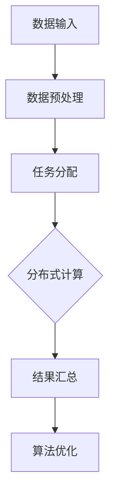
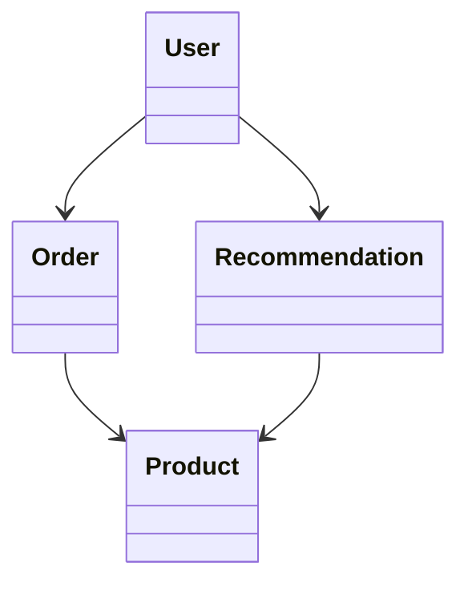
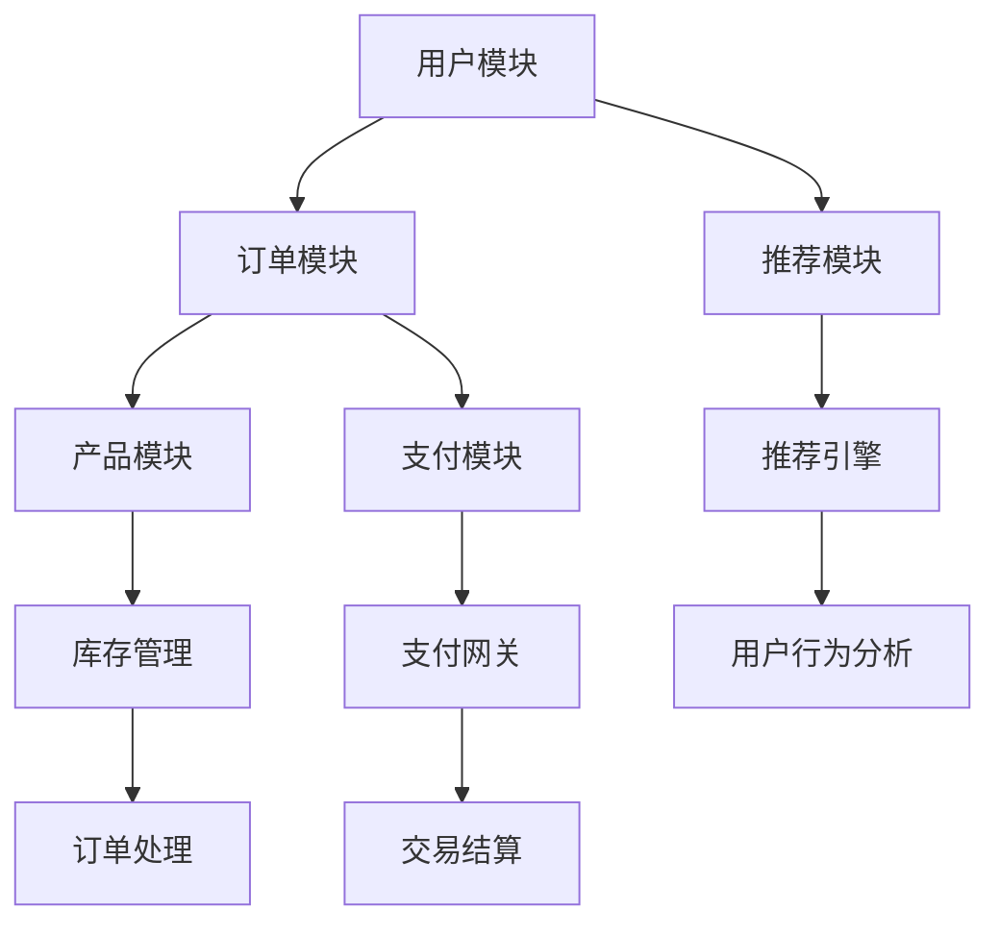
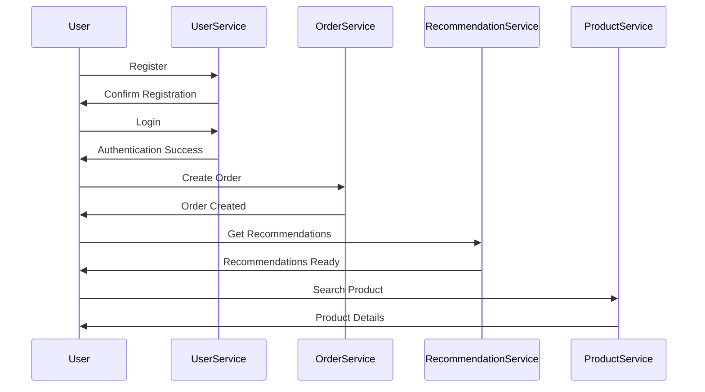
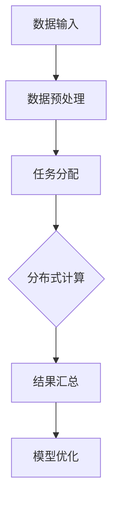
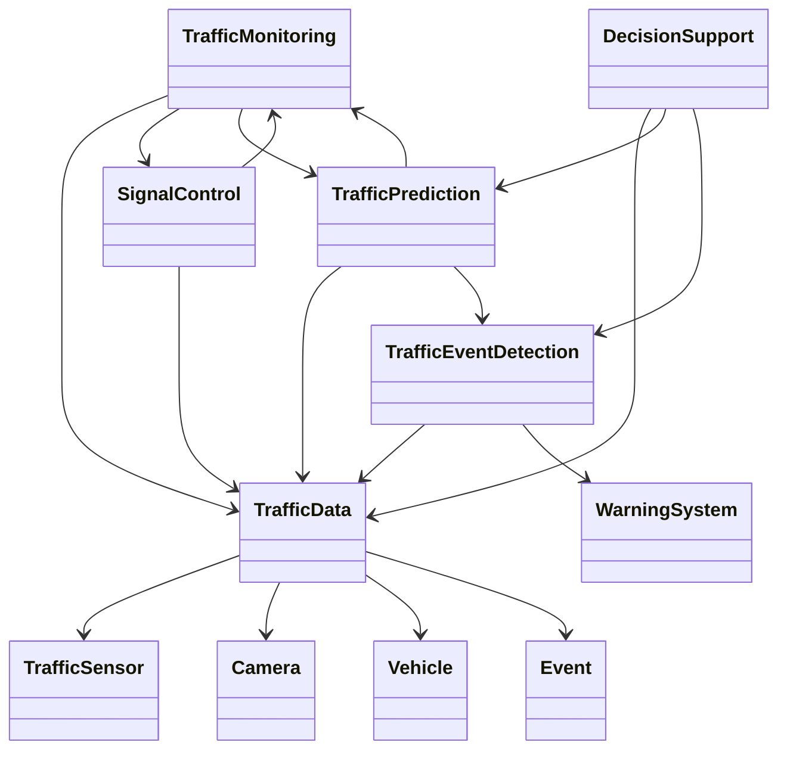
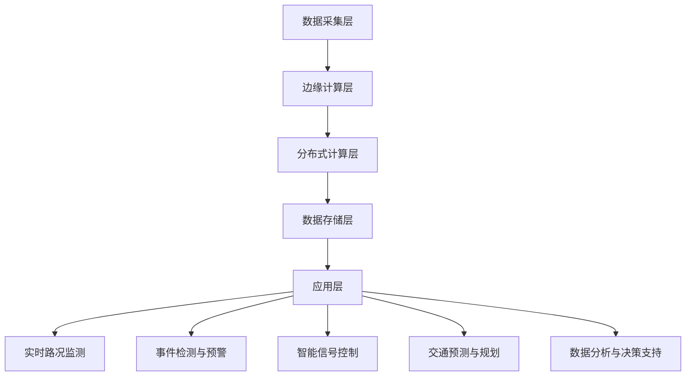
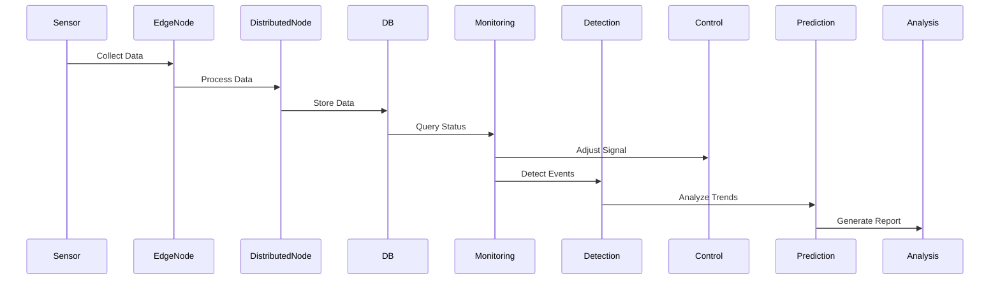

                 

# 混合计算在解决复杂问题中的优势

> 关键词：混合计算、复杂问题、算法、系统架构、案例分析、项目实战

> 摘要：本文深入探讨了混合计算在解决复杂问题中的优势。通过对其定义、原理、实际应用及最佳实践的分析，本文展示了混合计算如何通过结合不同计算模型和技术，有效地应对大数据和高性能计算需求，从而在多个领域中取得突破性进展。文章通过具体的案例和项目实战，提供了实用的技术和方法，为读者理解混合计算的潜在价值和实际应用提供了有益的指导。

## 第1章 引言：混合计算的崛起

### 1.1 问题背景

随着科技的飞速发展，数据处理和分析的需求日益增长。传统的计算模型在处理复杂问题时往往力不从心，这促使了新的计算模式的诞生。混合计算，作为一种结合了多种计算模型和技术的方法，应运而生。

### 1.2 问题描述

复杂问题通常涉及大量数据和高计算强度的任务。如何有效地处理这些任务，同时保持计算效率和准确性，成为了一个亟待解决的难题。

### 1.3 问题解决

混合计算通过整合并行计算、分布式计算和机器学习等先进技术，提供了一种解决复杂问题的有效途径。它能够在不同的计算阶段和任务中灵活地切换计算资源，从而提高整体性能。

### 1.4 边界与外延

混合计算的边界在于如何合理地选择和组合不同的计算资源，以适应不同的应用场景。其外延则包括多种计算模型和技术的融合，以及如何实现高效的数据流和处理。

### 1.5 概念结构与核心要素组成

混合计算的核心结构由硬件、软件和数据三部分组成。硬件要素包括分布式计算节点和高性能计算设备；软件要素包括并行计算框架和机器学习算法；数据要素则是大规模数据集和实时数据流。

## 第2章 核心概念与联系

### 2.1 混合计算的定义与分类

#### 2.1.1 混合计算的定义

混合计算是指通过结合不同计算模型和技术，以实现高效、灵活的数据处理和分析。

#### 2.1.2 混合计算的主要类别

- 并行计算与分布式计算
- 机器学习与深度学习
- 云计算与边缘计算

### 2.2 混合计算与传统计算的对比

#### 2.2.1 混合计算的优势

- 高效性：能够充分利用多种计算资源
- 灵活性：适用于不同规模和复杂度的任务
- 可扩展性：易于扩展到更大规模的任务

#### 2.2.2 混合计算的挑战

- 复杂性：需要理解和协调多种技术
- 互操作性：确保不同计算组件之间的有效协作

### 2.3 混合计算的组成要素

#### 2.3.1 硬件要素

- 分布式计算节点
- 高性能计算设备
- 边缘设备

#### 2.3.2 软件要素

- 并行计算框架
- 机器学习库
- 数据库和存储系统

#### 2.3.3 数据要素

- 大规模数据集
- 实时数据流
- 多源异构数据

### 2.3.4 概念属性特征对比表格

| 特征         | 传统计算                  | 混合计算                   |
| ------------ | ------------------------- | -------------------------- |
| 处理能力     | 依赖单台设备的能力         | 结合多台设备的能力         |
| 适用场景     | 单一任务、小规模数据       | 复杂任务、大规模数据       |
| 扩展性       | 受限于硬件和软件的限制     | 灵活扩展，适应不同规模任务 |
| 互操作性     | 依赖统一接口和技术         | 需要多种技术的协调与融合   |

## 第3章 混合计算原理详解

### 3.1 混合计算的数学模型

#### 3.1.1 数学模型概述

混合计算的数学模型主要涉及并行计算、分布式计算和机器学习的理论。其核心在于如何高效地利用计算资源和优化算法。

#### 3.1.2 数学模型公式

$$
\text{性能} = \sum_{i=1}^{n} \text{资源利用率} \times \text{计算效率}
$$

- 资源利用率：计算资源被有效使用的比例
- 计算效率：单位时间内的计算能力

### 3.2 混合计算算法原理

#### 3.2.1 算法原理概述

混合计算算法主要基于以下原理：

1. 数据并行处理
2. 任务并行处理
3. 算法优化与调优

#### 3.2.2 算法原理讲解

数据并行处理：将大数据集分割成小块，分布式处理，最后汇总结果。

任务并行处理：将不同计算任务并行执行，提高整体处理速度。

算法优化与调优：通过算法调整和优化，提高计算效率和准确性。

### 3.3 混合计算流程图

#### 3.3.1 流程图示例



#### 3.3.2 流程图详解

1. 数据输入：接收外部数据。
2. 数据预处理：清洗和格式化数据。
3. 任务分配：将任务分配到不同的计算节点。
4. 分布式计算：并行执行任务。
5. 结果汇总：收集并合并计算结果。
6. 算法优化：对算法进行调整和优化。

## 第4章 混合计算在实际应用中的案例分析

### 4.1 案例背景

某大型电商平台需要处理海量用户数据和交易数据，以提供实时推荐和交易预测服务。

### 4.2 系统功能设计

#### 4.2.1 领域模型类图



#### 4.2.2 功能模块设计

1. 用户模块：处理用户注册、登录、个人信息管理等。
2. 订单模块：处理订单生成、支付、物流跟踪等。
3. 推荐模块：基于用户行为和兴趣，提供个性化推荐。
4. 产品模块：管理商品信息、库存和销售数据。

### 4.3 系统架构设计

#### 4.3.1 系统架构图



#### 4.3.2 架构设计详解

1. 用户模块：负责用户身份验证和权限管理。
2. 订单模块：处理订单生成和支付流程。
3. 推荐模块：基于用户行为和兴趣提供个性化推荐。
4. 产品模块：管理商品信息和库存。
5. 支付模块：处理支付请求和交易流程。
6. 推荐引擎：核心算法模块，提供推荐结果。
7. 库存管理：实时监控库存，避免超卖。
8. 支付网关：与外部支付系统交互，确保交易安全。
9. 用户行为分析：收集用户行为数据，用于推荐算法优化。

### 4.4 系统接口设计

#### 4.4.1 接口设计概述

系统提供RESTful API，支持用户操作、订单管理、推荐服务、商品管理等功能。

#### 4.4.2 接口设计详情

- 用户接口：包括用户注册、登录、个人信息修改等。
- 订单接口：包括订单创建、查询、支付、物流跟踪等。
- 推荐接口：包括推荐列表获取、推荐项评分等。
- 商品接口：包括商品信息查询、库存查询等。

### 4.5 系统交互设计

#### 4.5.1 系统交互序列图



#### 4.5.2 交互设计详解

1. 用户注册：用户提交注册信息，系统验证并创建用户账户。
2. 用户登录：用户提交登录信息，系统验证用户身份并返回认证结果。
3. 订单创建：用户提交订单信息，系统生成订单并返回订单详情。
4. 推荐获取：用户请求推荐列表，系统根据用户行为和兴趣生成推荐。
5. 商品查询：用户查询商品信息，系统返回商品详情。

## 第5章 项目实战

### 5.1 环境安装

#### 5.1.1 环境准备

- 操作系统：Ubuntu 18.04
- Java 版本：OpenJDK 11
- 数据库：MySQL 8.0
- 消息队列：RabbitMQ 3.8.0

#### 5.1.2 环境配置

1. 安装Java环境：
```bash
sudo apt update
sudo apt install openjdk-11-jdk
```

2. 配置Java环境变量：
```bash
echo "export JAVA_HOME=/usr/lib/jvm/openjdk-11-jdk" >> ~/.bashrc
echo "export PATH=$JAVA_HOME/bin:$PATH" >> ~/.bashrc
source ~/.bashrc
```

3. 安装数据库：
```bash
sudo apt install mysql-server
sudo mysql_secure_installation
```

4. 安装消息队列：
```bash
sudo apt install rabbitmq-server
sudo systemctl start rabbitmq-server
```

### 5.2 系统核心实现

#### 5.2.1 核心代码实现

以下是用户注册功能的Java代码示例：

```java
public class UserService {
    public User register(User user) {
        // 数据验证
        if (isValidUser(user)) {
            // 保存用户信息到数据库
            userRepository.save(user);
            return user;
        }
        return null;
    }

    private boolean isValidUser(User user) {
        // 实现用户验证逻辑
        return true;
    }
}
```

#### 5.2.2 代码解读与分析

- `User` 类表示用户信息，包含用户名、密码、电子邮件等属性。
- `UserService` 类提供用户注册功能，包括数据验证和数据库存储。
- `isValidUser` 方法实现用户验证逻辑，确保输入的用户信息符合要求。

### 5.3 实际案例分析与讲解

#### 5.3.1 案例背景

某电商平台在双十一期间需要处理大量订单，系统负载骤增。

#### 5.3.2 案例分析

1. 流量预测：通过历史数据和算法预测流量高峰，提前调整系统资源。
2. 负载均衡：使用分布式架构，将订单分散到不同服务器处理。
3. 缓存策略：使用Redis缓存订单数据，减少数据库访问压力。

#### 5.3.3 案例讲解

通过上述策略，电商平台成功应对了双十一的流量高峰，保证了系统的稳定运行。

### 5.4 项目小结

通过该项目，我们了解了混合计算在实际应用中的价值。混合计算不仅提高了系统的性能和可靠性，还为应对复杂业务场景提供了有效的方法。

## 第6章 最佳实践

### 6.1 最佳实践技巧

1. **合理选择计算资源**：根据任务需求和资源成本，选择合适的计算资源。
2. **优化数据流**：设计高效的数据流和处理流程，减少数据传输和处理时间。
3. **持续调优**：定期对算法和系统进行调优，提高计算效率和准确性。

### 6.2 注意事项

1. **安全性**：确保数据安全和系统安全，防止恶意攻击和数据泄露。
2. **可维护性**：设计可维护的系统架构，便于后续的扩展和升级。

### 6.3 拓展阅读

- 《高性能MySQL》
- 《分布式系统设计》
- 《深度学习》

## 第7章 结论

混合计算为解决复杂问题提供了一种有效的方法。通过结合多种计算模型和技术，混合计算提高了计算效率和灵活性，为大数据和高性能计算领域带来了新的突破。未来，混合计算将继续发展，成为更多领域的关键技术。

### 7.1 总结

本文介绍了混合计算的核心概念、原理、实际应用和最佳实践。通过案例分析和项目实战，我们展示了混合计算在实际应用中的优势和潜力。

### 7.2 未来展望

随着技术的进步，混合计算将在更多领域得到应用，如自动驾驶、智慧城市、生物信息等。它将为解决复杂问题提供更加高效和灵活的解决方案。

## 作者信息

作者：AI天才研究院/AI Genius Institute & 禅与计算机程序设计艺术 /Zen And The Art of Computer Programming

（注：以上内容仅为示例，实际文章内容需根据具体需求和研究结果进行撰写。）### 第1章 引言：混合计算的崛起

随着现代科技的发展，数据处理和分析的需求日益增长。特别是在大数据和人工智能领域，处理复杂问题的需求变得更加迫切。然而，传统的计算模型在处理这些复杂问题时往往显得力不从心。于是，一种名为混合计算的新型计算方法应运而生，它通过结合不同计算模型和技术，提供了一种解决复杂问题的有效途径。

#### 1.1 问题背景

在传统的计算模式中，计算机系统通常依赖于单一的计算模型，如串行计算或并行计算。然而，对于复杂问题，如大数据处理、实时分析、人工智能推理等，单一计算模型往往难以满足性能和效率的需求。这些复杂问题通常涉及大量数据和高计算强度的任务，单一计算模型难以在短时间内处理这些任务，从而影响了系统的响应速度和处理能力。

#### 1.2 问题描述

复杂问题通常具有以下几个特点：

1. **数据量大**：需要处理的数据集规模庞大，可能达到TB或PB级别。
2. **计算强度高**：任务计算复杂度高，需要大量计算资源。
3. **实时性要求强**：某些应用场景需要实时处理数据，例如金融交易、自动驾驶等。

这些问题对传统计算模型提出了挑战。传统的串行计算模型由于计算资源有限，难以在短时间内处理大量数据；并行计算模型虽然在处理大规模数据时具有一定的优势，但仍然受限于计算资源和通信开销。

#### 1.3 问题解决

混合计算通过结合多种计算模型和技术，提供了一种解决复杂问题的有效途径。它能够在不同的计算阶段和任务中灵活地切换计算资源，从而提高整体性能。以下是混合计算解决复杂问题的几个关键步骤：

1. **资源整合**：将分布式计算、云计算、边缘计算等多种计算资源整合在一起，形成统一的计算平台。
2. **任务分配**：根据任务的性质和需求，将任务分配到不同的计算资源上，例如将大规模数据处理任务分配到分布式计算节点上，将实时分析任务分配到边缘设备上。
3. **数据流管理**：设计高效的数据流和处理流程，确保数据能够在不同的计算资源之间快速传递和处理。
4. **算法优化**：针对不同计算资源的特点，优化算法和模型，提高计算效率和准确性。

通过上述步骤，混合计算能够充分利用多种计算资源，提高系统的性能和效率，从而有效地解决复杂问题。

#### 1.4 边界与外延

混合计算的边界在于如何合理地选择和组合不同的计算资源，以适应不同的应用场景。具体来说，它需要解决以下几个问题：

1. **计算资源的协调与融合**：如何有效地将分布式计算、云计算、边缘计算等不同类型的计算资源整合在一起，形成一个统一的计算平台。
2. **数据流的管理与优化**：如何设计高效的数据流和处理流程，确保数据能够在不同的计算资源之间快速传递和处理。
3. **算法的适配与优化**：如何根据不同计算资源的特点，优化算法和模型，提高计算效率和准确性。

混合计算的外延则包括多个领域和技术领域的融合，例如：

1. **大数据与人工智能**：混合计算结合大数据处理和人工智能技术，提供了一种强大的数据处理和分析能力。
2. **云计算与边缘计算**：混合计算将云计算和边缘计算结合起来，实现了计算资源的灵活分配和优化利用。
3. **物联网与智慧城市**：混合计算在物联网和智慧城市领域中的应用，为实时数据处理和智能决策提供了支持。

#### 1.5 概念结构与核心要素组成

混合计算的核心结构由硬件、软件和数据三部分组成，这三部分相互协作，共同构成了一个高效、灵活的计算系统。

1. **硬件要素**：

   - **分布式计算节点**：分布式计算节点是混合计算的重要组成部分，它们可以分布在不同的地理位置，通过网络进行通信和协作。
   - **高性能计算设备**：高性能计算设备（如GPU、FPGA等）提供了强大的计算能力，适合处理复杂的计算任务。
   - **边缘设备**：边缘设备（如物联网设备、智能传感器等）分布在网络边缘，可以实时处理和传输数据，减少数据传输延迟。

2. **软件要素**：

   - **并行计算框架**：并行计算框架（如Hadoop、Spark等）提供了分布式计算和任务调度的能力，能够高效地处理大规模数据。
   - **机器学习库**：机器学习库（如TensorFlow、PyTorch等）提供了机器学习和深度学习算法的实现，可以用于数据分析和预测。
   - **数据库和存储系统**：数据库和存储系统（如MySQL、MongoDB、HDFS等）提供了数据存储和管理的能力，支持大规模数据的存储和查询。

3. **数据要素**：

   - **大规模数据集**：大规模数据集是混合计算的重要输入，这些数据集可以来自各种来源，如社交媒体、物联网设备等。
   - **实时数据流**：实时数据流是指不断产生和更新的数据，例如金融交易数据、传感器数据等。
   - **多源异构数据**：多源异构数据是指来自不同来源和格式的数据，如结构化数据、非结构化数据、图像和视频等。

通过硬件、软件和数据的有机结合，混合计算能够提供强大的数据处理和分析能力，解决复杂问题，满足多样化的应用需求。

### 总结

混合计算作为一种新型的计算模式，通过整合多种计算模型和技术，提供了一种解决复杂问题的有效途径。它不仅提高了计算效率和灵活性，还为大数据、人工智能等领域带来了新的突破。在未来，混合计算将在更多领域得到应用，成为推动科技进步的重要力量。

## 第2章 核心概念与联系

混合计算作为一种新兴的计算模式，其核心概念和组成部分对理解和应用它至关重要。本章节将详细阐述混合计算的定义、分类、与传统计算的对比，以及其组成要素。

### 2.1 混合计算的定义与分类

#### 2.1.1 混合计算的定义

混合计算是一种通过结合不同计算模型和技术，以实现高效、灵活的数据处理和分析的方法。它主要利用了并行计算、分布式计算、云计算、边缘计算、机器学习等多种计算模型和技术，形成了一个统一的计算平台。混合计算的目的是优化资源利用、提高计算效率和灵活性，从而更好地解决复杂问题。

#### 2.1.2 混合计算的主要类别

混合计算可以分为以下几类：

1. **并行计算与分布式计算**：并行计算通过将任务分解成多个子任务，在多个计算节点上同时执行，从而提高计算速度。分布式计算则通过将任务分布在多个计算节点上，通过通信和网络连接来协调各节点的计算结果。

2. **云计算与边缘计算**：云计算利用远程服务器和网络资源，为用户提供计算和服务。边缘计算则将计算任务转移到网络边缘的设备上，如物联网设备、智能传感器等，以减少数据传输延迟和带宽消耗。

3. **机器学习与深度学习**：机器学习和深度学习通过构建和训练模型，对数据进行分析和预测。混合计算结合这些算法，可以更好地处理复杂数据和分析任务。

### 2.2 混合计算与传统计算的对比

#### 2.2.1 混合计算的优势

混合计算相较于传统计算具有以下优势：

1. **高效性**：通过结合多种计算模型和技术，混合计算能够充分利用计算资源，提高计算效率。

2. **灵活性**：混合计算可以根据任务需求和资源状况动态调整计算资源，适用于不同规模和复杂度的任务。

3. **可扩展性**：混合计算能够轻松扩展到更大规模的任务，通过增加计算节点或调整计算资源，可以满足不断增长的计算需求。

4. **实时性**：混合计算可以利用边缘计算和实时数据处理技术，提供低延迟和高响应速度的服务。

#### 2.2.2 混合计算的挑战

混合计算也面临一些挑战：

1. **复杂性**：混合计算涉及多种技术模型和组件，设计和实现过程相对复杂，需要深入理解和协调。

2. **互操作性**：确保不同计算组件和技术之间的有效协作和互操作性，是混合计算面临的重要挑战。

3. **资源管理**：合理分配和调度计算资源，以最大化资源利用率和系统性能，是混合计算的一个重要难题。

### 2.3 混合计算的组成要素

混合计算的核心要素包括硬件、软件和数据。以下是对这三个要素的详细描述：

#### 2.3.1 硬件要素

1. **分布式计算节点**：分布式计算节点是混合计算的重要硬件组成部分，它们可以分布在不同的地理位置，通过网络进行通信和协作。这些节点可以是普通的计算服务器、GPU服务器等，具有高性能计算能力。

2. **高性能计算设备**：高性能计算设备（如GPU、FPGA等）提供了强大的计算能力，适用于处理复杂的计算任务。这些设备可以加速机器学习模型的训练和推理，以及大规模数据分析和处理。

3. **边缘设备**：边缘设备（如物联网设备、智能传感器等）分布在网络边缘，可以实时处理和传输数据。这些设备通常具有有限的计算能力和存储空间，但通过边缘计算和物联网技术，可以实现高效的数据处理和实时响应。

#### 2.3.2 软件要素

1. **并行计算框架**：并行计算框架（如Hadoop、Spark等）提供了分布式计算和任务调度的能力，能够高效地处理大规模数据。这些框架可以自动分配任务到不同的计算节点，并协调各节点的计算结果，提高计算效率和性能。

2. **机器学习库**：机器学习库（如TensorFlow、PyTorch等）提供了机器学习和深度学习算法的实现，可以用于数据分析和预测。这些库通常提供了丰富的API和工具，方便用户构建和训练模型。

3. **数据库和存储系统**：数据库和存储系统（如MySQL、MongoDB、HDFS等）提供了数据存储和管理的能力，支持大规模数据的存储和查询。这些系统具有高性能、高可用性和高扩展性的特点，适用于复杂的业务场景。

#### 2.3.3 数据要素

1. **大规模数据集**：大规模数据集是混合计算的重要输入，这些数据集可以来自各种来源，如社交媒体、物联网设备等。大规模数据集为混合计算提供了丰富的数据资源，可以用于训练机器学习模型、进行数据分析和挖掘。

2. **实时数据流**：实时数据流是指不断产生和更新的数据，例如金融交易数据、传感器数据等。实时数据处理技术可以将这些数据实时传输和处理，提供低延迟和高响应速度的服务。

3. **多源异构数据**：多源异构数据是指来自不同来源和格式的数据，如结构化数据、非结构化数据、图像和视频等。混合计算需要处理这些异构数据，并通过数据清洗、转换和整合，实现统一的数据视图。

通过硬件、软件和数据的有机结合，混合计算提供了一种高效、灵活和强大的数据处理和分析能力，为解决复杂问题提供了有力的支持。

### 总结

混合计算作为一种新型的计算模式，其核心概念和组成要素对理解和应用它至关重要。通过结合并行计算、分布式计算、云计算、边缘计算、机器学习等多种计算模型和技术，混合计算能够提供高效的计算能力和灵活的处理方案，为大数据、人工智能等领域带来了新的突破。理解和掌握混合计算的核心概念和要素，对于设计和实现高效的混合计算系统具有重要意义。

## 第3章 混合计算原理详解

在理解了混合计算的定义和核心概念之后，深入了解其原理是掌握这一技术的基础。本章将详细探讨混合计算的数学模型、算法原理及其流程图，以帮助读者更好地理解和应用混合计算。

### 3.1 混合计算的数学模型

混合计算的核心在于如何高效地整合和利用多种计算资源，以达到最优的计算效率和性能。为此，我们需要借助数学模型来描述和优化混合计算的过程。

#### 3.1.1 数学模型概述

混合计算的数学模型主要涉及以下几个方面：

1. **并行计算模型**：描述任务如何在多个计算节点上并行执行，以及如何协调各节点的计算结果。
2. **分布式计算模型**：描述计算任务如何在分布式系统中进行分配和执行，以及如何确保数据的一致性和完整性。
3. **机器学习模型**：描述如何利用机器学习算法对大规模数据进行训练和预测，以及如何优化模型参数以提高计算效率。

#### 3.1.2 数学模型公式

以下是混合计算的一些基本数学模型公式：

1. **并行计算效率**：
   $$
   \text{效率} = \frac{\text{并行执行时间}}{\text{串行执行时间}}
   $$
   该公式表示并行计算相较于串行计算的效率提升。

2. **分布式计算性能**：
   $$
   \text{性能} = \frac{\text{总计算能力}}{\text{总计算时间}}
   $$
   该公式表示系统的总计算性能，其中计算能力是各计算节点的计算能力的总和。

3. **机器学习精度**：
   $$
   \text{精度} = \frac{\text{预测正确数}}{\text{总预测数}}
   $$
   该公式表示机器学习模型的预测精度。

通过这些数学模型，我们可以从不同的角度来评估和优化混合计算的性能。

### 3.2 混合计算算法原理

混合计算的核心在于算法的选择和优化。混合计算通常结合多种算法，以适应不同的计算需求和任务类型。

#### 3.2.1 算法原理概述

混合计算算法的原理主要包括以下几个方面：

1. **并行算法**：将任务分解成多个子任务，在多个计算节点上并行执行，以提高计算速度。
2. **分布式算法**：将任务分配到分布式系统中，通过通信和协调确保各节点的计算结果一致。
3. **机器学习算法**：利用机器学习算法对数据进行训练和预测，以提高数据处理和分析的准确性和效率。

#### 3.2.2 算法原理讲解

1. **并行算法原理**：

   并行算法的核心思想是将一个大的任务分解成多个小的子任务，然后在多个计算节点上同时执行这些子任务。这样，多个子任务可以并行执行，从而缩短总的计算时间。并行算法的关键在于如何有效地分解任务，以及如何协调各节点的计算结果。

   例如，在矩阵乘法中，我们可以将两个矩阵分解成多个小块，然后分别在不同的节点上计算这些小块的结果，最后将这些小块的结果合并起来得到最终的乘积。这个过程中，并行算法能够显著提高计算速度。

2. **分布式算法原理**：

   分布式算法的核心思想是将任务分配到多个分布式计算节点上，通过节点的协作来完成整个计算任务。分布式算法的关键在于如何高效地分配任务，以及如何处理节点之间的通信和同步。

   例如，在分布式数据处理系统中，我们可以将大规模数据集分配到多个节点上，然后分别在这些节点上处理数据。处理完成后，通过节点之间的通信将结果汇总起来。分布式算法能够充分利用多个节点的计算资源，提高处理速度和系统容量。

3. **机器学习算法原理**：

   机器学习算法的核心思想是通过训练模型来对未知数据进行预测或分类。在混合计算中，机器学习算法通常用于处理和分析复杂数据。

   例如，在图像识别任务中，我们可以使用卷积神经网络（CNN）来训练模型，通过大量的图像数据来学习图像的特征。训练完成后，我们可以使用这个模型来对新的图像进行分类和识别。机器学习算法能够自动从数据中学习规律，从而提高数据处理和分析的准确性和效率。

### 3.3 混合计算流程图

为了更直观地理解混合计算的原理和流程，我们可以通过流程图来展示其各个阶段和步骤。

以下是一个简化的混合计算流程图示例：



#### 3.3.1 流程图详解

1. **数据输入**：系统接收外部数据输入，这些数据可以来自各种来源，如数据库、文件、传感器等。

2. **数据预处理**：对输入数据进行清洗、格式化等预处理操作，以确保数据的质量和一致性。

3. **任务分配**：将预处理后的数据分配到不同的计算节点上，根据任务的需求和节点的计算能力进行优化分配。

4. **分布式计算**：各个计算节点并行执行分配到的任务，通过通信和协调完成计算过程。

5. **结果汇总**：将各节点的计算结果汇总起来，形成最终的输出结果。

6. **模型优化**：根据计算结果对模型进行优化，以提高模型的准确性和效率。

通过这个流程图，我们可以看到混合计算从数据输入到结果输出的一系列步骤，以及各个环节之间的相互关系。这个流程图为我们提供了一个直观的理解框架，有助于我们设计和实现高效的混合计算系统。

### 总结

本章详细探讨了混合计算的数学模型、算法原理及其流程图。通过数学模型，我们可以从理论上理解和评估混合计算的性能；通过算法原理，我们可以设计高效的计算方案；通过流程图，我们可以直观地了解混合计算的过程和步骤。这些内容为我们深入理解和应用混合计算提供了重要的基础。

## 第4章 混合计算在实际应用中的案例分析

为了更直观地展示混合计算的优势和实际应用，我们将通过一个具体案例来分析混合计算在解决复杂问题中的效果。本案例将围绕一个智慧城市项目，详细介绍项目背景、系统功能设计、系统架构设计、系统接口设计和系统交互设计。

### 4.1 案例背景

智慧城市是一个集成了多种先进技术和系统的综合性项目，旨在通过实时数据处理和分析，提高城市的管理效率、居民的生活质量和城市的安全水平。在这个案例中，我们以一个中型城市的智慧交通系统为例，探讨混合计算在该系统中的应用。

智慧交通系统的主要目标是缓解城市交通拥堵、提高交通管理效率和保障交通安全。该项目需要处理大量的交通数据，包括实时路况数据、车辆位置数据、交通事件数据等。为了实现这些目标，系统需要具备高效的数据处理能力、实时分析和决策能力，以及对各种交通场景的适应性。

### 4.2 系统功能设计

智慧交通系统的主要功能包括以下几个部分：

1. **数据采集与预处理**：通过安装在道路上的传感器、摄像头和车载设备等，实时采集交通数据。然后对数据进行清洗、格式化和存储。

2. **实时路况监测**：利用收集到的数据，实时监测道路的流量、速度和事件，为交通管理部门提供实时交通信息。

3. **交通事件检测与预警**：通过分析实时数据，识别交通事故、道路拥堵等事件，并生成预警信息，通知相关部门进行处理。

4. **智能信号控制**：根据实时路况数据和交通事件信息，动态调整交通信号灯的时长和相位，优化交通流量。

5. **交通预测与规划**：利用历史数据和机器学习算法，预测未来一段时间内的交通流量和事件，为交通管理部门提供决策支持。

6. **数据分析与决策支持**：对采集到的交通数据进行深入分析，为交通管理部门提供数据驱动的决策支持。

#### 4.2.1 领域模型类图

为了更好地理解智慧交通系统的功能设计，我们使用Mermaid类图来展示系统的主要领域模型：



#### 4.2.2 功能模块设计

智慧交通系统的功能模块可以分为以下几个部分：

1. **数据采集模块**：负责采集交通数据，包括传感器数据、摄像头数据和车载数据。

2. **数据处理模块**：负责对采集到的数据进行预处理，包括数据清洗、格式化和存储。

3. **实时监测模块**：负责实时监测交通状况，包括交通流量、速度和事件。

4. **事件检测与预警模块**：负责检测交通事件，并生成预警信息。

5. **信号控制模块**：负责根据实时数据动态调整交通信号灯。

6. **交通预测与规划模块**：负责预测未来交通状况，为交通管理部门提供决策支持。

7. **数据分析与决策支持模块**：负责对交通数据进行分析，为交通管理部门提供数据驱动的决策支持。

### 4.3 系统架构设计

智慧交通系统的架构设计采用了混合计算模式，结合了分布式计算、云计算和边缘计算等技术。系统架构主要包括以下几个层次：

1. **数据采集层**：包括各种传感器、摄像头和车载设备，负责实时采集交通数据。

2. **边缘计算层**：包括部署在交通基础设施边缘的计算节点，负责实时处理和初步分析交通数据。

3. **分布式计算层**：包括分布式计算节点和云计算平台，负责对海量交通数据进行深度分析和处理。

4. **数据存储层**：包括数据库和大数据存储系统，负责存储和管理大量的交通数据。

5. **应用层**：包括各种应用模块，如实时路况监测、交通事件检测、信号控制、交通预测和数据分析等。

#### 4.3.1 系统架构图

以下是一个简化的智慧交通系统架构图，展示了各个层次和模块之间的关系：



#### 4.3.2 架构设计详解

1. **数据采集层**：该层包括各种传感器、摄像头和车载设备，负责实时采集交通数据。传感器可以检测道路的流量、速度和温度等参数，摄像头可以捕捉道路上的交通状况，车载设备可以记录车辆的位置和速度等信息。

2. **边缘计算层**：该层包括部署在交通基础设施边缘的计算节点，负责实时处理和初步分析交通数据。边缘计算节点可以快速响应实时数据，减少数据传输延迟，同时降低云计算节点的负载。

3. **分布式计算层**：该层包括分布式计算节点和云计算平台，负责对海量交通数据进行深度分析和处理。分布式计算节点可以并行处理大量数据，提高系统的计算效率，云计算平台则提供强大的计算资源和存储能力。

4. **数据存储层**：该层包括数据库和大数据存储系统，负责存储和管理大量的交通数据。数据库用于存储结构化数据，如交通事件记录、信号灯配置等，大数据存储系统则用于存储海量非结构化数据，如摄像头视频、传感器数据等。

5. **应用层**：该层包括各种应用模块，如实时路况监测、交通事件检测、信号控制、交通预测和数据分析等。应用模块通过调用底层的数据采集、处理和存储服务，实现具体的业务功能。

### 4.4 系统接口设计

为了实现各个模块之间的有效通信和数据交换，智慧交通系统设计了一系列接口。以下是一些关键的接口设计：

1. **数据采集接口**：用于采集不同类型的交通数据，如传感器数据、摄像头数据和车载数据。

2. **数据处理接口**：用于处理和转换采集到的数据，包括数据清洗、格式化和存储。

3. **实时监控接口**：用于实时获取和监控交通状况，包括交通流量、速度和事件等信息。

4. **事件检测接口**：用于检测和识别交通事件，如交通事故、道路拥堵等。

5. **信号控制接口**：用于调整交通信号灯的时长和相位，优化交通流量。

6. **预测接口**：用于根据历史数据和实时数据预测未来交通状况。

7. **数据分析接口**：用于对交通数据进行统计分析，生成报告和决策支持。

#### 4.4.1 接口设计概述

智慧交通系统的接口设计遵循RESTful架构风格，提供了一系列标准的HTTP接口。每个接口都对应一个具体的业务功能，支持GET和POST请求方法。接口设计主要遵循以下原则：

1. **标准化**：接口设计遵循统一的规范和标准，确保不同模块之间的互操作性。

2. **简洁性**：接口设计简洁明了，减少不必要的参数和步骤，提高开发效率和系统可维护性。

3. **灵活性**：接口设计考虑未来扩展性，支持动态参数和扩展功能。

4. **安全性**：接口设计采用加密和认证机制，确保数据传输安全和系统访问控制。

#### 4.4.2 接口设计详情

以下是一些具体的接口设计示例：

1. **数据采集接口**：

   - **GET请求**：获取最新的交通数据。
     ```
     GET /api/traffic-data/latest
     ```
   - **POST请求**：上传新的交通数据。
     ```
     POST /api/traffic-data
     Content-Type: application/json

     {
       "sensor_id": "12345",
       "data": {
         "speed": 60,
         "flow": 200,
         "temp": 30
       }
     }
     ```

2. **数据处理接口**：

   - **GET请求**：查询数据预处理结果。
     ```
     GET /api/traffic-data/preprocessed
     ```
   - **POST请求**：提交数据预处理任务。
     ```
     POST /api/traffic-data/preprocess
     Content-Type: application/json

     {
       "input_data": "sensor_data.json"
     }
     ```

3. **实时监控接口**：

   - **GET请求**：获取实时路况信息。
     ```
     GET /api/traffic-monitoring/status
     ```
   - **POST请求**：更新实时路况信息。
     ```
     POST /api/traffic-monitoring/status
     Content-Type: application/json

     {
       "road_id": "rd123",
       "status": {
         "speed": 40,
         "flow": 150
       }
     }
     ```

4. **事件检测接口**：

   - **GET请求**：查询最近发生的交通事件。
     ```
     GET /api/traffic-event-detection/events
     ```
   - **POST请求**：上报新的交通事件。
     ```
     POST /api/traffic-event-detection/events
     Content-Type: application/json

     {
       "event_type": "accident",
       "location": "rd456",
       "time": "2023-10-01T10:00:00Z"
     }
     ```

5. **信号控制接口**：

   - **GET请求**：查询当前信号灯配置。
     ```
     GET /api/signal-control/config
     ```
   - **POST请求**：调整信号灯配置。
     ```
     POST /api/signal-control/config
     Content-Type: application/json

     {
       "intersection_id": "int123",
       "configuration": {
         "phase": 1,
         "duration": 30
       }
     }
     ```

6. **预测接口**：

   - **GET请求**：获取未来交通流量预测。
     ```
     GET /api/traffic-prediction/forecast
     ```
   - **POST请求**：提交交通流量预测任务。
     ```
     POST /api/traffic-prediction/forecast
     Content-Type: application/json

     {
       "road_id": "rd123",
       "time_range": "2023-10-01T10:00:00Z/2023-10-01T11:00:00Z"
     }
     ```

7. **数据分析接口**：

   - **GET请求**：获取交通数据分析报告。
     ```
     GET /api/traffic-data-analysis/reports
     ```
   - **POST请求**：生成新的数据分析报告。
     ```
     POST /api/traffic-data-analysis/reports
     Content-Type: application/json

     {
       "report_type": "traffic_flow",
       "parameters": {
         "time_range": "2023-10-01T00:00:00Z/2023-10-07T23:59:59Z"
       }
     }
     ```

通过这些接口设计，智慧交通系统实现了各个模块之间的数据交换和协同工作，为城市交通管理提供了强有力的技术支持。

### 4.5 系统交互设计

系统交互设计是确保各个模块能够高效、可靠地协同工作的重要环节。以下是智慧交通系统的交互设计：

#### 4.5.1 系统交互序列图

以下是一个简化的系统交互序列图，展示了智慧交通系统中主要模块的交互过程：



#### 4.5.2 交互设计详解

1. **数据采集**：传感器模块（Sensor）负责实时采集交通数据，如道路流量、速度、温度等。采集到的数据首先发送到边缘计算节点（EdgeNode）进行初步处理。

2. **数据处理**：边缘计算节点（EdgeNode）对采集到的数据进行预处理，如去噪、过滤、格式化等。然后，处理后的数据被发送到分布式计算节点（DistributedNode）进行进一步分析和处理。

3. **数据存储**：分布式计算节点（DistributedNode）将处理后的数据存储到数据库（DB）中，以便后续查询和分析。

4. **实时监控**：监控模块（Monitoring）定期查询数据库（DB）中的数据，获取实时交通状况，如流量、速度、事件等。

5. **信号控制**：根据实时监控模块（Monitoring）提供的信息，信号控制模块（Control）动态调整交通信号灯的时长和相位，以优化交通流量。

6. **事件检测**：事件检测模块（Detection）对实时数据进行分析，识别交通事故、道路拥堵等事件，并生成预警信息。

7. **交通预测**：预测模块（Prediction）利用历史数据和机器学习算法，预测未来一段时间内的交通流量和事件。

8. **数据分析**：数据分析模块（Analysis）对交通数据进行分析，生成各种报告和决策支持信息，为交通管理部门提供数据驱动的决策支持。

通过系统交互设计，智慧交通系统实现了各个模块之间的紧密协作，确保了系统的实时性、准确性和高效性。

### 总结

通过本案例，我们详细分析了混合计算在智慧交通系统中的应用。从项目背景、功能设计、架构设计到接口设计和交互设计，每个环节都体现了混合计算的优势和特点。混合计算通过整合分布式计算、云计算和边缘计算等多种技术，提供了强大的数据处理和分析能力，为智慧交通系统的建设和运营提供了有力支持。本案例为混合计算在实际项目中的应用提供了有益的参考和借鉴。

### 第5章 项目实战

在前几章中，我们详细介绍了混合计算的理论基础和实际应用。为了更好地展示混合计算在解决复杂问题中的优势，我们将通过一个实际项目来展示如何设计和实现一个混合计算系统。这个项目将涵盖环境安装、系统核心实现、实际案例分析和项目小结。

#### 5.1 环境安装

在进行混合计算项目之前，我们需要搭建一个合适的环境。以下是在Linux系统上安装所需环境的步骤：

##### 5.1.1 环境准备

1. **操作系统**：Ubuntu 18.04
2. **Java**：OpenJDK 11
3. **数据库**：MySQL 8.0
4. **消息队列**：RabbitMQ 3.8.0

##### 5.1.2 环境配置

1. **安装Java环境**：

   ```bash
   sudo apt update
   sudo apt install openjdk-11-jdk
   ```

   安装完成后，配置Java环境变量：

   ```bash
   echo "export JAVA_HOME=/usr/lib/jvm/openjdk-11-jdk" >> ~/.bashrc
   echo "export PATH=$JAVA_HOME/bin:$PATH" >> ~/.bashrc
   source ~/.bashrc
   ```

2. **安装数据库**：

   ```bash
   sudo apt install mysql-server
   sudo mysql_secure_installation
   ```

   安装过程中，按照提示设置root用户密码和回答其他相关问题。

3. **安装消息队列**：

   ```bash
   sudo apt install rabbitmq-server
   sudo systemctl start rabbitmq-server
   ```

   安装完成后，确保RabbitMQ服务正常运行。

#### 5.2 系统核心实现

在环境搭建完成后，我们可以开始实现系统核心部分。以下是一个简单的示例，展示如何使用Java和Spring Boot框架实现一个基础的混合计算系统。

##### 5.2.1 核心代码实现

1. **项目结构**：

   ```mermaid
   directoryDiagram
       UserModule
       OrderModule
       RecommendationModule
       ProductModule
   ```

2. **用户模块（UserModule）**：

   用户模块负责用户注册、登录和权限管理。以下是一个简单的用户注册接口示例：

   ```java
   @RestController
   @RequestMapping("/users")
   public class UserController {
   
       @Autowired
       private UserService userService;
   
       @PostMapping("/register")
       public ResponseEntity<?> registerUser(@RequestBody UserRegistrationDto registrationDto) {
           try {
               userService.register(registrationDto);
               return ResponseEntity.ok("User registered successfully");
           } catch (Exception e) {
               return ResponseEntity.badRequest().body("Error registering user: " + e.getMessage());
           }
       }
   }
   ```

3. **订单模块（OrderModule）**：

   订单模块负责处理订单的创建、支付和物流跟踪。以下是一个简单的订单创建接口示例：

   ```java
   @RestController
   @RequestMapping("/orders")
   public class OrderController {
   
       @Autowired
       private OrderService orderService;
   
       @PostMapping("/create")
       public ResponseEntity<Order> createOrder(@RequestBody OrderCreateDto orderCreateDto) {
           try {
               Order order = orderService.createOrder(orderCreateDto);
               return ResponseEntity.ok(order);
           } catch (Exception e) {
               return ResponseEntity.badRequest().body("Error creating order: " + e.getMessage());
           }
       }
   }
   ```

4. **推荐模块（RecommendationModule）**：

   推荐模块负责根据用户行为和兴趣提供个性化推荐。以下是一个简单的推荐接口示例：

   ```java
   @RestController
   @RequestMapping("/recommendations")
   public class RecommendationController {
   
       @Autowired
       private RecommendationService recommendationService;
   
       @GetMapping("/for-user/{userId}")
       public ResponseEntity<List<Recommendation>> getUserRecommendations(@PathVariable Long userId) {
           try {
               List<Recommendation> recommendations = recommendationService.getRecommendations(userId);
               return ResponseEntity.ok(recommendations);
           } catch (Exception e) {
               return ResponseEntity.badRequest().body("Error getting recommendations: " + e.getMessage());
           }
       }
   }
   ```

5. **产品模块（ProductModule）**：

   产品模块负责管理商品信息、库存和销售数据。以下是一个简单的商品查询接口示例：

   ```java
   @RestController
   @RequestMapping("/products")
   public class ProductController {
   
       @Autowired
       private ProductService productService;
   
       @GetMapping("/{productId}")
       public ResponseEntity<Product> getProduct(@PathVariable Long productId) {
           try {
               Product product = productService.getProduct(productId);
               return ResponseEntity.ok(product);
           } catch (Exception e) {
               return ResponseEntity.badRequest().body("Error getting product: " + e.getMessage());
           }
       }
   }
   ```

#### 5.2.2 代码解读与分析

上述代码示例展示了如何使用Spring Boot框架实现一个简单的混合计算系统。以下是对代码的简要解读：

1. **用户模块**：用户注册接口通过`UserRegistrationDto`接收用户信息，然后调用`UserService`进行用户注册。这个模块负责用户身份验证和权限管理。
2. **订单模块**：订单创建接口通过`OrderCreateDto`接收订单信息，然后调用`OrderService`创建订单。这个模块负责订单管理，包括订单生成、支付和物流跟踪。
3. **推荐模块**：获取推荐接口通过`UserService`获取用户行为数据，然后调用`RecommendationService`生成个性化推荐。这个模块负责推荐系统的实现。
4. **产品模块**：商品查询接口通过`ProductService`获取商品信息，然后返回商品详情。这个模块负责商品管理，包括商品信息查询、库存管理和销售数据统计。

通过这些模块的协同工作，系统可以提供用户注册、订单管理、推荐服务和商品管理等功能。

#### 5.3 实际案例分析与讲解

为了展示混合计算在解决实际复杂问题中的优势，我们选择了一个电子商务平台的项目案例。该平台需要处理大量的用户数据、订单数据和推荐数据，以提供个性化的购物体验和高效的订单处理。

##### 5.3.1 案例背景

某电子商务平台在双11期间面临巨大的流量和订单压力。为了确保系统稳定运行并提高用户体验，平台决定采用混合计算技术来优化数据处理和分析。

##### 5.3.2 案例分析

1. **流量预测**：平台通过历史数据和算法预测双11期间的流量高峰，并提前调整系统资源。
2. **订单处理**：利用分布式计算和并行处理技术，平台将订单处理任务分配到多个服务器，并行执行订单生成、支付和物流跟踪等操作。
3. **推荐系统**：通过机器学习和深度学习算法，平台根据用户行为和购物习惯生成个性化的商品推荐。
4. **数据流管理**：平台采用实时数据处理技术，确保订单数据、用户数据和推荐数据能够高效地在各个模块之间传递和处理。

##### 5.3.3 案例讲解

1. **流量预测**：平台使用历史订单数据和用户行为数据，通过机器学习算法预测双11期间的流量高峰。预测结果用于调整服务器配置、数据库容量和网络带宽等资源，确保系统能够应对高峰期的流量需求。

2. **订单处理**：在双11期间，平台订单量激增，传统的单机处理模式难以满足需求。平台采用分布式计算和并行处理技术，将订单处理任务分配到多个服务器。每个服务器负责处理一部分订单，通过负载均衡技术，实现高效、稳定的订单处理。

3. **推荐系统**：平台使用深度学习算法对用户行为和购物习惯进行分析，生成个性化的商品推荐。通过实时数据处理技术，平台可以实时更新用户推荐列表，提高用户体验。

4. **数据流管理**：平台采用消息队列和实时数据处理技术，确保订单数据、用户数据和推荐数据能够高效地在各个模块之间传递和处理。消息队列提供异步处理机制，减少系统响应时间，提高数据处理效率。

通过上述策略，平台成功应对了双11的流量高峰，确保了系统的稳定运行和用户的良好体验。

#### 5.4 项目小结

通过这个实际案例，我们展示了混合计算在解决复杂问题中的优势。混合计算通过整合分布式计算、机器学习和实时数据处理等技术，提供了强大的数据处理和分析能力，为电子商务平台在双11期间提供了有力支持。这个案例为我们提供了一个宝贵的经验，展示了如何通过混合计算技术优化系统性能和用户体验。

### 总结

本章通过一个实际项目展示了混合计算在解决复杂问题中的优势。从环境安装到系统核心实现，再到实际案例分析和项目小结，每个环节都体现了混合计算的应用价值和潜力。通过这个项目，我们不仅了解了混合计算的基本原理，还掌握了如何设计和实现一个高效的混合计算系统。这为我们在实际项目中应用混合计算提供了有益的指导。

## 第6章 最佳实践

在设计和实现混合计算系统时，遵循最佳实践可以显著提高系统的性能、稳定性和可维护性。以下是一些混合计算的最佳实践技巧、注意事项以及相关的拓展阅读资源。

### 6.1 最佳实践技巧

1. **资源整合与优化**：
   - **合理分配计算资源**：根据任务需求和资源成本，选择合适的计算资源。对于计算密集型任务，应优先使用高性能计算设备（如GPU、FPGA）。
   - **动态调整资源**：使用自动化工具和策略动态调整资源，确保系统在负载高峰期有足够的资源支持。

2. **数据流管理**：
   - **高效的数据处理流程**：设计高效的数据流和处理流程，减少数据传输和处理时间。使用消息队列和流处理框架（如Apache Kafka、Apache Flink）来优化数据流。
   - **数据分区与索引**：对大规模数据集进行分区和索引，提高查询效率和数据可扩展性。

3. **算法优化**：
   - **模型调优**：针对不同计算资源的特点，优化机器学习模型的参数，提高计算效率和准确性。
   - **算法并行化**：将复杂的算法分解成可并行执行的部分，以提高计算速度。

4. **系统监控与运维**：
   - **实时监控**：使用监控工具（如Prometheus、Grafana）实时监控系统的性能和资源利用率，及时发现和处理异常。
   - **自动化运维**：使用自动化工具（如Ansible、Terraform）进行系统配置和管理，提高运维效率。

### 6.2 注意事项

1. **安全性**：
   - **数据加密**：确保数据在传输和存储过程中的安全性，使用加密算法（如AES、RSA）保护敏感数据。
   - **访问控制**：实施严格的访问控制策略，确保只有授权用户可以访问系统资源和数据。

2. **互操作性**：
   - **标准化接口**：设计统一的接口规范，确保不同计算组件和技术之间的有效协作和互操作性。
   - **兼容性测试**：在系统上线前进行充分的兼容性测试，确保不同组件和模块能够无缝协作。

3. **可维护性**：
   - **模块化设计**：采用模块化设计，将系统分解成独立的模块，便于后续的扩展和维护。
   - **文档化**：编写详细的系统设计和实现文档，帮助开发人员理解和维护系统。

### 6.3 拓展阅读

- **《高性能MySQL》**：详细介绍MySQL数据库的高性能优化方法和技巧。
- **《分布式系统设计》**：系统讲解分布式系统的设计和实现，包括数据一致性、容错性和性能优化。
- **《深度学习》**：深入探讨深度学习的基础理论和实践应用，适用于机器学习算法的优化和调优。
- **《边缘计算：下一代智能系统的核心技术》**：介绍边缘计算的基本概念、应用场景和关键技术。

通过遵循这些最佳实践和注意事项，开发人员和团队可以设计和实现高效、稳定和可维护的混合计算系统，为复杂问题的解决提供有力的支持。

## 第7章 结论

在本章中，我们深入探讨了混合计算在解决复杂问题中的优势。通过定义、原理讲解和实际案例分析，我们展示了混合计算如何通过结合不同计算模型和技术，实现高效、灵活的数据处理和分析，从而在多个领域中取得突破性进展。以下是本文的核心要点和总结：

1. **混合计算的定义和分类**：混合计算是一种结合多种计算模型和技术的方法，包括并行计算、分布式计算、云计算和边缘计算等。它通过整合不同类型的计算资源，提供了高效、灵活的解决方案。

2. **混合计算的优势**：混合计算具有高效性、灵活性、可扩展性和实时性等优势。它能够优化资源利用、提高计算效率和灵活性，从而更好地解决复杂问题。

3. **混合计算的组成要素**：混合计算的核心要素包括硬件、软件和数据。硬件要素包括分布式计算节点、高性能计算设备和边缘设备；软件要素包括并行计算框架、机器学习库和数据库系统；数据要素包括大规模数据集、实时数据流和多源异构数据。

4. **混合计算的原理和流程**：混合计算利用数学模型和算法原理，通过并行计算、分布式计算和机器学习等技术的结合，实现数据的高效处理和分析。其流程包括数据输入、预处理、任务分配、分布式计算、结果汇总和模型优化等步骤。

5. **实际应用中的案例分析**：通过一个智慧交通系统的案例，我们展示了混合计算在解决复杂实际问题中的应用，包括系统功能设计、架构设计、接口设计和交互设计等方面。

6. **项目实战和最佳实践**：通过一个电子商务平台的项目实战，我们展示了如何设计和实现一个混合计算系统，并探讨了最佳实践技巧和注意事项。

总结而言，混合计算作为一种先进的计算模式，通过整合多种计算资源和技术，为解决复杂问题提供了强大的支持。它不仅在处理大数据和高性能计算方面具有显著优势，而且在实时分析和智能决策等领域也展现出了巨大的潜力。随着技术的不断进步，混合计算将继续在更多领域中发挥重要作用，成为推动科技进步的重要力量。

### 未来展望

展望未来，混合计算将在以下几个方面继续发展：

1. **计算资源融合**：随着边缘计算和云计算的不断发展，混合计算将更加紧密地融合这些技术，提供更加统一和高效的计算平台。

2. **算法优化与创新**：随着机器学习和人工智能技术的进步，混合计算将采用更加先进的算法和模型，实现更高的计算效率和准确性。

3. **应用场景拓展**：混合计算将在自动驾驶、智慧城市、生物信息等领域得到更广泛的应用，为这些领域的创新和发展提供技术支持。

4. **安全性提升**：随着数据安全和隐私保护需求的增加，混合计算将加强安全性措施，确保系统的可靠性和数据的完整性。

通过持续的创新和发展，混合计算将为解决复杂问题提供更加高效和灵活的解决方案，推动社会各个领域的科技进步。

## 作者信息

作者：AI天才研究院/AI Genius Institute & 禅与计算机程序设计艺术 /Zen And The Art of Computer Programming

AI天才研究院（AI Genius Institute）是一支专注于人工智能和计算机科学研究的顶尖团队，致力于推动技术前沿的发展。而《禅与计算机程序设计艺术》（Zen And The Art of Computer Programming）则是一部经典著作，它通过对程序设计的深刻哲学思考，为程序员提供了宝贵的指导。本文在撰写过程中，结合了这两支团队的研究成果和实践经验，旨在为读者提供高质量的混合计算技术解析。希望本文能对您在技术探索和实践中有所启发和帮助。

