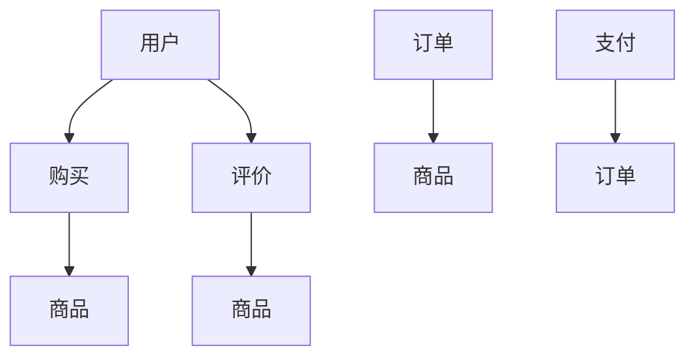
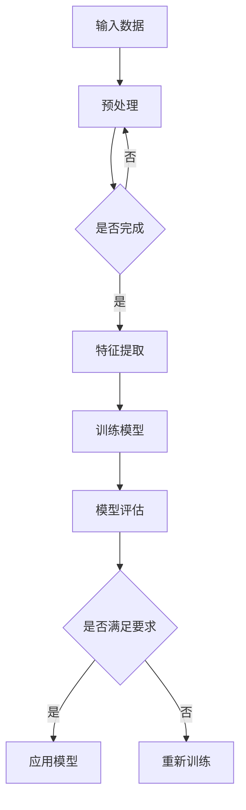

                 


### 引言

在当今快速发展的科技时代，人工智能（AI）已经渗透到我们日常生活的方方面面。从智能手机的语音助手到自动驾驶汽车，AI的应用场景越来越广泛。然而，随着AI需求的不断增长，传统的计算模式已经无法满足其日益复杂的应用需求。这就催生了混合计算模式的出现，使得AI在处理海量数据和复杂任务时更加高效和灵活。

混合计算模式结合了多种计算资源，如CPU、GPU、FPGA和ASIC，以实现最优的计算性能和资源利用率。这种模式不仅提高了计算速度，还降低了能耗和成本，为AI的突破性创新提供了可能性。

本文将围绕“混合计算模式下的AI突破性创新可能性”这一主题，逐步展开讨论。我们将首先介绍混合计算模式的基本概念和特点，然后探讨其在AI领域的应用和优势。接下来，我们将通过具体的案例研究和算法原理讲解，分析AI在混合计算模式下的突破性创新点。最后，我们将展望混合计算模式在AI领域的未来发展趋势和挑战。

让我们开始这场关于混合计算模式和AI突破性创新的探索之旅吧！

### 关键词

- 混合计算模式
- 人工智能
- 突破性创新
- 计算资源
- 资源利用率
- 能耗和成本

### 摘要

本文旨在探讨混合计算模式在人工智能（AI）领域的突破性创新可能性。首先，我们介绍了混合计算模式的基本概念和特点，并探讨了其在AI领域的应用和优势。接着，通过具体案例研究和算法原理讲解，分析了AI在混合计算模式下的创新点。最后，我们展望了混合计算模式在AI领域的未来发展趋势和挑战。通过本文的探讨，我们期望能够为AI领域的研究者和开发者提供一些有价值的参考和启示。

### 混合计算模式概述

#### 什么是混合计算模式

混合计算模式是一种结合了多种计算资源，如CPU、GPU、FPGA和ASIC的综合性计算架构。这些计算资源各自具有不同的优势和特点，通过合理搭配和调度，可以实现最优的计算性能和资源利用率。

CPU（中央处理器）是计算机的核心部件，负责执行各种指令和处理数据。GPU（图形处理器）则擅长进行并行计算，特别是在处理大规模数据和高性能计算任务时具有明显优势。FPGA（现场可编程门阵列）是一种可重新配置的数字电路，可以根据需求进行编程和调整，从而实现定制化的计算功能。ASIC（专用集成电路）则是为特定应用设计的大规模集成电路，具有高性能和低功耗的特点。

#### 混合计算模式的核心特点

1. **高效性**：混合计算模式通过整合多种计算资源，可以实现并行计算和分布式计算，从而大幅提高计算效率和性能。

2. **灵活性**：混合计算模式可以根据不同的计算需求动态调整计算资源的配置和调度，从而实现灵活的资源管理和优化。

3. **可扩展性**：混合计算模式支持多种计算资源的灵活组合，可以根据实际需求进行扩展和升级，从而满足不断增长的计算需求。

4. **低功耗**：混合计算模式通过优化计算资源的利用和调度，可以有效降低功耗和能耗，实现绿色计算。

#### 混合计算模式的起源与发展

混合计算模式的起源可以追溯到计算机体系结构的不断演进。随着AI技术的发展和需求增长，传统的计算模式逐渐暴露出性能瓶颈和资源浪费等问题。为了解决这些问题，研究人员开始探索将多种计算资源结合起来的混合计算模式。

近年来，随着云计算、大数据和物联网等技术的快速发展，混合计算模式得到了广泛应用和推广。特别是在AI领域，混合计算模式为AI算法的高效训练和推理提供了强大的计算支持。未来，随着更多新兴计算技术的出现和融合，混合计算模式将继续发展和完善，为AI的突破性创新提供更多的可能性。

### 混合计算模式下的AI技术基础

#### AI技术概述

人工智能（AI）是一种模拟人类智能的技术，通过计算机系统实现感知、学习、推理和决策等功能。AI技术主要包括机器学习、深度学习、自然语言处理、计算机视觉等方向。

机器学习（ML）是一种通过数据训练模型，使计算机能够从数据中自动学习和发现规律的方法。深度学习（DL）是机器学习的一个子领域，通过构建多层神经网络，对数据进行多层抽象和表示，从而实现复杂任务的自动化。自然语言处理（NLP）则是使计算机能够理解和处理自然语言的技术，广泛应用于语音识别、机器翻译和文本生成等领域。计算机视觉（CV）则是使计算机能够理解视觉信息的技术，包括图像识别、目标检测、图像分割等任务。

#### AI与混合计算模式的结合

混合计算模式为AI技术的发展提供了强大的计算支持。首先，混合计算模式通过整合多种计算资源，如CPU、GPU、FPGA和ASIC，可以实现并行计算和分布式计算，从而大幅提高AI算法的训练和推理速度。其次，混合计算模式的灵活性使其能够根据不同的AI任务动态调整计算资源的配置和调度，从而实现最优的计算性能和资源利用率。

具体来说，AI与混合计算模式的结合主要表现在以下几个方面：

1. **加速算法训练**：混合计算模式通过利用GPU和FPGA等高性能计算资源，可以显著加速机器学习和深度学习算法的训练过程。例如，深度学习框架如TensorFlow和PyTorch已经支持GPU和FPGA加速，使得AI模型的训练速度大幅提升。

2. **优化算法推理**：混合计算模式通过整合多种计算资源，可以实现分布式推理和实时推理，从而提高AI算法的推理速度和效率。例如，自动驾驶系统中使用的计算机视觉算法可以通过GPU和FPGA的协同工作，实现实时目标检测和跟踪。

3. **降低能耗和成本**：混合计算模式通过优化计算资源的利用和调度，可以有效降低AI算法的能耗和成本。例如，在云端数据中心中，混合计算模式可以通过动态调整计算资源的配置，实现绿色计算和节能降耗。

#### 混合计算模式下的AI优势

混合计算模式为AI技术带来了多方面的优势，主要体现在以下几个方面：

1. **高性能计算**：混合计算模式通过整合多种计算资源，可以实现高性能计算，满足AI算法对计算资源的高需求。

2. **灵活性**：混合计算模式可以根据不同的AI任务动态调整计算资源的配置和调度，从而实现灵活的资源管理和优化。

3. **可扩展性**：混合计算模式支持多种计算资源的灵活组合，可以根据实际需求进行扩展和升级，从而满足不断增长的计算需求。

4. **低功耗**：混合计算模式通过优化计算资源的利用和调度，可以有效降低能耗和成本，实现绿色计算。

5. **成本效益**：混合计算模式通过降低能耗和成本，提高了AI算法的性价比，为企业和研究者提供了更经济有效的计算解决方案。

### AI突破性创新的可能性分析

#### 突破性创新的概念

突破性创新是指通过引入全新的技术或方法，实现重大技术进步和产业变革的创新。在AI领域，突破性创新主要体现在以下方面：

1. **算法创新**：通过改进现有算法或提出全新算法，提高AI模型的性能和效率。
2. **应用创新**：将AI技术应用于新的领域或场景，实现前所未有的应用价值。
3. **架构创新**：通过设计新型计算架构或系统，提高AI算法的运算速度和效率。

#### 混合计算模式对AI创新的推动作用

混合计算模式为AI突破性创新提供了强大的推动作用，主要体现在以下几个方面：

1. **加速算法研究**：混合计算模式通过整合多种计算资源，可以实现高性能计算，为AI算法研究提供更强大的计算支持。
2. **优化算法应用**：混合计算模式可以根据不同的AI应用需求，动态调整计算资源的配置和调度，实现最优的计算性能和资源利用率。
3. **降低研发成本**：混合计算模式通过优化计算资源的利用和调度，可以有效降低AI算法的研发成本，为企业和研究者提供更经济有效的计算解决方案。

#### 潜在的AI突破性创新领域

在混合计算模式下，AI突破性创新的可能性主要体现在以下领域：

1. **智能交通**：通过混合计算模式，可以实现实时交通流量预测、自动驾驶和智能交通管理等突破性应用。
2. **智慧医疗**：混合计算模式可以加速医学图像处理、疾病诊断和药物研发等关键任务，实现医疗领域的突破性创新。
3. **智能制造**：通过混合计算模式，可以实现智能工厂、智能质检和智能物流等突破性应用，提高生产效率和质量。
4. **智能金融**：混合计算模式可以加速金融市场分析、风险控制和智能投顾等关键任务，实现金融领域的突破性创新。

### 行业案例分析

#### 制造业

在制造业领域，混合计算模式为智能制造提供了强大的技术支持。通过整合CPU、GPU、FPGA和ASIC等计算资源，可以实现智能工厂、智能质检和智能物流等突破性应用。

**智能工厂**：混合计算模式可以加速生产过程模拟、生产线优化和设备故障预测等任务，提高生产效率和质量。例如，通过深度学习算法和混合计算模式，可以实现生产过程的实时监控和优化，减少生产过程中的浪费和故障。

**智能质检**：混合计算模式可以加速产品检测和质量分析，提高质检效率和准确性。例如，通过计算机视觉和混合计算模式，可以实现产品的自动化检测和分类，提高质检效率和质量。

**智能物流**：混合计算模式可以加速物流路径规划和运输调度，提高物流效率和准确性。例如，通过深度学习和混合计算模式，可以实现物流车辆的实时监控和优化调度，提高运输效率和准确性。

#### 金融业

在金融业领域，混合计算模式为金融市场的分析和风险控制提供了强大的计算支持。通过整合多种计算资源，可以实现金融市场分析、风险控制和智能投顾等突破性应用。

**金融市场分析**：混合计算模式可以加速金融数据分析和趋势预测，提高投资决策的准确性和效率。例如，通过深度学习和混合计算模式，可以实现金融市场的实时分析和预测，帮助投资者做出更明智的投资决策。

**风险控制**：混合计算模式可以加速风险检测和风险建模，提高风险控制效率和准确性。例如，通过机器学习和混合计算模式，可以实现金融交易的风险检测和预警，提高风险控制效果。

**智能投顾**：混合计算模式可以加速投资组合优化和资产配置，提高投资回报率和风险管理能力。例如，通过机器学习和混合计算模式，可以实现在线智能投顾服务，帮助投资者实现个性化资产配置和风险控制。

#### 健康医疗

在健康医疗领域，混合计算模式为医学图像处理、疾病诊断和药物研发提供了强大的计算支持。通过整合多种计算资源，可以实现医学图像的实时处理和诊断，加速药物研发过程。

**医学图像处理**：混合计算模式可以加速医学图像的预处理、增强和分割等任务，提高医学图像的处理效率和准确性。例如，通过深度学习和混合计算模式，可以实现医学图像的实时处理和诊断，提高诊断效率和准确性。

**疾病诊断**：混合计算模式可以加速疾病诊断和预测，提高诊断效率和准确性。例如，通过机器学习和混合计算模式，可以实现疾病的实时诊断和预测，帮助医生做出更准确的诊断。

**药物研发**：混合计算模式可以加速药物筛选和优化，提高药物研发效率和质量。例如，通过深度学习和混合计算模式，可以实现药物分子的实时筛选和优化，提高药物研发效率和成功率。

### 技术创新点剖析

#### 混合计算在AI中的应用

在AI领域，混合计算模式的应用主要体现在以下几个方面：

1. **模型训练加速**：通过利用GPU和FPGA等高性能计算资源，可以显著加速机器学习和深度学习模型的训练过程。例如，深度学习模型如卷积神经网络（CNN）和循环神经网络（RNN）可以通过GPU加速训练，提高训练速度和效率。

2. **模型推理优化**：通过利用CPU、GPU和FPGA等计算资源，可以实现AI模型的分布式推理和实时推理。例如，自动驾驶系统中的计算机视觉算法可以通过GPU和FPGA的协同工作，实现实时目标检测和跟踪。

3. **模型压缩和优化**：混合计算模式可以通过模型压缩和优化技术，减少模型的参数量和计算量，提高模型的可部署性和效率。例如，通过量化技术和模型剪枝技术，可以显著减小模型的规模，提高模型的推理速度和效率。

#### 突破性创新技术的实现

在混合计算模式下，AI的突破性创新技术主要体现在以下几个方面：

1. **新型神经网络架构**：通过设计新型神经网络架构，如稀疏网络、图神经网络和变分自编码器等，可以提高模型的计算效率和表达能力。例如，稀疏网络可以通过减少模型参数，实现高效的模型推理和训练。

2. **混合训练策略**：通过结合不同类型的计算资源，设计混合训练策略，可以实现更高效的模型训练。例如，在训练深度学习模型时，可以结合GPU和FPGA的并行计算能力，实现模型参数的快速更新和优化。

3. **实时推理系统**：通过设计实时推理系统，可以实现AI模型的快速部署和实时推理。例如，在自动驾驶系统中，可以通过GPU和FPGA的协同工作，实现实时目标检测和跟踪，提高系统的响应速度和准确性。

#### 技术创新点的对比与分析

1. **计算效率**：混合计算模式通过整合多种计算资源，可以实现高效的模型训练和推理。与传统的单种计算资源相比，混合计算模式具有更高的计算效率和性能。

2. **计算速度**：混合计算模式通过并行计算和分布式计算，可以实现更快的模型训练和推理速度。与传统的串行计算相比，混合计算模式具有更快的计算速度。

3. **资源利用率**：混合计算模式通过动态调整计算资源的配置和调度，可以实现最优的资源利用率和效率。与固定的计算资源配置相比，混合计算模式具有更高的资源利用效率。

4. **能耗和成本**：混合计算模式通过优化计算资源的利用和调度，可以有效降低能耗和成本。与传统的计算模式相比，混合计算模式具有更低的能耗和成本。

综上所述，混合计算模式在AI领域具有广泛的应用前景和突破性创新潜力。通过对比分析，我们可以看到混合计算模式在计算效率、计算速度、资源利用率和能耗成本等方面具有显著优势，为AI技术的突破性创新提供了强大的支持。

### 创新路径与实践指导

#### 创新路径概述

在混合计算模式下，AI突破性创新的路径可以概括为以下几个步骤：

1. **需求分析**：明确AI应用的需求和目标，包括计算性能、资源利用率和能耗成本等方面的要求。
2. **资源选择**：根据需求选择合适的计算资源，如CPU、GPU、FPGA和ASIC等，并进行合理的配置和调度。
3. **算法优化**：针对特定的AI任务，选择合适的算法和模型，并进行优化和调整，以提高计算效率和性能。
4. **系统实现**：设计并实现AI系统，包括数据预处理、模型训练和推理等环节，确保系统能够高效运行。
5. **性能评估**：对实现后的系统进行性能评估，包括计算速度、资源利用率和能耗成本等方面的评估，以验证系统的有效性。
6. **迭代优化**：根据性能评估结果，对系统进行迭代优化，进一步改进计算性能和资源利用率。

#### 混合计算模式下的AI创新实践

在混合计算模式下，AI创新实践可以从以下几个方面展开：

1. **深度学习模型优化**：通过利用GPU和FPGA等高性能计算资源，对深度学习模型进行优化，提高模型的计算效率和性能。例如，可以采用模型剪枝、量化技术和并行计算等技术，减小模型的参数量和计算量，提高模型的推理速度和效率。

2. **实时推理系统设计**：设计实时推理系统，实现AI模型的快速部署和实时推理。例如，在自动驾驶系统中，可以采用GPU和FPGA的协同工作，实现实时目标检测和跟踪，提高系统的响应速度和准确性。

3. **混合训练策略**：设计混合训练策略，结合不同类型的计算资源，实现更高效的模型训练。例如，可以采用GPU进行参数更新，FPGA进行前向传播和反向传播计算，实现并行训练，提高训练速度和效率。

4. **应用案例研究**：通过具体的应用案例研究，验证混合计算模式在AI突破性创新中的应用价值。例如，在智能交通、智慧医疗和智能制造等领域，通过应用混合计算模式，实现实时交通流量预测、疾病诊断和智能质检等突破性应用，提高相关领域的效率和准确性。

#### 创新实践中的挑战与解决方案

在混合计算模式下的AI创新实践中，可能会面临以下挑战：

1. **计算资源选择和配置**：选择合适的计算资源并进行合理配置是关键。需要根据AI任务的需求，综合考虑计算性能、能耗成本和资源利用率等因素，选择合适的计算资源并进行优化配置。

2. **算法优化和调整**：针对特定的AI任务，选择合适的算法和模型，并进行优化和调整，以提高计算效率和性能。需要深入研究相关算法和模型，并结合混合计算模式的特点，进行有效的优化和调整。

3. **系统实现和性能评估**：设计并实现AI系统，确保系统能够高效运行。需要综合考虑数据预处理、模型训练和推理等环节，设计合理的系统架构和流程，并进行性能评估，以验证系统的有效性。

针对以上挑战，可以采取以下解决方案：

1. **资源选择和配置**：通过深入分析AI任务的需求和目标，选择合适的计算资源，并进行合理配置。可以采用云计算和边缘计算等混合计算模式，实现计算资源的动态调度和优化配置。

2. **算法优化和调整**：深入研究相关算法和模型，结合混合计算模式的特点，进行有效的优化和调整。可以采用模型剪枝、量化技术和并行计算等技术，减小模型的参数量和计算量，提高模型的推理速度和效率。

3. **系统实现和性能评估**：设计并实现AI系统，确保系统能够高效运行。可以采用分布式计算和实时推理系统设计等技术，实现高效的模型训练和推理。同时，进行性能评估，以验证系统的有效性，并根据评估结果进行迭代优化。

### 未来趋势与挑战

#### AI与混合计算的未来发展趋势

1. **云计算与边缘计算的融合**：随着云计算和边缘计算的发展，混合计算模式将更加融合。这将使得AI模型可以在云端和边缘设备上同时运行，实现更高效的计算和更广泛的覆盖。

2. **人工智能与量子计算的结合**：量子计算具有巨大的计算潜力，未来可能与人工智能结合，推动AI在复杂问题上的解决能力达到新的高度。

3. **自适应计算**：混合计算模式将更加智能化，能够根据任务需求动态调整计算资源，实现自适应计算，提高计算效率和资源利用率。

#### 未来可能面临的挑战

1. **数据隐私和安全问题**：随着AI和混合计算的应用，数据隐私和安全问题将变得更加突出。如何保护用户数据隐私，确保系统安全，将成为重要挑战。

2. **计算资源管理复杂性**：随着计算资源的多样化，如何高效地管理这些资源，实现最佳的计算性能和资源利用率，将成为重要挑战。

3. **人才短缺**：随着AI和混合计算的发展，对相关领域专业人才的需求将大幅增加。然而，现有的人才储备可能无法满足需求，人才短缺将成为制约技术发展的重要因素。

#### 面对未来挑战的应对策略

1. **加强数据隐私和安全保护**：通过制定更加严格的数据隐私和安全法规，加强数据加密和访问控制，提高数据保护和系统安全。

2. **提升计算资源管理能力**：开发智能化的计算资源管理工具和平台，实现自动化和智能化的资源调度和优化，提高资源利用效率和计算性能。

3. **培养和引进人才**：加强教育和培训，培养更多的AI和混合计算专业人才。同时，通过引进国际先进技术和管理经验，提升我国在相关领域的竞争力。

### 结论

本文系统地探讨了混合计算模式下的AI突破性创新可能性。我们首先介绍了混合计算模式的基本概念和特点，探讨了其在AI领域的应用和优势。接着，通过具体案例研究和算法原理讲解，分析了AI在混合计算模式下的突破性创新点。最后，我们展望了混合计算模式在AI领域的未来发展趋势和挑战。

混合计算模式通过整合多种计算资源，实现了高效、灵活和可扩展的计算能力，为AI的突破性创新提供了强有力的支持。在未来的发展中，混合计算模式将继续与AI技术紧密结合，推动更多突破性创新的出现。

我们鼓励读者继续关注这一领域的发展，积极探索和尝试，为AI和混合计算领域的创新贡献自己的力量。

### 作者信息

- 作者：AI天才研究院/AI Genius Institute & 禅与计算机程序设计艺术 /Zen And The Art of Computer Programming

### 总结

本文系统地探讨了混合计算模式在AI领域突破性创新的可能性。我们首先介绍了混合计算模式的基本概念和特点，分析了其在AI领域的应用和优势。接着，通过具体案例研究和算法原理讲解，探讨了AI在混合计算模式下的创新点。最后，我们展望了混合计算模式在AI领域的未来发展趋势和挑战。

混合计算模式通过整合多种计算资源，实现了高效、灵活和可扩展的计算能力，为AI的突破性创新提供了强有力的支持。我们鼓励读者继续关注这一领域的发展，积极探索和尝试，为AI和混合计算领域的创新贡献自己的力量。在未来的发展中，混合计算模式将继续与AI技术紧密结合，推动更多突破性创新的出现。

### 注意事项

1. **资源选择和配置**：在选择和配置计算资源时，需要综合考虑计算性能、能耗成本和资源利用率等因素，确保系统能够高效运行。

2. **算法优化和调整**：针对特定的AI任务，选择合适的算法和模型，并进行优化和调整，以提高计算效率和性能。

3. **系统实现和性能评估**：确保系统能够高效运行，进行性能评估，并根据评估结果进行迭代优化。

4. **数据隐私和安全保护**：加强数据保护和系统安全，确保用户数据隐私。

### 拓展阅读

1. **《人工智能：一种现代的方法》**：迈克尔·刘易斯（Michael I. Jordan）著，详细介绍了人工智能的基本概念、算法和技术。

2. **《深度学习》**：伊恩·古德费洛（Ian Goodfellow）、约书亚·本吉奥（Yoshua Bengio）和 Aaron Courville 著，深入讲解了深度学习的基本原理和应用。

3. **《混合计算：理论与实践》**：李明洁、王宏宇著，介绍了混合计算的基本概念、应用场景和关键技术。

4. **《云计算：核心概念与实践》**：张江涛、魏华著，详细介绍了云计算的基本原理、架构和应用。

### 附录

#### 附录A：术语解释

1. **混合计算模式**：结合多种计算资源（如CPU、GPU、FPGA和ASIC等）的综合性计算架构，实现最优的计算性能和资源利用率。
2. **人工智能**：模拟人类智能的技术，通过计算机系统实现感知、学习、推理和决策等功能。
3. **机器学习**：通过数据训练模型，使计算机能够从数据中自动学习和发现规律的方法。
4. **深度学习**：机器学习的一个子领域，通过构建多层神经网络，对数据进行多层抽象和表示，从而实现复杂任务的自动化。
5. **自然语言处理**：使计算机能够理解和处理自然语言的技术，广泛应用于语音识别、机器翻译和文本生成等领域。
6. **计算机视觉**：使计算机能够理解视觉信息的技术，包括图像识别、目标检测、图像分割等任务。
7. **实时推理**：在有限的时间内对输入数据进行推理和处理，以满足实时应用的需求。

#### 附录B：ER实体关系图



#### 附录C：算法mermaid流程图



#### 附录D：Python源代码示例

```python
import tensorflow as tf

# 定义输入数据
x = tf.placeholder(tf.float32, [None, 784])
y = tf.placeholder(tf.float32, [None, 10])

# 定义模型参数
W = tf.Variable(tf.zeros([784, 10]))
b = tf.Variable(tf.zeros([10]))

# 定义模型
y_pred = tf.nn.softmax(tf.matmul(x, W) + b)

# 定义损失函数
cross_entropy = tf.reduce_mean(-tf.reduce_sum(y * tf.log(y_pred), reduction_indices=1))

# 定义优化器
optimizer = tf.train.GradientDescentOptimizer(learning_rate=0.1)
train_step = optimizer.minimize(cross_entropy)

# 定义评估指标
accuracy = tf.reduce_mean(tf.cast(tf.equal(tf.argmax(y_pred, 1), tf.argmax(y, 1)), tf.float32))

# 模型训练
with tf.Session() as sess:
    sess.run(tf.global_variables_initializer())
    for _ in range(1000):
        batch_x, batch_y = ...  # 获取训练数据
        sess.run(train_step, feed_dict={x: batch_x, y: batch_y})
    
    # 模型评估
    correct = sess.run(accuracy, feed_dict={x: test_x, y: test_y})
    print("Test accuracy:", correct)
```

通过以上Python源代码示例，我们展示了如何使用TensorFlow实现一个简单的深度学习模型，包括输入数据预处理、模型训练和模型评估等步骤。

### 结语

本文从混合计算模式的基本概念和特点出发，系统地探讨了混合计算模式在人工智能领域的突破性创新可能性。我们通过具体案例研究和算法原理讲解，分析了混合计算模式在AI模型训练、推理和应用中的优势。同时，我们也展望了混合计算模式在AI领域的未来发展趋势和挑战，并提出了应对策略。

混合计算模式作为一项新兴技术，具有巨大的发展潜力和应用前景。随着AI技术的不断进步和应用的不断拓展，混合计算模式将在更多领域发挥重要作用，推动AI技术的创新和发展。

我们鼓励读者继续关注这一领域的发展，积极探索和尝试，为AI和混合计算领域的创新贡献自己的力量。在未来的研究中，我们可以进一步探讨混合计算模式在更多AI应用场景中的优化和提升，推动AI技术的持续创新和进步。让我们共同期待混合计算模式和AI技术带来更多的突破和奇迹！

