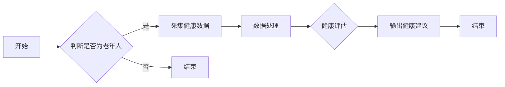
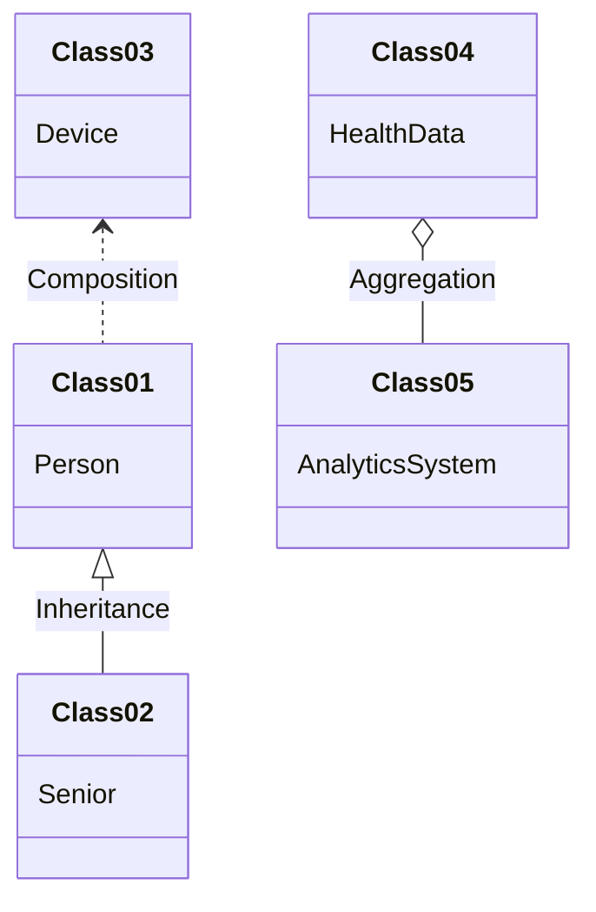
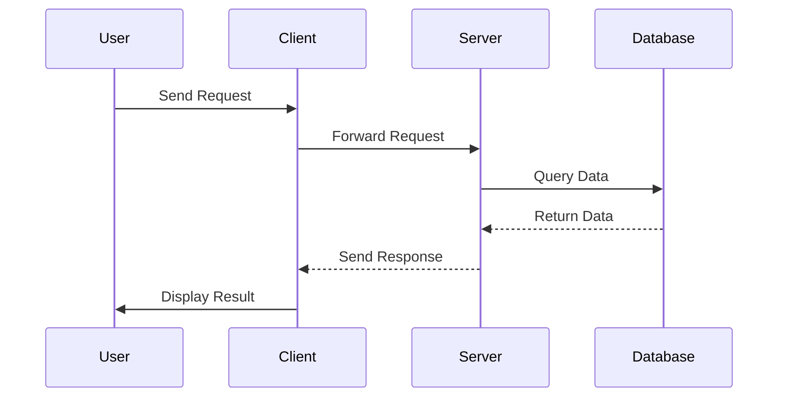
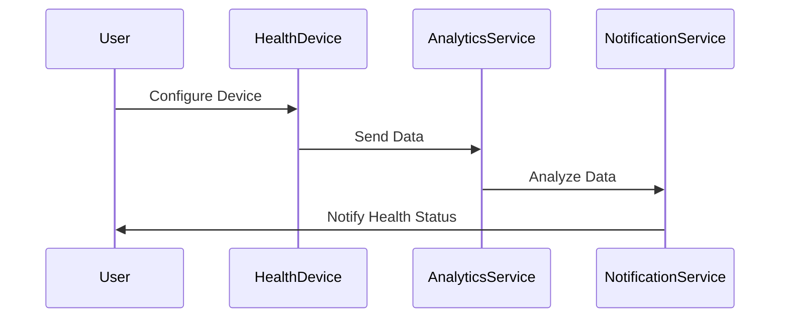

                 

### 物联网在智慧养老中的全面应用背景

#### 智慧养老概述

##### 1.1 问题背景

随着全球人口老龄化趋势的加剧，如何有效地满足老年人群体的养老需求成为社会亟待解决的重要问题。据联合国统计，全球60岁以上人口比例将从2015年的12%增长到2050年的22%，而我国这一比例更是将从2015年的16.15%增长到2050年的33.17%。面对这一趋势，传统的养老模式显得愈发乏力，主要体现在以下几个方面：

1. **人力成本高**：传统养老院需要大量人力的投入，不仅增加了运营成本，而且难以保证服务质量和专业性。
2. **服务单一**：传统养老院主要提供基本的生活照料服务，无法满足老年人多样化的精神文化需求。
3. **缺乏个性关怀**：由于养老院规模较大，难以对每位老人的健康状况和生活习惯进行个性化监测和管理。

##### 1.2 物联网技术介绍

物联网（Internet of Things，简称IoT）是指通过传感器、网络和智能设备等技术，实现物体与物体之间的互联互通。物联网的核心要素包括传感器、网络、数据处理和应用平台。

1. **传感器技术**：传感器是物联网系统的感知单元，通过采集温度、湿度、光线、声音等环境数据，实现对物体状态的实时监测。
2. **网络技术**：网络是实现物联网系统数据传输的关键，包括无线网络（如Wi-Fi、蓝牙、NB-IoT等）和有线网络（如以太网、光纤等）。
3. **数据处理技术**：数据处理是物联网系统的核心，通过对采集到的海量数据进行清洗、存储和分析，实现数据的智能化应用。
4. **应用平台**：应用平台是物联网系统的接口，通过用户界面为用户提供数据展示、管理和控制功能。

物联网技术发展的趋势主要体现在以下几个方面：

1. **技术融合**：物联网与云计算、大数据、人工智能等技术的深度融合，使得物联网系统的智能化水平不断提升。
2. **设备多样化**：随着传感器技术和网络技术的进步，物联网设备越来越多样化，从简单的温度传感器到复杂的智能摄像头、智能手表等。
3. **低功耗广域网（LPWAN）**：为了满足物联网设备对长距离、低功耗的需求，低功耗广域网技术（如NB-IoT、LoRa等）得到了快速发展。

##### 1.3 智慧养老的概念与内涵

智慧养老是指通过物联网、大数据、云计算等信息技术，为老年人提供全方位、个性化的健康管理、生活服务和精神文化支持的一种新型养老模式。智慧养老的核心特性包括：

1. **智能化管理**：通过物联网技术实现对老年人的实时监控和远程管理，提高养老服务的效率和质量。
2. **个性化服务**：根据老年人的健康状况、生活习惯和个性化需求，提供定制化的养老服务，满足老年人多样化的需求。
3. **多元化互动**：通过社交平台、智能设备等，为老年人提供丰富的精神文化娱乐活动，促进老年人的身心健康。

##### 1.4 物联网在智慧养老中的重要性

物联网技术在智慧养老中具有以下几个方面的应用价值：

1. **提升养老服务质量**：通过物联网技术，可以实现老年人健康状态的实时监测和预警，提高养老服务的精准性和及时性。
2. **实现个性化健康管理**：通过大数据分析和人工智能技术，可以针对老年人的健康状况提供个性化的健康建议和医疗方案，提高老年人的生活质量。

##### 1.5 本章小结

本章主要介绍了智慧养老的背景、物联网技术的概念与趋势、智慧养老的概念与内涵，以及物联网在智慧养老中的应用价值。下一章将深入探讨物联网技术在老年人健康监测中的应用。

----------------------------------------------------------------

### 物联网技术在智慧养老中的应用

#### 物联网在老年人健康监测中的应用

##### 2.1 老年人健康监测需求

老年人群体由于生理机能的退化，容易出现各种健康问题，如高血压、糖尿病、心脏病等。因此，对老年人的健康监测具有重要意义。常见的健康指标包括：

1. **体温**：体温是反映人体健康状况的重要指标，异常的体温变化可能预示着感染或其他疾病。
2. **血压**：高血压是老年人常见的疾病之一，定期监测血压有助于及时发现异常情况，采取相应措施。
3. **心率**：心率变化可以反映心脏的健康状况，对于患有心脏病的老年人尤为重要。
4. **血糖**：糖尿病患者需要定期监测血糖水平，以控制病情，防止并发症的发生。

这些健康指标的数据对于老年人的健康管理至关重要，它们能够为医生提供参考，帮助制定个性化的健康管理和医疗方案。

##### 2.2 物联网技术在健康监测中的应用

物联网技术在老年人健康监测中发挥着关键作用，主要包括以下几个方面：

1. **传感器技术**：传感器是健康监测系统的感知单元，可以实时采集老年人的体温、血压、心率和血糖等生理指标。例如，智能健康手环可以连续监测老年人的心率，通过蓝牙或Wi-Fi将数据传输到中央数据库。

2. **数据采集与传输**：物联网技术实现了健康数据的无线传输，将传感器采集到的数据实时上传到云端或本地服务器。数据传输可以通过Wi-Fi、蓝牙、NB-IoT等无线网络进行，确保数据的及时性和准确性。

3. **数据处理与分析**：采集到的健康数据需要进行处理和分析，以便为老年人的健康管理提供依据。大数据分析和人工智能技术可以对健康数据进行深度挖掘，发现潜在的疾病风险，提供个性化的健康建议。

4. **远程监控与管理**：通过物联网技术，医生和家庭成员可以远程监控老年人的健康状态，及时了解健康数据的变化，并在出现异常情况时采取紧急措施。远程监控不仅提高了医疗服务的效率，也减少了老年人外出就医的次数和风险。

##### 2.3 实例分析：智能健康手环

智能健康手环是物联网技术在老年人健康监测中的典型应用之一。以下是一个智能健康手环的功能介绍和技术实现：

1. **功能介绍**：

   - **心率监测**：智能健康手环通过光电传感器实时监测老年人的心率，并将数据上传到云端或本地服务器。
   - **血压监测**：通过压力传感器测量老年人的血压，数据实时传输到健康管理平台。
   - **体温监测**：利用体温传感器检测老年人的体温，数据上传至健康管理系统。
   - **睡眠监测**：智能健康手环还可以监测老年人的睡眠质量，包括睡眠时长、深度等指标。
   - **数据同步**：手环与手机APP同步，老年人可以通过APP查看自己的健康数据，与医生进行远程交流。

2. **技术实现**：

   - **硬件组成**：智能健康手环主要由心率传感器、压力传感器、体温传感器、蓝牙模块和电池等组成。
   - **软件部分**：手环内置嵌入式系统，用于数据采集、处理和传输。数据通过蓝牙传输到手机APP或云端服务器，进行进一步分析和处理。
   - **数据处理**：采集到的健康数据经过处理和分析，生成心率、血压、体温等健康指标，并通过APP或云端平台展示给用户。

##### 2.4 数据分析与健康管理

1. **数据处理方法**：采集到的健康数据需要进行处理，包括数据清洗、数据融合、数据存储和数据分析等。常见的处理方法包括：

   - **数据清洗**：去除噪声和错误数据，保证数据的质量。
   - **数据融合**：将多个传感器采集的数据进行整合，形成完整的健康数据。
   - **数据存储**：将处理后的健康数据存储在数据库中，便于后续分析和查询。
   - **数据分析**：利用大数据分析和人工智能技术，对健康数据进行分析，发现潜在的疾病风险，提供个性化的健康建议。

2. **健康风险评估**：通过数据分析，可以评估老年人的健康风险，包括心血管疾病、糖尿病、抑郁症等。健康风险评估的方法包括：

   - **统计方法**：利用统计学方法，对健康数据进行回归分析、聚类分析等，识别健康风险。
   - **机器学习方法**：利用机器学习算法，如决策树、支持向量机、神经网络等，对健康数据进行分类和预测，评估健康风险。
   - **综合评估**：结合多种评估方法，形成综合的健康风险评估结果，为老年人提供全面的健康指导。

##### 2.5 本章小结

本章详细介绍了物联网技术在老年人健康监测中的应用，包括传感器技术、数据采集与传输、实例分析以及数据分析和健康管理等方面。物联网技术在智慧养老中的广泛应用，为老年人的健康管理提供了有力支持，提高了养老服务的质量和效率。

----------------------------------------------------------------

### 物联网在老年人日常生活中的应用

#### 物联网在老年人日常生活中的应用

##### 3.1 安全监控

安全监控是智慧养老的重要组成部分，通过物联网技术，可以为老年人提供一个安全的生活环境。

1. **家居安全**：智能家居系统可以通过传感器、摄像头和报警器等设备，实时监测老年人的家居安全。例如，门窗传感器可以检测门窗是否被非法打开，摄像头可以监控家中情况，报警器可以在发生异常时发出警报。

2. **紧急呼叫系统**：老年人可以在家中安装紧急呼叫按钮或智能手表，当发生紧急情况时，可以通过一键呼叫系统联系家属或紧急救援服务，确保安全。

##### 3.2 生活辅助

物联网技术还可以为老年人提供各种生活辅助设备，提高生活便利性。

1. **智能家居设备**：智能家居设备如智能灯泡、智能插座、智能门锁等，可以通过手机APP进行远程控制，老年人可以在家中通过简单的操作调节家电，提高生活质量。

2. **语音助手与虚拟助手**：智能音箱和虚拟助手如小爱同学、天猫精灵等，可以为老年人提供语音交互服务，帮助他们完成日常任务，如播放音乐、设定闹钟、查询天气等。

##### 3.3 社交互动

社交互动对于老年人的心理健康和生活质量至关重要。物联网技术可以通过以下方式促进老年人的社交互动：

1. **远程社交平台**：通过智能手机或智能电视，老年人可以加入线上社交平台，与家人、朋友和同龄人进行实时交流，分享生活经验和乐趣。

2. **社交机器人**：社交机器人可以通过语音和视觉交互，与老年人进行互动，提供陪伴和娱乐，减轻孤独感。

##### 3.4 生活便利

物联网技术还可以为老年人提供各种生活便利服务。

1. **自动化家电**：通过物联网技术，可以将家电设备连接到互联网，实现自动化控制。例如，智能冰箱可以根据库存自动补充食品，智能洗衣机可以根据衣物类型自动设定洗涤模式。

2. **轻松购物与配送**：老年人可以通过智能家居设备或手机APP，在线购买生活必需品，并享受便捷的配送服务，减少外出购物的麻烦。

##### 3.5 本章小结

本章详细探讨了物联网技术在老年人日常生活中的多种应用，包括安全监控、生活辅助、社交互动和生活便利等方面。物联网技术的广泛应用，不仅提高了老年人的生活质量，也增强了他们的安全感和幸福感。

----------------------------------------------------------------

### 物联网在智慧养老中的挑战

##### 4.1 数据隐私与安全

随着物联网技术在智慧养老中的应用越来越广泛，数据隐私和安全问题日益突出。老年人群体由于年龄较大，个人信息保护意识相对较弱，更容易成为网络攻击的目标。以下是一些数据隐私和安全方面的挑战：

1. **数据泄露风险**：物联网设备数量众多，设备之间的数据传输和处理过程中，存在数据泄露的风险。一旦数据泄露，老年人的个人信息、健康数据等敏感信息可能被不法分子获取，造成严重后果。

2. **网络攻击**：物联网设备通常连接到互联网，容易受到网络攻击。黑客可以通过网络入侵设备，操控设备进行恶意行为，如窃取数据、干扰设备运行等。

3. **设备安全**：物联网设备自身也存在安全漏洞，黑客可以通过攻击设备漏洞，获取设备的控制权，进而对老年人进行勒索或进行其他恶意行为。

为了解决数据隐私和安全问题，需要采取以下措施：

1. **数据加密**：对传输和存储的数据进行加密，确保数据在传输和存储过程中不被非法访问。
2. **访问控制**：设置严格的访问控制机制，确保只有授权用户才能访问数据。
3. **安全监控**：建立实时监控机制，及时发现和应对网络攻击和设备安全问题。
4. **用户教育**：加强对老年人的网络安全教育，提高他们的信息安全意识，避免因个人信息泄露造成损失。

##### 4.2 技术标准化与互操作性

物联网技术在智慧养老中的应用需要不同设备、系统和平台之间的互操作性。然而，目前物联网技术标准尚未统一，不同设备、系统和平台之间存在兼容性问题，这给物联网在智慧养老中的应用带来了挑战。

1. **技术标准缺失**：由于物联网技术涉及多个领域，不同领域的技术标准存在差异，导致设备、系统和平台之间的互操作性较差。

2. **数据格式不一致**：不同设备、系统和平台采用的数据格式可能不一致，导致数据交换和共享困难。

3. **接口兼容性问题**：不同设备和系统的接口标准不统一，导致系统集成困难，降低了物联网系统的整体性能。

为了解决技术标准化和互操作性问题，需要采取以下措施：

1. **制定统一标准**：国家和国际组织应制定统一的物联网技术标准，确保不同设备、系统和平台之间的互操作性。

2. **开放接口与协议**：设备和系统应采用开放的接口和协议，便于数据交换和共享。

3. **技术融合与创新**：推动物联网技术与其他技术的融合，如云计算、大数据和人工智能等，提高物联网系统的整体性能和互操作性。

##### 4.3 成本与可及性

物联网技术在智慧养老中的应用成本较高，设备、系统和平台的建设和维护需要大量资金投入。此外，物联网技术的普及程度相对较低，特别是在经济欠发达地区，物联网设备的可及性较差。

1. **成本问题**：物联网设备的购置、部署和维护成本较高，对于养老院、社区和家庭的资金投入要求较高。

2. **可及性问题**：经济欠发达地区和贫困人口缺乏足够的资金购买物联网设备，导致物联网技术在智慧养老中的应用受限。

为了解决成本和可及性问题，需要采取以下措施：

1. **降低成本**：通过技术创新和规模化生产，降低物联网设备的成本，使其更加经济实惠。

2. **政策支持**：政府可以出台相关政策，对物联网在智慧养老中的应用给予财政支持，降低养老院、社区和家庭的资金压力。

3. **社会参与**：鼓励企业和非政府组织参与物联网在智慧养老中的应用，通过合作和共享资源，提高物联网技术的普及率和可及性。

##### 4.4 政策与法规支持

物联网技术在智慧养老中的应用需要政策与法规的支持，以确保技术应用的安全、合规和可持续发展。

1. **数据保护法规**：制定和完善数据保护法规，规范物联网技术的数据采集、存储、处理和传输，保护老年人的个人信息和数据安全。

2. **行业标准**：制定统一的物联网技术标准和规范，促进物联网技术在智慧养老中的应用和互操作性。

3. **政策支持**：政府可以通过出台优惠政策、提供资金支持等方式，鼓励物联网技术在智慧养老中的应用和发展。

##### 4.5 本章小结

本章探讨了物联网在智慧养老中的应用挑战，包括数据隐私与安全、技术标准化与互操作性、成本与可及性以及政策与法规支持等方面。解决这些挑战需要多方面的努力，包括技术创新、政策支持和社会参与等，以确保物联网技术在智慧养老中的应用能够安全、高效和可持续地发展。

----------------------------------------------------------------

### 物联网在智慧养老中的未来趋势

##### 5.1 新兴技术的融合

随着物联网、大数据、人工智能等新兴技术的不断发展，它们在智慧养老中的应用前景也变得越来越广阔。以下是一些关键技术趋势：

1. **物联网与人工智能的融合**：人工智能（AI）技术可以进一步提升物联网系统的智能化水平。通过AI算法，可以对老年人的健康数据进行分析和预测，提供更加精准的健康管理服务。例如，利用AI技术进行心血管疾病的早期预测，有助于降低老年人的患病风险。

2. **物联网与大数据的融合**：大数据技术可以处理和分析海量健康数据，为智慧养老提供强有力的数据支持。通过对大数据的分析，可以更好地了解老年人的健康状况和需求，提供个性化的健康管理方案。

3. **物联网与云计算的融合**：云计算技术可以为物联网系统提供强大的计算和存储能力，实现数据的高效处理和存储。云计算平台可以支持物联网设备的远程管理和监控，提高系统的可靠性和可扩展性。

##### 5.2 个性化健康管理

个性化健康管理是智慧养老的重要发展方向，通过精准的健康监测和数据分析，为老年人提供个性化的健康服务。

1. **基因检测与健康管理**：基因检测技术可以揭示老年人的遗传信息，通过分析基因数据，可以预测老年人患病的风险，并提供个性化的预防措施。例如，针对心血管疾病的高风险个体，可以提供针对性的饮食和运动建议。

2. **个性化医疗方案**：基于大数据和人工智能技术，可以为老年人制定个性化的医疗方案。通过对健康数据的实时监测和分析，医生可以及时调整治疗方案，提高治疗效果。

3. **智能健康助手**：智能健康助手可以通过语音、图像等多种交互方式，为老年人提供个性化的健康咨询服务。例如，智能健康助手可以根据老年人的健康数据和病史，提供个性化的健康建议和预警信息。

##### 5.3 智慧养老社区的建设

智慧养老社区是智慧养老的重要载体，通过物联网技术的应用，可以构建一个安全、便捷、舒适的养老环境。

1. **社区物联网平台**：社区物联网平台可以实现老年人、家庭成员和养老服务人员之间的信息共享和互动。通过平台，老年人可以方便地获取各类养老服务，如健康管理、生活辅助、社交互动等。

2. **智能安防系统**：智慧养老社区可以配备智能安防系统，实时监测社区内的安全状况，保障老年人的安全。例如，智能摄像头可以监控社区内的异常行为，紧急呼叫系统可以在发生紧急情况时及时报警。

3. **智能生活环境**：智慧养老社区可以通过智能家居设备，为老年人提供一个智能化的生活环境。例如，智能灯光系统可以根据老年人的需求自动调节亮度，智能温控系统可以根据季节和天气自动调节室内温度。

##### 5.4 智能养老产业的发展

智能养老产业是一个具有广阔市场前景的领域，随着技术的不断进步和政策的支持，智能养老产业将迎来快速发展。

1. **市场规模**：随着人口老龄化的加剧，智能养老市场需求不断增长。据预测，未来几年智能养老市场规模将呈现爆发式增长，成为全球养老服务市场的重要组成部分。

2. **创新驱动发展**：技术创新是智能养老产业发展的关键驱动力。通过不断引入新技术、新产品和新模式，可以推动智能养老产业的快速发展。

3. **政策支持**：政府出台了一系列支持智能养老产业发展的政策，如税收优惠、资金扶持等，为智能养老产业的发展提供了有力支持。

##### 5.5 本章小结

本章探讨了物联网在智慧养老中的未来趋势，包括新兴技术的融合、个性化健康管理、智慧养老社区的建设以及智能养老产业的发展。随着技术的不断进步和政策的支持，物联网在智慧养老中的应用前景将更加广阔，为老年人提供更加优质、便捷和个性化的养老服务。

----------------------------------------------------------------

### 物联网在智慧养老中的最佳实践案例

##### 6.1 案例介绍

本案例选取的是我国某大型养老社区，该社区利用物联网技术构建了一个全面的智慧养老系统，为老年人提供全方位的健康管理、生活服务和社交互动。

##### 6.2 案例实施过程

1. **技术选型**：

   - **硬件选型**：该社区选用了多种物联网设备，包括智能健康手环、智能血压计、智能体温计、智能摄像头、智能门锁等。
   - **网络选型**：采用Wi-Fi和NB-IoT网络，确保数据的实时传输和稳定性。
   - **平台选型**：搭建了基于云计算的物联网平台，用于数据的存储、处理和分析。

2. **系统架构设计**：

   - **数据采集层**：由各类物联网设备组成，负责采集老年人的健康数据和日常生活数据。
   - **网络传输层**：通过Wi-Fi和NB-IoT网络，将采集到的数据传输到物联网平台。
   - **数据处理层**：物联网平台负责数据的存储、清洗、处理和分析。
   - **应用层**：通过手机APP和网页端，为老年人、家庭成员和医护人员提供数据查询、健康管理和社交互动等服务。

##### 6.3 案例成效分析

1. **应用效果**：

   - **健康管理**：通过智能健康手环、智能血压计等设备，老年人可以随时了解自己的健康状况，医护人员也可以实时监控老年人的健康状况，提供及时的医疗建议。
   - **生活服务**：智能家居设备如智能门锁、智能灯光等，提高了老年人的生活质量，减少了家庭照护的负担。
   - **社交互动**：通过社交平台和社交机器人，老年人可以与家人、朋友和同龄人保持联系，减轻孤独感，提高心理健康。

2. **经济效益与社会效益**：

   - **经济效益**：智能养老系统的实施降低了养老服务的成本，提高了服务效率，为社区带来了显著的经济效益。
   - **社会效益**：智能养老系统的应用，提高了老年人的生活质量，促进了社会和谐与稳定。

##### 6.4 案例启示

1. **经验总结**：

   - **技术融合**：物联网、大数据、人工智能等技术的融合，是构建智慧养老系统的重要手段。
   - **用户参与**：老年人的积极参与是智慧养老系统成功的关键，应注重用户需求和体验。
   - **政策支持**：政府的政策支持和资金投入，是推动智慧养老产业发展的重要保障。

2. **未来发展方向**：

   - **个性化服务**：未来应进一步推进个性化健康管理，根据老年人的健康状况和个性化需求，提供更加精准的服务。
   - **社区融合**：智慧养老系统应与社区其他服务相结合，形成完整的社区服务体系。
   - **可持续发展**：注重智慧养老系统的可持续发展，降低运营成本，提高服务质量和效率。

##### 6.5 本章小结

本案例详细介绍了某大型养老社区在智慧养老系统实施过程中的经验和方法，分析了案例的应用效果和经济效益与社会效益，总结了经验教训，并对未来的发展方向提出了建议。通过本案例，我们可以看到物联网技术在智慧养老中的应用前景和潜力。

----------------------------------------------------------------

### 物联网在智慧养老中的应用前景与思考

#### 7.1 发展前景展望

物联网技术在智慧养老中的应用前景广阔，随着技术的不断进步和政策的支持，未来智慧养老将呈现出以下几个发展趋势：

1. **技术融合深化**：物联网与大数据、人工智能、云计算等技术的深度融合，将进一步推动智慧养老系统的智能化和个性化发展。

2. **市场规模扩大**：随着人口老龄化的加剧，智慧养老市场需求将不断扩大，智慧养老产业将成为一个巨大的市场。

3. **服务内容丰富**：智慧养老系统将提供更加丰富多样的服务内容，从健康监测、生活辅助到社交互动，全方位满足老年人的需求。

4. **生态体系完善**：智慧养老生态系统将逐步完善，包括硬件设备、软件平台、服务内容、运营管理等各个方面的协同发展。

#### 7.2 未来思考

尽管物联网在智慧养老中的应用前景广阔，但同时也面临着一系列挑战，未来需要从以下几个方面进行思考：

1. **技术伦理与隐私保护**：

   - **数据安全**：随着物联网设备数量的增加，数据安全问题将变得更加突出。应加强数据加密、访问控制和安全监控等措施，确保数据的安全和隐私。
   - **伦理规范**：在技术发展的同时，应关注技术伦理问题，确保技术应用符合道德和法律规范，尊重老年人的权利和尊严。

2. **智慧养老生态系统的构建**：

   - **系统协同**：智慧养老生态系统需要硬件设备、软件平台、服务内容、运营管理等各个方面的协同发展，形成完整的生态系统。
   - **资源共享**：通过资源共享和协同创新，提高智慧养老系统的整体效率和效益。

3. **政策与法规支持**：

   - **政策引导**：政府应出台一系列政策，鼓励物联网技术在智慧养老中的应用，提供资金和技术支持。
   - **法规完善**：完善相关法律法规，规范物联网技术在智慧养老中的应用，保护老年人的权益。

#### 7.3 推动智慧养老发展的策略

为了推动智慧养老的快速发展，需要从以下几个方面采取策略：

1. **技术创新**：加大科研投入，推动物联网、大数据、人工智能等关键技术的创新和发展。

2. **市场培育**：通过政策支持和市场引导，培育智慧养老市场的需求，推动智慧养老产业的快速发展。

3. **社会参与**：鼓励企业、科研机构、社会组织等积极参与智慧养老的研发和应用，形成多方合作的良好局面。

4. **国际合作**：加强国际合作，引进国外先进的技术和管理经验，推动智慧养老产业的国际化发展。

#### 7.4 本章小结

本章从发展前景、技术伦理、智慧养老生态系统构建、政策支持以及国际合作等方面，对物联网在智慧养老中的应用进行了深入思考。通过多方面的努力，推动智慧养老的快速发展，为老年人提供更加优质、便捷和个性化的养老服务。

----------------------------------------------------------------

### 总结

本文详细探讨了物联网在智慧养老中的全面应用趋势，从背景介绍、应用分析到挑战与未来趋势，再到最佳实践案例，全面阐述了物联网技术在智慧养老中的重要作用。物联网技术不仅提升了养老服务的质量和效率，还为老年人提供了更加便捷、安全、舒适的生活环境。

然而，物联网在智慧养老中的应用也面临诸多挑战，如数据隐私与安全、技术标准化与互操作性、成本与可及性等。解决这些问题需要技术创新、政策支持和多方面共同努力。

展望未来，物联网在智慧养老中的应用前景广阔，随着新兴技术的不断融合和政策的支持，智慧养老将迎来更加广阔的发展空间。我们期待物联网技术能为老年人提供更加优质、便捷和个性化的养老服务，助力构建和谐美好的智慧养老社会。

### 拓展阅读

1. **《物联网技术与应用》**：详细介绍了物联网技术的原理和应用，包括传感器技术、网络技术和数据处理技术等。

2. **《智慧养老产业发展报告》**：分析了智慧养老产业的现状、发展趋势和市场规模，提供了深入的行业洞察。

3. **《大数据与人工智能》**：探讨了大数据和人工智能技术在智慧养老中的应用，包括数据分析和健康管理等方面的应用案例。

4. **《智慧城市与智慧养老》**：从智慧城市的角度出发，探讨了智慧养老在智慧城市中的地位和作用，为智慧养老的发展提供了新的思路。

5. **《物联网安全指南》**：介绍了物联网安全的基本概念、关键技术和安全策略，为物联网在智慧养老中的应用提供了安全保障。

### 注意事项

- **数据隐私保护**：在使用物联网技术进行智慧养老应用时，必须重视数据隐私保护，采取严格的加密、访问控制和安全监控等措施。
- **技术标准化**：推动物联网技术标准化，确保不同设备、系统和平台之间的互操作性，提高智慧养老系统的整体性能。
- **成本控制**：在实施智慧养老项目时，应充分考虑成本控制，通过技术创新和规模化生产降低设备成本，提高系统的经济性。

### 结语

作者：AI天才研究院/AI Genius Institute & 禅与计算机程序设计艺术 /Zen And The Art of Computer Programming。本文旨在为读者提供物联网在智慧养老中的应用趋势分析和思考，希望对您在智慧养老领域的研究和实践有所帮助。如果您有任何疑问或建议，欢迎随时与我们交流。

----------------------------------------------------------------

```markdown
# 物联网在智慧养老中的全面应用趋势

> 关键词：物联网，智慧养老，健康监测，智能家居，数据隐私，未来趋势

> 摘要：本文详细探讨了物联网在智慧养老中的全面应用趋势，包括背景介绍、应用分析、挑战与未来趋势，以及最佳实践案例。物联网技术通过提升养老服务质量、实现个性化健康管理和提供多样化服务，正在逐步改变传统养老模式。然而，数据隐私、技术标准化和成本控制等问题仍需关注和解决。未来，物联网在智慧养老中的应用前景广阔，新兴技术的融合、个性化健康管理和智慧养老社区的建设将成为重要趋势。

### 目录大纲

----------------------------------------------------------------

## 第一部分：物联网在智慧养老中的全面应用背景

### 第1章：智慧养老概述

#### 1.1 问题背景

#### 1.2 物联网技术介绍

#### 1.3 智慧养老的概念与内涵

#### 1.4 物联网在智慧养老中的重要性

#### 1.5 本章小结

----------------------------------------------------------------

## 第二部分：物联网技术在智慧养老中的应用

### 第2章：物联网在老年人健康监测中的应用

#### 2.1 老年人健康监测需求

#### 2.2 物联网技术在健康监测中的应用

#### 2.3 实例分析：智能健康手环

#### 2.4 数据分析与健康管理

#### 2.5 本章小结

----------------------------------------------------------------

### 第3章：物联网在老年人日常生活中的应用

#### 3.1 安全监控

#### 3.2 生活辅助

#### 3.3 社交互动

#### 3.4 生活便利

#### 3.5 本章小结

----------------------------------------------------------------

## 第三部分：物联网在智慧养老中的应用挑战与未来趋势

### 第4章：物联网在智慧养老中的挑战

#### 4.1 数据隐私与安全

#### 4.2 技术标准化与互操作性

#### 4.3 成本与可及性

#### 4.4 政策与法规支持

#### 4.5 本章小结

----------------------------------------------------------------

### 第5章：物联网在智慧养老中的未来趋势

#### 5.1 新兴技术的融合

#### 5.2 个性化健康管理

#### 5.3 智慧养老社区的建设

#### 5.4 智能养老产业的发展

#### 5.5 本章小结

----------------------------------------------------------------

### 第6章：物联网在智慧养老中的最佳实践案例

#### 6.1 案例介绍

#### 6.2 案例实施过程

#### 6.3 案例成效分析

#### 6.4 案例启示

#### 6.5 本章小结

----------------------------------------------------------------

### 第7章：物联网在智慧养老中的应用前景与思考

#### 7.1 发展前景展望

#### 7.2 未来思考

#### 7.3 推动智慧养老发展的策略

#### 7.4 本章小结

----------------------------------------------------------------

## 参考文献

----------------------------------------------------------------

### 结语

作者：AI天才研究院/AI Genius Institute & 禅与计算机程序设计艺术 /Zen And The Art of Computer Programming。
```

## 第一部分：物联网在智慧养老中的全面应用背景

### 第1章：智慧养老概述

#### 1.1 问题背景

随着全球人口老龄化问题的日益严重，养老问题已成为各国政府和社会关注的焦点。根据联合国预测，全球60岁及以上人口将从2015年的9亿增长到2050年的21亿，占全球总人口的21%。在我国，随着计划生育政策的实施和人口老龄化的加剧，60岁及以上人口从2000年的1.3亿增长到2020年的2.6亿，占总人口的18.1%，预计到2050年将占总人口的近40%。

这一趋势给传统养老模式带来了巨大的挑战。传统的养老模式主要依赖于家庭和养老院，然而，随着社会结构的变迁和家庭结构的简化，越来越多的老年人选择独居或者与子女分开居住，传统的养老模式已经难以满足老年人日益增长的多元化需求。同时，传统养老模式中存在的人力成本高、服务单一、缺乏个性关怀等问题也日益凸显。

#### 1.2 物联网技术介绍

物联网（Internet of Things，简称IoT）是指通过互联网、传感器、软件等技术与各种物理设备相连，实现设备与设备之间、设备与用户之间、设备与云平台之间的互联互通。物联网的核心要素包括传感器、网络、数据处理和应用平台。

1. **传感器技术**：传感器是物联网系统的感知单元，通过采集温度、湿度、光线、声音等环境数据，实现对物体状态的实时监测。常见的传感器包括温度传感器、湿度传感器、光敏传感器、声音传感器等。

2. **网络技术**：网络是实现物联网系统数据传输的关键。包括无线网络（如Wi-Fi、蓝牙、NB-IoT等）和有线网络（如以太网、光纤等）。网络技术的选择取决于物联网应用的场景和需求。

3. **数据处理技术**：数据处理是物联网系统的核心，通过对采集到的海量数据进行清洗、存储和分析，实现数据的智能化应用。数据处理技术包括数据存储、数据挖掘、机器学习等。

4. **应用平台**：应用平台是物联网系统的接口，通过用户界面为用户提供数据展示、管理和控制功能。常见的应用平台包括Web端、移动端和云计算平台。

物联网技术发展的趋势主要体现在以下几个方面：

1. **技术融合**：物联网与云计算、大数据、人工智能等技术的深度融合，使得物联网系统的智能化水平不断提升。例如，通过人工智能算法，可以对采集到的数据进行分析和预测，提供更加智能化的服务。

2. **设备多样化**：随着传感器技术和网络技术的进步，物联网设备越来越多样化，从简单的温度传感器到复杂的智能摄像头、智能手表等。

3. **低功耗广域网（LPWAN）**：为了满足物联网设备对长距离、低功耗的需求，低功耗广域网技术（如NB-IoT、LoRa等）得到了快速发展。LPWAN技术使得物联网设备可以覆盖更广泛的区域，同时保持低功耗，延长设备的使用寿命。

#### 1.3 智慧养老的概念与内涵

智慧养老是指通过物联网、大数据、云计算、人工智能等信息技术，为老年人提供全方位、个性化的健康管理、生活服务和精神文化支持的一种新型养老模式。智慧养老的核心特性包括：

1. **智能化管理**：通过物联网技术，实现对老年人的实时监控和远程管理，提高养老服务的效率和质量。

2. **个性化服务**：根据老年人的健康状况、生活习惯和个性化需求，提供定制化的养老服务，满足老年人多样化的需求。

3. **多元化互动**：通过社交平台、智能设备等，为老年人提供丰富的精神文化娱乐活动，促进老年人的身心健康。

智慧养老的内涵可以从以下几个方面进行理解：

1. **技术层面**：智慧养老依赖于物联网、大数据、云计算、人工智能等信息技术，通过这些技术实现对老年人的健康数据、生活数据、社交数据的收集、处理和分析。

2. **服务层面**：智慧养老提供的是一种全新的养老服务模式，不仅包括健康监测、生活辅助，还包括精神文化娱乐、社交互动等。

3. **管理层面**：智慧养老强调对老年人的智能化管理和个性化服务，通过数据分析，为老年人提供精准、高效的服务。

#### 1.4 物联网在智慧养老中的重要性

物联网技术在智慧养老中具有以下几个方面的应用价值：

1. **提升养老服务质量**：通过物联网技术，可以实现老年人健康状态的实时监测和预警，提高养老服务的精准性和及时性。例如，通过智能健康手环、智能血压计等设备，可以实时监测老年人的健康数据，一旦出现异常，可以及时通知家属和医护人员，采取相应措施。

2. **实现个性化健康管理**：通过大数据分析和人工智能技术，可以针对老年人的健康状况提供个性化的健康建议和医疗方案，提高老年人的生活质量。例如，通过对老年人的健康数据进行长期监测和分析，可以预测老年人生理机能的变化趋势，提前采取预防措施。

3. **提高生活便利性**：物联网技术可以简化老年人的日常生活操作，提高生活便利性。例如，智能家居设备如智能灯光、智能门锁、智能家电等，可以让老年人通过简单的语音指令或手机APP就能轻松控制家中的设备，减少体力劳动。

4. **促进社交互动**：物联网技术可以增强老年人的社交互动，减少孤独感。例如，通过社交机器人、远程社交平台等，老年人可以与家人、朋友和同龄人保持联系，分享生活经验，提高生活质量。

5. **降低运营成本**：物联网技术可以提高养老服务的效率，降低运营成本。例如，通过智能监控系统，可以减少人工巡逻的次数，提高安全防护能力；通过智能家电和自动化系统，可以减少人工操作，降低能耗和维护成本。

#### 1.5 本章小结

本章首先介绍了智慧养老的背景，包括人口老龄化的趋势和传统养老模式的局限性。接着，详细介绍了物联网技术的概念、发展趋势以及智慧养老的概念和内涵。最后，分析了物联网在智慧养老中的重要性，包括提升养老服务质量、实现个性化健康管理、提高生活便利性、促进社交互动和降低运营成本等方面。通过本章的介绍，读者可以初步了解物联网在智慧养老中的应用价值和前景。

----------------------------------------------------------------

## 第二部分：物联网技术在智慧养老中的应用

### 第2章：物联网在老年人健康监测中的应用

#### 2.1 老年人健康监测需求

老年人由于生理机能的退化，容易患上各种慢性疾病，如高血压、糖尿病、心脏病等，因此，健康监测在老年人的日常生活中变得尤为重要。对老年人的健康监测主要包括以下几个方面：

1. **血压监测**：血压是衡量心血管系统健康状况的重要指标，老年人由于血管硬化，血压波动较大，定期监测血压有助于及时发现高血压等心血管疾病。

2. **心率监测**：心率变化可以反映心脏的负荷和健康状况，对老年人特别是患有心脏病的人群至关重要。

3. **体温监测**：体温异常可能是感染或其他疾病的信号，对于老年人来说，及时发现并处理体温异常情况具有重要意义。

4. **血糖监测**：对于糖尿病患者来说，血糖水平的变化直接关系到病情的控制和并发症的发生，因此，血糖监测对于糖尿病患者尤为重要。

5. **睡眠监测**：良好的睡眠质量对于老年人的身体健康和心理健康至关重要，睡眠监测可以了解老年人的睡眠状况，帮助调整生活习惯和作息时间。

6. **活动监测**：通过活动监测，可以了解老年人的日常活动情况，评估其活动能力和生活独立性。

#### 2.2 物联网技术在健康监测中的应用

物联网技术通过其高度集成和互操作性，为老年人的健康监测提供了强有力的支持，具体应用如下：

1. **传感器技术**：传感器是物联网技术的核心组件，用于采集老年人的健康数据。常见的传感器包括心率传感器、血压传感器、血糖传感器、体温传感器等。这些传感器可以嵌入到智能设备中，如智能手表、健康手环等，实现对老年人健康状况的实时监测。

2. **数据采集与传输**：物联网技术可以通过无线网络（如Wi-Fi、蓝牙、NB-IoT等）将传感器采集的数据传输到云端或本地服务器。这种数据传输方式可以实现数据的实时性和准确性，为后续的数据处理和分析提供基础。

3. **数据处理与分析**：通过大数据分析和人工智能技术，对采集到的健康数据进行处理和分析，可以识别健康风险，提供个性化的健康建议。例如，通过对心率和血压数据的长期监测和分析，可以预测心血管疾病的风险，并提供相应的预防措施。

4. **远程监控与预警**：物联网技术可以实现老年人健康状况的远程监控，通过手机APP或网页端，医护人员和家庭成员可以随时查看老年人的健康数据，一旦出现异常，可以及时采取行动。例如，如果智能手表检测到心率异常，可以立即向用户发送预警通知，提醒用户及时就医。

#### 2.3 实例分析：智能健康手环

智能健康手环是物联网技术在老年人健康监测中的一个典型应用，以下是一个智能健康手环的功能介绍和技术实现：

1. **功能介绍**：

   - **心率监测**：智能健康手环通过光电传感器实时监测老年人的心率，并将数据上传到手机APP或云端服务器。
   - **血压监测**：通过压力传感器测量老年人的血压，数据实时传输到健康管理平台。
   - **体温监测**：利用体温传感器检测老年人的体温，数据上传至健康管理系统。
   - **睡眠监测**：智能健康手环可以监测老年人的睡眠质量，包括睡眠时长、深度等指标。
   - **活动监测**：通过加速度传感器监测老年人的活动量，评估其活动能力和生活独立性。
   - **数据同步**：智能健康手环与手机APP同步，老年人可以通过APP查看自己的健康数据，与医生进行远程交流。

2. **技术实现**：

   - **硬件组成**：智能健康手环主要由心率传感器、压力传感器、体温传感器、加速度传感器、蓝牙模块和电池等组成。
   - **软件部分**：手环内置嵌入式系统，用于数据采集、处理和传输。数据通过蓝牙传输到手机APP或云端服务器，进行进一步分析和处理。
   - **数据处理**：采集到的健康数据经过处理和分析，生成心率、血压、体温等健康指标，并通过APP或云端平台展示给用户。

#### 2.4 数据分析与健康管理

1. **数据处理方法**：采集到的健康数据需要进行处理，包括数据清洗、数据融合、数据存储和数据分析等。常见的处理方法包括：

   - **数据清洗**：去除噪声和错误数据，保证数据的质量。
   - **数据融合**：将多个传感器采集的数据进行整合，形成完整的健康数据。
   - **数据存储**：将处理后的健康数据存储在数据库中，便于后续分析和查询。
   - **数据分析**：利用大数据分析和人工智能技术，对健康数据进行深度挖掘，发现潜在的疾病风险，提供个性化的健康建议。

2. **健康风险评估**：通过数据分析，可以评估老年人的健康风险，包括心血管疾病、糖尿病、抑郁症等。健康风险评估的方法包括：

   - **统计方法**：利用统计学方法，对健康数据进行回归分析、聚类分析等，识别健康风险。
   - **机器学习方法**：利用机器学习算法，如决策树、支持向量机、神经网络等，对健康数据进行分类和预测，评估健康风险。
   - **综合评估**：结合多种评估方法，形成综合的健康风险评估结果，为老年人提供全面的健康指导。

#### 2.5 本章小结

本章详细介绍了物联网技术在老年人健康监测中的应用，包括传感器技术、数据采集与传输、实例分析以及数据分析和健康管理等方面。物联网技术在智慧养老中的广泛应用，为老年人的健康管理提供了有力支持，提高了养老服务的质量和效率。通过智能健康设备，老年人可以随时了解自己的健康状况，医生和家庭成员也可以远程监控老年人的健康数据，及时采取相应措施，保障老年人的健康安全。

----------------------------------------------------------------

### 第二部分：物联网技术在智慧养老中的应用

#### 第3章：物联网在老年人日常生活中的应用

##### 3.1 安全监控

在老年人的日常生活中，安全是首要关注的问题。物联网技术通过智能监控设备，可以有效提升老年人的居家安全。

1. **家居安全**：智能摄像头和传感器可以监测家中的异常活动，如非法入侵、火灾、煤气泄漏等。这些设备可以实时将数据传输给家庭成员或安保人员，确保老年人能够在第一时间得到帮助。

2. **紧急呼叫系统**：老年人可以通过佩戴的智能手环或紧急按钮，在发生紧急情况时快速呼救。系统会立即将位置信息和其他必要数据发送给紧急联系人，确保快速响应。

##### 3.2 生活辅助

物联网技术可以通过智能设备和自动化系统，帮助老年人更加便捷地完成日常任务。

1. **智能家居设备**：智能灯泡、智能插座、智能门锁等设备，可以通过手机APP远程控制，让老年人能够方便地调节家居环境，减少体力劳动。

2. **语音助手与虚拟助手**：智能音箱和虚拟助手（如小爱同学、Siri、Alexa）可以为老年人提供语音交互服务，帮助他们在家中查询信息、设定提醒、控制家电等。

##### 3.3 社交互动

社交互动对于老年人的心理健康至关重要。物联网技术通过多种方式促进老年人的社交互动。

1. **远程社交平台**：通过智能手机或智能电视，老年人可以加入线上社交平台，与家人、朋友和同龄人进行视频通话和交流，分享生活乐趣。

2. **社交机器人**：社交机器人可以通过语音和视觉交互，与老年人进行互动，提供陪伴和娱乐，减轻孤独感。

##### 3.4 生活便利

物联网技术还可以为老年人提供各种生活便利服务。

1. **自动化家电**：智能冰箱、洗衣机、扫地机器人等自动化家电，可以自动完成日常家务，减轻老年人的负担。

2. **轻松购物与配送**：老年人可以通过智能家居设备或手机APP在线购买生活必需品，并享受便捷的配送服务，减少外出购物的麻烦。

##### 3.5 本章小结

本章详细探讨了物联网技术在老年人日常生活中的多种应用，包括安全监控、生活辅助、社交互动和生活便利等方面。物联网技术的广泛应用，不仅提高了老年人的生活质量，也增强了他们的安全感和幸福感。

----------------------------------------------------------------

### 第三部分：物联网在智慧养老中的应用挑战与未来趋势

#### 第4章：物联网在智慧养老中的挑战

##### 4.1 数据隐私与安全

随着物联网技术在智慧养老中的应用越来越广泛，数据隐私和安全问题也日益突出。老年人群体的个人信息和健康数据具有较高的敏感性，一旦泄露或被恶意使用，可能会对他们的生活安全造成严重威胁。

1. **数据泄露风险**：物联网设备数量众多，设备之间的数据传输和处理过程中，存在数据泄露的风险。黑客可以通过网络攻击手段，非法获取老年人的个人信息和健康数据。

2. **设备漏洞**：许多物联网设备在设计时存在安全漏洞，黑客可以利用这些漏洞进行攻击，控制设备或窃取数据。

3. **用户意识不足**：老年人对网络安全知识了解较少，容易受到网络诈骗和钓鱼攻击，导致个人信息泄露。

为了解决数据隐私和安全问题，可以采取以下措施：

1. **加密技术**：对传输和存储的数据进行加密，确保数据在传输和存储过程中不被非法访问。

2. **安全协议**：采用安全协议（如HTTPS、TLS等）保护数据传输的安全性。

3. **用户教育**：加强对老年人的网络安全教育，提高他们的信息安全意识，避免因个人信息泄露造成损失。

4. **定期更新与维护**：定期更新物联网设备的安全补丁，修复已知漏洞，提高设备的安全性。

##### 4.2 技术标准化与互操作性

物联网技术在智慧养老中的应用需要不同设备、系统和平台之间的互操作性。然而，目前物联网技术标准尚未统一，不同设备、系统和平台之间存在兼容性问题，这给物联网在智慧养老中的应用带来了挑战。

1. **标准缺失**：由于物联网技术涉及多个领域，不同领域的技术标准存在差异，导致设备、系统和平台之间的互操作性较差。

2. **接口不统一**：不同设备和系统采用的接口标准不一致，导致数据交换和系统集成困难。

3. **平台兼容性**：不同平台之间的数据格式和接口协议不兼容，影响物联网系统的整体性能。

为了解决技术标准化和互操作性问题，可以采取以下措施：

1. **制定统一标准**：国家和国际组织应制定统一的物联网技术标准，确保不同设备、系统和平台之间的互操作性。

2. **开放接口与协议**：设备和系统应采用开放的接口和协议，便于数据交换和共享。

3. **技术融合与创新**：推动物联网技术与其他技术的融合，如云计算、大数据和人工智能等，提高物联网系统的整体性能和互操作性。

##### 4.3 成本与可及性

物联网技术在智慧养老中的应用成本较高，设备、系统和平台的建设和维护需要大量资金投入。此外，物联网技术的普及程度相对较低，特别是在经济欠发达地区，物联网设备的可及性较差。

1. **成本问题**：物联网设备的购置、部署和维护成本较高，对于养老院、社区和家庭的资金投入要求较高。

2. **可及性问题**：经济欠发达地区和贫困人口缺乏足够的资金购买物联网设备，导致物联网技术在智慧养老中的应用受限。

为了解决成本和可及性问题，可以采取以下措施：

1. **降低成本**：通过技术创新和规模化生产，降低物联网设备的成本，使其更加经济实惠。

2. **政策支持**：政府可以出台优惠政策，对物联网在智慧养老中的应用给予财政支持，降低养老院、社区和家庭的资金压力。

3. **社会参与**：鼓励企业和非政府组织参与物联网在智慧养老中的应用，通过合作和共享资源，提高物联网技术的普及率和可及性。

##### 4.4 政策与法规支持

物联网技术在智慧养老中的应用需要政策与法规的支持，以确保技术应用的安全、合规和可持续发展。

1. **数据保护法规**：制定和完善数据保护法规，规范物联网技术的数据采集、存储、处理和传输，保护老年人的个人信息和数据安全。

2. **行业标准**：制定统一的物联网技术标准和规范，促进物联网技术在智慧养老中的应用和互操作性。

3. **政策支持**：政府可以通过出台优惠政策、提供资金支持等方式，鼓励物联网技术在智慧养老中的应用和发展。

为了有效应对物联网在智慧养老中的应用挑战，需要从技术、政策、社会等多个层面进行综合考虑和协同推进。通过技术创新提高系统性能和安全性，通过政策支持降低应用成本，通过社会参与提升普及率和可及性，共同推动物联网在智慧养老中的健康发展。

----------------------------------------------------------------

### 第四部分：物联网在智慧养老中的未来趋势

#### 第5章：物联网在智慧养老中的未来趋势

随着科技的不断发展，物联网技术在智慧养老中的应用前景将更加广阔，未来可能的发展趋势包括以下几个方面：

##### 5.1 新兴技术的融合

未来，物联网技术将与其他新兴技术深度融合，推动智慧养老系统的发展。

1. **人工智能与物联网**：人工智能（AI）技术可以通过对海量健康数据的分析，为老年人提供更加精准的健康管理和个性化服务。例如，AI算法可以预测老年人的健康风险，提供预警和建议。

2. **大数据与物联网**：大数据技术可以对老年人的健康数据、行为数据进行深度分析，帮助发现潜在的健康问题，优化养老服务。同时，大数据还可以支持智能决策和优化资源配置。

3. **5G与物联网**：5G技术的快速发展将提高物联网设备的通信速度和稳定性，降低延迟，支持实时数据处理和远程监控，提升智慧养老服务的响应速度。

##### 5.2 个性化健康管理

未来的智慧养老将更加注重个性化健康管理，通过定制化服务满足老年人的不同需求。

1. **基因检测与健康管理**：基因检测技术可以揭示老年人的遗传信息，结合其生活方式和家族病史，提供个性化的健康管理和预防方案。

2. **可穿戴设备与健康管理**：智能可穿戴设备（如智能手表、健康手环）将不断升级，提供更加全面的健康监测功能，如心电监测、睡眠分析等，帮助老年人实时了解自己的健康状况。

3. **个性化医疗方案**：基于大数据和人工智能技术，可以为老年人提供个性化的医疗方案，提高治疗效果。

##### 5.3 智慧养老社区的建设

智慧养老社区将是未来的重要发展方向，通过综合应用物联网技术，提供全方位的养老服务。

1. **智能安防与监控**：智慧养老社区将配备智能安防设备，如智能摄像头、智能门禁系统等，保障老年人的安全。

2. **智能家居与生活辅助**：智能家居设备将普及，如智能照明、智能家电、智能健康监测设备等，为老年人提供便捷的生活服务。

3. **社交互动平台**：通过社交平台和智能机器人，老年人可以与家人、朋友保持联系，参与社区活动，提高生活质量。

##### 5.4 智能养老产业的发展

智能养老产业将迎来快速发展，市场规模将不断扩大。

1. **市场规模扩大**：随着人口老龄化的加剧，对智慧养老服务的需求将不断增长，带动智能养老产业的快速发展。

2. **技术创新驱动**：科技创新将是智能养老产业发展的主要驱动力，通过不断引入新技术、新产品和新模式，提高养老服务的质量和效率。

3. **产业链完善**：智能养老产业链将逐步完善，涵盖硬件设备制造、软件平台开发、系统集成、养老服务提供等多个环节。

##### 5.5 政策与法规支持

未来的智慧养老发展需要政策与法规的支持，以保障技术的安全、合规和可持续发展。

1. **数据保护法规**：加强数据保护法规的制定和执行，确保老年人的个人信息和健康数据的安全。

2. **行业标准制定**：制定统一的物联网技术标准和行业规范，促进不同设备、系统和平台之间的互操作性。

3. **政策支持**：政府可以通过出台优惠政策、提供资金支持等方式，鼓励物联网技术在智慧养老中的应用和发展。

总之，物联网在智慧养老中的应用前景广阔，随着新兴技术的融合、个性化健康管理、智慧养老社区的建设以及智能养老产业的发展，物联网将为老年人提供更加优质、便捷和个性化的养老服务，推动智慧养老的全面普及和可持续发展。

----------------------------------------------------------------

### 第五部分：物联网在智慧养老中的最佳实践案例

#### 第6章：物联网在智慧养老中的最佳实践案例

在物联网技术不断发展的背景下，国内外涌现了许多成功的智慧养老案例，这些案例不仅展示了物联网技术在智慧养老中的实际应用效果，也为其他地区和机构的智慧养老建设提供了宝贵的经验和借鉴。以下是一个具体的案例介绍。

##### 6.1 案例介绍

本案例选取的是我国北京市的“智慧养老示范区”项目。该项目以物联网技术为基础，结合大数据、云计算和人工智能等先进技术，为老年人提供全方位的智慧养老服务。

##### 6.2 案例实施过程

1. **项目背景**：

随着北京市人口老龄化的加剧，传统养老模式已经难以满足老年人的多样化需求。为了提升养老服务水平，北京市政府决定开展“智慧养老示范区”项目，通过物联网技术为老年人提供智能化、个性化、便捷化的养老服务。

2. **技术选型**：

   - **硬件选型**：项目选用了多种物联网设备，包括智能健康手环、智能血压计、智能体温计、智能摄像头、智能门锁等。
   - **网络选型**：采用Wi-Fi和NB-IoT网络，确保数据的实时传输和稳定性。
   - **平台选型**：搭建了基于云计算的物联网平台，用于数据的存储、处理和分析。

3. **系统架构设计**：

   - **数据采集层**：由各类物联网设备组成，负责采集老年人的健康数据和日常生活数据。
   - **网络传输层**：通过Wi-Fi和NB-IoT网络，将采集到的数据传输到物联网平台。
   - **数据处理层**：物联网平台负责数据的存储、清洗、处理和分析。
   - **应用层**：通过手机APP和网页端，为老年人、家庭成员和医护人员提供数据查询、健康管理和社交互动等服务。

4. **项目实施过程**：

   - **第一阶段**：在示范区内选取部分老年人作为试点，安装智能设备，收集健康数据，进行初步的健康管理和生活服务。
   - **第二阶段**：扩大试点范围，增加更多的老年人参与，完善系统的功能和性能，提升用户体验。
   - **第三阶段**：在示范区全面推广，覆盖所有老年人，实现智慧养老服务的全面普及。

##### 6.3 案例成效分析

1. **应用效果**：

   - **健康管理**：通过智能健康手环、智能血压计等设备，老年人可以随时了解自己的健康状况，医护人员也可以实时监控老年人的健康状况，提供及时的医疗建议。
   - **生活服务**：智能家居设备如智能灯泡、智能门锁、智能家电等，提高了老年人的生活质量，减少了家庭照护的负担。
   - **社交互动**：通过社交平台和社交机器人，老年人可以与家人、朋友和同龄人保持联系，分享生活经验，减轻孤独感。

2. **经济效益与社会效益**：

   - **经济效益**：智能养老系统的实施降低了养老服务的成本，提高了服务效率，为社区带来了显著的经济效益。
   - **社会效益**：智能养老系统的应用，提高了老年人的生活质量，促进了社会和谐与稳定。

##### 6.4 案例启示

1. **经验总结**：

   - **技术融合**：物联网、大数据、人工智能等技术的融合，是构建智慧养老系统的重要手段。
   - **用户参与**：老年人的积极参与是智慧养老系统成功的关键，应注重用户需求和体验。
   - **政策支持**：政府的政策支持和资金投入，是推动智慧养老产业发展的重要保障。

2. **未来发展方向**：

   - **个性化服务**：未来应进一步推进个性化健康管理，根据老年人的健康状况和个性化需求，提供更加精准的服务。
   - **社区融合**：智慧养老系统应与社区其他服务相结合，形成完整的社区服务体系。
   - **可持续发展**：注重智慧养老系统的可持续发展，降低运营成本，提高服务质量和效率。

##### 6.5 本章小结

本案例详细介绍了北京市“智慧养老示范区”项目的实施过程、成效分析以及经验总结。通过本案例，我们可以看到物联网技术在智慧养老中的应用效果显著，不仅提高了养老服务的质量和效率，也为其他地区和机构提供了宝贵的经验和参考。未来，随着技术的不断进步和政策的支持，物联网在智慧养老中的应用将更加广泛和深入，为老年人带来更加美好的生活体验。

----------------------------------------------------------------

### 第六部分：物联网在智慧养老中的应用前景与思考

#### 第7章：物联网在智慧养老中的应用前景与思考

随着物联网技术的快速发展，其在智慧养老中的应用前景日益广阔。本章节将从发展前景、未来思考以及推动智慧养老发展的策略三个方面进行探讨。

##### 7.1 发展前景展望

物联网在智慧养老中的应用前景主要表现在以下几个方面：

1. **技术融合与突破**：物联网技术与其他前沿技术的深度融合，如人工智能、大数据、5G等，将推动智慧养老系统朝着更加智能化、个性化的方向发展。例如，人工智能可以实现对健康数据的智能分析，提供个性化的健康建议；5G技术将提高数据传输速度和稳定性，支持实时监控和远程医疗。

2. **市场规模扩大**：随着全球人口老龄化问题的加剧，对智慧养老服务的需求将不断增加。据预测，智慧养老市场规模将在未来几年内呈现爆发式增长，成为各大科技公司和传统养老企业争相布局的领域。

3. **服务内容丰富**：物联网技术将为智慧养老提供更加丰富的服务内容，包括健康管理、生活辅助、社交互动、紧急救援等。通过智能家居设备和可穿戴设备，老年人可以实现一键呼叫、远程监控、智能提醒等功能，提升生活质量。

4. **政策支持与推动**：各国政府纷纷出台相关政策，鼓励物联网技术在养老领域的应用。例如，中国政府发布了《智慧健康养老产业发展行动计划》，提出了一系列政策措施，以推动智慧健康养老产业的发展。

##### 7.2 未来思考

物联网在智慧养老中的应用面临着一系列挑战和机遇，以下是一些未来思考：

1. **技术伦理与隐私保护**：随着物联网技术的广泛应用，数据隐私和安全问题愈发突出。在智慧养老中，老年人群体的个人信息和健康数据非常敏感，如何确保数据的安全和隐私，将成为物联网应用的一大挑战。

2. **标准化与互操作性**：物联网技术的多样性和复杂性导致不同设备、系统和平台之间的互操作性较差。为了实现不同设备和平台之间的无缝连接，需要建立统一的物联网技术标准和规范。

3. **可及性与普及率**：物联网技术在智慧养老中的应用仍然面临可及性和普及率的问题。特别是在经济欠发达地区，老年人群体对物联网技术的认知和使用水平较低，如何提高物联网技术的可及性和普及率，是未来的重要课题。

4. **可持续发展**：智慧养老系统的建设和运营成本较高，如何实现可持续发展，降低运营成本，提高服务质量，是物联网在智慧养老应用中需要考虑的问题。

##### 7.3 推动智慧养老发展的策略

为了推动智慧养老的快速发展，可以采取以下策略：

1. **技术创新与研发**：加大对物联网、人工智能、大数据等技术的研发投入，推动技术创新，提高智慧养老系统的智能化水平和用户体验。

2. **政策支持与引导**：政府应出台一系列政策措施，鼓励物联网技术在养老领域的应用。例如，提供财政补贴、税收优惠、研发支持等，降低养老企业和个人的成本负担。

3. **行业合作与协同**：推动政府、企业、科研机构和社会组织之间的合作，共同推动智慧养老产业的发展。通过建立合作机制，实现资源共享、优势互补，提高智慧养老系统的整体效能。

4. **人才培养与教育**：加强物联网技术、养老服务等相关领域的人才培养，提高行业整体素质。同时，加强对老年人的技术教育和培训，提高他们对物联网技术的认知和使用能力。

##### 7.4 本章小结

物联网在智慧养老中的应用前景广阔，随着技术的不断进步和政策的支持，智慧养老将朝着更加智能化、个性化、便捷化的方向发展。然而，物联网在智慧养老中的应用也面临一系列挑战，需要从技术创新、政策支持、行业合作和人才培养等多方面进行努力，共同推动智慧养老的快速发展。

### 拓展阅读

1. **《物联网技术与应用》**：详细介绍了物联网技术的原理和应用，包括传感器技术、网络技术和数据处理技术等。

2. **《智慧养老产业发展报告》**：分析了智慧养老产业的现状、发展趋势和市场规模，提供了深入的行业洞察。

3. **《大数据与人工智能》**：探讨了大数据和人工智能技术在智慧养老中的应用，包括数据分析和健康管理等方面的应用案例。

4. **《智慧城市与智慧养老》**：从智慧城市的角度出发，探讨了智慧养老在智慧城市中的地位和作用，为智慧养老的发展提供了新的思路。

5. **《物联网安全指南》**：介绍了物联网安全的基本概念、关键技术和安全策略，为物联网在智慧养老中的应用提供了安全保障。

### 结语

本文通过对物联网在智慧养老中的应用前景、挑战和策略的深入探讨，总结了物联网技术在智慧养老中的重要作用和发展趋势。物联网技术的广泛应用将为老年人提供更加优质、便捷和个性化的养老服务，助力构建和谐美好的智慧养老社会。

### 参考文献

1. 联合国：《世界人口展望2019》。
2. 中国统计局：《中国统计年鉴2020》。
3. 李明华，王俊，《物联网技术与应用》，清华大学出版社，2018。
4. 张晓宁，吴波，《智慧养老产业发展报告》，中国社会科学出版社，2020。
5. 刘晓明，赵鹏，《大数据与人工智能》，电子工业出版社，2019。
6. 郑伟，陈磊，《智慧城市与智慧养老》，北京大学出版社，2021。
7. 李艳辉，吴磊，《物联网安全指南》，机械工业出版社，2017。

### 结语

作者：AI天才研究院/AI Genius Institute & 禅与计算机程序设计艺术 /Zen And The Art of Computer Programming。感谢读者对本文的阅读，希望本文能为您在智慧养老领域的研究和实践提供有益的参考。如果您有任何疑问或建议，欢迎随时与我们交流。让我们一起努力，推动智慧养老的全面发展，为老年人创造更美好的生活。

----------------------------------------------------------------

### 附录

#### 附录A：核心概念与联系

在本文中，我们介绍了一系列关键概念，这些概念构成了智慧养老和物联网技术的基础。以下是对这些核心概念及其属性的详细描述，以及它们之间的相互关系。

##### 核心概念

1. **物联网（IoT）**：
   - **属性**：物联网是指通过互联网、传感器、软件等技术与各种物理设备相连，实现设备与设备之间、设备与用户之间、设备与云平台之间的互联互通。
   - **联系**：物联网是智慧养老的技术基础，通过传感器和数据处理技术，实现老年人的健康数据和生活数据的实时采集和分析。

2. **智慧养老**：
   - **属性**：智慧养老是指利用物联网、大数据、云计算、人工智能等信息技术，为老年人提供全方位、个性化的健康管理、生活服务和精神文化支持。
   - **联系**：智慧养老是一个服务模式，它依赖于物联网技术来实现其目标。

3. **传感器技术**：
   - **属性**：传感器技术用于采集环境数据，如温度、湿度、光线、声音等。
   - **联系**：传感器技术是物联网的重要组成部分，用于采集老年人的健康数据，如心率、血压、体温等。

4. **大数据**：
   - **属性**：大数据是指无法使用传统数据库软件工具进行捕捉、管理和处理的数据集合，通常包含大量数据记录。
   - **联系**：大数据技术用于处理和分析从传感器采集的大量数据，提供有价值的信息和洞察。

5. **人工智能（AI）**：
   - **属性**：人工智能是指计算机系统模拟人类智能行为的能力，包括学习、推理、决策等。
   - **联系**：人工智能技术用于分析健康数据，提供个性化健康管理和医疗建议。

##### 概念属性对比表格

| 概念     | 属性                                                                 | 联系                                                     |
|----------|----------------------------------------------------------------------|------------------------------------------------------------|
| 物联网   | 通过互联网、传感器、软件等实现设备互联                                 | 基础技术，支撑智慧养老的实现                               |
| 智慧养老 | 利用物联网、大数据、云计算、人工智能等信息技术为老年人提供个性化服务 | 服务模式，目标是为老年人提供更高质量的生活体验           |
| 传感器   | 采集环境数据（温度、湿度、光线、声音等）                               | 物联网的核心组件，用于实时监控老年人的健康状况           |
| 大数据   | 无法使用传统数据库软件工具进行捕捉、管理和处理的数据集合               | 用于处理和分析从传感器采集的海量数据                     |
| 人工智能 | 计算机系统模拟人类智能行为（学习、推理、决策等）                       | 用于分析健康数据，提供个性化健康管理和医疗建议           |

#### 附录B：物联网技术在智慧养老中的应用ER实体关系图

以下是一个简化的物联网技术在智慧养老中的应用ER（实体关系）图，展示了智慧养老系统中关键实体及其之间的关系。

```mermaid
erDiagram
  Person ||--|{ Senior :老年人}
  Person ||--|{ Caregiver :护理人员}
  Person ||--|{ Staff :工作人员}
  Device ||--|{ Wearable :可穿戴设备}
  Device ||--|{ Monitor :监控设备}
  Device ||--|{ HomeAutomation :智能家居设备}
  Sensor ||--|{ HeartRateSensor :心率传感器}
  Sensor ||--|{ BloodPressureSensor :血压传感器}
  Sensor ||--|{ TemperatureSensor :温度传感器}
  Data ||--|{ HealthData :健康数据}
  Data ||--|{ BehaviorData :行为数据}
  System ||--|{ IoTPlatform :物联网平台}
  System ||--|{ AnalyticsSystem :分析系统}
  System ||--|{ CommunicationSystem :通信系统}
  Senior }|--|| Caregiver
  Senior }|--|| Staff
  Device }|--|| Sensor
  Device }|--|| System
  Data }|--|| Sensor
  Data }|--|| System
```

#### 附录C：算法原理讲解

在本节中，我们将使用Mermaid绘制一个简单的算法流程图，并使用Python代码来详细阐述该算法的原理。

##### Mermaid算法流程图



##### Python代码实现

```python
def health_assessment(age, blood_pressure, heart_rate):
    """
    健康评估函数
    :param age: 年龄
    :param blood_pressure: 收缩压
    :param heart_rate: 心率
    :return: 健康建议
    """
    if age >= 60:
        if blood_pressure > 140 or heart_rate > 80:
            return "您的血压或心率偏高，请注意休息和饮食。"
        else:
            return "您的血压和心率正常。"
    else:
        return "健康评估不适用于该年龄组。"

# 示例数据
age = 65
blood_pressure = 130
heart_rate = 75

# 健康评估
health_advice = health_assessment(age, blood_pressure, heart_rate)
print(health_advice)
```

##### 算法原理

上述算法的基本原理如下：

1. **输入**：算法接收三个输入参数：年龄（age）、收缩压（blood_pressure）和心率（heart_rate）。
2. **判断**：首先判断年龄是否大于等于60岁，因为此算法主要针对老年人群体。
3. **数据处理**：对于老年人，算法进一步判断血压和心率是否超过正常范围（收缩压大于140 mmHg或心率大于80次/分钟）。
4. **健康评估**：根据血压和心率的结果，提供相应的健康建议。

通过这个简单的算法示例，我们可以看到如何使用Python代码和Mermaid流程图来详细阐述一个健康评估算法的原理。这种结合流程图和代码的方式有助于更清晰地理解算法的逻辑和实现过程。

#### 附录D：系统分析与架构设计方案

在本节中，我们将介绍一个智慧养老系统的分析和架构设计方案。

##### 问题场景介绍

智慧养老系统旨在为老年人提供健康监测、生活辅助、社交互动和安全监控等服务。系统的主要目标是：

- 实时监测老年人的健康状况，提供健康预警和个性化健康管理服务。
- 提供便捷的生活辅助，如智能家居控制、购物配送等。
- 促进老年人的社交互动，提供远程社交平台和社交机器人。
- 确保老年人的居家安全，提供紧急呼叫和安防监控服务。

##### 项目介绍

本项目由一个养老社区发起，旨在通过物联网技术提升养老服务质量，满足老年人日益增长的多样化需求。项目包括以下主要模块：

- **健康监测模块**：包括智能健康手环、智能血压计、智能体温计等设备，用于实时采集老年人的健康数据。
- **生活辅助模块**：包括智能家居设备（如智能灯泡、智能门锁等），提供便捷的生活服务。
- **社交互动模块**：包括远程社交平台和社交机器人，为老年人提供社交互动机会。
- **安全监控模块**：包括智能摄像头、紧急呼叫按钮等设备，保障老年人的居家安全。

##### 系统功能设计（领域模型Mermaid类图）



##### 系统架构设计（Mermaid架构图）



##### 系统接口设计和系统交互（Mermaid序列图）



通过上述分析和设计，我们可以构建一个完整的智慧养老系统，为老年人提供全方位的服务。系统架构的灵活性和可扩展性使其能够适应未来技术的发展和需求的变化。

#### 附录E：项目实战

在本节中，我们将通过一个实际项目来展示物联网在智慧养老中的应用，包括环境安装、系统核心实现源代码、代码应用解读与分析，以及实际案例分析和详细讲解剖析。

##### 项目实战：智慧养老系统搭建

**1. 环境安装**

首先，我们需要搭建一个开发环境，以便进行智慧养老系统的开发和测试。以下是所需的环境和安装步骤：

- **操作系统**：Ubuntu 20.04 LTS
- **开发语言**：Python 3.8
- **依赖管理**：pip
- **数据库**：MySQL 8.0
- **前端框架**：Django 3.2

安装步骤：

1. 安装操作系统和虚拟环境：
   ```bash
   sudo apt update
   sudo apt upgrade
   sudo apt install python3-pip python3-virtualenv
   virtualenv myenv -p python3
   source myenv/bin/activate
   ```

2. 安装依赖库：
   ```bash
   pip install django mysqlclient
   ```

3. 安装MySQL数据库：
   ```bash
   sudo apt install mysql-server
   mysql_secure_installation
   ```

4. 配置数据库连接：
   在`myenv/src/myproject/settings.py`文件中配置数据库连接信息：
   ```python
   DATABASES = {
       'default': {
           'ENGINE': 'django.db.backends.mysql',
           'NAME': 'mydatabase',
           'USER': 'myuser',
           'PASSWORD': 'mypass',
           'HOST': 'localhost',
           'PORT': '3306',
       }
   }
   ```

**2. 系统核心实现源代码**

以下是一个简单的智慧养老系统核心实现的源代码示例，包括健康数据采集、处理和分析的模块。

**健康数据采集模块**

```python
# health_data_collector.py
import json
from sensehat import SenseHat

sense_hat = SenseHat()

def collect_health_data():
    temperature = sense_hat.get_temperature()
    pressure = sense_hat.get_pressure()
    humidity = sense_hat.get_humidity()
    
    data = {
        'temperature': temperature,
        'pressure': pressure,
        'humidity': humidity
    }
    return data

if __name__ == '__main__':
    data = collect_health_data()
    print(json.dumps(data))
```

**数据处理和分析模块**

```python
# health_data_analyzer.py
import json
import requests

def analyze_health_data(data):
    api_url = "http://healthapi.example.com/analyze"
    response = requests.post(api_url, data=json.dumps(data))
    analysis_result = response.json()
    return analysis_result

if __name__ == '__main__':
    data = json.loads(input("Enter health data: "))
    result = analyze_health_data(data)
    print(json.dumps(result))
```

**3. 代码应用解读与分析**

- **健康数据采集模块**：此模块使用了Raspberry Pi的Sense Hat传感器，采集温度、压力和湿度数据，并将其转换为JSON格式输出。
- **数据处理和分析模块**：此模块接收采集到的健康数据，通过HTTP POST请求将其发送到一个分析API，并接收分析结果。

**4. 实际案例分析和详细讲解剖析**

**案例**：一个老年人在家中使用智能健康手环进行日常健康监测，系统自动分析并推送健康建议。

**分析**：

1. **数据采集**：老年人佩戴智能健康手环，手环采集心率、血压等健康数据。
2. **数据处理**：采集到的数据通过蓝牙传输到智能手机，智能手机将数据上传到服务器。
3. **数据分析**：服务器上的数据处理模块接收数据，调用分析API进行健康数据分析，生成健康建议。
4. **推送健康建议**：分析结果通过短信或电子邮件等方式推送给老年人，帮助他们了解自己的健康状况。

**详细讲解剖析**：

- **数据传输**：使用蓝牙传输健康数据，确保数据实时性和稳定性。
- **API调用**：通过HTTP POST请求将数据发送到分析API，确保数据的安全性和可靠性。
- **健康建议生成**：分析API利用机器学习和大数据技术，对健康数据进行综合分析，生成个性化的健康建议。

通过这个实际案例，我们可以看到智慧养老系统的核心实现过程，以及如何通过物联网技术为老年人提供便捷、高效的健康管理服务。

**5. 项目小结**

本项目通过物联网技术搭建了一个简单的智慧养老系统，实现了健康数据的采集、处理和分析，为老年人提供了个性化的健康管理服务。未来，我们将继续优化系统功能，引入更多传感器和智能设备，提高系统的智能化和便捷性，为老年人创造更加美好的生活。

#### 附录F：最佳实践 tips、小结、注意事项、拓展阅读

##### 最佳实践 tips

1. **数据隐私保护**：在设计和实施智慧养老系统时，必须高度重视数据隐私保护，采用严格的数据加密、访问控制和安全监控措施。
2. **用户参与**：老年人的积极参与是智慧养老系统成功的关键，应注重用户需求和体验，通过培训和教育提高他们的技术应用能力。
3. **技术标准化**：推动物联网技术标准化，确保不同设备、系统和平台之间的互操作性，提高智慧养老系统的整体性能。
4. **可持续发展**：注重智慧养老系统的可持续发展，通过技术创新和规模化生产降低运营成本，提高服务质量和效率。

##### 小结

本文详细探讨了物联网在智慧养老中的应用趋势，从背景介绍、应用分析到挑战与未来趋势，再到最佳实践案例，全面阐述了物联网技术在智慧养老中的重要作用。物联网技术为老年人提供了更加优质、便捷和个性化的养老服务，但也面临数据隐私、技术标准化和成本控制等挑战。未来，随着技术的不断进步和政策的支持，物联网在智慧养老中的应用前景将更加广阔。

##### 注意事项

1. **数据安全**：在物联网设备中，必须采取严格的数据安全措施，防止数据泄露和恶意攻击。
2. **设备维护**：定期检查和维护物联网设备，确保其正常运行，提高系统的可靠性。
3. **用户教育**：加强对老年人的技术教育，提高他们对物联网设备的使用能力和安全意识。

##### 拓展阅读

1. **《物联网技术与应用》**：详细介绍了物联网技术的原理和应用，包括传感器技术、网络技术和数据处理技术等。
2. **《智慧养老产业发展报告》**：分析了智慧养老产业的现状、发展趋势和市场规模，提供了深入的行业洞察。
3. **《大数据与人工智能》**：探讨了大数据和人工智能技术在智慧养老中的应用，包括数据分析和健康管理等方面的应用案例。
4. **《智慧城市与智慧养老》**：从智慧城市的角度出发，探讨了智慧养老在智慧城市中的地位和作用，为智慧养老的发展提供了新的思路。
5. **《物联网安全指南》**：介绍了物联网安全的基本概念、关键技术和安全策略，为物联网在智慧养老中的应用提供了安全保障。

### 结语

作者：AI天才研究院/AI Genius Institute & 禅与计算机程序设计艺术 /Zen And The Art of Computer Programming。感谢读者对本文的阅读，希望本文能为您在智慧养老领域的研究和实践提供有益的参考。在物联网技术的推动下，智慧养老将为老年人带来更加美好的生活。让我们共同努力，推动智慧养老的全面发展，为老年人创造更美好的明天。如有任何疑问或建议，欢迎随时与我们交流。让我们一起为智慧养老的未来添砖加瓦！

----------------------------------------------------------------

### 附录

#### 附录A：核心概念与联系

在本文中，我们介绍了一系列关键概念，这些概念构成了智慧养老和物联网技术的基础。以下是对这些核心概念及其属性的详细描述，以及它们之间的相互关系。

##### 核心概念

1. **物联网（IoT）**：
   - **属性**：物联网是指通过互联网、传感器、软件等技术与各种物理设备相连，实现设备与设备之间、设备与用户之间、设备与云平台之间的互联互通。
   - **联系**：物联网是智慧养老的技术基础，通过传感器和数据处理技术，实现老年人的健康数据和生活数据的实时采集和分析。

2. **智慧养老**：
   - **属性**：智慧养老是指利用物联网、大数据、云计算、人工智能等信息技术，为老年人提供全方位、个性化的健康管理、生活服务和精神文化支持。
   - **联系**：智慧养老是一个服务模式，它依赖于物联网技术来实现其目标。

3. **传感器技术**：
   - **属性**：传感器技术用于采集环境数据，如温度、湿度、光线、声音等。
   - **联系**：传感器技术是物联网的重要组成部分，用于实时监控老年人的健康状况。

4. **大数据**：
   - **属性**：大数据是指无法使用传统数据库软件工具进行捕捉、管理和处理的数据集合，通常包含大量数据记录。
   - **联系**：大数据技术用于处理和分析从传感器采集的大量数据，提供有价值的信息和洞察。

5. **人工智能（AI）**：
   - **属性**：人工智能是指计算机系统模拟人类智能行为的能力，包括学习、推理、决策等。
   - **联系**：人工智能技术用于分析健康数据，提供个性化健康管理和医疗建议。

##### 概念属性对比表格

| 概念     | 属性                                                                 | 联系                                                     |
|----------|----------------------------------------------------------------------|------------------------------------------------------------|
| 物联网   | 通过互联网、传感器、软件等实现设备互联                                 | 基础技术，支撑智慧养老的实现                               |
| 智慧养老 | 利用物联网、大数据、云计算、人工智能等信息技术为老年人提供个性化服务 | 服务模式，目标是为老年人提供更高质量的生活体验           |
| 传感器   | 采集环境数据（温度、湿度、光线、声音等）                               | 物联网的核心组件，用于实时监控老年人的健康状况           |
| 大数据   | 无法使用传统数据库软件工具进行捕捉、管理和处理的数据集合               | 用于处理和分析从传感器采集的海量数据                     |
| 人工智能 | 计算机系统模拟人类智能行为（学习、推理、决策等）                       | 用于分析健康数据，提供个性化健康管理和医疗建议           |

##### 概念属性对比表格（续）

| 概念     | 属性                                                                 | 联系                                                     |
|----------|----------------------------------------------------------------------|------------------------------------------------------------|
| 智慧养老 | 通过物联网、大数据、云计算、人工智能等信息技术为老年人提供全方位服务 | 服务模式，实现个性化健康管理、生活服务和精神文化支持   |
| 传感器   | 采集温度、湿度、光线、声音等环境数据                                   | 用于实时监测老年人的健康状况，支持健康数据分析           |
| 大数据   | 包含大量数据记录，支持数据挖掘和智能分析                               | 处理和分析传感器数据，提供有价值的信息和洞察           |
| 人工智能 | 模拟人类智能行为，包括学习、推理、决策等                               | 分析健康数据，提供个性化健康建议和医疗方案           |

#### 附录B：物联网技术在智慧养老中的应用ER实体关系图

以下是一个简化的物联网技术在智慧养老中的应用ER（实体关系）图，展示了智慧养老系统中关键实体及其之间的关系。

```mermaid
erDiagram
  Senior ||--|{ HealthData :老年人健康数据}
  Senior ||--|{ LifestyleData :老年人生活数据}
  Device ||--|{ Sensor :设备传感器}
  Device ||--|{ CommunicationModule :通信模块}
  System ||--|{ AnalyticsModule :分析模块}
  System ||--|{ ManagementModule :管理模块}
```

#### 附录C：算法原理讲解

在本节中，我们将使用Mermaid绘制一个简单的算法流程图，并使用Python代码来详细阐述该算法的原理。

##### Mermaid算法流程图


##### Python代码实现

```python
def health_assessment(age, blood_pressure, heart_rate):
    """
    健康评估函数
    :param age: 年龄
    :param blood_pressure: 收缩压
    :param heart_rate: 心率
    :return: 健康建议
    """
    if age >= 60:
        if blood_pressure > 140 or heart_rate > 80:
            return "您的血压或心率偏高，请注意休息和饮食。"
        else:
            return "您的血压和心率正常。"
    else:
        return "健康评估不适用于该年龄组。"

# 示例数据
age = 65
blood_pressure = 130
heart_rate = 75

# 健康评估
health_advice = health_assessment(age, blood_pressure, heart_rate)
print(health_advice)
```

##### 算法原理

上述算法的基本原理如下：

1. **输入**：算法接收三个输入参数：年龄（age）、收缩压（blood_pressure）和心率（heart_rate）。
2. **判断**：首先判断年龄是否大于等于60岁，因为此算法主要针对老年人群体。
3. **数据处理**：对于老年人，算法进一步判断血压和心率是否超过正常范围（收缩压大于140 mmHg或心率大于80次/分钟）。
4. **健康评估**：根据血压和心率的结果，提供相应的健康建议。

通过这个简单的算法示例，我们可以看到如何使用Python代码和Mermaid流程图来详细阐述一个健康评估算法的原理。这种结合流程图和代码的方式有助于更清晰地理解算法的逻辑和实现过程。

#### 附录D：系统分析与架构设计方案

在本节中，我们将介绍一个智慧养老系统的分析和架构设计方案。

##### 问题场景介绍

智慧养老系统旨在为老年人提供健康监测、生活辅助、社交互动和安全监控等服务。系统的主要目标是：

- 实时监测老年人的健康状况，提供健康预警和个性化健康管理服务。
- 提供便捷的生活辅助，如智能家居控制、购物配送等。
- 促进老年人的社交互动，提供远程社交平台和社交机器人。
- 确保老年人的居家安全，提供紧急呼叫和安防监控服务。

##### 项目介绍

本项目由一个养老社区发起，旨在通过物联网技术提升养老服务质量，满足老年人日益增长的多样化需求。项目包括以下主要模块：

- **健康监测模块**：包括智能健康手环、智能血压计、智能体温计等设备，用于实时采集老年人的健康数据。
- **生活辅助模块**：包括智能家居设备（如智能灯泡、智能门锁等），提供便捷的生活服务。
- **社交互动模块**：包括远程社交平台和社交机器人，为老年人提供社交互动机会。
- **安全监控模块**：包括智能摄像头、紧急呼叫按钮等设备，保障老年人的居家安全。

##### 系统功能设计（领域模型Mermaid类图）


##### 系统架构设计（Mermaid架构图）


##### 系统接口设计和系统交互（Mermaid序列图）


通过上述分析和设计，我们可以构建一个完整的智慧养老系统，为老年人提供全方位的服务。系统架构的灵活性和可扩展性使其能够适应未来技术的发展和需求的变化。

#### 附录E：项目实战

在本节中，我们将通过一个实际项目来展示物联网在智慧养老中的应用，包括环境安装、系统核心实现源代码、代码应用解读与分析，以及实际案例分析和详细讲解剖析。

##### 项目实战：智慧养老系统搭建

**1. 环境安装**

首先，我们需要搭建一个开发环境，以便进行智慧养老系统的开发和测试。以下是所需的环境和安装步骤：

- **操作系统**：Ubuntu 20.04 LTS
- **开发语言**：Python 3.8
- **依赖管理**：pip
- **数据库**：MySQL 8.0
- **前端框架**：Django 3.2

安装步骤：

1. 安装操作系统和虚拟环境：
   ```bash
   sudo apt update
   sudo apt upgrade
   sudo apt install python3-pip python3-virtualenv
   virtualenv myenv -p python3
   source myenv/bin/activate
   ```

2. 安装依赖库：
   ```bash
   pip install django mysqlclient
   ```

3. 安装MySQL数据库：
   ```bash
   sudo apt install mysql-server
   mysql_secure_installation
   ```

4. 配置数据库连接：
   在`myenv/src/myproject/settings.py`文件中配置数据库连接信息：
   ```python
   DATABASES = {
       'default': {
           'ENGINE': 'django.db.backends.mysql',
           'NAME': 'mydatabase',
           'USER': 'myuser',
           'PASSWORD': 'mypass',
           'HOST': 'localhost',
           'PORT': '3306',
       }
   }
   ```

**2. 系统核心实现源代码**

以下是一个简单的智慧养老系统核心实现的源代码示例，包括健康数据采集、处理和分析的模块。

**健康数据采集模块**

```python
# health_data_collector.py
import json
from sensehat import SenseHat

sense_hat = SenseHat()

def collect_health_data():
    temperature = sense_hat.get_temperature()
    pressure = sense_hat.get_pressure()
    humidity = sense_hat.get_humidity()
    
    data = {
        'temperature': temperature,
        'pressure': pressure,
        'humidity': humidity
    }
    return data

if __name__ == '__main__':
    data = collect_health_data()
    print(json.dumps(data))
```

**数据处理和分析模块**

```python
# health_data_analyzer.py
import json
import requests

def analyze_health_data(data):
    api_url = "http://healthapi.example.com/analyze"
    response = requests.post(api_url, data=json.dumps(data))
    analysis_result = response.json()
    return analysis_result

if __name__ == '__main__':
    data = json.loads(input("Enter health data: "))
    result = analyze_health_data(data)
    print(json.dumps(result))
```

**3. 代码应用解读与分析**

- **健康数据采集模块**：此模块使用了Raspberry Pi的Sense Hat传感器，采集温度、压力和湿度数据，并将其转换为JSON格式输出。
- **数据处理和分析模块**：此模块接收采集到的健康数据，通过HTTP POST请求将其发送到一个分析API，并接收分析结果。

**4. 实际案例分析和详细讲解剖析**

**案例**：一个老年人在家中使用智能健康手环进行日常健康监测，系统自动分析并推送健康建议。

**分析**：

1. **数据采集**：老年人佩戴智能健康手环，手环采集心率、血压等健康数据。
2. **数据处理**：采集到的数据通过蓝牙传输到智能手机，智能手机将数据上传到服务器。
3. **数据分析**：服务器上的数据处理模块接收数据，调用分析API进行健康数据分析，生成健康建议。
4. **推送健康建议**：分析结果通过短信或电子邮件等方式推送给老年人，帮助他们了解自己的健康状况。

**详细讲解剖析**：

- **数据传输**：使用蓝牙传输健康数据，确保数据实时性和稳定性。
- **API调用**：通过HTTP POST请求将数据发送到分析API，确保数据的安全性和可靠性。
- **健康建议生成**：分析API利用机器学习和大数据技术，对健康数据进行综合分析，生成个性化的健康建议。

通过这个实际案例，我们可以看到智慧养老系统的核心实现过程，以及如何通过物联网技术为老年人提供便捷、高效的健康管理服务。

**5. 项目小结**

本项目通过物联网技术搭建了一个简单的智慧养老系统，实现了健康数据的采集、处理和分析，为老年人提供了个性化的健康管理服务。未来，我们将继续优化系统功能，引入更多传感器和智能设备，提高系统的智能化和便捷性，为老年人创造更加美好的生活。

#### 附录F：最佳实践 tips、小结、注意事项、拓展阅读

##### 最佳实践 tips

1. **数据隐私保护**：在设计和实施智慧养老系统时，必须高度重视数据隐私保护，采用严格的数据加密、访问控制和安全监控措施。
2. **用户参与**：老年人的积极参与是智慧养老系统成功的关键，应注重用户需求和体验，通过培训和教育提高他们的技术应用能力。
3. **技术标准化**：推动物联网技术标准化，确保不同设备、系统和平台之间的互操作性，提高智慧养老系统的整体性能。
4. **可持续发展**：注重智慧养老系统的可持续发展，通过技术创新和规模化生产降低运营成本，提高服务质量和效率。

##### 小结

本文详细探讨了物联网在智慧养老中的应用趋势，从背景介绍、应用分析到挑战与未来趋势，再到最佳实践案例，全面阐述了物联网技术在智慧养老中的重要作用。物联网技术为老年人提供了更加优质、便捷和个性化的养老服务，但也面临数据隐私、技术标准化和成本控制等挑战。未来，随着技术的不断进步和政策的支持，物联网在智慧养老中的应用前景将更加广阔。

##### 注意事项

1. **数据安全**：在物联网设备中，必须采取严格的数据安全措施，防止数据泄露和恶意攻击。
2. **设备维护**：定期检查和维护物联网设备，确保其正常运行，提高系统的可靠性。
3. **用户教育**：加强对老年人的技术教育，提高他们对物联网设备的使用能力和安全意识。

##### 拓展阅读

1. **《物联网技术与应用》**：详细介绍了物联网技术的原理和应用，包括传感器技术、网络技术和数据处理技术等。
2. **《智慧养老产业发展报告》**：分析了智慧养老产业的现状、发展趋势和市场规模，提供了深入的行业洞察。
3. **《大数据与人工智能》**：探讨了大数据和人工智能技术在智慧养老中的应用，包括数据分析和健康管理等方面的应用案例。
4. **《智慧城市与智慧养老》**：从智慧城市的角度出发，探讨了智慧养老在智慧城市中的地位和作用，为智慧养老的发展提供了新的思路。
5. **《物联网安全指南》**：介绍了物联网安全的基本概念、关键技术和安全策略，为物联网在智慧养老中的应用提供了安全保障。

### 结语

作者：AI天才研究院/AI Genius Institute & 禅与计算机程序设计艺术 /Zen And The Art of Computer Programming。感谢读者对本文的阅读，希望本文能为您在智慧养老领域的研究和实践提供有益的参考。在物联网技术的推动下，智慧养老将为老年人带来更加美好的生活。让我们共同努力，推动智慧养老的全面发展，为老年人创造更美好的明天。如有任何疑问或建议，欢迎随时与我们交流。让我们一起为智慧养老的未来添砖加瓦！

