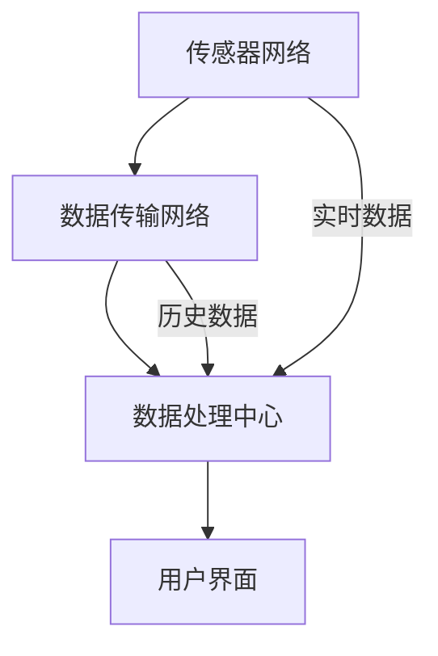
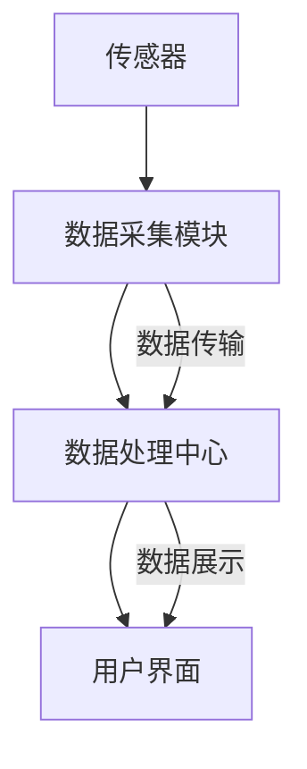
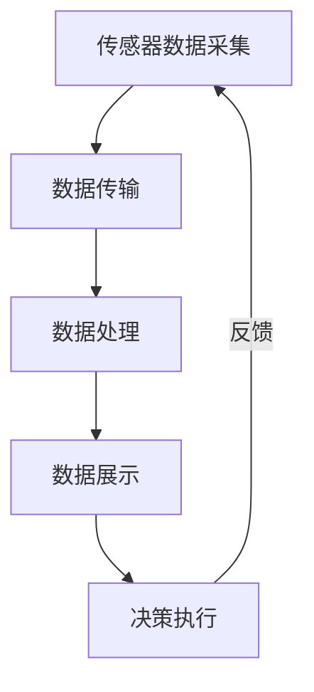

                 

### 《物联网在智慧农业中的全面应用前景》

> 关键词：物联网、智慧农业、传感器技术、数据处理、系统架构、未来展望

> 摘要：本文旨在探讨物联网技术在智慧农业中的全面应用前景。通过分析物联网和智慧农业的核心概念及其相互关系，详细介绍了物联网技术原理、智慧农业应用实例、数据处理与分析、系统设计与实施等内容，并对物联网在智慧农业中的未来发展趋势进行了展望。

## 目录大纲

### 第1章：封面与前言

### 第2章：背景介绍

### 第3章：核心概念与联系

#### 3.1 物联网基础

#### 3.2 智慧农业的起源与发展

#### 3.3 物联网与智慧农业的ER图

### 第4章：物联网技术原理

#### 4.1 物联网通信协议

#### 4.2 农业传感器技术

#### 4.3 物联网网络架构

### 第5章：智慧农业的应用实例

#### 5.1 精准灌溉系统

#### 5.2 农业环境监测

#### 5.3 作物生长监控

### 第6章：数据处理与分析

#### 6.1 数据收集与存储

#### 6.2 数据处理技术

#### 6.3 数据分析应用

### 第7章：系统设计与实施

#### 7.1 系统设计原则

#### 7.2 系统架构设计

#### 7.3 系统接口设计

#### 7.4 系统交互流程

### 第8章：未来展望与趋势

#### 8.1 技术发展趋势

#### 8.2 农业产业影响

#### 8.3 社会与环境效益

### 第9章：小结与拓展

#### 9.1 全文总结

#### 9.2 最佳实践建议

#### 9.3 未来研究方向

---

### 第1章：封面与前言

**《物联网在智慧农业中的全面应用前景》**是一本关于物联网技术在农业领域应用的权威指南。随着科技的快速发展，物联网技术正在深刻改变农业生产的各个环节，提升农业生产的效率和可持续性。本书旨在探讨物联网在智慧农业中的全面应用前景，为读者提供深入了解这一领域的机会。

本书作者AI天才研究院及其杰出作家，以其深厚的学术造诣和丰富的实践经验，为您揭示了物联网技术在智慧农业中的应用原理、实践案例以及未来发展趋势。本书结构严谨，内容丰富，适合从事农业领域研究、实践和技术推广的广大读者阅读。

在写作本书的过程中，作者结合最新的研究成果和实际应用案例，深入浅出地介绍了物联网在智慧农业中的全面应用。本书不仅涵盖了物联网技术的基本原理，还详细阐述了智慧农业系统设计、实施及未来发展的方向。希望通过本书，能够为读者提供有价值的参考，推动物联网技术在农业领域的应用和发展。

## 第2章：背景介绍

### 物联网的背景

物联网（Internet of Things，简称IoT）是指通过互联网将各种物理设备、传感器、软件系统连接起来，实现信息的采集、传输、处理和共享。物联网的起源可以追溯到1999年，麻省理工学院的Kevin Ashton首次提出了“物联网”的概念。物联网的核心技术包括传感器技术、通信协议、数据处理和云计算等。

物联网的发展经历了几个阶段，从最初的设备互联，到现在的万物互联。随着传感器技术的进步和无线通信技术的发展，物联网的应用场景越来越广泛，涵盖了家居、工业、医疗、交通等多个领域。在农业领域，物联网技术的应用也日益增多，为智慧农业的发展提供了有力支持。

### 智慧农业的背景

智慧农业是指通过信息技术和物联网技术，实现农业生产过程的智能化管理，提高农业生产效率和质量的一种现代农业发展模式。智慧农业的起源可以追溯到20世纪90年代，随着计算机技术、传感器技术、通信技术等的发展，农业生产逐渐向信息化、智能化方向发展。

智慧农业的核心在于利用物联网技术实现农业生产的实时监测、精准管理和智能决策。通过在农田、温室、养殖场等农业生产场所布置各种传感器，实时监测土壤湿度、气象条件、作物生长状态等数据，再通过无线通信技术将这些数据传输到数据中心进行分析和处理，为农业生产提供科学依据。

### 物联网技术在农业中的应用场景

物联网技术在农业中的应用场景非常广泛，主要包括以下几个方面：

1. **环境监测**：利用传感器实时监测农田的气象条件、土壤湿度、养分含量等环境参数，为农业生产提供科学依据。

2. **精准灌溉**：通过物联网技术实现自动灌溉系统，根据土壤湿度和作物需水量自动调节灌溉时间、水量，提高水资源利用效率。

3. **作物生长监控**：利用物联网技术对作物生长过程进行实时监控，及时发现病虫害、干旱等异常情况，进行科学管理。

4. **智能养殖**：在养殖场布置各种传感器，实时监测养殖环境的温度、湿度、水质等参数，实现智能化管理。

5. **农产品追溯**：通过物联网技术实现农产品的全生命周期追溯，提高产品质量和安全水平。

### 智慧农业的发展趋势和挑战

智慧农业的发展趋势主要体现在以下几个方面：

1. **技术的不断进步**：随着物联网、大数据、人工智能等技术的不断进步，智慧农业将实现更高层次的智能化和精准化。

2. **产业的整合**：智慧农业的发展将促进农业产业链的整合，实现从生产到销售的全程智能化。

3. **可持续发展**：智慧农业通过提高资源利用效率，减少环境污染，实现农业生产的可持续发展。

然而，智慧农业的发展也面临着一些挑战：

1. **技术瓶颈**：目前物联网技术在农业中的应用仍存在一些技术瓶颈，如传感器精度、通信稳定性等问题。

2. **数据隐私和安全**：随着物联网技术的普及，农作物的生产、养殖等数据的安全问题日益凸显。

3. **人才缺乏**：智慧农业的发展需要大量具备信息技术和农业知识的人才，但目前这方面的人才较为稀缺。

通过对物联网和智慧农业的背景介绍，我们可以看到，物联网技术在农业领域具有巨大的应用潜力。在接下来的章节中，我们将进一步探讨物联网技术在智慧农业中的应用原理、核心概念及其相互关系，为读者提供更深入的了解。### 第3章：核心概念与联系

在深入探讨物联网在智慧农业中的应用之前，我们首先需要明确几个核心概念，包括物联网、智慧农业、传感器技术、数据处理等。这些概念不仅是智慧农业系统建设的基础，也是实现农业生产智能化、精准化的关键要素。

#### 3.1 物联网基础

物联网（Internet of Things，IoT）是指通过互联网、通信网络、各种计算设备、传感器、软件等连接起来，实现物与物、物与人之间的信息交换和通信的网络体系。物联网的核心在于将物理世界与数字世界相结合，通过数据的采集、传输、处理和分析，实现智能化的管理和控制。

**物联网的基本概念**：

1. **设备互联**：物联网的核心在于各种设备的互联，这些设备可以是传感器、智能家电、工业设备等。
2. **数据采集**：通过传感器实时采集环境参数、设备状态等信息。
3. **通信协议**：物联网设备之间通过特定的通信协议进行数据传输，如Wi-Fi、蓝牙、Zigbee、LoRa等。
4. **数据处理**：收集的数据通过云计算、大数据等技术进行处理和分析。
5. **智能应用**：通过对数据的分析，实现智能化的决策和操作。

**物联网技术的优势**：

- 提高效率：通过自动化和智能化的设备管理，提高生产效率。
- 节省成本：通过优化资源使用，减少浪费，降低运营成本。
- 提升安全：通过实时监测和智能预警，提高生产安全。

#### 3.2 智慧农业的起源与发展

智慧农业是物联网技术在农业领域的一种应用，其目标是利用物联网、大数据、人工智能等技术，实现农业生产的智能化、精准化和可持续发展。

**智慧农业的核心概念**：

1. **自动化**：通过自动化设备减少人工操作，提高工作效率。
2. **精准化**：通过实时监测和数据分析，实现精准的灌溉、施肥、病虫害防治等。
3. **可持续发展**：通过资源优化和环境监测，实现农业生产的可持续发展。

**智慧农业的发展趋势**：

- **技术的进步**：物联网、大数据、人工智能等技术的不断进步，推动智慧农业向更高层次的智能化发展。
- **数据驱动**：通过数据的采集和分析，实现农业生产的决策支持。
- **产业融合**：智慧农业与农业机械、农业服务、农业金融等产业的深度融合。

#### 3.3 传感器技术

传感器技术是物联网和智慧农业的关键组成部分，用于实时监测和采集环境、设备状态等信息。传感器的基本原理是感知外部信号，并将其转化为电信号或其他形式的信息。

**传感器的种类**：

1. **环境传感器**：用于监测温度、湿度、光照、气压等环境参数。
2. **物理量传感器**：用于监测压力、流量、位移等物理量。
3. **生物传感器**：用于检测生物体内的化学物质和生理参数。

**传感器的优势**：

- **实时监测**：传感器可以实时采集数据，为决策提供及时的信息。
- **精准性**：高精度的传感器可以提供准确的测量结果。
- **远程监控**：通过无线通信技术，可以实现远程监控和管理。

#### 3.4 数据处理与云计算

数据处理与云计算是物联网和智慧农业中的关键技术，用于收集、存储、处理和分析大量农业数据。

**数据处理的基本概念**：

1. **数据收集**：通过传感器和物联网设备收集农业数据。
2. **数据存储**：将收集到的数据存储在数据库或云平台中。
3. **数据处理**：对存储的数据进行清洗、整理和分析。
4. **数据挖掘**：通过大数据技术挖掘数据中的价值信息。

**云计算的优势**：

- **可扩展性**：云计算可以根据需求动态调整计算资源。
- **灵活性**：用户可以根据需求选择不同的云服务。
- **成本效益**：云计算降低了数据存储和处理的成本。

#### 3.5 物联网与智慧农业的ER图

为了更好地理解物联网和智慧农业之间的关系，我们可以通过实体关系图（Entity-Relationship Diagram，ER图）来展示它们之间的联系。

**物联网与智慧农业的ER图**：

1. **实体**：
   - 物联网设备
   - 传感器
   - 数据中心
   - 农业管理系统
   - 农业环境
   - 农作物

2. **关系**：
   - 物联网设备与传感器之间的关系：物联网设备通过传感器收集数据。
   - 传感器与数据中心之间的关系：传感器收集的数据传输到数据中心。
   - 数据中心与农业管理系统之间的关系：数据中心处理和分析数据，为农业管理系统提供决策支持。
   - 农业管理系统与农作物之间的关系：农业管理系统根据分析结果进行精准管理，如灌溉、施肥、病虫害防治等。

通过以上对核心概念及其相互关系的介绍，我们可以更好地理解物联网在智慧农业中的应用原理和框架。在接下来的章节中，我们将深入探讨物联网技术在智慧农业中的具体应用，包括精准灌溉、农业环境监测、作物生长监控等。### 第4章：物联网技术原理

物联网技术作为智慧农业的核心驱动力，其技术原理主要包括通信协议、传感器、网络架构等几个关键组成部分。本章节将详细介绍这些技术原理，并通过具体的实例来帮助读者更好地理解。

#### 4.1 物联网通信协议

物联网通信协议是物联网系统中的桥梁，用于确保不同设备之间能够顺畅地进行数据交换。常见的物联网通信协议包括Wi-Fi、蓝牙、Zigbee、LoRa等。

**Wi-Fi**：
Wi-Fi是一种广泛使用的无线通信技术，能够提供高速的无线网络连接。在智慧农业中，Wi-Fi可用于连接农业设备、传感器和数据终端，实现实时数据传输。

**蓝牙**：
蓝牙是一种低功耗、短距离的无线通信技术，常用于连接智能家居设备、可穿戴设备等。在智慧农业中，蓝牙可用于连接农业传感器和数据处理设备，实现数据采集和传输。

**Zigbee**：
Zigbee是一种低功耗、低速率的无线通信协议，适用于短距离、多设备的通信。在智慧农业中，Zigbee可用于建立农业物联网网络，实现传感器节点之间的数据传输和协同工作。

**LoRa**：
LoRa是一种长距离、低功耗的无线通信协议，特别适合于广域网的物联网应用。在智慧农业中，LoRa可用于远程监测农田环境、作物生长状态等数据，实现大面积、多点监测。

**实例分析**：
以精准灌溉系统为例，传感器实时监测土壤湿度，通过Zigbee协议将数据传输到数据终端，数据终端通过Wi-Fi将数据上传到云平台。云平台对数据进行处理和分析，生成灌溉计划，并通过Wi-Fi发送给灌溉设备，实现自动灌溉。

#### 4.2 农业传感器技术

传感器技术是物联网技术的重要组成部分，用于监测和采集农业环境中的各种参数，如温度、湿度、光照、土壤水分等。

**温度传感器**：
温度传感器用于测量环境温度，常见的有热敏电阻、热电偶等。在智慧农业中，温度传感器可用于监测温室环境、作物生长温度等，为科学管理提供依据。

**湿度传感器**：
湿度传感器用于测量空气中的水分含量，常见的有电容式、电阻式等。在智慧农业中，湿度传感器可用于监测土壤湿度、空气湿度等，为精准灌溉提供数据支持。

**光照传感器**：
光照传感器用于测量光线的强度，常见的有光敏电阻、光电池等。在智慧农业中，光照传感器可用于监测阳光强度、光照时长等，为作物生长提供光照条件分析。

**土壤水分传感器**：
土壤水分传感器用于测量土壤中的水分含量，常见的有电阻式、电容式等。在智慧农业中，土壤水分传感器可用于监测土壤湿度，为精准灌溉提供数据支持。

**实例分析**：
在智慧农业中，温度传感器、湿度传感器、光照传感器和土壤水分传感器共同作用，实时监测农田环境，将数据传输到云平台进行分析和处理。根据数据分析结果，自动调节温室温度、湿度、光照等环境条件，实现精准管理。

#### 4.3 物联网网络架构

物联网网络架构是物联网系统的骨架，决定了物联网系统的性能和稳定性。常见的物联网网络架构包括传感器网络、数据传输网络和数据处理网络。

**传感器网络**：
传感器网络是物联网系统的底层，由各种传感器节点组成。传感器节点负责实时采集环境数据，并通过无线通信协议将数据传输到网关节点。

**数据传输网络**：
数据传输网络是物联网系统的核心，负责将传感器网络采集到的数据传输到数据处理中心。数据传输网络可以使用有线网络（如以太网）和无线网络（如Wi-Fi、LoRa等）。

**数据处理网络**：
数据处理网络是物联网系统的数据处理中心，负责对采集到的数据进行处理、分析和存储。数据处理网络通常采用云计算架构，可以实现海量数据的快速处理和分析。

**实例分析**：
以智慧农业监控系统为例，农田中的各种传感器节点（如温度传感器、湿度传感器、光照传感器等）实时采集数据，通过Zigbee协议将数据传输到网关节点。网关节点通过Wi-Fi将数据传输到云平台，云平台对数据进行处理和分析，生成灌溉计划、环境调节方案等，通过Wi-Fi将指令发送回传感器节点，实现精准管理。

通过以上对物联网技术原理的详细介绍，我们可以看到，物联网技术在智慧农业中的应用具有广泛的前景。在接下来的章节中，我们将进一步探讨物联网技术在智慧农业中的具体应用实例，展示其如何实现精准灌溉、农业环境监测和作物生长监控等。### 第5章：智慧农业的应用实例

物联网技术在智慧农业中的应用已经逐渐深入，通过具体的实例我们可以看到这些技术如何实际应用于农业生产，提高效率和产出。以下是几个典型的智慧农业应用实例：

#### 5.1 精准灌溉系统

精准灌溉系统是物联网在智慧农业中最常见、应用最广泛的技术之一。通过在农田中布置土壤湿度传感器，实时监测土壤湿度，根据土壤湿度和天气预报数据，自动调节灌溉系统，实现精准灌溉。

**优势**：
- **提高水资源利用率**：根据土壤湿度自动调节灌溉量，避免水资源浪费。
- **优化作物生长条件**：保持适宜的土壤湿度，为作物生长提供最佳环境。

**挑战**：
- **传感器精度**：土壤湿度传感器的精度直接影响灌溉系统的效果。
- **系统稳定性**：灌溉系统需要长时间运行，系统稳定性是关键。

**实例分析**：
在一个温室蔬菜种植场，土壤湿度传感器实时监测土壤湿度，当土壤湿度低于设定阈值时，自动开启灌溉系统。通过物联网技术，种植场管理者可以在手机上实时查看土壤湿度数据，并远程控制灌溉系统。

#### 5.2 农业环境监测

农业环境监测通过在农田中布置各种传感器（如气象站、空气质量监测仪、土壤监测仪等），实时监测农田的气象条件、空气质量、土壤养分含量等，为科学管理提供数据支持。

**优势**：
- **实时预警**：监测系统可以及时发现异常情况，如干旱、病虫害等，提前采取措施。
- **科学管理**：根据监测数据，制定合理的农业生产方案，提高产出。

**挑战**：
- **传感器布局**：传感器布局需要科学规划，以避免数据重复和盲区。
- **数据处理**：大量的监测数据需要有效处理和分析，以提取有用信息。

**实例分析**：
在一个大规模果园，物联网系统监测了温度、湿度、光照、二氧化碳浓度等环境参数。当温度过高或过低、湿度不足时，系统会自动启动降温或加湿设备。同时，通过分析二氧化碳浓度数据，合理调整施肥量，提高果树光合作用效率。

#### 5.3 作物生长监控

作物生长监控通过在作物生长过程中布置传感器，实时监测作物的生长状态（如叶片颜色、土壤养分、水分等），结合机器学习算法，预测作物的生长趋势，提供科学的管理建议。

**优势**：
- **精准管理**：通过实时数据监测，实现精准施肥、灌溉、病虫害防治。
- **提高产量**：科学管理作物生长，提高作物产量和品质。

**挑战**：
- **数据准确性**：传感器的数据准确性直接影响监控效果。
- **算法复杂性**：需要复杂的机器学习算法来处理大量数据，并准确预测作物生长趋势。

**实例分析**：
在一个水稻种植区，物联网系统通过监测水稻叶片颜色、土壤湿度、养分含量等数据，分析水稻的生长状态。当监测到水稻出现营养不良或病虫害迹象时，系统会自动建议增加施肥量或使用农药，确保水稻健康生长。

通过以上实例，我们可以看到物联网技术在智慧农业中的广泛应用和巨大潜力。在实现这些应用的过程中，需要克服传感器精度、系统稳定性、数据处理等一系列挑战。然而，随着物联网技术的不断发展和完善，智慧农业将迎来更加广阔的发展前景。在接下来的章节中，我们将进一步探讨如何进行数据处理和分析，以充分发挥物联网技术在智慧农业中的价值。### 第6章：数据处理与分析

在智慧农业中，数据处理与分析是物联网技术实现智能化管理的核心环节。通过高效的数据处理与分析，可以从海量的农业数据中提取有价值的信息，为农业生产提供科学依据和决策支持。本章节将详细讲解农业数据的收集、存储、处理方法以及数据分析技术，包括机器学习、大数据分析等。

#### 6.1 数据收集与存储

数据收集是数据处理与分析的第一步，其质量直接影响后续分析的结果。在智慧农业中，数据的收集主要来源于各类传感器、气象站、土壤检测设备等。

**数据收集方法**：

1. **传感器数据**：通过布置在农田中的各种传感器（如土壤湿度传感器、气象传感器、光照传感器等）实时采集数据。
2. **卫星遥感数据**：利用卫星遥感技术，获取农田的遥感图像，分析土壤湿度、作物生长状况等。
3. **历史数据**：利用历史气象数据、农作物生长记录等，为当前农业生产提供参考。

**数据存储**：

1. **本地存储**：将采集到的数据存储在本地数据库或文件系统中，适用于数据量较小的情况。
2. **云存储**：将数据存储在云平台上，如AWS、Azure、Google Cloud等，适用于大规模数据存储和远程访问。

#### 6.2 数据处理技术

数据处理是数据收集后的重要环节，其目的是将原始数据转换为结构化、可分析的数据。数据处理包括数据清洗、数据集成、数据转换等。

**数据清洗**：

1. **缺失值处理**：对缺失的数据进行填补或删除。
2. **异常值处理**：检测和修正数据中的异常值。
3. **重复值处理**：删除重复的数据记录。

**数据集成**：

1. **数据合并**：将来自不同来源的数据进行合并，形成统一的数据集。
2. **数据映射**：将不同数据源中的数据映射到统一的数据模型中。

**数据转换**：

1. **格式转换**：将不同格式的数据转换为统一的格式，如CSV、JSON等。
2. **数值转换**：将数据转换为可分析的数值形式，如将日期转换为数值型日期。

#### 6.3 数据分析技术

数据分析是数据处理的延伸，通过分析数据来发现规律、趋势和关联性，为农业生产提供决策支持。

**机器学习**：

机器学习是数据分析的一种重要方法，通过训练模型，从数据中学习规律，实现对未知数据的预测和分类。

1. **监督学习**：根据已知标签数据，训练模型对未知数据进行预测，如作物病虫害预测。
2. **无监督学习**：没有预先定义的标签数据，通过分析数据自身特性，如聚类分析。
3. **强化学习**：通过不断试错，找到最优决策策略，如自动化灌溉系统。

**大数据分析**：

大数据分析是对海量数据进行处理和分析的一种方法，通过分布式计算和并行处理，实现对大数据的高效分析。

1. **数据挖掘**：从大量数据中提取有价值的信息，如关联规则挖掘、分类算法等。
2. **可视化分析**：通过图表、地图等可视化方式，展示数据分析结果，如农田环境监测数据可视化。
3. **预测分析**：利用历史数据和机器学习模型，预测未来的数据趋势，如作物产量预测。

**实例分析**：

在一个智慧农业项目中，物联网系统收集了农田的土壤湿度、气象数据、作物生长数据等。通过对这些数据的处理和分析，可以实现对作物生长状态的预测、病虫害预警和灌溉优化。

1. **数据处理**：首先对传感器数据进行清洗、集成和转换，形成结构化的数据集。
2. **数据分析**：利用机器学习算法，对作物生长数据进行训练，建立预测模型。
3. **数据可视化**：通过地图和图表展示农田的实时环境数据，以及预测的作物生长状态。

通过高效的数据处理与分析，智慧农业系统能够为农业生产提供科学依据和决策支持，实现精准管理，提高农业生产效率和产出。在接下来的章节中，我们将进一步探讨智慧农业系统的设计与实施，展示如何将这些技术应用到实际项目中。### 第7章：系统设计与实施

智慧农业系统的设计与实施是物联网技术在农业生产中得以有效应用的关键环节。本章节将详细介绍智慧农业系统的设计原则、架构设计、接口设计和系统交互流程，并通过具体的实例来说明系统实现和部署过程。

#### 7.1 系统设计原则

智慧农业系统的设计应遵循以下原则：

1. **模块化设计**：将系统划分为多个模块，如数据采集模块、数据处理模块、决策支持模块等，便于系统的扩展和维护。
2. **可扩展性**：设计时应考虑系统的可扩展性，以便在未来能够添加新的传感器或功能。
3. **高可靠性**：系统应具备高可靠性，确保传感器数据采集的稳定性和系统的正常运行。
4. **易用性**：系统界面应简洁明了，便于用户操作和使用。
5. **安全性**：确保数据传输和存储的安全性，防止数据泄露和未授权访问。

#### 7.2 系统架构设计

智慧农业系统的架构设计包括传感器网络、数据传输网络、数据处理中心和用户界面等组成部分。

**传感器网络**：由各种传感器（如土壤湿度传感器、气象传感器、光照传感器等）组成，负责实时采集农田环境数据。

**数据传输网络**：负责将传感器数据传输到数据处理中心，可采用Wi-Fi、LoRa等无线通信技术。

**数据处理中心**：负责数据的存储、处理和分析，可采用云计算平台，如AWS、Azure等，实现高效的数据处理和存储。

**用户界面**：为用户提供操作界面，展示农田环境数据、分析结果和决策建议。

**架构设计图**：

#### 7.3 系统接口设计

系统接口设计包括硬件接口和软件接口。

**硬件接口**：传感器与数据采集模块的连接接口，如I2C、SPI、UART等。

**软件接口**：数据处理中心与用户界面的接口，如Web API、REST API等。

**接口设计图**：

#### 7.4 系统交互流程

智慧农业系统的交互流程包括数据采集、数据传输、数据处理、数据展示和决策执行等环节。

**交互流程图**：

**实例分析**：

以一个温室种植项目为例，系统交互流程如下：

1. **数据采集**：传感器实时监测温室环境（温度、湿度、光照等）。
2. **数据传输**：传感器数据通过Wi-Fi传输到数据处理中心。
3. **数据处理**：数据处理中心对传感器数据进行处理和分析，生成环境优化建议。
4. **数据展示**：用户界面展示环境数据和优化建议。
5. **决策执行**：用户根据优化建议调整温室环境参数（如开窗通风、加湿等）。
6. **反馈**：系统收集反馈数据，用于进一步优化。

通过以上系统设计与实施，我们可以看到智慧农业系统如何将物联网技术应用于实际农业生产中，实现精准管理、提高生产效率和产出。在接下来的章节中，我们将对物联网在智慧农业中的未来发展趋势和潜在影响进行探讨。### 第8章：未来展望与趋势

随着物联网技术的不断发展和完善，智慧农业在未来的发展前景将更加广阔。本章节将探讨物联网技术在智慧农业中的未来发展趋势，以及这些技术可能带来的潜在影响。

#### 8.1 技术发展趋势

**人工智能（AI）的应用**：随着人工智能技术的进步，越来越多的AI算法将被应用于智慧农业中，如作物生长预测、病虫害检测、环境优化等。通过机器学习和深度学习算法，农业系统可以更加精准地分析数据，提供智能化的决策支持。

**5G技术的普及**：5G技术的普及将显著提升物联网设备的通信速度和稳定性，为大规模、实时监测和数据处理提供更好的支持。5G网络的高带宽和低延迟特性，使得农业设备可以更快地传输数据，并实时响应环境变化。

**区块链技术的应用**：区块链技术在农业领域的应用，可以确保农产品的来源可追溯、数据安全性和透明度。通过区块链，可以实现从生产到销售的全程监控，提高产品质量和消费者信任度。

**智能农机的普及**：随着物联网和机器人技术的结合，智能农机将逐渐取代传统的农业机械，实现农业生产的自动化和智能化。智能农机可以通过物联网技术实现自动导航、精准作业、智能维护等功能，提高生产效率和降低人力成本。

#### 8.2 农业产业的影响

**生产效率的提升**：物联网技术在农业中的应用，将显著提高农业生产的效率。通过实时监测和环境优化，可以实现精准灌溉、精准施肥、精准病虫害防治等，减少资源浪费，提高产出。

**资源利用的优化**：物联网技术可以帮助农业企业更有效地利用水资源、土地资源和能源。通过传感器和数据分析，可以实现水资源的精准分配、土壤养分的科学管理，提高资源利用效率。

**产品质量的保证**：物联网技术可以实现农产品的全程追溯，从生产到销售的全过程都可追溯，提高产品质量和安全水平。消费者可以通过扫描二维码，了解农产品的来源和生产过程，增强对产品质量的信任。

**农业产业链的整合**：物联网技术可以促进农业产业链的整合，实现从生产、加工、运输、销售到消费的全程智能化。通过物联网技术，各环节的信息可以实时共享，提高整个产业链的协同效率。

#### 8.3 社会与环境效益

**减少环境污染**：智慧农业通过精准灌溉、科学施肥等手段，可以显著减少农药和化肥的使用，降低对环境的污染。

**提高农业可持续性**：物联网技术可以帮助农业企业实现资源的优化利用，提高农业生产的可持续性。通过数据分析和智能决策，可以更好地应对气候变化和资源短缺等挑战。

**促进农业现代化**：物联网技术的普及，将推动农业现代化进程，提高农业的科技含量和竞争力。通过物联网技术，农业企业可以更好地适应市场变化，提升经济效益。

**促进农村经济发展**：智慧农业的发展，将带动农村经济的转型升级，提高农民收入。物联网技术可以为农村地区提供更多的就业机会，促进农村地区的经济发展。

总之，物联网技术在智慧农业中的应用具有广阔的发展前景和巨大的潜在影响。通过物联网技术的不断发展和应用，智慧农业将实现更高层次的智能化、精准化和可持续发展，为农业产业的升级和社会经济的发展做出重要贡献。在未来的发展中，我们需要持续关注物联网技术在农业领域的创新和应用，推动智慧农业向更加智能化、高效化和可持续化的方向发展。### 第9章：小结与拓展

在本文中，我们深入探讨了物联网在智慧农业中的全面应用前景，从背景介绍、核心概念与联系、物联网技术原理、应用实例、数据处理与分析，到系统设计与实施以及未来展望与趋势，全面梳理了物联网技术在智慧农业中的各个环节。

**核心内容回顾**：

- **背景介绍**：我们了解了物联网和智慧农业的发展历程及其在农业中的应用场景。
- **核心概念与联系**：明确了物联网、智慧农业、传感器技术、数据处理等核心概念及其相互关系。
- **物联网技术原理**：详细介绍了物联网通信协议、传感器技术、网络架构等原理。
- **应用实例**：探讨了精准灌溉、农业环境监测、作物生长监控等具体应用案例。
- **数据处理与分析**：讲解了农业数据的收集、存储、处理方法以及数据分析技术。
- **系统设计与实施**：阐述了智慧农业系统的设计原则、架构设计、接口设计和系统交互流程。
- **未来展望与趋势**：分析了物联网技术在智慧农业中的发展趋势及其对农业产业和社会的影响。

**最佳实践建议**：

1. **技术选择**：在选择物联网技术时，要考虑传感器的精度、通信协议的稳定性以及系统的可扩展性。
2. **系统集成**：在系统设计过程中，要注重各个模块的协同工作，确保数据的高效传输和处理。
3. **数据安全**：在数据处理和存储过程中，要确保数据的安全性，防止数据泄露和未授权访问。
4. **用户培训**：为用户提供的操作界面应简洁明了，同时要提供足够的培训和支持，确保用户能够有效使用系统。

**注意事项**：

1. **传感器布局**：传感器的布局应科学合理，避免盲区和数据重复。
2. **系统维护**：定期对系统进行维护和升级，确保系统的稳定运行。
3. **数据质量**：确保数据采集的准确性和一致性，避免因数据质量问题影响分析结果。

**拓展阅读**：

- **《智慧农业物联网技术与应用》**：详细介绍了物联网技术在农业中的应用案例和技术细节。
- **《物联网：从概念到实践》**：一本关于物联网技术全面介绍的书籍，适合初学者深入理解物联网。
- **《智慧农业：技术与管理》**：探讨了智慧农业系统的设计原则和实践案例。

通过本文的学习，读者可以全面了解物联网在智慧农业中的应用前景，为未来的研究和实践提供有益的参考。希望本文能够为推动智慧农业的发展，实现农业生产的智能化、精准化和可持续发展做出贡献。作者：AI天才研究院/AI Genius Institute & 禅与计算机程序设计艺术 /Zen And The Art of Computer Programming。

