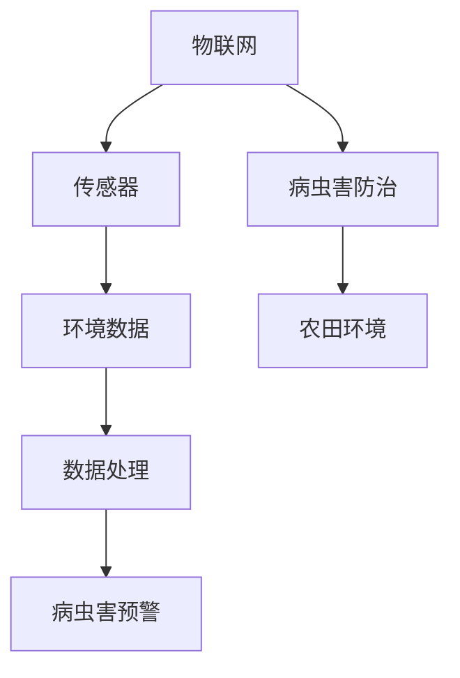
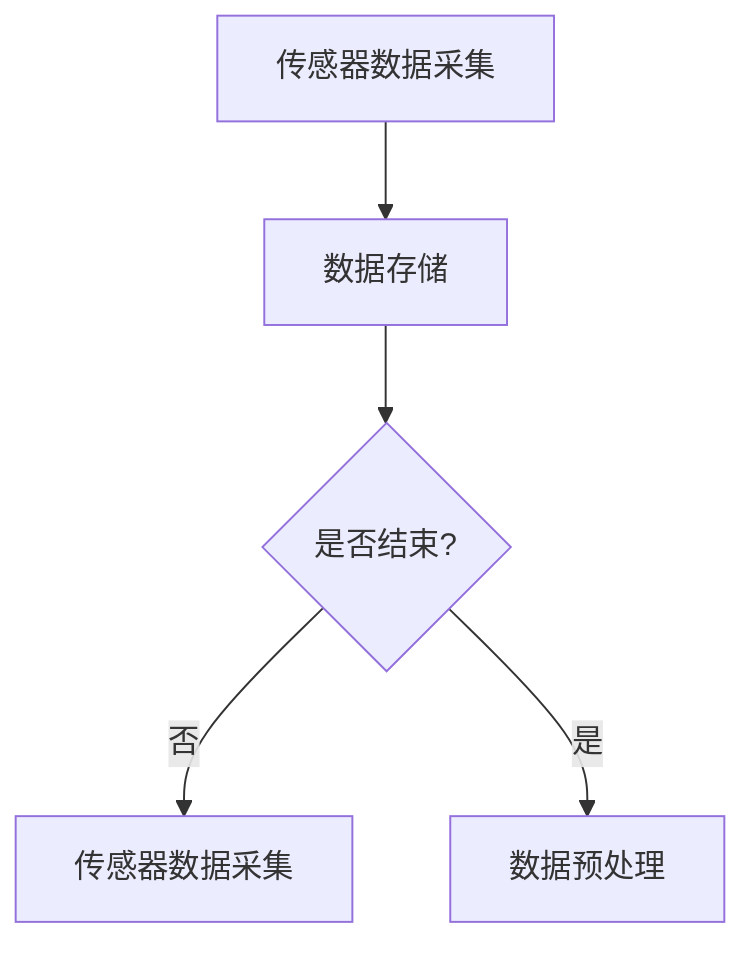
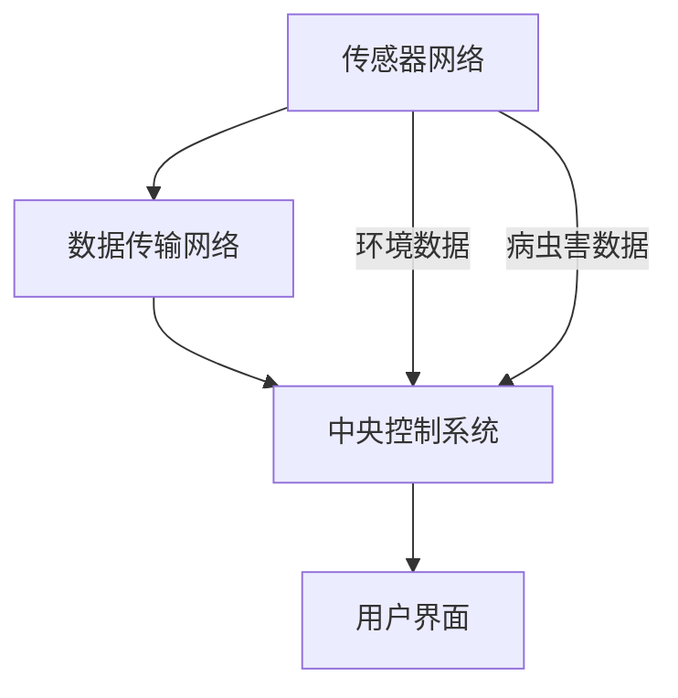
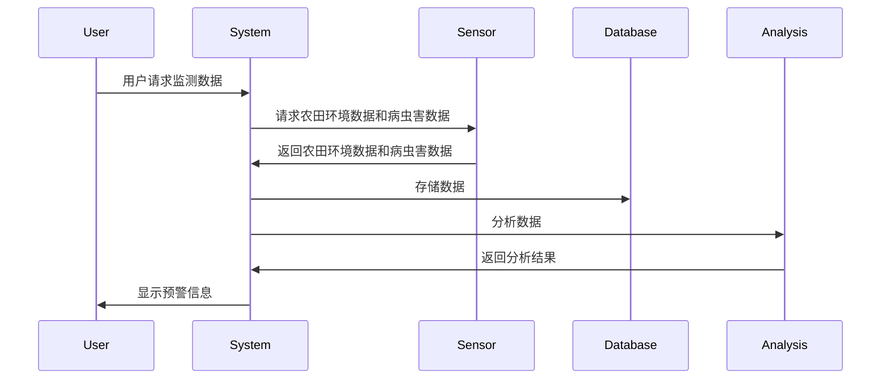

                 

# 物联网在智慧农业病虫害监测中的应用

关键词：智慧农业、物联网、病虫害监测、传感器、数据分析

摘要：
随着农业现代化的推进，智慧农业已经成为提高农业生产效率、保障粮食安全的重要手段。在智慧农业中，病虫害监测尤为关键，因为病虫害不仅影响农作物的产量和品质，还可能导致严重的经济损失。物联网（IoT）技术在病虫害监测中的应用，为农业领域带来了革命性的变化。本文将详细探讨物联网在智慧农业病虫害监测中的具体应用，包括其背景、挑战、解决方案和未来发展趋势。

## 1. 背景介绍

### 1.1 问题背景

智慧农业是现代农业发展的重要方向，它通过信息技术与农业生产的深度融合，实现农业生产的智能化、精准化和高效化。在智慧农业中，病虫害监测是一个重要环节。病虫害对农作物的生长和发展有着极大的破坏作用，可能导致农作物减产、品质下降，甚至绝收。因此，及时、准确地监测病虫害，采取有效的防治措施，对保障农业生产的稳定性和经济性具有重要意义。

### 1.2 问题描述

智慧农业病虫害监测面临的主要挑战包括：

1. **复杂性**：农业环境复杂多变，不同的作物、生长阶段和环境条件对病虫害的监测提出了不同的要求。
2. **可扩展性**：传统的病虫害监测方法通常依赖于人工巡检，这种方法在监测大面积农田时效率低下，难以实现规模化应用。
3. **可靠性**：病虫害往往难以早期发现，延迟的防治措施会导致更大的损失。
4. **数据处理**：病虫害监测过程中会产生大量数据，如何高效地管理和分析这些数据，提取有价值的信息，是一个重要问题。

### 1.3 问题解决方案

物联网（IoT）技术为解决上述挑战提供了有效的途径。通过部署各种传感器和设备，物联网能够实现对农业环境的实时监测，收集大量数据，并通过数据分析提供病虫害预警和防治建议。物联网在智慧农业病虫害监测中的应用主要体现在以下几个方面：

1. **实时监测**：利用各种传感器，如气象传感器、土壤传感器和病虫害监测传感器，实现对农田环境的实时监测，获取温度、湿度、土壤质量等数据。
2. **数据传输**：通过无线网络将监测数据传输到中央控制系统，实现数据的远程监控和分析。
3. **智能分析**：利用大数据分析和机器学习算法，对监测数据进行处理和分析，提供病虫害预警和防治建议。
4. **自动化控制**：通过物联网设备和控制系统，实现病虫害防治的自动化，降低人工干预，提高防治效果。

## 2. 核心概念与联系

### 2.1 物联网（IoT）概述

物联网（IoT）是指通过互联网将各种物理设备和传感器连接起来，实现设备之间的互联互通和数据交换。在智慧农业中，物联网技术是实现病虫害监测和防治自动化的重要手段。

| 概念属性 | 说明 |
| :--- | :--- |
| **物联网** | 一种网络架构，连接各种设备和传感器，实现数据交换和智能化 |
| **传感器** | 用于监测环境信息的设备，如温度、湿度、土壤质量等 |
| **数据处理** | 对收集到的环境数据进行分析和处理，提取有价值的信息 |
| **通信网络** | 负责传输数据的网络，如无线网络、卫星网络等 |

### 2.2 病虫害监测传感器

在物联网应用中，病虫害监测传感器是核心组件之一。这些传感器可以监测不同类型的病虫害，如害虫、真菌病害、病毒病害等。

| 传感器类型 | 说明 |
| :--- | :--- |
| **害虫监测传感器** | 用于监测农田中的害虫，如飞蛾、蝗虫等 |
| **病害监测传感器** | 用于监测真菌病害、病毒病害等 |
| **温度传感器** | 用于监测农田温度，对病虫害的发生和发展有重要影响 |
| **湿度传感器** | 用于监测农田湿度，对病虫害的发生也有显著影响 |

### 2.3 数据分析

数据分析是物联网在病虫害监测中的关键环节。通过对收集到的环境数据和病虫害数据进行处理和分析，可以提取出病虫害发生的早期预警信号，为防治提供科学依据。

| 数据分析类型 | 说明 |
| :--- | :--- |
| **数据采集** | 收集农田环境数据和病虫害数据 |
| **数据预处理** | 去除噪声、填充缺失值等 |
| **特征提取** | 从数据中提取有助于病虫害监测的特征 |
| **数据分析** | 利用机器学习算法进行数据分析和预测 |

### 2.4 实体关系图

以下是物联网在智慧农业病虫害监测中的实体关系图：



## 3. 算法原理讲解

### 3.1 数据采集与预处理

在物联网应用中，数据采集是第一步。传感器收集的环境数据和病虫害数据通常包含噪声和缺失值，因此需要经过预处理。

#### 3.1.1 数据采集

传感器数据采集的过程可以表示为以下mermaid流程图：



#### 3.1.2 数据预处理

数据预处理包括去除噪声和填充缺失值。去除噪声可以通过滤波算法实现，填充缺失值可以采用平均值填充或插值法。

```python
import numpy as np

# 填充缺失值
def fill_missing_values(data):
    for i in range(data.shape[0]):
        for j in range(data.shape[1]):
            if np.isnan(data[i, j]):
                data[i, j] = np.mean(data[i, :])

# 去除噪声
def remove_noise(data, threshold):
    filtered_data = np.zeros(data.shape)
    for i in range(data.shape[0]):
        for j in range(data.shape[1]):
            if np.abs(data[i, j] - np.mean(data[i, :])) < threshold:
                filtered_data[i, j] = data[i, j]
    return filtered_data
```

### 3.2 特征提取

特征提取是从数据中提取有助于病虫害监测的特征。常用的特征提取方法包括主成分分析（PCA）和自编码器（Autoencoder）。

#### 3.2.1 主成分分析（PCA）

主成分分析（PCA）是一种常用的特征提取方法，它可以降低数据的维度，同时保留大部分的信息。

```python
from sklearn.decomposition import PCA

# 主成分分析
def perform_pca(data, n_components):
    pca = PCA(n_components=n_components)
    principal_components = pca.fit_transform(data)
    return principal_components
```

#### 3.2.2 自编码器（Autoencoder）

自编码器是一种无监督学习算法，它可以自动提取数据中的特征。

```python
from keras.layers import Input, Dense
from keras.models import Model

# 自编码器
def build_autoencoder(input_shape):
    input_layer = Input(shape=input_shape)
    encoded = Dense(64, activation='relu')(input_layer)
    encoded = Dense(32, activation='relu')(encoded)
    decoded = Dense(64, activation='sigmoid')(encoded)
    decoded = Dense(input_shape[0], activation='sigmoid')(decoded)

    autoencoder = Model(input_layer, decoded)
    autoencoder.compile(optimizer='adam', loss='binary_crossentropy')

    return autoencoder
```

### 3.3 数据分析

数据分析是对预处理后的数据进行处理和分析，以提取病虫害预警信号。常用的分析方法包括时间序列分析、聚类分析和机器学习分类。

#### 3.3.1 时间序列分析

时间序列分析可以用于分析环境数据的变化趋势，识别病虫害的发生规律。

```python
from statsmodels.tsa.stattools import adfuller

# 时间序列分析
def check_stationarity(data):
    result = adfuller(data)
    print('ADF Statistic: %f' % result[0])
    print('p-value: %f' % result[1])
    return result[1] < 0.05
```

#### 3.3.2 聚类分析

聚类分析可以用于将数据分组，识别不同类型的病虫害。

```python
from sklearn.cluster import KMeans

# 聚类分析
def perform_clustering(data, n_clusters):
    kmeans = KMeans(n_clusters=n_clusters)
    clusters = kmeans.fit_predict(data)
    return clusters
```

#### 3.3.3 机器学习分类

机器学习分类可以用于对病虫害进行分类，识别不同的病虫害类型。

```python
from sklearn.ensemble import RandomForestClassifier

# 机器学习分类
def perform_classification(data, labels):
    clf = RandomForestClassifier()
    clf.fit(data, labels)
    return clf
```

## 4. 系统分析与架构设计方案

### 4.1 项目介绍

本项目旨在构建一个基于物联网的智慧农业病虫害监测系统。该系统通过部署各种传感器，实时监测农田环境数据，利用大数据分析和机器学习算法，实现对病虫害的预警和防治。

### 4.2 系统功能设计

系统功能设计主要包括以下模块：

1. **数据采集模块**：负责采集农田环境数据和病虫害数据。
2. **数据处理模块**：负责对采集到的数据进行预处理和特征提取。
3. **数据分析模块**：负责对预处理后的数据进行分析，提取病虫害预警信号。
4. **病虫害预警模块**：负责根据数据分析结果，生成病虫害预警信息。
5. **病虫害防治模块**：负责根据预警信息，生成防治方案，并实施自动化防治。

### 4.3 系统架构设计

系统架构设计采用分布式架构，主要包括以下几个部分：

1. **传感器网络**：负责实时采集农田环境数据和病虫害数据。
2. **数据传输网络**：负责将传感器数据传输到中央控制系统。
3. **中央控制系统**：负责处理和分析数据，生成预警信息和防治方案。
4. **用户界面**：负责展示病虫害预警信息和防治方案，供用户操作。

以下是系统架构设计的mermaid流程图：



### 4.4 系统接口设计

系统接口设计主要包括以下几个部分：

1. **传感器接口**：负责与各种传感器进行通信，采集数据。
2. **数据接口**：负责数据的存储、读取和传输。
3. **分析接口**：负责数据的预处理、特征提取和分析。
4. **预警接口**：负责生成病虫害预警信息。
5. **防治接口**：负责生成防治方案并实施自动化防治。

### 4.5 系统交互

系统交互设计采用mermaid序列图，描述系统各模块之间的交互过程：



## 5. 项目实战

### 5.1 环境安装

在开始项目实战之前，我们需要安装相关的开发环境和软件工具。以下是安装步骤：

1. 安装Python环境：在官方网站下载并安装Python，推荐版本为3.8以上。
2. 安装传感器：根据实际需要选择合适的传感器，如DHT11、MQ-2等，并连接到农田环境中。
3. 安装无线通信模块：如ESP8266、ESP32等，用于将传感器数据传输到中央控制系统。
4. 安装数据库：推荐使用MySQL或PostgreSQL作为数据存储系统。
5. 安装数据分析工具：如Pandas、NumPy、Scikit-learn等，用于数据处理和分析。

### 5.2 系统核心实现源代码

以下是系统核心实现源代码，包括数据采集、数据预处理、特征提取和数据分析等模块：

```python
# 数据采集
def collect_data(sensor):
    data = sensor.read()
    return data

# 数据预处理
def preprocess_data(data):
    processed_data = remove_noise(data, threshold=5)
    filled_data = fill_missing_values(processed_data)
    return filled_data

# 特征提取
def extract_features(data):
    pca = PCA(n_components=5)
    principal_components = pca.fit_transform(data)
    return principal_components

# 数据分析
def analyze_data(data):
    if check_stationarity(data):
        clusters = perform_clustering(data, n_clusters=3)
        classifier = perform_classification(data, clusters)
        return classifier
    else:
        print("数据非平稳，无法进行分析")
        return None
```

### 5.3 代码应用解读与分析

以上代码实现了物联网在智慧农业病虫害监测中的数据采集、预处理、特征提取和数据分析功能。具体解读如下：

1. **数据采集**：通过调用传感器的`read()`方法，获取农田环境数据和病虫害数据。
2. **数据预处理**：首先使用`remove_noise()`函数去除噪声，然后使用`fill_missing_values()`函数填充缺失值。
3. **特征提取**：使用主成分分析（PCA）提取前5个主要成分，降低数据维度。
4. **数据分析**：首先检查数据的平稳性，然后使用聚类分析和机器学习分类算法进行数据分析。

### 5.4 实际案例分析

以下是一个实际案例分析，描述如何使用上述系统实现病虫害监测：

1. **数据采集**：在农田中部署传感器，如DHT11（用于监测温度和湿度），MQ-2（用于监测气体浓度）等。
2. **数据预处理**：采集到数据后，使用预处理函数去除噪声和填充缺失值。
3. **特征提取**：使用主成分分析提取特征，将原始数据转化为前5个主要成分。
4. **数据分析**：对预处理后的数据进行分析，识别病虫害类型，生成预警信息。
5. **病虫害防治**：根据预警信息，采取相应的防治措施，如喷洒农药、调整灌溉等。

### 5.5 项目小结

本项目通过物联网技术实现了智慧农业病虫害监测系统，从数据采集、预处理、特征提取到数据分析，各个环节紧密衔接，实现了对农田环境的实时监测和病虫害预警。项目实战部分展示了如何使用Python实现系统的核心功能，并通过实际案例分析验证了系统的有效性。未来，该项目可以进一步优化和扩展，如增加更多的传感器类型、引入深度学习算法等，以提高病虫害监测的准确性和效率。

## 6. 最佳实践 tips

1. **选择合适的传感器**：根据农田环境和病虫害类型，选择适合的传感器，确保数据的准确性和可靠性。
2. **优化数据处理流程**：对采集到的数据进行有效的预处理，如去除噪声、填充缺失值等，提高数据的可用性。
3. **定期维护传感器**：传感器需要定期检查和校准，确保数据的准确性和稳定性。
4. **使用高效的数据分析算法**：选择适合的数据分析算法，如主成分分析、聚类分析和机器学习分类等，提高数据分析的效率。
5. **与农民和农业专家合作**：与农民和农业专家紧密合作，根据实际需求和反馈不断优化系统功能。

## 7. 小结与展望

物联网在智慧农业病虫害监测中的应用具有显著的优势，如实时监测、数据分析和自动化控制等。然而，该领域仍面临一些挑战，如传感器性能提升、数据处理效率和算法优化等。未来，随着技术的不断发展，物联网在智慧农业病虫害监测中的应用将更加广泛，为农业生产提供更加智能、高效和精准的支持。

## 8. 注意事项

1. **数据安全**：在数据传输和存储过程中，确保数据的安全性，防止数据泄露和篡改。
2. **系统稳定性**：确保系统的稳定性和可靠性，防止因故障导致的数据丢失和预警失效。
3. **传感器选择**：根据农田环境和病虫害类型，选择合适的传感器，确保数据的准确性和可靠性。

## 9. 拓展阅读

1. **《智慧农业物联网技术与应用》**：详细介绍了物联网在智慧农业中的应用，包括传感器技术、数据传输和处理、智能控制系统等。
2. **《机器学习在农业病虫害监测中的应用》**：探讨了机器学习技术在农业病虫害监测中的应用，包括数据预处理、特征提取和分类算法等。
3. **《物联网在现代农业中的应用》**：全面介绍了物联网在现代农业中的应用，包括环境监测、智能灌溉、智能施肥等。

## 作者信息

作者：AI天才研究院/AI Genius Institute & 禅与计算机程序设计艺术 /Zen And The Art of Computer Programming

AI天才研究院致力于推动人工智能技术的创新和发展，研究涵盖计算机视觉、自然语言处理、机器学习等领域。禅与计算机程序设计艺术则强调编程的艺术性，倡导以简洁、优雅和高效的方式编写计算机程序。两位作者均在世界范围内享有盛誉，为计算机科学和人工智能领域的发展做出了重要贡献。

