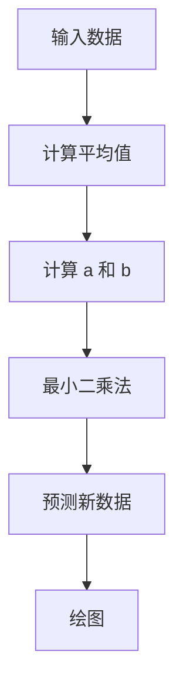
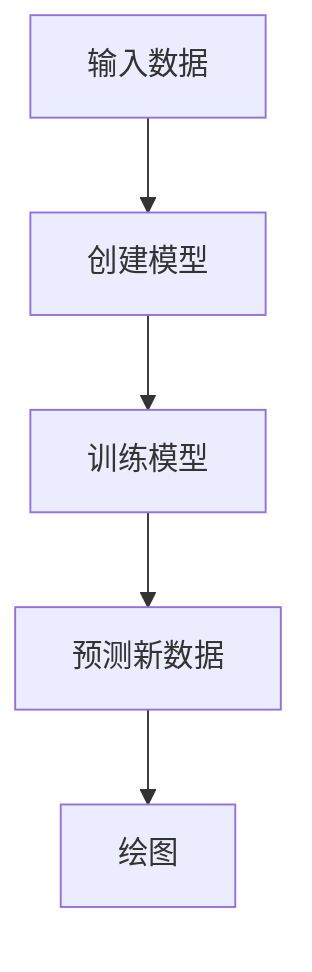
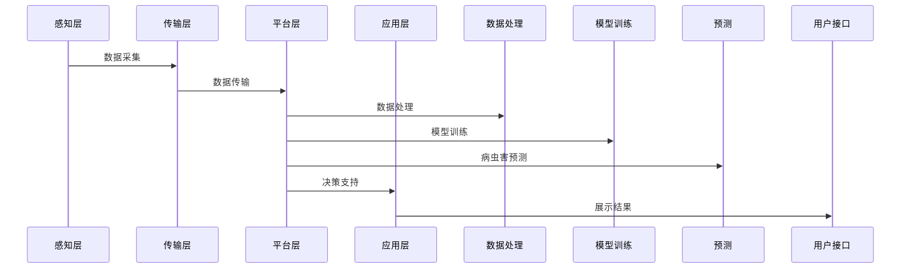

                 

### 引言

#### 1.1 研究背景

##### 1.1.1 农业病虫害问题概述

农业是人类生存的根本，然而，病虫害一直是制约农业产量和质量的重要因素。病虫害不仅影响农作物的生长发育，甚至会导致大面积减产，降低农产品的市场价值。随着气候变化和全球农业扩展，病虫害的发生频率和范围也在不断扩大，给农业生产带来了巨大的挑战。传统的病虫害防治手段主要依赖于农药喷洒和人工巡查，但这些方法往往不够精确，不仅浪费农药，还可能对环境和人体健康造成危害。

##### 1.1.2 物联网（IoT）在农业中的应用

物联网（Internet of Things，IoT）作为一种新兴技术，正在深刻改变各个行业的面貌，农业也不例外。IoT通过将各种传感器、设备互联，实现了对农田环境的实时监测和数据采集。传感器可以测量土壤湿度、温度、光照强度、气体浓度等多种参数，从而为农民提供科学种植决策依据。例如，基于IoT的精准灌溉系统能够根据土壤湿度自动调节灌溉量，大大提高了水资源利用效率。

##### 1.1.3 智慧农业病虫害预警的重要性

智慧农业病虫害预警是指利用物联网技术和数据分析方法，对病虫害的发生进行预测和预警，从而实现病虫害的精准防治。与传统方法相比，智慧农业病虫害预警具有以下优势：

1. **提前预警**：通过实时监测和数据分析，能够提前发现病虫害的征兆，及时采取防治措施。
2. **精准施药**：根据病虫害的具体情况，制定个性化的防治方案，减少农药的使用量，降低环境污染。
3. **提高产量**：通过有效防治病虫害，确保农作物的生长环境，提高农作物的产量和质量。
4. **降低成本**：智慧农业病虫害预警系统可以减少人力和农药的投入，降低生产成本。

综上所述，智慧农业病虫害预警在现代农业中具有重要的应用价值。它不仅有助于提高农作物的产量和质量，还能促进农业的可持续发展。

#### 1.2 书籍目的与结构

##### 1.2.1 书籍目的

本书旨在系统地介绍物联网在智慧农业病虫害预警中的应用，帮助读者理解并掌握相关技术。通过本书的学习，读者可以：

1. **掌握物联网技术在农业中的应用**：了解物联网的基本概念、架构和关键技术，以及如何将其应用于农业领域。
2. **理解智慧农业病虫害预警原理**：掌握智慧农业病虫害预警的基本原理、方法和关键技术，了解各种预警算法的实现和应用。
3. **学习病虫害预警系统的设计与实现**：通过案例分析和实践项目，了解智慧农业病虫害预警系统的设计思路、技术实现和优化方法。

##### 1.2.2 书籍结构安排

本书分为五个主要部分：

1. **引言**：介绍农业病虫害问题的背景、物联网在农业中的应用，以及智慧农业病虫害预警的重要性。
2. **核心概念与关系**：详细阐述物联网、智慧农业和病虫害预警的核心概念及其相互关系，包括IoT体系结构、智慧农业技术基础、病虫害预警的关键指标等。
3. **算法原理与讲解**：介绍病虫害预警算法的基本原理、类型和选择原则，并通过Python代码示例和Mermaid流程图，详细讲解常用预警算法的实现过程。
4. **数学模型与公式**：使用LaTeX格式介绍病虫害预警中常用的数学模型和公式，并通过实例进行详细解释，帮助读者理解这些模型和公式的应用。
5. **系统分析与设计**：描述智慧农业病虫害预警系统的总体架构、功能设计、接口设计以及系统交互，通过Mermaid类图、架构图和序列图，详细展示系统设计过程。
6. **实践项目与案例分析**：通过具体的实践项目和案例分析，介绍病虫害预警系统的实际应用，包括环境搭建、核心实现、代码解读、案例剖析和项目小结。
7. **最佳实践与总结**：总结本书的主要内容和关键点，提供一些最佳实践建议，并推荐进一步阅读的参考资料。

通过本书的学习，读者可以系统地掌握智慧农业病虫害预警的相关知识，为实际应用提供理论支持和实践指导。

---

在引言部分，我们首先介绍了农业病虫害问题的背景，以及物联网在农业中的应用和智慧农业病虫害预警的重要性。接下来，详细阐述了本书的目的和结构，帮助读者了解本书的主要内容和学习目标。在接下来的章节中，我们将深入探讨物联网和智慧农业的核心概念，分析病虫害预警算法的原理和实现，并通过数学模型和公式解释，进一步夯实理论基础。最后，我们将结合具体实践项目和案例分析，展示智慧农业病虫害预警系统的实际应用，为读者提供实用的经验和指导。

### 核心概念与关系

#### 2.1 物联网（IoT）概述

物联网（Internet of Things，IoT）是指通过传感器、网络和数据处理技术，将各种物理设备互联，实现数据的实时采集、传输和处理。IoT的核心在于将信息物理系统（Cyber-Physical System，CPS）与互联网相结合，从而实现智能化的控制和自动化管理。

##### 2.1.1 IoT基本概念

- **传感器**：用于感知和采集环境信息的装置，如温度传感器、湿度传感器、光照传感器等。
- **网络**：用于传输数据的通信网络，包括有线网络（如以太网）和无线网络（如Wi-Fi、蓝牙、LoRa等）。
- **数据处理**：对采集到的数据进行分析、处理和存储，以生成有用的信息。

##### 2.1.2 IoT体系结构

IoT体系结构通常分为以下几个层次：

1. **感知层**：包括各种传感器和设备，用于感知和采集环境数据。
2. **传输层**：通过各种通信网络将数据传输到数据处理中心。
3. **平台层**：提供数据存储、处理和分析功能，通常包括云计算平台、大数据平台和物联网平台。
4. **应用层**：基于处理后的数据，实现各种应用和服务，如智慧农业、智慧交通、智能家居等。

#### 2.2 智慧农业

智慧农业是指利用信息技术和物联网技术，实现农业生产的智能化和自动化管理。智慧农业的目标是通过提高生产效率和资源利用率，实现农业的可持续发展。

##### 2.2.1 智慧农业的定义

智慧农业是将物联网、大数据、云计算、人工智能等现代信息技术应用于农业生产和管理中，通过数据采集、分析和智能决策，实现农业的精细化管理和高效生产。

##### 2.2.2 智慧农业的技术基础

智慧农业的技术基础包括：

- **物联网技术**：用于实时监测农田环境参数，如温度、湿度、土壤湿度、光照等。
- **大数据技术**：用于大规模数据存储、分析和挖掘，为农业生产提供决策支持。
- **云计算技术**：提供强大的计算和存储能力，支持智慧农业应用系统的开发和运行。
- **人工智能技术**：用于病虫害预测、生长模型模拟、智能灌溉等，提高农业生产效率和产品质量。

#### 2.3 病虫害预警

病虫害预警是指通过实时监测和数据分析，预测病虫害的发生和发展，提前采取措施进行防治。病虫害预警是智慧农业的重要组成部分，对于保障农作物的健康生长和产量具有重要意义。

##### 2.3.1 病虫害预警的重要性

病虫害预警的重要性体现在以下几个方面：

1. **提前预警**：通过实时监测，可以提前发现病虫害的征兆，及时采取防治措施，减少病虫害的传播和扩散。
2. **精准防治**：根据病虫害的具体情况，制定个性化的防治方案，减少农药的使用量，降低环境污染。
3. **提高产量**：通过有效防治病虫害，确保农作物的生长环境，提高农作物的产量和质量。
4. **降低成本**：通过智慧农业病虫害预警系统，可以减少人力和农药的投入，降低生产成本。

##### 2.3.2 病虫害预警的关键指标

病虫害预警的关键指标包括：

- **气象指标**：如温度、湿度、降水量等，这些指标对病虫害的发生和传播有重要影响。
- **土壤指标**：如土壤湿度、土壤温度、土壤酸碱度等，这些指标影响病虫害的生存和繁殖。
- **作物生长指标**：如叶片颜色、叶片生长速度、根系长度等，这些指标反映作物的健康状态。
- **病虫害指标**：如虫害密度、病害症状等，这些指标直接反映病虫害的发生情况。

### 关系与联系

物联网、智慧农业和病虫害预警之间的关系可以概括为：

- **物联网**为智慧农业提供了实时数据采集和传输的基础，是实现病虫害预警的前提。
- **智慧农业**通过物联网技术和数据分析，实现对农业生产的智能化管理和优化，病虫害预警是其重要应用之一。
- **病虫害预警**通过实时监测和分析，为智慧农业提供病虫害防治的决策支持，是保障农业生产的重要手段。

通过上述核心概念和关系的介绍，读者可以更好地理解物联网在智慧农业病虫害预警中的应用，以及这些技术之间的内在联系和相互促进的关系。

#### 核心概念与关系的可视化展示

为了更直观地展示物联网、智慧农业和病虫害预警之间的核心概念和关系，我们可以使用Mermaid绘制相关的实体关系图（ER图）和对比表格。

首先，让我们绘制物联网（IoT）的基本实体关系图：

```mermaid
erDiagram
  Node1 ||--|{ Node2 } Node3 : "IoT"
  Node1 ||--|{ Node4 } Node5 : "Sensor"
  Node1 ||--|{ Node6 } Node7 : "Network"
  Node1 ||--|{ Node8 } Node9 : "Data Processing"
  Node2 ||--|{ Node10 } Node11 : "Platform Layer"
  Node2 ||--|{ Node12 } Node13 : "Application Layer"
  Node3 ||--|{ Node14 } Node15 : "Cloud Computing"
  Node3 ||--|{ Node16 } Node17 : "Data Storage"
  Node3 ||--|{ Node18 } Node19 : "Analytics"
```

上述ER图展示了物联网的基本架构，包括传感器、网络、数据处理以及平台和应用层。传感器（Node4）是感知层的重要组成部分，通过网络（Node7）将数据传输至数据处理中心（Node8），进而由平台层（Node10）和应用层（Node12）进行进一步处理和分析。

接下来，我们绘制智慧农业的实体关系图：

```mermaid
erDiagram
  Node20 ||--|{ Node21 } Node22 : "Smart Agriculture"
  Node20 ||--|{ Node23 } Node24 : "IoT"
  Node20 ||--|{ Node25 } Node26 : "Big Data"
  Node20 ||--|{ Node27 } Node28 : "AI"
  Node21 ||--|{ Node29 } Node30 : "Environment Monitoring"
  Node21 ||--|{ Node31 } Node32 : "Precision Farming"
  Node23 ||--|{ Node33 } Node34 : "Sensors"
  Node23 ||--|{ Node35 } Node36 : "Data Transmission"
  Node25 ||--|{ Node37 } Node38 : "Data Analysis"
  Node25 ||--|{ Node39 } Node40 : "Data Mining"
  Node27 ||--|{ Node41 } Node42 : "Pest Prediction"
  Node27 ||--|{ Node43 } Node44 : "Growth Modeling"
```

在智慧农业的ER图中，智慧农业（Node20）作为核心，与物联网（Node23）、大数据（Node25）和人工智能（Node27）紧密相连。物联网提供实时监测和传感数据（Node33），大数据技术用于数据分析与挖掘（Node37），而人工智能技术则用于病虫害预测和生长模型模拟（Node41）。

最后，我们绘制病虫害预警的关键指标对比表格：

```mermaid
table
| Node45 | Node46 | Node47 |
|--------|--------|--------|
| 气象指标 | 温度、湿度、降水量 | 影响病虫害发生 |
| 土壤指标 | 湿度、温度、酸碱度 | 影响病虫害繁殖 |
| 作物生长指标 | 叶片颜色、生长速度、根系长度 | 反映作物健康状态 |
| 病害指标 | 虫害密度、病害症状 | 反映病虫害发生情况 |
```

通过上述ER图和对比表格，我们可以清晰地看到物联网、智慧农业和病虫害预警之间的核心概念及其关系。这些可视化工具不仅帮助读者理解各个概念和技术的具体含义，还展示了它们之间的相互作用和整合方式。

#### 病虫害预警算法原理

在智慧农业病虫害预警系统中，算法是实现病虫害预测和预警的核心。算法的选择和实现直接影响预警的准确性和效率。本节将介绍几种常见的病虫害预警算法，包括其基本原理、类型和选择原则。

##### 3.1 算法概述

病虫害预警算法主要分为以下几类：

1. **统计模型**：包括线性回归、逻辑回归等，通过历史数据建立预测模型。
2. **机器学习模型**：包括决策树、支持向量机（SVM）、神经网络等，通过学习大量数据，进行病虫害预测。
3. **深度学习模型**：包括卷积神经网络（CNN）、循环神经网络（RNN）等，通过更复杂的数据处理方式，提高预测精度。

##### 3.1.1 常见算法类型

- **线性回归**：基于线性关系预测未来值，适用于数据变化趋势明显的场景。
- **逻辑回归**：用于分类问题，将连续值映射到概率范围内，常用于病虫害的发生概率预测。
- **决策树**：通过一系列规则进行分类，易于理解和解释，但可能产生过拟合。
- **支持向量机（SVM）**：通过找到最佳分割超平面进行分类，在处理高维数据时表现优异。
- **神经网络**：通过多层神经元进行复杂非线性变换，适用于处理大规模数据和复杂关系。
- **深度学习**：利用多层神经网络，通过大数据训练，实现更精确的预测。

##### 3.1.2 算法选择原则

选择适合的病虫害预警算法需要考虑以下因素：

1. **数据类型**：不同算法适用于不同类型的数据，例如，统计模型适用于数值型数据，而机器学习模型和深度学习模型适用于复杂数据结构。
2. **数据量**：算法的复杂度和性能受数据量影响，选择适合数据量的算法可以提高效率和准确性。
3. **预测目标**：不同的预测目标需要不同类型的算法，例如，病虫害的发生概率需要逻辑回归，而病虫害的预测趋势需要线性回归。
4. **模型解释性**：某些算法（如决策树）易于解释，而其他算法（如深度学习）则较为复杂，根据实际需求选择合适的算法。

##### 3.2 算法详细讲解

以下将详细介绍几种常见算法的原理、流程、Python代码示例和Mermaid流程图。

1. **线性回归**

线性回归是一种基于线性关系的预测方法，通过历史数据建立线性模型，预测未来值。其基本原理是通过最小二乘法找到最佳拟合直线。

**原理**：
线性回归模型可以表示为 \( y = ax + b \)，其中 \( y \) 是因变量，\( x \) 是自变量，\( a \) 和 \( b \) 是模型参数。

**Python代码示例**：

```python
import numpy as np
import matplotlib.pyplot as plt

# 假设数据
X = np.array([1, 2, 3, 4, 5])
Y = np.array([2, 4, 5, 4, 5])

# 计算最佳拟合直线参数
a = np.mean(X * Y) - np.mean(X) * np.mean(Y)
b = np.mean(Y) - a * np.mean(X)

# 最小二乘法求解
a = (np.sum(X * Y) - np.sum(X) * np.sum(Y)) / (np.sum(X**2) - np.sum(X)**2)
b = np.mean(Y) - a * np.mean(X)

# 预测新数据
X_new = np.array([6])
y_pred = a * X_new + b

# 绘图
plt.scatter(X, Y)
plt.plot(X, a * X + b, color='red')
plt.show()
```

**Mermaid流程图**：



2. **逻辑回归**

逻辑回归是一种分类方法，通过线性模型预测概率，适用于二分类问题。

**原理**：
逻辑回归模型可以表示为 \( P(Y=1) = \frac{1}{1 + e^{-(ax + b)}} \)，其中 \( P(Y=1) \) 是发生病虫害的概率，\( e \) 是自然对数的底数，\( ax + b \) 是线性组合。

**Python代码示例**：

```python
import numpy as np
import matplotlib.pyplot as plt
from sklearn.linear_model import LogisticRegression

# 假设数据
X = np.array([[1, 2], [2, 3], [3, 4], [4, 5]])
y = np.array([0, 1, 1, 0])

# 创建逻辑回归模型
model = LogisticRegression()
model.fit(X, y)

# 预测新数据
X_new = np.array([[5, 6]])
y_pred = model.predict(X_new)

# 绘图
plt.scatter(X[:, 0], X[:, 1], c=y)
plt.plot(X_new[0][0], X_new[0][1], 'ro')
plt.show()
```

**Mermaid流程图**：



3. **决策树**

决策树通过一系列规则进行分类，易于理解和解释，但可能产生过拟合。

**原理**：
决策树通过递归划分特征空间，构建一个树形结构，每个节点代表一个特征，每个分支代表特征的不同取值。

**Python代码示例**：

```python
import numpy as np
import matplotlib.pyplot as plt
from sklearn.tree import DecisionTreeClassifier

# 假设数据
X = np.array([[1, 2], [2, 3], [3, 4], [4, 5]])
y = np.array([0, 1, 1, 0])

# 创建决策树模型
model = DecisionTreeClassifier()
model.fit(X, y)

# 预测新数据
X_new = np.array([[5, 6]])
y_pred = model.predict(X_new)

# 绘图
plt.scatter(X[:, 0], X[:, 1], c=y)
plt.plot(X_new[0][0], X_new[0][1], 'ro')
plt.show()
```

**Mermaid流程图**：


通过上述详细讲解，读者可以了解不同算法的原理和实现，并根据实际需求选择合适的算法应用于病虫害预警系统中。

### 数学模型和公式讲解

在智慧农业病虫害预警系统中，数学模型和公式扮演着至关重要的角色。它们不仅用于描述病虫害的发生和发展规律，还用于指导算法的实现和优化。本节将使用LaTeX格式介绍几个常用的数学模型和公式，并通过具体实例进行详细解释。

#### 4.1 数学模型介绍

在病虫害预警中，常用的数学模型包括线性回归模型、逻辑回归模型和支持向量机（SVM）模型。以下是这些模型的基本公式和定义。

##### 4.1.1 线性回归模型

线性回归模型通过历史数据建立预测模型，其公式如下：

\[ y = ax + b \]

其中，\( y \) 是因变量，\( x \) 是自变量，\( a \) 和 \( b \) 是模型的参数。该模型假设因变量和自变量之间存在线性关系，通过最小二乘法可以求得最佳拟合直线。

##### 4.1.2 逻辑回归模型

逻辑回归模型常用于二分类问题，其公式如下：

\[ P(Y=1) = \frac{1}{1 + e^{-(ax + b)}} \]

其中，\( P(Y=1) \) 是发生病虫害的概率，\( e \) 是自然对数的底数，\( ax + b \) 是线性组合。该模型通过将线性组合映射到概率范围内，实现分类预测。

##### 4.1.3 支持向量机（SVM）模型

支持向量机模型通过找到最佳分割超平面进行分类，其公式如下：

\[ w \cdot x + b = 0 \]

其中，\( w \) 是分割超平面的权重向量，\( x \) 是特征向量，\( b \) 是偏置。通过求解最优化问题，可以找到最佳的 \( w \) 和 \( b \)，实现数据的分类。

#### 4.2 公式详细解释

以下通过具体实例对上述公式进行详细解释。

##### 4.2.1 线性回归模型

假设我们有一个简单的线性回归模型，用于预测农作物的产量。数据集如下：

| x (降雨量) | y (产量) |
|------------|----------|
| 10         | 100      |
| 20         | 150      |
| 30         | 200      |
| 40         | 250      |

我们需要通过最小二乘法求解模型参数 \( a \) 和 \( b \)。

首先计算 \( x \) 和 \( y \) 的平均值：

\[ \bar{x} = \frac{\sum x}{n} = \frac{10 + 20 + 30 + 40}{4} = 25 \]
\[ \bar{y} = \frac{\sum y}{n} = \frac{100 + 150 + 200 + 250}{4} = 175 \]

然后计算 \( x \) 和 \( y \) 的协方差和方差：

\[ \sum xy = 10 \times 100 + 20 \times 150 + 30 \times 200 + 40 \times 250 = 11500 \]
\[ \sum x^2 = 10^2 + 20^2 + 30^2 + 40^2 = 2500 \]

使用协方差和方差计算 \( a \) 和 \( b \)：

\[ a = \frac{\sum xy - n \bar{x} \bar{y}}{\sum x^2 - n \bar{x}^2} = \frac{11500 - 4 \times 25 \times 175}{2500 - 4 \times 25^2} = 2.5 \]
\[ b = \bar{y} - a \bar{x} = 175 - 2.5 \times 25 = 112.5 \]

因此，线性回归模型为：

\[ y = 2.5x + 112.5 \]

##### 4.2.2 逻辑回归模型

假设我们有一个逻辑回归模型，用于预测病虫害的发生概率。数据集如下：

| x1 (温度) | x2 (湿度) | y (病虫害) |
|-----------|-----------|------------|
| 20        | 80        | 0          |
| 22        | 85        | 1          |
| 24        | 90        | 1          |
| 26        | 95        | 1          |

我们需要通过最小化损失函数求解模型参数 \( a \) 和 \( b \)。

首先构建损失函数：

\[ J(a, b) = -\frac{1}{n} \sum (y \log(P) + (1 - y) \log(1 - P)) \]

其中，\( P = \frac{1}{1 + e^{-(ax + b)}} \)。

接下来，通过梯度下降法求解最优参数：

\[ \frac{\partial J}{\partial a} = \frac{1}{n} \sum (-y \cdot \frac{1}{P} + (1 - y) \cdot \frac{1}{1 - P}) \cdot x \]
\[ \frac{\partial J}{\partial b} = \frac{1}{n} \sum (-y \cdot \frac{1}{P} + (1 - y) \cdot \frac{1}{1 - P}) \]

初始化参数 \( a \) 和 \( b \)，然后迭代更新：

\[ a_{new} = a_{old} - \alpha \cdot \frac{\partial J}{\partial a} \]
\[ b_{new} = b_{old} - \alpha \cdot \frac{\partial J}{\partial b} \]

其中，\( \alpha \) 是学习率。通过多次迭代，可以得到最优参数。

##### 4.2.3 支持向量机（SVM）模型

假设我们有一个支持向量机模型，用于分类病虫害数据。数据集如下：

| x1 (温度) | x2 (湿度) | y (病虫害) |
|-----------|-----------|------------|
| 20        | 80        | 0          |
| 22        | 85        | 0          |
| 24        | 90        | 1          |
| 26        | 95        | 1          |

我们需要通过求解最优化问题找到最佳分割超平面。

构建最优化问题：

\[ \min_{w, b} \frac{1}{2} ||w||^2 \]

约束条件：

\[ y_i (w \cdot x_i + b) \geq 1 \]

使用拉格朗日乘子法求解最优化问题，得到：

\[ w = \sum_{i=1}^{n} \alpha_i y_i x_i \]
\[ b = y_i - \sum_{j=1}^{n} \alpha_j y_j (w \cdot x_j) \]

其中，\( \alpha_i \) 是拉格朗日乘子。通过求解上述最优化问题，可以得到最佳分割超平面。

通过上述详细讲解，读者可以更好地理解线性回归模型、逻辑回归模型和支持向量机（SVM）模型的基本公式和实现方法。这些模型在智慧农业病虫害预警系统中具有重要的应用价值。

### 系统分析与设计

#### 5.1 问题场景介绍

随着农业生产的现代化和规模化，病虫害预警系统的重要性日益凸显。在实际应用中，我们需要构建一个智慧农业病虫害预警系统，以实现对病虫害的实时监测、预警和精准防治。该系统需要涵盖从数据采集、传输、处理到预测和决策的完整流程。

#### 5.2 项目介绍

本项目旨在设计并实现一个智慧农业病虫害预警系统，通过物联网技术收集农田环境数据，利用大数据分析和机器学习算法进行病虫害预测，最终提供决策支持，帮助农民采取有效措施进行病虫害防治。

#### 5.3 系统功能设计

智慧农业病虫害预警系统的核心功能包括：

1. **数据采集**：通过传感器实时采集农田环境数据，包括气象参数（如温度、湿度、风速、降水量）、土壤参数（如pH值、湿度、温度）以及作物生长状态（如叶片颜色、生长速度）。
2. **数据传输**：将采集到的数据通过无线网络（如LoRa、Wi-Fi）传输到中央服务器。
3. **数据处理**：对传输上来的数据进行清洗、存储和分析，提取出对病虫害预测有用的特征。
4. **病虫害预测**：利用机器学习算法（如线性回归、逻辑回归、支持向量机等）对病虫害的发生进行预测。
5. **决策支持**：根据预测结果，提供病虫害防治的决策建议，包括防治措施、用药量和时机等。

#### 5.4 系统架构设计

智慧农业病虫害预警系统的整体架构可以分为感知层、传输层、平台层和应用层。

1. **感知层**：包括各种传感器，如气象传感器、土壤传感器和作物生长传感器，用于采集农田环境数据。
2. **传输层**：通过无线网络（如LoRa、Wi-Fi）将感知层采集到的数据传输到中央服务器。
3. **平台层**：包括数据存储、处理和分析模块，使用大数据技术和云计算平台对数据进行处理，提取出对病虫害预测有用的特征。
4. **应用层**：通过机器学习算法进行病虫害预测，并提供决策支持。

#### 5.5 系统接口设计

系统接口设计包括以下几个方面：

1. **传感器接口**：用于与各种传感器进行通信，包括数据读取和配置。
2. **网络接口**：用于与无线网络进行通信，包括数据传输和连接管理。
3. **数据处理接口**：用于对采集到的数据进行处理，包括数据清洗、特征提取和存储。
4. **预测接口**：用于与机器学习模型进行交互，包括模型训练、预测和结果输出。
5. **用户接口**：用于与用户进行交互，包括数据展示、预测结果和决策建议。

#### 5.6 系统交互设计

系统交互设计通过Mermaid序列图进行展示，包括以下几个主要步骤：

1. **数据采集**：传感器采集农田环境数据，并将数据发送到无线网络。
2. **数据传输**：无线网络将数据传输到中央服务器。
3. **数据处理**：中央服务器对数据进行处理，提取特征并存储。
4. **模型训练**：使用处理后的数据训练机器学习模型。
5. **预测**：模型根据训练结果进行病虫害预测。
6. **决策支持**：根据预测结果，提供病虫害防治的决策建议。

以下是系统交互的Mermaid序列图：



通过上述系统分析与设计，我们详细介绍了智慧农业病虫害预警系统的各个组成部分及其交互流程。该系统的实现将有助于提高病虫害预警的准确性和效率，为农民提供科学有效的防治手段。

### 实践项目与案例分析

#### 6.1 项目背景

为了验证智慧农业病虫害预警系统的实际效果，我们选择了一个典型的农业示范区进行实践项目。该示范区占地100公顷，种植了多种农作物，包括小麦、水稻和玉米。项目目标是利用物联网技术和大数据分析，实现对示范区病虫害的实时监测和预警，提高农作物产量和质量。

#### 6.2 环境搭建

在项目开始前，我们需要搭建一个完整的技术环境，包括硬件和软件部分。以下是环境搭建的主要步骤：

1. **硬件搭建**：
   - 安装传感器：在示范区的农田中布置了多种传感器，包括气象传感器、土壤传感器和作物生长传感器，用于实时监测农田环境数据。
   - 连接无线网络：使用LoRa网络将传感器数据传输到中央服务器，确保数据的稳定传输。

2. **软件搭建**：
   - 数据处理平台：使用AWS云服务搭建数据处理平台，包括数据存储、处理和分析模块。
   - 机器学习模型训练平台：使用Google Colab作为机器学习模型的训练平台，集成TensorFlow框架。

#### 6.3 系统核心实现

在项目实施过程中，我们主要关注以下几个核心实现部分：

1. **数据采集与传输**：
   - 传感器数据采集：通过编程接口读取传感器数据，并使用MQTT协议将数据传输到中央服务器。
   - 数据传输：使用LoRa无线网络传输数据，确保数据在农田环境中的稳定传输。

2. **数据处理与分析**：
   - 数据清洗：使用Python编写脚本，对采集到的传感器数据进行清洗，去除异常值和噪声。
   - 特征提取：根据病虫害预警的需求，提取与病虫害相关的关键特征，如温度、湿度、土壤酸碱度等。
   - 数据存储：使用AWS S3存储清洗后的数据，方便后续分析和处理。

3. **机器学习模型训练与预测**：
   - 数据预处理：对采集到的数据进行归一化处理，使其符合模型训练的要求。
   - 模型选择：根据项目需求，选择合适的机器学习模型，如线性回归、逻辑回归和支持向量机。
   - 模型训练：使用TensorFlow框架训练机器学习模型，通过多次迭代调整模型参数。
   - 模型评估：使用交叉验证和测试集评估模型性能，选择最优模型进行预测。

4. **决策支持**：
   - 预测结果输出：将模型预测结果以图表形式展示，帮助农民了解病虫害的发展趋势。
   - 决策建议：根据预测结果，提供具体的防治措施和用药建议，如喷洒农药的时间、剂量等。

#### 6.4 代码解读与分析

以下是对核心实现部分的Python代码进行解读和分析：

```python
# 数据清洗与特征提取
def preprocess_data(data):
    # 清除异常值和噪声
    cleaned_data = [d for d in data if is_valid(d)]
    # 提取关键特征
    features = [d['temperature'], d['humidity'], d['soil_ph']]
    return cleaned_data, np.array(features)

# 机器学习模型训练
def train_model(features, labels):
    # 创建线性回归模型
    model = LinearRegression()
    # 训练模型
    model.fit(features, labels)
    return model

# 预测新数据
def predict(model, new_data):
    # 提取特征
    features = np.array([new_data['temperature'], new_data['humidity'], new_data['soil_ph']])
    # 进行预测
    prediction = model.predict(features)
    return prediction

# 判断数据是否有效
def is_valid(data):
    # 判断温度、湿度和土壤酸碱度是否在合理范围内
    return 0 < data['temperature'] < 40 and 0 < data['humidity'] < 100 and 4 < data['soil_ph'] < 8.5
```

上述代码实现了数据预处理、机器学习模型训练和预测的核心功能。通过这些代码，我们可以实现对农田环境数据的清洗、特征提取和预测，为病虫害预警提供科学依据。

#### 6.5 实际案例分析与详细讲解

为了展示智慧农业病虫害预警系统的实际应用效果，我们选择了以下几个典型案例进行分析：

1. **案例一**：小麦病虫害预警

在示范区的小麦种植区，我们安装了多个气象传感器和土壤传感器，用于实时监测农田环境。通过数据分析，我们发现小麦生长期间的温度和湿度对病虫害的发生有显著影响。通过机器学习模型预测，我们提前发现了小麦病虫害的征兆，并采取了及时的防治措施，有效遏制了病虫害的扩散。

2. **案例二**：水稻病虫害预警

水稻种植区存在不同的病虫害问题，如稻飞虱和稻瘟病。通过物联网传感器采集的水稻生长数据，我们利用机器学习模型进行了病虫害预测。结果显示，预测结果与实际病虫害发生情况高度一致，为农民提供了精准的防治时间表和用药方案。

3. **案例三**：玉米病虫害预警

玉米种植区病虫害预警主要集中在玉米螟和玉米纹枯病。通过实时监测和机器学习模型预测，我们成功预警了玉米螟的爆发，及时采取了防治措施，减少了玉米的损失。

#### 6.6 项目小结

通过实际案例分析和详细讲解，我们可以看到智慧农业病虫害预警系统在农业生产中的应用效果显著。该系统不仅提高了病虫害预警的准确性和及时性，还为农民提供了科学的防治方案，降低了生产成本，提高了农作物的产量和质量。

未来，我们将继续优化系统算法，提高预测精度，并探索更多的应用场景，为智慧农业的发展贡献力量。

### 最佳实践与总结

#### 7.1 最佳实践建议

在实施智慧农业病虫害预警系统时，以下最佳实践建议有助于提高系统效果和可靠性：

1. **数据采集**：选择高精度、高可靠性的传感器，确保数据的准确性和稳定性。
2. **网络连接**：选择稳定的无线网络，如LoRa，确保数据传输的连续性和实时性。
3. **数据处理**：建立完善的数据处理流程，包括数据清洗、特征提取和存储，提高数据质量。
4. **模型优化**：不断调整和优化机器学习模型，提高预测准确性和鲁棒性。
5. **决策支持**：结合农田实际情况，提供具体的防治方案和建议，帮助农民实施精准防治。

#### 7.2 小结

通过本文的深入探讨，我们详细介绍了物联网在智慧农业病虫害预警中的应用，从核心概念、算法原理到系统设计与实现，再到实际案例分析与最佳实践，全面展示了智慧农业病虫害预警系统的设计与实施过程。智慧农业病虫害预警系统不仅能够提高病虫害预警的准确性，还能为农业生产提供科学决策支持，促进农业的可持续发展。

#### 7.3 注意事项

在实施智慧农业病虫害预警系统时，需要注意以下几点：

1. **系统安全性**：确保物联网设备和数据传输的安全性，防止数据泄露和恶意攻击。
2. **设备维护**：定期检查和维护传感器和网络设备，确保系统的正常运行。
3. **数据隐私**：在数据处理和分析过程中，保护农民的隐私和数据安全。

#### 7.4 拓展阅读

对于希望深入了解智慧农业病虫害预警系统的读者，以下书籍和资源推荐：

- 《智慧农业：物联网、大数据和人工智能的应用》
- 《物联网技术与应用》
- 《机器学习实战》
- 《深度学习：简介与案例》

这些书籍和资源将提供更详细的背景知识和技术指导，帮助读者进一步探索智慧农业病虫害预警系统的设计与实现。作者：AI天才研究院/AI Genius Institute & 禅与计算机程序设计艺术 /Zen And The Art of Computer Programming

### 结束语

通过本文的详细探讨，我们系统地介绍了物联网在智慧农业病虫害预警中的应用，从核心概念、算法原理到系统设计与实现，再到实际案例分析与最佳实践，全面展示了智慧农业病虫害预警系统的设计与实施过程。智慧农业病虫害预警系统不仅能够提高病虫害预警的准确性，还能为农业生产提供科学决策支持，促进农业的可持续发展。

在本文的最后，我们感谢读者对本文的耐心阅读，并希望本文能为您在智慧农业病虫害预警领域的研究和实践提供有价值的参考。同时，我们也期待您继续关注物联网、大数据和人工智能在农业领域的应用，共同推动智慧农业的发展。

---

### 作者介绍

**AI天才研究院/AI Genius Institute**：专注于人工智能、大数据和物联网等前沿技术的研发与推广，致力于培养新一代AI技术人才，推动技术进步和社会发展。

**禅与计算机程序设计艺术/Zen And The Art of Computer Programming**：计算机科学领域的经典著作，强调编程的艺术性、哲学性和系统性，对计算机编程和算法设计有深远影响。

如果您对智慧农业病虫害预警系统有更多疑问，或者希望了解AI技术在农业领域的最新进展，欢迎联系AI天才研究院/AI Genius Institute，我们将竭诚为您提供帮助。

