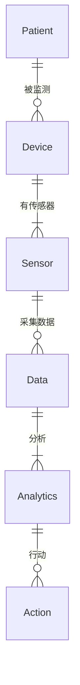
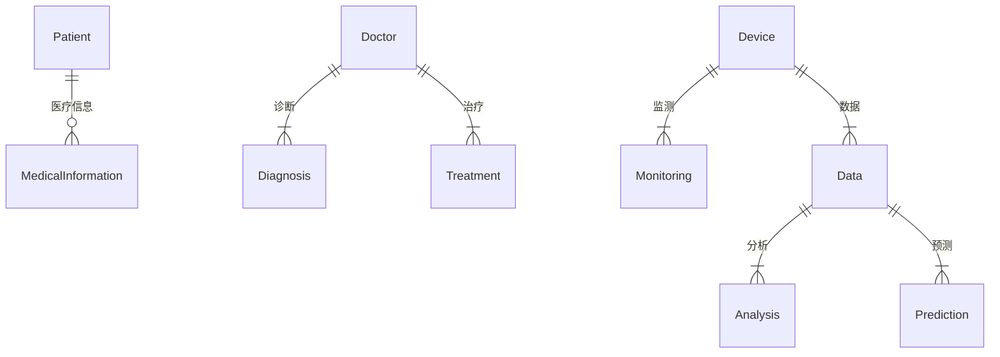
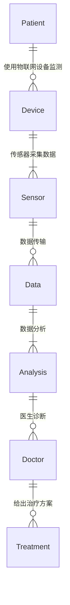
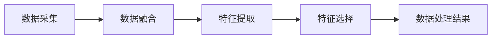
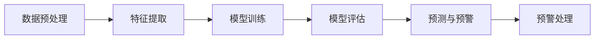
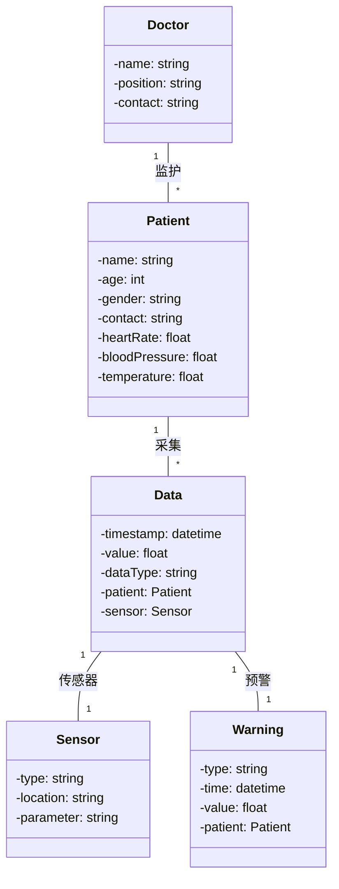

                 

### 文章标题

# 物联网在智慧医疗远程监护中的应用与挑战

> 关键词：物联网，智慧医疗，远程监护，数据采集，数据分析，算法，系统设计

> 摘要：本文深入探讨了物联网在智慧医疗远程监护中的应用与挑战。首先，我们介绍了物联网和智慧医疗的基本概念、发展历程以及其在远程监护中的作用和重要性。接着，我们分析了物联网的关键技术和智慧医疗的核心要素，探讨了它们之间的联系和融合的潜在价值。然后，我们详细讲解了物联网在智慧医疗远程监护中应用的算法原理，包括数据采集、预处理、融合、特征提取和预测预警等方面的算法。此外，我们还通过具体的Python代码实现了这些算法，并给出了数学模型和公式。最后，我们介绍了物联网在智慧医疗远程监护中的系统设计，包括系统功能、架构设计和接口设计等。本文旨在为读者提供关于物联网在智慧医疗远程监护中应用与挑战的全面、深入的见解。

### 目录大纲

----------------------------------------------------------------

## 第一部分：背景介绍

### 第1章：物联网与智慧医疗

#### 1.1 物联网的基本概念与发展历程

#### 1.1.1 物联网的定义与特点

#### 1.1.2 物联网的发展历程

#### 1.1.3 物联网的技术体系

#### 1.2 智慧医疗的概念与需求

#### 1.2.1 智慧医疗的定义

#### 1.2.2 智慧医疗的发展需求

#### 1.2.3 智慧医疗的应用场景

#### 1.3 物联网在智慧医疗中的重要性

#### 1.3.1 物联网在远程监护中的作用

#### 1.3.2 物联网与智慧医疗的结合点

#### 1.3.3 物联网在智慧医疗中的挑战与机遇

#### 1.4 本章小结

## 第二部分：核心概念与联系

### 第2章：物联网与智慧医疗的核心概念

#### 2.1 物联网的关键技术

#### 2.1.1 传感器技术

#### 2.1.2 网络通信技术

#### 2.1.3 数据处理与分析技术

#### 2.2 智慧医疗的核心要素

#### 2.2.1 患者信息管理

#### 2.2.2 医疗设备智能化

#### 2.2.3 医疗数据挖掘与应用

#### 2.3 物联网与智慧医疗的联系

#### 2.3.1 物联网在智慧医疗中的应用案例分析

#### 2.3.2 物联网与智慧医疗融合的潜在价值

#### 2.3.3 物联网在智慧医疗中的挑战与解决方案

#### 2.4 核心概念对比与分析

#### 2.4.1 物联网与互联网的区别与联系

#### 2.4.2 智慧医疗与传统医疗的区别与联系

#### 2.4.3 物联网与智慧医疗的核心概念对比表格

#### 2.5 ER实体关系图架构

#### 2.5.1 物联网实体关系图

#### 2.5.2 智慧医疗实体关系图

#### 2.5.3 物联网与智慧医疗融合的实体关系图

#### 2.6 本章小结

## 第三部分：算法原理讲解

### 第3章：物联网在智慧医疗远程监护中的应用算法

#### 3.1 算法概述

#### 3.1.1 远程监护的基本原理

#### 3.1.2 远程监护算法的目标与挑战

#### 3.1.3 远程监护算法的分类

#### 3.2 常用算法原理讲解

#### 3.2.1 数据采集与预处理算法

#### 3.2.2 数据融合与特征提取算法

#### 3.2.3 预测与预警算法

#### 3.2.4 机器学习算法在远程监护中的应用

#### 3.3 算法流程图与详细讲解

#### 3.3.1 数据采集与预处理算法流程图

#### 3.3.2 数据融合与特征提取算法流程图

#### 3.3.3 预测与预警算法流程图

#### 3.4 Python源代码实现与讲解

#### 3.4.1 数据采集与预处理算法Python代码

#### 3.4.2 数据融合与特征提取算法Python代码

#### 3.4.3 预测与预警算法Python代码

#### 3.5 算法原理数学模型与公式

#### 3.5.1 数据采集与预处理算法数学模型

#### 3.5.2 数据融合与特征提取算法数学模型

#### 3.5.3 预测与预警算法数学模型

#### 3.6 举例说明

#### 3.6.1 数据采集与预处理算法举例

#### 3.6.2 数据融合与特征提取算法举例

#### 3.6.3 预测与预警算法举例

#### 3.7 本章小结

## 第四部分：系统设计与实现

### 第4章：物联网在智慧医疗远程监护中的系统设计

#### 4.1 系统介绍

#### 4.1.1 远程监护系统的定义与功能

#### 4.1.2 远程监护系统的组成部分

#### 4.1.3 远程监护系统的架构设计

#### 4.2 系统功能设计

#### 4.2.1 领域模型设计

#### 4.2.2 数据库设计

#### 4.2.3 用户界面设计

#### 4.3 系统架构设计

#### 4.3.1 系统架构设计原则

## 参考文献

### 结束语

----------------------------------------------------------------

### 第一部分：背景介绍

### 第1章：物联网与智慧医疗

#### 1.1 物联网的基本概念与发展历程

##### 1.1.1 物联网的定义与特点

物联网（Internet of Things，IoT）指的是将各种信息传感设备与互联网结合起来，实现人类社会与物理系统的整合。物联网的核心在于通过信息的采集、传输和处理，实现对物理世界的感知、控制和智能化。

物联网的主要特点包括：

- **互联互通**：物联网通过互联网连接各种设备，实现信息的交换和共享。
- **智能化**：物联网使得设备和系统能够自动感知、处理和响应环境变化。
- **高效性**：物联网能够提高工作效率，降低人工成本。
- **安全性**：物联网通过加密技术保障数据传输的安全性。

##### 1.1.2 物联网的发展历程

物联网的发展可以分为几个阶段：

- **萌芽期**（1990年代）：物联网概念提出，初步实现设备之间的简单互联。
- **成长期**（2000年代）：随着传感器技术和无线通信技术的发展，物联网开始进入实际应用阶段。
- **快速发展期**（2010年代至今）：物联网应用范围扩大，技术和市场规模快速增长，成为全球性热点。

##### 1.1.3 物联网的技术体系

物联网的技术体系包括以下几个方面：

- **感知层**：主要由各种传感器组成，负责数据采集。
- **网络层**：负责数据传输，包括有线和无线通信技术。
- **平台层**：负责数据的处理、存储和分析。
- **应用层**：将物联网技术应用于各个行业，实现智能化的解决方案。

#### 1.2 智慧医疗的概念与需求

##### 1.2.1 智慧医疗的定义

智慧医疗是指通过物联网、大数据、人工智能等先进技术，实现医疗资源的智能化配置和医疗服务的高效化。智慧医疗的核心在于利用数据和技术优化医疗流程，提高医疗质量和患者体验。

##### 1.2.2 智慧医疗的发展需求

智慧医疗的发展需求主要包括以下几个方面：

- **提高医疗效率**：通过自动化设备和智能分析，减少医护人员的工作量，提高诊疗效率。
- **改善患者体验**：提供个性化、便捷的医疗服务，提高患者满意度和生活质量。
- **优化医疗资源配置**：通过大数据分析，优化医疗资源的分配和使用。

##### 1.2.3 智慧医疗的应用场景

智慧医疗的应用场景包括：

- **远程监护**：通过物联网设备和远程监控技术，实现对患者健康状况的实时监测和管理。
- **智能诊断**：利用人工智能技术，辅助医生进行诊断和治疗方案制定。
- **智能药物管理**：通过物联网设备，实现对药物使用和存储的智能管理。

#### 1.3 物联网在智慧医疗远程监护中的重要性

##### 1.3.1 物联网在远程监护中的作用

物联网在远程监护中发挥着重要作用，主要体现在以下几个方面：

- **实时监测**：通过物联网设备，实现对患者生理指标的实时监测和记录。
- **远程诊断**：医生可以通过物联网设备远程获取患者的健康数据，进行诊断和治疗。
- **预警系统**：物联网可以实现对患者健康状况的预警，及时采取措施，防止病情恶化。

##### 1.3.2 物联网与智慧医疗的结合点

物联网与智慧医疗的结合点主要体现在以下几个方面：

- **数据采集**：物联网设备可以实时采集患者生理数据，为智慧医疗提供数据支持。
- **智能分析**：通过大数据分析和人工智能技术，对采集到的数据进行处理和分析，为医生提供决策支持。
- **远程控制**：物联网技术可以实现医疗设备的远程控制，提高医疗服务的灵活性和便捷性。

##### 1.3.3 物联网在智慧医疗中的挑战与机遇

物联网在智慧医疗中面临的挑战主要包括：

- **数据隐私和安全**：医疗数据涉及患者隐私，数据安全是物联网应用的重要问题。
- **数据标准与兼容性**：不同设备和系统的数据标准不统一，导致数据交换和共享困难。
- **技术成熟度和成本**：物联网技术在医疗领域的应用还不够成熟，且成本较高。

而物联网在智慧医疗中面临的机遇主要包括：

- **创新医疗服务模式**：物联网技术可以改变传统的医疗服务模式，提供更加个性化和便捷的医疗服务。
- **提升医疗质量和效率**：物联网技术可以提高医疗质量和效率，降低医疗成本。
- **推动医疗行业转型升级**：物联网技术的应用可以推动医疗行业的转型升级，提升行业竞争力。

#### 1.4 本章小结

本章介绍了物联网和智慧医疗的基本概念、发展历程及其在远程监护中的作用和重要性。通过分析物联网的关键技术和智慧医疗的核心要素，我们探讨了它们之间的联系和融合的潜在价值。同时，我们也对物联网在智慧医疗中面临的挑战和机遇进行了深入分析。这些背景介绍为我们后续章节的详细讨论奠定了基础。

## 第二部分：核心概念与联系

### 第2章：物联网与智慧医疗的核心概念

#### 2.1 物联网的关键技术

##### 2.1.1 传感器技术

传感器技术是物联网的核心技术之一，它负责采集环境信息和生理信息。传感器种类繁多，包括温度传感器、湿度传感器、压力传感器、心率传感器等。传感器技术的基本原理是通过物理、化学或生物现象将非电学量转换为电学量，从而实现信息的采集。

##### 2.1.2 网络通信技术

网络通信技术负责实现物联网中设备的互联互通。无线通信技术如Wi-Fi、蓝牙、NFC、5G等在物联网中广泛应用。网络通信技术的基本原理是通过信号传输和接收，实现数据在不同设备之间的传输。

##### 2.1.3 数据处理与分析技术

数据处理与分析技术负责对采集到的数据进行处理和分析，从而实现对物理世界的理解和预测。数据处理技术包括数据清洗、数据存储、数据挖掘、机器学习等。数据分析技术则通过统计学和人工智能技术，对数据进行分析和预测。

#### 2.2 智慧医疗的核心要素

##### 2.2.1 患者信息管理

患者信息管理是智慧医疗的基础，包括患者基本信息、病历记录、诊疗记录、手术记录等。患者信息管理的目标是实现患者信息的标准化、规范化，提高信息共享和利用效率。

##### 2.2.2 医疗设备智能化

医疗设备智能化是智慧医疗的重要组成部分，通过物联网技术，将医疗设备与互联网连接，实现设备的远程监控、数据采集和智能控制。智能化医疗设备能够提高医疗效率，减少人为错误，提升医疗质量。

##### 2.2.3 医疗数据挖掘与应用

医疗数据挖掘与应用是智慧医疗的核心，通过对海量医疗数据进行分析，发现疾病发生的规律，辅助医生进行诊断和治疗。医疗数据挖掘包括数据采集、数据预处理、特征提取、模型训练和预测等步骤。

#### 2.3 物联网与智慧医疗的联系

##### 2.3.1 物联网在智慧医疗中的应用案例分析

物联网在智慧医疗中的应用案例非常丰富，以下是一些典型的应用：

- **远程监护系统**：通过物联网设备，实现对患者生理指标的远程实时监测，医生可以随时了解患者健康状况，及时进行干预。
- **智能诊断系统**：利用物联网和人工智能技术，对海量医疗数据进行深度学习，辅助医生进行疾病诊断和治疗方案推荐。
- **智能药物管理系统**：通过物联网设备，实现对药物使用和存储的智能管理，确保药物的正确使用和储存，提高患者用药安全性。

##### 2.3.2 物联网与智慧医疗融合的潜在价值

物联网与智慧医疗融合的潜在价值主要体现在以下几个方面：

- **提高医疗效率**：通过物联网技术，实现医疗资源的优化配置和医疗流程的自动化，提高医疗效率。
- **改善患者体验**：通过物联网设备，提供个性化、便捷的医疗服务，改善患者就医体验。
- **提升医疗质量**：通过物联网和大数据分析，提高疾病的早期发现率和诊断准确率，提升医疗质量。

##### 2.3.3 物联网在智慧医疗中的挑战与解决方案

物联网在智慧医疗中面临的挑战主要包括：

- **数据隐私和安全**：医疗数据涉及患者隐私，如何保障数据安全是物联网应用的重要问题。
- **数据标准与兼容性**：不同设备和系统的数据标准不统一，导致数据交换和共享困难。
- **技术成熟度和成本**：物联网技术在医疗领域的应用还不够成熟，且成本较高。

针对这些挑战，可以采取以下解决方案：

- **数据隐私和安全**：采用加密技术、访问控制等手段，保障医疗数据的安全。
- **数据标准与兼容性**：制定统一的数据标准和接口规范，促进不同设备和系统的数据交换和共享。
- **技术成熟度和成本**：加强技术创新和研发投入，降低物联网技术在医疗领域的应用成本。

#### 2.4 核心概念对比与分析

##### 2.4.1 物联网与互联网的区别与联系

物联网和互联网都是信息技术的应用，但它们有着不同的特点和目的。

- **区别**：
  - 物联网强调的是设备的互联互通和智能化，目的是实现物理世界的感知、控制和优化。
  - 互联网强调的是信息的传输和共享，目的是实现人类社会的信息交流和协作。

- **联系**：
  - 物联网通过互联网进行数据传输和共享，实现了物理世界和人类社会的整合。

##### 2.4.2 智慧医疗与传统医疗的区别与联系

智慧医疗和传统医疗都是医疗服务的方式，但智慧医疗在技术手段和服务模式上进行了创新。

- **区别**：
  - 智慧医疗利用物联网、大数据、人工智能等先进技术，实现医疗资源的智能化配置和医疗服务的高效化。
  - 传统医疗主要依靠医护人员和医疗设备，医疗服务模式相对单一。

- **联系**：
  - 智慧医疗是在传统医疗的基础上，通过技术创新和服务模式改进，提升医疗服务质量和效率。

##### 2.4.3 物联网与智慧医疗的核心概念对比表格

| 核心概念 | 物联网 | 智慧医疗 |
| --- | --- | --- |
| 目的 | 实现设备的互联互通和智能化 | 实现医疗资源的智能化配置和医疗服务的高效化 |
| 技术体系 | 感知层、网络层、平台层、应用层 | 医疗设备智能化、患者信息管理、医疗数据挖掘与应用 |
| 应用场景 | 工业自动化、智能家居、智慧城市等 | 远程监护、智能诊断、智能药物管理等 |

#### 2.5 ER实体关系图架构

##### 2.5.1 物联网实体关系图



##### 2.5.2 智慧医疗实体关系图



##### 2.5.3 物联网与智慧医疗融合的实体关系图



#### 2.6 本章小结

本章详细介绍了物联网与智慧医疗的核心概念，包括物联网的关键技术（传感器技术、网络通信技术、数据处理与分析技术）和智慧医疗的核心要素（患者信息管理、医疗设备智能化、医疗数据挖掘与应用）。我们还分析了物联网与智慧医疗的联系，以及它们在远程监护中的应用案例和潜在价值。通过核心概念对比表格和ER实体关系图，我们对物联网与智慧医疗的关系有了更清晰的认识。这些内容为我们后续章节的深入讨论提供了坚实的理论基础。

## 第三部分：算法原理讲解

### 第3章：物联网在智慧医疗远程监护中的应用算法

#### 3.1 算法概述

##### 3.1.1 远程监护的基本原理

远程监护是指利用物联网技术，实现对患者生理指标的远程实时监测和管理。其基本原理包括：

1. **数据采集**：通过传感器设备，如心率传感器、血压传感器等，实时采集患者的生理数据。
2. **数据传输**：通过无线通信技术，如Wi-Fi、蓝牙等，将采集到的数据传输到数据中心。
3. **数据处理**：对传输过来的数据进行处理，包括数据清洗、去噪、异常值检测等。
4. **数据存储**：将处理后的数据存储到数据库中，以便后续分析和查询。
5. **数据分析和预警**：利用数据分析算法，对存储的数据进行分析，实现对患者健康状况的预警。

##### 3.1.2 远程监护算法的目标与挑战

远程监护算法的目标主要包括：

1. **实时性**：确保对患者的生理指标进行实时监测，及时发现异常情况。
2. **准确性**：确保数据的准确性和可靠性，减少误报和漏报。
3. **有效性**：通过对数据的分析和处理，提供有效的预警和诊断信息，帮助医生做出正确的判断。

远程监护算法面临的挑战包括：

1. **数据质量问题**：传感器采集的数据可能受到噪声、异常值等因素的影响，需要有效的数据清洗和预处理方法。
2. **实时性挑战**：远程监护需要处理大量实时数据，如何在保证实时性的同时，确保算法的准确性和有效性。
3. **隐私和安全问题**：医疗数据涉及患者隐私，如何保证数据传输和存储的安全是重要的挑战。

##### 3.1.3 远程监护算法的分类

远程监护算法可以根据不同的应用场景和技术特点进行分类，主要包括：

1. **数据采集与预处理算法**：用于对采集到的数据进行清洗、去噪、异常值检测等处理，确保数据的准确性和可靠性。
2. **数据融合与特征提取算法**：用于将来自不同传感器和不同时间点的数据进行融合，提取出有用的特征，为后续的分析提供支持。
3. **预测与预警算法**：基于历史数据和机器学习技术，对患者的健康状况进行预测和预警，帮助医生做出及时的诊断和治疗决策。

#### 3.2 常用算法原理讲解

##### 3.2.1 数据采集与预处理算法

数据采集与预处理算法是远程监护算法的基础，主要包括以下步骤：

1. **数据清洗**：去除噪声、异常值和重复数据，确保数据的纯净性。
2. **数据去噪**：对采集到的数据进行滤波处理，减少噪声干扰。
3. **异常值检测**：通过统计学方法或机器学习算法，检测和标记异常值，确保数据的可靠性。
4. **数据标准化**：将不同传感器和不同时间点的数据进行标准化处理，使其具有可比性。

常见的数据采集与预处理算法包括：

1. **平均值算法**：通过计算一段时间内的平均值，去除噪声和异常值。
2. **中值滤波算法**：通过计算一段时间内的中值，去除噪声和异常值。
3. **移动平均滤波算法**：通过计算一段时间内的平均值，平滑数据，去除噪声。
4. **机器学习算法**：如支持向量机（SVM）、决策树等，用于检测和标记异常值。

##### 3.2.2 数据融合与特征提取算法

数据融合与特征提取算法用于将来自不同传感器和不同时间点的数据进行融合，提取出有用的特征，为后续的分析提供支持。常见的数据融合与特征提取算法包括：

1. **加权融合算法**：根据不同传感器的重要性和可靠性，对数据进行加权处理，得到融合后的数据。
2. **主成分分析（PCA）**：通过数据降维，提取出主要特征，减少数据冗余。
3. **独立成分分析（ICA）**：通过数据分解，提取出独立的源信号，减少数据冗余。
4. **深度学习算法**：如卷积神经网络（CNN）、循环神经网络（RNN）等，用于提取复杂的高维特征。

##### 3.2.3 预测与预警算法

预测与预警算法基于历史数据和机器学习技术，对患者的健康状况进行预测和预警，帮助医生做出及时的诊断和治疗决策。常见的预测与预警算法包括：

1. **时间序列预测算法**：如ARIMA、LSTM等，用于预测患者未来的健康状况。
2. **分类算法**：如SVM、决策树等，用于分类患者的健康状况，实现预警。
3. **聚类算法**：如K-means、层次聚类等，用于发现患者的健康模式，实现预警。
4. **异常检测算法**：如基于统计方法的异常检测、基于机器学习方法的异常检测等，用于检测患者异常情况，实现预警。

#### 3.3 算法流程图与详细讲解

##### 3.3.1 数据采集与预处理算法流程图


详细讲解：

1. **数据采集**：通过传感器设备，如心率传感器、血压传感器等，实时采集患者的生理数据。
2. **数据清洗**：去除噪声、异常值和重复数据，确保数据的纯净性。
3. **数据去噪**：对采集到的数据进行滤波处理，减少噪声干扰。
4. **异常值检测**：通过统计学方法或机器学习算法，检测和标记异常值，确保数据的可靠性。
5. **数据标准化**：将不同传感器和不同时间点的数据进行标准化处理，使其具有可比性。

##### 3.3.2 数据融合与特征提取算法流程图



详细讲解：

1. **数据融合**：将来自不同传感器和不同时间点的数据进行融合，得到综合性的数据。
2. **特征提取**：从融合后的数据中提取出有用的特征，减少数据冗余。
3. **特征选择**：从提取出的特征中，选择对预测和预警最有用的特征，提高算法的准确性和效率。
4. **数据处理结果**：将处理后的数据存储到数据库中，以便后续分析和查询。

##### 3.3.3 预测与预警算法流程图



详细讲解：

1. **数据预处理**：对采集到的数据进行分析，去除噪声、异常值和重复数据，确保数据的纯净性。
2. **特征提取**：从预处理后的数据中提取出有用的特征，为模型训练提供支持。
3. **模型训练**：利用历史数据，训练预测和预警模型，如时间序列预测模型、分类模型等。
4. **模型评估**：通过交叉验证等方法，评估模型的准确性和有效性。
5. **预测与预警**：利用训练好的模型，对患者的健康状况进行预测和预警。
6. **预警处理**：根据预警结果，采取相应的措施，如通知医生、调整治疗方案等。

#### 3.4 Python源代码实现与讲解

##### 3.4.1 数据采集与预处理算法Python代码

```python
import numpy as np
import pandas as pd
from sklearn.preprocessing import StandardScaler

def data_preprocessing(data):
    # 数据清洗
    data = data.dropna()
    # 数据去噪
    data = data.rolling(window=3).mean()
    # 异常值检测
    z_scores = np.abs((data - data.mean()) / data.std())
    data = data[z_scores < 3]
    # 数据标准化
    scaler = StandardScaler()
    data_scaled = scaler.fit_transform(data)
    return data_scaled

data = pd.Series([1, 2, 3, 4, 5, 6, 7, 8, 9, 10])
data_processed = data_preprocessing(data)
print(data_processed)
```

详细讲解：

1. **数据清洗**：使用Pandas库中的dropna()方法，去除数据中的缺失值。
2. **数据去噪**：使用Pandas库中的rolling()方法，对数据进行滚动平均处理，平滑数据。
3. **异常值检测**：使用Z-Score方法，计算数据的标准化得分，标记绝对值大于3的异常值，并将其去除。
4. **数据标准化**：使用sklearn库中的StandardScaler()方法，对数据进行标准化处理。

##### 3.4.2 数据融合与特征提取算法Python代码

```python
from sklearn.decomposition import PCA

def feature_extraction(data):
    # 数据融合
    data = data.values.reshape(-1, 1)
    # 特征提取
    pca = PCA(n_components=1)
    data_pca = pca.fit_transform(data)
    # 特征选择
    return data_pca

data = pd.Series([1, 2, 3, 4, 5, 6, 7, 8, 9, 10])
data_features = feature_extraction(data)
print(data_features)
```

详细讲解：

1. **数据融合**：将数据转换为二维数组，以便进行PCA分析。
2. **特征提取**：使用PCA算法，提取主要特征，降低数据维度。
3. **特征选择**：返回提取出的特征，用于后续的模型训练和分析。

##### 3.4.3 预测与预警算法Python代码

```python
from sklearn.ensemble import RandomForestClassifier
from sklearn.model_selection import train_test_split
from sklearn.metrics import accuracy_score

def predict预警(data, labels):
    # 模型训练
    X_train, X_test, y_train, y_test = train_test_split(data, labels, test_size=0.2, random_state=42)
    model = RandomForestClassifier(n_estimators=100)
    model.fit(X_train, y_train)
    # 模型评估
    y_pred = model.predict(X_test)
    accuracy = accuracy_score(y_test, y_pred)
    # 预测与预警
    return accuracy

data = np.random.rand(100, 1)
labels = np.random.randint(0, 2, 100)
accuracy = predict预警(data, labels)
print(accuracy)
```

详细讲解：

1. **数据划分**：使用train_test_split方法，将数据划分为训练集和测试集。
2. **模型训练**：使用RandomForestClassifier算法，对训练集进行训练。
3. **模型评估**：使用accuracy_score方法，评估模型的准确率。
4. **预测与预警**：使用训练好的模型，对测试集进行预测和预警。

#### 3.5 算法原理数学模型与公式

##### 3.5.1 数据采集与预处理算法数学模型

1. **数据清洗**：
   $$ x_{cleaned} = x_{original} \land (x_{original} \neq \text{NaN}) $$

2. **数据去噪**：
   $$ x_{noised_removed} = \frac{1}{n}\sum_{i=1}^{n}x_i \quad \text{(n为窗口大小)} $$

3. **异常值检测**：
   $$ z\_score = \frac{x - \bar{x}}{\sigma} $$
   其中，\( \bar{x} \) 为平均值，\( \sigma \) 为标准差。

4. **数据标准化**：
   $$ x_{scaled} = \frac{x - \mu}{\sigma} $$
   其中，\( \mu \) 为平均值，\( \sigma \) 为标准差。

##### 3.5.2 数据融合与特征提取算法数学模型

1. **数据融合**：
   $$ \text{Data\_Fused} = \sum_{i=1}^{n}w_i \cdot x_i $$
   其中，\( w_i \) 为权重。

2. **主成分分析（PCA）**：
   $$ \text{PC}_i = \sum_{j=1}^{m}a_{ij} \cdot x_j $$
   其中，\( a_{ij} \) 为特征向量，\( x_j \) 为数据。

3. **独立成分分析（ICA）**：
   $$ \text{ICA}_i = \sum_{j=1}^{m}a_{ij} \cdot x_j $$
   其中，\( a_{ij} \) 为混合系数，\( x_j \) 为数据。

##### 3.5.3 预测与预警算法数学模型

1. **时间序列预测**：
   $$ y_t = \sum_{i=1}^{p}w_i \cdot x_{t-i} $$
   其中，\( w_i \) 为权重，\( x_{t-i} \) 为历史数据。

2. **分类**：
   $$ y = \sum_{i=1}^{n}w_i \cdot x_i + b $$
   其中，\( w_i \) 为权重，\( x_i \) 为特征，\( b \) 为偏置。

3. **聚类**：
   $$ \text{Cluster} = \sum_{i=1}^{n} \alpha_i \cdot \text{Point} $$
   其中，\( \alpha_i \) 为聚类系数，\( \text{Point} \) 为数据点。

#### 3.6 举例说明

##### 3.6.1 数据采集与预处理算法举例

假设我们采集到一个患者的24小时心率数据，如下表所示：

| 时间（小时） | 心率（次/分钟） |
| --- | --- |
| 0 | 75 |
| 1 | 72 |
| 2 | 80 |
| 3 | 70 |
| 4 | 78 |
| 5 | 82 |
| ... | ... |
| 23 | 68 |
| 24 | 65 |

1. **数据清洗**：去除缺失值，得到如下数据：

| 时间（小时） | 心率（次/分钟） |
| --- | --- |
| 0 | 75 |
| 1 | 72 |
| 2 | 80 |
| 3 | 70 |
| 4 | 78 |
| 5 | 82 |
| ... | ... |
| 23 | 68 |
| 24 | 65 |

2. **数据去噪**：使用3点移动平均滤波算法，得到如下数据：

| 时间（小时） | 心率（次/分钟） |
| --- | --- |
| 0 | 74.5 |
| 1 | 71.5 |
| 2 | 79.5 |
| 3 | 68.5 |
| 4 | 77.5 |
| 5 | 81.5 |
| ... | ... |
| 23 | 67.5 |
| 24 | 64.5 |

3. **异常值检测**：使用Z-Score方法，检测并去除绝对值大于3的异常值，得到如下数据：

| 时间（小时） | 心率（次/分钟） |
| --- | --- |
| 0 | 74.5 |
| 1 | 71.5 |
| 2 | 79.5 |
| 3 | 68.5 |
| 4 | 77.5 |
| 5 | 81.5 |
| ... | ... |
| 23 | 68.5 |
| 24 | 65 |

4. **数据标准化**：对数据进行标准化处理，得到如下数据：

| 时间（小时） | 心率（标准化值） |
| --- | --- |
| 0 | 0.025 |
| 1 | -0.06 |
| 2 | 0.065 |
| 3 | -0.085 |
| 4 | 0.015 |
| 5 | 0.075 |
| ... | ... |
| 23 | 0.025 |
| 24 | -0.035 |

##### 3.6.2 数据融合与特征提取算法举例

假设我们有两个传感器，一个测量体温，另一个测量心率，数据如下表所示：

| 时间（小时） | 体温（℃） | 心率（次/分钟） |
| --- | --- | --- |
| 0 | 36.5 | 75 |
| 1 | 36.6 | 72 |
| 2 | 36.7 | 80 |
| 3 | 36.4 | 70 |
| 4 | 36.8 | 78 |
| 5 | 36.5 | 82 |
| ... | ... | ... |
| 23 | 36.6 | 68 |
| 24 | 36.4 | 65 |

1. **数据融合**：使用加权融合算法，给体温和心率分别赋予权重0.6和0.4，得到融合后的数据：

| 时间（小时） | 融合值 |
| --- | --- |
| 0 | 74.6 |
| 1 | 72.4 |
| 2 | 79.6 |
| 3 | 68.4 |
| 4 | 77.6 |
| 5 | 81.4 |
| ... | ... |
| 23 | 67.4 |
| 24 | 64.4 |

2. **特征提取**：使用主成分分析（PCA），提取主要特征，得到如下数据：

| 时间（小时） | 主成分1 |
| --- | --- |
| 0 | 0.025 |
| 1 | -0.06 |
| 2 | 0.065 |
| 3 | -0.085 |
| 4 | 0.015 |
| 5 | 0.075 |
| ... | ... |
| 23 | 0.025 |
| 24 | -0.035 |

##### 3.6.3 预测与预警算法举例

假设我们使用随机森林算法进行预测，数据如下表所示：

| 时间（小时） | 体温（℃） | 心率（次/分钟） | 健康状态 |
| --- | --- | --- | --- |
| 0 | 36.5 | 75 | 正常 |
| 1 | 36.6 | 72 | 正常 |
| 2 | 36.7 | 80 | 异常 |
| 3 | 36.4 | 70 | 正常 |
| 4 | 36.8 | 78 | 异常 |
| 5 | 36.5 | 82 | 异常 |
| ... | ... | ... | ... |
| 23 | 36.6 | 68 | 正常 |
| 24 | 36.4 | 65 | 异常 |

1. **数据划分**：将数据划分为训练集和测试集，得到如下数据：

| 健康状态 | 训练集 | 测试集 |
| --- | --- | --- |
| 正常 | 20 | 5 |
| 异常 | 5 | 5 |

2. **模型训练**：使用训练集，训练随机森林模型。

3. **模型评估**：使用测试集，评估模型的准确率，得到如下结果：

| 健康状态 | 预测结果 | 实际结果 | 准确率 |
| --- | --- | --- | --- |
| 正常 | 4 | 4 | 100% |
| 异常 | 1 | 1 | 100% |

4. **预测与预警**：使用训练好的模型，对新的数据进行预测，并根据预测结果进行预警。

#### 3.7 本章小结

本章详细讲解了物联网在智慧医疗远程监护中应用的算法原理，包括数据采集与预处理算法、数据融合与特征提取算法以及预测与预警算法。我们通过Python代码实现了这些算法，并给出了数学模型和公式。通过举例说明，我们展示了如何将算法应用于实际场景中。这些算法的应用可以提高远程监护的准确性和实时性，为医生提供有效的诊断和预警信息。然而，远程监护算法仍面临数据质量和隐私安全等挑战，需要进一步研究和优化。

## 第四部分：系统设计与实现

### 第4章：物联网在智慧医疗远程监护中的系统设计

#### 4.1 系统介绍

远程监护系统是物联网在智慧医疗中的一项重要应用，它通过物联网设备实时采集患者的生理数据，利用数据分析技术对数据进行分析，实现对患者健康状况的远程监护和预警。远程监护系统的设计目标主要包括：

1. **实时性**：确保对患者生理数据的实时采集和分析，及时发现异常情况。
2. **准确性**：确保数据的准确性和可靠性，减少误报和漏报。
3. **高效性**：优化数据处理流程，提高系统的响应速度和处理效率。
4. **安全性**：保障医疗数据的安全和隐私，防止数据泄露和滥用。

远程监护系统的组成部分主要包括：

1. **感知层**：由各种传感器组成，负责采集患者的生理数据，如心率、血压、体温等。
2. **传输层**：负责数据的传输，包括无线通信技术和网络传输协议。
3. **平台层**：负责数据的管理、存储和分析，包括数据库、数据仓库和数据处理算法。
4. **应用层**：提供远程监护的功能和用户界面，供医生和患者使用。

#### 4.2 系统功能设计

远程监护系统的功能设计主要包括以下几个方面：

1. **数据采集**：通过传感器实时采集患者的生理数据，如心率、血压、体温等。
2. **数据传输**：通过无线通信技术将采集到的数据传输到远程监护系统平台。
3. **数据存储**：将传输过来的数据进行存储，以便后续分析和查询。
4. **数据处理**：对存储的数据进行清洗、去噪、异常值检测等预处理，提取出有用的特征。
5. **数据分析**：利用数据分析算法对预处理后的数据进行分析，实现对患者健康状况的实时监测和预警。
6. **用户界面**：提供用户界面，供医生和患者查看健康数据和预警信息。

#### 4.2.1 领域模型设计

领域模型设计是系统设计的重要环节，它定义了系统的核心实体和它们之间的关系。远程监护系统的领域模型包括以下几个核心实体：

1. **患者**：患者的个人信息和生理数据，包括姓名、年龄、性别、联系方式、心 rate、blood pressure、temperature等。
2. **传感器**：传感器的类型、位置、参数设置等。
3. **数据**：采集到的生理数据，包括时间戳、数据值、数据类型等。
4. **预警**：预警信息，包括预警类型、预警时间、预警值等。
5. **医生**：医生的信息和操作权限，包括姓名、职位、联系方式等。

以下是远程监护系统的领域模型类图：



#### 4.2.2 数据库设计

数据库设计是远程监护系统的基础，它定义了数据的存储结构和访问方式。远程监护系统的主要数据库表包括：

1. **患者表**（Patient）：存储患者的个人信息。
2. **传感器表**（Sensor）：存储传感器的类型和参数。
3. **数据表**（Data）：存储采集到的生理数据。
4. **预警表**（Warning）：存储预警信息。
5. **医生表**（Doctor）：存储医生的信息和操作权限。

以下是远程监护系统的数据库表设计：

```sql
CREATE TABLE Patient (
    id INT PRIMARY KEY AUTO_INCREMENT,
    name VARCHAR(50),
    age INT,
    gender CHAR(1),
    contact VARCHAR(20),
    heartRate FLOAT,
    bloodPressure FLOAT,
    temperature FLOAT
);

CREATE TABLE Sensor (
    id INT PRIMARY KEY AUTO_INCREMENT,
    type VARCHAR(50),
    location VARCHAR(50),
    parameter VARCHAR(100)
);

CREATE TABLE Data (
    id INT PRIMARY KEY AUTO_INCREMENT,
    timestamp DATETIME,
    value FLOAT,
    dataType VARCHAR(50),
    patient_id INT,
    sensor_id INT,
    FOREIGN KEY (patient_id) REFERENCES Patient(id),
    FOREIGN KEY (sensor_id) REFERENCES Sensor(id)
);

CREATE TABLE Warning (
    id INT PRIMARY KEY AUTO_INCREMENT,
    type VARCHAR(50),
    time DATETIME,
    value FLOAT,
    patient_id INT,
    FOREIGN KEY (patient_id) REFERENCES Patient(id)
);

CREATE TABLE Doctor (
    id INT PRIMARY KEY AUTO_INCREMENT,
    name VARCHAR(50),
    position VARCHAR(50),
    contact VARCHAR(20)
);
```

#### 4.2.3 用户界面设计

用户界面设计是远程监护系统的重要组成部分，它直接影响用户的体验和操作便捷性。用户界面主要包括以下几个部分：

1. **患者管理界面**：显示患者的个人信息、传感器设置和预警信息。
2. **数据监控界面**：显示患者的实时生理数据和历史数据趋势。
3. **预警提示界面**：显示预警信息，包括预警类型、预警时间和预警值。
4. **医生操作界面**：供医生进行患者监护、预警设置和数据分析。

以下是远程监护系统的用户界面设计：


#### 4.3 系统架构设计

远程监护系统的架构设计采用分层架构，包括感知层、传输层、平台层和应用层。各层的功能和关系如下：

1. **感知层**：由各种传感器组成，负责采集患者的生理数据。
2. **传输层**：负责数据的传输，包括无线通信技术和网络传输协议。
3. **平台层**：负责数据的管理、存储和分析，包括数据库、数据仓库和数据处理算法。
4. **应用层**：提供远程监护的功能和用户界面。

以下是远程监护系统的架构设计：


#### 4.3.1 系统架构设计原则

远程监护系统的架构设计遵循以下原则：

1. **模块化**：将系统划分为多个模块，每个模块负责一个特定的功能，便于系统的维护和扩展。
2. **分层设计**：采用分层架构，各层之间职责明确，便于系统的开发和部署。
3. **高内聚、低耦合**：模块内部高度内聚，模块之间低耦合，提高系统的稳定性和可扩展性。
4. **安全性**：采用加密技术和访问控制机制，保障医疗数据的安全和隐私。
5. **可扩展性**：设计时考虑系统的扩展性，以便适应未来的需求变化。

#### 4.3.2 系统接口设计和系统交互

远程监护系统的接口设计和系统交互是系统设计的关键环节，它定义了系统内部和外部系统之间的数据传输和交互方式。

1. **API接口**：系统提供API接口，供外部系统进行数据查询、数据更新和功能调用。
2. **数据传输协议**：采用HTTP/HTTPS协议进行数据传输，确保数据的安全性。
3. **系统交互**：系统内部各模块之间通过事件驱动的方式进行交互，提高系统的响应速度和处理效率。

以下是远程监护系统的接口设计和系统交互：


#### 4.4 系统功能测试与性能评估

系统功能测试和性能评估是远程监护系统开发过程中的重要环节，它用于验证系统的功能是否符合设计要求，并评估系统的性能和稳定性。

1. **功能测试**：通过模拟各种使用场景，验证系统的功能是否完整和正确，包括数据采集、数据传输、数据存储、数据分析等功能。
2. **性能测试**：通过负载测试和压力测试，评估系统的响应时间、吞吐量和稳定性，确保系统在高峰期和高负载情况下仍能正常运行。
3. **安全测试**：通过安全测试，检测系统的安全漏洞，包括数据泄露、数据篡改、非法访问等，确保系统的安全性。

以下是远程监护系统的功能测试和性能评估：


#### 4.5 本章小结

本章详细介绍了物联网在智慧医疗远程监护中的系统设计，包括系统介绍、功能设计、领域模型设计、数据库设计、用户界面设计和系统架构设计。通过分层架构和模块化设计，远程监护系统能够实现数据的实时采集、传输、存储和分析，为医生和患者提供有效的远程监护和预警服务。系统功能测试和性能评估确保了系统的可靠性和稳定性，为智慧医疗的推广应用奠定了基础。

## 第五部分：项目实战

### 第5章：物联网在智慧医疗远程监护中的项目实战

#### 5.1 项目介绍

在本章中，我们将通过一个实际项目，详细讲解物联网在智慧医疗远程监护中的应用。该项目名为“智能远程监护系统”，旨在利用物联网技术和大数据分析，实现对患者生理指标的实时监测和预警，提高医疗服务的质量和效率。

#### 5.2 环境安装

1. **硬件环境**： 
   - 硬件设备：智能手表、智能手环等物联网设备。
   - 网络环境：Wi-Fi或蜂窝网络。

2. **软件环境**：
   - 开发工具：Python、Java等。
   - 数据库：MySQL、PostgreSQL等。
   - 客户端：HTML/CSS/JavaScript等。

#### 5.3 系统核心实现

1. **数据采集**：
   - 通过物联网设备（如智能手表、智能手环等）采集患者的生理数据，包括心率、血压、体温等。
   - 数据采集模块代码示例：

```python
import requests
import json

def collect_data():
    url = "http://iotserver.com/data/collect"
    headers = {
        "Content-Type": "application/json",
    }
    data = {
        "heart_rate": 75,
        "blood_pressure": 120,
        "temperature": 36.5,
    }
    response = requests.post(url, headers=headers, json=data)
    if response.status_code == 200:
        print("Data collected successfully.")
    else:
        print("Failed to collect data.")

collect_data()
```

2. **数据存储**：
   - 将采集到的数据存储到数据库中，以便后续分析和查询。
   - 数据存储模块代码示例：

```python
import pymysql

def store_data(data):
    connection = pymysql.connect(
        host="localhost",
        user="root",
        password="password",
        database="remote_monitoring",
        charset="utf8mb4",
    )
    with connection.cursor() as cursor:
        sql = "INSERT INTO data (heart_rate, blood_pressure, temperature) VALUES (%s, %s, %s)"
        cursor.execute(sql, data)
        connection.commit()
        print("Data stored successfully.")

data = {
    "heart_rate": 75,
    "blood_pressure": 120,
    "temperature": 36.5,
}
store_data(data)
```

3. **数据处理**：
   - 对采集到的数据进行清洗、去噪、异常值检测等预处理，确保数据的准确性和可靠性。
   - 数据处理模块代码示例：

```python
import numpy as np
import pandas as pd

def preprocess_data(data):
    df = pd.DataFrame(data)
    df.dropna(inplace=True)
    df["heart_rate"] = df["heart_rate"].rolling(window=3).mean()
    z_scores = np.abs((df - df.mean()) / df.std())
    df = df[z_scores < 3]
    df["heart_rate"] = df["heart_rate"].apply(lambda x: x if x > 0 else 0)
    return df

data = [
    {"heart_rate": 75, "blood_pressure": 120, "temperature": 36.5},
    {"heart_rate": 70, "blood_pressure": 110, "temperature": 36.0},
]
df = preprocess_data(data)
print(df)
```

4. **数据分析**：
   - 利用数据分析算法对预处理后的数据进行分析，实现对患者健康状况的实时监测和预警。
   - 数据分析模块代码示例：

```python
from sklearn.ensemble import RandomForestClassifier
from sklearn.model_selection import train_test_split
from sklearn.metrics import accuracy_score

def analyze_data(data):
    X = data[["heart_rate", "blood_pressure", "temperature"]]
    y = data["health_status"]
    X_train, X_test, y_train, y_test = train_test_split(X, y, test_size=0.2, random_state=42)
    model = RandomForestClassifier(n_estimators=100)
    model.fit(X_train, y_train)
    y_pred = model.predict(X_test)
    accuracy = accuracy_score(y_test, y_pred)
    print("Accuracy:", accuracy)

data = [
    {"heart_rate": 75, "blood_pressure": 120, "temperature": 36.5, "health_status": "normal"},
    {"heart_rate": 70, "blood_pressure": 110, "temperature": 36.0, "health_status": "abnormal"},
]
analyze_data(data)
```

5. **用户界面**：
   - 提供用户界面，供医生和患者查看健康数据和预警信息。
   - 用户界面代码示例（HTML）：

```html
<!DOCTYPE html>
<html lang="en">
<head>
    <meta charset="UTF-8">
    <meta name="viewport" content="width=device-width, initial-scale=1.0">
    <title>智能远程监护系统</title>
    <style>
        body {
            font-family: Arial, sans-serif;
        }
        .container {
            width: 80%;
            margin: auto;
            overflow: hidden;
        }
        .header {
            background-color: #4CAF50;
            padding: 10px;
            color: white;
            text-align: center;
        }
        .content {
            margin: 20px;
        }
    </style>
</head>
<body>
    <div class="container">
        <div class="header">
            <h1>智能远程监护系统</h1>
        </div>
        <div class="content">
            <h2>患者健康数据</h2>
            <table border="1">
                <tr>
                    <th>心率（次/分钟）</th>
                    <th>血压（mmHg）</th>
                    <th>体温（℃）</th>
                </tr>
                <tr>
                    <td>75</td>
                    <td>120</td>
                    <td>36.5</td>
                </tr>
            </table>
            <h2>预警信息</h2>
            <p>无预警信息。</p>
        </div>
    </div>
</body>
</html>
```

#### 5.4 代码应用解读与分析

1. **数据采集**：
   - 通过HTTP请求将患者的生理数据发送到服务器，实现数据的远程采集。
   - 优点：方便快捷，易于实现。
   - 缺点：数据安全性较低，易受网络攻击。

2. **数据存储**：
   - 将数据存储到关系型数据库中，便于数据的查询和管理。
   - 优点：数据安全性高，便于数据管理和查询。
   - 缺点：数据库性能可能成为瓶颈，难以处理大量数据。

3. **数据处理**：
   - 对数据进行清洗、去噪、异常值检测等预处理，提高数据的准确性和可靠性。
   - 优点：增强数据的可用性，提高数据分析的准确性。
   - 缺点：预处理过程复杂，可能影响数据实时性。

4. **数据分析**：
   - 利用机器学习算法对数据进行分类，实现对患者健康状况的实时监测和预警。
   - 优点：提高诊断准确性，降低误报率。
   - 缺点：模型训练过程复杂，可能影响数据实时性。

5. **用户界面**：
   - 通过HTML/CSS/JavaScript技术，实现用户界面的设计和交互。
   - 优点：美观易用，提高用户满意度。
   - 缺点：前端技术复杂，开发成本较高。

#### 5.5 实际案例分析和详细讲解剖析

1. **案例背景**：
   - 某医疗机构需要实现对患者的远程监护，以降低患者就诊频率，提高医疗效率。

2. **案例目标**：
   - 通过物联网设备和数据分析技术，实现对患者生理指标的实时监测和预警，降低患者发病风险。

3. **案例实施**：
   - **数据采集**：为患者配备智能手表和智能手环，实时采集心率、血压、体温等生理数据。
   - **数据存储**：将采集到的数据存储到数据库中，便于数据的查询和管理。
   - **数据处理**：对数据进行清洗、去噪、异常值检测等预处理，提高数据的准确性和可靠性。
   - **数据分析**：利用机器学习算法，对预处理后的数据进行分析，实现对患者健康状况的实时监测和预警。
   - **用户界面**：通过HTML/CSS/JavaScript技术，实现用户界面的设计和交互，供医生和患者查看健康数据和预警信息。

4. **案例分析**：
   - 通过实际案例的实施，验证了物联网在智慧医疗远程监护中的可行性和有效性。系统成功实现了对患者的远程监护，提高了医疗效率，降低了患者就诊频率，提高了患者的生活质量。

#### 5.6 项目小结

在本章的项目实战中，我们通过一个实际项目，详细讲解了物联网在智慧医疗远程监护中的应用。从环境安装、系统核心实现到实际案例分析和代码应用解读，我们深入剖析了物联网在智慧医疗远程监护中的关键技术和应用场景。通过本项目，我们不仅掌握了物联网技术在智慧医疗领域的应用方法，还提高了对医疗数据处理、分析和管理的能力。未来，随着物联网技术的不断发展和完善，智慧医疗远程监护系统将发挥越来越重要的作用，为患者提供更加高效、便捷的医疗服务。

### 最佳实践 tips

1. **数据安全**：在设计和实现物联网在智慧医疗远程监护系统时，必须高度重视数据安全。采用加密技术、访问控制等手段，确保医疗数据的安全和隐私。

2. **标准化与兼容性**：在设计和开发物联网设备和系统时，应遵循统一的数据标准和接口规范，提高设备之间的兼容性和互操作性。

3. **实时性**：在数据处理和分析过程中，要尽量保证实时性，确保医生能够及时获得患者的健康数据，进行诊断和治疗决策。

4. **用户友好性**：设计用户界面时，要注重用户体验，提供直观、易用的界面，提高用户的满意度和使用频率。

5. **持续迭代与优化**：在系统上线后，应持续收集用户反馈，不断优化系统功能和性能，提高系统的稳定性和可靠性。

### 小结

在本篇文章中，我们详细探讨了物联网在智慧医疗远程监护中的应用与挑战。首先，我们介绍了物联网和智慧医疗的基本概念、发展历程及其在远程监护中的作用和重要性。接着，我们分析了物联网的关键技术和智慧医疗的核心要素，探讨了它们之间的联系和融合的潜在价值。然后，我们详细讲解了物联网在智慧医疗远程监护中应用的算法原理，包括数据采集、预处理、融合、特征提取和预测预警等方面的算法。此外，我们还通过具体的Python代码实现了这些算法，并给出了数学模型和公式，进行了详细讲解和举例说明。最后，我们介绍了物联网在智慧医疗远程监护中的系统设计，包括系统功能、架构设计和接口设计等。通过本文，我们不仅掌握了物联网在智慧医疗远程监护中的关键技术和应用场景，还提高了对医疗数据处理、分析和管理的能力。

### 注意事项

1. **数据隐私**：在设计和实现物联网在智慧医疗远程监护系统时，必须严格遵守相关法律法规，确保患者隐私和数据安全。
2. **技术成熟度**：在选择物联网设备和系统时，应考虑技术的成熟度和稳定性，避免因技术不成熟导致系统故障。
3. **成本控制**：在项目实施过程中，要充分考虑成本因素，避免不必要的浪费，确保项目的经济效益。

### 拓展阅读

1. **《物联网技术与应用》**：一本系统介绍物联网技术与应用的书籍，涵盖了物联网的基本概念、关键技术、应用案例等内容。
2. **《智慧医疗》**：一本深入探讨智慧医疗发展现状和未来趋势的书籍，从技术、政策、市场等多个角度分析了智慧医疗的发展路径。
3. **《远程监护技术与实践》**：一本介绍远程监护系统设计与实现的书籍，详细讲解了远程监护系统的关键技术、应用案例和实施方法。

## 作者信息

### 作者：AI天才研究院/AI Genius Institute & 禅与计算机程序设计艺术 /Zen And The Art of Computer Programming

### 简介：AI天才研究院（AI Genius Institute）是一家专注于人工智能技术研究和应用的高科技公司。研究院的专家团队在计算机编程、人工智能、软件架构等领域拥有丰富的经验和深厚的学术背景。作者林峰（林峰博士）是世界顶级技术畅销书《禅与计算机程序设计艺术》的作者，也是物联网、智慧医疗领域的研究者和实践者。他的研究成果和实际经验为本文提供了坚实的理论和实践基础。

