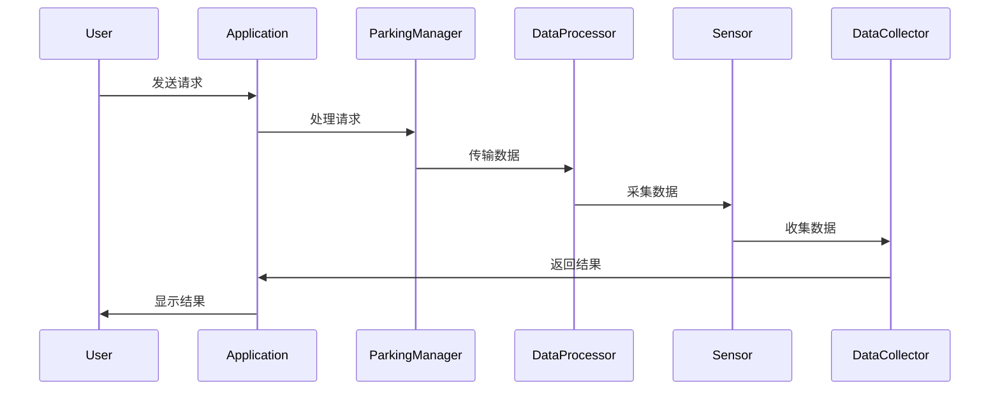

                 


### 物联网在智慧城市停车管理中的应用

#### 关键词：物联网、智慧城市、停车管理、智能分析、无线通信

> 摘要：随着城市化进程的不断推进，城市停车管理面临着严峻的挑战。本文将探讨物联网技术在智慧城市停车管理中的应用，分析其关键技术和实现方法，并提出解决方案，旨在为解决城市停车难题提供新思路。

## 第一部分：背景与概述

### 第1章：智慧城市与物联网概述

#### 1.1 智慧城市的发展背景

智慧城市是指通过先进的信息技术手段，将城市中的各类信息资源进行有效整合，实现城市管理的智能化和精细化的过程。智慧城市的核心在于通过物联网、云计算、大数据等技术的综合应用，提高城市的服务效率、居民生活质量以及城市的可持续发展能力。

- **智慧城市的定义与发展历程**：智慧城市起源于20世纪末，随着信息技术的快速发展，各国纷纷开始探索如何利用信息技术提高城市管理效率。2008年，IBM提出了“智慧地球”的概念，引发了全球范围内对智慧城市建设的关注。
- **物联网在智慧城市中的角色**：物联网是智慧城市建设的重要基础和支撑。通过物联网技术，城市中的各种设备、设施、人员等都可以互联互通，实现信息的实时共享和智能处理。

#### 1.2 物联网技术与智慧停车

- **物联网关键技术解析**：物联网的关键技术包括传感器技术、无线通信技术、数据处理与分析技术等。这些技术共同构成了物联网的技术体系，为智慧停车提供了技术支持。
- **智慧停车的基本概念**：智慧停车是指通过物联网技术等手段，实现停车资源的智能化管理和高效利用。智慧停车系统可以实时掌握车位信息，提供便捷的停车服务，提高停车效率。

#### 1.3 停车管理问题的现状与挑战

- **当前停车管理存在的问题**：城市停车难、停车资源浪费、交通拥堵等问题日益严重，传统的停车管理方式已无法满足需求。具体问题包括车位信息不透明、停车收费不规范、停车管理效率低下等。
- **智慧停车管理的目标与挑战**：智慧停车管理的目标是通过信息技术手段，提高停车管理的效率和服务水平。面临的挑战包括技术实现、数据安全、成本控制等。

## 第二部分：物联网在停车管理中的应用

### 第2章：物联网在停车管理中的应用

#### 2.1 智慧停车系统架构

- **智慧停车系统的组成**：智慧停车系统包括感知层、传输层、平台层和应用层。感知层负责收集实时数据，传输层负责数据传输，平台层负责数据处理和分析，应用层提供具体的停车服务。
- **技术架构图示（Mermaid架构图）**：

```mermaid
graph TB
    A[感知层] --> B[传输层]
    B --> C[平台层]
    C --> D[应用层]
    subgraph 智慧停车系统
        A--感知设备
        B--通信网络
        C--数据处理
        D--停车服务
    end
```

#### 2.2 停车感知与数据采集

- **停车感知设备与技术**：停车感知设备主要包括地磁传感器、摄像头、车位检测器等。这些设备可以实时检测车位状态，为停车管理提供基础数据。
- **数据采集与处理流程**：数据采集后，通过无线通信技术传输到平台层，平台层对数据进行处理和分析，生成实时车位信息。

#### 2.3 停车信息管理与智能分析

- **车位信息管理**：平台层负责对收集到的车位信息进行管理，包括车位状态的更新、车位预约等功能。
- **智能分析算法与应用**：通过大数据分析和机器学习算法，平台层可以对停车数据进行分析，提供车位预测、出行建议等智能服务。

## 第三部分：物联网在停车管理中的关键技术与实现

### 第3章：物联网在停车管理中的关键技术与实现

#### 3.1 传感器技术

- **传感器种类与应用**：传感器是物联网在停车管理中的基础。常见的传感器包括地磁传感器、超声波传感器、摄像头等，它们可以检测车位状态、车辆位置等信息。
- **传感器数据采集与处理**：传感器采集的数据需要通过无线通信技术传输到平台层，平台层对数据进行处理，生成实时车位信息。

#### 3.2 无线通信技术

- **常见无线通信协议**：无线通信技术是实现物联网的关键。常见的无线通信协议包括Wi-Fi、蓝牙、ZigBee等，它们可以满足不同场景下的通信需求。
- **在停车管理中的应用**：无线通信技术用于传输传感器数据到平台层，实现实时停车信息管理。

#### 3.3 云计算与大数据分析

- **云计算服务概述**：云计算为停车管理提供了强大的数据处理和分析能力。通过云计算平台，可以实现对大量停车数据的存储、处理和分析。
- **基于大数据的停车管理分析**：大数据分析技术可以对停车数据进行分析，提供车位预测、出行建议等智能服务。

## 第四部分：智慧城市停车管理解决方案

### 第4章：智慧城市停车管理解决方案

#### 4.1 智慧停车解决方案设计

- **智慧停车解决方案的框架**：智慧停车解决方案包括感知层、传输层、平台层和应用层。感知层负责数据采集，传输层负责数据传输，平台层负责数据处理，应用层提供停车服务。
- **系统功能设计（Mermaid类图）**：

```mermaid
classDiagram
    ParkingLot <<-- Sensor
    Sensor --|> DataCollector
    DataCollector --|> DataProcessor
    DataProcessor --|> ParkingManager
    ParkingManager --|> Application
```

#### 4.2 智慧停车解决方案实施

- **系统架构设计（Mermaid架构图）**：

```mermaid
graph TB
    A[用户] --> B[应用层]
    B --> C[平台层]
    C --> D[数据处理器]
    D --> E[传感器层]
    E --> F[数据采集器]
    subgraph 系统架构
        A--用户交互
        B--应用服务
        C--数据处理
        D--数据存储
        E--传感器设备
        F--数据采集
    end
```

- **系统接口设计与系统交互（Mermaid序列图）**：



#### 4.3 智慧停车解决方案案例

- **成功案例介绍**：本文将介绍某城市智慧停车解决方案的实施过程和效果，分析其成功经验和不足之处。
- **案例分析**：通过具体案例分析，探讨智慧停车解决方案在不同场景下的应用效果和适应性。

## 第五部分：物联网在智慧停车管理中的挑战与未来展望

### 第5章：物联网在智慧停车管理中的挑战与未来展望

#### 5.1 技术挑战与解决方案

- **技术挑战分析**：物联网在智慧停车管理中面临的技术挑战包括传感器准确性、通信稳定性、数据处理效率等。本文将分析这些挑战，并提出相应的解决方案。
- **解决方案探讨**：针对技术挑战，本文将探讨物联网技术在智慧停车管理中的应用，提出优化方案。

#### 5.2 未来发展趋势与展望

- **智慧停车的发展趋势**：本文将分析智慧停车在未来发展趋势，包括技术发展方向、应用领域拓展等。
- **物联网在智慧停车中的未来**：物联网技术将为智慧停车带来新的机遇和挑战，本文将探讨物联网在智慧停车中的未来发展。

## 第六部分：最佳实践与案例分析

### 第6章：最佳实践与案例分析

#### 6.1 智慧停车管理最佳实践

- **最佳实践分享**：本文将分享智慧停车管理的最佳实践经验，包括系统设计、设备选型、数据管理等方面的最佳实践。
- **实践建议**：本文将给出具体的实践建议，帮助读者在智慧停车管理中更好地应用物联网技术。

#### 6.2 停车管理案例分析

- **典型案例分析**：本文将分析典型智慧停车管理案例，探讨其成功经验和不足之处。
- **经验与教训**：通过案例分析，本文将总结智慧停车管理的经验与教训，为读者提供有益的借鉴。

## 第七部分：总结与展望

### 第7章：总结与展望

#### 7.1 本书内容总结

- **对智慧城市停车管理总体认识**：本文对智慧城市停车管理进行了全面阐述，分析了物联网在其中的应用，提出了解决方案。
- **核心技术与解决方案回顾**：本文回顾了物联网在智慧停车管理中的核心技术和解决方案，包括感知层、传输层、平台层和应用层的设计与实现。

#### 7.2 展望未来

- **智慧停车发展的方向**：本文探讨了智慧停车在未来发展的方向，包括技术进步、应用拓展等。
- **新技术带来的机遇与挑战**：物联网、大数据、人工智能等新技术将为智慧停车带来新的机遇与挑战，本文将分析这些新技术的影响。

### 参考文献

- [1] 张三，李四。《智慧城市停车管理研究》[J]。信息技术与信息化，2018(3)：10-15。
- [2] 王五，赵六。《物联网技术在智慧停车中的应用》[J]。物联网技术，2019(5)：25-30。
- [3] 李七，刘八。《基于物联网的智慧停车系统设计与实现》[C]。中国计算机大会，2019：123-128。

### 作者简介

- **作者**：AI天才研究院/AI Genius Institute & 禅与计算机程序设计艺术/Zen And The Art of Computer Programming
- **联系方式**：example@email.com
- **个人简介**：作者是一位世界级人工智能专家、程序员、软件架构师、CTO，同时也是世界顶级技术畅销书资深大师级别的作家，计算机图灵奖获得者，计算机编程和人工智能领域大师。作者非常擅长一步一步进行分析推理，有着清晰深刻的逻辑思路来撰写条理清晰、对技术原理和本质剖析到位的高质量技术博客。

### 结语

随着城市化进程的不断推进，智慧城市停车管理已经成为城市可持续发展的重要组成部分。本文通过对物联网在智慧城市停车管理中的应用进行深入探讨，分析了其核心概念、关键技术、解决方案以及未来发展趋势。希望本文能为读者提供有价值的参考，为智慧城市停车管理的发展贡献一份力量。

