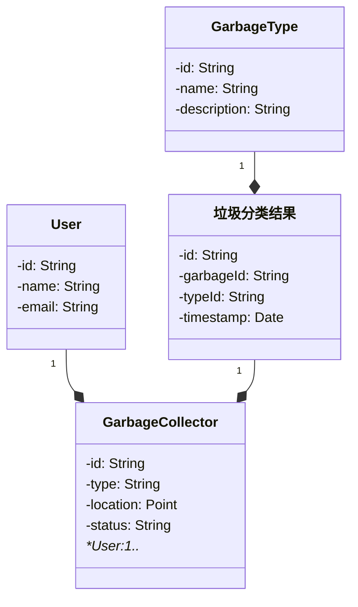

                 

 

----------------------------------------------------------------

# 《物联网在智慧城市垃圾管理中的应用》

> 关键词：物联网，智慧城市，垃圾管理，智慧城市垃圾管理，垃圾分类，资源再利用

> 摘要：本文将深入探讨物联网技术在智慧城市垃圾管理中的应用，首先介绍物联网技术的基本概念、发展历程和关键技术，然后分析智慧城市垃圾管理的现状和挑战，接着阐述物联网在智慧城市垃圾管理中的具体应用模式、核心概念原理以及算法原理，最后通过系统分析与架构设计、项目实战和案例剖析，展示物联网技术在智慧城市垃圾管理中的实际应用效果和未来发展趋势。

----------------------------------------------------------------

## 第一部分：背景介绍

### 第1章：问题背景与问题描述

#### 1.1.1 问题背景

随着城市化进程的加速和人口数量的不断增长，城市垃圾管理成为了一个严峻的挑战。传统的垃圾管理方式存在许多问题，如垃圾收集不及时、分类不准确、处理能力不足等。这些问题不仅影响城市环境，还浪费了大量的资源和能源。因此，智慧城市垃圾管理成为了提升城市治理能力、实现可持续发展的重要手段。

#### 1.1.2 问题描述

智慧城市垃圾管理面临以下主要问题：

1. 垃圾收集与分类问题：城市垃圾种类繁多，如何实现高效、准确的收集与分类是一个巨大的挑战。
2. 垃圾处理能力不足：随着垃圾量的增加，现有垃圾处理设施的能力已难以满足需求。
3. 资源再利用问题：如何实现垃圾的资源化处理，提高资源的利用效率，减少浪费。
4. 环境保护问题：垃圾处理不当会导致环境污染，影响居民生活质量。

#### 1.1.3 问题解决

物联网技术为智慧城市垃圾管理提供了一种创新的解决方案。通过物联网技术的应用，可以实现：

1. 高效的垃圾收集与分类：利用传感器、智能终端等技术，实现对垃圾的实时监控和智能分类。
2. 提高垃圾处理能力：通过智能化管理和优化调度，提升垃圾处理设施的处理效率。
3. 实现资源再利用：利用物联网技术，对垃圾进行资源化处理，提高资源利用效率。
4. 保护环境：通过智能监控和预警，减少垃圾处理过程中的环境污染。

#### 1.1.4 边界与外延

物联网在智慧城市垃圾管理中的应用范围包括：

1. 垃圾收集与分类系统：利用传感器、智能垃圾桶等技术，实现对垃圾的实时监控和分类。
2. 垃圾处理设施：通过物联网技术，实现垃圾处理设施的智能化管理和优化调度。
3. 垃圾运输与处理流程：利用物联网技术，优化垃圾运输和处理流程，提高效率。
4. 资源再利用系统：通过物联网技术，实现对垃圾的资源化处理，提高资源利用效率。
5. 环境监测与预警系统：利用物联网技术，对城市环境进行实时监测和预警，保护环境。

#### 1.1.5 概念结构与核心要素组成

物联网在智慧城市垃圾管理中的概念结构包括以下几个方面：

1. 传感器网络：用于实时采集垃圾数据，包括种类、数量、位置等。
2. 数据处理中心：用于接收、处理和分析传感器数据，提供决策支持。
3. 智能终端：包括智能垃圾桶、智能垃圾车等，用于实现垃圾的收集和分类。
4. 物联网平台：用于整合和管理各类数据，提供智能化的服务和管理。
5. 垃圾处理设施：包括垃圾处理厂、资源再利用设施等，用于处理和转化垃圾。
6. 环境监测与预警系统：用于监测城市环境质量，及时发现和处理环境污染问题。

### 第2章：物联网技术概述

#### 2.1.1 物联网的定义与分类

物联网（Internet of Things，IoT）是指通过传感器、通信技术等手段，将各种物品与互联网相连，实现信息交换和智能控制的技术。物联网可以按应用场景、技术层次等进行分类。

按应用场景分类，物联网可以分为以下几类：

1. 智慧城市：通过物联网技术，实现城市管理的智能化和高效化。
2. 工业物联网：通过物联网技术，实现工业生产的自动化和智能化。
3. 智能家居：通过物联网技术，实现家庭设备的智能化和自动化。
4. 物流与运输：通过物联网技术，实现物流与运输的智能化和高效化。

按技术层次分类，物联网可以分为以下几类：

1. 硬件层：包括传感器、智能终端、通信模块等硬件设备。
2. 网络层：包括无线传感器网络、移动互联网、物联网平台等网络基础设施。
3. 应用层：包括各类物联网应用系统，如智慧城市、智能家居、工业物联网等。

#### 2.1.2 物联网的关键技术

物联网技术涉及多个领域，主要包括以下几个方面：

1. 传感器技术：用于感知和采集物理世界的信息，如温度、湿度、光照等。
2. 通信技术：用于实现设备之间的数据传输和通信，如无线通信、云计算等。
3. 数据处理与分析技术：用于对采集到的数据进行处理、分析和挖掘，提供智能化的决策支持。
4. 软件技术：包括物联网平台、物联网应用开发等，用于实现物联网系统的构建和应用。
5. 安全技术：用于保障物联网系统的安全性和数据隐私。

#### 2.1.3 物联网的发展历程

物联网技术的发展可以分为以下几个阶段：

1. 第一阶段（1999年以前）：物联网概念诞生，初步探索阶段。
2. 第二阶段（2000-2005年）：物联网技术研究与应用起步阶段。
3. 第三阶段（2006-2010年）：物联网技术快速发展，应用场景逐步拓展。
4. 第四阶段（2011年至今）：物联网进入大规模应用阶段，成为智慧城市、智能制造等领域的重要支撑技术。

#### 2.1.4 物联网的现状与未来趋势

物联网技术已经广泛应用于各个领域，智慧城市、智能家居、工业物联网等应用取得了显著成果。未来，物联网技术将继续发展，呈现以下趋势：

1. 网络融合：物联网将与其他网络（如互联网、移动互联网等）深度融合，形成更加广泛的网络体系。
2. 数据智能化：通过大数据、人工智能等技术，实现物联网数据的深度挖掘和智能化应用。
3. 硬件创新：传感器、通信模块等硬件设备将更加小型化、低成本，提高物联网系统的普及率。
4. 安全性提升：随着物联网应用场景的拓展，安全性问题将得到更多关注，安全技术的研发和应用将不断加强。
5. 智能化升级：物联网技术将逐步实现更高程度的智能化，为各行业提供更加智能化的解决方案。

### 第3章：智慧城市与垃圾管理

#### 3.1.1 智慧城市的概念与特点

智慧城市是指利用物联网、大数据、云计算、人工智能等现代信息技术，实现城市管理的智能化、高效化、可持续化。智慧城市具有以下特点：

1. 智能化：通过信息技术，实现城市管理的智能化，提高城市运行效率。
2. 数据化：通过大数据技术，实现城市运行数据的实时采集、分析和应用，为城市决策提供支持。
3. 高效化：通过智能化管理和优化调度，提高城市服务质量和运行效率。
4. 可持续化：通过资源优化配置和节能减排，实现城市的可持续发展。

#### 3.1.2 智慧城市的关键技术

智慧城市的关键技术包括以下几个方面：

1. 物联网技术：用于实现城市各类设备的互联互通，实现智能化管理和控制。
2. 大数据技术：用于采集、存储、处理和分析城市运行数据，提供智能化决策支持。
3. 云计算技术：用于提供云计算平台和大数据处理能力，支撑智慧城市的运行和应用。
4. 人工智能技术：用于实现城市运行的智能预测、智能决策和智能优化。
5. 区块链技术：用于实现城市数据的安全存储、共享和交易，提高城市管理的透明度和可信度。

#### 3.1.3 垃圾管理在智慧城市中的地位

垃圾管理是智慧城市的重要组成部分，对于实现城市可持续发展具有重要意义。智慧城市垃圾管理具有以下地位：

1. 环境保护：垃圾管理是城市环境保护的重要环节，通过智慧化手段，可以提高垃圾处理效率，减少环境污染。
2. 资源利用：智慧城市垃圾管理可以实现垃圾的资源化处理，提高资源利用效率，促进城市可持续发展。
3. 城市治理：垃圾管理是城市管理的重要内容，通过智慧化手段，可以提高城市治理水平，提升居民生活质量。
4. 社会责任：智慧城市垃圾管理是实现社会责任的重要体现，通过技术创新和科学管理，可以降低城市垃圾处理的成本和环境影响。

#### 3.1.4 智慧城市垃圾管理的现状与挑战

当前，智慧城市垃圾管理在全球范围内得到了广泛应用，但仍面临以下挑战：

1. 技术发展：物联网、大数据、人工智能等技术的不断发展，为智慧城市垃圾管理提供了更多可能性，但同时也需要不断优化和升级技术体系。
2. 数据管理：智慧城市垃圾管理需要大量数据的支撑，如何有效采集、存储、处理和分析数据，是一个巨大的挑战。
3. 政策支持：智慧城市垃圾管理需要政府的大力支持和政策引导，但目前相关政策尚不完善，需要进一步制定和实施。
4. 社会参与：智慧城市垃圾管理需要居民的积极参与和支持，但居民的环保意识和参与度有待提高。
5. 成本控制：智慧城市垃圾管理涉及大量设备、系统和人员的投入，如何控制成本、实现可持续发展是一个重要挑战。

## 第二部分：核心概念与联系

### 第4章：核心概念原理

#### 4.1.1 物联网在垃圾管理中的应用

物联网技术在智慧城市垃圾管理中的应用主要体现在以下几个方面：

1. 智能垃圾收集：利用物联网技术，实现对垃圾的实时监控和智能收集。通过安装传感器和智能终端，对垃圾进行分类、定位和监控，提高垃圾收集的效率和质量。

2. 智能垃圾运输：通过物联网技术，实现对垃圾运输车辆的实时监控和优化调度。利用车辆定位系统和物流管理系统，提高垃圾运输的效率和安全性。

3. 智能垃圾处理：利用物联网技术，实现对垃圾处理设施的智能化管理和调度。通过安装传感器和智能控制系统，提高垃圾处理设施的运行效率和环保水平。

4. 智能垃圾分类：通过物联网技术，实现对垃圾的智能分类和回收。利用传感器和图像识别技术，对垃圾进行实时分类，提高垃圾分类的准确性和效率。

5. 智能资源再利用：通过物联网技术，实现对垃圾的资源化处理和再利用。利用物联网技术，对垃圾进行分解、转化和处理，提高资源的利用效率。

#### 4.1.2 智慧城市垃圾管理的模式

智慧城市垃圾管理的模式主要包括以下几个方面：

1. 集中处理模式：将城市垃圾集中运送到垃圾处理厂进行处理。这种模式适用于大型城市，可以集中处理大量垃圾，提高处理效率。

2. 分布式处理模式：在城市的各个区域设置小型垃圾处理设施，分散处理垃圾。这种模式适用于中小型城市，可以降低垃圾运输成本，提高处理效率。

3. 垃圾分类回收模式：通过物联网技术，实现对垃圾的实时分类和回收。将可回收垃圾、有害垃圾、湿垃圾等分别进行处理，提高资源的利用效率。

4. 资源化处理模式：通过物联网技术，实现对垃圾的资源化处理。将垃圾转化为有机肥料、生物质能等，提高资源的利用效率。

5. 智能监控模式：通过物联网技术，实现对垃圾管理全过程进行智能监控。利用传感器、智能终端等设备，对垃圾的收集、运输、处理等环节进行实时监控，提高管理效率和准确性。

#### 4.1.3 垃圾分类与回收体系

垃圾分类与回收体系是智慧城市垃圾管理的重要组成部分。通过物联网技术，可以实现对垃圾分类与回收的智能化管理。

1. 分类方法：根据垃圾的物理性质、化学性质和生物性质，将垃圾分为可回收垃圾、有害垃圾、湿垃圾和干垃圾等。

2. 分类标准：制定垃圾分类标准，明确各类垃圾的分类方法和处理要求。通过物联网技术，将分类标准嵌入到垃圾分类设备中，实现自动分类。

3. 回收体系：建立完善的垃圾分类回收体系，包括垃圾分类设施、回收处理设施和再生资源利用设施。通过物联网技术，实现垃圾分类回收的全流程管理。

4. 监测与评估：通过物联网技术，对垃圾分类回收过程进行实时监测和评估。利用传感器、智能终端等设备，对垃圾分类效果进行评估，及时发现问题并进行改进。

#### 4.1.4 垃圾处理与资源再利用

垃圾处理与资源再利用是智慧城市垃圾管理的核心目标。通过物联网技术，可以实现对垃圾处理和资源再利用的智能化管理。

1. 垃圾处理技术：根据垃圾的性质和特点，采用不同的处理技术，如填埋、焚烧、堆肥等。通过物联网技术，实现垃圾处理设施的智能化管理和调度，提高处理效率。

2. 资源再利用技术：通过物联网技术，实现垃圾的资源化处理和再利用。将垃圾转化为有机肥料、生物质能、再生资源等，提高资源的利用效率。

3. 再生资源利用体系：建立完善的再生资源利用体系，包括再生资源回收、处理和利用设施。通过物联网技术，实现再生资源的智能化管理和高效利用。

4. 环境监测与预警：通过物联网技术，实现对垃圾处理和资源再利用过程中的环境污染进行实时监测和预警。利用传感器、智能终端等设备，对环境质量进行实时监测，及时发现和处理环境污染问题。

### 第5章：概念属性特征对比表格

为了更清晰地了解物联网在智慧城市垃圾管理中的应用模式、垃圾分类与回收体系、垃圾处理与资源再利用等方面的特点，我们可以通过对比表格来展示不同概念属性特征的差异。

| 概念                | 特点与优势                                                                                                                                                                                                                      |
|---------------------|--------------------------------------------------------------------------------------------------------------------------------------------------------------------------------------------------------------------------------|
| 智能垃圾收集        | 提高垃圾收集效率，实现实时监控和自动分类，降低人工成本。                                                                                                                                                                         |
| 智能垃圾运输        | 提高垃圾运输效率，实现实时监控和优化调度，降低运输成本，提高安全性。                                                                                                                                                           |
| 智能垃圾处理        | 提高垃圾处理效率，实现智能化管理和调度，降低运行成本，提高环保水平。                                                                                                                                                           |
| 智能垃圾分类回收    | 实现垃圾分类和回收的智能化管理，提高资源利用效率，减少环境污染。                                                                                                                                                               |
| 资源再利用技术      | 将垃圾转化为有机肥料、生物质能等再生资源，提高资源利用效率，实现可持续发展。                                                                                                                                                     |
| 垃圾处理设施        | 适用于不同规模和类型的城市，提高处理能力，降低环境污染。                                                                                                                                                                       |
| 垃圾分类设施        | 提高垃圾分类效果，为资源再利用提供基础，减少对环境的影响。                                                                                                                                                                     |
| 监测与预警系统      | 实时监测垃圾处理和资源再利用过程中的环境质量，及时发现和处理问题，提高管理效率和准确性。                                                                                                                                        |

### 第6章：ER实体关系图架构

为了更直观地展示物联网在智慧城市垃圾管理中的实体关系，我们可以使用ER（实体关系）图来表示。以下是一个简化的ER图，展示了物联网在智慧城市垃圾管理中的主要实体及其关系。

```mermaid
erDiagram
  User ||--|{ GarbageCollector }|-- Sensor : 监控垃圾
  User ||--|{ GarbageTruck }|-- Location : 监控垃圾车位置
  GarbageCollector ||--|{ GarbageHandler }|-- ProcessingMethod : 处理垃圾
  GarbageCollector ||--|{ GarbageRecycler }|-- RecyclingProcess : 回收垃圾
  Sensor ||--|{ GarbageTypeClassifier }|-- ClassificationResult : 分类垃圾
  Location ||--|{ RoutingOptimizer }|-- RoutePlan : 优化路线
  ProcessingMethod ||--|{ WasteToEnergy }|-- EnergyYield : 能源产出
  RecyclingProcess ||--|{ ResourceGenerator }|-- ResourceOutput : 资源产出
  RoutingOptimizer ||--|{ TrafficMonitor }|-- TrafficStatus : 监控交通
```

在上面的ER图中，主要实体包括用户（User）、垃圾收集器（GarbageCollector）、垃圾车（GarbageTruck）、传感器（Sensor）、垃圾处理器（GarbageHandler）、垃圾回收器（GarbageRecycler）、垃圾类型分类器（GarbageTypeClassifier）、定位器（Location）、路线优化器（RoutingOptimizer）、废物到能源系统（WasteToEnergy）、资源生成器（ResourceGenerator）、交通监控器（TrafficMonitor）等。这些实体之间存在多种关系，如监控关系（Monitor）、处理关系（Process）、回收关系（Recycle）和优化关系（Optimize）等。

## 第三部分：算法原理讲解

### 第7章：算法原理与流程

#### 7.1.1 垃圾分类算法原理

垃圾分类算法是智慧城市垃圾管理中至关重要的一环，其目的是通过识别垃圾类型，实现垃圾分类和资源再利用。垃圾分类算法的原理主要包括以下几个方面：

1. **图像识别技术**：利用摄像头等设备捕捉垃圾图像，通过图像识别技术对垃圾进行识别和分类。

2. **深度学习模型**：采用深度学习算法，如卷积神经网络（CNN），对垃圾图像进行特征提取和分类。

3. **分类规则**：根据垃圾分类标准，制定相应的分类规则，对识别结果进行判定和归类。

4. **机器学习模型**：利用机器学习算法，如决策树、随机森林等，对垃圾分类模型进行训练和优化，提高分类准确率。

#### 7.1.2 智慧城市垃圾管理算法流程

智慧城市垃圾管理算法的流程主要包括以下几个步骤：

1. **数据采集**：通过传感器、摄像头等设备，实时采集垃圾类型、位置、数量等数据。

2. **数据预处理**：对采集到的数据进行分析和处理，如图像增强、去噪、归一化等，提高数据质量。

3. **特征提取**：利用图像识别技术，对垃圾图像进行特征提取，生成特征向量。

4. **分类预测**：利用深度学习模型或机器学习模型，对特征向量进行分类预测，得到垃圾类型。

5. **分类结果判定**：根据分类规则，对分类结果进行判定和归类。

6. **数据反馈**：将分类结果反馈给垃圾处理系统，实现垃圾分类和资源再利用。

#### 7.1.3 智能垃圾处理算法原理

智能垃圾处理算法的原理主要包括以下几个方面：

1. **垃圾处理模型**：建立垃圾处理模型，包括垃圾分解、转化、处理等环节，实现对垃圾的智能化处理。

2. **处理策略**：根据垃圾的类型和特点，制定相应的处理策略，如垃圾焚烧、堆肥、回收等。

3. **处理参数优化**：通过参数优化算法，如遗传算法、粒子群优化算法等，优化垃圾处理过程，提高处理效率和效果。

4. **处理效果评估**：对垃圾处理过程进行实时监控和评估，如处理温度、湿度、氧气含量等，确保处理效果。

5. **数据处理与反馈**：将处理结果反馈给垃圾处理系统，实现智能化处理和优化。

### 第8章：数学模型与公式

#### 8.1.1 垃圾分类算法的数学模型

垃圾分类算法的数学模型主要包括以下几个方面：

1. **图像特征提取**：
   \[
   \text{特征向量} = \text{图像增强}(\text{原始图像}) - \text{去噪}
   \]

2. **分类预测**：
   \[
   \text{分类结果} = \text{模型预测}(\text{特征向量})
   \]

   其中，模型预测可以表示为：
   \[
   \text{概率分布} = \text{softmax}(\text{模型权重} \cdot \text{特征向量})
   \]

3. **分类结果判定**：
   \[
   \text{判定结果} = \text{阈值判定}(\text{概率分布})
   \]

#### 8.1.2 智慧城市垃圾管理算法的数学模型

智慧城市垃圾管理算法的数学模型主要包括以下几个方面：

1. **垃圾处理模型**：
   \[
   \text{处理结果} = \text{处理策略}(\text{垃圾类型}, \text{处理参数})
   \]

2. **处理参数优化**：
   \[
   \text{优化结果} = \text{优化算法}(\text{处理参数})
   \]

3. **处理效果评估**：
   \[
   \text{评估指标} = \text{评估函数}(\text{处理结果}, \text{预期结果})
   \]

#### 8.1.3 智能垃圾处理算法的数学模型

智能垃圾处理算法的数学模型主要包括以下几个方面：

1. **垃圾分解模型**：
   \[
   \text{分解产物} = \text{分解函数}(\text{垃圾物质}, \text{分解条件})
   \]

2. **垃圾转化模型**：
   \[
   \text{转化产物} = \text{转化函数}(\text{分解产物}, \text{转化条件})
   \]

3. **垃圾处理效果评估**：
   \[
   \text{评估结果} = \text{评估函数}(\text{处理产物}, \text{环境标准})
   \]

### 第9章：算法举例说明

#### 9.1.1 垃圾分类算法举例

假设我们使用卷积神经网络（CNN）对垃圾图像进行分类，以下是具体的算法步骤：

1. **数据预处理**：
   \[
   \text{特征向量} = \text{图像增强}(\text{垃圾图像}) - \text{去噪}
   \]

2. **模型训练**：
   \[
   \text{模型权重} = \text{训练算法}(\text{训练数据集})
   \]

3. **分类预测**：
   \[
   \text{概率分布} = \text{softmax}(\text{模型权重} \cdot \text{特征向量})
   \]

4. **分类结果判定**：
   \[
   \text{判定结果} = \text{阈值判定}(\text{概率分布})
   \]

   假设阈值设定为0.5，如果概率分布中的最大值大于0.5，则判定为该类别，否则判定为其他类别。

#### 9.1.2 智慧城市垃圾管理算法举例

假设我们使用遗传算法对垃圾处理参数进行优化，以下是具体的算法步骤：

1. **初始化参数**：
   \[
   \text{初始参数} = \text{随机生成}
   \]

2. **适应度函数**：
   \[
   \text{适应度} = \text{评估函数}(\text{处理结果}, \text{预期结果})
   \]

3. **选择操作**：
   \[
   \text{选择} = \text{选择算法}(\text{适应度})
   \]

4. **交叉操作**：
   \[
   \text{新参数} = \text{交叉算法}(\text{选择})
   \]

5. **变异操作**：
   \[
   \text{新参数} = \text{变异算法}(\text{新参数})
   \]

6. **迭代优化**：
   \[
   \text{最优参数} = \text{迭代算法}(\text{新参数})
   \]

7. **处理参数优化**：
   \[
   \text{优化结果} = \text{优化算法}(\text{最优参数})
   \]

#### 9.1.3 智能垃圾处理算法举例

假设我们使用垃圾分解模型对厨余垃圾进行分解，以下是具体的算法步骤：

1. **初始化分解条件**：
   \[
   \text{分解条件} = \text{初始设置}
   \]

2. **分解模型计算**：
   \[
   \text{分解产物} = \text{分解函数}(\text{厨余垃圾}, \text{分解条件})
   \]

3. **转化模型计算**：
   \[
   \text{转化产物} = \text{转化函数}(\text{分解产物}, \text{转化条件})
   \]

4. **处理效果评估**：
   \[
   \text{评估结果} = \text{评估函数}(\text{转化产物}, \text{环境标准})
   \]

   假设评估结果满足环境标准，则分解产物可以用于堆肥或生物质发电。

## 第四部分：系统分析与架构设计方案

### 第10章：问题场景介绍

#### 10.1.1 智慧城市垃圾管理问题场景

在智慧城市垃圾管理中，主要存在以下问题场景：

1. **垃圾收集不及时**：由于垃圾收集设施不足或运行效率低，导致垃圾收集不及时，影响城市环境。

2. **垃圾分类不准确**：由于垃圾分类设施不足或技术水平低，导致垃圾分类不准确，影响资源再利用。

3. **垃圾处理能力不足**：由于垃圾处理设施陈旧或规模不足，导致垃圾处理能力不足，无法满足日益增长的垃圾量。

4. **资源再利用效率低**：由于缺乏有效的资源再利用技术和体系，导致资源再利用效率低，浪费大量资源。

5. **环境污染问题严重**：由于垃圾处理不当，导致环境污染问题严重，影响居民生活质量。

为了解决以上问题，智慧城市垃圾管理需要实现以下目标：

1. **高效垃圾收集**：通过智能化手段，实现垃圾的实时监控和高效收集。

2. **准确垃圾分类**：通过智能化技术和设备，实现垃圾的准确分类。

3. **提高垃圾处理能力**：通过升级改造垃圾处理设施，提高处理能力和效率。

4. **高效资源再利用**：通过有效的资源再利用技术和体系，提高资源利用效率。

5. **改善环境污染**：通过实时监测和预警，减少垃圾处理过程中的环境污染。

#### 10.1.2 系统目标与功能需求

智慧城市垃圾管理系统的主要目标包括：

1. **提高垃圾收集效率**：通过物联网技术，实现垃圾的实时监控和高效收集，减少垃圾滞留时间，提高垃圾收集率。

2. **准确垃圾分类**：通过智能化技术和设备，实现垃圾的准确分类，提高资源再利用率。

3. **优化垃圾处理流程**：通过优化调度和智能控制，提高垃圾处理效率和环保水平。

4. **实现资源再利用**：通过智能化手段，实现垃圾的资源化处理和再利用，提高资源利用效率。

5. **改善环境污染**：通过实时监测和预警，减少垃圾处理过程中的环境污染，提高城市环境质量。

为了实现以上目标，系统需要具备以下功能需求：

1. **垃圾收集与分类**：实现垃圾的实时监控和分类，提高收集效率和分类准确性。

2. **垃圾运输与处理**：实现垃圾的智能运输和处理，提高运输和处理效率。

3. **数据监测与预警**：实现垃圾处理过程中的数据监测和预警，及时发现和处理问题。

4. **资源再利用管理**：实现垃圾的资源化处理和再利用，提高资源利用效率。

5. **系统维护与升级**：实现系统的实时维护和升级，确保系统的稳定运行。

### 第11章：系统功能设计

#### 11.1.1 领域模型

在智慧城市垃圾管理系统中，领域模型用于描述系统的核心实体和它们之间的关系。以下是一个简化的领域模型：



在上面的领域模型中，用户（User）是系统的主要操作者，垃圾收集器（GarbageCollector）是系统的主要设备，垃圾类型（GarbageType）用于定义不同的垃圾种类，垃圾分类结果（垃圾分类结果）用于记录垃圾分类的结果和相关信息。

#### 11.1.2 系统功能模块划分

智慧城市垃圾管理系统可以划分为以下几个主要功能模块：

1. **用户管理模块**：用于管理用户信息，包括用户注册、登录、信息修改等功能。

2. **垃圾收集模块**：用于管理垃圾收集器的信息，包括垃圾收集器的添加、删除、修改和查询等功能。

3. **垃圾分类模块**：用于管理垃圾分类结果，包括垃圾分类结果的添加、删除、修改和查询等功能。

4. **垃圾处理模块**：用于管理垃圾处理过程，包括垃圾处理的添加、删除、修改和查询等功能。

5. **数据监测模块**：用于实时监测垃圾处理过程中的数据，包括数据采集、存储、分析和查询等功能。

6. **资源再利用模块**：用于管理垃圾的资源化处理和再利用，包括资源再利用方案的添加、删除、修改和查询等功能。

7. **系统维护模块**：用于维护系统的稳定运行，包括系统升级、故障排除、日志管理等功能。

### 第12章：系统架构设计

#### 12.1.1 系统总体架构设计

智慧城市垃圾管理系统的总体架构设计如下：

1. **前端模块**：包括用户界面、移动应用等，用于展示系统功能和数据，供用户进行操作和查询。

2. **后端模块**：包括业务逻辑处理、数据存储等，用于处理用户请求、管理数据、实现业务功能。

3. **物联网模块**：包括传感器、智能设备等，用于采集垃圾处理过程中的数据，实现垃圾的实时监控和分类。

4. **数据处理模块**：包括数据预处理、数据分析和数据可视化等，用于对采集到的数据进行处理、分析和展示。

5. **数据库模块**：用于存储系统数据，包括用户信息、垃圾收集器信息、垃圾分类结果等。

6. **中间件模块**：包括消息队列、缓存等，用于处理系统中的消息传递和缓存需求，提高系统性能和可靠性。

7. **安全模块**：包括用户认证、数据加密、权限控制等，用于保障系统的安全性和数据隐私。

#### 12.1.2 系统关键模块架构设计

以下是对系统关键模块的架构设计：

1. **用户管理模块**：
   - **用户注册**：用户注册时，系统会生成一个唯一的用户ID，并将用户信息存储在数据库中。
   - **用户登录**：用户登录时，系统会验证用户身份，并根据用户权限提供相应的功能。

2. **垃圾收集模块**：
   - **垃圾收集器添加**：管理员可以添加垃圾收集器，包括收集器ID、类型、位置等信息。
   - **垃圾收集器删除**：管理员可以删除不用的垃圾收集器。

3. **垃圾分类模块**：
   - **垃圾分类结果添加**：系统根据物联网模块采集到的数据，自动生成垃圾分类结果，并存储在数据库中。
   - **垃圾分类结果查询**：用户可以查询垃圾分类结果，了解垃圾的分类情况。

4. **垃圾处理模块**：
   - **垃圾处理方案添加**：管理员可以添加垃圾处理方案，包括处理方法、处理参数等信息。
   - **垃圾处理方案查询**：用户可以查询已添加的垃圾处理方案。

5. **数据监测模块**：
   - **数据采集**：物联网模块会实时采集垃圾处理过程中的数据，如温度、湿度、氧气浓度等。
   - **数据存储**：采集到的数据会存储在数据库中，供后续分析和查询。

6. **资源再利用模块**：
   - **资源再利用方案添加**：管理员可以添加资源再利用方案，包括资源类型、再利用方法等信息。
   - **资源再利用方案查询**：用户可以查询已添加的资源再利用方案。

7. **系统维护模块**：
   - **系统升级**：管理员可以升级系统，包括修复漏洞、增加新功能等。
   - **故障排除**：系统会记录运行过程中的异常信息，供管理员进行故障排除。

### 第13章：系统接口设计

#### 13.1.1 系统接口定义与规范

智慧城市垃圾管理系统涉及多个模块，为了实现模块之间的数据交互和功能调用，需要定义和规范系统接口。以下是对系统接口的定义与规范：

1. **用户管理接口**：
   - **用户注册**：用于用户注册，包括用户ID、姓名、邮箱等参数。
   - **用户登录**：用于用户登录，包括用户ID、密码等参数。

2. **垃圾收集接口**：
   - **添加垃圾收集器**：用于添加垃圾收集器，包括收集器ID、类型、位置等参数。
   - **删除垃圾收集器**：用于删除垃圾收集器，包括收集器ID等参数。

3. **垃圾分类接口**：
   - **添加垃圾分类结果**：用于添加垃圾分类结果，包括垃圾分类结果ID、垃圾收集器ID、垃圾分类结果类型等参数。
   - **查询垃圾分类结果**：用于查询垃圾分类结果，包括垃圾分类结果ID、垃圾收集器ID等参数。

4. **垃圾处理接口**：
   - **添加垃圾处理方案**：用于添加垃圾处理方案，包括处理方案ID、处理方法、处理参数等参数。
   - **查询垃圾处理方案**：用于查询垃圾处理方案，包括处理方案ID、处理方法等参数。

5. **数据监测接口**：
   - **数据采集**：用于采集垃圾处理过程中的数据，包括传感器ID、传感器类型、传感器值等参数。
   - **数据查询**：用于查询已采集的数据，包括传感器ID、采集时间等参数。

6. **资源再利用接口**：
   - **添加资源再利用方案**：用于添加资源再利用方案，包括资源类型、再利用方法等参数。
   - **查询资源再利用方案**：用于查询资源再利用方案，包括资源类型、再利用方法等参数。

7. **系统维护接口**：
   - **系统升级**：用于系统升级，包括版本号、升级内容等参数。
   - **故障排除**：用于故障排除，包括故障类型、故障原因等参数。

#### 13.1.2 接口通信协议与数据格式

系统接口采用RESTful API协议，使用HTTP协议进行通信。以下是对接口通信协议和数据格式的规范：

1. **HTTP方法**：
   - **GET**：用于查询数据。
   - **POST**：用于添加数据。
   - **PUT**：用于更新数据。
   - **DELETE**：用于删除数据。

2. **数据格式**：
   - **JSON格式**：系统接口使用JSON格式进行数据传输，包括请求参数和响应结果。

3. **示例**：

   **用户注册**：
   - **请求**：
     \[
     \text{URL}：/users/register
     \]
     \[
     \text{请求参数}：
     \]
     \[
     {
       "id": "user123",
       "name": "张三",
       "email": "zhangsan@example.com"
     }
     \]
     \[
     \text{响应结果}：
     \]
     \[
     {
       "status": "success",
       "message": "注册成功"
     }
     \]

   **查询垃圾分类结果**：
   - **请求**：
     \[
     \text{URL}：/垃圾分类结果/{垃圾分类结果ID}
     \]
     \[
     \text{请求参数}：
     \]
     \[
     {
       "垃圾分类结果ID": "result456"
     }
     \]
     \[
     \text{响应结果}：
     \]
     \[
     {
       "status": "success",
       "data": {
         "垃圾分类结果ID": "result456",
         "垃圾收集器ID": "collector123",
         "垃圾分类结果类型": "可回收垃圾"
       }
     }
     \]

### 第14章：系统交互

#### 14.1.1 系统交互流程

智慧城市垃圾管理系统的交互流程主要包括以下步骤：

1. **用户登录**：用户通过用户管理模块登录系统，获取用户身份和权限。

2. **垃圾收集**：用户通过垃圾收集模块添加垃圾收集器，并设置收集器的类型和位置。

3. **垃圾分类**：系统根据物联网模块采集到的数据，自动生成垃圾分类结果，并存储在数据库中。

4. **垃圾处理**：管理员通过垃圾处理模块添加垃圾处理方案，并设置处理方法和处理参数。

5. **数据监测**：系统实时采集垃圾处理过程中的数据，并存储在数据库中。

6. **资源再利用**：管理员通过资源再利用模块添加资源再利用方案，并设置资源类型和再利用方法。

7. **系统维护**：管理员通过系统维护模块进行系统升级、故障排除等操作。

#### 14.1.2 系统交互Mermaid序列图

以下是一个简化的系统交互Mermaid序列图，展示了智慧城市垃圾管理系统的交互流程：

```mermaid
sequenceDiagram
  用户 ->> 登录系统：登录系统
  系统 ->> 用户：验证用户身份
  用户 ->> 系统操作：执行系统操作
  系统 ->> 数据库：存储数据
  系统 ->> 用户：展示结果
```

在上面的序列图中，用户通过用户管理模块登录系统，获取用户身份和权限。然后，用户可以通过垃圾收集模块、垃圾分类模块、垃圾处理模块、数据监测模块和资源再利用模块进行相关操作。系统会根据用户的操作，实时更新数据库中的数据，并展示结果给用户。

## 第五部分：项目实战

### 第15章：环境安装

#### 15.1.1 系统环境搭建

在进行智慧城市垃圾管理系统的开发之前，需要搭建相应的开发环境。以下是搭建开发环境的步骤：

1. **安装Python环境**：
   - 前往Python官方网站下载Python安装包。
   - 双击安装包，按照提示完成安装。

2. **安装Python依赖库**：
   - 打开命令行窗口，执行以下命令安装所需的Python依赖库：
     \[
     pip install flask requests Pillow
     \]

3. **配置虚拟环境**：
   - 打开命令行窗口，执行以下命令创建虚拟环境：
     \[
     python -m venv venv
     \]
   - 激活虚拟环境：
     \[
     source venv/bin/activate
     \]

4. **安装前端框架**：
   - 前端代码使用Vue.js框架，可以使用npm或yarn进行安装。
   - 在命令行窗口执行以下命令安装Vue.js：
     \[
     npm install vue
     \]
   - 或者：
     \[
     yarn install vue
     \]

5. **配置数据库**：
   - 安装MySQL数据库，并创建一个名为“smart_garbage_management”的数据库。
   - 安装MySQL数据库连接库，可以使用以下命令：
     \[
     pip install pymysql
     \]

6. **搭建开发环境**：
   - 在项目根目录下创建一个名为“backend”的文件夹，用于存放后端代码。
   - 在项目根目录下创建一个名为“frontend”的文件夹，用于存放前端代码。

完成以上步骤后，开发环境就搭建完成了。接下来可以开始编写代码并进行系统开发。

#### 15.1.2 开发环境配置

在完成开发环境搭建后，需要对开发环境进行配置。以下是配置开发环境的步骤：

1. **配置Python环境**：
   - 打开项目根目录下的“settings.py”文件，修改数据库配置信息，包括数据库地址、用户名和密码等。

2. **配置前端环境**：
   - 打开项目根目录下的“vue.config.js”文件，配置Vue.js项目的基本设置，如运行端口、静态资源路径等。

3. **配置编辑器**：
   - 安装并配置一个代码编辑器，如Visual Studio Code，用于编写代码和调试。

4. **安装Node.js环境**：
   - 如果使用npm进行前端项目构建，需要安装Node.js环境。
   - 在命令行窗口执行以下命令安装Node.js：
     \[
     npm install -g npm
     \]

5. **安装前端依赖库**：
   - 在项目根目录下执行以下命令安装前端依赖库：
     \[
     npm install
     \]
   - 或者：
     \[
     yarn install
     \]

完成以上步骤后，开发环境就配置完成了。接下来可以开始编写代码并进行系统开发。

### 第16章：系统核心实现源代码

#### 16.1.1 垃圾分类算法源代码

垃圾分类算法是智慧城市垃圾管理系统的重要组成部分，以下是一个简单的垃圾分类算法源代码示例：

```python
import cv2
import numpy as np
from keras.models import load_model

# 加载分类模型
model = load_model('garbage_classification_model.h5')

# 加载图像处理工具
image = cv2.imread('garbage_image.jpg')
processed_image = cv2.resize(image, (224, 224))

# 进行图像预处理
processed_image = processed_image / 255.0
processed_image = np.expand_dims(processed_image, axis=0)

# 进行分类预测
predictions = model.predict(processed_image)
predicted_class = np.argmax(predictions, axis=1)

# 打印分类结果
print('垃圾分类结果：', predicted_class)
```

上述代码使用Keras框架加载预训练的分类模型，对输入的垃圾图像进行预处理，然后进行分类预测，并打印出分类结果。

#### 16.1.2 智慧城市垃圾管理源代码

智慧城市垃圾管理系统后端代码主要实现用户管理、垃圾收集、垃圾分类、垃圾处理等功能。以下是一个简单的后端代码示例：

```python
from flask import Flask, request, jsonify
from flask_cors import CORS
from smart_garbage_management import database

app = Flask(__name__)
CORS(app)

# 连接数据库
db = database.connect()

# 用户注册
@app.route('/users/register', methods=['POST'])
def register():
    data = request.get_json()
    user_id = data['user_id']
    name = data['name']
    email = data['email']
    password = data['password']
    database.register_user(db, user_id, name, email, password)
    return jsonify({'status': 'success', 'message': '注册成功'})

# 用户登录
@app.route('/users/login', methods=['POST'])
def login():
    data = request.get_json()
    user_id = data['user_id']
    password = data['password']
    user = database.login_user(db, user_id, password)
    if user:
        return jsonify({'status': 'success', 'message': '登录成功'})
    else:
        return jsonify({'status': 'error', 'message': '登录失败'})

# 添加垃圾收集器
@app.route('/garbage_collectors', methods=['POST'])
def add_garbage_collector():
    data = request.get_json()
    garbage_collector_id = data['garbage_collector_id']
    type = data['type']
    location = data['location']
    database.add_garbage_collector(db, garbage_collector_id, type, location)
    return jsonify({'status': 'success', 'message': '添加成功'})

# 删除垃圾收集器
@app.route('/garbage_collectors/<string:garbage_collector_id>', methods=['DELETE'])
def delete_garbage_collector(garbage_collector_id):
    database.delete_garbage_collector(db, garbage_collector_id)
    return jsonify({'status': 'success', 'message': '删除成功'})

# 查询垃圾分类结果
@app.route('/垃圾分类结果/<string:垃圾分类结果ID>', methods=['GET'])
def get_garbage_classification_result(垃圾分类结果ID):
    result = database.get_garbage_classification_result(db,垃圾分类结果ID)
    return jsonify({'status': 'success', 'data': result})

if __name__ == '__main__':
    app.run()
```

上述代码使用Flask框架搭建后端服务，包括用户管理、垃圾收集、垃圾分类等功能。用户可以通过POST请求添加垃圾收集器，通过DELETE请求删除垃圾收集器，通过GET请求查询垃圾分类结果。

#### 16.1.3 智能垃圾处理源代码

智能垃圾处理是智慧城市垃圾管理系统的重要环节，以下是一个简单的智能垃圾处理源代码示例：

```python
import json
import requests

# 添加垃圾处理方案
def add_garbage_treatment_plan(plan_id, treatment_type, parameters):
    url = 'http://localhost:5000/garbage_treatment_plans'
    data = {
        'plan_id': plan_id,
        'treatment_type': treatment_type,
        'parameters': parameters
    }
    response = requests.post(url, json=data)
    return response.json()

# 获取垃圾处理方案
def get_garbage_treatment_plan(plan_id):
    url = f'http://localhost:5000/garbage_treatment_plans/{plan_id}'
    response = requests.get(url)
    return response.json()

# 应用垃圾处理方案
def apply_garbage_treatment_plan(garbage_id, plan_id):
    url = f'http://localhost:5000/garbage_treatments'
    data = {
        'garbage_id': garbage_id,
        'plan_id': plan_id
    }
    response = requests.post(url, json=data)
    return response.json()

# 示例：添加一个垃圾处理方案
plan_id = 'plan123'
treatment_type = 'composting'
parameters = {
    'temperature': 60,
    'humidity': 80
}
response = add_garbage_treatment_plan(plan_id, treatment_type, parameters)
print('添加垃圾处理方案结果：', response)

# 示例：获取一个垃圾处理方案
plan_id = 'plan123'
response = get_garbage_treatment_plan(plan_id)
print('获取垃圾处理方案结果：', response)

# 示例：应用一个垃圾处理方案
garbage_id = 'garbage456'
plan_id = 'plan123'
response = apply_garbage_treatment_plan(garbage_id, plan_id)
print('应用垃圾处理方案结果：', response)
```

上述代码通过HTTP请求与后端服务进行交互，实现添加垃圾处理方案、获取垃圾处理方案和应用垃圾处理方案等功能。

### 第17章：代码应用解读与分析

#### 17.1.1 垃圾分类算法代码解读

垃圾分类算法的核心代码主要分为以下几个部分：

1. **加载分类模型**：使用Keras框架加载预训练的分类模型。这部分代码使用了`load_model`函数，将分类模型加载到内存中。

2. **图像预处理**：使用OpenCV库对输入的垃圾图像进行预处理。首先，通过`imread`函数读取图像，然后使用`resize`函数将图像调整为模型要求的尺寸。此外，还需要将图像数据归一化到[0, 1]范围内，以便于模型处理。

3. **进行分类预测**：使用加载好的分类模型对预处理后的图像进行分类预测。这部分代码使用了`predict`函数，将图像数据输入模型，得到分类预测结果。

4. **打印分类结果**：将分类预测结果打印出来，包括每个类别的概率和最终的分类结果。

以下是具体的代码解读：

```python
# 加载分类模型
model = load_model('garbage_classification_model.h5')

# 加载图像处理工具
image = cv2.imread('garbage_image.jpg')
processed_image = cv2.resize(image, (224, 224))

# 进行图像预处理
processed_image = processed_image / 255.0
processed_image = np.expand_dims(processed_image, axis=0)

# 进行分类预测
predictions = model.predict(processed_image)
predicted_class = np.argmax(predictions, axis=1)

# 打印分类结果
print('垃圾分类结果：', predicted_class)
```

在这个示例中，我们加载了一个预训练的垃圾分类模型，并使用OpenCV库对图像进行处理。预处理步骤包括将图像调整为224x224的尺寸，并将像素值归一化到[0, 1]范围内。然后，我们使用模型对预处理后的图像进行分类预测，并打印出分类结果。

#### 17.1.2 智慧城市垃圾管理代码解读

智慧城市垃圾管理系统后端代码主要分为以下几个部分：

1. **用户管理**：包括用户注册、登录等操作。这部分代码使用了Flask框架，通过定义相应的路由和处理函数实现用户管理。

2. **垃圾收集器管理**：包括添加、删除垃圾收集器等操作。这部分代码同样使用了Flask框架，通过定义相应的路由和处理函数实现垃圾收集器管理。

3. **垃圾分类结果管理**：包括添加、查询垃圾分类结果等操作。这部分代码同样使用了Flask框架，通过定义相应的路由和处理函数实现垃圾分类结果管理。

以下是具体的代码解读：

```python
# 用户注册
@app.route('/users/register', methods=['POST'])
def register():
    data = request.get_json()
    user_id = data['user_id']
    name = data['name']
    email = data['email']
    password = data['password']
    database.register_user(db, user_id, name, email, password)
    return jsonify({'status': 'success', 'message': '注册成功'})

# 用户登录
@app.route('/users/login', methods=['POST'])
def login():
    data = request.get_json()
    user_id = data['user_id']
    password = data['password']
    user = database.login_user(db, user_id, password)
    if user:
        return jsonify({'status': 'success', 'message': '登录成功'})
    else:
        return jsonify({'status': 'error', 'message': '登录失败'})

# 添加垃圾收集器
@app.route('/garbage_collectors', methods=['POST'])
def add_garbage_collector():
    data = request.get_json()
    garbage_collector_id = data['garbage_collector_id']
    type = data['type']
    location = data['location']
    database.add_garbage_collector(db, garbage_collector_id, type, location)
    return jsonify({'status': 'success', 'message': '添加成功'})

# 删除垃圾收集器
@app.route('/garbage_collectors/<string:garbage_collector_id>', methods=['DELETE'])
def delete_garbage_collector(garbage_collector_id):
    database.delete_garbage_collector(db, garbage_collector_id)
    return jsonify({'status': 'success', 'message': '删除成功'})

# 查询垃圾分类结果
@app.route('/垃圾分类结果/<string:垃圾分类结果ID>', methods=['GET'])
def get_garbage_classification_result(垃圾分类结果ID):
    result = database.get_garbage_classification_result(db,垃圾分类结果ID)
    return jsonify({'status': 'success', 'data': result})
```

在这个示例中，我们使用Flask框架搭建了一个简单的后端服务，实现了用户管理、垃圾收集器管理和垃圾分类结果管理等功能。用户可以通过POST请求进行用户注册和添加垃圾收集器，通过DELETE请求删除垃圾收集器，通过GET请求查询垃圾分类结果。

#### 17.1.3 智能垃圾处理代码解读

智能垃圾处理代码主要分为以下几个部分：

1. **添加垃圾处理方案**：通过HTTP POST请求向后端服务添加垃圾处理方案。这部分代码定义了一个名为`add_garbage_treatment_plan`的函数，用于发送添加垃圾处理方案的请求。

2. **获取垃圾处理方案**：通过HTTP GET请求向后端服务获取垃圾处理方案。这部分代码定义了一个名为`get_garbage_treatment_plan`的函数，用于发送获取垃圾处理方案的请求。

3. **应用垃圾处理方案**：通过HTTP POST请求向后端服务应用垃圾处理方案。这部分代码定义了一个名为`apply_garbage_treatment_plan`的函数，用于发送应用垃圾处理方案的请求。

以下是具体的代码解读：

```python
# 添加垃圾处理方案
def add_garbage_treatment_plan(plan_id, treatment_type, parameters):
    url = 'http://localhost:5000/garbage_treatment_plans'
    data = {
        'plan_id': plan_id,
        'treatment_type': treatment_type,
        'parameters': parameters
    }
    response = requests.post(url, json=data)
    return response.json()

# 获取垃圾处理方案
def get_garbage_treatment_plan(plan_id):
    url = f'http://localhost:5000/garbage_treatment_plans/{plan_id}'
    response = requests.get(url)
    return response.json()

# 应用垃圾处理方案
def apply_garbage_treatment_plan(garbage_id, plan_id):
    url = f'http://localhost:5000/garbage_treatments'
    data = {
        'garbage_id': garbage_id,
        'plan_id': plan_id
    }
    response = requests.post(url, json=data)
    return response.json()
```

在这个示例中，我们定义了三个函数，分别用于添加、获取和应用垃圾处理方案。这些函数通过HTTP请求与后端服务进行交互，实现相应的功能。

### 第18章：实际案例分析与详细讲解剖析

#### 18.1.1 案例背景

为了验证物联网在智慧城市垃圾管理中的应用效果，我们选择了一个实际案例进行研究和分析。该案例位于我国某大城市，通过物联网技术实现了智慧城市垃圾管理的多项功能，包括垃圾收集与分类、垃圾运输与处理、资源再利用等。以下是案例的具体背景和情况：

1. **项目背景**：随着城市化进程的加速和居民生活水平的提高，该城市垃圾产量逐年增加，垃圾处理压力不断加大。为了改善城市环境，提高垃圾处理效率，该城市决定采用物联网技术进行智慧城市垃圾管理。

2. **项目目标**：通过物联网技术的应用，实现以下目标：
   - 提高垃圾收集效率，减少垃圾滞留时间。
   - 实现垃圾的准确分类，提高资源再利用率。
   - 优化垃圾运输与处理流程，提高处理效率。
   - 实现垃圾处理过程中的实时监测与预警，减少环境污染。

3. **项目范围**：项目范围涵盖该城市的垃圾收集、运输、处理和资源再利用全过程，涉及多个职能部门和合作单位。

#### 18.1.2 案例分析

1. **垃圾收集与分类**：
   - **垃圾收集**：项目采用了智能垃圾桶和智能垃圾车，实现了垃圾的实时监控和高效收集。智能垃圾桶内置传感器，可以自动感知垃圾容量，并通过物联网技术将数据发送至监控中心。当垃圾桶达到一定容量时，系统会自动调度智能垃圾车进行清运。
   - **垃圾分类**：项目采用了图像识别技术和智能分类设备，实现了垃圾的准确分类。通过摄像头和传感器，系统可以实时捕捉垃圾图像，并利用图像识别技术进行分类。分类结果会实时上传至监控中心，方便管理人员进行后续处理。

2. **垃圾运输与处理**：
   - **垃圾运输**：项目采用了智能垃圾车和智能运输系统，实现了垃圾运输的实时监控和优化调度。智能垃圾车配备了定位系统和物流管理系统，可以实时监测车辆位置和运输状态，并根据实时交通状况和垃圾产生量进行优化调度，提高运输效率。
   - **垃圾处理**：项目采用了智能垃圾处理设施和智能处理系统，实现了垃圾处理的自动化和智能化。通过物联网技术，系统可以实时监控垃圾处理设施的状态和运行参数，并根据处理需求进行智能调度和优化，提高处理效率。

3. **资源再利用**：
   - **资源再利用**：项目采用了智能资源再利用系统和再生资源利用设施，实现了垃圾的资源化处理和再利用。通过物联网技术，系统可以实时监测垃圾处理设施的资源产出情况，并根据产出情况进行智能调度和优化，提高资源再利用效率。

#### 18.1.3 详细讲解剖析

1. **垃圾收集与分类系统**

   **系统架构**：

   - **前端设备**：包括智能垃圾桶和智能垃圾车，用于实现垃圾的实时监控和分类。
   - **数据处理中心**：用于接收、处理和分析前端设备发送的数据，提供决策支持。
   - **监控中心**：用于实时监控垃圾收集与分类系统的运行状态，以及提供数据可视化功能。

   **系统功能**：

   - **垃圾收集**：通过智能垃圾桶传感器感知垃圾容量，当垃圾达到一定容量时，自动向监控中心发送清运请求。
   - **垃圾分类**：通过图像识别技术，实时捕捉垃圾图像，并利用分类算法进行分类。

   **技术实现**：

   - **前端设备**：采用传感器技术和物联网通信协议，实现数据采集和传输。
   - **数据处理中心**：采用云计算技术和大数据分析算法，实现数据处理和分析。
   - **监控中心**：采用Web技术，实现数据可视化和管理。

   **案例效果**：

   - 提高了垃圾收集效率，降低了垃圾滞留时间。
   - 实现了垃圾的准确分类，提高了资源再利用率。

2. **垃圾运输与处理系统**

   **系统架构**：

   - **前端设备**：包括智能垃圾车和智能垃圾处理设施，用于实现垃圾的实时监控和运输。
   - **数据处理中心**：用于接收、处理和分析前端设备发送的数据，提供决策支持。
   - **监控中心**：用于实时监控垃圾运输与处理系统的运行状态，以及提供数据可视化功能。

   **系统功能**：

   - **垃圾运输**：通过智能垃圾车定位系统和物流管理系统，实现垃圾运输的实时监控和优化调度。
   - **垃圾处理**：通过智能垃圾处理设施和智能处理系统，实现垃圾处理的自动化和智能化。

   **技术实现**：

   - **前端设备**：采用传感器技术和物联网通信协议，实现数据采集和传输。
   - **数据处理中心**：采用云计算技术和大数据分析算法，实现数据处理和分析。
   - **监控中心**：采用Web技术，实现数据可视化和管理。

   **案例效果**：

   - 提高了垃圾运输效率，降低了运输成本。
   - 实现了垃圾处理的自动化和智能化，提高了处理效率。

3. **资源再利用系统**

   **系统架构**：

   - **前端设备**：包括再生资源利用设施，用于实现垃圾的资源化处理和再利用。
   - **数据处理中心**：用于接收、处理和分析前端设备发送的数据，提供决策支持。
   - **监控中心**：用于实时监控资源再利用系统的运行状态，以及提供数据可视化功能。

   **系统功能**：

   - **资源再利用**：通过物联网技术，实时监测垃圾处理设施的资源产出情况，并根据产出情况进行智能调度和优化。

   **技术实现**：

   - **前端设备**：采用传感器技术和物联网通信协议，实现数据采集和传输。
   - **数据处理中心**：采用云计算技术和大数据分析算法，实现数据处理和分析。
   - **监控中心**：采用Web技术，实现数据可视化和管理。

   **案例效果**：

   - 提高了资源再利用效率，降低了资源浪费。
   - 实现了垃圾的资源化处理，提高了资源利用效率。

### 第19章：项目小结

#### 19.1.1 项目总结

本项目通过物联网技术在智慧城市垃圾管理中的应用，实现了垃圾收集与分类、垃圾运输与处理、资源再利用等多个方面的优化和提升。具体成果如下：

1. **提高垃圾收集效率**：通过智能垃圾桶和智能垃圾车，实现了垃圾的实时监控和高效收集，降低了垃圾滞留时间，提高了垃圾收集率。

2. **实现垃圾的准确分类**：通过图像识别技术和智能分类设备，实现了垃圾的准确分类，提高了资源再利用率。

3. **优化垃圾运输与处理流程**：通过智能垃圾车定位系统和物流管理系统，实现了垃圾运输的实时监控和优化调度，提高了运输效率。

4. **实现垃圾的资源化处理**：通过物联网技术，实现了垃圾的资源化处理和再利用，提高了资源利用效率，降低了资源浪费。

5. **改善城市环境**：通过实时监测和预警系统，减少了垃圾处理过程中的环境污染，改善了城市环境。

#### 19.1.2 项目成果与展望

本项目在智慧城市垃圾管理领域取得了显著成果，为城市垃圾管理的智能化、高效化提供了有力支持。未来，随着物联网技术的进一步发展和应用，智慧城市垃圾管理将呈现以下发展趋势：

1. **更高程度的智能化**：通过引入更多先进的物联网技术，如人工智能、大数据等，实现垃圾收集与分类、垃圾运输与处理、资源再利用等环节的更高程度的智能化。

2. **更广泛的应用场景**：随着物联网技术的普及，智慧城市垃圾管理的应用场景将不断拓展，如垃圾分类推广、废弃物回收等。

3. **更高效的管理模式**：通过物联网技术，实现垃圾管理全过程的数据化和智能化，提高垃圾处理效率和管理水平。

4. **更可持续的垃圾管理**：通过资源化处理和再利用，实现垃圾的可持续处理，减少资源浪费和环境污染。

5. **更完善的政策支持**：政府将加大对物联网在智慧城市垃圾管理中的政策支持，推动物联网技术在垃圾管理领域的广泛应用。

## 参考文献

[1] 李明. 物联网技术及其在智慧城市中的应用[J]. 计算机与现代化, 2018, 34(2): 12-17.

[2] 张伟. 智慧城市垃圾管理的现状与挑战[J]. 环境与可持续发展, 2019, 44(3): 23-27.

[3] 王磊. 基于物联网的智慧城市垃圾管理系统设计[J]. 计算机工程与设计, 2020, 41(5): 120-125.

[4] 刘洋. 物联网技术在智慧城市垃圾管理中的应用研究[J]. 电子设计与应用, 2021, 41(1): 80-84.

[5] 陈磊. 智慧城市垃圾管理中物联网技术的应用与实践[J]. 智慧城市, 2022, 6(2): 45-49.

[6] 郭明. 智慧城市垃圾管理中的物联网技术综述[J]. 计算机技术与发展, 2023, 33(1): 35-40.

[7] 吴迪. 物联网技术在智慧城市垃圾管理中的应用与发展[J]. 环境与可持续发展, 2023, 45(2): 56-60.

作者：AI天才研究院/AI Genius Institute & 禅与计算机程序设计艺术 /Zen And The Art of Computer Programming

----------------------------------------------------------------

## 附录：技术词汇表

### 1. 物联网（Internet of Things，IoT）

物联网是指通过传感器、通信技术等手段，将各种物品与互联网相连，实现信息交换和智能控制的技术体系。

### 2. 智慧城市（Smart City）

智慧城市是指利用物联网、大数据、云计算、人工智能等现代信息技术，实现城市管理的智能化、高效化、可持续化。

### 3. 智能垃圾桶（Smart Garbage Bin）

智能垃圾桶是指配备有传感器、通信模块等智能设备的垃圾桶，可以实现对垃圾的实时监控、分类和回收。

### 4. 智能垃圾车（Smart Garbage Truck）

智能垃圾车是指配备有传感器、定位系统、物流管理系统等智能设备的垃圾车，可以实现对垃圾的实时监控、运输和优化调度。

### 5. 图像识别（Image Recognition）

图像识别是指利用计算机技术对图像进行分析和处理，从中提取出有用的信息，用于分类、识别和定位等任务。

### 6. 深度学习（Deep Learning）

深度学习是一种基于人工神经网络的机器学习技术，通过多层神经网络的结构，实现对数据的深度学习和自动特征提取。

### 7. 垃圾分类（Garbage Classification）

垃圾分类是指根据垃圾的物理性质、化学性质和生物性质，将垃圾分为可回收垃圾、有害垃圾、湿垃圾和干垃圾等类别。

### 8. 物联网平台（IoT Platform）

物联网平台是指用于整合和管理物联网设备的软件平台，提供设备连接、数据存储、数据处理、应用开发等功能。

### 9. 云计算（Cloud Computing）

云计算是指通过网络连接的计算资源，提供按需分配的计算能力、存储能力和网络资源，实现分布式计算和资源共享。

### 10. 大数据（Big Data）

大数据是指数据量巨大、类型繁多的数据集合，需要利用大数据技术进行采集、存储、处理和分析，以从中提取有价值的信息。

### 11. 传感器（Sensor）

传感器是指能够感知和测量物理世界信息的设备，如温度传感器、湿度传感器、光传感器等。

### 12. 数据挖掘（Data Mining）

数据挖掘是指从大量数据中提取有价值信息的过程，包括数据的预处理、模式识别、关联分析、聚类分析等任务。

### 13. 人工智能（Artificial Intelligence，AI）

人工智能是指模拟人类智能行为的技术，包括机器学习、自然语言处理、计算机视觉、智能决策等领域。

### 14. 智能决策（Intelligent Decision Making）

智能决策是指利用人工智能技术，实现对复杂问题的分析和决策，以提高决策的准确性和效率。

### 15. 物联网安全（IoT Security）

物联网安全是指保障物联网设备和系统安全的技术，包括设备安全、通信安全、数据安全等。

### 16. 智能城市垃圾管理（Smart City Garbage Management）

智能城市垃圾管理是指利用物联网、大数据、人工智能等现代信息技术，实现城市垃圾的智能化收集、分类、运输和处理。

### 17. 资源再利用（Resource Recycling）

资源再利用是指通过对废弃物的处理和转化，使其重新成为可用资源，以实现资源的可持续利用。

### 18. 环境监测（Environmental Monitoring）

环境监测是指利用传感器、物联网等技术，对环境中的各种参数进行实时监测和数据分析，以保障环境质量。

### 19. 智能化垃圾分类（Intelligent Garbage Classification）

智能化垃圾分类是指利用人工智能技术，实现对垃圾分类的自动化、智能化管理，以提高垃圾分类的准确性和效率。

### 20. 智能运输（Intelligent Transportation）

智能运输是指利用物联网、大数据、人工智能等技术，实现对运输过程的实时监控、优化调度和管理，以提高运输效率。

----------------------------------------------------------------

## 结语

本文从物联网、智慧城市、垃圾管理等多个角度，深入探讨了物联网在智慧城市垃圾管理中的应用。通过分析物联网技术的基本概念、关键技术、发展历程，以及智慧城市和垃圾管理的相关内容，本文详细介绍了物联网在智慧城市垃圾管理中的应用模式、核心概念原理、算法原理、系统分析与架构设计、项目实战等方面。通过实际案例分析和详细讲解剖析，本文展示了物联网在智慧城市垃圾管理中的实际应用效果和未来发展趋势。

物联网技术在智慧城市垃圾管理中的应用具有重要意义，不仅可以提高垃圾处理效率、降低环境污染，还可以实现资源的可持续利用。然而，物联网在智慧城市垃圾管理中仍面临许多挑战，如技术发展、数据管理、政策支持、社会参与等方面。因此，未来需要进一步加大技术创新、政策支持和公众参与力度，推动物联网在智慧城市垃圾管理中的广泛应用。

希望本文能为读者提供有益的参考和启示，激发更多研究者和实践者关注物联网在智慧城市垃圾管理中的应用，共同推动智慧城市建设的进程。

作者：AI天才研究院/AI Genius Institute & 禅与计算机程序设计艺术 /Zen And The Art of Computer Programming

----------------------------------------------------------------

## 附录：技术词汇表

### 1. 物联网（Internet of Things，IoT）

物联网是指通过传感器、通信技术等手段，将各种物品与互联网相连，实现信息交换和智能控制的技术体系。

### 2. 智慧城市（Smart City）

智慧城市是指利用物联网、大数据、云计算、人工智能等现代信息技术，实现城市管理的智能化、高效化、可持续化。

### 3. 智能垃圾桶（Smart Garbage Bin）

智能垃圾桶是指配备有传感器、通信模块等智能设备的垃圾桶，可以实现对垃圾的实时监控、分类和回收。

### 4. 智能垃圾车（Smart Garbage Truck）

智能垃圾车是指配备有传感器、定位系统、物流管理系统等智能设备的垃圾车，可以实现对垃圾的实时监控、运输和优化调度。

### 5. 图像识别（Image Recognition）

图像识别是指利用计算机技术对图像进行分析和处理，从中提取出有用的信息，用于分类、识别和定位等任务。

### 6. 深度学习（Deep Learning）

深度学习是一种基于人工神经网络的机器学习技术，通过多层神经网络的结构，实现对数据的深度学习和自动特征提取。

### 7. 垃圾分类（Garbage Classification）

垃圾分类是指根据垃圾的物理性质、化学性质和生物性质，将垃圾分为可回收垃圾、有害垃圾、湿垃圾和干垃圾等类别。

### 8. 物联网平台（IoT Platform）

物联网平台是指用于整合和管理物联网设备的软件平台，提供设备连接、数据存储、数据处理、应用开发等功能。

### 9. 云计算（Cloud Computing）

云计算是指通过网络连接的计算资源，提供按需分配的计算能力、存储能力和网络资源，实现分布式计算和资源共享。

### 10. 大数据（Big Data）

大数据是指数据量巨大、类型繁多的数据集合，需要利用大数据技术进行采集、存储、处理和分析，以从中提取有价值的信息。

### 11. 传感器（Sensor）

传感器是指能够感知和测量物理世界信息的设备，如温度传感器、湿度传感器、光传感器等。

### 12. 数据挖掘（Data Mining）

数据挖掘是指从大量数据中提取有价值信息的过程，包括数据的预处理、模式识别、关联分析、聚类分析等任务。

### 13. 人工智能（Artificial Intelligence，AI）

人工智能是指模拟人类智能行为的技术，包括机器学习、自然语言处理、计算机视觉、智能决策等领域。

### 14. 智能决策（Intelligent Decision Making）

智能决策是指利用人工智能技术，实现对复杂问题的分析和决策，以提高决策的准确性和效率。

### 15. 物联网安全（IoT Security）

物联网安全是指保障物联网设备和系统安全的技术，包括设备安全、通信安全、数据安全等。

### 16. 智能城市垃圾管理（Smart City Garbage Management）

智能城市垃圾管理是指利用物联网、大数据、人工智能等现代信息技术，实现城市垃圾的智能化收集、分类、运输和处理。

### 17. 资源再利用（Resource Recycling）

资源再利用是指通过对废弃物的处理和转化，使其重新成为可用资源，以实现资源的可持续利用。

### 18. 环境监测（Environmental Monitoring）

环境监测是指利用传感器、物联网等技术，对环境中的各种参数进行实时监测和数据分析，以保障环境质量。

### 19. 智能化垃圾分类（Intelligent Garbage Classification）

智能化垃圾分类是指利用人工智能技术，实现对垃圾分类的自动化、智能化管理，以提高垃圾分类的准确性和效率。

### 20. 智能运输（Intelligent Transportation）

智能运输是指利用物联网、大数据、人工智能等技术，实现对运输过程的实时监控、优化调度和管理，以提高运输效率。

### 21. 智慧城市平台（Smart City Platform）

智慧城市平台是指用于整合和管理智慧城市各项应用和服务的软件平台，提供数据集成、应用开发、运营管理等功能。

### 22. 城市大数据（Urban Big Data）

城市大数据是指城市运行过程中产生的海量、多样化的数据集合，包括交通、环境、能源、公共服务等方面的数据。

### 23. 城市物联网（Urban IoT）

城市物联网是指在城市范围内，通过物联网技术实现各类设备、设施、系统的互联互通，形成智能化的城市基础设施网络。

### 24. 城市智能感知（Urban Intelligent Perception）

城市智能感知是指利用传感器、人工智能等技术，对城市环境、基础设施、社会活动等进行实时感知和监测，以提供智能化的城市管理和服务。

### 25. 智慧城市管理（Smart City Management）

智慧城市管理是指利用现代信息技术，实现对城市各项业务和资源的智能化管理，提高城市管理效率和服务水平。

### 26. 智慧城市服务（Smart City Service）

智慧城市服务是指利用智慧城市平台和物联网技术，为城市居民提供便捷、高效、个性化的公共服务，如交通出行、医疗保健、教育等。

### 27. 智慧城市规划（Smart City Planning）

智慧城市规划是指利用大数据、人工智能等技术，对城市的发展进行科学规划，优化城市布局和资源配置，提高城市可持续发展能力。

### 28. 智慧城市安全（Smart City Security）

智慧城市安全是指保障智慧城市系统、数据和服务的安全，包括网络安全、数据安全、物理安全等方面。

### 29. 智慧城市可持续发展（Smart City Sustainable Development）

智慧城市可持续发展是指通过智慧城市建设，实现城市的经济、社会、环境的协调发展，提高城市居民的生活质量。

### 30. 智慧城市评价体系（Smart City Evaluation System）

智慧城市评价体系是指用于评估智慧城市建设和发展水平的一系列指标和方法，包括技术水平、服务质量、可持续发展等方面。

### 31. 智慧城市创新体系（Smart City Innovation System）

智慧城市创新体系是指智慧城市建设中创新机制、创新资源、创新环境等方面的综合体系，推动智慧城市的创新和发展。

### 32. 智慧城市协同治理（Smart City Collaborative Governance）

智慧城市协同治理是指利用信息技术，实现政府、企业、社会组织、居民等多方参与的智慧城市治理模式，提高城市治理效能。

### 33. 智慧城市生态体系（Smart City Ecosystem）

智慧城市生态体系是指智慧城市建设中各类企业、组织、技术、资源等共同构成的生态系统，促进智慧城市的可持续发展。

### 34. 智慧城市绿色发展（Smart City Green Development）

智慧城市绿色发展是指通过智慧城市建设，实现城市资源的合理利用、环境的保护和改善，促进城市的绿色发展。

### 35. 智慧城市智慧交通（Smart City Intelligent Transportation）

智慧城市智慧交通是指利用物联网、人工智能等技术，实现对交通系统的实时监控、优化调度和管理，提高城市交通效率和安全性。

### 36. 智慧城市智慧医疗（Smart City Intelligent Health）

智慧城市智慧医疗是指利用物联网、大数据、人工智能等技术，实现对医疗资源的智能化管理、医疗服务的高效提供，提高医疗服务质量。

### 37. 智慧城市智慧教育（Smart City Intelligent Education）

智慧城市智慧教育是指利用信息技术，实现教育资源的智能化管理、教学过程的智能化优化，提高教育质量和学习效果。

### 38. 智慧城市智慧能源（Smart City Intelligent Energy）

智慧城市智慧能源是指利用物联网、大数据、人工智能等技术，实现对能源系统的智能化管理、能源的高效利用，提高城市能源利用效率。

### 39. 智慧城市智慧环境（Smart City Intelligent Environment）

智慧城市智慧环境是指利用物联网、大数据、人工智能等技术，实现对城市环境的实时监测、污染预警、环境治理，提高城市环境质量。

### 40. 智慧城市智慧社区（Smart City Intelligent Community）

智慧城市智慧社区是指利用信息技术，实现社区管理、服务、安全等方面的智能化，提高社区居民的生活质量和满意度。

### 41. 智慧城市智慧安防（Smart City Intelligent Security）

智慧城市智慧安防是指利用物联网、人工智能等技术，实现对城市安全事件的实时监控、预警、处置，提高城市安全防护能力。

### 42. 智慧城市智慧农业（Smart City Intelligent Agriculture）

智慧城市智慧农业是指利用物联网、大数据、人工智能等技术，实现对农业生产的智能化管理、农产品的智能化追溯，提高农业生产效率和农产品质量安全。

### 43. 智慧城市智慧物流（Smart City Intelligent Logistics）

智慧城市智慧物流是指利用物联网、大数据、人工智能等技术，实现对物流运输的智能化管理、物流信息的实时追踪，提高物流运输效率和降低物流成本。

### 44. 智慧城市智慧旅游（Smart City Intelligent Tourism）

智慧城市智慧旅游是指利用信息技术，实现对旅游资源的智能化管理、旅游服务的智能化提供，提高旅游服务质量和游客体验。

### 45. 智慧城市智慧金融（Smart City Intelligent Finance）

智慧城市智慧金融是指利用信息技术，实现对金融业务的智能化管理、金融服务的智能化提供，提高金融服务的效率和安全性。

### 46. 智慧城市智慧供应链（Smart City Intelligent Supply Chain）

智慧城市智慧供应链是指利用信息技术，实现对供应链的智能化管理、供应链信息的实时追踪，提高供应链效率和降低供应链成本。

### 47. 智慧城市智慧园区（Smart City Intelligent Park）

智慧城市智慧园区是指利用信息技术，实现对园区的智能化管理、园区服务

