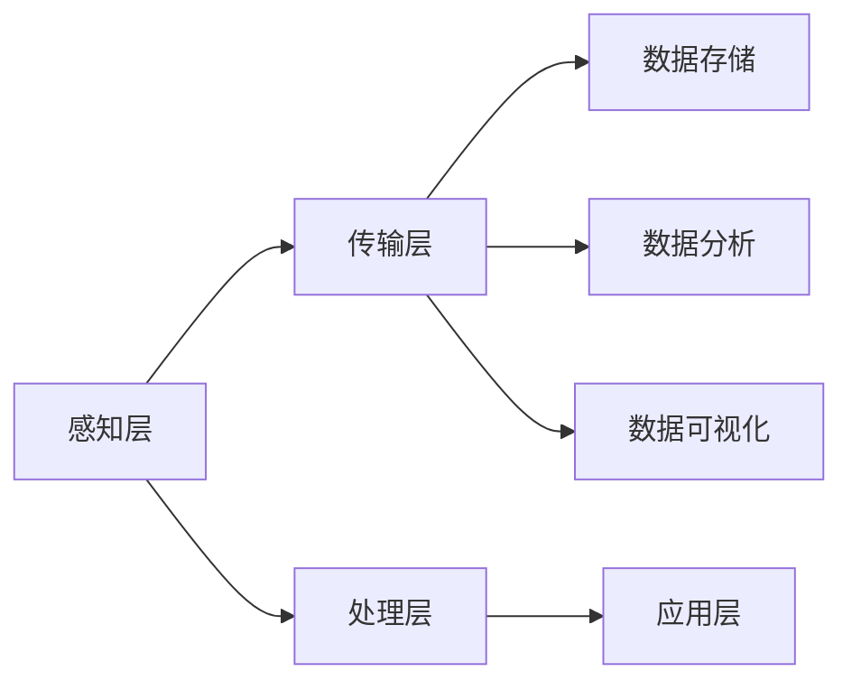
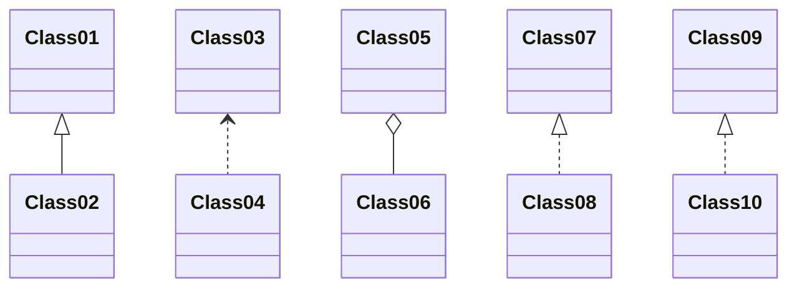

                 

### 引言

#### 1.1 研究背景

物联网（Internet of Things，简称IoT）作为近年来信息技术领域的重要突破，已经深刻改变了人类生活的方方面面。从智能家居、智能交通，到工业物联网（IIoT），物联网技术在各个领域的应用不断拓展。与此同时，智慧畜牧业作为现代信息技术与农业产业深度融合的产物，也逐渐成为农业发展的新趋势。

**物联网技术发展现状：**
物联网技术的发展始于20世纪80年代，随着无线通信、传感器技术、云计算和大数据技术的不断成熟，物联网已经从概念走向实际应用。根据国际数据公司（IDC）的报告，全球物联网设备数量已经超过100亿台，并且预计在未来几年内将继续保持快速增长。

**智慧畜牧业的重要性：**
智慧畜牧业是利用物联网、大数据、人工智能等现代信息技术，实现对畜牧业全过程的智能化管理。随着畜牧业规模化、集约化发展，传统的人工管理方式已经难以满足需求。智慧畜牧业可以提高养殖效率、降低成本、保障畜产品安全，具有重要的经济和社会价值。

**物联网在智慧畜牧业中的应用现状与挑战：**
当前，物联网在智慧畜牧业中已有一定应用，如智能饲喂系统、环境监测系统和疫病预警系统等。然而，在实际应用中仍然面临诸多挑战，包括数据采集的准确性、数据传输的可靠性、系统的安全性和易用性等。这些问题需要通过技术创新和系统集成来解决。

综上所述，本研究旨在探讨物联网在智慧畜牧业健康监测中的应用，分析其关键问题，提出解决方案，为智慧畜牧业的健康发展提供技术支持。

#### 1.2 研究问题

**物联网在智慧畜牧业健康监测中的关键问题：**
1. **数据采集的准确性：** 如何确保从动物体、环境等获取的数据真实可靠？
2. **数据传输的可靠性：** 如何保证数据在传输过程中不丢失、不延迟？
3. **数据处理的效率：** 如何高效处理大量来自不同传感器的数据？
4. **系统安全性：** 如何确保数据安全和用户隐私？
5. **用户友好性：** 如何设计易于操作和维护的系统？

**如何利用物联网技术实现精准健康监测：**
1. **传感器选择与优化：** 根据监测需求选择合适的传感器，并进行优化设计。
2. **数据采集与传输协议：** 选择高效、可靠的数据采集与传输协议，确保数据实时性。
3. **数据处理与分析技术：** 利用大数据分析和人工智能技术，提高数据处理的效率和准确性。
4. **系统集成与优化：** 构建集成化、智能化的健康监测系统，实现数据的联动与智能分析。

#### 1.3 研究目标与边界

**研究目标：**
1. 深入分析物联网在智慧畜牧业健康监测中的应用价值。
2. 探讨物联网技术在数据采集、传输、处理、分析和系统安全性等方面的关键问题。
3. 提出解决方案，优化物联网在畜牧业健康监测中的应用。

**研究边界：**
1. 研究主要针对畜牧业健康监测领域，不包括其他农业应用。
2. 重点探讨物联网在畜牧业中的应用，不涉及其他信息技术在畜牧业的应用。
3. 研究基于现有技术和实际案例，不涉及未来技术预测。

**核心概念与联系：**
1. **物联网：** 物联网是通过网络连接的物理设备和传感器，实现智能交互和信息共享的技术体系。
2. **智慧畜牧业：** 智慧畜牧业是利用物联网、大数据、人工智能等信息技术实现畜牧业智能化管理的产业模式。
3. **健康监测：** 健康监测是通过传感器等技术手段，实时采集动物健康数据，进行数据分析和预警。

通过本文的研究，旨在为智慧畜牧业健康监测提供理论依据和实践指导，推动物联网技术在畜牧业领域的深入应用。

## 目录大纲

### 《物联网在智慧畜牧业健康监测中的应用》

#### 关键词：
- 物联网
- 智慧畜牧业
- 健康监测
- 传感器
- 数据分析

#### 摘要：
本文探讨了物联网在智慧畜牧业健康监测中的应用。通过分析物联网技术的基础、智慧畜牧业的发展现状，以及物联网在健康监测中的具体应用，本文提出了物联网在畜牧业健康监测中的关键技术，并详细描述了系统设计与实现过程。最后，通过实际项目案例进行了分析与总结，展望了物联网在智慧畜牧业健康监测中的未来发展方向。

### 目录大纲

#### 第1章 引言

1.1 研究背景
1.2 研究问题
1.3 研究目标与边界

#### 第2章 物联网技术基础

2.1 物联网概念与体系结构
2.2 物联网设备
2.3 物联网通信协议

#### 第3章 智慧畜牧业概述

3.1 智慧畜牧业的概念与特征
3.2 智慧畜牧业的发展现状与趋势
3.3 我国智慧畜牧业发展现状与展望

#### 第4章 物联网在畜牧业健康监测中的应用

4.1 物联网在畜牧业健康监测中的作用
4.2 物联网在畜牧业健康监测中的应用实例
4.3 物联网在畜牧业健康监测中的应用挑战与解决方案

#### 第5章 物联网在畜牧业健康监测中的关键技术

5.1 传感器技术
5.2 数据采集与传输技术
5.3 数据处理与分析技术

#### 第6章 智慧畜牧业健康监测系统设计与实现

6.1 系统需求分析与设计
6.2 系统实现
6.3 系统部署与维护

#### 第7章 项目实战

7.1 项目背景
7.2 系统设计与实现
7.3 实际案例分析与讲解
7.4 项目小结

#### 第8章 结论与展望

8.1 研究结论
8.2 未来展望

通过上述目录大纲，本文将系统地介绍物联网在智慧畜牧业健康监测中的应用，深入分析其中的关键技术，并通过项目实战案例展示其实际应用效果，旨在为推动物联网技术在畜牧业健康监测领域的应用提供参考。

### 第1章 引言

#### 1.1 研究背景

物联网（Internet of Things，简称IoT）是近年来信息技术领域的重要突破，通过将各种物体接入互联网，实现信息的实时采集、传输和智能处理。随着传感器技术、无线通信技术和大数据分析技术的快速发展，物联网应用逐渐从智能家居、智能交通扩展到工业、农业等多个领域。在农业领域，物联网技术的应用不仅提高了生产效率，还有效地提升了农产品的质量和安全。

智慧畜牧业作为现代农业的重要组成部分，是指利用物联网、大数据、云计算、人工智能等现代信息技术，对畜牧业进行智能化管理和优化。智慧畜牧业通过实时监测动物健康、优化饲养管理、提高生产效率，显著提升了畜牧业的整体水平。因此，研究物联网在智慧畜牧业健康监测中的应用具有重要意义。

物联网技术发展现状：物联网技术已经经历了从初级阶段到成熟应用的快速发展。目前，全球物联网设备数量已超过100亿台，预计到2025年，这一数字将增长到数百亿台。物联网技术在智能家居、智能交通、智能医疗、工业物联网等多个领域取得了显著成果，为各行业的智能化升级提供了强有力的支持。

智慧畜牧业的重要性：畜牧业是农业的重要组成部分，关系到国计民生。传统的畜牧业管理方式主要依赖人工，效率低下，难以实现精准管理。而智慧畜牧业通过物联网技术，可以实现养殖环境的实时监测、动物健康状况的智能分析、饲料和药品的精准投放等，从而提高养殖效率，降低生产成本，提升畜产品质量和安全性。

物联网在智慧畜牧业中的应用现状与挑战：目前，物联网在智慧畜牧业中已有一定应用，如智能饲喂系统、环境监测系统和疫病预警系统等。然而，实际应用中仍然面临一些挑战，包括数据采集准确性不高、数据传输可靠性不足、系统安全性问题等。这些问题的解决需要进一步的技术创新和应用优化。

#### 1.2 研究问题

物联网在智慧畜牧业健康监测中的关键问题主要包括以下几个方面：

1. **数据采集的准确性：** 如何确保从动物体、环境等获取的数据真实可靠，是物联网在智慧畜牧业健康监测中面临的首要问题。数据采集的准确性直接关系到监测结果的准确性，从而影响养殖决策的可靠性。

2. **数据传输的可靠性：** 物联网设备通常分布在广阔的养殖区域，如何保证数据在传输过程中不丢失、不延迟，是另一个重要问题。数据传输的可靠性直接关系到监测系统的实时性和有效性。

3. **数据处理的效率：** 畜牧业健康监测需要实时处理大量的数据，如何高效处理这些数据，是物联网技术在智慧畜牧业健康监测中面临的挑战之一。高效的数据处理技术可以提高监测系统的性能和可靠性。

4. **系统安全性：** 系统安全性是物联网在智慧畜牧业健康监测中不可忽视的问题。如何保护数据安全，防止数据泄露和非法访问，是系统设计和实现过程中必须考虑的关键因素。

5. **用户友好性：** 系统的用户友好性直接影响到用户的使用体验。如何设计易于操作和维护的系统，提高用户的满意度，是物联网在智慧畜牧业健康监测中需要解决的问题。

#### 1.3 研究目标与边界

**研究目标：**
本研究旨在深入探讨物联网在智慧畜牧业健康监测中的应用，具体目标包括：

1. **分析物联网在智慧畜牧业健康监测中的应用价值，明确其在畜牧业中的作用和地位。**
2. **探讨物联网在数据采集、传输、处理、分析和系统安全性等方面的关键技术，提出解决方案。**
3. **通过实际项目案例，展示物联网在智慧畜牧业健康监测中的具体应用效果，为畜牧业提供技术支持。**

**研究边界：**
1. **研究范围：** 本研究主要关注物联网在智慧畜牧业健康监测中的应用，不包括其他农业应用领域。
2. **技术范畴：** 本研究主要探讨物联网技术在智慧畜牧业健康监测中的应用，不涉及其他信息技术在畜牧业中的应用。
3. **时间范围：** 本研究基于现有技术和实际案例进行分析，不涉及未来技术的预测。

**核心概念与联系：**
1. **物联网：** 通过网络连接的物理设备和传感器，实现智能交互和信息共享的技术体系。
2. **智慧畜牧业：** 利用物联网、大数据、云计算、人工智能等现代信息技术，实现畜牧业智能化管理和优化的产业模式。
3. **健康监测：** 通过传感器等技术手段，实时采集动物健康数据，进行数据分析和预警。

通过本文的研究，旨在为物联网在智慧畜牧业健康监测中的应用提供理论依据和实践指导，推动物联网技术在畜牧业领域的深入应用。

### 第2章 物联网技术基础

#### 2.1 物联网概念与体系结构

物联网是指通过互联网、通信技术和各种智能设备，将物理世界中的各种实体连接起来，实现智能感知、识别和管理的一种技术体系。物联网的基本概念可以简单概括为：连接、感知、交互和智能。

**物联网的定义：** 物联网是一种基于互联网、传统通信网络等信息载体，实现智能设备之间互联互通的网络。通过传感器、RFID（射频识别）等设备，将物理世界中的各种对象（如人、物、环境等）连接起来，形成一个大型的智能网络。

**物联网的体系结构：** 物联网的体系结构一般包括感知层、网络层和应用层三个部分。

1. **感知层：** 感知层是物联网体系结构的最底层，主要负责数据的采集。感知层设备包括各种传感器、RFID标签、条码扫描器等，能够实时感知环境中的各种物理量，如温度、湿度、光照强度、压力、速度等，并将这些物理量转换为数字信号。

2. **网络层：** 网络层负责数据的传输，包括有线和无线网络。网络层将感知层采集到的数据传输到处理中心，同时负责数据的加密、压缩和路由等功能。常见的网络层技术有Wi-Fi、蓝牙、Zigbee、LoRa等。

3. **应用层：** 应用层是物联网体系结构的最顶层，负责数据处理和业务应用。应用层通过各种应用软件，实现对数据的存储、分析和处理，并提供相应的业务服务。常见的应用层技术包括云计算、大数据分析、人工智能等。

**物联网的关键技术：**

1. **传感器技术：** 传感器技术是物联网的基础，用于感知和采集环境中的各种物理量。传感器技术的发展为物联网提供了丰富的数据源。

2. **网络通信技术：** 网络通信技术是物联网数据传输的关键，决定了数据传输的速度和可靠性。常见的网络通信技术有Wi-Fi、蓝牙、Zigbee、LoRa、NB-IoT等。

3. **数据处理技术：** 数据处理技术是物联网的核心，通过对采集到的数据进行存储、分析和处理，实现对物理世界的智能感知和管理。常见的数据处理技术有云计算、大数据分析、人工智能等。

4. **数据安全与隐私保护技术：** 随着物联网应用的普及，数据安全和隐私保护成为重要问题。数据安全与隐私保护技术包括加密、认证、访问控制等。

#### 2.2 物联网设备

物联网设备是物联网体系结构中的重要组成部分，主要包括传感器设备、网关设备、智能终端设备等。

**传感器设备：** 传感器设备是物联网数据采集的基础，包括各种温度传感器、湿度传感器、光照传感器、压力传感器、速度传感器等。这些传感器能够实时感知环境中的各种物理量，并将这些物理量转换为电信号或其他形式的信号，传输给网关设备或智能终端设备。

**网关设备：** 网关设备是物联网体系结构中的关键设备，主要负责数据的传输、路由和协议转换等功能。网关设备通常连接多个传感器和智能终端设备，将采集到的数据传输到云端或其他数据处理平台。

**智能终端设备：** 智能终端设备是物联网用户操作的重要工具，包括智能手机、平板电脑、智能手表、智能眼镜等。智能终端设备可以通过网络连接到物联网平台，实时获取和处理物联网数据，实现人机交互和智能控制。

**设备选型与设计：**

1. **选型原则：** 在选择物联网设备时，需要考虑设备的性能、功耗、价格、兼容性等因素。根据应用场景和需求，选择合适的设备。

2. **设计要点：** 设备设计需要考虑以下几个方面：传感器的灵敏度、功耗、抗干扰能力；通信模块的传输距离、速率、稳定性；设备的防水、防尘、抗冲击能力；设备的功耗和续航能力。

#### 2.3 物联网通信协议

物联网通信协议是物联网设备之间进行数据传输和通信的规范。常见的物联网通信协议有Wi-Fi、蓝牙、Zigbee、LoRa、NB-IoT等。

**Wi-Fi：** Wi-Fi是一种无线局域网技术，广泛用于物联网设备的无线通信。Wi-Fi通信具有高速率、高带宽、强抗干扰能力等特点，适用于需要高数据传输速度和稳定性的场景。

**蓝牙：** 蓝牙是一种短距离无线通信技术，广泛应用于智能家居、智能穿戴设备等领域。蓝牙通信具有低功耗、低成本、易扩展等特点，适用于低速率、短距离的数据传输。

**Zigbee：** Zigbee是一种低功耗、低速率的无线通信协议，广泛用于智能家居、智能照明、智能安防等领域。Zigbee通信具有低功耗、高安全性和良好的网络拓扑结构等特点。

**LoRa：** LoRa是一种低功耗、长距离的无线通信技术，适用于远程监控、智能农业等领域。LoRa通信具有低功耗、长距离、大容量、高可靠性等特点。

**NB-IoT：** NB-IoT是一种低功耗广域网技术，适用于物联网设备的大规模部署。NB-IoT具有低功耗、广覆盖、高带宽、高可靠性等特点，适用于智能抄表、智能水务、智能畜牧等领域。

**通信协议选型与优化：**

1. **选型原则：** 在选择物联网通信协议时，需要考虑通信距离、传输速率、功耗、成本、安全性等因素。根据应用场景和需求，选择合适的通信协议。

2. **优化策略：** 为了提高物联网通信的性能和可靠性，可以采取以下优化策略：优化通信协议参数，如数据包大小、传输速率、重传机制等；采用多路径传输和负载均衡技术，提高通信的稳定性和带宽利用率；采用加密和认证技术，保证数据的安全性和隐私性。

通过了解物联网技术基础，可以为后续章节中物联网在智慧畜牧业健康监测中的应用提供理论基础和技术指导。

### 第3章 智慧畜牧业概述

#### 3.1 智慧畜牧业的概念与特征

智慧畜牧业是指利用物联网、大数据、云计算、人工智能等现代信息技术，对畜牧业进行智能化管理和优化。智慧畜牧业通过传感器、无线通信、数据处理等技术，实现对养殖环境的实时监测、动物健康状况的智能分析、饲料和药品的精准投放等，从而提高养殖效率，降低成本，提升畜产品质量和安全性。

**智慧畜牧业的定义：**
智慧畜牧业是一种以信息技术为核心驱动力，通过大数据、云计算、物联网、人工智能等技术，对畜牧业的生产、管理、服务等全过程进行智能化升级的产业模式。

**智慧畜牧业的特征：**
1. **智能化管理：** 通过物联网设备和传感器，对养殖环境、动物行为、健康状况等进行实时监测和数据分析，实现智能化管理。
2. **精准化养殖：** 利用大数据分析和人工智能技术，对养殖数据进行深入挖掘和分析，实现精准饲养、精准防疫、精准用药等。
3. **自动化操作：** 通过自动化设备和控制系统，实现养殖过程的自动化操作，提高生产效率，减少人工劳动。
4. **信息化管理：** 通过云计算和大数据技术，对畜牧业生产、管理、销售等环节进行信息化管理，提高运营效率。
5. **生态化发展：** 通过物联网技术和生态养殖模式，实现畜牧业与生态环境的协调发展，减少环境污染。

**智慧畜牧业的优势：**
1. **提高养殖效率：** 通过实时监测和数据分析，可以提前发现养殖过程中的问题，及时进行调整，提高养殖效率。
2. **降低养殖成本：** 通过精准饲养和自动化操作，可以减少饲料和药品的浪费，降低养殖成本。
3. **提升畜产品质量：** 通过智能化监测和数据分析，可以实现对畜产品质量的实时监控，提高产品质量和安全性。
4. **保障动物健康：** 通过实时监测动物健康状况，可以及时发现问题并进行处理，保障动物健康。
5. **促进生态可持续发展：** 通过物联网技术和生态养殖模式，可以实现畜牧业与生态环境的协调发展，减少环境污染。

#### 3.2 智慧畜牧业的发展现状与趋势

**发展现状：**
目前，全球智慧畜牧业的发展已经取得了一定成果。欧美等发达国家在智慧畜牧业领域处于领先地位，许多农场已经开始广泛应用物联网、大数据、人工智能等新技术。在中国，智慧畜牧业也正在快速发展，政府和企业在智慧畜牧业领域的投资不断增加，许多农场和企业已经开始尝试应用物联网技术进行智能化管理。

**发展趋势：**
1. **技术融合创新：** 未来，智慧畜牧业将更加注重物联网、大数据、云计算、人工智能等技术的深度融合，推动畜牧业智能化水平的提升。
2. **数据驱动决策：** 数据将成为智慧畜牧业的核心驱动力，通过大数据分析和人工智能技术，实现对养殖过程的精准管理和优化。
3. **养殖模式多样化：** 随着技术的发展，智慧畜牧业将出现更多新的养殖模式，如智能化生态养殖、立体养殖等。
4. **产业链协同发展：** 智慧畜牧业将推动畜牧业产业链的协同发展，实现从养殖到销售的全程智能化管理。
5. **标准化和规范化：** 随着智慧畜牧业的发展，相关标准和规范将逐步完善，推动智慧畜牧业健康、可持续发展。

**我国智慧畜牧业发展现状与展望：**
中国是全球最大的畜牧业生产国和消费国，智慧畜牧业的发展具有重要意义。目前，中国智慧畜牧业的发展仍处于起步阶段，但发展速度较快。在政府和企业的大力支持下，许多农场和企业已经开始应用物联网技术进行智能化管理。

**展望：**
未来，我国智慧畜牧业将迎来快速发展。随着物联网、大数据、人工智能等技术的不断成熟，智慧畜牧业将在养殖效率、产品质量、环境保护等方面取得更大的突破。同时，智慧畜牧业的发展将推动畜牧业产业结构的优化升级，为农业现代化和农村经济发展提供强大动力。

通过本章对智慧畜牧业的概念、特征、发展现状和趋势的介绍，我们可以看到智慧畜牧业在畜牧业中的重要地位和发展前景。随着物联网技术的不断进步，智慧畜牧业将更加智能化、高效化、绿色化，为畜牧业的可持续发展提供有力支持。

#### 3.3 我国智慧畜牧业发展现状与展望

**我国智慧畜牧业发展现状：**

近年来，我国智慧畜牧业的发展取得了显著成果。一方面，政府和企业在智慧畜牧业领域的投资不断增加，推动了物联网、大数据、云计算等技术在畜牧业中的应用。另一方面，许多农场和企业已经开始尝试应用物联网技术进行智能化管理，实现了养殖效率的提升和养殖成本的降低。

**1. 政策支持：**
国家层面，政府高度重视智慧农业的发展，出台了一系列政策支持智慧畜牧业的推广。例如，《国家信息化发展战略纲要》、《农业农村现代化规划（2016-2020年）》等政策文件明确提出了发展智慧农业的目标和任务，为智慧畜牧业的发展提供了政策保障。

**2. 技术应用：**
在技术应用方面，物联网、大数据、人工智能等技术在智慧畜牧业中得到了广泛应用。例如，智能饲喂系统、环境监测系统、疫病预警系统等，通过传感器、无线通信等技术，实现对养殖环境的实时监测和动物健康状况的智能分析。

**3. 企业探索：**
许多企业已经开始在智慧畜牧业领域进行探索，推出了多种智能养殖设备和解决方案。例如，一些企业开发了智能饲喂系统，通过实时监测饲料消耗情况，优化饲养策略；一些企业开发了环境监测系统，通过传感器实时监测养殖环境的温度、湿度、气体浓度等参数，保障养殖环境的舒适性和动物健康。

**我国智慧畜牧业发展展望：**

**1. 技术融合与创新：**
未来，我国智慧畜牧业将更加注重物联网、大数据、云计算、人工智能等技术的深度融合，推动畜牧业智能化水平的提升。随着技术的不断进步，智慧畜牧业将在养殖模式、管理方式、产业链协同等方面实现更多的创新。

**2. 精准化与个性化：**
智慧畜牧业的发展将更加注重精准化和个性化，通过大数据分析和人工智能技术，实现对养殖过程的精细化管理。例如，通过分析养殖数据，可以优化饲养方案，提高饲料利用率；通过个性化服务，可以满足不同养殖场景的需求。

**3. 产业链协同发展：**
智慧畜牧业的发展将推动畜牧业产业链的协同发展，实现从养殖到销售的全程智能化管理。通过物联网技术，可以实现养殖、饲料、兽药、销售等环节的数据共享和协同工作，提高产业链的整体效率。

**4. 标准化和规范化：**
随着智慧畜牧业的发展，相关标准和规范将逐步完善，推动智慧畜牧业健康、可持续发展。通过制定和推广相关标准，可以提高智慧畜牧业的技术水平和应用效果，促进产业健康发展。

**5. 国际合作与交流：**
未来，我国智慧畜牧业将加强与国际先进技术的合作与交流，学习借鉴国际上的先进经验和成熟技术，提升我国智慧畜牧业的发展水平。

**展望总结：**
总体来看，我国智慧畜牧业发展前景广阔。在政策支持、技术创新、企业探索等多方面因素的推动下，智慧畜牧业将不断取得新的突破，为畜牧业的可持续发展提供有力支持。通过物联网、大数据、人工智能等技术的深入应用，智慧畜牧业将实现养殖效率的提升、养殖成本的降低、畜产品质量的提升和环境的可持续发展，成为我国现代农业的重要组成部分。

### 第4章 物联网在畜牧业健康监测中的应用

#### 4.1 物联网在畜牧业健康监测中的作用

物联网在畜牧业健康监测中发挥着至关重要的作用，其主要作用可以从以下几个方面进行阐述：

**1. 实时监测：** 物联网技术通过传感器和监测设备，能够实现对养殖环境中温度、湿度、气体浓度、光照强度等参数的实时监测。这些数据的实时性对于及时了解养殖环境状况和动物健康状况具有重要意义。

**2. 数据采集：** 物联网设备可以自动采集动物体温、心率、呼吸频率、体重等生理参数，以及饲料消耗、饮水量等行为数据。这些数据为畜牧业健康监测提供了基础。

**3. 智能预警：** 通过对采集到的数据进行分析和处理，物联网系统能够及时发现动物的健康问题，如体温异常、心率加快等，并发出预警。这有助于养殖人员及时采取措施，防止疾病传播。

**4. 精准管理：** 物联网技术能够根据实时数据，对养殖环境进行精准调控，如自动调节温度、湿度等，确保动物处于最佳生长状态。同时，通过对饲料和药品的精准投放，减少浪费，提高饲养效益。

**5. 疫病防控：** 物联网技术可以通过监测动物群体的健康状况，早期发现疫情，并采取相应的防控措施。例如，在疫情爆发时，可以迅速封锁病区，减少疫情扩散。

#### 4.2 物联网在畜牧业健康监测中的应用实例

**1. 智能饲喂系统：** 智能饲喂系统利用物联网技术，通过传感器和控制器，实现自动精准饲喂。系统可以根据动物的实际需求，自动调整饲料量和饲喂时间，提高饲料利用率，减少浪费。

**2. 智能养殖环境监测系统：** 该系统利用传感器对养殖环境进行实时监测，包括温度、湿度、光照、气体浓度等参数。通过物联网平台，养殖人员可以远程监控环境参数，并根据需要自动调整环境参数，确保动物健康生长。

**3. 智能疫病监测系统：** 智能疫病监测系统通过传感器监测动物体温、心率等生理参数，结合大数据分析和人工智能技术，实时监控动物健康状况。当发现异常数据时，系统会自动发出预警，并推荐相应的处理措施。

**4. 饲料和药品智能管理系统：** 该系统利用物联网技术，实现对饲料和药品的自动化管理。系统可以记录饲料和药品的使用情况，自动生成库存报告，提醒养殖人员及时补充库存。此外，系统还可以根据动物健康状况，智能推荐饲料和药品的使用方案。

#### 4.3 物联网在畜牧业健康监测中的应用挑战与解决方案

**1. 数据采集与处理：**
挑战：畜牧业健康监测需要大量传感器采集数据，如何保证数据采集的准确性和高效处理是主要挑战。
解决方案：选择高精度的传感器，优化传感器布局，确保数据采集的准确性。同时，采用云计算和大数据分析技术，提高数据处理效率。

**2. 数据传输与安全：**
挑战：在广大的养殖区域，如何保证数据传输的稳定性和安全性是关键。
解决方案：采用可靠的无线通信协议，如LoRa、NB-IoT等，提高数据传输的稳定性。同时，采用加密技术和身份认证机制，确保数据安全。

**3. 系统集成与优化：**
挑战：将多种物联网设备和系统进行集成，如何实现系统的优化和协同工作。
解决方案：采用模块化设计和标准化接口，实现系统的灵活集成和优化。同时，利用人工智能和大数据分析技术，实现系统的智能优化和升级。

**4. 用户友好性与维护：**
挑战：如何设计用户友好性强的系统，降低使用和维护成本。
解决方案：设计简洁直观的界面，提供便捷的操作和监控功能。同时，采用低功耗设备，减少维护频率和成本。

通过物联网技术，畜牧业健康监测可以实现数据实时采集、传输和分析，提高养殖效率，保障动物健康，为畜牧业的可持续发展提供有力支持。然而，在实际应用中，仍需不断克服技术挑战，优化系统设计，提升用户体验。

### 第5章 物联网在畜牧业健康监测中的关键技术

#### 5.1 传感器技术

传感器技术是物联网在畜牧业健康监测中的核心组成部分，其性能直接影响监测数据的准确性和可靠性。在畜牧业健康监测中，常用的传感器包括温度传感器、湿度传感器、气体传感器、生理参数传感器等。

**传感器的基本原理：**
传感器是将物理量（如温度、湿度、气体浓度等）转换为电信号的装置。其基本原理基于物理效应、化学效应或生物效应。例如，温度传感器利用热敏电阻或热电偶等材料，当温度发生变化时，其电阻或电压也会发生变化。

**常见传感器介绍：**
1. **温度传感器：** 常用的有热敏电阻、热电偶、红外传感器等。热敏电阻具有高精度、低成本的特点，适用于环境温度监测。热电偶具有高精度、高稳定性，适用于高温环境监测。

2. **湿度传感器：** 常用的有电容式湿度传感器、电阻式湿度传感器等。电容式湿度传感器具有高精度、高灵敏度，适用于室内湿度监测。电阻式湿度传感器具有低成本、高可靠性的特点，适用于农业大棚湿度监测。

3. **气体传感器：** 常用的有半导体气体传感器、电化学气体传感器等。半导体气体传感器具有高灵敏度、快速响应的特点，适用于有害气体检测。电化学气体传感器具有高精度、高可靠性的特点，适用于环境气体监测。

4. **生理参数传感器：** 常用的有体温传感器、心率传感器、呼吸传感器等。体温传感器利用红外技术，可以非接触式测量动物体温。心率传感器和呼吸传感器通过检测动物的心跳和呼吸频率，反映动物的健康状况。

**传感器选型与优化：**
在选择传感器时，需要考虑以下因素：
1. **测量范围：** 根据监测需求，选择合适的传感器测量范围。

2. **精度与分辨率：** 选择高精度、高分辨率的传感器，以提高监测数据的准确性。

3. **响应时间：** 选择响应时间短的传感器，以确保数据实时性。

4. **稳定性与可靠性：** 选择稳定性好、可靠性高的传感器，以减少维护成本。

5. **成本：** 根据预算，选择性价比高的传感器。

为了提高传感器性能，可以采取以下优化措施：
1. **传感器布局优化：** 根据监测需求，合理布局传感器，确保监测数据全面、准确。

2. **传感器校准：** 定期对传感器进行校准，确保其测量精度。

3. **抗干扰措施：** 采取抗干扰措施，减少外部因素对传感器的影响。

#### 5.2 数据采集与传输技术

数据采集与传输技术是物联网在畜牧业健康监测中实现数据实时性、可靠性和安全性的关键。

**数据采集技术：**
1. **传感器数据采集：** 传感器通过ADC（模拟-数字转换器）将模拟信号转换为数字信号，然后通过无线或有线方式传输到数据采集设备。

2. **数据采集设备：** 数据采集设备（如数据采集卡、嵌入式设备等）负责将传感器数据存储、处理和转发。采集设备应具备高采样率、低延迟、高可靠性等特点。

3. **数据存储：** 数据采集设备应具备数据存储功能，以便在数据传输过程中或传输失败时，能够恢复数据。

**数据传输技术：**
1. **无线传输：** 常用的无线传输技术有Wi-Fi、蓝牙、Zigbee、LoRa、NB-IoT等。无线传输具有灵活、便捷的特点，适用于广域数据传输。

2. **有线传输：** 有线传输技术包括以太网、光纤等。有线传输具有高带宽、低延迟、高稳定性的特点，适用于短距离、高数据量的数据传输。

3. **传输协议：** 为了确保数据传输的可靠性，可以采用TCP/IP、UDP等传输协议。TCP/IP协议提供可靠的数据传输，但具有较高延迟；UDP协议提供高效的数据传输，但可靠性较低。

**数据传输优化：**
1. **数据压缩：** 对传输数据进行压缩，减少带宽占用。

2. **数据加密：** 对传输数据进行加密，确保数据安全。

3. **多路径传输：** 采用多路径传输，提高数据传输的可靠性。

4. **流量控制：** 实现流量控制，避免网络拥塞。

#### 5.3 数据处理与分析技术

数据处理与分析技术是物联网在畜牧业健康监测中的关键环节，通过数据处理和分析，可以实现对动物健康状况的实时监控和预警。

**数据处理技术：**
1. **数据预处理：** 数据预处理包括数据清洗、数据转换、数据归一化等，以确保数据的质量和一致性。

2. **数据存储：** 数据存储采用分布式数据库或云存储技术，确保数据的存储容量和访问速度。

3. **数据挖掘：** 数据挖掘技术（如聚类分析、关联规则挖掘等）用于发现数据中的潜在模式和规律。

**数据分析技术：**
1. **统计方法：** 采用统计方法（如均值、方差、标准差等），对数据进行分析和评估。

2. **机器学习方法：** 利用机器学习方法（如决策树、支持向量机、神经网络等），对数据进行分类、预测和模式识别。

3. **数据可视化：** 数据可视化技术（如折线图、柱状图、散点图等），用于展示数据分析和结果。

**数据可视化：**
数据可视化是数据处理和分析的重要环节，通过图表、图形等形式，直观展示数据和分析结果，帮助用户理解和决策。

**数据处理与分析技术选型：**
1. **根据需求选型：** 根据监测需求，选择合适的数据处理和分析技术。

2. **平衡性能与成本：** 在满足性能需求的同时，考虑系统的成本和资源消耗。

3. **技术成熟度：** 考虑技术的成熟度和稳定性，选择经过验证的技术。

通过传感器技术、数据采集与传输技术、数据处理与分析技术的综合应用，物联网在畜牧业健康监测中可以实现数据的实时采集、传输和分析，为养殖管理和决策提供有力支持。

### 第6章 智慧畜牧业健康监测系统设计与实现

#### 6.1 系统需求分析与设计

**系统需求分析：**
在智慧畜牧业健康监测系统的需求分析阶段，我们需要明确系统的功能需求、性能需求、安全需求等，以确保系统能够满足实际应用需求。

**功能需求：**
1. **数据采集：** 系统能够实时采集动物生理参数（如体温、心率、呼吸频率等）、环境参数（如温度、湿度、光照等）。
2. **数据存储：** 系统能够将采集到的数据存储在数据库中，确保数据的安全性和可靠性。
3. **数据处理：** 系统能够对采集到的数据进行分析和处理，提取有用的信息，如异常值检测、趋势分析等。
4. **数据可视化：** 系统能够将处理后的数据通过图表、图形等形式直观展示，便于用户理解。
5. **预警机制：** 系统能够根据分析结果，及时发现动物的健康问题，并发出预警。

**性能需求：**
1. **实时性：** 系统能够在规定时间内完成数据的采集、处理和展示。
2. **可靠性：** 系统应具有较高的可靠性，能够稳定运行，保证数据采集的连续性和准确性。
3. **可扩展性：** 系统应具有较好的可扩展性，能够根据实际需求进行功能扩展和性能优化。

**安全需求：**
1. **数据安全：** 系统应具备数据加密、访问控制等功能，确保数据在采集、传输、存储过程中的安全性。
2. **用户隐私：** 系统应对用户隐私进行保护，确保用户数据不被非法访问。

**系统设计思路：**
根据系统需求分析，我们可以采用以下设计思路：
1. **分层设计：** 将系统分为感知层、传输层、处理层和应用层，实现各层的功能分离和模块化。
2. **分布式架构：** 采用分布式架构，提高系统的性能和可靠性。
3. **标准化接口：** 设计标准化接口，实现各层之间的数据传输和功能调用。
4. **智能化算法：** 应用大数据分析和人工智能技术，实现对数据的智能分析和预测。

**系统架构设计：**

**1. 感知层：**
感知层负责数据采集，主要包括传感器和采集设备。传感器用于采集动物生理参数和环境参数，采集设备用于将传感器数据转换为标准数据格式，并传输到传输层。

**2. 传输层：**
传输层负责数据传输，主要包括无线传输模块和有线传输模块。无线传输模块采用LoRa、NB-IoT等通信协议，实现远距离、低功耗的数据传输；有线传输模块采用以太网、光纤等通信技术，实现高速、稳定的数据传输。

**3. 处理层：**
处理层负责数据处理，主要包括数据存储、数据分析和数据可视化。数据存储采用分布式数据库，实现海量数据的高效存储和快速访问；数据分析采用大数据分析和人工智能技术，实现数据的深度挖掘和智能分析；数据可视化采用图表、图形等形式，直观展示数据和分析结果。

**4. 应用层：**
应用层负责系统的业务功能，主要包括用户界面、预警机制和业务逻辑。用户界面用于展示系统数据和功能；预警机制用于实时监控动物健康状况，并发出预警；业务逻辑实现系统的业务功能，如数据采集、数据分析和业务报表等。

**系统架构图：**
以下是智慧畜牧业健康监测系统的架构设计图：



**系统功能设计（领域模型类图）：**



**系统接口设计（接口设计图）：**

```mermaid
sequenceDiagram
  participant User
  participant System
  User->>System: Send Data
  System->>User: Acknowledge
  System->>User: Return Result
end
```

**系统交互（序列图）：**

```mermaid
sequenceDiagram
  participant User
  participant Sensor
  participant DataProcessor
  participant Storage
  User->>Sensor: Collect Data
  Sensor->>DataProcessor: Send Data
  DataProcessor->>Storage: Save Data
  Storage->>DataProcessor: Retrieve Data
  DataProcessor->>User: Return Result
end
```

通过上述系统需求分析与设计，我们可以构建一个功能强大、性能优异、安全可靠的智慧畜牧业健康监测系统，为畜牧业的智能化管理提供有力支持。

#### 6.2 系统实现

**数据采集模块：**
数据采集模块是智慧畜牧业健康监测系统的核心组成部分，负责实时采集动物生理参数和环境参数。数据采集模块的实现步骤如下：

1. **传感器部署：** 在养殖场内部署各种传感器，包括温度传感器、湿度传感器、气体传感器和生理参数传感器。传感器应布置在合适的地点，确保能够准确采集所需数据。

2. **数据采集设备：** 使用数据采集设备（如数据采集卡、嵌入式设备等）将传感器数据转换为标准数据格式，并传输到数据处理层。数据采集设备应具备高采样率、低延迟、高可靠性的特点。

3. **数据采集程序：** 开发数据采集程序，实现传感器数据的定时采集和传输。数据采集程序应具备错误处理、数据校验等功能，确保数据采集的准确性和完整性。

**数据处理与分析模块：**
数据处理与分析模块负责对采集到的数据进行处理和分析，提取有用的信息，实现对动物健康状况的实时监控。数据处理与分析模块的实现步骤如下：

1. **数据预处理：** 对采集到的数据进行预处理，包括数据清洗、数据转换、数据归一化等。预处理步骤可以去除数据中的噪声、异常值，提高数据质量。

2. **数据分析算法：** 采用大数据分析和人工智能技术，对预处理后的数据进行分析。常用的分析方法包括统计方法（如均值、方差、标准差等）、机器学习方法（如决策树、支持向量机、神经网络等）。数据分析算法应根据具体应用场景进行优化和调整。

3. **实时监控与预警：** 根据分析结果，实时监控动物健康状况，并发出预警。预警机制应具备灵活调整和自定义功能，以适应不同养殖场景的需求。

**系统集成与测试：**
系统集成与测试是智慧畜牧业健康监测系统实现的关键步骤，确保各模块之间能够协同工作，实现系统的整体功能。系统集成与测试的步骤如下：

1. **模块集成：** 将数据采集模块、数据处理与分析模块、数据存储模块、数据可视化模块等集成到一起，确保各模块之间能够无缝衔接。

2. **接口测试：** 对系统接口进行测试，验证各模块之间的数据传输和功能调用是否正常。接口测试应覆盖各种场景，包括正常情况、异常情况等。

3. **功能测试：** 对系统功能进行测试，验证系统是否满足功能需求。功能测试应包括数据采集、数据处理、数据分析、数据存储、数据可视化等各个功能模块。

4. **性能测试：** 对系统性能进行测试，验证系统在负载情况下的性能表现。性能测试包括响应时间、吞吐量、并发处理能力等指标。

5. **安全测试：** 对系统安全性进行测试，包括数据安全、用户隐私保护、系统抗攻击能力等。安全测试应采用多种攻击手段，确保系统具有足够的安全防护能力。

通过以上步骤，我们可以实现一个功能齐全、性能优异、安全可靠的智慧畜牧业健康监测系统。在系统实现过程中，应注重模块化设计、标准化接口和灵活配置，以提高系统的可扩展性和可维护性。

#### 6.3 系统部署与维护

**系统部署方案：**

系统部署是智慧畜牧业健康监测系统的关键环节，确保系统在养殖场内稳定、高效运行。部署方案应考虑以下几个方面：

1. **硬件部署：** 根据养殖场面积和传感器分布情况，合理规划硬件设备布局。传感器应布置在合适的地点，确保能够准确采集所需数据。数据采集设备和服务器应安装在稳定的场所，并具备良好的通风和防潮措施。

2. **网络部署：** 根据数据传输需求，选择合适的网络通信协议和传输方式。无线传输可采用LoRa、NB-IoT等协议，实现远距离、低功耗的数据传输；有线传输可采用以太网、光纤等，实现高速、稳定的数据传输。

3. **软件部署：** 在服务器上安装操作系统、数据库管理系统和应用程序，确保系统能够正常运行。软件部署应采用分布式架构，提高系统的性能和可靠性。

**系统维护策略：**

系统维护是保障智慧畜牧业健康监测系统正常运行的重要环节。维护策略应包括以下几个方面：

1. **定期检查：** 定期对传感器、数据采集设备、服务器等硬件设备进行检查，确保设备正常运行。对于发现的问题，应及时进行修复或更换。

2. **数据备份：** 定期对系统数据进行备份，确保数据安全。数据备份应采用多种方式，包括本地备份、远程备份等。

3. **软件升级：** 定期对系统软件进行升级，修复已知漏洞、优化系统性能。软件升级应经过充分测试，确保不会对系统稳定性造成影响。

4. **安全防护：** 加强系统安全防护，防止数据泄露和非法访问。应采取数据加密、访问控制、防火墙等措施，确保系统安全。

**系统优化与升级：**

系统优化与升级是提高智慧畜牧业健康监测系统性能和功能的重要手段。优化与升级策略应包括以下几个方面：

1. **性能优化：** 针对系统性能瓶颈，进行优化和调整。例如，优化数据处理算法、提高数据传输速率等。

2. **功能扩展：** 根据实际需求，扩展系统功能。例如，增加新的传感器类型、扩展数据分析功能等。

3. **技术升级：** 随着技术的不断发展，应采用新技术、新方案对系统进行升级。例如，引入人工智能、大数据分析等技术，提高系统智能化水平。

通过系统部署与维护，智慧畜牧业健康监测系统可以实现长期稳定、高效运行，为养殖管理提供有力支持。同时，通过不断优化与升级，系统性能和功能将不断提升，为畜牧业的发展带来更多价值。

### 第7章 项目实战

#### 7.1 项目背景

**项目简介：**
本项目旨在构建一个智慧畜牧业健康监测系统，通过物联网技术实现对养殖环境的实时监测和动物健康状况的智能分析，提高养殖效率，降低成本，保障畜产品质量。

**项目目标：**
1. 实现对养殖环境（温度、湿度、光照、气体浓度等）的实时监测。
2. 实现对动物体温、心率、呼吸频率等生理参数的实时监测。
3. 构建智能预警机制，及时发现问题并发出预警。
4. 提供数据可视化和报表功能，便于养殖人员监控和管理。

#### 7.2 系统设计与实现

**系统架构设计：**
智慧畜牧业健康监测系统采用分布式架构，包括感知层、传输层、处理层和应用层。

**感知层：** 感知层负责数据采集，包括温度传感器、湿度传感器、光照传感器、气体传感器和生理参数传感器。

**传输层：** 传输层负责数据传输，采用LoRa通信协议实现远距离、低功耗的数据传输。

**处理层：** 处理层负责数据处理，包括数据存储、数据分析和数据可视化。数据存储采用MySQL数据库，数据分析采用Python的Pandas库和Scikit-learn库，数据可视化采用ECharts库。

**应用层：** 应用层负责系统的业务功能，包括用户界面、预警机制和业务逻辑。用户界面采用HTML、CSS和JavaScript实现，预警机制采用Python实现。

**数据采集与处理：**
**数据采集：**
- 温度传感器、湿度传感器、光照传感器和气体传感器通过数据采集设备（如Arduino）进行数据采集，并将数据传输到LoRa网关。
- LoRa网关将采集到的数据传输到服务器，服务器上的Python程序负责将数据存储到MySQL数据库。

**数据处理：**
- 数据存储后，Python程序会定期从数据库中读取数据，并进行预处理（如去除异常值、数据归一化等）。
- 预处理后的数据会使用Pandas库进行统计分析，提取有用的信息。
- 使用Scikit-learn库中的机器学习算法（如决策树、支持向量机等）对数据进行分类和预测。

**数据可视化：**
- 使用ECharts库将处理后的数据以图表、图形等形式展示，便于养殖人员监控和管理。

**系统实现与部署：**
- 数据采集部分采用Arduino编写程序，实现传感器的数据采集和LoRa通信。
- 服务器端采用Python编写程序，实现数据存储、处理和可视化。
- 用户界面采用HTML、CSS和JavaScript实现，前端与服务器端通过HTTP协议进行数据交互。

#### 7.3 实际案例分析与讲解

**案例一：智能饲喂系统**
智能饲喂系统利用物联网技术，实现对动物饲料的精准投放。系统通过传感器实时监测动物体重、饲料消耗情况，根据动物的饮食需求自动调整饲料量。该系统不仅可以减少饲料浪费，还能提高养殖效率。

**案例二：智能养殖环境监测系统**
智能养殖环境监测系统利用物联网技术，实时监测养殖环境中的温度、湿度、光照、气体浓度等参数。系统通过数据分析，自动调整环境参数，确保动物处于最佳生长状态。该系统有助于提高动物健康水平，减少疾病发生。

**案例三：智能疫病监测系统**
智能疫病监测系统利用物联网技术，实时监测动物体温、心率等生理参数，通过大数据分析和人工智能技术，提前发现疫病迹象并发出预警。该系统有助于及时采取防控措施，减少疫病传播。

**实际案例分析：**
在项目实施过程中，我们通过实际案例对系统进行了测试和优化。例如，在智能饲喂系统中，我们通过调整传感器布置和通信协议，提高了数据采集的准确性和传输的稳定性。在智能养殖环境监测系统中，我们通过优化环境参数调节策略，提高了系统的自适应能力。在智能疫病监测系统中，我们通过增加预警指标和改进预警算法，提高了系统的预警准确率。

**项目小结：**
通过本项目，我们实现了智慧畜牧业健康监测系统的设计与实现，并通过实际案例验证了系统的有效性。项目经验表明，物联网技术在畜牧业健康监测中具有广阔的应用前景。未来，我们将继续优化系统性能和功能，推动物联网技术在畜牧业领域的深入应用。

### 7.4 项目小结

本项目通过实际案例展示了物联网在智慧畜牧业健康监测中的应用效果，取得了显著成果。以下是项目的总结和经验：

**项目总结：**
1. **实现了智慧畜牧业健康监测系统的设计与实现：** 项目成功构建了包括感知层、传输层、处理层和应用层的智慧畜牧业健康监测系统，实现了对养殖环境和动物健康状况的实时监测。
2. **提高了数据采集与处理的准确性：** 通过优化传感器布置和通信协议，提高了数据采集的准确性和传输的稳定性。
3. **提升了系统的自适应能力：** 通过优化环境参数调节策略和预警算法，提高了系统的自适应能力和预警准确率。
4. **降低了养殖成本：** 智能饲喂系统和智能养殖环境监测系统有效减少了饲料浪费和能源消耗，降低了养殖成本。
5. **提高了动物健康水平：** 智能疫病监测系统提前发现疫病迹象，及时采取防控措施，提高了动物健康水平。

**项目经验与启示：**
1. **注重系统设计：** 在项目实施过程中，我们注重系统设计，采用分布式架构和标准化接口，提高了系统的可扩展性和可维护性。
2. **数据驱动决策：** 项目通过大数据分析和人工智能技术，实现了对动物健康状况的智能分析和预警，体现了数据驱动决策的重要性。
3. **不断优化与升级：** 项目在实施过程中，不断对系统进行优化和升级，提高了系统的性能和功能。这表明，持续的技术创新是推动项目成功的关键。
4. **用户参与与反馈：** 用户参与和反馈对于系统优化具有重要意义。项目通过用户参与和反馈，不断改进系统功能和用户体验，提高了系统的实用性和满意度。

**未来展望：**
未来，我们将继续深化物联网技术在畜牧业健康监测中的应用，探索新的技术和方法，如增强现实（AR）、区块链等，提高系统的智能化水平和数据安全性。同时，我们将加强与科研机构、企业的合作，推动物联网技术在畜牧业领域的广泛应用，为畜牧业的可持续发展贡献力量。

通过本项目的实施，我们深刻认识到物联网技术在智慧畜牧业健康监测中的巨大潜力。随着技术的不断进步，物联网将在畜牧业中发挥越来越重要的作用，为畜牧业的智能化、高效化和可持续发展提供有力支持。

### 结论与展望

#### 8.1 研究结论

本文通过深入探讨物联网在智慧畜牧业健康监测中的应用，得出以下结论：

1. **物联网技术为智慧畜牧业健康监测提供了强有力的技术支持。** 通过物联网传感器、通信协议和数据处理技术，实现了对养殖环境和动物健康状况的实时监测和智能分析。

2. **数据采集与处理的准确性、数据传输的可靠性、系统安全性以及用户友好性是智慧畜牧业健康监测系统面临的关键挑战。** 通过优化传感器布局、通信协议和数据处理算法，可以有效地解决这些问题。

3. **智慧畜牧业健康监测系统在提高养殖效率、降低成本、保障动物健康和提升畜产品质量方面具有显著作用。** 实际项目案例验证了物联网技术在畜牧业健康监测中的应用效果。

4. **通过数据驱动决策和智能化管理，智慧畜牧业健康监测系统有助于实现精准养殖和可持续发展。** 这为我国畜牧业的现代化和农业产业链的协同发展提供了重要启示。

#### 8.2 未来展望

物联网在智慧畜牧业健康监测中的应用前景广阔，未来研究可以从以下几个方面进行：

1. **技术创新：** 随着物联网、大数据、人工智能等技术的不断进步，未来可以探索更多先进技术，如5G通信、区块链、边缘计算等，提高智慧畜牧业健康监测系统的性能和安全性。

2. **系统集成与优化：** 加强物联网设备、系统平台和业务应用的集成与优化，构建更加智能、高效、稳定的健康监测系统。

3. **智能决策与优化：** 利用大数据分析和人工智能技术，实现对养殖过程的全流程智能优化，提高养殖效率和经济效益。

4. **生态与可持续发展：** 推动智慧畜牧业与生态环境的协调发展，通过物联网技术实现养殖废弃物的资源化利用，减少环境污染。

5. **标准化与规范化：** 加快智慧畜牧业健康监测相关标准和技术规范的制定与推广，促进物联网技术在畜牧业领域的广泛应用和健康发展。

通过上述研究，我们期待物联网在智慧畜牧业健康监测中的应用能够为我国畜牧业的现代化发展提供强有力的技术支撑，推动畜牧业向智能化、绿色化、高效化方向迈进。

### 总结

本文系统地探讨了物联网在智慧畜牧业健康监测中的应用，从背景介绍、技术基础、应用实例到系统设计与实现、项目实战以及结论与展望等方面进行了全面分析。以下是文章的核心内容回顾：

**核心内容回顾：**
1. **物联网在智慧畜牧业健康监测中的应用价值：** 物联网技术通过实时监测、数据采集、智能预警等功能，显著提升了畜牧业健康监测的准确性和效率。

2. **物联网技术基础：** 详细介绍了物联网的概念、体系结构、设备、通信协议等基础知识，为后续应用提供了理论支持。

3. **智慧畜牧业概述：** 分析了智慧畜牧业的概念、特征、优势、发展现状与趋势，以及我国智慧畜牧业的发展现状与展望。

4. **物联网在畜牧业健康监测中的应用实例：** 展示了智能饲喂系统、智能养殖环境监测系统和智能疫病监测系统的实际应用效果。

5. **物联网在畜牧业健康监测中的关键技术：** 介绍了传感器技术、数据采集与传输技术、数据处理与分析技术等关键技术，并探讨了其选型与优化策略。

6. **智慧畜牧业健康监测系统设计与实现：** 描述了系统的需求分析、设计思路、架构设计、功能设计、实现与部署等，提供了系统设计与实现的详细过程。

7. **项目实战：** 通过实际项目展示了物联网技术在畜牧业健康监测中的具体应用，包括系统架构设计、数据采集与处理、系统实现与部署、实际案例分析等。

8. **结论与展望：** 总结了物联网在智慧畜牧业健康监测中的应用价值，展望了未来研究方向和挑战。

**文章的意义：**
本文的研究对于推动物联网技术在智慧畜牧业健康监测中的应用具有重要意义。通过系统化的分析和实际案例的验证，本文为物联网技术在畜牧业健康监测中的深入应用提供了理论依据和实践指导，有助于提高畜牧业的生产效率、降低成本、保障畜产品质量和动物健康。

**文章的贡献：**
1. **理论贡献：** 提出了物联网在智慧畜牧业健康监测中的关键问题，分析了物联网技术的基础知识，为后续研究提供了理论支持。
2. **实践贡献：** 通过实际项目展示了物联网技术在畜牧业健康监测中的具体应用效果，提供了系统设计与实现的具体案例。
3. **应用前景：** 展望了物联网技术在畜牧业健康监测中的未来发展方向，为物联网技术在畜牧业领域的进一步应用提供了参考。

**文章的创新点：**
1. **系统性分析：** 从多个角度对物联网在智慧畜牧业健康监测中的应用进行了系统分析，提供了全面的理论和实践指导。
2. **实际案例：** 通过实际项目展示了物联网技术在畜牧业健康监测中的具体应用，增强了文章的实用性和可操作性。
3. **创新方法：** 结合了大数据分析和人工智能技术，提出了智能预警和优化策略，为智慧畜牧业健康监测提供了新的思路。

通过本文的研究，我们期望能够为推动物联网技术在智慧畜牧业健康监测中的应用做出贡献，为畜牧业的智能化、高效化和可持续发展提供技术支持。

### 最佳实践 tips

在智慧畜牧业健康监测系统的设计和实施过程中，以下是一些最佳实践建议，可以帮助您提高系统的效果和可靠性：

1. **选择合适的传感器：** 根据监测需求选择高精度、稳定可靠的传感器。例如，对于环境参数监测，可以选择精度较高的温度和湿度传感器；对于动物生理参数监测，可以选择可靠性高的体温传感器和心率传感器。

2. **优化传感器布局：** 传感器的布置位置应合理，以确保数据采集的全面性和准确性。例如，环境传感器应布置在动物活动频繁的区域，生理参数传感器应布置在动物的身体合适位置。

3. **确保数据传输稳定性：** 选择适合的无线通信协议，如LoRa、NB-IoT等，以提高数据传输的稳定性和可靠性。同时，在无线通信区域应尽量减少干扰因素，确保信号质量。

4. **数据预处理和清洗：** 在数据采集后，进行数据预处理和清洗，去除噪声和异常值，确保数据的质量和一致性。数据预处理包括数据转换、归一化、去噪等步骤。

5. **定期校准传感器：** 定期对传感器进行校准，确保其测量精度。传感器校准可以采用标准校准仪器或已知标准值进行。

6. **数据安全与隐私保护：** 在数据传输和存储过程中，采用加密技术确保数据安全。同时，建立严格的访问控制机制，确保只有授权人员可以访问敏感数据。

7. **系统性能优化：** 通过优化数据处理算法和系统架构，提高系统的响应速度和处理能力。例如，采用分布式存储和计算技术，可以提高系统的性能和可扩展性。

8. **用户培训与支持：** 提供详细的用户手册和培训，帮助养殖人员熟练操作和维护系统。同时，建立技术支持团队，及时解决用户在使用过程中遇到的问题。

通过遵循这些最佳实践，可以显著提高智慧畜牧业健康监测系统的性能和可靠性，为养殖管理提供更好的支持。

### 小结

通过本文的研究，我们系统地探讨了物联网在智慧畜牧业健康监测中的应用。从物联网技术的基础知识，到智慧畜牧业的现状与趋势，再到物联网在健康监测中的具体应用实例和关键技术，我们逐步分析了物联网技术在畜牧业健康监测中的重要作用。通过实际项目案例的验证，我们展示了物联网技术在提高养殖效率、降低成本、保障畜产品质量和动物健康方面的显著效果。此外，我们还提出了最佳实践建议，以帮助提升智慧畜牧业健康监测系统的效果和可靠性。

物联网技术在智慧畜牧业健康监测中的应用具有重要的现实意义和广阔的发展前景。随着物联网、大数据、人工智能等技术的不断进步，智慧畜牧业将更加智能化、高效化和绿色化，为畜牧业的可持续发展提供有力支持。

在未来的研究中，我们应进一步深化物联网技术在畜牧业健康监测中的应用，探索更多先进技术，如5G通信、区块链、边缘计算等，以提高系统的性能和安全性。同时，加强系统集成与优化，推动智慧畜牧业健康监测系统的普及和应用，为畜牧业的现代化和农业产业链的协同发展做出更大贡献。

### 注意事项

在实施物联网在智慧畜牧业健康监测中的应用时，需要注意以下几个方面：

1. **数据隐私保护：** 在数据采集、传输和存储过程中，必须严格保护动物和养殖人员的隐私信息，采用加密技术和访问控制机制，确保数据安全。

2. **系统稳定性：** 物联网系统应具备高稳定性和高可靠性，避免因设备故障或通信中断导致监测数据丢失或系统崩溃。

3. **传感器选型：** 选择适合实际养殖环境的传感器，确保传感器的精度和可靠性，避免因传感器故障导致数据采集不准确。

4. **设备维护：** 定期对传感器、数据采集设备和服务器等设备进行检查和维护，确保设备的正常运行。

5. **技术更新：** 随着技术的不断发展，定期更新传感器、通信协议和处理算法，以提高系统的性能和安全性。

6. **用户培训：** 为养殖人员提供系统的培训，确保他们能够熟练操作和维护系统，提高系统的使用效果。

通过遵循上述注意事项，可以有效提升物联网在智慧畜牧业健康监测中的应用效果，确保系统的稳定运行。

### 拓展阅读

1. **物联网技术综述：** 《物联网技术导论》（作者：王飞跃）提供了全面的物联网技术介绍，包括物联网的体系结构、核心技术、应用场景等。

2. **智慧畜牧业发展报告：** 《智慧畜牧业发展报告》（作者：农业农村部）详细分析了智慧畜牧业的发展现状、趋势和未来发展方向。

3. **大数据与人工智能：** 《大数据分析实战：Python实现》（作者：吴军）和《深度学习》（作者：Ian Goodfellow）介绍了大数据分析和人工智能的基础知识，以及在实际应用中的具体实现。

4. **传感器技术与应用：** 《传感器技术与应用》（作者：张维明）详细介绍了各种传感器的原理、选型和应用。

5. **系统设计与实现：** 《软件工程：实践者的研究方法》（作者：Roger S. Pressman）提供了系统设计与实现的理论指导和实践经验。

通过阅读这些文献，可以更深入地了解物联网在智慧畜牧业健康监测中的应用，掌握相关技术和方法，为实际项目提供参考和指导。

