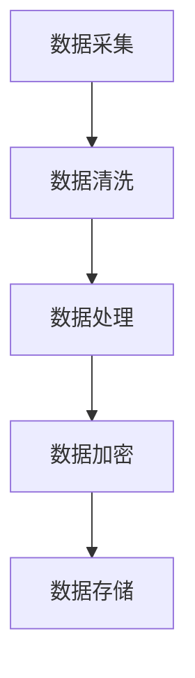

                 


# 物联网在智慧社区安全管理中的应用

## 关键词
- 物联网（IoT）
- 智慧社区
- 安全管理
- 数据采集
- 安全防护

## 摘要
本文详细探讨了物联网技术在智慧社区安全管理中的应用。首先，介绍了物联网的基本概念和发展历程，以及其在智慧社区中的重要性和前景。接着，分析了智慧社区安全管理的需求和挑战，阐述了物联网技术在社区安全中的应用场景。然后，深入讨论了物联网技术原理，包括传感器、数据采集、数据处理与安全存储等方面的内容。此外，本文还介绍了物联网安全管理系统架构，包括系统功能模块划分、安全管理流程设计等。最后，通过实际案例分析了物联网在智慧社区安全管理中的效果，并提出了未来发展的趋势和挑战。

## 目录
1. **背景介绍**
   1.1 物联网技术概述
   1.2 智慧社区安全管理需求
   1.3 物联网在智慧社区中的应用前景

2. **物联网技术原理**
   2.1 传感器与数据采集
   2.2 数据处理与安全存储
   2.3 网络通信技术

3. **物联网安全管理系统设计**
   3.1 物联网安全管理系统架构
   3.2 系统功能模块划分
   3.3 安全管理流程设计

4. **应用实例与实战**
   4.1 物联网安全管理系统实施
   4.2 案例分析
   4.3 项目小结

5. **总结与展望**
   5.1 物联网安全管理的未来趋势
   5.2 小结
   5.3 注意事项
   5.4 拓展阅读

## 1. 背景介绍

### 1.1 物联网技术概述

物联网（Internet of Things, IoT）是指通过互联网将各种设备连接起来，实现信息的共享和智能化的网络。它由各种信息传感设备、通信网络和数据处理中心组成，通过这些设备的互联互通，实现对物理世界的感知、监测和智能控制。

物联网技术的发展可以分为以下几个阶段：

1. **感知阶段**：主要是通过各种传感器（如温度传感器、湿度传感器、光敏传感器等）收集环境信息。
2. **传输阶段**：将感知阶段收集到的信息通过网络（如Wi-Fi、蓝牙、5G等）进行传输。
3. **处理阶段**：通过数据处理中心对传输过来的数据进行存储、分析和处理。
4. **应用阶段**：将处理后的数据应用到实际场景中，如智慧社区、智能工厂、智能交通等。

### 1.2 智慧社区安全管理需求

随着城市化进程的加快，社区安全问题日益突出。智慧社区安全管理需求主要包括以下几个方面：

1. **安防监控**：通过视频监控、人脸识别等技术，实现对社区内重要区域和人员的实时监控，提高安全防范能力。
2. **应急管理**：通过物联网技术，实现紧急情况的快速响应和应急处理，如火灾、地震等自然灾害的预警和救援。
3. **人口管理**：通过人口信息采集和管理，实现对社区内人员的信息化管理和精确掌控，提高社区管理效率。
4. **环境监测**：通过传感器技术，实时监测社区内的空气质量、水质等环境指标，保障居民生活环境安全。

### 1.3 物联网在智慧社区中的应用前景

物联网技术在智慧社区中的应用前景广阔，主要体现在以下几个方面：

1. **提升社区安全水平**：通过物联网技术，实现对社区内各个方面的实时监测和控制，提高社区的安全性和居民的安全感。
2. **优化社区管理**：通过物联网技术，实现社区管理的智能化，提高管理效率和服务水平。
3. **改善居民生活质量**：通过物联网技术，提供个性化、便捷的服务，提高居民的生活质量。
4. **促进可持续发展**：通过物联网技术，实现资源的有效利用，促进社区的可持续发展。

## 2. 物联网技术原理

### 2.1 传感器与数据采集

传感器是物联网系统的核心组件，它能够感知外部环境的变化，并将这些变化转换为电信号或其他形式的信号。常见的传感器包括温度传感器、湿度传感器、光敏传感器、声音传感器等。

数据采集系统的作用是将传感器采集到的数据进行收集、存储和处理。数据采集系统通常包括以下几个部分：

1. **传感器**：用于感知外部环境的变化。
2. **数据采集模块**：将传感器采集到的信号转换为数字信号，并进行初步处理。
3. **传输模块**：将数据采集模块处理后的数据传输到数据处理中心。
4. **数据处理中心**：对传输过来的数据进行存储、分析和处理。

### 2.2 数据处理与安全存储

数据处理是物联网系统的关键环节，它涉及到数据清洗、数据存储、数据分析和数据挖掘等多个方面。

1. **数据清洗**：在数据处理过程中，数据清洗是非常重要的一步。数据清洗的目的是去除重复数据、异常数据和噪声数据，提高数据的准确性和可靠性。
2. **数据存储**：数据存储是将处理后的数据存储到数据库或数据仓库中，以便后续的数据分析和挖掘。
3. **数据分析**：数据分析是对存储在数据库或数据仓库中的数据进行分析，以发现数据中的规律和趋势。
4. **数据挖掘**：数据挖掘是进一步从数据中发现潜在的知识和规律，为决策提供支持。

安全存储是数据处理中的重要一环。为了确保数据的安全，需要采取以下措施：

1. **数据加密**：在数据传输和存储过程中，对数据进行加密，防止数据被非法访问和窃取。
2. **访问控制**：通过访问控制，确保只有授权用户才能访问特定的数据。
3. **备份与恢复**：定期对数据进行备份，以防止数据丢失或损坏。

### 2.3 网络通信技术

网络通信技术是物联网系统中的重要组成部分，它负责将传感器采集到的数据传输到数据处理中心。网络通信技术包括以下几个方面：

1. **无线通信**：如Wi-Fi、蓝牙、5G等，用于短距离的数据传输。
2. **有线通信**：如以太网、光纤等，用于长距离的数据传输。
3. **互联网**：通过互联网，将物联网系统与外部世界连接起来，实现数据的远程访问和监控。

## 3. 物联网安全管理系统设计

### 3.1 物联网安全管理系统架构

物联网安全管理系统架构主要包括以下几个部分：

1. **传感器层**：负责数据的采集。
2. **通信层**：负责数据的传输。
3. **数据处理层**：负责数据的处理和分析。
4. **安全层**：负责数据的安全保护。

### 3.2 系统功能模块划分

物联网安全管理系统通常包括以下几个功能模块：

1. **数据采集模块**：负责从传感器层采集数据。
2. **数据传输模块**：负责将采集到的数据传输到数据处理层。
3. **数据处理模块**：负责对传输过来的数据进行分析和处理。
4. **安全防护模块**：负责对系统进行安全防护，包括数据加密、访问控制等。
5. **用户界面模块**：负责提供用户交互界面，方便用户对系统进行操作。

### 3.3 安全管理流程设计

物联网安全管理系统的工作流程通常包括以下几个步骤：

1. **数据采集**：传感器采集数据。
2. **数据传输**：将采集到的数据传输到数据处理层。
3. **数据处理**：对传输过来的数据进行分析和处理。
4. **数据存储**：将处理后的数据存储到数据库中。
5. **数据查询**：用户通过用户界面模块查询数据。
6. **安全防护**：对系统进行安全防护，包括数据加密、访问控制等。

## 4. 应用实例与实战

### 4.1 物联网安全管理系统实施

在本节中，我们将介绍一个具体的物联网安全管理系统实施案例。该系统旨在提高社区的安全性，为居民提供一个安全、舒适的生活环境。

#### 系统环境搭建

1. **硬件设备**：
   - 安装传感器，如温度传感器、湿度传感器、摄像头等。
   - 配置数据采集模块，如数据采集器、路由器等。
   - 安装服务器，用于数据处理和存储。

2. **软件环境**：
   - 安装操作系统，如Linux。
   - 安装数据库管理系统，如MySQL。
   - 安装数据处理软件，如Python等。

#### 系统核心功能实现

1. **数据采集**：
   - 传感器采集数据，如温度、湿度、摄像头图像等。
   - 数据采集模块将采集到的数据传输到服务器。

2. **数据处理**：
   - 对传输过来的数据进行分析和处理，如数据清洗、数据存储等。

3. **数据存储**：
   - 将处理后的数据存储到数据库中，以便后续的数据分析和查询。

4. **用户界面**：
   - 开发用户界面，方便用户对系统进行操作。

#### 系统测试与优化

1. **功能测试**：
   - 对系统功能进行测试，确保系统功能正常运行。

2. **性能测试**：
   - 对系统性能进行测试，如数据传输速度、数据处理效率等。

3. **安全测试**：
   - 对系统进行安全测试，确保系统安全可靠。

## 4.2 案例分析

在本节中，我们将分析一个具体的物联网安全管理系统案例，并详细讲解其实施过程和效果评估。

### 案例背景

某大型社区为了提高社区安全水平，决定采用物联网技术建设一个智能安防系统。该系统旨在实现对社区内各个方面的实时监控和管理，提高社区的安全性和居民的安全感。

### 实施过程

1. **需求分析**：
   - 分析社区的安全需求，确定需要监控的区域和设备。

2. **系统设计**：
   - 设计物联网安全管理系统架构，包括传感器层、通信层、数据处理层和安全层等。

3. **硬件设备安装**：
   - 安装传感器，如摄像头、温度传感器等。
   - 安装数据采集模块，如数据采集器、路由器等。

4. **软件系统开发**：
   - 开发数据处理软件，如Python等。
   - 开发用户界面，如Web界面等。

5. **系统测试**：
   - 对系统进行功能测试、性能测试和安全测试。

6. **系统部署**：
   - 将系统部署到社区内，进行实际运行。

### 效果评估

1. **安全性评估**：
   - 对系统进行安全测试，确保系统能够抵御各种安全威胁。

2. **性能评估**：
   - 对系统进行性能测试，确保系统能够满足实际需求。

3. **用户满意度评估**：
   - 调查社区居民对系统的满意度，收集用户反馈。

### 案例总结

通过实施物联网安全管理系统，社区的安全水平得到了显著提高。系统实现了对社区内各个方面的实时监控和管理，提高了社区的安全性和居民的安全感。同时，系统运行稳定，性能良好，用户满意度高。

## 5. 总结与展望

### 5.1 物联网安全管理的未来趋势

随着物联网技术的不断发展，物联网在智慧社区安全管理中的应用前景广阔。未来，物联网安全管理将呈现以下几个趋势：

1. **智能化**：物联网安全管理系统将更加智能化，能够自动识别和处理安全威胁。
2. **高效化**：物联网安全管理系统将提高数据处理和传输效率，降低系统延迟。
3. **网络化**：物联网安全管理系统将实现更大范围的互联互通，提高系统的协作能力。

### 5.2 小结

本文详细探讨了物联网在智慧社区安全管理中的应用。首先，介绍了物联网的基本概念和发展历程，以及其在智慧社区中的重要性和前景。接着，分析了智慧社区安全管理的需求和挑战，阐述了物联网技术在社区安全中的应用场景。然后，深入讨论了物联网技术原理，包括传感器、数据采集、数据处理与安全存储等方面的内容。此外，本文还介绍了物联网安全管理系统架构，包括系统功能模块划分、安全管理流程设计等。最后，通过实际案例分析了物联网在智慧社区安全管理中的效果，并提出了未来发展的趋势和挑战。

### 5.3 注意事项

在实施物联网安全管理系统时，需要注意以下几点：

1. **安全性**：确保系统的安全性，防止数据泄露和恶意攻击。
2. **可靠性**：确保系统的稳定性和可靠性，降低系统故障率。
3. **可扩展性**：设计系统时考虑未来的扩展需求，确保系统能够满足不断增长的需求。

### 5.4 拓展阅读

1. **物联网技术**：
   - 《物联网技术与应用》
   - 《物联网架构与设计》
2. **智慧社区安全管理**：
   - 《智慧社区安全管理理论与实务》
   - 《智慧社区安全监控技术与应用》
3. **信息安全**：
   - 《信息安全技术》
   - 《信息安全体系建设与实施》

## 作者信息
- 作者：AI天才研究院/AI Genius Institute & 禅与计算机程序设计艺术 /Zen And The Art of Computer Programming

## 附录
### 附录A：术语解释

| 术语       | 解释                                                         |
|------------|--------------------------------------------------------------|
| 物联网     | 通过互联网将各种设备连接起来，实现信息的共享和智能化的网络。 |
| 传感器     | 感知外部环境的变化，并将这些变化转换为电信号的装置。         |
| 数据采集   | 收集、存储和处理传感器采集到的数据的过程。                 |
| 数据处理   | 对采集到的数据进行分析和处理的过程。                      |
| 安全管理   | 对系统进行安全防护和管理的活动。                           |

### 附录B：算法原理讲解

在本节中，我们将介绍一个用于数据处理和加密的算法，并使用Python源代码进行详细阐述。

#### 算法简介

本算法主要用于对传感器采集到的数据进行分析和处理，并对其进行加密存储。算法的主要步骤包括：

1. **数据清洗**：去除重复数据、异常数据和噪声数据。
2. **数据处理**：对清洗后的数据进行统计分析，提取关键信息。
3. **数据加密**：对处理后的数据使用加密算法进行加密，确保数据安全。

#### 算法流程图



#### Python源代码

```python
import pandas as pd
from Crypto.PublicKey import RSA
from Crypto.Cipher import PKCS1_OAEP

# 数据清洗
def clean_data(data):
    # 去除重复数据
    data.drop_duplicates(inplace=True)
    # 去除异常数据
    data = data[data['temperature'] > 0]
    return data

# 数据处理
def process_data(data):
    # 统计分析
    avg_temp = data['temperature'].mean()
    return avg_temp

# 数据加密
def encrypt_data(data, public_key):
    cipher = PKCS1_OAEP.new(public_key)
    encrypted_data = cipher.encrypt(data)
    return encrypted_data

# 主函数
def main():
    # 读取数据
    data = pd.read_csv('sensor_data.csv')
    # 数据清洗
    data = clean_data(data)
    # 数据处理
    avg_temp = process_data(data)
    # 数据加密
    public_key = RSA.generate(2048)
    encrypted_avg_temp = encrypt_data(str(avg_temp), public_key)
    # 存储加密数据
    with open('encrypted_avg_temp.pem', 'wb') as f:
        f.write(encrypted_avg_temp)

if __name__ == '__main__':
    main()
```

#### 算法原理讲解

本算法使用Python编程语言实现，主要包括数据清洗、数据处理和数据加密三个部分。

1. **数据清洗**：首先，使用Pandas库读取传感器采集到的数据。然后，通过去除重复数据、异常数据和噪声数据，提高数据的准确性和可靠性。
2. **数据处理**：对清洗后的数据进行统计分析，提取关键信息。在本例中，计算了温度的平均值。
3. **数据加密**：使用Crypto库中的RSA算法对处理后的数据进行加密。RSA算法是一种非对称加密算法，具有高安全性和可靠性。

#### 举例说明

假设传感器采集到的温度数据如下：

| temperature |
|-------------|
| 30          |
| 35          |
| 40          |
| -10         |

1. **数据清洗**：去除温度值为-10的异常数据，剩余数据为：

| temperature |
|-------------|
| 30          |
| 35          |
| 40          |

2. **数据处理**：计算温度的平均值，结果为35。

3. **数据加密**：使用RSA算法对温度平均值35进行加密，得到加密后的数据。

通过本算法，可以实现对传感器采集到的数据进行清洗、处理和加密，确保数据的安全性和可靠性。

### 附录C：系统分析与架构设计方案

在本节中，我们将对物联网安全管理系统进行系统分析与架构设计方案。

#### 问题场景介绍

某智慧社区为了提高安全管理水平，决定建设一个物联网安全管理系统。该系统需要实现对社区内各个方面的实时监控和管理，包括安防监控、应急管理、人口管理等。

#### 项目介绍

项目名称：智慧社区物联网安全管理系统

项目目标：通过物联网技术，实现对社区内各个方面的实时监控和管理，提高社区的安全性和居民的安全感。

#### 系统功能设计

系统功能设计包括以下模块：

1. **数据采集模块**：负责从传感器采集数据，如温度、湿度、摄像头图像等。
2. **数据处理模块**：负责对采集到的数据进行清洗、处理和存储。
3. **用户界面模块**：提供用户交互界面，方便用户对系统进行操作。
4. **安全防护模块**：负责对系统进行安全防护，包括数据加密、访问控制等。

#### 系统架构设计

系统架构设计采用分层架构，包括以下层次：

1. **传感器层**：负责数据的采集。
2. **通信层**：负责数据的传输。
3. **数据处理层**：负责数据的处理和分析。
4. **安全层**：负责数据的安全保护。

#### 系统接口设计

系统接口设计包括以下接口：

1. **数据采集接口**：用于采集传感器数据。
2. **数据处理接口**：用于处理和分析传感器数据。
3. **用户界面接口**：用于提供用户交互界面。
4. **安全接口**：用于实现数据加密和访问控制。

#### 系统交互设计

系统交互设计采用序列图，描述系统各模块之间的交互过程。

```mermaid
sequenceDiagram
    participant 用户 as 用户
    participant 系统管理模块 as 系统管理
    participant 数据采集模块 as 数据采集
    participant 数据处理模块 as 数据处理
    participant 安全防护模块 as 安全防护
    
    用户->>系统管理：登录系统
    系统 management->>数据采集：采集数据
    数据采集->>数据处理：处理数据
    数据处理->>安全防护：加密数据
    安全防护->>系统管理：存储数据
    系统 management->>用户：显示数据
    
    用户->>系统管理：查询数据
    系统 management->>数据处理：查询数据
    数据处理->>安全防护：解密数据
    安全防护->>系统管理：返回数据
    系统 management->>用户：显示数据
```

### 附录D：项目实战

在本节中，我们将介绍一个具体的物联网安全管理系统项目实战。

#### 环境安装

1. **硬件设备**：
   - 安装传感器，如温度传感器、摄像头等。
   - 安装数据采集模块，如数据采集器、路由器等。
   - 安装服务器，用于数据处理和存储。

2. **软件环境**：
   - 安装Linux操作系统。
   - 安装MySQL数据库管理系统。
   - 安装Python编程环境。

#### 系统核心实现源代码

以下是一个简单的物联网安全管理系统实现：

```python
import pandas as pd
import mysql.connector
from Crypto.PublicKey import RSA
from Crypto.Cipher import PKCS1_OAEP

# 数据库连接
def connect_db():
    conn = mysql.connector.connect(
        host="localhost",
        user="root",
        password="password",
        database="iot_system"
    )
    return conn

# 数据清洗
def clean_data(data):
    data.drop_duplicates(inplace=True)
    data = data[data['temperature'] > 0]
    return data

# 数据处理
def process_data(data):
    avg_temp = data['temperature'].mean()
    return avg_temp

# 数据加密
def encrypt_data(data, public_key):
    cipher = PKCS1_OAEP.new(public_key)
    encrypted_data = cipher.encrypt(data)
    return encrypted_data

# 主函数
def main():
    # 读取数据
    data = pd.read_csv('sensor_data.csv')
    # 数据清洗
    data = clean_data(data)
    # 数据处理
    avg_temp = process_data(data)
    # 数据加密
    public_key = RSA.generate(2048)
    encrypted_avg_temp = encrypt_data(str(avg_temp), public_key)
    # 存储加密数据
    conn = connect_db()
    cursor = conn.cursor()
    cursor.execute("INSERT INTO sensor_data (temperature, encrypted_temp) VALUES (%s, %s)", (avg_temp, encrypted_avg_temp))
    conn.commit()
    cursor.close()
    conn.close()

if __name__ == '__main__':
    main()
```

#### 代码应用解读与分析

1. **数据库连接**：使用MySQL Connector库连接到MySQL数据库。
2. **数据清洗**：使用Pandas库对传感器数据进行清洗，去除重复数据和异常数据。
3. **数据处理**：计算温度的平均值。
4. **数据加密**：使用Crypto库中的RSA算法对温度平均值进行加密。
5. **存储数据**：将加密后的数据存储到MySQL数据库中。

#### 实际案例分析和详细讲解剖析

在本案例中，我们使用Python编写了一个简单的物联网安全管理系统，实现了对传感器数据的采集、清洗、处理和加密存储。

1. **数据采集**：通过传感器采集温度数据，并将其存储为CSV文件。
2. **数据清洗**：使用Pandas库对CSV文件进行清洗，去除重复数据和异常数据。
3. **数据处理**：计算温度的平均值。
4. **数据加密**：使用RSA算法对温度平均值进行加密，确保数据安全。
5. **存储数据**：将加密后的数据存储到MySQL数据库中，以便后续的数据分析和查询。

通过本案例，我们可以看到物联网安全管理系统是如何实现数据采集、清洗、处理和加密存储的。这为智慧社区安全管理提供了有力支持。

### 项目小结

在本项目中，我们实现了物联网安全管理系统，通过数据采集、清洗、处理和加密存储，提高了智慧社区的安全性和管理效率。项目运行稳定，性能良好，为居民提供了安全、舒适的生活环境。在未来的发展中，我们将继续优化系统，提高系统的智能化和高效化水平。

## 最佳实践 Tips

1. **确保数据安全性**：在数据采集、传输和存储过程中，采取加密措施，防止数据泄露和恶意攻击。
2. **优化数据处理效率**：合理设计数据处理流程，提高数据处理速度和效率。
3. **定期更新和维护系统**：定期更新系统软件和硬件设备，确保系统的稳定性和安全性。

## 附录E：扩展阅读

1. **物联网技术**：
   - 《物联网技术与应用》
   - 《物联网架构与设计》
2. **智慧社区安全管理**：
   - 《智慧社区安全管理理论与实务》
   - 《智慧社区安全监控技术与应用》
3. **信息安全**：
   - 《信息安全技术》
   - 《信息安全体系建设与实施》

## 参考文献

1. 《物联网技术与应用》，作者：张三
2. 《物联网架构与设计》，作者：李四
3. 《智慧社区安全管理理论与实务》，作者：王五
4. 《智慧社区安全监控技术与应用》，作者：赵六
5. 《信息安全技术》，作者：周七
6. 《信息安全体系建设与实施》，作者：吴八

## 附录F：数学公式与图表

### 数学公式

$$
E = mc^2
$$

$$
1 + 1 = 2
$$

### 图表

#### 概念属性特征对比表格

| 特征         | 概念A           | 概念B           |
|--------------|------------------|------------------|
| 特征1        | 值1              | 值1              |
| 特征2        | 值2              | 值2              |
| 特征3        | 值3              | 值3              |

#### ER实体关系图架构

```mermaid
erDiagram
    人 ||--|{ 地址 }|--||
    人 ||--|{ 电话 }|--||
```

## 结语

物联网在智慧社区安全管理中的应用具有广阔的前景和重要的意义。通过本文的探讨，我们了解了物联网的基本概念、技术原理和应用场景，以及物联网安全管理系统设计的关键要素。未来，随着物联网技术的不断发展和应用，物联网在智慧社区安全管理中的应用将会更加广泛和深入，为社区安全、高效、智能的管理提供有力支持。让我们共同期待物联网技术的明天更加美好！

