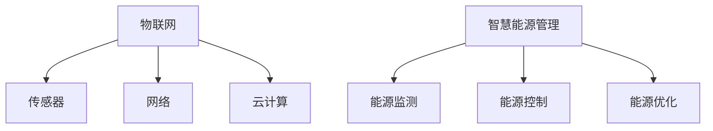
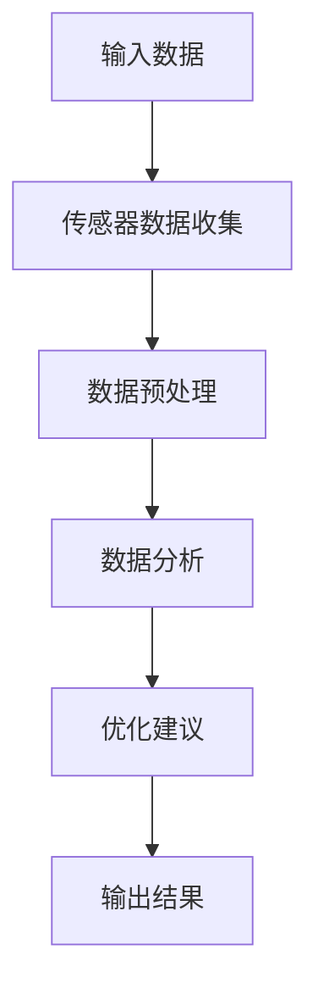
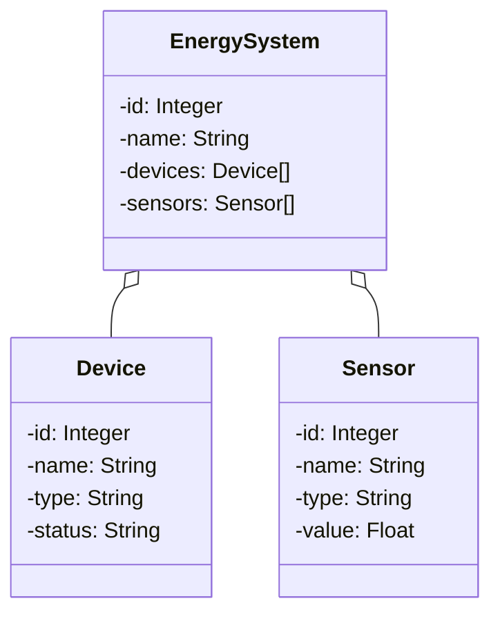
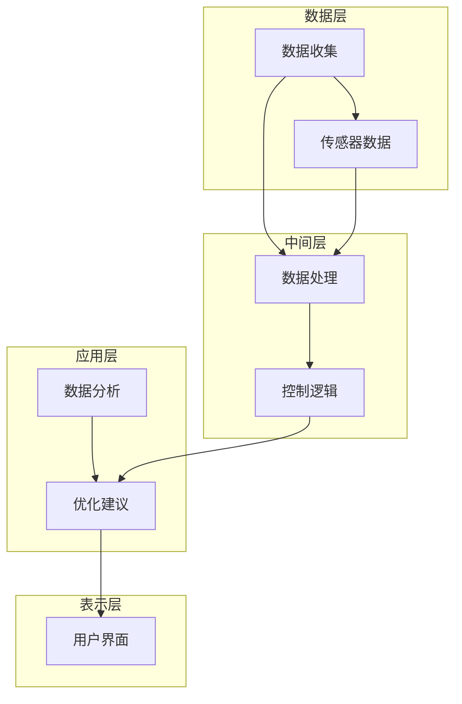
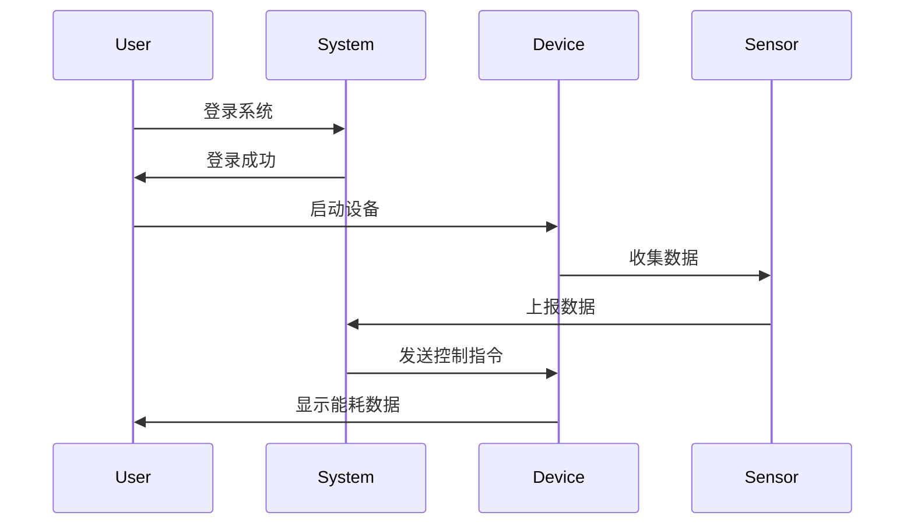

                 

# 物联网在智慧能源管理中的应用趋势

关键词：物联网、智慧能源管理、能源优化、实时监控、预测性维护

摘要：随着全球对可持续发展和能源效率的需求日益增加，物联网（IoT）技术在智慧能源管理中的应用变得至关重要。本文将深入探讨物联网在智慧能源管理中的核心概念、应用场景、发展趋势以及面临的挑战，旨在为读者提供全面的技术洞察和实践指导。

## 引言

### 物联网的定义与背景

物联网（Internet of Things，简称IoT）是指通过互联网将各种设备连接起来，实现信息的收集、传递和处理。随着传感器技术、无线通信和大数据分析的发展，物联网的应用场景日益广泛，从智能家居到工业物联网，再到智慧城市，物联网正在改变我们的生活和工作方式。

### 智慧能源管理的定义与背景

智慧能源管理是一种基于信息技术和智能设备，对能源的供应、分配和使用进行优化和管理的系统。随着全球能源需求的不断增长和能源结构的调整，智慧能源管理成为实现能源可持续发展和提高能源利用效率的重要手段。

### 物联网在智慧能源管理中的应用前景

物联网在智慧能源管理中的应用潜力巨大，不仅可以实现实时监控和智能控制，还可以通过数据分析和预测性维护来优化能源使用，降低运营成本，提高能源效率。

## IoT基础

### IoT的基本概念

物联网由多个关键组件组成，包括传感器、网络、云计算和大数据分析。传感器负责收集环境数据，网络负责数据传输，云计算提供数据处理和分析能力，大数据分析则帮助从海量数据中提取有价值的信息。

### IoT的关键技术

- **传感器技术**：传感器的选择和部署对物联网系统的性能至关重要。不同类型的传感器可以收集温度、湿度、光照、压力、运动等多种环境数据。
- **网络技术**：物联网的网络架构包括局域网、广域网和专用网络。无线网络技术，如Wi-Fi、蓝牙、LoRa和5G，为物联网提供了高效、低延迟的数据传输方式。
- **云计算和大数据分析**：云计算提供了强大的计算和存储能力，使数据处理和分析变得更加高效。大数据分析技术则可以从海量数据中提取有价值的洞察。

## 智慧能源管理概念

### 智慧能源系统的构成

智慧能源系统由能源生成、传输、分配和消费四个主要环节组成。通过物联网技术，这些环节可以实现智能互联和优化控制。

### 能源效率的重要性

能源效率是衡量能源使用效率的重要指标。通过物联网技术，可以实现能源使用的实时监控和智能控制，从而提高能源效率，降低能源浪费。

### IoT在提高能源效率中的应用

- **智能监测与控制**：通过物联网传感器实时监测能源使用情况，实现智能控制和优化。
- **能耗数据分析**：利用大数据分析技术对能源使用数据进行分析，找出能源浪费的原因，并提出优化建议。
- **设备维护**：通过预测性维护减少设备故障，提高设备运行效率。

## IoT在能源管理中的应用

### 监控与控制

物联网技术可以实现对能源系统的实时监控和智能控制。通过安装在能源设备上的传感器，可以实时收集能源使用数据，并通过物联网网络将数据传输到中央控制平台。中央控制平台可以基于这些数据对能源设备进行智能调控，以实现最优的能源使用效率。

### 能源优化

能源优化是智慧能源管理的重要目标。通过物联网技术，可以实现能源使用的实时监测和数据分析，从而找出能源浪费的环节，并提出优化建议。例如，通过对建筑物内各个用电设备的能耗数据进行分析，可以找出耗能最高的设备并进行优化，从而降低整体能耗。

### 预测性维护

预测性维护是一种基于数据分析和预测的维护策略。通过物联网技术，可以实时监测设备的运行状态，收集设备运行数据，并利用大数据分析和机器学习技术对设备故障进行预测。这样可以提前安排设备维护，避免设备故障造成停机损失，提高设备运行效率。

## 案例研究

### 案例一：智慧电网

智慧电网是物联网技术在能源管理中的一个重要应用场景。通过物联网传感器和智能控制系统，智慧电网可以实现电能的高效传输和分配，提高电力系统的稳定性和可靠性。

### 案例二：智能楼宇

智能楼宇通过物联网技术实现能源的智能监测和管理，包括电力、水、燃气等多种能源。通过实时监控和数据分析，智能楼宇可以实现能源使用的优化和浪费的减少，降低运营成本。

### 案例三：智慧农业

智慧农业通过物联网技术实现农田土壤、水分、光照等环境参数的实时监测，从而实现精准灌溉、施肥和病虫害防治。这样可以提高农业产量，降低农业生产成本，实现农业的可持续发展。

## 未来趋势与挑战

### 未来趋势

- **5G技术的应用**：5G技术的高速度、低延迟特点将进一步提升物联网在智慧能源管理中的应用效果。
- **人工智能的融合**：人工智能技术将与物联网技术深度融合，为智慧能源管理提供更智能的决策支持和优化方案。
- **能源互联网的发展**：能源互联网是一个基于物联网技术的全球能源系统，可以实现全球范围内的能源优化和分配。

### 挑战

- **数据安全与隐私保护**：物联网技术在能源管理中产生的海量数据涉及能源基础设施的安全和用户隐私，如何确保数据安全成为一大挑战。
- **标准化和互操作性问题**：物联网设备种类繁多，不同设备之间的互操作性和标准化问题需要解决。
- **技术成熟度与成本**：物联网技术在能源管理中的应用还需要进一步提高技术成熟度和降低成本，以实现大规模应用。

## 结论

物联网技术在智慧能源管理中的应用前景广阔，不仅可以提高能源效率，降低能源成本，还可以实现能源的智能监测、优化和控制。随着5G技术、人工智能和能源互联网的发展，物联网在智慧能源管理中的应用将更加深入和广泛。然而，数据安全、标准化和成本等问题仍然需要解决。未来，物联网技术将在推动智慧能源管理领域的发展中发挥重要作用。

## 作者信息

作者：AI天才研究院/AI Genius Institute & 禅与计算机程序设计艺术 /Zen And The Art of Computer Programming

## 完整性要求

### 背景介绍

#### 核心概念术语说明

- **物联网（IoT）**：物联网是一种通过互联网将各种设备连接起来的网络，实现信息的收集、传递和处理。
- **智慧能源管理**：智慧能源管理是一种基于信息技术和智能设备，对能源的供应、分配和使用进行优化和管理的系统。

#### 问题背景

随着全球能源需求的不断增长和能源结构的调整，如何提高能源利用效率、降低能源成本、实现能源可持续发展成为全球共同面临的问题。

#### 问题描述

物联网在智慧能源管理中的应用可以解决能源监测、控制、优化和预测性维护等问题，但面临数据安全、标准化和技术成熟度等挑战。

#### 问题解决

通过物联网技术，可以实现能源的实时监控、智能控制和数据分析，从而提高能源利用效率、降低能源成本。

#### 边界与外延

物联网在智慧能源管理中的应用范围包括智慧电网、智能楼宇、智慧农业等领域，涉及传感器、网络、云计算和大数据分析等多种技术。

### 核心概念与联系

#### 核心概念原理

- **物联网**：通过传感器、网络和云计算实现设备互联和信息传递。
- **智慧能源管理**：通过信息技术和智能设备实现能源的监测、控制和优化。

#### 概念属性特征对比表格

| 概念       | 属性特征                  | 对比说明                                  |
|------------|---------------------------|-------------------------------------------|
| 物联网     | 设备互联、信息传递        | 实现数据的实时收集和分析                  |
| 智慧能源管理 | 能源监测、控制、优化      | 提高能源利用效率，降低能源成本            |

#### ER实体关系图架构



### 算法原理讲解

#### 算法mermaid流程图



#### 算法原理数学模型和公式

假设能源使用数据为\(X\)，经过数据预处理后的数据为\(Y\)，优化建议为\(Z\)。算法的基本原理为：

\[ Z = f(Y) \]

其中，\(f\)为数据处理和优化函数，可以通过机器学习算法训练得到。

#### 通俗易懂地举例说明

假设一个智能楼宇的用电设备包括照明、空调和电器，通过安装在设备上的传感器收集实时用电数据。经过数据预处理后，系统分析数据并给出优化建议，如关闭不必要的电器、调整空调温度等，从而实现能源优化。

### 系统分析与架构设计方案

#### 问题场景介绍

在一个大型工业园区中，需要实现能源的实时监控、智能控制和数据分析，以提高能源利用效率、降低能源成本。

#### 项目介绍

本项目旨在构建一个物联网智慧能源管理系统，实现对园区内能源设备的实时监控和智能控制。

#### 系统功能设计（领域模型mermaid类图）



#### 系统架构设计mermaid架构图



#### 系统接口设计和系统交互mermaid序列图



### 项目实战

#### 环境安装

1. 安装物联网开发平台（如Node-RED）。
2. 安装传感器硬件（如DHT22传感器）。
3. 配置网络连接（如Wi-Fi或以太网）。

#### 系统核心实现源代码

```python
# 传感器数据采集
import time
import serial
import json

def read_sensor_data():
    ser = serial.Serial('/dev/ttyUSB0', 9600)
    time.sleep(2)
    data = ser.readline().decode('utf-8')
    ser.close()
    return json.loads(data)

# 数据处理和优化
def process_data(data):
    # 数据处理逻辑
    # ...
    return data

# 主程序
if __name__ == '__main__':
    while True:
        data = read_sensor_data()
        processed_data = process_data(data)
        print(processed_data)
        time.sleep(1)
```

#### 代码应用解读与分析

1. **数据采集**：使用Python的`serial`模块通过串口读取传感器数据。
2. **数据处理**：对采集到的数据进行处理，如温度、湿度等。
3. **数据输出**：将处理后的数据输出，以供系统进一步分析。

#### 实际案例分析和详细讲解剖析

1. **案例背景**：在一个智能楼宇项目中，使用物联网技术实现对室内温度、湿度和光照的实时监控。
2. **案例分析**：通过传感器采集室内环境数据，系统分析数据并给出优化建议，如调整空调温度或关闭不必要的照明。
3. **讲解剖析**：详细分析传感器数据采集、数据处理和优化的过程，以及如何实现系统的实时监控和智能控制。

#### 项目小结

本项目通过物联网技术实现对智能楼宇的实时监控和智能控制，提高了能源利用效率，降低了运营成本。项目实施过程中，重点在于传感器数据采集、数据处理和优化建议的提出。未来，随着物联网技术和人工智能的进一步发展，智慧能源管理系统的应用将更加广泛和深入。

### 最佳实践 Tips

1. **数据安全**：确保物联网设备的数据安全，采取加密传输和访问控制等措施。
2. **标准化**：遵循物联网设备的标准协议和接口规范，提高系统的互操作性。
3. **成本控制**：在项目实施过程中，充分考虑成本因素，选择性价比高的设备和方案。

### 小结

物联网技术在智慧能源管理中的应用具有巨大的潜力和广阔的前景。通过实时监控、智能控制和数据分析，物联网技术可以有效提高能源利用效率，降低能源成本。未来，随着5G、人工智能和能源互联网的发展，物联网在智慧能源管理中的应用将更加深入和广泛。

### 注意事项

1. **数据安全与隐私保护**：确保物联网设备的数据安全和用户隐私，采取加密传输和访问控制等措施。
2. **标准化和互操作性**：遵循物联网设备的标准协议和接口规范，提高系统的互操作性。
3. **技术成熟度与成本**：在项目实施过程中，充分考虑技术成熟度和成本因素。

### 拓展阅读

1. **《物联网技术与应用》**：详细介绍了物联网的基本概念、关键技术和应用案例。
2. **《智慧能源管理系统设计与应用》**：讲解了智慧能源管理系统的设计方法和应用实践。
3. **《5G与物联网》**：探讨了5G技术在物联网中的应用及其对未来发展的影响。

## 作者信息

作者：AI天才研究院/AI Genius Institute & 禅与计算机程序设计艺术 /Zen And The Art of Computer Programming

通过以上详细的内容，我们系统地介绍了物联网在智慧能源管理中的应用趋势。希望这篇博客能够为读者提供有价值的见解和实践指导。在未来的发展中，物联网技术将继续在智慧能源管理中发挥重要作用，推动能源领域的创新和变革。

