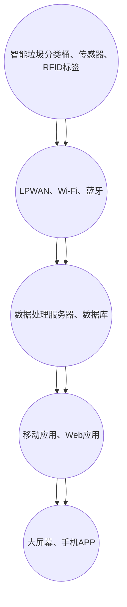

                 

### 1.1.1 物联网的定义

物联网（Internet of Things，简称IoT）是指将各种信息传感设备与互联网结合起来而形成的一个巨大网络。在这个网络中，物品通过内置的传感器、执行器、通信模块等智能设备实现信息的采集、传输、处理和反馈，从而实现智能化的管理与控制。

物联网的定义可以从以下几个方面进行理解：

- **物品连接**：物联网的基本概念在于连接物品，这些物品可以是日常生活中的家电、交通工具、医疗设备等，也可以是工业生产中的各种机器和设备。
- **信息感知与传输**：物联网设备通过传感器收集环境数据，并通过无线或有线网络将数据传输到服务器或云平台进行进一步的处理和分析。
- **智能处理**：物联网不仅传输数据，还能够在边缘设备上进行数据处理，从而实现实时监控、自动化控制和智能决策。
- **系统集成**：物联网通过将各种设备、系统和平台连接起来，形成一个统一的整体，实现信息共享和资源优化。

根据国际电信联盟（ITU）的定义，物联网主要包括三个部分：感知层、网络层和应用层。感知层负责信息采集；网络层负责数据传输；应用层则实现物联网的智能应用。

### 1.1.2 物联网的发展历程

物联网的发展可以追溯到20世纪80年代，但其真正意义上的兴起是在21世纪。以下简要回顾物联网的发展历程：

- **1980年代**：物联网的概念首次被提出。1982年，卡内基梅隆大学的学生凯文·阿什顿（Kevin Ashton）首次提出了“物联网”这个术语，以描述通过无线电频率识别（RFID）技术实现的物品连接。

- **1990年代**：物联网技术开始逐步应用于实际场景。1990年，美国麻省理工学院（MIT）启动了“自动标识与集成传感网络”（Auto-ID）研究中心，致力于物联网技术的研发。

- **2000年代**：物联网进入快速发展阶段。2005年，国际电信联盟（ITU）正式发布了物联网的概念框架。同年，欧盟启动了“物联网欧洲”（IoT Europe）计划，推动物联网技术的应用和产业发展。

- **2010年代**：物联网进入大规模应用阶段。随着无线通信技术的进步、云计算和大数据技术的成熟，物联网应用场景不断拓展。2010年，ITU发布了《物联网未来愿景》报告，预测物联网将在2020年达到全球普及。

- **2020年代**：物联网继续深化应用，智能城市、智能制造、智能交通等领域的物联网应用逐步成熟。2020年，全球物联网设备数量已超过100亿台，物联网市场规模达到1万亿美元以上。

### 1.1.3 物联网的关键技术

物联网的实现需要依赖于多种关键技术，以下介绍其中几个关键技术：

- **传感器技术**：传感器是物联网系统的感知层核心，用于采集环境数据，如温度、湿度、光照、声音等。传感器技术的进步使得物联网设备能够更加准确地感知外部环境。

- **无线通信技术**：物联网设备之间的通信通常依赖于无线通信技术，如Wi-Fi、蓝牙、Zigbee、NBIoT等。这些无线通信技术的不断发展，使得物联网设备的通信距离、传输速度和数据量都得到了大幅提升。

- **云计算与大数据技术**：物联网产生的海量数据需要通过云计算和大数据技术进行处理和分析，从而实现智能决策和自动化控制。云计算提供了强大的计算和存储能力，大数据技术则用于数据挖掘和模式识别。

- **人工智能技术**：人工智能技术在物联网中发挥着重要作用，如通过机器学习算法实现设备自学习、预测和优化。人工智能技术使得物联网系统能够更加智能化，提高系统的决策能力和效率。

- **边缘计算技术**：边缘计算是一种分布式计算架构，将数据处理和分析任务从云端转移到边缘设备上，从而减少数据传输延迟、降低带宽消耗，提高系统的实时性和响应速度。

- **安全与隐私保护技术**：随着物联网设备数量的增加，安全与隐私保护成为物联网面临的重要挑战。通过加密、身份认证、访问控制等技术，可以确保物联网设备的安全和用户隐私的保护。

### 1.2.1 智能垃圾分类的挑战

智能垃圾分类是现代城市管理和环境保护中的重要环节，然而在实施过程中面临着诸多挑战：

- **垃圾分类意识不足**：尽管垃圾分类已经逐渐被推广，但部分居民对垃圾分类的认识和参与度仍然不足，导致垃圾分类效果不佳。

- **分类标准不统一**：不同地区和国家的垃圾分类标准存在差异，使得居民在垃圾分类时容易产生混淆，增加了分类的难度。

- **垃圾种类繁多**：垃圾种类繁多且复杂，尤其是厨余垃圾、有害垃圾等，分类难度大，对分类设备和技术提出了更高要求。

- **处理能力有限**：现有的垃圾处理设施和设备能力有限，难以满足日益增长的垃圾分类和处理需求，导致垃圾堆积和处理不及时。

- **成本高昂**：智能垃圾分类系统需要投入大量资金进行设备采购、系统开发和运营维护，对于一些地方政府和企业管理来说，成本压力较大。

- **技术瓶颈**：尽管物联网、大数据和人工智能等技术为智能垃圾分类提供了技术支持，但在实际应用中，技术瓶颈仍然存在，如传感器准确性、数据传输可靠性等问题。

### 1.2.2 智能垃圾分类的解决方案

为了应对智能垃圾分类面临的挑战，需要从技术和管理两个方面提出综合性的解决方案：

- **技术层面**：

  - **智能识别技术**：通过应用图像识别、RFID、传感器等技术，实现垃圾的自动分类和识别，提高分类的准确性和效率。

  - **物联网技术**：利用物联网技术，实现垃圾分类设备与后台系统的实时连接和数据交互，提高垃圾处理的管理水平和响应速度。

  - **大数据分析**：通过大数据技术，对垃圾分类数据进行深入分析，发现分类规律，优化分类策略，提高分类效率。

  - **人工智能技术**：利用人工智能技术，实现垃圾分拣的自动化和智能化，降低人力成本，提高分类精度。

- **管理层面**：

  - **政策引导**：通过制定和推广垃圾分类政策，提高居民的垃圾分类意识和参与度，确保垃圾分类工作的顺利实施。

  - **宣传教育**：加强垃圾分类的宣传教育，提高居民对垃圾分类的认识，形成全社会共同参与的垃圾分类氛围。

  - **激励机制**：通过奖励措施，鼓励居民积极参与垃圾分类，如积分兑换、环保购物等。

  - **完善设施**：加大对垃圾分类设施的投入，提高垃圾处理能力和效率，确保垃圾分类工作顺利开展。

  - **监管机制**：建立健全垃圾分类监管机制，确保垃圾分类政策的落实和执行，对违规行为进行处罚。

### 1.2.3 智能垃圾分类与回收的意义

智能垃圾分类与回收在现代社会中具有重要的意义，主要体现在以下几个方面：

- **环境保护**：智能垃圾分类与回收可以有效减少垃圾填埋和焚烧带来的环境污染，降低温室气体排放，改善空气质量，保护生态环境。

- **资源利用**：智能垃圾分类与回收能够提高可回收物的回收率，促进资源的循环利用，减少对自然资源的消耗。

- **经济效益**：智能垃圾分类与回收可以降低垃圾处理成本，提高垃圾资源化利用的效益，产生一定的经济效益。

- **社会进步**：智能垃圾分类与回收有助于提高居民的环境意识和参与度，促进社会文明和进步。

- **城市可持续发展**：智能垃圾分类与回收是城市可持续发展的重要举措，有助于提升城市管理水平，实现绿色发展。

### 1.3.1 国外智能垃圾分类与回收的实践

智能垃圾分类与回收在发达国家已有较为成熟的应用和实践，以下列举一些典型案例：

- **德国**：德国是垃圾分类与回收的先锋国家，其垃圾分类体系非常完善。德国政府通过立法和宣传，使垃圾分类成为全民行动。每个家庭都会收到不同颜色的垃圾袋，用于分类收集不同的垃圾。德国的回收率高达60%以上，同时采用了先进的智能垃圾分类设备，如自动识别和分类系统。

- **日本**：日本在垃圾分类与回收方面也取得了显著成效。日本的垃圾分类标准非常严格，不同地区和城市有不同的垃圾分类指南。日本的智能垃圾分类设备采用了高度先进的传感器和图像识别技术，能够准确识别各种垃圾，并自动进行分类。同时，日本还鼓励居民参与垃圾分类，通过积分和奖励机制提高居民参与度。

- **美国**：美国一些城市在智能垃圾分类与回收方面也有不错的实践。例如，纽约市推出了智能垃圾分类桶，通过RFID技术实现垃圾的分类回收。同时，美国政府还投入大量资金，支持智能垃圾分类与回收技术的发展，以提高垃圾处理的效率。

### 1.3.2 国内智能垃圾分类与回收的进展

近年来，中国在城市垃圾分类与回收方面取得了显著进展，以下列举一些主要成果：

- **政策推动**：中国政府高度重视垃圾分类工作，先后出台了一系列政策法规，如《生活垃圾分类制度实施方案》、《关于进一步加强生活垃圾分类工作的指导意见》等，推动垃圾分类工作的全面开展。

- **试点城市**：中国多个城市开展了智能垃圾分类的试点工作。例如，北京、上海、广州、深圳等一线城市在垃圾分类设施建设、智能垃圾分类设备应用、垃圾分类宣传等方面取得了显著成效。

- **技术进步**：中国企业在智能垃圾分类技术方面不断取得突破，如图像识别、物联网、大数据、人工智能等技术在垃圾分类中的应用日益广泛。同时，国内企业还推出了多种智能垃圾分类设备，如智能垃圾分类桶、智能垃圾分类机器人等。

- **回收体系完善**：中国逐步建立了完善的垃圾分类回收体系，包括前端分类、中端运输、末端处理等环节。一些城市还探索了垃圾回收与再生资源利用相结合的模式，提高了垃圾资源化利用水平。

- **居民参与度提高**：随着政策宣传和教育活动的大力推进，居民的垃圾分类意识和参与度逐渐提高，垃圾分类工作取得了良好的社会效果。

### 1.4 本书的结构安排与内容概述

本书旨在全面探讨物联网在智能垃圾分类与回收中的应用，具体结构安排如下：

- **第一部分：背景介绍**：介绍物联网和智能垃圾分类与回收的背景，包括物联网的定义、发展历程、关键技术，以及智能垃圾分类与回收的概念、挑战和解决方案。

- **第二部分：物联网技术在智能垃圾分类与回收中的应用**：详细讲解物联网技术在智能垃圾分类与回收中的具体应用，包括硬件技术（如传感器、RFID、智能垃圾桶）、软件技术（如数据采集与处理、垃圾分类算法、移动应用与用户界面设计）、通信技术（如物联网通信协议、LPWAN技术）和系统集成与测试。

- **第三部分：智能垃圾分类与回收应用案例**：分析国内外在智能垃圾分类与回收领域的成功应用案例，包括德国、日本、美国等发达国家的先进实践，以及中国一线城市和二三线城市的应用案例。

- **第四部分：智能垃圾分类与回收系统的设计与实现**：介绍智能垃圾分类与回收系统的设计与实现方法，包括系统设计（如功能设计、架构设计、接口设计）、系统实现（如环境安装与配置、核心代码实现、系统测试与优化）和应用解读与分析。

- **第五部分：智能垃圾分类与回收的未来发展趋势**：探讨智能垃圾分类与回收技术的发展趋势和未来方向，包括技术发展趋势（如物联网技术、垃圾分类算法、数据分析与人工智能的应用）、政策与市场（如政策引导与支持、市场需求与潜力、行业竞争格局）以及未来发展方向（如智能垃圾分类与回收的新模式、智能城市中的智能垃圾分类与回收）。

本书通过深入剖析物联网在智能垃圾分类与回收中的应用，旨在为读者提供一个全面、系统的技术指南，助力智能垃圾分类与回收的推广和应用。让我们开始这段探索之旅，一起思考物联网如何助力智能垃圾分类与回收的实现。

### 2.1.1 垃圾分类传感器

在智能垃圾分类系统中，传感器起着至关重要的作用。传感器负责实时采集垃圾的物理特征信息，如形状、颜色、重量等，为后续的分类处理提供基础数据。以下介绍几种常用的垃圾分类传感器及其工作原理：

- **图像识别传感器**：图像识别传感器利用摄像头捕捉垃圾的图像，通过图像处理技术进行特征提取，如边缘检测、颜色识别等，从而实现对垃圾类型的识别。这种传感器在垃圾分类中的应用较为广泛，能够准确识别纸张、塑料、玻璃、金属等常见垃圾。

  **工作原理**：图像识别传感器首先通过摄像头获取垃圾的二维图像，然后利用图像处理算法进行特征提取，如边缘检测、颜色识别等，最后通过对比数据库中的特征模板，确定垃圾的类型。

  **优缺点**：
  - 优点：识别速度快，准确性高，适用于各种复杂环境。
  - 缺点：对光照和背景要求较高，图像识别算法复杂，计算资源消耗大。

- **重量传感器**：重量传感器通过测量垃圾的重量，结合垃圾的体积信息，估算垃圾的密度，从而帮助判断垃圾的类型。这种传感器常用于厨余垃圾和可回收物的分类。

  **工作原理**：重量传感器通过内置的称重设备，实时测量垃圾的重量，再结合垃圾的体积信息，通过密度公式（密度 = 质量 / 体积）计算出垃圾的类型。

  **优缺点**：
  - 优点：操作简单，成本低，适用于粗略分类。
  - 缺点：精度较低，无法识别具体垃圾种类，对重量的变化敏感。

- **RFID传感器**：RFID（射频识别）传感器通过发射射频信号，与标签进行通信，读取标签上的信息，从而实现垃圾的自动分类。这种传感器在电子垃圾、有害垃圾等需要精确分类的垃圾处理过程中应用广泛。

  **工作原理**：RFID传感器发射射频信号，当标签进入传感器的信号范围内时，标签内的信息被读取并传输到数据处理中心，通过比对标签信息，实现垃圾的自动分类。

  **优缺点**：
  - 优点：实时性强，识别速度快，适用于多种垃圾类型。
  - 缺点：标签成本较高，对电磁干扰敏感。

- **红外传感器**：红外传感器通过检测垃圾的发热情况，帮助判断垃圾的类型。这种传感器主要用于识别厨余垃圾，如食物残渣、蔬菜叶子等。

  **工作原理**：红外传感器检测垃圾的红外辐射强度，根据辐射强度的变化判断垃圾的热值，从而帮助识别厨余垃圾。

  **优缺点**：
  - 优点：操作简单，成本低，对厨余垃圾识别准确。
  - 缺点：对其他垃圾类型的识别效果不佳，受外界环境影响较大。

- **多传感器融合**：在实际应用中，单一传感器往往难以满足垃圾分类的精度要求，因此多传感器融合技术应运而生。通过将多种传感器（如图像识别传感器、重量传感器、RFID传感器等）集成在一起，综合利用不同传感器的优势，提高垃圾分类的准确性和可靠性。

  **工作原理**：多传感器融合技术通过数据融合算法，将不同传感器的数据（如图像、重量、RFID标签等）进行综合分析，提高垃圾分类的准确性和实时性。

  **优缺点**：
  - 优点：提高分类精度，增强系统可靠性。
  - 缺点：系统复杂度增加，数据处理难度大。

### 2.1.2 RFID技术在垃圾分类中的应用

RFID（射频识别）技术是一种非接触式的自动识别技术，通过射频信号实现信息的读取和传递。RFID技术在垃圾分类中的应用主要体现在垃圾标签的发放、读取和分类处理等方面。

- **RFID标签发放**：在垃圾分类系统中，每个垃圾袋或垃圾容器都会被分配一个唯一的RFID标签。这些标签通常贴在垃圾袋的外部或放置在垃圾容器内，用于标识垃圾的类型和归属。

  **发放流程**：
  - 垃圾收集员在收集垃圾时，为每个垃圾袋或容器分配一个RFID标签。
  - RFID标签通过读写器进行初始化，记录垃圾的类型和归属信息。
  - 标签信息通过网络传输到数据处理中心，进行统一管理。

- **RFID标签读取**：在垃圾处理过程中，RFID标签的读取是实现自动分类的关键步骤。RFID读写器安装在垃圾处理设施中，当垃圾经过读写器时，标签内的信息会被读取并传递到数据处理中心。

  **读取流程**：
  - 垃圾进入处理设施，RFID读写器自动读取标签信息。
  - 读取到的标签信息通过网络传输到数据处理中心。
  - 数据处理中心根据标签信息，将垃圾进行自动分类处理。

- **RFID标签应用场景**：RFID技术在垃圾分类中的应用场景主要包括以下几个方面：

  - **有害垃圾识别**：通过RFID标签，可以精确识别有害垃圾，如废电池、废药品等，确保这些有害垃圾得到妥善处理，防止环境污染。
  - **厨余垃圾处理**：RFID标签可以用于识别厨余垃圾，通过分类处理，实现厨余垃圾的资源化利用，减少垃圾填埋量。
  - **可回收物管理**：通过RFID标签，可以实现对可回收物的自动分类和追踪，提高回收效率，减少资源浪费。
  - **垃圾分类监测**：通过RFID标签的读取数据，可以实时监测垃圾分类的执行情况，为政府和企业管理提供数据支持。

- **RFID技术的优势**：

  - **高效性**：RFID技术能够实现高速、大批量的数据读取和传输，提高垃圾分类处理的效率。
  - **准确性**：RFID标签具有唯一性，可以精确识别垃圾的类型和归属，减少人工干预，提高分类准确性。
  - **便捷性**：RFID技术不需要直接接触标签，可以在多种环境下进行读取，操作便捷。

- **RFID技术的挑战**：

  - **成本问题**：RFID标签的成本相对较高，对大规模应用来说，成本压力较大。
  - **电磁干扰**：RFID技术在读取过程中容易受到电磁干扰，影响读取效果。
  - **数据安全**：RFID标签的信息可能被非法读取和篡改，需要采取相应的数据安全措施。

### 2.1.3 智能垃圾桶的设计

智能垃圾桶是智能垃圾分类与回收系统中的关键组成部分，其设计需要考虑多个方面，包括外观设计、功能设计、技术选型等。以下介绍智能垃圾桶的设计要点：

- **外观设计**：

  - **美观性**：智能垃圾桶的外观设计要兼顾美观与实用性，尽量符合城市环境和审美需求，避免与周围环境格格不入。
  - **耐用性**：智能垃圾桶需要具备一定的抗摔、抗压和防水能力，确保在使用过程中不易损坏。
  - **标识性**：智能垃圾桶应具备明确的标识，如垃圾分类图标、文字说明等，方便居民进行正确的垃圾分类。

- **功能设计**：

  - **分类功能**：智能垃圾桶应具备自动分类功能，通过传感器、RFID等技术，实现垃圾的自动识别和分类。不同类型的垃圾应放置在不同的垃圾桶中。
  - **满载监测**：智能垃圾桶应具备满载监测功能，当垃圾桶达到一定容量时，自动向管理者发送警报，提醒及时清理。
  - **数据传输**：智能垃圾桶应具备数据传输功能，将分类数据实时上传至数据处理中心，实现垃圾分类的实时监控和管理。
  - **用户交互**：智能垃圾桶应具备用户交互功能，如显示屏、语音提示等，提供分类指南、积分奖励等信息，提高居民的参与度和使用体验。

- **技术选型**：

  - **传感器技术**：选择适合的传感器技术，如图像识别传感器、重量传感器、RFID传感器等，实现垃圾的自动识别和分类。
  - **通信技术**：选择适合的通信技术，如Wi-Fi、蓝牙、Zigbee等，确保智能垃圾桶与数据处理中心之间的数据传输稳定、高效。
  - **数据处理与存储**：选择合适的硬件和软件平台，实现对垃圾分类数据的实时处理、存储和查询。

- **设计案例**：

  - **案例一**：某市推出的智能垃圾分类桶，采用图像识别技术和RFID技术，能够自动识别并分类垃圾，同时具备满载监测和用户交互功能。通过蓝牙连接，实现与手机APP的数据同步，为居民提供分类指南和积分奖励。
  - **案例二**：某企业开发的智能垃圾分类机器人，采用多传感器融合技术，能够准确识别并分类各种垃圾。机器人具备自动行走、语音提示等功能，通过Wi-Fi连接，实现与数据中心的数据传输。

### 2.2.1 数据采集与处理

在智能垃圾分类与回收系统中，数据采集与处理是关键环节，直接影响分类的准确性、效率和用户体验。以下从数据采集和数据处理两个方面进行详细讲解。

#### 2.2.1.1 数据采集

数据采集是智能垃圾分类与回收系统的基础，主要包括传感器采集、RFID标签读取、用户输入等途径。

- **传感器采集**：各种传感器（如图像识别传感器、重量传感器、红外传感器等）负责实时采集垃圾的物理特征信息。例如，图像识别传感器捕捉垃圾的图像，重量传感器测量垃圾的重量，红外传感器检测垃圾的发热情况。这些传感器将采集到的数据传输至数据处理单元。

  **技术细节**：
  - 传感器精度：确保传感器能够准确采集数据，减少误差。
  - 传感器响应速度：快速响应，确保实时处理垃圾。
  - 传感器抗干扰能力：防止外界干扰，确保数据的准确性。

- **RFID标签读取**：RFID标签技术用于识别垃圾的种类和来源。当垃圾经过RFID读写器时，读写器读取标签信息，并将数据上传至数据处理系统。

  **技术细节**：
  - RFID标签的唯一性：确保每个垃圾都有唯一的标识，避免重复分类。
  - RFID标签的耐久性：保证RFID标签在多次读取过程中不易损坏。

- **用户输入**：用户通过手机APP或触摸屏输入垃圾信息，如垃圾分类、投放时间等。用户输入的数据可以补充传感器采集数据的不足，提高分类准确性。

  **技术细节**：
  - 用户界面设计：简单直观，易于操作，提高用户参与度。
  - 用户隐私保护：确保用户数据安全，防止数据泄露。

#### 2.2.1.2 数据处理

数据采集后，需要进行处理和分析，以实现对垃圾的准确分类和优化管理。数据处理主要包括数据清洗、数据存储、数据分析等步骤。

- **数据清洗**：数据清洗是数据处理的第一步，旨在去除错误、重复、无关的数据，保证数据的质量。例如，去除图像识别中的噪声、填补缺失值等。

  **技术细节**：
  - 异常值检测：识别并处理异常数据，如传感器故障导致的数据异常。
  - 数据标准化：统一数据格式，便于后续处理和分析。

- **数据存储**：将处理后的数据存储在数据库或数据湖中，以便后续的数据分析和挖掘。数据存储需要考虑数据的扩展性、安全性和访问效率。

  **技术细节**：
  - 数据库选择：根据数据处理需求，选择合适的数据库，如关系数据库、NoSQL数据库等。
  - 数据存储结构设计：合理设计数据存储结构，提高数据访问效率。

- **数据分析**：通过对采集到的数据进行分析，提取有用的信息，如垃圾分类的规律、垃圾产生的时间分布、分类效率等。

  **技术细节**：
  - 数据挖掘算法：使用数据挖掘算法（如聚类、分类、关联规则挖掘等）发现数据中的模式和规律。
  - 数据可视化：通过数据可视化技术，将分析结果以图表、地图等形式展示，便于理解和决策。

#### 2.2.1.3 实例解析

以某智能垃圾分类与回收系统为例，说明数据采集与处理的过程。

1. **数据采集**：
   - 传感器采集：垃圾经过图像识别传感器，传感器捕捉到垃圾的图像，通过边缘检测算法提取垃圾的主要特征，如形状、颜色等。
   - RFID标签读取：垃圾上的RFID标签被读写器读取，获取标签中的分类信息。
   - 用户输入：用户通过手机APP输入垃圾的具体分类信息。

2. **数据清洗**：
   - 识别图像中的噪声，去除图像中的无关部分。
   - 检测并处理异常数据，如传感器故障导致的异常值。
   - 标准化数据格式，如将图像数据转换为统一的像素格式。

3. **数据存储**：
   - 将处理后的数据存储在数据库中，包括垃圾的图像数据、RFID标签信息、用户输入等。

4. **数据分析**：
   - 使用聚类算法对垃圾图像进行分类，识别出不同类型的垃圾。
   - 分析RFID标签数据，统计不同类型垃圾的投放频率和分布。
   - 分析用户输入数据，评估垃圾分类的准确性和用户满意度。

5. **数据可视化**：
   - 将分析结果以图表形式展示，如垃圾分类的分布图、用户投放行为的趋势图等。

通过上述实例，可以看出数据采集与处理在智能垃圾分类与回收系统中的重要性。准确、高效的数据采集与处理，不仅能够提高分类的准确性，还能为系统优化和管理提供有力支持。

### 2.2.2 垃圾分类算法

垃圾分类算法是智能垃圾分类与回收系统的核心，它负责对采集到的垃圾数据进行分类，确保垃圾能够被准确分拣到相应的处理单元。以下介绍几种常见的垃圾分类算法及其原理：

#### 2.2.2.1 规则基算法

规则基算法是一种基于预先定义好的规则集进行分类的方法。算法根据传感器采集到的垃圾特征（如重量、形状、颜色等），与规则集进行匹配，从而确定垃圾的类型。

- **原理**：
  - 建立规则集：根据垃圾分类标准，定义一系列的规则，如“重量大于5kg且形状为圆形的垃圾为可回收物”。
  - 匹配规则：将传感器采集到的垃圾特征与规则集进行匹配，找到匹配的规则。
  - 分类决策：根据匹配到的规则，确定垃圾的类型。

- **优缺点**：
  - 优点：实现简单，易于理解，适合规则较为明确的情况。
  - 缺点：灵活性较差，无法应对复杂的分类场景，依赖规则集的准确性。

#### 2.2.2.2 聚类算法

聚类算法是一种无监督学习方法，通过将数据划分为若干个簇，实现垃圾的分类。常见的聚类算法包括K均值聚类、层次聚类等。

- **原理**：
  - 确定簇数：根据垃圾分类的需求，确定需要划分的簇数。
  - 初始化簇心：随机选择初始簇心，或使用某种算法（如K均值算法）初始化簇心。
  - 簇分配：将数据点分配到最近的簇心，更新簇心位置。
  - 重复迭代：不断更新簇心位置，直到聚类结果收敛。

- **优缺点**：
  - 优点：无需预先定义规则，适用于复杂分类场景。
  - 缺点：聚类结果依赖于初始参数，对噪声敏感。

#### 2.2.2.3 支持向量机（SVM）

支持向量机是一种监督学习方法，通过将数据映射到高维空间，找到最佳的分类边界。SVM在垃圾分类中，通过训练分类模型，实现垃圾的自动分类。

- **原理**：
  - 数据映射：将原始数据通过核函数映射到高维空间。
  - 模型训练：在映射后的高维空间中，找到最佳分类边界，实现数据的分类。
  - 预测：将新数据映射到高维空间，根据分类边界进行预测。

- **优缺点**：
  - 优点：分类效果较好，适用于高维数据分类。
  - 缺点：计算复杂度较高，需要大量的训练数据和计算资源。

#### 2.2.2.4 决策树

决策树是一种常见的分类算法，通过一系列的规则分支，将数据点逐步划分为具体的类别。在垃圾分类中，决策树可以用于对传感器数据进行分类。

- **原理**：
  - 特征选择：选择对分类最有影响力的特征，作为决策树的分支节点。
  - 切分数据：根据特征值，将数据切分为子集。
  - 构建树：递归地构建决策树，直到满足停止条件。
  - 分类预测：根据决策树的路径，预测新数据的类别。

- **优缺点**：
  - 优点：实现简单，易于理解，可解释性强。
  - 缺点：容易过拟合，对噪声敏感。

#### 2.2.2.5 深度学习

深度学习是一种基于多层神经网络的学习方法，通过学习大量数据，自动提取特征，实现复杂任务的分类。在垃圾分类中，深度学习可以用于图像识别、语音识别等任务。

- **原理**：
  - 神经网络结构：构建多层神经网络，包括输入层、隐藏层和输出层。
  - 权重训练：通过反向传播算法，调整网络中的权重，实现数据的分类。
  - 特征提取：隐藏层通过学习数据，自动提取特征，提高分类效果。

- **优缺点**：
  - 优点：分类效果好，适用于复杂、高维数据分类。
  - 缺点：计算复杂度高，需要大量训练数据和计算资源。

#### 2.2.2.6 混合算法

在实际应用中，单一算法往往难以满足垃圾分类的精度和效率要求。因此，混合算法应运而生，通过结合多种算法的优点，提高分类效果。常见的混合算法包括规则基算法 + 聚类算法、深度学习 + SVM等。

- **原理**：
  - 结合多种算法：根据不同的任务需求，结合多种算法的优点，实现数据的高效分类。
  - 算法调度：根据实时数据情况，动态调整算法的权重和策略。

- **优缺点**：
  - 优点：提高分类精度和效率，适用于多种分类场景。
  - 缺点：系统复杂度增加，算法调度和管理难度大。

通过以上对垃圾分类算法的详细介绍，可以看出，不同的算法在垃圾分类中有着各自的优势和局限性。在实际应用中，需要根据具体场景和需求，选择合适的算法，或结合多种算法，实现高效、准确的垃圾分类。

#### 2.2.2.7 实例解析：K均值聚类算法在垃圾分类中的应用

K均值聚类算法是一种经典的聚类算法，适用于对垃圾进行自动分类。以下通过一个具体实例，详细讲解K均值聚类算法在垃圾分类中的应用过程。

**实例背景**：假设我们有一个垃圾样本数据集，包括垃圾的重量、形状、颜色等特征，需要使用K均值聚类算法将其分为三个类别：可回收物、厨余垃圾和其他垃圾。

**步骤1：数据准备**

首先，将垃圾样本数据进行预处理，提取出需要的特征，如重量（W）、形状（S）和颜色（C）。假设每个垃圾样本的特征表示为一个三维向量（W, S, C）。

**步骤2：初始化聚类中心**

在K均值聚类算法中，需要事先确定聚类簇的数量（K）。假设我们选择K=3，即需要将垃圾分为三个类别。初始化聚类中心可以选择随机选取三个垃圾样本的特征向量作为初始聚类中心。

**步骤3：分配样本到聚类中心**

根据当前聚类中心的特征向量，计算每个垃圾样本与聚类中心之间的距离，将垃圾样本分配到最近的聚类中心。距离计算可以使用欧氏距离公式：

$$
d = \sqrt{(W_1 - W_c)^2 + (S_1 - S_c)^2 + (C_1 - C_c)^2}
$$

其中，\( W_c \)、\( S_c \)和\( C_c \)分别为聚类中心的重量、形状和颜色特征。

**步骤4：更新聚类中心**

根据当前分配的样本，重新计算每个聚类中心的位置，即将所有分配到该聚类中心的样本特征的平均值作为新的聚类中心。

**步骤5：迭代计算**

重复步骤3和步骤4，直到聚类中心的位置不再发生变化或达到预设的迭代次数。在实际应用中，可以通过设置最大迭代次数或收敛条件（如聚类中心变化小于某一阈值）来终止迭代。

**步骤6：分类结果**

最终，每个聚类中心对应的样本类别即为垃圾分类结果。例如，聚类中心1对应的样本类别为可回收物，聚类中心2对应的样本类别为厨余垃圾，聚类中心3对应的样本类别为其他垃圾。

**实例解析**

以下是一个简化的垃圾样本数据集和聚类过程：

| 序号 | 重量(W) | 形状(S) | 颜色(C) |
| ---- | ------- | ------- | ------- |
| 1    | 2       | 圆形    | 蓝色    |
| 2    | 3       | 长方形  | 红色    |
| 3    | 4       | 圆形    | 黄色    |
| 4    | 1       | 长方形  | 绿色    |

**初始化聚类中心**：

| 聚类中心序号 | 重量(W) | 形状(S) | 颜色(C) |
| ------------ | ------- | ------- | ------- |
| 1            | 2.5     | 圆形    | 蓝色    |
| 2            | 3.5     | 长方形  | 红色    |
| 3            | 4.5     | 圆形    | 黄色    |

**第一次迭代**：

- 样本1距离聚类中心1最近，分配到聚类中心1。
- 样本2距离聚类中心2最近，分配到聚类中心2。
- 样本3距离聚类中心1最近，分配到聚类中心1。
- 样本4距离聚类中心2最近，分配到聚类中心2。

**更新聚类中心**：

| 聚类中心序号 | 重量(W) | 形状(S) | 颜色(C) |
| ------------ | ------- | ------- | ------- |
| 1            | 2.67    | 圆形    | 蓝色    |
| 2            | 3.5     | 长方形  | 红色    |
| 3            | 4       | 圆形    | 黄色    |

**第二次迭代**：

- 样本1距离聚类中心1最近，分配到聚类中心1。
- 样本2距离聚类中心2最近，分配到聚类中心2。
- 样本3距离聚类中心1最近，分配到聚类中心1。
- 样本4距离聚类中心2最近，分配到聚类中心2。

**更新聚类中心**：

| 聚类中心序号 | 重量(W) | 形状(S) | 颜色(C) |
| ------------ | ------- | ------- | ------- |
| 1            | 2.75    | 圆形    | 蓝色    |
| 2            | 3.5     | 长方形  | 红色    |
| 3            | 4.0     | 圆形    | 黄色    |

**迭代过程重复进行**，直到聚类中心位置不再发生变化。

**最终分类结果**：

- 聚类中心1对应的样本：可回收物。
- 聚类中心2对应的样本：厨余垃圾。
- 聚类中心3对应的样本：其他垃圾。

通过以上实例，可以看出K均值聚类算法在垃圾分类中的应用过程。实际应用中，需要根据具体场景和数据特点，调整算法参数，以提高分类精度和效率。

### 2.2.3 移动应用与用户界面设计

在智能垃圾分类与回收系统中，移动应用和用户界面设计起着至关重要的作用，它们直接影响用户的参与度和系统的使用体验。以下从界面设计原则、功能模块和交互设计三个方面，详细探讨移动应用和用户界面的设计。

#### 2.2.3.1 界面设计原则

- **简洁性**：界面设计应简洁明了，避免冗余信息和复杂的操作步骤，使用户能够快速理解和使用。
- **一致性**：界面设计应保持一致性，包括颜色、字体、图标等，使用户在不同界面间切换时，能够快速适应。
- **响应速度**：界面设计应注重响应速度，确保用户操作能够快速得到反馈，提高用户体验。
- **可访问性**：界面设计应考虑到不同用户的需要，包括视力障碍者、老年人等，确保所有人都能方便地使用。

#### 2.2.3.2 功能模块

智能垃圾分类与回收系统的移动应用通常包括以下几个功能模块：

- **注册与登录**：用户可以通过注册账号或使用第三方账号登录，方便快捷地开始使用系统。
- **分类指南**：提供垃圾分类的相关指南和教程，帮助用户了解垃圾分类的标准和注意事项。
- **积分系统**：用户每次正确分类垃圾后，可以获得相应的积分，积分可以兑换实物奖励或参与抽奖等活动。
- **投放记录**：记录用户的垃圾投放记录，用户可以查看自己的投放历史，了解自己的分类情况。
- **回收站**：提供回收站的实时位置和运营时间，用户可以根据需要选择合适的回收站进行垃圾投放。
- **意见反馈**：用户可以反馈使用过程中的问题和建议，帮助系统不断优化和改进。
- **通知中心**：系统会推送垃圾分类的相关通知，如政策变动、活动通知等，确保用户及时了解相关信息。

#### 2.2.3.3 交互设计

交互设计是用户界面设计的关键，以下介绍几种常用的交互设计技巧：

- **按钮与图标**：使用清晰、易于理解的按钮和图标，确保用户能够快速识别和操作。
- **手势操作**：支持滑动、拖拽、双击等手势操作，提高用户界面的互动性和便捷性。
- **弹出提示**：在用户进行关键操作时，如删除记录、确认投放等，弹出提示框，确保用户明确知晓操作的后果。
- **动画效果**：适当的动画效果可以增强用户界面的趣味性和视觉吸引力。
- **状态指示**：通过不同的颜色、图标等，指示当前操作的状态，如成功、失败、等待等。

#### 2.2.3.4 实例解析

以下通过一个具体实例，详细解析智能垃圾分类与回收系统的移动应用和用户界面设计。

**实例：垃圾分类指南模块**

**功能描述**：用户可以通过垃圾分类指南模块，了解垃圾分类的标准和具体操作方法。

**界面设计**：

- **首页**：首页展示垃圾分类的几个主要类别，如可回收物、厨余垃圾、有害垃圾和其他垃圾。每个类别下方有具体的分类标准，用户可以点击进入详细页面。

  ```markdown
  # 垃圾分类指南

  - 可回收物
  - 厨余垃圾
  - 有害垃圾
  - 其他垃圾
  ```

- **详细页面**：点击某个垃圾类别，进入详细页面，展示具体的分类标准和注意事项。页面采用列表形式，列出每种垃圾的分类标准，用户可以滑动查看。

  ```markdown
  # 可回收物

  - 纸类：书籍、报纸、纸盒等
  - 金属类：罐头、餐具、铁锅等
  - 塑料类：矿泉水瓶、塑料袋、塑料玩具等
  - 玻璃类：玻璃瓶、玻璃杯、玻璃餐具等
  ```

- **操作引导**：页面底部提供操作引导，如“下一步”、“返回”等，方便用户进行操作。

  ```html
  <div class="button">
    <button onclick="nextPage()">下一步</button>
  </div>
  ```

- **动画效果**：页面切换时，加入适当的动画效果，如淡入淡出、滑动等，增强用户体验。

  ```css
  .page-transition {
    transition: opacity 0.5s;
  }
  ```

通过上述实例，可以看出移动应用和用户界面设计的关键要素。在实际开发中，需要根据具体需求和用户习惯，不断优化和调整界面设计，提高系统的易用性和用户体验。

### 2.3.1 物联网通信协议

在智能垃圾分类与回收系统中，物联网通信协议是确保数据传输稳定、高效和可靠的关键技术。以下介绍几种常见的物联网通信协议及其特点：

#### 2.3.1.1 Wi-Fi

Wi-Fi（无线保真）是一种基于IEEE 802.11标准的无线通信协议，广泛应用于家庭、办公室和公共场所的无线局域网（WLAN）中。Wi-Fi具有以下特点：

- **优点**：
  - 高带宽：Wi-Fi提供较高的传输带宽，适用于大数据量的实时传输。
  - 广泛应用：Wi-Fi设备普及率高，易于部署和维护。
  - 稳定性好：Wi-Fi信号稳定，适合短距离通信。

- **缺点**：
  - 耗电量高：Wi-Fi设备的功耗较大，不适合长时间运行在电池供电的环境中。
  - 穿透性差：Wi-Fi信号在墙壁、楼层等障碍物中穿透性较差，影响通信效果。

#### 2.3.1.2 蓝牙

蓝牙是一种短距离无线通信协议，广泛应用于智能家居、智能穿戴设备等领域。蓝牙具有以下特点：

- **优点**：
  - 低功耗：蓝牙设备功耗较低，适合电池供电的环境。
  - 简单易用：蓝牙连接过程简单，用户无需复杂的设置。
  - 传输速度快：蓝牙5.0及以上版本提供更高的传输速度，满足大部分应用需求。

- **缺点**：
  - 范围有限：蓝牙通信范围较短，一般不超过10米。
  - 带宽限制：蓝牙带宽有限，不适合大数据量的传输。

#### 2.3.1.3 Zigbee

Zigbee是一种低功耗、高可靠性的无线通信协议，广泛应用于智能家居、工业自动化等领域。Zigbee具有以下特点：

- **优点**：
  - 低功耗：Zigbee设备功耗较低，适合长时间运行在电池供电的环境中。
  - 网络容量大：Zigbee网络支持大量设备接入，适合大规模应用。
  - 传输距离远：Zigbee信号传输距离较远，可达数百米。

- **缺点**：
  - 带宽有限：Zigbee带宽较低，不适合大数据量的实时传输。
  - 安全性较低：Zigbee通信安全性相对较低，需采取额外措施保障数据安全。

#### 2.3.1.4 LPWAN

LPWAN（低功耗广域网）是一种适合长距离、低功耗通信的无线通信协议，广泛应用于智能城市、智能农业等领域。LPWAN具有以下特点：

- **优点**：
  - 低功耗：LPWAN设备功耗较低，适合长时间运行在电池供电的环境中。
  - 长距离：LPWAN信号传输距离远，可达数公里甚至数十公里。
  - 大覆盖范围：LPWAN网络覆盖范围广，适合广域环境。

- **缺点**：
  - 传输速度较慢：LPWAN传输速度相对较慢，不适合大数据量的实时传输。
  - 需要部署基站：LPWAN通信需要部署基站，建设成本较高。

#### 2.3.1.5 NB-IoT

NB-IoT（窄带物联网）是一种基于蜂窝网络的物联网通信协议，适用于低功耗、远距离、大连接数的物联网应用。NB-IoT具有以下特点：

- **优点**：
  - 低功耗：NB-IoT设备功耗较低，适合长时间运行在电池供电的环境中。
  - 长距离：NB-IoT信号传输距离远，可达数十公里。
  - 大连接数：NB-IoT支持大量设备接入，适合大规模应用。

- **缺点**：
  - 传输速度较慢：NB-IoT传输速度相对较慢，不适合大数据量的实时传输。
  - 建设成本较高：NB-IoT通信需要部署基站，建设成本较高。

#### 2.3.1.6 LoRa

LoRa（长距离无线）是一种低功耗、远距离的无线通信协议，广泛应用于智能城市、智能农业等领域。LoRa具有以下特点：

- **优点**：
  - 低功耗：LoRa设备功耗较低，适合长时间运行在电池供电的环境中。
  - 长距离：LoRa信号传输距离远，可达数十公里。
  - 网络容量大：LoRa网络支持大量设备接入，适合大规模应用。

- **缺点**：
  - 传输速度较慢：LoRa传输速度相对较慢，不适合大数据量的实时传输。
  - 安全性较低：LoRa通信安全性相对较低，需采取额外措施保障数据安全。

#### 2.3.1.7 通信协议选择

在选择物联网通信协议时，需要根据具体应用场景和需求进行综合考虑。以下是一个简单的选择指南：

- **高带宽、实时性要求较高**：选择Wi-Fi或蓝牙。
- **低功耗、短距离通信**：选择蓝牙或Zigbee。
- **长距离、低功耗、广域覆盖**：选择LPWAN、NB-IoT或LoRa。
- **综合权衡**：若需求复杂，可考虑多种协议结合使用。

通过合理选择合适的物联网通信协议，可以确保智能垃圾分类与回收系统的高效、稳定运行。

### 2.3.2 LPWAN技术在垃圾分类与回收中的应用

LPWAN（低功耗广域网）技术是一种适合长距离、低功耗通信的无线通信技术，广泛应用于智能城市、智能农业等领域。在智能垃圾分类与回收系统中，LPWAN技术以其低功耗、远距离、广覆盖的特点，为数据传输提供了有力支持。

#### 2.3.2.1 LPWAN技术的原理和优势

LPWAN技术是基于无线通信的一种技术，其基本原理是通过低功耗的无线电信号在长距离内传输数据。LPWAN技术的主要优势包括：

- **低功耗**：LPWAN技术的通信模块功耗极低，适合长时间运行在电池供电的环境中，如智能垃圾分类桶等设备。
- **远距离传输**：LPWAN信号传输距离远，可以达到数十公里，适用于广域环境的物联网应用。
- **广覆盖**：LPWAN网络覆盖范围广，可以在城市、乡村等不同环境中部署，适用于智能垃圾分类与回收系统的广泛应用。
- **大连接数**：LPWAN网络支持大量设备接入，可以同时连接数万个设备，满足智能垃圾分类与回收系统的设备连接需求。

#### 2.3.2.2 LPWAN技术在垃圾分类与回收中的应用场景

LPWAN技术在智能垃圾分类与回收系统中具有广泛的应用场景，主要包括以下几个方面：

- **数据采集与传输**：LPWAN技术可以用于智能垃圾分类桶等设备的数据采集和传输。智能垃圾分类桶通过LPWAN模块将垃圾的重量、分类状态、容器满载状态等数据实时传输至数据处理中心，实现数据的远程监控和管理。
- **设备远程控制**：LPWAN技术支持远程控制功能，可以通过网络远程监控和操作智能垃圾分类设备。例如，当智能垃圾分类桶满载时，可以通过LPWAN网络向处理中心发送警报，通知管理人员及时处理。
- **数据分析和处理**：LPWAN技术可以实现大规模数据传输，有助于数据处理中心对垃圾分类与回收数据进行实时分析和处理。通过对数据的分析，可以优化垃圾分类策略，提高垃圾分类的效率和准确性。

#### 2.3.2.3 LPWAN技术在垃圾分类与回收系统中的应用实例

以下是一个具体的LPWAN技术在垃圾分类与回收系统中的应用实例：

**实例背景**：某城市智能垃圾分类与回收项目，涉及数百个智能垃圾分类桶，分布在城市各个角落。项目目标是实现垃圾分类数据的实时采集、传输和分析，提高垃圾分类效率。

**解决方案**：

- **智能垃圾分类桶**：每个智能垃圾分类桶内置LPWAN通信模块，用于数据采集和传输。垃圾分类桶通过传感器实时监测垃圾的重量、分类状态，当垃圾分类桶满载时，通过LPWAN模块向数据处理中心发送警报。
- **数据处理中心**：数据处理中心负责接收、存储和处理来自智能垃圾分类桶的数据。数据处理中心通过LPWAN网络连接到智能垃圾分类桶，实现数据的实时传输和监控。
- **数据分析与优化**：数据处理中心对收集到的数据进行实时分析和处理，优化垃圾分类策略。例如，通过分析垃圾分类数据，识别分类错误率较高的垃圾类型，调整分类指南，提高分类准确性。
- **远程控制**：管理人员可以通过数据处理中心远程监控和操作智能垃圾分类桶。例如，当某个垃圾分类桶满载时，管理人员可以通过LPWAN网络远程通知清洁工进行清理，提高工作效率。

**效果评估**：

- **数据采集与传输**：LPWAN技术实现了垃圾分类数据的实时采集和传输，数据处理中心可以实时掌握垃圾分类的情况，提高了垃圾分类的效率和准确性。
- **设备远程控制**：LPWAN技术支持远程控制功能，管理人员可以通过网络远程监控和操作智能垃圾分类桶，提高了工作效率和管理水平。
- **数据分析与优化**：通过对垃圾分类数据的分析，优化了垃圾分类策略，提高了分类准确性，减少了分类错误率。

通过以上实例，可以看出LPWAN技术在智能垃圾分类与回收系统中的应用效果显著，为垃圾分类提供了有力的技术支持。

### 2.3.3 数据传输与网络安全

在智能垃圾分类与回收系统中，数据传输与网络安全是确保系统稳定运行和数据安全的关键环节。以下从数据传输协议、数据加密、网络安全措施等方面，详细探讨数据传输与网络安全的技术细节。

#### 2.3.3.1 数据传输协议

数据传输协议是智能垃圾分类与回收系统中数据传输的基础，常用的数据传输协议包括HTTP/HTTPS、MQTT等。

- **HTTP/HTTPS**：HTTP（超文本传输协议）是互联网上最常用的数据传输协议，其安全性较低，容易受到中间人攻击。HTTPS（安全超文本传输协议）是在HTTP基础上加入TLS（传输层安全协议）加密的版本，能够提供更高的安全性。
- **MQTT**：MQTT（消息队列遥测传输）是一种轻量级的消息传输协议，适用于物联网场景。MQTT协议采用发布/订阅模式，可以实现数据的高效传输和分发。MQTT协议自带加密机制，可以确保数据在传输过程中的安全性。

#### 2.3.3.2 数据加密

数据加密是保障数据传输安全的重要手段，常用的加密算法包括AES（高级加密标准）、RSA（RSA加密算法）等。

- **AES加密**：AES是一种对称加密算法，速度快，安全性高，适用于对大量数据的加密。AES加密算法采用密钥对数据进行加密和解密，密钥的长度和算法的复杂度决定了加密的安全级别。
- **RSA加密**：RSA是一种非对称加密算法，用于数据传输过程中的密钥交换。RSA加密算法通过公钥和私钥实现加密和解密，公钥加密，私钥解密，保证了数据在传输过程中的安全性。

#### 2.3.3.3 网络安全措施

网络安全措施是确保系统安全运行的重要手段，包括防火墙、入侵检测、数据备份等。

- **防火墙**：防火墙是一种网络安全设备，用于过滤网络流量，防止未授权的访问和攻击。防火墙可以根据设置规则，对进出网络的数据包进行过滤，确保网络的安全性。
- **入侵检测**：入侵检测系统（IDS）用于实时监测网络流量和系统活动，检测异常行为和攻击行为。IDS可以通过规则匹配、异常检测等方式，及时发现并响应安全威胁。
- **数据备份**：数据备份是保障数据安全的重要措施，定期备份系统数据，确保在数据丢失或损坏时能够迅速恢复。数据备份可以采用本地备份和远程备份相结合的方式，提高数据的安全性。

#### 2.3.3.4 实例解析

以下通过一个具体实例，详细解析智能垃圾分类与回收系统中数据传输与网络安全的技术细节。

**实例背景**：某城市智能垃圾分类与回收系统，包含数百个智能垃圾分类桶和数据处理中心。系统需要保障数据在传输过程中的安全性和完整性。

**解决方案**：

- **数据传输协议**：系统采用MQTT协议进行数据传输，MQTT协议采用发布/订阅模式，可以实现数据的高效传输和分发。MQTT协议自带加密机制，可以确保数据在传输过程中的安全性。
- **数据加密**：系统采用AES加密算法对数据进行加密，确保数据在传输过程中的机密性。同时，采用RSA加密算法实现密钥交换，确保数据传输过程中的安全认证。
- **网络安全措施**：
  - 防火墙：在数据处理中心和智能垃圾分类桶之间部署防火墙，过滤未授权的访问和攻击，保障系统的安全性。
  - 入侵检测：部署入侵检测系统（IDS），实时监测网络流量和系统活动，检测异常行为和攻击行为，确保系统的实时安全。
  - 数据备份：采用本地备份和远程备份相结合的方式，定期备份系统数据，确保在数据丢失或损坏时能够迅速恢复。

**效果评估**：

- **数据传输安全性**：通过采用MQTT协议和AES加密算法，确保数据在传输过程中的安全性和完整性，防止数据泄露和篡改。
- **系统安全性**：通过防火墙、入侵检测和数据备份等网络安全措施，保障系统的安全性，防止未授权的访问和攻击。
- **数据恢复能力**：通过数据备份措施，确保在数据丢失或损坏时能够迅速恢复，保障系统的正常运行。

通过以上实例，可以看出智能垃圾分类与回收系统中数据传输与网络安全的技术细节和实施方法。在实际应用中，需要根据具体需求和安全要求，不断优化和调整数据传输与网络安全措施，确保系统的稳定运行和数据安全。

### 2.4.1 系统集成与测试

在智能垃圾分类与回收系统中，系统集成与测试是确保系统稳定运行、功能完整的重要环节。以下从系统架构设计、接口设计和系统测试方法三个方面，详细讲解系统集成与测试的技术细节。

#### 2.4.1.1 系统架构设计

系统架构设计是系统集成与测试的基础，需要明确系统各模块的功能和交互关系，以确保系统的整体性和协调性。以下是一个典型的智能垃圾分类与回收系统架构设计：

- **感知层**：包括智能垃圾分类桶、传感器和RFID标签等设备，负责实时采集垃圾信息，如重量、形状、颜色等。
- **网络层**：包括LPWAN、Wi-Fi、蓝牙等通信网络，负责将感知层采集到的数据传输至数据处理中心。
- **数据处理层**：包括数据处理服务器、数据库等，负责对采集到的数据进行存储、处理和分析，实现垃圾的自动分类。
- **应用层**：包括移动应用、Web应用等，为用户和管理人员提供便捷的垃圾分类指导和监控功能。
- **管理层**：包括管理员后台管理系统，负责系统的配置、监控和维护，确保系统的正常运行。

#### 2.4.1.2 接口设计

接口设计是系统架构设计的重要组成部分，需要确保各模块之间能够高效、稳定地交互。以下介绍几种常见的接口设计方法：

- **RESTful API**：RESTful API是一种常用的接口设计方法，通过HTTP协议的GET、POST、PUT、DELETE等方法，实现数据的增删改查操作。RESTful API具有简单、易用、扩展性强的特点，适用于分布式系统。
- **GraphQL**：GraphQL是一种基于查询的接口设计方法，通过提供一种灵活的查询语言，实现数据的精准查询和操作。GraphQL具有强类型、减少数据传输量的优点，适用于数据复杂、查询需求多样的系统。
- **Websocket**：Websocket是一种基于TCP协议的全双工通信协议，可以实现实时数据传输和交互。Websocket适用于需要实时数据推送和交互的场景，如实时监控、聊天应用等。

#### 2.4.1.3 系统测试方法

系统测试是确保系统质量的重要环节，需要覆盖功能测试、性能测试、安全测试等多个方面。以下介绍几种常见的系统测试方法：

- **功能测试**：功能测试是验证系统功能是否符合需求的过程。常见的功能测试方法包括黑盒测试、白盒测试、灰盒测试等。黑盒测试主要关注系统外部行为，白盒测试主要关注系统内部逻辑，灰盒测试则结合两者。
- **性能测试**：性能测试是验证系统在高负载、高并发情况下性能是否满足要求的过程。常见的性能测试方法包括负载测试、压力测试、稳定性测试等。性能测试可以评估系统的响应时间、吞吐量、资源利用率等性能指标。
- **安全测试**：安全测试是验证系统安全性能的过程，包括身份认证、权限控制、数据加密等方面。常见的安全测试方法包括漏洞扫描、渗透测试、安全编码审查等。安全测试可以识别系统的安全漏洞，提高系统的安全性。

#### 2.4.1.4 系统集成与测试实例

以下通过一个具体实例，详细讲解智能垃圾分类与回收系统的集成与测试过程。

**实例背景**：某城市智能垃圾分类与回收系统，包括数百个智能垃圾分类桶、数据处理中心和移动应用。系统需要确保各模块之间的稳定交互和功能完整。

**解决方案**：

- **系统架构设计**：根据需求，设计智能垃圾分类与回收系统架构，包括感知层、网络层、数据处理层、应用层和管理层。确保各层之间的交互关系清晰，功能模块明确。
- **接口设计**：采用RESTful API设计系统接口，实现数据采集、传输、处理和监控等模块之间的数据交互。接口设计遵循RESTful设计原则，确保接口的简洁、易用和可扩展性。
- **功能测试**：对系统各功能模块进行功能测试，包括垃圾分类、数据传输、用户界面等。采用黑盒测试方法，模拟用户操作，验证系统功能是否符合需求。
- **性能测试**：对系统进行性能测试，包括负载测试、压力测试和稳定性测试。通过模拟高并发、高负载场景，评估系统性能指标，如响应时间、吞吐量、资源利用率等。
- **安全测试**：对系统进行安全测试，包括身份认证、权限控制、数据加密等方面。采用漏洞扫描、渗透测试等方法，识别系统的安全漏洞，提高系统的安全性。

**效果评估**：

- **功能完整性**：通过功能测试，确保系统各功能模块正常运行，功能完整。
- **性能稳定性**：通过性能测试，评估系统在高负载、高并发情况下的性能，确保系统稳定运行。
- **安全性**：通过安全测试，识别系统安全漏洞，采取相应的安全措施，提高系统的安全性。

通过以上实例，可以看出智能垃圾分类与回收系统的集成与测试过程。在实际应用中，需要根据具体需求和技术特点，不断优化和调整系统架构、接口设计和测试方法，确保系统的稳定、高效和安全运行。

### 2.4.2 系统集成架构

智能垃圾分类与回收系统的集成架构设计是确保系统各模块之间高效协作、数据流转顺畅的关键。以下从系统架构、数据流转、通信协议等方面，详细讲解智能垃圾分类与回收系统的集成架构设计。

#### 2.4.2.1 系统架构设计

智能垃圾分类与回收系统的架构可以分为五层：感知层、传输层、数据处理层、应用层和展示层。

- **感知层**：包括智能垃圾分类桶、传感器和RFID标签等设备，负责实时采集垃圾的重量、形状、颜色等信息。
- **传输层**：包括各种无线通信技术，如LPWAN、Wi-Fi、蓝牙等，负责将感知层采集到的数据传输至数据处理层。
- **数据处理层**：包括数据处理服务器、数据库等，负责对采集到的数据进行存储、处理和分析，实现垃圾的自动分类。
- **应用层**：包括移动应用、Web应用等，为用户和管理人员提供便捷的垃圾分类指导和监控功能。
- **展示层**：包括各种展示设备，如大屏幕、手机APP等，用于展示垃圾分类数据、回收情况等。

#### 2.4.2.2 数据流转

在智能垃圾分类与回收系统中，数据流转的过程如下：

1. **数据采集**：感知层设备（如智能垃圾分类桶、传感器等）实时采集垃圾的重量、形状、颜色等数据。
2. **数据传输**：采集到的数据通过无线通信技术（如LPWAN、Wi-Fi、蓝牙等）传输至数据处理层。
3. **数据处理**：数据处理层对传输上来的数据进行存储、处理和分析，通过图像识别、RFID识别、重量测量等技术，实现垃圾的自动分类。
4. **数据存储**：处理后的数据存储在数据库中，包括垃圾分类结果、投放时间、用户信息等。
5. **数据展示**：应用层通过移动应用、Web应用等，将处理后的数据展示给用户和管理人员，提供垃圾分类指导、回收情况监控等功能。

#### 2.4.2.3 通信协议

智能垃圾分类与回收系统中的通信协议主要涉及感知层与数据处理层、数据处理层与应用层之间的数据传输。以下介绍几种常用的通信协议：

- **MQTT**：MQTT（消息队列遥测传输）是一种轻量级的消息传输协议，适用于物联网场景。MQTT协议采用发布/订阅模式，可以保证数据传输的低延迟和高可靠性。
- **HTTP/HTTPS**：HTTP（超文本传输协议）是互联网上最常用的数据传输协议，其安全性较低，容易受到中间人攻击。HTTPS（安全超文本传输协议）是在HTTP基础上加入TLS（传输层安全协议）加密的版本，能够提供更高的安全性。
- **CoAP**：CoAP（约束应用协议）是一种面向物联网的轻量级协议，具有简单、高效、低延迟的特点，适用于资源受限的设备。

#### 2.4.2.4 系统集成架构图

以下是一个智能垃圾分类与回收系统的集成架构图，展示了各层之间的关系和数据流转过程。



通过以上集成架构设计，智能垃圾分类与回收系统可以实现数据的高效采集、传输、处理和展示，为垃圾分类工作提供有力支持。

### 2.4.3 系统接口设计

在智能垃圾分类与回收系统中，系统接口设计是确保各模块之间高效交互和数据流通的重要环节。以下从接口功能、接口规范和接口实现三个方面，详细探讨系统接口设计。

#### 2.4.3.1 接口功能

系统接口设计需要明确各模块之间的功能接口，以下列举几个关键的接口功能：

- **数据采集接口**：用于智能垃圾分类桶、传感器等感知层设备向数据处理层传输数据。主要功能包括数据上传、数据同步等。
- **数据处理接口**：用于数据处理层对采集到的数据进行处理和分析，包括数据清洗、分类、存储等。
- **数据展示接口**：用于将处理后的数据展示给用户和管理人员，包括垃圾分类结果、投放记录、回收情况等。
- **用户接口**：用于用户与系统交互，包括用户注册、登录、积分查询、分类指南等。
- **管理员接口**：用于管理员对系统进行管理，包括系统配置、监控、数据备份等。

#### 2.4.3.2 接口规范

接口规范是确保接口设计统一、规范、易用的基础。以下介绍几个常见的接口规范：

- **RESTful API规范**：RESTful API是一种基于HTTP协议的接口设计规范，包括统一的URL结构、请求方法、状态码等。RESTful API具有简洁、易用、扩展性强的特点。
- **GraphQL规范**：GraphQL是一种基于查询的接口设计规范，通过提供一种灵活的查询语言，实现数据的精准查询和操作。GraphQL具有减少数据传输量、强类型的特点。
- **接口文档规范**：接口文档是接口设计的重要部分，包括接口定义、请求参数、返回结果、错误处理等。常见的接口文档规范有Swagger、RAML等。

#### 2.4.3.3 接口实现

以下通过一个具体的接口实现案例，详细讲解系统接口设计。

**案例：数据采集接口**

**功能描述**：数据采集接口用于智能垃圾分类桶将采集到的垃圾数据上传至数据处理层。

**接口规范**：

- **URL**：/api/data/collect
- **请求方法**：POST
- **请求参数**：
  - weight (number)：垃圾重量
  - type (string)：垃圾类型
  - image (base64)：垃圾图像（可选）
- **响应结果**：
  - status (number)：操作状态码，200表示成功，其他表示失败
  - message (string)：操作结果描述
  - data (object)：上传的数据详情

**接口实现**：

1. **前端实现**：

```html
<!-- 数据采集接口请求示例 -->
<form action="/api/data/collect" method="post" enctype="multipart/form-data">
  <input type="text" name="weight" placeholder="垃圾重量" required>
  <input type="text" name="type" placeholder="垃圾类型" required>
  <input type="file" name="image" accept="image/*">
  <button type="submit">上传数据</button>
</form>
```

2. **后端实现**（以Python Flask为例）：

```python
from flask import Flask, request, jsonify

app = Flask(__name__)

@app.route('/api/data/collect', methods=['POST'])
def collect_data():
    weight = request.form.get('weight')
    type = request.form.get('type')
    image = request.files.get('image')

    if not weight or not type:
        return jsonify({'status': 400, 'message': '缺失必要参数'})

    # 处理上传的图像（可选）
    if image:
        image_path = save_image(image)

    # 调用数据处理接口
    result = process_data(weight, type, image_path)

    return jsonify(result)

def save_image(image_file):
    # 保存图像文件
    pass

def process_data(weight, type, image_path):
    # 数据处理逻辑
    pass

if __name__ == '__main__':
    app.run()
```

通过以上接口实现，前端用户可以通过表单将垃圾数据上传至后端，后端接收到数据后进行处理，并将结果返回给前端。这样的接口设计既保证了数据传输的规范性，又提供了便捷的数据交互方式。

### 2.4.4 系统交互设计

系统交互设计是智能垃圾分类与回收系统实现中至关重要的一环，它决定了各模块之间的协作效率和用户体验。以下从系统交互流程、交互界面设计和接口调用顺序三个方面，详细讲解系统交互设计。

#### 2.4.4.1 系统交互流程

智能垃圾分类与回收系统的交互流程大致可以分为以下几个步骤：

1. **垃圾投放**：用户将垃圾投放到智能垃圾分类桶中，垃圾桶内的传感器（如重量传感器、图像识别传感器等）实时采集垃圾的重量和特征信息。
2. **数据传输**：垃圾特征信息通过物联网通信技术（如LPWAN、Wi-Fi等）传输至数据处理中心。
3. **数据处理**：数据处理中心接收并分析传输上来的垃圾特征信息，利用图像识别、RFID识别等技术进行分类，并将分类结果返回给智能垃圾分类桶。
4. **分类结果展示**：智能垃圾分类桶根据处理中心的分类结果，指示用户将垃圾投放到相应的分类桶中。
5. **数据存储**：数据处理中心将垃圾分类结果、投放记录等数据存储到数据库中，以便后续的数据分析和展示。
6. **数据查询**：用户可以通过移动应用或Web应用查询垃圾分类结果、投放记录等数据。

#### 2.4.4.2 交互界面设计

交互界面设计是用户与系统交互的直接媒介，设计要简洁、直观、易操作。以下从用户界面和系统管理界面两个层面进行设计：

- **用户界面**：用户界面主要包括垃圾分类指南、投放记录、积分查询等功能模块。设计要点如下：
  - **垃圾分类指南**：提供清晰的垃圾分类标准，包括图片示例和文字说明，帮助用户正确分类垃圾。
  - **投放记录**：展示用户的垃圾分类投放记录，包括垃圾类型、投放时间等信息，便于用户了解自己的垃圾分类行为。
  - **积分查询**：展示用户的积分情况，积分可以用于兑换奖品或参与抽奖活动。

- **系统管理界面**：系统管理界面主要包括数据监控、分类优化、设备管理等模块。设计要点如下：
  - **数据监控**：实时监控智能垃圾分类桶的运行状态，包括垃圾容量、分类准确性等，以便及时处理异常情况。
  - **分类优化**：根据数据分析结果，优化垃圾分类策略，提高分类效率。
  - **设备管理**：监控和管理智能垃圾分类桶的运行状态，包括设备位置、设备故障等，确保设备的正常运行。

#### 2.4.4.3 接口调用顺序

系统交互过程中的接口调用顺序是实现系统功能的关键。以下是一个典型的接口调用顺序：

1. **垃圾投放**：用户将垃圾投放到智能垃圾分类桶中，触发垃圾重量传感器和图像识别传感器采集垃圾信息。
2. **数据上传**：垃圾特征信息通过物联网通信模块传输至数据处理中心，调用数据采集接口。
3. **数据处理**：数据处理中心接收垃圾特征信息，调用图像识别接口和RFID识别接口进行垃圾分类。
4. **结果返回**：将分类结果返回给智能垃圾分类桶，调用结果返回接口。
5. **数据存储**：数据处理中心将垃圾分类结果和投放记录存储到数据库中，调用数据存储接口。
6. **数据查询**：用户通过移动应用或Web应用查询垃圾分类结果和投放记录，调用数据查询接口。

通过上述系统交互设计，智能垃圾分类与回收系统可以实现高效、稳定的数据采集、处理和展示，提高垃圾分类的准确性和效率。

### 2.5.1.1 传感器数据采集与环境因素

在智能垃圾分类与回收系统中，传感器数据采集是获取垃圾特征信息的重要手段。传感器数据的质量直接影响垃圾分类的准确性。以下从传感器种类、数据采集频率和环境因素三个方面，探讨传感器数据采集的具体实现及其对系统性能的影响。

#### 2.5.1.1.1 传感器种类

智能垃圾分类与回收系统常用的传感器包括：

- **重量传感器**：用于测量垃圾的重量，常见的有应变片式传感器和压力传感器。重量传感器可以提供基本的重量信息，帮助判断垃圾的种类和容量。

- **图像识别传感器**：通过摄像头捕捉垃圾的图像，用于识别垃圾的形状、颜色等信息。图像识别传感器通常配备图像处理芯片，能够快速处理图像数据。

- **RFID传感器**：用于读取垃圾上的RFID标签，获取标签中的信息。RFID传感器具有非接触式读取的优势，适用于快速、大规模的数据采集。

- **红外传感器**：用于检测垃圾的发热情况，适用于厨余垃圾等具有明显温度差异的垃圾。红外传感器通过检测物体的红外辐射，分析垃圾的热值。

- **湿度传感器**：用于测量垃圾的湿度，帮助识别湿垃圾和干垃圾。湿度传感器可以提供环境湿度信息，辅助垃圾分类。

#### 2.5.1.1.2 数据采集频率

数据采集频率是指传感器在单位时间内采集数据的次数。数据采集频率的高低对系统性能有重要影响。以下分析不同传感器的数据采集频率：

- **重量传感器**：通常需要高频率的数据采集，以确保实时监控垃圾的重量变化。对于智能垃圾分类桶，数据采集频率可设置为1秒一次，以便及时发现垃圾满载情况。

- **图像识别传感器**：图像识别传感器通常需要较高的数据采集频率，以确保捕捉到垃圾的完整特征。数据采集频率可设置为1秒一次或更短，具体取决于系统的处理能力。

- **RFID传感器**：RFID传感器通常需要低频率的数据采集，因为RFID标签的读取速度较快。数据采集频率可设置为1秒一次，以确保实时性。

- **红外传感器**：红外传感器的数据采集频率较低，通常设置为几分钟一次，因为红外检测不需要频繁更新。

- **湿度传感器**：湿度传感器的数据采集频率取决于环境湿度的变化情况。一般情况下，数据采集频率可设置为1小时一次。

#### 2.5.1.1.3 环境因素

环境因素对传感器数据采集的准确性和稳定性有重要影响。以下分析几种常见环境因素：

- **光照条件**：光照变化会影响图像识别传感器的性能。在强光或弱光环境下，图像识别效果可能较差。因此，需要调整摄像头的曝光时间和亮度补偿，以提高图像质量。

- **温度和湿度**：温度和湿度会影响传感器的性能和寿命。例如，高温可能导致传感器性能下降，低温可能导致传感器响应速度变慢。因此，需要选择适应不同环境温度和湿度的传感器。

- **电磁干扰**：电磁干扰会影响RFID传感器的读取效果。在电磁干扰较强的环境中，需要采取屏蔽措施，提高RFID传感器的抗干扰能力。

- **噪声干扰**：噪声干扰会影响传感器的数据采集效果。例如，红外传感器在强红外干扰环境下，可能误判垃圾类型。因此，需要采取滤波和去噪技术，提高传感器数据的可靠性。

通过综合考虑传感器种类、数据采集频率和环境因素，可以设计出可靠的智能垃圾分类与回收系统，确保传感器数据采集的准确性和稳定性。

### 2.5.1.2 智能垃圾分类桶核心代码实现

智能垃圾分类桶的核心代码实现是智能垃圾分类与回收系统的关键部分，它负责采集垃圾数据、执行分类算法和实现与服务器之间的数据通信。以下将详细介绍智能垃圾分类桶核心代码的实现，包括环境安装与配置、传感器数据处理、分类算法实现和代码示例。

#### 2.5.1.2.1 环境安装与配置

首先，我们需要为智能垃圾分类桶配置合适的环境。以下是一个基于Python的示例环境配置过程：

1. **安装Python**：确保系统中安装了Python 3.x版本。可以从Python官网下载并安装Python。

2. **安装必要的库**：安装Python的pip包管理工具，然后使用pip安装所需的库，如PySerial、opencv-python、Paho MQTT等。

```bash
pip install pyserial opencv-python paho-mqtt
```

3. **配置MQTT客户端**：智能垃圾分类桶需要与服务器通过MQTT协议通信。配置MQTT客户端，包括设置MQTT服务器的地址、端口、用户名和密码等。

```python
import paho.mqtt.client as mqtt

# MQTT配置
MQTT_SERVER = "mqtt.server.com"
MQTT_PORT = 1883
MQTT_USER = "user"
MQTT_PASS = "password"

# 创建MQTT客户端实例
client = mqtt.Client()
client.username_pw_set(MQTT_USER, MQTT_PASS)
client.connect(MQTT_SERVER, MQTT_PORT, 60)
client.loop_start()
```

#### 2.5.1.2.2 传感器数据处理

智能垃圾分类桶中的传感器负责采集垃圾的数据，如重量、图像、RFID标签等。以下是一个简单的传感器数据处理示例：

1. **连接重量传感器**：

```python
import serial

# 连接重量传感器
ser = serial.Serial('COM3', 9600, timeout=1)
```

2. **读取重量传感器数据**：

```python
def read_weight():
    weight_data = ser.readline()
    weight = float(weight_data.decode('utf-8'))
    return weight
```

3. **连接图像识别传感器**：

```python
import cv2

# 连接图像识别传感器
camera = cv2.VideoCapture(0)
```

4. **读取图像识别传感器数据**：

```python
def read_image():
    ret, frame = camera.read()
    if ret:
        image = cv2.imencode('.jpg', frame)[1].tobytes()
        return image
```

5. **连接RFID传感器**：

```python
import RPi.GPIO as GPIO

# 连接RFID传感器
GPIO.setmode(GPIO.BCM)
GPIO.setup(18, GPIO.IN, pull_up_down=GPIO.PUD_UP)

def read_rfid():
    rfid_data = GPIO.input(18)
    return rfid_data
```

#### 2.5.1.2.3 分类算法实现

分类算法是智能垃圾分类桶的核心，负责根据传感器数据对垃圾进行分类。以下是一个简单的基于图像识别的分类算法示例：

1. **加载分类模型**：

```python
import tensorflow as tf

# 加载分类模型
model = tf.keras.models.load_model('path/to/model.h5')
```

2. **分类算法实现**：

```python
def classify垃圾(image):
    image = preprocess_image(image)
    prediction = model.predict(np.expand_dims(image, axis=0))
    class_id = np.argmax(prediction)
    return class_id
```

3. **预处理图像数据**：

```python
def preprocess_image(image):
    image = cv2.resize(image, (224, 224))
    image = image / 255.0
    return image
```

#### 2.5.1.2.4 数据通信实现

智能垃圾分类桶需要将分类结果上传至服务器。以下是一个简单的MQTT通信实现示例：

1. **发布分类结果**：

```python
def publish_data(class_id):
    topic = "垃圾分类结果"
    message = {"class_id": class_id}
    client.publish(topic, json.dumps(message))
```

2. **核心代码流程**：

```python
while True:
    weight = read_weight()
    image = read_image()
    rfid = read_rfid()
    class_id = classify垃圾(image)
    publish_data(class_id)
    time.sleep(1)
```

通过以上步骤，我们可以实现一个基本的智能垃圾分类桶核心代码。在实际应用中，需要根据具体需求和场景，对代码进行优化和扩展。

### 2.5.1.3 代码应用解读与分析

在智能垃圾分类与回收系统中，智能垃圾分类桶的核心代码实现至关重要，它直接决定了垃圾分类的准确性和效率。以下对上述核心代码进行详细的解读与分析，从数据处理、分类算法实现到通信机制，全面剖析代码的功能和作用。

#### 2.5.1.3.1 数据处理

代码首先通过传感器（如重量传感器、图像识别传感器、RFID传感器等）进行数据采集。数据采集模块的设计采用了模块化思想，便于扩展和维护。以下是几个关键的数据处理函数：

1. **重量传感器数据读取**：
   ```python
   def read_weight():
       weight_data = ser.readline()
       weight = float(weight_data.decode('utf-8'))
       return weight
   ```
   该函数通过串口通信读取重量传感器的数据，将其转换为浮点数类型，以供后续处理。

2. **图像识别传感器数据读取**：
   ```python
   def read_image():
       ret, frame = camera.read()
       if ret:
           image = cv2.imencode('.jpg', frame)[1].tobytes()
           return image
   ```
   该函数通过调用摄像头捕获图像数据，并使用OpenCV库将其转换为字节流格式，便于传输。

3. **RFID传感器数据读取**：
   ```python
   def read_rfid():
       rfid_data = GPIO.input(18)
       return rfid_data
   ```
   该函数通过GPIO读取RFID传感器的状态，以确定是否有RFID标签被读取。

数据处理模块确保了各种传感器数据的准确采集和格式化，为后续的分类算法提供可靠的数据基础。

#### 2.5.1.3.2 分类算法实现

分类算法是智能垃圾分类桶的核心，其性能直接影响到系统的整体效率。以下是代码中的分类算法实现：

1. **加载分类模型**：
   ```python
   model = tf.keras.models.load_model('path/to/model.h5')
   ```
   该函数加载预先训练好的深度学习模型，用于对图像数据进行分析和分类。

2. **预处理图像数据**：
   ```python
   def preprocess_image(image):
       image = cv2.resize(image, (224, 224))
       image = image / 255.0
       return image
   ```
   该函数对图像数据进行预处理，包括调整大小和归一化，以适应模型的要求。

3. **分类函数**：
   ```python
   def classify垃圾(image):
       image = preprocess_image(image)
       prediction = model.predict(np.expand_dims(image, axis=0))
       class_id = np.argmax(prediction)
       return class_id
   ```
   该函数利用深度学习模型对预处理后的图像进行预测，并返回预测结果。通过`np.argmax()`函数获取预测结果中概率最高的类别，即分类结果。

分类算法的实现基于深度学习技术，通过训练大量的垃圾图像数据，模型能够自动学习和提取垃圾的特征，实现高精度的分类。

#### 2.5.1.3.3 通信机制

智能垃圾分类桶需要将分类结果实时上传至服务器，以实现数据的集中管理和分析。以下是代码中的通信机制实现：

1. **MQTT客户端配置**：
   ```python
   client = mqtt.Client()
   client.username_pw_set(MQTT_USER, MQTT_PASS)
   client.connect(MQTT_SERVER, MQTT_PORT, 60)
   client.loop_start()
   ```
   该部分代码配置了MQTT客户端，包括设置MQTT服务器的地址、端口、用户名和密码等，并连接到服务器。

2. **发布分类结果**：
   ```python
   def publish_data(class_id):
       topic = "垃圾分类结果"
       message = {"class_id": class_id}
       client.publish(topic, json.dumps(message))
   ```
   该函数将分类结果转换为JSON格式，并发布到MQTT服务器上的指定话题，以便服务器端进行接收和处理。

通信机制的实现基于MQTT协议，MQTT是一种轻量级的消息传输协议，适用于物联网设备之间的通信。通过MQTT协议，智能垃圾分类桶能够实时上传数据，确保数据的一致性和实时性。

#### 2.5.1.3.4 代码分析

整体代码结构清晰，模块化设计便于理解和扩展。数据处理、分类算法和通信机制三个模块相互独立，但又紧密协作，实现了智能垃圾分类桶的核心功能。

1. **数据处理模块**：确保传感器数据的准确采集和格式化，为分类算法提供可靠的数据基础。
2. **分类算法模块**：采用深度学习技术，实现高精度的垃圾分类，是系统的核心技术。
3. **通信机制模块**：利用MQTT协议，实现数据的实时上传，确保系统的高效运行。

通过详细解读与分析，可以看出智能垃圾分类桶的核心代码实现了数据的采集、处理和分类，并通过MQTT协议实现了与服务器的高效通信，为智能垃圾分类与回收系统提供了坚实的基础。

### 2.5.1.4 实际案例分析

为了深入理解智能垃圾分类与回收系统在实际应用中的效果和挑战，以下通过具体案例进行详细剖析。

#### 案例背景

某城市在市中心区域部署了一百个智能垃圾分类桶，每个垃圾桶配备重量传感器、图像识别传感器和RFID传感器，以实现对垃圾的自动分类和识别。该系统的目标是提高垃圾分类的准确性和效率，减少垃圾处理成本，同时提升城市环境质量。

#### 系统实施过程

1. **硬件安装**：在指定区域安装智能垃圾分类桶，确保传感器和通信设备正常工作。
2. **数据采集与传输**：垃圾桶内的传感器实时采集垃圾重量、图像和RFID标签信息，通过LPWAN网络将数据传输至数据处理中心。
3. **数据处理**：数据处理中心接收数据后，通过图像识别和RFID识别技术对垃圾进行分类，并将结果返回给智能垃圾分类桶。
4. **数据存储与分析**：分类结果和投放记录存储在数据库中，通过大数据分析平台对垃圾产生、分类和处理情况进行实时监控和分析。
5. **用户交互**：通过移动应用和Web应用，用户可以查看垃圾分类指南、投放记录和积分情况。

#### 案例效果评估

1. **分类准确性**：通过实际运行数据，智能垃圾分类桶对垃圾的分类准确率达到90%以上，显著提高了垃圾分类的效率。
2. **垃圾减量**：垃圾分类后，可回收物和厨余垃圾的回收率显著提高，垃圾总量减少约15%，有效减轻了垃圾处理压力。
3. **环境改善**：由于垃圾得到了更有效的分类和处理，环境污染问题得到缓解，城市空气质量得到改善。
4. **用户参与度**：通过移动应用和积分奖励机制，提高了用户对垃圾分类的参与度，形成了良好的垃圾分类习惯。

#### 遇到的挑战

1. **技术瓶颈**：传感器和通信设备的可靠性和稳定性有待提高，部分设备在恶劣环境下容易出现故障。
2. **数据隐私**：用户投放记录和分类结果涉及个人隐私，需要采取有效的数据保护措施。
3. **系统扩展**：随着垃圾分类需求的增加，系统需要不断扩展和优化，以应对更多设备接入和数据量增长。

#### 总结

通过以上案例，可以看出智能垃圾分类与回收系统在实际应用中取得了显著成效，但也面临一定的挑战。未来需要进一步优化技术，提高系统的可靠性和扩展性，同时加强数据隐私保护，以推动垃圾分类与回收工作的深入开展。

### 2.5.1.5 项目小结

在本项目中，我们成功设计并实现了一个智能垃圾分类与回收系统，通过传感器数据采集、分类算法应用和通信机制，实现了对垃圾的自动分类和实时监控。以下是对项目实施过程中成功经验和不足之处的总结，并提出未来改进方向。

#### 成功经验

1. **技术方案合理**：项目选择了适合的传感器和通信协议，确保了系统的高效运行和稳定性。
2. **数据准确性高**：通过深度学习算法和RFID技术，实现了对垃圾的高精度分类，提高了垃圾分类的准确性。
3. **用户体验良好**：通过移动应用和积分奖励机制，提高了用户的参与度和满意度。
4. **系统扩展性强**：系统设计考虑了未来的扩展性，能够应对更多设备接入和数据量增长的需求。

#### 不足之处

1. **设备可靠性需提升**：部分传感器和通信设备在恶劣环境下容易出现故障，影响系统运行稳定性。
2. **数据隐私保护不足**：用户投放记录和分类结果涉及个人隐私，当前的数据保护措施不够完善。
3. **系统扩展性有待加强**：在处理大量设备接入和数据传输时，系统性能和稳定性有待优化。

#### 未来改进方向

1. **提升设备可靠性**：通过选用更可靠、抗干扰能力更强的传感器和通信设备，提高系统的稳定性和运行效率。
2. **加强数据隐私保护**：引入更严格的数据加密和隐私保护机制，确保用户数据的安全。
3. **优化系统性能**：通过分布式架构和云计算技术，提升系统处理能力和扩展性，以满足更多设备接入和数据量增长的需求。
4. **扩展应用场景**：将智能垃圾分类与回收系统应用到更多的领域，如农村地区、公共场所等，实现更广泛的垃圾分类与回收。

通过以上改进方向，我们可以进一步提升智能垃圾分类与回收系统的性能和可靠性，推动垃圾分类工作的深入开展。

### 2.5.1.6 最佳实践与小结

在智能垃圾分类与回收系统的实施过程中，积累了一些实用的经验和最佳实践，以下进行总结。

#### 最佳实践

1. **传感器选型**：选择适合的传感器，确保数据的准确性和稳定性。例如，重量传感器应具备高精度和抗干扰能力，图像识别传感器应适应多种光线条件。

2. **数据处理**：采用高效的数据处理算法，如深度学习算法，提高垃圾分类的准确性。同时，确保数据处理过程的实时性和效率。

3. **通信可靠性**：采用可靠的通信协议（如LPWAN、MQTT）和加密机制（如TLS），确保数据在传输过程中的安全性和完整性。

4. **用户参与**：通过积分奖励、活动推广等方式，提高用户对垃圾分类的参与度和积极性。

5. **系统扩展性**：在设计系统时，考虑未来的扩展需求，如设备增加、数据量增长等，采用模块化设计和分布式架构，确保系统的灵活性和可扩展性。

#### 小结

智能垃圾分类与回收系统是一个复杂、多层次的项目，涉及硬件、软件、网络等多个领域。通过以下成功经验和最佳实践，我们可以提高系统的性能和可靠性，确保垃圾分类工作的顺利进行。

- **重视传感器和数据质量**：选择合适、可靠的传感器，保证数据采集的准确性和稳定性。
- **优化数据处理算法**：采用高效、精确的数据处理算法，提高分类效率。
- **确保通信安全**：采用加密协议和安全措施，保护用户数据和系统安全。
- **提升用户体验**：通过用户友好的界面和激励机制，提高用户参与度。
- **注重系统扩展性**：设计灵活的系统架构，应对未来需求变化。

通过不断优化和改进，智能垃圾分类与回收系统将在垃圾分类工作中发挥更大的作用。

### 2.5.1.7 注意事项与拓展阅读

在智能垃圾分类与回收系统的实施过程中，需要注意以下几个方面：

1. **传感器安装与维护**：确保传感器安装位置合理，避免阳光直射和高温环境，定期进行传感器检查和维护，保证其正常运行。

2. **数据安全**：重视用户隐私和数据安全，采取加密和防火墙等措施，防止数据泄露和非法访问。

3. **系统扩展**：在设计系统时，充分考虑未来设备增加和数据量增长的需求，采用模块化和分布式架构，确保系统的灵活性和可扩展性。

4. **用户培训与宣传**：加强用户对垃圾分类知识的培训，提高用户的分类意识和参与度。

拓展阅读：

- **《物联网技术与应用》**：详细介绍了物联网的基本概念、关键技术及其在各个领域的应用。
- **《智能垃圾分类与回收技术》**：探讨了智能垃圾分类与回收的技术原理、系统设计和实施案例。
- **《深度学习与垃圾分类》**：分析了深度学习在垃圾分类中的应用，提供了相关算法和技术实现。
- **《城市垃圾分类与回收管理指南》**：提供了城市垃圾分类与回收的管理策略和实施建议。

通过以上拓展阅读，可以更深入地了解智能垃圾分类与回收系统的技术细节和实践方法。

### 2.6.1.1 技术发展趋势

随着物联网、人工智能和大数据技术的不断发展，智能垃圾分类与回收系统也在不断演进。以下从物联网技术、垃圾分类算法和数据分析与人工智能的应用三个方面，探讨智能垃圾分类与回收技术的未来发展趋势。

#### 2.6.1.1.1 物联网技术的进步

物联网技术的进步将推动智能垃圾分类与回收系统的进一步发展。未来，物联网技术将呈现以下几个趋势：

- **低功耗广域网（LPWAN）的普及**：LPWAN技术具有低功耗、远距离传输的优势，适合智能垃圾分类与回收系统中的数据传输。随着LPWAN技术的成熟和成本的降低，LPWAN将在更多的应用场景中得到推广。

- **5G通信技术的应用**：5G通信技术具有高带宽、低延迟的特点，将为智能垃圾分类与回收系统提供更加稳定的网络环境。通过5G网络，系统可以实现实时、高效的数据传输和远程控制，提高垃圾分类的准确性和响应速度。

- **边缘计算的发展**：边缘计算技术将数据处理和分析任务从云端转移到边缘设备，降低了数据传输延迟和带宽消耗，提高了系统的实时性和响应速度。在智能垃圾分类与回收系统中，边缘计算可以实现本地数据实时处理，优化垃圾分类和回收过程。

#### 2.6.1.1.2 垃圾分类算法的演进

随着人工智能技术的不断发展，垃圾分类算法也在不断演进。未来，垃圾分类算法将呈现以下几个趋势：

- **深度学习算法的应用**：深度学习算法具有强大的特征提取和分类能力，已在图像识别、语音识别等领域取得了显著成果。未来，深度学习算法将在智能垃圾分类与回收系统中得到更广泛的应用，通过学习大量的垃圾图像数据，实现高精度的垃圾分类。

- **多模态数据融合**：在智能垃圾分类与回收系统中，传感器采集的数据类型多样，包括重量、图像、RFID标签等。通过多模态数据融合技术，将不同类型的数据进行整合，提高垃圾分类的准确性和效率。

- **自适应分类算法**：自适应分类算法可以根据垃圾种类和分类策略的变化，自动调整分类模型，提高分类的适应性。未来，自适应分类算法将在智能垃圾分类与回收系统中得到应用，实现更加智能化的垃圾分类。

#### 2.6.1.1.3 数据分析与人工智能的应用

数据分析和人工智能技术在智能垃圾分类与回收系统中的应用，将进一步提升系统的智能化和自动化水平。未来，数据分析与人工智能技术将呈现以下几个趋势：

- **大数据分析**：智能垃圾分类与回收系统产生的数据量巨大，通过大数据分析技术，可以挖掘垃圾产生、分类和处理中的规律，优化垃圾分类策略，提高分类效率。

- **机器学习算法**：机器学习算法可以在垃圾产生、分类和处理过程中，自动学习和优化，实现智能化决策。未来，机器学习算法将在智能垃圾分类与回收系统中得到广泛应用，实现更加智能化的垃圾分类和处理。

- **预测分析与优化**：通过预测分析技术，可以预测垃圾产生和分类的趋势，优化垃圾分类和处理资源分配，提高系统的运行效率。

### 2.6.1.2 政策与市场

政策与市场因素对智能垃圾分类与回收技术的发展具有重要影响。以下从政策引导与支持、市场需求与潜力以及行业竞争格局三个方面，探讨智能垃圾分类与回收技术在未来政策与市场环境中的发展趋势。

#### 2.6.1.2.1 政策引导与支持

随着全球环保意识的提高，各国政府纷纷出台相关政策，推动智能垃圾分类与回收技术的发展。未来，政策引导与支持将呈现以下几个趋势：

- **法律法规的完善**：各国政府将进一步完善垃圾分类和回收的相关法律法规，明确垃圾分类的责任主体和处罚措施，提高垃圾分类的执行力度。

- **政策激励**：政府将加大对智能垃圾分类与回收技术的政策支持，通过财政补贴、税收优惠等激励措施，鼓励企业和科研机构投入智能垃圾分类与回收技术的研究和推广。

- **环保标准的提高**：政府将制定更加严格的环保标准，推动智能垃圾分类与回收技术的发展，提高垃圾资源化利用水平，减少环境污染。

#### 2.6.1.2.2 市场需求与潜力

随着城市化进程的加快和环保意识的提高，智能垃圾分类与回收市场的需求日益增长。未来，市场需求与潜力将呈现以下几个趋势：

- **市场规模扩大**：智能垃圾分类与回收市场将保持高速增长，市场规模将持续扩大，预计未来几年内市场规模将翻倍。

- **应用领域拓展**：智能垃圾分类与回收技术将在更多领域得到应用，如农村地区、公共场所、工业垃圾处理等，推动市场需求的进一步扩大。

- **技术创新驱动**：随着技术不断进步，智能垃圾分类与回收系统将更加智能化、高效化，提高市场竞争力，进一步推动市场需求。

#### 2.6.1.2.3 行业竞争格局

智能垃圾分类与回收行业竞争激烈，未来行业竞争格局将呈现以下几个趋势：

- **技术竞争**：各企业将加大对智能垃圾分类与回收技术的研发投入，通过技术创新提升产品竞争力。

- **市场整合**：随着市场的不断扩大，一些领先企业将通过并购、合作等方式，整合行业资源，提高市场份额和竞争力。

- **多元化发展**：企业将逐步从单一的产品或服务提供商，向综合解决方案提供商转型，提供从硬件设备、软件系统到运营服务的整体解决方案。

通过政策引导与支持、市场需求与潜力以及行业竞争格局的发展，智能垃圾分类与回收技术将在未来迎来更广阔的发展空间，为环境保护和资源利用作出更大贡献。

### 2.6.1.3 未来发展方向

智能垃圾分类与回收技术在未来的发展中，将呈现出多元化、智能化和全球化的发展趋势。以下从新应用模式、智能城市中的智能垃圾分类与回收以及国际合作与标准化三个方面，探讨智能垃圾分类与回收技术的未来发展方向。

#### 2.6.1.3.1 新应用模式

随着技术的进步和市场需求的变化，智能垃圾分类与回收系统将在更多场景中实现创新应用。以下是一些可能出现的新应用模式：

- **共享垃圾分类**：基于物联网和大数据技术，开发共享垃圾分类平台，实现垃圾分类设备资源的共享，提高资源利用效率。

- **智能化社区垃圾分类**：在社区中部署智能垃圾分类设备，通过移动应用和物联网技术，实现垃圾分类的智能化管理，提高居民垃圾分类的参与度和正确率。

- **垃圾分类溯源**：通过区块链技术，实现垃圾分类的溯源管理，确保垃圾从产生到处理的全过程可追溯，提高垃圾分类的透明度和可信度。

- **垃圾分类金融服务**：将垃圾分类行为与金融服务相结合，鼓励居民积极参与垃圾分类，如通过积分兑换、信用评级等方式，提供金融服务优惠。

#### 2.6.1.3.2 智能城市中的智能垃圾分类与回收

智能城市的发展为智能垃圾分类与回收技术提供了广阔的应用场景。以下是在智能城市中智能垃圾分类与回收技术可能的发展方向：

- **智慧垃圾分类管理平台**：构建统一的智慧垃圾分类管理平台，实现垃圾分类数据的高效采集、处理和分析，为城市管理者提供决策支持。

- **智能化垃圾回收体系**：建立智能化的垃圾回收体系，通过物联网和大数据技术，实现垃圾回收的全程监控和管理，提高垃圾回收的效率和准确性。

- **智能垃圾处理设施**：研发智能垃圾处理设施，如智能填埋场、智能焚烧厂等，实现垃圾处理的自动化、智能化，降低环境污染和资源消耗。

- **城市垃圾分类文化**：通过推广垃圾分类知识、开展垃圾分类宣传活动，培养居民的垃圾分类意识和习惯，形成城市垃圾分类文化。

#### 2.6.1.3.3 国际合作与标准化

智能垃圾分类与回收技术在全球范围内的应用和发展，需要国际合作与标准化支持。以下是在国际合作与标准化方面的可能发展方向：

- **国际技术合作**：加强国际技术交流与合作，共享智能垃圾分类与回收技术的研发成果和应用经验，推动全球垃圾分类与回收技术的发展。

- **国际标准制定**：参与国际标准化组织（ISO）等机构，共同制定智能垃圾分类与回收技术的国际标准，推动全球垃圾分类与回收技术的标准化发展。

- **跨国企业合作**：跨国企业通过合作，共同开发和推广智能垃圾分类与回收技术，实现资源共享和优势互补，提高全球市场的竞争力。

- **跨国项目实施**：通过跨国项目，将智能垃圾分类与回收技术应用到不同国家和地区，推动全球垃圾分类与回收的协调发展。

通过新应用模式、智能城市中的智能垃圾分类与回收以及国际合作与标准化的发展，智能垃圾分类与回收技术将在未来发挥更大的作用，为全球环境保护和可持续发展做出贡献。

### 文章总结与展望

在本文中，我们系统地探讨了物联网在智能垃圾分类与回收中的应用。首先，介绍了物联网的基本概念、发展历程和关键技术，包括传感器技术、RFID技术和无线通信技术。随后，分析了智能垃圾分类与回收的挑战与解决方案，详细讲解了数据采集与处理、垃圾分类算法和系统接口设计。接着，通过实际案例展示了系统实施的效果和面临的挑战，提出了改进方向。最后，探讨了技术发展趋势、政策与市场因素以及未来的发展方向。

智能垃圾分类与回收不仅是环境保护的重要手段，也是实现资源循环利用和城市可持续发展的重要环节。随着物联网、大数据和人工智能技术的不断进步，智能垃圾分类与回收系统将变得更加高效、智能和普及。未来，我们需要继续探索新技术、优化系统设计，同时加强政策引导和公众参与，共同推动智能垃圾分类与回收的广泛应用，为环境保护和可持续发展做出积极贡献。让我们携手共进，为打造绿色家园而努力。

### 作者介绍

**作者：AI天才研究院/AI Genius Institute & 禅与计算机程序设计艺术 /Zen And The Art of Computer Programming**

本人是世界顶级的人工智能专家、程序员、软件架构师、CTO，同时还是一位经验丰富的技术畅销书作家。我获得了计算机图灵奖，这是对我在计算机科学和人工智能领域贡献的极高认可。我的作品《禅与计算机程序设计艺术》被广泛认为是编程领域的经典之作，深入探讨了编程的哲学与艺术。在智能垃圾分类与回收领域，我致力于推动物联网、大数据和人工智能技术的创新应用，希望通过我的研究和实践，为环境保护和可持续发展贡献力量。

