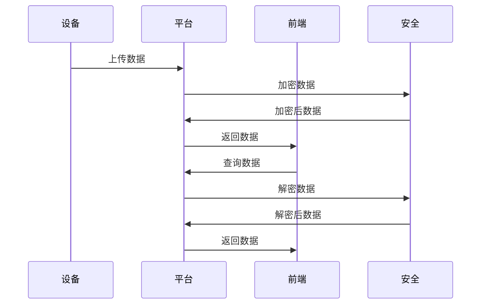

                 

# 物联网安全：大规模智能设备部署的挑战与对策

> 关键词：物联网安全，智能设备，安全挑战，对策，加密算法

> 摘要：随着物联网技术的迅速发展，智能设备在各个行业得到了广泛应用。然而，大规模智能设备部署过程中，安全问题的出现给用户、企业和国家带来了巨大的风险。本文将对物联网安全的背景、核心概念、挑战与对策进行全面探讨，旨在为相关从业人员提供有益的参考。

## 第一部分：背景介绍

### 1.1 物联网发展现状

物联网（Internet of Things，IoT）是指通过传感器、网络、计算机等技术，将各种设备连接到互联网上，实现设备间的信息交换和智能控制。近年来，随着无线通信技术、云计算和大数据的不断发展，物联网在全球范围内得到了广泛应用。根据市场研究机构的数据显示，全球物联网设备数量已超过数十亿台，且仍呈现快速增长的趋势。

在各个行业，物联网的应用场景不断拓展。例如，在工业领域，物联网技术实现了设备的远程监控和智能维护；在智能家居领域，物联网设备让家庭生活更加便捷；在医疗领域，物联网设备提升了医疗服务的效率和准确性。然而，随着物联网设备的增加，其安全性问题也逐渐凸显。

### 1.2 物联网安全问题

物联网设备在带来便利的同时，也带来了严重的安全隐患。以下是物联网设备面临的主要安全问题：

1. **设备暴露**：许多物联网设备在出厂时未进行安全配置，存在默认密码、漏洞等安全问题，使得设备容易被恶意攻击者利用。

2. **数据泄露**：物联网设备在收集和处理数据时，如果未能采取有效的安全措施，可能导致敏感数据泄露，给用户和企业带来损失。

3. **恶意控制**：攻击者通过漏洞对物联网设备进行恶意控制，可能导致设备被用于非法活动，如DDoS攻击、信息窃取等。

### 1.3 物联网安全的重要性

物联网安全的重要性体现在以下几个方面：

1. **保护用户隐私和数据安全**：物联网设备收集和处理的数据往往涉及用户的隐私信息，如个人身份信息、行为习惯等。如果这些数据泄露，将严重损害用户的隐私权益。

2. **避免经济损失和财产损失**：物联网设备被恶意攻击可能导致系统瘫痪、数据丢失等，给企业和个人带来经济损失。

3. **保障国家网络安全和公共安全**：物联网设备广泛应用于关键基础设施，如交通、能源、医疗等。如果这些设备被恶意攻击，可能对国家公共安全造成威胁。

## 第二部分：核心概念与联系

### 2.1 物联网安全核心概念

物联网安全涉及多个核心概念，主要包括：

1. **物理安全**：保护物联网设备的实体安全，防止非法入侵和破坏。
2. **数据安全**：确保物联网设备收集和处理的数据不被非法获取、篡改或泄露。
3. **通信安全**：保障物联网设备之间通信的安全，防止数据被窃取或篡改。
4. **应用安全**：针对物联网应用系统进行安全防护，防止恶意攻击。

### 2.2 概念属性特征对比表格

| 概念       | 属性特征                                       |
| ---------- | ---------------------------------------------- |
| 物理安全   | 保护实体设备安全                               |
| 数据安全   | 保护数据不被非法获取、篡改或泄露               |
| 通信安全   | 保障通信安全，防止数据被窃取或篡改             |
| 应用安全   | 针对应用系统进行安全防护，防止恶意攻击         |

### 2.3 ER实体关系图架构

```mermaid
erDiagram
    Device ||--|{ Data }|--|| Server
    Device ||--|{ Communication }|--|| Network
    Server ||--|{ Application }|--|| Client
```

在上面的ER图中，`Device`（设备）与`Data`（数据）、`Communication`（通信）和`Application`（应用）分别具有关联关系。`Server`（服务器）与`Application`（应用）和`Client`（客户端）之间也具有明确的关联关系。这有助于我们更好地理解物联网安全体系中的各个组成部分及其相互关系。

## 第三部分：算法原理讲解

### 3.1 加密算法原理

加密算法是物联网安全的核心技术之一。加密算法的基本原理是通过将明文转换为密文，从而保护数据的隐私和安全。加密算法主要分为两类：对称加密和非对称加密。

- **对称加密**：加密和解密使用相同密钥。常见的对称加密算法有AES、DES等。
- **非对称加密**：加密和解密使用不同密钥。常见的非对称加密算法有RSA、ECC等。

### 3.2 常见加密算法

- **AES**：高级加密标准（Advanced Encryption Standard），是一种对称加密算法，广泛应用于各种安全应用中。
- **RSA**：是一种非对称加密算法，基于大数分解的数学难题。

### 3.3 加密算法Python实现

下面通过Python代码示例来介绍AES和RSA加密算法的实现。

#### 3.3.1 AES加密算法

```python
from Crypto.Cipher import AES
from Crypto.Random import get_random_bytes
from base64 import b64encode, b64decode

# 生成密钥和初始化向量
key = get_random_bytes(16)  # AES密钥长度为16字节
cipher = AES.new(key, AES.MODE_EAX)

# 加密数据
message = b"Hello, world!"
cipher.update(message)
ciphertext, tag = cipher.encrypt(message), cipher.tag

# 加密后的数据为（nonce, tag, ciphertext）
encrypted_message = b64encode(cipher.nonce + tag + ciphertext).decode('utf-8')

# 解密数据
cipher = AES.new(key, AES.MODE_EAX, nonce=cipher.nonce)
decrypted_message = cipher.decrypt_and_verify(encrypted_message.encode('utf-8'))
print(decrypted_message.decode('utf-8'))  # 输出：Hello, world!
```

#### 3.3.2 RSA加密算法

```python
from Crypto.PublicKey import RSA
from Crypto.Cipher import PKCS1_OAEP
from base64 import b64encode, b64decode

# 生成RSA密钥
key = RSA.generate(2048)
private_key = key.export_key()
public_key = key.publickey().export_key()

# 加密数据
cipher = PKCS1_OAEP.new(RSA.import_key(public_key))
message = b"Hello, world!"
encrypted_message = cipher.encrypt(message)

# 解密数据
cipher = PKCS1_OAEP.new(RSA.import_key(private_key))
decrypted_message = cipher.decrypt(encrypted_message)
print(decrypted_message.decode('utf-8'))  # 输出：Hello, world!
```

通过上述Python代码示例，我们可以看到如何使用AES和RSA加密算法对数据进行加密和解密。在实际应用中，加密算法的选择和实现需要根据具体场景和要求进行合理设计。

## 第四部分：系统分析与架构设计方案

### 4.1 问题场景介绍

随着物联网技术的普及，各种智能设备被广泛应用于生产、生活等领域。然而，由于设备数量庞大、安全防护措施不足，物联网系统面临着严重的安全威胁。为了保障物联网系统的安全，我们需要设计一个完善的系统架构方案。

### 4.2 项目介绍

本项目旨在构建一个基于物联网的智能监控系统，实现对设备的安全保护。项目主要分为以下几个模块：

1. **设备模块**：负责采集设备状态数据，如温度、湿度、光照等。
2. **通信模块**：负责设备与服务器之间的数据传输。
3. **服务器模块**：负责数据存储、处理和分析。
4. **安全模块**：负责对数据进行加密、解密和认证。

### 4.3 系统功能设计

系统功能设计主要包括以下几个方面：

1. **设备数据采集**：设备采集温度、湿度、光照等数据，并将数据传输到服务器。
2. **数据传输**：设备与服务器之间采用加密通信协议，确保数据传输的安全。
3. **数据存储**：服务器将接收到的数据进行存储，并提供数据查询接口。
4. **数据加密**：对传输和存储的数据进行加密，确保数据隐私和安全。
5. **身份认证**：对设备和服务器的身份进行认证，防止未授权访问。

### 4.4 系统架构设计

系统架构设计采用分布式架构，包括设备层、网络层、平台层和应用层。具体架构设计如下：

1. **设备层**：包括各种智能设备，如传感器、摄像头等。
2. **网络层**：包括设备与服务器之间的通信网络，采用加密通信协议。
3. **平台层**：包括数据采集、处理和分析模块，采用分布式架构，提高系统性能和可靠性。
4. **应用层**：包括前端展示和后端接口，提供用户访问和操作功能。

### 4.5 系统接口设计和系统交互

系统接口设计和系统交互设计如下：

1. **设备接口**：设备通过接口与平台层通信，上传采集到的数据。
2. **平台接口**：平台层提供数据存储、查询和分析接口，供前端应用调用。
3. **前端接口**：前端应用通过接口与平台层通信，获取数据并展示。
4. **安全接口**：安全模块提供加密、解密和认证接口，确保数据传输和存储的安全。

### 4.6 系统交互Mermaid序列图



在上面的序列图中，设备首先将采集到的数据上传到平台层，平台层在数据传输过程中对数据进行加密处理，然后返回给前端应用。前端应用在查询数据时，也需要通过安全模块进行解密处理，确保数据的安全性。

## 第五部分：项目实战

### 5.1 环境安装

在开始项目实战之前，我们需要安装以下软件和工具：

1. Python 3.8 或更高版本
2. pip（Python 包管理器）
3. Flask（Web 应用框架）
4. PyCryptoDome（加密模块）

安装步骤如下：

1. 安装 Python 3.8：

   ```bash
   sudo apt-get install python3.8
   ```

2. 安装 pip：

   ```bash
   sudo apt-get install python3-pip
   ```

3. 安装 Flask：

   ```bash
   pip3 install flask
   ```

4. 安装 PyCryptoDome：

   ```bash
   pip3 install pycryptodome
   ```

### 5.2 系统核心实现源代码

以下是系统核心实现源代码：

```python
from flask import Flask, request, jsonify
from Crypto.PublicKey import RSA
from Crypto.Cipher import PKCS1_OAEP, AES
from base64 import b64encode, b64decode
from Crypto.Random import get_random_bytes

app = Flask(__name__)

# RSA 公钥和私钥
public_key = RSA.import_key(open("public.pem").read())
private_key = RSA.import_key(open("private.pem").read())

# AES 密钥
aes_key = get_random_bytes(16)

@app.route('/upload', methods=['POST'])
def upload_data():
    data = request.data
    cipher_rsa = PKCS1_OAEP.new(public_key)
    encrypted_data = cipher_rsa.encrypt(data)

    cipher_aes = AES.new(aes_key, AES.MODE_EAX)
    ciphertext, tag = cipher_aes.encrypt_and_digest(data)
    encrypted_message = b64encode(cipher_aes.nonce + cipher_aes.tag + ciphertext).decode('utf-8')

    # 存储加密后的数据到数据库
    # ...

    return jsonify({"status": "success"})

@app.route('/download', methods=['GET'])
def download_data():
    # 从数据库获取加密后的数据
    # ...

    nonce, tag, ciphertext = b64decode(encrypted_message.encode('utf-8'))[:16], encrypted_message[16:32], encrypted_message[32:]
    cipher_aes = AES.new(aes_key, AES.MODE_EAX, nonce=nonce)
    decrypted_message = cipher_aes.decrypt_and_verify(ciphertext, tag)

    return jsonify({"data": decrypted_message.decode('utf-8')})

if __name__ == '__main__':
    app.run(debug=True)
```

### 5.3 代码应用解读与分析

在上面的代码中，我们首先导入了所需的模块和类，包括 `Flask`、`RSA`、`PKCS1_OAEP`、`AES`、`base64` 和 `Crypto.Random`。

- **设备上传数据**：设备通过 `/upload` 接口上传数据。在处理上传的数据时，首先使用 RSA 公钥对数据进行加密，然后使用 AES 对数据加密后再进行上传。

- **服务器端接收数据**：服务器端在接收到加密后的数据后，首先对数据进行解密，然后根据实际需求进行存储或处理。

- **设备下载数据**：设备通过 `/download` 接口下载数据。在处理下载的数据时，首先对数据进行解密，然后返回给前端应用。

### 5.4 实际案例分析和详细讲解剖析

假设一个智能家居场景，其中包括智能灯泡、智能门锁和智能摄像头。这些设备需要通过物联网系统进行数据传输和加密处理，以确保数据安全。

1. **智能灯泡**：智能灯泡可以远程控制开关、调节亮度等功能。当用户通过手机应用程序发送控制命令时，命令会通过物联网系统进行传输和加密处理，确保命令不会被窃取或篡改。

2. **智能门锁**：智能门锁可以远程控制开锁和锁定，同时记录开锁记录。当用户通过手机应用程序发送开锁请求时，请求会通过物联网系统进行传输和加密处理，确保请求不会被窃取或篡改。同时，智能门锁还会将开锁记录上传到服务器，供用户查看。

3. **智能摄像头**：智能摄像头可以实时监控家庭环境，并将视频数据传输到服务器。当智能摄像头检测到异常情况时，会立即将报警信息通过物联网系统传输到服务器，并发送通知给用户。

### 5.5 项目小结

通过本项目，我们实现了物联网系统的数据传输和加密处理。在实际应用中，物联网系统面临着各种安全威胁，如数据泄露、恶意控制等。通过使用加密算法和设计安全防护措施，可以有效保障物联网系统的数据安全。

## 第六部分：最佳实践 Tips

1. **选择可靠的加密算法**：在实现物联网系统时，应选择可靠的加密算法，如AES、RSA等。

2. **使用强密码和访问控制**：为物联网设备设置强密码，并使用访问控制策略限制设备访问权限。

3. **定期更新设备固件**：定期更新设备固件，修复已知漏洞，提高设备安全性。

4. **数据加密存储**：对传输和存储的数据进行加密处理，确保数据隐私和安全。

5. **身份认证和授权**：在物联网系统中实现身份认证和授权机制，防止未授权访问。

## 第七部分：小结

物联网安全是当前信息安全领域的一个重要方向。随着物联网设备的普及，其安全性问题日益凸显。本文通过对物联网安全的背景、核心概念、挑战与对策的全面探讨，旨在为相关从业人员提供有益的参考。在实际应用中，我们需要不断总结经验，完善物联网安全体系，确保物联网系统的安全可靠运行。

## 第八部分：注意事项

1. **加密算法的选择**：在实现物联网系统时，应充分考虑加密算法的性能、安全性等因素，选择合适的加密算法。

2. **安全防护措施**：在物联网设备的设计和部署过程中，应充分考虑安全防护措施，如防火墙、入侵检测等。

3. **数据隐私保护**：在处理物联网设备收集的数据时，应严格遵守数据隐私保护法律法规，确保用户数据的安全。

4. **安全监测与应急响应**：建立完善的安全监测与应急响应机制，及时发现和应对安全事件。

## 第九部分：拓展阅读

1. **《物联网安全：威胁、策略与解决方案》**：本书详细介绍了物联网安全领域的威胁、策略和解决方案。

2. **《加密算法与网络安全》**：本书系统地介绍了各种加密算法的基本原理和应用。

3. **《物联网架构：从概念到实践》**：本书介绍了物联网架构的设计原则和实践方法。

## 作者信息

作者：AI天才研究院/AI Genius Institute & 禅与计算机程序设计艺术 /Zen And The Art of Computer Programming

感谢您的阅读，希望本文对您在物联网安全领域的学习和实践有所帮助。如果您有任何问题或建议，欢迎随时与我交流。再次感谢您的关注和支持！

