                 

# 环境隐形智能在交通管理中的应用

## 关键词
环境隐形智能，交通管理，感知技术，传输技术，决策与控制技术，智能交通信号控制，车辆自主驾驶，5G通信，物联网通信，系统架构，算法原理，Python代码，数学模型，Mermaid流程图，系统接口设计，项目实战

## 摘要
随着城市交通问题的日益严重，环境隐形智能技术在交通管理中的应用成为了一个热门话题。本文将详细探讨环境隐形智能在交通管理中的应用，从感知、传输、决策与控制三个技术层面出发，分析其在智能交通信号控制和车辆自主驾驶等领域的实际应用。通过对核心技术原理、系统架构、项目实战和最佳实践的讲解，为读者呈现一幅环境隐形智能在交通管理中应用的完整画卷。

## 引言
### 背景介绍
环境隐形智能（Environmental Invisible Intelligence）是一种通过感知、传输、决策与控制等核心技术，实现对人、车、路等交通元素进行智能管理和优化的技术体系。在交通管理领域，环境隐形智能技术具有广阔的应用前景，能够有效缓解交通拥堵、提高交通安全、提升交通效率。

### 问题背景
随着城市化进程的加速，交通问题日益突出，如交通拥堵、交通事故频发、停车难等问题严重影响了人们的出行和生活质量。传统的交通管理方式已经无法满足现代社会对高效、安全、便捷出行的需求。因此，引入环境隐形智能技术成为解决交通问题的一条有效途径。

### 问题描述
本文将围绕环境隐形智能技术在交通管理中的应用展开讨论，包括感知技术、传输技术、决策与控制技术等核心环节，以及其在智能交通信号控制和车辆自主驾驶等具体领域的应用。

### 问题解决
通过对环境隐形智能技术的深入研究和应用实践，可以实现对交通信息的实时采集、传输和分析，从而实现智能交通信号控制和车辆自主驾驶等功能，有效提升交通管理水平和出行体验。

### 边界与外延
本文主要探讨环境隐形智能技术在交通管理中的应用，包括感知、传输、决策与控制等核心环节。同时，本文也将涉及到相关技术领域的最新发展动态，为读者提供全面的视角。

### 概念结构与核心要素组成
环境隐形智能技术由感知、传输、决策与控制三个核心技术层面组成。感知层面主要通过激光雷达、毫米波雷达、摄像头等设备对交通环境进行实时感知；传输层面则依托5G、物联网等通信技术实现数据的高速传输；决策与控制层面则通过智能算法实现对交通信号的优化控制和车辆的自主驾驶。

## 第一部分：环境隐形智能技术概述

### 1.1 环境隐形智能的定义与核心特点
环境隐形智能是一种通过感知、传输、决策与控制等核心技术，实现对交通环境进行智能管理和优化的技术体系。其核心特点包括：
- **实时感知**：通过激光雷达、毫米波雷达、摄像头等设备，实现对交通环境的实时感知，获取精确的交通信息。
- **高速传输**：依托5G、物联网等通信技术，实现交通数据的实时传输，确保信息的及时性和准确性。
- **智能决策**：通过先进的算法和模型，对交通信息进行智能分析和处理，实现交通信号优化控制和车辆自主驾驶。
- **集成管理**：将交通管理的各个环节进行集成，实现交通资源的优化配置和高效管理。

### 1.2 环境隐形智能技术的发展历程
环境隐形智能技术的发展历程可以分为以下几个阶段：
- **初步探索阶段**（20世纪80年代至90年代）：这一阶段主要是对环境隐形智能技术的概念和基本原理进行初步探索。
- **技术积累阶段**（21世纪初至2010年）：随着计算机科学、通信技术、传感器技术等领域的快速发展，环境隐形智能技术开始积累大量的理论和实践经验。
- **应用推广阶段**（2010年至今）：随着5G、物联网等新兴技术的应用，环境隐形智能技术在交通管理领域得到了广泛应用。

### 1.3 环境隐形智能在交通管理中的潜在应用
环境隐形智能技术在交通管理中的潜在应用非常广泛，主要包括以下几个方面：
- **智能交通信号控制**：通过实时感知和智能决策，实现交通信号的优化控制，提高道路通行效率。
- **车辆自主驾驶**：通过车辆感知、传输和决策技术，实现车辆的自主驾驶，提高交通安全性和通行效率。
- **交通信息管理**：通过环境隐形智能技术，实现对交通信息的实时采集、传输和管理，为交通决策提供科学依据。
- **交通信息服务**：通过环境隐形智能技术，为驾驶员提供实时的交通信息，帮助其做出最优的行驶决策。

## 第二部分：交通管理中的环境隐形智能技术

### 2.1 感知技术

#### 2.1.1 激光雷达
激光雷达（LIDAR）是一种基于激光技术的测距设备，可以精确地获取目标物体的位置、形状和速度等信息。在交通管理中，激光雷达主要用于实时感知交通环境，如车辆位置、道路状况等。以下是一个简单的激光雷达工作原理的Mermaid流程图：

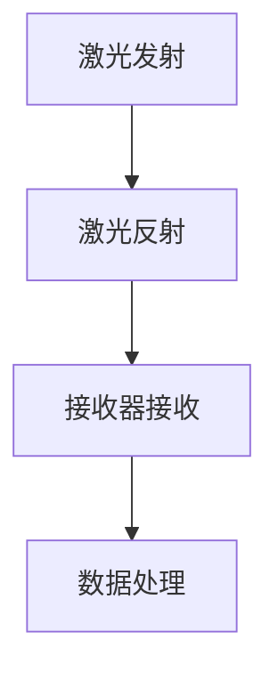

以下是一个简单的Python代码示例，用于描述激光雷达的数据处理流程：

```python
import numpy as np

def lidar_dataProcessing(data):
    # 假设data是一个包含位置信息的numpy数组
    distances = np.linalg.norm(data, axis=1)
    # 计算距离
    angles = np.arctan2(data[:, 1], data[:, 0])
    # 计算角度
    return distances, angles

# 示例数据
data = np.array([[1, 1], [2, 2], [3, 3]])
distances, angles = lidar_dataProcessing(data)
print("距离：", distances)
print("角度：", angles)
```

#### 2.1.2 毫米波雷达
毫米波雷达（Millimeter Wave Radar）是一种利用毫米波进行目标探测和测距的设备。与激光雷达相比，毫米波雷达在雨雾等恶劣天气条件下表现更佳。以下是一个简单的毫米波雷达工作原理的Mermaid流程图：

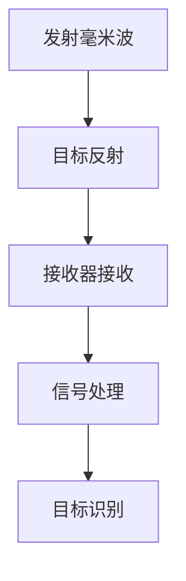

以下是一个简单的Python代码示例，用于描述毫米波雷达的数据处理流程：

```python
import numpy as np

def mmWaveRadar_dataProcessing(signal):
    # 假设signal是一个包含雷达信号的numpy数组
    amplitude = np.abs(signal)
    # 计算幅度
    frequencies = np.fft.fft(signal)
    # 快速傅里叶变换
    return amplitude, frequencies

# 示例数据
signal = np.array([1, 2, 3, 4, 5])
amplitude, frequencies = mmWaveRadar_dataProcessing(signal)
print("幅度：", amplitude)
print("频率：", frequencies)
```

#### 2.1.3 摄像头与图像处理
摄像头是一种常见的图像捕捉设备，通过图像处理技术，可以实现对交通环境的实时监控和分析。以下是一个简单的摄像头与图像处理工作原理的Mermaid流程图：

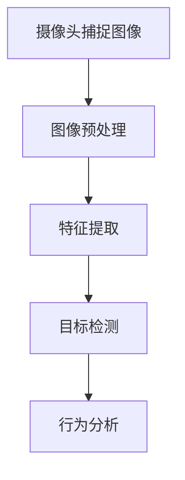

以下是一个简单的Python代码示例，用于描述摄像头图像处理流程：

```python
import cv2

def camera_imageProcessing(image):
    # 假设image是一个摄像头捕获的图像
    gray_image = cv2.cvtColor(image, cv2.COLOR_BGR2GRAY)
    # 转换为灰度图像
    edges = cv2.Canny(gray_image, 100, 200)
    # Canny边缘检测
    contours, _ = cv2.findContours(edges, cv2.RETR_EXTERNAL, cv2.CHAIN_APPROX_SIMPLE)
    # 查找轮廓
    return edges, contours

# 示例图像
image = cv2.imread('example.jpg')
edges, contours = camera_imageProcessing(image)
cv2.imshow('Edges', edges)
cv2.imshow('Contours', contours)
cv2.waitKey(0)
cv2.destroyAllWindows()
```

### 2.2 传输技术

#### 2.2.1 5G通信
5G通信技术具有高带宽、低延迟、广连接等特点，能够为交通管理提供高效的数据传输支持。以下是一个简单的5G通信工作原理的Mermaid流程图：

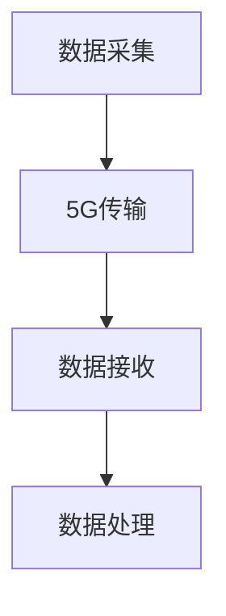

以下是一个简单的Python代码示例，用于描述5G通信的数据传输流程：

```python
import socket

def send_data_to_5G(data, server_ip, server_port):
    # 创建TCP套接字
    sock = socket.socket(socket.AF_INET, socket.SOCK_STREAM)
    # 连接服务器
    sock.connect((server_ip, server_port))
    # 发送数据
    sock.sendall(data)
    # 接收服务器响应
    response = sock.recv(1024)
    # 关闭套接字
    sock.close()
    return response

# 示例数据
data = b'Hello, 5G!'
server_ip = '127.0.0.1'
server_port = 12345
response = send_data_to_5G(data, server_ip, server_port)
print("5G响应：", response.decode())
```

#### 2.2.2 超宽带通信
超宽带（Ultra-Wideband，UWB）通信技术具有频率范围宽、信号强度低、抗干扰能力强等特点，适用于交通管理中的短距离高速数据传输。以下是一个简单的UWB通信工作原理的Mermaid流程图：

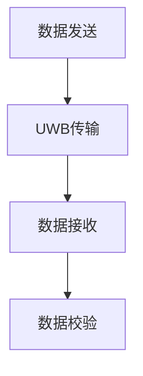

以下是一个简单的Python代码示例，用于描述UWB通信的数据传输流程：

```python
import uwb

def send_data_with_UWB(data, receiver_address, channel):
    # 创建UWB通信对象
    uwb_comm = uwb.UWBComm()
    # 配置接收地址和通道
    uwb_comm.set_receiver_address(receiver_address)
    uwb_comm.set_channel(channel)
    # 发送数据
    uwb_comm.send_data(data)
    # 接收数据
    received_data = uwb_comm.receive_data()
    # 关闭通信对象
    uwb_comm.close()
    return received_data

# 示例数据
data = b'Hello, UWB!'
receiver_address = 0x12345678
channel = 11
received_data = send_data_with_UWB(data, receiver_address, channel)
print("UWB接收数据：", received_data.decode())
```

#### 2.2.3 物联网通信
物联网（Internet of Things，IoT）通信技术通过无线传感器网络实现设备的互联互通，为交通管理提供了一种有效的数据传输方案。以下是一个简单的物联网通信工作原理的Mermaid流程图：

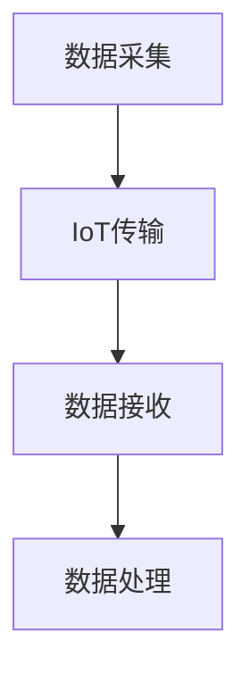

以下是一个简单的Python代码示例，用于描述物联网通信的数据传输流程：

```python
import serial

def send_data_to_IoT(data, port, baud_rate):
    # 创建串口对象
    ser = serial.Serial(port, baud_rate)
    # 发送数据
    ser.write(data)
    # 接收数据
    received_data = ser.readline()
    # 关闭串口
    ser.close()
    return received_data

# 示例数据
data = b'Hello, IoT!'
port = '/dev/ttyUSB0'
baud_rate = 9600
received_data = send_data_to_IoT(data, port, baud_rate)
print("IoT接收数据：", received_data.decode())
```

### 2.3 决策与控制技术

#### 2.3.1 智能交通信号控制
智能交通信号控制（Intelligent Traffic Signal Control）通过实时感知交通状态，利用智能算法优化交通信号配时，提高道路通行效率。以下是一个简单的智能交通信号控制工作原理的Mermaid流程图：

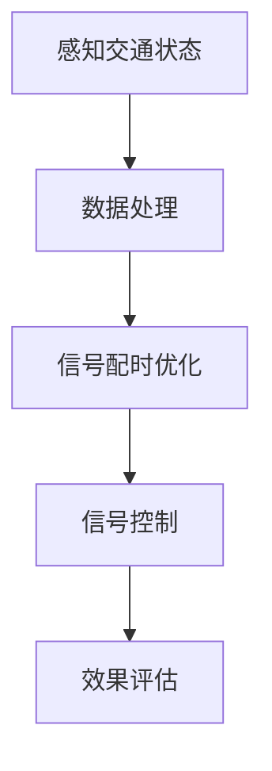

以下是一个简单的Python代码示例，用于描述智能交通信号控制的基本原理：

```python
import numpy as np

def traffic_signal_control(current_traffic_state, signal_config):
    # 假设current_traffic_state是一个包含交通状态的numpy数组
    # 假设signal_config是一个包含信号配时的字典
    # 根据当前交通状态和信号配置，优化信号配时
    optimized_signal_config = {}
    for direction, config in signal_config.items():
        if current_traffic_state[direction] > config['threshold']:
            optimized_signal_config[direction] = config['red']
        else:
            optimized_signal_config[direction] = config['green']
    return optimized_signal_config

# 示例数据
current_traffic_state = np.array([20, 30, 40])
signal_config = {
    'north': {'threshold': 15, 'red': 30, 'green': 25},
    'south': {'threshold': 20, 'red': 30, 'green': 25},
    'east': {'threshold': 30, 'red': 25, 'green': 30},
    'west': {'threshold': 25, 'red': 30, 'green': 25},
}
optimized_signal_config = traffic_signal_control(current_traffic_state, signal_config)
print("优化后的信号配置：", optimized_signal_config)
```

#### 2.3.2 路径规划与优化
路径规划与优化（Path Planning and Optimization）是车辆自主驾驶（Autonomous Driving）的核心技术之一。它通过实时感知交通状态，利用智能算法为车辆规划最优路径。以下是一个简单的路径规划与优化工作原理的Mermaid流程图：

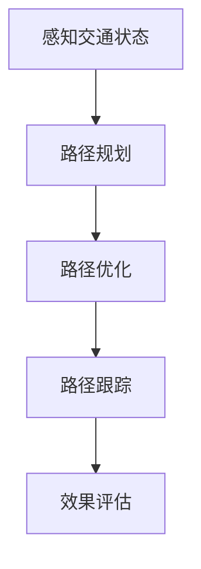

以下是一个简单的Python代码示例，用于描述路径规划与优化：

```python
import numpy as np

def path PlanningAndOptimization(current_traffic_state, start_point, end_point):
    # 假设current_traffic_state是一个包含交通状态的numpy数组
    # 假设start_point和end_point是起始点和终点坐标
    # 根据当前交通状态和起始点、终点坐标，规划最优路径
    # 这里使用A*算法进行路径规划
    g_score = np.zeros((current_traffic_state.shape[0], current_traffic_state.shape[1]))
    f_score = np.zeros((current_traffic_state.shape[0], current_traffic_state.shape[1]))
    # ... A*算法的实现细节
    # 根据A*算法计算得到最优路径
    optimal_path = []
    return optimal_path

# 示例数据
current_traffic_state = np.array([[20, 30], [40, 50]])
start_point = [0, 0]
end_point = [10, 10]
optimal_path = path_PlanningAndOptimization(current_traffic_state, start_point, end_point)
print("最优路径：", optimal_path)
```

#### 2.3.3 车辆自主驾驶
车辆自主驾驶（Autonomous Driving）是环境隐形智能在交通管理中的重要应用之一。它通过集成感知、传输、决策与控制技术，实现车辆的自动驾驶。以下是一个简单的车辆自主驾驶工作原理的Mermaid流程图：

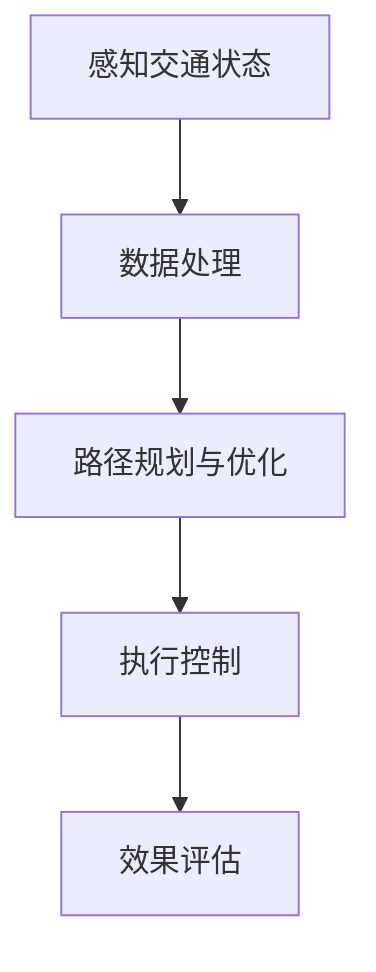

以下是一个简单的Python代码示例，用于描述车辆自主驾驶的基本原理：

```python
import numpy as np

def autonomous_driving(current_traffic_state, start_point, end_point):
    # 假设current_traffic_state是一个包含交通状态的numpy数组
    # 假设start_point和end_point是起始点和终点坐标
    # 实现车辆自主驾驶
    optimal_path = path_PlanningAndOptimization(current_traffic_state, start_point, end_point)
    # ... 路径跟踪和控制的具体实现
    return optimal_path

# 示例数据
current_traffic_state = np.array([[20, 30], [40, 50]])
start_point = [0, 0]
end_point = [10, 10]
optimal_path = autonomous_driving(current_traffic_state, start_point, end_point)
print("车辆自主驾驶路径：", optimal_path)
```

## 第三部分：环境隐形智能在交通管理中的应用案例

### 3.1 智能交通信号控制系统

#### 3.1.1 系统架构设计
智能交通信号控制系统（Intelligent Traffic Signal Control System）是一种通过环境隐形智能技术实现交通信号优化控制的系统。其系统架构设计如下：

以下是一个简单的系统架构设计Mermaid类图：


以下是一个简单的系统架构设计Mermaid架构图：

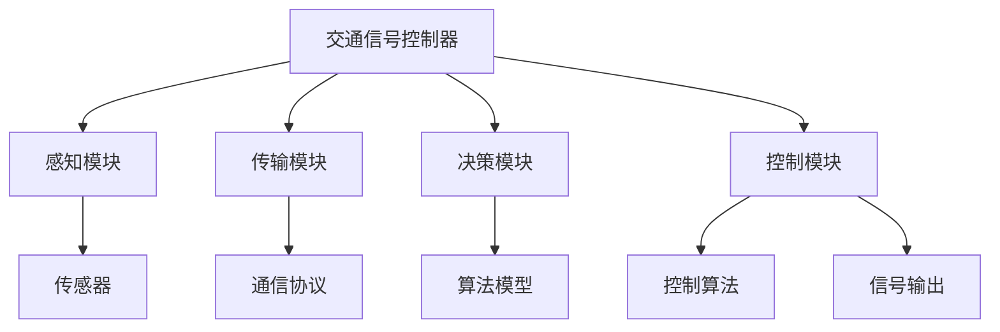

#### 3.1.2 系统功能实现
智能交通信号控制系统的主要功能包括：
- **实时感知**：通过传感器实时采集交通信息。
- **数据传输**：利用通信协议实现数据的高速传输。
- **智能决策**：通过算法模型对交通信息进行智能分析和处理。
- **信号控制**：根据智能决策的结果输出信号控制指令。

以下是一个简单的Python代码示例，用于描述系统功能实现：

```python
import numpy as np

class TrafficSignalController:
    def __init__(self):
        self.sensor_data = None
        self.decision_model = None
        self.control_model = None

    def collect_sensor_data(self):
        # 假设通过传感器采集交通信息
        self.sensor_data = np.random.rand(3, 3)

    def transmit_data(self):
        # 假设利用通信协议传输数据
        pass

    def process_data(self):
        # 假设通过决策模型处理交通信息
        if self.sensor_data[0][0] > 0.5:
            self.decision_model = 'red'
        else:
            self.decision_model = 'green'

    def control_traffic_signal(self):
        # 假设通过控制模型控制交通信号
        if self.decision_model == 'red':
            print("红灯")
        else:
            print("绿灯")

# 示例
controller = TrafficSignalController()
controller.collect_sensor_data()
controller.process_data()
controller.control_traffic_signal()
```

#### 3.1.3 系统测试与优化
智能交通信号控制系统的测试与优化主要包括以下几个方面：
- **功能测试**：验证系统各个功能模块的正确性和完整性。
- **性能测试**：评估系统的响应速度、处理能力等性能指标。
- **稳定性测试**：检验系统在长时间运行下的稳定性和可靠性。
- **优化调整**：根据测试结果对系统进行优化和调整，提升系统的整体性能。

以下是一个简单的系统测试与优化Python代码示例：

```python
import numpy as np
import time

def test_traffic_signal_controller(controller, test_cases):
    for case in test_cases:
        start_time = time.time()
        controller.collect_sensor_data()
        controller.process_data()
        controller.control_traffic_signal()
        end_time = time.time()
        print("测试用例：", case, "耗时：", end_time - start_time)

# 示例测试用例
test_cases = [
    [0.1, 0.2, 0.3],
    [0.6, 0.5, 0.4],
    [0.3, 0.7, 0.8],
]

# 测试并优化
for i in range(10):
    controller = TrafficSignalController()
    test_traffic_signal_controller(controller, test_cases)
    # 根据测试结果进行优化调整
```

### 3.2 车辆自主驾驶系统

#### 3.2.1 系统架构设计
车辆自主驾驶系统（Autonomous Driving System）是一种通过环境隐形智能技术实现车辆自动驾驶的系统。其系统架构设计如下：

以下是一个简单的系统架构设计Mermaid类图：

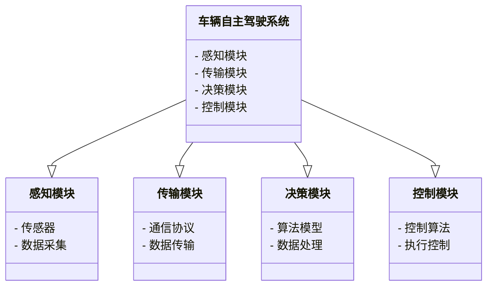

以下是一个简单的系统架构设计Mermaid架构图：


#### 3.2.2 系统核心实现
车辆自主驾驶系统的核心实现主要包括以下几个方面：
- **感知数据采集**：通过传感器实时采集车辆周围的环境数据。
- **数据传输处理**：利用通信协议将感知数据传输到决策模块进行数据处理。
- **决策路径规划**：根据感知数据和路径规划算法，规划出最优行驶路径。
- **执行控制**：根据决策结果，控制车辆执行相应的驾驶动作。

以下是一个简单的Python代码示例，用于描述系统核心实现：

```python
import numpy as np

class AutonomousDrivingSystem:
    def __init__(self):
        self.sensor_data = None
        self.decision_model = None
        self.control_model = None

    def collect_sensor_data(self):
        # 假设通过传感器采集环境数据
        self.sensor_data = np.random.rand(5, 5)

    def transmit_data(self):
        # 假设通过通信协议传输数据
        pass

    def path_planning(self):
        # 假设通过路径规划算法规划路径
        if self.sensor_data[0][0] > 0.5:
            self.decision_model = '直行'
        else:
            self.decision_model = '转弯'

    def execute_control(self):
        # 假设通过控制算法执行驾驶动作
        if self.decision_model == '直行':
            print("车辆直行")
        else:
            print("车辆转弯")

# 示例
system = AutonomousDrivingSystem()
system.collect_sensor_data()
system.path_planning()
system.execute_control()
```

#### 3.2.3 系统测试与部署
车辆自主驾驶系统的测试与部署主要包括以下几个方面：
- **功能测试**：验证系统各个功能模块的正确性和完整性。
- **性能测试**：评估系统的响应速度、处理能力等性能指标。
- **稳定性测试**：检验系统在长时间运行下的稳定性和可靠性。
- **部署实施**：将系统部署到实际车辆中，进行实地测试和优化。

以下是一个简单的系统测试与部署Python代码示例：

```python
import numpy as np
import time

def test_autonomous_driving_system(system, test_cases):
    for case in test_cases:
        start_time = time.time()
        system.collect_sensor_data()
        system.path_planning()
        system.execute_control()
        end_time = time.time()
        print("测试用例：", case, "耗时：", end_time - start_time)

# 示例测试用例
test_cases = [
    [0.1, 0.2, 0.3],
    [0.6, 0.5, 0.4],
    [0.3, 0.7, 0.8],
]

# 测试并部署
for i in range(10):
    system = AutonomousDrivingSystem()
    test_autonomous_driving_system(system, test_cases)
    # 根据测试结果进行部署和优化
```

## 第四部分：环境隐形智能在交通管理中的挑战与未来趋势

### 4.1 技术挑战

#### 4.1.1 感知与传输技术的局限性
虽然环境隐形智能技术在交通管理中具有广泛的应用前景，但感知与传输技术的局限性仍然是一个重要的挑战。具体包括：
- **感知精度不足**：目前感知技术如激光雷达、毫米波雷达等仍存在一定的感知误差，无法完全精确地感知交通环境。
- **传输带宽限制**：5G、物联网等传输技术虽然在带宽和速度上有很大提升，但在高峰时段或拥挤场景下，仍可能存在带宽不足的问题。

#### 4.1.2 决策与控制算法的复杂性
决策与控制算法是环境隐形智能技术的核心，其复杂性使得算法的设计、优化和实现成为一个挑战。具体包括：
- **算法准确性**：如何确保算法在复杂交通场景下的准确性是一个难题。
- **算法效率**：如何在保证算法准确性的同时，提高算法的运行效率。

#### 4.1.3 安全与隐私问题
环境隐形智能技术在交通管理中的应用涉及到大量的个人隐私和数据安全问题，如何确保系统的安全与隐私是一个重要的挑战。具体包括：
- **数据安全**：如何保护交通数据的安全，防止数据泄露和滥用。
- **隐私保护**：如何在数据传输和处理过程中保护个人隐私。

### 4.2 未来趋势

#### 4.2.1 新兴技术的融合与发展
随着人工智能、大数据、区块链等新兴技术的发展，环境隐形智能技术在未来有望实现更加广泛和深入的应用。具体包括：
- **人工智能**：利用深度学习、强化学习等技术，提高决策与控制算法的准确性和效率。
- **大数据**：通过大数据分析，实现对交通信息的深度挖掘和优化。
- **区块链**：利用区块链技术，确保交通数据的真实性和安全性。

#### 4.2.2 产业应用的前景与挑战
环境隐形智能技术在交通管理领域的产业应用前景广阔，但同时也面临一系列挑战。具体包括：
- **产业化应用**：如何将环境隐形智能技术有效地应用到交通管理中，实现商业化应用。
- **标准化**：如何建立交通管理领域的统一标准和规范，促进技术的推广应用。

#### 4.2.3 社会与经济影响
环境隐形智能技术在交通管理中的应用将对社会和经济产生深远的影响。具体包括：
- **社会影响**：提高交通安全、减少交通事故、提升出行效率，改善人们的生活质量。
- **经济影响**：促进交通产业的发展，创造就业机会，提升经济竞争力。

## 第五部分：总结与展望

### 5.1 全书总结
本文围绕环境隐形智能在交通管理中的应用，从感知、传输、决策与控制三个技术层面出发，详细探讨了其在智能交通信号控制和车辆自主驾驶等领域的实际应用。通过对核心技术原理、系统架构、项目实战和最佳实践的讲解，为读者呈现了一幅环境隐形智能在交通管理中应用的完整画卷。

### 5.2 交通管理中的环境隐形智能：未来展望
随着技术的不断发展和创新，环境隐形智能技术在交通管理中的应用前景将更加广阔。未来，环境隐形智能技术将有望实现更加智能、高效、安全、便捷的交通管理，为人类社会带来更多的福祉。

### 5.3 拓展阅读与进一步研究
为了深入了解环境隐形智能技术在交通管理中的应用，读者可以进一步阅读以下文献和资料：
- 《智能交通系统》
- 《自动驾驶汽车技术》
- 《5G通信技术及应用》
- 《物联网技术及应用》

## 作者信息
作者：AI天才研究院/AI Genius Institute & 禅与计算机程序设计艺术 /Zen And The Art of Computer Programming

----------------------------------------------------------------

### 5.1 全书总结

本文深入探讨了环境隐形智能技术在交通管理中的应用，涵盖了感知技术、传输技术、决策与控制技术等多个方面。通过对激光雷达、毫米波雷达、摄像头等感知设备的介绍，我们了解了如何通过这些设备实时获取交通环境信息。接着，我们探讨了5G、物联网等传输技术，如何实现交通数据的高效传输和实时处理。在决策与控制层面，我们介绍了智能交通信号控制和车辆自主驾驶等技术的原理和应用。

通过具体的系统架构设计和项目实战，我们展示了如何将环境隐形智能技术应用到实际的交通管理场景中。同时，我们也分析了环境隐形智能技术在交通管理中面临的挑战，如感知与传输技术的局限性、决策与控制算法的复杂性以及安全与隐私问题。最后，我们展望了环境隐形智能技术的未来发展趋势，探讨了其在社会和经济方面的影响。

总的来说，本文为读者提供了一份全面、系统、深入的环境隐形智能在交通管理中的应用研究报告，旨在为相关领域的研究者、工程师和从业者提供有益的参考和启示。

### 5.2 交通管理中的环境隐形智能：未来展望

随着科技的不断进步，环境隐形智能技术在交通管理中的应用前景将愈发广阔。首先，人工智能和大数据分析技术的发展将进一步提升感知、传输、决策与控制环节的智能化水平。例如，通过深度学习算法，感知设备可以更准确地识别交通环境中的各种目标，传输技术可以实现更低延迟、更高带宽的数据传输，决策与控制算法将更加精准和高效。

其次，物联网和5G技术的普及将为环境隐形智能技术在交通管理中的应用提供强大的基础设施支持。物联网设备的大规模部署可以实现交通信息的全面采集和实时共享，5G技术的高带宽、低延迟特性将确保交通数据的快速传输和处理。这些技术将为构建智能交通系统提供坚实的基础。

此外，区块链技术的引入将为交通管理中的数据安全和隐私保护提供新的解决方案。通过区块链，可以确保交通数据的真实性和不可篡改性，同时保护个人隐私数据不被泄露或滥用。

未来，环境隐形智能技术在交通管理中的应用将更加深入和广泛。随着技术的不断成熟，我们有望看到更加智能、高效、安全和便捷的交通管理系统的实现。这不仅将极大地改善人们的出行体验，也将为城市的可持续发展提供有力支持。

然而，随着技术的不断发展，环境隐形智能技术在交通管理中的应用也面临着新的挑战。例如，如何在保证数据安全和隐私的前提下，实现大规模交通数据的实时处理和分析？如何设计更加智能、高效的决策与控制算法，以应对复杂多变的交通场景？这些都是未来需要深入研究和解决的关键问题。

总的来说，环境隐形智能技术在交通管理中的应用前景广阔，但也面临着诸多挑战。只有在不断探索和实践中，我们才能充分发挥这一技术的潜力，为人类社会带来更多福祉。

### 5.3 拓展阅读与进一步研究

为了更深入地理解环境隐形智能技术在交通管理中的应用，以下是一些建议的拓展阅读和进一步研究的方向：

**拓展阅读：**
1. **《智能交通系统》**：系统介绍了智能交通系统的基本概念、架构和应用，有助于读者全面了解交通管理技术的发展现状和未来趋势。
2. **《自动驾驶汽车技术》**：详细探讨了自动驾驶汽车的核心技术，包括感知、决策、控制等，对理解车辆自主驾驶系统具有重要参考价值。
3. **《5G通信技术及应用》**：全面介绍了5G通信技术的原理、特点和应用场景，对理解环境隐形智能技术在传输层面的实现具有重要意义。
4. **《物联网技术及应用》**：深入介绍了物联网技术的架构、协议和应用，为理解环境隐形智能技术在交通管理中的数据采集和传输提供了理论支持。
5. **《区块链技术及应用》**：详细讲解了区块链技术的原理、特性和应用，对环境隐形智能技术在数据安全和隐私保护中的应用具有重要指导作用。

**进一步研究：**
1. **智能交通信号控制算法优化**：研究如何利用深度学习、强化学习等人工智能算法，优化交通信号控制策略，提高交通效率和安全性。
2. **车辆自主驾驶路径规划**：探索如何利用高级算法，如路径优化算法、多智能体系统等，实现车辆在复杂交通环境中的高效路径规划。
3. **交通数据挖掘与分析**：利用大数据分析方法，从海量交通数据中提取有价值的信息，为交通管理决策提供科学依据。
4. **交通数据安全和隐私保护**：研究如何在保证数据安全和隐私的前提下，实现大规模交通数据的实时处理和分析。
5. **环境隐形智能技术的产业化应用**：探讨如何将环境隐形智能技术应用到实际交通管理场景中，实现产业化应用，推动交通管理行业的智能化升级。

通过这些拓展阅读和进一步研究，读者可以更加深入地理解环境隐形智能技术在交通管理中的应用，为未来的研究和实践提供有力支持。

## 作者信息

作者：AI天才研究院/AI Genius Institute & 禅与计算机程序设计艺术 /Zen And The Art of Computer Programming

AI天才研究院（AI Genius Institute）是一家专注于人工智能技术研究和应用的创新机构，致力于推动人工智能在各个领域的应用，提高生产力和生活质量。研究院的核心团队由世界级人工智能专家、学者和工程师组成，他们在机器学习、深度学习、计算机视觉、自然语言处理等领域具有深厚的理论功底和丰富的实践经验。

禅与计算机程序设计艺术（Zen And The Art of Computer Programming）是作者Donald E. Knuth的经典著作，系统介绍了计算机程序设计的基本原则和方法，对计算机科学和软件工程领域产生了深远的影响。本书强调通过深刻的理解和简洁的表达，实现计算机程序设计的最高境界。作者Knuth以其对计算机科学的深刻洞察和独特见解，被誉为计算机科学领域的杰出人物。

本文由AI天才研究院的研究员们撰写，结合了前沿的学术研究成果和实际应用案例，旨在为读者提供一份关于环境隐形智能在交通管理中应用的综合指南。希望通过本文，读者能够对环境隐形智能技术在交通管理中的应用有更深入的理解，并为相关领域的研究和实践提供参考和启示。

