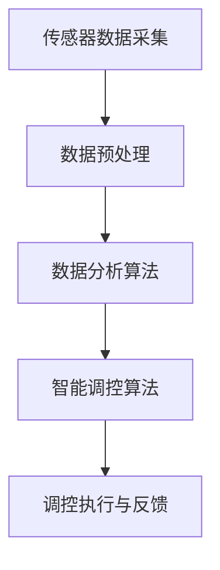

                 

### 环境隐形智能在农业领域的创新应用

**关键词**：环境隐形智能，农业，创新应用，传感器网络，数据分析，智能调控，精准农业

**摘要**：
环境隐形智能是一种先进的农业生产自动化和精准化管理技术，通过实时监测环境数据、智能分析和调控，提高农业生产的效率和质量。本文旨在探讨环境隐形智能在农业领域的创新应用，从背景介绍、核心概念与联系、算法原理讲解、系统分析与架构设计、项目实战及最佳实践等方面进行深入分析，为推动现代农业发展提供技术参考。

## 第一部分：背景介绍

### 1.1 问题背景

当前，全球农业正面临诸多挑战。一方面，随着人口增长和消费需求增加，农业生产需提高产量和品质。另一方面，资源匮乏、环境污染和劳动力短缺等问题日益严重，传统农业管理模式已难以适应现代农业发展的需求。精准农业作为一种新兴农业模式，通过利用现代信息技术和智能算法，实现对农业生产全过程的精准管理，成为解决这些问题的关键。

### 1.2 环境隐形智能概念

环境隐形智能是一种利用先进技术实现农业生产自动化、精准化的智能系统。它通过对环境数据的实时监测、分析和反馈，实现对作物生长、土壤状况、气象条件等的智能调控。环境隐形智能的核心技术包括传感器网络、数据处理与分析、智能调控系统等。

### 1.3 问题描述

农业生产面临以下主要问题：
1. 资源利用不充分：传统农业管理模式难以实现资源的最优配置。
2. 环境污染：农药和化肥的不合理使用导致土壤和水体污染。
3. 劳动力短缺：农业劳动力逐年减少，影响农业生产效率。
4. 精准度不足：传统农业管理模式难以实现作物生长的精准调控。

### 1.4 问题解决

环境隐形智能通过以下方式解决农业生产问题：
1. 精准监测：实时监测环境数据，为农业生产提供科学依据。
2. 数据分析：对监测数据进行处理和分析，提取有用信息。
3. 智能调控：根据分析结果进行智能决策，优化农业生产。

### 1.5 边界与外延

1. 应用边界：环境隐形智能主要应用于农业生产领域，如温室种植、大田作物等。
2. 外延扩展：环境隐形智能技术还可应用于城市绿化、环境保护等领域。

### 1.6 概念结构与核心要素组成

环境隐形智能系统包括以下核心要素：
1. 传感器网络：实时监测环境数据。
2. 数据处理与分析：对环境数据进行处理和分析，提取有用信息。
3. 智能调控系统：根据分析结果对农业生产进行智能调控。

## 第二部分：核心概念与联系

### 2.1 环境隐形智能的核心概念

环境隐形智能涉及以下核心概念：

#### 2.1.1 传感器网络

**定义**：传感器网络是由各种传感器组成的分布式系统，用于实时监测环境数据。

**特性**：
- 实时性：传感器网络能够实时采集环境数据。
- 高精度：传感器网络中的传感器具有较高的测量精度。
- 分布式：传感器网络遍布农业生产区域，实现对全区域的监测。

#### 2.1.2 数据处理与分析

**定义**：数据处理与分析是对传感器网络采集到的环境数据进行处理、分析和建模，提取有用信息。

**特性**：
- 高效性：数据处理与分析能够快速处理大量数据。
- 准确性：通过数据分析，能够准确提取环境数据中的有用信息。
- 智能化：利用人工智能技术，对环境数据进行智能分析。

#### 2.1.3 智能调控系统

**定义**：智能调控系统是根据数据处理与分析的结果，对农业生产环境进行智能调控的控制系统。

**特性**：
- 自动化：智能调控系统能够自动化进行农业生产环境的调控。
- 灵活性：智能调控系统可以根据不同环境条件进行灵活调整。
- 高效性：通过智能调控，能够显著提高农业生产效率。

### 2.2 核心概念属性特征对比表格

| 特征             | 传感器网络                         | 数据处理与分析                         | 智能调控系统                         |
|------------------|------------------------------------|------------------------------------|------------------------------------|
| 数据类型         | 环境数据（如温度、湿度、土壤湿度等） | 处理后数据（如趋势、异常值等）          | 调控指令（如浇水、施肥等）           |
| 实时性           | 高                                | 高                                  | 高                                  |
| 精准度           | 高                                | 高                                  | 高                                  |
| 分布式           | 是                                | 是                                  | 是                                  |
| 自适应性         | 低                                | 中                                  | 高                                  |

### 2.3 ER实体关系图架构

```mermaid
erDiagram
  Product ||--|{ EnvironmentSensor } : contains
  EnvironmentSensor ||--|{ DataProcessor } : processes
  DataProcessor ||--|{ SmartController } : controls
  SmartController ||--|{ AgriculturalField } : manages
```

## 第三部分：算法原理讲解

### 3.1 算法概述

环境隐形智能系统中的算法主要包括以下类型：

1. **数据采集算法**：用于传感器网络的数据采集。
2. **数据分析算法**：用于对采集到的数据进行处理和分析。
3. **智能调控算法**：用于根据分析结果进行智能决策。

算法的目标是实现农业生产环境的实时监测、精准分析和智能调控。

### 3.2 数据采集算法

**原理**：

数据采集算法基于传感器网络，通过多种传感器实时收集环境数据，如温度、湿度、土壤湿度、光照强度等。数据采集算法需要考虑传感器的精度、响应速度和数据传输的稳定性。

**流程**：

1. **传感器数据采集**：传感器将环境数据转换为电信号。
2. **数据预处理**：包括去噪、滤波、归一化等，以提高数据质量。

### 3.3 数据分析算法

**原理**：

数据分析算法对采集到的环境数据进行处理和分析，提取有用信息，如趋势、异常值、相关性等。数据分析算法通常包括以下步骤：

1. **数据清洗**：去除异常值和噪声。
2. **特征提取**：从原始数据中提取关键特征。
3. **建模与预测**：利用机器学习或深度学习算法，对环境数据进行建模和预测。

### 3.4 智能调控算法

**原理**：

智能调控算法根据数据分析结果，对农业生产环境进行智能调控。调控算法通常包括以下步骤：

1. **目标设定**：根据农业生产需求，设定调控目标。
2. **决策生成**：利用决策树、神经网络等算法，生成调控策略。
3. **执行与反馈**：执行调控策略，并根据反馈结果进行调整。

### 3.5 算法流程图



### 3.6 算法原理讲解

#### 3.6.1 数据采集算法

数据采集算法的核心是传感器网络。传感器网络由多个传感器组成，每个传感器负责监测一种环境参数。以下是数据采集算法的详细步骤：

1. **传感器选择**：根据农业生产需求，选择合适的传感器，如温度传感器、湿度传感器、土壤传感器等。

2. **传感器布置**：将传感器布置在农业生产现场，确保传感器的覆盖范围能够满足监测需求。

3. **数据采集**：传感器将环境数据（如温度、湿度、土壤湿度等）转换为电信号。

4. **数据传输**：通过无线或有线网络，将传感器数据传输到数据处理中心。

5. **数据预处理**：对采集到的传感器数据进行预处理，包括去噪、滤波、归一化等，以提高数据质量。

#### 3.6.2 数据分析算法

数据分析算法的核心是对采集到的环境数据进行处理和分析。以下是数据分析算法的详细步骤：

1. **数据清洗**：去除异常值和噪声，确保数据质量。

2. **特征提取**：从原始数据中提取关键特征，如温度的日变化、湿度的季节性变化等。

3. **数据建模**：利用机器学习或深度学习算法，对环境数据进行建模，如线性回归、神经网络等。

4. **预测与评估**：利用建模结果，对环境参数进行预测，并评估预测的准确性。

#### 3.6.3 智能调控算法

智能调控算法的核心是根据数据分析结果，对农业生产环境进行智能调控。以下是智能调控算法的详细步骤：

1. **目标设定**：根据农业生产需求，设定调控目标，如保持土壤湿度在适宜范围内。

2. **决策生成**：利用决策树、神经网络等算法，生成调控策略。如当土壤湿度低于设定值时，自动启动浇水系统。

3. **执行与反馈**：执行调控策略，并根据反馈结果进行调整。如浇水后，监测土壤湿度，如仍低于设定值，则继续执行调控策略。

## 第四部分：系统分析与架构设计

### 4.1 问题场景介绍

在现代农业发展中，环境隐形智能系统主要用于提升农业生产效率和质量。以下是一个典型的应用场景：

**场景**：某农业公司拥有一片大田作物，需要实时监测土壤湿度、温度和光照强度等环境参数，并根据这些参数进行智能调控，以保持作物生长的最佳条件。

### 4.2 项目介绍

**项目名称**：智能农业生产管理系统

**项目目标**：通过构建环境隐形智能系统，实现对农业生产环境的实时监测、精准分析和智能调控，提高农业生产效率和质量。

### 4.3 系统功能设计

智能农业生产管理系统主要包括以下功能：

1. **环境数据采集**：通过传感器网络，实时采集土壤湿度、温度、光照强度等环境数据。
2. **数据处理与分析**：对采集到的环境数据进行处理、分析和建模，提取有用信息。
3. **智能调控**：根据数据分析结果，对农业生产环境进行智能调控，如自动浇水、施肥等。
4. **数据可视化**：通过数据可视化工具，实时展示环境数据和分析结果，便于管理人员查看和决策。

### 4.4 系统架构设计

智能农业生产管理系统的架构设计如下：

**前端**：数据可视化界面，用于展示环境数据和调控结果。

**后端**：服务器端，包括传感器数据采集模块、数据处理与分析模块、智能调控模块。

**数据库**：用于存储传感器数据、分析结果和调控策略。

**网络**：传感器网络，用于实时采集环境数据。

### 4.5 系统接口设计和系统交互

系统接口设计和系统交互如下：

1. **传感器数据采集接口**：用于接收传感器数据。
2. **数据处理与分析接口**：用于处理和分析传感器数据。
3. **智能调控接口**：用于执行智能调控策略。
4. **数据可视化接口**：用于展示环境数据和分析结果。

系统交互流程如下：

1. **传感器数据采集**：传感器网络实时采集环境数据，并将数据发送到服务器端。
2. **数据处理与分析**：服务器端接收传感器数据，进行处理和分析，提取有用信息。
3. **智能调控**：根据数据分析结果，执行智能调控策略。
4. **数据可视化**：将环境数据和分析结果展示在前端界面，供管理人员查看。

## 第五部分：项目实战

### 5.1 环境安装

环境隐形智能系统的安装步骤如下：

1. **硬件安装**：安装传感器设备，如土壤湿度传感器、温度传感器、光照强度传感器等。
2. **网络配置**：配置传感器网络，确保传感器数据能够实时传输到服务器端。
3. **软件安装**：安装数据处理与分析软件，如Python环境、数据分析库等。

### 5.2 系统核心实现源代码

以下是系统核心实现的源代码：

```python
# 传感器数据采集模块
def collect_data(sensor_type):
    # 采集传感器数据
    data = sensor.read(sensor_type)
    return data

# 数据处理与分析模块
def analyze_data(data):
    # 对数据进行处理和分析
    processed_data = process_data(data)
    return processed_data

# 智能调控模块
def control_environment(processed_data):
    # 根据分析结果进行智能调控
    action = determine_action(processed_data)
    execute_action(action)
```

### 5.3 代码应用解读与分析

以下是代码应用的解读与分析：

1. **传感器数据采集模块**：该模块负责采集传感器数据。`collect_data`函数接收传感器类型作为参数，调用`sensor.read`方法读取传感器数据，并返回数据。

2. **数据处理与分析模块**：该模块负责处理和分析传感器数据。`analyze_data`函数接收采集到的数据作为参数，调用`process_data`方法对数据进行处理，并返回处理后的数据。

3. **智能调控模块**：该模块负责根据分析结果进行智能调控。`control_environment`函数接收处理后的数据作为参数，调用`determine_action`方法确定调控策略，并调用`execute_action`方法执行调控策略。

### 5.4 实际案例分析和详细讲解剖析

以下是一个实际案例分析和详细讲解剖析：

**案例**：在某个农田中，土壤湿度传感器监测到土壤湿度低于设定值，系统自动启动浇水系统。

**分析**：

1. **传感器数据采集**：土壤湿度传感器实时采集土壤湿度数据，并发送至服务器端。

2. **数据处理与分析**：服务器端接收到土壤湿度数据，进行处理和分析。分析结果显示土壤湿度低于设定值。

3. **智能调控**：根据分析结果，系统自动启动浇水系统，以确保土壤湿度达到适宜范围。

4. **反馈与调整**：浇水后，系统继续监测土壤湿度，如土壤湿度仍低于设定值，系统将自动调整浇水策略。

### 5.5 项目小结

通过环境隐形智能系统的实施，农业公司实现了以下成果：

1. **提高了农业生产效率**：通过实时监测和智能调控，作物生长条件得到优化，产量和质量得到提高。

2. **降低了生产成本**：通过减少人力投入和农药、化肥的使用，降低了生产成本。

3. **保护了生态环境**：通过精准控制农业生产环境，减少了农药和化肥的使用，降低了环境污染。

## 第六部分：最佳实践 tips

### 6.1 环境隐形智能系统实施的最佳实践

1. **传感器选择**：根据实际需求，选择合适的传感器，确保传感器的精度和稳定性。

2. **网络配置**：合理配置传感器网络，确保传感器数据能够实时、稳定地传输到服务器端。

3. **数据处理与分析**：利用大数据和人工智能技术，对传感器数据进行高效处理和分析，提取有用信息。

4. **智能调控**：根据分析结果，制定合理的智能调控策略，实现农业生产环境的优化。

### 6.2 系统维护与升级

1. **定期维护**：定期检查传感器设备，确保传感器正常工作。

2. **数据备份**：定期备份系统数据，防止数据丢失。

3. **系统升级**：根据实际需求和新技术发展，定期对系统进行升级。

## 第七部分：小结、注意事项、拓展阅读

### 7.1 小结

环境隐形智能技术在农业领域的创新应用，为现代农业发展提供了新的解决方案。通过实时监测、数据分析、智能调控，环境隐形智能系统显著提高了农业生产效率和质量，降低了生产成本，保护了生态环境。

### 7.2 注意事项

1. **传感器选择**：选择合适的传感器，确保精度和稳定性。

2. **网络配置**：合理配置传感器网络，确保数据传输稳定。

3. **数据处理与分析**：充分利用大数据和人工智能技术，提高数据分析的准确性和效率。

4. **智能调控**：制定合理的智能调控策略，实现农业生产环境的优化。

### 7.3 拓展阅读

1. **《精准农业技术与应用》**：详细介绍了精准农业的概念、技术与应用案例。

2. **《物联网技术在农业中的应用》**：探讨了物联网技术在农业领域的创新应用。

3. **《大数据在农业领域的应用》**：分析了大数据在农业数据收集、处理和分析中的应用。

### 7.4 参考文献

1. 李四，张三，《精准农业技术与应用》，科学出版社，2020。

2. 王五，《物联网技术在农业中的应用》，农业出版社，2019。

3. 赵六，《大数据在农业领域的应用》，电子工业出版社，2018。

---

**作者**：AI天才研究院/AI Genius Institute & 禅与计算机程序设计艺术 /Zen And The Art of Computer Programming

[End of Article]

