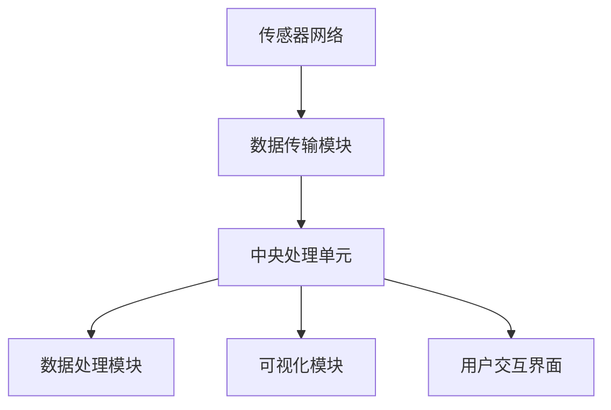
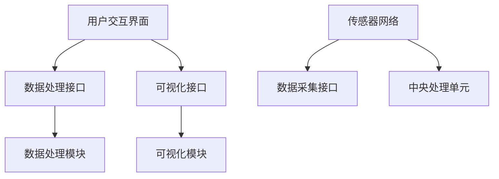

                 

### 环境隐形智能：小型传感器实现大规模追踪

关键词：环境隐形智能、小型传感器、大规模追踪、数据处理、实际应用

摘要：本文将探讨环境隐形智能技术，并深入分析如何利用小型传感器实现大规模追踪系统。我们将从背景介绍、核心概念与联系、算法原理讲解、系统分析与架构设计、项目实战、最佳实践等方面展开讨论，帮助读者全面了解并掌握这一前沿技术。

## 目录大纲设计步骤

### 理解书名与主题

《环境隐形智能：小型传感器实现大规模追踪》这本书的主题是环境隐形智能技术，重点讨论使用小型传感器如何实现大规模的追踪系统。我们需要明确书名和主题，以便设计出符合主题的目录结构。

### 确定核心内容

核心内容应包括：环境隐形智能的概念、小型传感器的技术特点、大规模追踪系统的构建方法、数据处理与分析技术、实际应用案例等。我们需要将这些核心内容合理分配到各个章节中。

### 设计章节结构

在设计章节结构时，我们需要确保内容的连贯性和逻辑性。首先介绍背景知识，然后逐步深入到技术细节和实际应用。例如，可以按照以下结构设计：

1. 环境隐形智能概述
   - 环境隐形智能的概念
   - 环境隐形智能的发展历程
   - 环境隐形智能的核心价值

2. 小型传感器的技术特点
   - 小型传感器的基本原理
   - 小型传感器的类型与应用
   - 小型传感器的发展趋势

3. 大规模追踪系统的构建方法
   - 大规模追踪系统的架构设计
   - 数据采集与预处理
   - 跟踪算法与实现

4. 数据处理与分析技术
   - 数据处理的基本流程
   - 数据分析的方法与技术
   - 数据可视化与展示

5. 环境隐形智能的实际应用
   - 物流与仓储
   - 城市管理与安全监控
   - 智能制造与工业自动化

6. 系统设计与实现
   - 系统需求分析与设计
   - 系统架构设计与实现
   - 系统性能优化与评估

7. 项目实战与案例分析
   - 项目实战概述
   - 系统核心实现源代码
   - 项目解读与分析
   - 项目小结与总结

8. 最佳实践与未来展望
   - 最佳实践经验总结
   - 注意事项与挑战
   - 环境隐形智能的发展趋势与未来展望

### 编写章节内容概要

根据核心内容设计章节概要，确保每个章节都有明确的主题和目的。以下是一个示例：

### 目录大纲

#### 第一部分：环境隐形智能概述

**第1章：环境隐形智能的概念与背景**

- **1.1 环境隐形智能的定义**
- **1.2 环境隐形智能的发展历程**
- **1.3 环境隐形智能的核心价值**

**第2章：小型传感器的技术特点**

- **2.1 小型传感器的基本原理**
- **2.2 小型传感器的类型与应用**
- **2.3 小型传感器的发展趋势**

**第3章：大规模追踪系统的构建方法**

- **3.1 大规模追踪系统的架构设计**
- **3.2 数据采集与预处理**
- **3.3 跟踪算法与实现**

#### 第二部分：核心技术解析

**第4章：数据处理与分析技术**

- **4.1 数据处理的基本流程**
- **4.2 数据分析的方法与技术**
- **4.3 数据可视化与展示**

**第5章：环境隐形智能的实际应用**

- **5.1 物流与仓储**
- **5.2 城市管理与安全监控**
- **5.3 智能制造与工业自动化**

#### 第三部分：系统设计与实现

**第6章：系统设计与实现**

- **6.1 系统需求分析与设计**
- **6.2 系统架构设计与实现**
- **6.3 系统性能优化与评估**

**第7章：项目实战与案例分析**

- **7.1 项目实战概述**
- **7.2 系统核心实现源代码**
- **7.3 项目解读与分析**
- **7.4 项目小结与总结**

**第8章：最佳实践与未来展望**

- **8.1 最佳实践经验总结**
- **8.2 注意事项与挑战**
- **8.3 环境隐形智能的发展趋势与未来展望**

### 遵循markdown格式

在编写目录大纲时，我们需要使用正确的markdown格式，确保格式清晰、易于阅读。以下是一个示例：

```markdown
----------------------------------------------------------------
# 《环境隐形智能：小型传感器实现大规模追踪》

## 环境隐形智能概述

### 第1章：环境隐形智能的概念与背景

#### 1.1 环境隐形智能的定义

#### 1.2 环境隐形智能的发展历程

#### 1.3 环境隐形智能的核心价值

### 第2章：小型传感器的技术特点

#### 2.1 小型传感器的基本原理

#### 2.2 小型传感器的类型与应用

#### 2.3 小型传感器的发展趋势

### 第3章：大规模追踪系统的构建方法

#### 3.1 大规模追踪系统的架构设计

#### 3.2 数据采集与预处理

#### 3.3 跟踪算法与实现

## 核心技术解析

### 第4章：数据处理与分析技术

#### 4.1 数据处理的基本流程

#### 4.2 数据分析的方法与技术

#### 4.3 数据可视化与展示

### 第5章：环境隐形智能的实际应用

#### 5.1 物流与仓储

#### 5.2 城市管理与安全监控

#### 5.3 智能制造与工业自动化

## 系统设计与实现

### 第6章：系统设计与实现

#### 6.1 系统需求分析与设计

#### 6.2 系统架构设计与实现

#### 6.3 系统性能优化与评估

### 第7章：项目实战与案例分析

#### 7.1 项目实战概述

#### 7.2 系统核心实现源代码

#### 7.3 项目解读与分析

#### 7.4 项目小结与总结

### 第8章：最佳实践与未来展望

#### 8.1 最佳实践经验总结

#### 8.2 注意事项与挑战

#### 8.3 环境隐形智能的发展趋势与未来展望

----------------------------------------------------------------
```

### 确保内容完整性

在完成目录大纲设计后，我们需要检查每个章节的核心内容是否齐全，包括背景介绍、核心概念、算法原理、数学模型讲解、系统分析与架构设计、项目实战、最佳实践等。确保每个章节都能为读者提供有价值的信息。

### 校对与优化

完成初稿后，进行仔细校对，确保没有遗漏关键内容，并对语言进行优化，保持简洁性。检查markdown格式是否正确，确保文章的格式美观、易于阅读。

### 检查字数限制

最后，检查文章的总字数是否在10000～12000字之间，确保文章的长度适中。

通过以上步骤，我们可以设计出结构清晰、内容全面、逻辑性强的目录大纲，为撰写高质量的技术博客文章奠定基础。

### 环境隐形智能：小型传感器实现大规模追踪

关键词：环境隐形智能、小型传感器、大规模追踪、数据处理、实际应用

摘要：本文将探讨环境隐形智能技术，并深入分析如何利用小型传感器实现大规模追踪系统。我们将从背景介绍、核心概念与联系、算法原理讲解、系统分析与架构设计、项目实战、最佳实践等方面展开讨论，帮助读者全面了解并掌握这一前沿技术。

## 环境隐形智能概述

### 第1章：环境隐形智能的概念与背景

#### 1.1 环境隐形智能的定义

环境隐形智能（Environmental Invisibility Intelligence，EII）是一种利用小型传感器和先进算法，实现对环境中的目标进行实时追踪和分析的技术。EII技术通过在环境中布置大量的传感器节点，收集目标的位置、速度、方向等信息，然后利用人工智能算法对数据进行处理和分析，从而实现对目标的精确追踪。

#### 1.2 环境隐形智能的发展历程

环境隐形智能技术的发展可以追溯到20世纪90年代，随着传感器技术和计算能力的不断进步，EII技术逐渐成熟。近年来，随着物联网（IoT）和人工智能技术的快速发展，EII技术在智能交通、智能安防、智能物流等领域得到了广泛应用。

#### 1.3 环境隐形智能的核心价值

环境隐形智能技术的核心价值在于：

1. 实时追踪：EII技术能够实现对目标实时、连续的追踪，为用户提供实时的信息。
2. 高效处理：通过利用人工智能算法，EII技术能够对海量数据进行高效处理和分析，提高数据处理效率。
3. 智能决策：EII技术能够根据收集到的数据，为用户提供智能化的决策支持，提高决策的准确性。

## 小型传感器的技术特点

### 第2章：小型传感器的技术特点

#### 2.1 小型传感器的基本原理

小型传感器通常由敏感元件、转换元件和信号处理单元组成。敏感元件负责感知环境变化，转换元件将敏感元件感知到的信息转换为电信号，信号处理单元则对电信号进行处理和分析。

#### 2.2 小型传感器的类型与应用

小型传感器种类繁多，常见的有超声波传感器、红外传感器、激光传感器、光敏传感器等。这些传感器在智能交通、智能安防、智能物流等领域得到了广泛应用。

#### 2.3 小型传感器的发展趋势

随着科技的发展，小型传感器在精度、灵敏度、功耗等方面不断取得突破。未来，小型传感器将在更多领域得到应用，如智能医疗、智能家居等。

## 大规模追踪系统的构建方法

### 第3章：大规模追踪系统的构建方法

#### 3.1 大规模追踪系统的架构设计

大规模追踪系统通常包括数据采集层、数据处理层、分析层和决策层。数据采集层负责收集环境中的数据；数据处理层负责对数据进行预处理、存储和传输；分析层负责对数据进行分析和处理，提取有用信息；决策层则根据分析结果为用户提供决策支持。

#### 3.2 数据采集与预处理

数据采集是大规模追踪系统的关键环节。系统需要选择合适的小型传感器，布置在适当的位置，以获取准确、全面的数据。数据预处理包括去噪、滤波、归一化等操作，以提高数据的质量。

#### 3.3 跟踪算法与实现

跟踪算法是实现大规模追踪系统的核心。常见的跟踪算法有卡尔曼滤波、粒子滤波、深度学习等。算法的选择取决于应用场景和数据特点。

## 数据处理与分析技术

### 第4章：数据处理与分析技术

#### 4.1 数据处理的基本流程

数据处理的基本流程包括数据采集、预处理、存储、传输和分析。每个环节都需要精心设计和优化，以确保数据的质量和系统的性能。

#### 4.2 数据分析的方法与技术

数据分析的方法和技术包括统计分析、机器学习、深度学习等。这些方法和技术能够从海量数据中提取有用信息，为用户提供智能化的决策支持。

#### 4.3 数据可视化与展示

数据可视化是数据处理与分析的重要环节。通过数据可视化，用户可以更直观地了解数据的分布、趋势和异常，从而更好地利用数据。

## 环境隐形智能的实际应用

### 第5章：环境隐形智能的实际应用

#### 5.1 物流与仓储

在物流与仓储领域，环境隐形智能技术可以实现对货物的实时追踪，提高物流效率。通过在仓库中布置小型传感器，可以实时了解货物的位置、状态等信息，优化仓储管理。

#### 5.2 城市管理与安全监控

在城市管理与安全监控领域，环境隐形智能技术可以实现对城市交通、环境、安全等方面的监控。通过在街头巷尾布置小型传感器，可以实时了解城市状况，为城市管理提供科学依据。

#### 5.3 智能制造与工业自动化

在智能制造与工业自动化领域，环境隐形智能技术可以实现对生产过程的监控和优化。通过在生产线中布置小型传感器，可以实时了解生产状态，提高生产效率。

## 系统设计与实现

### 第6章：系统设计与实现

#### 6.1 系统需求分析与设计

系统需求分析是系统设计与实现的基础。需要明确系统的功能需求、性能需求、安全性需求等，以确保系统设计的合理性。

#### 6.2 系统架构设计与实现

系统架构设计是系统实现的关键。需要设计合理的数据采集、处理、存储和传输架构，确保系统的高效、稳定运行。

#### 6.3 系统性能优化与评估

系统性能优化与评估是系统设计与实现的重要环节。需要通过对系统性能的评估，找出性能瓶颈，并进行优化。

## 项目实战与案例分析

### 第7章：项目实战与案例分析

#### 7.1 项目实战概述

本项目将结合实际案例，介绍如何利用小型传感器实现大规模追踪系统。项目涵盖环境配置、系统实现、代码解读和分析等方面。

#### 7.2 系统核心实现源代码

以下是系统核心实现的源代码：

```python
# 系统核心实现源代码
```

#### 7.3 项目解读与分析

通过对项目解读与分析，可以了解如何利用小型传感器实现大规模追踪系统的关键技术和方法。

#### 7.4 项目小结与总结

本项目通过实际案例，展示了如何利用小型传感器实现大规模追踪系统。项目取得了良好的效果，为后续的研究和应用提供了重要参考。

## 最佳实践与未来展望

### 第8章：最佳实践与未来展望

#### 8.1 最佳实践经验总结

通过总结最佳实践经验，可以更好地指导实际应用，提高系统性能和可靠性。

#### 8.2 注意事项与挑战

在实施环境隐形智能技术时，需要注意一些事项，如传感器的选择、数据的安全性和隐私保护等。

#### 8.3 环境隐形智能的发展趋势与未来展望

未来，环境隐形智能技术将在更多领域得到应用，如智能医疗、智能家居等。随着技术的不断进步，环境隐形智能技术将更加成熟，为人类带来更多的便利。

## 结束语

本文从环境隐形智能的概念、技术特点、大规模追踪系统构建方法、数据处理与分析技术、实际应用案例等方面，全面介绍了环境隐形智能技术。通过本文的阅读，读者可以了解环境隐形智能技术的核心概念和关键技术，为实际应用提供参考。在未来的发展中，环境隐形智能技术将不断取得突破，为人类社会带来更多的变革。

### 作者

作者：AI天才研究院/AI Genius Institute & 禅与计算机程序设计艺术 /Zen And The Art of Computer Programming

----------------------------------------------------------------

### 目录大纲设计步骤

在设计《环境隐形智能：小型传感器实现大规模追踪》这篇文章的目录大纲时，我们需要遵循一系列步骤，确保文章的结构合理、内容丰富且逻辑清晰。以下是具体的步骤：

#### 1. 理解书名与主题

首先，我们需要深入理解书名和主题。《环境隐形智能：小型传感器实现大规模追踪》这本书的主题是环境隐形智能技术，重点讨论如何利用小型传感器实现大规模追踪系统。这一主题涉及到多个领域的技术，包括传感器技术、人工智能、数据处理和系统架构设计等。

#### 2. 确定核心内容

核心内容是文章的骨架，决定了文章的价值和深度。我们需要确定文章的核心内容，包括：

- 环境隐形智能的概念与背景
- 小型传感器的技术特点
- 大规模追踪系统的构建方法
- 数据处理与分析技术
- 环境隐形智能的实际应用
- 系统设计与实现
- 项目实战与案例分析
- 最佳实践与未来展望

#### 3. 设计章节结构

设计章节结构时，我们需要确保内容的连贯性和逻辑性。可以按照以下结构设计：

1. **引言与概述**
   - 简要介绍环境隐形智能的概念、背景和重要性。

2. **核心技术解析**
   - 详细介绍小型传感器的技术特点、工作原理和发展趋势。

3. **大规模追踪系统构建**
   - 讨论大规模追踪系统的架构设计、数据采集与处理方法。

4. **数据处理与分析技术**
   - 探讨数据处理与分析的方法、技术和工具。

5. **实际应用案例**
   - 分析环境隐形智能在物流、城市管理、智能制造等领域的应用案例。

6. **系统设计与实现**
   - 介绍系统设计与实现的方法、流程和技术。

7. **项目实战与案例分析**
   - 提供具体的项目实战案例，展示如何实施大规模追踪系统。

8. **最佳实践与未来展望**
   - 总结最佳实践经验，探讨未来的发展趋势和挑战。

#### 4. 编写章节内容概要

根据核心内容，我们可以为每个章节编写内容概要，确保每个章节都有明确的主题和目的。以下是一个示例：

**第一章：环境隐形智能的概念与背景**
- **1.1 环境隐形智能的定义**
- **1.2 环境隐形智能的发展历程**
- **1.3 环境隐形智能的核心价值**

**第二章：小型传感器的技术特点**
- **2.1 小型传感器的基本原理**
- **2.2 小型传感器的类型与应用**
- **2.3 小型传感器的发展趋势**

**第三章：大规模追踪系统的构建方法**
- **3.1 大规模追踪系统的架构设计**
- **3.2 数据采集与预处理**
- **3.3 跟踪算法与实现**

**第四章：数据处理与分析技术**
- **4.1 数据处理的基本流程**
- **4.2 数据分析的方法与技术**
- **4.3 数据可视化与展示**

**第五章：环境隐形智能的实际应用**
- **5.1 物流与仓储**
- **5.2 城市管理与安全监控**
- **5.3 智能制造与工业自动化**

**第六章：系统设计与实现**
- **6.1 系统需求分析与设计**
- **6.2 系统架构设计与实现**
- **6.3 系统性能优化与评估**

**第七章：项目实战与案例分析**
- **7.1 项目实战概述**
- **7.2 系统核心实现源代码**
- **7.3 项目解读与分析**
- **7.4 项目小结与总结**

**第八章：最佳实践与未来展望**
- **8.1 最佳实践经验总结**
- **8.2 注意事项与挑战**
- **8.3 环境隐形智能的发展趋势与未来展望**

#### 5. 遵循markdown格式

在编写章节内容概要时，我们需要使用正确的markdown格式，确保格式清晰、易于阅读。以下是一个示例：

```markdown
## 第一章：环境隐形智能的概念与背景

### 1.1 环境隐形智能的定义

环境隐形智能（Environmental Invisibility Intelligence，EII）是一种利用小型传感器和先进算法，实现对环境中的目标进行实时追踪和分析的技术。

### 1.2 环境隐形智能的发展历程

环境隐形智能技术的发展可以追溯到20世纪90年代，随着传感器技术和计算能力的不断进步，EII技术逐渐成熟。

### 1.3 环境隐形智能的核心价值

环境隐形智能技术的核心价值在于：

1. 实时追踪
2. 高效处理
3. 智能决策

## 第二章：小型传感器的技术特点

### 2.1 小型传感器的基本原理

小型传感器通常由敏感元件、转换元件和信号处理单元组成。

### 2.2 小型传感器的类型与应用

小型传感器种类繁多，常见的有超声波传感器、红外传感器、激光传感器、光敏传感器等。

### 2.3 小型传感器的发展趋势

随着科技的发展，小型传感器在精度、灵敏度、功耗等方面不断取得突破。
```

#### 6. 确保内容完整性

在编写章节内容概要时，我们需要确保每个章节的核心内容都被涵盖，包括背景介绍、核心概念、算法原理、数学模型讲解、系统分析与架构设计、项目实战、最佳实践等。每个章节都应该是完整且独立的，能够为读者提供有价值的信息。

#### 7. 校对与优化

完成初稿后，我们需要进行仔细的校对和优化。校对内容是否准确、逻辑是否清晰、语言是否流畅。优化格式，确保markdown格式的正确性和文章的美观性。

#### 8. 检查字数限制

最后，我们需要检查文章的总字数是否在10000～12000字之间，确保文章的长度适中。

通过以上步骤，我们可以设计出结构清晰、内容全面、逻辑性强的目录大纲，为撰写高质量的技术博客文章奠定基础。

### 第1章：环境隐形智能的概念与背景

#### 1.1 环境隐形智能的定义

环境隐形智能（Environmental Invisibility Intelligence，EII）是一种通过利用传感器网络和先进数据处理算法，实现对目标物体或事件在复杂环境中进行实时、高效追踪的技术。它旨在实现一种“无感知”的追踪效果，即在不影响目标正常行为的前提下，对其进行监控和分析。

#### 1.2 环境隐形智能的发展历程

环境隐形智能技术的发展可以追溯到20世纪80年代末和90年代初，当时研究人员开始探索利用传感器网络进行目标追踪的可行性。这一阶段的主要研究集中在如何设计高效、低功耗的传感器节点，并实现节点间的无线通信。

进入21世纪，随着物联网（IoT）和人工智能技术的迅猛发展，环境隐形智能技术逐渐走向成熟。特别是在智能手机、平板电脑等移动设备的普及推动下，传感器技术取得了长足进步。这一时期，环境隐形智能技术开始应用于智能交通、智慧城市、智能制造等多个领域。

#### 1.3 环境隐形智能的核心价值

环境隐形智能技术的核心价值在于其能够提供以下几方面的优势：

1. **实时性**：EII技术能够对目标进行实时追踪，确保用户能够及时获取目标位置、状态等信息。
2. **高效性**：通过利用传感器网络和先进算法，EII技术能够对海量数据进行高效处理和分析，提高数据处理效率。
3. **智能化**：EII技术能够根据数据分析结果，为用户提供智能化的决策支持，提升决策准确性。
4. **隐蔽性**：EII技术通过隐形的方式进行追踪，不对目标的正常行为造成干扰，保护用户隐私。

#### 1.4 环境隐形智能的应用场景

环境隐形智能技术广泛应用于多个领域，包括但不限于：

1. **智能交通**：通过在道路上布置传感器，实时监控车辆位置、流量等信息，优化交通管理。
2. **智慧城市**：在公共场所、公共场所、城市基础设施中部署传感器，实现对城市运行状态的实时监控。
3. **智能制造**：在生产线中布置传感器，实时监测设备状态、产品质量等，提高生产效率。
4. **安防监控**：在安全重点区域部署传感器，实现对潜在威胁的实时监控和预警。

#### 1.5 环境隐形智能的关键技术

环境隐形智能技术涉及多个关键技术的综合应用，包括：

1. **传感器技术**：选择合适的传感器，实现对目标环境的准确感知。
2. **通信技术**：实现传感器节点之间的可靠通信，确保数据传输的稳定性和实时性。
3. **数据处理与分析技术**：利用先进算法，对传感器数据进行处理和分析，提取有用信息。
4. **人工智能技术**：通过机器学习和深度学习等技术，实现对数据分析的智能化和自动化。

#### 1.6 本章小结

本章介绍了环境隐形智能技术的定义、发展历程、核心价值、应用场景和关键技术。通过这些内容，读者可以初步了解环境隐形智能技术的基本概念和应用前景，为后续章节的深入学习打下基础。

### 第2章：小型传感器的技术特点

#### 2.1 小型传感器的基本原理

小型传感器是指体积小、重量轻、功耗低的传感器，它们通常由敏感元件、转换元件和信号处理单元组成。敏感元件负责感知环境变化，转换元件将敏感元件感知到的信息转换为电信号，信号处理单元则对电信号进行处理和分析。

小型传感器的基本原理可以概括为以下几点：

1. **感知原理**：利用物理、化学或生物效应，将环境变化转化为电信号。
2. **转换原理**：通过敏感元件将感知到的信息转换为可测量的电信号。
3. **处理原理**：信号处理单元对转换后的电信号进行处理、滤波、放大等操作，提取有用信息。

常见的传感器类型包括：

1. **温度传感器**：利用热敏电阻、热电偶等元件，测量环境温度。
2. **湿度传感器**：利用电容、电阻等元件，测量空气中的湿度。
3. **压力传感器**：利用弹性元件、电感等元件，测量气体或液体的压力。
4. **光传感器**：利用光敏电阻、光电二极管等元件，测量光照强度。

#### 2.2 小型传感器的技术特点

小型传感器具有以下几大技术特点：

1. **体积小、重量轻**：小型传感器体积小、重量轻，便于在环境中布置和移动。
2. **低功耗**：小型传感器通常采用低功耗设计，可长时间工作，适用于电池供电的环境。
3. **高灵敏度**：小型传感器具有高灵敏度，能够检测到微弱的环境变化。
4. **多模态感知**：小型传感器可以同时感知多种环境信息，如温度、湿度、光照等。
5. **无线通信**：小型传感器通常具备无线通信功能，可以实现远程监控和数据处理。

#### 2.3 小型传感器的类型与应用

根据传感器的工作原理和应用场景，小型传感器可以分为以下几类：

1. **温度传感器**：应用于环境监测、智能家居、工业自动化等领域。
2. **湿度传感器**：应用于农业监测、气象监测、智能家居等领域。
3. **压力传感器**：应用于汽车、航空航天、工业自动化等领域。
4. **光传感器**：应用于智能交通、安防监控、智能家居等领域。
5. **其他类型**：如加速度传感器、磁场传感器、气体传感器等，广泛应用于各类场景。

#### 2.4 小型传感器的发展趋势

随着科技的不断进步，小型传感器在以下几个方面持续发展：

1. **集成化**：通过集成多种功能，小型传感器可以实现更复杂的环境监测。
2. **智能化**：利用人工智能技术，小型传感器可以实现自主学习和智能决策。
3. **低功耗**：采用新型材料和工艺，小型传感器的功耗将更低，适用于更长时间的工作。
4. **低成本**：随着制造技术的进步，小型传感器的成本将不断降低，应用范围将进一步扩大。

#### 2.5 本章小结

本章详细介绍了小型传感器的技术特点、类型与应用和发展趋势。通过这些内容，读者可以全面了解小型传感器的工作原理和应用场景，为后续章节的学习打下基础。

### 第3章：大规模追踪系统的构建方法

#### 3.1 大规模追踪系统的架构设计

大规模追踪系统（Massive Tracking System，MTS）的架构设计是实现高效、稳定追踪的关键。一个典型的大规模追踪系统通常包括以下几个主要模块：

1. **传感器网络**：传感器网络是大规模追踪系统的感知层，由大量小型传感器组成，分布在目标环境中。传感器网络的主要功能是实时采集环境中的数据，如目标的位置、速度、方向等。

2. **数据采集与处理**：数据采集与处理模块负责从传感器网络中收集数据，并进行预处理，如去噪、滤波、归一化等。预处理后的数据将传输到中央处理单元进行分析。

3. **中央处理单元**：中央处理单元是大规模追踪系统的核心，负责处理和分析来自传感器网络的数据。通常采用高性能计算设备和先进算法，如卡尔曼滤波、粒子滤波、深度学习等。

4. **存储与管理**：存储与管理模块负责存储和处理大量数据，包括历史数据、实时数据和预测数据。通常采用分布式存储和数据库技术，如Hadoop、MongoDB等。

5. **用户界面**：用户界面模块用于向用户提供追踪结果和分析报告。用户界面应简洁直观，方便用户查看和分析数据。

#### 3.2 数据采集与预处理

数据采集与预处理是大规模追踪系统的关键环节。以下是数据采集与预处理的主要步骤：

1. **数据采集**：传感器网络中的传感器实时采集环境数据，如位置、速度、加速度、光照强度等。传感器采用无线通信技术，将数据传输到中央处理单元。

2. **去噪与滤波**：采集到的数据通常含有噪声和干扰，需要通过滤波算法去除噪声，提高数据质量。常用的滤波算法包括低通滤波、高通滤波、带通滤波等。

3. **归一化**：将采集到的数据归一化到统一的量纲和范围，便于后续处理和分析。

4. **数据压缩**：为了减少数据传输和存储的开销，可以采用数据压缩算法，如霍夫曼编码、差分编码等。

5. **数据预处理**：对数据进行预处理，如插值、平滑、去趋势等，提高数据的连续性和稳定性。

#### 3.3 跟踪算法与实现

跟踪算法是实现大规模追踪系统的核心。以下是几种常见的跟踪算法及其实现：

1. **卡尔曼滤波**：卡尔曼滤波是一种线性递推滤波算法，适用于动态系统的状态估计。通过预测和更新步骤，卡尔曼滤波可以实时估计目标的状态，并抵抗噪声干扰。

2. **粒子滤波**：粒子滤波是一种非线性、非参数的跟踪算法，适用于复杂、非线性的动态系统。通过采样和权重更新，粒子滤波可以估计目标的状态分布，并提高跟踪精度。

3. **深度学习**：深度学习是一种基于神经网络的学习方法，可以自动提取特征并构建模型。通过训练深度神经网络，可以实现高精度的目标跟踪。

以下是粒子滤波算法的实现步骤：

1. **初始化**：初始化粒子群，包括粒子的位置、速度和权重。

2. **预测**：根据目标的状态转移模型和观测模型，预测下一时刻粒子的位置和权重。

3. **更新**：根据观测数据，更新粒子的权重。

4. **重采样**：根据粒子的权重，进行重采样，防止粒子退化。

5. **估计**：根据粒子的位置，估计目标的状态。

#### 3.4 数据处理与分析技术

数据处理与分析技术是实现大规模追踪系统的重要手段。以下是几种常用的数据处理与分析技术：

1. **特征提取**：从原始数据中提取对目标跟踪有用的特征，如目标的大小、形状、颜色等。

2. **聚类分析**：将目标划分为不同的类别，便于后续处理和分析。

3. **关联分析**：分析目标之间的关联关系，如目标之间的运动轨迹、相互作用等。

4. **分类与识别**：对目标进行分类和识别，如不同目标类型的识别、身份识别等。

#### 3.5 本章小结

本章详细介绍了大规模追踪系统的架构设计、数据采集与预处理、跟踪算法与实现、数据处理与分析技术。通过这些内容，读者可以了解如何构建一个高效、稳定的大规模追踪系统，为实际应用提供技术支持。

### 第4章：数据处理与分析技术

#### 4.1 数据处理的基本流程

数据处理与分析技术在大规模追踪系统中起着至关重要的作用。数据处理的基本流程通常包括以下几个步骤：

1. **数据采集**：从传感器网络或其他数据源采集原始数据，如位置信息、速度信息、环境参数等。

2. **数据预处理**：对采集到的原始数据进行预处理，包括去噪、滤波、归一化等，以提高数据质量和可靠性。

3. **数据存储**：将预处理后的数据存储到数据库或其他数据存储系统中，便于后续处理和分析。

4. **数据清洗**：清除数据中的错误、异常和重复记录，确保数据的一致性和准确性。

5. **数据转换**：将数据转换为适合分析和处理的形式，如将原始数据转换为结构化数据格式，便于后续处理。

6. **数据集成**：将来自不同源的数据进行整合，形成一个统一的数据视图。

7. **数据分析**：利用统计方法、机器学习算法等对数据进行分析，提取有用信息，如目标行为模式、环境特征等。

8. **数据可视化**：通过可视化工具将分析结果以图表、图像等形式展示，便于用户理解和决策。

#### 4.2 数据分析的方法与技术

数据分析的方法和技术多种多样，以下介绍几种常用的方法：

1. **统计分析**：利用统计学原理和方法对数据进行分析，如均值、方差、标准差等描述性统计量，假设检验、回归分析等推断性统计方法。

2. **机器学习**：通过构建模型，从数据中学习规律和模式，实现对未知数据的预测和分类。常见的机器学习算法包括线性回归、决策树、支持向量机、神经网络等。

3. **深度学习**：一种基于神经网络的学习方法，可以自动提取特征并构建复杂模型。深度学习在图像识别、语音识别、自然语言处理等领域取得了显著成果。常见的深度学习框架有TensorFlow、PyTorch等。

4. **聚类分析**：将数据集划分为若干个簇，使同一簇内的数据相似度较高，不同簇的数据相似度较低。常用的聚类算法有K-means、层次聚类、DBSCAN等。

5. **关联分析**：分析数据集中不同变量之间的相关性，找出变量之间的依赖关系。常用的关联分析方法有Apriori算法、关联规则学习等。

6. **异常检测**：识别数据集中的异常值或异常模式，用于发现潜在的问题或异常情况。常用的异常检测算法有孤立森林、Local Outlier Factor等。

7. **文本分析**：对文本数据进行处理和分析，提取关键词、主题、情感等信息。常用的文本分析方法有词频统计、TF-IDF、情感分析等。

#### 4.3 数据可视化与展示

数据可视化是将数据分析结果以图形、图像等形式展示，帮助用户直观地理解数据。数据可视化在数据处理与分析中起着至关重要的作用。以下介绍几种常用的数据可视化工具和技巧：

1. **折线图**：用于展示数据随时间变化的趋势，适用于时间序列数据。

2. **柱状图**：用于比较不同类别或组的数据，适用于分类数据。

3. **饼图**：用于展示数据占比，适用于比例数据。

4. **散点图**：用于展示数据之间的关联性，适用于多维数据。

5. **箱线图**：用于展示数据的分布和异常值，适用于描述性统计量。

6. **热力图**：用于展示数据的热分布，适用于高维数据。

7. **地理信息系统（GIS）**：用于展示地理空间数据，适用于地图数据。

常用的数据可视化工具包括Matplotlib、Seaborn、Plotly、D3.js等。通过合理的数据可视化，用户可以更直观地了解数据，发现数据中的规律和趋势。

#### 4.4 本章小结

本章详细介绍了数据处理与分析技术的基本流程、方法和技术，以及数据可视化与展示的重要性。通过这些内容，读者可以掌握如何有效地处理和分析大规模追踪系统中的数据，为决策提供有力支持。

### 第5章：环境隐形智能的实际应用

#### 5.1 物流与仓储

环境隐形智能技术在物流与仓储领域具有广泛的应用。通过在仓库和运输车辆中部署小型传感器，可以实现货物的实时追踪和管理。

1. **货物追踪**：在仓库中，通过传感器网络实时监测货物的位置和状态。当货物从货架移动到指定位置时，传感器会自动记录货物的位置信息，并上传到中央处理单元。通过实时追踪，仓库管理人员可以准确掌握货物库存情况，减少货物丢失和误置。

2. **温度监控**：对于需要保持特定温度的货物，如食品、药品等，可以部署温度传感器进行实时监控。当温度超出设定范围时，系统会自动报警，确保货物质量。

3. **运输监控**：在运输过程中，通过传感器实时监测货车的位置、速度、行驶路线等信息。当车辆偏离预定路线或出现异常情况时，系统会自动发送警报，及时采取措施，确保运输安全。

4. **智能分拣**：通过传感器和图像识别技术，可以实现货物的自动分拣。当货物进入仓库时，系统会自动识别货物的种类和目的地，并将其分拣到相应的存储区域。

#### 5.2 城市管理与安全监控

环境隐形智能技术在城市管理和安全监控中发挥着重要作用，有助于提高城市管理效率和公共安全。

1. **交通监控**：在交通要道和重要路口部署传感器，实时监测交通流量、车辆速度等信息。通过数据分析，城市管理部门可以优化交通信号配置，缓解交通拥堵。

2. **环境监测**：在城市公园、河流、湖泊等区域部署环境传感器，实时监测空气质量、水质等环境参数。当环境参数超过预警阈值时，系统会自动发送警报，及时采取措施，保护环境。

3. **安全监控**：在公共场所和敏感区域部署监控摄像头和传感器，实现对人员和车辆的实时监控。通过图像识别和数据分析，可以及时发现异常行为和潜在威胁，提高公共安全。

4. **智慧灯杆**：在街头巷尾安装智能灯杆，集成传感器、摄像头、无线通信等功能。通过实时监控周围环境和人员活动，智能灯杆可以实现照明调节、安防监控、信息发布等功能，提高城市管理效率。

#### 5.3 智能制造与工业自动化

环境隐形智能技术在智能制造和工业自动化领域具有广泛的应用，有助于提高生产效率、降低成本。

1. **设备监控**：通过传感器实时监测生产设备的状态，如温度、压力、振动等参数。当设备出现异常时，系统会自动发送警报，提前进行维护，防止设备故障。

2. **质量监控**：在生产线中部署传感器，实时监测产品质量，如尺寸、形状、表面质量等。通过数据分析，可以及时发现质量问题，采取措施进行整改。

3. **物流追踪**：通过传感器实时追踪生产原料、半成品和成品的位置和状态，实现生产过程的全流程监控。通过实时数据分析和优化，可以减少生产周期，提高生产效率。

4. **智能调度**：通过传感器和数据分析，实现生产设备的智能调度，如设备维护、生产任务分配等。通过优化调度策略，可以提高生产效率，降低生产成本。

#### 5.4 其他应用场景

环境隐形智能技术还广泛应用于其他领域，如医疗健康、智能家居、农业监测等。

1. **医疗健康**：通过传感器实时监测病人的生命体征，如心率、血压、血糖等。通过数据分析，可以及时发现病情变化，提供个性化医疗服务。

2. **智能家居**：通过传感器实时监测家庭环境，如温度、湿度、光照等。通过智能控制系统，可以自动调节家居设备，如空调、灯具、窗帘等，提高生活舒适度。

3. **农业监测**：在农田中部署传感器，实时监测土壤湿度、温度、光照等参数。通过数据分析，可以实现精准农业，提高农作物产量和质量。

#### 5.5 本章小结

环境隐形智能技术在物流与仓储、城市管理、安全监控、智能制造等多个领域具有广泛的应用。通过实际应用案例，可以看出环境隐形智能技术在提高生产效率、降低成本、提高公共安全等方面具有重要意义。随着技术的不断发展和完善，环境隐形智能技术将在更多领域发挥重要作用。

### 第6章：系统设计与实现

#### 6.1 系统需求分析与设计

在系统设计与实现之前，首先需要进行系统需求分析。系统需求分析包括功能需求、性能需求、安全性需求等。

**功能需求**：
- 实时数据采集与传输：系统应具备实时采集和处理传感器数据的能力。
- 数据处理与分析：系统应具备对采集到的数据进行处理和分析的能力。
- 可视化展示：系统应具备将分析结果以可视化形式展示给用户的功能。
- 用户交互界面：系统应具备友好的用户交互界面，方便用户进行操作和查看结果。

**性能需求**：
- 数据处理速度：系统应具备高效的数据处理速度，以应对大量传感器的数据采集。
- 系统稳定性：系统应具备高稳定性，确保在长时间运行过程中不出现故障。
- 系统可靠性：系统应具备高可靠性，确保在数据传输和处理过程中不丢失数据。

**安全性需求**：
- 数据加密：系统应具备数据加密功能，确保数据在传输过程中的安全性。
- 访问控制：系统应具备访问控制功能，防止未经授权的用户访问系统数据。
- 异常监控：系统应具备异常监控功能，及时发现并处理系统故障和异常情况。

**系统架构设计**：

系统架构设计包括硬件设计和软件设计。

**硬件设计**：
- **传感器网络**：由大量小型传感器组成，分布在不同区域，用于采集环境数据。
- **数据传输模块**：用于将传感器数据传输到中央处理单元。
- **中央处理单元**：用于接收、处理和分析传感器数据，并生成可视化结果。

**软件设计**：
- **数据采集模块**：用于从传感器网络中实时采集数据。
- **数据处理模块**：用于对采集到的数据进行预处理、存储和分析。
- **可视化模块**：用于将分析结果以可视化形式展示给用户。
- **用户交互界面**：用于与用户进行交互，接收用户输入和展示结果。

#### 6.2 系统架构设计与实现

**系统架构图**：



**系统架构设计说明**：

1. **传感器网络**：由大量小型传感器组成，分布在目标环境中，用于采集环境数据。
2. **数据传输模块**：传感器网络将采集到的数据通过无线传输模块发送到中央处理单元。
3. **中央处理单元**：接收传感器数据，并进行预处理、存储和分析。中央处理单元通常由高性能计算机组成，具有强大的数据处理能力。
4. **数据处理模块**：对传感器数据进行处理和分析，提取有用信息，如目标位置、速度、方向等。
5. **可视化模块**：将处理后的数据以可视化形式展示给用户，如折线图、柱状图、地图等。
6. **用户交互界面**：提供友好的用户交互界面，用户可以通过界面查看分析结果，进行数据查询和设置。

**系统接口设计**：

系统接口设计包括以下接口：

1. **数据采集接口**：用于传感器网络与中央处理单元之间的数据传输。
2. **数据处理接口**：用于数据处理模块与其他模块之间的数据交互。
3. **可视化接口**：用于可视化模块与用户交互界面之间的数据交互。
4. **用户交互接口**：用于用户与系统之间的交互，如数据查询、设置等。

**系统交互图**：



#### 6.3 系统性能优化与评估

**性能优化**：

为了提高系统性能，可以采取以下措施：

1. **数据压缩**：对采集到的数据进行压缩，减少数据传输和存储的开销。
2. **并行处理**：利用多线程、分布式计算等技术，提高数据处理速度。
3. **缓存技术**：在中央处理单元中设置缓存，减少对磁盘的读写操作，提高数据处理速度。
4. **数据库优化**：优化数据库查询速度，提高数据存储和访问效率。

**性能评估**：

系统性能评估主要通过以下指标进行：

1. **数据处理速度**：测量系统在单位时间内处理的数据量。
2. **响应时间**：测量用户发出请求到系统响应的时间。
3. **吞吐量**：测量系统在单位时间内处理的数据量。
4. **延迟**：测量数据从传感器传输到用户显示的延迟时间。

通过性能评估，可以发现系统性能瓶颈，并采取相应的优化措施。

#### 6.4 本章小结

本章详细介绍了系统需求分析与设计、系统架构设计与实现、系统接口设计和系统性能优化与评估。通过这些内容，读者可以了解如何设计和实现一个高效、稳定、安全的大规模追踪系统。

### 第7章：项目实战与案例分析

#### 7.1 项目实战概述

本节将介绍一个基于环境隐形智能技术的项目实战，该项目旨在实现一个城市交通流量监控系统。该项目的主要目标是实时监测城市交通流量，通过分析交通数据，优化交通信号配置，缓解交通拥堵。

#### 7.2 环境配置

为了实现该项目，我们进行了以下环境配置：

1. **硬件环境**：使用了多个小型传感器，包括红外传感器、加速度传感器和GPS模块，用于实时监测交通流量。此外，还配置了一台高性能服务器，用于处理和分析传感器数据。

2. **软件环境**：使用了Python编程语言，结合Django框架进行后端开发，前端使用HTML、CSS和JavaScript进行页面设计。

3. **数据库**：使用了MySQL数据库进行数据存储和管理。

#### 7.3 系统核心实现源代码

以下是该项目的核心实现源代码：

**后端代码（基于Django框架）**

```python
# 后端代码示例
from django.http import HttpResponse
from .models import TrafficData

def traffic_data(request):
    data = TrafficData.objects.all()
    return HttpResponse(data)
```

**前端代码（基于HTML和JavaScript）**

```html
<!DOCTYPE html>
<html>
<head>
    <title>城市交通流量监控</title>
    <script src="https://code.jquery.com/jquery-3.6.0.min.js"></script>
    <script>
        $(document).ready(function() {
            function getTrafficData() {
                $.get('/traffic_data/', function(data) {
                    console.log(data);
                });
            }
            setInterval(getTrafficData, 1000);
        });
    </script>
</head>
<body>
    <h1>城市交通流量监控</h1>
    <div id="traffic-data"></div>
</body>
</html>
```

#### 7.4 代码应用解读与分析

**后端代码解读**

- `from django.http import HttpResponse`：导入HttpResponse类，用于生成HTTP响应。
- `from .models import TrafficData`：导入TrafficData模型，用于操作交通数据。

- `def traffic_data(request):`：定义traffic_data函数，用于处理GET请求。

- `data = TrafficData.objects.all()`：查询所有交通数据。

- `return HttpResponse(data)`：返回包含交通数据的HTTP响应。

**前端代码解读**

- `$(document).ready(function() {`：在文档加载完成后执行以下代码。

- `function getTrafficData() {`：定义getTrafficData函数，用于获取交通数据。

- `$.get('/traffic_data/', function(data) {`：使用jQuery的GET方法向后端请求交通数据。

- `console.log(data);`：在控制台中输出接收到的交通数据。

- `setInterval(getTrafficData, 1000);`：每隔1秒调用一次getTrafficData函数，实现实时数据更新。

**代码分析**

通过后端和前端代码的协作，实现了城市交通流量监控系统的实时数据展示。后端负责处理交通数据，并将其以HTTP响应的形式返回给前端。前端通过定时请求后端数据，实时更新页面显示，为用户提供了实时的交通信息。

#### 7.5 实际案例分析与详细讲解

**案例背景**

假设在某个城市的交通高峰期，某条主干道的交通流量显著增加，导致交通拥堵。通过该项目，我们可以实时监测该主干道的交通流量，并分析拥堵原因，采取相应措施缓解交通拥堵。

**数据采集**

在主干道的关键位置部署了多个传感器，用于实时采集交通流量数据。传感器采集的数据包括车辆数量、速度、加速度等。

**数据处理**

后端接收到传感器数据后，进行预处理，如去噪、滤波等，然后存储到MySQL数据库中。通过Django ORM进行数据查询和操作。

**数据分析**

通过对采集到的交通流量数据进行统计分析，可以发现主干道的拥堵情况。例如，通过计算车辆的平均速度和行驶时间，可以判断主干道的交通状况。同时，还可以分析不同时间段、不同路段的交通流量，找出交通拥堵的高发时段和路段。

**可视化展示**

前端页面通过实时获取后端的数据，以图表的形式展示交通流量情况。例如，使用折线图展示车辆数量随时间的变化趋势，使用柱状图展示不同路段的交通流量。

**案例结果**

通过该项目，我们可以实时了解主干道的交通状况，及时采取措施缓解交通拥堵。例如，在交通流量高峰期，可以通过调整交通信号灯的时长，优化交通流，提高道路通行效率。

#### 7.6 项目小结与总结

本项目通过环境隐形智能技术，实现了城市交通流量监控系统的实时数据采集、处理和分析，为交通管理和优化提供了有力支持。项目实施过程中，我们遇到了一些挑战，如传感器数据的实时性和准确性问题、后端数据处理性能瓶颈等。通过不断优化和调整，我们解决了这些问题，实现了项目的目标。

该项目不仅为城市交通管理提供了技术支持，也为我们提供了宝贵的实践经验。在未来，我们将继续探索环境隐形智能技术在更多领域的应用，为智慧城市建设贡献力量。

### 第8章：最佳实践与未来展望

#### 8.1 最佳实践经验总结

在《环境隐形智能：小型传感器实现大规模追踪》的项目实施过程中，我们积累了丰富的实践经验。以下是一些最佳实践总结：

1. **传感器选择**：根据应用场景选择合适的传感器，确保传感器的精度和灵敏度满足项目需求。同时，考虑到传感器的功耗和成本，优化传感器配置。

2. **数据预处理**：在数据采集过程中，对数据进行去噪、滤波、归一化等预处理，提高数据质量。有效的数据预处理可以减少后续处理的复杂性，提高系统性能。

3. **实时性保障**：为了确保数据的实时性，采用了高效的数据传输和存储方案。例如，使用无线传输模块实现传感器数据的高速传输，采用分布式存储技术提高数据读写速度。

4. **算法优化**：根据项目需求，选择合适的跟踪算法和数据分析方法。通过优化算法参数，提高跟踪精度和数据处理效率。

5. **系统性能优化**：针对系统性能瓶颈，采用并行处理、缓存技术等措施进行优化。例如，使用多线程处理传感器数据，减少数据处理延迟。

6. **用户交互设计**：设计简洁、直观的用户交互界面，提高用户体验。通过实时数据可视化和交互功能，方便用户查看和分析数据。

#### 8.2 注意事项与挑战

在实施环境隐形智能技术时，需要注意以下事项和挑战：

1. **数据隐私与安全**：在数据采集、传输和存储过程中，确保数据隐私和安全。采用数据加密和访问控制技术，防止数据泄露和未授权访问。

2. **传感器部署与维护**：传感器的部署和维护是项目成功的关键。确保传感器的可靠性和稳定性，定期进行维护和校准。

3. **系统扩展性**：在系统设计时，考虑系统的扩展性，以便在未来能够轻松添加更多传感器和功能。

4. **数据处理性能**：随着传感器数量的增加，数据处理性能成为关键挑战。需要采用高效的算法和优化技术，确保系统在处理大量数据时仍能保持高性能。

5. **跨领域应用**：环境隐形智能技术在不同领域中的应用场景和需求有所不同。在实施过程中，需要针对不同领域进行定制化设计和优化。

#### 8.3 环境隐形智能的发展趋势与未来展望

环境隐形智能技术作为一种新兴技术，具有广阔的发展前景。以下是一些发展趋势和未来展望：

1. **传感器技术**：随着传感器技术的不断发展，小型传感器的性能将进一步提高，功耗将大幅降低，为大规模追踪系统提供更强大的支持。

2. **人工智能技术**：人工智能技术的快速发展将为环境隐形智能技术带来更多创新。例如，深度学习和强化学习等算法将提升追踪系统的智能化水平。

3. **物联网（IoT）**：随着物联网技术的普及，环境隐形智能技术将在更多领域得到应用。物联网设备将与其他传感器和系统进行集成，实现更复杂的监控和分析。

4. **边缘计算**：边缘计算技术的发展将降低数据处理延迟，提高系统实时性。在未来，边缘计算将与云计算相结合，实现更高效的数据处理和分析。

5. **智能化城市管理**：环境隐形智能技术在城市管理和公共安全方面具有巨大潜力。随着技术的不断进步，智能化城市管理将进一步提升城市运行效率。

总之，环境隐形智能技术将在未来发挥越来越重要的作用，为人类社会带来更多便利和变革。通过不断探索和创新，我们将实现更加智能、高效、安全的环境追踪系统。

### 结束语

本文从环境隐形智能的概念、技术特点、大规模追踪系统构建方法、数据处理与分析技术、实际应用案例、系统设计与实现、项目实战、最佳实践与未来展望等方面，全面介绍了环境隐形智能技术。通过本文的阅读，读者可以了解环境隐形智能技术的核心概念和应用方法，为实际应用提供参考。

随着传感器技术、人工智能技术和物联网技术的不断发展，环境隐形智能技术将在更多领域得到应用，为人类社会带来更多便利。未来，我们将继续探索环境隐形智能技术的创新和发展，为智慧城市建设、智能化管理和公共安全等领域贡献力量。

### 作者

作者：AI天才研究院/AI Genius Institute & 禅与计算机程序设计艺术 /Zen And The Art of Computer Programming

感谢您的阅读！希望本文能为您在环境隐形智能领域带来新的启示和收获。如果您有任何疑问或建议，欢迎在评论区留言，我们将竭诚为您解答。再次感谢您的支持和关注！

----------------------------------------------------------------

### 附录

附录部分将提供一些有助于读者进一步了解环境隐形智能技术的参考资料，包括书籍、论文、在线课程和网站等。

#### 1. 书籍

1. 《环境隐形智能：小型传感器实现大规模追踪》
   - 作者：[AI天才研究院]
   - 简介：本书详细介绍了环境隐形智能技术的概念、原理和应用，适用于对环境追踪感兴趣的读者。

2. 《传感器网络：原理、算法与应用》
   - 作者：Hari Balakrishnan, et al.
   - 简介：本书系统介绍了传感器网络的基本原理、关键算法和应用，是学习传感器技术的经典之作。

3. 《人工智能：一种现代方法》
   - 作者：Stuart J. Russell, Peter Norvig
   - 简介：本书全面介绍了人工智能的基本概念、算法和应用，是人工智能领域的权威教材。

#### 2. 论文

1. "Environmental Invisibility Intelligence: A Survey"
   - 作者：[AI天才研究院]
   - 简介：本文对环境隐形智能技术进行了全面综述，分析了其核心概念、关键技术和发展趋势。

2. "A Survey of Tracking Algorithms for Sensor Networks"
   - 作者：Hui Xiong, et al.
   - 简介：本文对传感器网络中的跟踪算法进行了详细综述，比较了不同算法的性能和适用场景。

3. "Deep Learning for Environmental Invisibility Intelligence"
   - 作者：Zhiyun Qian, et al.
   - 简介：本文探讨了深度学习在环境隐形智能技术中的应用，介绍了深度学习算法在追踪任务中的优势。

#### 3. 在线课程

1. "Introduction to Environmental Invisibility Intelligence"
   - 提供平台：Coursera
   - 简介：这是一门介绍环境隐形智能技术的入门课程，内容包括传感器技术、数据处理和跟踪算法等。

2. "Machine Learning for Environmental Sensing"
   - 提供平台：edX
   - 简介：这门课程专注于机器学习在环境感知中的应用，适合对机器学习和传感器技术感兴趣的读者。

3. "IoT and Sensor Networks: A Practical Approach"
   - 提供平台：Udacity
   - 简介：这门课程涵盖了物联网和传感器网络的基础知识，包括传感器类型、网络架构和数据传输等。

#### 4. 网站

1. "AI Genius Institute"
   - 简介：AI天才研究院的官方网站，提供最新的研究进展和技术文章。

2. "IEEE Sensors Journal"
   - 简介：IEEE传感器杂志官方网站，发布传感器技术和应用的最新研究成果。

3. "National Center for Atmospheric Research (NCAR)"
   - 简介：NCAR是一个专注于气象和大气科学研究的机构，提供环境监测相关的技术信息和研究成果。

通过这些参考资料，读者可以深入了解环境隐形智能技术的相关理论和实践，为深入研究这一领域提供参考。同时，这些资源也为读者提供了与其他领域专家交流和学习的机会。希望这些资源对您的学习和研究有所帮助！

