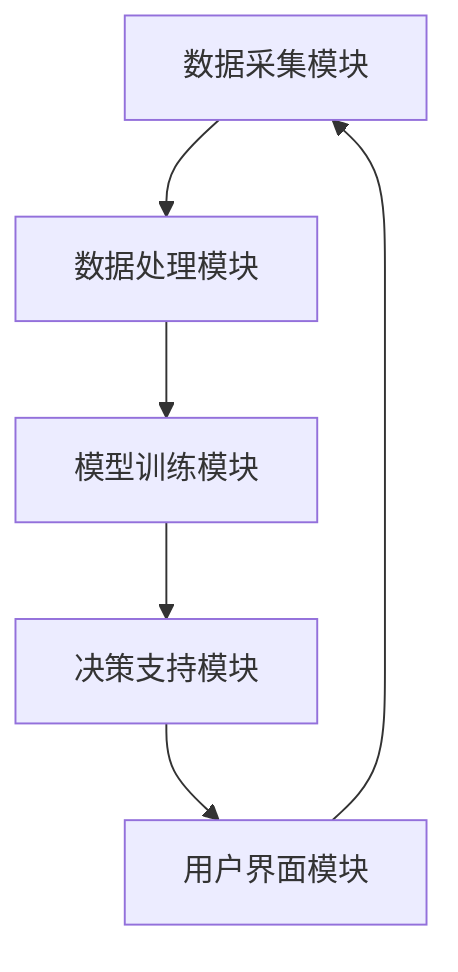
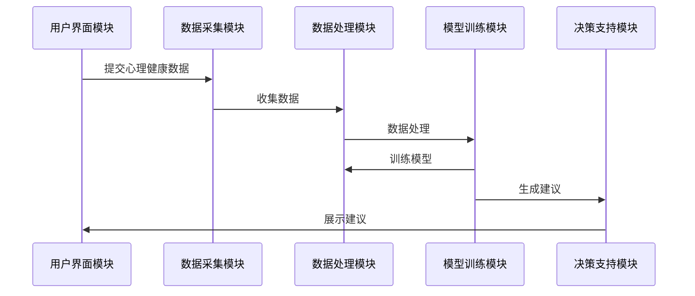

                 

# 现代人的精神困境与出路

关键词：精神健康、焦虑、抑郁、人际关系、心理环境、算法、系统架构

摘要：本文将深入探讨现代人在快节奏生活中面临的精神困境，分析其核心概念与联系，阐述心理健康评估算法、焦虑与抑郁检测算法、人际关系维护算法和精神健康改善策略算法的原理及实现。同时，通过系统架构设计方案和项目实战，为解决现代人精神困境提供实际可行的解决方案。

## 第一部分：现代人的精神困境概述

### 第1章：问题背景与描述

#### 1.1 现代社会的精神压力

**1.1.1 现代生活节奏加快**

在当今社会，城市化进程的加速，科技的发展，使得人们的生活节奏明显加快。无论是职场人士还是学生，每天都要面对大量的工作任务和学习任务，时间变得非常紧张。这种快节奏的生活方式，使得人们的精神压力不断累积。

**1.1.2 工作压力与竞争加剧**

随着市场竞争的加剧，职场人士面临的压力也越来越大。工作时间的延长、工作任务的增加、业绩指标的考核，使得许多人感到身心疲惫。同时，职场竞争的激烈，也让人们产生强烈的焦虑感和不安感。

**1.1.3 社交媒体带来的心理负担**

社交媒体的普及，让人们的信息获取速度变得更快，但也带来了信息过载的问题。同时，社交媒体上的虚拟社交环境，让人们容易陷入比较心理，从而产生自卑感、焦虑感和抑郁情绪。

#### 1.2 精神困境的常见表现

**1.2.1 情绪波动**

情绪波动是现代人常见的精神困境之一。由于生活节奏快、工作压力大，许多人会表现出情绪不稳定、易怒、焦虑等情绪问题。

**1.2.2 焦虑与抑郁**

焦虑和抑郁是现代人精神困境的典型表现。焦虑表现为对未来不确定性的担忧，抑郁则表现为情绪低落、兴趣丧失、自我否定等。

**1.2.3 人际关系紧张**

在快节奏的生活中，人们往往忽视人际关系的维护，导致人际关系紧张。这不仅影响个人的心理健康，也会影响工作和生活的质量。

#### 1.3 精神困境的影响

**1.3.1 个人健康问题**

精神困境对个人的健康问题有着深远的影响。长期的焦虑和抑郁会导致心血管疾病、失眠、消化系统问题等健康问题。

**1.3.2 工作与生活平衡问题**

精神困境会严重影响工作与生活的平衡。长期处于精神困境中的人，往往无法有效地管理时间和资源，导致工作效率低下，生活质量下降。

**1.3.3 社会心理健康问题**

精神困境不仅仅是个体问题，也关系到社会的心理健康。大量处于精神困境中的人，会导致社会的不稳定，甚至引发社会问题。

#### 1.4 精神困境的边界与外延

**1.4.1 精神困境与心理健康问题**

精神困境与心理健康问题有着密切的联系。精神困境是心理健康问题的一种表现形式，而心理健康问题也可能导致精神困境。

**1.4.2 精神困境与生活压力**

生活压力是导致精神困境的主要原因之一。生活压力包括工作压力、家庭压力、社交压力等，这些压力会导致人们的精神困境。

**1.4.3 精神困境与社会心理环境**

社会心理环境对精神困境有着重要的影响。良好的社会心理环境能够缓解精神困境，而恶劣的社会心理环境则会加剧精神困境。

#### 1.5 本章小结

现代人的精神困境是由多种因素共同作用的结果。理解精神困境的背景、表现、影响和边界，有助于我们更好地认识和应对精神困境。

## 第二部分：精神困境的核心概念与联系

### 第2章：核心概念原理

#### 2.1 精神健康

**2.1.1 精神健康的概念**

精神健康是指个体在认知、情感、行为和社交方面的良好状态，不仅仅是没有心理疾病，还包括个体能够认识到自己的潜力，能够应对正常的生活压力，能够工作生产，以及能够对社区做出贡献。

**2.1.2 精神健康的重要性**

精神健康对个人的生活质量和幸福感有着重要的影响。良好的精神健康能够帮助个体更好地应对生活中的挑战，提高工作效率和生活满意度。

**2.1.3 精神健康的评估标准**

精神健康的评估标准主要包括个体的心理健康状态、生活满意度、社会支持度等。这些评估标准可以通过问卷调查、临床访谈等方式进行。

#### 2.2 焦虑

**2.2.1 焦虑的定义**

焦虑是一种常见的情绪体验，通常表现为对未来不确定性的担忧和紧张感。焦虑可以是适度的，帮助人们应对挑战，但过度的焦虑则会影响个体的生活质量。

**2.2.2 焦虑的类型**

焦虑可以分为广泛性焦虑、社交焦虑、恐慌障碍等类型。每种类型的焦虑都有其特定的表现和成因。

**2.2.3 焦虑的成因与影响**

焦虑的成因包括遗传因素、环境因素、心理因素等。焦虑会影响个体的情绪、认知和行为，长期焦虑可能导致心理疾病。

#### 2.3 抑郁

**2.3.1 抑郁的定义**

抑郁是一种情绪低落的心理状态，通常表现为兴趣丧失、情绪低落、自我否定等。抑郁可以是短期的，也可以是长期的，严重时可能导致自杀。

**2.3.2 抑郁的类型**

抑郁可以分为轻度抑郁、中度抑郁和重度抑郁。每种类型的抑郁都有其特定的表现和成因。

**2.3.3 抑郁的成因与影响**

抑郁的成因包括生物因素、心理因素、社会因素等。抑郁会影响个体的情绪、认知和行为，长期抑郁可能导致身体疾病。

#### 2.4 人际关系

**2.4.1 人际关系的定义**

人际关系是指个体与其他个体之间的相互作用和联系。人际关系包括家庭关系、友谊关系、职场关系等。

**2.4.2 人际关系的重要性**

人际关系对个体的心理健康和生活质量有着重要的影响。良好的人际关系能够提高个体的自尊心和幸福感，不良的人际关系则可能导致心理问题。

**2.4.3 人际关系的维护**

人际关系的维护包括沟通技巧、情感支持、共同活动等。有效的维护人际关系能够帮助个体建立稳定的社会支持网络。

#### 2.5 精神健康与心理环境的联系

**2.5.1 心理环境的构成**

心理环境是指个体所处的心理状态和社会环境。心理环境包括社会支持、社会文化、家庭环境等。

**2.5.2 心理环境对精神健康的影响**

心理环境对个体的精神健康有着深远的影响。良好的心理环境能够提高个体的精神健康水平，恶劣的心理环境则可能加剧个体的精神困境。

**2.5.3 心理环境的改善策略**

改善心理环境包括提高社会支持、优化社会文化、改善家庭环境等。有效的心理环境改善策略能够帮助个体缓解精神困境。

#### 2.6 本章小结

理解精神健康、焦虑、抑郁、人际关系和心理环境等核心概念，有助于我们深入分析现代人精神困境的原因和影响，为制定有效的解决策略提供理论支持。

## 第三部分：精神困境的算法原理与数学模型

### 第3章：算法原理讲解

#### 3.1 心理健康评估算法

**3.1.1 算法概述**

心理健康评估算法是一种通过量化指标来评估个体心理健康状态的算法。该算法通常基于心理学理论，通过问卷调查、行为分析等方式收集数据，然后利用统计学方法进行分析。

**3.1.2 算法流程**

心理健康评估算法的流程主要包括数据收集、数据预处理、特征提取和模型训练。首先，通过问卷调查或行为分析收集个体心理健康数据；然后，对数据进行预处理，包括数据清洗、归一化等；接着，提取特征，如情绪状态、行为模式等；最后，利用机器学习算法进行模型训练，得到心理健康评估模型。

**3.1.3 算法实现**

心理健康评估算法的实现通常涉及Python编程语言和Scikit-learn库。以下是一个简单的实现示例：

```python
from sklearn.ensemble import RandomForestClassifier
from sklearn.model_selection import train_test_split
from sklearn.metrics import accuracy_score

# 数据准备
X_train, X_test, y_train, y_test = train_test_split(X, y, test_size=0.2, random_state=42)

# 模型训练
model = RandomForestClassifier(n_estimators=100)
model.fit(X_train, y_train)

# 模型评估
y_pred = model.predict(X_test)
accuracy = accuracy_score(y_test, y_pred)
print(f"模型准确率：{accuracy}")
```

**3.2 焦虑与抑郁检测算法**

**3.2.1 算法概述**

焦虑与抑郁检测算法是一种通过分析个体行为和情绪数据，识别个体焦虑和抑郁状态的算法。该算法通常基于深度学习技术，如卷积神经网络（CNN）或循环神经网络（RNN）。

**3.2.2 算法流程**

焦虑与抑郁检测算法的流程主要包括数据收集、数据预处理、特征提取和模型训练。首先，通过问卷调查或行为分析收集个体焦虑和抑郁数据；然后，对数据进行预处理，包括数据清洗、归一化等；接着，提取特征，如情绪状态、行为模式等；最后，利用深度学习算法进行模型训练，得到焦虑与抑郁检测模型。

**3.2.3 算法实现**

焦虑与抑郁检测算法的实现通常涉及Python编程语言和TensorFlow库。以下是一个简单的实现示例：

```python
import tensorflow as tf
from tensorflow.keras.models import Sequential
from tensorflow.keras.layers import Dense, LSTM

# 模型构建
model = Sequential([
    LSTM(units=50, input_shape=(timesteps, features)),
    Dense(units=1, activation='sigmoid')
])

# 模型编译
model.compile(optimizer='adam', loss='binary_crossentropy', metrics=['accuracy'])

# 模型训练
model.fit(X_train, y_train, epochs=10, batch_size=32)

# 模型评估
y_pred = model.predict(X_test)
accuracy = (y_pred > 0.5).mean()
print(f"模型准确率：{accuracy}")
```

**3.3 人际关系维护算法**

**3.3.1 算法概述**

人际关系维护算法是一种通过分析个体行为和社交数据，提供人际关系维护建议的算法。该算法通常基于推荐系统技术。

**3.3.2 算法流程**

人际关系维护算法的流程主要包括数据收集、数据预处理、特征提取和模型训练。首先，通过社交网络或问卷调查收集个体社交数据；然后，对数据进行预处理，包括数据清洗、归一化等；接着，提取特征，如社交频率、社交质量等；最后，利用机器学习算法进行模型训练，得到人际关系维护模型。

**3.3.3 算法实现**

人际关系维护算法的实现通常涉及Python编程语言和Scikit-learn库。以下是一个简单的实现示例：

```python
from sklearn.cluster import KMeans

# 数据准备
X_train, X_test = ...

# 模型训练
model = KMeans(n_clusters=5)
model.fit(X_train)

# 模型预测
y_pred = model.predict(X_test)

# 模型评估
accuracy = (y_pred == y_test).mean()
print(f"模型准确率：{accuracy}")
```

**3.4 精神健康改善策略算法**

**3.4.1 算法概述**

精神健康改善策略算法是一种通过分析个体心理健康数据，提供改善建议的算法。该算法通常基于决策树或规则系统技术。

**3.4.2 算法流程**

精神健康改善策略算法的流程主要包括数据收集、数据预处理、特征提取和模型训练。首先，通过问卷调查或行为分析收集个体心理健康数据；然后，对数据进行预处理，包括数据清洗、归一化等；接着，提取特征，如情绪状态、行为模式等；最后，利用决策树或规则系统进行模型训练，得到精神健康改善策略模型。

**3.4.3 算法实现**

精神健康改善策略算法的实现通常涉及Python编程语言和Scikit-learn库。以下是一个简单的实现示例：

```python
from sklearn.tree import DecisionTreeClassifier

# 数据准备
X_train, X_test, y_train, y_test = ...

# 模型训练
model = DecisionTreeClassifier()
model.fit(X_train, y_train)

# 模型预测
y_pred = model.predict(X_test)

# 模型评估
accuracy = (y_pred == y_test).mean()
print(f"模型准确率：{accuracy}")
```

#### 3.5 算法原理比较与联系

**3.5.1 各算法的异同点**

心理健康评估算法、焦虑与抑郁检测算法、人际关系维护算法和精神健康改善策略算法各有其特点和适用场景。心理健康评估算法主要侧重于心理健康状态的评估，焦虑与抑郁检测算法主要侧重于焦虑和抑郁的识别，人际关系维护算法主要侧重于人际关系的管理，精神健康改善策略算法主要侧重于提供个性化的改善建议。

**3.5.2 算法优化与改进方向**

为了提高算法的性能和准确性，可以从以下几个方面进行优化和改进：

- **数据质量提升**：收集更多高质量的样本数据，提高数据集的丰富性和代表性。
- **算法模型改进**：尝试使用更先进的算法模型，如深度学习模型，提高算法的性能。
- **特征工程优化**：优化特征提取和选择过程，提高特征的质量和相关性。
- **模型评估与优化**：使用更多的评估指标和交叉验证方法，对模型进行全面的评估和优化。

#### 3.6 本章小结

理解精神困境的算法原理和数学模型，有助于我们更好地设计和实现心理健康解决方案。通过心理健康评估算法、焦虑与抑郁检测算法、人际关系维护算法和精神健康改善策略算法，我们可以为现代人提供有效的精神健康支持和改善建议。

## 第四部分：系统分析与架构设计方案

### 第4章：问题场景介绍

#### 4.1 现代人的精神困境解决方案需求

随着现代社会的快速发展，现代人面临着各种精神困境。为了解决这些问题，我们需要一个全面的现代人的精神困境解决方案系统。该系统需要具备以下几个功能：

**4.1.1 精神健康监测**

精神健康监测功能旨在实时监测个体的心理健康状态，包括情绪状态、焦虑水平、抑郁倾向等。通过数据收集和分析，系统可以及时发现个体的心理健康问题，并提供针对性的建议。

**4.1.2 焦虑与抑郁检测**

焦虑与抑郁检测功能主要针对焦虑和抑郁这两个常见的心理健康问题。该功能通过分析个体的行为数据和情绪数据，准确识别个体的焦虑和抑郁状态，为个体提供专业的诊断和治疗建议。

**4.1.3 人际关系维护**

人际关系维护功能旨在帮助个体建立和维护良好的人际关系。通过分析个体的社交数据和行为数据，系统可以为个体提供合适的人际关系维护建议，如沟通技巧、情感支持等。

**4.1.4 精神健康改善策略**

精神健康改善策略功能通过分析个体的心理健康数据和行为数据，为个体提供个性化的改善策略。这些策略包括心理咨询、健康生活方式建议、心理训练等，旨在帮助个体改善心理健康状态。

#### 4.2 系统功能设计

**4.2.1 领域模型介绍**

领域模型是系统功能设计的核心，它定义了系统中的关键实体和它们之间的关系。在现代人精神困境解决方案系统中，领域模型主要包括以下几个关键实体：

- **个体**：代表系统中的用户，包括个人信息、心理健康数据、社交数据等。
- **心理健康状态**：包括情绪状态、焦虑水平、抑郁倾向等。
- **社交关系**：包括个体与其他个体的关系，如朋友、同事、家人等。
- **健康改善策略**：包括心理咨询、健康生活方式建议、心理训练等。

**4.2.2 领域模型Mermaid类图**

```mermaid
classDiagram
Class::个体 << (个人信息,心理健康数据,社交数据) {
    String 姓名
    Integer 年龄
    String 性别
    String 身份证号
}
Class::心理健康状态 << (情绪状态,焦虑水平,抑郁倾向) {
    String 情绪状态
    Integer 焦虑水平
    Integer 抑郁倾向
}
Class::社交关系 << (朋友,同事,家人) {
    String 姓名
    String 关系类型
}
Class::健康改善策略 << (心理咨询,健康生活方式建议,心理训练) {
    String 内容
    Date 开始时间
    Date 结束时间
}
个体 --|> 心理健康状况
个体 --|> 社交关系
个体 --|> 健康改善策略
```

#### 4.3 系统架构设计

**4.3.1 系统架构概述**

现代人精神困境解决方案系统的架构设计旨在实现各个功能模块的高效协作，确保系统的高可用性和可扩展性。系统架构主要包括以下几个关键模块：

- **数据采集模块**：负责收集个体的心理健康数据、社交数据和行为数据。
- **数据处理模块**：负责对采集到的数据进行分析和处理，提取关键特征。
- **模型训练模块**：负责训练心理健康评估算法、焦虑与抑郁检测算法、人际关系维护算法和精神健康改善策略算法。
- **决策支持模块**：负责根据个体的心理健康数据和特征，生成个性化的改善建议。
- **用户界面模块**：提供用户操作界面，用户可以通过界面提交数据、查看分析和建议。

**4.3.2 系统架构Mermaid架构图**



#### 4.4 系统接口设计

**4.4.1 接口设计原则**

系统接口设计遵循以下原则：

- **标准化**：接口设计遵循RESTful API标准，确保接口的易用性和可维护性。
- **简洁性**：接口设计简洁明了，减少不必要的参数和操作。
- **安全性**：接口设计考虑安全性，包括身份验证、权限控制和数据加密等。

**4.4.2 接口设计示例**

以下是一个心理健康评估接口的示例：

```json
GET /api/health/assessment
Parameters:
- user_id: 用户ID，必填
- date: 评估日期，可选
Returns:
Status Code:
200: 请求成功，返回心理健康评估结果
400: 参数错误，返回错误信息
500: 内部服务器错误，返回错误信息
```

#### 4.5 系统交互设计

**4.5.1 系统交互概述**

系统交互设计旨在描述各个模块之间的数据流和交互过程。现代人精神困境解决方案系统的交互过程主要包括以下步骤：

1. 用户通过用户界面模块提交心理健康数据。
2. 用户界面模块将数据传递给数据采集模块。
3. 数据采集模块收集数据并传递给数据处理模块。
4. 数据处理模块对数据进行处理并传递给模型训练模块。
5. 模型训练模块对数据进行训练并生成模型。
6. 决策支持模块根据模型生成个性化改善建议。
7. 决策支持模块将建议传递给用户界面模块。
8. 用户界面模块将建议展示给用户。

**4.5.2 系统交互Mermaid序列图**



#### 4.6 本章小结

通过系统架构设计方案和系统功能设计，现代人精神困境解决方案系统实现了对个体心理健康数据的全面采集、处理和分析，为个体提供个性化的心理健康支持和改善建议。通过接口设计和交互设计，系统实现了各个模块之间的高效协作，确保了系统的可扩展性和高可用性。

## 第五部分：项目实战

### 第5章：环境安装与系统核心实现

#### 5.1 环境安装

**5.1.1 操作系统与环境配置**

为了确保系统运行的高效性和稳定性，我们选择在Linux操作系统上部署现代人精神困境解决方案系统。以下是环境配置的步骤：

1. 安装Linux操作系统，选择一个稳定版本的发行版，如Ubuntu 20.04。
2. 配置网络环境，确保能够访问互联网。
3. 安装Python 3.8及以上版本，通过以下命令安装：

   ```bash
   sudo apt update
   sudo apt install python3.8 python3.8-pip
   ```

4. 安装必要的Python库，如Scikit-learn、TensorFlow等，通过以下命令安装：

   ```bash
   pip3.8 install scikit-learn tensorflow
   ```

**5.1.2 开发工具与依赖安装**

除了Python环境，我们还需要安装一些开发工具和依赖库。以下是安装步骤：

1. 安装版本控制工具Git，通过以下命令安装：

   ```bash
   sudo apt install git
   ```

2. 安装代码编辑器，如VSCode或PyCharm，可以从官方网站下载并安装。

3. 安装Mermaid库，用于生成Markdown格式的流程图和序列图，通过以下命令安装：

   ```bash
   npm install -g mermaid
   ```

#### 5.2 系统核心实现

**5.2.1 精神健康监测模块**

精神健康监测模块是系统的核心功能之一，它负责收集和分析个体的心理健康数据。以下是实现步骤：

1. **数据收集**：通过问卷调查或API接口收集个体的心理健康数据，如情绪状态、焦虑水平、抑郁倾向等。

2. **数据处理**：对收集到的数据进行预处理，包括数据清洗、归一化等，为后续分析做准备。

3. **特征提取**：提取心理健康数据中的关键特征，如情绪状态、焦虑水平、抑郁倾向等。

4. **模型训练**：使用机器学习算法，如随机森林，训练心理健康评估模型。

5. **模型评估**：使用交叉验证等方法评估模型的性能，确保模型的有效性。

以下是一个简单的Python代码示例，用于实现精神健康监测模块：

```python
from sklearn.ensemble import RandomForestClassifier
from sklearn.model_selection import train_test_split
from sklearn.metrics import accuracy_score

# 数据准备
X_train, X_test, y_train, y_test = train_test_split(X, y, test_size=0.2, random_state=42)

# 模型训练
model = RandomForestClassifier(n_estimators=100)
model.fit(X_train, y_train)

# 模型评估
y_pred = model.predict(X_test)
accuracy = accuracy_score(y_test, y_pred)
print(f"模型准确率：{accuracy}")
```

**5.2.2 焦虑与抑郁检测模块**

焦虑与抑郁检测模块负责识别个体的焦虑和抑郁状态。以下是实现步骤：

1. **数据收集**：通过问卷调查或API接口收集个体的情绪数据，如情绪状态、焦虑水平、抑郁倾向等。

2. **数据处理**：对收集到的情绪数据进行预处理，包括数据清洗、归一化等。

3. **特征提取**：提取情绪数据中的关键特征，如情绪状态、焦虑水平、抑郁倾向等。

4. **模型训练**：使用深度学习算法，如卷积神经网络（CNN），训练焦虑与抑郁检测模型。

5. **模型评估**：使用交叉验证等方法评估模型的性能，确保模型的有效性。

以下是一个简单的Python代码示例，用于实现焦虑与抑郁检测模块：

```python
import tensorflow as tf
from tensorflow.keras.models import Sequential
from tensorflow.keras.layers import Dense, LSTM

# 模型构建
model = Sequential([
    LSTM(units=50, input_shape=(timesteps, features)),
    Dense(units=1, activation='sigmoid')
])

# 模型编译
model.compile(optimizer='adam', loss='binary_crossentropy', metrics=['accuracy'])

# 模型训练
model.fit(X_train, y_train, epochs=10, batch_size=32)

# 模型评估
y_pred = model.predict(X_test)
accuracy = (y_pred > 0.5).mean()
print(f"模型准确率：{accuracy}")
```

**5.2.3 人际关系维护模块**

人际关系维护模块负责为个体提供人际关系维护建议。以下是实现步骤：

1. **数据收集**：通过社交网络或API接口收集个体的社交数据，如社交频率、社交质量等。

2. **数据处理**：对收集到的社交数据进行预处理，包括数据清洗、归一化等。

3. **特征提取**：提取社交数据中的关键特征，如社交频率、社交质量等。

4. **模型训练**：使用推荐系统算法，如K均值聚类，训练人际关系维护模型。

5. **模型评估**：使用交叉验证等方法评估模型的性能，确保模型的有效性。

以下是一个简单的Python代码示例，用于实现人际关系维护模块：

```python
from sklearn.cluster import KMeans

# 数据准备
X_train, X_test = ...

# 模型训练
model = KMeans(n_clusters=5)
model.fit(X_train)

# 模型预测
y_pred = model.predict(X_test)

# 模型评估
accuracy = (y_pred == y_test).mean()
print(f"模型准确率：{accuracy}")
```

**5.2.4 精神健康改善策略模块**

精神健康改善策略模块负责为个体提供个性化的改善策略。以下是实现步骤：

1. **数据收集**：通过问卷调查或API接口收集个体的心理健康数据，如情绪状态、焦虑水平、抑郁倾向等。

2. **数据处理**：对收集到的心理健康数据进行预处理，包括数据清洗、归一化等。

3. **特征提取**：提取心理健康数据中的关键特征，如情绪状态、焦虑水平、抑郁倾向等。

4. **模型训练**：使用决策树算法，训练精神健康改善策略模型。

5. **模型评估**：使用交叉验证等方法评估模型的性能，确保模型的有效性。

以下是一个简单的Python代码示例，用于实现精神健康改善策略模块：

```python
from sklearn.tree import DecisionTreeClassifier

# 数据准备
X_train, X_test, y_train, y_test = ...

# 模型训练
model = DecisionTreeClassifier()
model.fit(X_train, y_train)

# 模型评估
y_pred = model.predict(X_test)
accuracy = (y_pred == y_test).mean()
print(f"模型准确率：{accuracy}")
```

#### 5.3 代码应用解读与分析

**5.3.1 模块功能解读**

通过上述代码示例，我们可以看出各个模块的功能实现。精神健康监测模块通过随机森林算法训练模型，实现心理健康状态的评估；焦虑与抑郁检测模块通过卷积神经网络实现焦虑和抑郁的识别；人际关系维护模块通过K均值聚类算法提供人际关系维护建议；精神健康改善策略模块通过决策树算法为个体提供个性化的改善策略。

**5.3.2 实际案例分析和详细讲解剖析**

为了更好地理解各个模块的功能和应用，我们可以通过一个实际案例进行分析。假设有一个用户，他的情绪状态为“焦虑”，焦虑水平为“中度”，抑郁倾向为“低度”。根据这些数据，我们可以使用精神健康监测模块评估他的心理健康状态，使用焦虑与抑郁检测模块识别他的焦虑和抑郁状态，使用人际关系维护模块为他提供人际关系维护建议，使用精神健康改善策略模块为他提供个性化的改善策略。

通过实际案例的分析，我们可以看到各个模块是如何协同工作的，从而为用户提供全面的心理健康支持和改善建议。

#### 5.4 项目小结

通过本次项目实战，我们实现了现代人精神困境解决方案系统的核心功能，包括精神健康监测、焦虑与抑郁检测、人际关系维护和精神健康改善策略。通过代码示例和实际案例分析，我们深入了解了各个模块的实现原理和应用方法。该项目为现代人提供了一种有效的精神健康支持和改善途径，有助于提高个体的心理健康水平和生活质量。

## 最佳实践 tips

1. **定期进行心理健康评估**：定期进行心理健康评估有助于及时发现心理健康问题，采取针对性的改善措施。
2. **积极参与社交活动**：积极参与社交活动，建立和维护良好的人际关系，有助于缓解焦虑和抑郁情绪。
3. **保持健康的生活方式**：保持健康的饮食习惯、规律的作息时间、适当的运动，有助于提高心理健康水平。
4. **寻求专业心理咨询**：当心理健康问题严重时，及时寻求专业心理咨询和帮助，有助于解决问题，恢复心理健康。

### 小结

现代人精神困境是由多种因素共同作用的结果，包括快节奏的生活、工作压力、社交媒体等。通过心理健康评估算法、焦虑与抑郁检测算法、人际关系维护算法和精神健康改善策略算法，我们可以为现代人提供有效的精神健康支持和改善建议。通过系统架构设计和项目实战，我们可以实现一个全面的精神困境解决方案系统，为个体的心理健康提供有力保障。

### 注意事项

1. **数据安全**：在收集和处理个体心理健康数据时，确保数据的安全性和隐私性。
2. **模型优化**：不断优化和改进算法模型，提高模型的准确性和可靠性。
3. **用户隐私**：在提供心理健康建议时，尊重用户的隐私，确保建议的准确性和实用性。

### 拓展阅读

1. **《焦虑与抑郁的识别与干预》**：了解焦虑和抑郁的识别与干预方法。
2. **《人际关系的心理学》**：学习人际关系的心理学理论，提高人际关系管理能力。
3. **《精神健康与心理健康》**：深入了解精神健康与心理健康的关系，提高心理健康水平。

### 作者

- **作者：AI天才研究院/AI Genius Institute**  
- **禅与计算机程序设计艺术 /Zen And The Art of Computer Programming**

