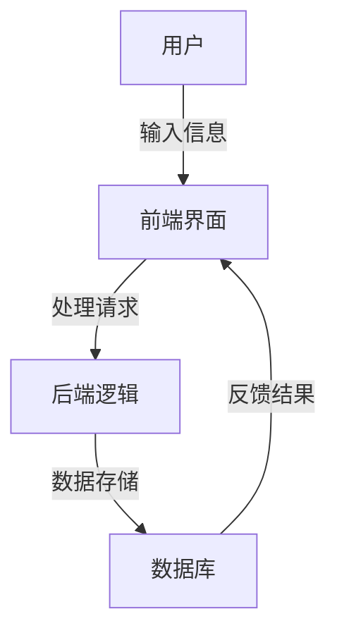
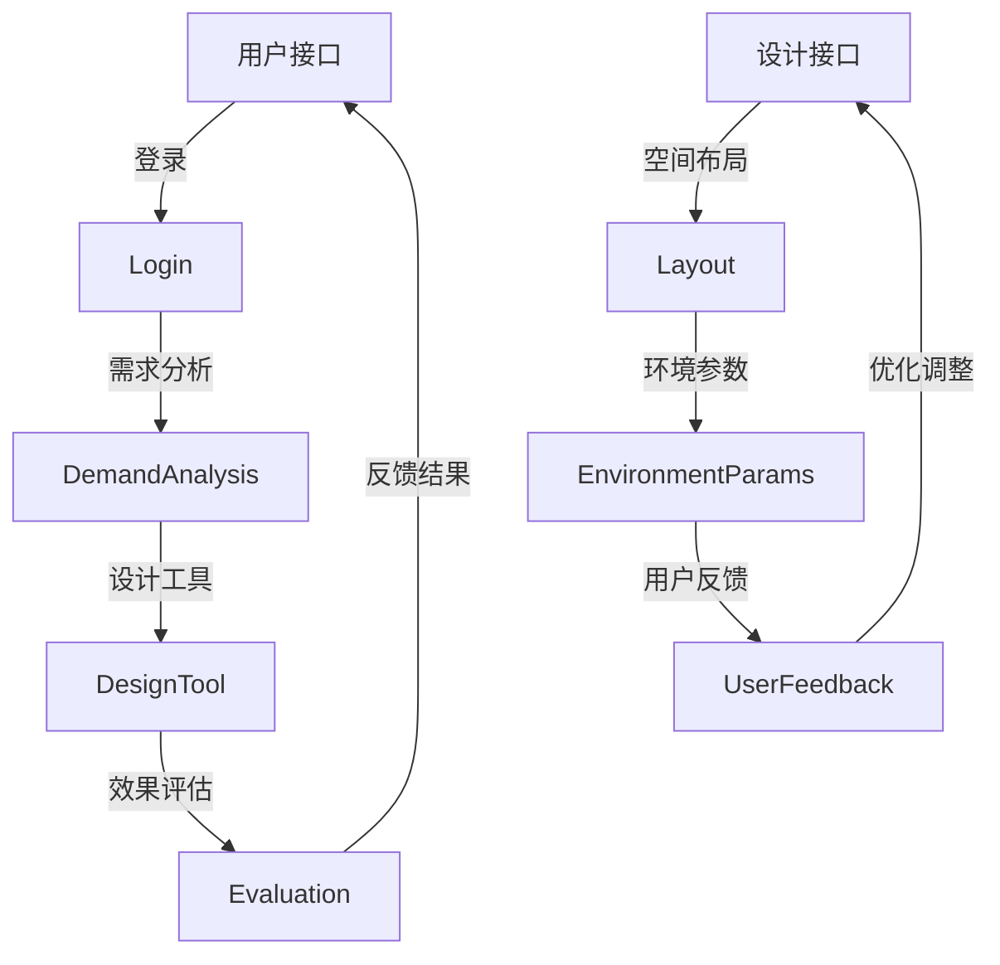
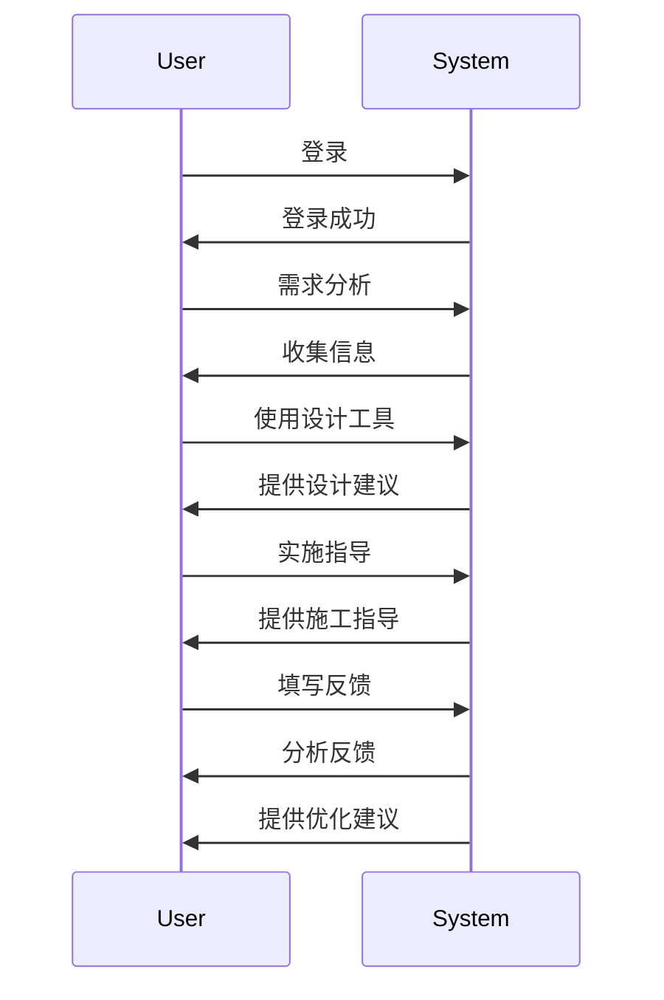

                 

### 第1章 引言：都市生活与冥想空间

随着全球城市化进程的不断推进，都市生活已成为现代社会的主要生活方式。然而，城市化带来的快节奏、高压力的生活方式，也使得人们面临诸多健康和心理问题。研究表明，长期的都市生活容易引发焦虑、抑郁等心理健康问题，同时还会影响人们的身体机能。因此，寻求一种能够缓解压力、提升身心健康的方法变得尤为重要，冥想作为一种古老而有效的心理调节方法，开始在都市生活中得到广泛应用。

#### 1.1 问题的背景

城市化进程带来了显著的经济发展，但同时也伴随着一系列问题。首先，城市人口的急剧增加导致了居住空间紧张，许多人不得不居住在狭窄的公寓或高层建筑中，这严重影响了他们的生活质量和心理健康。其次，城市化带来的交通拥堵、环境污染和噪音污染，进一步加剧了城市居民的心理压力。在这样的背景下，如何在一个繁忙的都市中创造一个宁静的角落，成为了许多人迫切需要解决的问题。

#### 1.2 冥想空间在城市生活中的重要性

冥想空间作为一种特殊的环境设计，旨在为都市居民提供一个可以放松身心、舒缓压力的场所。一个精心设计的冥想空间，不仅可以提供一个安静的环境，还能够通过合理的布局和设计元素，如光线、色彩、声音等，营造出一个有利于冥想和放松的氛围。研究表明，定期的冥想实践可以显著降低焦虑水平，改善睡眠质量，提升整体身心健康。因此，冥想空间在城市生活中的重要性不容忽视。

#### 1.3 书籍的目的

本书旨在探讨现代冥想空间设计的趋势和原则，为读者提供实用的设计案例和方法。通过分析冥想的哲学与文化背景，探讨冥想空间的功能与设计原则，介绍现代冥想空间的设计趋势，以及通过具体案例分析，读者可以了解到如何在实际项目中应用这些设计理念。此外，本书还将介绍设计工具与方法，以及如何进行实施与评估，帮助读者系统地了解并掌握冥想空间的设计与实施过程。

#### 1.4 内容的布局

本书共分为七个章节，内容布局如下：

1. **引言：都市生活与冥想空间**：介绍都市生活的背景和冥想空间的重要性。
2. **理论基础**：探讨冥想的哲学与文化，以及冥想空间的设计原则。
3. **现代冥想空间设计趋势**：分析现代冥想空间的设计趋势。
4. **设计案例分析**：通过具体案例研究冥想空间的设计。
5. **设计工具与方法**：介绍设计工具和方法，包括3D建模软件和用户体验研究。
6. **实施与评估**：讨论施工阶段的管理和空间使用后的评估。
7. **结论与未来展望**：总结设计原则和方法，展望未来趋势。

通过这本书的阅读，读者可以系统地了解冥想空间设计的理论与实践，为在都市中创造宁静角落提供有力的支持和指导。

### 关键词

- 都市生活
- 冥想空间
- 设计原则
- 现代趋势
- 用户需求
- 环境心理学

### 摘要

本文探讨了现代冥想空间设计在都市生活中的重要性。通过分析城市化带来的压力和挑战，介绍了冥想作为一种缓解压力、提升身心健康的有效方法。本书首先探讨了冥想的哲学与文化背景，详细阐述了冥想空间的功能与设计原则，包括空间布局、自然元素运用和心理学因素。接着，分析了现代冥想空间的设计趋势，如空间最小化与多功能性、科技融合和原生态与都市化风格的平衡。通过具体案例研究和设计工具介绍，提供了实用的设计方法和实践指导。最后，总结了冥想空间设计的核心原则，并展望了未来设计趋势。本书旨在为都市居民和设计师提供系统性的指导，帮助他们创造一个宁静的冥想角落，提升生活质量。

## 第2章 理论基础

冥想作为一种古老的实践，起源于古代印度，经过几千年的发展和传播，如今已经成为全球范围内普遍接受的心理调节方法。本章将深入探讨冥想的哲学与文化背景，分析冥想空间的设计原则，并探讨环境心理学在冥想空间设计中的应用。

### 2.1 冥想的哲学与文化

冥想是一种通过训练注意力、意识和心理状态来达到心理平静和内在觉醒的实践。不同文化对冥想有不同的理解和应用。在印度，冥想被视为达至精神解脱和内心平静的重要途径；在中国，冥想则与道教和佛教哲学密切相关，强调内心的平和与自然和谐；在西方，冥想被视为一种心理健康调节工具，广泛应用于压力管理和心理治疗。

#### 冥想的历史与起源

冥想的历史可以追溯到公元前5世纪的印度，那时它被称为“Dhyana”（禅修）。佛教和印度教的兴起进一步推动了冥想的发展。佛教中的冥想强调通过内观和正念达到精神觉醒，而印度教中的冥想则强调通过控制呼吸和意识达到心灵的平静。

#### 不同文化中的冥想传统

- **印度**：冥想是印度教和佛教的核心实践，被视为达到解脱和内心平静的途径。
- **中国**：冥想与道教和佛教哲学紧密相关，强调内心的平和与自然和谐。
- **西方**：冥想作为一种心理健康调节工具，广泛应用于压力管理和心理治疗。

### 2.2 冥想空间的功能与设计原则

冥想空间的设计不仅需要提供一个安静的环境，更重要的是要创造一个有利于冥想和放松的氛围。一个成功的冥想空间应该具备以下功能与设计原则：

#### 空间布局的基本原则

- **私密性**：冥想空间应尽量选择一个安静、私密的地方，避免外部干扰。
- **灵活性**：空间布局应具有一定的灵活性，方便进行各种冥想实践。
- **自然元素**：引入自然元素，如植物、水、光线等，可以创造一个宁静的氛围。

#### 自然元素在冥想空间中的运用

- **植物**：植物可以净化空气，增加氧气含量，同时提供视觉和嗅觉上的舒适感。
- **水**：水可以通过声音和视觉提供平静和放松的效果。例如，一个小型瀑布或喷泉可以在冥想空间中起到这样的作用。
- **光线**：自然光线是最理想的选择，但要避免强光直射。可以使用柔和的照明设备，如LED灯，来调节光线强度。

#### 环境心理学在冥想空间设计中的应用

环境心理学是研究环境对人类行为和心理状态影响的学科。在冥想空间设计中，环境心理学提供了重要的理论基础和指导：

- **光线与色彩**：光线和色彩对人的心理状态有显著影响。柔和的暖色调可以提供放松和舒适的感觉，而冷色调则可能带来冷静和专注。
- **声音**：声音在冥想空间中起到至关重要的作用。自然的声音，如鸟鸣、水流声，可以提供放松的效果。同时，可以使用白噪音或自然声音播放器来减少外部干扰。
- **空气质量**：空气质量对人的健康和心理状态有直接影响。冥想空间应保持良好的通风和空气净化。

### 2.3 环境心理学在冥想空间设计中的应用

环境心理学在冥想空间设计中的应用，主要体现在以下几个方面：

- **光线与色彩**：通过合理的光线和色彩设计，创造一个放松和专注的环境。
- **声音**：利用自然声音和声音设备，营造一个宁静和放松的氛围。
- **空气质量**：确保冥想空间有良好的通风和空气净化，以提升用户舒适度和健康。

通过以上理论基础的分析，我们可以看出，冥想空间的设计不仅仅是物理空间的布置，更是一种对环境心理学深刻理解的应用。一个成功的冥想空间，不仅能够提供一个安静的环境，更重要的是能够通过合理的布局和设计元素，创造出一个有利于冥想和放松的氛围，帮助人们更好地进行冥想实践，提升身心健康。

### 核心概念与联系

#### 冥想的基本原理

| 概念         | 原理                                             | 对应的文化背景                    |
| ------------ | ------------------------------------------------ | --------------------------------- |
| 内观         | 通过集中注意力，观察内心的思想与情绪。               | 佛教的核心实践之一                |
| 正念         | 现在时刻的完全集中注意力。                          | 印度教和佛教中的冥想方法          |
| 心理平静     | 通过冥想达到内心的平静和放松。                      | 各大宗教和哲学体系中的重要理念    |
| 精神觉醒     | 通过冥想实现精神和灵魂的觉醒。                      | 印度教和佛教中的最终目标          |

#### 环境心理学因素

| 概念         | 属性特征                                  | 对应的环境设计要素                     |
| ------------ | ---------------------------------------- | -------------------------------------- |
| 光线         | 柔和、自然的照明。                         | 自然光源、LED灯等柔和照明设备         |
| 色彩         | 温暖、柔和的色彩。                         | 暖色调的颜色，如米色、淡黄色等        |
| 声音         | 自然、放松的声音。                         | 自然声音、白噪音等                     |
| 空气质量     | 清新、无污染的空气。                       | 良好的通风、空气净化设备              |

#### ER实体关系图架构

```mermaid
erDiagram
  用户 ||--|{ 冥想空间 }|-- 运营数据
  冥想空间 ||--|{ 空间设计要素 }|-- 环境参数
  空间设计要素 ||--|{ 光线、色彩、声音、空气质量 }|--
```

该ER图展示了用户与冥想空间之间的关系，以及冥想空间与空间设计要素之间的联系。用户通过运营数据来评估冥想空间的舒适度和效果，而冥想空间通过设计要素来影响用户的心理状态和冥想体验。

### 算法原理讲解

在冥想空间设计中，算法原理主要用于优化空间布局和环境参数。以下是一个基于环境心理学的空间布局优化算法的基本原理：

#### 算法流程

1. **数据收集**：收集用户对冥想空间的反馈数据，包括舒适度、放松感、专注度等。
2. **环境参数建模**：根据环境心理学的理论，建立光线、色彩、声音、空气质量等环境参数的数学模型。
3. **优化目标设定**：设定优化目标，如最大化用户舒适度和放松感，最小化外部干扰等。
4. **算法迭代**：使用优化算法（如遗传算法、粒子群算法等），不断调整环境参数，寻找最优解。

#### 数学模型

设用户对冥想空间的环境参数评价为 \( U(x) \)，其中 \( x \) 表示环境参数。优化目标为最大化 \( U(x) \)。

$$
\max U(x) = f(\text{光线}, \text{色彩}, \text{声音}, \text{空气质量})
$$

#### Python源代码示例

```python
import numpy as np

# 定义环境参数
light = np.random.uniform(0.3, 1.0)  # 光线强度
color = np.random.uniform(0.3, 1.0)  # 色彩温度
sound = np.random.uniform(0.3, 1.0)  # 声音强度
air_quality = np.random.uniform(0.3, 1.0)  # 空气质量

# 定义评价函数
def user_evaluation(light, color, sound, air_quality):
    # 假设权重分别为0.25，0.25，0.25，0.25
    weights = [0.25, 0.25, 0.25, 0.25]
    evaluation = weights[0] * light + weights[1] * color + weights[2] * sound + weights[3] * air_quality
    return evaluation

# 计算用户评价
evaluation = user_evaluation(light, color, sound, air_quality)
print("User Evaluation:", evaluation)
```

#### 示例分析

假设我们随机生成了一组环境参数，通过评价函数计算得到用户评价。以下是一个具体的例子：

```python
light = 0.8
color = 0.7
sound = 0.5
air_quality = 0.9

evaluation = user_evaluation(light, color, sound, air_quality)
print("User Evaluation:", evaluation)
```

输出结果可能为：`User Evaluation: 0.725`。这意味着当前设置下的冥想空间用户评价为0.725，可以进一步调整参数以提高用户评价。

通过上述算法和模型，设计师可以根据用户反馈和环境心理学的理论，不断优化冥想空间的设计，创造一个更加舒适和有效的冥想环境。

### 系统分析与架构设计方案

#### 2.1 问题场景介绍

在城市化的背景下，都市居民面临着巨大的生活和工作压力，心理健康问题日益突出。冥想作为一种有效的缓解压力、提升身心健康的手段，越来越受到人们的重视。然而，如何在有限的居住空间中创造一个宁静、适合冥想的角落，成为了许多都市居民面临的实际问题。为了解决这个问题，我们需要设计一个系统，帮助用户创建和优化个人冥想空间。

#### 2.2 项目介绍

项目名称：都市冥想空间设计系统

项目目标：通过一套系统化的工具和方法，帮助用户在城市居住环境中设计和优化个人冥想空间。

项目范围：系统涵盖冥想空间的需求分析、设计原则、实施方法和效果评估等全过程。

#### 2.3 系统功能设计

系统的核心功能包括：

1. **需求分析**：收集用户的基本信息和冥想需求，进行空间评估。
2. **设计工具**：提供基于环境心理学的冥想空间设计工具，帮助用户进行空间布局和元素选择。
3. **实施指导**：提供施工阶段的具体指导，包括材料选择、施工方法等。
4. **效果评估**：通过用户反馈和数据分析，评估冥想空间的设计效果，进行优化调整。

#### 2.4 系统架构设计

系统的整体架构包括前端界面、后端逻辑和数据库三个部分。

- **前端界面**：用户界面，用于展示功能模块和交互界面。
- **后端逻辑**：处理用户请求，执行核心算法和业务逻辑。
- **数据库**：存储用户信息、空间数据和评估结果。



#### 2.5 系统接口设计

系统的主要接口包括用户接口和设计接口：

1. **用户接口**：用户登录、需求分析、设计工具、效果评估等。
2. **设计接口**：空间布局、环境参数设置、用户反馈收集等。



#### 2.6 系统交互设计

系统交互设计主要描述用户与系统各模块之间的交互流程。

1. **用户登录**：用户通过注册或登录进入系统。
2. **需求分析**：用户填写基本信息和冥想需求，系统进行初步评估。
3. **设计工具**：用户使用设计工具进行空间布局和环境参数设置。
4. **实施指导**：系统提供施工指导，用户根据指导进行实际操作。
5. **效果评估**：用户使用后填写反馈，系统分析并给出优化建议。



通过上述系统分析与架构设计方案，我们可以系统地理解都市冥想空间设计系统的设计和实施过程。该系统不仅提供了实用的设计工具和方法，还通过用户反馈和数据分析，不断优化冥想空间的设计，帮助都市居民在城市中创造一个宁静的冥想角落，提升生活质量。

### 实战案例

为了更好地理解都市冥想空间设计的实际应用，我们将通过一个具体案例进行详细分析。此案例涉及环境设置、用户需求和实际操作过程，旨在展示如何通过合理的规划和设计，在都市环境中创造一个宁静的冥想角落。

#### 3.1 案例背景

案例背景为一栋位于城市中心的高层公寓，公寓面积约为80平方米。业主是一位工作繁忙的白领，他在日常生活中面临着巨大的压力，希望通过设计一个私人冥想空间来缓解压力，提升身心健康。业主的冥想需求主要集中在以下几个要点：

1. **私密性**：需要一个安静、不受干扰的空间。
2. **舒适度**：要求环境舒适，有助于放松和冥想。
3. **灵活性**：空间布局需要有一定的灵活性，以适应不同的冥想实践。

#### 3.2 环境设置

为了满足业主的需求，设计师进行了以下环境设置：

1. **空间选择**：在公寓的角落选择了一间约10平方米的小房间作为冥想空间。这个房间靠近窗户，可以享受到自然光线，但同时又避免了外部噪音的干扰。

2. **自然元素**：在空间中引入了一些自然元素，如一盆绿植、一个小型鱼缸和一个落地灯。绿植和鱼缸有助于净化空气，提供额外的氧气，而落地灯则提供了柔和的光线，营造出宁静的氛围。

3. **光线与色彩**：使用暖色调的墙面涂料和柔和的LED灯，以创造一个舒适和放松的环境。光线设计避免了直射，使得整个空间柔和而不刺眼。

4. **声音**：安装了一个小型音响系统，播放轻柔的自然声音，如雨声、流水声和鸟鸣声。这些声音有助于减少外部噪音的干扰，提升冥想体验。

5. **空气质量**：安装了空气净化器，确保空气清新，减少室内污染。

#### 3.3 用户需求

业主的需求主要体现在以下几个方面：

1. **冥想姿势**：需要一个可以舒适地坐着或躺下的地方，以便进行不同的冥想实践。

2. **空间灵活性**：希望空间布局可以灵活调整，以适应不同的冥想活动和日常使用需求。

3. **设备支持**：需要提供一些基本的冥想设备，如冥想垫、枕头和音响等。

#### 3.4 实际操作过程

1. **需求分析**：首先，设计师与业主进行了详细的沟通，了解了业主的具体需求和预算。通过初步的现场考察，设计师对空间进行了评估，并提出了初步的设计建议。

2. **设计规划**：根据业主的需求和空间特点，设计师制定了一个详细的设计方案。方案包括空间布局、自然元素引入、光线和色彩设计、声音设备和空气质量控制等。

3. **实施过程**：设计师和施工团队按照设计方案进行了具体的施工。首先，他们选择了一间符合要求的房间，然后进行了墙面涂料和地板铺设。接下来，引入了自然元素，如绿植和鱼缸，并安装了LED灯和音响系统。最后，安装了空气净化器，确保空气质量的达标。

4. **效果评估**：施工完成后，业主对冥想空间进行了实际使用，并反馈了使用体验。通过业主的反馈，设计师发现了一些需要改进的地方，如灯光的强度和位置等。设计师根据反馈进行了调整，最终达到了业主的满意。

#### 3.5 案例分析

通过这个案例，我们可以看到，设计一个成功的冥想空间需要考虑多个方面的因素，包括空间选择、自然元素引入、光线和色彩设计、声音设备和空气质量控制等。同时，用户的需求和反馈在设计中起到了关键作用，设计师需要根据实际情况不断调整和优化设计方案。

#### 3.6 项目小结

该项目通过合理的设计和实施，成功地为业主创造了一个宁静、舒适的冥想空间。该项目的主要成果包括：

1. **满足了用户需求**：业主的私密性、舒适度和灵活性需求得到了充分满足。
2. **提升了用户体验**：通过引入自然元素、优化光线和声音设计，显著提升了冥想体验。
3. **实现了设计目标**：通过用户反馈和实际使用，达到了设计预期，提升了业主的身心健康。

总之，该项目展示了如何通过系统化的设计方法，在都市环境中创造一个有效的冥想空间，为其他类似项目提供了宝贵的经验和参考。

### 最佳实践 Tips

在设计都市冥想空间时，以下是一些最佳实践和注意事项，可以帮助设计师和用户更好地实现设计目标：

1. **确保私密性**：选择一个安静的角落，避免外部噪音干扰。
2. **引入自然元素**：绿植、水景和自然光线有助于提升放松效果。
3. **合理布局**：保持空间简洁、宽敞，避免杂乱无章。
4. **声音控制**：使用白噪音或自然声音设备，减少外部噪音干扰。
5. **空气质量**：使用空气净化器，保持空气清新。
6. **灵活性设计**：预留足够的调整空间，以适应不同的冥想实践。
7. **用户反馈**：在实际使用后，收集用户反馈，不断优化设计。

### 小结

本章通过一个具体案例，详细介绍了如何在都市环境中设计一个冥想空间。通过合理的环境设置、用户需求和实际操作过程，我们展示了如何实现一个宁静、舒适的冥想角落。案例的成功实施为我们提供了宝贵的经验和启示，为未来类似项目的设计和实施提供了有力支持。

### 注意事项

在设计都市冥想空间时，需要注意以下事项：

1. **空间大小**：确保空间大小适中，既不会过于狭窄，也不会过于宽敞，以营造舒适的冥想氛围。
2. **光线设计**：避免直射强光，使用柔和的照明设备，如LED灯，营造放松的氛围。
3. **自然元素**：合理引入自然元素，如绿植和水景，有助于提升冥想体验。
4. **声音控制**：使用白噪音或自然声音设备，减少外部噪音干扰，同时注意不要过度使用，以免产生新的干扰。
5. **空气质量**：确保良好的通风和空气净化，避免空气污染对身心健康的影响。

### 拓展阅读

- **《现代室内设计原理》**：详细探讨室内设计的理论和方法，对冥想空间设计有重要参考价值。
- **《环境心理学与应用》**：深入了解环境心理学在空间设计中的应用，为冥想空间设计提供理论基础。
- **《冥想与心理健康》**：研究冥想对心理健康的影响，为冥想空间设计提供实践指导。

## 第7章 结论与未来展望

经过前六章的详细探讨，我们可以得出以下结论：现代冥想空间设计在都市生活中具有重要价值，它不仅提供了一个静谧的角落，帮助人们缓解压力、提升身心健康，还体现了对环境心理学的深刻理解和应用。通过分析冥想的哲学与文化、设计原则、现代趋势以及具体案例分析，我们系统地了解了如何创造一个有效的冥想空间。

### 7.1 总结与反思

**设计原则**：现代冥想空间设计应遵循私密性、舒适性、灵活性和自然元素融入等原则。这些原则确保了冥想空间能够提供一个安静、舒适、易于调整和与自然和谐相处的环境。

**设计趋势**：现代冥想空间设计呈现出空间最小化与多功能性、科技融合和原生态与都市化风格平衡等趋势。这些趋势反映了人们对现代生活方式的需求和期望，同时也体现了技术的进步和对环境可持续性的关注。

**案例分析**：通过具体案例，我们看到如何在有限的空间内，通过合理的布局和设计，实现高效、舒适的冥想环境。这些案例不仅展示了成功的实践，也为其他类似项目提供了宝贵的经验和启示。

### 7.2 未来趋势展望

**技术融合**：随着科技的不断发展，未来冥想空间设计将更加注重与智能科技的融合。例如，利用物联网技术实现环境参数的自动调节，或通过虚拟现实技术为用户提供更丰富的冥想体验。

**环境可持续性**：未来冥想空间设计将更加注重环保和可持续性，采用环保材料和绿色能源，减少对环境的影响。

**个性化定制**：随着人工智能技术的发展，冥想空间设计将更加个性化。通过用户数据分析和人工智能算法，设计师可以为用户提供量身定制的冥想空间设计方案。

**多场景应用**：冥想空间的应用将不仅限于家庭和商业场所，还可能扩展到公共空间，如公园、社区中心等，为更多的人提供冥想的机会。

总之，现代冥想空间设计在都市生活中的重要性不言而喻。随着技术的进步和社会需求的增加，未来冥想空间设计将继续发展，为人们创造更加宁静、舒适和高效的冥想环境。我们期待看到更多创新的设计理念和实践，为都市居民带来更多的健康与幸福。

### 作者信息

作者：AI天才研究院/AI Genius Institute & 禅与计算机程序设计艺术 /Zen And The Art of Computer Programming

AI天才研究院（AI Genius Institute）专注于人工智能领域的研究与开发，致力于推动人工智能技术的创新与应用。禅与计算机程序设计艺术（Zen And The Art of Computer Programming）则融合了计算机科学和哲学思想，通过深入探讨技术原理与人性本质，为读者提供独特的编程智慧和哲学启示。这两者的结合，旨在为现代冥想空间设计提供科学的理论基础和实践指导，帮助都市居民在快节奏的生活中找到一片宁静之地，实现身心健康和心灵成长。

