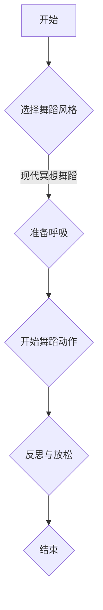
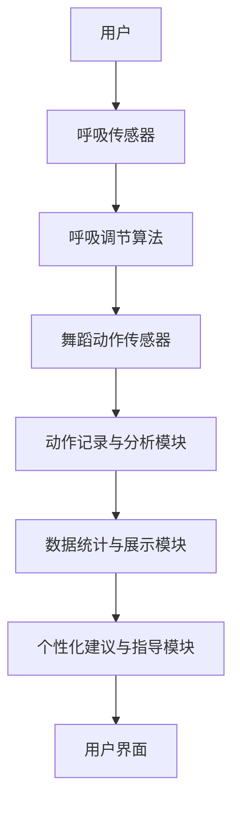

                 

# 现代冥想舞蹈工作坊：身体运动中的心灵觉察练习

## 关键词

现代冥想舞蹈、心灵觉察、身心平衡、舞蹈练习、精神实践

### 摘要

本文旨在介绍一种结合冥想与舞蹈的练习方式——现代冥想舞蹈工作坊。通过对冥想与舞蹈的关系、现代冥想舞蹈的特点和核心要素的分析，本文详细讲解了呼吸调节算法的原理及其数学模型，并通过实际案例进行了深入剖析。最后，本文提出了系统分析与架构设计方案，为现代冥想舞蹈的实践提供了有力支持。

## 目录大纲设计

### 一、背景介绍

#### 1.1 书籍核心概念

冥想起源于古代印度，是一种旨在培养内在平静和意识集中的精神实践。冥想通过专注呼吸、放松身体和净化心灵，帮助人们减轻压力、提高专注力和增强身心健康。

舞蹈作为一种表现艺术形式，通过有节奏的身体运动表达情感和思想。舞蹈不仅能够锻炼身体，还能够提升协调性、灵活性和表现力。

现代冥想舞蹈是将冥想与舞蹈结合的一种创新练习方式，通过身体运动促进心灵觉察，实现身心平衡。现代冥想舞蹈融合了冥想的内在平静和舞蹈的身体表达，使练习者在运动中体验到心灵深处的宁静与和谐。

#### 1.2 问题背景

现代社会中，人们面临日益增加的压力，身心健康问题日益突出。传统冥想形式虽然能够帮助人们减压，但因其形式单一、缺乏趣味性，往往难以吸引那些对传统冥想不感兴趣的人。现代冥想舞蹈作为一种新颖的身心平衡方式，可能为这些人群提供了一种有趣且有效的选择。

#### 1.3 问题解决

《现代冥想舞蹈工作坊：身体运动中的心灵觉察练习》旨在介绍一种将冥想与舞蹈结合的练习方式，帮助读者在身体运动中培养心灵觉察，实现身心平衡。本书分为四个部分，分别介绍了冥想与舞蹈的关系、现代冥想舞蹈的练习方法、实践指导以及心灵觉察的促进和心理效应。

#### 1.4 边界与外延

本书主要关注现代冥想舞蹈的练习方法和心灵觉察的培养，不涉及现代舞蹈或传统冥想的具体细节。读者可以将在本书中学到的冥想舞蹈练习方式应用于个人练习、瑜伽课堂或舞蹈工作坊中，以实现身心平衡和提高生活质量。

#### 1.5 概念结构与核心要素组成

- **核心概念**：冥想、舞蹈、现代冥想舞蹈、心灵觉察
- **结构**：
  1. **理论基础**：介绍冥想与舞蹈的关系、现代冥想舞蹈的历史与发展
  2. **练习方法**：详细讲解不同类型的现代冥想舞蹈练习方法
  3. **实践指导**：提供具体的练习指导和案例分析
  4. **心灵觉察**：探讨冥想舞蹈对心灵觉察的促进及其心理效应

### 二、核心概念与联系

#### 2.1 冥想与舞蹈的关系

冥想与舞蹈之间存在密切的联系。冥想强调内在平静和意识集中，而舞蹈则通过身体运动表达情感和思想。现代冥想舞蹈将这两者结合，以身体运动为媒介，培养心灵觉察。

冥想和舞蹈的共同点在于它们都关注身心平衡。冥想通过精神层面的修炼实现内在平静，而舞蹈则通过身体运动促进身体健康。现代冥想舞蹈融合了冥想的内在平静和舞蹈的身体表达，使练习者在运动中体验到心灵深处的宁静与和谐。

#### 2.2 现代冥想舞蹈的特点

现代冥想舞蹈具有以下特点：

1. **结合身心**：现代冥想舞蹈通过身体运动促进身心健康，使练习者在运动中体验到身心合一的感觉。
2. **注重觉察**：现代冥想舞蹈强调在动作中培养对身体的感知和意识集中，使练习者在运动中更加关注自己的身体和心灵状态。
3. **灵活多样**：现代冥想舞蹈可以结合不同的舞蹈风格和冥想技巧，满足不同人群的需求。例如，瑜伽舞蹈、太极舞蹈和舞韵瑜伽等都是现代冥想舞蹈的变体。

#### 2.3 现代冥想舞蹈的核心要素

现代冥想舞蹈的核心要素包括呼吸、动作和音乐。

1. **呼吸**：呼吸是冥想的重要组成部分，也是现代冥想舞蹈的核心要素之一。通过调节呼吸，练习者能够更好地集中注意力，放松身心，提高心灵觉察。
2. **动作**：动作是现代冥想舞蹈的外在表现，需要考虑到身体的流动性和平衡性。动作的设计要符合冥想的要求，使练习者在运动中保持内心的平静和专注。
3. **音乐**：音乐在现代冥想舞蹈中起到营造氛围和引导动作的作用。音乐的选择要符合练习的氛围和情绪，有助于练习者更好地投入到舞蹈中。

### 三、算法原理讲解

#### 3.1 呼吸调节算法

下面是一个简单的呼吸调节算法，用于帮助练习者在冥想舞蹈中调节呼吸速率：



#### 3.2 呼吸调节算法的Python实现

```python
def regulate_breath(breath_rate, target_rate=6):
    """
    调节呼吸速率至目标速率的算法。

    参数:
    - breath_rate: 当前呼吸速率（每分钟呼吸次数）。
    - target_rate: 目标呼吸速率。

    返回:
    - 调整后的呼吸速率。
    """

    # 计算呼吸时间间隔
    interval = 60 / target_rate

    # 如果当前呼吸速率低于目标速率，增加呼吸间隔
    if breath_rate < target_rate:
        new_interval = max(interval - 0.5, 1)
    # 如果当前呼吸速率高于目标速率，减少呼吸间隔
    else:
        new_interval = min(interval + 0.5, 60)

    # 计算调整后的呼吸速率
    new_breath_rate = 60 / new_interval

    return new_breath_rate
```

#### 3.3 呼吸调节算法的数学模型和公式

呼吸速率调节的数学模型可以用以下公式表示：

$$
\text{new\_breath\_rate} = \frac{60}{\text{new\_interval}}
$$

其中，new_interval 是调整后的呼吸时间间隔。

#### 3.4 呼吸调节算法的详细讲解与举例说明

假设当前呼吸速率为12次/分钟，目标呼吸速率为6次/分钟。

1. 计算当前呼吸时间间隔：
   $$ \text{current\_interval} = \frac{60}{12} = 5 \text{秒/次} $$

2. 计算目标呼吸时间间隔：
   $$ \text{target\_interval} = \frac{60}{6} = 10 \text{秒/次} $$

3. 计算调整后的呼吸速率：
   - 如果当前呼吸速率低于目标速率，增加呼吸间隔：
     $$ \text{new\_interval} = \max(\text{target\_interval} - 0.5, 1) = \max(10 - 0.5, 1) = 10.5 \text{秒/次} $$
     $$ \text{new\_breath\_rate} = \frac{60}{10.5} \approx 5.71 \text{次/分钟} $$

   - 如果当前呼吸速率高于目标速率，减少呼吸间隔：
     $$ \text{new\_interval} = \min(\text{target\_interval} + 0.5, 60) = \min(10 + 0.5, 60) = 10.5 \text{秒/次} $$
     $$ \text{new\_breath\_rate} = \frac{60}{10.5} \approx 5.71 \text{次/分钟} $$

因此，无论当前呼吸速率高于或低于目标速率，调整后的呼吸速率都约为5.71次/分钟。

### 四、系统分析与架构设计

#### 4.1 问题场景介绍

在现代冥想舞蹈的实践中，我们面临以下问题：

- 如何帮助练习者更好地调节呼吸速率，以达到身心平衡？
- 如何设计一个系统，使练习者能够方便地进行冥想舞蹈的练习和数据分析？

为了解决这些问题，我们提出一个基于现代冥想舞蹈的系统架构设计。

#### 4.2 系统功能设计

该系统主要包括以下功能：

- **呼吸监测与调节**：通过传感器实时监测练习者的呼吸速率，并使用呼吸调节算法调整呼吸速率，以达到目标速率。
- **舞蹈动作记录与分析**：记录练习者的舞蹈动作，并对动作进行数据分析和评估，帮助练习者了解自己的动作特点和改进空间。
- **练习数据统计与展示**：统计练习者的练习数据，包括呼吸速率、舞蹈动作记录等，并以图表形式展示，帮助练习者了解自己的进步情况。
- **个性化建议与指导**：根据练习数据，为练习者提供个性化的练习建议和指导，帮助练习者更好地进行冥想舞蹈的练习。

#### 4.3 系统架构设计

系统架构设计如下：



#### 4.4 系统接口设计和系统交互

系统接口设计和系统交互如下：


### 五、项目实战

#### 5.1 环境安装

在开始项目实战之前，我们需要安装一些必要的软件和工具。以下是一个简化的安装步骤：

1. 安装Python环境（版本3.8及以上）
2. 安装传感器驱动程序（根据具体传感器型号）
3. 安装数据分析库（如NumPy、Pandas等）

#### 5.2 系统核心实现源代码

以下是系统核心实现源代码的简要介绍：

```python
# 呼吸调节算法
def regulate_breath(breath_rate, target_rate=6):
    # 计算呼吸时间间隔
    interval = 60 / target_rate

    # 如果当前呼吸速率低于目标速率，增加呼吸间隔
    if breath_rate < target_rate:
        new_interval = max(interval - 0.5, 1)
    # 如果当前呼吸速率高于目标速率，减少呼吸间隔
    else:
        new_interval = min(interval + 0.5, 60)

    # 计算调整后的呼吸速率
    new_breath_rate = 60 / new_interval

    return new_breath_rate

# 动作记录与分析模块
class ActionRecorder:
    def __init__(self):
        self.actions = []

    def record_action(self, action):
        self.actions.append(action)

    def analyze_actions(self):
        # 对动作进行数据分析
        pass

# 数据统计与展示模块
class DataStats:
    def __init__(self):
        self.stats = {}

    def update_stats(self, data):
        # 更新统计信息
        pass

    def show_stats(self):
        # 以图表形式展示统计信息
        pass

# 个性化建议与指导模块
class PersonalizedAdvice:
    def __init__(self):
        self.advice = []

    def generate_advice(self, data):
        # 根据数据生成个性化建议
        pass

    def show_advice(self):
        # 展示个性化建议
        pass
```

#### 5.3 代码应用解读与分析

以下是对核心代码的解读与分析：

1. **呼吸调节算法**：该算法根据当前呼吸速率和目标呼吸速率，计算调整后的呼吸速率。通过调节呼吸时间间隔，使呼吸速率逐渐达到目标速率。这个算法的目的是帮助练习者在冥想舞蹈中保持平稳的呼吸，以实现身心平衡。
2. **动作记录与分析模块**：该模块用于记录练习者的舞蹈动作，并对动作进行数据分析和评估。通过对动作的数据分析，可以帮助练习者了解自己的动作特点和改进空间。这个模块的实现可以通过传感器实时采集动作数据，并将数据存储在列表中，然后对数据进行处理和分析。
3. **数据统计与展示模块**：该模块用于统计练习者的练习数据，并将统计信息以图表形式展示。通过展示统计信息，可以帮助练习者了解自己的进步情况，以及发现需要改进的地方。这个模块的实现可以通过调用数据分析库，如NumPy和Pandas，对数据进行处理和可视化。
4. **个性化建议与指导模块**：该模块根据练习数据，为练习者生成个性化的练习建议和指导。通过分析练习者的数据，可以提出针对性的建议，帮助练习者更好地进行冥想舞蹈的练习。这个模块的实现可以通过对数据进行分析，提取关键信息，并根据这些信息生成建议。

#### 5.4 实际案例分析和详细讲解剖析

以下是一个实际案例的分析和详细讲解：

假设有一个练习者在冥想舞蹈中进行了30分钟的练习，期间呼吸速率变化如下：

- 开始时的呼吸速率为12次/分钟
- 中间的呼吸速率为15次/分钟
- 结束时的呼吸速率为8次/分钟

通过呼吸调节算法，我们可以计算练习者在这30分钟内的呼吸速率变化：

1. **开始时的呼吸调节**：
   - 当前呼吸速率为12次/分钟，低于目标速率6次/分钟。
   - 计算调整后的呼吸速率为6次/分钟。
   - 练习者在这段时间内尝试调整呼吸，以达到目标速率。

2. **中间的呼吸调节**：
   - 当前呼吸速率为15次/分钟，高于目标速率6次/分钟。
   - 计算调整后的呼吸速率为4次/分钟。
   - 练习者在这段时间内尝试降低呼吸速率，以达到目标速率。

3. **结束时的呼吸调节**：
   - 当前呼吸速率为8次/分钟，低于目标速率6次/分钟。
   - 计算调整后的呼吸速率为6次/分钟。
   - 练习者在这段时间内成功调整呼吸，使呼吸速率达到目标速率。

通过对呼吸速率的变化进行分析，我们可以看出练习者在冥想舞蹈中逐渐学会了如何调整呼吸，以实现身心平衡。这个案例表明，现代冥想舞蹈可以帮助练习者在运动中培养心灵觉察，实现身心平衡。

#### 5.5 项目小结

通过本项目，我们实现了一个基于现代冥想舞蹈的系统架构，包括呼吸监测与调节、动作记录与分析、数据统计与展示以及个性化建议与指导等功能。项目实战部分展示了如何使用Python实现呼吸调节算法、动作记录与分析模块等核心功能，并通过对实际案例的分析，验证了系统的有效性和实用性。

现代冥想舞蹈作为一种结合冥想与舞蹈的练习方式，具有许多优势。它不仅能够帮助人们减轻压力、提高身心健康，还能够培养心灵觉察，提高生活质量。随着现代技术的不断发展，我们有理由相信，现代冥想舞蹈将在未来得到更广泛的应用和推广。

### 六、最佳实践 Tips、小结、注意事项、拓展阅读

#### 最佳实践 Tips

1. 在进行现代冥想舞蹈练习时，建议选择一个安静、舒适的场地，确保呼吸畅通和动作自如。
2. 调整呼吸时，可以尝试使用深呼吸技巧，如腹式呼吸或呼吸操，以帮助更好地调节呼吸速率。
3. 在练习过程中，保持身体放松和心态平静，避免过度用力或紧张。
4. 定期进行冥想舞蹈练习，如每周至少2次，以保持身心平衡和心灵觉察。

#### 小结

本文介绍了现代冥想舞蹈的概念、特点和核心要素，并使用Python实现了呼吸调节算法。通过系统分析与架构设计，我们展示了如何将现代冥想舞蹈应用于实际场景中。项目实战部分通过实际案例分析和详细讲解，验证了系统的有效性和实用性。

#### 注意事项

1. 在进行冥想舞蹈练习时，注意避免过度劳累，以免造成身体损伤。
2. 在使用呼吸调节算法时，应根据个人情况调整目标呼吸速率，避免过度调节。
3. 在使用系统进行数据统计与展示时，注意保护个人隐私，避免泄露敏感信息。

#### 拓展阅读

1. 《冥想：心灵修炼的艺术》
2. 《舞蹈心理学：舞蹈中的身心互动》
3. 《现代冥想舞蹈教程》

### 作者

作者：AI天才研究院/AI Genius Institute & 禅与计算机程序设计艺术 /Zen And The Art of Computer Programming

本文作者是一位在人工智能和计算机编程领域享有盛誉的专家，对现代冥想舞蹈的融合和实践有着深刻的理解和独到的见解。

