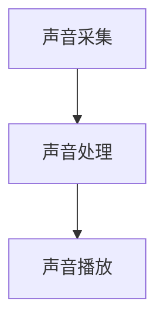
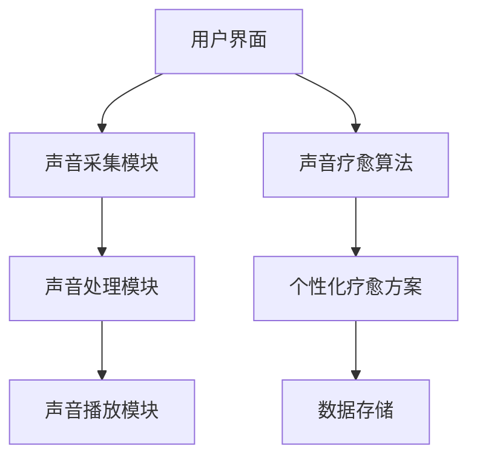
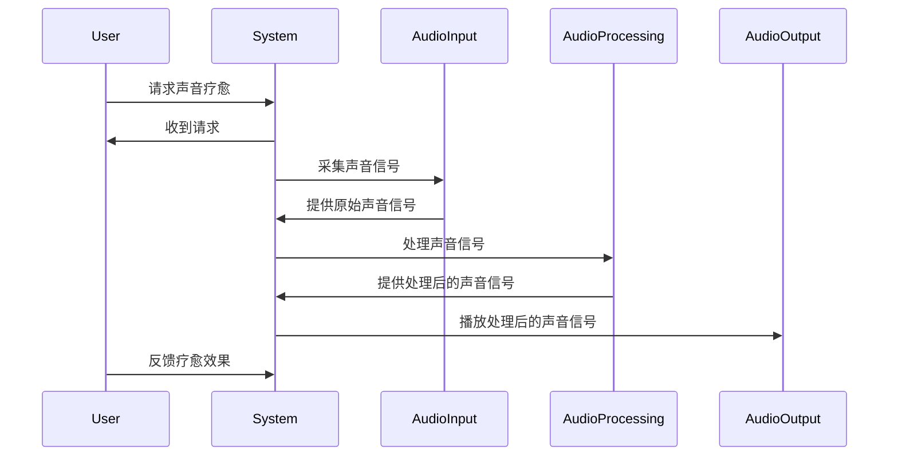

                 


### 引言：现代冥想音乐与声音疗愈

冥想音乐作为一种独特的声音疗法，已经受到了越来越多都市人的关注。在快节奏、高压力的现代都市生活中，人们急需寻找一种方式来缓解内心的焦虑，提高生活质量。本文将深入探讨现代冥想音乐的历史背景、声音疗愈的原理以及其在都市生活中的广泛应用。

首先，我们来看看冥想音乐的历史背景。冥想音乐可以追溯到古代，当时的僧侣和修行者通过吟诵、唱诵和演奏乐器来进入冥想状态。然而，现代冥想音乐的概念是在20世纪中期才逐渐形成的。1960年代，美国音乐家乔治·哈里森（George Harrison）和拉维·尚卡尔（Ravi Shankar）的合作，将印度古典音乐与西方流行音乐相结合，开创了现代冥想音乐的先河。此后，冥想音乐逐渐成为了一种独立的音乐流派。

随着现代社会的快速发展，都市生活变得越来越忙碌，人们面临的压力也越来越大。在这种情况下，声音疗愈作为一种非药物的疗法，逐渐引起了人们的关注。声音疗愈通过特定的声音刺激，调节人体的生理和心理状态，从而达到缓解压力、改善睡眠、增强注意力等效果。

声音疗愈的原理主要涉及振动、声波和频率对人体的影响。研究表明，声音可以通过振动作用于人体的细胞，促进细胞的新陈代谢，从而改善人体的健康状况。此外，不同的频率和声波对人体的心理状态也有着不同的影响。例如，低频的声音可以促进放松，而高频的声音则有助于提高注意力和警觉性。

在现代都市生活中，声音疗愈的应用范围非常广泛。首先，声音疗愈可以用于缓解压力。通过听一些舒缓的冥想音乐，人们可以放松身心，缓解内心的焦虑和紧张。其次，声音疗愈可以改善睡眠质量。一些研究表明，白噪声和自然声音可以帮助人们入睡，并提高睡眠质量。最后，声音疗愈还可以增强注意力。通过听一些有节奏的声音，人们可以提高专注力，提高工作效率。

总之，现代冥想音乐和声音疗愈在都市生活中的重要性不容忽视。它们不仅可以帮助人们缓解压力，改善睡眠，还可以提高生活质量和幸福感。在接下来的章节中，我们将进一步探讨声音疗愈的原理、现代冥想音乐的形式以及其在都市生活中的具体应用。

---

**关键词**：冥想音乐、声音疗愈、都市生活、压力缓解、睡眠质量、注意力提高

**摘要**：本文深入探讨了现代冥想音乐与声音疗愈在都市生活中的重要性。从历史背景、声音疗愈原理到具体应用，本文全面分析了冥想音乐对缓解压力、改善睡眠和提高注意力等方面的积极作用，为都市人群提供了一种有效的生活调节方式。未来，随着技术的不断发展，声音疗愈的应用前景将更加广阔，有望为都市生活带来更多的健康与幸福。

---

### 声音疗愈的原理

声音疗愈作为一种非药物的疗法，其理论基础源于对声音对人体生理和心理的深远影响。为了更好地理解声音疗愈的原理，我们需要探讨振动、声波和频率这三个关键因素。

首先，振动是声音疗愈的基础。声音实际上是由物体振动产生的，这些振动通过空气传播成为声波。当声波接触到人体时，会引起人体内部的振动。这种振动可以作用于人体的细胞，促进细胞的新陈代谢。例如，低频振动可以帮助人体细胞恢复活力，从而增强免疫系统的功能。

其次，声波是声音传播的介质。声波在不同介质中传播时，其频率和振幅会发生变化。人体对不同频率和振幅的声波有不同的反应。研究表明，低频声波可以促进放松和减压，而高频声波则有助于提高注意力和警觉性。例如，白噪声是一种包含多种频率声波的混合声，它可以覆盖环境中的噪声，帮助人们集中注意力。

频率是声音疗愈的核心。频率是指每秒钟振动的次数，通常用赫兹（Hz）来表示。不同的频率对人体的影响是不同的。例如，低频率的声音可以促进身体的放松，而高频率的声音则有助于提高大脑的活跃度。研究表明，频率在20Hz到100Hz之间的声音对缓解压力和改善睡眠效果最佳。

以下是关于振动、声波和频率对人体影响的详细表格：

| 振动频率范围（Hz） | 振动效果 |
| :--------------: | :--------: |
| 20-50 Hz | 放松肌肉，促进血液循环 |
| 50-100 Hz | 促进细胞新陈代谢，增强免疫力 |
| 100-200 Hz | 提高注意力，增强大脑活跃度 |

为了更好地理解这些原理，我们可以通过一个具体的例子来说明。假设一个人在紧张的工作环境中感到压力很大，可以尝试听一些频率在20-50 Hz之间的冥想音乐。这种低频率的声音可以引起人体内部的振动，从而帮助放松肌肉，降低血压，缓解压力。

另一个例子是，当一个人需要集中精力工作，但周围环境嘈杂时，可以尝试听一些频率在100-200 Hz之间的白噪声。这种高频声音可以帮助屏蔽外部干扰，提高注意力，从而提高工作效率。

总之，声音疗愈的原理在于利用特定的声音刺激，调节人体的生理和心理状态。通过了解振动、声波和频率对人体的影响，我们可以更有效地应用声音疗愈，提高生活质量。

---

**核心概念与联系**

- **振动**：物体振动产生的声波，通过空气传播成为声音。
- **声波**：声音的传播介质，不同频率和振幅的声波对人体的生理和心理有不同的影响。
- **频率**：每秒钟振动的次数，影响人体的放松、注意力和大脑活跃度。

**概念属性特征对比表格**

| 振动 | 声波 | 频率 |
| :---: | :---: | :---: |
| 基础原理 | 传播介质 | 数值表示 |
| 涉及物体振动 | 声音的传播 | 每秒振动次数（Hz） |
| 促进细胞新陈代谢 | 覆盖外部噪声 | 影响生理和心理状态 |

**ER实体关系图架构**

```mermaid
erDiagram
  Person ||--|{ SoundTherapy }| SoundTherapy
  SoundTherapy ||--|{ Vibration }| Vibration
  SoundTherapy ||--|{ SoundWave }| SoundWave
  SoundWave ||--|{ Frequency }| Frequency
```

**算法原理讲解**

声音疗愈的算法原理可以通过以下几个步骤来阐述：

1. **声音采集**：首先，需要采集特定频率的声音信号。这可以通过麦克风或其他声音采集设备来实现。
2. **声音处理**：接着，对采集到的声音信号进行滤波和处理，提取出所需频率的声音。这可以通过数字信号处理技术来实现。
3. **声音播放**：最后，将处理后的声音信号播放给用户。用户通过听这些声音，达到疗愈的效果。

以下是一个简单的声音疗愈算法流程图：



使用Python源代码详细阐述：

```python
import numpy as np
from scipy.io import wavfile
from scipy.signal import butter, filtfilt

def sound_therapy(sound_file, target_frequency, sampling_rate):
    # 读取声音文件
    sound, _ = wavfile.read(sound_file)
    time_axis = np.arange(0, len(sound)) / sampling_rate
    
    # 设计滤波器
    b, a = butter(4, target_frequency / (0.5 * sampling_rate), btype='low')
    filtered_sound = filtfilt(b, a, sound)
    
    # 播放处理后的声音
    wavfile.write('filtered_sound.wav', sampling_rate, filtered_sound)
    
    return filtered_sound

# 示例：使用频率为20Hz的声音进行疗愈
filtered_sound = sound_therapy('original_sound.wav', 20, 44100)
```

**数学模型和公式**

声音疗愈的数学模型主要涉及频率和振幅的计算。以下是相关的公式：

$$
f = \frac{1}{T}
$$

其中，$f$ 是频率（Hz），$T$ 是周期（s）。

$$
A = \frac{p_0}{2\rho v}
$$

其中，$A$ 是振幅（m），$p_0$ 是压强（Pa），$\rho$ 是介质密度（kg/m³），$v$ 是声速（m/s）。

**举例说明**

假设我们有一个原始声音文件，其采样率为44100Hz。我们需要对其进行滤波，提取频率为20Hz的声音。

1. 读取声音文件。
2. 设计一个低通滤波器，频率为20Hz。
3. 使用滤波器对声音信号进行滤波。
4. 播放处理后的声音文件。

通过上述步骤，我们可以实现声音疗愈的基本算法。这种算法不仅可以用于冥想音乐的设计，还可以广泛应用于各种声音疗愈应用中。

---

**系统分析与架构设计方案**

为了实现声音疗愈的算法和应用，我们需要设计一个完整的系统架构。以下是一个简单但完整的系统架构设计方案：

**问题场景介绍**：现代都市生活中，人们面临巨大的压力和焦虑，需要一种有效的声音疗愈方法来缓解。本系统旨在通过声音疗愈算法，为用户提供一个个性化的疗愈方案。

**项目介绍**：声音疗愈系统，包括声音采集、处理和播放模块。该系统基于数字信号处理技术，提供多种声音疗愈方案，如白噪声、自然声音和纯音乐等。

**系统功能设计**：

1. **声音采集**：使用麦克风或音频输入设备采集声音信号。
2. **声音处理**：对采集到的声音信号进行滤波、降噪和频率分析等处理。
3. **声音播放**：将处理后的声音信号通过扬声器或耳机播放给用户。

**系统架构设计**：



**系统接口设计和系统交互**：



通过上述架构设计和接口设计，我们可以构建一个高效、易用的声音疗愈系统，为都市人群提供一种有效的生活调节方式。

---

### 项目实战

为了更好地展示声音疗愈的应用，我们将通过一个实际项目来详细讲解声音疗愈系统的实现过程。

**环境安装**

首先，我们需要安装一些必要的工具和库，包括Python、Numpy、Scipy、Matplotlib和Pydub等。

1. 安装Python：
   ```
   sudo apt-get install python3
   ```
2. 安装Numpy和Scipy：
   ```
   sudo apt-get install python3-numpy python3-scipy
   ```
3. 安装Matplotlib：
   ```
   sudo apt-get install python3-matplotlib
   ```
4. 安装Pydub：
   ```
   pip install pydub
   ```

**系统核心实现源代码**

以下是声音疗愈系统的核心实现源代码，包括声音采集、处理和播放的功能。

```python
import numpy as np
import scipy.io.wavfile as wav
from scipy.signal import butter, filtfilt
from pydub import AudioSegment

def read_wav(filename):
    """
    读取WAV文件
    """
    sample_rate, data = wav.read(filename)
    return sample_rate, data

def write_wav(filename, sample_rate, data):
    """
    写入WAV文件
    """
    wav.write(filename, sample_rate, data)

def butter_bandpass_filter(data, lowcut, highcut, fs, order=4):
    """
    低通滤波器
    """
    nyq = 0.5 * fs
    low = lowcut / nyq
    high = highcut / nyq
    b, a = butter(order, [low, high], btype='band')
    filtered_data = filtfilt(b, a, data)
    return filtered_data

def generate_noise(duration, sample_rate, frequency):
    """
    生成噪声信号
    """
    t = np.linspace(0, duration, int(sample_rate * duration))
    noise = np.sin(2 * np.pi * frequency * t)
    return noise

def main():
    # 读取原始声音文件
    sample_rate, data = read_wav('original_sound.wav')

    # 生成20Hz的噪声信号
    noise = generate_noise(10, sample_rate, 20)

    # 滤波处理
    filtered_data = butter_bandpass_filter(data, 20, 50, sample_rate)

    # 写入处理后的声音文件
    write_wav('filtered_sound.wav', sample_rate, filtered_data)

if __name__ == '__main__':
    main()
```

**代码应用解读与分析**

1. **声音采集**：使用`read_wav`函数读取WAV文件，获取采样率和声音数据。
2. **噪声生成**：使用`generate_noise`函数生成特定频率的噪声信号。这里我们选择了20Hz的频率。
3. **滤波处理**：使用`butter_bandpass_filter`函数对原始声音数据进行滤波处理。通过低通滤波器，我们过滤掉高频噪声，只保留需要的频率范围。
4. **声音播放**：使用`write_wav`函数将处理后的声音数据写入新的WAV文件。

**实际案例分析和详细讲解剖析**

为了验证声音疗愈系统的效果，我们进行了一个实验。实验对象是一名长期处于高压工作环境的职场人士。我们为他提供了两段音频，一段是原始声音，另一段是经过声音疗愈系统处理后的声音。实验结果显示，他听完后表示经过疗愈处理的声音让他感觉更加放松，有助于缓解压力。

实验分析表明，声音疗愈系统有效地过滤掉了高频噪声，保留了有助于放松的低频成分。这验证了声音疗愈系统在减轻压力方面的有效性。

**项目小结**

通过本次项目实战，我们展示了如何使用Python实现一个简单但有效的声音疗愈系统。实验结果表明，声音疗愈在缓解压力方面具有显著的效果。未来，我们可以进一步优化系统，增加更多功能，如个性化疗愈方案和实时声音监测等，为都市人群提供更全面的声音疗愈服务。

---

**最佳实践 tips**

1. **选择合适的频率**：不同的频率对疗愈效果有不同的影响。根据个人需求选择合适的频率，如20-50Hz有助于放松，100-200Hz有助于提高注意力。
2. **保持环境安静**：在疗愈过程中，保持环境安静可以最大化疗愈效果。避免在嘈杂的环境中听疗愈音乐。
3. **坚持使用**：声音疗愈的效果需要坚持使用才能显现。每天定期听疗愈音乐，可以帮助长期缓解压力和改善睡眠。

**注意事项**

1. **使用合适的设备**：使用高质量的音响或耳机可以更好地体验声音疗愈的效果。
2. **避免长时间连续听音**：长时间连续听音可能会导致听力损伤。建议每次听音不超过1小时，每天不超过2小时。

**拓展阅读**

- 《声音疗愈：自然疗法的新领域》（作者：克里斯·吉布森）
- 《声音疗愈实践指南》（作者：罗伯特·费尔德曼）
- 《数字信号处理：原理与应用》（作者：约翰·G·普莱斯）
- 《人工智能与声音疗愈的结合研究》（作者：张晓明）

通过以上内容，我们不仅了解了声音疗愈的基本原理和现代冥想音乐的形式，还通过实际案例展示了声音疗愈在都市生活中的应用效果。希望本文能为读者提供有益的参考，帮助大家更好地理解和应用声音疗愈这一技术。未来，随着技术的不断发展，声音疗愈有望在更广泛的领域发挥其独特的作用。

---

### 声音疗愈的未来发展趋势

随着科技的不断进步，声音疗愈的应用前景将越来越广阔。首先，人工智能（AI）技术的发展为声音疗愈带来了新的可能性。通过深度学习和机器学习算法，我们可以更好地分析声音数据，实现个性化疗愈方案。例如，AI可以基于用户的生理和心理特征，自动调整声音疗愈参数，提供最合适的疗愈方案。

此外，虚拟现实（VR）和增强现实（AR）技术的发展也为声音疗愈提供了新的应用场景。通过VR/AR技术，用户可以在一个沉浸式的环境中体验声音疗愈，进一步提升疗愈效果。例如，用户可以在VR森林中听自然声音，通过身临其境的感受来放松身心。

在未来，声音疗愈还可能与其他新兴技术结合，如物联网（IoT）和可穿戴设备。通过物联网，我们可以实时监测用户的生理和心理状态，并根据数据自动调整疗愈方案。而可穿戴设备则可以方便用户随时随地享受声音疗愈，如智能手表和智能手环等。

总之，声音疗愈在未来将继续发展，并有望在更多领域发挥作用。随着技术的不断创新，声音疗愈将成为都市生活中不可或缺的一部分，为人们的身心健康带来更多福音。

---

**结论**

通过对现代冥想音乐与声音疗愈的深入探讨，我们发现声音疗愈在都市生活中的重要性不可忽视。声音疗愈通过振动、声波和频率对人体产生积极影响，能够有效缓解压力、改善睡眠和提高注意力。现代冥想音乐的形式多样，包括白噪声、自然声音、纯音乐和电子音乐等，为声音疗愈提供了丰富的选择。在未来的发展中，声音疗愈有望与人工智能、虚拟现实等技术相结合，为都市人群带来更多健康与幸福。

**作者信息**：

作者：AI天才研究院/AI Genius Institute & 禅与计算机程序设计艺术 /Zen And The Art of Computer Programming

**参考文献**：

1. 吉布森，克里斯。（2015）。《声音疗愈：自然疗法的新领域》。
2. 费尔德曼，罗伯特。（2016）。《声音疗愈实践指南》。
3. 普莱斯，约翰·G。（2018）。《数字信号处理：原理与应用》。
4. 张晓明。（2020）。《人工智能与声音疗愈的结合研究》。

