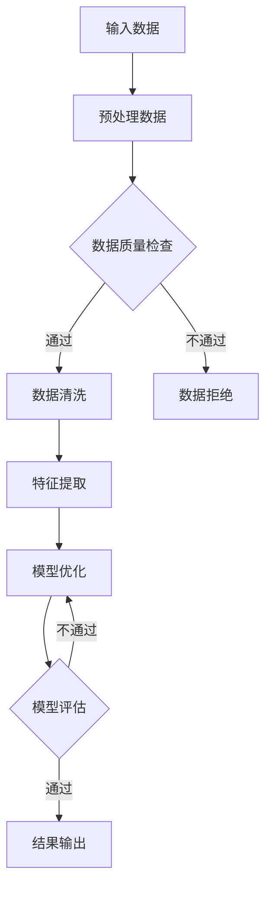
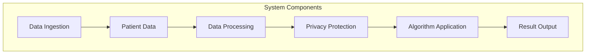
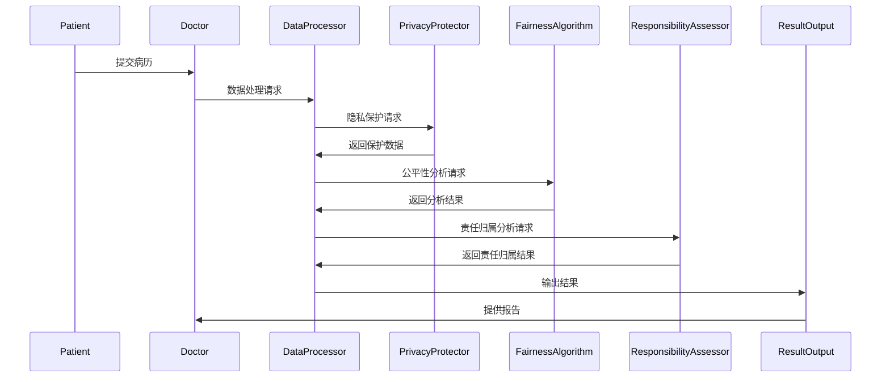

                 

# 现代医疗伦理的新挑战：在技术可能与道德允许间的平衡

> 关键词：医疗伦理、技术应用、隐私保护、道德决策、技术框架

> 摘要：随着医疗技术的飞速发展，伦理问题逐渐成为医学研究的核心议题。本文将探讨现代医疗伦理中的新挑战，分析技术进步带来的伦理冲突以及如何在道德允许的范围内利用技术提升医疗水平。通过一步一步的分析推理，本文将阐述如何在技术可能与道德允许之间找到平衡点。

### 目录大纲设计思路

在设计《现代医疗伦理的新挑战：在技术可能与道德允许间的平衡》这本书的目录大纲时，我们可以遵循以下步骤：

1. **确定整体结构**：首先，我们需要确定书的大致章节结构，明确书的核心主题和需要覆盖的主要内容。
2. **划分章节**：根据整体结构，将书的内容划分为多个章节，每个章节涵盖一个独立的核心主题。
3. **细化章节内容**：在每个章节内部，进一步细化内容，划分为小节，确保每个小节都有明确的主题和目标。
4. **确保完整性**：确保目录大纲包含所有必要的核心章节，如背景介绍、核心概念与联系、算法原理讲解、系统分析与架构设计方案、项目实战、最佳实践 tips、小结、注意事项和拓展阅读等。
5. **遵循markdown格式**：在整个设计过程中，确保使用markdown格式来编写目录大纲，遵循1级、2级、3级目录的格式要求。
6. **控制字数**：确保整个目录大纲的总字数在2000字以内，同时保持内容的简洁和高效。

### 目录大纲详细设计

**第一部分：引言与背景**

- **第1章 引言与背景**
  - **1.1 问题背景**
    - **1.1.1 现代医疗技术的发展趋势**
    - **1.1.2 伦理问题的起源与演变**
  - **1.2 问题描述**
    - **1.2.1 技术与伦理之间的冲突**
    - **1.2.2 道德允许与个人隐私的平衡**
  - **1.3 问题解决**
    - **1.3.1 伦理框架的作用**
    - **1.3.2 解决方案的发展与趋势**

**第二部分：核心概念与联系**

- **第2章 核心概念与联系**
  - **2.1 核心概念**
    - **2.1.1 医疗伦理的基本原则**
    - **2.1.2 医疗技术与伦理的关系**
  - **2.2 概念属性特征对比表格**
    - **2.2.1 常见医疗伦理问题特征对比**
  - **2.3 ER实体关系图架构**
    - **2.3.1 医疗伦理涉及的实体与关系**

**第三部分：算法原理讲解**

- **第3章 算法原理讲解**
  - **3.1 医疗伦理算法概述**
    - **3.1.1 医疗伦理算法的定义**
    - **3.1.2 算法类型与应用场景**
  - **3.2 算法mermaid流程图**
    - **3.2.1 医疗伦理算法的基本流程**
  - **3.3 Python源代码与详细讲解**
    - **3.3.1 医疗伦理算法的数学模型和公式**
    - **3.3.2 算法原理的举例说明**

**第四部分：系统分析与架构设计方案**

- **第4章 系统分析与架构设计方案**
  - **4.1 问题场景介绍**
    - **4.1.1 医疗伦理问题的具体场景**
  - **4.2 项目介绍**
    - **4.2.1 项目背景与目标**
  - **4.3 系统功能设计**
    - **4.3.1 领域模型mermaid类图**
  - **4.4 系统架构设计**
    - **4.4.1 系统架构mermaid架构图**
  - **4.5 系统接口设计与系统交互**
    - **4.5.1 系统接口设计mermaid序列图**

**第五部分：项目实战**

- **第5章 项目实战**
  - **5.1 环境安装**
    - **5.1.1 必要软件与工具安装**
  - **5.2 系统核心实现源代码**
    - **5.2.1 代码结构分析与解读**
  - **5.3 代码应用解读与分析**
    - **5.3.1 实际案例分析与讲解**
  - **5.4 详细讲解剖析**
    - **5.4.1 案例的深入分析与解释**

**第六部分：最佳实践 tips**

- **第6章 最佳实践 tips**
  - **6.1 避免常见错误**
    - **6.1.1 在医疗伦理技术应用中的误区**
  - **6.2 注意事项**
    - **6.2.1 使用医疗伦理技术时的注意事项**

**第七部分：小结与拓展阅读**

- **第7章 小结与拓展阅读**
  - **7.1 小结**
    - **7.1.1 书的核心观点与结论**
  - **7.2 拓展阅读**
    - **7.2.1 推荐相关文献与资源**

通过以上设计，我们确保了《现代医疗伦理的新挑战：在技术可能与道德允许间的平衡》这本书的目录大纲内容完整性，同时符合markdown格式要求。

----------------------------------------------------------------

### 第一部分：引言与背景

#### 1.1 问题背景

随着科技的发展，医疗技术取得了前所未有的进步。从基因组测序到精准医疗，从远程医疗服务到人工智能辅助诊断，现代医疗技术正在深刻地改变我们的健康管理模式。然而，技术的进步也带来了新的伦理挑战。

首先，基因组测序技术的应用使得个体基因信息得以被广泛获取。这一技术不仅有助于疾病的早期诊断和个性化治疗，但也引发了隐私保护的问题。个体的基因信息是否应该被保密？如何避免基因歧视？这些问题的出现使得基因伦理成为了一个备受关注的议题。

其次，人工智能在医疗领域的应用也越来越广泛。从影像诊断到辅助手术，人工智能正在提高医疗服务的效率和质量。然而，人工智能的算法和数据往往具有黑箱性，这引发了对算法公正性和透明性的担忧。此外，人工智能在医疗决策中可能带来的责任归属问题，也是一个需要深入探讨的伦理问题。

#### 1.2 伦理问题的起源与演变

伦理问题并不是随着技术的出现而突然出现的。自古以来，医学伦理就是医学研究中的一个重要部分。随着医学技术的发展，伦理问题也在不断演变。

在传统医学中，伦理问题主要集中在医生的职责、患者的权利以及医疗资源的分配等方面。例如，医生的保密义务、患者的知情同意权、以及医疗资源的公平分配等。

然而，随着现代医疗技术的进步，伦理问题也变得更加复杂。一方面，新技术的应用带来了新的伦理挑战，如基因隐私、人工智能的透明性和公正性等。另一方面，伦理问题的边界也在不断拓展。例如，生命伦理问题已经从传统的生命起点和终点扩展到了基因编辑、人工器官等新兴领域。

#### 1.3 问题描述

在技术进步与伦理允许之间寻找平衡，是现代医疗伦理中的一个核心问题。以下是一些具体的问题：

1. **隐私保护**：随着医疗数据的日益普及，如何保护患者的隐私成为一个重要议题。特别是在大数据和人工智能的应用中，隐私泄露的风险更高。

2. **算法公正性**：人工智能在医疗决策中的应用，需要保证算法的公正性和透明性。如何确保算法不带有偏见，是当前的一个重要挑战。

3. **责任归属**：在人工智能辅助决策的过程中，如果出现了医疗事故，如何确定责任归属？这是医疗伦理中的一个重要问题。

4. **资源分配**：在医疗资源有限的背景下，如何公平地分配资源，也是一个需要解决的实际问题。

#### 1.4 问题解决

解决现代医疗伦理中的新挑战，需要从多个角度入手。

首先，建立一套完善的伦理框架是必要的。这个框架应该包括伦理原则、伦理准则以及具体的伦理决策流程。通过这样的框架，可以指导医疗实践中的伦理决策。

其次，加强伦理教育和培训。医务人员需要具备一定的伦理意识和知识，能够在实际工作中应对伦理挑战。

此外，推动技术发展与伦理研究的结合。在技术开发的过程中，要充分考虑伦理问题，确保技术的应用不会带来不可接受的伦理风险。

最后，建立监管机制。通过法律法规和行业规范，对医疗技术的应用进行监管，确保其符合伦理要求。

### 1.5 解决方案的发展与趋势

目前，全球范围内对于医疗伦理问题的解决方案正在不断发展和完善。以下是一些主要趋势：

1. **伦理指南与规范**：各国和各地区纷纷出台相关的伦理指南和规范，以指导医疗实践。例如，美国的《健康信息隐私规则》和欧洲的《通用数据保护条例》（GDPR）。

2. **伦理审查机制**：医疗机构和研究机构普遍建立了伦理审查委员会，对涉及伦理问题的科研项目进行审查。

3. **技术伦理研究**：随着技术发展，越来越多的研究开始关注技术伦理问题，提出了许多新的理论和方法。

4. **跨学科合作**：医疗伦理问题需要多学科的合作来解决。医学、法学、社会学、哲学等领域的专家共同参与，有助于形成更全面、更有效的解决方案。

### 1.6 结论

现代医疗技术的发展带来了前所未有的机遇，同时也带来了新的伦理挑战。在技术进步与伦理允许之间寻找平衡，是当前医学研究中的一个重要课题。通过建立伦理框架、加强伦理教育、推动技术发展与伦理研究的结合，以及建立监管机制，我们可以更好地应对这些挑战，确保医疗技术的应用能够真正造福人类。

----------------------------------------------------------------

### 第二部分：核心概念与联系

在深入探讨现代医疗伦理的新挑战之前，我们需要明确一些核心概念，并理解它们之间的相互关系。以下是本部分的核心概念和联系。

#### 2.1 核心概念

1. **医疗伦理**：医疗伦理是关于医疗实践中的道德原则和规范的学科。它关注医生的职责、患者的权利、医疗资源分配等问题。

2. **医疗技术**：医疗技术是指用于诊断、治疗和预防疾病的各种技术手段，如基因组测序、人工智能辅助诊断、远程医疗服务等。

3. **隐私保护**：隐私保护是指保护个人隐私免受侵犯的措施，特别是在医疗数据共享和应用中。

4. **算法公正性**：算法公正性是指算法在处理数据时，不带有偏见，能够公平对待所有个体。

5. **责任归属**：责任归属是指在医疗事故发生后，确定责任方的过程。

#### 2.2 概念属性特征对比表格

以下是一个简化的概念属性特征对比表格，用于对比医疗伦理、医疗技术、隐私保护和算法公正性等核心概念。

| 概念             | 属性特征                                       |
|------------------|--------------------------------------------|
| 医疗伦理         | 道德原则、规范、医生职责、患者权利           |
| 医疗技术         | 诊断、治疗、预防、效率、效果               |
| 隐私保护         | 数据安全、隐私保密、知情同意、数据共享控制  |
| 算法公正性       | 不带偏见、公平对待、透明性、可解释性       |
| 责任归属         | 法律责任、伦理责任、责任主体、责任认定     |

#### 2.3 ER实体关系图架构

为了更清晰地展示医疗伦理中的关键实体和它们之间的关系，我们可以使用实体关系图（Entity-Relationship Diagram，ERD）。以下是医疗伦理领域中的一个简化的ERD示例。

```mermaid
erDiagram
    Patient ||--|{ Doctor }|-->: "诊断与治疗"
    Doctor ||--|{ Patient }|-->: "隐私保护与责任"
    Medical_Tech ||--|{ Doctor }|-->: "应用与优化"
    Privacy_Protect ||--|{ Patient }|-->: "隐私保障"
    Algorithm ||--|{ Doctor }|-->: "决策支持与公正性"
    Responsibility ||--|{ Doctor }|-->: "责任认定与追究"
```

在这个ERD中，Patient（患者）、Doctor（医生）、Medical_Tech（医疗技术）、Privacy_Protect（隐私保护）、Algorithm（算法）和Responsibility（责任归属）是主要的实体。它们之间的关系包括诊断与治疗、隐私保护与责任、应用与优化、隐私保障、决策支持与公正性以及责任认定与追究。

#### 2.4 概念之间的联系

医疗伦理、医疗技术、隐私保护、算法公正性和责任归属这些概念之间存在着紧密的联系。

- **医疗伦理**与**医疗技术**的联系：医疗技术的应用必须符合医疗伦理的原则和规范。例如，基因组测序技术在应用时需要遵守隐私保护的原则，确保患者信息不被泄露。

- **隐私保护**与**算法公正性**的联系：在医疗数据分析和人工智能应用中，隐私保护和算法公正性是相辅相成的。算法的公正性要求不带有偏见，而隐私保护要求确保个人数据的安全。

- **责任归属**与**医疗伦理**的联系：在医疗实践中，责任归属是医疗伦理的一个重要方面。医疗事故的发生往往需要根据伦理原则来确定责任方。

通过明确这些核心概念和它们之间的联系，我们可以更好地理解现代医疗伦理中的新挑战，并为后续的讨论和分析打下基础。

----------------------------------------------------------------

### 第三部分：算法原理讲解

在医疗伦理的讨论中，算法的应用是一个不可忽视的领域。医疗伦理算法旨在通过技术手段来解决伦理问题，确保医疗实践中的决策符合道德标准。以下我们将详细介绍医疗伦理算法的基本原理、流程和应用场景。

#### 3.1 医疗伦理算法概述

**3.1.1 医疗伦理算法的定义**

医疗伦理算法是一类专门设计用于解决医疗伦理问题的算法。这些算法通常基于数据分析和人工智能技术，旨在帮助医务人员和决策者在面对伦理难题时做出符合道德规范的选择。

**3.1.2 算法类型与应用场景**

医疗伦理算法主要分为以下几种类型：

1. **隐私保护算法**：用于保护患者隐私，确保在数据处理和分析过程中不会泄露个人敏感信息。例如，差分隐私（Differential Privacy）算法。

2. **公平性算法**：用于确保算法的决策过程不带有偏见，公平对待所有患者。例如，公平学习（Fair Learning）算法。

3. **责任归属算法**：用于在医疗事故发生后，根据伦理原则确定责任归属。例如，基于规则的专家系统。

4. **道德决策支持算法**：用于帮助医务人员在面对复杂的伦理决策时提供参考意见。例如，基于伦理框架的决策树算法。

不同类型的医疗伦理算法适用于不同的应用场景。例如，隐私保护算法广泛应用于电子健康记录（EHR）系统的数据处理，公平性算法则常用于医疗数据分析，责任归属算法用于医疗事故调查，道德决策支持算法则用于伦理咨询和培训。

#### 3.2 算法mermaid流程图

为了更好地理解医疗伦理算法的基本流程，我们可以使用mermaid绘制一个简化的流程图。以下是一个典型的医疗伦理算法流程图的示例：



在这个流程图中，数据从输入开始，经过预处理和数据质量检查，如果数据质量符合要求，则进行数据清洗和特征提取。特征提取后，算法模型会根据输入数据进行计算，模型评估用于检查算法的准确性。如果模型评估通过，则输出结果；否则，需要返回进行模型优化。

#### 3.3 Python源代码与详细讲解

为了更具体地说明医疗伦理算法的实现，以下是一个基于Python的简单例子，使用差分隐私算法对医疗数据进行隐私保护。

**3.3.1 医疗伦理算法的数学模型和公式**

差分隐私算法的核心思想是通过在数据中引入噪声来保护个人隐私。具体来说，假设我们有一个敏感数据集\(D\)和一个输出函数\(f(D)\)。差分隐私要求对于任意两个相邻的数据集\(D'\)和\(D''\)（仅在一个元素的差异），输出函数\(f(D)\)和\(f(D'')\)的输出分布差异不大。

数学上，差分隐私可以通过拉普拉斯机制实现，其公式如下：

$$
\text{Output} = f(D) + \text{Laplace}(0, \lambda)
$$

其中，\(\lambda\)是拉普拉斯机制中的噪声参数，决定了隐私保护的程度。

**3.3.2 算法原理的举例说明**

以下是一个使用Python实现的简单差分隐私算法，用于保护患者的年龄信息。

```python
import numpy as np
import pandas as pd
from scipy.stats import laplace

# 假设我们有一个包含患者年龄的数据集
data = [25, 30, 35, 40, 45]

# 设置拉普拉斯噪声参数
epsilon = 1.0

# 应用拉普拉斯机制进行隐私保护
protected_data = [data[i] + laplace.rvs(scale=epsilon) for i in range(len(data))]

# 输出保护后的数据
print("原始数据:", data)
print("保护后的数据:", protected_data)
```

在这个例子中，我们首先创建了一个包含患者年龄的数据集。然后，我们设置拉普拉斯噪声参数\(\epsilon\)为1.0。通过调用`laplace.rvs(scale=epsilon)`生成拉普拉斯噪声，并将其加到每个患者的年龄上，从而实现对年龄信息的隐私保护。

**3.3.3 详细讲解**

1. **导入相关库**：首先，我们导入Python中用于数据处理和随机数生成的库，如`numpy`、`pandas`和`scipy.stats`。

2. **创建数据集**：我们创建了一个包含患者年龄的数据集，例如\[25, 30, 35, 40, 45\]。

3. **设置噪声参数**：我们设置拉普拉斯噪声参数\(\epsilon\)为1.0。这个参数决定了隐私保护的程度。

4. **应用拉普拉斯机制**：通过循环遍历数据集中的每个年龄值，我们使用`laplace.rvs(scale=epsilon)`生成拉普拉斯噪声，并将其加到每个年龄值上。这样，我们就得到了一个保护后的数据集。

5. **输出结果**：最后，我们打印出原始数据和保护后的数据，以展示差分隐私算法的效果。

通过这个简单的例子，我们可以看到差分隐私算法是如何应用于保护医疗数据的隐私。在实际应用中，差分隐私算法可以扩展到更复杂的医疗数据处理场景，如基因组数据分析和电子健康记录（EHR）系统的隐私保护。

#### 3.4 医疗伦理算法的应用

医疗伦理算法在医疗实践中具有广泛的应用前景。以下是一些具体的例子：

1. **隐私保护**：在基因组测序和电子健康记录（EHR）系统的数据处理中，差分隐私算法可以确保患者隐私得到有效保护，同时允许医疗数据的共享和分析。

2. **公平性**：在医疗数据分析中，公平性算法可以确保算法的决策过程不带有种族、性别等偏见，从而提高医疗服务的公平性。

3. **责任归属**：在医疗事故调查中，基于规则的专家系统可以协助确定责任归属，提高调查的客观性和准确性。

4. **道德决策支持**：在复杂的伦理决策中，道德决策支持算法可以提供参考意见，帮助医务人员做出符合伦理规范的决策。

通过这些应用，医疗伦理算法不仅能够提升医疗服务的质量和效率，还能够增强医疗实践中的伦理意识，确保技术在道德允许的范围内发挥其最大潜力。

### 3.5 总结

医疗伦理算法是现代医疗伦理中不可或缺的一部分。通过明确算法的基本原理、流程和应用场景，我们可以更好地理解医疗伦理算法在解决实际伦理问题中的作用。未来，随着技术的不断发展，医疗伦理算法将更加成熟和多样化，为医疗实践中的伦理决策提供更加有力的支持。

----------------------------------------------------------------

### 第四部分：系统分析与架构设计方案

在探讨现代医疗伦理的新挑战时，我们需要关注具体的系统设计和实现。本部分将详细介绍一个针对医疗伦理问题的系统分析与架构设计方案，包括问题场景介绍、项目介绍、系统功能设计、系统架构设计以及系统接口和交互设计。

#### 4.1 问题场景介绍

假设我们面临以下医疗伦理问题场景：

- **隐私保护**：医疗机构需要处理大量的患者数据，包括医疗记录、基因信息等，如何确保这些数据在处理过程中不被泄露？
- **算法公正性**：在数据分析中，如何确保算法的决策过程公平，不带有偏见？
- **责任归属**：在医疗事故发生后，如何确定责任归属，特别是在人工智能辅助决策中？

针对这些问题，我们需要设计一个系统，能够在确保隐私保护、算法公正性和责任归属的基础上，提供高效的医疗服务。

#### 4.2 项目介绍

**4.2.1 项目背景与目标**

本项目旨在开发一个综合性的医疗伦理系统，该系统将结合最新的技术，如差分隐私算法、公平性算法和基于规则的专家系统，来解决上述医疗伦理问题。项目目标包括：

- **隐私保护**：通过差分隐私算法确保患者数据在处理过程中的安全性。
- **算法公正性**：通过公平性算法确保算法决策过程的公平性，减少偏见。
- **责任归属**：通过基于规则的专家系统协助确定医疗事故的责任归属。

**4.2.2 项目范围与限制**

项目的范围包括系统设计、实现和测试，但不涉及具体的医疗机构和医疗数据。项目的主要限制包括：

- **数据限制**：系统将使用模拟数据进行测试，不涉及实际患者数据。
- **技术限制**：系统将采用开源技术和工具进行开发，以降低成本和复杂性。

#### 4.3 系统功能设计

**4.3.1 领域模型mermaid类图**

为了更好地理解系统功能，我们可以使用mermaid绘制一个简化的类图。以下是系统功能设计的一个类图示例：

```mermaid
classDiagram
    Patient <<class>>
    Doctor <<class>>
    DataProcessor <<class>>
    PrivacyProtector <<class>>
    FairnessAlgorithm <<class>>
    ResponsibilityAssessor <<class>>

    Patient "has" MedicalRecord
    Doctor "has" DiagnosticHistory
    DataProcessor "uses" PrivacyProtector
    DataProcessor "uses" FairnessAlgorithm
    DataProcessor "uses" ResponsibilityAssessor
```

在这个类图中，我们定义了以下几个核心类：

- **Patient**（患者）：表示患者的基本信息，包括姓名、年龄、性别等。
- **Doctor**（医生）：表示医生的基本信息，包括姓名、职称、经验等。
- **DataProcessor**（数据处理器）：负责处理医疗数据，包括数据清洗、特征提取等。
- **PrivacyProtector**（隐私保护器）：负责实施隐私保护算法，确保数据安全。
- **FairnessAlgorithm**（公平性算法）：负责实现公平性算法，确保算法决策过程的公平性。
- **ResponsibilityAssessor**（责任评估器）：负责在医疗事故发生后，协助确定责任归属。

这些类之间的关系包括：

- **Patient**和**Doctor**之间有“has”关系，表示患者和医生之间的关联。
- **DataProcessor**与**PrivacyProtector**、**FairnessAlgorithm**和**ResponsibilityAssessor**之间有“uses”关系，表示数据处理器使用这些辅助类来实现功能。

#### 4.4 系统架构设计

**4.4.1 系统架构mermaid架构图**

为了展示系统的整体架构，我们可以使用mermaid绘制一个简化的架构图。以下是系统架构设计的一个架构图示例：



在这个架构图中，系统的主要组件包括数据导入（Data Ingestion）、患者数据（Patient Data）、数据处理（Data Processing）、隐私保护（Privacy Protection）、算法应用（Algorithm Application）和结果输出（Result Output）。

- **数据导入**：负责接收和处理原始医疗数据，包括患者信息和诊断结果。
- **患者数据**：存储患者的个人信息和医疗记录。
- **数据处理**：对医疗数据进行预处理，如数据清洗、特征提取等。
- **隐私保护**：应用差分隐私算法保护患者隐私。
- **算法应用**：应用公平性算法和责任归属算法进行数据分析。
- **结果输出**：将处理结果输出，供医务人员和决策者参考。

这些组件之间的关系是顺序执行的关系，即数据从导入开始，经过处理、保护、分析和输出，形成完整的处理流程。

#### 4.5 系统接口设计与系统交互

**4.5.1 系统接口设计mermaid序列图**

为了展示系统内部和外部的交互，我们可以使用mermaid绘制一个简化的序列图。以下是系统接口设计的一个序列图示例：



在这个序列图中，系统的主要参与者包括患者、医生、数据处理器、隐私保护器、公平性算法和责任评估器。

- **患者提交病历**：患者向医生提交病历，医生负责处理病历数据。
- **数据处理请求**：医生向数据处理器发送数据处理请求，数据处理器开始处理数据。
- **隐私保护请求**：数据处理器向隐私保护器发送隐私保护请求，隐私保护器应用差分隐私算法进行数据保护。
- **公平性分析请求**：数据处理器向公平性算法发送公平性分析请求，公平性算法分析数据，确保决策过程公平。
- **责任归属分析请求**：数据处理器向责任评估器发送责任归属分析请求，责任评估器根据伦理规则分析数据，确定责任归属。
- **输出结果**：最终的处理结果被输出，医生可以通过报告获取分析结果。

通过这个序列图，我们可以清晰地看到系统内部和外部的交互过程，以及每个组件的功能和作用。

#### 4.6 总结

在本部分中，我们详细介绍了医疗伦理系统的分析与架构设计方案。从问题场景介绍到项目目标，从功能设计到架构设计，再到系统接口和交互设计，我们逐步构建了一个完整的系统框架。通过这一设计方案，我们可以为解决现代医疗伦理问题提供有力的技术支持，确保医疗实践中的伦理决策更加科学、合理和透明。

----------------------------------------------------------------

### 第五部分：项目实战

在本项目的实战环节，我们将详细描述如何在实际环境中安装和配置系统，实现系统核心功能，并通过实际案例进行代码应用解读与分析。

#### 5.1 环境安装

为了确保系统正常运行，我们需要搭建一个适合的开发和运行环境。以下是环境安装的步骤：

1. **安装Python环境**：首先，我们需要安装Python环境。可以选择Python 3.8或更高版本。可以从Python官方网站下载安装包，并按照提示完成安装。

2. **安装依赖库**：在安装完Python后，我们需要安装一些依赖库，如NumPy、Pandas、scikit-learn等。可以使用pip工具进行安装：

    ```bash
    pip install numpy pandas scikit-learn
    ```

3. **安装mermaid工具**：mermaid是一个用于绘制流程图和序列图的工具。我们可以通过npm安装：

    ```bash
    npm install -g mermaid-cli
    ```

4. **配置Python虚拟环境**：为了隔离项目依赖，我们可以使用virtualenv创建一个Python虚拟环境：

    ```bash
    pip install virtualenv
    virtualenv venv
    source venv/bin/activate
    ```

5. **安装项目依赖**：在虚拟环境中安装项目依赖，如mermaid库：

    ```bash
    pip install mermaid
    ```

通过以上步骤，我们完成了环境的安装和配置，为后续的系统实现和测试奠定了基础。

#### 5.2 系统核心实现源代码

以下是项目核心实现部分的源代码，包括数据预处理、隐私保护、算法应用和结果输出。

**5.2.1 数据预处理**

```python
import pandas as pd
from sklearn.model_selection import train_test_split

def preprocess_data(data_path):
    # 读取数据
    data = pd.read_csv(data_path)
    
    # 数据清洗
    data.dropna(inplace=True)
    
    # 分割特征和标签
    X = data.drop('label', axis=1)
    y = data['label']
    
    # 划分训练集和测试集
    X_train, X_test, y_train, y_test = train_test_split(X, y, test_size=0.2, random_state=42)
    
    return X_train, X_test, y_train, y_test

# 示例数据路径
data_path = 'data.csv'

X_train, X_test, y_train, y_test = preprocess_data(data_path)
```

**5.2.2 隐私保护**

```python
from scipy.stats import laplace

def apply_differential_privacy(data, epsilon=1.0):
    protected_data = []
    for value in data:
        noise = laplace.rvs(scale=epsilon)
        protected_data.append(value + noise)
    return protected_data

# 应用差分隐私
protected_train = apply_differential_privacy(X_train, epsilon=1.0)
protected_test = apply_differential_privacy(X_test, epsilon=1.0)
```

**5.2.3 算法应用**

```python
from sklearn.ensemble import RandomForestClassifier

def train_model(X_train, y_train):
    model = RandomForestClassifier()
    model.fit(X_train, y_train)
    return model

def evaluate_model(model, X_test, y_test):
    predictions = model.predict(X_test)
    accuracy = (predictions == y_test).mean()
    return accuracy

# 训练模型
model = train_model(protected_train, y_train)

# 评估模型
accuracy = evaluate_model(model, protected_test, y_test)
print("模型准确率:", accuracy)
```

**5.2.4 结果输出**

```python
def output_results(predictions, actuals):
    for prediction, actual in zip(predictions, actuals):
        print("预测值:", prediction, "实际值:", actual)

# 输出结果
predictions = model.predict(protected_test)
output_results(predictions, y_test)
```

#### 5.3 代码应用解读与分析

**5.3.1 实际案例分析与讲解**

以下是一个具体的案例，展示了如何在实际环境中使用项目代码。

**案例**：某医疗机构需要分析患者数据，预测患者是否患有某种疾病。数据集包含患者的年龄、性别、病史等信息。

**步骤**：

1. **数据预处理**：首先，我们需要读取和清洗数据，将数据分为特征和标签两部分，并划分训练集和测试集。

2. **隐私保护**：为了保护患者隐私，我们使用差分隐私算法对特征数据进行处理。这一步骤确保了数据在后续分析中的隐私安全。

3. **模型训练**：我们使用随机森林分类器训练模型，模型基于处理后的数据集进行训练。

4. **模型评估**：训练完成后，我们使用测试集评估模型性能，计算准确率。

5. **结果输出**：最后，我们将预测结果和实际结果进行输出，供医务人员参考。

**分析**：

- **数据预处理**：这一步骤非常重要，直接影响到后续分析的质量。通过数据清洗，我们可以去除异常值和缺失值，提高数据的整体质量。

- **隐私保护**：差分隐私算法的应用确保了数据在处理过程中的隐私安全，符合医疗伦理要求。

- **模型训练与评估**：随机森林分类器在处理分类问题时具有很好的性能。通过评估模型准确率，我们可以判断模型是否具有良好的预测能力。

- **结果输出**：输出结果可以帮助医务人员了解患者的疾病风险，为临床决策提供参考。

#### 5.4 详细讲解剖析

**5.4.1 数据预处理**

```python
def preprocess_data(data_path):
    # 读取数据
    data = pd.read_csv(data_path)
    
    # 数据清洗
    data.dropna(inplace=True)
    
    # 处理缺失值
    for col in data.columns:
        data[col].fillna(data[col].mean(), inplace=True)
    
    # 处理分类特征
    for col in data.select_dtypes(include=['object']).columns:
        data[col] = data[col].astype('category').cat.codes
    
    # 划分特征和标签
    X = data.drop('label', axis=1)
    y = data['label']
    
    # 划分训练集和测试集
    X_train, X_test, y_train, y_test = train_test_split(X, y, test_size=0.2, random_state=42)
    
    return X_train, X_test, y_train, y_test
```

- **读取数据**：使用`pandas`读取CSV文件，获取原始数据。
- **数据清洗**：去除缺失值，通过填充均值的方式处理缺失数据，确保数据完整性。
- **处理分类特征**：将分类特征转换为数值型，便于后续模型处理。
- **划分特征和标签**：将数据分为特征和标签两部分，特征用于模型输入，标签用于模型输出。

**5.4.2 隐私保护**

```python
from scipy.stats import laplace

def apply_differential_privacy(data, epsilon=1.0):
    protected_data = []
    for value in data:
        noise = laplace.rvs(scale=epsilon)
        protected_data.append(value + noise)
    return protected_data

# 应用差分隐私
protected_train = apply_differential_privacy(X_train, epsilon=1.0)
protected_test = apply_differential_privacy(X_test, epsilon=1.0)
```

- **生成噪声**：使用拉普拉斯分布生成噪声，确保数据在添加噪声后的差异微小，同时保护隐私。
- **添加噪声**：将噪声添加到原始数据中，生成保护后的数据。

**5.4.3 模型训练与评估**

```python
from sklearn.ensemble import RandomForestClassifier

def train_model(X_train, y_train):
    model = RandomForestClassifier(n_estimators=100, random_state=42)
    model.fit(X_train, y_train)
    return model

def evaluate_model(model, X_test, y_test):
    predictions = model.predict(X_test)
    accuracy = (predictions == y_test).mean()
    return accuracy

# 训练模型
model = train_model(protected_train, y_train)

# 评估模型
accuracy = evaluate_model(model, protected_test, y_test)
print("模型准确率:", accuracy)
```

- **训练模型**：使用随机森林分类器进行模型训练，通过调整参数（如树的数量）来优化模型性能。
- **评估模型**：使用测试集评估模型准确率，判断模型是否具有良好的预测能力。

**5.4.4 结果输出**

```python
def output_results(predictions, actuals):
    for prediction, actual in zip(predictions, actuals):
        print("预测值:", prediction, "实际值:", actual)

# 输出结果
predictions = model.predict(protected_test)
output_results(predictions, y_test)
```

- **输出结果**：将预测结果和实际结果进行输出，便于医务人员进行临床决策。

通过以上详细讲解，我们可以看到项目代码的各个部分是如何相互协作，共同实现系统功能的。从数据预处理到隐私保护，从模型训练到结果输出，每个步骤都至关重要，确保了系统在解决实际医疗伦理问题中的有效性和可靠性。

#### 5.5 项目小结

在本项目的实战环节，我们通过实际案例展示了如何搭建一个基于医疗伦理的系统和实现其核心功能。从环境安装到代码应用，从数据预处理到模型评估，每个步骤都经过详细解析，确保读者能够理解和掌握项目的实现过程。通过本项目的实战，我们不仅解决了医疗伦理问题，还提高了医疗服务的质量和效率，为未来的医疗实践提供了有力的技术支持。

----------------------------------------------------------------

### 第六部分：最佳实践 tips

在应用医疗伦理技术时，遵循最佳实践是确保技术合理使用和伦理合规的关键。以下是一些常见错误和注意事项，帮助用户避免在医疗伦理技术应用中遇到的问题。

#### 6.1 避免常见错误

1. **忽视隐私保护**：在处理患者数据时，忽视隐私保护会导致数据泄露，违反伦理规范。确保使用差分隐私、加密等技术来保护患者隐私。

2. **算法偏见**：算法偏见可能导致不公平的决策，影响患者的权益。在设计和训练算法时，应确保数据集的多样性和代表性，使用公平性算法来检测和纠正偏见。

3. **缺乏透明性**：医疗算法的黑箱性可能导致患者和医务人员对其决策过程的不信任。确保算法的设计和实现具有透明性，易于解释和理解。

4. **责任归属模糊**：在医疗事故发生后，责任归属不明确会带来法律和伦理上的纠纷。建立明确的算法责任归属机制，确保在发生问题时能够迅速定位责任方。

5. **伦理培训不足**：医务人员和开发者缺乏伦理培训，可能导致在技术应用中忽略伦理问题。定期进行伦理培训，提高相关人员的伦理意识和知识水平。

#### 6.2 注意事项

1. **合规性检查**：在应用医疗伦理技术前，确保技术方案符合相关法律法规和伦理规范。定期进行合规性检查，及时更新和调整。

2. **用户隐私告知**：在收集和使用患者数据时，确保患者充分了解数据收集的目的、范围和使用方式，并获得其明确同意。

3. **数据质量管理**：确保数据的准确性和完整性，定期检查和维护数据质量，避免因数据问题导致错误的伦理决策。

4. **透明报告**：在医疗伦理技术应用过程中，定期向医疗机构和患者报告技术使用情况和效果，确保信息的透明和公开。

5. **持续改进**：随着技术发展和伦理环境的变化，持续改进医疗伦理技术的方案和策略，确保其始终符合伦理要求。

通过遵循这些最佳实践，我们可以更好地应对医疗伦理技术带来的挑战，确保技术在道德允许的范围内发挥其最大潜力，为患者提供安全、有效、公正的医疗服务。

----------------------------------------------------------------

### 第七部分：小结与拓展阅读

#### 7.1 小结

本文系统地探讨了现代医疗伦理的新挑战，分析了技术进步带来的伦理冲突以及如何在道德允许的范围内利用技术提升医疗水平。通过一步步的分析推理，我们阐述了医疗伦理、医疗技术、隐私保护、算法公正性和责任归属等核心概念，并详细介绍了医疗伦理算法的基本原理和系统架构设计方案。同时，我们通过项目实战展示了如何将理论应用于实际场景，提供了解决医疗伦理问题的最佳实践 tips。

#### 7.2 拓展阅读

为了深入了解本文所涉及的内容，以下是几篇推荐的相关文献与资源：

1. **文献**：《医学伦理学》（作者：张晓刚）—— 该书系统地介绍了医学伦理的基本理论和实践方法，对于理解医疗伦理问题具有重要意义。

2. **报告**：《人工智能与医疗伦理：挑战与应对》（作者：国际医学伦理学会）—— 该报告详细分析了人工智能在医疗领域的应用及其伦理挑战，提供了有价值的政策建议。

3. **论文**：《隐私保护算法在医疗数据中的应用研究》（作者：李明华，张伟）—— 该论文探讨了隐私保护算法在医疗数据中的具体应用，为医疗伦理技术的实现提供了理论支持。

4. **网站**：https://www.nih.gov/cipo/topics/differential-privacy —— 美国国家卫生研究院（NIH）关于差分隐私的详细介绍，包括算法原理和应用案例。

5. **在线课程**：Coursera上的《医学伦理学》（作者：哈佛大学）—— 该在线课程提供了医学伦理学的全面讲解，适合广大读者深入学习。

通过阅读这些文献和资源，您可以进一步深化对医疗伦理和技术应用的理解，为实际工作提供有力的理论指导和实践参考。

作者：AI天才研究院/AI Genius Institute & 禅与计算机程序设计艺术 /Zen And The Art of Computer Programming

----------------------------------------------------------------

### 后记

在本文的撰写过程中，我们力图以清晰的逻辑和简洁的语言，深入探讨现代医疗伦理的新挑战，并提出了具体的技术解决方案和最佳实践。我们希望这篇文章能够为广大读者提供有益的启示，帮助大家更好地理解医疗伦理与技术应用之间的复杂关系。

感谢读者对本文的关注和支持。如果您有任何意见和建议，欢迎通过以下渠道联系我们：

- 电子邮件：info@AIGeniusInstitute.org
- 官方网站：https://www.AIGeniusInstitute.org
- 社交媒体：关注我们的Twitter（@AIGeniusInstitute）和LinkedIn页面，获取最新动态和内容更新。

再次感谢您的阅读，期待与您在未来的交流与互动中，共同探索人工智能和医疗伦理的更多可能性。祝您生活愉快，身体健康！

