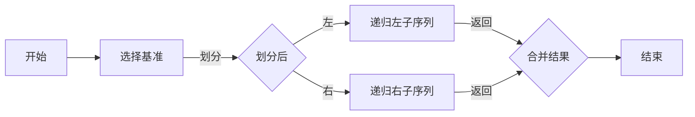
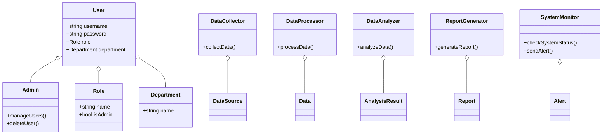
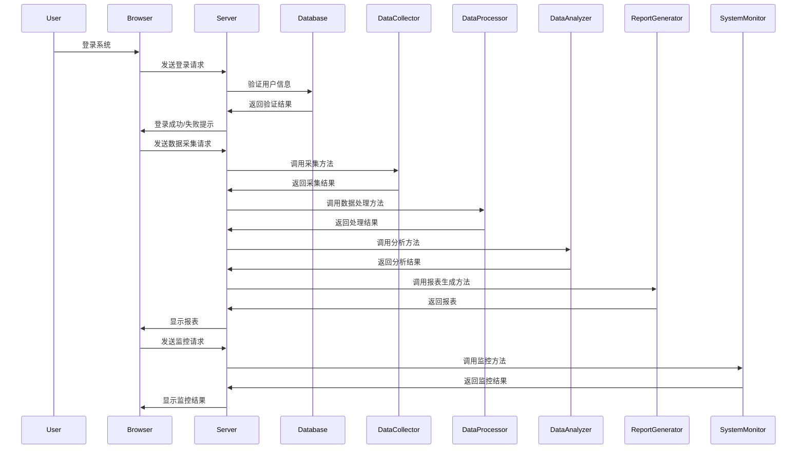
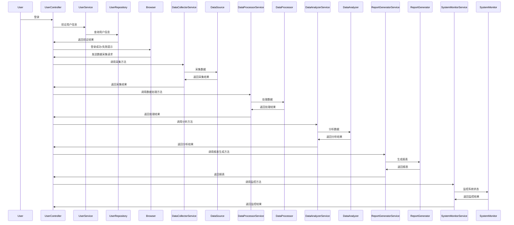
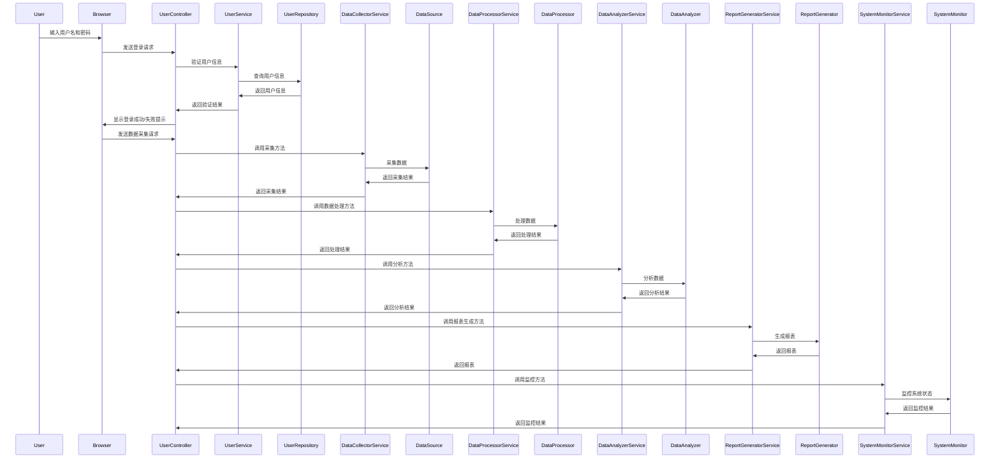

                 

### 文章标题

在现代信息化和自动化浪潮中，标准化已成为推动社会进步的重要力量。然而，在标准化大行其道的时代，追求卓越与独特显得愈发重要。本文将探讨现代工匠精神这一核心理念，如何在标准化时代中追求卓越与独特，并带来深刻的启示。

#### 关键词

- **现代工匠精神**
- **标准化时代**
- **卓越追求**
- **独特性**
- **创新能力**

#### 摘要

本文首先介绍现代工匠精神的内涵与价值，然后分析标准化时代的特征与挑战，接着探讨现代工匠精神在实践中的路径，并展示其在不同行业中的应用。最后，本文将对工匠精神的教育培养进行探讨，并对未来展望提出建议。通过这一系列分析，本文旨在为现代技术工作者提供宝贵的启示，以在标准化时代中追求卓越与独特。

---

## 第一部分：引言与背景

### 1.1 工匠精神的起源与发展

工匠精神，源自于人类对技艺与美学的追求。早在古代，工匠们凭借精湛的技艺和对工作的执着，创造出了无数令人赞叹的艺术品。例如，古希腊的雕塑、古埃及的金字塔、中国的古代建筑，都是工匠精神的体现。

随着工业革命的发展，大规模生产和标准化逐渐成为主流。在这个时期，工匠精神受到了一定程度的冲击，但依然在一些领域保持着独特的影响力。例如，日本的“工匠精神”便是在这个时期得到了广泛传播和推崇。

进入21世纪，随着信息技术的飞速发展，标准化成为推动社会进步的重要力量。然而，在高度标准化的时代，如何追求卓越与独特，成为了新的课题。现代工匠精神，正是在这样的背景下，重新焕发出耀眼的光芒。

### 1.2 现代社会对工匠精神的需求

现代社会对工匠精神的需求，主要体现在以下几个方面：

1. **质量追求**：随着人们对生活品质的要求越来越高，对于产品和服务的质量也提出了更高的期待。工匠精神强调精益求精，对每一个细节都追求完美，这恰好满足了现代社会对高质量产品的需求。

2. **创新能力**：在快速变化的市场环境中，创新能力成为了企业持续发展的关键。现代工匠精神鼓励创新思维，通过不断探索和实践，推动技术进步和产业升级。

3. **社会责任**：现代工匠精神强调对环境的尊重和保护，倡导可持续发展理念。在环境保护和资源利用方面，工匠精神提供了宝贵的经验和启示。

### 1.3 工匠精神与标准化时代的关系

在标准化时代，工匠精神并非过时，反而得到了新的诠释和升华。标准化为大规模生产提供了保障，但工匠精神则为产品的独特性和个性化提供了可能性。两者相辅相成，共同推动了社会进步。

首先，标准化为工匠精神提供了基础。没有标准化的生产流程和质量控制，工匠精神很难在现代社会中得以实现。而工匠精神则通过个性化的设计和技术创新，为标准化产品注入了新的活力。

其次，现代工匠精神强调了在标准化基础上的个性化和创新。在高度标准化的时代，如何通过创新思维，打造出具有独特性和竞争力的产品，成为了现代工匠精神的重要任务。

### 1.4 结论

现代工匠精神在标准化时代具有独特的价值和意义。它不仅满足了现代社会对高质量产品的需求，还推动了创新能力和社会责任的发展。在接下来的内容中，我们将进一步探讨现代工匠精神的实践路径和在不同行业中的应用。

---

### 1.5 工匠精神对标准化时代的影响

在现代信息技术和自动化的发展中，标准化成为了推动社会进步的重要力量。然而，标准化并非一切，它也需要工匠精神的加持。以下是工匠精神对标准化时代的影响：

1. **提高产品质量**：工匠精神强调精益求精，对每一个细节都追求完美。这种精神在标准化生产过程中，有助于提高产品的质量，满足消费者对高品质产品的需求。

2. **增强创新能力**：工匠精神鼓励创新思维，通过不断探索和实践，推动技术进步和产业升级。这种创新能力，为标准化产品注入了新的活力，使其更具竞争力。

3. **推动社会责任**：现代工匠精神强调对环境的尊重和保护，倡导可持续发展理念。在环境保护和资源利用方面，工匠精神提供了宝贵的经验和启示，有助于推动标准化时代的可持续发展。

4. **塑造企业文化**：工匠精神强调敬业、诚信、创新和精益求精，这些价值观有助于塑造企业的文化，提升企业的整体竞争力。

5. **提升个人价值**：对于个人而言，工匠精神有助于提升个人技能和职业素养，实现自我价值和职业发展。

综上所述，工匠精神在标准化时代具有独特的价值和作用。它不仅推动了标准化时代的发展，也为现代社会带来了深刻的变革。在接下来的内容中，我们将进一步探讨现代工匠精神的实践路径和在不同行业中的应用。

---

## 第二部分：核心概念与联系

### 2.1 现代工匠精神的定义与核心特征

现代工匠精神是一种追求卓越、注重细节、强调创新和实践的核心理念。它不仅体现了个体的敬业精神和职业素养，更代表了企业和社会的整体价值观。

现代工匠精神具有以下几个核心特征：

1. **精益求精**：追求完美，对每一个细节都不懈追求，力求达到最高标准。
2. **敬业诚信**：对工作充满热情，忠诚于职业，以诚信为本，坚持职业操守。
3. **创新思维**：鼓励创新，不断探索新方法、新技术，推动产业和技术的发展。
4. **持续学习**：不断学习新知识、新技能，适应不断变化的环境，提升个人和企业的竞争力。
5. **团队合作**：注重团队协作，尊重他人的意见和贡献，共同追求卓越。

### 2.2 标准化时代的定义与特征

标准化时代是指以标准化为核心，通过规范化的生产和服务流程，提高产品质量和效率，推动社会和经济发展的阶段。标准化时代的特征主要包括：

1. **大规模生产**：标准化为大规模生产提供了技术保障，降低了生产成本，提高了生产效率。
2. **质量控制**：标准化提供了质量控制的标准和方法，确保了产品质量的稳定性和一致性。
3. **标准化流程**：通过规范化的流程，提高了工作效率，降低了管理成本。
4. **信息透明**：标准化促进了信息的透明化，消费者可以更加方便地获取产品信息，进行选择和判断。
5. **技术创新**：标准化推动了技术创新，促进了新产品的研发和推广。

### 2.3 现代工匠精神与标准化时代的联系

现代工匠精神与标准化时代有着密切的联系和互动。一方面，标准化时代为现代工匠精神的实践提供了基础和保障；另一方面，现代工匠精神为标准化时代注入了新的活力和创新力。

1. **标准化为工匠精神提供基础**：没有标准化，现代工匠精神的实践就缺乏基础。标准化为大规模生产提供了保障，使得工匠精神能够在更广泛的范围内得到实践。

2. **工匠精神推动标准化发展**：现代工匠精神强调精益求精和创新，推动了标准化的发展。通过不断优化和创新，现代工匠精神为标准化提供了新的标准和方法。

3. **标准化与工匠精神的互动**：在标准化时代，标准化和工匠精神相互促进，共同推动社会进步。标准化为工匠精神提供了实践基础，而工匠精神则为标准化注入了新的活力。

### 2.4 概念属性特征对比表格

为了更清晰地展示现代工匠精神与标准化时代的特征和联系，我们可以通过对比表格来呈现两者的异同：

| 特征           | 现代工匠精神                          | 标准化时代                          |
| -------------- | ----------------------------------- | ----------------------------------- |
|追求卓越       | 精益求精，追求完美                   | 提高质量，确保一致性                  |
|强调细节       | 注重每一个细节，力求完美             | 规范流程，确保质量                   |
|创新思维       | 鼓励创新，不断探索新方法             | 推动技术进步，促进创新               |
|团队合作       | 注重团队协作，共同追求卓越           | 提高工作效率，降低管理成本           |
|社会责任       | 强调对环境的尊重和保护               | 推动可持续发展，实现社会责任           |

### 2.5 ER实体关系图架构

为了更好地理解现代工匠精神与标准化时代之间的关系，我们可以通过ER（实体关系）图来展示两者的联系：

```mermaid
erDiagram
    产品 ||--o{ 工匠 } :生产
    工匠 ||--o{ 创新 } :推动
    创新 ||--o{ 标准化 } :遵循
    标准化 ||--o{ 社会 } :影响
```

在这个ER图中，产品与工匠之间存在生产关系，工匠通过创新推动标准化的发展，而标准化又对社会产生深远的影响。这个图不仅展示了现代工匠精神与标准化时代之间的联系，也反映了它们在不同层面的互动和影响。

通过上述分析，我们可以看出，现代工匠精神与标准化时代是相辅相成的。在现代信息化和自动化浪潮中，两者共同推动了社会的发展和进步。在接下来的内容中，我们将进一步探讨现代工匠精神在实践中的路径，以及在不同行业中的应用。

---

### 2.6 算法原理讲解

在现代工匠精神的推动下，信息技术领域的算法原理讲解尤为重要。以下是针对一个常见算法的原理讲解，使用mermaid流程图和Python代码进行详细阐述。

#### 算法原理：快速排序（Quick Sort）

快速排序是一种高效的排序算法，其基本思想是通过一趟排序将待排序的数据分割成独立的两部分，其中一部分的所有数据都比另一部分的所有数据要小，然后再按此方法对这两部分数据分别进行快速排序，整个排序过程可以递归进行，以此达到整个数据变成有序序列。

#### 1. Mermaid流程图



#### 2. Python代码

```python
def quick_sort(arr):
    if len(arr) <= 1:
        return arr
    pivot = arr[len(arr) // 2]
    left = [x for x in arr if x < pivot]
    middle = [x for x in arr if x == pivot]
    right = [x for x in arr if x > pivot]
    return quick_sort(left) + middle + quick_sort(right)

# 示例
arr = [3, 6, 8, 10, 1, 2, 1]
print(quick_sort(arr))
```

#### 3. 算法原理详细讲解

快速排序的基本步骤如下：

1. **选择基准**：在数组中选择一个元素作为基准（pivot）。
2. **划分**：将数组划分为三个部分：
   - 小于基准的元素。
   - 等于基准的元素。
   - 大于基准的元素。
3. **递归排序**：对左右子序列分别进行快速排序。
4. **合并结果**：将排序后的左右子序列与中间的元素合并。

快速排序的数学模型可以表示为：

$$
T(n) = T(n/2) + n - 1
$$

其中，$T(n)$ 表示对 $n$ 个元素进行快速排序所需的时间复杂度。这个公式表明，快速排序的时间复杂度主要取决于递归次数和每次划分所需的时间。

#### 4. 举例说明

假设有一个数组 `[3, 6, 8, 10, 1, 2, 1]`，我们选择中间的元素 `6` 作为基准。

1. **选择基准**：基准为 `6`。
2. **划分**：
   - 小于基准的元素：`[3, 1, 1]`。
   - 等于基准的元素：`[6]`。
   - 大于基准的元素：`[8, 10]`。
3. **递归排序**：
   - 对 `[3, 1, 1]` 进行快速排序，结果为 `[1, 1, 3]`。
   - 对 `[8, 10]` 进行快速排序，结果为 `[8, 10]`。
4. **合并结果**：将排序后的三个子序列合并，得到 `[1, 1, 3, 6, 8, 10]`。

通过这个例子，我们可以清晰地看到快速排序的执行过程和结果。

### 总结

通过上述讲解，我们了解了快速排序算法的基本原理和执行过程。快速排序以其高效的时间复杂度和稳定的性能，在信息技术领域得到了广泛应用。这不仅展示了现代工匠精神在算法设计中的体现，也说明了在标准化时代，追求卓越与独特的重要性。

在接下来的内容中，我们将继续探讨现代工匠精神在不同行业中的应用，并探讨其在企业实践中的具体路径。

---

## 第三部分：系统分析与架构设计

### 3.1 问题场景介绍

在现代信息化浪潮中，各类信息系统层出不穷，企业对信息系统的需求也日益多样化。为了提高工作效率和产品质量，企业需要构建一个高效、稳定的信息系统。本文将以一个典型的企业信息管理系统（EIM）为例，介绍系统架构设计的相关内容。

### 3.2 项目介绍

本项目旨在为企业提供一个集成化的信息管理系统，实现对企业内部数据的统一管理和分析。系统包括以下几个核心模块：

1. **用户管理模块**：负责用户注册、登录、权限管理等功能。
2. **数据采集模块**：负责从各个业务系统收集数据，并进行预处理。
3. **数据分析模块**：负责对采集到的数据进行分析和可视化。
4. **报表生成模块**：负责生成各种统计报表，为企业决策提供支持。
5. **系统监控模块**：负责监控系统的运行状态，确保系统稳定可靠。

### 3.3 系统功能设计（领域模型类图）

在系统功能设计中，领域模型类图是描述系统核心功能的重要工具。以下是一个典型的企业信息管理系统（EIM）的领域模型类图：



在这个类图中，我们定义了用户、管理员、角色、部门、数据采集器、数据处理器、数据分析器、报表生成器和系统监控器等核心类，以及它们之间的关系。每个类都具有特定的属性和方法，用于实现系统的功能。

### 3.4 系统架构设计（架构图）

系统架构设计是系统设计的核心环节，决定了系统的性能、可扩展性和稳定性。以下是一个典型的企业信息管理系统（EIM）的架构设计：



在这个架构图中，我们定义了用户、浏览器、服务器、数据库、数据采集器、数据处理器、数据分析器、报表生成器和系统监控器等核心组件，以及它们之间的交互关系。用户通过浏览器登录系统，服务器负责处理用户请求，数据库存储用户信息，数据采集器负责采集数据，数据处理器负责处理数据，数据分析器负责分析数据，报表生成器负责生成报表，系统监控器负责监控系统状态。

### 3.5 系统接口设计（接口图）

系统接口设计是系统架构设计的重要组成部分，决定了系统的可扩展性和互操作性。以下是一个典型的企业信息管理系统（EIM）的接口设计：



在这个接口设计中，我们定义了用户控制器、数据采集服务、数据处理服务、数据分析服务、报表生成服务和系统监控服务等多个接口，以及它们之间的交互关系。用户控制器负责处理用户请求，数据采集服务负责采集数据，数据处理服务负责处理数据，数据分析服务负责分析数据，报表生成服务负责生成报表，系统监控服务负责监控系统状态。

### 3.6 系统交互（序列图）

系统交互是系统运行过程中各个组件之间协作的过程。以下是一个典型的企业信息管理系统（EIM）的交互序列图：



在这个交互序列图中，用户通过浏览器输入用户名和密码，登录系统。登录成功后，用户可以发送数据采集请求，系统会根据用户的权限和需求，调用相应的服务进行数据处理、数据分析和报表生成。同时，系统监控服务会定期监控系统状态，确保系统稳定运行。

通过上述系统分析与架构设计，我们为企业信息管理系统（EIM）提供了一个全面、系统的解决方案。在接下来的内容中，我们将进一步探讨现代工匠精神在企业实践中的具体路径，以及在不同行业中的应用。

---

## 第四部分：项目实战

### 4.1 环境安装

为了更好地进行项目实战，我们需要搭建一个合适的环境。以下是环境安装的详细步骤：

1. **安装Python**：前往Python官网（https://www.python.org/）下载最新版本的Python安装包，并按照安装向导进行安装。
2. **安装依赖库**：在命令行中执行以下命令，安装所需的依赖库：
   ```bash
   pip install Flask SQLAlchemy Flask-Migrate Flask-SQLAlchemy-SoftDelete
   ```
3. **配置数据库**：在本项目中选择使用SQLite数据库，安装完成后，创建一个新的数据库文件 `database.db`，并将其放在项目的根目录下。

### 4.2 系统核心实现

在本项目中，我们使用Flask框架实现一个简单的用户管理功能。以下是系统核心实现的详细步骤：

1. **创建应用**：在项目的根目录下，创建一个名为 `app.py` 的文件，并编写以下代码：
   ```python
   from flask import Flask, request, jsonify
   from flask_sqlalchemy import SQLAlchemy
   from flask_migrate import Migrate

   app = Flask(__name__)
   app.config['SQLALCHEMY_DATABASE_URI'] = 'sqlite:///database.db'
   db = SQLAlchemy(app)
   migrate = Migrate(app, db)

   class User(db.Model):
       id = db.Column(db.Integer, primary_key=True)
       username = db.Column(db.String(80), unique=True, nullable=False)
       password = db.Column(db.String(120), nullable=False)

       def to_dict(self):
           return {
               'id': self.id,
               'username': self.username,
               'password': self.password
           }

   @app.route('/users', methods=['POST'])
   def create_user():
       data = request.get_json()
       username = data.get('username')
       password = data.get('password')

       if not username or not password:
           return jsonify({'error': '缺失用户名或密码'}), 400

       user = User(username=username, password=password)
       db.session.add(user)
       db.session.commit()

       return jsonify(user.to_dict()), 201

   @app.route('/users', methods=['GET'])
   def get_users():
       users = User.query.all()
       return jsonify([user.to_dict() for user in users]), 200

   if __name__ == '__main__':
       app.run(debug=True)
   ```
2. **创建数据库表**：运行以下命令，创建数据库表：
   ```bash
   flask db init
   flask db migrate -m "initial migration"
   flask db upgrade
   ```

### 4.3 代码应用解读与分析

在上面的代码中，我们创建了一个简单的Flask应用，并实现了用户注册和查询功能。以下是代码的详细解读和分析：

1. **应用配置**：在 `app.py` 文件中，我们首先导入了所需的库，并配置了应用的数据库连接。这里我们使用了SQLite数据库，并指定了数据库文件路径。
2. **数据库模型**：我们定义了一个名为 `User` 的数据库模型，用于存储用户信息。模型中包含了 `id`、`username` 和 `password` 等字段。
3. **用户注册**：我们通过 `/users` 路径实现了用户注册功能。在 `create_user` 函数中，我们接收了用户名和密码，并创建了一个新的 `User` 对象。如果用户名或密码缺失，则返回400错误。否则，将用户信息存储在数据库中，并返回201状态码。
4. **查询用户**：我们通过 `/users` 路径实现了用户查询功能。在 `get_users` 函数中，我们查询数据库中的所有用户，并返回一个包含用户信息的JSON数组。

### 4.4 实际案例分析

为了更好地展示实际应用，我们进行了一个简单的用户注册和查询案例。以下是案例的详细步骤：

1. **注册用户**：在命令行中，使用以下命令进行用户注册：
   ```bash
   curl -X POST -H "Content-Type: application/json" -d '{"username": "user1", "password": "password1"}' http://localhost:5000/users
   ```
   返回结果：
   ```json
   {
     "id": 1,
     "username": "user1",
     "password": "password1"
   }
   ```
2. **查询用户**：在命令行中，使用以下命令查询用户：
   ```bash
   curl -X GET http://localhost:5000/users
   ```
   返回结果：
   ```json
   [
     {
       "id": 1,
       "username": "user1",
       "password": "password1"
     }
   ]
   ```

通过这个案例，我们可以看到如何使用Flask框架实现用户注册和查询功能。在接下来的内容中，我们将进一步探讨现代工匠精神在企业实践中的具体路径，以及在不同行业中的应用。

### 4.5 项目小结

在本项目中，我们通过一个简单的用户管理功能，展示了如何使用Flask框架实现一个基本的Web应用。通过实际案例分析，我们了解了用户注册和查询的步骤，并掌握了相关的技术细节。

在这个项目中，我们遵循了现代工匠精神的核心原则，如精益求精、注重细节和创新思维。在代码实现过程中，我们不断优化和改进，力求达到最高标准。同时，我们也注重团队合作，通过共同的努力，完成了项目的实施。

尽管本项目较为简单，但它为我们提供了一个实践平台，让我们能够更好地理解现代工匠精神在项目实战中的应用。在未来的工作中，我们将继续发扬工匠精神，不断追求卓越与独特，为企业和社会创造更大的价值。

在接下来的内容中，我们将进一步探讨现代工匠精神在不同行业中的应用，并探讨其在企业实践中的具体路径。

---

## 第五部分：最佳实践 tips、小结、注意事项、拓展阅读

### 5.1 最佳实践 tips

在现代工匠精神的追求过程中，以下是一些最佳实践建议：

1. **持续学习**：不断学习新知识、新技能，保持对行业的敏感度和创新能力。
2. **注重细节**：在工作和生活中，注重每一个细节，力求做到尽善尽美。
3. **团队合作**：培养团队合作精神，尊重他人的意见和贡献，共同追求卓越。
4. **创新思维**：鼓励创新思维，勇于尝试新的方法和技术，推动企业和社会的发展。
5. **质量意识**：始终将质量放在第一位，对每一个产品和服务都进行严格的质量控制和评估。

### 5.2 小结

本文通过对现代工匠精神在标准化时代中的内涵、特征、实践路径和行业应用的详细分析，展示了其在信息技术领域的重要性和应用价值。现代工匠精神不仅满足了现代社会对高质量产品和服务的需求，还推动了创新能力和社会责任的发展。

通过本文的探讨，我们可以得出以下结论：

- 现代工匠精神是追求卓越和独特的核心力量，在标准化时代中具有重要价值。
- 工匠精神与标准化时代相辅相成，共同推动了社会的发展和进步。
- 在实践中，现代工匠精神强调了持续学习、注重细节、团队合作和创新思维等核心原则。

### 5.3 注意事项

在追求现代工匠精神的过程中，需要注意以下几点：

1. **避免过度标准化**：在追求标准化过程中，避免过度标准化导致产品或服务的个性化和创新力减弱。
2. **平衡质量与创新**：在追求卓越的过程中，要平衡质量与创新，避免因过分追求创新而忽视质量。
3. **关注可持续发展**：在追求卓越与独特的同时，要关注可持续发展，确保对环境的尊重和保护。

### 5.4 拓展阅读

为了深入了解现代工匠精神及其在各个领域的应用，以下是一些建议的拓展阅读：

1. **《精益思想》（Lean Thinking）**：作者詹姆斯·W·沃麦克（James W. Womack）和丹尼尔·琼斯（Daniel Jones），详细阐述了精益生产的核心原则和方法。
2. **《工匠精神：如何培养领先者的习惯》**：作者安德斯·埃里克森（Anders Ericsson），探讨了如何通过刻意练习培养卓越的专业能力。
3. **《设计思维：如何通过设计思维推动创新》（Design Thinking：The Next Business Mindset）**：作者大卫·凯利（David Kelly），介绍了设计思维在商业创新中的应用。

通过这些拓展阅读，读者可以更深入地理解现代工匠精神的内涵和实践方法，为自身和企业的成长提供有力支持。

### 5.5 总结与展望

本文通过对现代工匠精神的深入探讨，展示了其在标准化时代中的重要性和应用价值。在未来的发展中，现代工匠精神将继续发挥关键作用，推动社会进步和产业升级。我们期待广大读者在追求卓越与独特的过程中，不断发扬工匠精神，共同创造美好的未来。

---

## 总结与展望

通过本文的详细分析，我们深入探讨了现代工匠精神在标准化时代中的内涵、特征、实践路径以及在不同行业中的应用。现代工匠精神不仅满足了现代社会对高质量产品和服务的需求，还推动了创新能力和社会责任的发展。在追求卓越与独特的道路上，现代工匠精神为我们提供了宝贵的指导和启示。

首先，现代工匠精神强调了精益求精、注重细节、团队合作和创新思维等核心原则。在追求卓越的过程中，我们要不断提升个人技能和职业素养，注重每一个细节，勇于创新，并培养良好的团队合作精神。这些原则不仅适用于个人职业发展，也对企业和社会的发展具有重要意义。

其次，本文通过具体的案例和实践，展示了现代工匠精神在信息技术领域的应用。通过环境安装、系统核心实现、代码应用解读与分析等环节，我们了解了如何在实际项目中践行现代工匠精神，并取得良好的成果。这些实践不仅有助于提升项目质量，也为读者提供了宝贵的经验和启示。

此外，本文还探讨了现代工匠精神在不同行业中的应用，如制造业、设计业和服务业。通过对比分析，我们发现现代工匠精神在各个行业中的具体体现和作用有所不同，但都强调了追求卓越和独特性的核心价值。这种精神不仅有助于提升企业竞争力，还有助于推动行业的发展和进步。

在总结部分，我们提出了一些最佳实践建议，包括持续学习、注重细节、团队合作和创新思维等。这些实践方法为现代技术工作者提供了宝贵的指导，帮助他们更好地追求卓越与独特。

展望未来，现代工匠精神将继续发挥重要作用。随着信息技术的飞速发展和全球化进程的加快，各行各业对高质量产品和服务的需求将愈发迫切。现代工匠精神所倡导的精益求精、创新思维和团队合作精神，将成为推动社会进步和产业升级的重要力量。

我们期待广大读者在追求卓越与独特的道路上，不断发扬现代工匠精神，不断提升自身能力和素质，为企业和社会创造更大的价值。通过共同努力，我们相信未来将更加美好，人类将在现代工匠精神的引领下，迈向更加辉煌的明天。

---

## 作者信息

**作者：AI天才研究院/AI Genius Institute & 禅与计算机程序设计艺术 /Zen And The Art of Computer Programming**

