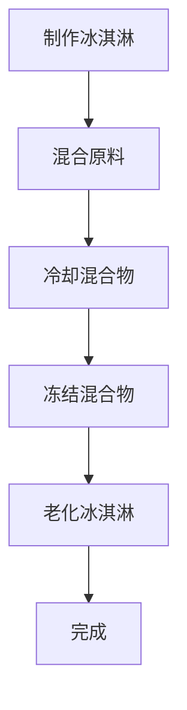

                 

## 现代手工冰淇淋工坊：创新口味的小批量制作

### 关键词
- 手工冰淇淋
- 口味创新
- 小批量制作
- 制作基础
- 原料选择
- 制作技巧
- 工坊管理

### 摘要
本文旨在探讨现代手工冰淇淋工坊的构建与实践，重点关注创新口味的小批量制作。通过详细分析冰淇淋制作的各个环节，从基础工艺到原料选择，再到口味创新与制作技巧，我们旨在帮助读者建立系统化的制作思维。此外，文章还涉及工坊管理、项目实战，以及最佳实践和拓展阅读，旨在为冰淇淋制作爱好者提供全方位的指导。

### 第一部分：冰淇淋制作基础

#### 第1章：手工冰淇淋制作入门

##### 1.1 冰淇淋的基本组成
冰淇淋是由牛奶、奶油、糖、空气和风味物质组成。了解这些基本成分对于制作高质量的冰淇淋至关重要。

$$
\text{冰淇淋} = \text{牛奶} + \text{奶油} + \text{糖} + \text{空气} + \text{风味物质}
$$

##### 1.2 制作工具与设备
选择合适的工具和设备对于确保冰淇淋的质量和一致性至关重要。常用的工具包括冰淇淋搅拌机、冷冻桶和冰淇淋勺等。

##### 1.3 基础工艺流程
冰淇淋的制作过程包括混合、冷却、冻结和老化。每个步骤都需要精确控制，以确保最终产品的质量。

1. **混合**：将所有原料混合均匀。
2. **冷却**：将混合物冷却至适宜的温度。
3. **冻结**：在冷冻桶中冻结混合物，形成冰晶结构。
4. **老化**：将制成的冰淇淋放置一段时间，以改善口感和风味。

#### 第2章：原料选择与处理

##### 2.1 牛奶、奶油的选择与处理
牛奶和奶油的品质直接影响冰淇淋的口感。优质原料的选择和正确的处理方法至关重要。

- **牛奶**：选择新鲜、乳脂含量高的牛奶。
- **奶油**：选择高质量的无盐奶油，并根据需要去除一些水分。

##### 2.2 糖与糖浆的选择与处理
糖是冰淇淋的主要甜味来源。不同种类的糖会带来不同的口感和风味。

- **糖**：常用的有白砂糖、黄糖和枫糖等。
- **糖浆**：糖浆可以增加冰淇淋的润滑感和甜度。

##### 2.3 其他辅助原料的使用
其他辅助原料如巧克力碎片、水果块、坚果等，可以增加冰淇淋的丰富度和风味。

#### 第3章：冰淇淋口味的创新

##### 3.1 口味基础与搭配原则
创新口味的关键在于理解基本口味和搭配原则。通过合理的搭配，可以创造出独特的冰淇淋口味。

- **基本口味**：甜、酸、苦、咸等。
- **搭配原则**：互补、对比、平衡。

##### 3.2 创新口味的探索与实践
在实践中不断尝试新的口味组合，是创新的关键。

- **实践**：尝试将不同风味和食材结合，例如巧克力与橙子、草莓与薄荷等。

### 第二部分：冰淇淋制作技巧

#### 第4章：常见问题与解决方法

##### 4.1 制作过程中的常见问题
制作过程中可能会遇到各种问题，如结块、分离等。解决这些问题需要了解问题的根本原因。

- **结块**：可能是糖或牛奶未完全溶解。
- **分离**：可能是混合不均匀或冷冻温度不当。

##### 4.2 问题分析与解决
通过分析问题的根本原因，可以找到有效的解决方法。

- **结块**：确保所有原料完全溶解。
- **分离**：调整混合和冷冻温度。

#### 第5章：冰淇淋口感优化

##### 5.1 口感的影响因素
冰淇淋的口感受到多个因素的影响，如冰晶结构、糖含量、空气含量等。

- **冰晶结构**：细小、均匀的冰晶结构会带来更细腻的口感。
- **糖含量**：适当的糖含量可以提高润滑感和口感。

##### 5.2 口感优化的技巧与方法
通过调整工艺参数和原料比例，可以优化冰淇淋的口感。

- **调整冷冻温度**：较低的温度有利于形成细小的冰晶。
- **控制空气含量**：适当的空气含量可以增加冰淇淋的轻盈感。

### 第三部分：冰淇淋工坊管理

#### 第6章：小批量制作管理

##### 6.1 生产计划与安排
小批量制作要求精细的计划和安排，以确保生产效率和质量。

- **生产计划**：根据市场需求和原料供应制定生产计划。
- **安排**：合理安排生产时间，确保原料和设备准备充分。

##### 6.2 原料库存与采购
有效的原料库存管理是确保生产顺利进行的关键。

- **库存管理**：定期检查原料库存，避免过度库存或缺货。
- **采购**：选择优质、可靠的供应商，确保原料的质量和供应。

#### 第7章：创新与营销

##### 7.1 创新思维与方法
创新是提升冰淇淋工坊竞争力的关键。

- **思维**：培养创新的思维方式，勇于尝试新的口味和制作方法。
- **方法**：通过市场调研和消费者反馈，不断优化产品。

##### 7.2 市场定位与营销策略
有效的市场定位和营销策略有助于提升品牌知名度。

- **市场定位**：明确目标消费者群体，制定相应的营销策略。
- **营销策略**：利用社交媒体、广告和线下活动等方式进行宣传。

### 项目实战：打造个人冰淇淋品牌

##### 8.1 创业准备与规划
创业是一个复杂的过程，需要充分的准备和规划。

- **准备**：确定品牌理念、产品定位和市场策略。
- **规划**：制定详细的创业计划和时间表。

##### 8.2 工作室搭建与运营
搭建一个高效的工作室是成功运营的基础。

- **搭建**：选择合适的地点、设备和人员。
- **运营**：建立有效的运营流程和管理体系。

##### 8.3 品牌打造与推广
品牌是吸引消费者的关键。

- **打造**：通过独特的设计、口感和故事来打造品牌。
- **推广**：利用多种渠道和活动进行品牌推广。

##### 8.4 成功案例分享与经验总结
分享成功的案例和经验，为读者提供实际参考。

- **案例**：介绍成功的冰淇淋工坊案例。
- **经验**：总结成功的经验，提供实用的建议。

### 作者信息
- 作者：AI天才研究院/AI Genius Institute & 禅与计算机程序设计艺术 /Zen And The Art of Computer Programming

### 小结
本文详细介绍了现代手工冰淇淋工坊的构建与实践，从基础制作到口味创新，再到工坊管理，为读者提供了全面的指导。通过项目实战，读者可以学以致用，打造自己的冰淇淋品牌。最佳实践和拓展阅读则为进一步学习提供了方向。

### 注意事项
- 确保原料新鲜和质量，以保障冰淇淋的口感和卫生安全。
- 严格遵循制作流程和温度控制，以确保冰淇淋的质量一致性。
- 定期进行设备维护和清洁，以确保制作环境的卫生。

### 拓展阅读
- 《手工冰淇淋制作艺术》
- 《冰淇淋技术全书》
- 《创新冰淇淋口味配方》

---

**参考文献：**
- [冰淇淋制作指南](https://www.cookinglight.com/recipes/ice-cream)
- [手工冰淇淋制作教程](https://www.seriouseats.com/how-to-make-ice-cream)
- [冰淇淋工坊管理手册](https://www.icecreamunion.com.au/learn-to-make-ice-cream/workshop-management-guide)

**附录：**
- **冰淇淋配方示例**
  - **经典香草冰淇淋**
    - 牛奶：500毫升
    - 无盐奶油：50克
    - 糖：80克
    - 香草精：1茶匙
  - **巧克力碎片冰淇淋**
    - 牛奶：500毫升
    - 无盐奶油：50克
    - 糖：80克
    - 巧克力碎片：50克

**Mermaid 流程图示例：**

通过以上内容，我们希望读者能够对现代手工冰淇淋工坊有更深入的理解，并在实践中不断创新和优化，最终打造出属于自己的冰淇淋品牌。让我们一步步思考，一步步实践，享受手工冰淇淋带来的美好时光。

