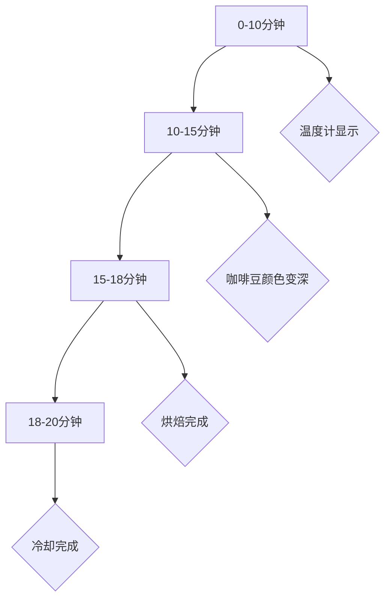
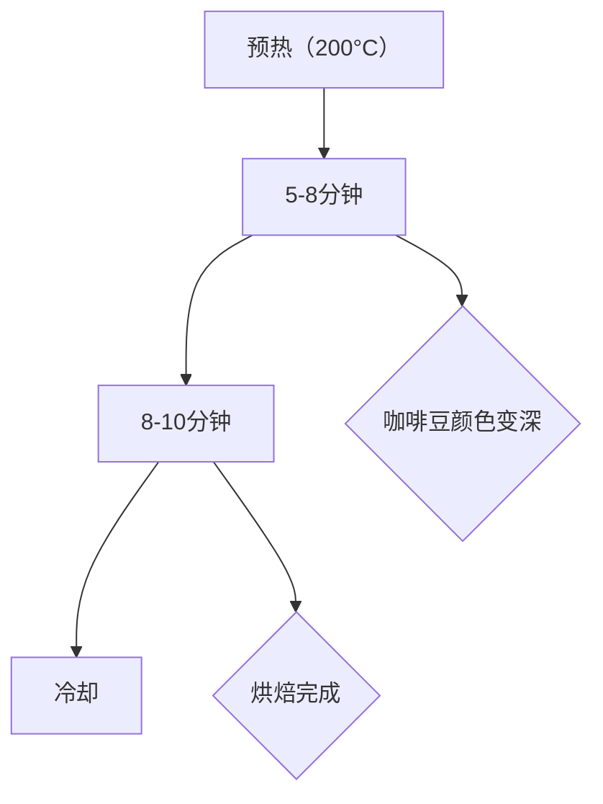
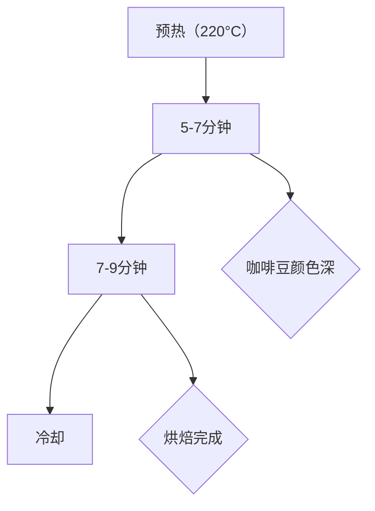
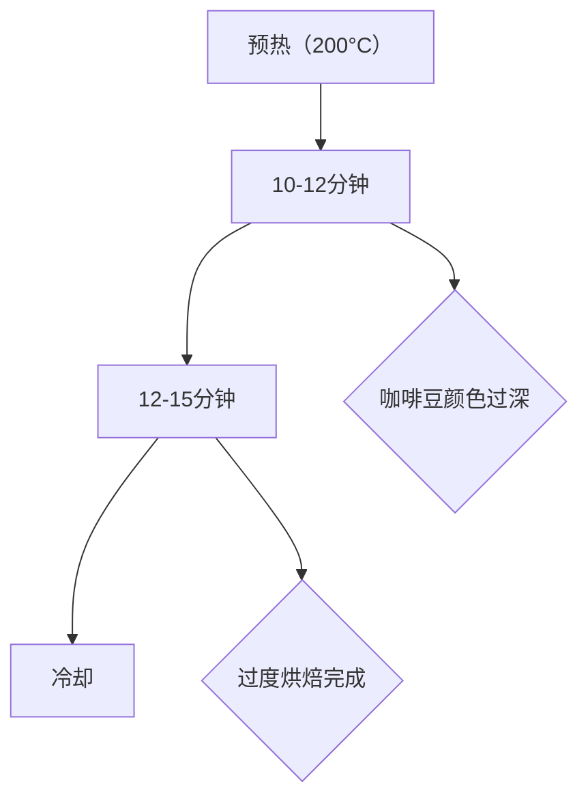

                 

### 咖啡文化探秘

咖啡，作为一种全球性的饮品，早已超越了一杯简单的饮料，成为了一种文化象征。其历史可追溯至公元9世纪的埃塞俄比亚，当时当地的牧羊人发现羊吃了一种植物后变得异常活泼。这种植物便是咖啡豆的起源。

#### 1.1 咖啡的历史

咖啡在阿拉伯世界的传播标志着其文化意义的确立。公元15世纪，咖啡在阿拉伯半岛开始流行，并在16世纪传入欧洲。17世纪，咖啡在土耳其成为国饮，并在18世纪传入美洲。自此，咖啡逐渐在全球范围内流行开来。

#### 1.2 咖啡的文化

咖啡不仅仅是一种饮品，它还承载着丰富的文化内涵。不同国家和地区的咖啡文化各有特色。例如，意大利的浓缩咖啡（Espresso），美国的冰咖啡（Iced Coffee），日本的拉花艺术（Latte Art）等，都是咖啡文化的体现。

### 世界咖啡产地与品种

咖啡豆的产地分布广泛，其中非洲、南美洲和亚洲是主要的咖啡生产地区。不同产地的咖啡豆有着不同的风味和特点。

#### 1.3 世界咖啡产地

**非洲**：埃塞俄比亚、肯尼亚、坦桑尼亚等国是世界著名的咖啡生产国。埃塞俄比亚的亚曼尼亚咖啡被认为是世界上最优质的咖啡之一。

**南美洲**：哥伦比亚、巴西、墨西哥等国也是重要的咖啡生产国。巴西是全球最大的咖啡生产国，其咖啡以浓郁的果味和坚果味著称。

**亚洲**：印尼、越南、菲律宾等国也大量生产咖啡。印尼的曼特宁咖啡以其浓郁的香料味和苦味而闻名。

#### 1.4 咖啡品种

**阿拉比卡（Arabica）**：阿拉比卡咖啡豆的酸度较高，口感更为细腻，通常含有水果、花香等风味。

**罗布斯塔（Robusta）**：罗布斯塔咖啡豆的咖啡因含量较高，口感更为浓郁，通常带有坚果、巧克力味。

**利比里亚（Liberia）**：利比里亚咖啡豆产于利比里亚，以其独特的果味和酸度而受到喜爱。

### 咖啡的冲泡艺术

咖啡的冲泡方法多种多样，不同的冲泡方法会带来不同的风味和口感。

#### 1.5 冲泡方法

**手冲咖啡**：手冲咖啡是一种较为传统的方法，通过滤纸和热水将咖啡豆的精华提取出来。这种方法可以更好地保留咖啡豆的原味。

**意式咖啡**：意式咖啡通过高压将热水通过咖啡粉，快速提取咖啡的精华。这种方法适合制作浓缩咖啡和浓缩咖啡相关的饮品。

**法式压滤壶**：法式压滤壶通过滤网和热水将咖啡豆的精华压出，这种方法适合制作醇厚的咖啡。

**冷萃咖啡**：冷萃咖啡是将咖啡豆在冷水中浸泡数小时，通过缓慢的萃取过程，提取出咖啡的精华。这种方法适合在夏天饮用，口感清爽。

#### 1.6 冲泡参数

冲泡咖啡时，水温和冲泡时间对咖啡风味有着重要影响。通常，咖啡的冲泡温度在90°C到96°C之间，而冲泡时间则根据不同的咖啡种类和冲泡方法而定。

通过了解咖啡的历史、产地和冲泡方法，我们可以更好地欣赏和享受这一全球性的饮品。在接下来的章节中，我们将进一步探讨咖啡豆的选购与保存，以及咖啡烘焙的基本原理和实践技巧。

### 咖啡豆的选购与保存

咖啡豆的选择和保存对于最终咖啡的品质有着至关重要的影响。正确的选购和保存方法不仅可以提升咖啡的口感，还能延长其保质期。

#### 2.1 咖啡豆的种类与品质

咖啡豆主要分为阿拉比卡（Arabica）和罗布斯塔（Robusta）两种。阿拉比卡咖啡豆酸度较高，口感更为细腻，含有丰富的水果和花香。罗布斯塔咖啡豆则咖啡因含量较高，口感更为浓郁，带有坚果和巧克力的味道。在选择咖啡豆时，需要根据个人口味偏好进行选择。

品质好的咖啡豆通常具有以下特征：
- **色泽**：深棕色，表面有光泽。
- **外形**：豆粒饱满，形状均匀。
- **香气**：有浓郁的咖啡香气。
- **口感**：口感丰富，酸度适中。

#### 2.2 咖啡豆的选购技巧

在选购咖啡豆时，可以遵循以下技巧：
- **选择知名品牌**：知名品牌的咖啡豆通常质量有保证。
- **观察包装**：选择包装完好、标注清晰的咖啡豆。包装应密封，避免咖啡豆受潮或氧化。
- **关注生产日期**：选择生产日期较近的咖啡豆，以保证其新鲜度。
- **尝试多种品牌**：不同品牌的咖啡豆风味各异，多尝试可以找到最适合自己的口味。

#### 2.3 咖啡豆的保存方法

咖啡豆的保存方法对其品质有着直接影响。以下是一些有效的保存方法：

- **存放在密封容器中**：使用密封容器可以有效防止咖啡豆受潮和氧化。
- **避免光照**：阳光和紫外线会破坏咖啡豆中的芳香物质，应将咖啡豆存放在避光的环境中。
- **控制温度和湿度**：理想的存储环境温度在18°C到22°C，湿度在60%到70%之间。冰箱是一个较好的选择，但需确保咖啡豆完全密封，避免冰箱中的湿气进入。
- **避免接触空气**：空气中的氧气会加速咖啡豆的氧化，因此尽量减少咖啡豆与空气的接触。

通过正确的选购和保存方法，我们可以确保咖啡豆的品质和口感。在接下来的章节中，我们将深入探讨咖啡烘焙的基本原理和技术。

### 咖啡烘焙技术

咖啡烘焙是咖啡制作过程中至关重要的一环，它不仅决定了咖啡的香气和口感，还影响了咖啡的酸度、苦味和其他风味特征。正确的烘焙技术能够最大程度地发挥咖啡豆的潜力，从而制作出理想的咖啡。

#### 3.1 咖啡烘焙的基本原理

咖啡烘焙的基本原理是通过高温加热咖啡豆，使其内部发生一系列复杂的物理和化学反应。这些反应包括水分蒸发、糖分焦化、蛋白质变性和酸类分解等。

- **水分蒸发**：在烘焙初期，咖啡豆中的水分迅速蒸发，导致豆粒膨胀，表面出现裂痕。
- **糖分焦化**：随着温度的升高，咖啡豆中的糖分开始焦化，产生焦糖味和其他甜味。
- **蛋白质变性**：高温使咖啡豆中的蛋白质变性，导致豆粒变脆，风味更加丰富。
- **酸类分解**：在烘焙过程中，咖啡豆中的酸类物质发生分解，产生酸味和其他芳香物质。

#### 3.2 咖啡烘焙的设备与工具

烘焙咖啡豆需要专门的设备与工具，以下是一些常用的设备和工具：

- **烤箱**：烤箱是最常用的咖啡烘焙设备之一，它提供了稳定的高温环境。可以选择家用烤箱或专业咖啡烘焙机。
- **烘焙杯**：烘焙杯是一种用来观察咖啡豆烘焙过程的工具，通常由玻璃或陶瓷制成。
- **温度计**：温度计用于监测烤箱内的温度，确保烘焙过程顺利进行。
- **烘焙计时器**：烘焙计时器用于记录烘焙时间，确保咖啡豆在正确的时间达到理想的烘焙程度。

#### 3.3 咖啡烘焙的过程与技巧

咖啡烘焙的过程可以分为以下几个阶段：

1. **预热**：在烘焙之前，需要将烤箱预热到适当的温度（通常在200°C到220°C之间）。预热的目的是使烤箱内部温度均匀，避免烘焙过程中出现温度波动。
2. **初步烘焙**：将咖啡豆倒入烤箱，开始初步烘焙。此时，咖啡豆的水分蒸发，豆粒开始膨胀。初步烘焙的时间通常在4到6分钟之间。
3. **发展阶段**：在初步烘焙之后，咖啡豆进入发展阶段。此时，咖啡豆中的糖分开始焦化，产生丰富的香气。发展阶段的时间通常在6到12分钟之间。
4. **结束阶段**：在发展阶段接近尾声时，咖啡豆的表面开始出现明显的焦糖化现象，这是烘焙接近结束的标志。结束阶段的时间通常在1到3分钟之间。
5. **冷却**：烘焙结束后，将咖啡豆从烤箱中取出，放置在冷却架上冷却。冷却的目的是防止咖啡豆继续烘焙，同时保持其最佳风味。

在烘焙过程中，需要密切关注咖啡豆的变化，并适时调整烤箱的温度和时间。以下是一些实用的烘焙技巧：

- **均匀烘焙**：确保咖啡豆在烘焙过程中受热均匀，避免出现局部过烘焙或未烘焙的情况。
- **适当调整**：根据咖啡豆的变化和烤箱的特性，适时调整烘焙时间和温度，以达到最佳烘焙效果。
- **多次尝试**：烘焙咖啡豆需要不断尝试和调整，通过多次实践，可以逐渐掌握烘焙的技巧。

通过了解咖啡烘焙的基本原理和设备工具，以及掌握烘焙的过程和技巧，我们可以制作出理想的咖啡。在接下来的章节中，我们将探讨如何进行手工烘焙，以及如何通过监控和调整烘焙参数来提升咖啡的品质。

### 手工烘焙入门指南

进行手工烘焙需要一定的准备工作，以及掌握一些关键的监控和调整技巧，以确保最终能够制作出高质量的咖啡。

#### 4.1 烘焙前的准备工作

在进行手工烘焙之前，需要做好以下准备工作：

1. **选择合适的咖啡豆**：选择新鲜、优质的咖啡豆是成功烘焙的第一步。确保咖啡豆没有受潮、变质或霉变。
2. **准备烘焙设备**：准备好烤箱、烘焙杯、温度计和烘焙计时器等设备。确保烤箱预热到适当的温度。
3. **准备烘焙容器**：使用密封容器将咖啡豆存储好，避免咖啡豆受潮或氧化。如果使用烤箱烘焙，还需要准备一个烘焙盘。
4. **熟悉烘焙参数**：了解烘焙的温度、时间和烘焙程度，以便在烘焙过程中进行调整。

#### 4.2 烘焙过程中的监控与调整

在烘焙过程中，需要密切关注咖啡豆的变化，并适时进行调整，以确保烘焙效果的稳定性。以下是一些监控和调整的关键点：

1. **观察颜色变化**：在烘焙初期，咖啡豆的颜色会逐渐变深。可以通过烘焙杯观察咖啡豆的颜色变化，判断烘焙程度。
2. **控制温度**：通过温度计监控烤箱内的温度，确保温度稳定。如果温度过高，咖啡豆容易过烘焙；如果温度过低，咖啡豆可能未烘焙到位。
3. **调整时间**：根据咖啡豆的颜色变化和温度，适时调整烘焙时间。一般来说，烘焙时间在6到15分钟之间，具体时间取决于咖啡豆的种类和烘焙程度。
4. **注意声音变化**：在烘焙过程中，咖啡豆会发出特有的声音。当声音变得较为沉闷时，通常意味着咖啡豆已经接近烘焙完成。

#### 4.3 烤完后的咖啡豆处理

烘焙结束后，需要对咖啡豆进行冷却和处理，以确保其最佳风味。

1. **冷却**：将烘焙好的咖啡豆从烤箱中取出，放置在冷却架上，让其自然冷却。避免使用风扇或冰箱快速冷却，以免破坏咖啡豆的风味。
2. **磨豆**：冷却后的咖啡豆需要磨成适合冲泡的咖啡粉。选择合适的磨豆机，根据冲泡方法调整磨豆的粗细度。
3. **密封保存**：将磨好的咖啡粉密封存放在冰箱中，避免其受潮或氧化。

通过以上步骤，可以确保手工烘焙的成功，制作出高质量的咖啡。在接下来的章节中，我们将进一步探讨不同烘焙参数对咖啡豆特性的影响。

### 烘焙参数解析

在咖啡烘焙过程中，烘焙温度、时间和烘焙曲线等因素对咖啡豆的特性有着重要影响。了解这些参数之间的关系及其对咖啡风味的影响，有助于烘焙出理想的咖啡。

#### 5.1 烘焙温度与时间的关系

烘焙温度和时间是决定咖啡豆特性的重要因素。通常，烘焙温度越高，烘焙时间越短；反之，烘焙温度越低，烘焙时间越长。以下是不同烘焙温度和烘焙时间对咖啡豆特性的影响：

- **低温烘焙**（180°C - 200°C）：低温烘焙通常需要较长的烘焙时间，咖啡豆的颜色较浅，酸度较高，口感较清新。适合制作轻口味的咖啡。
- **中温烘焙**（200°C - 220°C）：中温烘焙是常见的烘焙温度，咖啡豆的颜色适中，酸度和甜度均衡，口感较为平衡。适合大多数咖啡饮品。
- **高温烘焙**（220°C - 240°C）：高温烘焙需要较短的时间，咖啡豆的颜色较深，咖啡因含量增加，口感更为浓郁。适合喜欢强烈口感的咖啡爱好者。

#### 5.2 烘焙曲线的解析

烘焙曲线是描述咖啡豆在烘焙过程中温度和时间变化的图形。一个理想的烘焙曲线应具有以下特点：

1. **预热阶段**：预热阶段是烘焙开始前的过程，烤箱需要预热到烘焙温度。此阶段通常需要5到10分钟，确保烤箱内部温度均匀。
2. **发展阶段**：发展阶段是咖啡豆内部水分蒸发和糖分焦化的过程，温度逐渐上升。此阶段的时间通常在6到12分钟之间，温度上升速度应适中。
3. **结束阶段**：结束阶段是咖啡豆表面出现焦糖化现象，烘焙接近完成的过程。此阶段的时间通常在1到3分钟之间，温度开始下降。

以下是一个典型的烘焙曲线：

通过分析烘焙曲线，可以更好地控制烘焙过程，确保咖啡豆达到理想的烘焙程度。

#### 5.3 不同烘焙程度的咖啡豆特性

不同的烘焙程度会带来不同的咖啡豆特性和口感。以下是不同烘焙程度的特点：

- **浅烘焙**：浅烘焙的咖啡豆颜色较浅，酸度较高，口感清新，适合喜欢果酸和花香口味的咖啡爱好者。
- **中烘焙**：中烘焙的咖啡豆颜色适中，酸度适中，口感平衡，适合大多数人的口味。
- **深烘焙**：深烘焙的咖啡豆颜色较深，咖啡因含量较高，口感浓郁，适合喜欢强烈口感的咖啡爱好者。

通过了解烘焙温度、时间和烘焙曲线对咖啡豆特性的影响，我们可以根据个人口味偏好和需求，选择合适的烘焙程度和参数，制作出理想的咖啡。在接下来的章节中，我们将通过实际案例解析不同烘焙参数对咖啡风味的影响。

### 咖啡烘焙实例解析

在了解了烘焙原理和参数之后，通过实际案例来解析不同的烘焙实例，可以帮助我们更好地理解和掌握烘焙技巧。

#### 6.1 经典烘焙实例

**实例一：中烘焙**

**目标**：制作一杯口感平衡、酸度适中的咖啡。

**烘焙曲线**：

**步骤**：
1. 将烤箱预热到200°C。
2. 将咖啡豆倒入烤箱，开始发展阶段。在5到8分钟内，咖啡豆颜色逐渐变深。
3. 在8到10分钟内，继续加热并观察咖啡豆的变化，直到达到理想的烘焙程度。
4. 烘焙完成后，将咖啡豆取出冷却。

**结果**：烘焙出的咖啡豆酸度适中，口感平衡，适合大多数人的口味。

**实例二：深烘焙**

**目标**：制作一杯口感浓郁、咖啡因含量较高的咖啡。

**烘焙曲线**：

**步骤**：
1. 将烤箱预热到220°C。
2. 将咖啡豆倒入烤箱，开始发展阶段。在5到7分钟内，咖啡豆颜色逐渐加深。
3. 在7到9分钟内，继续加热并观察咖啡豆的变化，直到达到深烘焙的程度。
4. 烘焙完成后，将咖啡豆取出冷却。

**结果**：烘焙出的咖啡豆口感浓郁，咖啡因含量较高，适合喜欢强烈口感的咖啡爱好者。

#### 6.2 特殊烘焙技巧

**实例三：冷烘焙**

**目标**：制作一杯具有独特风味的咖啡。

**步骤**：
1. 将咖啡豆浸泡在冷水中过夜，以去除豆中的杂质。
2. 将浸泡后的咖啡豆放入烤箱，以较低的温度（约150°C）缓慢烘焙。
3. 烘焙时间约为1小时，期间不断翻动咖啡豆，以确保均匀受热。
4. 烘焙完成后，将咖啡豆取出冷却。

**结果**：冷烘焙的咖啡豆具有独特的果酸和花香，口感清新，为咖啡增添了一种不同的风味。

#### 6.3 烤焙失败的案例分析

**实例四：过度烘焙**

**目标**：探讨过度烘焙的原因及其影响。

**烘焙曲线**：

**步骤**：
1. 将烤箱预热到200°C。
2. 将咖啡豆倒入烤箱，开始发展阶段。在10到12分钟内，咖啡豆颜色逐渐加深。
3. 由于温度控制不当，继续加热导致咖啡豆过度烘焙。
4. 烘焙完成后，将咖啡豆取出冷却。

**结果**：过度烘焙的咖啡豆颜色过深，口感苦涩，失去原有的风味。这不仅影响了咖啡的品质，还可能导致咖啡因含量过高，对健康产生不良影响。

通过以上实例和分析，我们可以看到不同烘焙参数对咖啡风味的影响。掌握正确的烘焙技巧和注意事项，可以制作出理想的咖啡，提升咖啡爱好者的体验。

### 咖啡品鉴技巧

咖啡的品鉴是一门艺术，它不仅涉及对咖啡味道的感知，还包括对香气、色泽和质地的分析。通过掌握这些品鉴技巧，我们可以更全面地欣赏咖啡的魅力。

#### 7.1 咖啡的感官分析

品鉴咖啡的第一步是感官分析，即通过视觉、嗅觉、味觉和触觉来感知咖啡的品质。

- **视觉**：观察咖啡的色泽和外观。新鲜咖啡豆通常呈深棕色，表面有光泽。咖啡液的颜色则从浅黄到深棕不等，不同的颜色反映了烘焙程度和咖啡豆的种类。
- **嗅觉**：嗅闻咖啡的香气。咖啡的香气可以透露出其产地、烘焙程度和豆种特征。例如，浅烘焙的咖啡通常有果香和花香，而深烘焙的咖啡则具有坚果和焦糖的香气。
- **味觉**：品尝咖啡的味道。咖啡的味道由酸度、甜度、苦味和口感组成。不同的咖啡豆和烘焙程度会带来不同的味道体验。
- **触觉**：感受咖啡的质地。咖啡的质地包括口感的厚度和滑顺度。高质量的咖啡通常口感顺滑，不带有苦涩或酸涩的感觉。

#### 7.2 咖啡的香气与味道

咖啡的香气和味道是品鉴过程中的关键因素。以下是一些常用的香气和味道描述：

- **香气**：果香、花香、坚果香、焦糖香、巧克力香等。
- **味道**：酸度、甜度、苦味、醇厚度、滑顺度等。

通过对比不同产地的咖啡豆和不同烘焙程度的咖啡，我们可以更好地理解这些香气和味道的变化。

#### 7.3 咖啡的色泽与质地

咖啡的色泽和质地也是品鉴的重要指标。

- **色泽**：咖啡液的颜色可以反映烘焙程度和咖啡豆的种类。浅色咖啡通常酸度较高，深色咖啡则苦味较重。
- **质地**：咖啡的质地与咖啡豆的烘焙程度有关。浅烘焙的咖啡质地较为轻盈，而深烘焙的咖啡质地更为浓郁。

通过综合分析咖啡的香气、味道和色泽与质地，我们可以更准确地评价咖啡的品质，并享受咖啡带来的独特风味。

通过掌握这些咖啡品鉴技巧，我们可以更加深入地了解咖啡的内在品质，提升品鉴能力和咖啡饮用的体验。

### 咖啡与美食的搭配

咖啡不仅仅是一种饮品，它还可以与各种美食完美搭配，为味蕾带来独特的享受。以下是一些常见的咖啡与美食的搭配方法：

#### 8.1 咖啡与甜点的搭配

咖啡与甜点的搭配堪称完美，不仅能够平衡甜点的甜味，还能增添层次感。

- **咖啡与巧克力**：黑巧克力与浓烈的黑咖啡是经典的搭配，它们的苦甜结合，相得益彰。可以尝试将黑咖啡与黑巧克力混合，制作成巧克力咖啡。
- **咖啡与蛋糕**：蛋糕的柔软口感与咖啡的醇厚相融合，可以尝试将咖啡倒入蛋糕中间，或者将咖啡与奶油一起抹在蛋糕上。
- **咖啡与冰淇淋**：咖啡与冰淇淋的搭配，清凉与醇厚的对比，非常适合夏天。可以尝试制作咖啡冰淇淋，或在冰淇淋上撒上咖啡粉。

#### 8.2 咖啡与咸食的搭配

虽然咖啡与甜点的搭配更为常见，但咖啡与咸食的搭配同样值得尝试，能够带来全新的味觉体验。

- **咖啡与火腿**：浓烈的咖啡与鲜香的火腿，可以在早餐时尝试这一组合。可以尝试用黑咖啡搭配熏火腿，口感独特。
- **咖啡与薯条**：咖啡与薯条的搭配可能会让人感到意外，但却是非常美味的。黑咖啡与薯条的咸香相融合，可以带来奇妙的味觉体验。

#### 8.3 咖啡与酒精饮料的搭配

咖啡还可以与某些酒精饮料进行创意搭配，为饮品增添更多层次和风味。

- **咖啡与威士忌**：威士忌的浓烈与咖啡的醇厚相结合，可以制作成咖啡威士忌。这种搭配适合在夜晚饮用，有助于放松身心。
- **咖啡与朗姆酒**：朗姆酒与咖啡的搭配，可以制作成经典的咖啡朗姆酒。这种饮品适合在庆祝场合饮用，为氛围增添一抹温馨。

通过这些咖啡与美食的搭配，我们可以发现咖啡在餐饮中的无限可能性。无论是与甜点、咸食还是酒精饮料搭配，咖啡都能为味蕾带来独特的享受。在享受咖啡的同时，也可以通过不同的搭配方式，发掘更多美食的乐趣。

### 咖啡与生活的艺术

咖啡不仅仅是一种饮品，它更是一种生活的艺术。从咖啡空间的设计到咖啡仪式的文化，咖啡在现代社会中扮演着独特的角色，成为许多人生活中的一部分。

#### 9.1 咖啡空间的设计

一个舒适、优雅的咖啡空间是享受咖啡的关键。以下是一些设计咖啡空间时需要考虑的因素：

- **光线**：自然光是最好的选择，可以营造出温馨、放松的氛围。如果无法获得自然光，可以选用柔和的室内灯光。
- **布局**：合理的布局可以提升空间的使用效率。例如，设置吧台、座位区、阅读角等，满足不同用户的需求。
- **装饰**：咖啡空间可以通过装饰品来提升氛围。例如，摆放一些咖啡豆罐、咖啡壶、咖啡杯等，以及一些绿色植物，营造出自然、舒适的氛围。
- **音乐**：轻柔的音乐可以为咖啡空间增添一份宁静。选择一些轻松的爵士乐或轻音乐，有助于放松心情。

#### 9.2 咖啡仪式的文化

咖啡仪式是一种独特的文化现象，它不仅体现了咖啡的仪式感，也传递了一种对生活的尊重和热爱。以下是一些常见的咖啡仪式：

- **咖啡研磨仪式**：研磨咖啡豆是一种仪式，通过手工研磨可以更好地体验咖啡的风味。研磨时，可以选择一些具有传统风格的研磨器具，如石磨或手摇磨豆机。
- **咖啡冲泡仪式**：不同的冲泡方法有不同的仪式感。例如，手冲咖啡时，可以选用传统的滤纸和滤杯，遵循一定的冲泡流程，感受咖啡的每一丝香气和味道。
- **咖啡品鉴仪式**：咖啡品鉴不仅是一种技能，更是一种仪式。通过视觉、嗅觉、味觉和触觉的全面感知，深入理解咖啡的风味和品质。

#### 9.3 咖啡作为生活情趣的载体

咖啡在现代社会中已经成为一种生活方式的象征。它不仅是一种饮品，更是一种生活的情趣和享受。

- **休闲时光**：在忙碌的生活中，咖啡成为一种休闲的载体。一杯咖啡，一本好书，一段宁静的时光，可以让心灵得到放松。
- **社交场合**：咖啡店成为人们社交的场所。朋友聚会、商务洽谈，咖啡成为沟通的桥梁，增进彼此之间的交流和理解。
- **生活美学**：咖啡体现了对生活品质的追求。从选购咖啡豆到研磨、冲泡，每一个细节都体现了对生活的热爱和品味。

通过咖啡空间的设计、咖啡仪式的文化以及咖啡作为生活情趣的载体，我们可以更好地体验咖啡的魅力，享受咖啡带来的美好时光。

### 总结

通过本文的探讨，我们从咖啡的历史与文化、选购与保存、烘焙技术、烘焙实例、品鉴技巧、搭配艺术和生活情趣等多个角度，深入了解了咖啡的方方面面。以下是本文的核心要点和收获：

1. **咖啡的历史与文化**：咖啡作为一种全球性的饮品，其历史源远流长，从非洲的起源到全球的传播，每一个阶段都充满了故事和传奇。
2. **咖啡豆的选购与保存**：了解咖啡豆的种类和品质特征，掌握选购和保存方法，是保证咖啡品质的基础。
3. **咖啡烘焙技术**：烘焙咖啡豆是咖啡制作过程中的关键环节，掌握烘焙的基本原理、设备与工具以及烘焙过程和技巧，有助于制作出高质量的咖啡。
4. **咖啡品鉴技巧**：通过视觉、嗅觉、味觉和触觉的全面感知，我们可以更好地欣赏咖啡的风味和品质。
5. **咖啡与美食的搭配**：咖啡不仅可以单独饮用，还可以与各种美食进行创意搭配，带来独特的味觉体验。
6. **咖啡与生活的艺术**：咖啡不仅是一种饮品，更是一种生活情趣和艺术，通过咖啡空间的设计、咖啡仪式的文化以及咖啡作为生活情趣的载体，我们可以更好地享受咖啡带来的美好时光。

在烘焙咖啡的道路上，无论是新手还是资深咖啡爱好者，都需要不断学习和实践。通过积累经验，我们可以逐渐掌握烘焙的技巧，制作出属于自己的独特风味。同时，咖啡烘焙也是一个不断探索和发现的过程，每一次尝试都可能带来新的惊喜和收获。

让我们怀揣对咖啡的热爱，继续在烘焙的道路上探索前行，感受咖啡带来的美好。

### 成为咖啡匠人的必备素质

成为一名咖啡匠人不仅需要精湛的烘焙技巧，还要求具备一系列必备素质。以下是成为咖啡匠人所需的关键素质：

1. **耐心与细心**：咖啡烘焙是一个细致入微的过程，需要耐心和细心来观察咖啡豆的变化，调整烘焙参数，确保每次烘焙都能达到最佳效果。
2. **学习能力**：咖啡工艺不断发展和创新，咖啡匠人需要持续学习，掌握最新的烘焙技术和趋势，不断提升自己的专业水平。
3. **敏锐的嗅觉与味觉**：咖啡的香气和味道是品鉴的重要指标，咖啡匠人需要具备敏锐的嗅觉和味觉，能够准确判断咖啡的风味和品质。
4. **团队合作能力**：在咖啡店或烘焙工坊中，咖啡匠人需要与团队成员紧密合作，协调工作流程，确保咖啡的供应和质量。
5. **创新能力**：咖啡匠人应该具备创新精神，不断尝试新的烘焙方法和搭配，为顾客带来独特的咖啡体验。

通过培养这些素质，我们可以逐渐成长为一名出色的咖啡匠人，为咖啡文化的发展贡献自己的力量。

### 未来咖啡烘焙的发展趋势

随着科技的进步和消费者对品质生活的追求，未来咖啡烘焙将呈现出以下发展趋势：

1. **智能化烘焙设备**：未来的咖啡烘焙设备将更加智能化，具备自动调节温度、时间等功能，提高烘焙效率和品质。
2. **绿色可持续生产**：越来越多的咖啡烘焙企业将注重环保和可持续发展，采用可再生能源和环保材料，减少对环境的影响。
3. **个性化定制**：消费者对咖啡口味的个性化需求将日益增长，咖啡烘焙将提供更多个性化服务，如定制烘焙程度、风味等。
4. **健康化趋势**：消费者对健康饮食的关注将促使咖啡烘焙企业开发低咖啡因、低糖等健康型咖啡产品。
5. **咖啡文化融合**：咖啡文化将继续与其他文化融合，如咖啡与艺术、咖啡与旅游等，为消费者带来更丰富的体验。

这些趋势将为咖啡烘焙行业带来新的机遇和挑战，推动咖啡烘焙技术的发展和变革。

