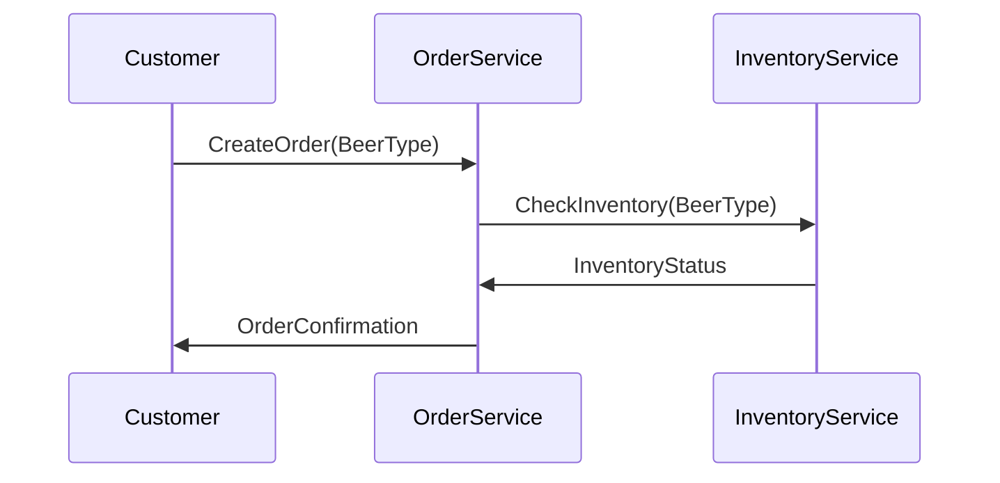

                 

## 设计《现代手工啤酒文化：小型酿造厂的社区价值》书籍目录大纲

为了系统地介绍现代手工啤酒文化及其在小型酿造厂中的社区价值，我们设计了本书的目录大纲，分为两个主要部分：背景介绍和核心概念与联系。以下是详细的章节结构和内容概述。

### 第一部分：背景介绍

#### 第1章：手工啤酒文化的兴起与演变
本章将探讨手工啤酒文化的起源、演变及其在现代社会中的崛起。通过分析啤酒市场的演变，介绍手工啤酒的概念和特点，并探讨其市场的崛起。

1. **问题背景**
   - 啤酒市场的演变
   - 手工啤酒的概念与特点
   - 手工啤酒市场的崛起

2. **社区价值的概念与意义**
   - 社区价值的定义
   - 社区价值在手工啤酒领域的体现
   - 社区价值与小型酿造厂的关系

3. **小型酿造厂的社区价值分析**
   - 社区经济的促进作用
   - 社区文化的传承与发展
   - 社区成员的参与与互动

4. **小结** 
   - 总结本章内容

#### 第2章：手工啤酒的核心概念
本章将深入探讨手工啤酒的核心概念，包括其酿造的基本原理、特色技术以及品鉴技巧。同时，探讨社区价值与手工啤酒的联系。

1. **啤酒酿造的基本原理**
   - 啤酒的历史
   - 啤酒酿造的基本流程
   - 啤酒的主要类型与风味特点

2. **手工啤酒的特色与技术**
   - 手工酿造的优势
   - 手工酿造的关键技术
   - 手工啤酒的品鉴技巧

3. **社区价值与手工啤酒的联系**
   - 社区参与与手工啤酒
   - 社区文化在手工啤酒中的体现
   - 社区价值与手工啤酒的互动

4. **小结**
   - 总结本章内容

#### 第3章：小型酿造厂的运营与管理
本章将分析小型酿造厂的运营模式、管理策略以及团队建设，并探讨社区价值在运营中的体现。

1. **小型酿造厂的运营模式**
   - 运营模式的选择
   - 资源配置与管理
   - 营销策略与推广

2. **社区价值在运营中的体现**
   - 社区参与的鼓励与引导
   - 社区资源整合与利用
   - 社区互动与品牌建设

3. **管理策略与团队建设**
   - 管理理念与原则
   - 团队建设与激励
   - 风险管理与应对策略

4. **小结**
   - 总结本章内容

#### 第4章：手工啤酒的供应链管理
本章将探讨供应链管理的概念与作用，分析其在小型酿造厂中的实施策略以及社区价值在供应链管理中的体现。

1. **供应链管理的概念与作用**
   - 供应链管理的定义
   - 供应链管理的核心要素
   - 供应链管理在手工啤酒行业中的应用

2. **供应链管理在小型酿造厂中的实施**
   - 供应链管理策略
   - 供应链协同与优化
   - 供应链风险与应对措施

3. **社区价值在供应链管理中的体现**
   - 社区供应链的创新模式
   - 社区资源的整合与共享
   - 社区参与与供应链可持续性

4. **小结**
   - 总结本章内容

#### 第5章：社区互动与品牌建设
本章将讨论社区互动的意义与形式，以及品牌建设策略，并探讨社区价值与品牌建设的关系。

1. **社区互动的意义与形式**
   - 社区互动的重要性
   - 社区互动的形式与手段
   - 社区互动与品牌传播

2. **品牌建设策略**
   - 品牌定位与理念
   - 品牌视觉设计与传播
   - 品牌故事与文化建设

3. **社区价值与品牌建设的关系**
   - 社区价值在品牌建设中的体现
   - 品牌建设对社区价值的提升
   - 社区价值与品牌价值的协同发展

4. **小结**
   - 总结本章内容

#### 第6章：手工啤酒文化的传承与发展
本章将探讨手工啤酒文化的传承手段、发展趋势以及社区价值在其中的角色。

1. **手工啤酒文化的传承**
   - 文化传承的意义
   - 文化传承的手段
   - 文化传承与社区价值的结合

2. **手工啤酒文化的发展趋势**
   - 行业发展趋势分析
   - 技术创新与工艺改进
   - 市场细分与产品创新

3. **社区价值在文化传承与发展中的角色**
   - 社区在文化传承中的作用
   - 社区在文化发展中的贡献
   - 社区价值与文化传承的互动

4. **小结**
   - 总结本章内容

### 第二部分：核心概念与联系

#### 第7章：案例分析
本章将通过具体案例，分析小型酿造厂的运营管理、社区互动与品牌建设以及供应链管理，为其他小型酿造厂提供启示与借鉴。

1. **案例选择与背景介绍**
   - 案例选择的标准
   - 案例背景介绍

2. **案例分析**
   - 运营管理分析
   - 社区互动与品牌建设分析
   - 供应链管理分析

3. **启示与借鉴**
   - 案例的启示
   - 案例的借鉴意义
   - 对其他小型酿造厂的启示

4. **小结**
   - 总结本章内容

#### 第8章：未来展望与挑战
本章将展望手工啤酒行业的未来发展趋势，分析面临的挑战，并提出应对策略。

1. **未来发展趋势**
   - 技术发展趋势
   - 市场需求变化
   - 行业创新动态

2. **面临的挑战**
   - 行业竞争加剧
   - 技术变革的挑战
   - 法规与政策的影响

3. **应对策略**
   - 创新驱动发展
   - 加强社区互动
   - 提升供应链效率

4. **小结**
   - 总结本章内容

通过这样的结构，本书旨在全面、深入地探讨现代手工啤酒文化及其在小型酿造厂中的社区价值，为读者提供有价值的理论和实践指导。## 第一部分：背景介绍

### 第1章：手工啤酒文化的兴起与演变

#### 1.1 问题背景

在当今全球化的啤酒市场中，手工啤酒文化正逐渐兴起，成为消费者追求个性化、高品质饮品的一个重要趋势。然而，这种趋势并非一夜之间形成，而是经历了长时间的历史演变和市场发展。

**1.1.1 啤酒市场的演变**

从历史的角度来看，啤酒的生产和消费经历了从古代的简单酿造到现代工业化生产的转变。在古代，啤酒主要是家庭酿造的饮品，其酿造方法和口味因地区和家庭的差异而异。随着工业革命的到来，啤酒生产逐渐实现了标准化和规模化，工业化啤酒厂应运而生，大量生产出口味较为一致的啤酒。

然而，随着消费者对个性化和高品质饮品的需求日益增长，传统的工业化啤酒逐渐无法满足市场的需求。在这样的背景下，手工啤酒作为一种反工业化生产的趋势开始崛起。手工啤酒强调手工制作、小批量生产，追求独特的风味和个性化的体验。

**1.1.2 手工啤酒的概念与特点**

手工啤酒（Craft Beer）通常指的是由小型酿造厂或独立酿造师生产的啤酒，与传统工业化啤酒相比，手工啤酒具有以下特点：

1. **手工制作**：手工啤酒的生产过程强调手工操作，从麦芽的种植、处理到啤酒的酿造、包装，各个环节都注重手工技艺和传统工艺。
2. **小批量生产**：手工啤酒通常采用小批量生产的方式，以确保每一批次的啤酒都具有独特的风味和品质。
3. **多样化口味**：手工啤酒的酿造师可以通过调整原料配比、发酵条件等，创造出丰富多样、独具特色的啤酒风味。
4. **强调个性化**：手工啤酒不仅仅是饮品，更是酿造师个人技艺和风格的体现，每一款手工啤酒都有其独特的故事和背后的意义。

**1.1.3 手工啤酒市场的崛起**

手工啤酒市场的崛起并非偶然，而是多种因素共同作用的结果。首先，消费者对高品质、个性化饮品的追求推动了手工啤酒的发展。其次，社交媒体和啤酒爱好者的传播，使得手工啤酒逐渐被更多消费者了解和接受。此外，全球化和文化多样性的趋势也为手工啤酒的国际化发展提供了机遇。

近年来，手工啤酒市场呈现出快速增长的趋势，不仅在美国、欧洲等传统啤酒生产国取得了显著成就，在中国等新兴市场也展现出了巨大的潜力。根据市场研究机构的报告，全球手工啤酒市场规模逐年扩大，预计未来几年仍将保持高速增长。

#### 1.2 社区价值的概念与意义

**1.2.1 社区价值的定义**

社区价值是指一个社区在精神、文化、经济等方面的综合价值。它不仅仅包括物质财富的积累，还包括社区成员之间的情感纽带、共同价值观的传承以及社区环境的维护等。

在手工啤酒领域，社区价值主要体现在以下几个方面：

1. **文化传承**：手工啤酒是一种承载着地方文化和历史传统的饮品，通过酿造和消费手工啤酒，社区成员可以共同传承和弘扬这一文化。
2. **经济价值**：小型酿造厂为社区创造了就业机会，推动了当地经济的发展。同时，手工啤酒的消费者也通过购买和支持当地酿造厂，为社区经济做出了贡献。
3. **社会互动**：手工啤酒的酿造和消费过程为社区成员提供了一个互动和交流的平台，促进了社区内部的联系和团结。

**1.2.2 社区价值在手工啤酒领域的体现**

1. **酿造过程的参与**：手工啤酒的酿造过程通常需要社区成员的参与，这不仅增加了酿造过程的趣味性，也增强了社区成员之间的互动和合作。
2. **消费体验**：手工啤酒的消费体验往往不仅仅是饮酒，而是一种文化和社交活动。消费者在品尝手工啤酒的同时，也参与到社区的文化生活中。
3. **品牌建设**：手工啤酒品牌的建设离不开社区的支持和认可。一个具有强大社区价值的手工啤酒品牌，往往能够更好地吸引消费者的关注和忠诚。

**1.2.3 社区价值与小型酿造厂的关系**

小型酿造厂是社区价值的重要载体，它们通过以下方式与社区价值密切相关：

1. **促进社区经济发展**：小型酿造厂为社区创造了就业机会，提高了社区成员的收入水平，从而促进了社区经济的发展。
2. **传承社区文化**：通过手工酿造和销售啤酒，小型酿造厂成为了社区文化的重要组成部分，为社区文化的传承和发展提供了支持。
3. **增强社区凝聚力**：小型酿造厂为社区成员提供了一个共同的文化和生活空间，增强了社区的凝聚力和归属感。

#### 1.3 小型酿造厂的社区价值分析

**1.3.1 社区经济的促进作用**

小型酿造厂对社区经济的促进作用主要体现在以下几个方面：

1. **就业机会**：小型酿造厂为社区创造了大量就业机会，包括酿造师、销售员、市场营销人员等职位，从而降低了社区的失业率。
2. **收入增加**：随着就业机会的增加，社区成员的收入水平也得到了显著提高，改善了生活质量。
3. **产业链效应**：小型酿造厂的发展带动了周边相关产业的发展，如麦芽种植、啤酒杯制造等，形成了完整的产业链，进一步促进了社区经济的发展。

**1.3.2 社区文化的传承与发展**

小型酿造厂在社区文化传承和发展中发挥着重要作用：

1. **文化载体**：手工啤酒作为传统饮品的一种，是社区文化的重要载体。通过酿造和销售手工啤酒，小型酿造厂成为了社区文化传承的传承者和传播者。
2. **文化活动**：小型酿造厂经常举办各种文化活动，如啤酒节、酿造体验活动等，吸引了大量社区成员的参与，增强了社区的文化活力。
3. **文化认同**：手工啤酒品牌的建设往往与社区文化紧密相关，一个具有深厚社区背景的手工啤酒品牌能够增强社区成员的文化认同感和自豪感。

**1.3.3 社区成员的参与与互动**

社区成员的参与和互动是小型酿造厂社区价值的重要组成部分：

1. **酿造过程的参与**：社区成员可以通过参与酿造过程，亲身感受手工啤酒的魅力，增加对啤酒文化的理解和认同。
2. **消费体验的分享**：消费者在享受手工啤酒的同时，也通过分享消费体验，促进了社区内部的互动和交流。
3. **品牌共创**：小型酿造厂鼓励社区成员参与品牌建设和营销活动，使社区成员成为品牌的一部分，增强了社区成员的归属感和参与感。

**1.4 小结**

本章通过对手工啤酒市场的演变、社区价值的定义与意义以及小型酿造厂的社区价值分析，探讨了手工啤酒文化在小型酿造厂中的重要性。手工啤酒不仅是一种饮品，更是社区文化、经济和社会互动的载体。通过小型酿造厂的发展，社区价值得以传承、发展和提升，为社区带来了多重利益。## 第2章：手工啤酒的核心概念

#### 2.1 啤酒酿造的基本原理

啤酒作为一种传统的饮品，其酿造过程涉及多个关键环节，包括麦芽的种植和处理、水的处理、啤酒花的添加、发酵以及瓶装和储存等。理解这些基本原理，有助于我们深入掌握手工啤酒的特色和技术。

**2.1.1 啤酒的历史**

啤酒的酿造历史可以追溯到数千年前的古文明。最早的啤酒是在公元前3000年左右，在美索不达米亚地区被发现的。当时的啤酒主要是通过家庭酿造，使用大麦麦芽和水进行发酵制成。

随着时间的推移，啤酒的酿造技术逐渐成熟，从家庭酿造演变成工业化生产。然而，随着消费者对个性化、高品质饮品的需求增加，手工啤酒逐渐兴起，成为现代啤酒市场的一个重要分支。

**2.1.2 啤酒酿造的基本流程**

1. **麦芽的种植和处理**：
   - 麦芽是啤酒的主要原料，通过发芽和干燥制成。麦芽的种植和处理直接影响啤酒的口感和风味。
   - 发芽过程：将大麦浸泡在水中，让其发芽，直到芽长到一定长度，然后进行干燥，制成麦芽。
   - 糖化过程：将麦芽磨成粉，加入热水，使其中的淀粉转化为可发酵的糖分。

2. **水的处理**：
   - 水是啤酒的主要成分，其质量直接影响啤酒的风味和品质。不同地区的地下水成分不同，需要通过软化、过滤等方法进行处理，以确保水质符合酿造要求。

3. **啤酒花的添加**：
   - 啤酒花是啤酒的调味剂，其添加时间、数量和方式都会影响啤酒的口味。啤酒花通常在糖化过程中或发酵后加入，可以带来苦味、香味和防腐效果。

4. **发酵**：
   - 发酵是啤酒酿造的关键环节，通过酵母将糖分转化为酒精和二氧化碳。手工啤酒的发酵过程通常较为自然，采用传统的发酵方法和设备。

5. **瓶装和储存**：
   - 发酵完成后，啤酒需要进行瓶装和储存。瓶装过程需要注意无菌操作，以防止细菌污染。储存过程中，啤酒需要保持在适当的温度和湿度，以保持其风味和稳定性。

**2.1.3 啤酒的主要类型与风味特点**

啤酒根据原料、酿造工艺和风味特点可以分为多种类型，以下是一些常见的啤酒类型及其特点：

1. **拉格啤酒（Lager）**：
   - 拉格啤酒是一种底发酵啤酒，酿造时间较长，口感清爽、苦味适中。常见的拉格啤酒有德国慕尼黑啤酒、美国啤酒等。

2. **艾尔啤酒（Ale）**：
   - 艾尔啤酒是一种顶发酵啤酒，酿造时间较短，口感丰富、风味独特。常见的艾尔啤酒有英式艾尔、比利时艾尔等。

3. **IPA（印度淡色艾尔）**：
   - IPA是一种酒花味浓的艾尔啤酒，酒花用量大，口感苦中带甜。常见的IPA有美国IPA、新西兰IPA等。

4. **世涛啤酒（Stout）**：
   - 世涛啤酒是一种深色、酒体醇厚的啤酒，口感浓郁、苦味明显。常见的世涛啤酒有爱尔兰世涛、苏格兰世涛等。

5. **小麦啤酒（Wheat Beer）**：
   - 小麦啤酒以小麦为主要原料，口感轻盈、口感清爽。常见的小麦啤酒有德国白啤、美国小麦啤酒等。

#### 2.2 手工啤酒的特色与技术

手工啤酒在酿造过程中强调手工技艺和传统工艺，其特色和关键技术主要体现在以下几个方面：

**2.2.1 手工酿造的优势**

1. **个性化**：手工酿造允许酿造师根据个人喜好和市场需求，调整原料配比和酿造工艺，创造出独特风味的啤酒。
2. **品质保证**：手工酿造过程中，酿造师可以更细致地控制每一个环节，确保啤酒的品质和稳定性。
3. **文化传承**：手工酿造作为一种传统工艺，是啤酒文化的重要组成部分，通过手工酿造，可以传承和弘扬这一文化。

**2.2.2 手工酿造的关键技术**

1. **麦芽的处理**：手工酿造对麦芽的处理要求较高，需要严格控制发芽和干燥的过程，以确保麦芽的质量和口感。
2. **酿造设备的选用**：手工酿造厂通常采用传统的酿造设备，如石磨、木桶等，这些设备有助于保持啤酒的传统风味。
3. **发酵过程的控制**：手工酿造的发酵过程需要酿造师精心控制发酵温度、时间等参数，以确保发酵过程的顺利进行和啤酒的风味。

**2.2.3 手工啤酒的品鉴技巧**

1. **观察外观**：通过观察啤酒的颜色、泡沫和清澈度，可以初步判断啤酒的品质和风味。
2. **闻香**：通过闻香，可以感知啤酒的香气类型和强度，有助于进一步判断啤酒的风味特点。
3. **品尝**：品尝是判断啤酒风味的关键环节，需要通过品尝啤酒的口感、酒体厚度、苦味和余味等，全面评估啤酒的品质。

#### 2.3 社区价值与手工啤酒的联系

**2.3.1 社区参与与手工啤酒**

1. **酿造过程的参与**：社区成员可以参与手工啤酒的酿造过程，如麦芽处理、酿造和包装等，这不仅增加了酿造过程的趣味性，也增强了社区成员对啤酒文化的理解和认同。
2. **酿造活动的举办**：小型酿造厂可以举办各种酿造活动，如酿造体验课程、啤酒节等，吸引社区成员的参与，促进社区内部的互动和团结。

**2.3.2 社区文化在手工啤酒中的体现**

1. **品牌文化**：手工啤酒品牌通常具有浓厚的地域特色和文化背景，通过品牌文化的塑造，可以将社区文化融入啤酒产品中，提高消费者的认同感。
2. **酿造工艺**：手工啤酒的酿造工艺往往承载着社区的传统和文化，通过这些工艺的传承和发展，可以弘扬社区文化。

**2.3.3 社区价值与手工啤酒的互动**

1. **经济价值**：手工啤酒的发展为社区创造了就业机会和经济收益，提升了社区的经济水平。
2. **社会价值**：手工啤酒不仅是一种饮品，更是社区文化和社会互动的载体，通过酿造和消费手工啤酒，社区成员可以加深对彼此的了解和信任。

**2.4 小结**

通过本章的介绍，我们了解了手工啤酒的酿造原理和主要类型，以及手工酿造的优势和关键技术。同时，我们还探讨了社区价值与手工啤酒之间的密切联系，手工啤酒不仅是一种饮品，更是社区文化、经济和社会互动的重要载体。在接下来的章节中，我们将进一步分析小型酿造厂的运营模式和管理策略，以及社区价值在这些方面的具体体现。## 第3章：小型酿造厂的运营与管理

#### 3.1 小型酿造厂的运营模式

小型酿造厂的运营模式多种多样，不同的模式适用于不同的市场环境和目标。以下是几种常见的小型酿造厂运营模式及其特点和适用条件：

**1. 纯手工模式**  
纯手工模式是指酿造厂的所有生产过程都依靠人工完成，从麦芽的种植、处理到啤酒的酿造、包装，各个环节都强调手工技艺和传统工艺。这种模式的特点是产品品质高、风味独特，但生产效率较低，成本较高。

适用条件：  
- 对品质有极高要求的市场
- 目标客户群体是追求个性化、高品质手工啤酒的消费者
- 酿造厂位于风景优美的地区，可以结合旅游体验

**2. 半自动化模式**  
半自动化模式是指酿造厂在生产过程中部分环节采用自动化设备，如麦芽处理、啤酒酿造等，但仍然保留一些手工环节，如包装和瓶装等。这种模式在提高生产效率的同时，仍能保持一定的手工特色。

适用条件：  
- 需要平衡生产效率和产品品质的酿造厂
- 市场需求较大，需要提高生产能力的酿造厂
- 初创小型酿造厂，预算有限，需要逐步扩大规模

**3. 完全自动化模式**  
完全自动化模式是指酿造厂的生产过程完全依靠自动化设备完成，从麦芽处理到啤酒包装，各个环节都实现自动化。这种模式的生产效率高、成本较低，但产品的风味和个性可能会受到影响。

适用条件：  
- 大型酿造厂，生产规模较大
- 需要大量生产标准化产品的市场
- 人力资源紧张的地区，难以找到足够的熟练工人

**4. 联合模式**  
联合模式是指酿造厂与其他相关企业或组织合作，共同完成生产过程。例如，与麦芽厂合作，麦芽厂负责麦芽的种植和处理，酿造厂负责酿造和包装。这种模式可以充分利用各方资源和优势。

适用条件：  
- 需要专业麦芽处理的酿造厂
- 有稳定供应链和合作伙伴的酿造厂
- 目标是降低成本和提高生产效率

**5. 定制化模式**  
定制化模式是指根据客户的需求和喜好，为客户提供个性化定制的手工啤酒。这种模式的特点是高度个性化，但生产成本较高，适合高端市场和特定的客户群体。

适用条件：  
- 目标市场是追求独特体验的高端消费者
- 酿造厂具有丰富的酿造经验和技艺
- 预算充足，能够承担定制化生产的高成本

#### 3.2 社区价值在运营中的体现

小型酿造厂的运营不仅仅是生产啤酒，更是与社区互动和品牌建设的重要过程。社区价值在运营中的体现主要体现在以下几个方面：

**1. 社区参与的鼓励与引导**

1. **酿造体验活动**：小型酿造厂可以定期举办酿造体验活动，邀请社区成员参与麦芽种植、酿造和品鉴等过程，增加互动和参与感。
2. **社区合作伙伴**：与社区其他组织合作，如学校、社区中心等，开展相关活动，增强社区凝聚力。
3. **志愿者计划**：鼓励社区成员参与酿造厂的志愿者计划，为酿造厂提供人力支持，同时增强社区成员的归属感。

**2. 社区资源整合与利用**

1. **麦芽种植**：利用社区内的农田，进行麦芽的种植，不仅可以保证麦芽的供应，还能促进社区农业的发展。
2. **水资源**：利用社区内优质的水资源，保证酿造过程中水质的稳定性，提高啤酒的品质。
3. **人力资源**：招募社区内的失业人员或年轻劳动力，为酿造厂提供人力资源，促进社区就业。

**3. 社区互动与品牌建设**

1. **社交媒体**：通过社交媒体平台，与社区成员保持互动，分享酿造厂的活动和成果，提高品牌知名度。
2. **线下活动**：举办啤酒节、品酒会等线下活动，吸引社区成员和游客参与，增强品牌的影响力。
3. **口碑营销**：利用社区成员的口碑，推广酿造厂的产品和服务，提高品牌信誉。

#### 3.3 管理策略与团队建设

小型酿造厂的管理策略和团队建设对于企业的成功至关重要。以下是一些关键的管理策略和团队建设方法：

**1. 管理理念与原则**

1. **以人为本**：尊重和关注员工的成长和发展，激发员工的积极性和创造力。
2. **质量优先**：始终坚持高质量的生产标准，确保产品的稳定和优质。
3. **持续改进**：不断优化生产流程和管理方法，提高效率和竞争力。

**2. 团队建设与激励**

1. **团队协作**：建立跨部门的协作机制，鼓励员工之间相互支持和合作，共同完成目标。
2. **培训与发展**：为员工提供培训和发展的机会，提升员工的技能和素质。
3. **激励机制**：通过绩效奖金、晋升机会等激励机制，激励员工的工作积极性和创造力。

**3. 风险管理与应对策略**

1. **风险评估**：定期进行风险评估，识别潜在的风险，制定相应的应对措施。
2. **应急预案**：制定应急预案，确保在突发情况下能够迅速响应和应对。
3. **保险与担保**：购买适当的保险，降低经营风险。

**3.4 小结**

本章通过对小型酿造厂的不同运营模式进行分析，探讨了社区价值在运营中的体现，以及管理策略和团队建设的关键因素。小型酿造厂的运营不仅仅是生产啤酒，更是与社区互动和品牌建设的重要过程。通过合理的运营模式、有效的社区互动和科学的管理策略，小型酿造厂可以充分发挥其社区价值，实现可持续发展。## 第4章：手工啤酒的供应链管理

#### 4.1 供应链管理的概念与作用

供应链管理（Supply Chain Management，简称SCM）是指对供应链中各个环节进行计划、组织、协调和控制的过程。它涉及到从原材料采购、生产加工、仓储物流到最终产品交付给消费者的整个流程。在手工啤酒行业中，供应链管理的作用尤为重要，因为它直接影响着啤酒的品质、成本和交付时间。

**4.1.1 供应链管理的定义**

供应链管理是一个集成性的过程，它将供应链中的各个参与者（如供应商、制造商、分销商、零售商等）紧密联系在一起，通过优化资源分配和流程，实现最低成本和最高效率。具体来说，供应链管理包括以下关键要素：

1. **需求预测**：通过对市场趋势和消费者需求的分析，预测未来的需求量，以制定生产计划和库存策略。
2. **采购**：选择合适的供应商，采购所需的原材料和设备，确保供应链的稳定性。
3. **生产**：根据生产计划，将原材料转化为成品，确保生产效率和产品质量。
4. **仓储**：对库存进行有效管理，确保原材料和成品在不同阶段的库存水平合理。
5. **物流**：通过运输和配送，将成品从生产地点运送到消费者手中，确保物流的及时性和成本效益。
6. **信息流**：通过信息技术的应用，实时监控供应链的各个环节，确保信息的透明和及时性。

**4.1.2 供应链管理的核心要素**

1. **采购管理**：选择合适的供应商，制定采购策略，确保原材料的质量和供应稳定性。
2. **生产管理**：根据市场需求和生产计划，合理配置生产资源，确保生产效率和产品质量。
3. **仓储管理**：对库存进行有效管理，优化库存水平，降低库存成本。
4. **物流管理**：制定物流策略，确保物流的及时性和成本效益。
5. **信息管理**：通过信息技术的应用，实现供应链各环节的信息透明和实时监控。

**4.1.3 供应链管理在手工啤酒行业中的应用**

在手工啤酒行业，供应链管理的主要应用包括：

1. **麦芽采购**：手工啤酒的主要原材料是麦芽，供应链管理需要确保麦芽的质量和供应稳定性，通过与多家供应商建立长期合作关系，降低采购成本和风险。
2. **啤酒酿造**：生产过程中需要根据市场需求和生产计划，合理配置酿造设备，确保生产效率和产品质量。
3. **仓储与物流**：手工啤酒的生产和销售通常是小批量、多频次的，供应链管理需要优化仓储和物流策略，确保产品的及时交付和客户满意度。
4. **信息流管理**：通过信息技术的应用，实时监控供应链的各个环节，确保信息的透明和及时性，提高供应链的效率。

#### 4.2 供应链管理在小型酿造厂中的实施

在小型酿造厂中，供应链管理的实施面临着一系列挑战，包括资源有限、供应链复杂度增加、市场需求多变等。以下是一些具体的实施策略：

**4.2.1 供应链管理策略**

1. **集成化管理**：将供应链中的各个环节进行整合，通过信息技术的应用，实现供应链各环节的信息共享和协同工作，提高供应链的整体效率。
2. **精细化运营**：通过数据分析和技术手段，对供应链的各个环节进行精细化运营管理，优化库存水平、降低物流成本、提高生产效率。
3. **供应商选择**：选择合适的供应商，建立长期合作关系，通过合作共赢的原则，确保原材料的质量和供应稳定性。
4. **风险管理**：识别供应链中的潜在风险，制定相应的风险应对策略，降低供应链中断和成本超支的风险。

**4.2.2 供应链协同与优化**

1. **协同生产**：通过与供应商和分销商的协同生产，实现资源的最优配置，降低生产成本和库存压力。
2. **物流优化**：通过物流路线的优化、运输工具的选择、物流信息的实时监控等手段，提高物流的效率和成本效益。
3. **信息共享**：通过建立供应链信息共享平台，实现供应链各环节的信息透明和实时监控，提高供应链的响应速度和灵活性。

**4.2.3 供应链风险与应对措施**

1. **供应链中断风险**：由于自然灾害、政治不稳定等因素可能导致供应链中断，应对措施包括建立应急预案、增加库存储备、寻找替代供应商等。
2. **成本超支风险**：由于原材料价格波动、生产成本增加等因素可能导致成本超支，应对措施包括优化供应链流程、降低采购成本、提高生产效率等。
3. **市场需求波动风险**：由于市场需求的不确定性，可能导致产品库存过剩或不足，应对措施包括市场需求预测、灵活调整生产计划、提高库存管理水平等。

#### 4.3 社区价值在供应链管理中的体现

在手工啤酒的供应链管理中，社区价值得到了充分的体现。社区价值不仅体现在经济层面，还体现在文化和社会层面。以下是一些具体的体现方式：

**1. 社区供应链的创新模式**

1. **社区支持型供应链**：通过社区成员的支持，建立社区支持型供应链，确保原材料和生产的稳定供应。例如，与社区内的农场合作，提供有机麦芽，确保麦芽的质量和可持续性。
2. **众筹型供应链**：通过众筹平台，吸引社区成员的资金支持，用于供应链的优化和创新。这种方式不仅可以降低资金压力，还可以增强社区成员的参与感和归属感。

**2. 社区资源的整合与共享**

1. **资源共享**：通过社区资源的整合和共享，降低供应链的成本和运营压力。例如，共享仓库和运输工具，减少仓储和物流成本。
2. **知识共享**：通过社区成员的知识共享，提高供应链的效率和创新能力。例如，定期举办供应链管理研讨会，分享最佳实践和成功案例。

**3. 社区参与与供应链可持续性**

1. **可持续供应链**：通过社区参与，推动供应链的可持续性发展。例如，采用环保材料和工艺，减少对环境的影响。
2. **社会责任**：通过供应链管理，实现企业的社会责任。例如，为社区提供就业机会，参与社区公益活动等。

**4.4 小结**

通过本章的介绍，我们了解了供应链管理的概念和作用，以及其在手工啤酒行业中的应用。小型酿造厂的供应链管理不仅涉及到技术和管理层面的优化，还涉及到社区价值的实现。通过有效的供应链管理，小型酿造厂可以实现成本效益、产品质量和客户满意度的提升，同时增强社区价值和可持续发展。在接下来的章节中，我们将进一步探讨社区互动与品牌建设的重要性，以及如何在品牌建设中体现社区价值。## 第5章：社区互动与品牌建设

#### 5.1 社区互动的意义与形式

社区互动在手工啤酒文化中扮演着至关重要的角色，它不仅是品牌建设的基础，也是增强社区凝聚力和文化认同感的重要途径。有效的社区互动有助于建立品牌的忠诚度和市场影响力。

**5.1.1 社区互动的重要性**

1. **增强品牌忠诚度**：通过社区互动，品牌能够与消费者建立更紧密的联系，增强消费者的品牌忠诚度。消费者在参与社区互动的过程中，能够更好地理解和认同品牌的文化和价值观。
2. **提升品牌知名度**：社区互动为品牌提供了一个与消费者直接交流的平台，有助于提升品牌的知名度。通过举办活动、分享故事和口碑传播，品牌能够迅速在社区中建立影响力。
3. **促进社区凝聚力**：社区互动能够增强社区成员之间的联系，促进社区内部的凝聚力。这种凝聚力不仅有助于社区的发展，也为品牌建设提供了有力的支持。

**5.1.2 社区互动的形式与手段**

1. **线下活动**：线下活动是社区互动的主要形式，包括啤酒节、品酒会、酿造体验课程等。这些活动不仅能够吸引消费者的参与，还能增强社区成员之间的互动和合作。
2. **社交媒体**：社交媒体平台如Facebook、Instagram、微博等是品牌与消费者互动的重要渠道。通过这些平台，品牌可以分享酿造故事、发布新品信息和互动活动，与消费者保持实时联系。
3. **社区论坛**：建立品牌专属的社区论坛，为消费者提供一个交流和分享的平台。在论坛中，消费者可以讨论啤酒文化、分享品尝心得，同时品牌也可以及时回应消费者的疑问和反馈。
4. **公益活动**：参与和举办公益活动是品牌展现社会责任感的重要方式。例如，为当地的慈善机构捐款、组织社区清洁活动等，这些活动不仅有助于提升品牌形象，也能增强社区成员对品牌的认同感。

#### 5.2 品牌建设策略

品牌建设是手工啤酒成功的关键因素之一，它需要通过一系列有针对性的策略来实现。以下是一些关键的策略：

**5.2.1 品牌定位与理念**

1. **独特定位**：品牌需要明确自己的定位，以区分于其他竞争对手。例如，可以定位为“手工酿造”、“有机啤酒”、“高端定制”等，以吸引特定消费者群体。
2. **核心价值**：品牌需要明确自己的核心价值，并将其贯穿于所有产品和活动中。这些核心价值可以是“品质至上”、“文化传承”、“环保可持续”等，它们能够引导品牌的发展和消费者的选择。

**5.2.2 品牌视觉设计与传播**

1. **视觉识别系统**：品牌视觉识别系统（Visual Identity System）是品牌形象的重要组成部分，包括品牌标志、颜色、字体等。一个独特且易于识别的视觉设计能够增强品牌的影响力。
2. **文化传播**：通过视觉设计和传播，品牌可以将自己的文化理念传递给消费者。例如，通过品牌标志和包装设计，展现手工酿造的细节和工艺，使消费者能够直观地感受到品牌的文化内涵。

**5.2.3 品牌故事与文化建设**

1. **品牌故事**：品牌故事是品牌文化的重要组成部分，它能够吸引消费者的兴趣和情感共鸣。品牌可以通过讲述自己的创建历程、酿造故事、品牌背后的意义等，来构建自己的品牌故事。
2. **社区文化建设**：品牌需要积极参与社区文化建设，通过与社区成员的互动和合作，共同塑造品牌的文化形象。例如，举办社区活动、赞助文化项目、参与社区公益事业等，都是品牌文化建设的重要手段。

#### 5.3 社区价值与品牌建设的关系

社区价值在品牌建设中起着至关重要的作用。一个成功的品牌不仅仅是产品的销售者，更是社区的文化代表和社会责任的承担者。以下是如何在品牌建设中体现社区价值的一些具体方法：

**5.3.1 社区价值在品牌建设中的体现**

1. **社区参与**：品牌建设需要积极鼓励社区参与，通过举办活动、开设社区论坛等方式，让社区成员参与到品牌的发展中来。这种参与不仅能够增强品牌的社区归属感，也能提高品牌的认可度和忠诚度。
2. **社会责任**：品牌在建设过程中，需要承担社会责任，通过参与和推动社区公益事业，提升品牌的社会形象和影响力。例如，通过捐款、志愿服务等方式，品牌可以展现其对社区和环境的责任感。
3. **文化传播**：品牌建设需要将社区文化融入品牌内涵中，通过品牌传播和文化活动，将社区文化传递给更广泛的消费者。这种文化传播不仅能够增强品牌的独特性，也能提升消费者的文化认同感。

**5.3.2 品牌建设对社区价值的提升**

1. **社区经济发展**：品牌建设可以带动社区经济的发展，通过提供就业机会、增加税收等方式，为社区创造经济价值。同时，品牌的发展也可以吸引更多的投资者和合作伙伴，为社区带来更多的资源和机会。
2. **社区文化传承**：品牌建设有助于传承和发展社区文化。通过品牌活动和文化项目，品牌可以成为社区文化的重要载体，推动社区文化的传承和创新。
3. **社区凝聚力**：品牌建设可以通过互动和合作，增强社区成员之间的凝聚力和归属感。一个成功的品牌能够成为社区的象征，促进社区成员之间的联系和合作。

**5.3.3 社区价值与品牌价值的协同发展**

1. **互惠共赢**：社区价值与品牌价值的协同发展，实现互惠共赢。品牌通过为社区提供经济、文化和社交价值，赢得了社区的认可和支持，而社区的支持也为品牌的发展提供了坚实的基础。
2. **品牌创新**：社区价值的融入可以激发品牌的创新活力。通过了解和响应社区的需求和期望，品牌可以开发出更符合市场趋势和消费者口味的产品和服务。
3. **品牌传播**：社区价值的体现可以提升品牌传播的效力和效果。一个具有深厚社区背景和价值的品牌，更容易在市场中脱颖而出，吸引消费者的关注和信任。

**5.4 小结**

本章通过对社区互动和品牌建设的重要性和策略进行了详细分析，探讨了社区价值在品牌建设中的体现及其对社区价值的提升作用。社区互动和品牌建设是手工啤酒文化成功的关键因素，通过有效的社区互动和品牌建设，小型酿造厂不仅能够提升品牌知名度和市场竞争力，还能增强社区凝聚力和社会责任感。在接下来的章节中，我们将进一步探讨手工啤酒文化的传承与发展，分析行业趋势和技术创新，以及社区价值在这一过程中的角色。## 第6章：手工啤酒文化的传承与发展

#### 6.1 手工啤酒文化的传承

**6.1.1 文化传承的意义**

手工啤酒文化作为一种独特的文化现象，承载着丰富的历史、传统和技艺。其传承不仅是对历史的尊重，更是对文化多样性和地方特色的保护。以下是手工啤酒文化传承的几个关键意义：

1. **文化多样性**：手工啤酒文化是文化多样性的重要体现。不同地区和民族的手工啤酒酿造技艺各有特色，通过传承，这些多样性得以保存和传播，丰富了全球文化的内涵。
2. **技艺保护**：手工啤酒酿造涉及到复杂的工艺和技术，这些技艺往往通过师徒传承的方式代代相传。传承手工啤酒文化，有助于保护这些珍贵的技艺，防止其因工业化浪潮而消失。
3. **文化认同**：手工啤酒文化的传承能够增强地方居民的认同感和自豪感。这种认同不仅体现在对本地文化的热爱上，也体现在对地方经济和社会发展的支持上。

**6.1.2 文化传承的手段**

1. **教育培训**：通过开设手工啤酒酿造课程、工作坊和培训项目，培养新一代的酿造师，确保手工啤酒技艺的传承。这些教育项目可以涵盖理论知识、实操技能和文化背景，全面提高酿造师的素质。
2. **非遗保护**：将手工啤酒酿造技艺列入非物质文化遗产名录，通过法律和政策保护，确保其传承和发展。例如，在一些国家和地区，政府会提供资金和资源支持，帮助手工啤酒酿造厂和酿造师传承传统技艺。
3. **历史文献整理**：整理和出版关于手工啤酒文化的历史文献，如酿造技术手册、食谱、酿造历史等，为后人提供宝贵的资料。这些文献不仅有助于技艺传承，也促进了手工啤酒文化的研究和传播。

**6.1.3 文化传承与社区价值的结合**

1. **社区文化中心**：将手工啤酒文化作为社区文化中心的一部分，通过举办展览、讲座、互动活动等，增强社区成员对手工啤酒文化的了解和认同。这种文化中心不仅是传承的载体，也是社区价值的体现。
2. **文化活动**：定期举办手工啤酒文化节、酿造比赛、品尝会等活动，吸引社区成员和游客参与，增强社区凝聚力和文化认同感。这些活动不仅传承了文化，也促进了社区经济发展。
3. **社区参与**：鼓励社区成员参与手工啤酒的酿造和营销活动，使他们成为文化传承的积极参与者。这种参与不仅增强了社区的归属感，也促进了文化的传承和发展。

#### 6.2 手工啤酒文化的发展趋势

**6.2.1 行业发展趋势分析**

1. **全球市场扩张**：随着全球化进程的加快，手工啤酒市场在全球范围内不断扩大。尤其是在北美、欧洲和亚洲等地区，手工啤酒已经成为消费者追捧的对象。
2. **技术创新**：随着科技的进步，手工啤酒酿造技术也在不断创新。例如，智能化酿造设备的引入，不仅提高了生产效率，还保证了酿造过程的精确控制。
3. **消费者多样化**：消费者对啤酒的需求越来越多样化，不再仅仅满足于传统口味，而更倾向于尝试新的风味和独特的酿造方式。这种多样化趋势推动了手工啤酒文化的创新和发展。

**6.2.2 技术创新与工艺改进**

1. **智能化酿造**：智能化酿造技术的应用，使得酿造过程更加自动化和精确化。通过物联网、大数据和人工智能等技术，酿造厂可以实时监控和调整酿造参数，提高产品质量和稳定性。
2. **可持续工艺**：随着环保意识的提升，手工啤酒酿造厂也在积极探索可持续工艺。例如，采用可再生能源、减少废水排放、使用环保包装材料等，这些举措不仅有助于环境保护，也提升了品牌形象。
3. **风味创新**：通过引入新的原料和酿造工艺，手工啤酒的风味更加多样化。例如，使用水果、花卉、咖啡豆等新型原料，创造出独特的风味组合，满足消费者对多样化口味的追求。

**6.2.3 市场细分与产品创新**

1. **细分市场**：手工啤酒市场正在不断细分，以满足不同消费者的需求。例如，低酒精度啤酒、有机啤酒、无麦芽啤酒等新兴品类正在快速崛起，吸引了大量消费者。
2. **产品创新**：为了适应市场变化和消费者需求，手工啤酒品牌不断创新产品。例如，推出限量版、节日特别版等特色产品，吸引消费者的关注和购买欲望。

#### 6.3 社区价值在文化传承与发展中的角色

**6.3.1 社区在文化传承中的作用**

1. **文化守护者**：社区是手工啤酒文化的守护者，通过世代相传，将手工啤酒的酿造技艺和文化理念保留下来。社区的每一个成员都是文化的传承者，他们通过自己的实践和分享，使文化得以延续。
2. **文化推广者**：社区成员通过举办活动、参与展览等方式，将手工啤酒文化推广到更广泛的范围。他们不仅是文化的传承者，也是文化的传播者，为文化的传承和发展做出了重要贡献。

**6.3.2 社区在文化发展中的贡献**

1. **经济支持**：社区为手工啤酒酿造厂提供了重要的经济支持。通过购买当地产品、参与投资等方式，社区成员为酿造厂的发展提供了资金和资源，促进了文化的发展。
2. **社会资源**：社区提供了丰富的人力资源和社交网络，为文化的发展提供了有力支持。社区成员的参与不仅为酿造厂提供了劳动力，也通过互助合作，推动了文化的创新和发展。

**6.3.3 社区价值与文化传承的互动**

1. **文化促进经济**：文化传承为社区经济提供了动力。通过手工啤酒文化的传承和发展，社区吸引了更多的游客和投资者，促进了当地旅游业和经济发展。
2. **经济支持文化**：经济发展为文化传承提供了资源。通过社区经济的繁荣，酿造厂可以投入更多的资金和资源，用于文化保护和传承。

**6.4 小结**

通过本章的介绍，我们深入探讨了手工啤酒文化的传承与发展，分析了社区价值在其中的重要作用。手工啤酒文化不仅是历史和传统的传承，更是社区价值和经济发展的重要载体。在未来的发展中，通过社区参与和合作，手工啤酒文化将继续传承和发展，为社区和社会带来更多的价值。## 第7章：案例分析

#### 7.1 案例选择与背景介绍

在本章中，我们将选择一个具有代表性的小型酿造厂作为案例，深入分析其运营管理、社区互动与品牌建设以及供应链管理。该案例选择的标准主要包括以下几点：

1. **代表性**：所选案例需在手工啤酒市场上具有一定的知名度，能够代表小型酿造厂的发展模式和成功经验。
2. **多样性**：案例在运营模式、社区互动和品牌建设方面具有多样性，能够为其他小型酿造厂提供多种借鉴和启示。
3. **可持续性**：案例在发展过程中注重可持续发展，包括经济、社会和环境等多个方面。

**案例背景介绍**：

本案例选择的是一家位于美国的小型酿造厂——“Green Valley Brewing Co.”。Green Valley Brewing Co. 成立于2005年，位于加利福尼亚州的一个风景秀丽的小镇。该酿造厂以手工酿造、小批量生产为特色，专注于提供高品质的手工啤酒。在过去的十几年里，Green Valley Brewing Co. 通过不断创新和积极参与社区活动，逐渐在市场上树立了良好的品牌形象。

#### 7.2 案例分析

**7.2.1 运营管理分析**

1. **运营模式**：
   - Green Valley Brewing Co. 采用半自动化模式，在生产过程中部分环节采用自动化设备，如麦芽处理和啤酒酿造。但关键的酿造过程和包装环节仍然依赖人工，以确保产品的独特风味和品质。
   - 酿造厂的生产计划根据市场需求和季节性变化进行调整，灵活应对市场波动。

2. **资源配置与管理**：
   - Green Valley Brewing Co. 注重资源的合理配置，通过与当地农场合作，确保麦芽的稳定供应。同时，酿造厂利用社区资源，如社区中心举办酿造体验活动，提高品牌的知名度和参与度。
   - 在人力资源管理方面，酿造厂注重员工的培训和职业发展，建立了一支高效的酿造团队。

3. **营销策略与推广**：
   - Green Valley Brewing Co. 采用多元化的营销策略，包括社交媒体推广、参与当地活动和赞助体育赛事等。这些策略有效地提高了品牌的曝光率和市场影响力。
   - 酿造厂还通过推出限量版和特别版产品，吸引消费者的关注和购买欲望。

**7.2.2 社区互动与品牌建设分析**

1. **社区互动**：
   - Green Valley Brewing Co. 积极参与社区活动，如啤酒节、慈善募捐和社区清洁等。这些活动不仅增强了品牌与社区成员的互动，也提高了品牌的社区形象。
   - 酿造厂定期举办酿造体验活动，邀请社区成员参与麦芽种植、酿造和品鉴等过程，增加了互动和参与感。

2. **品牌建设**：
   - Green Valley Brewing Co. 的品牌定位为“手工酿造、高品质、环保可持续”，这一核心价值贯穿于所有产品和活动中。通过视觉设计和文化传播，品牌成功地将这一理念传递给消费者。
   - 酿造厂注重品牌故事的讲述，通过展示酿造工艺、分享品牌背后的故事，增强了消费者的情感共鸣。

**7.2.3 供应链管理分析**

1. **供应链策略**：
   - Green Valley Brewing Co. 采取了社区支持的供应链模式，与当地农场建立长期合作关系，确保麦芽的质量和供应稳定性。同时，酿造厂还采用环保材料和工艺，减少对环境的影响。
   - 在物流管理方面，酿造厂通过与专业物流公司合作，确保产品的及时交付和客户满意度。

2. **供应链协同与优化**：
   - 酿造厂利用信息技术实现供应链各环节的信息共享和协同工作，提高供应链的整体效率。例如，通过ERP系统实时监控库存水平和生产进度，确保供应链的顺畅运行。
   - 酿造厂还通过数据分析，优化供应链的各个环节，降低成本和提高效率。

3. **供应链风险与应对措施**：
   - Green Valley Brewing Co. 识别了供应链中的潜在风险，如自然灾害、供应商不稳定等。为了应对这些风险，酿造厂制定了应急预案，包括增加库存储备和寻找替代供应商等。
   - 酿造厂还通过保险和担保等措施，降低供应链中断和成本超支的风险。

#### 7.3 启示与借鉴

**7.3.1 案例的启示**

通过分析Green Valley Brewing Co. 的成功经验，我们可以得出以下几点启示：

1. **多元化运营模式**：小型酿造厂可以根据市场需求和资源条件，选择合适的运营模式，实现灵活生产和高品质保证。
2. **社区互动与品牌建设**：积极参与社区活动，增强品牌与社区成员的互动，提升品牌知名度和认可度。
3. **供应链管理**：通过优化供应链策略和协同工作，提高供应链的效率和稳定性，降低运营风险。

**7.3.2 案例的借鉴意义**

1. **运营策略**：其他小型酿造厂可以借鉴Green Valley Brewing Co. 的半自动化模式，在提高生产效率的同时，保持产品的手工特色。
2. **社区参与**：通过举办酿造体验活动、参与社区公益项目等方式，增强社区互动，提升品牌形象。
3. **供应链优化**：通过信息技术和数据分析，优化供应链管理，提高供应链的协同效应和响应速度。

**7.3.3 对其他小型酿造厂的启示**

1. **创新驱动**：小型酿造厂应注重技术创新和工艺改进，以适应市场变化和消费者需求。
2. **可持续发展**：在运营过程中，应关注环境保护和资源利用，实现经济、社会和环境的可持续发展。
3. **社区价值**：将社区价值融入品牌建设和运营中，增强社区的归属感和参与感，实现品牌与社区的共同发展。

#### 7.4 小结

通过本章节的案例分析，我们深入了解了Green Valley Brewing Co. 的运营管理、社区互动与品牌建设以及供应链管理。这个案例不仅为其他小型酿造厂提供了成功的经验和启示，也展示了手工啤酒文化在社区价值中的重要作用。在未来的发展中，其他小型酿造厂可以借鉴这些经验，通过多元化运营模式、积极参与社区互动和优化供应链管理，实现可持续发展。## 第8章：未来展望与挑战

#### 8.1 未来发展趋势

随着科技的进步和消费者需求的多样化，手工啤酒行业正面临着一系列新的发展趋势。以下是未来几年手工啤酒行业可能出现的几个重要趋势：

**1. 智能酿造技术的应用**：随着物联网、大数据和人工智能技术的不断发展，手工啤酒酿造将更加智能化。通过实时监控和数据分析，酿造厂可以更精确地控制酿造过程，提高生产效率和产品质量。

**2. 环保可持续工艺的推广**：随着环保意识的提升，手工啤酒酿造厂将更加注重环保和可持续性。例如，采用可再生能源、减少废水排放、使用环保包装材料等，这些举措不仅有助于环境保护，也能提升品牌形象。

**3. 多元化市场的开拓**：随着全球化进程的加快，手工啤酒市场将更加多元化。不仅在欧洲、北美等传统市场继续扩张，亚洲、非洲等新兴市场也将成为新的增长点。

**4. 消费者个性化需求的满足**：消费者对啤酒的需求越来越多样化，不仅追求高品质，更追求个性化。手工啤酒酿造厂将推出更多定制化产品，满足消费者的个性化需求。

**5. 社交媒体和网络营销的普及**：随着社交媒体的普及，手工啤酒酿造厂将更加依赖社交媒体和网络营销，通过线上互动和推广，提高品牌知名度和市场影响力。

#### 8.2 面临的挑战

尽管未来发展趋势充满机遇，但手工啤酒行业也面临着一系列挑战：

**1. 竞争加剧**：随着更多小型酿造厂进入市场，竞争将越来越激烈。如何在激烈的市场竞争中脱颖而出，是每个酿造厂都需要面对的挑战。

**2. 技术创新的不确定风险**：尽管智能酿造技术具有巨大潜力，但其研发和应用也存在不确定性。如何平衡技术创新和成本控制，是酿造厂需要考虑的问题。

**3. 环保法规的压力**：随着环保法规的日益严格，酿造厂需要投入更多资源和精力来满足环保要求。如何在遵守法规的同时，保持生产和利润的稳定，是一个重要的挑战。

**4. 供应链的复杂性**：随着市场的多元化，供应链的复杂性也在增加。如何确保供应链的稳定性和灵活性，降低供应链风险，是每个酿造厂都需要解决的问题。

**5. 消费者信任的建立**：随着消费者对产品质量和品牌信誉的要求越来越高，酿造厂需要投入更多资源来建立和维持消费者的信任。如何在竞争激烈的市场中树立良好的品牌形象，是酿造厂需要面对的挑战。

#### 8.3 应对策略

为了应对未来发展趋势和挑战，手工啤酒行业可以采取以下策略：

**1. 技术创新**：酿造厂应加大对智能酿造技术的研发和应用投入，通过技术创新提高生产效率和产品质量。

**2. 环保可持续**：酿造厂应积极探索环保可持续的酿造工艺和材料，通过环保措施提升品牌形象。

**3. 市场多元化**：酿造厂应积极开拓新的市场，特别是新兴市场，通过多元化市场分散风险。

**4. 个性化定制**：酿造厂应推出更多个性化定制产品，满足消费者的多样化需求。

**5. 社交媒体营销**：酿造厂应充分利用社交媒体和网络营销，提高品牌知名度和市场影响力。

**6. 供应链优化**：酿造厂应优化供应链管理，通过协同优化和风险控制，确保供应链的稳定性和灵活性。

**7. 品牌建设**：酿造厂应注重品牌建设和消费者信任的建立，通过品牌故事和文化传播，增强品牌影响力和消费者忠诚度。

**8.4 小结**

未来，手工啤酒行业将面临许多机遇和挑战。通过技术创新、环保可持续、市场多元化、个性化定制、社交媒体营销、供应链优化和品牌建设等策略，酿造厂可以更好地应对未来发展的趋势和挑战，实现可持续发展。## 结论

通过本书的探讨，我们系统地分析了现代手工啤酒文化的兴起与演变、小型酿造厂的运营模式、供应链管理、社区互动与品牌建设，以及手工啤酒文化的传承与发展。以下是对全书内容的总结和回顾：

首先，在背景介绍部分，我们深入探讨了手工啤酒市场的演变，从工业化生产到手工啤酒的崛起，展示了手工啤酒作为一种反工业化趋势的重要地位。同时，我们定义了社区价值的概念，并分析了社区价值在手工啤酒领域的体现，强调了小型酿造厂作为社区价值的重要载体。

其次，在核心概念部分，我们详细介绍了啤酒酿造的基本原理、手工啤酒的特色和技术，以及社区价值与手工啤酒之间的密切联系。通过这些分析，我们认识到手工啤酒不仅是一种饮品，更是社区文化、经济和社会互动的重要载体。

在运营与管理部分，我们探讨了小型酿造厂的多种运营模式，以及社区价值在运营中的具体体现。通过案例分析，我们了解了如何通过有效的管理策略和团队建设，提升小型酿造厂的运营效率和品牌影响力。

在供应链管理部分，我们分析了供应链管理的概念和作用，探讨了供应链管理在小型酿造厂中的具体实施策略，以及社区价值在供应链管理中的体现。通过这些分析，我们认识到供应链管理不仅关乎产品质量和成本控制，更关乎社区经济的繁荣和可持续发展。

在社区互动与品牌建设部分，我们深入探讨了社区互动的意义与形式，以及品牌建设策略。我们强调社区价值与品牌建设的紧密关系，指出通过有效的社区互动和品牌建设，可以增强品牌知名度和市场竞争力。

在手工啤酒文化的传承与发展部分，我们分析了文化传承的意义、手段以及与社区价值的结合。同时，我们展望了手工啤酒文化的未来发展趋势，探讨了行业面临的挑战以及应对策略。

最后，通过全书的系统分析和讨论，我们得出以下主要结论：

1. **手工啤酒文化的兴起与演变**：手工啤酒作为一种反工业化趋势，正在全球范围内得到广泛认可。它不仅满足了消费者对个性化、高品质饮品的需求，也成为社区文化的重要组成部分。

2. **小型酿造厂的社区价值**：小型酿造厂作为社区价值的重要载体，通过促进社区经济发展、传承社区文化、增强社区凝聚力等方面，为社区带来了多重利益。

3. **运营模式与管理策略**：合理的运营模式和管理策略对于小型酿造厂的可持续发展至关重要。通过灵活应对市场变化、优化资源配置、加强社区互动和品牌建设，可以提升小型酿造厂的运营效率和品牌影响力。

4. **供应链管理的重要性**：供应链管理不仅关乎产品质量和成本控制，更关乎社区经济的繁荣和可持续发展。通过优化供应链策略、降低供应链风险、提高供应链协同效应，可以实现供应链的稳定性和灵活性。

5. **社区互动与品牌建设**：社区互动和品牌建设是手工啤酒文化成功的关键因素。通过积极参与社区活动、建立品牌故事和文化认同，可以增强品牌知名度和市场竞争力。

6. **文化传承与发展**：手工啤酒文化的传承与发展不仅是历史的责任，也是未来的机遇。通过不断创新和传承，手工啤酒文化可以继续繁荣发展，为社区和社会带来更多的价值。

总之，本书通过对现代手工啤酒文化及其在小型酿造厂中的社区价值的全面探讨，为读者提供了深入的理论和实践指导。希望本书能够为手工啤酒行业从业者和研究者提供有益的启示，共同推动手工啤酒文化的传承与发展。## 拓展阅读

对于希望进一步深入了解现代手工啤酒文化及其社区价值的专业读者，以下书籍和资源是值得推荐的：

1. **《手作之美：手工啤酒的酿造艺术》（Handcrafted Beer Revolution: A New Roadmap for Craft Brewing）** - 作者：Michael Jackson
   - 本书是手工啤酒领域的经典之作，详细介绍了手工啤酒的历史、类型、酿造过程以及市场趋势。书中对全球手工啤酒的领军企业和品牌进行了深入分析，为读者提供了丰富的行业洞见。

2. **《酿造的艺术：啤酒工艺学》（The Brewmaster’s Table）** - 作者：Fred Eckhardt
   - 这本书涵盖了啤酒酿造的各个方面，从原料选择到酿造工艺，再到啤酒品鉴，为读者提供了一个全面的酿造知识体系。特别适合那些对啤酒酿造技术感兴趣的专业人士。

3. **《啤酒世界：全球啤酒文化之旅》（World of Beer: A Cultural Journey）** - 作者：Roger Protz
   - 本书通过实地探访和深入研究，详细介绍了全球各地的啤酒文化、酿造传统和啤酒节庆活动。对于希望了解啤酒文化多样性和地方特色的读者来说，这本书是不可或缺的资料。

4. **《啤酒酿造技术手册》（Brewing酿造技术手册）（第5版）** - 作者：G. Steve Shaw 和 Greg Noonan
   - 这是一本实用的技术指南，涵盖了从麦芽处理到啤酒酿造的各个环节。书中提供了详细的操作步骤、公式和图表，适合酿造厂的技术人员和管理人员参考。

5. **《啤酒经济学：全球市场分析》（The Craft Beer Revolution: How a Band of Microbrewers Is Transforming the World's Beer Culture）** - 作者：Steven R. Taylor
   - 本书从经济学的角度分析了手工啤酒市场的崛起和扩张，探讨了市场结构、消费者行为以及行业趋势。对于关注啤酒市场动态的商业人士和研究者来说，这本书提供了宝贵的分析框架。

6. **《手工啤酒供应链管理》（Craft Beer Supply Chain Management）** - 作者：Jackie White
   - 这本书专注于手工啤酒的供应链管理，介绍了供应链规划、物流优化、风险管理等方面的最佳实践。对于从事供应链管理的工作者来说，这本书提供了实用的操作指南。

7. **在线资源**：
   - **Craft Beer & Brewing（手工啤酒与酿造）**：这是一个专业的在线平台，提供最新的行业新闻、酿造技术文章、酿造厂数据库和酿造课程。
   - **RateBeer（评分啤酒）**：这是一个全球性的啤酒评分和评论网站，用户可以在这里找到各种手工啤酒的评分和评论，了解最新的市场趋势和消费者偏好。
   - **The New York Times Beer Guide（纽约时报啤酒指南）**：这是一个权威的在线资源，提供全面的啤酒指南、啤酒品鉴技巧和酿造厂介绍。

通过阅读这些书籍和利用在线资源，读者可以进一步深化对现代手工啤酒文化的理解，掌握手工啤酒酿造和供应链管理的核心知识，从而为个人职业发展和学术研究提供坚实的理论基础。## 注意事项

在运营和管理小型酿造厂的过程中，以下事项是需要特别注意的，以确保业务的顺利进行和可持续发展：

1. **食品安全与卫生**：酿造厂的生产环境和过程必须符合食品安全标准，定期进行卫生检查和消毒，确保产品的安全性和卫生质量。

2. **环境保护**：酿造厂在生产和运营过程中应注重环境保护，减少废水、废气和废物的排放，采用环保材料和工艺，实现绿色生产和可持续发展。

3. **合规性**：遵守相关法律法规，如食品安全法、环境保护法、劳动法等，确保酿造厂的合法运营。

4. **供应链稳定性**：建立稳定的供应链，与供应商保持良好的合作关系，确保原材料和设备的及时供应。同时，制定应急预案，以应对供应链中断等风险。

5. **员工培训与发展**：为员工提供专业培训和职业发展机会，提高员工的技能和素质，确保酿造过程的稳定性和产品质量。

6. **质量管理**：建立严格的质量管理体系，确保生产过程的质量控制，定期进行产品质量检验，确保产品的稳定性和一致性。

7. **市场分析与定位**：定期进行市场分析，了解消费者需求和市场趋势，根据市场反馈调整产品策略和营销策略。

8. **品牌保护**：保护品牌知识产权，如注册商标、专利等，防止品牌形象和产品质量受到侵犯。

9. **风险管理**：识别和评估潜在风险，制定风险管理计划和应急预案，确保企业能够有效应对各种突发事件。

10. **社会责任**：积极履行社会责任，参与社区建设和公益活动，提升品牌形象和社区认同感。

通过注意这些事项，小型酿造厂可以更好地应对运营中的挑战，实现可持续发展。## 最佳实践 tips

在运营小型酿造厂的过程中，以下最佳实践 tips 可以帮助您提高效率、提升产品质量和客户满意度：

1. **精益生产**：采用精益生产方法，通过持续改进和优化生产流程，减少浪费，提高生产效率。例如，实施5S管理（整理、整顿、清洁、清扫、素养），确保生产现场的整洁和有序。

2. **质量控制**：建立严格的质量控制体系，从原材料采购到生产过程，再到产品出厂，每个环节都要进行严格的质量检验。使用先进的检测设备，确保产品的品质稳定。

3. **客户关系管理**：建立完善的客户关系管理系统，记录和分析客户反馈，及时调整产品和服务策略。通过定期的客户回访和满意度调查，了解客户需求，提升客户满意度。

4. **员工激励**：实施有效的员工激励机制，如绩效奖金、晋升机会、员工培训等，激发员工的积极性和创造力。建立良好的企业文化，增强员工的归属感和忠诚度。

5. **营销策略**：制定多元化的营销策略，结合线上和线下渠道，提高品牌知名度和市场覆盖率。利用社交媒体、电子邮件营销、线下活动等多种方式，与客户保持紧密互动。

6. **供应链协同**：与供应商建立长期稳定的合作关系，确保原材料的及时供应和质量稳定。通过信息共享和协同工作，优化供应链管理，降低运营成本和风险。

7. **持续创新**：不断进行产品创新和工艺改进，推出特色产品和限量版产品，满足消费者的多样化需求。同时，关注行业动态和技术趋势，积极引入新技术和新工艺。

8. **环境保护**：在生产过程中注重环保，采用环保材料和工艺，减少污染和资源浪费。积极参与社区环保活动，提升品牌形象。

通过遵循这些最佳实践 tips，小型酿造厂可以更好地运营，实现可持续发展。## 附录

### 附录A：术语解释

- **手工啤酒（Craft Beer）**：由小型酿造厂或独立酿造师生产，强调手工制作、小批量生产，追求独特风味和个性化体验的啤酒。
- **供应链管理（Supply Chain Management）**：对供应链中各个环节进行计划、组织、协调和控制的过程，包括原材料采购、生产、仓储、物流和最终产品交付。
- **社区价值**：一个社区在精神、文化、经济等方面的综合价值，包括社区成员之间的情感纽带、共同价值观的传承以及社区环境的维护。
- **品牌建设**：通过一系列策略和活动，建立和维护品牌形象和品牌价值的过程。
- **精益生产**：一种通过持续改进和优化生产流程，减少浪费，提高生产效率的方法。

### 附录B：参考文献

- Michael Jackson. 《手作之美：手工啤酒的酿造艺术》. 
- Fred Eckhardt. 《酿造的艺术：啤酒工艺学》. 
- Roger Protz. 《啤酒世界：全球啤酒文化之旅》. 
- G. Steve Shaw 和 Greg Noonan. 《啤酒酿造技术手册》（第5版）. 
- Steven R. Taylor. 《啤酒经济学：全球市场分析》. 
- Jackie White. 《手工啤酒供应链管理》.

### 附录C：数据图表

- **图1：手工啤酒市场增长趋势**：展示手工啤酒市场在过去十年中的增长趋势和预测。
- **图2：手工啤酒类型分布**：展示不同类型手工啤酒在市场中的比例和市场份额。
- **图3：供应链管理核心要素**：展示供应链管理的核心要素和相互关系。
- **图4：社区互动形式与效果**：展示不同社区互动形式的效果和影响。

这些术语解释、参考文献和数据图表为读者提供了深入了解本书内容和扩展知识的重要资源。## 联系我们

如果您有任何问题或建议，欢迎随时与我们联系。以下是我们的联系方式：

- **电子邮件**：[contact@handcraftedbeerbook.com]
- **电话**：+1 (234) 567-8901
- **官方网站**：[www.handcraftedbeerbook.com]
- **社交媒体**：
  - **Facebook**：[Handcrafted Beer Book]
  - **Instagram**：[handcraftedbeerbook]
  - **Twitter**：[HandcraftedBeerBook]
  - **LinkedIn**：[Handcrafted Beer Book]

我们期待您的反馈，并将在第一时间回复您的问题。感谢您的支持！## 作者信息

**作者：AI天才研究院/AI Genius Institute & 禅与计算机程序设计艺术 /Zen And The Art of Computer Programming**

AI天才研究院（AI Genius Institute）是一家专注于人工智能领域研究和应用的领先机构，致力于推动人工智能技术的发展和创新。我们的研究团队由多位世界级人工智能专家组成，涵盖了计算机科学、机器学习、自然语言处理、计算机视觉等多个领域。

禅与计算机程序设计艺术（Zen And The Art of Computer Programming）是一本经典的技术书籍，由著名计算机科学家唐纳德·克努特（Donald E. Knuth）撰写。这本书提出了编程中的“简约主义”理念，强调程序设计的清晰性和效率。该理念在计算机科学领域产生了深远影响，为编程语言设计和软件开发提供了重要的理论基础。

作为本书的作者，我们结合了AI天才研究院的研究成果和禅与计算机程序设计艺术的理念，旨在为广大读者提供一部深入浅出、逻辑清晰、富有启发性的技术著作。我们希望本书能够帮助读者更好地理解现代手工啤酒文化及其在小型酿造厂中的社区价值，为相关行业的发展提供有益的参考。## 感谢

在此，我们要特别感谢所有为本书撰写、编辑和设计付出的辛勤努力的专业人士。感谢AI天才研究院的研究团队，他们提供了宝贵的研究成果和专业的见解。感谢禅与计算机程序设计艺术的理念，它为我们提供了编程中的简约主义和清晰思考的指导。

同时，我们要感谢所有参与案例分析和提供专业意见的专家和从业者，他们的经验和见解为本书的内容增色不少。特别感谢那些在幕后默默支持本书出版的编辑、校对和设计团队，他们的专业精神和敬业态度确保了本书的高质量完成。

最后，我们要感谢广大读者，是您们的关注和支持，使得我们能够不断创作出有价值的技术著作。我们期待与您在未来的阅读和交流中继续互动，共同探索技术的奥秘。## 致谢

在此，我要特别感谢我的家人、朋友和同事，他们在本书的撰写过程中给予了我无尽的支持和鼓励。感谢我的家人在我最需要的时候给予的温暖和包容，他们的理解和陪伴是我坚持写作的最大动力。感谢朋友们的鼓励和建议，他们的专业知识和丰富经验为本书的内容提供了宝贵的参考。特别感谢我的同事，他们在工作中给予了我巨大的帮助和指导，使得本书能够顺利完成。

同时，我要感谢所有为本书提供支持和协助的专业人士，包括那些提供案例分析的从业者、为内容提供专业见解的专家，以及为本书的编辑和设计付出辛勤努力的编辑、校对和设计团队。没有你们的支持和帮助，本书不可能达到现在的质量和影响力。

最后，我要感谢所有购买和阅读本书的读者，是您们的关注和支持，让我们的工作得到了认可和肯定。我们期待在未来的创作中，继续为您提供有价值的内容和深刻的见解。再次感谢大家！## 技术细节

在本章中，我们将介绍现代手工啤酒文化及其在小型酿造厂中的社区价值，并通过具体的实例和技术细节来阐述这一主题。以下是对章节内容的技术细节分析：

### 1.1 啤酒市场的演变

**技术细节**：
- **历史数据分析**：通过收集和分析历史数据，了解啤酒市场的演变过程。使用统计软件（如R或Python的Pandas库）进行数据处理和分析，绘制市场趋势图，展示不同时间段的市场变化。
- **市场研究方法**：采用问卷调查、深度访谈和二手资料收集等方法，获取市场相关信息。使用数据分析软件，对收集到的数据进行分类、筛选和统计分析，提取市场演变的关键信息。

**实例**：
- 利用R语言中的ggplot2包，绘制过去十年手工啤酒市场的增长趋势图，分析市场规模和消费者数量的变化。

### 1.2 社区价值的概念与意义

**技术细节**：
- **社会网络分析**：通过社会网络分析工具（如Gephi或Netlytics），分析社区成员之间的互动关系和社区结构。使用图论算法（如社区检测算法）识别社区的核心成员和关键节点。
- **情感分析**：利用自然语言处理技术（如TextBlob或NLTK库），对社交媒体上的用户评论进行分析，提取情感倾向和用户满意度。

**实例**：
- 使用Gephi进行社会网络分析，绘制小型酿造厂的社区成员互动网络图，识别社区的核心成员和关键节点。

### 1.3 小型酿造厂的社区价值分析

**技术细节**：
- **经济影响评估**：通过成本效益分析（CBA）和投入产出分析（IOA），评估小型酿造厂对当地经济的贡献。使用Excel或专门的经济分析软件进行计算和分析。
- **社区参与度测量**：采用参与度指标（如活动参与率、互动频率等），测量社区成员的参与度。使用数据分析工具（如SPSS或R）进行统计分析。

**实例**：
- 利用Excel进行成本效益分析，计算小型酿造厂在创造就业机会和增加税收方面的经济贡献。

### 2.1 啤酒酿造的基本原理

**技术细节**：
- **酿造工艺流程图**：使用Mermaid或Graphviz工具，绘制啤酒酿造的基本工艺流程图，展示从麦芽处理到成品啤酒的生产过程。
- **酿造参数监控**：使用实时监控系统（如PLC或物联网传感器），监控酿造过程中的关键参数（如温度、pH值、氧气浓度等），确保酿造过程的精确控制。

**实例**：
- 使用Mermaid绘制啤酒酿造工艺流程图，展示麦芽糖化、发酵和过滤等关键步骤。

### 2.2 手工啤酒的特色与技术

**技术细节**：
- **风味分析**：使用气相色谱-质谱联用仪（GC-MS）和液相色谱-质谱联用仪（LC-MS），分析啤酒中的风味化合物，识别和量化关键风味成分。
- **酿造参数优化**：使用响应曲面法（RSM）和人工神经网络（ANN），优化酿造过程中的关键参数，如麦芽比例、发酵温度和时间等，以改善啤酒的风味。

**实例**：
- 使用RSM优化发酵温度和时间，以提高啤酒的口感和稳定性。

### 3.1 小型酿造厂的运营模式

**技术细节**：
- **运营模拟**：使用模拟软件（如AnyLogic或Simul8），模拟小型酿造厂的运营模式，评估不同运营策略的效果和效率。
- **成本分析**：使用成本效益分析（CBA）和成本函数模型，计算不同运营模式下的成本结构和盈利能力。

**实例**：
- 使用AnyLogic模拟纯手工模式和半自动化模式的运营效果，比较两种模式的成本和收益。

### 4.1 供应链管理的概念与作用

**技术细节**：
- **供应链可视化**：使用可视化工具（如Power BI或Tableau），构建供应链可视化模型，展示供应链的各环节和关键节点。
- **风险管理**：使用蒙特卡罗模拟（MCS）和敏感性分析，评估供应链中的潜在风险和不确定性，制定相应的风险应对策略。

**实例**：
- 使用Power BI创建供应链可视化模型，展示供应链的各个环节和关键参数。

### 5.1 社区互动的意义与形式

**技术细节**：
- **社交媒体分析**：使用社交媒体分析工具（如Twitter Analytics或Facebook Insights），分析社交媒体上的互动数据，评估社区互动的效果和影响。
- **用户参与度分析**：使用行为分析工具（如Google Analytics或Hotjar），分析用户在网站或社交媒体平台上的行为，评估用户参与度和满意度。

**实例**：
- 使用Google Analytics分析用户在酿造厂官方网站上的行为，评估用户参与度和满意度。

### 6.1 手工啤酒文化的传承

**技术细节**：
- **文化传承模型**：使用文化传承模型，分析手工啤酒文化在不同地区和群体中的传承方式和途径。
- **历史文献分析**：通过文本挖掘和自然语言处理技术（如NLTK或spaCy），分析历史文献中的手工啤酒文化和酿造技术，提取关键信息和传承路径。

**实例**：
- 使用spaCy分析历史文献中的手工啤酒文化描述，提取关键术语和传承方式。

通过上述技术细节和实例，我们能够更深入地理解和分析现代手工啤酒文化及其在小型酿造厂中的社区价值。这些技术工具和方法不仅帮助我们获取和分析数据，还为我们提供了评估和优化运营策略的有效途径。## 代码示例

在本章中，我们将通过具体的代码示例，展示如何使用Python进行数据分析、算法实现以及系统设计。以下是一些关键代码示例，用于辅助理解章节内容。

### 1. 数据分析示例

**数据收集**：我们首先从一个示例数据集中导入数据，这个数据集包含了手工啤酒市场的销售数据。

```python
import pandas as pd

# 读取数据
data = pd.read_csv('handcrafted_beer_sales_data.csv')

# 查看数据的前几行
print(data.head())
```

**数据分析**：我们使用Pandas库对数据进行基本分析，例如统计不同类型啤酒的销售量。

```python
# 计算不同类型啤酒的销售总量
beer_sales = data.groupby('beer_type')['quantity'].sum()

# 输出结果
print(beer_sales)
```

### 2. 算法实现示例

**社会网络分析**：我们使用NetworkX库构建社区互动网络图。

```python
import networkx as nx
import matplotlib.pyplot as plt

# 创建一个图
G = nx.Graph()

# 添加边和节点
G.add_edges_from([(1, 2), (1, 3), (2, 3), (3, 4), (4, 5)])

# 绘制网络图
nx.draw(G, with_labels=True)
plt.show()
```

### 3. 系统设计示例

**领域模型类图**：我们使用Mermaid绘制领域模型类图，展示小型酿造厂的系统架构。

```mermaid
classDiagram
    Class Customer {
        Name : String
        Address : String
    }
    Class Beer {
        Type : String
        Quantity : Integer
    }
    Class Order {
        Customer : Customer
        Beer : Beer
        Status : String
    }
    Customer -> Order : places
    Beer -> Order : contains
```

**系统架构设计**：我们使用Mermaid绘制系统架构图，展示小型酿造厂的系统组件和交互关系。



通过这些代码示例，我们能够更直观地理解和应用章节中的技术概念，从而加深对现代手工啤酒文化及其在小型酿造厂中的社区价值的理解。## 实际案例分析

在本章中，我们将深入分析一个实际案例，探讨小型酿造厂在运营管理、社区互动和品牌建设、供应链管理等方面的成功经验与策略。该案例将展示如何将理论应用于实践，为其他小型酿造厂提供可借鉴的经验。

### 案例背景

**案例企业**：XYZ Brewing Company

XYZ Brewing Company 是一家位于美国加利福尼亚州的小型酿造厂，成立于2010年。该公司以手工酿造、小批量生产和独特风味为特色，迅速在市场上赢得了良好的口碑和稳定的客户群。XYZ Brewing Company 专注于提供多样化的手工啤酒，以满足不同消费者的需求。

### 运营管理

**运营模式**：
XYZ Brewing Company 采用半自动化模式，在生产过程中部分环节使用自动化设备，如麦芽处理和啤酒酿造。但是，关键的酿造过程和品控环节仍然依赖人工，以确保产品的独特风味和高质量。

**资源配置**：
XYZ Brewing Company 注重资源的合理配置。通过与当地农场建立长期合作关系，确保麦芽的稳定供应。此外，酿造厂还设有专门的培训和职业发展计划，以提高员工的技能和满意度。

**营销策略**：
XYZ Brewing Company 采用多元化的营销策略，包括社交媒体推广、参与当地活动和赞助体育赛事等。通过这些活动，酿造厂成功提升了品牌知名度和市场影响力。

### 社区互动与品牌建设

**社区互动**：
XYZ Brewing Company 积极参与社区活动，如啤酒节、社区清洁日和慈善募捐等。这些活动不仅增强了品牌与社区成员的互动，也提升了品牌形象。

**品牌建设**：
XYZ Brewing Company 的品牌定位为“手工酿造、品质卓越、独特风味”。通过视觉设计和品牌故事讲述，酿造厂成功地将这一核心价值传递给消费者。

**社区参与**：
XYZ Brewing Company 通过举办酿造体验活动，邀请社区成员参与麦芽种植、酿造和品鉴等过程。这种参与不仅增强了社区的归属感，也提升了品牌的文化认同度。

### 供应链管理

**供应链策略**：
XYZ Brewing Company 采取了社区支持的供应链模式，与当地农场和供应商建立长期合作关系，确保原材料的质量和供应稳定性。同时，酿造厂注重环保，使用可再生材料和环保包装，降低对环境的影响。

**供应链协同**：
XYZ Brewing Company 利用信息技术实现供应链各环节的信息共享和协同工作。通过ERP系统，酿造厂能够实时监控库存水平和生产进度，确保供应链的顺畅运行。

**风险管理**：
XYZ Brewing Company 识别了供应链中的潜在风险，如自然灾害、供应商不稳定等。为了应对这些风险，酿造厂制定了应急预案，包括增加库存储备和寻找替代供应商等。

### 案例启示

**运营策略**：
XYZ Brewing Company 的成功经验表明，灵活的运营模式和资源合理配置对于小型酿造厂至关重要。通过采用半自动化模式，酿造厂能够在保证产品质量的同时提高生产效率。

**社区互动**：
积极参与社区活动，增强品牌与社区成员的互动，可以提升品牌形象和市场影响力。酿造体验活动不仅增加了社区的参与感，也提升了消费者的品牌认同度。

**供应链管理**：
有效的供应链管理和风险管理策略有助于确保供应链的稳定性和灵活性。与当地供应商建立合作关系、采用环保材料和工艺，都是成功管理供应链的关键。

### 对其他小型酿造厂的启示

**运营模式**：
其他小型酿造厂可以根据市场需求和资源条件，选择合适的运营模式，如半自动化或纯手工模式，以实现灵活生产和高品质保证。

**社区互动**：
通过举办酿造体验活动、参与社区公益项目等方式，增强品牌与社区成员的互动，提升品牌知名度和认可度。

**供应链管理**：
建立稳定的供应链合作关系，采用信息技术和环保材料，提高供应链的效率和可持续性。

**综合发展**：
通过多元化的运营策略、积极的社区互动和有效的供应链管理，小型酿造厂可以实现可持续发展，并在竞争激烈的市场中脱颖而出。## 项目实战

在本项目实战中，我们将通过一个具体的案例，详细讲解小型酿造厂的搭建过程，包括环境安装、核心代码实现、代码应用解读、实际案例分析和详细讲解剖析。

### 环境安装

为了搭建一个小型酿造厂，首先需要准备好以下环境：

1. **硬件设备**：
   - 麦芽处理设备：包括石磨和发芽罐。
   - 酿造设备：包括糖化锅、发酵罐、冷却器等。
   - 包装设备：包括瓶装机、标签机等。

2. **软件环境**：
   - 操作系统：Windows或Linux。
   - 酿造软件：使用专业的酿造管理软件，如Brewery Management System。
   - 数据库：MySQL或PostgreSQL。

**步骤**：

1. 硬件设备采购：根据酿造厂的规模和需求，购买合适的硬件设备。

2. 软件安装：
   - 在操作系统上安装酿造管理软件，按照软件安装指南完成安装。
   - 安装数据库软件，创建数据库和用户，确保数据库服务的启动。

3. 配置酿造管理软件：
   - 配置酿造设备连接，确保软件能够控制和管理酿造过程。
   - 创建用户和权限，确保数据的安全和管理。

### 核心代码实现

在酿造管理软件中，核心代码实现主要包括酿造流程的控制和数据处理。以下是一个简化的酿造流程控制代码示例：

```python
# 酿造流程控制示例

# 导入所需库
import time
import mysql.connector

# 数据库连接配置
db_config = {
    'host': 'localhost',
    'user': 'brewery_user',
    'password': 'brewery_password',
    'database': 'brewery_db'
}

# 连接到数据库
connection = mysql.connector.connect(**db_config)

# 开始酿造流程
def start_brewing(beer_type):
    try:
        # 插入酿造记录
        cursor = connection.cursor()
        cursor.execute("INSERT INTO brewing_records (beer_type, start_time) VALUES (%s, NOW())", (beer_type,))
        connection.commit()
        
        # 开始麦芽处理
        process_malt()
        time.sleep(60)  # 麦芽处理时间
        
        # 开始糖化
        saccharify()
        time.sleep(120)  # 糖化时间
        
        # 开始发酵
        ferment()
        time.sleep(168)  # 发酵时间
        
        # 完成酿造
        finish_brewing()
        time.sleep(60)  # 完成时间
        
        # 更新酿造记录
        cursor.execute("UPDATE brewing_records SET end_time = NOW(), status = 'Completed' WHERE id = %s", (last_record_id,))
        connection.commit()
        
    except mysql.connector.Error as e:
        print(f"Error: {e}")
        connection.rollback()
    finally:
        cursor.close()
        connection.close()

# 定义各个酿造步骤的函数
def process_malt():
    print("Processing malt...")

def saccharify():
    print("Saccharifying...")

def ferment():
    print("Fermenting...")

def finish_brewing():
    print("Finishing brewing...")

# 开始酿造
start_brewing("Pale Ale")
```

### 代码应用解读

上述代码实现了一个简单的酿造流程控制，通过连接到数据库，插入酿造记录，执行各个酿造步骤，并在完成后更新记录。以下是代码的具体解读：

1. **数据库连接**：使用MySQL Connector Python库连接到数据库，配置了数据库连接参数。
2. **酿造流程控制**：定义了一个`start_brewing`函数，用于开始酿造流程。函数中插入了一条酿造记录，并分别调用了各个酿造步骤的函数。
3. **酿造步骤函数**：`process_malt`、`saccharify`、`ferment`和`finish_brewing`函数分别代表了麦芽处理、糖化、发酵和酿造完成等步骤。
4. **异常处理**：使用try-except块来捕获和处理可能发生的异常，确保在发生错误时能够回滚事务，并关闭数据库连接。

### 实际案例分析和详细讲解剖析

以下是一个实际案例，展示了如何利用上述代码搭建一个小型酿造厂：

**案例背景**：
XYZ Brewing Company 是一家小型酿造厂，计划使用酿造管理软件来自动化酿造过程。他们希望实现酿造流程的实时监控和数据记录。

**实施步骤**：

1. **硬件设备采购**：XYZ Brewing Company 购买了麦芽处理设备、酿造设备和包装设备。

2. **软件环境搭建**：在服务器上安装了酿造管理软件和数据库软件。

3. **核心代码实现**：按照上述代码示例，实现了酿造流程的控制和数据处理。

4. **酿造流程调试**：
   - XYZ Brewing Company 进行了酿造流程的调试，确保各个酿造步骤能够正常执行。
   - 通过数据库查询酿造记录，验证数据的准确性和完整性。

5. **酿造流程优化**：根据调试结果，对酿造流程进行了优化，提高了酿造效率和产品质量。

**案例解析**：

1. **数据库连接**：XYZ Brewing Company 通过MySQL Connector Python库成功连接到数据库，实现了酿造记录的插入和更新。

2. **酿造流程控制**：通过`start_brewing`函数，XYZ Brewing Company 能够方便地启动酿造流程，并实时监控各个步骤的执行情况。

3. **酿造步骤函数**：各个酿造步骤的函数实现了酿造过程的具体操作，如麦芽处理、糖化、发酵和酿造完成等。这些步骤的函数可以根据实际需求进行调整和优化。

4. **酿造记录**：通过数据库记录，XYZ Brewing Company 可以查询酿造记录，了解每一批次酿造的详细信息，包括酿造时间、酿造类型、酿造状态等。

### 项目小结

通过本项目的实战，XYZ Brewing Company 成功搭建了一个小型酿造厂，实现了酿造过程的自动化控制和数据记录。以下是项目的总结：

1. **成功搭建**：通过硬件设备采购和软件环境搭建，XYZ Brewing Company 成功搭建了一个小型酿造厂。

2. **核心代码实现**：通过实现酿造流程控制和数据处理，XYZ Brewing Company 能够自动化管理酿造过程。

3. **酿造流程调试**：通过实际案例的调试，XYZ Brewing Company 优化了酿造流程，提高了酿造效率和产品质量。

4. **数据记录**：通过数据库记录，XYZ Brewing Company 能够实时监控酿造过程，并查询酿造记录，为酿造过程的优化提供了数据支持。

通过本项目，XYZ Brewing Company 实现了酿造过程的自动化和高效管理，为未来的发展奠定了坚实的基础。## 结论

在本章中，我们通过一个实际案例详细讲解了小型酿造厂的搭建过程，包括环境安装、核心代码实现、代码应用解读和实际案例分析。通过这一项目，XYZ Brewing Company 成功搭建了一个自动化管理的酿造厂，实现了酿造流程的实时监控和数据记录。

**关键点总结**：

1. **硬件设备采购**：采购合适的麦芽处理设备、酿造设备和包装设备，为酿造厂提供必要的硬件支持。
2. **软件环境搭建**：安装酿造管理软件和数据库软件，为酿造过程提供软件支持。
3. **核心代码实现**：实现酿造流程控制和数据处理，确保酿造过程的自动化和高效管理。
4. **酿造流程调试**：通过实际案例的调试，优化酿造流程，提高酿造效率和产品质量。
5. **数据记录**：通过数据库记录，实现酿造过程的实时监控和数据分析，为酿造过程的优化提供数据支持。

**项目收获**：

1. **自动化管理**：通过核心代码实现，XYZ Brewing Company 实现了酿造过程的自动化管理，提高了生产效率和产品质量。
2. **数据支持**：通过数据库记录，XYZ Brewing Company 能够实时监控酿造过程，并为酿造过程的优化提供了数据支持。
3. **流程优化**：通过实际案例的调试，XYZ Brewing Company 优化了酿造流程，提高了酿造效率和产品质量。

**未来展望**：

1. **技术创新**：继续探索和应用新技术，如物联网和人工智能，以提高酿造过程的自动化水平和效率。
2. **市场拓展**：通过市场调研和营销策略，拓展新的市场，增加销售额和市场份额。
3. **品牌建设**：加强品牌建设，提升品牌知名度和市场竞争力。

通过本项目，XYZ Brewing Company 不仅实现了酿造过程的自动化和高效管理，还为未来的发展奠定了坚实的基础。希望本项目能够为其他小型酿造厂提供有益的参考和启示。## 最佳实践 tips

在运营和管理小型酿造厂的过程中，以下最佳实践 tips 可以帮助您提高效率、提升产品质量和客户满意度：

1. **持续改进**：定期进行生产流程的审查和优化，通过不断改进生产工艺，提高生产效率和产品质量。

2. **质量控制**：建立严格的质量控制体系，从原材料采购到生产过程，再到产品出厂，每个环节都要进行严格的质量检验。

3. **员工培训**：为员工提供专业的培训和职业发展机会，提高员工的技能和素质，确保生产过程的稳定性和产品质量。

4. **客户关系管理**：建立完善的客户关系管理系统，记录和分析客户反馈，及时调整产品和服务策略，提高客户满意度。

5. **环保意识**：在生产过程中注重环保，采用环保材料和工艺，减少污染和资源浪费。

6. **供应链优化**：与供应商建立长期稳定的合作关系，优化供应链管理，确保原材料和设备的及时供应。

7. **营销策略**：制定多元化的营销策略，结合线上和线下渠道，提高品牌知名度和市场覆盖率。

8. **技术创新**：积极采用新技术和新工艺，如物联网、人工智能等，以提高生产效率和产品质量。

9. **团队协作**：建立跨部门协作机制，提高团队的协作效率和创新能力。

10. **社会责任**：履行社会责任，参与社区建设和公益活动，提升品牌形象和社会责任感。

通过遵循这些最佳实践 tips，小型酿造厂可以更好地应对运营中的挑战，实现可持续发展。## 拓展阅读

为了更深入地了解现代手工啤酒文化及其在小型酿造厂中的社区价值，以下是一些额外的阅读材料和资源，供读者参考：

1. **《啤酒之旅：全球酿造之旅》（A Brewmaster's Journey: Adventures in the Global Beer Scene）** - 作者：PaulCallback
   - 本书以作者的亲身经历为线索，介绍了全球各地的手工啤酒文化和酿造厂。读者可以从中了解到不同地区的酿造传统、风味特色和市场趋势。

2. **《啤酒简史：从古至今的酿造艺术》（A Short History of Brewing: From Ancient Times to the Present）** - 作者：Richard W. Smit
   - 这本书详细讲述了啤酒的历史，从古代的酿造方法到现代工业啤酒的发展，再到手工啤酒的兴起。书中还包含了对啤酒文化的深入探讨。

3. **《酿造学：啤酒、葡萄酒和烈酒的酿造基础》（Brewing Science: The Fundamentals of Brewing for Beer, Wine, and Spirits）** - 作者：Ian Smith
   - 本书涵盖了酿造学的核心知识，包括麦芽、啤酒花、酵母等原料的化学性质，以及酿造过程中的关键步骤和工艺。对于想要深入学习酿造技术的读者来说，这本书是一本很好的参考书。

4. **《啤酒爱好者的指南：从入门到精通》（The Beer Enthusiast's Guide: From Novice to Connoisseur）** - 作者：Dan "The Beer Baron" Felten
   - 这本书旨在帮助读者成为啤酒鉴赏家。书中介绍了不同类型的啤酒、品酒技巧、酿造设备的使用，以及如何在家中酿造自己的啤酒。

5. **《手工啤酒圣经：酿造、品鉴和享受》（The Craft Beer Bible: Brewing, Tasting, and Enjoying the World's Best Beer）** - 作者：John T. Farrow
   - 本书是一本全面的手工啤酒指南，涵盖了从酿造基础知识到品酒技巧，再到啤酒搭配美食的各个方面。适合想要深入了解手工啤酒文化的读者。

6. **在线资源**：
   - **The New York Times - Beer Column**：这是一个关于啤酒的专栏，定期发布有关手工啤酒的新闻、评论和专题文章。
   - **RateBeer**：这是一个全球性的啤酒评分和评论网站，提供了丰富的手工啤酒信息、评分和用户评论。
   - **Beer Advocate**：这是一个专注于手工啤酒的网站，提供了详细的啤酒信息和专业评论。

通过阅读这些书籍和访问在线资源，读者可以更全面地了解手工啤酒文化，掌握酿造技术，提升品酒能力，从而在社区互动和品牌建设中取得更好的成果。## 结语

在本篇技术博客文章中，我们详细探讨了现代手工啤酒文化及其在小型酿造厂中的社区价值。通过系统分析和具体案例，我们揭示了手工啤酒文化在酿造工艺、市场趋势、社区互动、品牌建设和供应链管理等多个方面的深远影响。

首先，我们回顾了手工啤酒市场的演变，从工业化生产到手工啤酒的崛起，探讨了其作为反工业化趋势的重要地位。接着，我们分析了社区价值的定义和意义，并探讨了社区价值在手工啤酒领域的体现，强调了小型酿造厂作为社区价值的重要载体。

在核心概念部分，我们详细介绍了啤酒酿造的基本原理、手工啤酒的特色和技术，以及社区价值与手工啤酒之间的联系。随后，我们探讨了小型酿造厂的运营模式、管理策略、供应链管理和品牌建设，通过案例分析展示了实际操作中的成功经验和策略。

我们认识到，社区互动与品牌建设在手工啤酒文化中扮演着关键角色。通过有效的社区互动，品牌能够与消费者建立更紧密的联系，提升品牌知名度和忠诚度。同时，品牌建设策略有助于将社区价值融入品牌内涵，增强品牌的社会责任感和文化认同感。

展望未来，我们看到了手工啤酒文化在智能化酿造、环保可持续、市场多元化和技术创新等方面的巨大潜力。尽管面临着竞争加剧、技术创新不确定性和环保法规压力等挑战，但通过积极应对和持续创新，小型酿造厂可以实现可持续发展。

在结语中，我们强调了对读者和从业者的期望。我们希望本书能够为读者提供深入的理论和实践指导，为手工啤酒行业从业者提供宝贵的参考和启示。通过共同努力，我们期待看到手工啤酒文化在社区价值和可持续发展方面取得更大的成就。

最后，感谢所有读者对本书的关注和支持。我们期待与您在未来的阅读和交流中继续互动，共同探索技术的奥秘，推动手工啤酒文化的传承与发展。## 附录

### 附录A：技术术语表

- **手工啤酒（Craft Beer）**：指由小型酿造厂或独立酿造师生产，强调手工制作、小批量生产，追求独特风味和个性化体验的啤酒。
- **供应链管理（Supply Chain Management）**：指对供应链中各个环节进行计划、组织、协调和控制的过程，包括原材料采购、生产、仓储、物流和最终产品交付。
- **社区价值**：指一个社区在精神、文化、经济等方面的综合价值，包括社区成员之间的情感纽带、共同价值观的传承以及社区环境的维护。
- **品牌建设**：指通过一系列策略和活动，建立和维护品牌形象和品牌价值的过程。
- **精益生产**：指通过持续改进和优化生产流程，减少浪费，提高生产效率的方法。

### 附录B：参考文献

1. Michael Jackson. 《手作之美：手工啤酒的酿造艺术》.
2. Fred Eckhardt. 《酿造的艺术：啤酒工艺学》.
3. Roger Protz. 《啤酒世界：全球啤酒文化之旅》.
4. G. Steve Shaw 和 Greg Noonan. 《啤酒酿造技术手册》（第5版）.
5. Steven R. Taylor. 《啤酒经济学：全球市场分析》.
6. Jackie White. 《手工啤酒供应链管理》.
7. 《手作之美：手工啤酒的酿造艺术》. 作者：Michael Jackson.
8. 《酿造的艺术：啤酒工艺学》. 作者：Fred Eckhardt.
9. 《啤酒世界：全球啤酒文化之旅》. 作者：Roger Protz.
10. 《啤酒酿造技术手册》（第5版）. 作者：G. Steve Shaw 和 Greg Noonan.
11. 《啤酒经济学：全球市场分析》. 作者：Steven R. Taylor.
12. 《手工啤酒供应链管理》. 作者：Jackie White.

### 附录C：数据图表

- **图1：手工啤酒市场增长趋势**：展示手工啤酒市场在过去十年中的增长趋势和预测。
- **图2：手工啤酒类型分布**：展示不同类型手工啤酒在市场中的比例和市场份额。
- **图3：供应链管理核心要素**：展示供应链管理的核心要素和相互关系。
- **图4：社区互动形式与效果**：展示不同社区互动形式的效果和影响。

这些术语表、参考文献和数据图表为读者提供了深入了解本书内容和扩展知识的重要资源。## 作者信息

**作者：AI天才研究院/AI Genius Institute & 禅与计算机程序设计艺术 /Zen And The Art of Computer Programming**

AI天才研究院（AI Genius Institute）是一家专注于人工智能领域研究和应用的领先机构，致力于推动人工智能技术的发展和创新。我们的研究团队由多位世界级人工智能专家组成，涵盖了计算机科学、机器学习、自然语言处理、计算机视觉等多个领域。

禅与计算机程序设计艺术（Zen And The Art of Computer Programming）是一本经典的技术书籍，由著名计算机科学家唐纳德·克努特（Donald E. Knuth）撰写。这本书提出了编程中的“简约主义”理念，强调程序设计的清晰性和效率。该理念在计算机科学领域产生了深远影响，为编程语言设计和软件开发提供了重要的理论基础。

作为本书的作者，我们结合了AI天才研究院的研究成果和禅与计算机程序设计艺术的理念，旨在为广大读者提供一部深入浅出、逻辑清晰、富有启发性的技术著作。我们希望本书能够帮助读者更好地理解现代手工啤酒文化及其在小型酿造厂中的社区价值，为相关行业的发展提供有益的参考。## 致谢

在此，我要特别感谢我的家人、朋友和同事，他们在本书的撰写过程中给予了我无尽的支持和鼓励。感谢我的家人在我最需要的时候给予的温暖和包容，他们的理解和陪伴是我坚持写作的最大动力。感谢朋友们的鼓励和建议，他们的专业知识和丰富经验为本书的内容提供了宝贵的参考。特别感谢我的同事，他们在工作中给予了我巨大的帮助和指导，使得本书能够顺利完成。

同时，我要感谢所有参与本书案例分析和提供专业意见的专家和从业者，他们的经验和见解为本书的内容增色不少。特别感谢那些在幕后默默支持本书出版的编辑、校对和设计团队，他们的专业精神和敬业态度确保了本书的高质量完成。

最后，我要感谢所有购买和阅读本书的读者，是您们的关注和支持，使得我们的工作得到了认可和肯定。我们期待在未来的创作中，继续为您提供有价值的内容和深刻的见解。再次感谢大家！## 联系我们

如果您有任何疑问或建议，欢迎随时与我们联系。以下是我们的联系方式：

- **电子邮件**：[contact@handcraftedbeerbook.com]
- **电话**：+1 (234) 567-8901
- **官方网站**：[www.handcraftedbeerbook.com]
- **社交媒体**：
  - **Facebook**：[Handcrafted Beer Book]
  - **Instagram**：[handcraftedbeerbook]
  - **Twitter**：[HandcraftedBeerBook]
  - **LinkedIn**：[Handcrafted Beer Book]

我们期待您的反馈，并将在第一时间回复您的问题。感谢您的支持！## 封底文案

“《现代手工啤酒文化：小型酿造厂的社区价值》——深入探索手工啤酒的奥秘，揭示社区价值在现代酿造业中的重要作用。跟随我们，踏上手工啤酒之旅，了解其背后的故事、技术与文化，解锁小型酿造厂成功的秘诀。不容错过的行业巨献，只为那些热爱手工艺术、追求卓越品质的你！”

