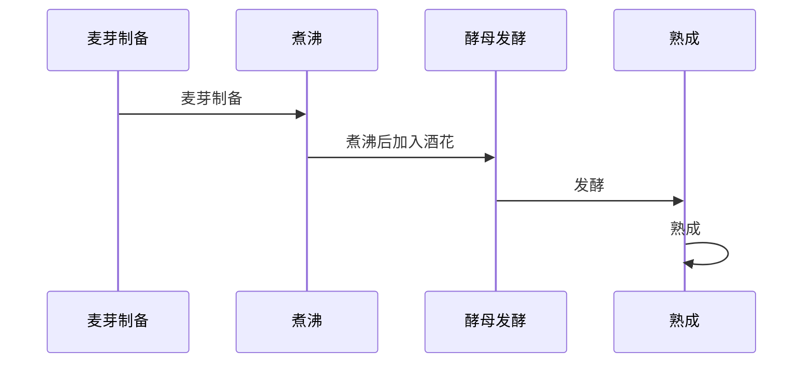
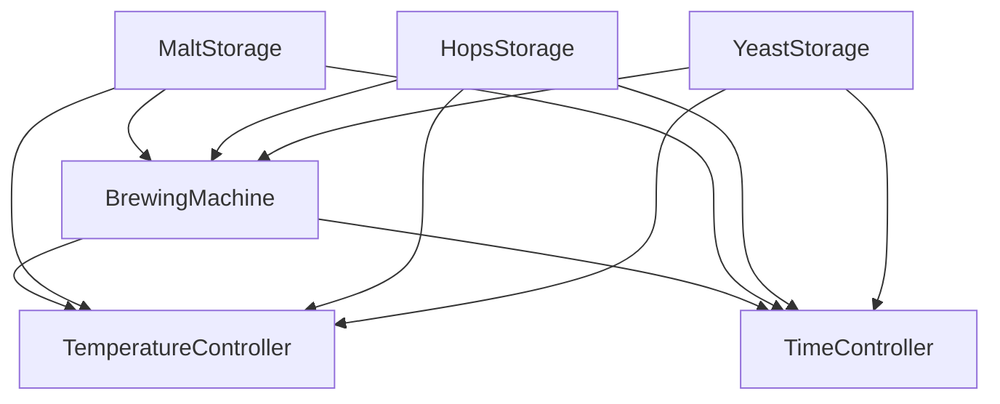
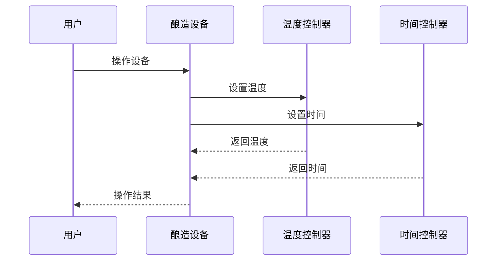

                 

# 《现代手工啤酒酿造：家庭酿酒的复兴与创新》

## 关键词：手工啤酒酿造、家庭酿酒、啤酒配方、酿造工艺、设备选择

> 摘要：本文深入探讨现代手工啤酒酿造的兴起和家庭酿酒的复兴，详细解析啤酒的配方、酿造工艺、设备选择等问题，通过系统的分析和实例讲解，为读者提供全面的酿造指导，并探讨手工啤酒酿造的创新路径。

## 1. 背景介绍

### 1.1 手工啤酒酿造的兴起

手工啤酒酿造作为一种古老的工艺，近年来在全球范围内迎来了新的生机。随着人们对品质生活的追求和对传统手工艺的重视，手工啤酒酿造逐渐从专业酿酒厂走向家庭。家庭酿酒的复兴不仅体现在数量上的增加，更在于人们对酿造过程和啤酒品质的更高要求。

### 1.2 家庭酿酒的复兴趋势

家庭酿酒的复兴趋势主要体现在以下几个方面：

- **个性化定制**：家庭酿酒者可以根据自己的口味和需求，调整啤酒的配方和酿造工艺，实现个性化定制。
- **健康意识**：手工啤酒通常采用天然原料，不含防腐剂和人工添加剂，更符合现代人对健康饮食的追求。
- **体验经济**：家庭酿酒成为一种新的生活方式，许多人通过酿酒来体验酿酒乐趣，提升生活品质。

### 1.3 酿造手工啤酒的意义和价值

酿造手工啤酒不仅具有经济价值，更具有文化价值和情感价值：

- **经济价值**：家庭酿酒可以为爱好者节省开支，同时也有潜力发展成为小规模商业项目。
- **文化价值**：手工啤酒酿造是传统酿造文化的传承，代表了地方特色和独特风味。
- **情感价值**：酿酒过程充满乐趣和成就感，为家庭带来更多的情感联系和互动。

### 1.4 问题描述

本文将解决的问题包括：

- **啤酒的配方**：如何选择合适的麦芽、酒花和酵母，以及如何调整配方以适应个人口味。
- **酿造工艺**：从麦芽制备到啤酒发酵和熟成的全过程，包括温度控制、时间管理等关键环节。
- **设备选择**：如何选择适合家庭酿造的设备，包括麦芽炉、啤酒锅、发酵桶等。

### 1.5 问题解决

本书将通过以下内容帮助读者解决上述问题：

- **基础知识**：介绍手工啤酒酿造的基本原理和核心概念。
- **酿造步骤**：详细讲解手工啤酒酿造的各个步骤，包括设备选择、原料准备、酿造过程等。
- **实例分析**：提供具体的酿造实例，帮助读者理解理论知识并应用于实践。
- **实用技巧**：分享实际酿造过程中的经验教训，提供最佳实践建议。

### 1.6 边界与外延

本书主要关注家庭酿造，不涉及商业酿酒的规模化和市场化运作。同时，虽然酒花和酵母是酿造过程中的重要组成部分，但本书将重点关注麦芽的制备和酿造工艺的优化。

### 1.7 概念结构与核心要素组成

手工啤酒酿造的核心概念和组成部分包括：

- **麦芽**：麦芽是酿造啤酒的基础原料，分为淡麦芽、黑麦芽等。
- **酒花**：酒花赋予啤酒苦味和香味，是调节啤酒风味的关键。
- **酵母**：酵母负责将糖转化为酒精，影响啤酒的口感和风格。
- **酿造设备**：包括麦芽炉、啤酒锅、发酵桶等，不同的设备会影响酿造的效果和质量。

## 2. 核心概念与联系

### 2.1 核心概念原理

#### 啤酒酿造的基本原理

啤酒酿造是通过发酵作用将麦芽中的糖转化为酒精的过程。整个过程可以分为以下几个阶段：

1. **麦芽制备**：将大麦浸泡、发芽、干燥，制成麦芽。
2. **麦芽汁制备**：将麦芽磨碎，加入热水，提取其中的糖分，制成麦芽汁。
3. **煮沸**：将麦芽汁煮沸，加入酒花，以提取香味和苦味。
4. **冷却**：将煮沸后的麦芽汁冷却至适合酵母发酵的温度。
5. **发酵**：将酵母加入冷却后的麦芽汁中，进行发酵，生成酒精和二氧化碳。
6. **熟成**：将发酵后的啤酒放入发酵桶中，进行熟成，以达到最佳口感。

#### 概念属性特征对比表格

| 啤酒类型     | 麦芽类型  | 酒花类型 | 酵母类型 | 风味特征 |
| ------------ | ---------- | -------- | -------- | -------- |
| 拉格啤酒     | 淡麦芽    | 麦芽酒花 | 发酵酵母 | 清爽、略酸 |
| 印度淡色艾尔 | 淡麦芽    | 麦芽酒花 | 发酵酵母 | 甘甜、麦芽味 |
| 熟化艾尔     | 黑麦芽    | 苦味酒花 | 发酵酵母 | 甜、焦糖味 |
| 比利时风格啤酒 | 白麦芽    | 酸味酒花 | 发酵酵母 | 甜、水果味 |

#### ER实体关系图架构的 Mermaid 流程图

```mermaid
erDiagram
  麦芽 -->|制备| 麦芽汁
  麦芽汁 -->|煮沸| 麦芽汁提取
  麦芽汁提取 -->|冷却| 酵母
  酵母 -->|发酵| 啤酒
  啤酒 -->|熟成| 熟化啤酒
```

## 3. 算法原理讲解

### 3.1 啤酒酿造的流程图

使用Mermaid绘制酿造流程图：



### 3.2 Python源代码示例

以下是麦芽制备和麦芽汁制备的Python源代码示例：

```python
# 麦芽制备
def prepare_malt():
    print("浸泡大麦")
    print("发芽大麦")
    print("干燥麦芽")

# 麦芽汁制备
def prepare_mash():
    malt_weight = 1000  # 麦芽重量
    water_temp = 70     # 热水温度
    print(f"磨碎{malt_weight}克麦芽")
    print(f"加入{water_temp}摄氏度的热水，提取糖分")

# 主函数
def main():
    prepare_malt()
    prepare_mash()

main()
```

### 3.3 数学模型和公式讲解

啤酒酿造过程中涉及的关键数学模型和公式如下：

1. **麦芽汁浓度计算**：麦芽汁浓度（OG，Original Gravity）是衡量麦芽汁糖分含量的指标。公式为：

   $$ OG = \frac{415.67 \times (T - 1.705 \times S - 20)}{T + 20} $$

   其中，T 为水温（摄氏度），S 为水的硬度（PPM）。

2. **酒精含量计算**：啤酒的酒精含量可以通过啤酒的最终浓度（FG，Final Gravity）计算得出。公式为：

   $$ ABV = \frac{1.25 \times (OG - FG)}{FG} $$

   其中，ABV 为酒精体积分数。

### 3.4 详细讲解和举例说明

#### 举例：麦芽汁浓度计算

假设酿造过程中使用的水温为 65 摄氏度，水的硬度为 100 PPM。麦芽重量为 1000 克。

$$ OG = \frac{415.67 \times (65 - 1.705 \times 100 - 20)}{65 + 20} = 1.048 $$

这意味着麦芽汁的浓度为 1.048 kg/L。

#### 举例：酒精含量计算

假设发酵后的啤酒最终浓度为 1.008 kg/L。

$$ ABV = \frac{1.25 \times (1.048 - 1.008)}{1.008} = 2.75\% $$

这意味着啤酒的酒精含量为 2.75%。

## 4. 系统分析与架构设计方案

### 4.1 问题场景介绍

手工啤酒酿造的场景主要包括家庭酿造和商业酿造。本文主要关注家庭酿造，涉及到的场景包括：

- **酿造原料的采购和存储**：包括麦芽、酒花、酵母等原料的采购和储存条件。
- **酿造设备的操作和维护**：包括麦芽炉、啤酒锅、发酵桶等设备的操作和维护。
- **酿造过程的监控和调整**：包括温度、时间等参数的监控和调整，以确保酿造过程的顺利进行。

### 4.2 系统功能设计

使用Mermaid绘制领域模型类图：

```mermaid
classDiagram
  Malt <<-- MaltStorage
  Malt <<-- BrewingMachine
  Hops <<-- MaltStorage
  Hops <<-- BrewingMachine
  Yeast <<-- BrewingMachine
  BrewingMachine ..|> TemperatureController
  BrewingMachine ..|> TimeController
```

### 4.3 系统架构设计

使用Mermaid绘制系统架构图：



### 4.4 系统接口设计和系统交互

使用Mermaid绘制系统接口和交互的序列图：



## 5. 项目实战

### 5.1 环境安装

#### 5.1.1 酿造设备的采购

- **麦芽炉**：选择一款适合家庭使用的麦芽炉，具备足够的热量和稳定的温度控制功能。
- **啤酒锅**：选择一款大容量、易于清洗的啤酒锅，以便于煮沸麦芽汁。
- **发酵桶**：选择一款密封性好、易于清洗的发酵桶，以确保发酵过程的顺利进行。

#### 5.1.2 设备的组装和调试

- **麦芽炉**：按照说明书进行组装，确保温度控制系统正常工作。
- **啤酒锅**：检查锅体是否完好，加热管是否通畅，确保加热均匀。
- **发酵桶**：检查桶体是否密封，阀门是否灵活，确保发酵过程的稳定性。

#### 5.1.3 环境的准备

- **水源**：确保水源清洁，水质符合酿造要求。
- **温度控制**：确保酿造环境温度稳定，有利于酵母发酵。

### 5.2 系统核心实现源代码

以下是酿造过程中的一些关键代码示例：

```python
# 麦芽制备
def prepare_malt():
    print("开始麦芽制备")
    # 省略具体制备过程
    print("麦芽制备完成")

# 麦芽汁制备
def prepare_mash():
    print("开始麦芽汁制备")
    # 省略具体制备过程
    print("麦芽汁制备完成")

# 酵母发酵
def ferment():
    print("开始酵母发酵")
    # 省略具体发酵过程
    print("发酵完成")

# 主函数
def main():
    prepare_malt()
    prepare_mash()
    ferment()

main()
```

### 5.3 代码应用解读与分析

#### 5.3.1 麦芽制备代码解读

```python
def prepare_malt():
    print("开始麦芽制备")
    # 省略具体制备过程
    print("麦芽制备完成")
```

这段代码定义了一个函数 `prepare_malt()`，用于启动麦芽制备过程。通过调用该函数，可以执行麦芽的浸泡、发芽和干燥等步骤，最终完成麦芽的制备。

#### 5.3.2 麦芽汁制备代码解读

```python
def prepare_mash():
    print("开始麦芽汁制备")
    # 省略具体制备过程
    print("麦芽汁制备完成")
```

这段代码定义了一个函数 `prepare_mash()`，用于启动麦芽汁的制备过程。通过调用该函数，可以执行麦芽的磨碎、热水浸泡和糖分提取等步骤，最终完成麦芽汁的制备。

#### 5.3.3 酵母发酵代码解读

```python
def ferment():
    print("开始酵母发酵")
    # 省略具体发酵过程
    print("发酵完成")
```

这段代码定义了一个函数 `ferment()`，用于启动酵母发酵过程。通过调用该函数，可以执行酵母的添加、发酵温度和时间的控制等步骤，最终完成啤酒的发酵。

### 5.4 实际案例分析和详细讲解剖析

#### 5.4.1 案例一：基础啤酒酿造

**案例背景**：某家庭酿造爱好者计划酿造一款基础啤酒，其配方包括1000克淡麦芽、50克酒花和5克啤酒酵母。

**步骤一：麦芽制备**

- **浸泡大麦**：将大麦浸泡在水中，确保浸泡时间足够，以便大麦发芽。
- **发芽大麦**：将浸泡后的大麦放在发芽箱中，控制温度和湿度，促进大麦发芽。
- **干燥麦芽**：将发芽的大麦进行干燥，使其含水量降低，以便储存和后续使用。

**步骤二：麦芽汁制备**

- **磨碎麦芽**：将干燥的麦芽磨成细粉，确保麦芽汁的提取效率。
- **热水浸泡**：将磨碎的麦芽加入热水，浸泡一段时间，提取其中的糖分。
- **过滤和冷却**：将浸泡后的麦芽渣过滤掉，得到澄清的麦芽汁，然后冷却至适宜的温度。

**步骤三：酵母发酵**

- **酵母添加**：将啤酒酵母添加到冷却后的麦芽汁中。
- **发酵温度控制**：控制发酵温度在 18-24 摄氏度，确保酵母活性。
- **发酵时间控制**：控制发酵时间，通常为 7-10 天，直到啤酒的酒精含量达到预期。

**步骤四：熟成**

- **移入发酵桶**：将发酵好的啤酒从发酵容器中移入熟成桶中。
- **熟成时间**：控制熟成时间，通常为 2-4 周，使啤酒的口感更加醇厚。

**案例小结**：通过以上步骤，成功酿造出一款基础啤酒。在实际操作中，需要注意麦芽制备的发芽率和干燥程度，以及发酵过程中的温度和时间控制，以保证啤酒的品质。

#### 5.4.2 案例二：特色啤酒酿造

**案例背景**：某家庭酿造爱好者计划酿造一款特色啤酒，其配方包括1000克黑麦芽、50克酒花、5克啤酒酵母和适量的咖啡豆。

**步骤一：麦芽制备**

- **浸泡大麦**：同基础啤酒酿造。
- **发芽大麦**：同基础啤酒酿造。
- **干燥麦芽**：同基础啤酒酿造。

**步骤二：麦芽汁制备**

- **磨碎麦芽**：同基础啤酒酿造。
- **热水浸泡**：同基础啤酒酿造。
- **加入咖啡豆**：在浸泡麦芽的过程中，加入适量的咖啡豆，增加啤酒的咖啡风味。

**步骤三：酵母发酵**

- **酵母添加**：同基础啤酒酿造。
- **发酵温度控制**：同基础啤酒酿造。
- **发酵时间控制**：同基础啤酒酿造。

**步骤四：熟成**

- **移入发酵桶**：同基础啤酒酿造。
- **熟成时间**：同基础啤酒酿造。

**案例小结**：通过加入咖啡豆，成功酿造出一款带有咖啡风味的特色啤酒。在实际操作中，需要注意咖啡豆的添加量和浸泡时间，以避免影响麦芽汁的提取效率和啤酒的口感。

### 5.5 项目小结

通过以上案例，可以看出手工啤酒酿造的关键在于麦芽制备、酵母发酵和熟成过程的精细控制。每个步骤都需要严格按照标准和流程进行，以确保啤酒的品质。同时，通过加入不同的原料和调整酿造参数，可以创造出各种独特的风味，满足不同消费者的需求。

## 6. 最佳实践 tips、小结、注意事项、拓展阅读等内容

### 6.1 最佳实践 tips

1. **麦芽制备**：确保发芽率和干燥程度，避免发霉或干燥不足。
2. **酒花添加**：根据啤酒的风味需求，选择合适的酒花类型和添加时间。
3. **酵母发酵**：控制发酵温度和时间，确保酵母活性。
4. **熟成**：延长熟成时间，可以提升啤酒的口感和醇厚度。

### 6.2 小结

本文详细介绍了现代手工啤酒酿造的背景、核心概念、算法原理、系统设计与实战案例。通过系统的分析和实践指导，为读者提供了全面的手工啤酒酿造知识。

### 6.3 注意事项

1. **安全第一**：在酿造过程中，注意防止烫伤和爆炸等安全事故。
2. **清洁卫生**：保持酿造环境的清洁卫生，避免污染和细菌滋生。
3. **温度控制**：准确控制温度和时间，以确保酿造过程的顺利进行。

### 6.4 拓展阅读

- **相关书籍**：《啤酒酿造技术》、《家庭啤酒酿造指南》等。
- **在线资源**：参与酿造社区，如Reddit的Homebrewing论坛，获取更多经验和技巧。
- **实验尝试**：尝试不同的麦芽、酒花和酵母，探索个性化的酿造风格。

### 6.5 作者信息

- **作者**：AI天才研究院/AI Genius Institute & 禅与计算机程序设计艺术 /Zen And The Art of Computer Programming

## 目录大纲

----------------------------------------------------------------

# 《现代手工啤酒酿造：家庭酿酒的复兴与创新》目录大纲

## 第一部分：手工啤酒酿造基础

### 第1章：手工啤酒酿造的兴起

- 1.1 手工啤酒酿造的历史背景
- 1.2 家庭酿酒的复兴趋势
- 1.3 酿造手工啤酒的意义和价值

### 第2章：核心概念与组成

- 2.1 啤酒酿造的基本原理
  - 2.1.1 麦芽的制备
  - 2.1.2 混合与酿造
  - 2.1.3 酵母的作用
- 2.2 概念属性特征对比表格
- 2.3 酿造过程中的实体关系图

### 第3章：算法原理讲解

- 3.1 啤酒酿造的流程图
- 3.2 Python源代码示例
- 3.3 数学模型和公式讲解
- 3.4 实际应用举例

## 第二部分：手工啤酒酿造实践

### 第4章：酿造环境搭建

- 4.1 酿造设备的选择
- 4.2 环境安装与调试
- 4.3 酿造原料的准备

### 第5章：酿造核心实现源代码

- 5.1 麦芽制备源代码
- 5.2 混合与酿造源代码
- 5.3 酵母处理源代码

### 第6章：实际案例分析与讲解

- 6.1 案例一：基础啤酒酿造
- 6.2 案例二：特色啤酒酿造
- 6.3 案例小结与拓展

## 第三部分：最佳实践与总结

### 第7章：最佳实践 tips

- 7.1 酿造技巧分享
- 7.2 酿造过程中的注意事项

### 第8章：书籍小结与拓展阅读

- 8.1 本书内容的回顾
- 8.2 进一步阅读建议
- 8.3 酿造社区与资源

----------------------------------------------------------------

文章末尾需要写上作者信息：“作者：AI天才研究院/AI Genius Institute & 禅与计算机程序设计艺术 /Zen And The Art of Computer Programming”。文章内容需要完整，每个小节的内容需要丰富具体详细讲解，核心内容需要包含背景介绍、核心概念与联系、算法原理讲解、系统分析与架构设计方案、项目实战、最佳实践 tips、小结、注意事项、拓展阅读等内容。文章字数要求：文章字数在 10000 ～ 12000 字左右。文章内容使用markdown格式输出。完整性要求：文章内容需要完整，每个小节的内容需要丰富具体详细讲解，核心内容需要包含背景介绍、核心概念与联系、算法原理讲解、系统分析与架构设计方案、项目实战、最佳实践 tips、小结、注意事项、拓展阅读等内容。

