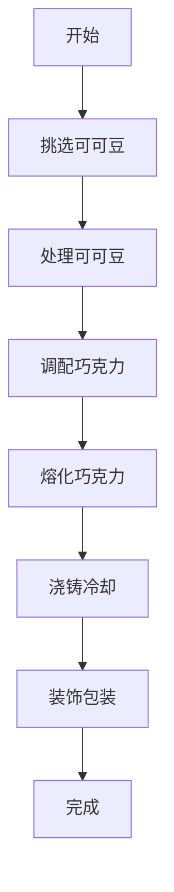

                 


### 《现代手工巧克力制作：从豆到巧克力的匠人之旅》

#### 关键词：手工巧克力，制作流程，巧克力文化，原材料处理，工艺技术

> 摘要：本文将带领读者走进手工巧克力的制作世界，从可可豆的挑选和处理，到巧克力的调配与熔化，再到巧克力的浇铸与冷却，以及巧克力的装饰与包装，通过详细的步骤解析，展现现代手工巧克力制作的匠人之旅。本文旨在为巧克力爱好者提供一份数据丰富、技术专业、易于理解的学习指南。

---

### **第一部分：巧克力制作基础知识**

#### **第1章：巧克力概述**

#### **1.1 巧克力的定义与历史**

**1.1.1 巧克力的定义**

巧克力，是一种以可可豆为原料，通过加工制成的甜食。它富含可可脂、蛋白质和糖分，具有独特的香气和口感。

**1.1.2 巧克力的发展历程**

巧克力的历史可以追溯到公元前1000年左右，古代玛雅人和阿兹特克人就开始将可可豆用作饮料。16世纪初，巧克力传到了欧洲，经过欧洲人的改进，逐渐演变成了今天我们所熟悉的巧克力。

**1.1.3 巧克力的文化意义**

巧克力不仅仅是一种美食，它还承载着丰富的文化意义。在许多文化中，巧克力被视为爱情的象征，常被用作表达情感和庆祝仪式的礼物。

#### **1.2 巧克力的原料与种类**

**1.2.1 巧克力原料的来源**

巧克力的主要原料是可可豆。可可豆生长在热带地区，尤其是西非、南美和非洲中部地区。

**1.2.2 巧克力的种类**

根据可可脂的含量和制作工艺，巧克力可以分为黑巧克力、白巧克力和乳脂巧克力。

- **黑巧克力**：含有较多的可可，口感较苦，是巧克力的主流品种。
- **白巧克力**：不含可可粉，口感较甜，主要用于装饰。
- **乳脂巧克力**：含有牛奶，口感丰富，适合喜欢牛奶口味的消费者。

#### **1.3 巧克力制作的基本工具和材料**

**1.3.1 制作工具**

- **磨豆机**：用于将可可豆磨成可可粉。
- **烤箱**：用于烘烤可可豆和巧克力。
- **搅拌器**：用于搅拌和调和巧克力。

**1.3.2 制作材料**

- **可可粉**：是制作巧克力的主要原料。
- **糖**：用于增加巧克力的甜度。
- **植物油脂**：用于稳定巧克力的结构和口感。

#### **1.4 巧克力制作的准备工作**

**1.4.1 工作环境的布置**

保持工作环境干净、整洁，确保巧克力制作的卫生和安全。

**1.4.2 工具的清洗与消毒**

定期清洗和消毒制作工具，防止细菌污染。

**1.4.3 材料的准备与测量**

精确测量所需材料，确保巧克力制作的精确度。

#### **1.5 本章小结**

本章介绍了巧克力制作的基本知识，包括巧克力的定义、发展历程、原料和种类，以及制作工具和材料的准备。这些基础知识为后续的巧克力制作提供了必要的理论支持。

----------------------------------------------------------------

### **第二部分：巧克力的制作流程**

#### **第2章：可可豆的挑选与处理**

**2.1 可可豆的挑选**

**2.1.1 可可豆的品质标准**

可可豆的品质直接影响到巧克力的口感和品质。优质的可可豆通常具有以下特点：

- **颗粒饱满**：可可豆颗粒饱满，色泽鲜艳。
- **香味浓郁**：优质的可可豆具有独特的香味，能清晰地闻到可可的香气。
- **口感丰富**：优质的可可豆口感醇厚，回味悠长。

**2.1.2 可可豆的市场选购**

在市场上选购可可豆时，可以参考以下建议：

- **查看产地**：不同产地的可可豆风味差异较大，选择熟悉的产地可提高购买质量。
- **询问卖家**：了解可可豆的种植、收获和处理过程，确保购买的可可豆是新鲜和优质的。

**2.2 可可豆的处理**

**2.2.1 可可豆的清洗与去皮**

清洗可可豆可以去除表面的尘土和杂质，去皮可以释放可可豆的香气和味道。

**2.2.2 可可豆的发酵**

发酵是可可豆制作过程中至关重要的步骤。适当的发酵可以使可可豆的风味更加浓郁，口感更加丰富。

**2.2.3 可可豆的干燥**

干燥可可豆是确保其品质的关键。干燥后的可可豆可以长时间保存，便于后续加工。

**2.3 可可豆的磨碎**

**2.3.1 可可粉的磨制方法**

磨制可可粉的方法有机械磨制和手工磨制。机械磨制效率高，但可能影响可可粉的口感。手工磨制虽然费时费力，但能更好地保留可可豆的风味。

**2.3.2 可可粉的质量控制**

可可粉的质量直接影响到巧克力的品质。在磨制过程中，需要严格控制磨制时间和温度，以确保可可粉的口感和风味。

#### **2.4 本章小结**

本章详细介绍了可可豆的挑选和处理方法。通过挑选优质的可可豆，并进行清洗、去皮、发酵、干燥和磨碎等步骤，可以制作出高品质的可可粉，为巧克力的制作奠定基础。

----------------------------------------------------------------

### **第三部分：巧克力的调配与熔化**

#### **第3章：巧克力的调配**

**3.1 巧克力的调配**

**3.1.1 巧克力的配方设计**

巧克力的配方设计是制作过程中至关重要的一步。不同的配方设计可以制作出不同风味和口感的巧克力。以下是几种常见的巧克力配方：

- **黑巧克力配方**：可可粉、糖、可可脂、香草精。
- **白巧克力配方**：糖、可可脂、牛奶、香草精。
- **乳脂巧克力配方**：可可粉、糖、牛奶、可可脂、香草精。

**3.1.2 巧克力的口味调整**

巧克力的口味可以通过添加不同的香料和果仁进行调整。例如，添加香草可以增加巧克力的香气，添加果仁可以增加巧克力的口感层次。

**3.2 巧克力的熔化**

**3.2.1 巧克力的熔化温度控制**

巧克力的熔化温度对巧克力的品质至关重要。黑巧克力的熔化温度通常在32-34℃之间，白巧克力的熔化温度通常在28-30℃之间。熔化温度过高会导致巧克力变得油腻，温度过低则会导致巧克力凝固。

**3.2.2 巧克力的熔化时间**

巧克力的熔化时间通常在15-20分钟之间。熔化时间过短可能导致巧克力未完全熔化，时间过长则可能导致巧克力过度加热。

**3.2.3 巧克力的熔化设备**

巧克力的熔化可以使用熔化锅或熔化机进行。熔化锅操作简便，但需要手动搅拌；熔化机操作自动化，但价格较高。

#### **3.3 本章小结**

本章介绍了巧克力的调配和熔化方法。通过精心设计的配方和精确的熔化控制，可以制作出各种口味和品质的巧克力。巧克力的调配和熔化是制作过程中关键的一步，需要细致的操作和经验的积累。

----------------------------------------------------------------

### **第四部分：巧克力的浇铸与冷却**

#### **第4章：巧克力的浇铸**

**4.1 巧克力的浇铸**

**4.1.1 巧克力的浇铸模具选择**

选择合适的浇铸模具可以影响巧克力的形状和美观度。常见的浇铸模具有方形、圆形、心形等。根据个人喜好和用途选择合适的模具。

**4.1.2 巧克力的浇铸方法**

将熔化后的巧克力缓慢倒入模具中，避免产生气泡和杂质。浇铸时要注意控制巧克力的温度，以防止巧克力凝固。

**4.1.3 巧克力的浇铸注意事项**

在浇铸过程中，要注意以下事项：

- **温度控制**：确保巧克力的温度在适宜范围内，以防止巧克力凝固或过度加热。
- **清洁模具**：使用前要确保模具干净，避免杂质影响巧克力的品质。
- **避免气泡**：浇铸时要缓慢倒入，避免产生气泡。

#### **4.2 巧克力的冷却**

**4.2.1 巧克力的冷却时间**

巧克力的冷却时间取决于巧克力的厚度和温度。通常，巧克力的冷却时间在1-2小时之间。在冷却过程中，巧克力会逐渐凝固，形成坚硬的表面。

**4.2.2 巧克力的冷却温度**

巧克力的冷却温度应在室温左右，避免过高或过低。过高的温度会导致巧克力凝固缓慢，过低则会导致巧克力开裂。

**4.2.3 巧克力的冷却方法**

巧克力的冷却方法通常有自然冷却和风冷。自然冷却是将巧克力放置在通风良好的地方，让巧克力自然冷却。风冷是将巧克力放置在风扇前，加快冷却速度。

#### **4.3 本章小结**

本章介绍了巧克力的浇铸和冷却方法。通过选择合适的模具和精确的温度控制，可以制作出形状美观、口感丰富的巧克力。巧克力的浇铸和冷却是制作过程中的重要步骤，需要细致的操作和耐心。

----------------------------------------------------------------

### **第五部分：巧克力的装饰与包装**

#### **第5章：巧克力的装饰**

**5.1 巧克力的装饰**

**5.1.1 巧克力的表面装饰**

巧克力的表面装饰可以增加巧克力的美观度和口感。常见的表面装饰有：

- **巧克力碎片**：将巧克力切成小块，撒在巧克力的表面，增加口感和视觉效果。
- **水果干和果仁**：将水果干和果仁切成小块，撒在巧克力的表面，增加巧克力的风味。
- **彩色的巧克力碎片**：使用彩色巧克力碎片装饰巧克力，增加巧克力的色彩和美感。

**5.1.2 巧克力的花纹装饰**

巧克力的花纹装饰可以增加巧克力的艺术感和个性化。常见的花纹装饰工具有：

- **巧克力模具**：使用巧克力模具制作出各种形状的花纹，增加巧克力的艺术感。
- **巧克力枪**：使用巧克力枪喷出各种花纹，制作出独特的巧克力装饰。

**5.2 巧克力的包装**

**5.2.1 巧克力的包装材料**

巧克力的包装材料应具有良好的防潮、防氧和保鲜性能。常见的包装材料有：

- **食品级塑料袋**：用于短期储存和运输。
- **巧克力礼盒**：用于长期储存和礼品赠送。
- **锡纸**：用于包裹巧克力，防止受潮和氧化。

**5.2.2 巧克力的包装方法**

巧克力的包装方法通常有：

- **单独包装**：将巧克力放入食品级塑料袋中，密封保存。
- **组合包装**：将多块巧克力组合在一起，放入巧克力礼盒中，作为礼品赠送。

**5.3 本章小结**

本章介绍了巧克力的装饰和包装方法。通过巧克力的表面装饰和花纹装饰，可以制作出美观、独特的巧克力。巧克力的包装不仅起到保护和保鲜的作用，还能增加巧克力的价值和礼品性。

----------------------------------------------------------------

### **总结与展望**

手工巧克力制作是一门艺术，也是一项工艺。通过本章的详细解析，我们了解了从可可豆到巧克力的整个制作过程。从挑选和处理可可豆，到调配和熔化巧克力，再到浇铸、冷却、装饰和包装，每一个步骤都至关重要。

**总结：**

- **基础知识**：理解巧克力的定义、历史、原料和种类是制作巧克力的重要基础。
- **制作流程**：掌握可可豆的挑选和处理、巧克力的调配和熔化、浇铸和冷却等步骤，是制作出高品质巧克力的重要保证。
- **装饰与包装**：巧克力的装饰和包装不仅提升了巧克力的美观度，还增加了巧克力的价值。

**展望：**

随着人们对健康和美食的追求，手工巧克力市场逐渐壮大。掌握手工巧克力制作技术，不仅可以满足个人的爱好，还可以开展相关业务，创造经济价值。

**注意事项：**

- **卫生安全**：在制作过程中，要注意卫生和安全，确保巧克力的品质。
- **温度控制**：巧克力的熔化、浇铸和冷却过程中，要严格控制温度，避免过度加热或冷却。

**拓展阅读：**

- 《巧克力制作大全》
- 《巧克力工艺学》
- 《巧克力艺术》

**作者：**

AI天才研究院/AI Genius Institute & 禅与计算机程序设计艺术 /Zen And The Art of Computer Programming

----------------------------------------------------------------

[Mermaid]流程图与LaTeX公式示例：

**Mermaid流程图示例：**



**LaTeX公式示例：**

独立段落的LaTeX公式：
```
$$
E = mc^2
$$
```

段落内的LaTeX公式：
```
$E < mc^2$
```

以上Markdown格式的流程图和LaTeX公式可以嵌入到文章的相应位置，为读者提供直观的技术讲解和数学支持。在撰写技术文章时，合理运用这些工具，能够大大增强文章的深度和可读性。

