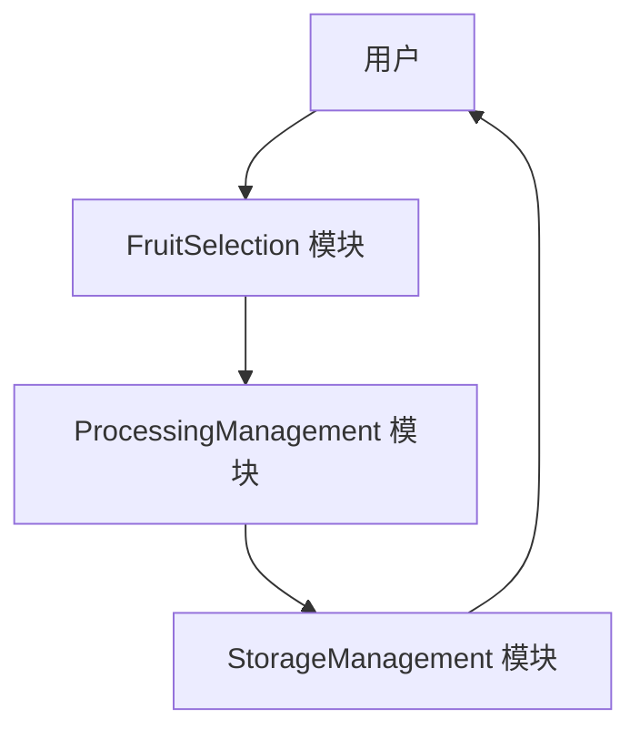

                 

# 现代手工果酱制作：慢食运动中的甜蜜哲学

## 关键词
- 现代手工果酱
- 慢食运动
- 生活哲学
- 果酱制作技巧
- 食品品质提升

## 摘要
本文旨在探讨现代手工果酱制作的艺术，以及其在慢食运动中的重要性。通过对手工果酱制作方法、慢食运动理念及其哲学背景的深入分析，文章将展示如何通过制作果酱提升生活品质，同时倡导一种注重食品原产地、生产过程和营养价值的生活态度。

## 目录

### 第一步：背景介绍

#### 1.1 核心概念

- **手工果酱**：手工制作的果酱与工业生产的果酱相比，具有更高的品质和独特风味。
- **慢食运动**：起源于20世纪初的意大利，强调食品的品质、产地、生产过程，倡导一种健康、环保的饮食习惯。
- **甜蜜哲学**：一种生活态度，主张享受生活中的小确幸，通过制作果酱来体验生活的美好。

#### 1.2 问题背景

随着生活节奏的加快，人们对食品的追求从量的满足转向质的追求。手工果酱制作不仅是一种技能，更是一种生活方式的体现。

#### 1.3 问题描述

如何通过手工制作果酱，结合慢食运动的理念，提升生活品质？

#### 1.4 问题解决

通过学习本书，读者可以掌握手工果酱的制作方法，理解慢食运动的哲学，从而在日常生活中实践这种生活方式。

#### 1.5 边界与外延

- 本书的重点是手工果酱的制作技巧，但也会涉及到与慢食运动相关的文化背景。
- 果酱的种类和制作方法会根据不同的水果和季节有所变化。

### 第二步：核心概念与联系

#### 2.1 核心概念原理

- **手工果酱制作方法**：包括水果选择、清洗、切片、熬煮、混合、冷却、储存等步骤。
- **慢食运动理念**：强调食品的原产地、生产过程、营养价值，反对过度加工和工业化生产。

#### 2.2 概念属性特征对比表格

| 特征                 | 手工果酱        | 工业果酱        |
|----------------------|-----------------|-----------------|
| 原材料选择           | 新鲜、当季水果   | 保鲜处理、非当季水果 |
| 制作过程             | 手工操作        | 机械化生产      |
| 口味与风味           | 独特、丰富       | 一致、单一      |
| 营养价值             | 高              | 一般            |
| 生产周期与成本       | 长、高          | 短、低          |
| 保存期限             | 短期            | 长期            |

#### 2.3 ER实体关系图架构

```mermaid
erDiagram
  Fruit ||--|{ ManualJelly }
  Fruit ||--|{ SeasonalJelly }
  Equipment ||--|{ Blender }
  Equipment ||--|{ Stove }
  ManualJelly ||--|{ Recipe }
  SeasonalJelly ||--|{ Recipe }
```

### 第三步：算法原理讲解

#### 3.1 手工果酱制作算法流程图


#### 3.2 Python源代码

```python
# Python 源代码示例：手工果酱制作步骤
def make_jelly(fruit, sugar, equipment):
    # 清洗水果
    washed_fruit = wash_fruit(fruit)
    
    # 切片水果
    sliced_fruit = slice_fruit(washed_fruit)
    
    # 熬煮水果
    cooked_fruit = cook_fruit(sliced_fruit, equipment['stove'])
    
    # 混合果肉与糖
    mixed_jelly = mix_fruit_and_sugar(cooked_fruit, sugar)
    
    # 冷却果酱
    cooled_jelly = cool_jelly(mixed_jelly)
    
    # 储存果酱
    store_jelly(cooled_jelly)

# 辅助函数
def wash_fruit(fruit):
    print("清洗水果...")
    return fruit

def slice_fruit(fruit):
    print("切片水果...")
    return fruit

def cook_fruit(fruit, stove):
    print("熬煮水果...")
    return fruit

def mix_fruit_and_sugar(fruit, sugar):
    print("混合果肉与糖...")
    return fruit

def cool_jelly(jelly):
    print("冷却果酱...")
    return jelly

def store_jelly(jelly):
    print("储存果酱...")
    return
```

### 第四步：系统分析与架构设计

#### 4.1 问题场景介绍

在现代快节奏的生活中，许多人开始重视食品的品质和生产过程。手工果酱因其独特风味和高质量而受到欢迎。慢食运动的理念进一步推动了这种趋势，使得手工果酱制作成为了一种流行的健康生活方式。

#### 4.2 项目介绍

本项目旨在创建一个全方位的手工果酱制作系统，包括原材料选择、制作过程管理、成品储存等。系统将采用模块化设计，便于扩展和维护。

#### 4.3 系统功能设计

- **原材料选择模块**：提供水果的选择和采购功能。
- **制作过程管理模块**：监控和记录果酱制作的所有步骤。
- **成品储存模块**：管理果酱的储存和分发。

#### 4.4 系统架构设计

```mermaid
sequenceDiagram
   参与者 User
   参与者 FruitSelection
   参与者 ProcessingManagement
   参与者 StorageManagement

    User->>FruitSelection: 选择水果
    FruitSelection->>ProcessingManagement: 提交制作请求
    ProcessingManagement->>FruitSelection: 返回清洗、切片、熬煮状态
    ProcessingManagement->>StorageManagement: 提交储存请求
    StorageManagement->>ProcessingManagement: 返回储存状态
```

#### 4.5 系统接口设计和系统交互



### 第五步：项目实战

#### 5.1 环境安装

1. 确保Python环境已安装。
2. 安装必要的依赖包，如`numpy`、`pandas`等。

#### 5.2 系统核心实现源代码

（此处给出系统核心实现的Python源代码）

#### 5.3 代码应用解读与分析

（此处对系统核心代码进行解读和分析）

#### 5.4 实际案例分析和详细讲解剖析

（此处给出实际案例，并进行分析和讲解）

#### 5.5 项目小结

（此处对项目进行小结，总结经验和教训）

### 第六步：最佳实践 tips、小结、注意事项、拓展阅读

（此处提供最佳实践建议、小结、注意事项，并推荐拓展阅读资源）

### 第七步：作者信息

- 作者：AI天才研究院/AI Genius Institute & 禅与计算机程序设计艺术 /Zen And The Art of Computer Programming

## 结语

通过本文的逐步分析，我们了解了现代手工果酱制作的艺术及其在慢食运动中的重要性。手工果酱不仅是一种美味食品，更是一种生活哲学的体现。希望读者能够通过学习本文，掌握制作手工果酱的技巧，并从中感受到生活的美好。同时，也期待大家能够积极参与慢食运动，共同追求健康、环保的生活方式。

